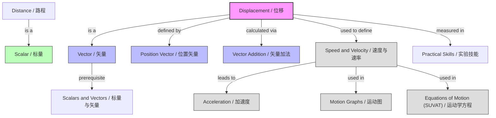

---
# Displacement and Distance / 位移与路程

---

# 1. Overview / 概述

**English:**
This sub-topic introduces the fundamental distinction between **distance** and **displacement** — two of the most important concepts in kinematics. Distance is a scalar quantity that measures the total path length traveled, while displacement is a vector quantity that measures the straight-line change in position from start to finish, including direction. Understanding this difference is essential for all subsequent work in [[Displacement, Velocity and Acceleration]], including [[Speed and Velocity]], [[Acceleration]], and [[Equations of Motion (SUVAT)]]. This sub-topic builds directly on the prerequisite concept of [[Scalars and Vectors]].

**中文:**
本子知识点介绍运动学中最基本的概念之一——**路程**与**位移**的区别。路程是标量，测量物体运动路径的总长度；位移是矢量，测量物体从起点到终点的直线位置变化，包括方向。理解这一区别对于后续学习[[Displacement, Velocity and Acceleration]]中的[[Speed and Velocity]]、[[Acceleration]]以及[[Equations of Motion (SUVAT)]]至关重要。本子知识点直接建立在[[Scalars and Vectors]]的基础上。

---

# 2. Syllabus Learning Objectives / 考纲学习目标

| CAIE 9702 (3.1 d-f) | Edexcel IAL (WPH11 U1: 1.4-1.8) |
|-----------|-------------|
| Define and distinguish between distance and displacement | Understand the difference between scalar and vector quantities, including distance and displacement |
| Use vector addition to find resultant displacement | Use vector addition to determine the resultant displacement of an object |
| Solve problems involving displacement in one and two dimensions | Solve problems involving displacement in one and two dimensions |

**Examiner Expectations / 考官期望:**
- **English:** You must be able to clearly state whether a quantity is scalar or vector, calculate displacement from position vectors, and use vector addition (including Pythagoras and trigonometry) to find resultant displacement.
- **中文:** 你必须能够清楚说明一个量是标量还是矢量，从位置矢量计算位移，并使用矢量加法（包括勾股定理和三角函数）求合位移。

---

# 3. Core Definitions / 核心定义

| Term (EN/CN) | Definition (EN) | Definition (CN) | Common Mistakes / 常见错误 |
|--------------|-----------------|-----------------|---------------------------|
| **Distance** / 路程 | The total length of the path traveled by an object, irrespective of direction. A scalar quantity. | 物体运动路径的总长度，与方向无关。标量。 | ❌ Confusing distance with displacement when direction matters. |
| **Displacement** / 位移 | The straight-line distance from the starting point to the finishing point, in a specified direction. A vector quantity. | 从起点到终点的直线距离，并指明方向。矢量。 | ❌ Forgetting to state the direction; giving only magnitude. |
| **Position Vector** / 位置矢量 | A vector that specifies the location of a point relative to a fixed origin. | 相对于固定原点确定一点位置的矢量。 | ❌ Confusing position with displacement. |
| **Resultant Displacement** / 合位移 | The single displacement that has the same effect as two or more successive displacements. | 与两个或多个连续位移具有相同效果的单一位移。 | ❌ Adding magnitudes directly without considering direction. |
| **Scalar** / 标量 | A physical quantity that has magnitude only, with no direction. | 只有大小、没有方向的物理量。 | ❌ Treating a vector as a scalar. |
| **Vector** / 矢量 | A physical quantity that has both magnitude and direction. | 既有大小又有方向的物理量。 | ❌ Forgetting to specify direction in the answer. |

---

# 4. Key Concepts Explained / 关键概念详解

## 4.1 Distance vs. Displacement / 路程与位移

### Explanation / 解释
**English:**
Imagine a student walking from their classroom (point A) to the library (point B) via a winding corridor. The **distance** is the total length of the corridor they walked — say 200 m. The **displacement**, however, is the straight-line distance from A to B — say 80 m due east. The displacement is a vector; it has both magnitude (80 m) and direction (east). The distance is a scalar; it has only magnitude (200 m). This distinction is crucial because [[Speed and Velocity]] are defined using distance and displacement respectively. For more on vector vs. scalar, see [[Scalars and Vectors]].

**中文:**
想象一名学生从教室（A点）沿着弯曲的走廊走到图书馆（B点）。**路程**是他们走过的走廊总长度——比如200米。而**位移**是从A到B的直线距离——比如80米，方向朝东。位移是矢量，既有大小（80米）又有方向（东）。路程是标量，只有大小（200米）。这一区别至关重要，因为[[Speed and Velocity]]分别基于路程和位移定义。关于矢量与标量的更多内容，请参见[[Scalars and Vectors]]。

### Physical Meaning / 物理意义
**English:**
- **Distance** tells you "how much ground was covered" — useful for fuel consumption, wear and tear.
- **Displacement** tells you "how far and in what direction you ended up from where you started" — essential for determining final position, velocity, and work done.

**中文:**
- **路程**告诉你“覆盖了多少地面”——用于油耗、磨损等。
- **位移**告诉你“从起点到终点有多远、方向如何”——对于确定最终位置、速度和做功至关重要。

### Common Misconceptions / 常见误区
- ❌ **"Distance and displacement are the same thing."** — They are only equal if the path is a straight line in one direction.
- ❌ **"Displacement is always positive."** — Displacement can be negative depending on the chosen direction (e.g., moving left relative to a positive right direction).
- ❌ **"Distance has direction."** — Distance is a scalar; it has no direction.

### Exam Tips / 考试提示
- ✅ **Always state the direction** when giving displacement (e.g., "50 m north" not just "50 m").
- ✅ **Use a sign convention** (e.g., east = positive, west = negative) for one-dimensional problems.
- ✅ **Draw a diagram** for two-dimensional displacement problems — it helps visualize vector addition.

> 📷 **IMAGE PROMPT — DIA-01: Distance vs. Displacement Diagram**
> A simple diagram showing a curved path (distance) from point A to point B, with a straight arrow (displacement) directly from A to B. Label the curved path "Distance = 200 m" and the straight arrow "Displacement = 80 m East". Include a compass rose for direction.

---

## 4.2 Position Vectors and Displacement / 位置矢量与位移

### Explanation / 解释
**English:**
The **position vector** $\vec{r}$ of a point describes its location relative to a fixed origin O. If an object moves from point A (position $\vec{r}_A$) to point B (position $\vec{r}_B$), the **displacement** $\vec{s}$ is given by:
$$ \vec{s} = \vec{r}_B - \vec{r}_A $$
This is a vector subtraction. The magnitude of $\vec{s}$ is the straight-line distance between A and B; its direction is from A to B.

**中文:**
一点的**位置矢量** $\vec{r}$ 描述其相对于固定原点O的位置。如果物体从A点（位置 $\vec{r}_A$）运动到B点（位置 $\vec{r}_B$），则**位移** $\vec{s}$ 为：
$$ \vec{s} = \vec{r}_B - \vec{r}_A $$
这是矢量减法。$\vec{s}$ 的大小是A和B之间的直线距离；其方向从A指向B。

### Physical Meaning / 物理意义
**English:**
Position vectors tell you *where* something is; displacement tells you *how it moved*. This is the foundation for defining [[Velocity]] as the rate of change of displacement.

**中文:**
位置矢量告诉你物体*在哪里*；位移告诉你它*如何运动*。这是将[[Velocity]]定义为位移变化率的基础。

### Common Misconceptions / 常见误区
- ❌ **"Displacement equals final position minus initial position only if the path is straight."** — No, this is always true regardless of the path taken.
- ❌ **"Position and displacement are the same."** — Position is a location; displacement is a change in location.

### Exam Tips / 考试提示
- ✅ **Use vector notation** (e.g., $\vec{r}$ or bold $\mathbf{r}$) in your working.
- ✅ **For 2D problems**, express position vectors in component form: $\vec{r} = x\hat{i} + y\hat{j}$.

---

## 4.3 Vector Addition of Displacements / 位移的矢量加法

### Explanation / 解释
**English:**
When an object undergoes two or more successive displacements, the **resultant displacement** is the vector sum. For example, if a hiker walks 3 km east then 4 km north, the resultant displacement is found by adding the two displacement vectors:
- **Graphically:** Draw the vectors head-to-tail. The resultant is the vector from the tail of the first to the head of the last.
- **Mathematically:** Use Pythagoras for magnitude and trigonometry for direction.
$$ \text{Magnitude: } s = \sqrt{3^2 + 4^2} = 5 \text{ km} $$
$$ \text{Direction: } \theta = \tan^{-1}\left(\frac{4}{3}\right) = 53.1^\circ \text{ north of east} $$

**中文:**
当物体经历两个或多个连续位移时，**合位移**是它们的矢量和。例如，如果一名徒步者向东走3公里，然后向北走4公里，则合位移通过将两个位移矢量相加得到：
- **图解法：** 将矢量首尾相连。合矢量是从第一个矢量的尾端指向最后一个矢量的头端。
- **数学法：** 使用勾股定理求大小，使用三角函数求方向。
$$ \text{大小：} s = \sqrt{3^2 + 4^2} = 5 \text{ km} $$
$$ \text{方向：} \theta = \tan^{-1}\left(\frac{4}{3}\right) = 53.1^\circ \text{ 北偏东} $$

### Physical Meaning / 物理意义
**English:**
Vector addition of displacements reflects the fact that the net effect of multiple movements is equivalent to a single straight-line movement from start to finish. This principle extends to all vector quantities in physics, including [[Velocity]] and [[Acceleration]].

**中文:**
位移的矢量加法反映了这样一个事实：多次运动的净效果等同于从起点到终点的单一直线运动。这一原理适用于物理学中所有矢量量，包括[[Velocity]]和[[Acceleration]]。

### Common Misconceptions / 常见误区
- ❌ **"Just add the magnitudes: 3 + 4 = 7 km."** — This is wrong because displacement vectors are not collinear.
- ❌ **"The direction is always north of east."** — The direction depends on the specific vectors; always calculate using trigonometry.

### Exam Tips / 考试提示
- ✅ **Always draw a vector diagram** for 2D problems — it helps avoid mistakes.
- ✅ **Use Pythagoras** only when the vectors are perpendicular.
- ✅ **State the direction clearly** (e.g., "53.1° north of east" or "bearing 053°").

> 📷 **IMAGE PROMPT — DIA-02: Vector Addition of Displacements**
> A diagram showing two displacement vectors: one horizontal arrow labeled "3 km East" and one vertical arrow labeled "4 km North" placed head-to-tail. A dashed arrow from the start to the end is labeled "Resultant displacement = 5 km at 53.1° north of east". Include a right-angle triangle with labels.

---

# 5. Essential Equations / 核心公式

## 5.1 Displacement from Position Vectors / 由位置矢量求位移

$$ \vec{s} = \vec{r}_B - \vec{r}_A $$

| Symbol (符号) | Meaning (EN) | Meaning (CN) | Unit (单位) |
|--------------|-------------|-------------|------------|
| $\vec{s}$ | Displacement vector | 位移矢量 | m |
| $\vec{r}_B$ | Final position vector | 最终位置矢量 | m |
| $\vec{r}_A$ | Initial position vector | 初始位置矢量 | m |

**Derivation / 推导:** This is the definition of displacement as the change in position.
**Conditions / 适用条件:** Always true for any motion.
**Limitations / 局限性:** None — this is a fundamental definition.

---

## 5.2 Resultant Displacement (2D, Perpendicular) / 合位移（二维，垂直）

$$ s = \sqrt{s_x^2 + s_y^2} $$

$$ \theta = \tan^{-1}\left(\frac{s_y}{s_x}\right) $$

| Symbol (符号) | Meaning (EN) | Meaning (CN) | Unit (单位) |
|--------------|-------------|-------------|------------|
| $s$ | Magnitude of resultant displacement | 合位移的大小 | m |
| $s_x$ | Displacement in x-direction | x方向位移 | m |
| $s_y$ | Displacement in y-direction | y方向位移 | m |
| $\theta$ | Direction angle (relative to x-axis) | 方向角（相对于x轴） | ° or rad |

**Derivation / 推导:** From Pythagoras' theorem and trigonometry.
**Conditions / 适用条件:** Only when the two displacement components are perpendicular.
**Limitations / 局限性:** For non-perpendicular vectors, use the cosine rule or component addition.

> 📋 **CIE Only:** CIE often asks for displacement in terms of magnitude and direction (e.g., "5.0 m at 30° to the horizontal").
> 📋 **Edexcel Only:** Edexcel may use bearing notation (e.g., "5.0 m on a bearing of 060°").

---

# 6. Graphs and Relationships / 图表与关系

## 6.1 Position-Time Graph / 位置-时间图

### Axes / 坐标轴
- **x-axis:** Time / 时间 (t / s)
- **y-axis:** Position / 位置 (x / m)

### Shape / 形状
- **Stationary object:** Horizontal line (position constant).
- **Constant velocity:** Straight line with constant slope.
- **Accelerating object:** Curved line.

### Gradient Meaning / 斜率含义
- The gradient of a position-time graph gives the **velocity** (rate of change of displacement).

### Area Meaning / 面积含义
- The area under a position-time graph has **no physical meaning**.

### Exam Interpretation / 考试解读
- **English:** The change in position (vertical difference between two points) gives the displacement over that time interval. The total path length (distance) cannot be read directly from a position-time graph if the object changes direction — you must sum the absolute changes in position.
- **中文:** 位置的变化（两点之间的垂直差）给出该时间间隔内的位移。如果物体改变方向，则无法直接从位置-时间图中读取总路径长度（路程）——你必须对位置变化的绝对值求和。

> 📷 **IMAGE PROMPT — GRAPH-01: Position-Time Graph**
> A position-time graph showing an object moving forward (positive slope), then stationary (horizontal), then moving backward (negative slope). Label the vertical difference between start and end as "Displacement" and the total path length as "Distance = sum of absolute changes".

---

# 7. Required Diagrams / 必备图表

## 7.1 Distance vs. Displacement Illustration / 路程与位移示意图

### Description / 描述
**English:** A diagram showing a curved path (distance) and a straight arrow (displacement) between two points A and B. This visually demonstrates the key difference between the two quantities.

**中文:** 显示两点A和B之间弯曲路径（路程）和直线箭头（位移）的示意图。直观展示两个量之间的关键区别。

### Image Prompt / 图片生成提示
> 📷 **IMAGE PROMPT — DIA-01: Distance vs. Displacement**
> A clear educational diagram for A-Level physics. Point A (start) and Point B (end) are marked. A winding, dashed line connects A to B, labeled "Distance = 200 m". A straight, solid arrow with a bold head connects A to B, labeled "Displacement = 80 m East". A compass rose in the corner shows North, South, East, West. Clean, minimal style with a white background. Suitable for a textbook.

### Labels Required / 需要标注
- Point A (起点)
- Point B (终点)
- Curved path: "Distance = 200 m" (路程 = 200 米)
- Straight arrow: "Displacement = 80 m East" (位移 = 80 米 向东)
- Compass rose (方向标)

### Exam Importance / 考试重要性
- **English:** This diagram is frequently used in exam questions to test the conceptual understanding of distance vs. displacement.
- **中文:** 该图常用于考试题中，测试对路程与位移的概念理解。

---

## 7.2 Vector Addition Diagram / 矢量加法图

### Description / 描述
**English:** A head-to-tail vector addition diagram showing two perpendicular displacements and their resultant.

**中文:** 首尾相连的矢量加法图，显示两个垂直位移及其合位移。

### Image Prompt / 图片生成提示
> 📷 **IMAGE PROMPT — DIA-02: Vector Addition of Displacements**
> A diagram for A-Level physics showing vector addition. A horizontal arrow of length 3 units labeled "3 km East" starts at origin O. From its head, a vertical arrow of length 4 units labeled "4 km North" extends upward. A dashed arrow from O to the head of the vertical arrow is labeled "Resultant = 5 km at 53.1° N of E". A right-angle triangle is faintly drawn. Clean, white background.

### Labels Required / 需要标注
- 3 km East (3 公里 向东)
- 4 km North (4 公里 向北)
- Resultant = 5 km at 53.1° N of E (合位移 = 5 公里，北偏东 53.1°)
- Angle θ (角度 θ)

### Exam Importance / 考试重要性
- **English:** Essential for solving 2D displacement problems. Many exam questions require you to draw or interpret such a diagram.
- **中文:** 解决二维位移问题所必需。许多考试题要求你绘制或解读此类图。

---

# 8. Worked Examples / 典型例题

## Example 1: Distance vs. Displacement in One Dimension / 一维路程与位移

### Question / 题目
**English:**
A car drives 5 km east, then 3 km west. What is (a) the total distance traveled, and (b) the displacement of the car from its starting point?

**中文:**
一辆汽车向东行驶5公里，然后向西行驶3公里。求：(a) 总路程，(b) 汽车相对于起点的位移。

### Solution / 解答
**Step 1: Calculate distance.**
Distance is the total path length:
$$ \text{Distance} = 5 \text{ km} + 3 \text{ km} = 8 \text{ km} $$

**Step 2: Calculate displacement.**
Choose east as positive direction.
Displacement = final position − initial position.
$$ \vec{s} = (+5 \text{ km}) + (-3 \text{ km}) = +2 \text{ km} $$
So displacement is 2 km east.

### Final Answer / 最终答案
**Answer:** (a) 8 km, (b) 2 km east | **答案：** (a) 8 公里, (b) 2 公里 向东

### Quick Tip / 提示
- **English:** For one-dimensional problems, always choose a sign convention (e.g., east = +, west = −) and stick to it.
- **中文:** 对于一维问题，始终选择一个符号约定（例如，东 = +，西 = −）并保持一致。

---

## Example 2: Resultant Displacement in Two Dimensions / 二维合位移

### Question / 题目
**English:**
A hiker walks 4.0 km north, then 3.0 km east. Calculate the magnitude and direction of the resultant displacement.

**中文:**
一名徒步者向北走4.0公里，然后向东走3.0公里。计算合位移的大小和方向。

### Solution / 解答
**Step 1: Draw a vector diagram.**
Draw a vertical arrow (4.0 km north) and from its head a horizontal arrow (3.0 km east). The resultant is the arrow from start to finish.

**Step 2: Calculate magnitude using Pythagoras.**
$$ s = \sqrt{(4.0)^2 + (3.0)^2} = \sqrt{16 + 9} = \sqrt{25} = 5.0 \text{ km} $$

**Step 3: Calculate direction using trigonometry.**
$$ \theta = \tan^{-1}\left(\frac{\text{east}}{\text{north}}\right) = \tan^{-1}\left(\frac{3.0}{4.0}\right) = \tan^{-1}(0.75) = 36.9^\circ $$
The direction is 36.9° east of north (or bearing 036.9°).

### Final Answer / 最终答案
**Answer:** 5.0 km at 36.9° east of north | **答案：** 5.0 公里，北偏东 36.9°

### Quick Tip / 提示
- **English:** Always state the direction clearly. "36.9° east of north" is different from "36.9° north of east".
- **中文:** 始终清楚说明方向。"北偏东36.9°"与"东偏北36.9°"不同。

---

# 9. Past Paper Question Types / 历年真题题型

| Question Type / 题型 | Frequency / 频率 | Difficulty / 难度 | Past Paper References / 真题索引 |
|----------------------|------------------|------------------|-------------------------------|
| Distinguish distance vs. displacement in a given scenario | High | Easy | 📝 *待填入* |
| Calculate resultant displacement from two perpendicular vectors | High | Medium | 📝 *待填入* |
| Interpret position-time graph to find displacement | Medium | Medium | 📝 *待填入* |
| Vector addition of non-perpendicular displacements | Low | Hard | 📝 *待填入* |

**Common Command Words / 常见指令词:**
- **English:** "State", "Calculate", "Determine", "Find", "Sketch", "Explain the difference between"
- **中文:** "说明"、"计算"、"确定"、"求"、"画出"、"解释...之间的区别"

---

# 10. Practical Skills Connections / 实验技能链接

**English:**
This sub-topic connects to practical work in the following ways:
- **Measuring displacement:** Using a ruler, tape measure, or motion sensor to measure the straight-line distance between two points.
- **Uncertainties:** When measuring displacement, the uncertainty depends on the instrument used (e.g., ±1 mm for a ruler, ±0.1 m for a tape measure).
- **Vector addition in experiments:** In force tables or vector addition experiments, displacements are used to represent forces (scaled).
- **Graph plotting:** Plotting position against time and interpreting the graph to find displacement.
- **Experimental design:** Designing an experiment to measure the displacement of a moving object (e.g., a trolley on a track).

**中文:**
本子知识点与实验考试的联系如下：
- **测量位移：** 使用尺子、卷尺或运动传感器测量两点之间的直线距离。
- **不确定度：** 测量位移时，不确定度取决于所用仪器（例如，尺子为±1 mm，卷尺为±0.1 m）。
- **实验中的矢量加法：** 在力台或矢量加法实验中，位移用于表示力（按比例缩放）。
- **绘图：** 绘制位置随时间变化的图，并解读以找到位移。
- **实验设计：** 设计实验测量运动物体（例如轨道上的小车）的位移。

---

# 11. Concept Map / 概念图谱

---

# 12. Quick Revision Sheet / 速查表

| Category / 类别 | Key Points / 要点 |
|----------------|------------------|
| **Definition / 定义** | **Distance:** Total path length (scalar). **Displacement:** Straight-line change in position with direction (vector). |
| **Key Formula / 核心公式** | $\vec{s} = \vec{r}_B - \vec{r}_A$; For perpendicular vectors: $s = \sqrt{s_x^2 + s_y^2}$, $\theta = \tan^{-1}(s_y/s_x)$ |
| **Key Graph / 核心图表** | Position-time graph: vertical difference = displacement; gradient = velocity |
| **Common Mistake / 常见错误** | ❌ Adding displacement magnitudes directly without considering direction. ❌ Forgetting to state direction for displacement. |
| **Exam Tip / 考试提示** | ✅ Always draw a vector diagram for 2D problems. ✅ Use a sign convention for 1D problems. ✅ State direction clearly (e.g., "30° north of east"). |
| **Practical Link / 实验联系** | Measure displacement with ruler/tape measure; account for uncertainty; use vector addition in force experiments. |

---

> **Parent Hub:** [[Displacement, Velocity and Acceleration]]
> **Sibling Sub-topics:** [[Speed and Velocity]], [[Acceleration]], [[Terminal Velocity]]
> **Prerequisites:** [[Scalars and Vectors]]
> **Related Topics:** [[Motion Graphs]], [[Equations of Motion (SUVAT)]]