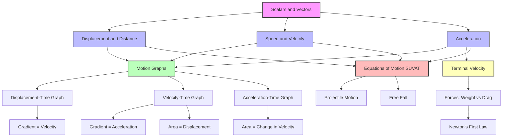

# 1. Overview / 概述

**English:** This topic forms the absolute foundation of [[Kinematics]] — the study of motion without considering forces. Understanding [[displacement]], [[velocity]], and [[acceleration]] is essential for all subsequent mechanics topics including [[Equations of Motion (SUVAT)]], [[Projectile Motion]], and [[Newton's Laws of Motion]]. In both CAIE 9702 and Edexcel IAL, this is typically the first mechanics topic taught at AS Level. Real-world applications include vehicle motion analysis, sports science (tracking athletes), roller coaster design, and any system involving moving objects. These concepts are the language used to describe how objects move through space and time.

**中文:** 本主题是[[运动学]]的绝对基础——研究不考虑力的运动。理解[[位移]]、[[速度]]和[[加速度]]对于后续所有力学主题（包括[[运动方程（SUVAT）]]、[[抛体运动]]和[[牛顿运动定律]]）至关重要。在CAIE 9702和Edexcel IAL中，这通常是AS阶段教授的第一个力学主题。实际应用包括车辆运动分析、运动科学（追踪运动员）、过山车设计以及任何涉及运动物体的系统。这些概念是描述物体如何在空间和时间中运动的语言。

> 📷 **IMAGE PROMPT — [OV-01]: Real-World Motion Examples**
> A collage showing 4 scenarios: a car accelerating on a highway, a ball thrown upward, a runner on a track, and a roller coaster. Each has arrows indicating displacement, velocity, and acceleration vectors. Labels in English and Chinese. Style: clean educational infographic. Exam importance: HIGH — helps students connect abstract concepts to reality.

# 2. Syllabus Learning Objectives / 考纲学习目标

| CAIE 9702 (3.1 d-f) | Edexcel IAL (WPH11 U1: 1.4-1.8) |
|---|---|
| Define and use [[displacement]], [[distance]], [[speed]], [[velocity]], and [[acceleration]] | Define and use [[displacement]], [[distance]], [[speed]], [[velocity]], and [[acceleration]] |
| Use equations of motion for constant acceleration (covered in [[Equations of Motion (SUVAT)]]) | Distinguish between [[scalar]] and [[vector]] quantities in motion |
| Interpret [[motion graphs]] (covered in [[Motion Graphs]]) | Use [[vector]] addition and subtraction for [[velocity]] |
| Solve problems involving [[acceleration]] due to gravity | Solve problems involving [[terminal velocity]] |

**Examiner Expectations:**
- **English:** Candidates must use precise definitions — examiners penalize vague language. For example, "speed is distance over time" is insufficient; it must be "rate of change of distance." Vector-scalar distinction is tested repeatedly. [[Acceleration]] definition must include "rate of change of velocity" not "speed."
- **中文:** 考生必须使用精确的定义——考官会因语言模糊而扣分。例如，"速度是距离除以时间"是不够的；必须是"距离的变化率"。矢量-标量区分被反复测试。[[加速度]]的定义必须包括"速度的变化率"而不是"速率的变化率"。

> 📋 **CIE Only:** CAIE specifically tests the distinction between [[distance]] and [[displacement]] in Paper 1 multiple choice questions. Expect at least one question per paper.
> 📋 **Edexcel Only:** Edexcel emphasizes [[terminal velocity]] with free-body diagrams and requires students to explain the balance of forces leading to constant velocity.

# 3. Core Definitions / 核心定义

| Term (EN/CN) | Definition (EN) | Definition (CN) | Common Mistakes / 常见错误 |
|---|---|---|---|
| [[Distance]] / 距离 | Total length of path traveled, a [[scalar]] quantity | 路径的总长度，[[标量]] | Confusing with [[displacement]]; forgetting it's path-dependent |
| [[Displacement]] / 位移 | Straight-line distance from start to end point in a specific direction, a [[vector]] quantity | 从起点到终点的直线距离，具有特定方向，[[矢量]] | Forgetting direction; using distance instead |
| [[Speed]] / 速率 | Rate of change of [[distance]], a [[scalar]] quantity: $speed = \frac{distance}{time}$ | [[距离]]的变化率，[[标量]]：$speed = \frac{distance}{time}$ | Confusing with [[velocity]]; using displacement in calculation |
| [[Velocity]] / 速度 | Rate of change of [[displacement]], a [[vector]] quantity: $v = \frac{\Delta s}{\Delta t}$ | [[位移]]的变化率，[[矢量]]：$v = \frac{\Delta s}{\Delta t}$ | Forgetting direction; using distance instead of displacement |
| [[Acceleration]] / 加速度 | Rate of change of [[velocity]], a [[vector]] quantity: $a = \frac{\Delta v}{\Delta t}$ | [[速度]]的变化率，[[矢量]]：$a = \frac{\Delta v}{\Delta t}$ | Saying "change in speed" instead of "change in velocity"; forgetting direction |
| [[Instantaneous Velocity]] / 瞬时速度 | [[Velocity]] at a specific instant, found from gradient of [[displacement]]-time graph | 特定时刻的[[速度]]，由[[位移]]-时间图的斜率求得 | Confusing with average velocity |
| [[Average Velocity]] / 平均速度 | Total [[displacement]] divided by total time | 总[[位移]]除以总时间 | Using distance instead of displacement |
| [[Terminal Velocity]] / 终端速度 | Constant [[velocity]] reached when drag force equals weight, resulting in zero net force and zero [[acceleration]] | 当阻力等于重力时达到的恒定[[速度]]，净力为零，[[加速度]]为零 | Thinking terminal velocity is reached instantly; forgetting it's a balance of forces |

> 📷 **IMAGE PROMPT — [CD-01]: Vector vs Scalar Comparison**
> Side-by-side comparison: left side shows a winding path (distance = 50m, scalar) with a straight arrow from start to finish (displacement = 30m East, vector). Right side shows a car moving with speedometer (speed = scalar) and GPS arrow (velocity = vector with direction). Labels in EN+CN. Style: clean comparison infographic. Exam importance: VERY HIGH — fundamental distinction tested in every exam.

# 4. Key Concepts Explained / 关键概念详解

## 4.1 Displacement vs Distance / 位移与距离

### Explanation / 解释
**English:** [[Displacement]] and [[distance]] are often confused but are fundamentally different. [[Distance]] is the total path length traveled — it depends on the route taken. [[Displacement]] is the straight-line distance from the starting point to the ending point, with a specified direction. [[Distance]] is a [[scalar]] (magnitude only), while [[displacement]] is a [[vector]] (magnitude AND direction). For example, if you walk 3m east then 4m north, your total [[distance]] is 7m, but your [[displacement]] is 5m at 53° north of east (using [[Pythagorean theorem]] and [[trigonometry]]).

**中文:** [[位移]]和[[距离]]经常被混淆，但本质上是不同的。[[距离]]是路径的总长度——取决于所走的路线。[[位移]]是从起点到终点的直线距离，具有指定的方向。[[距离]]是[[标量]]（仅有大小），而[[位移]]是[[矢量]]（大小和方向）。例如，如果你向东走3米，然后向北走4米，你的总[[距离]]是7米，但你的[[位移]]是5米，方向为北偏东53°（使用[[勾股定理]]和[[三角学]]）。

### Physical Meaning / 物理意义
**English:** [[Displacement]] tells you the net change in position — where you ended up relative to where you started. [[Distance]] tells you how much ground you covered. In physics, [[displacement]] is more useful for calculating [[velocity]] and analyzing motion because it includes directional information.

**中文:** [[位移]]告诉你位置的净变化——你相对于起点的最终位置。[[距离]]告诉你覆盖了多少地面。在物理学中，[[位移]]对于计算[[速度]]和分析运动更有用，因为它包含方向信息。

### Common Misconceptions / 常见误区
- Thinking [[displacement]] and [[distance]] are always equal (they are only equal for straight-line motion in one direction)
- Forgetting that [[displacement]] can be zero even when [[distance]] is large (returning to start point)
- Omitting direction when stating [[displacement]]
- Using [[distance]] in the [[velocity]] formula instead of [[displacement]]

### Exam Tips / 考试提示
**English:** In exam questions, always check whether the question asks for [[distance]] or [[displacement]]. If the path is not straight, they are different. For [[displacement]], always state magnitude AND direction (e.g., "5m at 30° to the horizontal"). For [[distance]], only magnitude is needed.

**中文:** 在考试题目中，始终检查问题是要求[[距离]]还是[[位移]]。如果路径不是直线，它们是不同的。对于[[位移]]，始终说明大小和方向（例如，"5米，与水平方向成30°"）。对于[[距离]]，只需要大小。

## 4.2 Speed vs Velocity / 速率与速度

### Explanation / 解释
**English:** [[Speed]] is how fast something is moving — the rate of change of [[distance]]. [[Velocity]] is how fast something is moving in a particular direction — the rate of change of [[displacement]]. [[Speed]] is a [[scalar]]; [[velocity]] is a [[vector]]. A car moving at 30 m/s around a circular track has constant [[speed]] but changing [[velocity]] because its direction changes continuously. This distinction is critical for understanding [[acceleration]] — an object can accelerate even if its [[speed]] is constant, as long as its direction changes.

**中文:** [[速率]]是物体运动的速度——[[距离]]的变化率。[[速度]]是物体在特定方向上运动的速度——[[位移]]的变化率。[[速率]]是[[标量]]；[[速度]]是[[矢量]]。一辆以30米/秒的速度绕圆形轨道行驶的汽车具有恒定的[[速率]]，但[[速度]]在变化，因为其方向不断变化。这种区分对于理解[[加速度]]至关重要——即使[[速率]]恒定，只要方向改变，物体也可以加速。

### Physical Meaning / 物理意义
**English:** [[Speed]] tells you the magnitude of motion — "how fast." [[Velocity]] tells you both "how fast" AND "in which direction." In physics problems, [[velocity]] is more informative because it allows vector addition and analysis of motion in multiple dimensions.

**中文:** [[速率]]告诉你运动的大小——"多快"。[[速度]]告诉你"多快"和"朝哪个方向"。在物理问题中，[[速度]]信息量更大，因为它允许矢量加法和多维运动分析。

### Common Misconceptions / 常见误区
- Using "speed" and "velocity" interchangeably in calculations
- Calculating average speed as total displacement / total time (should be total distance / total time)
- Thinking constant speed means constant velocity
- Forgetting that instantaneous speed is the magnitude of instantaneous velocity

### Exam Tips / 考试提示
**English:** When a question says "velocity," you MUST include direction in your answer. When it says "speed," direction is not needed. For average speed calculations, always use total distance. For average velocity, use total displacement. In [[motion graphs]], the gradient of a [[displacement]]-time graph gives [[velocity]], while the gradient of a [[distance]]-time graph gives [[speed]].

**中文:** 当问题说"速度"时，你必须在答案中包含方向。当说"速率"时，不需要方向。对于平均速率计算，始终使用总距离。对于平均速度，使用总位移。在[[运动图]]中，[[位移]]-时间图的斜率给出[[速度]]，而[[距离]]-时间图的斜率给出[[速率]]。

## 4.3 Acceleration / 加速度

### Explanation / 解释
**English:** [[Acceleration]] is the rate of change of [[velocity]]. This means it can result from a change in [[speed]], a change in direction, or both. The formula is $a = \frac{\Delta v}{\Delta t} = \frac{v - u}{t}$, where $u$ is initial [[velocity]] and $v$ is final [[velocity]]. [[Acceleration]] is a [[vector]] — it has both magnitude and direction. A negative [[acceleration]] (deceleration) means the [[velocity]] is decreasing. For objects in free fall near Earth's surface, the [[acceleration]] due to gravity is approximately $g = 9.81 \text{ m/s}^2$ downward.

**中文:** [[加速度]]是[[速度]]的变化率。这意味着它可以由[[速率]]的变化、方向的变化或两者共同引起。公式为 $a = \frac{\Delta v}{\Delta t} = \frac{v - u}{t}$，其中 $u$ 是初始[[速度]]，$v$ 是最终[[速度]]。[[加速度]]是[[矢量]]——既有大小也有方向。负[[加速度]]（减速）意味着[[速度]]在减小。对于地球表面附近的自由落体物体，重力[[加速度]]约为 $g = 9.81 \text{ m/s}^2$ 向下。

### Physical Meaning / 物理意义
**English:** [[Acceleration]] tells you how quickly an object's [[velocity]] is changing. An [[acceleration]] of 5 m/s² means the [[velocity]] increases by 5 m/s every second. Zero [[acceleration]] means constant [[velocity]] (constant [[speed]] in a straight line). [[Acceleration]] is the link between [[kinematics]] and [[dynamics]] — [[Newton's Second Law]] ($F = ma$) connects [[acceleration]] to net force.

**中文:** [[加速度]]告诉你物体的[[速度]]变化有多快。5米/秒²的[[加速度]]意味着[[速度]]每秒增加5米/秒。零[[加速度]]意味着恒定[[速度]]（直线上的恒定[[速率]]）。[[加速度]]是[[运动学]]和[[动力学]]之间的联系——[[牛顿第二定律]]（$F = ma$）将[[加速度]]与净力联系起来。

### Common Misconceptions / 常见误区
- Thinking [[acceleration]] always means increasing speed (it can also mean decreasing speed or changing direction)
- Confusing negative [[acceleration]] with deceleration (negative [[acceleration]] depends on the sign convention)
- Believing that if [[velocity]] is zero, [[acceleration]] must be zero (at the top of a projectile's flight, v=0 but a=g)
- Using $a = \frac{v}{t}$ instead of $a = \frac{\Delta v}{t}$

### Exam Tips / 考试提示
**English:** Always define [[acceleration]] as "rate of change of velocity" — never "rate of change of speed." When solving problems, pay attention to sign conventions (usually upward = positive). For free fall, remember $g = 9.81 \text{ m/s}^2$ downward. In [[motion graphs]], the gradient of a [[velocity]]-time graph gives [[acceleration]].

**中文:** 始终将[[加速度]]定义为"速度的变化率"——绝不是"速率的变化率"。解题时，注意符号约定（通常向上为正）。对于自由落体，记住 $g = 9.81 \text{ m/s}^2$ 向下。在[[运动图]]中，[[速度]]-时间图的斜率给出[[加速度]]。

## 4.4 Terminal Velocity / 终端速度

### Explanation / 解释
**English:** [[Terminal velocity]] occurs when a falling object experiences a drag force (air resistance) that increases with [[speed]]. Initially, the object accelerates downward due to [[gravity]] ($a = g$). As [[speed]] increases, drag force increases, reducing net force and [[acceleration]]. Eventually, drag force equals weight, net force becomes zero, and [[acceleration]] becomes zero. The object then falls at constant [[velocity]] — this is [[terminal velocity]]. For a skydiver, [[terminal velocity]] is approximately 55 m/s (120 mph) in the spread-eagle position, and higher when diving head-first.

**中文:** [[终端速度]]发生在下落物体受到随[[速度]]增加的阻力（空气阻力）时。最初，物体因[[重力]]向下加速（$a = g$）。随着[[速度]]增加，阻力增加，净力和[[加速度]]减小。最终，阻力等于重力，净力变为零，[[加速度]]变为零。物体然后以恒定[[速度]]下落——这就是[[终端速度]]。对于跳伞者，在四肢伸展姿势下[[终端速度]]约为55米/秒（120英里/小时），头朝下俯冲时更高。

### Physical Meaning / 物理意义
**English:** [[Terminal velocity]] represents the balance point between the downward force of [[gravity]] and the upward drag force. It demonstrates that [[acceleration]] is not constant when drag is significant. The concept connects [[kinematics]] to [[forces]] and [[dynamics]], showing how [[Newton's First Law]] (zero net force → constant velocity) applies in real situations.

**中文:** [[终端速度]]代表了向下的[[重力]]和向上的阻力之间的平衡点。它表明当阻力显著时，[[加速度]]不是恒定的。这个概念将[[运动学]]与[[力]]和[[动力学]]联系起来，展示了[[牛顿第一定律]]（净力为零→恒定速度）如何在实际情况中应用。

### Common Misconceptions / 常见误区
- Thinking [[terminal velocity]] is reached instantly
- Believing [[terminal velocity]] is the same for all objects (depends on mass, shape, cross-sectional area)
- Forgetting that [[acceleration]] decreases gradually to zero, not suddenly
- Confusing [[terminal velocity]] with maximum possible speed in a vacuum

### Exam Tips / 考试提示
**English:** For [[terminal velocity]] questions, always draw a free-body diagram showing weight downward and drag upward. Explain that as [[velocity]] increases, drag increases, net force decreases, [[acceleration]] decreases, until net force = 0 and [[acceleration]] = 0. This is a common 4-6 mark question in both CAIE and Edexcel.

**中文:** 对于[[终端速度]]问题，始终画出自由体图，显示向下的重力和向上的阻力。解释随着[[速度]]增加，阻力增加，净力减小，[[加速度]]减小，直到净力=0且[[加速度]]=0。这是CAIE和Edexcel中常见的4-6分题目。

> 📷 **IMAGE PROMPT — [KC-01]: Terminal Velocity Free-Body Diagram**
> A skydiver in mid-air with two arrows: weight (W) pointing down and drag (D) pointing up. Three stages shown side-by-side: (1) Just jumped: W > D, a = g downward, (2) Mid-fall: W ≈ D, a decreasing, (3) Terminal velocity: W = D, a = 0, v constant. Labels in EN+CN. Style: clear physics diagram with force vectors. Exam importance: HIGH — common in Edexcel.

# 5. Essential Equations / 核心公式

## 5.1 Average Speed / 平均速率

$$ \text{Average speed} = \frac{\text{total distance}}{\text{total time}} $$

| Symbol (符号) | Meaning (EN/CN) | Unit (单位) |
|---|---|---|
| $v_{avg}$ | Average speed / 平均速率 | m/s |
| $d$ | Total distance / 总距离 | m |
| $t$ | Total time / 总时间 | s |

**Derivation:** Not required — definitional equation.
**Conditions:** Works for any motion, constant or variable speed.
**Limitations:** Does not give information about motion at specific instants.
**Rearrangements:** $d = v_{avg} \times t$, $t = \frac{d}{v_{avg}}$

## 5.2 Average Velocity / 平均速度

$$ \vec{v}_{avg} = \frac{\Delta \vec{s}}{\Delta t} = \frac{\vec{s}_2 - \vec{s}_1}{t_2 - t_1} $$

| Symbol (符号) | Meaning (EN/CN) | Unit (单位) |
|---|---|---|
| $\vec{v}_{avg}$ | Average velocity / 平均速度 | m/s |
| $\Delta \vec{s}$ | Displacement / 位移 | m |
| $\Delta t$ | Time interval / 时间间隔 | s |

**Derivation:** Not required — definitional equation.
**Conditions:** Works for any motion.
**Limitations:** Vector quantity — direction must be specified.
**Rearrangements:** $\Delta \vec{s} = \vec{v}_{avg} \times \Delta t$, $\Delta t = \frac{\Delta \vec{s}}{\vec{v}_{avg}}$

## 5.3 Acceleration / 加速度

$$ \vec{a} = \frac{\Delta \vec{v}}{\Delta t} = \frac{\vec{v} - \vec{u}}{t} $$

| Symbol (符号) | Meaning (EN/CN) | Unit (单位) |
|---|---|---|
| $\vec{a}$ | Acceleration / 加速度 | m/s² |
| $\Delta \vec{v}$ | Change in velocity / 速度变化量 | m/s |
| $\vec{u}$ | Initial velocity / 初速度 | m/s |
| $\vec{v}$ | Final velocity / 末速度 | m/s |
| $t$ | Time taken / 所用时间 | s |

**Derivation:** Not required — definitional equation.
**Conditions:** Works for any motion, constant or variable acceleration.
**Limitations:** Vector quantity — direction matters. For variable acceleration, this gives average acceleration.
**Rearrangements:** $\vec{v} = \vec{u} + \vec{a}t$, $\vec{u} = \vec{v} - \vec{a}t$, $t = \frac{\vec{v} - \vec{u}}{\vec{a}}$

## 5.4 Instantaneous Velocity from Gradient / 从斜率求瞬时速度

$$ v = \frac{ds}{dt} \quad \text{(gradient of displacement-time graph)} $$

| Symbol (符号) | Meaning (EN/CN) | Unit (单位) |
|---|---|---|
| $v$ | Instantaneous velocity / 瞬时速度 | m/s |
| $\frac{ds}{dt}$ | Gradient of s-t graph / s-t图的斜率 | m/s |

**Derivation:** From definition of velocity as rate of change of displacement.
**Conditions:** Requires a smooth displacement-time graph.
**Limitations:** For non-linear graphs, gradient must be found using tangent at the point.
**Rearrangements:** N/A — this is a graphical interpretation.

## 5.5 Instantaneous Acceleration from Gradient / 从斜率求瞬时加速度

$$ a = \frac{dv}{dt} \quad \text{(gradient of velocity-time graph)} $$

| Symbol (符号) | Meaning (EN/CN) | Unit (单位) |
|---|---|---|
| $a$ | Instantaneous acceleration / 瞬时加速度 | m/s² |
| $\frac{dv}{dt}$ | Gradient of v-t graph / v-t图的斜率 | m/s² |

**Derivation:** From definition of acceleration as rate of change of velocity.
**Conditions:** Requires a smooth velocity-time graph.
**Limitations:** For non-linear graphs, gradient must be found using tangent at the point.
**Rearrangements:** N/A — this is a graphical interpretation.

> 📋 **CIE Only:** CAIE expects students to calculate gradients from [[motion graphs]] using a large triangle method (at least half the line length) for accuracy.
> 📋 **Edexcel Only:** Edexcel may ask students to estimate instantaneous velocity/acceleration by drawing tangents to curves on displacement-time or velocity-time graphs.

# 6. Graphs and Relationships / 图表与关系

## 6.1 Displacement-Time Graph / 位移-时间图

**Axes:** x-axis: Time (t) / 时间 (t) [s]; y-axis: Displacement (s) / 位移 (s) [m]

**Shape:**
- **Stationary object:** Horizontal line (gradient = 0)
- **Constant velocity:** Straight diagonal line (gradient = velocity)
- **Accelerating object:** Curved line (increasing gradient = increasing velocity)
- **Decelerating object:** Curved line (decreasing gradient = decreasing velocity)

**Gradient Meaning (EN+CN):**
- **English:** Gradient = $\frac{\Delta s}{\Delta t}$ = [[velocity]]. Steeper gradient = higher speed. Positive gradient = positive direction. Negative gradient = opposite direction.
- **中文:** 斜率 = $\frac{\Delta s}{\Delta t}$ = [[速度]]。斜率越陡 = 速度越快。正斜率 = 正方向。负斜率 = 反方向。

**Area Meaning (EN+CN):**
- **English:** Area under a displacement-time graph has NO physical meaning.
- **中文:** 位移-时间图下的面积没有物理意义。

**Exam Interpretation:**
- A straight line means constant velocity (zero acceleration)
- A curve means changing velocity (non-zero acceleration)
- The steeper the line, the greater the velocity
- A line returning to the starting point means displacement = 0

**Common Questions:**
- "Calculate the velocity from the graph" → find gradient
- "Describe the motion" → describe changes in gradient
- "When is the object stationary?" → when gradient = 0

> 📷 **IMAGE PROMPT — [GR-01]: Displacement-Time Graph Examples**
> Four displacement-time graphs side by side: (1) horizontal line (stationary), (2) straight diagonal (constant velocity), (3) upward curve (acceleration), (4) downward curve (deceleration). Each has gradient triangles drawn. Labels in EN+CN. Style: clean graph paper style with grid. Exam importance: VERY HIGH — appears in every exam.

## 6.2 Velocity-Time Graph / 速度-时间图

**Axes:** x-axis: Time (t) / 时间 (t) [s]; y-axis: Velocity (v) / 速度 (v) [m/s]

**Shape:**
- **Constant velocity:** Horizontal line (gradient = 0)
- **Constant acceleration:** Straight diagonal line (gradient = acceleration)
- **Increasing acceleration:** Upward curve
- **Decreasing acceleration:** Downward curve

**Gradient Meaning (EN+CN):**
- **English:** Gradient = $\frac{\Delta v}{\Delta t}$ = [[acceleration]]. Steeper gradient = larger acceleration. Positive gradient = increasing velocity. Negative gradient = decreasing velocity (deceleration).
- **中文:** 斜率 = $\frac{\Delta v}{\Delta t}$ = [[加速度]]。斜率越陡 = 加速度越大。正斜率 = 速度增加。负斜率 = 速度减小（减速）。

**Area Meaning (EN+CN):**
- **English:** Area under a velocity-time graph = [[displacement]]. Area above x-axis = positive displacement. Area below x-axis = negative displacement. Net displacement = area above - area below.
- **中文:** 速度-时间图下的面积 = [[位移]]。x轴上方的面积 = 正位移。x轴下方的面积 = 负位移。净位移 = 上方面积 - 下方面积。

**Exam Interpretation:**
- A horizontal line means constant velocity (zero acceleration)
- A straight diagonal line means constant acceleration
- The area under the graph gives displacement
- The gradient gives acceleration

**Common Questions:**
- "Calculate the acceleration" → find gradient
- "Calculate the displacement" → find area under graph
- "Describe the motion" → describe changes in gradient and velocity

> 📷 **IMAGE PROMPT — [GR-02]: Velocity-Time Graph with Area and Gradient**
> A velocity-time graph showing a trapezoid shape. Gradient triangle drawn on the sloping section labeled "acceleration = Δv/Δt". Shaded area under the graph labeled "displacement = area". Labels in EN+CN. Style: clean graph paper with clear annotations. Exam importance: VERY HIGH — most common graph in kinematics.

## 6.3 Acceleration-Time Graph / 加速度-时间图

**Axes:** x-axis: Time (t) / 时间 (t) [s]; y-axis: Acceleration (a) / 加速度 (a) [m/s²]

**Shape:**
- **Constant acceleration:** Horizontal line (above or below x-axis)
- **Zero acceleration:** Horizontal line at a = 0
- **Changing acceleration:** Sloping or curved line

**Gradient Meaning (EN+CN):**
- **English:** Gradient = $\frac{\Delta a}{\Delta t}$ = "jerk" (rate of change of acceleration). Not typically examined at AS Level.
- **中文:** 斜率 = $\frac{\Delta a}{\Delta t}$ = "加加速度"（加速度的变化率）。AS阶段通常不考。

**Area Meaning (EN+CN):**
- **English:** Area under an acceleration-time graph = change in [[velocity]] ($\Delta v$). Area above x-axis = increase in velocity. Area below x-axis = decrease in velocity.
- **中文:** 加速度-时间图下的面积 = [[速度]]的变化量（$\Delta v$）。x轴上方的面积 = 速度增加。x轴下方的面积 = 速度减小。

**Exam Interpretation:**
- A horizontal line at a = 0 means constant velocity
- A horizontal line at a ≠ 0 means constant acceleration
- The area gives the change in velocity

**Common Questions:**
- "Calculate the change in velocity" → find area under graph
- "When is acceleration constant?" → when graph is horizontal

> 📷 **IMAGE PROMPT — [GR-03]: Acceleration-Time Graph**
> An acceleration-time graph showing a horizontal line at a = 2 m/s² for 5 seconds, then a = 0 for 3 seconds, then a = -3 m/s² for 2 seconds. Shaded area under first section labeled "Δv = 10 m/s". Labels in EN+CN. Style: clean graph paper. Exam importance: MEDIUM — less common but tested.

# 7. Required Diagrams / 必备图表

## 7.1 Vector Representation of Displacement / 位移的矢量表示

> 📷 **IMAGE PROMPT — [DG-01]: Displacement as a Vector**
> A 2D grid showing a path from point A to point B. The actual path is a curved line (distance = 7 units). A straight arrow from A to B represents displacement (5 units at 53°). A right triangle is drawn showing the horizontal component (3 units) and vertical component (4 units). Labels: "Distance = 7 units (scalar)", "Displacement = 5 units at 53° (vector)", "Horizontal component = 3 units", "Vertical component = 4 units". All labels in EN+CN. Style: clean diagram with grid lines, vector arrow with arrowhead. Exam importance: VERY HIGH — fundamental for understanding vector nature of displacement.

## 7.2 Velocity Vector Change for Circular Motion / 圆周运动的速度矢量变化

> 📷 **IMAGE PROMPT — [DG-02]: Velocity Vectors in Circular Motion**
> A circle with 4 points (top, right, bottom, left). At each point, a tangent arrow represents velocity. All arrows have the same length (constant speed) but different directions. A separate diagram shows two velocity vectors at nearby points with Δv arrow showing the change. Labels: "Constant speed but changing velocity", "Δv points toward center = centripetal acceleration". Labels in EN+CN. Style: clean physics diagram with vector arrows. Exam importance: HIGH — illustrates that acceleration can occur without speed change.

## 7.3 Terminal Velocity Graph / 终端速度图

> 📷 **IMAGE PROMPT — [DG-03]: Terminal Velocity - Velocity vs Time Graph**
> A velocity-time graph showing a curve that starts at v=0, increases steeply at first (gradient = g), then gradually curves to become horizontal (gradient = 0). The horizontal section is labeled "Terminal velocity". Three points marked: (1) Just released: a = g, (2) Mid-fall: a decreasing, (3) Terminal velocity: a = 0. Below the graph, a small free-body diagram at each point showing weight (W) and drag (D) arrows. Labels in EN+CN. Style: graph with matching force diagrams below. Exam importance: VERY HIGH — common in Edexcel, tested in CAIE.

# 8. Worked Examples / 典型例题

## Example 1: Calculating Average Velocity and Speed / 计算平均速度和平均速率

### Question / 题目
**English:** A person walks 30 m east in 10 seconds, then 40 m north in 15 seconds. Calculate:
(a) The total distance traveled
(b) The displacement from the starting point
(c) The average speed
(d) The average velocity

**中文:** 一个人向东走30米，用时10秒，然后向北走40米，用时15秒。计算：
(a) 总路程
(b) 从起点的位移
(c) 平均速率
(d) 平均速度

### Image Prompt / 图片提示
> 📷 **IMAGE PROMPT — [EX-01]: Person Walking Path**
> A 2D grid showing a path: from origin O, an arrow 3 units right (East) labeled "30 m, 10 s", then an arrow 4 units up (North) labeled "40 m, 15 s". A dashed straight arrow from O to the final point labeled "Displacement = 50 m at 53°". A right triangle is drawn with sides 30 and 40, hypotenuse 50. Labels in EN+CN. Style: clean diagram with grid.

### Solution / 解答

**Step 1: Total distance / 总路程**
$$ \text{Distance} = 30 \text{ m} + 40 \text{ m} = 70 \text{ m} $$

**Step 2: Displacement / 位移**
Using [[Pythagorean theorem]]:
$$ s = \sqrt{30^2 + 40^2} = \sqrt{900 + 1600} = \sqrt{2500} = 50 \text{ m} $$

Direction using [[trigonometry]]:
$$ \theta = \tan^{-1}\left(\frac{40}{30}\right) = \tan^{-1}(1.333) = 53.1^\circ \text{ north of east} $$

$$ \vec{s} = 50 \text{ m at } 53.1^\circ \text{ N of E} $$

**Step 3: Average speed / 平均速率**
$$ v_{avg} = \frac{\text{total distance}}{\text{total time}} = \frac{70}{10 + 15} = \frac{70}{25} = 2.8 \text{ m/s} $$

**Step 4: Average velocity / 平均速度**
$$ \vec{v}_{avg} = \frac{\text{displacement}}{\text{total time}} = \frac{50}{25} = 2.0 \text{ m/s at } 53.1^\circ \text{ N of E} $$

### Final Answer / 最终答案
(a) 70 m
(b) 50 m at 53.1° north of east
(c) 2.8 m/s
(d) 2.0 m/s at 53.1° north of east

### Examiner Notes / 考官点评
**English:** Common mistakes include: (1) Using displacement for average speed calculation, (2) Forgetting direction for displacement and velocity, (3) Using total time incorrectly. Award full marks only if direction is stated for vector quantities. The use of [[Pythagorean theorem]] and [[trigonometry]] is expected for 2D problems.

**中文:** 常见错误包括：(1) 用位移计算平均速率，(2) 忘记位移和速度的方向，(3) 总时间使用错误。只有对矢量量说明了方向才能得满分。对于二维问题，期望使用[[勾股定理]]和[[三角学]]。

## Example 2: Acceleration from Velocity Change / 从速度变化求加速度

### Question / 题目
**English:** A car traveling at 20 m/s east accelerates uniformly to 30 m/s east in 5 seconds. Calculate:
(a) The acceleration of the car
(b) The displacement during this time

**中文:** 一辆汽车以20米/秒向东行驶，在5秒内均匀加速到30米/秒向东。计算：
(a) 汽车的加速度
(b) 这段时间内的位移

### Image Prompt / 图片提示
> 📷 **IMAGE PROMPT — [EX-02]: Car Accelerating**
> A car shown at two positions: left position with velocity vector v₁ = 20 m/s East, right position with velocity vector v₂ = 30 m/s East. An arrow between them labeled "t = 5 s". A small velocity-time graph below showing a straight line from (0,20) to (5,30) with gradient labeled "a = 2 m/s²" and area shaded labeled "displacement". Labels in EN+CN. Style: clean diagram with car icons and graph.

### Solution / 解答

**Step 1: Acceleration / 加速度**
Using $a = \frac{v - u}{t}$:
$$ a = \frac{30 - 20}{5} = \frac{10}{5} = 2.0 \text{ m/s}^2 \text{ east} $$

**Step 2: Displacement / 位移**
For uniform acceleration, average velocity = $\frac{u + v}{2}$:
$$ v_{avg} = \frac{20 + 30}{2} = 25 \text{ m/s} $$

$$ s = v_{avg} \times t = 25 \times 5 = 125 \text{ m east} $$

**Alternative method using area under v-t graph:**
Area of trapezoid = $\frac{1}{2}(u + v)t = \frac{1}{2}(20 + 30)(5) = 125 \text{ m}$

### Final Answer / 最终答案
(a) 2.0 m/s² east
(b) 125 m east

### Examiner Notes / 考官点评
**English:** For uniform acceleration, using average velocity is the most efficient method. Common errors: (1) Using $s = ut + \frac{1}{2}at^2$ without checking if it's appropriate (it is, but average velocity is simpler), (2) Forgetting direction in the answer, (3) Using $v_{avg} = \frac{v - u}{2}$ instead of $\frac{v + u}{2}$. The area method from [[motion graphs]] is also acceptable.

**中文:** 对于匀加速运动，使用平均速度是最有效的方法。常见错误：(1) 使用 $s = ut + \frac{1}{2}at^2$ 而不检查是否适用（适用，但平均速度更简单），(2) 答案中忘记方向，(3) 使用 $v_{avg} = \frac{v - u}{2}$ 而不是 $\frac{v + u}{2}$。来自[[运动图]]的面积法也是可接受的。

# 9. Past Paper Question Types / 历年真题题型

| Question Type / 题型 | Frequency / 频率 | Difficulty / 难度 | Past Paper References / 真题索引 |
|---|---|---|---|
| Define and distinguish between [[distance]] and [[displacement]] | Very High (every paper) | Easy | 📝 *待填入* |
| Define and distinguish between [[speed]] and [[velocity]] | Very High (every paper) | Easy | 📝 *待填入* |
| Define [[acceleration]] and calculate from given data | Very High (every paper) | Easy-Medium | 📝 *待填入* |
| Calculate average speed/velocity from word problems | High (2-3 per paper) | Medium | 📝 *待填入* |
| Interpret [[displacement]]-time graph (find velocity) | High (1-2 per paper) | Medium | 📝 *待填入* |
| Interpret [[velocity]]-time graph (find acceleration and displacement) | Very High (2-3 per paper) | Medium | 📝 *待填入* |
| [[Terminal velocity]] explanation with force diagram | Medium (Edexcel: High) | Medium-Hard | 📝 *待填入* |
| Vector addition of velocities | Medium | Medium | 📝 *待填入* |
| Calculate acceleration from v-t graph gradient | High (1-2 per paper) | Medium | 📝 *待填入* |
| Multi-stage motion problems (combining graphs and calculations) | Medium | Hard | 📝 *待填入* |

> 📝 **题库整理中 / Question Bank Under Construction:**
> **English:** Specific past paper references are being compiled. For CAIE 9702, focus on Paper 1 (multiple choice) and Paper 2 (structured questions). For Edexcel IAL, focus on Unit 1 (WPH11) Section A (multiple choice) and Section B (structured). Common question numbers: CAIE Paper 1 Q1-5, Paper 2 Q1; Edexcel Unit 1 Q1-4, Q11-13.
> **中文:** 具体真题索引正在整理中。CAIE 9702重点关注试卷1（选择题）和试卷2（结构题）。Edexcel IAL重点关注单元1（WPH11）A部分（选择题）和B部分（结构题）。常见题号：CAIE试卷1第1-5题，试卷2第1题；Edexcel单元1第1-4题，第11-13题。

**Common Command Words / 常见指令词:**
- **Define / 定义:** Give the precise meaning of a term (e.g., "Define acceleration")
- **Calculate / 计算:** Use a formula to find a numerical value
- **Determine / 确定:** Find a value using given data or a graph
- **Explain / 解释:** Give reasons for a phenomenon (e.g., "Explain why terminal velocity is reached")
- **Sketch / 草图:** Draw a graph showing the general shape without precise values
- **State / 陈述:** Give a brief answer without explanation
- **Describe / 描述:** Give a detailed account of what happens

# 10. Practical Skills Connections / 实验技能链接

**English:** This topic connects to practical work in several ways:

1. **Measuring velocity using light gates (CAIE Paper 3, Edexcel Unit 3):** A card of known length is attached to a moving object. As it passes through a light gate, the time is recorded. Velocity = length of card / time. This measures instantaneous velocity if the card is short.

2. **Measuring acceleration using light gates:** Two light gates measure velocity at two points. Acceleration = (v₂ - v₁) / time between gates. Alternatively, a single light gate with a double-interrupt card can measure acceleration directly.

3. **Motion sensors / ticker timers:** Used to produce displacement-time data for graph plotting. Ticker timers produce dots on paper tape at regular intervals (typically 50 Hz). Distance between dots gives velocity; changing dot spacing indicates acceleration.

4. **Free fall experiments:** Measuring acceleration due to gravity using:
   - Electromagnetic release + light gates
   - Video analysis
   - Falling ball + timer

5. **Uncertainties:** When measuring time with stopwatches, human reaction time (~0.2 s) is a significant uncertainty. Light gates reduce this to ~0.001 s. Always calculate percentage uncertainty: $\frac{\text{absolute uncertainty}}{\text{measured value}} \times 100\%$.

6. **Graph plotting:** Plotting displacement-time and velocity-time graphs from experimental data. Drawing lines of best fit, calculating gradients using large triangles.

**中文:** 本主题通过以下几种方式与实验工作联系：

1. **使用光门测量速度（CAIE试卷3，Edexcel单元3）：** 将已知长度的卡片固定在运动物体上。当卡片通过光门时，记录时间。速度 = 卡片长度 / 时间。如果卡片很短，这测量的是瞬时速度。

2. **使用光门测量加速度：** 两个光门测量两个点的速度。加速度 = (v₂ - v₁) / 两个光门之间的时间。或者，使用带有双中断卡片的单个光门可以直接测量加速度。

3. **运动传感器/打点计时器：** 用于生成位移-时间数据以绘制图表。打点计时器以固定间隔（通常为50赫兹）在纸带上产生点。点之间的距离给出速度；点间距的变化表示加速度。

4. **自由落体实验：** 使用以下方法测量重力加速度：
   - 电磁释放 + 光门
   - 视频分析
   - 落球 + 计时器

5. **不确定度：** 使用秒表测量时间时，人的反应时间（约0.2秒）是显著的不确定度。光门将其减少到约0.001秒。始终计算百分比不确定度：$\frac{\text{绝对不确定度}}{\text{测量值}} \times 100\%$。

6. **图表绘制：** 从实验数据绘制位移-时间和速度-时间图。绘制最佳拟合线，使用大三角形计算斜率。

> 📋 **CIE Only:** CAIE Paper 3 requires students to design experiments involving motion. Be prepared to describe how to measure velocity and acceleration using light gates, including how to reduce uncertainties.
> 📋 **Edexcel Only:** Edexcel Unit 3 Core Practical 1 involves investigating the motion of a falling object. Students must be able to describe the experimental setup, collect data, and analyze results to determine acceleration due to gravity.

# 11. Concept Map / 概念图谱



**English:** This concept map shows the hierarchical structure of the topic. [[Scalars and Vectors]] is the prerequisite foundation. The three core concepts ([[Displacement and Distance]], [[Speed and Velocity]], [[Acceleration]]) branch into [[Motion Graphs]] and [[Equations of Motion (SUVAT)]]. [[Terminal Velocity]] connects to forces and [[Newton's Laws of Motion]].

**中文:** 此概念图显示了本主题的层次结构。[[标量和矢量]]是先决条件基础。三个核心概念（[[位移与距离]]、[[速率与速度]]、[[加速度]]）分支到[[运动图]]和[[运动方程（SUVAT）]]。[[终端速度]]连接到力和[[牛顿运动定律]]。

# 12. Examiner Insights / 考官洞察

**English:**

**Most Tested Ideas (CAIE 9702):**
1. **Vector-scalar distinction** — appears in almost every Paper 1. Students must know which quantities are vectors and which are scalars.
2. **Gradient and area interpretation** — from displacement-time and velocity-time graphs. This is the most common graph-based question.
3. **Definition questions** — "Define acceleration" is a recurring 1-2 mark question. Exact wording matters: "rate of change of velocity" not "speed."
4. **Average speed vs average velocity** — word problems testing the difference are very common.

**Most Tested Ideas (Edexcel IAL):**
1. **Terminal velocity** — 4-6 mark questions requiring explanation with force diagrams. Must mention: weight constant, drag increases with speed, net force decreases, acceleration decreases to zero, constant velocity reached.
2. **Graph interpretation** — similar to CAIE but with more emphasis on drawing tangents for instantaneous values.
3. **Vector addition of velocities** — especially in 2D problems using Pythagoras and trigonometry.

**Mark Scheme Wording (Key Phrases Examiners Look For):**
- For acceleration: "rate of change of velocity" (NOT "speed")
- For terminal velocity: "drag force increases with speed" → "net force decreases" → "acceleration decreases" → "net force = 0" → "constant velocity"
- For displacement: "straight-line distance from start to finish in a given direction"
- For velocity: "rate of change of displacement" (NOT "distance")

**Common Lost Marks:**
- Omitting direction for vector quantities (displacement, velocity, acceleration)
- Using distance instead of displacement in velocity calculations
- Confusing average speed with average velocity
- Not drawing force diagrams for terminal velocity questions
- Using incorrect sign conventions in acceleration problems
- Not showing working for gradient calculations (must show triangle on graph)

**High-Scoring Structures:**
- For calculation questions: Write formula → substitute values → calculate → state answer with unit and direction (if vector)
- For explanation questions: Use bullet points or numbered steps. Each step should be a complete sentence with a physics reason.
- For graph questions: Draw a large gradient triangle (at least half the line), show Δy and Δx values, calculate gradient.

**中文:**

**最常考的概念（CAIE 9702）：**
1. **矢量-标量区分** — 几乎出现在每份试卷1中。学生必须知道哪些量是矢量，哪些是标量。
2. **斜率和面积解释** — 来自位移-时间和速度-时间图。这是最常见的基于图表的问题。
3. **定义问题** — "定义加速度"是反复出现的1-2分问题。措辞必须准确："速度的变化率"而不是"速率的变化率"。
4. **平均速率与平均速度** — 测试差异的文字题非常常见。

**最常考的概念（Edexcel IAL）：**
1. **终端速度** — 4-6分问题，需要用力图解释。必须提到：重力恒定，阻力随速度增加，净力减小，加速度减小到零，达到恒定速度。
2. **图表解释** — 与CAIE类似，但更强调画切线求瞬时值。
3. **速度的矢量加法** — 特别是在使用勾股定理和三角学的二维问题中。

**评分方案措辞（考官寻找的关键短语）：**
- 对于加速度："速度的变化率"（不是"速率"）
- 对于终端速度："阻力随速度增加"→"净力减小"→"加速度减小"→"净力=0"→"恒定速度"
- 对于位移："从起点到终点的直线距离，具有给定方向"
- 对于速度："位移的变化率"（不是"距离"）

**常见失分点：**
- 矢量量（位移、速度、加速度）遗漏方向
- 在速度计算中使用距离代替位移
- 混淆平均速率和平均速度
- 终端速度问题不画力图
- 加速度问题中使用错误的符号约定
- 斜率计算不展示过程（必须在图上显示三角形）

**高分结构：**
- 对于计算题：写公式→代入数值→计算→写出带单位和方向（如果是矢量）的答案
- 对于解释题：使用要点或编号步骤。每一步应是一个完整的句子，包含物理原因。
- 对于图表题：画一个大斜率三角形（至少线长的一半），显示Δy和Δx值，计算斜率。

# 13. Quick Revision Sheet / 速查表

| Category / 类别 | Key Points / 要点 |
|---|---|
| **Scalars / 标量** | [[Distance]], [[Speed]], Mass, Energy, Time — magnitude only |
| **Vectors / 矢量** | [[Displacement]], [[Velocity]], [[Acceleration]], Force, Momentum — magnitude AND direction |
| **Distance vs Displacement / 距离与位移** | Distance = total path length (scalar); Displacement = straight line start→end (vector) |
| **Speed vs Velocity / 速率与速度** | Speed = distance/time (scalar); Velocity = displacement/time (vector) |
| **Acceleration / 加速度** | $a = \frac{\Delta v}{\Delta t}$ — rate of change of [[velocity]] (vector) |
| **s-t Graph / 位移-时间图** | Gradient = [[velocity]]; Flat = stationary; Straight = constant v; Curved = changing v |
| **v-t Graph / 速度-时间图** | Gradient = [[acceleration]]; Area = [[displacement]]; Flat = constant v; Straight = constant a |
| **a-t Graph / 加速度-时间图** | Area = change in [[velocity]] ($\Delta v$) |
| **Terminal Velocity / 终端速度** | Drag = Weight → Net force = 0 → a = 0 → v constant |
| **Free Fall / 自由落体** | $g = 9.81 \text{ m/s}^2$ downward (constant acceleration near Earth) |
| **Average Speed Formula / 平均速率公式** | $v_{avg} = \frac{\text{total distance}}{\text{total time}}$ |
| **Average Velocity Formula / 平均速度公式** | $\vec{v}_{avg} = \frac{\text{displacement}}{\text{time}}$ |
| **Common Units / 常用单位** | Distance/Displacement: m; Speed/Velocity: m/s; Acceleration: m/s²; Time: s |
| **Key Equations / 关键方程** | $a = \frac{v-u}{t}$; $v_{avg} = \frac{u+v}{2}$ (uniform a only) |
| **Direction Convention / 方向约定** | Usually: upward/right = positive; downward/left = negative |
| **Exam Command Words / 考试指令词** | Define (精确含义), Calculate (数值), Explain (原因), Sketch (草图), State (简要) |

# 14. Metadata / 元数据

```yaml
title:
  en: "Displacement, Velocity and Acceleration"
  cn: "位移、速度和加速度"
subject: Physics
syllabus: [CAIE 9702, Edexcel IAL]
cie_ref: "3.1 (d-f)"
edexcel_ref: "WPH11 U1: 1.4-1.8"
level: AS
node_type: topic_hub
difficulty: foundation
prerequisites:
  - "[[Scalars and Vectors]]"
related_topics:
  - "[[Motion Graphs]]"
  - "[[Equations of Motion (SUVAT)]]"
sub_topics:
  - "[[Displacement and Distance]]"
  - "[[Speed and Velocity]]"
  - "[[Acceleration]]"
  - "[[Terminal Velocity]]"
formula_count: 5
diagram_count: 7
exam_frequency: very_high
language: bilingual_en_cn
last_updated: 2024-01
```

> 📝 **Note:** This is the HUB file for the topic. Each sub-topic ([[Displacement and Distance]], [[Speed and Velocity]], [[Acceleration]], [[Terminal Velocity]]) has its own detailed leaf node file with deeper coverage. Use [[wikilinks]] to navigate between them.