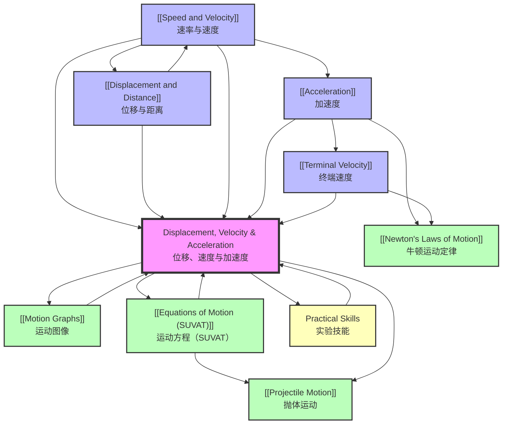

# 1. Overview / 概述

**English:**
This topic introduces the fundamental concepts of kinematics — the study of motion without considering its causes. We define and distinguish between [[Scalars and Vectors]] quantities: displacement (a vector) versus distance (a scalar), velocity (a vector) versus speed (a scalar), and acceleration (a vector) as the rate of change of velocity. These concepts form the absolute foundation for all of mechanics, including [[Equations of Motion (SUVAT)]] and [[Motion Graphs]]. Understanding the difference between average and instantaneous values is critical for interpreting real-world motion, such as a car's speedometer reading (instantaneous speed) versus its journey average speed. In both Cambridge 9702 and Edexcel IAL examinations, these definitions are tested directly in short-answer questions and are essential for solving more complex problems involving [[Terminal Velocity]] and projectile motion. Real-world applications include vehicle safety design (airbag deployment timing based on acceleration), sports science (analysing an athlete's sprint), and space exploration (calculating rocket trajectories).

**中文：**
本主题介绍运动学的基本概念——研究运动而不考虑其产生原因。我们定义并区分[[标量与矢量]]量：位移（矢量）与距离（标量）、速度（矢量）与速率（标量）、以及加速度（矢量）作为速度的变化率。这些概念构成了所有力学的基础，包括[[运动方程（SUVAT）]]和[[运动图像]]。理解平均量与瞬时量之间的区别对于解释现实世界中的运动至关重要，例如汽车速度表读数（瞬时速率）与其行程平均速度。在剑桥9702和爱德思IAL考试中，这些定义直接通过简答题进行测试，并且对于解决涉及[[终端速度]]和抛体运动的更复杂问题至关重要。实际应用包括车辆安全设计（基于加速度的安全气囊展开时机）、运动科学（分析运动员的冲刺）以及太空探索（计算火箭轨迹）。

---

# 2. Syllabus Learning Objectives / 考纲学习目标

| CAIE 9702 | Edexcel IAL |
|-----------|-------------|
| 3.1(d) Define displacement, speed, velocity and acceleration. | 1.4 Define displacement, instantaneous speed, average speed, velocity and acceleration. |
| 3.1(e) Use graphical methods to represent distance, displacement, speed, velocity and acceleration. | 1.5 Use the equations of motion for constant acceleration in a straight line. |
| 3.1(f) Determine displacement from the area under a velocity–time graph. | 1.6 Explain the effects of forces on motion, including Newton's laws. |
| — | 1.7 Describe the motion of objects falling in a uniform gravitational field in the presence of air resistance. |
| — | 1.8 Use the equations of motion for objects moving under gravity. |

**Examiner Expectations / 考官期望:**

**English:**
- Candidates must be able to state definitions **exactly** as given in the syllabus, using correct vector/scalar terminology.
- For CAIE, graphical methods (area under v-t graph, gradient of s-t and v-t graphs) are heavily tested.
- For Edexcel, the link to forces (Newton's laws) and air resistance ([[Terminal Velocity]]) is explicitly required.
- Both boards expect students to distinguish between average and instantaneous values.
- Common command words: "Define", "State", "Calculate", "Determine", "Explain".

**中文：**
- 考生必须能够**准确**陈述考纲中给出的定义，使用正确的矢量/标量术语。
- 对于CAIE，图形方法（v-t图下的面积、s-t图和v-t图的斜率）是重点考查内容。
- 对于爱德思，明确要求联系力（牛顿定律）和空气阻力（[[终端速度]]）。
- 两个考试局都期望学生区分平均值和瞬时值。
- 常见指令词："定义"、"陈述"、"计算"、"确定"、"解释"。

> 📋 **CIE Only:** CAIE Paper 1 (MCQ) frequently tests the area under a velocity-time graph for displacement. Paper 2 (AS structured) may ask for a definition followed by a simple calculation.
> 📋 **Edexcel Only:** Edexcel Unit 1 often includes a question on [[Terminal Velocity]] requiring a description of forces and motion, linking to Newton's First and Second Laws.

---

# 3. Core Definitions / 核心定义

| Term (EN/CN) | Definition (EN) | Definition (CN) | Common Mistakes / 常见错误 |
|--------------|-----------------|-----------------|---------------------------|
| **Distance / 距离** | The total length of the path travelled by an object. It is a [[Scalars and Vectors\|scalar]] quantity. | 物体运动路径的总长度。它是一个[[标量与矢量\|标量]]量。 | Confusing distance with displacement. Distance has no direction. |
| **Displacement / 位移** | The straight-line distance from the starting point to the finishing point in a specified direction. It is a [[Scalars and Vectors\|vector]] quantity. | 从起点到终点的直线距离，并带有指定方向。它是一个[[标量与矢量\|矢量]]量。 | Forgetting to state the direction. Displacement can be zero even if distance is large (e.g., a round trip). |
| **Speed / 速率** | The rate of change of distance. Speed = distance / time. It is a [[Scalars and Vectors\|scalar]] quantity. | 距离的变化率。速率 = 距离 / 时间。它是一个[[标量与矢量\|标量]]量。 | Using speed in vector equations. Speed is always positive. |
| **Velocity / 速度** | The rate of change of displacement. Velocity = displacement / time. It is a [[Scalars and Vectors\|vector]] quantity. | 位移的变化率。速度 = 位移 / 时间。它是一个[[标量与矢量\|矢量]]量。 | Forgetting the direction. A negative velocity indicates motion in the opposite direction. |
| **Acceleration / 加速度** | The rate of change of velocity. Acceleration = change in velocity / time taken. It is a [[Scalars and Vectors\|vector]] quantity. | 速度的变化率。加速度 = 速度变化量 / 所用时间。它是一个[[标量与矢量\|矢量]]量。 | Thinking acceleration always means "speeding up". An object slowing down has negative acceleration (deceleration). An object moving in a circle at constant speed has acceleration (centripetal). |
| **Instantaneous Speed / 瞬时速率** | The speed of an object at a particular instant in time. | 物体在某一特定时刻的速率。 | Confusing with average speed. The speedometer reading is instantaneous speed. |
| **Average Speed / 平均速率** | The total distance travelled divided by the total time taken. | 总路程除以总时间。 | Using displacement instead of distance in the calculation. |

---

# 4. Key Concepts Explained / 关键概念详解

## 4.1 Displacement vs Distance / 位移与距离

### Explanation / 解释
**English:**
[[Displacement and Distance]] are often confused. Distance is a [[Scalars and Vectors|scalar]] that measures the total path length. Displacement is a [[Scalars and Vectors|vector]] that measures the straight-line separation from start to finish, including direction. For example, if you walk 3 m east, then 4 m north, your total distance is 7 m, but your displacement is 5 m at an angle of 53.1° north of east (using Pythagoras). Displacement can be zero even if distance is large (e.g., a complete lap of a track returns you to the start).

**中文：**
[[位移与距离]]经常被混淆。距离是一个[[标量与矢量|标量]]，测量路径的总长度。位移是一个[[标量与矢量|矢量]]，测量从起点到终点的直线距离，包括方向。例如，如果你向东走3米，然后向北走4米，你的总距离是7米，但你的位移是5米，方向为北偏东53.1°（使用勾股定理）。即使距离很大，位移也可能为零（例如，绕跑道跑完一整圈回到起点）。

### Physical Meaning / 物理意义
**English:**
Distance tells you "how much ground was covered". Displacement tells you "how far out of place" an object is. In navigation, displacement is crucial for knowing your final position relative to your starting point.

**中文：**
距离告诉你"覆盖了多少地面"。位移告诉你物体"偏离了多远"。在导航中，位移对于了解你相对于起点的最终位置至关重要。

### Common Misconceptions / 常见误区
1. "Distance and displacement are the same thing." — They are different; displacement includes direction.
2. "If displacement is zero, no motion occurred." — Motion can occur (e.g., running a lap) but return to the start.
3. "Displacement is always less than or equal to distance." — Correct, but students often forget the "or equal to" case for straight-line motion.

### Exam Tips / 考试提示
**English:**
CAIE and Edexcel often ask: "State the difference between distance and displacement." The answer must mention that displacement is a vector (has direction) and distance is a scalar. For calculations, always draw a vector diagram.

**中文：**
CAIE和爱德思经常问："陈述距离和位移之间的区别。"答案必须提到位移是矢量（有方向），距离是标量。对于计算，始终画出矢量图。

---

## 4.2 Speed vs Velocity / 速率与速度

### Explanation / 解释
**English:**
[[Speed and Velocity]] are related but distinct. Speed is a [[Scalars and Vectors|scalar]] (magnitude only), while velocity is a [[Scalars and Vectors|vector]] (magnitude and direction). Average speed = total distance / total time. Average velocity = total displacement / total time. Instantaneous speed is the magnitude of instantaneous velocity. For an object moving in a straight line without reversing, speed and velocity magnitude are equal. If the object reverses direction, the average velocity can be much smaller than the average speed.

**中文：**
[[速率与速度]]相关但不同。速率是一个[[标量与矢量|标量]]（仅有大小），而速度是一个[[标量与矢量|矢量]]（大小和方向）。平均速率 = 总距离 / 总时间。平均速度 = 总位移 / 总时间。瞬时速率是瞬时速度的大小。对于一个沿直线运动且不反向的物体，速率和速度大小相等。如果物体反向运动，平均速度可能远小于平均速率。

### Physical Meaning / 物理意义
**English:**
Your car's speedometer shows instantaneous speed (scalar). Your GPS navigation system calculates velocity (vector) to give you directions. Velocity tells you not just how fast, but which way.

**中文：**
你汽车的速度表显示瞬时速率（标量）。你的GPS导航系统计算速度（矢量）来给你指路。速度不仅告诉你有多快，还告诉你往哪个方向。

### Common Misconceptions / 常见误区
1. "Speed and velocity are interchangeable." — No, velocity includes direction.
2. "Constant speed means constant velocity." — No, direction can change (e.g., circular motion).
3. "Average speed is always the magnitude of average velocity." — Only true for straight-line motion without reversal.

### Exam Tips / 考试提示
**English:**
Edexcel often asks: "Explain why the average speed of a car on a winding road is greater than the magnitude of its average velocity." The answer must mention that distance > displacement for a non-straight path.

**中文：**
爱德思经常问："解释为什么汽车在蜿蜒道路上的平均速率大于其平均速度的大小。"答案必须提到对于非直线路径，距离 > 位移。

---

## 4.3 Acceleration / 加速度

### Explanation / 解释
**English:**
[[Acceleration]] is the rate of change of velocity. It is a [[Scalars and Vectors|vector]]. Acceleration = (final velocity - initial velocity) / time. A positive acceleration means velocity is increasing in the positive direction. A negative acceleration (deceleration) means velocity is decreasing. Crucially, an object can have acceleration even if its speed is constant, if its direction is changing (e.g., uniform circular motion). The SI unit is m/s².

**中文：**
[[加速度]]是速度的变化率。它是一个[[标量与矢量|矢量]]。加速度 = (末速度 - 初速度) / 时间。正加速度意味着速度在正方向上增加。负加速度（减速）意味着速度在减小。关键的是，即使速度大小不变，如果方向改变（例如匀速圆周运动），物体也可以有加速度。SI单位是m/s²。

### Physical Meaning / 物理意义
**English:**
When you press the accelerator in a car, you feel a force pushing you back into your seat — that's acceleration. When you brake, you feel thrown forward — that's deceleration (negative acceleration). The "g-force" experienced by pilots is a measure of acceleration relative to gravity (9.81 m/s²).

**中文：**
当你踩下汽车的油门时，你会感到一股力把你推回座椅——这就是加速度。当你刹车时，你会感到被向前抛——这就是减速（负加速度）。飞行员经历的"g力"是相对于重力（9.81 m/s²）的加速度度量。

### Common Misconceptions / 常见误区
1. "Acceleration always means speeding up." — No, it can mean slowing down or changing direction.
2. "If velocity is zero, acceleration must be zero." — No, at the top of a projectile's flight, velocity is zero but acceleration is still g (9.81 m/s² downward).
3. "Constant acceleration means constant velocity." — No, constant acceleration means velocity changes at a constant rate.

### Exam Tips / 考试提示
**English:**
Both boards test the definition: "Acceleration is the rate of change of velocity." CAIE may ask for a graphical determination of acceleration from a velocity-time graph (gradient). Edexcel may link acceleration to Newton's Second Law (F = ma).

**中文：**
两个考试局都测试定义："加速度是速度的变化率。"CAIE可能要求从速度-时间图（斜率）图形化确定加速度。爱德思可能将加速度与牛顿第二定律（F = ma）联系起来。

---

## 4.4 Terminal Velocity / 终端速度

### Explanation / 解释
**English:**
[[Terminal Velocity]] is the constant velocity reached by a falling object when the upward force of air resistance equals the downward force of gravity (weight). Initially, the object accelerates at g (9.81 m/s²). As speed increases, air resistance increases. Eventually, the net force becomes zero, acceleration becomes zero, and the object falls at constant terminal velocity. This is an example of dynamic equilibrium.

**中文：**
[[终端速度]]是当向上的空气阻力等于向下的重力（重量）时，下落物体达到的恒定速度。最初，物体以g（9.81 m/s²）加速。随着速度增加，空气阻力增加。最终，合力变为零，加速度变为零，物体以恒定的终端速度下落。这是动态平衡的一个例子。

### Physical Meaning / 物理意义
**English:**
Skydivers reach terminal velocity (about 55 m/s or 120 mph in a spread-eagle position) before deploying their parachute. A parachute increases air resistance, reducing terminal velocity to a safe landing speed (about 5 m/s). A feather falls slowly due to low mass and high air resistance; a hammer falls quickly due to high mass and low air resistance (in a vacuum, both fall at the same rate).

**中文：**
跳伞者在展开降落伞前达到终端速度（伸展姿势下约55米/秒或120英里/小时）。降落伞增加了空气阻力，将终端速度降低到安全的着陆速度（约5米/秒）。羽毛由于质量小、空气阻力大而下落缓慢；锤子由于质量大、空气阻力小而下落迅速（在真空中，两者下落速度相同）。

### Common Misconceptions / 常见误区
1. "Terminal velocity is reached instantly." — No, it takes time to accelerate to terminal velocity.
2. "Heavier objects always have a higher terminal velocity." — Generally true, but shape also matters (a flat sheet of paper vs a crumpled ball).
3. "At terminal velocity, there are no forces acting." — No, forces are balanced (weight = air resistance).

### Exam Tips / 考试提示
**English:**
Edexcel explicitly requires this topic. A typical question: "Describe and explain the motion of a skydiver from leaving the plane to reaching the ground." Use the terms: weight, air resistance, net force, acceleration, terminal velocity. Draw a velocity-time graph showing the characteristic S-shape.

**中文：**
爱德思明确要求此主题。一个典型问题："描述并解释跳伞者从离开飞机到到达地面的运动。"使用术语：重量、空气阻力、合力、加速度、终端速度。画出显示特征S形的速度-时间图。

> 📷 **IMAGE PROMPT — DVA-01: Skydiver Forces Diagram**
>
> A clear, labelled diagram showing a skydiver in freefall. Two arrows: a downward arrow labelled "Weight (W = mg)" and an upward arrow labelled "Air Resistance (R)". Below, three stages: (1) Initial: R < W, net force downward, accelerating. (2) Intermediate: R increasing, net force decreasing. (3) Terminal: R = W, net force = 0, constant velocity. Use a clean, educational style with blue and red arrows.

---

# 5. Essential Equations / 核心公式

## 5.1 Average Speed / 平均速率

**Equation / 公式:**
$$ \text{Average speed} = \frac{\text{total distance}}{\text{total time}} $$

**Variables / 变量:**
| Symbol (符号) | Meaning (EN) | Meaning (CN) | Unit (单位) |
|--------------|-------------|-------------|------------|
| v_avg | Average speed | 平均速率 | m/s |
| d | Total distance | 总距离 | m |
| t | Total time | 总时间 | s |

**Derivation / 推导:**
**English:** This is a definition, not derived. It comes from the concept of "rate" — how much distance is covered per unit time.
**中文：** 这是一个定义，不是推导出来的。它来自"率"的概念——单位时间内覆盖了多少距离。

**Conditions / 适用条件:**
**English:** Always applicable for calculating average speed over a journey.
**中文：** 始终适用于计算行程中的平均速率。

**Limitations / 局限性:**
**English:** Does not give information about instantaneous speed or variations in speed during the journey.
**中文：** 不提供关于瞬时速率或行程中速度变化的信息。

**Rearrangements / 变形:**
$$ \text{distance} = \text{speed} \times \text{time} $$
$$ \text{time} = \frac{\text{distance}}{\text{speed}} $$

---

## 5.2 Average Velocity / 平均速度

**Equation / 公式:**
$$ \vec{v}_{\text{avg}} = \frac{\vec{s}}{t} = \frac{\text{displacement}}{\text{time}} $$

**Variables / 变量:**
| Symbol (符号) | Meaning (EN) | Meaning (CN) | Unit (单位) |
|--------------|-------------|-------------|------------|
| v_avg | Average velocity | 平均速度 | m/s |
| s | Displacement | 位移 | m |
| t | Time taken | 所用时间 | s |

**Derivation / 推导:**
**English:** Definition of velocity as rate of change of displacement.
**中文：** 速度作为位移变化率的定义。

**Conditions / 适用条件:**
**English:** Always applicable. Note that displacement is a vector, so direction must be stated.
**中文：** 始终适用。注意位移是矢量，因此必须说明方向。

**Limitations / 局限性:**
**English:** Does not give information about instantaneous velocity or path taken.
**中文：** 不提供关于瞬时速度或所取路径的信息。

**Rearrangements / 变形:**
$$ \vec{s} = \vec{v}_{\text{avg}} \times t $$
$$ t = \frac{\vec{s}}{\vec{v}_{\text{avg}}} $$

---

## 5.3 Acceleration / 加速度

**Equation / 公式:**
$$ \vec{a} = \frac{\Delta \vec{v}}{\Delta t} = \frac{\vec{v} - \vec{u}}{t} $$

**Variables / 变量:**
| Symbol (符号) | Meaning (EN) | Meaning (CN) | Unit (单位) |
|--------------|-------------|-------------|------------|
| a | Acceleration | 加速度 | m/s² |
| v | Final velocity | 末速度 | m/s |
| u | Initial velocity | 初速度 | m/s |
| t | Time taken | 所用时间 | s |

**Derivation / 推导:**
**English:** Definition of acceleration as rate of change of velocity. No derivation needed.
**中文：** 加速度作为速度变化率的定义。无需推导。

**Conditions / 适用条件:**
**English:** Always applicable. For constant acceleration, this gives the uniform acceleration. For non-uniform acceleration, it gives the average acceleration over the time interval.
**中文：** 始终适用。对于匀加速，这给出匀加速度。对于非匀加速，它给出时间间隔内的平均加速度。

**Limitations / 局限性:**
**English:** For non-uniform acceleration, the instantaneous acceleration requires calculus (a = dv/dt).
**中文：** 对于非匀加速，瞬时加速度需要微积分（a = dv/dt）。

**Rearrangements / 变形:**
$$ \vec{v} = \vec{u} + \vec{a}t $$
$$ \vec{u} = \vec{v} - \vec{a}t $$
$$ t = \frac{\vec{v} - \vec{u}}{\vec{a}} $$

---

## 5.4 Instantaneous Velocity from Gradient / 从斜率求瞬时速度

**Equation / 公式:**
$$ v = \frac{ds}{dt} \quad \text{(gradient of displacement-time graph)} $$

**Variables / 变量:**
| Symbol (符号) | Meaning (EN) | Meaning (CN) | Unit (单位) |
|--------------|-------------|-------------|------------|
| v | Instantaneous velocity | 瞬时速度 | m/s |
| ds/dt | Derivative of displacement with respect to time | 位移对时间的导数 | m/s |

**Derivation / 推导:**
**English:** The gradient of a tangent to the displacement-time graph at a specific point gives the instantaneous velocity. This is the limit of Δs/Δt as Δt → 0.
**中文：** 位移-时间图上某点切线的斜率给出瞬时速度。这是当Δt → 0时Δs/Δt的极限。

**Conditions / 适用条件:**
**English:** Applicable for any motion. Requires a smooth displacement-time graph.
**中文：** 适用于任何运动。需要平滑的位移-时间图。

**Limitations / 局限性:**
**English:** Requires accurate drawing of tangents, which can introduce errors.
**中文：** 需要准确绘制切线，这可能会引入误差。

---

## 5.5 Displacement from Area under v-t Graph / 从v-t图下的面积求位移

**Equation / 公式:**
$$ s = \int v \, dt \quad \text{(area under velocity-time graph)} $$

**Variables / 变量:**
| Symbol (符号) | Meaning (EN) | Meaning (CN) | Unit (单位) |
|--------------|-------------|-------------|------------|
| s | Displacement | 位移 | m |
| v | Velocity | 速度 | m/s |
| dt | Infinitesimal time interval | 无穷小时间间隔 | s |

**Derivation / 推导:**
**English:** Since v = ds/dt, integrating both sides gives s = ∫ v dt. The integral represents the area under the v-t graph.
**中文：** 由于v = ds/dt，两边积分得到s = ∫ v dt。积分表示v-t图下的面积。

**Conditions / 适用条件:**
**English:** Always applicable. Area above the time axis represents positive displacement; area below represents negative displacement.
**中文：** 始终适用。时间轴上方的面积表示正位移；下方的面积表示负位移。

**Limitations / 局限性:**
**English:** For complex graphs, calculating area may require splitting into shapes (rectangles, triangles, trapeziums).
**中文：** 对于复杂图形，计算面积可能需要分割成形状（矩形、三角形、梯形）。

---

# 6. Graphs and Relationships / 图表与关系

## 6.1 Displacement-Time Graph / 位移-时间图

### Axes / 坐标轴
**English:** x-axis: Time (t) / s; y-axis: Displacement (s) / m
**中文：** x轴：时间 (t) / 秒；y轴：位移 (s) / 米

### Shape / 形状
**English:**
- **Stationary:** Horizontal line (gradient = 0)
- **Constant velocity:** Straight line with constant gradient
- **Accelerating:** Curved line (parabola for constant acceleration)
- **Decelerating:** Curved line with decreasing gradient

**中文：**
- **静止：** 水平线（斜率 = 0）
- **匀速：** 具有恒定斜率的直线
- **加速：** 曲线（匀加速时为抛物线）
- **减速：** 斜率递减的曲线

### Gradient Meaning / 斜率含义
**English:** The gradient of a displacement-time graph gives the **velocity**.
**中文：** 位移-时间图的斜率给出**速度**。

### Area Meaning / 面积含义
**English:** The area under a displacement-time graph has **no physical meaning**.
**中文：** 位移-时间图下的面积**没有物理意义**。

### Exam Interpretation / 考试解读
**English:**
- A steeper gradient means higher speed.
- A negative gradient means motion in the opposite direction.
- A curved line means changing velocity (acceleration).
- The gradient of a tangent at a point gives instantaneous velocity.

**中文：**
- 斜率越陡意味着速度越高。
- 负斜率意味着向相反方向运动。
- 曲线意味着速度变化（加速度）。
- 某点切线的斜率给出瞬时速度。

### Common Questions / 常见问题
**English:**
- "Calculate the velocity from the graph." (Find gradient)
- "Describe the motion shown by the graph." (Interpret shape)
- "At what time is the velocity zero?" (Where gradient = 0)

**中文：**
- "从图中计算速度。"（求斜率）
- "描述图中显示的运动。"（解释形状）
- "在什么时间速度为零？"（斜率 = 0处）

> 📷 **IMAGE PROMPT — DVA-02: Displacement-Time Graph**
>
> A clear graph with labelled axes: "Displacement (m)" on y-axis, "Time (s)" on x-axis. Show three distinct sections: (1) A straight line with positive gradient (constant velocity). (2) A horizontal line (stationary). (3) A curved line with increasing gradient (accelerating). Use different colours for each section. Include a tangent line drawn on the curved section with a label "Gradient = velocity". Clean, educational style.

---

## 6.2 Velocity-Time Graph / 速度-时间图

### Axes / 坐标轴
**English:** x-axis: Time (t) / s; y-axis: Velocity (v) / m/s
**中文：** x轴：时间 (t) / 秒；y轴：速度 (v) / 米/秒

### Shape / 形状
**English:**
- **Constant velocity:** Horizontal line (gradient = 0)
- **Constant acceleration:** Straight line with constant gradient
- **Increasing acceleration:** Curved line with increasing gradient
- **Decreasing acceleration:** Curved line with decreasing gradient

**中文：**
- **匀速：** 水平线（斜率 = 0）
- **匀加速：** 具有恒定斜率的直线
- **加速度增加：** 斜率递增的曲线
- **加速度减小：** 斜率递减的曲线

### Gradient Meaning / 斜率含义
**English:** The gradient of a velocity-time graph gives the **acceleration**.
**中文：** 速度-时间图的斜率给出**加速度**。

### Area Meaning / 面积含义
**English:** The area under a velocity-time graph gives the **displacement**.
**中文：** 速度-时间图下的面积给出**位移**。

### Exam Interpretation / 考试解读
**English:**
- A steeper gradient means higher acceleration.
- A negative gradient means deceleration (or acceleration in opposite direction).
- Area above the time axis = positive displacement; area below = negative displacement.
- Net displacement = area above - area below.

**中文：**
- 斜率越陡意味着加速度越大。
- 负斜率意味着减速（或向相反方向加速）。
- 时间轴上方的面积 = 正位移；下方的面积 = 负位移。
- 净位移 = 上方面积 - 下方面积。

### Common Questions / 常见问题
**English:**
- "Calculate the acceleration from the graph." (Find gradient)
- "Calculate the displacement from the graph." (Find area)
- "Describe the motion." (Interpret shape)
- "Calculate the distance travelled." (Find total area, ignoring sign)

**中文：**
- "从图中计算加速度。"（求斜率）
- "从图中计算位移。"（求面积）
- "描述运动。"（解释形状）
- "计算行进的距离。"（求总面积，忽略符号）

> 📷 **IMAGE PROMPT — DVA-03: Velocity-Time Graph**
>
> A clear graph with labelled axes: "Velocity (m/s)" on y-axis, "Time (s)" on x-axis. Show a trapezium shape: (1) A straight line from (0,0) to (4,8) — constant acceleration. (2) A horizontal line from (4,8) to (8,8) — constant velocity. (3) A straight line from (8,8) to (12,0) — constant deceleration. Shade the area under the graph and label it "Area = displacement". Clean, educational style.

---

## 6.3 Acceleration-Time Graph / 加速度-时间图

### Axes / 坐标轴
**English:** x-axis: Time (t) / s; y-axis: Acceleration (a) / m/s²
**中文：** x轴：时间 (t) / 秒；y轴：加速度 (a) / 米/秒²

### Shape / 形状
**English:**
- **Constant acceleration:** Horizontal line (non-zero)
- **Zero acceleration:** Horizontal line at a = 0
- **Changing acceleration:** Sloped or curved line

**中文：**
- **匀加速：** 水平线（非零）
- **零加速度：** a = 0处的水平线
- **变化的加速度：** 倾斜或曲线

### Gradient Meaning / 斜率含义
**English:** The gradient of an acceleration-time graph has **no standard physical meaning** at A-Level (it would be "jerk").
**中文：** 加速度-时间图的斜率在A-Level中**没有标准的物理意义**（它会是"加加速度"）。

### Area Meaning / 面积含义
**English:** The area under an acceleration-time graph gives the **change in velocity**.
**中文：** 加速度-时间图下的面积给出**速度变化量**。

### Exam Interpretation / 考试解读
**English:**
- A horizontal line at a = 0 means constant velocity.
- A horizontal line at a = g means free fall.
- Area = Δv = v - u.

**中文：**
- a = 0处的水平线意味着匀速。
- a = g处的水平线意味着自由落体。
- 面积 = Δv = v - u。

### Common Questions / 常见问题
**English:**
- "Calculate the change in velocity from the graph." (Find area)
- "Sketch the velocity-time graph from the acceleration-time graph." (Integration)

**中文：**
- "从图中计算速度变化量。"（求面积）
- "根据加速度-时间图画出速度-时间图。"（积分）

---

# 7. Required Diagrams / 必备图表

## 7.1 Vector Diagram for Displacement / 位移矢量图

### Description / 描述
**English:**
A diagram showing a journey with multiple legs, represented as vectors. The resultant displacement is the vector sum (from start to finish). For example, a person walks 3 km east, then 4 km north. The diagram shows two perpendicular vectors and the resultant hypotenuse.

**中文：**
一个显示多段行程的图，用矢量表示。合位移是矢量和（从起点到终点）。例如，一个人向东走3公里，然后向北走4公里。该图显示两个垂直矢量和作为结果的斜边。

### Image Prompt / 图片生成提示
> 📷 **IMAGE PROMPT — DVA-04: Vector Displacement Diagram**
>
> A clean, labelled vector diagram. Start point "O" at bottom-left. Arrow 1: 3 cm to the right, labelled "3 km East". Arrow 2: 4 cm upward from the head of Arrow 1, labelled "4 km North". Resultant arrow: from "O" to the head of Arrow 2, labelled "5 km at 53.1° N of E". Include a dashed line showing the path. Use a protractor arc to show the angle. Educational style, white background, blue arrows.

### Labels Required / 需要标注
- Start point (O / 起点)
- Each displacement vector with magnitude and direction (每个位移矢量，带大小和方向)
- Resultant displacement vector (合位移矢量)
- Angle (θ / 角度)

### Exam Importance / 考试重要性
**English:**
Essential for understanding vector addition and the difference between distance and displacement. Frequently tested in both CAIE and Edexcel.

**中文：**
对于理解矢量加法以及距离与位移之间的区别至关重要。在CAIE和爱德思中经常测试。

---

## 7.2 Velocity-Time Graph for Terminal Velocity / 终端速度的速度-时间图

### Description / 描述
**English:**
A velocity-time graph showing a skydiver's fall. Initially, gradient = g (9.81 m/s²). As air resistance increases, gradient decreases. Eventually, the graph becomes horizontal (terminal velocity). When the parachute opens, velocity decreases rapidly (large deceleration) to a new, lower terminal velocity.

**中文：**
显示跳伞者下落的速度-时间图。最初，斜率 = g (9.81 m/s²)。随着空气阻力增加，斜率减小。最终，图形变为水平（终端速度）。当降落伞打开时，速度迅速下降（大减速）到新的、较低的终端速度。

### Image Prompt / 图片生成提示
> 📷 **IMAGE PROMPT — DVA-05: Terminal Velocity v-t Graph**
>
> A velocity-time graph with labelled axes: "Velocity (m/s)" on y-axis, "Time (s)" on x-axis. Show an S-shaped curve: (1) Steep initial gradient (free fall). (2) Gradient decreasing (air resistance increasing). (3) Horizontal line at v = 55 m/s (terminal velocity). (4) Sharp drop to v = 5 m/s (parachute opens). (5) Horizontal line at v = 5 m/s (new terminal velocity). Label key points: "Free fall", "Terminal velocity", "Parachute opens", "Safe landing speed". Clean, educational style.

### Labels Required / 需要标注
- Initial acceleration (g) (初始加速度 g)
- Terminal velocity (终端速度)
- Parachute deployment point (降落伞展开点)
- New terminal velocity (新终端速度)

### Exam Importance / 考试重要性
**English:**
Edexcel explicitly requires this graph. CAIE may ask for it in the context of air resistance. Understanding the shape demonstrates comprehension of forces and motion.

**中文：**
爱德思明确要求此图。CAIE可能在空气阻力的背景下要求它。理解形状表明对力和运动的理解。

---

## 7.3 Displacement-Time Graph for Constant Acceleration / 匀加速的位移-时间图

### Description / 描述
**English:**
A parabolic curve showing displacement increasing at an increasing rate for constant positive acceleration. The gradient (velocity) increases linearly with time.

**中文：**
一条抛物线曲线，显示对于恒定的正加速度，位移以递增的速率增加。斜率（速度）随时间线性增加。

### Image Prompt / 图片生成提示
> 📷 **IMAGE PROMPT — DVA-06: Constant Acceleration s-t Graph**
>
> A displacement-time graph with labelled axes: "Displacement (m)" on y-axis, "Time (s)" on x-axis. Show a smooth parabolic curve starting from the origin, curving upwards. Draw a tangent line at a point on the curve, labelled "Gradient = instantaneous velocity". Include a dashed line showing the average velocity from start to that point. Clean, educational style.

### Labels Required / 需要标注
- Parabolic curve (抛物线曲线)
- Tangent line (切线)
- Instantaneous velocity label (瞬时速度标签)

### Exam Importance / 考试重要性
**English:**
CAIE frequently tests the interpretation of this graph, especially the concept of instantaneous velocity from the gradient of a tangent.

**中文：**
CAIE经常测试对此图的解读，特别是从切线斜率求瞬时速度的概念。

---

# 8. Worked Examples / 典型例题

## Example 1: Average Speed and Average Velocity / 平均速率与平均速度

### Question / 题目
**English:**
A runner completes one lap of a 400 m circular track in 50 seconds. She starts and finishes at the same point.
(a) Calculate her average speed.
(b) Calculate the magnitude of her average velocity.
(c) Explain why the two values are different.

**中文：**
一名跑步者在50秒内完成400米圆形跑道的一圈。她从同一点出发并结束。
(a) 计算她的平均速率。
(b) 计算她的平均速度的大小。
(c) 解释为什么这两个值不同。

### Solution / 解答

**Step 1: Identify known quantities / 步骤1：确定已知量**
- Total distance = 400 m
- Total displacement = 0 m (returns to start)
- Total time = 50 s

**Step 2: Calculate average speed / 步骤2：计算平均速率**
$$ \text{Average speed} = \frac{\text{total distance}}{\text{total time}} = \frac{400}{50} = 8.0 \text{ m/s} $$

**Step 3: Calculate average velocity / 步骤3：计算平均速度**
$$ \text{Average velocity} = \frac{\text{total displacement}}{\text{total time}} = \frac{0}{50} = 0 \text{ m/s} $$

**Step 4: Explain the difference / 步骤4：解释差异**
**English:**
Average speed is a scalar quantity that depends on the total path length (distance). Average velocity is a vector quantity that depends on the straight-line separation from start to finish (displacement). Since the runner returns to her starting point, her displacement is zero, so her average velocity is zero, even though she has covered a large distance.

**中文：**
平均速率是一个标量，取决于路径总长度（距离）。平均速度是一个矢量，取决于从起点到终点的直线距离（位移）。由于跑步者回到了起点，她的位移为零，因此她的平均速度为零，尽管她覆盖了很大的距离。

### Final Answer / 最终答案
**Answer:** (a) 8.0 m/s (b) 0 m/s (c) See explanation above.
**答案：** (a) 8.0 米/秒 (b) 0 米/秒 (c) 见上述解释。

### Examiner Notes / 考官点评
**English:**
- This is a classic question that tests the fundamental difference between scalars and vectors.
- Common mistake: Students calculate average velocity as 8.0 m/s because they use distance instead of displacement.
- Marks are awarded for: correct formula, correct substitution, correct answer with unit, and a clear explanation.

**中文：**
- 这是一个经典问题，测试标量和矢量之间的基本区别。
- 常见错误：学生计算平均速度为8.0米/秒，因为他们使用了距离而不是位移。
- 得分点：正确的公式、正确的代入、带单位的正确答案以及清晰的解释。

---

## Example 2: Acceleration from a Velocity-Time Graph / 从速度-时间图求加速度

### Question / 题目
**English:**
The velocity-time graph below shows the motion of a car.
- From t = 0 to t = 5 s, the car accelerates uniformly from rest to 20 m/s.
- From t = 5 to t = 15 s, the car travels at a constant velocity of 20 m/s.
- From t = 15 to t = 20 s, the car decelerates uniformly to rest.

(a) Calculate the acceleration of the car during the first 5 seconds.
(b) Calculate the total displacement of the car during the 20-second journey.
(c) Calculate the deceleration of the car during the final 5 seconds.

**中文：**
下面的速度-时间图显示了一辆汽车的运动。
- 从t = 0到t = 5秒，汽车从静止匀加速到20米/秒。
- 从t = 5到t = 15秒，汽车以20米/秒的恒定速度行驶。
- 从t = 15到t = 20秒，汽车匀减速到静止。

(a) 计算汽车在前5秒内的加速度。
(b) 计算汽车在20秒行程中的总位移。
(c) 计算汽车在最后5秒内的减速度。

### Image Prompt / 图片提示
> 📷 **IMAGE PROMPT — DVA-07: Car Velocity-Time Graph**
>
> A velocity-time graph with labelled axes: "Velocity (m/s)" on y-axis (0 to 25), "Time (s)" on x-axis (0 to 20). Show a trapezium shape: (1) Straight line from (0,0) to (5,20). (2) Horizontal line from (5,20) to (15,20). (3) Straight line from (15,20) to (20,0). Shade the area under the graph. Clean, educational style.

### Solution / 解答

**Part (a): Acceleration during first 5 seconds / 第(a)部分：前5秒内的加速度**

**Step 1: Identify known quantities / 步骤1：确定已知量**
- Initial velocity, u = 0 m/s
- Final velocity, v = 20 m/s
- Time, t = 5 s

**Step 2: Apply acceleration formula / 步骤2：应用加速度公式**
$$ a = \frac{v - u}{t} = \frac{20 - 0}{5} = 4.0 \text{ m/s}^2 $$

**Part (b): Total displacement / 第(b)部分：总位移**

**Step 1: Calculate area under graph / 步骤1：计算图下面积**
The graph is a trapezium. Area = average of parallel sides × height.

Area of triangle 1 (0-5 s): $\frac{1}{2} \times 5 \times 20 = 50$ m
Area of rectangle (5-15 s): $10 \times 20 = 200$ m
Area of triangle 2 (15-20 s): $\frac{1}{2} \times 5 \times 20 = 50$ m

**Step 2: Sum areas / 步骤2：求和**
Total displacement = 50 + 200 + 50 = 300 m

**Part (c): Deceleration during final 5 seconds / 第(c)部分：最后5秒内的减速度**

**Step 1: Identify known quantities / 步骤1：确定已知量**
- Initial velocity, u = 20 m/s
- Final velocity, v = 0 m/s
- Time, t = 5 s

**Step 2: Apply acceleration formula / 步骤2：应用加速度公式**
$$ a = \frac{v - u}{t} = \frac{0 - 20}{5} = -4.0 \text{ m/s}^2 $$

The deceleration is 4.0 m/s² (the negative sign indicates deceleration).

### Final Answer / 最终答案
**Answer:** (a) 4.0 m/s² (b) 300 m (c) 4.0 m/s² (deceleration)
**答案：** (a) 4.0 米/秒² (b) 300 米 (c) 4.0 米/秒²（减速）

### Examiner Notes / 考官点评
**English:**
- Part (a) and (c) are straightforward applications of the acceleration formula.
- Part (b) is the most common exam question type for CAIE — calculating displacement from area under v-t graph.
- Common mistake: Students forget to include the rectangular section or miscalculate the area of triangles.
- Always check units: m/s² for acceleration, m for displacement.

**中文：**
- 第(a)和(c)部分是加速度公式的直接应用。
- 第(b)部分是CAIE最常见的考试题型——从v-t图下的面积计算位移。
- 常见错误：学生忘记包括矩形部分或错误计算三角形的面积。
- 始终检查单位：加速度为米/秒²，位移为米。

---

# 9. Past Paper Question Types / 历年真题题型

| Question Type / 题型 | Frequency / 频率 | Difficulty / 难度 | Past Paper References / 真题索引 |
|----------------------|------------------|------------------|-------------------------------|
| Calculation of speed/velocity/acceleration / 计算速率/速度/加速度 | High | Low | 📝 *待填入* |
| Definition of terms / 术语定义 | High | Low | 📝 *待填入* |
| Interpretation of displacement-time graph / 位移-时间图解读 | Medium | Medium | 📝 *待填入* |
| Interpretation of velocity-time graph / 速度-时间图解读 | High | Medium | 📝 *待填入* |
| Area under v-t graph for displacement / v-t图下面积求位移 | High | Medium | 📝 *待填入* |
| Terminal velocity explanation / 终端速度解释 | Medium (Edexcel: High) | Medium | 📝 *待填入* |
| Vector addition for displacement / 位移的矢量加法 | Low | Medium | 📝 *待填入* |
| Distinguishing scalars and vectors / 区分标量与矢量 | Medium | Low | 📝 *待填入* |

> 📝 **题库整理中 / Question Bank Under Construction:** 具体试卷编号（如 9702/23/M/J/24 Q3）将在后续整理真题后填入上表。

**Common Command Words / 常见指令词:**

| Command Word (EN) | Command Word (CN) | What to Do |
|-------------------|-------------------|------------|
| State | 陈述 | Give a brief answer without explanation. |
| Define | 定义 | Give the exact meaning, often using a formula. |
| Calculate | 计算 | Use a formula to find a numerical answer. Show working. |
| Determine | 确定 | Find a value, often from a graph (gradient or area). |
| Explain | 解释 | Give reasons for an observation or result. |
| Describe | 描述 | Give a detailed account of what happens. |
| Suggest | 建议 | Use your knowledge to propose a possible answer. |
| Sketch | 画出草图 | Draw a graph showing the general shape, not exact values. |

---

# 10. Practical Skills Connections / 实验技能链接

**English:**
This topic connects to practical work in several ways:

1. **Measuring Speed and Acceleration (CAIE Paper 3 / Edexcel Unit 3):**
   - Use a **ticker timer** (50 Hz) to record motion on a tape. The distance between dots gives displacement over time intervals (0.02 s). Calculate speed and acceleration from the tape.
   - Use **light gates** connected to a data logger. Measure the time for a card of known length to pass through the gate to calculate instantaneous speed. Two gates can measure acceleration.
   - Use **motion sensors** (ultrasound or radar) to generate displacement-time and velocity-time graphs directly on a computer.

2. **Uncertainties and Errors:**
   - When using a ruler to measure displacement, the uncertainty is typically ±1 mm or ±0.5 mm.
   - When using a stopwatch, reaction time (~0.2 s) introduces significant uncertainty for short time intervals.
   - When calculating speed from distance/time, propagate uncertainties: $\frac{\Delta v}{v} = \frac{\Delta d}{d} + \frac{\Delta t}{t}$.

3. **Graph Plotting and Analysis:**
   - Plot displacement-time and velocity-time graphs from experimental data.
   - Draw lines of best fit and calculate gradients for velocity and acceleration.
   - Calculate area under v-t graph for displacement (using counting squares or trapezium rule).

4. **Experimental Design (CAIE Paper 5 / Edexcel Unit 6):**
   - Design an experiment to measure acceleration due to gravity (g) using a falling object.
   - Investigate the effect of mass and shape on terminal velocity (e.g., falling paper cones or parachutes).
   - Use a ramp and trolley to investigate motion under constant acceleration.

**中文：**
本主题通过多种方式与实验工作相关联：

1. **测量速度和加速度（CAIE Paper 3 / 爱德思 Unit 3）：**
   - 使用**打点计时器**（50赫兹）在纸带上记录运动。点之间的距离给出时间间隔（0.02秒）内的位移。从纸带计算速度和加速度。
   - 使用连接到数据记录器的**光门**。测量已知长度的卡片通过光门的时间，以计算瞬时速度。两个光门可以测量加速度。
   - 使用**运动传感器**（超声波或雷达）直接在计算机上生成位移-时间图和速度-时间图。

2. **不确定度和误差：**
   - 使用尺子测量位移时，不确定度通常为±1毫米或±0.5毫米。
   - 使用秒表时，反应时间（~0.2秒）对于短时间间隔会引入显著的不确定度。
   - 计算距离/时间的速度时，传播不确定度：$\frac{\Delta v}{v} = \frac{\Delta d}{d} + \frac{\Delta t}{t}$。

3. **图表绘制和分析：**
   - 从实验数据绘制位移-时间和速度-时间图。
   - 绘制最佳拟合线并计算速度和加速度的斜率。
   - 计算v-t图下的面积以求得位移（使用数方格法或梯形法则）。

4. **实验设计（CAIE Paper 5 / 爱德思 Unit 6）：**
   - 设计一个实验，使用下落物体测量重力加速度（g）。
   - 研究质量和形状对终端速度的影响（例如，下落的纸锥或降落伞）。
   - 使用斜坡和小车研究匀加速运动。

> 📋 **CIE Only:** CAIE Paper 3 (AS Practical) often uses a ticker timer or light gates. Paper 5 (A2 Planning) may ask you to design an experiment to measure g or investigate terminal velocity.
> 📋 **Edexcel Only:** Edexcel Unit 3 (AS Practical) frequently uses light gates and data loggers. Unit 6 (A2 Practical) may involve more complex experimental designs, such as investigating the relationship between mass and terminal velocity.

---

# 11. Concept Map / 概念图谱

---

# 12. Quick Revision Sheet / 速查表

| Category / 类别 | Key Points / 要点 |
|----------------|------------------|
| **Definitions / 定义** | • **Distance** (scalar): Total path length / 总路径长度 • **Displacement** (vector): Straight-line distance from start to finish + direction / 从起点到终点的直线距离 + 方向 • **Speed** (scalar): Rate of change of distance / 距离的变化率 • **Velocity** (vector): Rate of change of displacement / 位移的变化率 • **Acceleration** (vector): Rate of change of velocity / 速度的变化率 |
| **Equations / 公式** | • Average speed = total distance / total time / 平均速率 = 总距离 / 总时间 • Average velocity = displacement / time / 平均速度 = 位移 / 时间 • Acceleration = (v - u) / t / 加速度 = (v - u) / t • v = u + at (from acceleration definition) / v = u + at（来自加速度定义） |
| **Graphs / 图表** | • **s-t graph:** Gradient = velocity / 斜率 = 速度 • **v-t graph:** Gradient = acceleration; Area = displacement / 斜率 = 加速度；面积 = 位移 • **a-t graph:** Area = change in velocity / 面积 = 速度变化量 |
| **Key Facts / 关键事实** | • Displacement can be zero when distance is large (return to start) / 当距离很大时位移可以为零（回到起点） • Constant speed does NOT mean constant velocity (direction can change) / 恒定速率并不意味着恒定速度（方向可以改变） • Acceleration occurs when speed changes OR direction changes / 当速度改变或方向改变时发生加速度 • At terminal velocity: net force = 0, acceleration = 0, forces balanced / 在终端速度时：合力 = 0，加速度 = 0，力平衡 |
| **Exam Reminders / 考试提醒** | • Always state direction for vector quantities / 始终说明矢量量的方向 • Use correct units: m (distance), m/s (speed/velocity), m/s² (acceleration) / 使用正确的单位 • For v-t graph area: split into triangles and rectangles / 对于v-t图面积：分割成三角形和矩形 • For s-t graph gradient: draw tangent accurately / 对于s-t图斜率：准确绘制切线 • Distinguish between "distance" and "displacement" in calculations / 在计算中区分"距离"和"位移" • Edexcel: Know terminal velocity explanation with force diagram / 爱德思：知道带力图的终端速度解释 |