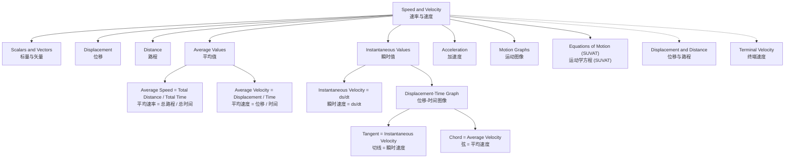

---
# Speed and Velocity / 速率与速度

---

# 1. Overview / 概述

**English:**
This sub-topic distinguishes between **speed** and **velocity**, two fundamental concepts in kinematics. Speed is a scalar quantity that measures how fast an object is moving, while velocity is a vector quantity that includes both speed and direction. Understanding this distinction is crucial for analyzing motion, as velocity directly relates to displacement and acceleration, whereas speed relates to distance. This leaf node builds on [[Scalars and Vectors]] and is a prerequisite for [[Acceleration]], [[Motion Graphs]], and [[Equations of Motion (SUVAT)]].

**中文:**
本子知识点区分了**速率**和**速度**这两个运动学中的基本概念。速率是一个标量，衡量物体运动的快慢；而速度是一个矢量，包含速率和方向。理解这一区别对于分析运动至关重要，因为速度直接与位移和加速度相关，而速率则与路程相关。本知识点建立在[[标量与矢量]]的基础上，是学习[[加速度]]、[[运动图像]]和[[运动学方程 (SUVAT)]] 的先决条件。

---

# 2. Syllabus Learning Objectives / 考纲学习目标

| CAIE 9702 (3.1 d-f) | Edexcel IAL (WPH11 U1: 1.4-1.8) |
|-----------|-------------|
| Define and distinguish between speed and velocity | Define and distinguish between speed and velocity |
| Calculate average speed and average velocity | Calculate average speed and average velocity |
| Understand instantaneous speed and velocity | Understand instantaneous speed and velocity |
| Use vector nature of velocity in problem-solving | Use vector nature of velocity in problem-solving |

**Examiner Expectations / 考官期望:**
- **English:** Students must be able to define both terms precisely, calculate them using appropriate formulas, and explain the difference in terms of scalar vs. vector quantities. Common exam tasks include interpreting motion graphs and solving problems involving average and instantaneous values.
- **中文:** 学生必须能够精确定义这两个术语，使用适当的公式进行计算，并从标量与矢量的角度解释它们的区别。常见的考试任务包括解释运动图像以及解决涉及平均和瞬时值的问题。

---

# 3. Core Definitions / 核心定义

| Term (EN/CN) | Definition (EN) | Definition (CN) | Common Mistakes / 常见错误 |
|--------------|-----------------|-----------------|---------------------------|
| **Speed** / 速率 | The rate of change of distance with time. A scalar quantity. | 路程随时间的变化率。是一个标量。 | Confusing speed with velocity; forgetting it has no direction. / 混淆速率与速度；忘记速率没有方向。 |
| **Velocity** / 速度 | The rate of change of displacement with time. A vector quantity. | 位移随时间的变化率。是一个矢量。 | Forgetting to include direction in answers; treating it as a scalar. / 忘记在答案中包含方向；将其视为标量。 |
| **Average Speed** / 平均速率 | Total distance traveled divided by total time taken. | 总路程除以总时间。 | Using displacement instead of distance in calculation. / 在计算中使用位移代替路程。 |
| **Average Velocity** / 平均速度 | Total displacement divided by total time taken. | 总位移除以总时间。 | Using distance instead of displacement. / 使用路程代替位移。 |
| **Instantaneous Speed** / 瞬时速率 | The speed at a particular instant in time. | 某一特定时刻的速率。 | Confusing with average speed; not understanding it's the limit of average speed as time interval approaches zero. / 与平均速率混淆；不理解它是时间间隔趋近于零时平均速率的极限。 |
| **Instantaneous Velocity** / 瞬时速度 | The velocity at a particular instant in time. | 某一特定时刻的速度。 | Same as above; also forgetting direction. / 同上；也忘记方向。 |

---

# 4. Key Concepts Explained / 关键概念详解

## 4.1 Scalar vs. Vector Nature / 标量与矢量性质

### Explanation / 解释
**English:** Speed is a [[Scalars and Vectors|scalar]] — it only has magnitude (e.g., 30 m/s). Velocity is a [[Scalars and Vectors|vector]] — it has both magnitude and direction (e.g., 30 m/s north). This means that an object can have a constant speed but a changing velocity if its direction changes (e.g., circular motion). Conversely, an object can have a constant velocity only if both its speed and direction are constant.

**中文:** 速率是一个[[标量与矢量|标量]]——它只有大小（例如，30 m/s）。速度是一个[[标量与矢量|矢量]]——它既有大小也有方向（例如，30 m/s 向北）。这意味着，如果一个物体的方向发生变化（例如，圆周运动），它可以具有恒定的速率但变化的速度。相反，只有当物体的速率和方向都恒定时，它才具有恒定的速度。

### Physical Meaning / 物理意义
**English:** Speed tells you "how fast" something is moving. Velocity tells you "how fast and in which direction" something is moving. This directional information is essential for predicting future positions and analyzing forces.

**中文:** 速率告诉你物体移动得“多快”。速度告诉你物体移动得“多快以及朝哪个方向”。这个方向信息对于预测未来位置和分析力至关重要。

### Common Misconceptions / 常见误区
- **English:**
  - Thinking speed and velocity are the same thing.
  - Believing that a constant speed implies constant velocity.
  - Forgetting to state direction when asked for velocity.
- **中文:**
  - 认为速率和速度是同一回事。
  - 认为恒定的速率意味着恒定的速度。
  - 在要求给出速度时忘记说明方向。

### Exam Tips / 考试提示
- **English:** Always check if the question asks for speed or velocity. If it asks for velocity, you must include direction (e.g., "to the right", "north", "towards the origin"). If only magnitude is needed, use speed.
- **中文:** 始终检查题目问的是速率还是速度。如果问的是速度，必须包含方向（例如，“向右”、“向北”、“朝向原点”）。如果只需要大小，则使用速率。

> 📷 **IMAGE PROMPT — SCALAR_VECTOR: Scalar vs Vector Comparison**
> A clear diagram showing two arrows: one labeled "Speed = 5 m/s" with no direction indicator, and another labeled "Velocity = 5 m/s East" with an arrow pointing east. Include a table comparing scalar and vector properties.

---

## 4.2 Average vs. Instantaneous Values / 平均值与瞬时值

### Explanation / 解释
**English:** Average speed/velocity is calculated over a finite time interval. Instantaneous speed/velocity is the value at a single moment. For example, a car's speedometer shows instantaneous speed, while a journey's average speed is total distance divided by total time. Instantaneous velocity is found by taking the limit of average velocity as the time interval approaches zero.

**中文:** 平均速率/速度是在一个有限的时间间隔内计算的。瞬时速率/速度是某一时刻的值。例如，汽车的速度表显示的是瞬时速率，而一段行程的平均速率是总路程除以总时间。瞬时速度是通过让时间间隔趋近于零时平均速度的极限来求得的。

### Physical Meaning / 物理意义
**English:** Average values give an overall picture of motion over a period. Instantaneous values describe the motion at a precise point, which is crucial for understanding forces and accelerations at that moment.

**中文:** 平均值给出了运动在一段时间内的整体情况。瞬时值描述了运动在精确时刻的状态，这对于理解该时刻的力和加速度至关重要。

### Common Misconceptions / 常见误区
- **English:**
  - Assuming average speed is always the arithmetic mean of two speeds (only true if time intervals are equal).
  - Confusing instantaneous speed with average speed.
- **中文:**
  - 假设平均速率总是两个速率的算术平均值（仅当时间间隔相等时才成立）。
  - 混淆瞬时速率与平均速率。

### Exam Tips / 考试提示
- **English:** For instantaneous velocity from a displacement-time graph, draw a tangent at the point and find its gradient. For average velocity, find the gradient of the chord between two points.
- **中文:** 要从位移-时间图像求瞬时速度，在该点画切线并求其斜率。要求平均速度，求两点之间弦的斜率。

---

# 5. Essential Equations / 核心公式

## Equation 1: Average Speed / 平均速率

$$ \text{Average speed} = \frac{\text{total distance}}{\text{total time}} $$

| Symbol (符号) | Meaning (EN) | Meaning (CN) | Unit (单位) |
|--------------|-------------|-------------|------------|
| $v_{avg}$ | Average speed | 平均速率 | m/s |
| $d$ | Total distance | 总路程 | m |
| $t$ | Total time | 总时间 | s |

**Conditions / 适用条件:** Always valid for any motion. / 适用于任何运动。
**Limitations / 局限性:** Does not give information about direction or variations in speed. / 不提供方向或速率变化的信息。

## Equation 2: Average Velocity / 平均速度

$$ \vec{v}_{avg} = \frac{\Delta \vec{s}}{\Delta t} = \frac{\vec{s}_f - \vec{s}_i}{t_f - t_i} $$

| Symbol (符号) | Meaning (EN) | Meaning (CN) | Unit (单位) |
|--------------|-------------|-------------|------------|
| $\vec{v}_{avg}$ | Average velocity | 平均速度 | m/s |
| $\Delta \vec{s}$ | Displacement | 位移 | m |
| $\Delta t$ | Time interval | 时间间隔 | s |

**Conditions / 适用条件:** Always valid for any motion. / 适用于任何运动。
**Limitations / 局限性:** Does not give information about variations in velocity during the interval. / 不提供时间间隔内速度变化的信息。

## Equation 3: Instantaneous Velocity / 瞬时速度

$$ \vec{v} = \lim_{\Delta t \to 0} \frac{\Delta \vec{s}}{\Delta t} = \frac{d\vec{s}}{dt} $$

| Symbol (符号) | Meaning (EN) | Meaning (CN) | Unit (单位) |
|--------------|-------------|-------------|------------|
| $\vec{v}$ | Instantaneous velocity | 瞬时速度 | m/s |
| $\frac{d\vec{s}}{dt}$ | Derivative of displacement with respect to time | 位移对时间的导数 | m/s |

**Conditions / 适用条件:** Requires calculus or graphical methods (tangent). / 需要微积分或图形方法（切线）。
**Limitations / 局限性:** Cannot be calculated from discrete data without approximation. / 没有近似值就无法从离散数据计算。

> 📋 **Edexcel Only:** Edexcel may require students to use the concept of instantaneous velocity from displacement-time graphs without formal calculus notation.
> 📋 **Edexcel 专属:** Edexcel 可能要求学生从位移-时间图像中使用瞬时速度的概念，而不使用正式的微积分符号。

---

# 6. Graphs and Relationships / 图表与关系

## 6.1 Displacement-Time Graph / 位移-时间图像

### Axes / 坐标轴
- **X-axis:** Time / 时间 (s)
- **Y-axis:** Displacement / 位移 (m)

### Shape / 形状
- **Constant velocity:** Straight line (positive gradient = positive velocity, negative gradient = negative velocity). / 恒定速度：直线（正斜率 = 正速度，负斜率 = 负速度）。
- **Changing velocity:** Curved line. / 变化的速度：曲线。

### Gradient Meaning / 斜率含义
- **Gradient of displacement-time graph = Instantaneous velocity.** / 位移-时间图像的斜率 = 瞬时速度。
- **Gradient of chord between two points = Average velocity.** / 两点之间弦的斜率 = 平均速度。

### Area Meaning / 面积含义
- **No direct physical meaning for area under a displacement-time graph.** / 位移-时间图像下的面积没有直接的物理意义。

### Exam Interpretation / 考试解读
- **English:** To find velocity at a point, draw a tangent and calculate its gradient. To find average velocity between two times, draw a chord and calculate its gradient. A horizontal line means zero velocity (stationary).
- **中文:** 要找到某一点的速度，画一条切线并计算其斜率。要找到两个时间点之间的平均速度，画一条弦并计算其斜率。水平线表示速度为零（静止）。

> 📷 **IMAGE PROMPT — DT_GRAPH: Displacement-Time Graph with Tangents**
> A displacement-time graph showing a curved line. At point A, a tangent line is drawn with its gradient calculated as 3 m/s. Between points B and C, a chord is drawn with its gradient calculated as 1.5 m/s. Labels: "Tangent = Instantaneous Velocity", "Chord = Average Velocity".

---

## 6.2 Distance-Time Graph / 路程-时间图像

### Axes / 坐标轴
- **X-axis:** Time / 时间 (s)
- **Y-axis:** Distance / 路程 (m)

### Shape / 形状
- **Constant speed:** Straight line. / 恒定速率：直线。
- **Changing speed:** Curved line. / 变化的速率：曲线。

### Gradient Meaning / 斜率含义
- **Gradient of distance-time graph = Instantaneous speed.** / 路程-时间图像的斜率 = 瞬时速率。

### Area Meaning / 面积含义
- **No direct physical meaning.** / 没有直接的物理意义。

### Exam Interpretation / 考试解读
- **English:** Distance-time graphs are always non-negative (distance cannot decrease). The gradient is always positive or zero. A horizontal line means stationary.
- **中文:** 路程-时间图像始终非负（路程不能减少）。斜率始终为正或零。水平线表示静止。

---

# 7. Required Diagrams / 必备图表

## 7.1 Speed vs. Velocity Comparison Diagram / 速率与速度对比图

### Description / 描述
**English:** A diagram showing a car moving along a curved path from point A to point B. The path length (distance) is shown as a dashed line along the curve, while the straight line from A to B represents displacement. Speed is calculated from the path length, velocity from the straight line.

**中文:** 一个显示汽车沿曲线路径从A点移动到B点的示意图。路径长度（路程）显示为沿曲线的虚线，而从A到B的直线代表位移。速率由路径长度计算，速度由直线计算。

### Image Prompt / 图片生成提示
> 📷 **IMAGE PROMPT — SPEED_VS_VELOCITY: Speed vs Velocity Illustration**
> A simple diagram showing a curved path (dashed line) from point A to point B. A straight arrow (solid line) connects A to B, labeled "Displacement". The curved path is labeled "Distance". Two text boxes: "Speed = Distance / Time (Scalar)" and "Velocity = Displacement / Time (Vector)". Include a compass rose showing direction.

### Labels Required / 需要标注
- **English:** Distance (curved path), Displacement (straight arrow), Start (A), End (B), Direction indicator.
- **中文:** 路程（曲线路径），位移（直线箭头），起点（A），终点（B），方向指示。

### Exam Importance / 考试重要性
- **English:** High — this diagram is frequently used in exam questions to test the distinction between speed and velocity.
- **中文:** 高——此图常用于考试题目中测试速率与速度的区别。

---

## 7.2 Tangent and Chord on Displacement-Time Graph / 位移-时间图像上的切线与弦

### Description / 描述
**English:** A displacement-time graph showing a curve. A tangent line is drawn at a specific point to find instantaneous velocity. A chord is drawn between two points to find average velocity.

**中文:** 一个显示曲线的位移-时间图像。在特定点画一条切线以求出瞬时速度。在两点之间画一条弦以求出平均速度。

### Image Prompt / 图片生成提示
> 📷 **IMAGE PROMPT — TANGENT_CHORD: Tangent and Chord on s-t Graph**
> A displacement-time graph with a smooth curve. At point P (t=2s, s=4m), a tangent line is drawn with its slope calculated as 2 m/s. Between points Q (t=1s, s=1m) and R (t=3s, s=7m), a chord is drawn with its slope calculated as 3 m/s. Labels: "Tangent = Instantaneous Velocity", "Chord = Average Velocity".

### Labels Required / 需要标注
- **English:** Tangent line, Chord line, Points P, Q, R, Gradient values, Axes labels (Displacement/m, Time/s).
- **中文:** 切线，弦，点 P、Q、R，斜率值，坐标轴标签（位移/m，时间/s）。

### Exam Importance / 考试重要性
- **English:** Very high — this is a standard exam technique for finding velocities from graphs.
- **中文:** 非常高——这是从图像中求速度的标准考试技巧。

---

# 8. Worked Examples / 典型例题

## Example 1: Average Speed vs. Average Velocity / 平均速率与平均速度

### Question / 题目
**English:** A runner runs 400 m east in 50 seconds, then turns around and runs 200 m west in 30 seconds. Calculate:
(a) The average speed for the entire journey.
(b) The average velocity for the entire journey.

**中文:** 一名跑步者向东跑 400 米用时 50 秒，然后转身向西跑 200 米用时 30 秒。计算：
(a) 整个行程的平均速率。
(b) 整个行程的平均速度。

### Solution / 解答

**Step 1: Calculate total distance and total displacement. / 步骤 1：计算总路程和总位移。**
- Total distance = 400 m + 200 m = 600 m
- Total displacement = 400 m (east) + (-200 m) (west) = 200 m east

**Step 2: Calculate total time. / 步骤 2：计算总时间。**
- Total time = 50 s + 30 s = 80 s

**Step 3: Calculate average speed. / 步骤 3：计算平均速率。**
$$ \text{Average speed} = \frac{\text{total distance}}{\text{total time}} = \frac{600 \text{ m}}{80 \text{ s}} = 7.5 \text{ m/s} $$

**Step 4: Calculate average velocity. / 步骤 4：计算平均速度。**
$$ \vec{v}_{avg} = \frac{\text{total displacement}}{\text{total time}} = \frac{200 \text{ m east}}{80 \text{ s}} = 2.5 \text{ m/s east} $$

### Final Answer / 最终答案
**Answer:** (a) 7.5 m/s (b) 2.5 m/s east | **答案：** (a) 7.5 m/s (b) 2.5 m/s 向东

### Quick Tip / 提示
- **English:** Notice that average speed (7.5 m/s) is much larger than average velocity (2.5 m/s) because the runner returned partway. This is a common exam scenario.
- **中文:** 注意平均速率 (7.5 m/s) 远大于平均速度 (2.5 m/s)，因为跑步者返回了一段路程。这是一个常见的考试场景。

---

## Example 2: Instantaneous Velocity from Graph / 从图像求瞬时速度

### Question / 题目
**English:** The displacement-time graph of a particle is given by $s(t) = 2t^2 + 3t$ (in meters). Find the instantaneous velocity at $t = 2$ seconds.

**中文:** 一个粒子的位移-时间图像由 $s(t) = 2t^2 + 3t$（单位：米）给出。求 $t = 2$ 秒时的瞬时速度。

### Solution / 解答

**Method 1: Using calculus (if allowed). / 方法 1：使用微积分（如果允许）。**
$$ v(t) = \frac{ds}{dt} = 4t + 3 $$
$$ v(2) = 4(2) + 3 = 8 + 3 = 11 \text{ m/s} $$

**Method 2: Using tangent on graph (graphical method). / 方法 2：在图像上使用切线（图形方法）。**
- Plot the graph of $s(t)$.
- At $t = 2$ s, $s = 2(4) + 6 = 14$ m.
- Draw a tangent at point (2, 14).
- Choose two points on the tangent, e.g., (1, 3) and (3, 25).
- Gradient = $\frac{25 - 3}{3 - 1} = \frac{22}{2} = 11$ m/s.

### Final Answer / 最终答案
**Answer:** 11 m/s | **答案：** 11 m/s

### Quick Tip / 提示
- **English:** For AS level, you are expected to use the graphical method (tangent) unless calculus is explicitly allowed. Always show your working clearly.
- **中文:** 对于 AS 阶段，除非明确允许使用微积分，否则应使用图形方法（切线）。始终清晰地展示你的计算过程。

---

# 9. Past Paper Question Types / 历年真题题型

| Question Type / 题型 | Frequency / 频率 | Difficulty / 难度 | Past Paper References / 真题索引 |
|----------------------|------------------|------------------|-------------------------------|
| Distinguish between speed and velocity in a given scenario | High | Easy | 📝 *待填入* |
| Calculate average speed and velocity from given data | High | Easy-Medium | 📝 *待填入* |
| Find instantaneous velocity from displacement-time graph | High | Medium | 📝 *待填入* |
| Interpret distance-time vs. displacement-time graphs | Medium | Medium | 📝 *待填入* |
| Vector addition of velocities (e.g., river crossing problems) | Low-Medium | Medium-Hard | 📝 *待填入* |

**Common Command Words / 常见指令词:**
- **English:** Define, Distinguish, Calculate, Determine, Find, Sketch, Interpret
- **中文:** 定义，区分，计算，确定，求出，画出，解释

---

# 10. Practical Skills Connections / 实验技能链接

**English:**
This sub-topic connects to practical work in several ways:
1. **Measuring speed:** Using light gates and data loggers to measure instantaneous and average speed of a trolley on a track.
2. **Graph plotting:** Plotting displacement-time graphs from experimental data and calculating velocities from gradients.
3. **Uncertainties:** Understanding that average speed calculations have uncertainties from both distance and time measurements. For example, if distance is measured to ±0.01 m and time to ±0.01 s, the uncertainty in speed can be calculated using percentage uncertainties.
4. **Experimental design:** Designing experiments to distinguish between speed and velocity, such as measuring motion along a curved track.

**中文:**
本子知识点通过以下几种方式与实验工作相联系：
1. **测量速率：** 使用光门和数据记录器测量轨道上小车的瞬时速率和平均速率。
2. **绘制图像：** 根据实验数据绘制位移-时间图像，并从斜率计算速度。
3. **不确定度：** 理解平均速率的计算同时包含路程和时间测量的不确定度。例如，如果路程测量到 ±0.01 m，时间测量到 ±0.01 s，则可以使用百分比不确定度计算速率的不确定度。
4. **实验设计：** 设计实验来区分速率和速度，例如测量沿曲线轨道的运动。

---

# 11. Concept Map / 概念图谱

---

# 12. Quick Revision Sheet / 速查表

| Category / 类别 | Key Points / 要点 |
|----------------|------------------|
| **Definition / 定义** | **Speed:** Scalar, rate of change of distance. **Velocity:** Vector, rate of change of displacement. / **速率：** 标量，路程的变化率。**速度：** 矢量，位移的变化率。 |
| **Key Formula / 核心公式** | Average speed = total distance / total time. Average velocity = displacement / time. / 平均速率 = 总路程 / 总时间。平均速度 = 位移 / 时间。 |
| **Key Graph / 核心图表** | **Displacement-Time:** Gradient = velocity. Tangent = instantaneous. Chord = average. / **位移-时间：** 斜率 = 速度。切线 = 瞬时。弦 = 平均。 |
| **Common Mistake / 常见错误** | Forgetting direction for velocity. Using distance instead of displacement for velocity. / 忘记速度的方向。计算速度时使用路程代替位移。 |
| **Exam Tip / 考试提示** | Always state direction for velocity. Check if question asks for speed or velocity. / 对于速度始终说明方向。检查题目问的是速率还是速度。 |
| **Vector vs. Scalar / 矢量 vs. 标量** | Speed is scalar (magnitude only). Velocity is vector (magnitude + direction). / 速率是标量（仅有大小）。速度是矢量（大小 + 方向）。 |
| **Average vs. Instantaneous / 平均 vs. 瞬时** | Average over time interval. Instantaneous at a single moment (tangent on graph). / 平均值在时间间隔内。瞬时值在某一时刻（图像上的切线）。 |