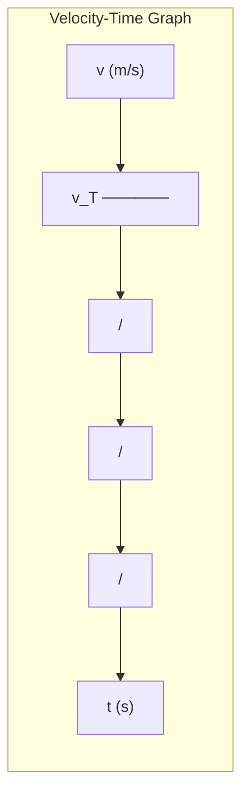

# 1. Overview / 概述

**English:**
Terminal velocity is the constant maximum velocity reached by an object falling through a fluid (air or liquid) when the drag force equals the weight of the object. This sub-topic explores how forces balance during free fall, the factors affecting terminal velocity, and its practical applications. It connects directly to [[Displacement, Velocity and Acceleration]] by showing how velocity changes over time under non-uniform acceleration, and builds on [[Scalars and Vectors]] to understand force directions. Understanding terminal velocity is crucial for analyzing real-world motion like skydiving, parachuting, and sedimentation.

**中文:**
终端速度是物体在流体（空气或液体）中下落时，当阻力等于物体重量时所达到的恒定最大速度。本子知识点探讨自由落体过程中力的平衡、影响终端速度的因素及其实际应用。它通过展示在非均匀加速度下速度随时间的变化，直接连接到[[位移、速度和加速度]]，并建立在[[标量和矢量]]的基础上来理解力的方向。理解终端速度对于分析跳伞、降落伞和沉降等真实运动至关重要。

---

# 2. Syllabus Learning Objectives / 考纲学习目标

| CAIE 9702 | Edexcel IAL |
|-----------|-------------|
| 3.1(d): Describe the motion of objects falling in a uniform gravitational field in the presence of air resistance | 1.4: Understand the concept of terminal velocity |
| 3.1(e): Recall and use the concept of terminal velocity | 1.5: Describe the forces acting on a falling object |
| 3.1(f): Interpret velocity-time graphs for objects falling with air resistance | 1.6: Explain how terminal velocity is reached |
| - | 1.7: Calculate terminal velocity from given data |
| - | 1.8: Apply terminal velocity to real-world contexts |

**Examiner Expectations / 考官期望:**
- **English:** Students must be able to describe the forces acting on a falling object, explain why terminal velocity is reached, interpret velocity-time graphs for falling objects with air resistance, and calculate terminal velocity in simple scenarios.
- **中文:** 学生必须能够描述下落物体所受的力，解释为何达到终端速度，解读有空气阻力下落物体的速度-时间图，并在简单场景中计算终端速度。

---

# 3. Core Definitions / 核心定义

| Term (EN/CN) | Definition (EN) | Definition (CN) | Common Mistakes / 常见错误 |
|--------------|-----------------|-----------------|---------------------------|
| **Terminal Velocity** / 终端速度 | The constant maximum velocity reached by an object falling through a fluid when the drag force equals the weight of the object, resulting in zero net force and zero acceleration. | 物体在流体中下落时，当阻力等于物体重量时所达到的恒定最大速度，此时合力为零，加速度为零。 | Confusing terminal velocity with maximum possible speed in a vacuum (which doesn't exist with air resistance). |
| **Drag Force** / 阻力 | A resistive force acting opposite to the direction of motion of an object through a fluid, caused by friction and pressure differences. | 物体在流体中运动时，由于摩擦和压力差而产生的与运动方向相反的阻力。 | Thinking drag is constant; it increases with speed. |
| **Weight** / 重量 | The gravitational force acting on an object, calculated as $W = mg$, where $m$ is mass and $g$ is gravitational field strength. | 作用在物体上的重力，计算公式为 $W = mg$，其中 $m$ 是质量，$g$ 是重力场强度。 | Confusing weight with mass. |
| **Net Force** / 合力 | The vector sum of all forces acting on an object; determines acceleration according to Newton's Second Law. | 作用在物体上所有力的矢量和；根据牛顿第二定律决定加速度。 | Forgetting direction when adding forces. |
| **Acceleration** / 加速度 | The rate of change of velocity; for a falling object, it decreases from $g$ to zero as terminal velocity is approached. | 速度的变化率；对于下落物体，加速度从 $g$ 减小到零，直至达到终端速度。 | Assuming acceleration is constant throughout the fall. |

---

# 4. Key Concepts Explained / 关键概念详解

## 4.1 Forces on a Falling Object / 下落物体的受力

### Explanation / 解释
**English:** When an object falls through a fluid (e.g., air), two main forces act on it:
1. **Weight ($W = mg$)** — acts downward, constant for a given mass.
2. **Drag Force ($F_d$)** — acts upward, opposing motion. Drag increases with speed, typically proportional to $v$ (low speeds) or $v^2$ (high speeds).

At the start of the fall, $W > F_d$, so there is a net downward force causing acceleration. As speed increases, drag increases, reducing the net force and acceleration. Eventually, $F_d = W$, net force becomes zero, acceleration becomes zero, and the object falls at constant terminal velocity $v_T$.

**中文:** 当物体在流体（如空气）中下落时，受到两个主要力的作用：
1. **重量 ($W = mg$)** — 向下作用，对于给定质量是恒定的。
2. **阻力 ($F_d$)** — 向上作用，阻碍运动。阻力随速度增加而增加，通常与 $v$（低速）或 $v^2$（高速）成正比。

下落开始时，$W > F_d$，因此存在向下的合力导致加速度。随着速度增加，阻力增加，合力和加速度减小。最终，$F_d = W$，合力为零，加速度为零，物体以恒定的终端速度 $v_T$ 下落。

### Physical Meaning / 物理意义
**English:** Terminal velocity represents the equilibrium between gravitational pull and fluid resistance. It's a practical limit on how fast an object can fall through a fluid, determined by the object's shape, size, mass, and the fluid's properties.

**中文:** 终端速度代表了引力与流体阻力之间的平衡。它是物体在流体中下落速度的实际极限，由物体的形状、大小、质量和流体性质决定。

### Common Misconceptions / 常见误区
- **Misconception 1:** "Heavier objects always have higher terminal velocity." → **Correction:** While mass affects weight, shape and cross-sectional area also matter. A feather has low terminal velocity despite being light.
- **Misconception 2:** "Terminal velocity is reached instantly." → **Correction:** It takes time for drag to build up; acceleration decreases gradually.
- **Misconception 3:** "At terminal velocity, there are no forces acting." → **Correction:** Forces are balanced (net force = 0), but weight and drag still act.

### Exam Tips / 考试提示
- **English:** Always state that at terminal velocity, net force = 0, so acceleration = 0. Use Newton's First Law: constant velocity implies balanced forces.
- **中文:** 始终说明在终端速度时，合力 = 0，因此加速度 = 0。使用牛顿第一定律：恒定速度意味着力平衡。

> 📷 **IMAGE PROMPT — FBD: Free Body Diagram of Falling Object**
> A clear diagram showing a falling object (e.g., a skydiver) with two arrows: a downward arrow labeled "Weight (W = mg)" and an upward arrow labeled "Drag (F_d)". At terminal velocity, both arrows are equal length. Include labels for forces and direction.

## 4.2 Factors Affecting Terminal Velocity / 影响终端速度的因素

### Explanation / 解释
**English:** Terminal velocity depends on:
1. **Mass ($m$):** Greater mass → greater weight → higher terminal velocity (if shape/size constant).
2. **Cross-sectional Area ($A$):** Larger area → greater drag → lower terminal velocity.
3. **Shape:** Streamlined shapes reduce drag → higher terminal velocity.
4. **Fluid Density ($\rho$):** Denser fluid → greater drag → lower terminal velocity.
5. **Gravitational Field Strength ($g$):** Higher $g$ → greater weight → higher terminal velocity.

**中文:** 终端速度取决于：
1. **质量 ($m$)：** 质量越大 → 重量越大 → 终端速度越高（如果形状/大小恒定）。
2. **横截面积 ($A$)：** 面积越大 → 阻力越大 → 终端速度越低。
3. **形状：** 流线型形状减少阻力 → 终端速度越高。
4. **流体密度 ($\rho$)：** 流体密度越大 → 阻力越大 → 终端速度越低。
5. **重力场强度 ($g$)：** $g$ 越大 → 重量越大 → 终端速度越高。

### Physical Meaning / 物理意义
**English:** Terminal velocity is a balance between weight (proportional to mass) and drag (proportional to area, shape factor, and fluid density). This explains why a skydiver spreads their arms to increase drag and reduce terminal velocity, or why a parachute dramatically slows descent.

**中文:** 终端速度是重量（与质量成正比）和阻力（与面积、形状因子和流体密度成正比）之间的平衡。这解释了为什么跳伞者张开双臂以增加阻力并降低终端速度，或者为什么降落伞能显著减缓下降速度。

### Common Misconceptions / 常见误区
- **Misconception:** "All objects have the same terminal velocity." → **Correction:** Terminal velocity varies widely based on the factors listed above.
- **Misconception:** "Terminal velocity only occurs in air." → **Correction:** It occurs in any fluid (air, water, oil, etc.).

### Exam Tips / 考试提示
- **English:** When asked "How does terminal velocity change if...", systematically consider how weight and drag change. Use the equation $W = mg$ and drag proportional to $v^2$ or $v$.
- **中文:** 当被问到"如果...终端速度如何变化"时，系统地考虑重量和阻力如何变化。使用方程 $W = mg$ 和阻力与 $v^2$ 或 $v$ 成正比。

---

# 5. Essential Equations / 核心公式

## Equation 1: Terminal Velocity Condition / 终端速度条件

$$ F_d = W = mg $$

| Symbol (符号) | Meaning (EN) | Meaning (CN) | Unit (单位) |
|--------------|-------------|-------------|------------|
| $F_d$ | Drag force at terminal velocity | 终端速度时的阻力 | N |
| $W$ | Weight of object | 物体重量 | N |
| $m$ | Mass of object | 物体质量 | kg |
| $g$ | Gravitational field strength | 重力场强度 | N/kg or m/s² |

**Derivation / 推导:** At terminal velocity, net force $F_{net} = W - F_d = 0$, so $F_d = W = mg$.

**Conditions / 适用条件:** Object falling through a fluid; steady state reached.

**Limitations / 局限性:** Assumes constant $g$ and uniform fluid density; doesn't account for buoyancy (significant in liquids).

## Equation 2: Drag Force (Stokes' Law for low speeds) / 阻力（低速斯托克斯定律）

$$ F_d = 6\pi\eta r v $$

| Symbol (符号) | Meaning (EN) | Meaning (CN) | Unit (单位) |
|--------------|-------------|-------------|------------|
| $\eta$ | Dynamic viscosity of fluid | 流体动力粘度 | Pa·s |
| $r$ | Radius of spherical object | 球形物体半径 | m |
| $v$ | Velocity of object | 物体速度 | m/s |

**Conditions / 适用条件:** Low Reynolds number (slow, small objects in viscous fluids).

**Limitations / 局限性:** Not valid for high-speed objects in air (turbulent flow).

## Equation 3: Drag Force (Quadratic drag for high speeds) / 阻力（高速二次阻力）

$$ F_d = \frac{1}{2} \rho C_d A v^2 $$

| Symbol (符号) | Meaning (EN) | Meaning (CN) | Unit (单位) |
|--------------|-------------|-------------|------------|
| $\rho$ | Density of fluid | 流体密度 | kg/m³ |
| $C_d$ | Drag coefficient (depends on shape) | 阻力系数（取决于形状） | dimensionless |
| $A$ | Cross-sectional area perpendicular to motion | 垂直于运动方向的横截面积 | m² |
| $v$ | Velocity | 速度 | m/s |

**Conditions / 适用条件:** High Reynolds number (typical for objects falling in air).

**Limitations / 局限性:** $C_d$ varies with shape and flow conditions; approximate for complex shapes.

> 📋 **Edexcel Only:** Edexcel may require calculation of terminal velocity using $F_d = \frac{1}{2}\rho C_d A v^2$ set equal to $mg$.

---

# 6. Graphs and Relationships / 图表与关系

## 6.1 Velocity-Time Graph for Falling Object with Air Resistance / 有空气阻力下落物体的速度-时间图

### Axes / 坐标轴
- **X-axis:** Time ($t$) / 时间 ($t$)
- **Y-axis:** Velocity ($v$) / 速度 ($v$)

### Shape / 形状
- **English:** The graph starts at the origin (0,0) with a steep slope (initial acceleration = $g$). As time increases, the slope decreases (acceleration decreases) as drag builds up. The curve approaches a horizontal asymptote at $v = v_T$ (terminal velocity). The graph is concave down (decreasing gradient).
- **中文:** 图形从原点 (0,0) 开始，斜率陡峭（初始加速度 = $g$）。随着时间增加，斜率减小（加速度减小），因为阻力增大。曲线趋近于 $v = v_T$（终端速度）处的水平渐近线。图形向下凹（梯度递减）。

### Gradient Meaning / 斜率含义
- **English:** The gradient of the $v$-$t$ graph represents acceleration. Initially, gradient = $g$ (9.81 m/s²). As terminal velocity is approached, gradient → 0.
- **中文:** $v$-$t$ 图的斜率代表加速度。初始时，斜率 = $g$ (9.81 m/s²)。接近终端速度时，斜率 → 0。

### Area Meaning / 面积含义
- **English:** The area under the $v$-$t$ graph represents displacement (distance fallen). This can be compared to the area under the constant acceleration line to show reduced distance due to air resistance.
- **中文:** $v$-$t$ 图下的面积代表位移（下落距离）。这可以与恒定加速度线下的面积进行比较，以显示空气阻力导致的距离减少。

### Exam Interpretation / 考试解读
- **English:** Be able to sketch this graph and label key features: initial gradient = $g$, asymptotic approach to $v_T$, and compare with the straight line for free fall without air resistance.
- **中文:** 能够绘制此图并标注关键特征：初始梯度 = $g$，渐近接近 $v_T$，并与无空气阻力自由落体的直线进行比较。



> 📷 **IMAGE PROMPT — GRAPH: Velocity-Time Graph for Falling Object with Air Resistance**
> A velocity-time graph showing a curve starting at origin (0,0) with steep initial slope, gradually flattening to approach a horizontal asymptote at v = v_T. Include a dashed straight line from origin showing free fall without air resistance for comparison. Label axes: "Time (s)" on x-axis, "Velocity (m/s)" on y-axis. Mark "v_T" on y-axis.

## 6.2 Acceleration-Time Graph / 加速度-时间图

### Axes / 坐标轴
- **X-axis:** Time ($t$) / 时间 ($t$)
- **Y-axis:** Acceleration ($a$) / 加速度 ($a$)

### Shape / 形状
- **English:** Starts at $a = g$ at $t = 0$. Decreases exponentially toward $a = 0$ as terminal velocity is approached. The graph is concave up (decreasing negative slope).
- **中文:** 在 $t = 0$ 时从 $a = g$ 开始。指数递减趋近于 $a = 0$，接近终端速度。图形向上凹（负斜率递减）。

### Gradient Meaning / 斜率含义
- **English:** The gradient of $a$-$t$ graph represents jerk (rate of change of acceleration), which is not typically examined at A-Level.
- **中文:** $a$-$t$ 图的斜率代表加加速度（加速度的变化率），A-Level 通常不考。

### Area Meaning / 面积含义
- **English:** The area under the $a$-$t$ graph represents change in velocity ($\Delta v$). The total area from $t=0$ to infinity equals $v_T$.
- **中文:** $a$-$t$ 图下的面积代表速度变化 ($\Delta v$)。从 $t=0$ 到无穷大的总面积等于 $v_T$。

### Exam Interpretation / 考试解读
- **English:** Understand that acceleration decreases from $g$ to 0, not instantly but gradually. The shape reflects the increasing drag force.
- **中文:** 理解加速度从 $g$ 减小到 0，不是瞬间而是逐渐的。形状反映了阻力的增加。

---

# 7. Required Diagrams / 必备图表

## 7.1 Free Body Diagram of Falling Object at Different Stages / 不同阶段下落物体的受力图

### Description / 描述
**English:** Three free body diagrams showing the forces on a falling object at three stages: (a) just released (t=0), (b) during acceleration, (c) at terminal velocity. Each shows weight (downward) and drag (upward) with arrow lengths proportional to force magnitude.

**中文:** 三个受力图显示下落物体在三个阶段所受的力：(a) 刚释放时 (t=0)，(b) 加速过程中，(c) 终端速度时。每个图显示重量（向下）和阻力（向上），箭头长度与力的大小成正比。

### Image Prompt / 图片生成提示
> 📷 **IMAGE PROMPT — FBD: Three-Stage Free Body Diagram of Falling Object**
> Three side-by-side diagrams of a falling object (sphere or skydiver shape). Stage 1 (t=0): Only one downward arrow labeled "W = mg", no upward arrow. Stage 2 (mid-fall): Downward arrow "W = mg" longer than upward arrow "F_d (small)". Stage 3 (terminal velocity): Downward arrow "W = mg" and upward arrow "F_d = mg" equal length. Include labels and direction arrows. Clean, educational style.

### Labels Required / 需要标注
- **English:** Weight ($W = mg$), Drag ($F_d$), Net Force ($F_{net}$), Direction of motion
- **中文:** 重量 ($W = mg$)，阻力 ($F_d$)，合力 ($F_{net}$)，运动方向

### Exam Importance / 考试重要性
- **English:** High — free body diagrams are frequently tested in both CAIE and Edexcel exams. Students must correctly show force directions and relative magnitudes.
- **中文:** 高 — 受力图在 CAIE 和 Edexcel 考试中经常出现。学生必须正确显示力的方向和相对大小。

## 7.2 Velocity-Time Graph with Key Points / 带关键点的速度-时间图

### Description / 描述
**English:** A velocity-time graph for a falling object with air resistance, annotated with key points: initial acceleration = $g$, region of decreasing acceleration, terminal velocity $v_T$, and comparison line for free fall without air resistance.

**中文:** 有空气阻力下落物体的速度-时间图，标注关键点：初始加速度 = $g$，加速度递减区域，终端速度 $v_T$，以及无空气阻力自由落体的比较线。

### Image Prompt / 图片生成提示
> 📷 **IMAGE PROMPT — GRAPH: Annotated Velocity-Time Graph for Terminal Velocity**
> A velocity-time graph with a curved line from origin approaching horizontal asymptote. Annotate: "Initial gradient = g (9.81 m/s²)" at start, "Decreasing acceleration" along curve, "v_T" at asymptote. Add dashed straight line from origin labeled "Free fall (no air resistance)". Label axes clearly. Include grid lines for reference.

### Labels Required / 需要标注
- **English:** $v_T$, $t$ (time to approach terminal velocity), initial gradient = $g$, free fall comparison line
- **中文:** $v_T$，$t$（接近终端速度的时间），初始梯度 = $g$，自由落体比较线

### Exam Importance / 考试重要性
- **English:** High — interpreting and sketching this graph is a common exam question. Understanding the shape and its physical meaning is essential.
- **中文:** 高 — 解读和绘制此图是常见的考试题目。理解其形状和物理意义至关重要。

---

# 8. Worked Examples / 典型例题

## Example 1: Calculating Terminal Velocity / 计算终端速度

### Question / 题目
**English:** A skydiver of mass 80 kg falls through air. At terminal velocity, the drag force is given by $F_d = \frac{1}{2} \rho C_d A v^2$, where $\rho = 1.2 \text{ kg/m}^3$, $C_d = 0.7$, and $A = 0.5 \text{ m}^2$. Calculate the terminal velocity $v_T$. Take $g = 9.81 \text{ m/s}^2$.

**中文:** 一个质量为 80 kg 的跳伞者在空气中下落。在终端速度时，阻力由 $F_d = \frac{1}{2} \rho C_d A v^2$ 给出，其中 $\rho = 1.2 \text{ kg/m}^3$，$C_d = 0.7$，$A = 0.5 \text{ m}^2$。计算终端速度 $v_T$。取 $g = 9.81 \text{ m/s}^2$。

### Solution / 解答

**Step 1:** At terminal velocity, drag force equals weight.
$$ F_d = W = mg = 80 \times 9.81 = 784.8 \text{ N} $$

**Step 2:** Set drag equation equal to weight.
$$ \frac{1}{2} \rho C_d A v_T^2 = mg $$
$$ \frac{1}{2} \times 1.2 \times 0.7 \times 0.5 \times v_T^2 = 784.8 $$

**Step 3:** Solve for $v_T^2$.
$$ 0.21 \times v_T^2 = 784.8 $$
$$ v_T^2 = \frac{784.8}{0.21} = 3737.14 $$

**Step 4:** Take square root.
$$ v_T = \sqrt{3737.14} \approx 61.1 \text{ m/s} $$

### Final Answer / 最终答案
**Answer:** $v_T \approx 61.1 \text{ m/s}$ | **答案：** $v_T \approx 61.1 \text{ m/s}$

### Quick Tip / 提示
- **English:** Always check units — ensure mass in kg, area in m², density in kg/m³. The drag coefficient $C_d$ is dimensionless.
- **中文:** 始终检查单位 — 确保质量以 kg 为单位，面积以 m² 为单位，密度以 kg/m³ 为单位。阻力系数 $C_d$ 是无量纲的。

## Example 2: Interpreting Velocity-Time Graph / 解读速度-时间图

### Question / 题目
**English:** A ball is dropped from rest. Figure 1 shows its velocity-time graph. (a) Describe the motion of the ball. (b) Explain why the gradient decreases. (c) Estimate the terminal velocity from the graph.

**中文:** 一个球从静止释放。图 1 显示其速度-时间图。(a) 描述球的运动。(b) 解释为什么梯度减小。(c) 从图中估计终端速度。

### Solution / 解答

**Part (a):** The ball starts from rest ($v=0$). Initially, it accelerates at approximately $g = 9.81 \text{ m/s}^2$ (steep gradient). As speed increases, acceleration decreases (gradient decreases). Eventually, the ball approaches a constant velocity (terminal velocity), where the graph becomes horizontal.

**Part (b):** The gradient decreases because the drag force increases with speed. As drag increases, the net downward force ($W - F_d$) decreases, so acceleration ($a = F_{net}/m$) decreases. When $F_d = W$, net force = 0, acceleration = 0, and velocity becomes constant.

**Part (c):** From the graph, the horizontal asymptote is at approximately $v = 50 \text{ m/s}$. Therefore, terminal velocity $v_T \approx 50 \text{ m/s}$.

### Final Answer / 最终答案
**Answer:** (a) Accelerating motion with decreasing acceleration; (b) Drag increases with speed, reducing net force; (c) $v_T \approx 50 \text{ m/s}$ | **答案：** (a) 加速度递减的加速运动；(b) 阻力随速度增加，减小合力；(c) $v_T \approx 50 \text{ m/s}$

### Quick Tip / 提示
- **English:** When describing motion, mention both velocity and acceleration changes. Use phrases like "acceleration decreases from g to zero" and "velocity increases to a constant value."
- **中文:** 描述运动时，同时提及速度和加速度的变化。使用"加速度从 g 减小到零"和"速度增加到恒定值"等短语。

---

# 9. Past Paper Question Types / 历年真题题型

| Question Type / 题型 | Frequency / 频率 | Difficulty / 难度 | Past Paper References / 真题索引 |
|----------------------|------------------|------------------|-------------------------------|
| Describe forces on falling object / 描述下落物体受力 | High / 高 | Easy / 容易 | 📝 *待填入* |
| Explain why terminal velocity is reached / 解释为何达到终端速度 | High / 高 | Medium / 中等 | 📝 *待填入* |
| Sketch/interpret v-t graph for falling object / 绘制/解读下落物体v-t图 | High / 高 | Medium / 中等 | 📝 *待填入* |
| Calculate terminal velocity from given data / 从给定数据计算终端速度 | Medium / 中 | Medium / 中等 | 📝 *待填入* |
| Compare motion with/without air resistance / 比较有/无空气阻力的运动 | Medium / 中 | Medium / 中等 | 📝 *待填入* |
| Factors affecting terminal velocity / 影响终端速度的因素 | Low-Medium / 低-中 | Easy / 容易 | 📝 *待填入* |

**Common Command Words / 常见指令词:**
- **English:** Describe, Explain, Sketch, Calculate, Determine, Compare, State
- **中文:** 描述，解释，绘制，计算，确定，比较，陈述

---

# 10. Practical Skills Connections / 实验技能链接

**English:**
Terminal velocity connects to practical work in several ways:

1. **Measuring Terminal Velocity:** Drop small spheres (e.g., ball bearings) through viscous liquids (glycerol, oil) and measure the time to fall between two marks after terminal velocity is reached. Use $v = \frac{d}{t}$ to calculate terminal velocity.

2. **Investigating Factors:** Vary the sphere's radius, mass, or the liquid's viscosity to see how terminal velocity changes. Plot graphs of $v_T$ vs $r^2$ (Stokes' law predicts $v_T \propto r^2$).

3. **Uncertainties:** Measure multiple times, calculate mean and uncertainty. Consider timing errors, parallax in reading marks, and ensuring terminal velocity is reached before timing.

4. **Graph Plotting:** Plot $v_T$ against $r^2$ to verify Stokes' law. The gradient can be used to calculate fluid viscosity.

5. **Experimental Design:** Discuss how to ensure terminal velocity is reached (e.g., drop from sufficient height, use markers at appropriate positions).

**中文:**
终端速度通过多种方式与实验工作联系：

1. **测量终端速度：** 将小球（如滚珠）通过粘性液体（甘油、油）下落，测量终端速度达到后通过两个标记之间的时间。使用 $v = \frac{d}{t}$ 计算终端速度。

2. **研究影响因素：** 改变球的半径、质量或液体的粘度，观察终端速度如何变化。绘制 $v_T$ 与 $r^2$ 的关系图（斯托克斯定律预测 $v_T \propto r^2$）。

3. **不确定度：** 多次测量，计算平均值和不确定度。考虑计时误差、读取标记时的视差，以及确保在计时前已达到终端速度。

4. **图表绘制：** 绘制 $v_T$ 与 $r^2$ 的关系图以验证斯托克斯定律。斜率可用于计算流体粘度。

5. **实验设计：** 讨论如何确保达到终端速度（例如，从足够高度释放，在适当位置使用标记）。

> 📋 **CAIE Only:** CAIE Paper 3 (Practical) may include experiments on terminal velocity in viscous liquids, requiring careful measurement and graph plotting.

> 📋 **Edexcel Only:** Edexcel Unit 1 Core Practical 1 involves investigating the motion of a falling object, including terminal velocity concepts.

---

# 11. Concept Map / 概念图谱

```mermaid
graph TD
    %% Terminal Velocity Concept Map
    TV[Terminal Velocity / 终端速度] --> COND[Condition: F_d = W = mg / 条件：阻力 = 重量]
    TV --> FORCES[Forces on Falling Object / 下落物体受力]
    TV --> GRAPH[Velocity-Time Graph / 速度-时间图]
    TV --> FACTORS[Factors Affecting v_T / 影响终端速度的因素]
    
    FORCES --> W[Weight / 重量 W = mg]
    FORCES --> FD[Drag Force / 阻力 F_d]
    FD --> LOW[Low Speed: F_d ∝ v / 低速：F_d ∝ v]
    FD --> HIGH[High Speed: F_d ∝ v² / 高速：F_d ∝ v²]
    
    GRAPH --> SHAPE[Shape: Concave down / 形状：向下凹]
    GRAPH --> GRADIENT[Gradient: Acceleration / 斜率：加速度]
    GRAPH --> ASYMPTOTE[Asymptote at v_T / 渐近线在 v_T]
    
    FACTORS --> MASS[Mass / 质量 m]
    FACTORS --> AREA[Cross-sectional Area / 横截面积 A]
    FACTORS --> SHAPE2[Shape / 形状]
    FACTORS --> FLUID[Fluid Density / 流体密度 ρ]
    FACTORS --> G[Gravitational Field / 重力场 g]
    
    TV --> PRAC[Practical Applications / 实际应用]
    PRAC --> SKYDIVE[Skydiving / 跳伞]
    PRAC --> PARACHUTE[Parachute Design / 降落伞设计]
    PRAC --> SEDIMENT[Sedimentation / 沉降]
    
    %% Links to parent and siblings
    TV -->|Parent| DVA[Displacement, Velocity and Acceleration / 位移、速度和加速度]
    DVA -->|Sibling| ACC[Acceleration / 加速度]
    DVA -->|Sibling| SV[Speed and Velocity / 速率和速度]
    
    %% Prerequisites
    TV -.->|Prerequisite| SVEC[Scalars and Vectors / 标量和矢量]
    TV -.->|Related| SUVAT[Equations of Motion (SUVAT) / 运动方程]
    TV -.->|Related| MGRAPH[Motion Graphs / 运动图]
```

---

# 12. Quick Revision Sheet / 速查表

| Category / 类别 | Key Points / 要点 |
|----------------|------------------|
| **Definition / 定义** | Terminal velocity = constant max speed when drag = weight / 终端速度 = 阻力等于重量时的恒定最大速度 |
| **Key Condition / 核心条件** | $F_d = W = mg$ → Net force = 0 → $a = 0$ / 合力 = 0 → 加速度 = 0 |
| **Key Formula / 核心公式** | $F_d = \frac{1}{2}\rho C_d A v^2$ (high speed) or $F_d = 6\pi\eta r v$ (low speed) / 高速或低速阻力公式 |
| **Key Graph / 核心图表** | v-t graph: steep start → curve flattens → horizontal at $v_T$ / v-t图：陡峭开始 → 曲线变平 → 在 $v_T$ 处水平 |
| **Key Factors / 关键因素** | Mass ↑ → $v_T$ ↑; Area ↑ → $v_T$ ↓; Streamlined shape → $v_T$ ↑ / 质量↑ → 终端速度↑；面积↑ → 终端速度↓；流线型 → 终端速度↑ |
| **Common Exam Question / 常见考题** | "Explain why terminal velocity is reached" / "解释为何达到终端速度" |
| **Key Phrase / 关键短语** | "As speed increases, drag increases, reducing net force and acceleration" / "随着速度增加，阻力增加，减小合力和加速度" |
| **Practical Tip / 实验提示** | Use viscous liquids (glycerol) for measurable terminal velocities / 使用粘性液体（甘油）获得可测量的终端速度 |
| **Misconception Alert / 误区提醒** | At terminal velocity, forces are balanced, NOT absent / 终端速度时，力是平衡的，不是不存在 |
| **Exam Board Difference / 考局差异** | CIE: Focus on qualitative description; Edexcel: May require calculation using $F_d = \frac{1}{2}\rho C_d A v^2$ / CIE：侧重定性描述；Edexcel：可能要求使用公式计算 |