# 1. Overview / 概述

**English:** The Equations of Motion (SUVAT) describe the relationship between displacement (s), initial velocity (u), final velocity (v), acceleration (a), and time (t) for objects moving with **constant acceleration** in a straight line. This topic is fundamental to all of kinematics and forms the mathematical backbone for analysing motion in both CAIE 9702 and Edexcel IAL. Real-world applications include calculating stopping distances for vehicles, analysing free-fall motion, designing roller coasters, and understanding projectile trajectories. In both exam boards, this is a high-frequency topic appearing in multiple-choice, structured, and practical questions.

**中文:** 运动方程（SUVAT）描述了在**匀加速直线运动**中位移（s）、初速度（u）、末速度（v）、加速度（a）和时间（t）之间的关系。该主题是所有运动学的基础，构成了CAIE 9702和Edexcel IAL中分析运动的数学核心。实际应用包括计算车辆制动距离、分析自由落体运动、设计过山车以及理解抛射体轨迹。在两个考试局中，这都是高频考点，出现在选择题、结构题和实验题中。

# 2. Syllabus Learning Objectives / 考纲学习目标

| CAIE 9702 | Edexcel IAL |
|-----------|-------------|
| 3.1(g) Define and use displacement, velocity, acceleration | 1.9 Use equations of motion for constant acceleration |
| 3.1(h) Derive and use equations of motion for constant acceleration | 1.10 Derive the SUVAT equations |
| 3.1(i) Solve problems using equations of motion | 1.11 Solve problems involving free fall under gravity |
| 3.1(j) Analyse motion under gravity (free fall) | 1.12 Analyse motion using velocity-time graphs |
| 3.1(k) Interpret displacement-time and velocity-time graphs | |

**Examiner Expectations / 考官期望:**
- **English:** Students must memorise all five SUVAT equations and know which variables are required for each. They must correctly assign positive/negative signs for direction (especially in free fall). Derivation of equations from [[Velocity-Time Graphs]] is expected in both boards. In CAIE, graphical interpretation is emphasised; in Edexcel, algebraic manipulation and multi-stage problems are common.
- **中文:** 学生必须熟记所有五个SUVAT方程，并知道每个方程需要哪些变量。必须正确分配方向的正负号（尤其在自由落体中）。两个考试局都要求从[[速度-时间图]]推导方程。CAIE强调图形解释，Edexcel常见代数运算和多阶段问题。

> 📋 **CAIE Only:** CAIE Paper 1 (MCQ) often tests equation selection and sign conventions. Paper 2 (AS structured) may require derivation from graphs.
> 📋 **Edexcel Only:** Edexcel Unit 1 frequently includes multi-stage motion problems (e.g., car accelerating then braking) and free-fall with reaction time.

# 3. Core Definitions / 核心定义

| Term (EN/CN) | Definition (EN) | Definition (CN) | Common Mistakes / 常见错误 |
|--------------|-----------------|-----------------|---------------------------|
| [[Displacement]] / 位移 (s) | The straight-line distance from start to finish in a specified direction (vector) | 从起点到终点的直线距离，有指定方向（矢量） | Confusing with distance (scalar) |
| [[Initial Velocity]] / 初速度 (u) | The velocity at time t = 0 | 在时间t=0时的速度 | Using final velocity as initial |
| [[Final Velocity]] / 末速度 (v) | The velocity at time t | 在时间t时的速度 | Forgetting direction sign |
| [[Acceleration]] / 加速度 (a) | The rate of change of velocity (vector) | 速度的变化率（矢量） | Confusing with velocity; forgetting sign for deceleration |
| [[Time]] / 时间 (t) | The time interval over which motion occurs | 运动发生的时间间隔 | Using total time instead of interval |
| [[Constant Acceleration]] / 匀加速度 | Acceleration that does not change in magnitude or direction | 大小和方向都不变的加速度 | Assuming acceleration is always constant |
| [[Free Fall]] / 自由落体 | Motion under the influence of gravity only, with negligible air resistance | 仅在重力作用下运动，忽略空气阻力 | Forgetting g = 9.81 m s⁻² (or 9.8) |
| [[g (Acceleration due to Gravity)]] / 重力加速度 | The acceleration of an object due to Earth's gravitational field (≈ 9.81 m s⁻² downward) | 物体因地球引力场产生的加速度（向下≈9.81 m s⁻²） | Using g = 10 m s⁻² without stating approximation |

# 4. Key Concepts Explained / 关键概念详解

## 4.1 The Five SUVAT Equations / 五个SUVAT方程

### Explanation / 解释
**English:** The five SUVAT equations are derived from the definitions of [[Acceleration]] and [[Displacement]] under [[Constant Acceleration]]. Each equation relates four of the five variables (s, u, v, a, t). The equations are:

1. $v = u + at$ (no s)
2. $s = \frac{u+v}{2}t$ (no a)
3. $s = ut + \frac{1}{2}at^2$ (no v)
4. $v^2 = u^2 + 2as$ (no t)
5. $s = vt - \frac{1}{2}at^2$ (no u)

**中文:** 五个SUVAT方程是从[[加速度]]和[[位移]]在[[匀加速度]]下的定义推导出来的。每个方程关联五个变量（s, u, v, a, t）中的四个。方程如上所示。

### Physical Meaning / 物理意义
**English:** Each equation represents a different relationship. Equation (1) shows velocity as a linear function of time. Equation (2) uses average velocity to find displacement. Equation (3) shows displacement as a quadratic function of time. Equation (4) is time-independent, useful when time is unknown. Equation (5) is less commonly used but helpful when initial velocity is unknown.

**中文:** 每个方程代表不同的关系。方程(1)显示速度是时间的线性函数。方程(2)使用平均速度求位移。方程(3)显示位移是时间的二次函数。方程(4)与时间无关，在时间未知时很有用。方程(5)较少使用，但在初速度未知时很有帮助。

### Common Misconceptions / 常见误区
- Assuming all equations work for non-constant acceleration (they don't)
- Forgetting that displacement, velocity, and acceleration are vectors (sign matters)
- Using equation (3) when time is not given (use equation 4 instead)
- Confusing u and v in equation (2) — order doesn't matter for average velocity
- Thinking equation (5) is just a rearrangement of equation (3) (it's derived differently)

### Exam Tips / 考试提示
**English:** Always list the known variables (s, u, v, a, t) and identify which one is missing. Choose the equation that does NOT contain the missing variable. Draw a diagram showing direction with a positive sign convention. For free fall, a = g = +9.81 m s⁻² when downward is positive.

**中文:** 始终列出已知变量（s, u, v, a, t）并确定哪个变量缺失。选择不包含缺失变量的方程。画图显示方向并规定正方向。对于自由落体，当下方向为正时，a = g = +9.81 m s⁻²。

> 📷 **IMAGE PROMPT — SUVAT-EQUATIONS: The Five SUVAT Equations Reference Card**
> A clean, organised reference card showing all five SUVAT equations. Each equation is boxed with the missing variable highlighted in red. Variables labelled: s (displacement), u (initial velocity), v (final velocity), a (acceleration), t (time). A small diagram of a car accelerating along a straight road with arrows showing u, v, a, and s. Style: textbook-quality, white background, blue and red colour scheme. Exam importance: HIGH — must memorise.

## 4.2 Sign Conventions / 符号约定

### Explanation / 解释
**English:** Since [[Displacement]], [[Velocity]], and [[Acceleration]] are vectors, direction matters. Choose a positive direction (usually upward or to the right) and stick with it. Any vector in the opposite direction is negative. For [[Free Fall Under Gravity]], if upward is positive, then a = -g = -9.81 m s⁻². If downward is positive, then a = +g = +9.81 m s⁻².

**中文:** 由于[[位移]]、[[速度]]和[[加速度]]是矢量，方向很重要。选择一个正方向（通常向上或向右）并保持一致。任何相反方向的矢量都是负的。对于[[自由落体运动]]，如果向上为正，则a = -g = -9.81 m s⁻²。如果向下为正，则a = +g = +9.81 m s⁻²。

### Physical Meaning / 物理意义
**English:** The sign convention ensures mathematical consistency. A negative acceleration does not always mean deceleration — it means acceleration in the negative direction. Deceleration occurs when velocity and acceleration have opposite signs.

**中文:** 符号约定确保数学一致性。负加速度并不总是意味着减速——它意味着在负方向上的加速度。当速度和加速度符号相反时，才发生减速。

### Common Misconceptions / 常见误区
- Thinking "deceleration" means negative acceleration (it means acceleration opposite to velocity)
- Forgetting to assign signs to displacement (e.g., a ball thrown upward returns to negative displacement if upward is positive)
- Mixing up signs when using equation (4) — squaring eliminates sign, so direction must be tracked separately

### Exam Tips / 考试提示
**English:** State your positive direction clearly at the start of every SUVAT problem. For objects thrown upward and caught at the same height, displacement s = 0. For objects thrown upward and falling to the ground, s is negative (if upward is positive).

**中文:** 在每个SUVAT问题的开头明确说明你的正方向。对于向上抛出并在同一高度接住的物体，位移s = 0。对于向上抛出并落到地面的物体，s为负（如果向上为正）。

## 4.3 Free Fall Under Gravity / 重力作用下的自由落体

### Explanation / 解释
**English:** [[Free Fall]] occurs when the only force acting on an object is [[Weight]] (gravity). Air resistance is assumed negligible. All objects in free fall near Earth's surface accelerate downward at g ≈ 9.81 m s⁻² (or 9.8 m s⁻² in some exam contexts). This is independent of mass — a feather and a hammer fall at the same rate in a vacuum.

**中文:** 当作用在物体上的唯一力是[[重力]]时，发生[[自由落体]]。假设空气阻力可忽略。地球表面附近所有自由落体物体都以g ≈ 9.81 m s⁻²（某些考试中为9.8 m s⁻²）向下加速。这与质量无关——在真空中羽毛和锤子以相同速率下落。

### Physical Meaning / 物理意义
**English:** The acceleration g is constant near Earth's surface (small height changes). For an object dropped from rest: u = 0, a = g (downward positive). For an object thrown upward: at the highest point, v = 0, but a = g throughout (gravity never stops acting).

**中文:** 在地球表面附近（高度变化小），加速度g是恒定的。对于从静止释放的物体：u = 0，a = g（向下为正）。对于向上抛出的物体：在最高点，v = 0，但a = g始终存在（重力从不停止作用）。

### Common Misconceptions / 常见误区
- Thinking acceleration is zero at the highest point (it's still g)
- Believing heavier objects fall faster (they don't in free fall)
- Forgetting that g is positive or negative depending on sign convention
- Using g = 10 m s⁻² without stating it's an approximation

### Exam Tips / 考试提示
**English:** For free fall problems, always write a = ±9.81 m s⁻² with the sign based on your chosen positive direction. For objects thrown upward, the time to reach maximum height equals the time to fall back (if caught at same height). Use v = 0 at the highest point.

**中文:** 对于自由落体问题，始终根据你选择的正方向写出a = ±9.81 m s⁻²。对于向上抛出的物体，到达最大高度的时间等于落回的时间（如果在同一高度接住）。在最高点使用v = 0。

> 📷 **IMAGE PROMPT — FREE-FALL: Free Fall Under Gravity Diagram**
> A diagram showing three scenarios: (1) Ball dropped from rest — u=0, a=g downward, increasing v. (2) Ball thrown upward — u upward, a=g downward, v decreases to 0 at top, then increases downward. (3) Ball thrown downward — u downward, a=g downward, v increases. Arrows show velocity vectors at multiple points. Labels: "Highest point: v=0, a=g", "g = 9.81 m s⁻² downward". Style: clean physics textbook diagram, white background, blue arrows for velocity, red arrow for acceleration. Exam importance: VERY HIGH — appears in nearly every exam.

## 4.4 Two-Stage Motion Problems / 两阶段运动问题

### Explanation / 解释
**English:** [[Two-Stage Motion Problems]] involve an object that changes acceleration during its motion (e.g., a car accelerating then braking, or a ball thrown upward then falling). Each stage has constant acceleration, but the acceleration changes between stages. The final velocity of stage 1 becomes the initial velocity of stage 2. The total displacement is the sum of displacements from each stage.

**中文:** [[两阶段运动问题]]涉及在运动过程中改变加速度的物体（例如，汽车加速然后刹车，或球向上抛出然后下落）。每个阶段都有匀加速度，但加速度在阶段之间变化。阶段1的末速度成为阶段2的初速度。总位移是每个阶段位移之和。

### Physical Meaning / 物理意义
**English:** Real-world motion rarely has constant acceleration throughout. Two-stage problems model realistic scenarios like a car accelerating from rest, travelling at constant speed, then braking. The key is to treat each stage separately with its own SUVAT variables, then link them through the common variable (usually v at the transition point).

**中文:** 现实世界的运动很少全程具有恒定加速度。两阶段问题模拟现实场景，如汽车从静止加速、匀速行驶、然后刹车。关键是将每个阶段单独处理，使用自己的SUVAT变量，然后通过共同变量（通常是过渡点的v）将它们连接起来。

### Common Misconceptions / 常见误区
- Using the same acceleration for both stages
- Forgetting that displacement is cumulative (total s = s₁ + s₂)
- Not recognising that v at end of stage 1 = u for stage 2
- Mixing up time intervals (t₁ and t₂ are separate)

### Exam Tips / 考试提示
**English:** Draw a timeline or velocity-time graph for the whole motion. Label each stage clearly. Write separate SUVAT lists for each stage. The velocity at the transition point is the key linking variable. For [[Velocity-Time Graphs]], the area under each segment gives displacement for that stage.

**中文:** 为整个运动画一个时间线或速度-时间图。清楚标记每个阶段。为每个阶段分别列出SUVAT变量。过渡点的速度是关键连接变量。对于[[速度-时间图]]，每个线段下的面积给出该阶段的位移。

> 📷 **IMAGE PROMPT — TWO-STAGE: Two-Stage Motion Velocity-Time Graph**
> A velocity-time graph showing three stages: (1) Linear increase from 0 to v₁ (acceleration), (2) Horizontal line at v₁ (constant velocity), (3) Linear decrease from v₁ to 0 (deceleration). Axes labelled: v (m s⁻¹) and t (s). Areas shaded for each stage. Labels: "Stage 1: a₁", "Stage 2: a=0", "Stage 3: a₂ (negative)". Style: graph paper background, clear gridlines, coloured shading. Exam importance: HIGH — common in both CAIE and Edexcel.

# 5. Essential Equations / 核心公式

## 5.1 Equation 1: v = u + at / 公式1：v = u + at

$$ v = u + at $$

| Symbol (符号) | Meaning (EN/CN) | Unit (单位) |
|---------------|-----------------|-------------|
| v | Final velocity / 末速度 | m s⁻¹ |
| u | Initial velocity / 初速度 | m s⁻¹ |
| a | Acceleration / 加速度 | m s⁻² |
| t | Time / 时间 | s |

**Derivation / 推导:** From definition of acceleration: $a = \frac{v-u}{t}$, rearranged gives $v = u + at$.

**Conditions / 适用条件:** Constant acceleration only.

**Limitations / 局限性:** Does not involve displacement s. Cannot be used if time is unknown.

**Rearrangements / 变形:**
- $u = v - at$
- $a = \frac{v-u}{t}$
- $t = \frac{v-u}{a}$

## 5.2 Equation 2: s = (u+v)t/2 / 公式2：s = (u+v)t/2

$$ s = \frac{u+v}{2}t $$

| Symbol (符号) | Meaning (EN/CN) | Unit (单位) |
|---------------|-----------------|-------------|
| s | Displacement / 位移 | m |
| u | Initial velocity / 初速度 | m s⁻¹ |
| v | Final velocity / 末速度 | m s⁻¹ |
| t | Time / 时间 | s |

**Derivation / 推导:** From average velocity: $\bar{v} = \frac{u+v}{2}$, and $s = \bar{v}t$.

**Conditions / 适用条件:** Constant acceleration only (average velocity formula only valid for constant acceleration).

**Limitations / 局限性:** Does not involve acceleration a. Cannot be used if acceleration is unknown but time is known (use equation 3 instead).

**Rearrangements / 变形:**
- $u = \frac{2s}{t} - v$
- $v = \frac{2s}{t} - u$
- $t = \frac{2s}{u+v}$

## 5.3 Equation 3: s = ut + ½at² / 公式3：s = ut + ½at²

$$ s = ut + \frac{1}{2}at^2 $$

| Symbol (符号) | Meaning (EN/CN) | Unit (单位) |
|---------------|-----------------|-------------|
| s | Displacement / 位移 | m |
| u | Initial velocity / 初速度 | m s⁻¹ |
| a | Acceleration / 加速度 | m s⁻² |
| t | Time / 时间 | s |

**Derivation / 推导:** From area under [[Velocity-Time Graphs]]: area = rectangle (ut) + triangle (½at²).

**Conditions / 适用条件:** Constant acceleration only.

**Limitations / 局限性:** Does not involve final velocity v. Cannot be used if time is unknown.

**Rearrangements / 变形:**
- $u = \frac{s}{t} - \frac{1}{2}at$
- $a = \frac{2(s-ut)}{t^2}$
- $t = \frac{-u \pm \sqrt{u^2 + 2as}}{a}$ (quadratic — two solutions possible)

## 5.4 Equation 4: v² = u² + 2as / 公式4：v² = u² + 2as

$$ v^2 = u^2 + 2as $$

| Symbol (符号) | Meaning (EN/CN) | Unit (单位) |
|---------------|-----------------|-------------|
| v | Final velocity / 末速度 | m s⁻¹ |
| u | Initial velocity / 初速度 | m s⁻¹ |
| a | Acceleration / 加速度 | m s⁻² |
| s | Displacement / 位移 | m |

**Derivation / 推导:** Eliminate t from equations (1) and (3): from (1) $t = \frac{v-u}{a}$, substitute into (3).

**Conditions / 适用条件:** Constant acceleration only.

**Limitations / 局限性:** Does not involve time t. Cannot be used if displacement is unknown. Note: squaring eliminates sign — direction must be tracked separately.

**Rearrangements / 变形:**
- $u = \sqrt{v^2 - 2as}$
- $a = \frac{v^2 - u^2}{2s}$
- $s = \frac{v^2 - u^2}{2a}$

## 5.5 Equation 5: s = vt - ½at² / 公式5：s = vt - ½at²

$$ s = vt - \frac{1}{2}at^2 $$

| Symbol (符号) | Meaning (EN/CN) | Unit (单位) |
|---------------|-----------------|-------------|
| s | Displacement / 位移 | m |
| v | Final velocity / 末速度 | m s⁻¹ |
| a | Acceleration / 加速度 | m s⁻² |
| t | Time / 时间 | s |

**Derivation / 推导:** From equation (3) with u replaced by $u = v - at$ (from equation 1).

**Conditions / 适用条件:** Constant acceleration only.

**Limitations / 局限性:** Does not involve initial velocity u. Less commonly used but helpful when u is unknown.

**Rearrangements / 变形:**
- $v = \frac{s}{t} + \frac{1}{2}at$
- $a = \frac{2(vt - s)}{t^2}$

# 6. Graphs and Relationships / 图表与关系

## 6.1 Velocity-Time Graph for Constant Acceleration / 匀加速运动的速度-时间图

**Axes / 坐标轴:** x-axis: Time (t / s), y-axis: Velocity (v / m s⁻¹)

**Shape / 形状:** Straight line (linear). Gradient = acceleration (a). y-intercept = initial velocity (u).

**Gradient Meaning / 斜率含义:**
- **English:** The gradient of a v-t graph equals the acceleration. A positive gradient means acceleration in the positive direction; a negative gradient means acceleration in the negative direction (or deceleration if velocity is positive).
- **中文:** v-t图的斜率等于加速度。正斜率表示正方向加速；负斜率表示负方向加速（如果速度为正，则为减速）。

**Area Meaning / 面积含义:**
- **English:** The area under a v-t graph equals the displacement. For constant acceleration, area = area of trapezium = $\frac{u+v}{2}t$.
- **中文:** v-t图下的面积等于位移。对于匀加速运动，面积 = 梯形面积 = $\frac{u+v}{2}t$。

**Exam Interpretation / 考试解读:**
- **English:** In CAIE, you may be asked to derive SUVAT equations from v-t graphs. In Edexcel, you may need to calculate displacement from area under non-linear v-t graphs (using counting squares or integration).
- **中文:** 在CAIE中，可能会要求你从v-t图推导SUVAT方程。在Edexcel中，可能需要从非线性v-t图下的面积计算位移（使用数方格或积分法）。

**Common Questions / 常见问题:**
- Calculate acceleration from gradient
- Calculate displacement from area
- Find distance travelled (total area, ignoring sign)
- Determine when object changes direction (v = 0)

> 📷 **IMAGE PROMPT — VT-GRAPH: Velocity-Time Graph for Constant Acceleration**
> A velocity-time graph showing a straight line from (0, u) to (t, v). Axes labelled: "v / m s⁻¹" and "t / s". Gradient triangle shown with Δv and Δt labelled. Area under graph shaded as a trapezium with labels: "Area = s = ½(u+v)t". Style: graph paper, clear gridlines, blue line, red gradient triangle, green shaded area. Exam importance: VERY HIGH — derivation of equations.

## 6.2 Displacement-Time Graph for Constant Acceleration / 匀加速运动的位移-时间图

**Axes / 坐标轴:** x-axis: Time (t / s), y-axis: Displacement (s / m)

**Shape / 形状:** Parabola (quadratic). For positive acceleration, curve opens upward. For negative acceleration, curve opens downward.

**Gradient Meaning / 斜率含义:**
- **English:** The gradient of a s-t graph equals the velocity. At any point, the tangent gradient gives instantaneous velocity.
- **中文:** s-t图的斜率等于速度。在任何点，切线的斜率给出瞬时速度。

**Area Meaning / 面积含义:**
- **English:** The area under a s-t graph has no physical meaning.
- **中文:** s-t图下的面积没有物理意义。

**Exam Interpretation / 考试解读:**
- **English:** Used to find velocity from gradient. For constant acceleration, the s-t graph is a parabola. The gradient increases (or decreases) linearly.
- **中文:** 用于从斜率求速度。对于匀加速运动，s-t图是抛物线。斜率线性增加（或减少）。

**Common Questions / 常见问题:**
- Find instantaneous velocity from tangent gradient
- Determine acceleration from curvature of parabola
- Identify when velocity is zero (turning point of parabola)

## 6.3 Acceleration-Time Graph for Constant Acceleration / 匀加速运动的加速度-时间图

**Axes / 坐标轴:** x-axis: Time (t / s), y-axis: Acceleration (a / m s⁻²)

**Shape / 形状:** Horizontal straight line (constant value).

**Gradient Meaning / 斜率含义:**
- **English:** The gradient of an a-t graph has no physical meaning (it would be "jerk" — rate of change of acceleration, not in A-Level syllabus).
- **中文:** a-t图的斜率没有物理意义（将是"加加速度"——加速度的变化率，不在A-Level大纲中）。

**Area Meaning / 面积含义:**
- **English:** The area under an a-t graph equals the change in velocity (v - u).
- **中文:** a-t图下的面积等于速度变化量（v - u）。

**Exam Interpretation / 考试解读:**
- **English:** Simple graph — just shows constant acceleration. Area gives Δv. Rarely tested directly but useful for understanding.
- **中文:** 简单图形——仅显示恒定加速度。面积给出Δv。很少直接考查，但对理解有用。

# 7. Required Diagrams / 必备图表

## 7.1 SUVAT Variables Diagram / SUVAT变量图

> 📷 **IMAGE PROMPT — SUVAT-VARS: SUVAT Variables on a Moving Object**
> A diagram showing a car moving along a straight horizontal road. Labels: "u (initial velocity)" at the start position, "v (final velocity)" at the end position, "s (displacement)" as an arrow from start to end, "a (acceleration)" as an arrow in the direction of motion, "t (time)" as a stopwatch icon. The car is shown at two positions: t=0 and t=t. Style: clean, modern textbook illustration, white background, colour-coded arrows (blue for u, green for v, red for a, orange for s). Exam importance: HIGH — helps visualise variables.

## 7.2 Free Fall Motion Diagram / 自由落体运动图

> 📷 **IMAGE PROMPT — FREEFALL-DETAIL: Detailed Free Fall Motion with Velocity Vectors**
> A vertical diagram showing a ball thrown upward from ground level. Multiple positions of the ball shown at equal time intervals. Velocity vectors (blue arrows) at each position: upward arrows decreasing in length until the top, then downward arrows increasing in length. Acceleration vector (red arrow) shown as constant downward at all positions. Labels: "u (upward)", "v = 0 at highest point", "a = g = 9.81 m s⁻² downward (constant)", "s = 0 when caught at same height". Style: physics textbook quality, white background, clear vector arrows. Exam importance: VERY HIGH — classic exam scenario.

## 7.3 Two-Stage Motion Timeline / 两阶段运动时间线

> 📷 **IMAGE PROMPT — TWO-STAGE-TIMELINE: Two-Stage Motion Timeline Diagram**
> A horizontal timeline divided into two segments. Stage 1 labelled "Acceleration: a₁ = +2 m s⁻²" with a car shown speeding up. Stage 2 labelled "Braking: a₂ = -4 m s⁻²" with a car shown slowing down. Variables listed below each stage: Stage 1: u₁=0, v₁=?, a₁=+2, t₁=5s, s₁=?; Stage 2: u₂=v₁, v₂=0, a₂=-4, t₂=?, s₂=?. A connecting arrow shows "v₁ = u₂". Style: clean infographic style, colour-coded stages (green for acceleration, red for braking). Exam importance: HIGH — common in Edexcel.

# 8. Worked Examples / 典型例题

## Example 1: Free Fall from Rest / 例1：从静止自由落体

### Question / 题目
**English:** A stone is dropped from rest from the top of a cliff. It takes 3.0 seconds to reach the sea below. Calculate:
(a) The velocity of the stone just before it hits the water.
(b) The height of the cliff.
Assume g = 9.81 m s⁻² and air resistance is negligible.

**中文:** 一块石头从悬崖顶部从静止释放。它需要3.0秒到达下面的海面。计算：
(a) 石头即将撞击水面时的速度。
(b) 悬崖的高度。
假设g = 9.81 m s⁻²，空气阻力可忽略。

### Image Prompt / 图片提示
> 📷 **IMAGE PROMPT — EX1-FREEFALL: Stone Dropped from Cliff**
> A diagram showing a cliff with a stone at the top. Downward arrow labelled "u = 0, a = g = 9.81 m s⁻²". Stone shown at bottom with arrow "v = ?". Height labelled "s = ?". Time "t = 3.0 s" shown. Style: simple line drawing, clear labels. Exam importance: standard free fall problem.

### Solution / 解答

**Step 1: List known variables / 列出已知变量**
- u = 0 m s⁻¹ (dropped from rest)
- a = +9.81 m s⁻² (downward positive)
- t = 3.0 s
- v = ? (part a)
- s = ? (part b)

**Step 2: Choose positive direction / 选择正方向**
Downward is positive.

**Step 3: Part (a) — Find v / 求v**
Use equation (1): $v = u + at$
$$v = 0 + (9.81)(3.0)$$
$$v = 29.43 \text{ m s}^{-1}$$
$$v \approx 29.4 \text{ m s}^{-1} \text{ (3 s.f.)}$$

**Step 4: Part (b) — Find s / 求s**
Use equation (3): $s = ut + \frac{1}{2}at^2$
$$s = (0)(3.0) + \frac{1}{2}(9.81)(3.0)^2$$
$$s = 0 + \frac{1}{2}(9.81)(9)$$
$$s = \frac{1}{2}(88.29)$$
$$s = 44.145 \text{ m}$$
$$s \approx 44.1 \text{ m (3 s.f.)}$$

**Alternative for (b):** Use equation (2): $s = \frac{u+v}{2}t = \frac{0+29.43}{2}(3.0) = 44.145 \text{ m}$

### Final Answer / 最终答案
(a) v = 29.4 m s⁻¹ downward
(b) s = 44.1 m

### Examiner Notes / 考官点评
**English:** This is a straightforward free-fall problem. Common mistakes include: using g = 10 instead of 9.81 (lose accuracy marks), forgetting to state direction in the answer, or using the wrong sign convention. Always show your working and state your positive direction. In CAIE, they may ask for the answer to 3 significant figures.

**中文:** 这是一个直接的自由落体问题。常见错误包括：使用g = 10而不是9.81（失去精度分），忘记在答案中说明方向，或使用错误的符号约定。始终展示你的计算过程并说明正方向。在CAIE中，他们可能要求保留3位有效数字。

## Example 2: Two-Stage Motion — Car Accelerating Then Braking / 例2：两阶段运动——汽车加速然后刹车

### Question / 题目
**English:** A car starts from rest and accelerates uniformly at 2.0 m s⁻² for 5.0 seconds. The driver then applies the brakes, causing a uniform deceleration of 4.0 m s⁻² until the car stops.
Calculate:
(a) The maximum speed reached by the car.
(b) The total distance travelled by the car.

**中文:** 一辆汽车从静止开始，以2.0 m s⁻²的加速度匀加速5.0秒。然后司机刹车，产生4.0 m s⁻²的匀减速，直到汽车停止。
计算：
(a) 汽车达到的最大速度。
(b) 汽车行驶的总距离。

### Image Prompt / 图片提示
> 📷 **IMAGE PROMPT — EX2-TWOSTAGE: Two-Stage Car Motion**
> A diagram showing a car on a straight road. Stage 1: car at rest, then accelerating with a₁ = +2.0 m s⁻² for t₁ = 5.0 s. Stage 2: car braking with a₂ = -4.0 m s⁻² until stop. Labels: u₁=0, v₁=v_max, u₂=v_max, v₂=0. Arrows showing direction of motion. Style: simple, clear, with stage boundaries marked. Exam importance: HIGH — classic two-stage problem.

### Solution / 解答

**Stage 1: Acceleration / 阶段1：加速**
- u₁ = 0 m s⁻¹
- a₁ = +2.0 m s⁻²
- t₁ = 5.0 s
- v₁ = ? (this is v_max)
- s₁ = ?

**Stage 2: Braking / 阶段2：刹车**
- u₂ = v₁ (final velocity of stage 1 = initial velocity of stage 2)
- a₂ = -4.0 m s⁻² (deceleration, opposite to direction of motion)
- v₂ = 0 m s⁻¹
- t₂ = ?
- s₂ = ?

**Step 1: Part (a) — Find v_max / 求最大速度**
Use equation (1) for stage 1:
$$v_1 = u_1 + a_1 t_1$$
$$v_1 = 0 + (2.0)(5.0)$$
$$v_1 = 10 \text{ m s}^{-1}$$
$$\text{Therefore, } v_{\text{max}} = 10 \text{ m s}^{-1}$$

**Step 2: Find s₁ / 求s₁**
Use equation (3) for stage 1:
$$s_1 = u_1 t_1 + \frac{1}{2}a_1 t_1^2$$
$$s_1 = 0 + \frac{1}{2}(2.0)(5.0)^2$$
$$s_1 = \frac{1}{2}(2.0)(25)$$
$$s_1 = 25 \text{ m}$$

**Step 3: Find s₂ / 求s₂**
For stage 2: u₂ = 10 m s⁻¹, v₂ = 0, a₂ = -4.0 m s⁻²
Use equation (4) (no t₂ needed):
$$v_2^2 = u_2^2 + 2a_2 s_2$$
$$0 = (10)^2 + 2(-4.0)s_2$$
$$0 = 100 - 8s_2$$
$$8s_2 = 100$$
$$s_2 = 12.5 \text{ m}$$

**Step 4: Part (b) — Find total distance / 求总距离**
$$s_{\text{total}} = s_1 + s_2 = 25 + 12.5 = 37.5 \text{ m}$$

**Alternative method using v-t graph:**
Area under v-t graph = total displacement.
Stage 1: triangle area = ½ × 5 × 10 = 25 m
Stage 2: triangle area = ½ × t₂ × 10, where t₂ = (v₂ - u₂)/a₂ = (0-10)/(-4) = 2.5 s
Area = ½ × 2.5 × 10 = 12.5 m
Total = 37.5 m

### Final Answer / 最终答案
(a) v_max = 10 m s⁻¹
(b) Total distance = 37.5 m

### Examiner Notes / 考官点评
**English:** This is a classic two-stage problem. Key points: (1) The maximum speed is the final velocity of stage 1. (2) This becomes the initial velocity of stage 2. (3) Deceleration means acceleration is negative relative to velocity direction. (4) Total distance is the sum of distances from each stage. Common mistakes: using a₂ = +4.0 (wrong sign), forgetting to add s₁ and s₂, or using the same time for both stages. The v-t graph method is often faster and less error-prone.

**中文:** 这是一个经典的两阶段问题。关键点：(1) 最大速度是阶段1的末速度。(2) 这成为阶段2的初速度。(3) 减速意味着加速度相对于速度方向为负。(4) 总距离是每个阶段距离之和。常见错误：使用a₂ = +4.0（符号错误），忘记加s₁和s₂，或对两个阶段使用相同的时间。v-t图方法通常更快且不易出错。

# 9. Past Paper Question Types / 历年真题题型

| Question Type / 题型 | Frequency / 频率 | Difficulty / 难度 | Past Paper References / 真题索引 |
|----------------------|------------------|-------------------|----------------------------------|
| SUVAT equation selection and calculation / SUVAT方程选择与计算 | Very High / 非常高 | Easy-Medium / 简单-中等 | 📝 *待填入* |
| Free fall under gravity / 重力作用下的自由落体 | Very High / 非常高 | Medium / 中等 | 📝 *待填入* |
| Two-stage motion problems / 两阶段运动问题 | High / 高 | Medium-Hard / 中等-困难 | 📝 *待填入* |
| Derivation from v-t graphs / 从v-t图推导 | Medium / 中等 | Medium / 中等 | 📝 *待填入* |
| Sign convention and direction / 符号约定与方向 | High / 高 | Easy-Medium / 简单-中等 | 📝 *待填入* |
| Multi-part structured questions / 多部分结构题 | Very High / 非常高 | Medium-Hard / 中等-困难 | 📝 *待填入* |
| Practical: measuring g / 实验：测量g | Medium / 中等 | Medium / 中等 | 📝 *待填入* |
| Reaction time problems / 反应时间问题 | Low-Medium / 低-中等 | Medium / 中等 | 📝 *待填入* |

> 📝 **题库整理中 / Question Bank Under Construction:** Specific past paper references (e.g., CAIE 9702/21/M/J/19 Q3, Edexcel WPH11/01 Jan 2020 Q5) will be added as the knowledge graph expands. For now, focus on the question types and practice with available resources.

**Common Command Words / 常见指令词:**
- **Calculate / 计算:** Use SUVAT equations to find a numerical value
- **Derive / 推导:** Show the steps to obtain an equation from definitions or graphs
- **State / 陈述:** Write a definition or equation without explanation
- **Explain / 解释:** Give reasons for a physical phenomenon
- **Sketch / 草图:** Draw a graph showing key features (shape, intercepts)
- **Determine / 确定:** Find a value, often from a graph
- **Show that / 证明:** Demonstrate that a given result follows from given information

# 10. Practical Skills Connections / 实验技能链接

**English:** The SUVAT equations are central to several practical experiments in both CAIE and Edexcel:

1. **Measuring g using free fall (CAIE Paper 3 / Edexcel Unit 3):** Drop a ball bearing through light gates or use a ticker timer. Measure time and distance, then use $s = \frac{1}{2}gt^2$ to find g. Key skills: setting up equipment, measuring time accurately, repeating measurements, calculating mean, identifying and reducing systematic errors (e.g., reaction time, air resistance).

2. **Measuring acceleration on a ramp (CAIE Paper 3):** Use a trolley on an inclined plane with light gates or ticker tape. Measure u, v, and t, then calculate a using $a = \frac{v-u}{t}$. Skills: angle measurement, friction compensation, data logging.

3. **Velocity-time graph from ticker tape (Both boards):** Analyse ticker tape to find velocities at different times, plot v-t graph, find gradient (acceleration) and area (displacement). Skills: measuring distances, calculating time intervals, plotting graphs, drawing lines of best fit.

4. **Uncertainties in SUVAT experiments:** Time measurements often have the largest uncertainty (reaction time ~0.1-0.2 s). Use $s = \frac{1}{2}gt^2$ to propagate uncertainties: $\frac{\Delta g}{g} = \frac{2\Delta t}{t} + \frac{\Delta s}{s}$.

**中文:** SUVAT方程是CAIE和Edexcel多个实验的核心：

1. **使用自由落体测量g（CAIE Paper 3 / Edexcel Unit 3）：** 通过光门或使用打点计时器释放钢球。测量时间和距离，然后使用$s = \frac{1}{2}gt^2$求g。关键技能：设置设备、准确测量时间、重复测量、计算平均值、识别和减少系统误差（如反应时间、空气阻力）。

2. **在斜面上测量加速度（CAIE Paper 3）：** 在斜面上使用小车配合光门或打点计时器。测量u、v和t，然后使用$a = \frac{v-u}{t}$计算a。技能：角度测量、摩擦补偿、数据记录。

3. **从打点计时器带获得速度-时间图（两个考试局）：** 分析打点计时器带以找出不同时间的速度，绘制v-t图，求斜率（加速度）和面积（位移）。技能：测量距离、计算时间间隔、绘制图表、画最佳拟合线。

4. **SUVAT实验中的不确定度：** 时间测量通常具有最大的不确定度（反应时间约0.1-0.2秒）。使用$s = \frac{1}{2}gt^2$传播不确定度：$\frac{\Delta g}{g} = \frac{2\Delta t}{t} + \frac{\Delta s}{s}$。

> 📋 **CAIE Only:** Paper 3 (Practical) often requires you to describe how to set up the experiment, take readings, and analyse data to find g. Paper 5 (Planning) may ask you to design an experiment to test SUVAT relationships.
> 📋 **Edexcel Only:** Unit 3 (Practical Skills) includes core practicals on motion. You may be asked to evaluate experimental methods, suggest improvements, and calculate uncertainties.

# 11. Concept Map / 概念图谱

```mermaid
graph TD
    A[Equations of Motion SUVAT] --> B[The Five SUVAT Equations]
    A --> C[Choosing the Right Equation]
    A --> D[Free Fall Under Gravity]
    A --> E[Two-Stage Motion Problems]
    
    B --> B1["v = u + at"]
    B --> B2["s = (u+v)t/2"]
    B --> B3["s = ut + ½at²"]
    B --> B4["v² = u² + 2as"]
    B --> B5["s = vt - ½at²"]
    
    C --> C1[Identify known variables]
    C --> C2[Identify missing variable]
    C --> C3[Select equation without missing variable]
    
    D --> D1["a = g = 9.81 m s⁻²"]
    D --> D2[Sign conventions]
    D --> D3[Highest point: v = 0]
    
    E --> E1[Stage 1: constant a₁]
    E --> E2[Stage 2: constant a₂]
    E --> E3["v₁ (end of stage 1) = u₂ (start of stage 2)"]
    E --> E4["Total s = s₁ + s₂"]
    
    F[Prerequisites] --> A
    F --> F1[Displacement, Velocity and Acceleration]
    F --> F2[Scalars and Vectors]
    
    A --> G[Related Topics]
    G --> G1[Motion Graphs]
    G --> G2[Projectile Motion]
    G --> G3[Forces and Newton's Laws]
    
    H[Practical Skills] --> A
    H --> H1[Measuring g]
    H --> H2[Ticker timer experiments]
    H --> H3[Light gate experiments]
    H --> H4[Uncertainty analysis]
```



# 12. Examiner Insights / 考官洞察

**English:**

**Most Tested Ideas (CAIE 9702):**
1. **Free fall problems** appear in nearly every exam — dropping objects, throwing upward, calculating height or time.
2. **Equation selection** — MCQs often test whether students can identify which equation to use based on given variables.
3. **Sign conventions** — marks are frequently lost for incorrect signs, especially in free fall with upward positive.
4. **Derivation from v-t graphs** — Paper 2 may ask to derive $s = ut + \frac{1}{2}at^2$ from the area under a v-t graph.
5. **Two-stage problems** — common in structured questions, especially with cars or balls.

**Most Tested Ideas (Edexcel IAL):**
1. **Multi-stage motion** — very common, often involving acceleration, constant velocity, then deceleration.
2. **Reaction time problems** — car stopping distances with thinking distance and braking distance.
3. **Free fall with initial velocity** — throwing objects upward or downward.
4. **Algebraic manipulation** — rearranging equations and solving quadratics.
5. **Graphical analysis** — interpreting v-t and s-t graphs, calculating gradients and areas.

**Mark Scheme Wording / 评分方案措辞:**
- "Correct substitution into correct equation" (M1 mark)
- "Correct calculation" (A1 mark)
- "Correct sign convention stated" (B1 mark)
- "Correct direction stated in answer" (B1 mark)
- "Use of g = 9.81 m s⁻²" (if not specified, accept 9.8)

**Common Lost Marks / 常见失分点:**
- Not stating positive direction
- Using wrong sign for acceleration (especially in free fall)
- Forgetting that displacement can be negative
- Using g = 10 without stating approximation
- Not giving answers to correct significant figures
- Mixing up u and v in equations
- Not adding displacements in multi-stage problems

**High-Scoring Structures / 高分结构:**
1. List all known variables with units
2. State positive direction
3. Write the equation you will use
4. Substitute values with correct signs
5. Calculate and give answer with unit and direction
6. Check significant figures

**中文:**

**最常考的概念（CAIE 9702）：**
1. **自由落体问题**几乎出现在每次考试中——释放物体、向上抛出、计算高度或时间。
2. **方程选择**——选择题常测试学生是否能根据给定变量识别使用哪个方程。
3. **符号约定**——因符号错误频繁失分，尤其在向上为正的自由落体中。
4. **从v-t图推导**——Paper 2可能要求从v-t图下的面积推导$s = ut + \frac{1}{2}at^2$。
5. **两阶段问题**——常见于结构题，尤其是汽车或球的问题。

**最常考的概念（Edexcel IAL）：**
1. **多阶段运动**——非常常见，常涉及加速、匀速、然后减速。
2. **反应时间问题**——汽车制动距离，包括思考距离和制动距离。
3. **具有初速度的自由落体**——向上或向下抛出物体。
4. **代数运算**——重排方程和解二次方程。
5. **图形分析**——解释v-t和s-t图，计算斜率和面积。

# 13. Quick Revision Sheet / 速查表

| Category / 类别 | Key Points / 要点 |
|-----------------|-------------------|
| **Five Equations / 五个方程** | $v = u + at$, $s = \frac{u+v}{2}t$, $s = ut + \frac{1}{2}at^2$, $v^2 = u^2 + 2as$, $s = vt - \frac{1}{2}at^2$ |
| **Variables / 变量** | s (m), u (m s⁻¹), v (m s⁻¹), a (m s⁻²), t (s) |
| **Condition / 条件** | Constant acceleration only / 仅适用于匀加速度 |
| **Vectors / 矢量** | s, u, v, a are vectors — direction matters / s, u, v, a是矢量——方向重要 |
| **Free Fall / 自由落体** | a = g = 9.81 m s⁻² downward; at highest point v = 0, a = g / a = g = 9.81 m s⁻²向下；最高点v = 0，a = g |
| **Sign Convention / 符号约定** | Choose positive direction; opposite direction = negative / 选择正方向；相反方向为负 |
| **Equation Selection / 方程选择** | Identify missing variable → choose equation without it / 确定缺失变量→选择不含该变量的方程 |
| **Two-Stage / 两阶段** | v₁(end of stage 1) = u₂(start of stage 2); total s = s₁ + s₂ / v₁(阶段1结束) = u₂(阶段2开始)；总s = s₁ + s₂ |
| **v-t Graph / v-t图** | Gradient = a; Area = s / 斜率 = a；面积 = s |
| **s-t Graph / s-t图** | Gradient = v (instantaneous); parabola for constant a / 斜率 = v（瞬时）；匀加速时为抛物线 |
| **Common g values / 常用g值** | 9.81 m s⁻² (exact), 9.8 m s⁻² (approximate), 10 m s⁻² (rough estimate — state approximation) |
| **Key Units / 关键单位** | All SI: m, s, m s⁻¹, m s⁻² / 全部SI单位：m, s, m s⁻¹, m s⁻² |
| **Common Mistakes / 常见错误** | Wrong sign, wrong equation, forgetting direction, not stating positive direction / 符号错误、方程错误、忘记方向、未说明正方向 |

# 14. Metadata / 元数据

```yaml
title:
  en: "Equations of Motion (SUVAT)"
  cn: "运动方程（SUVAT）"
subject: Physics
syllabus: [CAIE 9702, Edexcel IAL]
cie_ref: "3.1 (g-k)"
edexcel_ref: "WPH11 U1: 1.9-1.12"
level: AS
node_type: topic_hub
difficulty: intermediate
prerequisites:
  - "[[Displacement, Velocity and Acceleration]]"
  - "[[Scalars and Vectors]]"
related_topics:
  - "[[Motion Graphs]]"
  - "[[Projectile Motion]]"
  - "[[Forces and Newton's Laws]]"
sub_topics:
  - "[[The Five SUVAT Equations]]"
  - "[[Choosing the Right Equation]]"
  - "[[Free Fall Under Gravity]]"
  - "[[Two-Stage Motion Problems]]"
formula_count: 5
diagram_count: 7
exam_frequency: very_high
language: bilingual_en_cn
last_updated: 2024-01
```

---
*This note is part of the Obsidian Physics Knowledge Graph. Link to related notes using [[wikilinks]].*