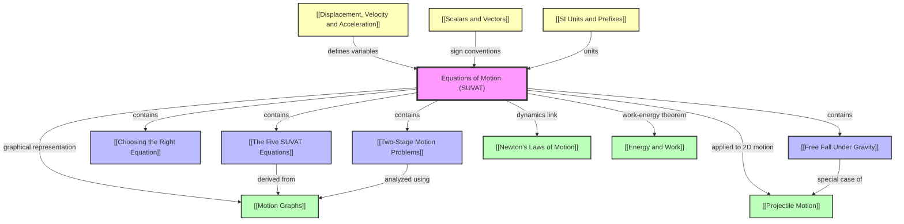

# 1. Overview / 概述

**English:**
The Equations of Motion, commonly known as the SUVAT equations, form the mathematical backbone of classical kinematics. These five equations describe the motion of an object moving with constant acceleration in a straight line. They relate the five key kinematic variables: displacement ($s$), initial velocity ($u$), final velocity ($v$), acceleration ($a$), and time ($t$). This topic is fundamental to understanding how objects move under uniform acceleration, whether it's a car accelerating on a road, a ball falling under gravity, or a rocket launching into space.

In the context of Cambridge 9702 and Edexcel IAL A-Level Physics, mastering SUVAT equations is essential for solving a wide range of mechanics problems. These equations are the primary tool for analyzing linear motion with constant acceleration, forming the foundation for more advanced topics like [[Projectile Motion]] and [[Motion Graphs]]. Real-world applications include calculating stopping distances for vehicles, designing roller coasters, analyzing sports performance, and understanding free-fall phenomena. The ability to select and apply the correct equation from the five available is a key skill assessed in both examination boards, often in multi-stage problems that require careful reasoning and algebraic manipulation.

**中文：**
运动方程，通常称为SUVAT方程，构成了经典运动学的数学基础。这五个方程描述了物体在直线上以恒定加速度运动的情况。它们关联了五个关键运动学变量：位移 ($s$)、初速度 ($u$)、末速度 ($v$)、加速度 ($a$) 和时间 ($t$)。这个主题对于理解物体在匀加速下如何运动至关重要，无论是汽车在路上加速、球在重力作用下下落，还是火箭发射进入太空。

在剑桥9702和爱德思IAL A-Level物理的背景下，掌握SUVAT方程对于解决广泛的力学问题至关重要。这些方程是分析匀加速直线运动的主要工具，为更高级的主题如[[抛体运动]]和[[运动图像]]奠定了基础。实际应用包括计算车辆的制动距离、设计过山车、分析运动表现以及理解自由落体现象。从五个可用方程中选择并应用正确方程的能力是两大考试委员会评估的关键技能，通常出现在需要仔细推理和代数运算的多阶段问题中。

---

# 2. Syllabus Learning Objectives / 考纲学习目标

**English:**
The following table outlines the specific learning objectives for the Equations of Motion (SUVAT) topic as required by Cambridge 9702 and Edexcel IAL syllabuses. Both boards expect students to derive, recall, and apply these equations to solve problems involving constant acceleration in one dimension. The key difference lies in the depth of derivation required and the specific contexts used in exam questions.

**中文：**
下表概述了剑桥9702和爱德思IAL教学大纲对运动方程（SUVAT）主题的具体学习目标。两个考试委员会都期望学生能够推导、回忆并应用这些方程来解决涉及一维匀加速的问题。主要区别在于所需的推导深度以及考试问题中使用的具体情境。

| CAIE 9702 | Edexcel IAL |
|-----------|-------------|
| 3.1(g) Define displacement, velocity, and acceleration. | 1.9 Use the equations of motion for constant acceleration in a straight line. |
| 3.1(h) Use graphical methods to represent displacement, velocity, and acceleration. | 1.10 Derive the equations of motion for constant acceleration. |
| 3.1(i) Derive the equations of motion for constant acceleration in a straight line. | 1.11 Apply the equations of motion to solve problems involving falling bodies and projectile motion. |
| 3.1(j) Apply the equations of motion to solve problems involving falling bodies and other constant acceleration situations. | 1.12 Describe the motion of objects falling in a uniform gravitational field in the absence of air resistance. |
| 3.1(k) Describe the motion of objects falling in a uniform gravitational field in the absence of air resistance. | |

> 📋 **CIE Only:** CAIE explicitly requires students to derive the equations from velocity-time graphs. This is a common exam question where students must show the graphical derivation of $v = u + at$ and $s = ut + \frac{1}{2}at^2$. The derivation of $v^2 = u^2 + 2as$ is also expected, often by combining the first two equations.
>
> 📋 **Edexcel Only:** Edexcel places greater emphasis on the algebraic derivation of the equations, often starting from the definition of acceleration $a = \frac{v-u}{t}$. Edexcel also explicitly links SUVAT equations to [[Projectile Motion]] in objective 1.11, requiring students to resolve initial velocity into horizontal and vertical components before applying the equations.

**Examiner Expectations / 考官期望:**
- **English:** Students must be able to recall all five SUVAT equations without prompts. They must correctly identify the five variables ($s, u, v, a, t$) and know which three are given in a problem to select the appropriate equation. Sign conventions (positive/negative directions) must be consistently applied. In multi-stage problems, students must break the motion into segments and apply the equations to each segment separately.
- **中文：** 学生必须能够无需提示地回忆所有五个SUVAT方程。他们必须正确识别五个变量 ($s, u, v, a, t$)，并知道问题中给出了哪三个变量以选择适当的方程。必须一致地应用符号约定（正/负方向）。在多阶段问题中，学生必须将运动分解为若干段，并对每一段分别应用方程。

---

# 3. Core Definitions / 核心定义

**English:**
The following table provides the official definitions of the five SUVAT variables and related terms, as expected in A-Level examinations. Understanding these definitions precisely is crucial for correct equation application and avoiding common mistakes.

**中文：**
下表提供了五个SUVAT变量及相关术语的官方定义，这是A-Level考试所期望的。精确理解这些定义对于正确应用方程和避免常见错误至关重要。

| Term (EN/CN) | Definition (EN) | Definition (CN) | Common Mistakes / 常见错误 |
|--------------|-----------------|-----------------|---------------------------|
| **Displacement ($s$) / 位移** | The straight-line distance from the starting point to the finishing point in a specified direction. A vector quantity. | 从起点到终点的直线距离，具有指定方向。矢量量。 | Confusing displacement with distance (scalar). Forgetting to specify direction. |
| **Initial Velocity ($u$) / 初速度** | The velocity of an object at the start of the time interval under consideration. A vector quantity. | 物体在所考虑时间间隔开始时的速度。矢量量。 | Using final velocity as initial velocity in multi-stage problems. |
| **Final Velocity ($v$) / 末速度** | The velocity of an object at the end of the time interval under consideration. A vector quantity. | 物体在所考虑时间间隔结束时的速度。矢量量。 | Forgetting that $v$ can be zero (object comes to rest) or negative (object reverses direction). |
| **Acceleration ($a$) / 加速度** | The rate of change of velocity. $a = \frac{\Delta v}{\Delta t}$. A vector quantity. Units: $m/s^2$. | 速度的变化率。$a = \frac{\Delta v}{\Delta t}$。矢量量。单位：$m/s^2$。 | Confusing acceleration with velocity. Forgetting that deceleration is negative acceleration. |
| **Time ($t$) / 时间** | The duration of the motion being considered. A scalar quantity. Units: $s$. | 所考虑运动的持续时间。标量量。单位：$s$。 | Using total journey time instead of the time for a specific segment. |
| **Constant Acceleration / 匀加速** | Acceleration that does not change in magnitude or direction over the time interval considered. | 在所考虑的时间间隔内，加速度的大小和方向都不改变。 | Assuming acceleration is constant when it is not (e.g., air resistance present). |
| **Free Fall / 自由落体** | Motion under the influence of gravity alone, with no other forces acting (e.g., air resistance neglected). Acceleration is $g \approx 9.81 \, m/s^2$ downward. | 仅在重力作用下的运动，没有其他力作用（例如，忽略空气阻力）。加速度向下，为 $g \approx 9.81 \, m/s^2$。 | Forgetting that $g$ is always downward. Using $g = 10 \, m/s^2$ without specifying (acceptable in some exams but not precise). |

---

# 4. Key Concepts Explained / 关键概念详解

## 4.1 The Five SUVAT Equations / 五个SUVAT方程

### Explanation / 解释
**English:**
The five SUVAT equations are derived from the definitions of acceleration and the area under a velocity-time graph. They are valid only for motion with **constant acceleration** in a straight line. Each equation relates four of the five variables ($s, u, v, a, t$), meaning if three variables are known, the fourth can be found. The equations are:

1. $v = u + at$ (no $s$)
2. $s = \frac{(u+v)}{2}t$ (no $a$)
3. $s = ut + \frac{1}{2}at^2$ (no $v$)
4. $s = vt - \frac{1}{2}at^2$ (no $u$)
5. $v^2 = u^2 + 2as$ (no $t$)

These equations are interconnected. For example, equation (1) can be derived from the definition of acceleration, and equation (2) from the average velocity. Equations (3) and (4) are derived by substituting (1) into (2). Equation (5) is derived by eliminating $t$ from (1) and (3). Understanding these derivations is crucial for [[The Five SUVAT Equations]].

**中文：**
五个SUVAT方程是从加速度的定义和速度-时间图像下的面积推导出来的。它们仅适用于直线上的**匀加速**运动。每个方程关联五个变量 ($s, u, v, a, t$) 中的四个，这意味着如果已知三个变量，就可以求出第四个。方程如下：

1. $v = u + at$ (不含 $s$)
2. $s = \frac{(u+v)}{2}t$ (不含 $a$)
3. $s = ut + \frac{1}{2}at^2$ (不含 $v$)
4. $s = vt - \frac{1}{2}at^2$ (不含 $u$)
5. $v^2 = u^2 + 2as$ (不含 $t$)

这些方程是相互关联的。例如，方程(1)可以从加速度的定义推导出来，方程(2)可以从平均速度推导出来。方程(3)和(4)是通过将(1)代入(2)推导出来的。方程(5)是通过从(1)和(3)中消去 $t$ 推导出来的。理解这些推导对于掌握[[五个SUVAT方程]]至关重要。

### Physical Meaning / 物理意义
**English:**
Each equation describes a different aspect of motion. $v = u + at$ tells us how velocity changes linearly with time under constant acceleration. $s = ut + \frac{1}{2}at^2$ gives the displacement as a quadratic function of time, reflecting the parabolic shape of a displacement-time graph for constant acceleration. $v^2 = u^2 + 2as$ is particularly useful when time is not known, relating velocity change directly to displacement.

**中文：**
每个方程描述了运动的不同方面。$v = u + at$ 告诉我们速度在匀加速下如何随时间线性变化。$s = ut + \frac{1}{2}at^2$ 给出了位移作为时间的二次函数，反映了匀加速运动位移-时间图像的抛物线形状。$v^2 = u^2 + 2as$ 在时间未知时特别有用，直接将速度变化与位移联系起来。

### Common Misconceptions / 常见误区
- **English:**
  1. **Using equations when acceleration is not constant:** SUVAT equations only apply to constant acceleration. For non-uniform acceleration, calculus or graphical methods must be used.
  2. **Ignoring sign conventions:** Displacement, velocity, and acceleration are vectors. Choosing a positive direction and consistently applying signs is essential. For example, if upward is positive, acceleration due to gravity is $-9.81 \, m/s^2$.
  3. **Confusing $s$ with distance:** $s$ is displacement, the straight-line distance from start to finish in a specific direction. If an object returns to its starting point, $s = 0$, even if it traveled a long distance.
  4. **Using the wrong equation:** Students often pick an equation without checking which variable is missing. Always identify the three known variables and the one unknown, then select the equation that excludes the irrelevant variable.
- **中文：**
  1. **在加速度不恒定时使用方程：** SUVAT方程仅适用于匀加速。对于非匀加速运动，必须使用微积分或图形方法。
  2. **忽略符号约定：** 位移、速度和加速度是矢量。选择一个正方向并一致地应用符号至关重要。例如，如果向上为正，重力加速度为 $-9.81 \, m/s^2$。
  3. **混淆 $s$ 与距离：** $s$ 是位移，是从起点到终点的直线距离，具有特定方向。如果物体返回起点，$s = 0$，即使它走了很长的路程。
  4. **使用错误的方程：** 学生常常不检查缺少哪个变量就选择方程。始终先确定三个已知变量和一个未知变量，然后选择排除无关变量的方程。

### Exam Tips / 考试提示
**English:**
- Always list the five variables ($s, u, v, a, t$) and write down the known values with correct signs.
- If a problem involves multiple stages (e.g., a car accelerates, then moves at constant speed, then decelerates), treat each stage separately. The final velocity of one stage becomes the initial velocity of the next.
- For free-fall problems, remember $a = g = 9.81 \, m/s^2$ downward. If an object is thrown upward, $u$ is positive (upward), $a$ is negative (downward), and at the highest point, $v = 0$.
- When an object starts from rest, $u = 0$. When an object comes to rest, $v = 0$.
- Pay attention to units. Ensure all quantities are in SI units ($m$, $s$, $m/s$, $m/s^2$) before substituting into equations.

**中文：**
- 始终列出五个变量 ($s, u, v, a, t$)，并写下已知值及其正确符号。
- 如果问题涉及多个阶段（例如，汽车加速，然后匀速运动，然后减速），分别处理每个阶段。一个阶段的末速度成为下一个阶段的初速度。
- 对于自由落体问题，记住 $a = g = 9.81 \, m/s^2$ 向下。如果物体向上抛出，$u$ 为正（向上），$a$ 为负（向下），在最高点，$v = 0$。
- 当物体从静止开始运动时，$u = 0$。当物体停止时，$v = 0$。
- 注意单位。在代入方程之前，确保所有量都是SI单位（$m$, $s$, $m/s$, $m/s^2$）。

---

## 4.2 Choosing the Right Equation / 选择正确的方程

### Explanation / 解释
**English:**
[[Choosing the Right Equation]] is a critical skill. The five SUVAT equations each omit one variable. The decision tree is:
- If time ($t$) is not involved, use $v^2 = u^2 + 2as$.
- If final velocity ($v$) is not involved, use $s = ut + \frac{1}{2}at^2$.
- If initial velocity ($u$) is not involved, use $s = vt - \frac{1}{2}at^2$.
- If acceleration ($a$) is not involved, use $s = \frac{(u+v)}{2}t$.
- If displacement ($s$) is not involved, use $v = u + at$.

Always write down the known variables and the unknown variable. The equation that does not contain the irrelevant variable is the correct one.

**中文：**
[[选择正确的方程]]是一项关键技能。五个SUVAT方程各自省略了一个变量。决策树如下：
- 如果不涉及时间 ($t$)，使用 $v^2 = u^2 + 2as$。
- 如果不涉及末速度 ($v$)，使用 $s = ut + \frac{1}{2}at^2$。
- 如果不涉及初速度 ($u$)，使用 $s = vt - \frac{1}{2}at^2$。
- 如果不涉及加速度 ($a$)，使用 $s = \frac{(u+v)}{2}t$。
- 如果不涉及位移 ($s$)，使用 $v = u + at$。

始终写下已知变量和未知变量。不包含无关变量的方程就是正确的方程。

### Physical Meaning / 物理意义
**English:**
This selection process reflects the fact that each equation is a unique relationship among four variables. By omitting one variable, each equation provides a direct path to solve for the unknown without needing the omitted variable.

**中文：**
这个选择过程反映了每个方程都是四个变量之间的独特关系。通过省略一个变量，每个方程提供了一条直接求解未知量的路径，而无需知道被省略的变量。

### Common Misconceptions / 常见误区
- **English:** Students often try to use $v^2 = u^2 + 2as$ when time is given, which is inefficient. They should use $v = u + at$ or $s = ut + \frac{1}{2}at^2$ instead.
- **中文：** 学生常常在已知时间时尝试使用 $v^2 = u^2 + 2as$，这效率不高。他们应该使用 $v = u + at$ 或 $s = ut + \frac{1}{2}at^2$。

### Exam Tips / 考试提示
**English:**
- In multi-choice questions, quickly identify which variable is missing and select the corresponding equation.
- In structured questions, show your working clearly, including the equation you are using and the substitution step.

**中文：**
- 在多项选择题中，快速识别缺少哪个变量并选择相应的方程。
- 在结构化问题中，清晰地展示你的解题过程，包括你使用的方程和代入步骤。

---

## 4.3 Free Fall Under Gravity / 重力作用下的自由落体

### Explanation / 解释
**English:**
[[Free Fall Under Gravity]] is a special case of constant acceleration where the acceleration is due to gravity, $g \approx 9.81 \, m/s^2$ downward. In the absence of air resistance, all objects fall with the same acceleration regardless of their mass. The SUVAT equations apply directly with $a = g$ (or $-g$ depending on sign convention). Key scenarios include:
- Object dropped from rest: $u = 0$, $a = g$ (downward positive).
- Object thrown upward: $u$ is positive (upward), $a = -g$ (downward), at maximum height $v = 0$.
- Object thrown downward: $u$ is positive (downward), $a = g$ (downward).

**中文：**
[[重力作用下的自由落体]]是匀加速的一个特例，其中加速度由重力引起，向下为 $g \approx 9.81 \, m/s^2$。在没有空气阻力的情况下，所有物体无论质量大小，都以相同的加速度下落。SUVAT方程直接适用，其中 $a = g$（或 $-g$，取决于符号约定）。关键情景包括：
- 从静止释放的物体：$u = 0$，$a = g$（向下为正）。
- 向上抛出的物体：$u$ 为正（向上），$a = -g$（向下），在最大高度处 $v = 0$。
- 向下抛出的物体：$u$ 为正（向下），$a = g$（向下）。

### Physical Meaning / 物理意义
**English:**
Free fall demonstrates the equivalence of gravitational and inertial mass. In a vacuum, a feather and a hammer fall at the same rate. This concept is fundamental to understanding gravity and was famously tested on the Moon by Apollo 15 astronaut David Scott.

**中文：**
自由落体展示了引力质量和惯性质量的等效性。在真空中，羽毛和锤子以相同的速率下落。这个概念是理解引力的基础，阿波罗15号宇航员大卫·斯科特在月球上进行了著名的测试。

### Common Misconceptions / 常见误区
- **English:**
  1. **Heavier objects fall faster:** This is false in the absence of air resistance. All objects accelerate at $g$.
  2. **At the highest point of upward motion, velocity and acceleration are both zero:** Velocity is zero, but acceleration is still $g$ downward.
  3. **An object thrown upward takes longer to go up than to come down:** In the absence of air resistance, the time up equals the time down.
- **中文：**
  1. **较重的物体下落更快：** 在没有空气阻力的情况下，这是错误的。所有物体都以 $g$ 加速。
  2. **在向上运动的最高点，速度和加速度都为零：** 速度为零，但加速度仍然是向下的 $g$。
  3. **向上抛出的物体上升时间比下降时间长：** 在没有空气阻力的情况下，上升时间等于下降时间。

### Exam Tips / 考试提示
**English:**
- Clearly state your sign convention (e.g., "Take upward as positive").
- For an object thrown upward and caught at the same height, the displacement $s = 0$.
- For an object thrown from a cliff, the displacement may be negative (if the cliff is above the landing point).
- Remember that $g$ is approximately $9.81 \, m/s^2$ unless specified otherwise. Some problems may use $10 \, m/s^2$ for simplicity.

**中文：**
- 清楚地说明你的符号约定（例如，“取向上为正”）。
- 对于向上抛出并在同一高度接住的物体，位移 $s = 0$。
- 对于从悬崖抛出的物体，位移可能为负（如果悬崖高于着陆点）。
- 记住，除非另有说明，$g$ 约为 $9.81 \, m/s^2$。有些问题可能为了简化而使用 $10 \, m/s^2$。

---

## 4.4 Two-Stage Motion Problems / 两阶段运动问题

### Explanation / 解释
**English:**
[[Two-Stage Motion Problems]] involve an object that changes its acceleration during its journey. For example, a car accelerates from rest, then travels at constant speed, then decelerates to a stop. Each stage must be analyzed separately using SUVAT equations. The key is to identify the boundary conditions: the final velocity of one stage becomes the initial velocity of the next stage. The total displacement is the sum of the displacements of each stage.

**中文：**
[[两阶段运动问题]]涉及物体在其运动过程中改变加速度的情况。例如，汽车从静止加速，然后匀速行驶，然后减速至停止。每个阶段必须使用SUVAT方程单独分析。关键是识别边界条件：一个阶段的末速度成为下一个阶段的初速度。总位移是每个阶段位移的总和。

### Physical Meaning / 物理意义
**English:**
Real-world motion is rarely a single constant acceleration. Cars accelerate, cruise, and brake. Understanding how to break complex motion into simpler segments is essential for modeling real-world scenarios.

**中文：**
现实世界中的运动很少是单一的匀加速。汽车加速、巡航和刹车。理解如何将复杂运动分解为更简单的段对于模拟现实世界场景至关重要。

### Common Misconceptions / 常见误区
- **English:**
  1. **Using the same acceleration for all stages:** Each stage has its own acceleration. Constant speed means $a = 0$.
  2. **Forgetting to add displacements:** The total displacement is the sum of displacements from each stage, not the final displacement of the last stage.
  3. **Confusing time intervals:** The time for each stage is specific to that stage. The total time is the sum of individual times.
- **中文：**
  1. **对所有阶段使用相同的加速度：** 每个阶段都有自己的加速度。匀速意味着 $a = 0$。
  2. **忘记相加位移：** 总位移是每个阶段位移的总和，而不是最后一个阶段的最终位移。
  3. **混淆时间间隔：** 每个阶段的时间是该阶段特有的。总时间是各个时间之和。

### Exam Tips / 考试提示
**English:**
- Draw a velocity-time graph for the entire journey. This helps visualize the stages and check your answers.
- Label each stage clearly (Stage 1, Stage 2, etc.) and list the known variables for each.
- Use the final velocity of Stage 1 as the initial velocity for Stage 2.

**中文：**
- 绘制整个行程的速度-时间图像。这有助于可视化各个阶段并检查你的答案。
- 清晰地标记每个阶段（阶段1、阶段2等），并列出每个阶段的已知变量。
- 使用阶段1的末速度作为阶段2的初速度。

---

# 5. Essential Equations / 核心公式

## 5.1 Equation 1: $v = u + at$ / 公式1: $v = u + at$

**Equation / 公式:**
$$ v = u + at $$

**Variables / 变量:**
| Symbol (符号) | Meaning (EN) | Meaning (CN) | Unit (单位) |
|--------------|-------------|-------------|------------|
| $v$ | Final velocity | 末速度 | $m/s$ |
| $u$ | Initial velocity | 初速度 | $m/s$ |
| $a$ | Acceleration | 加速度 | $m/s^2$ |
| $t$ | Time | 时间 | $s$ |

**Derivation / 推导:**
**English:**
From the definition of acceleration: $a = \frac{v - u}{t}$. Rearranging gives $v = u + at$. This is the simplest SUVAT equation and is directly derived from the definition.

**中文：**
从加速度的定义出发：$a = \frac{v - u}{t}$。重新排列得到 $v = u + at$。这是最简单的SUVAT方程，直接从定义推导出来。

**Conditions / 适用条件:**
**English:** Constant acceleration in a straight line. Time must be known or sought.
**中文：** 直线上的匀加速运动。时间必须已知或待求。

**Limitations / 局限性:**
**English:** Cannot be used if displacement is the only unknown and time is not given.
**中文：** 如果位移是唯一的未知量且时间未知，则不能使用。

**Rearrangements / 变形:**
$$ u = v - at $$
$$ a = \frac{v - u}{t} $$
$$ t = \frac{v - u}{a} $$

---

## 5.2 Equation 2: $s = \frac{(u+v)}{2}t$ / 公式2: $s = \frac{(u+v)}{2}t$

**Equation / 公式:**
$$ s = \frac{(u+v)}{2}t $$

**Variables / 变量:**
| Symbol (符号) | Meaning (EN) | Meaning (CN) | Unit (单位) |
|--------------|-------------|-------------|------------|
| $s$ | Displacement | 位移 | $m$ |
| $u$ | Initial velocity | 初速度 | $m/s$ |
| $v$ | Final velocity | 末速度 | $m/s$ |
| $t$ | Time | 时间 | $s$ |

**Derivation / 推导:**
**English:**
For constant acceleration, the average velocity is $\frac{u+v}{2}$. Displacement = average velocity × time, so $s = \frac{(u+v)}{2}t$. This can also be derived from the area under a velocity-time graph (a trapezium).

**中文：**
对于匀加速运动，平均速度为 $\frac{u+v}{2}$。位移 = 平均速度 × 时间，所以 $s = \frac{(u+v)}{2}t$。这也可以从速度-时间图像下的面积（梯形）推导出来。

**Conditions / 适用条件:**
**English:** Constant acceleration in a straight line. Acceleration is not needed.
**中文：** 直线上的匀加速运动。不需要加速度。

**Limitations / 局限性:**
**English:** Cannot be used if acceleration is the only unknown and time is not given.
**中文：** 如果加速度是唯一的未知量且时间未知，则不能使用。

**Rearrangements / 变形:**
$$ u = \frac{2s}{t} - v $$
$$ v = \frac{2s}{t} - u $$
$$ t = \frac{2s}{u+v} $$

---

## 5.3 Equation 3: $s = ut + \frac{1}{2}at^2$ / 公式3: $s = ut + \frac{1}{2}at^2$

**Equation / 公式:**
$$ s = ut + \frac{1}{2}at^2 $$

**Variables / 变量:**
| Symbol (符号) | Meaning (EN) | Meaning (CN) | Unit (单位) |
|--------------|-------------|-------------|------------|
| $s$ | Displacement | 位移 | $m$ |
| $u$ | Initial velocity | 初速度 | $m/s$ |
| $a$ | Acceleration | 加速度 | $m/s^2$ |
| $t$ | Time | 时间 | $s$ |

**Derivation / 推导:**
**English:**
Substitute $v = u + at$ into $s = \frac{(u+v)}{2}t$:
$$ s = \frac{(u + (u+at))}{2}t = \frac{(2u + at)}{2}t = ut + \frac{1}{2}at^2 $$

**中文：**
将 $v = u + at$ 代入 $s = \frac{(u+v)}{2}t$：
$$ s = \frac{(u + (u+at))}{2}t = \frac{(2u + at)}{2}t = ut + \frac{1}{2}at^2 $$

**Conditions / 适用条件:**
**English:** Constant acceleration in a straight line. Final velocity is not needed.
**中文：** 直线上的匀加速运动。不需要末速度。

**Limitations / 局限性:**
**English:** Cannot be used if final velocity is the only unknown and time is not given.
**中文：** 如果末速度是唯一的未知量且时间未知，则不能使用。

**Rearrangements / 变形:**
$$ u = \frac{s}{t} - \frac{1}{2}at $$
$$ a = \frac{2(s - ut)}{t^2} $$
$$ t = \frac{-u \pm \sqrt{u^2 + 2as}}{a} $$ (Quadratic formula may be needed)

---

## 5.4 Equation 4: $s = vt - \frac{1}{2}at^2$ / 公式4: $s = vt - \frac{1}{2}at^2$

**Equation / 公式:**
$$ s = vt - \frac{1}{2}at^2 $$

**Variables / 变量:**
| Symbol (符号) | Meaning (EN) | Meaning (CN) | Unit (单位) |
|--------------|-------------|-------------|------------|
| $s$ | Displacement | 位移 | $m$ |
| $v$ | Final velocity | 末速度 | $m/s$ |
| $a$ | Acceleration | 加速度 | $m/s^2$ |
| $t$ | Time | 时间 | $s$ |

**Derivation / 推导:**
**English:**
Substitute $u = v - at$ into $s = \frac{(u+v)}{2}t$:
$$ s = \frac{((v-at) + v)}{2}t = \frac{(2v - at)}{2}t = vt - \frac{1}{2}at^2 $$

**中文：**
将 $u = v - at$ 代入 $s = \frac{(u+v)}{2}t$：
$$ s = \frac{((v-at) + v)}{2}t = \frac{(2v - at)}{2}t = vt - \frac{1}{2}at^2 $$

**Conditions / 适用条件:**
**English:** Constant acceleration in a straight line. Initial velocity is not needed.
**中文：** 直线上的匀加速运动。不需要初速度。

**Limitations / 局限性:**
**English:** Cannot be used if initial velocity is the only unknown and time is not given.
**中文：** 如果初速度是唯一的未知量且时间未知，则不能使用。

**Rearrangements / 变形:**
$$ v = \frac{s}{t} + \frac{1}{2}at $$
$$ a = \frac{2(vt - s)}{t^2} $$

---

## 5.5 Equation 5: $v^2 = u^2 + 2as$ / 公式5: $v^2 = u^2 + 2as$

**Equation / 公式:**
$$ v^2 = u^2 + 2as $$

**Variables / 变量:**
| Symbol (符号) | Meaning (EN) | Meaning (CN) | Unit (单位) |
|--------------|-------------|-------------|------------|
| $v$ | Final velocity | 末速度 | $m/s$ |
| $u$ | Initial velocity | 初速度 | $m/s$ |
| $a$ | Acceleration | 加速度 | $m/s^2$ |
| $s$ | Displacement | 位移 | $m$ |

**Derivation / 推导:**
**English:**
From $v = u + at$, we have $t = \frac{v-u}{a}$. Substitute into $s = ut + \frac{1}{2}at^2$:
$$ s = u\left(\frac{v-u}{a}\right) + \frac{1}{2}a\left(\frac{v-u}{a}\right)^2 $$
$$ s = \frac{u(v-u)}{a} + \frac{(v-u)^2}{2a} $$
Multiply both sides by $2a$:
$$ 2as = 2u(v-u) + (v-u)^2 = 2uv - 2u^2 + v^2 - 2uv + u^2 = v^2 - u^2 $$
Therefore, $v^2 = u^2 + 2as$.

**中文：**
由 $v = u + at$，得 $t = \frac{v-u}{a}$。代入 $s = ut + \frac{1}{2}at^2$：
$$ s = u\left(\frac{v-u}{a}\right) + \frac{1}{2}a\left(\frac{v-u}{a}\right)^2 $$
$$ s = \frac{u(v-u)}{a} + \frac{(v-u)^2}{2a} $$
两边乘以 $2a$：
$$ 2as = 2u(v-u) + (v-u)^2 = 2uv - 2u^2 + v^2 - 2uv + u^2 = v^2 - u^2 $$
因此，$v^2 = u^2 + 2as$。

**Conditions / 适用条件:**
**English:** Constant acceleration in a straight line. Time is not needed.
**中文：** 直线上的匀加速运动。不需要时间。

**Limitations / 局限性:**
**English:** Cannot be used if time is the only unknown and displacement is not given.
**中文：** 如果时间是唯一的未知量且位移未知，则不能使用。

**Rearrangements / 变形:**
$$ u = \sqrt{v^2 - 2as} $$
$$ v = \sqrt{u^2 + 2as} $$
$$ a = \frac{v^2 - u^2}{2s} $$
$$ s = \frac{v^2 - u^2}{2a} $$

---

# 6. Graphs and Relationships / 图表与关系

## 6.1 Velocity-Time Graph for Constant Acceleration / 匀加速运动的速度-时间图像

### Axes / 坐标轴
**English:** x-axis: Time ($t$), y-axis: Velocity ($v$)
**中文：** x轴：时间 ($t$)，y轴：速度 ($v$)

### Shape / 形状
**English:** A straight line with a constant slope. The slope represents acceleration.
**中文：** 一条具有恒定斜率的直线。斜率代表加速度。

### Gradient Meaning / 斜率含义
**English:** The gradient of the line is the acceleration: $a = \frac{\Delta v}{\Delta t}$.
**中文：** 直线的斜率是加速度：$a = \frac{\Delta v}{\Delta t}$。

### Area Meaning / 面积含义
**English:** The area under the graph between two time points represents the displacement during that time interval. For constant acceleration, the shape is a trapezium, and the area is $\frac{(u+v)}{2}t$.
**中文：** 图像下两个时间点之间的面积代表该时间间隔内的位移。对于匀加速运动，形状是梯形，面积为 $\frac{(u+v)}{2}t$。

### Exam Interpretation / 考试解读
**English:**
- A horizontal line means constant velocity ($a=0$).
- An upward sloping line means positive acceleration.
- A downward sloping line means negative acceleration (deceleration).
- The steeper the slope, the greater the magnitude of acceleration.
- The area under the graph gives displacement, not distance. If the velocity becomes negative (object reverses direction), the area below the axis represents negative displacement.

**中文：**
- 水平线表示匀速运动 ($a=0$)。
- 向上倾斜的线表示正加速度。
- 向下倾斜的线表示负加速度（减速）。
- 斜率越陡，加速度的大小越大。
- 图像下的面积给出位移，而不是距离。如果速度变为负值（物体反向运动），轴下方的面积代表负位移。

### Common Questions / 常见问题
**English:**
- Calculate acceleration from the gradient.
- Calculate displacement from the area.
- Determine the distance traveled (sum of absolute areas).
- Sketch the graph for a given motion description.

**中文：**
- 从梯度计算加速度。
- 从面积计算位移。
- 确定行进的距离（绝对面积之和）。
- 根据给定的运动描述绘制图像。

> 📷 **IMAGE PROMPT — GRAPH-01: Velocity-Time Graph for Constant Acceleration**
>
> A clean, labeled velocity-time graph showing a straight line with positive slope. The y-axis is labeled "Velocity / m/s" and the x-axis is labeled "Time / s". The line starts at initial velocity $u$ on the y-axis and ends at final velocity $v$ at time $t$. The area under the line is shaded as a trapezium, with labels for the rectangular area ($ut$) and triangular area ($\frac{1}{2}at^2$). The gradient is labeled as acceleration $a$. Use a white background with black lines and blue shading for the area. Style: textbook diagram, clear and educational.

---

## 6.2 Displacement-Time Graph for Constant Acceleration / 匀加速运动的位移-时间图像

### Axes / 坐标轴
**English:** x-axis: Time ($t$), y-axis: Displacement ($s$)
**中文：** x轴：时间 ($t$)，y轴：位移 ($s$)

### Shape / 形状
**English:** A parabola (quadratic curve). The equation is $s = ut + \frac{1}{2}at^2$.
**中文：** 一条抛物线（二次曲线）。方程为 $s = ut + \frac{1}{2}at^2$。

### Gradient Meaning / 斜率含义
**English:** The gradient of the tangent at any point gives the instantaneous velocity at that time.
**中文：** 任意点切线的斜率给出该时刻的瞬时速度。

### Area Meaning / 面积含义
**English:** The area under a displacement-time graph has no physical meaning.
**中文：** 位移-时间图像下的面积没有物理意义。

### Exam Interpretation / 考试解读
**English:**
- An upward curving parabola means positive acceleration.
- A downward curving parabola means negative acceleration.
- A straight line means constant velocity ($a=0$).
- The steeper the curve, the greater the velocity.
- At the turning point of the parabola (vertex), the velocity is zero.

**中文：**
- 向上弯曲的抛物线表示正加速度。
- 向下弯曲的抛物线表示负加速度。
- 直线表示匀速运动 ($a=0$)。
- 曲线越陡，速度越大。
- 在抛物线的顶点，速度为零。

### Common Questions / 常见问题
**English:**
- Determine the velocity from the gradient of the tangent.
- Sketch the graph for a given motion.
- Identify when the object is at rest (gradient = 0).

**中文：**
- 从切线的梯度确定速度。
- 根据给定的运动绘制图像。
- 识别物体何时静止（梯度 = 0）。

> 📷 **IMAGE PROMPT — GRAPH-02: Displacement-Time Graph for Constant Acceleration**
>
> A clean, labeled displacement-time graph showing a parabola opening upward. The y-axis is labeled "Displacement / m" and the x-axis is labeled "Time / s". The curve starts at the origin (if $u=0$) or at a positive intercept (if $u>0$). A tangent line is drawn at a point on the curve, with the gradient labeled as "velocity $v$". The curve is labeled with the equation $s = ut + \frac{1}{2}at^2$. Use a white background with black lines and a red tangent line. Style: textbook diagram, clear and educational.

---

## 6.3 Acceleration-Time Graph for Constant Acceleration / 匀加速运动的加速度-时间图像

### Axes / 坐标轴
**English:** x-axis: Time ($t$), y-axis: Acceleration ($a$)
**中文：** x轴：时间 ($t$)，y轴：加速度 ($a$)

### Shape / 形状
**English:** A horizontal line at the value of the constant acceleration.
**中文：** 一条在恒定加速度值处的水平线。

### Gradient Meaning / 斜率含义
**English:** The gradient of an acceleration-time graph is the rate of change of acceleration (jerk), which is not typically studied at A-Level.
**中文：** 加速度-时间图像的斜率是加速度的变化率（加加速度），在A-Level中通常不研究。

### Area Meaning / 面积含义
**English:** The area under the graph between two time points represents the change in velocity during that time interval: $\Delta v = a \times \Delta t$.
**中文：** 图像下两个时间点之间的面积代表该时间间隔内的速度变化：$\Delta v = a \times \Delta t$。

### Exam Interpretation / 考试解读
**English:**
- A horizontal line at $a=0$ means constant velocity.
- A horizontal line at $a=g$ means free fall.
- A horizontal line at a negative value means constant deceleration.
- The area under the line gives the change in velocity.

**中文：**
- $a=0$ 处的水平线表示匀速运动。
- $a=g$ 处的水平线表示自由落体。
- 负值处的水平线表示恒定减速。
- 线下面积给出速度变化。

### Common Questions / 常见问题
**English:**
- Calculate the change in velocity from the area.
- Sketch the graph for a given motion description.

**中文：**
- 从面积计算速度变化。
- 根据给定的运动描述绘制图像。

> 📷 **IMAGE PROMPT — GRAPH-03: Acceleration-Time Graph for Constant Acceleration**
>
> A clean, labeled acceleration-time graph showing a horizontal line at $a = 2 \, m/s^2$. The y-axis is labeled "Acceleration / m/s²" and the x-axis is labeled "Time / s". The area under the line from $t=0$ to $t=5$ is shaded, with a label "Area = $\Delta v$". Use a white background with black lines and green shading for the area. Style: textbook diagram, clear and educational.

---

# 7. Required Diagrams / 必备图表

## 7.1 Velocity-Time Graph Derivation of SUVAT Equations / 速度-时间图像推导SUVAT方程

### Description / 描述
**English:**
This diagram shows a velocity-time graph for an object moving with constant acceleration. The graph is a straight line from initial velocity $u$ at time $t=0$ to final velocity $v$ at time $t$. The area under the graph is a trapezium, which represents the displacement $s$. The diagram is used to derive the equations $v = u + at$ (from the gradient) and $s = \frac{(u+v)}{2}t$ (from the area). By splitting the trapezium into a rectangle and a triangle, the equation $s = ut + \frac{1}{2}at^2$ can also be derived.

**中文：**
该图显示了一个物体以恒定加速度运动的速度-时间图像。图像是一条从时间 $t=0$ 时的初速度 $u$ 到时间 $t$ 时的末速度 $v$ 的直线。图像下的面积是一个梯形，代表位移 $s$。该图用于推导方程 $v = u + at$（从梯度）和 $s = \frac{(u+v)}{2}t$（从面积）。通过将梯形分割成一个矩形和一个三角形，还可以推导出方程 $s = ut + \frac{1}{2}at^2$。

### Image Prompt / 图片生成提示
> 📷 **IMAGE PROMPT — DIAG-01: Velocity-Time Graph Derivation of SUVAT Equations**
>
> A detailed, textbook-style velocity-time graph. The y-axis is labeled "Velocity / m/s" and the x-axis is labeled "Time / s". A straight line with positive slope starts at point (0, u) and ends at point (t, v). The line is labeled "gradient = a". The area under the line is a trapezium, divided into a rectangle (from y=u to y-axis, from x=0 to x=t) and a triangle (above the rectangle, from y=u to y=v, from x=0 to x=t). The rectangle is labeled "area = ut" and the triangle is labeled "area = ½at²". The total area is labeled "s = ut + ½at²". Use a white background, black lines, blue shading for the rectangle, and red shading for the triangle. Labels should be in clear, serif font. Style: educational physics textbook diagram, precise and clean.

### Labels Required / 需要标注
- **English:** Initial velocity ($u$), Final velocity ($v$), Time ($t$), Gradient ($a$), Area = $s$, Rectangle area = $ut$, Triangle area = $\frac{1}{2}at^2$.
- **中文：** 初速度 ($u$)、末速度 ($v$)、时间 ($t$)、梯度 ($a$)、面积 = $s$、矩形面积 = $ut$、三角形面积 = $\frac{1}{2}at^2$。

### Exam Importance / 考试重要性
**English:**
This diagram is frequently used in CAIE exams to test the derivation of SUVAT equations. Students may be asked to label the graph, explain what the gradient represents, or derive an equation from the area. It is a core diagram for understanding the relationship between graphical and algebraic representations of motion.

**中文：**
该图在CAIE考试中经常用于测试SUVAT方程的推导。学生可能会被要求标注图像，解释梯度代表什么，或从面积推导方程。这是理解运动的图形和代数表示之间关系的核心图表。

---

## 7.2 Free Fall Diagram / 自由落体示意图

### Description / 描述
**English:**
This diagram shows an object in free fall under gravity. It typically depicts a ball dropped from a height, with arrows indicating velocity increasing downward. The acceleration due to gravity $g$ is shown as a constant downward arrow. The diagram may also show the path of an object thrown upward, with velocity decreasing to zero at the highest point and then increasing downward. Key points: at the highest point, $v=0$ but $a=g$ downward.

**中文：**
该图显示了一个在重力作用下自由落体的物体。它通常描绘一个从高度释放的球，箭头表示速度向下增加。重力加速度 $g$ 显示为一个恒定的向下箭头。该图还可以显示向上抛出的物体的路径，速度在最高点减小到零，然后向下增加。关键点：在最高点，$v=0$ 但 $a=g$ 向下。

### Image Prompt / 图片生成提示
> 📷 **IMAGE PROMPT — DIAG-02: Free Fall Under Gravity**
>
> A vertical diagram showing a ball in free fall. The background is a light blue sky gradient. A ball is shown at three positions: (1) at the top, just released, with a small downward velocity arrow labeled "u = 0"; (2) halfway down, with a larger downward velocity arrow labeled "v"; (3) near the bottom, with a very large downward velocity arrow labeled "v increases". A constant downward acceleration arrow is shown next to the ball at each position, labeled "a = g = 9.81 m/s²". A vertical scale on the side shows height decreasing. The diagram is clean and educational, with clear labels. Style: physics textbook illustration, vector art style.

### Labels Required / 需要标注
- **English:** Initial velocity ($u=0$), Final velocity ($v$), Acceleration ($a=g$), Height ($h$), Displacement ($s$).
- **中文：** 初速度 ($u=0$)、末速度 ($v$)、加速度 ($a=g$)、高度 ($h$)、位移 ($s$)。

### Exam Importance / 考试重要性
**English:**
Free fall is a classic application of SUVAT equations. This diagram helps students visualize the motion and correctly apply sign conventions. It is used in both CAIE and Edexcel exams for problems involving falling objects, thrown objects, and reaction time experiments.

**中文：**
自由落体是SUVAT方程的经典应用。该图帮助学生可视化运动并正确应用符号约定。在CAIE和Edexcel考试中，它都用于涉及下落物体、抛出物体和反应时间实验的问题。

---

## 7.3 Two-Stage Motion Diagram / 两阶段运动示意图

### Description / 描述
**English:**
This diagram shows the velocity-time graph for a two-stage motion, such as a car accelerating, then traveling at constant speed, then decelerating. The graph consists of three segments: an upward sloping line (acceleration), a horizontal line (constant velocity), and a downward sloping line (deceleration). The areas under each segment represent the displacement for that stage. The total displacement is the sum of the three areas.

**中文：**
该图显示了两阶段运动的速度-时间图像，例如汽车加速、然后匀速行驶、然后减速。图像由三段组成：一条向上倾斜的线（加速）、一条水平线（匀速）和一条向下倾斜的线（减速）。每段下的面积代表该阶段的位移。总位移是三个面积之和。

### Image Prompt / 图片生成提示
> 📷 **IMAGE PROMPT — DIAG-03: Two-Stage Motion Velocity-Time Graph**
>
> A velocity-time graph showing three stages of motion. The y-axis is labeled "Velocity / m/s" and the x-axis is labeled "Time / s". Stage 1: a straight line from (0,0) to (t1, v_max) with positive slope, labeled "Acceleration". Stage 2: a horizontal line from (t1, v_max) to (t2, v_max), labeled "Constant speed". Stage 3: a straight line from (t2, v_max) to (t3, 0) with negative slope, labeled "Deceleration". The areas under each segment are shaded in different colors (e.g., blue for Stage 1, green for Stage 2, red for Stage 3). Each area is labeled with its displacement (s1, s2, s3). The total displacement is labeled as "s_total = s1 + s2 + s3". Use a white background, black lines, and distinct colors for each shaded area. Style: textbook diagram, clear and educational.

### Labels Required / 需要标注
- **English:** Stage 1: Acceleration ($a_1$), Stage 2: Constant velocity ($v_{max}$), Stage 3: Deceleration ($a_3$), Time intervals ($t_1, t_2, t_3$), Displacements ($s_1, s_2, s_3$), Total displacement ($s_{total}$).
- **中文：** 阶段1：加速 ($a_1$)、阶段2：匀速 ($v_{max}$)、阶段3：减速 ($a_3$)、时间间隔 ($t_1, t_2, t_3$)、位移 ($s_1, s_2, s_3$)、总位移 ($s_{total}$)。

### Exam Importance / 考试重要性
**English:**
Two-stage motion problems are common in both CAIE and Edexcel exams. This diagram helps students break down complex motion into manageable segments and correctly calculate total displacement or time. It is also used to test understanding of velocity-time graph interpretation.

**中文：**
两阶段运动问题在CAIE和Edexcel考试中都很常见。该图帮助学生将复杂运动分解为可管理的段，并正确计算总位移或时间。它也用于测试对速度-时间图像解释的理解。

---

# 8. Worked Examples / 典型例题

## Example 1: Car Accelerating from Rest / 示例1：汽车从静止加速

### Question / 题目
**English:**
A car accelerates uniformly from rest at a rate of $2.5 \, m/s^2$ for $8.0$ seconds.
(a) Calculate the final velocity of the car.
(b) Calculate the distance traveled by the car during this time.

**中文：**
一辆汽车以 $2.5 \, m/s^2$ 的加速度从静止匀加速运动 $8.0$ 秒。
(a) 计算汽车的末速度。
(b) 计算汽车在这段时间内行驶的距离。

### Solution / 解答

**English:**
**Step 1: Identify known and unknown variables.**
- $u = 0 \, m/s$ (starts from rest)
- $a = 2.5 \, m/s^2$
- $t = 8.0 \, s$
- $v = ?$ (for part a)
- $s = ?$ (for part b)

**Step 2: Solve part (a) using $v = u + at$.**
$$ v = u + at = 0 + (2.5)(8.0) = 20 \, m/s $$

**Step 3: Solve part (b) using $s = ut + \frac{1}{2}at^2$.**
$$ s = ut + \frac{1}{2}at^2 = (0)(8.0) + \frac{1}{2}(2.5)(8.0)^2 = 0 + \frac{1}{2}(2.5)(64) = 80 \, m $$

**中文：**
**步骤1：确定已知和未知变量。**
- $u = 0 \, m/s$（从静止开始）
- $a = 2.5 \, m/s^2$
- $t = 8.0 \, s$
- $v = ?$（对于部分a）
- $s = ?$（对于部分b）

**步骤2：使用 $v = u + at$ 求解部分(a)。**
$$ v = u + at = 0 + (2.5)(8.0) = 20 \, m/s $$

**步骤3：使用 $s = ut + \frac{1}{2}at^2$ 求解部分(b)。**
$$ s = ut + \frac{1}{2}at^2 = (0)(8.0) + \frac{1}{2}(2.5)(8.0)^2 = 0 + \frac{1}{2}(2.5)(64) = 80 \, m $$

### Final Answer / 最终答案
**Answer:** (a) $v = 20 \, m/s$ | **答案：** (a) $v = 20 \, m/s$
**Answer:** (b) $s = 80 \, m$ | **答案：** (b) $s = 80 \, m$

### Examiner Notes / 考官点评
**English:**
- This is a straightforward application of SUVAT equations. The key is correctly identifying $u=0$ from "starts from rest".
- Part (a) could also be solved using $v^2 = u^2 + 2as$ if $s$ were known, but since $t$ is given, $v = u + at$ is more direct.
- Always include units in the final answer.
- For part (b), ensure the time is squared correctly: $(8.0)^2 = 64$, not $16$.

**中文：**
- 这是SUVAT方程的直接应用。关键是从“从静止开始”正确识别 $u=0$。
- 如果已知 $s$，部分(a)也可以使用 $v^2 = u^2 + 2as$ 求解，但由于给出了 $t$，$v = u + at$ 更直接。
- 始终在最终答案中包含单位。
- 对于部分(b)，确保时间正确平方：$(8.0)^2 = 64$，而不是 $16$。

---

## Example 2: Ball Thrown Upward / 示例2：向上抛出的球

### Question / 题目
**English:**
A ball is thrown vertically upward with an initial velocity of $15 \, m/s$ from ground level. Take $g = 9.81 \, m/s^2$.
(a) Calculate the maximum height reached by the ball.
(b) Calculate the total time the ball is in the air before returning to the ground.

**中文：**
一个球从地面以 $15 \, m/s$ 的初速度竖直向上抛出。取 $g = 9.81 \, m/s^2$。
(a) 计算球达到的最大高度。
(b) 计算球在空中直到返回地面的总时间。

### Image Prompt / 图片提示
> 📷 **IMAGE PROMPT — EX-02: Ball Thrown Upward**
>
> A vertical diagram showing a ball's trajectory when thrown upward. The ball is shown at three positions: (1) at ground level, with an upward velocity arrow labeled "u = 15 m/s"; (2) at the highest point, with a velocity arrow of zero labeled "v = 0"; (3) returning to ground level, with a downward velocity arrow labeled "v = -15 m/s". A constant downward acceleration arrow is labeled "a = -g = -9.81 m/s²". The maximum height is labeled "h_max". The diagram is clean and educational, with clear labels. Style: physics textbook illustration, vector art style.

### Solution / 解答

**English:**
**Step 1: Define sign convention.**
Take upward as positive. Therefore:
- $u = +15 \, m/s$
- $a = -g = -9.81 \, m/s^2$ (acceleration due to gravity is downward)
- At maximum height, $v = 0 \, m/s$

**Step 2: Solve part (a) using $v^2 = u^2 + 2as$.**
$$ v^2 = u^2 + 2as $$
$$ 0^2 = (15)^2 + 2(-9.81)s $$
$$ 0 = 225 - 19.62s $$
$$ 19.62s = 225 $$
$$ s = \frac{225}{19.62} = 11.47 \, m $$

**Step 3: Solve part (b) for total time.**
First, find the time to reach maximum height using $v = u + at$:
$$ 0 = 15 + (-9.81)t_{up} $$
$$ 9.81t_{up} = 15 $$
$$ t_{up} = \frac{15}{9.81} = 1.529 \, s $$

The time to fall back down is the same as the time to go up (symmetry of projectile motion without air resistance). Therefore:
$$ t_{total} = 2 \times t_{up} = 2 \times 1.529 = 3.058 \, s $$

Alternatively, use $s = ut + \frac{1}{2}at^2$ with $s = 0$ (returns to starting point):
$$ 0 = 15t + \frac{1}{2}(-9.81)t^2 $$
$$ 0 = 15t - 4.905t^2 $$
$$ t(15 - 4.905t) = 0 $$
$$ t = 0 \, \text{(start)} \quad \text{or} \quad t = \frac{15}{4.905} = 3.058 \, s $$

**中文：**
**步骤1：定义符号约定。**
取向上为正。因此：
- $u = +15 \, m/s$
- $a = -g = -9.81 \, m/s^2$（重力加速度向下）
- 在最大高度处，$v = 0 \, m/s$

**步骤2：使用 $v^2 = u^2 + 2as$ 求解部分(a)。**
$$ v^2 = u^2 + 2as $$
$$ 0^2 = (15)^2 + 2(-9.81)s $$
$$ 0 = 225 - 19.62s $$
$$ 19.62s = 225 $$
$$ s = \frac{225}{19.62} = 11.47 \, m $$

**步骤3：求解部分(b)的总时间。**
首先，使用 $v = u + at$ 求达到最大高度的时间：
$$ 0 = 15 + (-9.81)t_{up} $$
$$ 9.81t_{up} = 15 $$
$$ t_{up} = \frac{15}{9.81} = 1.529 \, s $$

下落回地面的时间与上升时间相同（无空气阻力时抛体运动的对称性）。因此：
$$ t_{total} = 2 \times t_{up} = 2 \times 1.529 = 3.058 \, s $$

或者，使用 $s = ut + \frac{1}{2}at^2$，其中 $s = 0$（返回起点）：
$$ 0 = 15t + \frac{1}{2}(-9.81)t^2 $$
$$ 0 = 15t - 4.905t^2 $$
$$ t(15 - 4.905t) = 0 $$
$$ t = 0 \, \text{(开始)} \quad \text{或} \quad t = \frac{15}{4.905} = 3.058 \, s $$

### Final Answer / 最终答案
**Answer:** (a) Maximum height = $11.5 \, m$ (to 3 s.f.) | **答案：** (a) 最大高度 = $11.5 \, m$ (保留3位有效数字)
**Answer:** (b) Total time = $3.06 \, s$ (to 3 s.f.) | **答案：** (b) 总时间 = $3.06 \, s$ (保留3位有效数字)

### Examiner Notes / 考官点评
**English:**
- The sign convention is crucial. Many students forget to make $a$ negative when upward is positive.
- For part (b), the alternative method using $s=0$ is elegant and avoids the symmetry argument. However, it requires solving a quadratic equation.
- The symmetry argument ($t_{up} = t_{down}$) only holds if the ball returns to the same height from which it was thrown and air resistance is neglected.
- Always round to an appropriate number of significant figures (usually 3 s.f. for A-Level).

**中文：**
- 符号约定至关重要。许多学生忘记在向上为正时使 $a$ 为负。
- 对于部分(b)，使用 $s=0$ 的替代方法很优雅，避免了对称性论证。然而，它需要求解二次方程。
- 对称性论证 ($t_{up} = t_{down}$) 仅在球返回到抛出时的同一高度且忽略空气阻力时成立。
- 始终四舍五入到适当的有效数字位数（A-Level通常为3位有效数字）。

---

# 9. Past Paper Question Types / 历年真题题型

**English:**
The following table summarizes the common question types for the Equations of Motion (SUVAT) topic in CAIE 9702 and Edexcel IAL exams. The frequency and difficulty ratings are based on analysis of past papers from 2016-2024.

**中文：**
下表总结了CAIE 9702和Edexcel IAL考试中运动方程（SUVAT）主题的常见题型。频率和难度评级基于对2016-2024年真题的分析。

| Question Type / 题型 | Frequency / 频率 | Difficulty / 难度 | Past Paper References / 真题索引 |
|----------------------|------------------|------------------|-------------------------------|
| Calculation / 计算 | High | Low-Med | 📝 *待填入* |
| Explanation / 解释 | Medium | Medium | 📝 *待填入* |
| Graph Analysis / 图表分析 | Medium | Medium | 📝 *待填入* |
| Practical / 实验 | Low | High | 📝 *待填入* |
| Derivation / 推导 | Medium (CAIE) / Low (Edexcel) | Medium | 📝 *待填入* |

> 📝 **题库整理中 / Question Bank Under Construction:** 具体试卷编号（如 9702/23/M/J/24 Q3）将在后续整理真题后填入上表。

**Common Command Words / 常见指令词:**

| Command Word (EN) | Command Word (CN) | What is Expected / 期望 |
|-------------------|-------------------|------------------------|
| State / 陈述 | 陈述 | Write down a fact, equation, or definition without explanation. |
| Define / 定义 | 定义 | Give the precise meaning of a term. |
| Explain / 解释 | 解释 | Give reasons or causes for a phenomenon. |
| Describe / 描述 | 描述 | Give a detailed account of a process or graph. |
| Calculate / 计算 | 计算 | Use mathematical operations to find a numerical answer. |
| Determine / 确定 | 确定 | Find a value using given data or a graph. |
| Suggest / 建议 | 建议 | Propose a possible answer based on reasoning. |
| Derive / 推导 | 推导 | Show the steps to obtain an equation from first principles. |
| Sketch / 绘制 | 绘制 | Draw a graph showing the general shape without precise values. |

---

# 10. Practical Skills Connections / 实验技能链接

**English:**
The Equations of Motion (SUVAT) topic has strong connections to practical work in both CAIE and Edexcel specifications. Key practical skills include:

1. **Measurement of Acceleration (CAIE Paper 3 / Edexcel Unit 3):**
   - **Ticker-tape timer:** A tape is attached to a moving object and passed through a ticker-tape timer that makes dots at regular intervals (e.g., 50 Hz). The distance between dots is measured to determine velocity and acceleration. The SUVAT equations are used to analyze the motion.
   - **Light gates:** Two light gates are placed at known positions. The time for an object to pass through each gate is measured, and the velocity is calculated. The acceleration is then found using $v^2 = u^2 + 2as$.
   - **Motion sensors:** Ultrasonic or infrared sensors track the position of an object over time, generating displacement-time and velocity-time graphs. The gradient of the velocity-time graph gives acceleration.

2. **Determination of $g$ (CAIE Paper 3 / Edexcel Unit 3):**
   - **Free-fall experiment:** A ball is dropped from a known height, and the time of fall is measured using a stopwatch or light gates. Using $s = ut + \frac{1}{2}at^2$ with $u=0$, the acceleration due to gravity $g$ is calculated: $g = \frac{2s}{t^2}$.
   - **Electromagnetic release:** An electromagnet holds a ball bearing. When the current is switched off, the ball falls, and the time is measured electronically. This reduces reaction time errors.

3. **Uncertainties and Errors:**
   - **Systematic errors:** Reaction time in stopwatch measurements, calibration errors in light gates.
   - **Random errors:** Parallax error in reading scales, variations in release mechanism.
   - **Uncertainty calculations:** Percentage uncertainty in $g$ is calculated from uncertainties in $s$ and $t$: $\frac{\Delta g}{g} = \frac{\Delta s}{s} + 2\frac{\Delta t}{t}$.

4. **Graph Plotting and Analysis:**
   - Plotting $s$ against $t^2$ for a free-fall experiment gives a straight line with gradient $\frac{1}{2}g$.
   - Plotting $v$ against $t$ gives a straight line with gradient $a$ and intercept $u$.
   - Error bars are added to data points, and the line of best fit is drawn.

**中文：**
运动方程（SUVAT）主题与CAIE和Edexcel规范中的实验工作有很强的联系。关键实验技能包括：

1. **加速度的测量（CAIE Paper 3 / Edexcel Unit 3）：**
   - **打点计时器：** 一条纸带连接到运动物体上，并通过一个以固定间隔（例如50 Hz）打点的打点计时器。测量点之间的距离以确定速度和加速度。使用SUVAT方程分析运动。
   - **光电门：** 两个光电门放置在已知位置。测量物体通过每个光电门的时间，并计算速度。然后使用 $v^2 = u^2 + 2as$ 求出加速度。
   - **运动传感器：** 超声波或红外传感器随时间跟踪物体的位置，生成位移-时间和速度-时间图像。速度-时间图像的梯度给出加速度。

2. **$g$ 的测定（CAIE Paper 3 / Edexcel Unit 3）：**
   - **自由落体实验：** 从已知高度释放一个球，使用秒表或光电门测量下落时间。使用 $s = ut + \frac{1}{2}at^2$，其中 $u=0$，计算重力加速度 $g$：$g = \frac{2s}{t^2}$。
   - **电磁释放：** 电磁铁吸住一个钢球。当电流断开时，球下落，时间由电子设备测量。这减少了反应时间误差。

3. **不确定度和误差：**
   - **系统误差：** 秒表测量中的反应时间，光电门的校准误差。
   - **随机误差：** 读取刻度时的视差误差，释放机构的变化。
   - **不确定度计算：** $g$ 的百分比不确定度由 $s$ 和 $t$ 的不确定度计算得出：$\frac{\Delta g}{g} = \frac{\Delta s}{s} + 2\frac{\Delta t}{t}$。

4. **图表绘制和分析：**
   - 对于自由落体实验，绘制 $s$ 对 $t^2$ 的图表得到一条直线，梯度为 $\frac{1}{2}g$。
   - 绘制 $v$ 对 $t$ 的图表得到一条直线，梯度为 $a$，截距为 $u$。
   - 在数据点上添加误差线，并绘制最佳拟合线。

> 📋 **CIE Only:** CAIE Paper 3 (AS) and Paper 5 (A2) often include questions on the free-fall experiment, requiring students to describe the procedure, identify sources of error, and suggest improvements. The derivation of $g$ from a graph of $s$ vs $t^2$ is a common question.
>
> 📋 **Edexcel Only:** Edexcel Unit 3 (AS) and Unit 6 (A2) include core practicals on measuring acceleration using light gates and ticker-tape timers. Students must be able to process data, calculate uncertainties, and evaluate methods.

---

# 11. Concept Map / 概念图谱

**English:**
The following concept map shows the relationships between the Equations of Motion (SUVAT) topic and its prerequisites, related topics, and sub-topics. This map is designed to help students understand how SUVAT equations fit into the broader context of A-Level Physics.

**中文：**
以下概念图显示了运动方程（SUVAT）主题与其先决条件、相关主题和子主题之间的关系。此图旨在帮助学生理解SUVAT方程如何融入A-Level物理的更广泛背景。

---

# 12. Quick Revision Sheet / 速查表

**English:**
This one-page bilingual summary table provides a quick reference for the Equations of Motion (SUVAT) topic. Use it for last-minute revision before exams.

**中文：**
这个一页的双语汇总表为运动方程（SUVAT）主题提供了快速参考。在考试前用于最后时刻的复习。

| Category / 类别 | Key Points / 要点 |
|----------------|------------------|
| **Definitions / 定义** | **Displacement ($s$):** Straight-line distance from start to finish in a specified direction (vector). **Initial Velocity ($u$):** Velocity at start of time interval. **Final Velocity ($v$):** Velocity at end of time interval. **Acceleration ($a$):** Rate of change of velocity. **Time ($t$):** Duration of motion.   **位移 ($s$)：** 从起点到终点的直线距离，具有指定方向（矢量）。**初速度 ($u$)：** 时间间隔开始时的速度。**末速度 ($v$)：** 时间间隔结束时的速度。**加速度 ($a$)：** 速度的变化率。**时间 ($t$)：** 运动的持续时间。 |
| **Equations / 公式** | 1. $v = u + at$ (no $s$)   2. $s = \frac{(u+v)}{2}t$ (no $a$)   3. $s = ut + \frac{1}{2}at^2$ (no $v$)   4. $s = vt - \frac{1}{2}at^2$ (no $u$)   5. $v^2 = u^2 + 2as$ (no $t$) |
| **Graphs / 图表** | **Velocity-Time:** Straight line. Gradient = $a$. Area = $s$.   **Displacement-Time:** Parabola. Gradient = $v$.   **Acceleration-Time:** Horizontal line. Area = $\Delta v$.   **速度-时间：** 直线。梯度 = $a$。面积 = $s$。  **位移-时间：** 抛物线。梯度 = $v$。  **加速度-时间：** 水平线。面积 = $\Delta v$。 |
| **Key Facts / 关键事实** | - SUVAT equations only apply to **constant acceleration** in a straight line.   - $g = 9.81 \, m/s^2$ downward for free fall.   - At maximum height (upward throw), $v=0$, $a=g$ downward.   - Time up = Time down (no air resistance).   - SUVAT方程仅适用于直线上的**匀加速**运动。  - 自由落体时 $g = 9.81 \, m/s^2$ 向下。  - 在最大高度处（向上抛出），$v=0$，$a=g$ 向下。  - 上升时间 = 下降时间（无空气阻力）。 |
| **Exam Reminders / 考试提醒** | 1. **List variables** ($s, u, v, a, t$) before solving.   2. **Choose the right equation** based on which variable is missing.   3. **Sign convention:** Be consistent (e.g., upward positive).   4. **Multi-stage problems:** Break into segments; $v_{end}$ of one stage = $u_{start}$ of next.   5. **Units:** Use SI units ($m$, $s$, $m/s$, $m/s^2$).   6. **Significant figures:** Round to 3 s.f. unless specified.   1. **列出变量** ($s, u, v, a, t$) 再求解。  2. **选择正确的方程**，基于缺少哪个变量。  3. **符号约定：** 保持一致（例如，向上为正）。  4. **多阶段问题：** 分解为段；一个阶段的 $v_{末}$ = 下一个阶段的 $u_{初}$。  5. **单位：** 使用SI单位 ($m$, $s$, $m/s$, $m/s^2$)。  6. **有效数字：** 除非另有说明，四舍五入到3位有效数字。 |