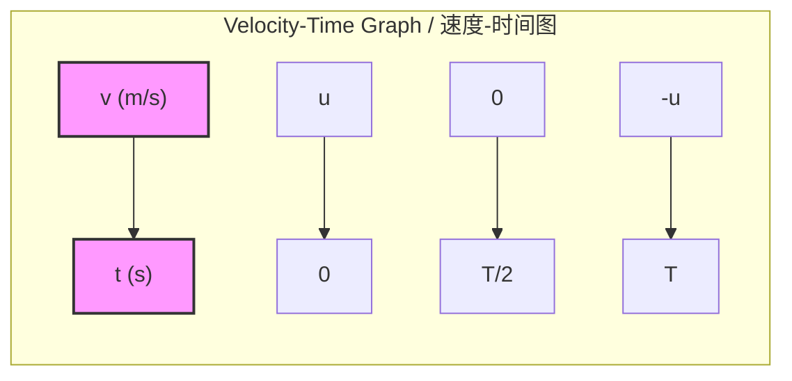

# 1. Overview / 概述

**English:**
Free fall under gravity is a special case of [[Equations of Motion (SUVAT)]] where the only force acting on an object is gravity. This sub-topic applies the [[The Five SUVAT Equations]] to objects moving vertically under constant gravitational acceleration. On Earth, all objects in free fall experience the same acceleration $g \approx 9.81 \text{ m s}^{-2}$ downward, regardless of their mass (ignoring air resistance). This concept is fundamental to understanding [[Projectile Motion]] and forms the basis for many real-world applications from dropping objects to vertical throws.

**中文:**
重力作用下的自由落体是[[Equations of Motion (SUVAT)]]的一个特例，其中物体仅受重力作用。本子知识点将[[The Five SUVAT Equations]]应用于在恒定重力加速度下垂直运动的物体。在地球上，所有自由落体物体都经历相同的向下加速度 $g \approx 9.81 \text{ m s}^{-2}$，与质量无关（忽略空气阻力）。这一概念是理解[[Projectile Motion]]的基础，也是从物体下落到竖直抛掷等许多实际应用的基础。

---

# 2. Syllabus Learning Objectives / 考纲学习目标

| CAIE 9702 | Edexcel IAL |
|-----------|-------------|
| 3.1(g) Define gravitational field strength $g$ | 1.9 Use equations of motion for constant acceleration in free fall |
| 3.1(h) Describe an experiment to determine $g$ | 1.10 Describe the effect of air resistance on falling objects |
| 3.1(i) Distinguish between mass and weight | 1.11 Determine $g$ using a free-fall experiment |
| 3.1(j) Apply SUVAT equations to free fall | 1.12 Solve problems involving vertical motion under gravity |
| 3.1(k) Describe terminal velocity | |

**Examiner Expectations / 考官期望:**
- **English:** Students must be able to apply SUVAT equations with $a = \pm g$ (sign convention critical), interpret displacement-time and velocity-time graphs for free fall, and explain how air resistance affects motion (terminal velocity).
- **中文:** 学生必须能够应用 $a = \pm g$ 的SUVAT方程（符号约定至关重要），解释自由落体的位移-时间和速度-时间图，并说明空气阻力如何影响运动（终端速度）。

---

# 3. Core Definitions / 核心定义

| Term (EN/CN) | Definition (EN) | Definition (CN) | Common Mistakes / 常见错误 |
|--------------|-----------------|-----------------|---------------------------|
| **Free Fall** / 自由落体 | Motion under the sole influence of gravity, with no other forces acting | 仅受重力作用、无其他力作用的运动 | Confusing free fall with any downward motion; objects thrown upward are also in free fall |
| **Acceleration Due to Gravity ($g$)** / 重力加速度 | The acceleration of an object due to Earth's gravitational field, approximately $9.81 \text{ m s}^{-2}$ downward | 物体因地球引力场产生的加速度，方向向下，约为 $9.81 \text{ m s}^{-2}$ | Forgetting the sign convention; $g$ is always positive magnitude, direction matters |
| **Terminal Velocity** / 终端速度 | The constant maximum velocity reached when air resistance equals weight, resulting in zero net force | 当空气阻力等于重力时达到的恒定最大速度，此时合力为零 | Thinking terminal velocity is reached instantly; it requires time to accelerate |
| **Weight** / 重量 | The gravitational force on an object: $W = mg$ | 物体所受的重力：$W = mg$ | Confusing weight with mass; weight varies with $g$, mass is constant |
| **Air Resistance** / 空气阻力 | A drag force opposing motion through air, proportional to speed (low speeds) or speed² (high speeds) | 阻碍物体在空气中运动的阻力，与速度（低速）或速度平方（高速）成正比 | Assuming air resistance is constant; it depends on velocity |

---

# 4. Key Concepts Explained / 关键概念详解

## 4.1 Sign Convention in Free Fall / 自由落体中的符号约定

### Explanation / 解释
**English:** The most critical skill in free fall problems is choosing a consistent sign convention. By convention, **upward is positive**. This means:
- Acceleration due to gravity is **negative**: $a = -g = -9.81 \text{ m s}^{-2}$
- Displacement upward is positive; displacement downward is negative
- Velocity upward is positive; velocity downward is negative

For objects dropped from rest: $u = 0$, $a = -g$, and displacement $s$ will be negative (downward).

**中文:** 自由落体问题中最关键的技能是选择一致的符号约定。按照惯例，**向上为正**。这意味着：
- 重力加速度为**负**：$a = -g = -9.81 \text{ m s}^{-2}$
- 向上位移为正；向下位移为负
- 向上速度为正；向下速度为负

对于从静止释放的物体：$u = 0$，$a = -g$，位移 $s$ 为负（向下）。

### Physical Meaning / 物理意义
**English:** The sign convention reflects the vector nature of displacement, velocity, and acceleration. Gravity always pulls downward, so when upward is positive, gravitational acceleration is negative. This is not a mathematical trick — it represents the physical reality that gravity opposes upward motion.

**中文:** 符号约定反映了位移、速度和加速度的矢量性质。重力始终向下拉，所以当向上为正时，重力加速度为负。这不是数学技巧——它代表了重力阻碍向上运动的物理现实。

### Common Misconceptions / 常见误区
- ❌ **English:** "g is always negative" — No, $g$ is a magnitude ($9.81 \text{ m s}^{-2}$). The sign depends on your chosen convention.
- ❌ **中文:** "g 总是负的" — 不对，$g$ 是大小（$9.81 \text{ m s}^{-2}$），符号取决于你选择的约定。
- ❌ **English:** "At the highest point, velocity and acceleration are both zero" — No, velocity is zero but acceleration is still $g$ downward.
- ❌ **中文:** "在最高点，速度和加速度都为零" — 不对，速度为零但加速度仍然是向下的 $g$。

### Exam Tips / 考试提示
- ✅ **English:** Always state your sign convention at the start: "Taking upward as positive..."
- ✅ **中文:** 始终在开头说明你的符号约定："取向上为正方向..."
- ✅ **English:** If you get a negative displacement, it means the object is below the starting point.
- ✅ **中文:** 如果得到负位移，意味着物体在起点下方。

> 📷 **IMAGE PROMPT — FC01: Sign Convention Diagram**
> A vertical axis with upward arrow labeled "Positive (+)" and downward arrow labeled "Negative (-)". An object at three positions: starting point (y=0), above (y>0), below (y<0). Arrows show velocity direction (upward = +, downward = -) and acceleration arrow always downward labeled "a = -g". Clean physics diagram style, white background, black lines, blue arrows for velocity, red arrow for acceleration.

## 4.2 Symmetry in Vertical Motion / 竖直运动的对称性

### Explanation / 解释
**English:** For an object thrown upward and returning to the same height (no air resistance), the motion is perfectly symmetric:
- Time up = Time down
- Speed at any height going up = Speed at same height going down
- Velocity at launch = -Velocity at return (same magnitude, opposite direction)
- Displacement at the highest point is maximum

This symmetry arises because acceleration is constant and the path is reversible.

**中文:** 对于竖直上抛并回到同一高度的物体（无空气阻力），运动完全对称：
- 上升时间 = 下降时间
- 在任意高度上升时的速度大小 = 在同一高度下降时的速度大小
- 发射时的速度 = 返回时的速度的负值（大小相同，方向相反）
- 最高点位移最大

这种对称性源于加速度恒定且路径可逆。

### Physical Meaning / 物理意义
**English:** The symmetry is a direct consequence of constant acceleration. The object decelerates at $g$ on the way up and accelerates at $g$ on the way down, so the time to lose speed equals the time to gain it back.

**中文:** 对称性是恒定加速度的直接结果。物体上升时以 $g$ 减速，下降时以 $g$ 加速，因此失去速度的时间等于重新获得速度的时间。

### Common Misconceptions / 常见误区
- ❌ **English:** "The object stops at the top and then falls" — No, it's continuous motion; velocity changes smoothly through zero.
- ❌ **中文:** "物体在顶部停止然后下落" — 不对，这是连续运动；速度平滑地经过零。
- ❌ **English:** "Acceleration is zero at the top" — No, acceleration is constant throughout.
- ❌ **中文:** "顶部加速度为零" — 不对，加速度全程恒定。

### Exam Tips / 考试提示
- ✅ **English:** Use symmetry to save time: if total time of flight is $T$, time to maximum height is $T/2$.
- ✅ **中文:** 利用对称性节省时间：如果总飞行时间为 $T$，到达最大高度的时间为 $T/2$。
- ✅ **English:** For "time to return to starting point," use $s = 0$ in $s = ut + \frac{1}{2}at^2$.
- ✅ **中文:** 对于"返回起点的时间"，在 $s = ut + \frac{1}{2}at^2$ 中使用 $s = 0$。

## 4.3 Terminal Velocity / 终端速度

### Explanation / 解释
**English:** When an object falls through air, two forces act: weight (downward) and air resistance (upward). Initially, air resistance is small, so net force is downward and the object accelerates. As speed increases, air resistance increases. Eventually, air resistance equals weight, net force becomes zero, and acceleration stops. The object continues at constant velocity — **terminal velocity**.

**中文:** 当物体在空气中下落时，受到两个力：重力（向下）和空气阻力（向上）。初始时空气阻力很小，所以合力向下，物体加速。随着速度增加，空气阻力增大。最终空气阻力等于重力，合力为零，加速度停止。物体以恒定速度继续运动——**终端速度**。

### Physical Meaning / 物理意义
**English:** Terminal velocity is the equilibrium speed where the drag force balances weight. It depends on the object's mass, cross-sectional area, shape, and the density of the fluid. A skydiver reaches about $55 \text{ m s}^{-1}$ (120 mph) in spread-eagle position, but can increase to $90 \text{ m s}^{-1}$ (200 mph) by diving head-first.

**中文:** 终端速度是阻力平衡重力时的平衡速度。它取决于物体的质量、横截面积、形状和流体密度。跳伞者以伸展姿势达到约 $55 \text{ m s}^{-1}$（120 mph），但通过头朝下俯冲可以增加到 $90 \text{ m s}^{-1}$（200 mph）。

### Common Misconceptions / 常见误区
- ❌ **English:** "Terminal velocity is reached immediately" — No, it takes time to accelerate to terminal velocity.
- ❌ **中文:** "终端速度立即达到" — 不对，需要时间加速到终端速度。
- ❌ **English:** "Heavier objects always have higher terminal velocity" — Not necessarily; shape and area matter too.
- ❌ **中文:** "较重的物体总是有更高的终端速度" — 不一定；形状和面积也很重要。

### Exam Tips / 考试提示
- ✅ **English:** On velocity-time graphs, terminal velocity appears as a horizontal line (constant velocity).
- ✅ **中文:** 在速度-时间图上，终端速度表现为水平线（恒定速度）。
- ✅ **English:** Air resistance questions often ask you to sketch or interpret v-t graphs with decreasing gradient.
- ✅ **中文:** 空气阻力问题通常要求你绘制或解释梯度递减的 v-t 图。

> 📋 **Edexcel Only:** Edexcel specifically requires describing the effect of air resistance on falling objects and determining $g$ experimentally. Terminal velocity is a key concept in their specification.

> 📋 **CIE Only:** CIE specifically requires defining gravitational field strength $g$ and distinguishing between mass and weight.

---

# 5. Essential Equations / 核心公式

## 5.1 SUVAT Equations for Free Fall / 自由落体的SUVAT方程

$$ v = u + at $$
$$ s = ut + \frac{1}{2}at^2 $$
$$ v^2 = u^2 + 2as $$
$$ s = \frac{1}{2}(u+v)t $$

Where $a = \pm g$ depending on sign convention.

| Symbol (符号) | Meaning (EN) | Meaning (CN) | Unit (单位) |
|--------------|-------------|-------------|------------|
| $u$ | Initial velocity | 初速度 | $\text{m s}^{-1}$ |
| $v$ | Final velocity | 末速度 | $\text{m s}^{-1}$ |
| $a$ | Acceleration ($\pm g$) | 加速度 ($\pm g$) | $\text{m s}^{-2}$ |
| $s$ | Displacement | 位移 | $\text{m}$ |
| $t$ | Time | 时间 | $\text{s}$ |
| $g$ | Acceleration due to gravity ($9.81 \text{ m s}^{-2}$) | 重力加速度 ($9.81 \text{ m s}^{-2}$) | $\text{m s}^{-2}$ |

**Conditions / 适用条件:**
- **English:** Constant acceleration (no air resistance or negligible air resistance). Motion is vertical only.
- **中文:** 恒定加速度（无空气阻力或空气阻力可忽略）。仅竖直运动。

**Limitations / 局限性:**
- **English:** Does not account for air resistance. Only valid near Earth's surface where $g$ is approximately constant.
- **中文:** 不考虑空气阻力。仅在地球表面附近 $g$ 近似恒定时有效。

## 5.2 Maximum Height Equation / 最大高度公式

$$ h_{\text{max}} = \frac{u^2}{2g} $$

Derived from $v^2 = u^2 + 2as$ with $v = 0$ at maximum height.

| Symbol (符号) | Meaning (EN) | Meaning (CN) | Unit (单位) |
|--------------|-------------|-------------|------------|
| $h_{\text{max}}$ | Maximum height reached | 达到的最大高度 | $\text{m}$ |
| $u$ | Initial upward velocity | 初始向上速度 | $\text{m s}^{-1}$ |
| $g$ | Acceleration due to gravity | 重力加速度 | $\text{m s}^{-2}$ |

**Derivation / 推导:**
$$ v^2 = u^2 + 2as $$
$$ 0 = u^2 + 2(-g)h_{\text{max}} $$
$$ h_{\text{max}} = \frac{u^2}{2g} $$

**Conditions / 适用条件:**
- **English:** Only for vertical projection upward from ground level. Assumes no air resistance.
- **中文:** 仅适用于从地面竖直上抛。假设无空气阻力。

## 5.3 Time of Flight Equation / 飞行时间公式

$$ T = \frac{2u}{g} $$

Derived from $s = ut + \frac{1}{2}at^2$ with $s = 0$ (returns to starting height).

| Symbol (符号) | Meaning (EN) | Meaning (CN) | Unit (单位) |
|--------------|-------------|-------------|------------|
| $T$ | Total time of flight | 总飞行时间 | $\text{s}$ |
| $u$ | Initial upward velocity | 初始向上速度 | $\text{m s}^{-1}$ |
| $g$ | Acceleration due to gravity | 重力加速度 | $\text{m s}^{-2}$ |

**Derivation / 推导:**
$$ s = ut + \frac{1}{2}at^2 $$
$$ 0 = uT + \frac{1}{2}(-g)T^2 $$
$$ 0 = T(u - \frac{gT}{2}) $$
$$ T = 0 \text{ or } T = \frac{2u}{g} $$

**Conditions / 适用条件:**
- **English:** Only for projection from and return to the same height. Assumes no air resistance.
- **中文:** 仅适用于从同一高度抛出并返回。假设无空气阻力。

> 📷 **IMAGE PROMPT — FC02: Free Fall Equations Summary**
> A clean formula sheet layout showing the three key equations: SUVAT equations with a=g, maximum height formula h=u²/2g, and time of flight formula T=2u/g. Each equation has a small diagram: SUVAT with a vertical arrow labeled g, max height with an arc showing the peak, time of flight with a complete parabolic path. White background, black text, blue highlights for key variables.

---

# 6. Graphs and Relationships / 图表与关系

## 6.1 Velocity-Time Graph for Free Fall (No Air Resistance) / 无空气阻力的速度-时间图

### Axes / 坐标轴
- **x-axis:** Time / 时间 $t$ (s)
- **y-axis:** Velocity / 速度 $v$ ($\text{m s}^{-1}$)

### Shape / 形状
**English:** A straight line with constant negative gradient (since $a = -g$). For an object thrown upward: starts at positive $u$, decreases linearly to zero at the peak, then continues decreasing (becoming more negative) as it falls back down.

**中文:** 一条具有恒定负斜率的直线（因为 $a = -g$）。对于竖直上抛的物体：从正 $u$ 开始，线性减小到峰值处的零，然后继续减小（变得更负）当它落回时。

### Gradient Meaning / 斜率含义
**English:** The gradient equals acceleration $a = -g = -9.81 \text{ m s}^{-2}$. Constant gradient confirms constant acceleration.

**中文:** 斜率等于加速度 $a = -g = -9.81 \text{ m s}^{-2}$。恒定斜率确认了恒定加速度。

### Area Meaning / 面积含义
**English:** The area between the graph and the time axis represents displacement. Area above axis = positive displacement (upward), area below axis = negative displacement (downward). Net area = total displacement.

**中文:** 图线与时间轴之间的面积代表位移。轴上方面积 = 正位移（向上），轴下方面积 = 负位移（向下）。净面积 = 总位移。

### Exam Interpretation / 考试解读
- **English:** For an object dropped from rest, the line starts at the origin with negative gradient.
- **中文:** 对于从静止释放的物体，线从原点开始，斜率为负。
- **English:** The point where the line crosses the time axis ($v=0$) is the maximum height.
- **中文:** 线与时间轴的交点（$v=0$）是最大高度。
- **English:** Equal areas above and below axis mean the object returns to starting point.
- **中文:** 轴上和轴下面积相等意味着物体返回起点。

## 6.2 Velocity-Time Graph with Air Resistance / 有空气阻力的速度-时间图

### Axes / 坐标轴
- **x-axis:** Time / 时间 $t$ (s)
- **y-axis:** Velocity / 速度 $v$ ($\text{m s}^{-1}$)

### Shape / 形状
**English:** The gradient starts steep (nearly $-g$) but gradually decreases in magnitude as air resistance increases. The line curves to become horizontal at terminal velocity $v_T$. For an object dropped from rest: velocity increases but at a decreasing rate, approaching $v_T$ asymptotically.

**中文:** 梯度开始时陡峭（接近 $-g$），但随着空气阻力增加，梯度大小逐渐减小。线弯曲，在终端速度 $v_T$ 处变为水平。对于从静止释放的物体：速度增加但增加率递减，渐近地接近 $v_T$。

### Gradient Meaning / 斜率含义
**English:** Gradient = acceleration, which decreases from $g$ to $0$ as terminal velocity is approached.

**中文:** 梯度 = 加速度，从 $g$ 减小到 $0$，当接近终端速度时。

### Area Meaning / 面积含义
**English:** Area still represents displacement. The curved shape means displacement calculations require integration or graphical methods.

**中文:** 面积仍然代表位移。弯曲形状意味着位移计算需要积分或图形方法。

### Exam Interpretation / 考试解读
- **English:** The horizontal section of the graph indicates terminal velocity has been reached.
- **中文:** 图的水平部分表示已达到终端速度。
- **English:** The initial gradient equals $g$ (before air resistance becomes significant).
- **中文:** 初始梯度等于 $g$（在空气阻力变得显著之前）。

> 📷 **IMAGE PROMPT — FC03: Velocity-Time Graphs Comparison**
> Two velocity-time graphs side by side. Left: No air resistance - straight line with constant negative slope from u to -u, crossing zero at t=T/2. Right: With air resistance - curved line starting with same slope, gradually flattening to horizontal at terminal velocity v_T. Both graphs have labeled axes (v on y, t on x), clear grid lines, and annotations showing key features. Clean physics textbook style.

---

# 7. Required Diagrams / 必备图表

## 7.1 Free Fall Experiment Setup / 自由落体实验装置

### Description / 描述
**English:** A diagram showing the experimental setup to measure acceleration due to gravity $g$. Common methods include:
1. **Light gate method:** A ball is dropped through two light gates connected to a timer
2. **Electromagnet method:** A steel ball is held by an electromagnet and released when the current is cut
3. **Tickertape timer method:** A falling object pulls tickertape through a timer

**中文:** 显示测量重力加速度 $g$ 的实验装置图。常用方法包括：
1. **光门法：** 球通过两个连接到计时器的光门下落
2. **电磁铁法：** 钢球由电磁铁保持，电流切断时释放
3. **打点计时器法：** 下落物体拉动纸带通过计时器

### Image Prompt / 图片生成提示
> 📷 **IMAGE PROMPT — FC04: Free Fall Experiment - Light Gate Method**
> A detailed physics lab diagram showing: a clamp stand holding a metal ball at the top, two light gates positioned at known heights below the ball, each connected to a digital timer/data logger. The ball is shown mid-fall between the two light gates. Labels: "Electromagnet", "Steel ball", "Light gate 1", "Light gate 2", "Timer", "Height h between gates". Clean schematic style, white background, professional lab equipment appearance.

### Labels Required / 需要标注
| English | 中文 |
|---------|------|
| Electromagnet | 电磁铁 |
| Steel ball | 钢球 |
| Light gate 1 (top) | 光门1（上方） |
| Light gate 2 (bottom) | 光门2（下方） |
| Digital timer | 数字计时器 |
| Height $h$ between gates | 光门间高度 $h$ |
| Clamp stand | 夹持架 |

### Exam Importance / 考试重要性
- **English:** Both CIE and Edexcel require knowledge of experimental methods to determine $g$. Questions often ask about sources of uncertainty and how to improve accuracy.
- **中文:** CIE和Edexcel都要求了解测定 $g$ 的实验方法。问题通常涉及不确定度来源以及如何提高精度。

## 7.2 Forces During Free Fall with Air Resistance / 有空气阻力时的自由落体受力图

### Description / 描述
**English:** A free-body diagram showing the two forces acting on a falling object: weight $W = mg$ (downward) and air resistance $R$ (upward). At different stages of the fall, the relative sizes of these forces change.

**中文:** 显示下落物体所受两个力的自由体图：重力 $W = mg$（向下）和空气阻力 $R$（向上）。在下落的不同阶段，这些力的相对大小发生变化。

### Image Prompt / 图片生成提示
> 📷 **IMAGE PROMPT — FC05: Forces During Free Fall with Air Resistance**
> Three panels showing a falling ball at different times. Panel 1 (early): Large downward arrow "W = mg", small upward arrow "R (small)" - net force downward. Panel 2 (middle): Medium downward arrow "W = mg", medium upward arrow "R (increasing)" - net force still downward but smaller. Panel 3 (terminal velocity): Equal arrows "W = mg" and "R = mg" - net force = 0. Labels: "Accelerating", "Still accelerating (less)", "Terminal velocity". Clean physics diagram style.

### Labels Required / 需要标注
| English | 中文 |
|---------|------|
| Weight $W = mg$ | 重力 $W = mg$ |
| Air resistance $R$ | 空气阻力 $R$ |
| Net force $F_{\text{net}}$ | 合力 $F_{\text{net}}$ |
| Acceleration $a$ | 加速度 $a$ |
| Terminal velocity $v_T$ | 终端速度 $v_T$ |

### Exam Importance / 考试重要性
- **English:** Essential for explaining why acceleration decreases and terminal velocity is reached. Common in Edexcel exam questions.
- **中文:** 对于解释加速度为何减小以及为何达到终端速度至关重要。常见于Edexcel考试题。

---

# 8. Worked Examples / 典型例题

## Example 1: Ball Thrown Upward / 竖直上抛小球

### Question / 题目
**English:** A ball is thrown vertically upward with an initial velocity of $15 \text{ m s}^{-1}$ from ground level. Taking $g = 9.81 \text{ m s}^{-2}$ and ignoring air resistance, calculate:
(a) The maximum height reached
(b) The time taken to reach maximum height
(c) The total time of flight until it returns to the ground

**中文:** 一个小球从地面以 $15 \text{ m s}^{-1}$ 的初速度竖直上抛。取 $g = 9.81 \text{ m s}^{-2}$，忽略空气阻力，计算：
(a) 达到的最大高度
(b) 到达最大高度所需时间
(c) 返回地面的总飞行时间

### Solution / 解答

**Sign convention / 符号约定:** Taking upward as positive. $a = -g = -9.81 \text{ m s}^{-2}$, $u = +15 \text{ m s}^{-1}$.

**(a) Maximum height / 最大高度**

At maximum height, $v = 0$. Use $v^2 = u^2 + 2as$:

$$ 0 = (15)^2 + 2(-9.81)s $$
$$ 0 = 225 - 19.62s $$
$$ s = \frac{225}{19.62} = 11.47 \text{ m} $$

**Answer:** $h_{\text{max}} = 11.5 \text{ m}$ (3 s.f.) | **答案：** $h_{\text{max}} = 11.5 \text{ m}$（3位有效数字）

**(b) Time to maximum height / 到达最大高度的时间**

Use $v = u + at$:

$$ 0 = 15 + (-9.81)t $$
$$ t = \frac{15}{9.81} = 1.529 \text{ s} $$

**Answer:** $t = 1.53 \text{ s}$ (3 s.f.) | **答案：** $t = 1.53 \text{ s}$（3位有效数字）

**(c) Total time of flight / 总飞行时间**

Use $s = ut + \frac{1}{2}at^2$ with $s = 0$ (returns to ground):

$$ 0 = 15t + \frac{1}{2}(-9.81)t^2 $$
$$ 0 = t(15 - 4.905t) $$
$$ t = 0 \text{ or } t = \frac{15}{4.905} = 3.058 \text{ s} $$

**Answer:** $T = 3.06 \text{ s}$ (3 s.f.) | **答案：** $T = 3.06 \text{ s}$（3位有效数字）

**Check / 验证:** $T = 2 \times t_{\text{up}} = 2 \times 1.529 = 3.058 \text{ s}$ ✓ (symmetry confirmed)

### Quick Tip / 提示
- **English:** Always check your answer using symmetry: total time = 2 × time to maximum height.
- **中文:** 始终用对称性检查答案：总时间 = 2 × 到达最大高度的时间。

---

## Example 2: Object Dropped from Height / 从高度释放物体

### Question / 题目
**English:** A stone is dropped from rest from the top of a building $45 \text{ m}$ tall. Calculate:
(a) The time taken to reach the ground
(b) The velocity just before impact
Take $g = 9.81 \text{ m s}^{-2}$.

**中文:** 一块石头从 $45 \text{ m}$ 高的楼顶从静止释放。计算：
(a) 到达地面所需时间
(b) 撞击前的速度
取 $g = 9.81 \text{ m s}^{-2}$。

### Solution / 解答

**Sign convention / 符号约定:** Taking upward as positive. $a = -g = -9.81 \text{ m s}^{-2}$, $u = 0$, $s = -45 \text{ m}$ (downward displacement).

**(a) Time to reach ground / 到达地面时间**

Use $s = ut + \frac{1}{2}at^2$:

$$ -45 = 0 + \frac{1}{2}(-9.81)t^2 $$
$$ -45 = -4.905t^2 $$
$$ t^2 = \frac{45}{4.905} = 9.174 $$
$$ t = \sqrt{9.174} = 3.029 \text{ s} $$

**Answer:** $t = 3.03 \text{ s}$ (3 s.f.) | **答案：** $t = 3.03 \text{ s}$（3位有效数字）

**(b) Velocity just before impact / 撞击前速度**

Use $v = u + at$:

$$ v = 0 + (-9.81)(3.029) = -29.71 \text{ m s}^{-1} $$

Or use $v^2 = u^2 + 2as$:

$$ v^2 = 0 + 2(-9.81)(-45) = 882.9 $$
$$ v = -\sqrt{882.9} = -29.71 \text{ m s}^{-1} $$

**Answer:** $v = 29.7 \text{ m s}^{-1}$ downward | **答案：** $v = 29.7 \text{ m s}^{-1}$ 向下

### Quick Tip / 提示
- **English:** The negative sign in velocity indicates downward direction. In exam answers, you can state the magnitude and direction separately.
- **中文:** 速度的负号表示向下方向。在考试答案中，可以分别说明大小和方向。

---

# 9. Past Paper Question Types / 历年真题题型

| Question Type / 题型 | Frequency / 频率 | Difficulty / 难度 | Past Paper References / 真题索引 |
|----------------------|------------------|------------------|-------------------------------|
| Calculate maximum height / time of flight | ★★★★★ Very High | ★★ Easy | 📝 *待填入* |
| Velocity-time graph interpretation | ★★★★ High | ★★★ Medium | 📝 *待填入* |
| Experimental determination of $g$ | ★★★★ High | ★★★ Medium | 📝 *待填入* |
| Terminal velocity explanation | ★★★ Medium | ★★★ Medium | 📝 *待填入* |
| Two-stage motion (e.g., thrown up then caught) | ★★★ Medium | ★★★★ Hard | 📝 *待填入* |
| Air resistance effects on graphs | ★★ Low | ★★★★ Hard | 📝 *待填入* |

**Common Command Words / 常见指令词:**
| English | 中文 |
|---------|------|
| Calculate | 计算 |
| Determine | 确定 |
| Sketch | 画出草图 |
| Explain | 解释 |
| Describe | 描述 |
| Show that | 证明 |
| State | 写出 |

---

# 10. Practical Skills Connections / 实验技能链接

**English:**
This sub-topic connects to practical work in several ways:

1. **Determining $g$ experimentally:** Common methods include:
   - **Light gate method:** Drop a ball through two light gates; measure time between gates and distance to calculate $g$
   - **Electromagnet and timer:** Release a steel ball from an electromagnet; measure time to fall a known distance
   - **Video analysis:** Record a falling object and analyze frame-by-frame

2. **Uncertainties:**
   - Timing uncertainties (reaction time, light gate precision)
   - Distance measurement uncertainties
   - Parallax error in reading scales
   - Air resistance causing systematic error (measured $g$ < true $g$)

3. **Graph plotting:**
   - Plot $s$ against $t^2$ for a falling object; gradient = $\frac{1}{2}g$
   - Plot $v$ against $t$; gradient = $g$

4. **Improving accuracy:**
   - Use multiple readings and calculate mean
   - Use light gates instead of stopwatches
   - Use larger distances to reduce percentage uncertainty
   - Release ball from rest using electromagnet for consistency

**中文:**
本子知识点通过以下方式与实验工作联系：

1. **实验测定 $g$：** 常用方法包括：
   - **光门法：** 让球通过两个光门下落；测量光门间的时间和距离以计算 $g$
   - **电磁铁和计时器：** 从电磁铁释放钢球；测量下落已知距离的时间
   - **视频分析：** 记录下落物体并逐帧分析

2. **不确定度：**
   - 计时不确定度（反应时间、光门精度）
   - 距离测量不确定度
   - 读取刻度时的视差误差
   - 空气阻力导致系统误差（测量 $g$ < 真实 $g$）

3. **图表绘制：**
   - 绘制下落物体的 $s$ 对 $t^2$ 图；斜率 = $\frac{1}{2}g$
   - 绘制 $v$ 对 $t$ 图；斜率 = $g$

4. **提高精度：**
   - 多次读数并计算平均值
   - 使用光门代替秒表
   - 使用更大距离以降低百分比不确定度
   - 使用电磁铁从静止释放球以确保一致性

---

# 11. Concept Map / 概念图谱

```mermaid
graph TD
    %% Free Fall Under Gravity - Concept Map
    FF["Free Fall Under Gravity / 重力自由落体"] --> SUVAT["[[Equations of Motion (SUVAT)]]"]
    FF --> G["Acceleration due to Gravity g / 重力加速度 g"]
    FF --> SC["Sign Convention / 符号约定"]
    FF --> SYM["Symmetry / 对称性"]
    FF --> TV["Terminal Velocity / 终端速度"]
    
    SUVAT --> EQ["[[The Five SUVAT Equations]]"]
    SUVAT --> CHOOSE["[[Choosing the Right Equation]]"]
    
    G --> EXP["Experimental Determination / 实验测定"]
    G --> VALUE["g = 9.81 m s⁻² / g = 9.81 m s⁻²"]
    
    SC --> UP["Upward = Positive / 向上为正"]
    SC --> DOWN["a = -g / a = -g"]
    
    SYM --> TUP["Time up = Time down / 上升时间 = 下降时间"]
    SYM --> SPEED["Speed symmetry / 速度对称性"]
    
    TV --> AR["Air Resistance / 空气阻力"]
    TV --> EQBM["Weight = Drag / 重力 = 阻力"]
    TV --> GRAPH["v-t graph flattens / v-t 图变平"]
    
    FF --> PRAC["Practical Skills / 实验技能"]
    PRAC --> LIGHT["Light Gate Method / 光门法"]
    PRAC --> UNCERT["Uncertainties / 不确定度"]
    
    FF --> PROJ["[[Projectile Motion]]"]
    FF --> GRAPHS["[[Motion Graphs]]"]
    
    style FF fill:#ff6b6b,stroke:#333,stroke-width:3px,color:white
    style SUVAT fill:#4ecdc4,stroke:#333,stroke-width:2px
    style G fill:#45b7d1,stroke:#333,stroke-width:2px
    style SC fill:#96ceb4,stroke:#333,stroke-width:2px
    style SYM fill:#dda0dd,stroke:#333,stroke-width:2px
    style TV fill:#f0e68c,stroke:#333,stroke-width:2px
    style PROJ fill:#ffa07a,stroke:#333,stroke-width:2px
    style GRAPHS fill:#87ceeb,stroke:#333,stroke-width:2px
```

---

# 12. Quick Revision Sheet / 速查表

| Category / 类别 | Key Points / 要点 |
|----------------|------------------|
| **Definition / 定义** | Free fall = motion under gravity only. $g = 9.81 \text{ m s}^{-2}$ downward. / 自由落体 = 仅受重力作用。$g = 9.81 \text{ m s}^{-2}$ 向下。 |
| **Key Formula / 核心公式** | $v = u \pm gt$, $s = ut \pm \frac{1}{2}gt^2$, $v^2 = u^2 \pm 2gs$, $h_{\text{max}} = \frac{u^2}{2g}$, $T = \frac{2u}{g}$ |
| **Sign Convention / 符号约定** | Upward = positive → $a = -g$. / 向上为正 → $a = -g$. |
| **Key Graph / 核心图表** | v-t: Straight line (no air resistance) or curved to horizontal (with air resistance). / v-t: 直线（无空气阻力）或弯曲至水平（有空气阻力）。 |
| **Symmetry / 对称性** | Time up = Time down. Speed at height $h$ going up = Speed at $h$ going down. / 上升时间 = 下降时间。在高度 $h$ 上升速度 = 在 $h$ 下降速度。 |
| **Terminal Velocity / 终端速度** | When $R = mg$, $F_{\text{net}} = 0$, $a = 0$, $v = \text{constant}$. / 当 $R = mg$，$F_{\text{net}} = 0$，$a = 0$，$v = \text{常数}$。 |
| **Experiment / 实验** | Light gate method: measure time over known distance → calculate $g$. / 光门法：测量已知距离上的时间 → 计算 $g$。 |
| **Common Mistake / 常见错误** | Forgetting sign convention. Thinking $a = 0$ at highest point. / 忘记符号约定。认为最高点 $a = 0$。 |
| **Exam Tip / 考试提示** | State sign convention first. Use symmetry to check answers. / 先说明符号约定。用对称性检查答案。 |

---

> **Parent Topic:** [[Equations of Motion (SUVAT)]]
> **Sibling Sub-topics:** [[The Five SUVAT Equations]], [[Choosing the Right Equation]], [[Two-Stage Motion Problems]]
> **Prerequisites:** [[Displacement, Velocity and Acceleration]]
> **Related Topics:** [[Motion Graphs]], [[Projectile Motion]]