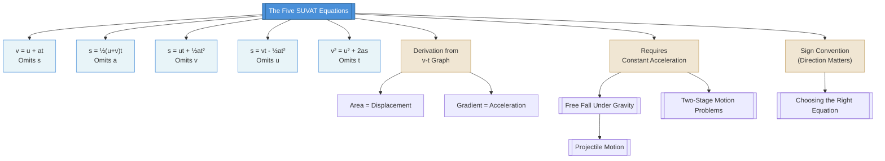

# The Five SUVAT Equations / 五大SUVAT方程

---

# 1. Overview / 概述

**English:**
The five SUVAT equations form the mathematical foundation of [[Equations of Motion (SUVAT)]] for objects moving with **constant acceleration** in a straight line. These equations relate five kinematic variables: displacement ($s$), initial velocity ($u$), final velocity ($v$), acceleration ($a$), and time ($t$). Each equation omits one variable, allowing you to solve for any unknown when given three known quantities. Mastering these equations is essential for solving problems in [[Free Fall Under Gravity]], [[Two-Stage Motion Problems]], and eventually [[Projectile Motion]].

**中文:**
五大SUVAT方程构成了[[Equations of Motion (SUVAT)]]的数学基础，适用于**匀加速直线运动**的物体。这些方程关联了五个运动学变量：位移($s$)、初速度($u$)、末速度($v$)、加速度($a$)和时间($t$)。每个方程省略一个变量，使得在已知三个量的情况下可以求解任意未知量。掌握这些方程对于解决[[Free Fall Under Gravity]]、[[Two-Stage Motion Problems]]以及后续的[[Projectile Motion]]问题至关重要。

---

# 2. Syllabus Learning Objectives / 考纲学习目标

| CAIE 9702 | Edexcel IAL |
|-----------|-------------|
| 3.1(g) Derive and apply the equations of motion for constant acceleration | 1.9 Use equations of motion for constant acceleration |
| 3.1(h) Solve problems using equations of motion | 1.10 Apply SUVAT equations to vertical motion under gravity |
| 3.1(k) Recognise and use the independence of vertical and horizontal motion | 1.12 Solve problems involving motion with constant acceleration |

**Examiner Expectations / 考官期望:**
- **English:** You must be able to derive each equation from definitions of acceleration and velocity, select the correct equation for a given problem, and apply it correctly with appropriate sign conventions.
- **中文:** 你必须能够从加速度和速度的定义推导每个方程，为给定问题选择正确的方程，并正确应用适当的符号约定。

---

# 3. Core Definitions / 核心定义

| Term (EN/CN) | Definition (EN) | Definition (CN) | Common Mistakes / 常见错误 |
|--------------|-----------------|-----------------|---------------------------|
| **Displacement ($s$)** / 位移 | The straight-line distance from start to finish in a specified direction (vector) | 从起点到终点的直线距离，有指定方向（矢量） | Confusing with distance (scalar) — displacement can be negative |
| **Initial Velocity ($u$)** / 初速度 | Velocity at time $t=0$ (vector) | 在$t=0$时刻的速度（矢量） | Forgetting direction — sign matters |
| **Final Velocity ($v$)** / 末速度 | Velocity at time $t$ (vector) | 在$t$时刻的速度（矢量） | Confusing with average velocity |
| **Acceleration ($a$)** / 加速度 | Rate of change of velocity (vector) | 速度的变化率（矢量） | Forgetting it must be CONSTANT for SUVAT |
| **Time ($t$)** / 时间 | Time elapsed during motion (scalar) | 运动经过的时间（标量） | Using clock time instead of elapsed time |

> 📋 **CIE Only:** CAIE expects you to derive the equations from first principles using velocity-time graphs.
> 
> 📋 **Edexcel Only:** Edexcel provides the equations in the formula booklet — focus on application and selection.

---

# 4. Key Concepts Explained / 关键概念详解

## 4.1 Derivation of the Five Equations / 五个方程的推导

### Explanation / 解释
**English:**
The five SUVAT equations are derived from the fundamental definitions of acceleration and average velocity. Starting from $a = \frac{v-u}{t}$, we rearrange to get $v = u + at$ (Equation 1). The displacement is the area under a velocity-time graph: for constant acceleration, this is a trapezium, giving $s = \frac{1}{2}(u+v)t$ (Equation 2). Substituting Equation 1 into Equation 2 eliminates $v$ to give $s = ut + \frac{1}{2}at^2$ (Equation 3). Substituting Equation 1 into Equation 2 eliminating $t$ gives $s = vt - \frac{1}{2}at^2$ (Equation 4). Finally, eliminating $t$ from Equations 1 and 2 gives $v^2 = u^2 + 2as$ (Equation 5).

**中文:**
五个SUVAT方程是从加速度和平均速度的基本定义推导出来的。从$a = \frac{v-u}{t}$开始，整理得到$v = u + at$（方程1）。位移是速度-时间图下的面积：对于匀加速运动，这是一个梯形，得到$s = \frac{1}{2}(u+v)t$（方程2）。将方程1代入方程2消去$v$得到$s = ut + \frac{1}{2}at^2$（方程3）。将方程1代入方程2消去$t$得到$s = vt - \frac{1}{2}at^2$（方程4）。最后，从方程1和2消去$t$得到$v^2 = u^2 + 2as$（方程5）。

### Physical Meaning / 物理意义
**English:** Each equation represents a different relationship between the five variables, with one variable omitted. This allows you to solve problems regardless of which variable is unknown.
**中文:** 每个方程代表了五个变量之间的不同关系，省略了一个变量。这使得无论哪个变量未知，你都能解决问题。

### Common Misconceptions / 常见误区
- **English:** 
  - These equations ONLY work for constant acceleration
  - $s$ is displacement, NOT distance
  - Signs (positive/negative) must be consistent
- **中文:**
  - 这些方程只适用于匀加速运动
  - $s$是位移，不是路程
  - 正负号必须一致

### Exam Tips / 考试提示
- **English:** Always list $u, v, a, s, t$ and identify which three are known before choosing an equation
- **中文:** 始终列出$u, v, a, s, t$，在选方程前先确定哪三个是已知的

> 📷 **IMAGE PROMPT — SUVAT-DERIVATION: Derivation of SUVAT Equations from Velocity-Time Graph**
> A velocity-time graph showing a straight line from (0,u) to (t,v). The area under the line is shaded as a trapezium, with labels showing the rectangular area (u×t) and triangular area (½×(v-u)×t). Arrows indicate how the area formula gives s = ut + ½at². Clean, educational diagram with clear labels.

---

# 5. Essential Equations / 核心公式

## Equation 1: $v = u + at$

| Symbol (符号) | Meaning (EN) | Meaning (CN) | Unit (单位) |
|--------------|-------------|-------------|------------|
| $v$ | Final velocity | 末速度 | m s⁻¹ |
| $u$ | Initial velocity | 初速度 | m s⁻¹ |
| $a$ | Acceleration | 加速度 | m s⁻² |
| $t$ | Time | 时间 | s |

**Derivation / 推导:** From $a = \frac{v-u}{t}$, multiply both sides by $t$: $at = v-u$, then $v = u + at$

**Conditions / 适用条件:** Constant acceleration only / 仅适用于匀加速运动

**Limitations / 局限性:** Does not involve displacement $s$ / 不涉及位移$s$

---

## Equation 2: $s = \frac{1}{2}(u+v)t$

| Symbol (符号) | Meaning (EN) | Meaning (CN) | Unit (单位) |
|--------------|-------------|-------------|------------|
| $s$ | Displacement | 位移 | m |
| $u$ | Initial velocity | 初速度 | m s⁻¹ |
| $v$ | Final velocity | 末速度 | m s⁻¹ |
| $t$ | Time | 时间 | s |

**Derivation / 推导:** Area under $v-t$ graph = area of trapezium = $\frac{1}{2}(u+v)t$

**Conditions / 适用条件:** Constant acceleration only / 仅适用于匀加速运动

**Limitations / 局限性:** Does not involve acceleration $a$ / 不涉及加速度$a$

---

## Equation 3: $s = ut + \frac{1}{2}at^2$

| Symbol (符号) | Meaning (EN) | Meaning (CN) | Unit (单位) |
|--------------|-------------|-------------|------------|
| $s$ | Displacement | 位移 | m |
| $u$ | Initial velocity | 初速度 | m s⁻¹ |
| $a$ | Acceleration | 加速度 | m s⁻² |
| $t$ | Time | 时间 | s |

**Derivation / 推导:** Substitute $v = u+at$ into $s = \frac{1}{2}(u+v)t$: $s = \frac{1}{2}(u+u+at)t = ut + \frac{1}{2}at^2$

**Conditions / 适用条件:** Constant acceleration only / 仅适用于匀加速运动

**Limitations / 局限性:** Does not involve final velocity $v$ / 不涉及末速度$v$

---

## Equation 4: $s = vt - \frac{1}{2}at^2$

| Symbol (符号) | Meaning (EN) | Meaning (CN) | Unit (单位) |
|--------------|-------------|-------------|------------|
| $s$ | Displacement | 位移 | m |
| $v$ | Final velocity | 末速度 | m s⁻¹ |
| $a$ | Acceleration | 加速度 | m s⁻² |
| $t$ | Time | 时间 | s |

**Derivation / 推导:** Substitute $u = v-at$ into $s = \frac{1}{2}(u+v)t$: $s = \frac{1}{2}(v-at+v)t = vt - \frac{1}{2}at^2$

**Conditions / 适用条件:** Constant acceleration only / 仅适用于匀加速运动

**Limitations / 局限性:** Does not involve initial velocity $u$ / 不涉及初速度$u$

---

## Equation 5: $v^2 = u^2 + 2as$

| Symbol (符号) | Meaning (EN) | Meaning (CN) | Unit (单位) |
|--------------|-------------|-------------|------------|
| $v$ | Final velocity | 末速度 | m s⁻¹ |
| $u$ | Initial velocity | 初速度 | m s⁻¹ |
| $a$ | Acceleration | 加速度 | m s⁻² |
| $s$ | Displacement | 位移 | m |

**Derivation / 推导:** From $v = u+at$, $t = \frac{v-u}{a}$. Substitute into $s = \frac{1}{2}(u+v)t$: $s = \frac{1}{2}(u+v)\frac{v-u}{a} = \frac{v^2-u^2}{2a}$, so $v^2 = u^2 + 2as$

**Conditions / 适用条件:** Constant acceleration only / 仅适用于匀加速运动

**Limitations / 局限性:** Does not involve time $t$ / 不涉及时间$t$

> 📷 **IMAGE PROMPT — SUVAT-EQUATIONS: The Five SUVAT Equations Summary Card**
> A clean, organized summary card showing all five SUVAT equations in a grid layout. Each equation is boxed with the omitted variable clearly marked. Color-coded: Equation 1 (blue, omits s), Equation 2 (green, omits a), Equation 3 (yellow, omits v), Equation 4 (orange, omits u), Equation 5 (red, omits t). Professional textbook style.

---

# 6. Graphs and Relationships / 图表与关系

## 6.1 Velocity-Time Graph for Constant Acceleration / 匀加速运动的速度-时间图

### Axes / 坐标轴
- **x-axis:** Time ($t$) / 时间($t$)
- **y-axis:** Velocity ($v$) / 速度($v$)

### Shape / 形状
- **English:** A straight line with gradient equal to acceleration $a$
- **中文:** 一条直线，斜率等于加速度$a$

### Gradient Meaning / 斜率含义
- **English:** Gradient = acceleration ($a = \frac{\Delta v}{\Delta t}$)
- **中文:** 斜率 = 加速度 ($a = \frac{\Delta v}{\Delta t}$)

### Area Meaning / 面积含义
- **English:** Area under graph = displacement ($s$)
- **中文:** 图下面积 = 位移($s$)

### Exam Interpretation / 考试解读
- **English:** The trapezium area gives $s = \frac{1}{2}(u+v)t$ — this is the derivation of Equation 2
- **中文:** 梯形面积给出$s = \frac{1}{2}(u+v)t$ — 这是方程2的推导

```mermaid
graph LR
    A[Velocity-Time Graph] --> B[Gradient = Acceleration]
    A --> C[Area = Displacement]
    B --> D[Equation 1: v = u + at]
    C --> E[Equation 2: s = ½(u+v)t]
    E --> F[Equation 3: s = ut + ½at²]
    E --> G[Equation 4: s = vt - ½at²]
    D --> H[Equation 5: v² = u² + 2as]
```

---

# 7. Required Diagrams / 必备图表

## 7.1 Velocity-Time Graph for SUVAT Derivation / SUVAT推导的速度-时间图

### Description / 描述
**English:** A velocity-time graph showing constant acceleration from initial velocity $u$ to final velocity $v$ over time $t$. The graph is a straight line. The area under the graph is divided into a rectangle (area $ut$) and a triangle (area $\frac{1}{2}(v-u)t$).

**中文:** 一个速度-时间图，显示从初速度$u$到末速度$v$在时间$t$内的匀加速运动。图形是一条直线。图下面积被分为一个矩形（面积$ut$）和一个三角形（面积$\frac{1}{2}(v-u)t$）。

### Image Prompt / 图片生成提示
> 📷 **IMAGE PROMPT — SUVAT-VT-GRAPH: Velocity-Time Graph for SUVAT Derivation**
> A velocity-time graph with velocity (v) on the y-axis and time (t) on the x-axis. A straight line starts at (0,u) and ends at (t,v). The area under the line is shaded in two parts: a rectangle from 0 to u (light blue) and a triangle above it (light green). Labels: u (initial velocity), v (final velocity), t (time). The gradient is labeled as 'a = (v-u)/t'. The total area is labeled 's = ut + ½(v-u)t = ut + ½at²'. Clean, educational diagram with grid lines.

### Labels Required / 需要标注
- **English:** Initial velocity $u$, Final velocity $v$, Time $t$, Acceleration $a = \frac{v-u}{t}$, Displacement $s = \text{area}$
- **中文:** 初速度$u$，末速度$v$，时间$t$，加速度$a = \frac{v-u}{t}$，位移$s = \text{面积}$

### Exam Importance / 考试重要性
- **English:** Essential for deriving Equations 2 and 3. Frequently tested in Paper 1 (multiple choice) and Paper 2 (structured questions).
- **中文:** 对于推导方程2和3至关重要。常在Paper 1（选择题）和Paper 2（结构题）中考查。

---

# 8. Worked Examples / 典型例题

## Example 1: Finding Final Velocity / 求末速度

### Question / 题目
**English:** A car accelerates uniformly from rest at $2.5 \text{ m s}^{-2}$ over a distance of $45 \text{ m}$. Calculate the final velocity of the car.

**中文:** 一辆汽车从静止开始以$2.5 \text{ m s}^{-2}$的匀加速度行驶了$45 \text{ m}$。计算汽车的末速度。

### Solution / 解答

**Step 1: Identify known variables / 步骤1：确定已知变量**
- $u = 0 \text{ m s}^{-1}$ (starts from rest / 从静止开始)
- $a = 2.5 \text{ m s}^{-2}$
- $s = 45 \text{ m}$
- $v = ?$ (unknown / 未知)
- $t = ?$ (not needed / 不需要)

**Step 2: Choose the right equation / 步骤2：选择正确的方程**
We know $u$, $a$, $s$ and need $v$. The equation without $t$ is:
$$v^2 = u^2 + 2as$$

**Step 3: Substitute values / 步骤3：代入数值**
$$v^2 = 0^2 + 2(2.5)(45)$$
$$v^2 = 0 + 225$$
$$v^2 = 225$$

**Step 4: Solve / 步骤4：求解**
$$v = \sqrt{225} = 15 \text{ m s}^{-1}$$

### Final Answer / 最终答案
**Answer:** $v = 15 \text{ m s}^{-1}$ | **答案：** $v = 15 \text{ m s}^{-1}$

### Quick Tip / 提示
- **English:** When starting from rest ($u=0$), Equation 5 simplifies to $v^2 = 2as$
- **中文:** 当从静止开始($u=0$)时，方程5简化为$v^2 = 2as$

---

## Example 2: Finding Time of Flight / 求飞行时间

### Question / 题目
**English:** A ball is thrown vertically upward with an initial velocity of $20 \text{ m s}^{-1}$ from ground level. Calculate the time taken for the ball to return to the ground. (Take $g = 9.81 \text{ m s}^{-2}$)

**中文:** 一个球从地面以$20 \text{ m s}^{-1}$的初速度竖直向上抛出。计算球返回地面所需的时间。（取$g = 9.81 \text{ m s}^{-2}$）

### Solution / 解答

**Step 1: Identify known variables / 步骤1：确定已知变量**
- $u = +20 \text{ m s}^{-1}$ (upward positive / 向上为正)
- $a = -9.81 \text{ m s}^{-2}$ (gravity acts downward / 重力向下)
- $s = 0 \text{ m}$ (returns to starting point / 返回起点)
- $t = ?$ (unknown / 未知)

**Step 2: Choose the right equation / 步骤2：选择正确的方程**
We know $s$, $u$, $a$ and need $t$. The equation without $v$ is:
$$s = ut + \frac{1}{2}at^2$$

**Step 3: Substitute values / 步骤3：代入数值**
$$0 = 20t + \frac{1}{2}(-9.81)t^2$$
$$0 = 20t - 4.905t^2$$

**Step 4: Solve / 步骤4：求解**
$$t(20 - 4.905t) = 0$$
$$t = 0 \text{ or } t = \frac{20}{4.905} = 4.08 \text{ s}$$

The $t=0$ solution corresponds to the start. The required answer is $t = 4.08 \text{ s}$.

### Final Answer / 最终答案
**Answer:** $t = 4.08 \text{ s}$ | **答案：** $t = 4.08 \text{ s}$

### Quick Tip / 提示
- **English:** For symmetrical vertical motion, total time = $2u/g$. Check: $2(20)/9.81 = 4.08 \text{ s}$ ✓
- **中文:** 对于对称的竖直运动，总时间 = $2u/g$。验证：$2(20)/9.81 = 4.08 \text{ s}$ ✓

---

# 9. Past Paper Question Types / 历年真题题型

| Question Type / 题型 | Frequency / 频率 | Difficulty / 难度 | Past Paper References / 真题索引 |
|----------------------|------------------|------------------|-------------------------------|
| Direct SUVAT substitution / 直接代入SUVAT | Very High / 非常高 | Easy / 简单 | 📝 *待填入* |
| Vertical motion under gravity / 重力下的竖直运动 | High / 高 | Medium / 中等 | 📝 *待填入* |
| Two-stage motion / 两阶段运动 | Medium / 中等 | Hard / 困难 | 📝 *待填入* |
| Derivation from v-t graph / 从v-t图推导 | Medium / 中等 | Medium / 中等 | 📝 *待填入* |
| Sign convention errors / 符号约定错误 | Common trap / 常见陷阱 | N/A | 📝 *待填入* |

**Common Command Words / 常见指令词:**
- **English:** Calculate, Determine, Find, Show that, Derive
- **中文:** 计算，确定，求，证明，推导

---

# 10. Practical Skills Connections / 实验技能链接

**English:**
The SUVAT equations connect to practical work in several ways:
1. **Measuring acceleration:** Use light gates or ticker timers to measure $u$, $v$, and $t$, then calculate $a$ using $a = \frac{v-u}{t}$
2. **Determining $g$:** Drop objects and measure time of fall over known distances using $s = \frac{1}{2}gt^2$
3. **Graphical analysis:** Plot $v$ against $t$ — gradient gives $a$, area gives $s$
4. **Uncertainties:** When using $v^2 = u^2 + 2as$, uncertainties in $u$, $v$, and $s$ propagate to uncertainty in $a$

**中文:**
SUVAT方程在实验中有多种应用：
1. **测量加速度：** 使用光门或打点计时器测量$u$、$v$和$t$，然后用$a = \frac{v-u}{t}$计算$a$
2. **测定$g$：** 下落物体并测量已知距离上的下落时间，使用$s = \frac{1}{2}gt^2$
3. **图形分析：** 绘制$v$对$t$的图——斜率给出$a$，面积给出$s$
4. **不确定度：** 使用$v^2 = u^2 + 2as$时，$u$、$v$和$s$的不确定度会传播到$a$的不确定度

---

# 11. Concept Map / 概念图谱



---

# 12. Quick Revision Sheet / 速查表

| Category / 类别 | Key Points / 要点 |
|----------------|------------------|
| **Definition / 定义** | SUVAT equations describe motion with **constant acceleration** in a straight line. Five variables: $s$ (displacement), $u$ (initial velocity), $v$ (final velocity), $a$ (acceleration), $t$ (time). |
| **Key Formula / 核心公式** | $v = u + at$ (omits $s$) \| $s = \frac{1}{2}(u+v)t$ (omits $a$) \| $s = ut + \frac{1}{2}at^2$ (omits $v$) \| $s = vt - \frac{1}{2}at^2$ (omits $u$) \| $v^2 = u^2 + 2as$ (omits $t$) |
| **Key Graph / 核心图表** | Velocity-Time graph: straight line → gradient = $a$, area = $s$ |
| **Exam Tip / 考试提示** | 1. Always list $u, v, a, s, t$ first 2. Choose equation that omits the unknown 3. Be consistent with signs (up = positive, down = negative) 4. SUVAT only works for **constant** acceleration 5. $s$ is displacement, not distance |
| **Common Trap / 常见陷阱** | Forgetting sign convention for direction; using SUVAT for non-constant acceleration; confusing $s$ (displacement) with distance |
| **Prerequisites / 前置知识** | [[Displacement, Velocity and Acceleration]] — understanding vector vs scalar quantities |
| **Next Steps / 下一步** | [[Choosing the Right Equation]] → [[Free Fall Under Gravity]] → [[Two-Stage Motion Problems]] → [[Projectile Motion]] |

---

> **Quick Mnemonic / 快速记忆法:**
> **English:** "**V**ery **U**nique **S**tudents **A**lways **T**hink" — each equation starts with a different variable!
> **中文:** "**V**ery **U**nique **S**tudents **A**lways **T**hink" — 每个方程以不同变量开头！