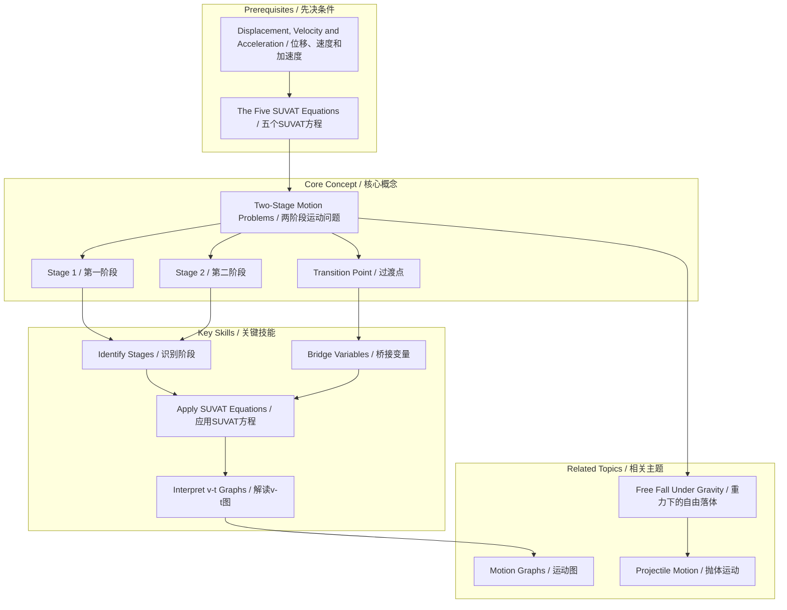

---
# Two-Stage Motion Problems / 两阶段运动问题

---

# 1. Overview / 概述

**English:**
Two-stage motion problems involve an object undergoing motion that can be divided into two distinct phases, each with its own constant acceleration. These problems are a direct application of the [[The Five SUVAT Equations]] and require careful analysis of the transition point between stages. Mastering this sub-topic is crucial because it bridges simple single-stage motion and more complex real-world scenarios, such as a car accelerating then braking, or a ball thrown upwards then falling back down. The key skill is identifying the end conditions of the first stage as the initial conditions for the second stage.

**中文:**
两阶段运动问题涉及一个物体的运动，该运动可分为两个不同的阶段，每个阶段都有其恒定的加速度。这些问题直接应用了[[The Five SUVAT Equations]]，需要仔细分析阶段之间的过渡点。掌握这个子知识点至关重要，因为它连接了简单的单阶段运动和更复杂的现实世界场景，例如汽车加速然后刹车，或者球向上抛出然后落回。关键技能是将第一阶段的结束条件识别为第二阶段的初始条件。

---

# 2. Syllabus Learning Objectives / 考纲学习目标

| CAIE 9702 | Edexcel IAL |
|-----------|-------------|
| 3.1(g): Apply the equations of motion for constant acceleration to solve problems involving multi-stage motion. | 1.9: Use the equations of motion for constant acceleration in a straight line, including the motion of bodies falling in a uniform gravitational field without air resistance. |
| 3.1(h): Describe the motion of a body falling in a uniform gravitational field. | 1.10: Describe and explain the motion of a body falling in a uniform gravitational field. |
| 3.1(k): Solve problems using the equations of motion. | 1.12: Solve problems using the equations of motion. |

**Examiner Expectations / 考官期望:**
- **EN:** You must be able to break a problem into logical stages, correctly assign variables (u, v, a, s, t) for each stage, and use the continuity of displacement and velocity at the transition point. A common trick is to ask for the total time or total displacement, requiring you to sum the results from each stage.
- **CN:** 你必须能够将问题分解为逻辑阶段，为每个阶段正确分配变量（u, v, a, s, t），并利用过渡点处位移和速度的连续性。一个常见的技巧是要求总时间或总位移，这需要你将每个阶段的结果相加。

---

# 3. Core Definitions / 核心定义

| Term (EN/CN) | Definition (EN) | Definition (CN) | Common Mistakes / 常见错误 |
|--------------|-----------------|-----------------|---------------------------|
| **Two-Stage Motion** / 两阶段运动 | Motion that can be divided into two separate parts, each with a different constant acceleration. | 可以分成两个独立部分的运动，每个部分具有不同的恒定加速度。 | Confusing the two stages and using the wrong initial velocity for the second stage. |
| **Transition Point** / 过渡点 | The instant in time when the motion changes from one stage to the next. The final velocity ($v$) of the first stage is the initial velocity ($u$) of the second stage. | 运动从一个阶段变为下一个阶段的瞬间。第一阶段的最终速度（$v$）是第二阶段的初始速度（$u$）。 | Forgetting that the displacement at the transition point is also continuous. |
| **Stage 1 (Phase 1)** / 第一阶段 | The initial part of the motion, defined by its own set of SUVAT variables. | 运动的初始部分，由其自己的一组SUVAT变量定义。 | - |
| **Stage 2 (Phase 2)** / 第二阶段 | The subsequent part of the motion, following the transition point. | 过渡点之后的后续运动部分。 | - |
| **Total Displacement** / 总位移 | The vector sum of the displacements from each stage. | 每个阶段位移的矢量和。 | Simply adding magnitudes without considering direction. |
| **Total Time** / 总时间 | The sum of the time intervals for each stage. | 每个阶段时间间隔的总和。 | - |

---

# 4. Key Concepts Explained / 关键概念详解

## 4.1 The "Bridge" Concept / “桥梁”概念

### Explanation / 解释
**English:** The most critical concept in two-stage motion is the **transition point**. This point acts as a "bridge" between the two stages. The final velocity ($v_1$) of the first stage is exactly equal to the initial velocity ($u_2$) of the second stage. Similarly, the displacement ($s_1$) from the start to the transition point is a key piece of information for the second stage. If the problem asks for total displacement, you must add $s_1$ and $s_2$. If it asks for total time, you add $t_1$ and $t_2$.

**中文:** 两阶段运动中最关键的概念是**过渡点**。这个点充当了两个阶段之间的“桥梁”。第一阶段的最终速度（$v_1$）恰好等于第二阶段的初始速度（$u_2$）。同样，从起点到过渡点的位移（$s_1$）是第二阶段的关键信息。如果问题要求总位移，你必须将 $s_1$ 和 $s_2$ 相加。如果要求总时间，则将 $t_1$ 和 $t_2$ 相加。

### Physical Meaning / 物理意义
**English:** Physically, the object doesn't "teleport" or change its velocity instantaneously at the transition point. The motion is continuous. The acceleration changes, but the velocity and position do not jump.

**中文:** 从物理上讲，物体在过渡点不会“瞬间移动”或瞬时改变其速度。运动是连续的。加速度会改变，但速度和位置不会跳跃。

### Common Misconceptions / 常见误区
- **EN:** Thinking the object stops at the transition point. It doesn't; it just changes its acceleration.
- **CN:** 认为物体在过渡点停止。它不会；它只是改变了加速度。
- **EN:** Using the initial velocity of the whole problem ($u_1$) as the initial velocity for the second stage ($u_2$).
- **CN:** 使用整个问题的初始速度（$u_1$）作为第二阶段的初始速度（$u_2$）。
- **EN:** Forgetting to define a consistent sign convention (e.g., upwards as positive) for the entire problem.
- **CN:** 忘记为整个问题定义一致的符号约定（例如，向上为正）。

### Exam Tips / 考试提示
- **EN:** Draw a clear diagram showing the two stages, the transition point, and label all known and unknown variables.
- **CN:** 画一个清晰的图表，显示两个阶段、过渡点，并标出所有已知和未知的变量。
- **EN:** Write down the SUVAT variables for each stage in a table. This helps you see what you know and what you need to find.
- **CN:** 在表格中写下每个阶段的SUVAT变量。这有助于你了解已知和需要求解的量。

> 📷 **IMAGE PROMPT — SUVAT-DIAGRAM: Two-Stage Motion Diagram**
> A clear, labeled physics diagram showing a car on a straight road. Stage 1: The car accelerates from rest (u=0) to a velocity v. Stage 2: The car then decelerates (brakes) from velocity v to rest (v=0). The transition point is clearly marked where the acceleration changes. Arrows indicate the direction of acceleration in each stage. Variables s1, t1, a1 for stage 1 and s2, t2, a2 for stage 2 are labeled.

---

# 5. Essential Equations / 核心公式

The core equations are the same five [[The Five SUVAT Equations]], applied twice.

$$ v = u + at $$
$$ s = ut + \frac{1}{2}at^2 $$
$$ v^2 = u^2 + 2as $$
$$ s = \frac{1}{2}(u+v)t $$
$$ s = vt - \frac{1}{2}at^2 $$

| Symbol (符号) | Meaning (EN) | Meaning (CN) | Unit (单位) |
|--------------|-------------|-------------|------------|
| $u$ | Initial velocity | 初速度 | m s⁻¹ |
| $v$ | Final velocity | 末速度 | m s⁻¹ |
| $a$ | Acceleration | 加速度 | m s⁻² |
| $s$ | Displacement | 位移 | m |
| $t$ | Time | 时间 | s |

**Derivation / 推导:** N/A for this sub-topic. The focus is on application.

**Conditions / 适用条件:**
- **EN:** Constant acceleration within each stage. The acceleration can be different between stages.
- **CN:** 每个阶段内加速度恒定。不同阶段之间的加速度可以不同。

**Limitations / 局限性:**
- **EN:** Cannot be used if acceleration is not constant within a stage. Does not account for air resistance or other non-uniform forces.
- **CN:** 如果加速度在一个阶段内不恒定，则不能使用。不考虑空气阻力或其他非均匀力。

---

# 6. Graphs and Relationships / 图表与关系

## 6.1 Velocity-Time Graph for Two-Stage Motion / 两阶段运动的速度-时间图

### Axes / 坐标轴
- **X-axis:** Time / 时间 (t / s)
- **Y-axis:** Velocity / 速度 (v / m s⁻¹)

### Shape / 形状
**English:** The graph consists of two straight line segments. The first segment has a gradient equal to $a_1$ (acceleration of stage 1). The second segment has a gradient equal to $a_2$ (acceleration of stage 2). The two lines meet at the transition point.

**中文:** 该图由两条直线段组成。第一段的斜率等于 $a_1$（第一阶段的加速度）。第二段的斜率等于 $a_2$（第二阶段的加速度）。两条线在过渡点相交。

### Gradient Meaning / 斜率含义
**English:** The gradient of each line segment represents the acceleration during that stage.
- Gradient of line 1 = $a_1$
- Gradient of line 2 = $a_2$

**中文:** 每个线段的斜率代表该阶段的加速度。
- 线段1的斜率 = $a_1$
- 线段2的斜率 = $a_2$

### Area Meaning / 面积含义
**English:** The total area under the entire graph (sum of areas under both segments) represents the **total displacement**.
- Area under segment 1 = $s_1$
- Area under segment 2 = $s_2$
- Total Area = $s_1 + s_2 = s_{total}$

**中文:** 整个图线下的总面积（两个线段下面积之和）代表**总位移**。
- 线段1下的面积 = $s_1$
- 线段2下的面积 = $s_2$
- 总面积 = $s_1 + s_2 = s_{total}$

### Exam Interpretation / 考试解读
- **EN:** A velocity-time graph is often the easiest way to solve two-stage problems, especially when finding total displacement. You can calculate the area of trapezoids or triangles without using the SUVAT equations.
- **CN:** 速度-时间图通常是解决两阶段问题的最简单方法，尤其是在求总位移时。你可以计算梯形或三角形的面积，而无需使用SUVAT方程。

> 📷 **IMAGE PROMPT — SUVAT-GRAPH: Two-Stage Velocity-Time Graph**
> A velocity-time graph with two straight line segments. The first segment starts at the origin (0,0) and has a positive slope, ending at point (t1, v). The second segment starts at (t1, v) and has a negative slope, ending at (t2, 0). The area under the first segment is shaded and labeled 's1'. The area under the second segment is shaded differently and labeled 's2'. The gradient of the first segment is labeled 'a1', and the gradient of the second is labeled 'a2'.

---

# 7. Required Diagrams / 必备图表

## 7.1 The Two-Stage Motion Diagram / 两阶段运动示意图

### Description / 描述
**English:** A simple diagram showing a straight line path divided into two sections. The first section shows the object moving with acceleration $a_1$, and the second with acceleration $a_2$. The transition point is clearly marked.

**中文:** 一个简单的示意图，显示一条直线路径被分成两部分。第一部分显示物体以加速度 $a_1$ 运动，第二部分以加速度 $a_2$ 运动。过渡点被清晰地标记出来。

### Image Prompt / 图片生成提示
> 📷 **IMAGE PROMPT — SUVAT-DIAGRAM: Two-Stage Motion Diagram (Detailed)**
> A detailed physics diagram for a two-stage motion problem. A horizontal line represents the path. The leftmost point is labeled 'Start (t=0, u=u1)'. A point in the middle is labeled 'Transition Point (v1 = u2)'. The rightmost point is labeled 'End (v=v2)'. The segment from Start to Transition is labeled 'Stage 1: a = a1, s = s1, t = t1'. The segment from Transition to End is labeled 'Stage 2: a = a2, s = s2, t = t2'. Arrows above the path indicate the direction of motion. Small arrows below the path indicate the direction of acceleration for each stage.

### Labels Required / 需要标注
- **EN:** Start, Transition Point, End, Stage 1, Stage 2, $u_1$, $v_1$, $u_2$, $v_2$, $a_1$, $a_2$, $s_1$, $s_2$, $t_1$, $t_2$.
- **CN:** 起点、过渡点、终点、第一阶段、第二阶段、$u_1$, $v_1$, $u_2$, $v_2$, $a_1$, $a_2$, $s_1$, $s_2$, $t_1$, $t_2$.

### Exam Importance / 考试重要性
- **EN:** Extremely high. Drawing this diagram is the first and most important step in solving any two-stage problem. It organizes your thoughts and prevents mistakes.
- **CN:** 极高。绘制此图是解决任何两阶段问题的第一步，也是最重要的一步。它可以整理你的思路并防止错误。

---

# 8. Worked Examples / 典型例题

## Example 1: Car Accelerating and Braking / 汽车加速与刹车

### Question / 题目
**English:** A car starts from rest and accelerates uniformly at $2.0 \text{ m s}^{-2}$ for 10 seconds. It then brakes uniformly and comes to a stop after a further 5 seconds. Calculate:
(a) The maximum speed reached by the car.
(b) The total displacement of the car.

**中文:** 一辆汽车从静止开始，以 $2.0 \text{ m s}^{-2}$ 的加速度匀加速行驶10秒。然后它均匀刹车，并在5秒后停下来。计算：
(a) 汽车达到的最大速度。
(b) 汽车的总位移。

### Solution / 解答

**Stage 1: Acceleration / 第一阶段：加速**
- $u_1 = 0 \text{ m s}^{-1}$
- $a_1 = 2.0 \text{ m s}^{-2}$
- $t_1 = 10 \text{ s}$
- Find $v_1$ (max speed) and $s_1$.

(a) Using $v = u + at$:
$$ v_1 = 0 + (2.0)(10) = 20 \text{ m s}^{-1} $$

**Answer (a):** $20 \text{ m s}^{-1}$

**Stage 2: Braking / 第二阶段：刹车**
- $u_2 = v_1 = 20 \text{ m s}^{-1}$ (The bridge!)
- $v_2 = 0 \text{ m s}^{-1}$
- $t_2 = 5 \text{ s}$
- Find $a_2$ and $s_2$.

First, find $a_2$:
$$ v_2 = u_2 + a_2 t_2 $$
$$ 0 = 20 + a_2(5) $$
$$ a_2 = -4 \text{ m s}^{-2} $$

Now find $s_2$:
$$ s_2 = u_2 t_2 + \frac{1}{2}a_2 t_2^2 $$
$$ s_2 = (20)(5) + \frac{1}{2}(-4)(5)^2 $$
$$ s_2 = 100 - 50 = 50 \text{ m} $$

**Find $s_1$:**
$$ s_1 = u_1 t_1 + \frac{1}{2}a_1 t_1^2 $$
$$ s_1 = 0 + \frac{1}{2}(2)(10)^2 = 100 \text{ m} $$

(b) Total displacement:
$$ s_{total} = s_1 + s_2 = 100 + 50 = 150 \text{ m} $$

**Answer (b):** $150 \text{ m}$ | **答案：** $150 \text{ m}$

### Quick Tip / 提示
- **EN:** You can also solve part (b) by finding the area under the velocity-time graph. The area is a trapezoid: $\frac{1}{2}(10+15)(20) = 250 \text{ m}$? No! The total time is 15 s. The area is $\frac{1}{2}(15)(20) = 150 \text{ m}$. This is much faster!
- **CN:** 你也可以通过求速度-时间图下的面积来解(b)部分。面积是一个三角形：$\frac{1}{2}(15)(20) = 150 \text{ m}$。这快多了！

---

# 9. Past Paper Question Types / 历年真题题型

| Question Type / 题型 | Frequency / 频率 | Difficulty / 难度 | Past Paper References / 真题索引 |
|----------------------|------------------|------------------|-------------------------------|
| Calculate total displacement or time for a two-stage journey. | High | Medium | 📝 *待填入* |
| Find the acceleration or deceleration in one stage given total time/displacement. | Medium | Medium-Hard | 📝 *待填入* |
| Interpret a velocity-time graph for a two-stage motion. | High | Easy-Medium | 📝 *待填入* |
| Describe the motion of a ball thrown upwards and falling back down. | High | Medium | 📝 *待填入* |

**Common Command Words / 常见指令词:**
- **EN:** Calculate, Determine, Find, Show, Sketch, Describe.
- **CN:** 计算、确定、求、证明、画出、描述。

---

# 10. Practical Skills Connections / 实验技能链接

**English:**
This sub-topic connects to practical work involving motion sensors and data loggers. For example, you might use a motion sensor to track a cart on a ramp that is first accelerated by a falling mass and then decelerates on a flat surface. You would then:
- **Plot a velocity-time graph** from the data.
- **Identify the two stages** of motion from the graph.
- **Calculate the acceleration** in each stage from the gradient.
- **Calculate the total displacement** from the area under the graph.
- **Estimate uncertainties** in your measurements of time and displacement.

**中文:**
本子知识点与涉及运动传感器和数据记录器的实验工作有关。例如，你可能使用运动传感器来跟踪一个在斜面上的小车，该小车先被一个下落的重物加速，然后在水平面上减速。然后你将：
- 根据数据**绘制速度-时间图**。
- 从图中**识别两个运动阶段**。
- 从斜率**计算每个阶段的加速度**。
- 从图下的面积**计算总位移**。
- **估计**时间和位移测量中的不确定度。

---

# 11. Concept Map / 概念图谱

---

# 12. Quick Revision Sheet / 速查表

| Category / 类别 | Key Points / 要点 |
|----------------|------------------|
| Definition / 定义 | Motion split into two parts with different constant accelerations. / 运动分为两个具有不同恒定加速度的部分。 |
| Key Formula / 核心公式 | $v = u + at$, $s = ut + \frac{1}{2}at^2$, $v^2 = u^2 + 2as$ (applied twice) |
| Key Graph / 核心图表 | Velocity-Time graph with two straight segments. Gradient = acceleration, Area = displacement. / 具有两条直线段的速度-时间图。斜率=加速度，面积=位移。 |
| The Bridge / 桥梁 | $v_1 = u_2$ (Final velocity of stage 1 = Initial velocity of stage 2) / 第一阶段的末速度 = 第二阶段的初速度 |
| Exam Tip / 考试提示 | Always draw a diagram and list SUVAT variables for each stage. / 始终画一个图表并列出每个阶段的SUVAT变量。 |
| Common Mistake / 常见错误 | Using the initial velocity of the whole problem for the second stage. / 将整个问题的初速度用于第二阶段。 |