# 1. Overview / 概述

**English:**
Acceleration-Time (a-t) graphs are a fundamental tool in kinematics that show how an object's acceleration changes over time. This sub-topic focuses on understanding the shape, gradient, and area under an a-t graph, and how it relates to [[Velocity-Time Graphs]] and [[Displacement-Time Graphs]]. While a-t graphs are less commonly tested than v-t graphs, they are essential for understanding non-uniform acceleration and are frequently used in conjunction with [[Equations of Motion (SUVAT)]] for more complex problems. The key skill is interpreting the graph to find changes in velocity (area under the graph) and understanding that constant acceleration appears as a horizontal line.

**中文:**
加速度-时间 (a-t) 图是运动学中的基本工具，用于展示物体的加速度随时间如何变化。本子知识点侧重于理解 a-t 图的形状、斜率和曲线下面积，以及它与 [[速度-时间图]] 和 [[位移-时间图]] 的关系。虽然 a-t 图不如 v-t 图常见，但它对于理解非匀变速运动至关重要，并经常与 [[运动学方程 (SUVAT)]] 结合用于更复杂的问题。关键技能是解读图形以找到速度的变化（曲线下面积），并理解匀加速度表现为水平线。

---

# 2. Syllabus Learning Objectives / 考纲学习目标

| CAIE 9702 | Edexcel IAL |
|-----------|-------------|
| 3.1 (j): Interpret displacement-time and velocity-time graphs for motion with uniform and non-uniform acceleration. | WPH11 U1: 1.5-1.8: Use and interpret graphs of displacement, velocity, and acceleration against time. |

**Examiner Expectations (EN):**
- Recognize and sketch a-t graphs for constant acceleration (horizontal line) and changing acceleration (non-horizontal line).
- Calculate the change in velocity from the area under an a-t graph.
- Understand that the gradient of an a-t graph has no direct physical meaning in standard A-Level physics (it represents "jerk" or rate of change of acceleration, which is not required).
- Relate a-t graphs to corresponding v-t and s-t graphs.

**Examiner Expectations (中文):**
- 识别并绘制匀加速度（水平线）和变加速度（非水平线）的 a-t 图。
- 通过 a-t 图下的面积计算速度的变化。
- 理解 a-t 图的斜率在标准 A-Level 物理中没有直接的物理意义（它代表“加加速度”或加速度的变化率，不要求掌握）。
- 将 a-t 图与对应的 v-t 图和 s-t 图联系起来。

---

# 3. Core Definitions / 核心定义

| Term (EN/CN) | Definition (EN) | Definition (CN) | Common Mistakes / 常见错误 |
|--------------|-----------------|-----------------|---------------------------|
| **Acceleration-Time Graph** / 加速度-时间图 | A graph showing how acceleration varies with time. The y-axis is acceleration (a) and the x-axis is time (t). | 展示加速度随时间变化的图形。纵轴为加速度 (a)，横轴为时间 (t)。 | Confusing a-t graph with v-t graph; thinking the graph shows velocity. |
| **Area Under a-t Graph** / a-t图下的面积 | The area between the graph line and the time axis represents the change in velocity (Δv) of the object. | 图线与时间轴之间的面积代表物体速度的变化量 (Δv)。 | Forgetting that area = Δv, not final velocity v. |
| **Constant Acceleration** / 匀加速度 | Acceleration that does not change with time; appears as a horizontal line on an a-t graph. | 不随时间变化的加速度；在 a-t 图上表现为水平线。 | Thinking constant acceleration means zero acceleration. |
| **Non-Uniform Acceleration** / 非匀加速度 | Acceleration that changes with time; appears as a sloping or curved line on an a-t graph. | 随时间变化的加速度；在 a-t 图上表现为斜线或曲线。 | Trying to use SUVAT equations directly (they only apply for constant acceleration). |
| **Zero Acceleration** / 零加速度 | The object moves with constant velocity; appears as a line along the time axis (a = 0). | 物体以恒定速度运动；在 a-t 图上表现为与时间轴重合的线 (a = 0)。 | Confusing zero acceleration with zero velocity. |

---

# 4. Key Concepts Explained / 关键概念详解

## 4.1 Interpreting the a-t Graph / 解读 a-t 图

### Explanation / 解释
**English:**
An acceleration-time graph plots acceleration (a) on the y-axis against time (t) on the x-axis. The key interpretation rules are:
1. **Horizontal line (constant a):** The object experiences uniform acceleration. If the line is above the x-axis, acceleration is positive (speeding up in positive direction or slowing down in negative direction). If below, acceleration is negative (deceleration).
2. **Sloping line (changing a):** The acceleration is changing uniformly (linear change) or non-uniformly (curved).
3. **Line on x-axis (a = 0):** The object moves with constant velocity (no acceleration).
4. **Area under graph:** The area between the graph line and the time axis equals the **change in velocity** (Δv = v_final - v_initial).

**中文:**
加速度-时间图将加速度 (a) 绘制在纵轴上，时间 (t) 绘制在横轴上。关键的解读规则是：
1. **水平线 (恒定 a):** 物体经历匀加速度。如果线在 x 轴上方，加速度为正（正向加速或反向减速）。如果在下方，加速度为负（减速）。
2. **斜线 (变化 a):** 加速度均匀变化（线性变化）或非均匀变化（曲线）。
3. **x 轴上的线 (a = 0):** 物体以恒定速度运动（无加速度）。
4. **图下面积:** 图线与时间轴之间的面积等于 **速度的变化量** (Δv = v_final - v_initial)。

### Physical Meaning / 物理意义
**English:**
The a-t graph directly shows how the rate of change of velocity evolves over time. A positive area means the object's velocity increases; a negative area means velocity decreases. The graph is particularly useful for problems where acceleration is not constant, as it allows calculation of velocity changes without using SUVAT equations.

**中文:**
a-t 图直接展示了速度变化率随时间如何演变。正面积意味着物体的速度增加；负面积意味着速度减少。该图对于加速度不恒定的问题特别有用，因为它允许在不使用 SUVAT 方程的情况下计算速度变化。

### Common Misconceptions / 常见误区
- **Misconception:** The a-t graph shows the velocity of the object.
  **Reality:** It shows acceleration, not velocity. The area gives the change in velocity.
- **Misconception:** A horizontal line on an a-t graph means the object is stationary.
  **Reality:** It means acceleration is constant. The object could be moving at increasing speed.
- **Misconception:** The gradient of an a-t graph is important.
  **Reality:** For A-Level, the gradient is not required (it's "jerk"). Focus on area.

### Exam Tips / 考试提示
- **EN:** Always check the y-axis label. Many students mistake a-t graphs for v-t graphs.
- **EN:** When calculating area, use the formula for the shape (rectangle, triangle, trapezium).
- **EN:** Remember: area = Δv, not v. You need initial velocity to find final velocity.
- **中文:** 始终检查纵轴标签。许多学生将 a-t 图误认为是 v-t 图。
- **中文:** 计算面积时，使用形状的公式（矩形、三角形、梯形）。
- **中文:** 记住：面积 = Δv，而不是 v。你需要初速度才能找到末速度。

> 📷 **IMAGE PROMPT — A01: Basic a-t Graph Shapes**
> A clean diagram showing three common a-t graph shapes: (1) a horizontal line above the x-axis labeled "constant positive acceleration", (2) a horizontal line below the x-axis labeled "constant negative acceleration (deceleration)", (3) a line on the x-axis labeled "zero acceleration (constant velocity)". Each with a brief description of the motion.

---

## 4.2 Relating a-t to v-t and s-t Graphs / 将 a-t 图与 v-t 图和 s-t 图关联

### Explanation / 解释
**English:**
Understanding the relationship between a-t, v-t, and s-t graphs is crucial. The connections are:
- **a-t → v-t:** The area under the a-t graph gives the change in velocity. To construct a v-t graph from an a-t graph, calculate the area for each time interval and add it to the initial velocity.
- **v-t → a-t:** The gradient of the v-t graph at any point gives the acceleration at that instant. So the a-t graph is the gradient of the v-t graph.
- **a-t → s-t:** Indirectly through v-t. First find v-t from a-t (area), then find s-t from v-t (area under v-t).

**中文:**
理解 a-t、v-t 和 s-t 图之间的关系至关重要。联系如下：
- **a-t → v-t:** a-t 图下的面积给出速度的变化。要从 a-t 图构建 v-t 图，计算每个时间间隔的面积并将其加到初速度上。
- **v-t → a-t:** v-t 图上任意点的斜率给出该时刻的加速度。因此 a-t 图是 v-t 图的斜率。
- **a-t → s-t:** 通过 v-t 间接得到。首先从 a-t 图找到 v-t 图（面积），然后从 v-t 图找到 s-t 图（v-t 下的面积）。

### Physical Meaning / 物理意义
**English:**
This hierarchy shows that acceleration is the "driver" of motion. The a-t graph determines how velocity changes, which in turn determines how displacement changes. This is why a-t graphs are fundamental: they describe the forces acting on an object (via F = ma).

**中文:**
这种层级关系表明加速度是运动的“驱动力”。a-t 图决定了速度如何变化，进而决定了位移如何变化。这就是为什么 a-t 图是基础性的：它们描述了作用在物体上的力（通过 F = ma）。

### Common Misconceptions / 常见误区
- **Misconception:** You can directly read velocity from an a-t graph.
  **Reality:** You can only find the change in velocity. You need initial velocity.
- **Misconception:** The shape of a-t and v-t graphs are the same.
  **Reality:** Only for constant acceleration (both are horizontal lines). For changing acceleration, they differ.

### Exam Tips / 考试提示
- **EN:** Practice converting between graph types. A common question gives an a-t graph and asks for the v-t or s-t graph.
- **EN:** Use the "area" and "gradient" relationships systematically.
- **中文:** 练习在不同图形类型之间转换。常见题目给出 a-t 图，要求画出 v-t 或 s-t 图。
- **中文:** 系统地使用“面积”和“斜率”关系。

> 📷 **IMAGE PROMPT — A02: Converting a-t to v-t Graph**
> A three-panel diagram. Panel 1: a-t graph showing a rectangle of positive acceleration from t=0 to t=5s, then zero acceleration from t=5s to t=10s. Panel 2: The corresponding v-t graph showing a linear increase (positive gradient) from t=0 to t=5s, then horizontal line from t=5s to t=10s. Panel 3: The corresponding s-t graph showing a curved (parabolic) section from t=0 to t=5s, then a straight line from t=5s to t=10s. Arrows show the relationships: area of a-t → gradient of v-t → gradient of s-t.

---

# 5. Essential Equations / 核心公式

## 5.1 Change in Velocity from a-t Graph / 从 a-t 图求速度变化

$$ \Delta v = \int_{t_1}^{t_2} a \, dt = \text{Area under a-t graph} $$

| Symbol (符号) | Meaning (EN) | Meaning (CN) | Unit (单位) |
|--------------|-------------|-------------|------------|
| $\Delta v$ | Change in velocity | 速度的变化量 | m s⁻¹ |
| $a$ | Acceleration | 加速度 | m s⁻² |
| $t_1, t_2$ | Initial and final times | 初始和最终时间 | s |

**Derivation / 推导:**
From the definition of acceleration: $a = \frac{dv}{dt}$, rearranging gives $dv = a \, dt$. Integrating both sides: $\int_{v_1}^{v_2} dv = \int_{t_1}^{t_2} a \, dt$, so $\Delta v = \text{area under a-t graph}$.

**Conditions / 适用条件:**
- **EN:** Always valid for any motion, uniform or non-uniform acceleration.
- **中文:** 适用于任何运动，匀变速或非匀变速。

**Limitations / 局限性:**
- **EN:** Only gives change in velocity, not final velocity. You must know initial velocity.
- **EN:** For non-uniform acceleration, area calculation may require integration or approximation.
- **中文:** 只给出速度的变化量，不是末速度。必须知道初速度。
- **中文:** 对于非匀加速度，面积计算可能需要积分或近似。

## 5.2 For Constant Acceleration (Rectangular Area) / 匀加速度（矩形面积）

$$ \Delta v = a \times \Delta t $$

| Symbol (符号) | Meaning (EN) | Meaning (CN) | Unit (单位) |
|--------------|-------------|-------------|------------|
| $a$ | Constant acceleration | 匀加速度 | m s⁻² |
| $\Delta t$ | Time interval | 时间间隔 | s |

**Conditions / 适用条件:**
- **EN:** Only for constant acceleration (horizontal line on a-t graph).
- **中文:** 仅适用于匀加速度（a-t 图上的水平线）。

---

# 6. Graphs and Relationships / 图表与关系

## 6.1 Basic a-t Graph Shapes / 基本 a-t 图形状

### Axes / 坐标轴
- **EN:** x-axis: Time (t) / s; y-axis: Acceleration (a) / m s⁻²
- **中文:** x轴：时间 (t) / s；y轴：加速度 (a) / m s⁻²

### Shape / 形状
| Motion Type | a-t Graph Shape | Description |
|-------------|-----------------|-------------|
| Constant velocity | Horizontal line at a = 0 | No acceleration |
| Constant acceleration (positive) | Horizontal line above x-axis | a = positive constant |
| Constant deceleration (negative) | Horizontal line below x-axis | a = negative constant |
| Increasing acceleration | Line with positive gradient | a increases with time |
| Decreasing acceleration | Line with negative gradient | a decreases with time |

### Gradient Meaning / 斜率含义
- **EN:** The gradient of an a-t graph represents the rate of change of acceleration (called "jerk"). This is NOT required for A-Level Physics.
- **中文:** a-t 图的斜率代表加速度的变化率（称为“加加速度”）。A-Level 物理不要求掌握。

### Area Meaning / 面积含义
- **EN:** The area under an a-t graph represents the **change in velocity** (Δv).
- **中文:** a-t 图下的面积代表 **速度的变化量** (Δv)。

### Exam Interpretation / 考试解读
- **EN:** Focus on area calculation. Common shapes: rectangles (constant a), triangles (linearly changing a), trapeziums (combination).
- **EN:** If the graph crosses the x-axis, calculate positive and negative areas separately, then find net Δv.
- **中文:** 专注于面积计算。常见形状：矩形（恒定 a）、三角形（线性变化 a）、梯形（组合）。
- **中文:** 如果图形穿过 x 轴，分别计算正面积和负面积，然后求净 Δv。

> 📷 **IMAGE PROMPT — A03: Area Under a-t Graph Examples**
> Four panels showing different a-t graph shapes with shaded areas: (1) Rectangle: constant a = 2 m/s² from t=0 to t=5s, area = 10 m/s. (2) Triangle: a increases linearly from 0 to 4 m/s² over 6s, area = 12 m/s. (3) Trapezium: a = 3 m/s² from t=0 to t=2s, then decreases linearly to 0 at t=6s, area = 18 m/s. (4) Graph crossing x-axis: positive area from t=0 to t=4s, negative area from t=4s to t=8s. Each with area calculation shown.

---

# 7. Required Diagrams / 必备图表

## 7.1 Standard a-t Graph for Constant Acceleration / 匀加速度的标准 a-t 图

### Description / 描述
**English:**
A standard a-t graph for an object moving with constant acceleration of +2 m/s² for 5 seconds, then constant velocity for 3 seconds, then constant deceleration of -3 m/s² for 2 seconds.

**中文:**
一个物体以 +2 m/s² 的匀加速度运动 5 秒，然后以恒定速度运动 3 秒，然后以 -3 m/s² 的匀减速度运动 2 秒的标准 a-t 图。

### Image Prompt / 图片生成提示
> 📷 **IMAGE PROMPT — A04: Multi-Stage a-t Graph**
> A clean, labeled acceleration-time graph with three distinct sections. Section 1 (t=0 to t=5s): horizontal line at a = +2 m/s², labeled "constant acceleration". Section 2 (t=5 to t=8s): horizontal line at a = 0 m/s², labeled "constant velocity". Section 3 (t=8 to t=10s): horizontal line at a = -3 m/s², labeled "constant deceleration". The area under each section is shaded in different colors. Axes labeled: "a / m s⁻²" (y-axis) and "t / s" (x-axis). Grid lines shown for clarity.

### Labels Required / 需要标注
- **EN:** Axes: "a / m s⁻²" and "t / s"; Sections: "constant acceleration", "constant velocity", "constant deceleration"; Shaded areas with Δv values.
- **中文:** 坐标轴："a / m s⁻²" 和 "t / s"；分段："匀加速度"、"恒定速度"、"匀减速度"；阴影区域及 Δv 值。

### Exam Importance / 考试重要性
- **EN:** High. This is the most common type of a-t graph question. Students must calculate total Δv from the areas.
- **中文:** 高。这是最常见的 a-t 图题型。学生必须通过面积计算总 Δv。

---

## 7.2 Converting a-t to v-t Graph / 将 a-t 图转换为 v-t 图

### Description / 描述
**English:**
A side-by-side comparison showing how the area under an a-t graph translates to the gradient of a v-t graph. Given initial velocity v₀ = 0 m/s.

**中文:**
并排比较，展示 a-t 图下的面积如何转化为 v-t 图的斜率。给定初速度 v₀ = 0 m/s。

### Image Prompt / 图片生成提示
> 📷 **IMAGE PROMPT — A05: a-t to v-t Conversion**
> Two graphs placed side by side. Left graph: a-t graph with a rectangle of a = 3 m/s² from t=0 to t=4s, then a = 0 from t=4s to t=8s. The rectangle area is shaded and labeled "Δv = 12 m/s". Right graph: v-t graph starting at (0,0), with a straight line of gradient 3 from t=0 to t=4s reaching v = 12 m/s, then a horizontal line at v = 12 m/s from t=4s to t=8s. Arrows connect the area on the a-t graph to the gradient on the v-t graph. Both graphs share the same time axis.

### Labels Required / 需要标注
- **EN:** Left: "a-t graph", shaded area "Δv = a × Δt". Right: "v-t graph", gradient "a = Δv/Δt". Initial velocity v₀ = 0.
- **中文:** 左侧："a-t 图"，阴影面积 "Δv = a × Δt"。右侧："v-t 图"，斜率 "a = Δv/Δt"。初速度 v₀ = 0。

### Exam Importance / 考试重要性
- **EN:** Very high. Converting between graph types is a common exam skill.
- **中文:** 非常高。在不同图形类型之间转换是常见的考试技能。

---

# 8. Worked Examples / 典型例题

## Example 1: Calculating Change in Velocity from a-t Graph / 从 a-t 图计算速度变化

### Question / 题目
**English:**
An object starts from rest. Its acceleration-time graph shows:
- From t = 0 to t = 4 s: constant acceleration of +3 m s⁻²
- From t = 4 to t = 10 s: constant acceleration of -2 m s⁻²

Calculate:
(a) The change in velocity during the first 4 seconds.
(b) The change in velocity during the next 6 seconds.
(c) The final velocity of the object at t = 10 s.

**中文:**
一个物体从静止开始运动。其加速度-时间图显示：
- 从 t = 0 到 t = 4 s：匀加速度 +3 m s⁻²
- 从 t = 4 到 t = 10 s：匀加速度 -2 m s⁻²

计算：
(a) 前 4 秒内的速度变化量。
(b) 接下来 6 秒内的速度变化量。
(c) 物体在 t = 10 s 时的末速度。

### Solution / 解答

**Step 1: Identify the shapes and calculate areas**
(a) First 4 seconds: Rectangle
$$ \Delta v_1 = a \times \Delta t = 3 \times 4 = 12 \text{ m s}^{-1} $$

(b) Next 6 seconds: Rectangle
$$ \Delta v_2 = a \times \Delta t = (-2) \times 6 = -12 \text{ m s}^{-1} $$

**Step 2: Calculate final velocity**
(c) Initial velocity $u = 0$ (starts from rest)
$$ v = u + \Delta v_1 + \Delta v_2 = 0 + 12 + (-12) = 0 \text{ m s}^{-1} $$

### Final Answer / 最终答案
**Answer:** (a) Δv = +12 m s⁻¹ | (b) Δv = -12 m s⁻¹ | (c) v = 0 m s⁻¹
**答案：** (a) Δv = +12 m s⁻¹ | (b) Δv = -12 m s⁻¹ | (c) v = 0 m s⁻¹

### Quick Tip / 提示
- **EN:** Always check if the object starts from rest or has an initial velocity. The area gives Δv, not v.
- **中文:** 始终检查物体是从静止开始还是有初速度。面积给出的是 Δv，而不是 v。

---

## Example 2: Non-Constant Acceleration (Triangular Area) / 非匀加速度（三角形面积）

### Question / 题目
**English:**
A car accelerates from rest. The a-t graph shows acceleration increasing linearly from 0 to 4 m s⁻² over 5 seconds.
(a) Calculate the change in velocity of the car during these 5 seconds.
(b) If the car then continues with constant acceleration of 4 m s⁻² for another 3 seconds, what is the total change in velocity?

**中文:**
一辆汽车从静止开始加速。a-t 图显示加速度在 5 秒内从 0 线性增加到 4 m s⁻²。
(a) 计算汽车在这 5 秒内的速度变化量。
(b) 如果汽车随后以 4 m s⁻² 的匀加速度继续运动 3 秒，总速度变化量是多少？

### Solution / 解答

**Step 1: Calculate area for triangular section**
(a) Area of triangle:
$$ \Delta v_1 = \frac{1}{2} \times \text{base} \times \text{height} = \frac{1}{2} \times 5 \times 4 = 10 \text{ m s}^{-1} $$

**Step 2: Calculate area for rectangular section**
(b) Area of rectangle:
$$ \Delta v_2 = a \times \Delta t = 4 \times 3 = 12 \text{ m s}^{-1} $$

**Step 3: Total change in velocity**
$$ \Delta v_{\text{total}} = \Delta v_1 + \Delta v_2 = 10 + 12 = 22 \text{ m s}^{-1} $$

### Final Answer / 最终答案
**Answer:** (a) Δv = 10 m s⁻¹ | (b) Total Δv = 22 m s⁻¹
**答案：** (a) Δv = 10 m s⁻¹ | (b) 总 Δv = 22 m s⁻¹

### Quick Tip / 提示
- **EN:** For linearly changing acceleration, the a-t graph forms a triangle. Use the triangle area formula.
- **中文:** 对于线性变化的加速度，a-t 图形成三角形。使用三角形面积公式。

---

# 9. Past Paper Question Types / 历年真题题型

| Question Type / 题型 | Frequency / 频率 | Difficulty / 难度 | Past Paper References / 真题索引 |
|----------------------|------------------|------------------|-------------------------------|
| Calculate Δv from area under a-t graph | High | Easy | 📝 *待填入* |
| Sketch v-t graph from given a-t graph | Medium | Medium | 📝 *待填入* |
| Interpret a-t graph for non-uniform motion | Low | Medium-Hard | 📝 *待填入* |
| Multi-stage motion with a-t, v-t, s-t conversion | Medium | Hard | 📝 *待填入* |

**Common Command Words / 常见指令词:**
- **EN:** "Calculate the change in velocity", "Sketch the velocity-time graph", "Determine the acceleration", "Find the area under the graph"
- **中文:** "计算速度的变化量"、"画出速度-时间图"、"确定加速度"、"求图下的面积"

---

# 10. Practical Skills Connections / 实验技能链接

**English:**
Acceleration-time graphs are less commonly produced directly in experiments compared to displacement-time or velocity-time graphs. However, they can be derived from experimental data:

1. **Motion Sensors / Data Loggers:** Using ultrasonic motion sensors connected to a computer, you can collect displacement-time data. Software can then differentiate to find velocity-time and acceleration-time graphs.
2. **Ticker Timers:** From a ticker tape, you can calculate velocities at intervals, plot a v-t graph, and then find acceleration from its gradient. This acceleration value can be plotted against time to create an a-t graph.
3. **Light Gates:** Using dual light gates, you can measure instantaneous velocities and calculate acceleration. Plotting these acceleration values against time gives an a-t graph.
4. **Uncertainties:** When deriving a-t graphs from experimental data, uncertainties in displacement measurements propagate through differentiation, making acceleration values less precise. Always include error bars on a-t graphs.
5. **Graph Plotting Skills:** When asked to plot an a-t graph from data, ensure axes are labeled with units, scales are appropriate, and points are plotted accurately. Draw a line of best fit.

**中文:**
与位移-时间图或速度-时间图相比，加速度-时间图在实验中直接产生的频率较低。然而，它们可以从实验数据中推导出来：

1. **运动传感器/数据记录器:** 使用连接到计算机的超声波运动传感器，可以收集位移-时间数据。然后软件可以微分以找到速度-时间和加速度-时间图。
2. **打点计时器:** 从打点计时器纸带上，可以计算间隔内的速度，绘制 v-t 图，然后从其斜率找到加速度。这个加速度值可以相对于时间绘制以创建 a-t 图。
3. **光电门:** 使用双光电门，可以测量瞬时速度并计算加速度。将这些加速度值相对于时间绘制得到 a-t 图。
4. **不确定度:** 从实验数据推导 a-t 图时，位移测量的不确定度通过微分传播，使加速度值精度降低。始终在 a-t 图上包含误差棒。
5. **绘图技能:** 当要求根据数据绘制 a-t 图时，确保坐标轴标有单位，比例适当，点准确绘制。画出最佳拟合线。

---

# 11. Concept Map / 概念图谱

```mermaid
graph TD
    %% Leaf Node: Acceleration-Time Graphs
    A[Acceleration-Time Graphs] --> B[Definition]
    A --> C[Key Interpretations]
    A --> D[Area Under Graph]
    A --> E[Relationship to Other Graphs]
    A --> F[Practical Applications]

    B --> B1["a on y-axis, t on x-axis"]
    B --> B2["Shows how acceleration changes"]

    C --> C1["Horizontal line = constant a"]
    C --> C2["Line on axis = zero a"]
    C --> C3["Sloping line = changing a"]

    D --> D1["Area = Δv (change in velocity)"]
    D --> D2["Rectangle: Δv = a × Δt"]
    D --> D3["Triangle: Δv = ½ × base × height"]
    D --> D4["Trapezium: Δv = ½(a₁ + a₂) × Δt"]

    E --> E1["a-t → v-t: area gives gradient"]
    E --> E2["v-t → a-t: gradient gives a"]
    E --> E3["a-t → s-t: indirect via v-t"]

    E1 --> E1a["[[Velocity-Time Graphs]]"]
    E2 --> E2a["[[Velocity-Time Graphs]]"]
    E3 --> E3a["[[Displacement-Time Graphs]]"]

    F --> F1["Motion sensors & data loggers"]
    F --> F2["Ticker timers"]
    F --> F3["Light gates"]

    %% Prerequisites
    A -.-> P1["[[Displacement, Velocity and Acceleration]]"]
    A -.-> P2["[[Equations of Motion (SUVAT)]]"]

    %% Sibling topics
    A -.-> S1["[[Displacement-Time Graphs]]"]
    A -.-> S2["[[Velocity-Time Graphs]]"]
    A -.-> S3["[[Interpreting Gradient and Area]]"]

    %% Parent Hub
    A -.-> H["[[Motion Graphs]]"]
```

---

# 12. Quick Revision Sheet / 速查表

| Category / 类别 | Key Points / 要点 |
|----------------|------------------|
| **Definition / 定义** | Graph of acceleration (y-axis) vs time (x-axis). Shows how acceleration changes. / 加速度（纵轴）与时间（横轴）的图。展示加速度如何变化。 |
| **Key Formula / 核心公式** | $\Delta v = \text{Area under a-t graph}$ / a-t 图下的面积 = 速度变化量 |
| **Area Shapes / 面积形状** | Rectangle: $\Delta v = a \times \Delta t$; Triangle: $\Delta v = \frac{1}{2} \times \text{base} \times \text{height}$; Trapezium: $\Delta v = \frac{1}{2}(a_1 + a_2) \times \Delta t$ |
| **Key Graph / 核心图表** | Horizontal line = constant acceleration; Line on axis = constant velocity; Sloping line = changing acceleration / 水平线 = 匀加速度；轴上直线 = 恒定速度；斜线 = 变化加速度 |
| **Gradient / 斜率** | NOT required for A-Level (represents "jerk") / A-Level 不要求（代表“加加速度”） |
| **Common Mistake / 常见错误** | Confusing a-t graph with v-t graph; thinking area gives final velocity (it gives Δv) / 混淆 a-t 图和 v-t 图；认为面积给出末速度（它给出 Δv） |
| **Exam Tip / 考试提示** | Always check y-axis label; calculate area carefully; remember you need initial velocity to find final velocity / 始终检查纵轴标签；仔细计算面积；记住需要初速度才能找到末速度 |
| **Prerequisites / 前置知识** | [[Displacement, Velocity and Acceleration]]; [[Equations of Motion (SUVAT)]] |
| **Related Topics / 相关主题** | [[Motion Graphs]]; [[Velocity-Time Graphs]]; [[Displacement-Time Graphs]]; [[Interpreting Gradient and Area]] |