# 1. Overview / 概述

**English:**
A displacement-time graph (s-t graph) is a fundamental tool in kinematics that shows how the displacement of an object changes over time. This sub-topic covers how to plot, read, and interpret s-t graphs, including understanding gradient as velocity, identifying different types of motion (stationary, uniform velocity, acceleration), and analyzing key features like intercepts and turning points. Mastering s-t graphs is essential for understanding [[Motion Graphs]] as a whole, as it provides the foundation for interpreting [[Velocity-Time Graphs]] and [[Acceleration-Time Graphs]]. This skill is crucial for solving real-world motion problems and is a core requirement for both CAIE 9702 and Edexcel IAL specifications.

**中文:**
位移-时间图（s-t图）是运动学中的基本工具，用于展示物体位移随时间的变化。本子知识点涵盖如何绘制、读取和解释s-t图，包括理解梯度作为速度、识别不同类型的运动（静止、匀速、加速），以及分析截距和转折点等关键特征。掌握s-t图对于理解整个[[Motion Graphs]]至关重要，因为它为解释[[Velocity-Time Graphs]]和[[Acceleration-Time Graphs]]提供了基础。这项技能对于解决实际运动问题至关重要，也是CAIE 9702和Edexcel IAL考纲的核心要求。

---

# 2. Syllabus Learning Objectives / 考纲学习目标

| CAIE 9702 | Edexcel IAL |
|-----------|-------------|
| 3.1 (j) Interpret displacement-time graphs | WPH11 U1: 1.5-1.8 Interpret displacement-time graphs for motion with constant velocity and constant acceleration |

**Examiner Expectations / 考官期望:**

**English:**
- Plot displacement against time correctly
- Determine velocity from gradient of s-t graph
- Identify stationary, uniform velocity, and accelerated motion
- Calculate distance traveled from displacement values
- Interpret non-linear s-t graphs (curved)
- Recognize that gradient at a point on a curved s-t graph gives instantaneous velocity

**中文:**
- 正确绘制位移与时间的关系图
- 从s-t图的梯度确定速度
- 识别静止、匀速和加速运动
- 从位移值计算行进距离
- 解释非线性s-t图（曲线）
- 认识到曲线s-t图上某点的梯度给出瞬时速度

---

# 3. Core Definitions / 核心定义

| Term (EN/CN) | Definition (EN) | Definition (CN) | Common Mistakes / 常见错误 |
|--------------|-----------------|-----------------|---------------------------|
| **Displacement** / 位移 | The straight-line distance from a fixed reference point in a specified direction | 从固定参考点到物体的直线距离，带有指定方向 | Confusing displacement with distance (scalar vs vector) / 混淆位移与距离（矢量与标量） |
| **Displacement-Time Graph** / 位移-时间图 | A graph showing how displacement varies with time, with time on the x-axis and displacement on the y-axis | 显示位移随时间变化的图表，时间在x轴，位移在y轴 | Forgetting that displacement can be negative / 忘记位移可以为负 |
| **Gradient** / 梯度 | The slope of the graph, calculated as change in displacement divided by change in time (Δs/Δt) | 图表的斜率，计算为位移变化量除以时间变化量 (Δs/Δt) | Using Δt/Δs instead of Δs/Δt / 使用Δt/Δs而不是Δs/Δt |
| **Stationary** / 静止 | Object at rest; displacement remains constant over time | 物体静止；位移随时间保持不变 | Thinking zero displacement means stationary (could be at origin) / 认为位移为零意味着静止（可能在原点） |
| **Uniform Velocity** / 匀速 | Constant velocity; displacement changes linearly with time | 恒定速度；位移随时间线性变化 | Confusing uniform velocity with zero velocity / 混淆匀速与零速度 |
| **Instantaneous Velocity** / 瞬时速度 | Velocity at a specific instant, found from the gradient of the tangent to the s-t curve at that point | 在特定时刻的速度，由s-t曲线上该点的切线梯度求得 | Using average gradient instead of tangent gradient / 使用平均梯度而不是切线梯度 |

---

# 4. Key Concepts Explained / 关键概念详解

## 4.1 Gradient as Velocity / 梯度作为速度

### Explanation / 解释
**English:**
The gradient (slope) of a displacement-time graph represents the velocity of the object. This is derived from the definition of velocity: $v = \frac{\Delta s}{\Delta t}$. On an s-t graph, $\Delta s$ is the vertical change and $\Delta t$ is the horizontal change, so gradient = $\frac{\Delta s}{\Delta t} = v$.

- **Positive gradient** → positive velocity (moving away from reference point)
- **Negative gradient** → negative velocity (moving towards reference point)
- **Zero gradient** → stationary (velocity = 0)
- **Constant gradient** → uniform velocity
- **Changing gradient** → acceleration (velocity changing)

For curved s-t graphs, the gradient changes continuously. The instantaneous velocity at any point is found by drawing a tangent to the curve at that point and calculating its gradient.

**中文:**
位移-时间图的梯度（斜率）代表物体的速度。这源于速度的定义：$v = \frac{\Delta s}{\Delta t}$。在s-t图上，$\Delta s$是垂直变化量，$\Delta t$是水平变化量，所以梯度 = $\frac{\Delta s}{\Delta t} = v$。

- **正梯度** → 正速度（远离参考点运动）
- **负梯度** → 负速度（朝向参考点运动）
- **零梯度** → 静止（速度 = 0）
- **恒定梯度** → 匀速
- **变化梯度** → 加速（速度变化）

对于曲线s-t图，梯度连续变化。任何点的瞬时速度通过在该点绘制曲线的切线并计算其梯度来求得。

### Physical Meaning / 物理意义
**English:**
The gradient tells us how fast the displacement is changing. A steeper gradient means a larger velocity. The sign of the gradient indicates direction relative to the reference point.

**中文:**
梯度告诉我们位移变化的速度。梯度越陡，速度越大。梯度的符号表示相对于参考点的方向。

### Common Misconceptions / 常见误区
- **Misconception:** A curved s-t graph means the object is moving along a curved path.
  **Truth:** The curve represents changing velocity (acceleration), not a curved path in space.
  
- **Misconception:** The area under an s-t graph has physical meaning.
  **Truth:** The area under an s-t graph has NO standard physical meaning. Only gradient matters.

- **Misconception:** Displacement equals distance traveled.
  **Truth:** Displacement is the straight-line distance from start to finish; distance is the total path length.

- **常见误区:** 曲线s-t图意味着物体沿曲线路径运动。
  **事实:** 曲线代表速度变化（加速），而不是空间中的曲线路径。

- **常见误区:** s-t图下的面积有物理意义。
  **事实:** s-t图下的面积没有标准物理意义。只有梯度重要。

- **常见误区:** 位移等于行进距离。
  **事实:** 位移是从起点到终点的直线距离；距离是总路径长度。

### Exam Tips / 考试提示
**English:**
- Always check the units on both axes before calculating gradient
- For curved graphs, draw the tangent carefully using a ruler
- Remember: gradient = velocity, NOT acceleration
- If the graph shows displacement returning to zero, the object has returned to its starting point

**中文:**
- 在计算梯度前始终检查两个轴的单位
- 对于曲线图，用尺子仔细绘制切线
- 记住：梯度 = 速度，而不是加速度
- 如果图表显示位移回到零，物体已返回起点

> 📷 **IMAGE PROMPT — S-T-01: Displacement-Time Graph Types**
> A clear diagram showing four different displacement-time graphs side by side: (1) horizontal line for stationary object, (2) straight line with positive gradient for uniform velocity away from origin, (3) straight line with negative gradient for uniform velocity towards origin, (4) curved line (parabolic) for accelerating object. Each graph should have labeled axes (displacement s/m on y-axis, time t/s on x-axis) and annotations showing gradient calculations. Use different colors for each type of motion.

---

## 4.2 Types of Motion on s-t Graphs / s-t图上的运动类型

### Explanation / 解释
**English:**
Different types of motion produce characteristic s-t graph shapes:

1. **Stationary (静止):** Horizontal line (gradient = 0)
   - Displacement constant → velocity = 0

2. **Uniform Velocity (匀速):** Straight line with constant gradient
   - Equal displacement in equal time intervals
   - Gradient = velocity (constant)

3. **Constant Acceleration (匀加速):** Parabolic curve
   - Gradient increases (accelerating away) or decreases (decelerating)
   - For $s = ut + \frac{1}{2}at^2$, the graph is a parabola

4. **Non-uniform Acceleration (非匀加速):** Curved line that is not a simple parabola
   - Gradient changes in a non-linear way

**中文:**
不同类型的运动产生特征性的s-t图形状：

1. **静止:** 水平线（梯度 = 0）
   - 位移恒定 → 速度 = 0

2. **匀速:** 恒定梯度的直线
   - 相等时间间隔内位移相等
   - 梯度 = 速度（恒定）

3. **匀加速:** 抛物线曲线
   - 梯度增加（加速远离）或减少（减速）
   - 对于 $s = ut + \frac{1}{2}at^2$，图形是抛物线

4. **非匀加速:** 不是简单抛物线的曲线
   - 梯度以非线性方式变化

### Exam Tips / 考试提示
**English:**
- A straight line ALWAYS means constant velocity (including zero)
- A curved line ALWAYS means acceleration (velocity changing)
- The steeper the curve gets, the faster the object is moving
- If the curve flattens, the object is slowing down

**中文:**
- 直线始终意味着恒定速度（包括零）
- 曲线始终意味着加速（速度变化）
- 曲线越陡，物体运动越快
- 如果曲线变平，物体正在减速

---

## 4.3 Interpreting Key Features / 解释关键特征

### Explanation / 解释
**English:**
Key features to identify on s-t graphs:

- **y-intercept (s₀):** Initial displacement from reference point at t = 0
- **x-intercept (t when s = 0):** Time when object passes through the reference point
- **Turning point (maximum/minimum):** Where gradient changes sign → object changes direction
- **Intersection of two graphs:** Two objects at the same displacement at the same time (they meet)
- **Return to origin:** When displacement returns to zero

**中文:**
在s-t图上需要识别的关键特征：

- **y截距 (s₀):** t = 0时从参考点的初始位移
- **x截距 (s = 0时的t):** 物体通过参考点的时间
- **转折点（最大值/最小值）：** 梯度改变符号的地方 → 物体改变方向
- **两个图的交点：** 两个物体在同一时间处于相同位移（它们相遇）
- **返回原点：** 位移回到零时

---

# 5. Essential Equations / 核心公式

## 5.1 Gradient Formula / 梯度公式

$$ \text{Gradient} = \frac{\Delta s}{\Delta t} = \frac{s_2 - s_1}{t_2 - t_1} = v $$

| Symbol (符号) | Meaning (EN) | Meaning (CN) | Unit (单位) |
|--------------|-------------|-------------|------------|
| $\Delta s$ | Change in displacement | 位移变化量 | m |
| $\Delta t$ | Change in time | 时间变化量 | s |
| $v$ | Velocity | 速度 | m s⁻¹ |
| $s_1, s_2$ | Initial and final displacement | 初始和最终位移 | m |
| $t_1, t_2$ | Initial and final time | 初始和最终时间 | s |

**Derivation / 推导:**
From the definition of velocity: $v = \frac{\Delta s}{\Delta t}$. On an s-t graph, $\Delta s$ is the vertical change and $\Delta t$ is the horizontal change, so the gradient equals velocity.

**Conditions / 适用条件:**
- For straight-line graphs: gives average velocity over the time interval
- For curved graphs: gradient of tangent gives instantaneous velocity at that point

**Limitations / 局限性:**
- Only gives velocity component in the direction of displacement
- Cannot determine acceleration directly from s-t graph (need gradient of gradient)

## 5.2 Equation of Motion for Constant Acceleration / 匀加速运动方程

$$ s = ut + \frac{1}{2}at^2 $$

| Symbol (符号) | Meaning (EN) | Meaning (CN) | Unit (单位) |
|--------------|-------------|-------------|------------|
| $s$ | Displacement | 位移 | m |
| $u$ | Initial velocity | 初速度 | m s⁻¹ |
| $t$ | Time | 时间 | s |
| $a$ | Acceleration | 加速度 | m s⁻² |

**Derivation / 推导:**
This is one of the [[Equations of Motion (SUVAT)]] equations. For constant acceleration, the s-t graph is a parabola.

**Conditions / 适用条件:**
- Only applies for constant acceleration
- Motion in a straight line

**Limitations / 局限性:**
- Does not apply for non-uniform acceleration
- Assumes acceleration is constant throughout the motion

---

# 6. Graphs and Relationships / 图表与关系

## 6.1 Basic s-t Graph Shapes / 基本s-t图形状

### Axes / 坐标轴
- x-axis: Time (t) / 时间 (t) — Unit: s
- y-axis: Displacement (s) / 位移 (s) — Unit: m

### Shape / 形状
**English:**
- **Stationary:** Horizontal line (gradient = 0)
- **Uniform velocity away:** Straight line with positive gradient
- **Uniform velocity towards:** Straight line with negative gradient
- **Accelerating away:** Upward curving parabola (gradient increasing)
- **Decelerating away:** Downward curving parabola (gradient decreasing)

**中文:**
- **静止:** 水平线（梯度 = 0）
- **匀速远离:** 正梯度的直线
- **匀速靠近:** 负梯度的直线
- **加速远离:** 向上弯曲的抛物线（梯度增加）
- **减速远离:** 向下弯曲的抛物线（梯度减少）

### Gradient Meaning / 斜率含义
**English:**
Gradient = velocity. Positive gradient = positive velocity (away from reference). Negative gradient = negative velocity (towards reference). Steeper gradient = larger magnitude of velocity.

**中文:**
梯度 = 速度。正梯度 = 正速度（远离参考点）。负梯度 = 负速度（朝向参考点）。梯度越陡 = 速度大小越大。

### Area Meaning / 面积含义
**English:**
The area under a displacement-time graph has NO physical meaning. Do not attempt to interpret it.

**中文:**
位移-时间图下的面积没有物理意义。不要尝试解释它。

### Exam Interpretation / 考试解读
**English:**
- Compare gradients to determine which object is moving faster
- Look for where graphs cross to find when objects meet
- Identify turning points where direction changes
- Calculate total distance by adding absolute displacement changes

**中文:**
- 比较梯度以确定哪个物体运动更快
- 寻找图形交叉点以找到物体相遇的时间
- 识别方向改变的转折点
- 通过加总位移变化的绝对值来计算总距离

> 📷 **IMAGE PROMPT — S-T-02: Interpreting s-t Graph Features**
> A detailed displacement-time graph showing multiple features: (1) initial displacement at y-intercept, (2) positive gradient section showing motion away from origin, (3) turning point where gradient = 0 (maximum displacement), (4) negative gradient section showing return towards origin, (5) x-intercept where object passes through origin, (6) second turning point. Include labeled tangents at two points showing how to find instantaneous velocity. Use arrows to indicate direction of motion at different sections.

---

# 7. Required Diagrams / 必备图表

## 7.1 Standard s-t Graph for Multi-Stage Motion / 多阶段运动的标准s-t图

### Description / 描述
**English:**
A displacement-time graph showing an object that starts at the origin, moves away with uniform velocity, then accelerates, then decelerates to a stop, then returns to the origin. This demonstrates all key features.

**中文:**
一个位移-时间图，显示物体从原点开始，以匀速远离，然后加速，然后减速到停止，然后返回原点。这展示了所有关键特征。

### Image Prompt / 图片生成提示
> 📷 **IMAGE PROMPT — S-T-03: Multi-Stage Motion s-t Graph**
> A displacement-time graph with 5 distinct sections labeled A through E. Section A: straight line with positive gradient from (0,0) to (2,10) showing uniform velocity. Section B: upward curving parabola from (2,10) to (4,20) showing acceleration. Section C: downward curving parabola from (4,20) to (6,25) showing deceleration. Section D: horizontal line from (6,25) to (8,25) showing stationary. Section E: straight line with negative gradient from (8,25) to (12,0) showing return to origin. Each section labeled with type of motion. Axes labeled: Displacement s/m and Time t/s. Include gradient calculations for straight sections.

### Labels Required / 需要标注
- Axes: Displacement (s/m) and Time (t/s) / 位移 (s/m) 和时间 (t/s)
- Each section labeled with type of motion / 每个部分标注运动类型
- Gradient values for straight sections / 直线部分的梯度值
- Turning points (maximum displacement) / 转折点（最大位移）
- Points where object passes through origin / 物体通过原点的点

### Exam Importance / 考试重要性
**English:**
This is the most common type of s-t graph question in exams. Students must be able to identify each stage and calculate velocities from gradients.

**中文:**
这是考试中最常见的s-t图题型。学生必须能够识别每个阶段并从梯度计算速度。

---

## 7.2 Comparing Two Objects on Same s-t Graph / 在同一s-t图上比较两个物体

### Description / 描述
**English:**
Two displacement-time graphs on the same axes showing two objects moving. Where they intersect, the objects have the same displacement at the same time (they meet).

**中文:**
在同一坐标轴上的两个位移-时间图，显示两个物体运动。它们相交的地方，物体在同一时间具有相同的位移（它们相遇）。

### Image Prompt / 图片生成提示
> 📷 **IMAGE PROMPT — S-T-04: Two Objects on s-t Graph**
> A displacement-time graph with two lines: Object A (red) starts at origin with steeper positive gradient. Object B (blue) starts at s = 5m with shallower positive gradient. The lines intersect at one point, labeled "Meeting point" with coordinates. Both axes labeled. Include calculation showing how to find meeting time by equating gradients.

### Labels Required / 需要标注
- Object A and Object B labels / 物体A和物体B的标签
- Meeting point coordinates / 相遇点坐标
- Initial displacements / 初始位移
- Gradient values for both objects / 两个物体的梯度值

### Exam Importance / 考试重要性
**English:**
Common exam question: "When and where do the two objects meet?" Students must equate displacement equations or read from graph.

**中文:**
常见考试题："两个物体何时何地相遇？"学生必须使位移方程相等或从图中读取。

---

# 8. Worked Examples / 典型例题

## Example 1: Calculating Velocity from s-t Graph / 从s-t图计算速度

### Question / 题目
**English:**
A displacement-time graph shows an object moving from s = 2m at t = 1s to s = 14m at t = 4s. The graph is a straight line between these points. Calculate the velocity of the object.

**中文:**
一个位移-时间图显示物体从t = 1s时的s = 2m运动到t = 4s时的s = 14m。这两点之间的图形是直线。计算物体的速度。

### Solution / 解答

**Step 1:** Identify the coordinates of the two points.
Point 1: (t₁, s₁) = (1, 2)
Point 2: (t₂, s₂) = (4, 14)

**Step 2:** Calculate the change in displacement and change in time.
$$ \Delta s = s_2 - s_1 = 14 - 2 = 12 \text{ m} $$
$$ \Delta t = t_2 - t_1 = 4 - 1 = 3 \text{ s} $$

**Step 3:** Calculate velocity using gradient formula.
$$ v = \frac{\Delta s}{\Delta t} = \frac{12}{3} = 4 \text{ m s}^{-1} $$

**Step 4:** Interpret the result.
The positive velocity means the object is moving away from the reference point at 4 m s⁻¹.

**中文解答：**

**步骤1：** 确定两点的坐标。
点1: (t₁, s₁) = (1, 2)
点2: (t₂, s₂) = (4, 14)

**步骤2：** 计算位移变化量和时间变化量。
$$ \Delta s = s_2 - s_1 = 14 - 2 = 12 \text{ m} $$
$$ \Delta t = t_2 - t_1 = 4 - 1 = 3 \text{ s} $$

**步骤3：** 使用梯度公式计算速度。
$$ v = \frac{\Delta s}{\Delta t} = \frac{12}{3} = 4 \text{ m s}^{-1} $$

**步骤4：** 解释结果。
正速度意味着物体以4 m s⁻¹的速度远离参考点。

### Final Answer / 最终答案
**Answer:** v = 4 m s⁻¹ | **答案：** v = 4 m s⁻¹

### Quick Tip / 提示
**English:** Always include units in your answer. Check that the graph is a straight line before using this method.

**中文：** 始终在答案中包含单位。在使用此方法前检查图形是否为直线。

---

## Example 2: Finding Instantaneous Velocity from Curved s-t Graph / 从曲线s-t图求瞬时速度

### Question / 题目
**English:**
A displacement-time graph for an accelerating object follows the equation $s = 2t^2$ (where s is in meters and t in seconds). Find the instantaneous velocity at t = 3s.

**中文:**
一个加速物体的位移-时间图遵循方程 $s = 2t^2$（其中s以米为单位，t以秒为单位）。求t = 3s时的瞬时速度。

### Solution / 解答

**Method 1: Using Calculus (if allowed)**

**Step 1:** Differentiate the displacement equation to find velocity.
$$ v = \frac{ds}{dt} = \frac{d}{dt}(2t^2) = 4t $$

**Step 2:** Substitute t = 3s.
$$ v = 4 \times 3 = 12 \text{ m s}^{-1} $$

**Method 2: Using Tangent on Graph**

**Step 1:** Find the point on the curve at t = 3s.
$$ s = 2(3)^2 = 18 \text{ m} $$
Point: (3, 18)

**Step 2:** Draw a tangent to the curve at this point.

**Step 3:** Choose two points on the tangent line and calculate its gradient.
For example, if the tangent passes through (2, 10) and (4, 26):
$$ v = \frac{26 - 10}{4 - 2} = \frac{16}{2} = 8 \text{ m s}^{-1} $$

*Note: The tangent method gives an approximation. The exact answer from calculus is 12 m s⁻¹.*

**中文解答：**

**方法1：使用微积分（如果允许）**

**步骤1：** 对位移方程求导以找到速度。
$$ v = \frac{ds}{dt} = \frac{d}{dt}(2t^2) = 4t $$

**步骤2：** 代入t = 3s。
$$ v = 4 \times 3 = 12 \text{ m s}^{-1} $$

**方法2：在图上使用切线**

**步骤1：** 找到t = 3s时曲线上的点。
$$ s = 2(3)^2 = 18 \text{ m} $$
点: (3, 18)

**步骤2：** 在该点绘制曲线的切线。

**步骤3：** 在切线上选择两个点并计算其梯度。
例如，如果切线经过 (2, 10) 和 (4, 26)：
$$ v = \frac{26 - 10}{4 - 2} = \frac{16}{2} = 8 \text{ m s}^{-1} $$

*注意：切线方法给出近似值。微积分的精确答案是12 m s⁻¹。*

### Final Answer / 最终答案
**Answer:** v = 12 m s⁻¹ | **答案：** v = 12 m s⁻¹

### Quick Tip / 提示
**English:** For A-Level, you may need to use calculus or draw tangents. Practice both methods. The tangent method requires careful drawing for accuracy.

**中文：** 在A-Level中，你可能需要使用微积分或绘制切线。练习两种方法。切线方法需要仔细绘制以确保准确性。

---

# 9. Past Paper Question Types / 历年真题题型

| Question Type / 题型 | Frequency / 频率 | Difficulty / 难度 | Past Paper References / 真题索引 |
|----------------------|------------------|------------------|-------------------------------|
| Calculate velocity from straight-line s-t graph | Very High / 非常高 | Easy / 简单 | 📝 *待填入* |
| Identify type of motion from s-t graph shape | High / 高 | Easy / 简单 | 📝 *待填入* |
| Find instantaneous velocity from curved s-t graph | Medium / 中 | Medium / 中等 | 📝 *待填入* |
| Determine when/where two objects meet | Medium / 中 | Medium / 中等 | 📝 *待填入* |
| Calculate total distance from s-t graph | Low / 低 | Medium / 中等 | 📝 *待填入* |
| Multi-stage motion analysis | High / 高 | Medium-Hard / 中-难 | 📝 *待填入* |

**Common Command Words / 常见指令词:**
- **Calculate / 计算:** Find velocity from gradient
- **Determine / 确定:** Find a value from the graph
- **Sketch / 绘制:** Draw a rough s-t graph for given motion
- **Interpret / 解释:** Explain what the graph shows about motion
- **Compare / 比较:** Discuss differences between two s-t graphs

---

# 10. Practical Skills Connections / 实验技能链接

**English:**
Displacement-time graphs are fundamental to practical work in kinematics:

1. **Data Collection:** Use motion sensors (ultrasonic or light gates) to record displacement at regular time intervals
2. **Graph Plotting:** Plot displacement on y-axis against time on x-axis
3. **Uncertainty Analysis:** Error bars on displacement measurements affect gradient calculations
4. **Line of Best Fit:** Draw best-fit line or curve through data points
5. **Gradient Calculation:** Use large triangle for gradient to minimize uncertainty
6. **Experimental Design:** Choose appropriate time intervals and measurement range

**Common Practical Experiments:**
- Trolley on inclined runway with ticker timer
- Falling object with light gates
- Air track with motion sensor

**Uncertainty Considerations:**
- Uncertainty in displacement measurement → uncertainty in gradient
- Use $\frac{\Delta v}{v} = \frac{\Delta s}{s} + \frac{\Delta t}{t}$ for percentage uncertainty in velocity

**中文:**
位移-时间图是运动学实验工作的基础：

1. **数据收集：** 使用运动传感器（超声波或光门）在规则时间间隔记录位移
2. **绘图：** 在y轴上绘制位移，x轴上绘制时间
3. **不确定度分析：** 位移测量上的误差棒影响梯度计算
4. **最佳拟合线：** 通过数据点绘制最佳拟合线或曲线
5. **梯度计算：** 使用大三角形计算梯度以最小化不确定度
6. **实验设计：** 选择合适的时间间隔和测量范围

**常见实验：**
- 在倾斜轨道上的小车与打点计时器
- 带光门的自由落体物体
- 带运动传感器的气垫导轨

**不确定度考虑：**
- 位移测量的不确定度 → 梯度的不确定度
- 使用 $\frac{\Delta v}{v} = \frac{\Delta s}{s} + \frac{\Delta t}{t}$ 计算速度的百分比不确定度

---

# 11. Concept Map / 概念图谱

```mermaid
graph TD
    %% Main node
    S-T["Displacement-Time Graphs<br/>位移-时间图"]
    
    %% Parent connection
    S-T --> MG["[[Motion Graphs]]<br/>运动学图像"]
    
    %% Core concepts
    S-T --> GRAD["Gradient = Velocity<br/>梯度 = 速度"]
    S-T --> SHAPE["Graph Shapes<br/>图形形状"]
    S-T --> FEAT["Key Features<br/>关键特征"]
    
    %% Gradient details
    GRAD --> POS["Positive Gradient<br/>正梯度 → Away"]
    GRAD --> NEG["Negative Gradient<br/>负梯度 → Towards"]
    GRAD --> ZERO["Zero Gradient<br/>零梯度 → Stationary"]
    GRAD --> TANG["Tangent for Instantaneous v<br/>切线求瞬时速度"]
    
    %% Shape details
    SHAPE --> STRAIGHT["Straight Line<br/>直线 → Uniform v"]
    SHAPE --> CURVED["Curved Line<br/>曲线 → Acceleration"]
    SHAPE --> HORIZ["Horizontal<br/>水平 → Stationary"]
    
    %% Feature details
    FEAT --> INTERCEPT["y-intercept: Initial s<br/>y截距：初始位移"]
    FEAT --> MEET["Intersection: Meeting point<br/>交点：相遇点"]
    FEAT --> TURN["Turning point: Direction change<br/>转折点：方向改变"]
    
    %% Prerequisites
    S-T --> PREREQ["[[Displacement, Velocity and Acceleration]]<br/>位移、速度和加速度"]
    
    %% Related topics
    S-T --> VT["[[Velocity-Time Graphs]]<br/>速度-时间图"]
    S-T --> AT["[[Acceleration-Time Graphs]]<br/>加速度-时间图"]
    S-T --> SUVAT["[[Equations of Motion (SUVAT)]]<br/>运动方程"]
    
    %% Practical
    S-T --> PRACT["Practical Skills<br/>实验技能"]
    PRACT --> UNCERT["Uncertainty in gradient<br/>梯度的不确定度"]
    
    %% Styling
    classDef main fill:#4a90d9,color:white,stroke:#2c5f8a,stroke-width:2px
    classDef concept fill:#e8f4f8,stroke:#4a90d9,stroke-width:1px
    classDef detail fill:#f0f0f0,stroke:#666,stroke-width:1px
    classDef related fill:#fff3e0,stroke:#ff9800,stroke-width:1px
    
    class S-T main
    class GRAD,SHAPE,FEAT,PRACT concept
    class POS,NEG,ZERO,TANG,STRAIGHT,CURVED,HORIZ,INTERCEPT,MEET,TURN,UNCERT detail
    class MG,VT,AT,SUVAT,PREREQ related
```

---

# 12. Quick Revision Sheet / 速查表

| Category / 类别 | Key Points / 要点 |
|----------------|------------------|
| **Definition / 定义** | Graph showing displacement vs time / 显示位移与时间关系的图表 |
| **Key Formula / 核心公式** | $v = \frac{\Delta s}{\Delta t}$ (gradient = velocity) |
| **Key Graph / 核心图表** | Straight line → uniform v; Curve → acceleration; Horizontal → stationary / 直线→匀速；曲线→加速；水平→静止 |
| **Gradient Meaning / 梯度含义** | Positive → away from reference; Negative → towards reference; Zero → stationary / 正→远离参考点；负→朝向参考点；零→静止 |
| **Area Meaning / 面积含义** | No physical meaning / 无物理意义 |
| **Instantaneous v / 瞬时速度** | Gradient of tangent to curve at that point / 该点曲线切线的梯度 |
| **Meeting Point / 相遇点** | Where two s-t graphs intersect / 两个s-t图相交处 |
| **Direction Change / 方向改变** | At turning point (maximum or minimum) / 在转折点（最大值或最小值） |
| **Total Distance / 总距离** | Sum of absolute displacement changes / 位移变化绝对值之和 |
| **Common Mistake / 常见错误** | Confusing displacement with distance; thinking area has meaning / 混淆位移与距离；认为面积有意义 |
| **Exam Tip / 考试提示** | Always check units; use large triangle for gradient / 始终检查单位；使用大三角形计算梯度 |
| **Practical Link / 实验联系** | Motion sensors, ticker timers, uncertainty in gradient / 运动传感器、打点计时器、梯度的不确定度 |

---

> 📋 **CIE Only:** CAIE 9702 specifically requires interpretation of displacement-time graphs for both constant velocity and constant acceleration motion. Students should be able to distinguish between these cases from the graph shape.

> 📋 **Edexcel Only:** Edexcel IAL WPH11 U1 emphasizes the relationship between displacement-time graphs and velocity-time graphs. Students should be able to convert between the two graph types and understand how gradient information transfers.