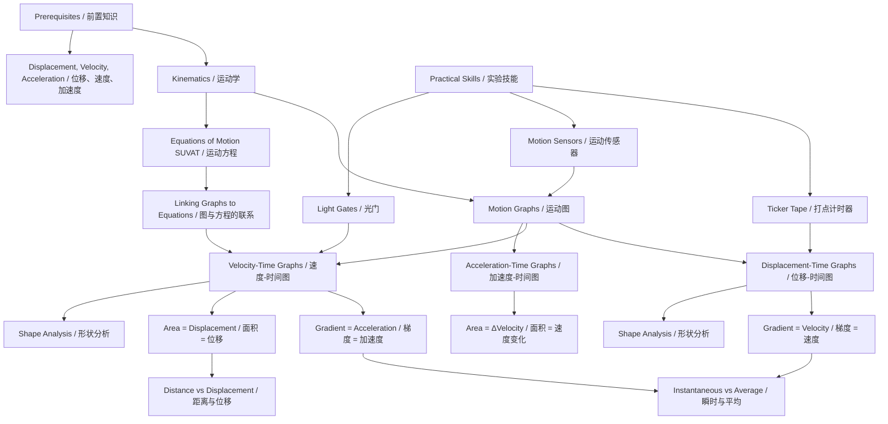

# 1. Overview / 概述

**English:** Motion graphs are a fundamental tool in kinematics that allow us to visualize and analyze the motion of objects without using complex equations. By plotting displacement, velocity, or acceleration against time, we can instantly determine an object's behavior — whether it's at rest, moving at constant speed, accelerating, or decelerating. This topic is essential for both CAIE 9702 and Edexcel IAL as it forms the foundation for understanding [[Equations of Motion (SUVAT)]] and more advanced mechanics concepts. In real-world applications, motion graphs are used in vehicle crash testing, sports science, and even analyzing stock market trends.

**中文:** 运动图是运动学中的基础工具，它使我们能够在不使用复杂方程的情况下可视化和分析物体的运动。通过绘制位移、速度或加速度随时间的变化图，我们可以立即判断物体的行为——无论是静止、匀速运动、加速还是减速。本主题对于CAIE 9702和Edexcel IAL都至关重要，因为它构成了理解[[Equations of Motion (SUVAT)]]和更高级力学概念的基础。在实际应用中，运动图用于车辆碰撞测试、运动科学，甚至分析股票市场趋势。

> 📷 **IMAGE PROMPT — [OV-01]: Real-World Motion Graph Examples** (A collage showing three real-world scenarios: a car accelerating from traffic lights with corresponding v-t graph, a ball thrown upward with s-t graph, and a runner's speed-time graph from a fitness tracker. Labels in English and Chinese. Style: clean infographic with real photos on left and graphs on right. Exam importance: HIGH for motivation and context.)

# 2. Syllabus Learning Objectives / 考纲学习目标

| CAIE 9702 | Edexcel IAL |
|-----------|-------------|
| 3.1(j) Interpret displacement-time and velocity-time graphs | 1.5-1.8: Draw and interpret displacement-time, velocity-time, and acceleration-time graphs |
| 3.1(j) Determine distance, displacement, speed, velocity, and acceleration from graphs | 1.5-1.8: Calculate gradient and area under graphs |
| 3.1(j) Understand the significance of gradient and area under graphs | 1.5-1.8: Relate graphs to equations of motion |

**Examiner Expectations / 考官期望:**
- **English:** Students must be able to read values from graphs, calculate gradients (including tangents for curved graphs), and determine areas under graphs (using counting squares or geometric shapes). For CAIE, the focus is on interpreting given graphs; for Edexcel, students may also be asked to sketch graphs from descriptions.
- **中文:** 学生必须能够从图中读取数值，计算梯度（包括曲线的切线），并确定图下的面积（使用数方格或几何形状）。对于CAIE，重点是解释给定的图形；对于Edexcel，学生可能还需要根据描述绘制图形。

> 📋 **CIE Only:** CAIE 9702 Paper 1 (MCQ) and Paper 2 (structured) often test interpretation of motion graphs. Paper 5 may require graph plotting from experimental data.
> 📋 **Edexcel Only:** Edexcel IAL Unit 1 often includes sketching graphs from worded descriptions and calculating areas for distance traveled.

# 3. Core Definitions / 核心定义

| Term (EN/CN) | Definition (EN) | Definition (CN) | Common Mistakes / 常见错误 |
|--------------|-----------------|-----------------|---------------------------|
| [[Displacement-Time Graphs]] / 位移-时间图 | A graph showing how displacement changes with time. Gradient = velocity. | 显示位移随时间变化的图。梯度=速度。 | Confusing displacement with distance; thinking a horizontal line means "no motion" (correct) vs "zero velocity" (also correct but incomplete) |
| [[Velocity-Time Graphs]] / 速度-时间图 | A graph showing how velocity changes with time. Gradient = acceleration. Area under graph = displacement. | 显示速度随时间变化的图。梯度=加速度。图下面积=位移。 | Forgetting that area gives displacement, not distance; using gradient when area is needed |
| [[Acceleration-Time Graphs]] / 加速度-时间图 | A graph showing how acceleration changes with time. Area under graph = change in velocity. | 显示加速度随时间变化的图。图下面积=速度变化。 | Confusing constant acceleration with zero acceleration |
| [[Interpreting Gradient and Area]] / 解释梯度和面积 | Gradient = rate of change (dy/dx). Area under graph = accumulated quantity (∫ y dx). | 梯度=变化率(dy/dx)。图下面积=累积量(∫ y dx)。 | Mixing up which graph gives which quantity; not using correct units |
| Gradient / 梯度 | The slope of a line or curve at a point, calculated as Δy/Δx | 直线或曲线在某点的斜率，计算为Δy/Δx | Forgetting to include units in gradient calculation |
| Area Under Graph / 图下面积 | The region bounded by the graph and the x-axis, calculated by integration or geometric shapes | 图线与x轴围成的区域，通过积分或几何形状计算 | Treating area below x-axis as positive when it represents negative displacement |

# 4. Key Concepts Explained / 关键概念详解

## 4.1 Displacement-Time Graphs / 位移-时间图

### Explanation / 解释
**English:** A [[Displacement-Time Graphs|displacement-time graph]] plots displacement (s) on the y-axis against time (t) on the x-axis. The gradient at any point gives the instantaneous velocity. A straight line indicates constant velocity; a curved line indicates changing velocity (acceleration). A horizontal line means the object is stationary (velocity = 0). The steeper the gradient, the greater the speed.

**中文:** 位移-时间图将位移(s)绘制在y轴上，时间(t)绘制在x轴上。任意点的梯度给出瞬时速度。直线表示恒定速度；曲线表示速度变化（加速度）。水平线表示物体静止（速度=0）。梯度越陡，速度越大。

### Physical Meaning / 物理意义
**English:** The graph tells us WHERE an object is at any given time. The slope tells us HOW FAST it's moving. A positive gradient means motion in the positive direction; negative gradient means motion in the opposite direction.

**中文:** 该图告诉我们物体在任何给定时间的位置。斜率告诉我们它移动的速度。正梯度表示正方向运动；负梯度表示反方向运动。

### Common Misconceptions / 常见误区
- Thinking a curved s-t graph means the path is curved (it means velocity is changing)
- Confusing displacement (vector) with distance (scalar) — the graph can go negative
- Believing a steeper graph always means faster speed (correct, but check direction)
- Forgetting that gradient = velocity, not acceleration

### Exam Tips / 考试提示
**English:** For CAIE, always draw a tangent line to find instantaneous velocity from a curved s-t graph. For Edexcel, be prepared to sketch s-t graphs from descriptions. Use a ruler for tangents and show your working.

**中文:** 对于CAIE，始终画切线以从曲线s-t图中找到瞬时速度。对于Edexcel，准备好根据描述绘制s-t图。使用直尺画切线并展示你的计算过程。

> 📷 **IMAGE PROMPT — [ST-01]: Displacement-Time Graph Types** (A single graph showing three different motion types: a horizontal line (stationary), a straight diagonal line (constant velocity), and a curved line (accelerating). Labels: "Stationary / 静止", "Constant Velocity / 匀速", "Accelerating / 加速". Style: clean graph paper background, grid lines, axes labeled s/m and t/s. Exam importance: HIGH — fundamental concept.)

## 4.2 Velocity-Time Graphs / 速度-时间图

### Explanation / 解释
**English:** A [[Velocity-Time Graphs|velocity-time graph]] plots velocity (v) on the y-axis against time (t) on the x-axis. The gradient gives acceleration. The area under the graph gives displacement. A horizontal line means constant velocity (zero acceleration). A straight line with positive gradient means constant acceleration. A curved line means changing acceleration.

**中文:** 速度-时间图将速度(v)绘制在y轴上，时间(t)绘制在x轴上。梯度给出加速度。图下面积给出位移。水平线表示恒定速度（零加速度）。具有正梯度的直线表示恒定加速度。曲线表示变化的加速度。

### Physical Meaning / 物理意义
**English:** This is the most versatile motion graph. It tells us HOW FAST an object is moving AND how its speed is changing. The area tells us how FAR it traveled. This graph directly connects to [[Equations of Motion (SUVAT)]].

**中文:** 这是最通用的运动图。它告诉我们物体移动的速度以及速度如何变化。面积告诉我们它走了多远。该图直接连接到[[Equations of Motion (SUVAT)]]。

### Common Misconceptions / 常见误区
- Thinking area under v-t graph gives distance (it gives displacement; use speed-time for distance)
- Confusing gradient (acceleration) with the graph value (velocity)
- Forgetting that negative area means displacement in the opposite direction
- Assuming a curved v-t graph means the path is curved

### Exam Tips / 考试提示
**English:** For both boards, practice calculating area using rectangles, triangles, and trapeziums. For curved v-t graphs, count squares or use integration. Always check if the question asks for distance or displacement.

**中文:** 对于两个考试局，练习使用矩形、三角形和梯形计算面积。对于曲线v-t图，数方格或使用积分。始终检查问题是要求距离还是位移。

> 📷 **IMAGE PROMPT — [VT-01]: Velocity-Time Graph with Area and Gradient** (A v-t graph showing a trapezoid shape: velocity increases from 0 to 10 m/s over 5 seconds, then constant for 3 seconds, then decreases to 0 over 2 seconds. Gradient triangles shown for acceleration calculation. Area shaded for displacement calculation. Labels: "Gradient = a / 梯度 = 加速度", "Area = s / 面积 = 位移". Style: graph paper, clear shading, arrows. Exam importance: HIGH — most common exam question type.)

## 4.3 Acceleration-Time Graphs / 加速度-时间图

### Explanation / 解释
**English:** An [[Acceleration-Time Graphs|acceleration-time graph]] plots acceleration (a) on the y-axis against time (t) on the x-axis. The area under the graph gives the change in velocity (Δv). A horizontal line at a = 0 means constant velocity. A horizontal line at a ≠ 0 means constant acceleration. The gradient of an a-t graph has no physical meaning in A-Level physics.

**中文:** 加速度-时间图将加速度(a)绘制在y轴上，时间(t)绘制在x轴上。图下面积给出速度变化(Δv)。a=0的水平线表示恒定速度。a≠0的水平线表示恒定加速度。a-t图的梯度在A-Level物理中没有物理意义。

### Physical Meaning / 物理意义
**English:** This graph tells us how the acceleration itself is changing. It's less commonly tested but important for understanding non-uniform acceleration and linking to [[Equations of Motion (SUVAT)]].

**中文:** 该图告诉我们加速度本身如何变化。它不太常见，但对于理解非均匀加速度和链接到[[Equations of Motion (SUVAT)]]很重要。

### Common Misconceptions / 常见误区
- Thinking gradient of a-t graph means something (it doesn't at A-Level)
- Confusing a-t graph with v-t graph
- Forgetting that area = Δv, not v itself

### Exam Tips / 考试提示
**English:** Edexcel tests a-t graphs more frequently than CAIE. Remember that if acceleration is constant, the a-t graph is a horizontal line. The area under a-t graph gives the velocity change from initial to final velocity.

**中文:** Edexcel比CAIE更频繁地测试a-t图。记住，如果加速度恒定，a-t图是一条水平线。a-t图下的面积给出从初速度到末速度的速度变化。

> 📷 **IMAGE PROMPT — [AT-01]: Acceleration-Time Graph Example** (An a-t graph showing constant acceleration of 2 m/s² for 4 seconds, then zero acceleration for 3 seconds, then constant deceleration of -3 m/s² for 2 seconds. Area shaded for Δv calculation. Labels: "Constant a / 恒定加速度", "Zero a / 零加速度", "Area = Δv / 面积 = 速度变化". Style: graph paper, clear shading. Exam importance: MEDIUM — less common but tested.)

## 4.4 Interpreting Gradient and Area / 解释梯度和面积

### Explanation / 解释
**English:** [[Interpreting Gradient and Area|Gradient and area]] are the two most important mathematical operations on motion graphs. The gradient (slope) of any graph gives the rate of change of the y-axis quantity with respect to the x-axis quantity. The area under any graph gives the accumulated quantity. For motion graphs:
- s-t graph: gradient = v, area = meaningless
- v-t graph: gradient = a, area = s
- a-t graph: gradient = meaningless, area = Δv

**中文:** 梯度和面积是运动图上两个最重要的数学运算。任何图的梯度（斜率）给出y轴量相对于x轴量的变化率。任何图下的面积给出累积量。对于运动图：
- s-t图：梯度=v，面积=无意义
- v-t图：梯度=a，面积=s
- a-t图：梯度=无意义，面积=Δv

### Physical Meaning / 物理意义
**English:** This concept connects calculus to physics. Gradient = derivative (ds/dt or dv/dt). Area = integral (∫ v dt or ∫ a dt). Understanding this allows you to convert between displacement, velocity, and acceleration graphs.

**中文:** 这个概念将微积分与物理学联系起来。梯度=导数(ds/dt或dv/dt)。面积=积分(∫ v dt或∫ a dt)。理解这一点可以让你在位移、速度和加速度图之间进行转换。

### Common Misconceptions / 常见误区
- Thinking area under s-t graph means something (it doesn't)
- Using gradient when area is needed (and vice versa)
- Forgetting units: gradient units = y-unit/x-unit; area units = y-unit × x-unit
- Not using tangents for curved graphs

### Exam Tips / 考试提示
**English:** For straight lines, gradient = Δy/Δx. For curves, draw a tangent and find its gradient. For area, use geometric shapes for straight-line graphs and counting squares for curves. Always include units in your answer.

**中文:** 对于直线，梯度=Δy/Δx。对于曲线，画切线并找到其梯度。对于面积，对直线图使用几何形状，对曲线使用数方格。始终在答案中包含单位。

> 📷 **IMAGE PROMPT — [GA-01]: Gradient and Area Summary Table** (A visual summary showing three motion graphs (s-t, v-t, a-t) with arrows indicating: s-t gradient → v, v-t gradient → a, v-t area → s, a-t area → Δv. Style: clean infographic with color-coded arrows. Labels in English and Chinese. Exam importance: HIGH — essential for problem-solving.)

# 5. Essential Equations / 核心公式

## 5.1 Gradient of a Straight Line / 直线梯度

$$ \text{Gradient} = \frac{\Delta y}{\Delta x} = \frac{y_2 - y_1}{x_2 - x_1} $$

| Symbol (符号) | Meaning (EN/CN) | Unit (单位) |
|---------------|-----------------|-------------|
| Δy | Change in y-axis quantity / y轴量的变化 | Depends on graph (m, m/s, m/s²) |
| Δx | Change in x-axis quantity / x轴量的变化 | s (seconds) |
| y₁, y₂ | y-coordinates of two points / 两点的y坐标 | Depends on graph |
| x₁, x₂ | x-coordinates of two points / 两点的x坐标 | s (seconds) |

**Derivation:** Not required — this is a mathematical definition.

**Conditions:** Only for straight lines. For curves, use tangent method.

**Limitations:** Does not give instantaneous gradient for curved graphs.

**Rearrangements:** Δy = gradient × Δx; Δx = Δy/gradient

## 5.2 Area Under a Graph / 图下面积

$$ \text{Area} = \int_{t_1}^{t_2} y \, dt $$

For straight-line graphs: $$ \text{Area} = \text{Area of rectangle} + \text{Area of triangle} $$

| Symbol (符号) | Meaning (EN/CN) | Unit (单位) |
|---------------|-----------------|-------------|
| y | y-axis quantity / y轴量 | Depends on graph |
| dt | Infinitesimal time interval / 无穷小时间间隔 | s |
| t₁, t₂ | Time limits / 时间界限 | s |

**Derivation:** Not required at A-Level — use geometric shapes or counting squares.

**Conditions:** Area below x-axis is negative (represents opposite direction).

**Limitations:** For curved graphs, counting squares gives approximate value.

**Rearrangements:** Not applicable.

## 5.3 Velocity from Displacement-Time Graph / 从位移-时间图求速度

$$ v = \frac{ds}{dt} = \text{gradient of s-t graph} $$

| Symbol (符号) | Meaning (EN/CN) | Unit (单位) |
|---------------|-----------------|-------------|
| v | Instantaneous velocity / 瞬时速度 | m/s |
| ds | Small change in displacement / 位移的微小变化 | m |
| dt | Small change in time / 时间的微小变化 | s |

**Derivation:** Definition of velocity as rate of change of displacement.

**Conditions:** For instantaneous velocity, use tangent at a point.

**Limitations:** Average velocity = total displacement/total time (not gradient of whole graph if curved).

**Rearrangements:** ds = v dt; dt = ds/v

## 5.4 Acceleration from Velocity-Time Graph / 从速度-时间图求加速度

$$ a = \frac{dv}{dt} = \text{gradient of v-t graph} $$

| Symbol (符号) | Meaning (EN/CN) | Unit (单位) |
|---------------|-----------------|-------------|
| a | Instantaneous acceleration / 瞬时加速度 | m/s² |
| dv | Small change in velocity / 速度的微小变化 | m/s |
| dt | Small change in time / 时间的微小变化 | s |

**Derivation:** Definition of acceleration as rate of change of velocity.

**Conditions:** For instantaneous acceleration, use tangent at a point.

**Limitations:** Average acceleration = Δv/Δt (not gradient of whole graph if curved).

**Rearrangements:** dv = a dt; dt = dv/a

## 5.5 Displacement from Velocity-Time Graph / 从速度-时间图求位移

$$ s = \int v \, dt = \text{area under v-t graph} $$

| Symbol (符号) | Meaning (EN/CN) | Unit (单位) |
|---------------|-----------------|-------------|
| s | Displacement / 位移 | m |
| v | Velocity / 速度 | m/s |
| dt | Infinitesimal time interval / 无穷小时间间隔 | s |

**Derivation:** Displacement = velocity × time for constant velocity; integration for varying velocity.

**Conditions:** Area below x-axis gives negative displacement.

**Limitations:** For distance (not displacement), take absolute value of area.

**Rearrangements:** Not applicable.

## 5.6 Change in Velocity from Acceleration-Time Graph / 从加速度-时间图求速度变化

$$ \Delta v = \int a \, dt = \text{area under a-t graph} $$

| Symbol (符号) | Meaning (EN/CN) | Unit (单位) |
|---------------|-----------------|-------------|
| Δv | Change in velocity / 速度变化 | m/s |
| a | Acceleration / 加速度 | m/s² |
| dt | Infinitesimal time interval / 无穷小时间间隔 | s |

**Derivation:** Change in velocity = acceleration × time for constant acceleration.

**Conditions:** Area below x-axis gives negative change in velocity.

**Limitations:** This gives Δv, not final velocity. Use v = u + Δv to find final velocity.

**Rearrangements:** Not applicable.

# 6. Graphs and Relationships / 图表与关系

## 6.1 Displacement-Time Graph Shapes / 位移-时间图形状

| Shape / 形状 | Motion / 运动 | Gradient / 梯度 | Example / 示例 |
|--------------|---------------|-----------------|----------------|
| Horizontal line / 水平线 | Stationary / 静止 | 0 | Object at rest |
| Straight diagonal up / 向上对角线 | Constant positive velocity / 恒定正速度 | Positive constant | Moving forward at constant speed |
| Straight diagonal down / 向下对角线 | Constant negative velocity / 恒定负速度 | Negative constant | Moving backward at constant speed |
| Curve upward (increasing slope) / 向上曲线（斜率增加） | Accelerating / 加速 | Increasing positive | Speeding up |
| Curve downward (decreasing slope) / 向下曲线（斜率减小） | Decelerating / 减速 | Decreasing positive | Slowing down |

**Axes:** x-axis = time (t/s), y-axis = displacement (s/m)

**Gradient Meaning (EN+CN):** Instantaneous velocity / 瞬时速度

**Area Meaning (EN+CN):** No physical meaning / 无物理意义

**Exam Interpretation:** Read displacement at any time; find velocity from gradient; identify motion type from shape.

**Common Questions:** "What is the velocity at t = 5s?" (draw tangent), "Describe the motion between t = 2s and t = 4s."

> 📷 **IMAGE PROMPT — [ST-02]: Displacement-Time Graph Shapes** (A single graph showing all four shapes: horizontal, straight up, curve up, curve down. Each section labeled with motion type. Grid lines visible. Style: clean graph paper. Exam importance: HIGH.)

## 6.2 Velocity-Time Graph Shapes / 速度-时间图形状

| Shape / 形状 | Motion / 运动 | Gradient / 梯度 | Area / 面积 |
|--------------|---------------|-----------------|-------------|
| Horizontal line at v > 0 / v>0的水平线 | Constant positive velocity / 恒定正速度 | 0 (a = 0) | Positive displacement |
| Horizontal line at v < 0 / v<0的水平线 | Constant negative velocity / 恒定负速度 | 0 (a = 0) | Negative displacement |
| Straight line up / 向上直线 | Constant positive acceleration / 恒定正加速度 | Positive constant | Increasing displacement |
| Straight line down / 向下直线 | Constant negative acceleration (deceleration) / 恒定负加速度（减速） | Negative constant | Decreasing displacement |
| Curve up / 向上曲线 | Increasing acceleration / 加速度增加 | Increasing positive | Increasing displacement |
| Curve down / 向下曲线 | Decreasing acceleration / 加速度减小 | Decreasing positive | Increasing displacement |

**Axes:** x-axis = time (t/s), y-axis = velocity (v/m s⁻¹)

**Gradient Meaning (EN+CN):** Acceleration / 加速度

**Area Meaning (EN+CN):** Displacement / 位移

**Exam Interpretation:** Read velocity at any time; find acceleration from gradient; find displacement from area; identify motion type.

**Common Questions:** "Calculate the acceleration during the first 3 seconds." "Find the total displacement." "What is the distance traveled?"

> 📷 **IMAGE PROMPT — [VT-02]: Velocity-Time Graph Shapes** (A single graph showing all shapes: horizontal, straight up, straight down, curve up, curve down. Each section labeled. Grid lines visible. Style: clean graph paper. Exam importance: HIGH.)

## 6.3 Acceleration-Time Graph Shapes / 加速度-时间图形状

| Shape / 形状 | Motion / 运动 | Area / 面积 |
|--------------|---------------|-------------|
| Horizontal line at a = 0 / a=0的水平线 | Constant velocity / 恒定速度 | Δv = 0 |
| Horizontal line at a > 0 / a>0的水平线 | Constant positive acceleration / 恒定正加速度 | Positive Δv |
| Horizontal line at a < 0 / a<0的水平线 | Constant negative acceleration / 恒定负加速度 | Negative Δv |
| Straight line up / 向上直线 | Increasing acceleration / 加速度增加 | Increasing Δv |
| Straight line down / 向下直线 | Decreasing acceleration / 加速度减小 | Decreasing Δv |

**Axes:** x-axis = time (t/s), y-axis = acceleration (a/m s⁻²)

**Gradient Meaning (EN+CN):** No physical meaning at A-Level / A-Level无物理意义

**Area Meaning (EN+CN):** Change in velocity (Δv) / 速度变化(Δv)

**Exam Interpretation:** Read acceleration at any time; find Δv from area; identify motion type.

**Common Questions:** "Calculate the change in velocity between t = 2s and t = 5s." "Sketch the corresponding v-t graph."

> 📷 **IMAGE PROMPT — [AT-02]: Acceleration-Time Graph Shapes** (A single graph showing all shapes: horizontal at a=0, horizontal at a>0, horizontal at a<0, straight up, straight down. Each section labeled. Grid lines visible. Style: clean graph paper. Exam importance: MEDIUM.)

## 6.4 Converting Between Graph Types / 图类型之间的转换

**English:** To convert between graph types:
- s-t → v-t: Find gradient of s-t at each point → plot as v-t
- v-t → a-t: Find gradient of v-t at each point → plot as a-t
- v-t → s-t: Find area under v-t up to each time → plot as s-t
- a-t → v-t: Find area under a-t up to each time → plot as v-t

**中文:** 在图类型之间转换：
- s-t → v-t：找到s-t上每点的梯度→绘制为v-t
- v-t → a-t：找到v-t上每点的梯度→绘制为a-t
- v-t → s-t：找到v-t下到每个时间的面积→绘制为s-t
- a-t → v-t：找到a-t下到每个时间的面积→绘制为v-t

> 📷 **IMAGE PROMPT — [CV-01]: Converting Between Motion Graphs** (Three graphs stacked vertically showing the same motion: top = s-t (parabola), middle = v-t (straight line), bottom = a-t (horizontal line). Arrows showing conversion: gradient from s-t to v-t, gradient from v-t to a-t. Labels: "Gradient / 梯度", "Area / 面积". Style: clean, color-coded. Exam importance: HIGH — common in both boards.)

# 7. Required Diagrams / 必备图表

## 7.1 Displacement-Time Graph with Tangent / 带切线的位移-时间图

> 📷 **IMAGE PROMPT — [DIA-01]: Displacement-Time Graph with Tangent for Instantaneous Velocity** (A curved s-t graph (parabola shape: s = t²). At t = 3s, a tangent line is drawn. The tangent extends to show Δs and Δt for gradient calculation. Labels: "Tangent / 切线", "Δs", "Δt", "Gradient = v = Δs/Δt / 梯度 = 速度 = Δs/Δt". Grid lines visible. Style: graph paper, clear tangent line in red, original curve in blue. Exam importance: HIGH — Paper 1 and Paper 2.)

## 7.2 Velocity-Time Graph with Area Calculation / 带面积计算的速度-时间图

> 📷 **IMAGE PROMPT — [DIA-02]: Velocity-Time Graph with Area for Displacement** (A v-t graph showing a trapezoid: velocity increases from 0 to 8 m/s over 4 seconds (triangle), then constant at 8 m/s for 3 seconds (rectangle), then decreases to 0 over 2 seconds (triangle). Each section shaded differently. Area calculations shown: Triangle 1: ½ × 4 × 8 = 16 m, Rectangle: 3 × 8 = 24 m, Triangle 2: ½ × 2 × 8 = 8 m. Total displacement = 48 m. Labels: "Area = Displacement / 面积 = 位移". Style: graph paper, color-coded shading. Exam importance: HIGH — most common exam question.)

## 7.3 Three Graphs Showing Same Motion / 显示相同运动的三个图

> 📷 **IMAGE PROMPT — [DIA-03]: Three Motion Graphs for the Same Motion** (Three graphs stacked vertically, all showing the same motion of an object thrown upward and falling back down:
> - Top: s-t graph (parabola opening downward, starting at s=0, peaking at t=2s, returning to s=0 at t=4s)
> - Middle: v-t graph (straight line with negative gradient, starting at v=+10 m/s, crossing zero at t=2s, reaching v=-10 m/s at t=4s)
> - Bottom: a-t graph (horizontal line at a = -5 m/s²)
> Vertical dashed lines connect key points across graphs. Labels: "Same Motion / 相同运动", "s-t: gradient = v / s-t: 梯度 = 速度", "v-t: gradient = a, area = s / v-t: 梯度 = 加速度, 面积 = 位移", "a-t: area = Δv / a-t: 面积 = 速度变化". Style: clean, color-coded, aligned vertically. Exam importance: HIGH — understanding connections.)

## 7.4 Velocity-Time Graph for Non-Uniform Acceleration / 非均匀加速度的速度-时间图

> 📷 **IMAGE PROMPT — [DIA-04]: Velocity-Time Graph with Curved Line for Non-Uniform Acceleration** (A v-t graph showing a curve (v = t² shape). At t = 3s, a tangent is drawn. The tangent gradient gives instantaneous acceleration. The area under the curve is shown with vertical strips for approximate area calculation (counting squares method). Labels: "Tangent for instantaneous a / 切线求瞬时加速度", "Area = displacement / 面积 = 位移", "Counting squares / 数方格". Style: graph paper, tangent in red, shading in light blue. Exam importance: MEDIUM — Paper 2 and Paper 5.)

# 8. Worked Examples / 典型例题

## Example 1: Velocity-Time Graph Analysis / 速度-时间图分析

### Question / 题目
**English:** A car travels along a straight road. Its velocity-time graph is shown below. The graph consists of three sections:
- Section A (0-5 s): velocity increases from 0 to 15 m/s at a constant rate
- Section B (5-12 s): velocity remains constant at 15 m/s
- Section C (12-16 s): velocity decreases from 15 m/s to 0 at a constant rate

(a) Calculate the acceleration during section A.
(b) Calculate the acceleration during section C.
(c) Calculate the total displacement of the car.
(d) Calculate the total distance traveled by the car.

**中文:** 一辆汽车沿直线行驶。其速度-时间图如下所示。该图由三部分组成：
- A段（0-5秒）：速度以恒定速率从0增加到15 m/s
- B段（5-12秒）：速度保持恒定在15 m/s
- C段（12-16秒）：速度以恒定速率从15 m/s减小到0

(a) 计算A段期间的加速度。
(b) 计算C段期间的加速度。
(c) 计算汽车的总位移。
(d) 计算汽车行驶的总距离。

### Image Prompt / 图片提示
> 📷 **IMAGE PROMPT — [EX-01]: Car Velocity-Time Graph** (A v-t graph with three sections: Section A: straight line from (0,0) to (5,15); Section B: horizontal line from (5,15) to (12,15); Section C: straight line from (12,15) to (16,0). Axes labeled: v/m s⁻¹ and t/s. Grid lines visible. Style: clean graph paper. Exam importance: HIGH.)

### Solution / 解答

**(a) Acceleration during section A:**

$$ a = \frac{\Delta v}{\Delta t} = \frac{15 - 0}{5 - 0} = \frac{15}{5} = 3.0 \text{ m/s}^2 $$

**(b) Acceleration during section C:**

$$ a = \frac{\Delta v}{\Delta t} = \frac{0 - 15}{16 - 12} = \frac{-15}{4} = -3.75 \text{ m/s}^2 $$

The negative sign indicates deceleration.

**(c) Total displacement:**

Displacement = area under v-t graph

Section A (triangle): $A_1 = \frac{1}{2} \times 5 \times 15 = 37.5 \text{ m}$

Section B (rectangle): $A_2 = 7 \times 15 = 105 \text{ m}$

Section C (triangle): $A_3 = \frac{1}{2} \times 4 \times 15 = 30 \text{ m}$

Total displacement: $s = 37.5 + 105 + 30 = 172.5 \text{ m}$

**(d) Total distance:**

Since the car never changes direction (velocity always positive), distance = displacement = 172.5 m.

### Final Answer / 最终答案
(a) a = 3.0 m/s²
(b) a = -3.75 m/s²
(c) s = 172.5 m
(d) Distance = 172.5 m

### Examiner Notes / 考官点评
**English:** Common mistakes include: (1) Using incorrect time intervals — always check Δt carefully. (2) Forgetting units — acceleration must be in m/s². (3) Confusing displacement and distance — here they're equal because motion is in one direction only. (4) For part (b), the negative sign is important — it shows deceleration. For CAIE, marks are awarded for correct formula, substitution, and final answer with units.

**中文:** 常见错误包括：(1) 使用错误的时间间隔——始终仔细检查Δt。(2) 忘记单位——加速度必须用m/s²。(3) 混淆位移和距离——这里它们相等，因为运动只在一个方向。(4) 对于(b)部分，负号很重要——它表示减速。对于CAIE，正确公式、代入和带单位的最终答案都会给分。

## Example 2: Displacement-Time Graph with Tangent / 带切线的位移-时间图

### Question / 题目
**English:** The displacement-time graph for a particle moving along a straight line is given by the equation $s = 2t^2$, where s is in meters and t is in seconds.

(a) Sketch the s-t graph for t = 0 to t = 5 s.
(b) Calculate the instantaneous velocity at t = 3 s by drawing a tangent.
(c) Calculate the average velocity between t = 1 s and t = 4 s.

**中文:** 一个沿直线运动的粒子的位移-时间图由方程$s = 2t^2$给出，其中s以米为单位，t以秒为单位。

(a) 绘制t=0到t=5秒的s-t图。
(b) 通过画切线计算t=3秒时的瞬时速度。
(c) 计算t=1秒到t=4秒之间的平均速度。

### Image Prompt / 图片提示
> 📷 **IMAGE PROMPT — [EX-02]: Parabolic s-t Graph with Tangent** (A curved s-t graph showing s = 2t² from (0,0) to (5,50). At t = 3s (s = 18m), a tangent line is drawn. The tangent extends to show Δs and Δt. Grid lines visible. Labels: "s = 2t²", "Tangent at t = 3s / t=3s处的切线". Style: graph paper, curve in blue, tangent in red. Exam importance: HIGH.)

### Solution / 解答

**(a) Sketch:**

The graph is a parabola opening upward. Key points:
- t = 0: s = 0
- t = 1: s = 2
- t = 2: s = 8
- t = 3: s = 18
- t = 4: s = 32
- t = 5: s = 50

**(b) Instantaneous velocity at t = 3 s:**

Using calculus: $v = \frac{ds}{dt} = 4t$

At t = 3 s: $v = 4 \times 3 = 12 \text{ m/s}$

Using tangent method (if graph is drawn):
Draw tangent at (3, 18). The tangent should have gradient = 12.
For example, if tangent passes through (2, 6) and (4, 30):
$v = \frac{30 - 6}{4 - 2} = \frac{24}{2} = 12 \text{ m/s}$

**(c) Average velocity:**

At t = 1 s: $s_1 = 2(1)^2 = 2 \text{ m}$
At t = 4 s: $s_4 = 2(4)^2 = 32 \text{ m}$

Average velocity: $v_{avg} = \frac{s_4 - s_1}{t_4 - t_1} = \frac{32 - 2}{4 - 1} = \frac{30}{3} = 10 \text{ m/s}$

### Final Answer / 最终答案
(a) Parabola from (0,0) to (5,50)
(b) v = 12 m/s
(c) v_avg = 10 m/s

### Examiner Notes / 考官点评
**English:** Key points: (1) For part (b), both calculus and tangent methods are acceptable. In exams without calculus, the tangent method is required. (2) The tangent must be drawn accurately — use a ruler and extend it beyond the point. (3) Average velocity is NOT the same as instantaneous velocity at the midpoint. (4) For CAIE Paper 2, you may be asked to draw the tangent on a given graph. For Edexcel, calculus is more commonly used.

**中文:** 关键点：(1) 对于(b)部分，微积分和切线方法都可以接受。在不允许微积分的考试中，需要使用切线方法。(2) 切线必须准确绘制——使用直尺并将其延伸到点之外。(3) 平均速度与中点的瞬时速度不同。(4) 对于CAIE Paper 2，可能会要求你在给定的图上画切线。对于Edexcel，更常使用微积分。

# 9. Past Paper Question Types / 历年真题题型

| Question Type / 题型 | Frequency / 频率 | Difficulty / 难度 | Past Paper References / 真题索引 |
|----------------------|------------------|-------------------|----------------------------------|
| Read values from motion graphs / 从运动图中读取数值 | Very High / 非常高 | Easy / 简单 | 📝 *待填入* |
| Calculate gradient (velocity or acceleration) / 计算梯度（速度或加速度） | Very High / 非常高 | Medium / 中等 | 📝 *待填入* |
| Calculate area under v-t graph (displacement) / 计算v-t图下面积（位移） | Very High / 非常高 | Medium / 中等 | 📝 *待填入* |
| Describe motion from graph shape / 从图形状描述运动 | High / 高 | Easy / 简单 | 📝 *待填入* |
| Draw tangent for instantaneous velocity/acceleration / 画切线求瞬时速度/加速度 | High / 高 | Medium / 中等 | 📝 *待填入* |
| Convert between s-t, v-t, and a-t graphs / 在s-t、v-t和a-t图之间转换 | Medium / 中等 | Hard / 困难 | 📝 *待填入* |
| Sketch graphs from worded descriptions / 根据文字描述绘制图形 | Medium / 中等 | Medium / 中等 | 📝 *待填入* |
| Calculate distance vs displacement / 计算距离与位移 | Medium / 中等 | Medium / 中等 | 📝 *待填入* |
| Non-uniform acceleration (curved v-t) / 非均匀加速度（曲线v-t） | Low / 低 | Hard / 困难 | 📝 *待填入* |
| Acceleration-time graph analysis / 加速度-时间图分析 | Low / 低 | Medium / 中等 | 📝 *待填入* |

> 📝 **题库整理中 / Question Bank Under Construction:** 本表格中的真题索引正在整理中。建议学生参考以下资源：CAIE 9702 Paper 1 (MCQ) 和 Paper 2 (structured) 中的运动图问题；Edexcel IAL Unit 1 中的相关题目。完整的真题索引将在后续更新中添加。

**Common Command Words / 常见指令词:**
- **Calculate / 计算:** Use formula, substitute values, give answer with units
- **Determine / 确定:** Find value from graph (read, gradient, or area)
- **Sketch / 绘制:** Draw approximate shape (axes labeled, key features shown)
- **Describe / 描述:** Explain the motion in words
- **State / 陈述:** Give a brief answer without explanation
- **Explain / 解释:** Give reasons for your answer

# 10. Practical Skills Connections / 实验技能链接

**English:** Motion graphs are directly linked to practical experiments in both CAIE and Edexcel:

1. **Ticker Tape Timer (CAIE Paper 3, Edexcel Unit 3):** A ticker tape timer produces dots on a tape at regular intervals (typically 50 Hz = 0.02 s intervals). By measuring the distance between dots, you can plot displacement-time and velocity-time graphs. The changing spacing of dots directly shows acceleration.

2. **Motion Sensors / Data Loggers (Edexcel Unit 6):** Ultrasonic motion sensors connected to computers can generate real-time displacement-time, velocity-time, and acceleration-time graphs. This allows instant visualization of motion.

3. **Light Gates (Both boards):** Using two light gates, you can measure time intervals and calculate velocities. Multiple light gates allow plotting velocity-time graphs.

4. **Graph Plotting Skills (CAIE Paper 5):** You must be able to:
   - Choose appropriate scales (use at least half the graph paper)
   - Plot points accurately (crosses or dots in circles)
   - Draw line of best fit (straight line or smooth curve)
   - Calculate gradient from the line (use large triangle, at least half the line length)
   - Determine y-intercept

5. **Uncertainties:** When reading values from graphs, the uncertainty is typically ±0.5 of the smallest division. For gradient calculations, use maximum and minimum slope lines to find uncertainty range.

**中文:** 运动图直接与CAIE和Edexcel的实际实验相关：

1. **打点计时器（CAIE Paper 3, Edexcel Unit 3）：** 打点计时器以固定间隔（通常50 Hz = 0.02秒间隔）在纸带上产生点。通过测量点之间的距离，可以绘制位移-时间和速度-时间图。点间距的变化直接显示加速度。

2. **运动传感器/数据记录器（Edexcel Unit 6）：** 连接到计算机的超声波运动传感器可以实时生成位移-时间、速度-时间和加速度-时间图。这允许即时可视化运动。

3. **光门（两个考试局）：** 使用两个光门，可以测量时间间隔并计算速度。多个光门允许绘制速度-时间图。

4. **绘图技能（CAIE Paper 5）：** 你必须能够：
   - 选择合适的比例（至少使用一半的图纸）
   - 准确绘制点（十字或带圆圈的圆点）
   - 绘制最佳拟合线（直线或平滑曲线）
   - 从线计算梯度（使用大三角形，至少线长的一半）
   - 确定y截距

5. **不确定度：** 从图中读取数值时，不确定度通常为最小分度的±0.5。对于梯度计算，使用最大和最小斜率线来找到不确定度范围。

> 📋 **CIE Only:** CAIE Paper 3 often requires ticker tape analysis. Paper 5 may require plotting motion graphs from experimental data and calculating gradients.
> 📋 **Edexcel Only:** Edexcel Unit 3 and Unit 6 include practical assessments where motion sensors and data loggers are used. Students must be familiar with digital data collection.

# 11. Concept Map / 概念图谱



# 12. Examiner Insights / 考官洞察

**English:** Based on analysis of past papers from both CAIE 9702 and Edexcel IAL:

**Most Tested Ideas:**
1. **Calculating acceleration from v-t graph gradient** — appears in nearly every exam paper
2. **Calculating displacement from v-t graph area** — equally common
3. **Describing motion from graph shape** — "constant velocity", "accelerating", "decelerating", "stationary"
4. **Drawing tangents for instantaneous values** — especially for curved graphs
5. **Converting between graph types** — less common but high-difficulty

**Mark Scheme Wording (CAIE):**
- "Correct substitution into gradient formula" (1 mark)
- "Correct numerical answer with unit" (1 mark)
- "Area correctly calculated using geometric shapes" (1 mark)
- "Tangent drawn and gradient calculated" (2 marks: 1 for tangent, 1 for calculation)

**Mark Scheme Wording (Edexcel):**
- "Use of gradient = Δv/Δt" (1 mark)
- "Correct answer with unit" (1 mark)
- "Area under graph calculated" (1 mark)
- "Correct interpretation of graph shape" (1 mark)

**Common Lost Marks:**
1. **Units:** Forgetting to include units in final answer (m/s, m/s², m)
2. **Signs:** Not including negative sign for deceleration or negative velocity
3. **Time intervals:** Using wrong Δt (e.g., using total time instead of time for specific section)
4. **Area vs Gradient:** Using gradient when area is needed, or vice versa
5. **Distance vs Displacement:** Not distinguishing between them when velocity changes direction
6. **Tangent accuracy:** Drawing tangent that doesn't match the curve's slope at the point

**High-Scoring Structures:**
- Always write the formula first (e.g., a = Δv/Δt)
- Show substitution clearly
- Circle or box final answer with unit
- For multi-part questions, label each part clearly
- For graph questions, use a ruler for straight lines and tangents

**中文:** 基于对CAIE 9702和Edexcel IAL历年试卷的分析：

**最常考的想法：**
1. **从v-t图梯度计算加速度** — 几乎出现在每份试卷中
2. **从v-t图面积计算位移** — 同样常见
3. **从图形状描述运动** — "匀速"、"加速"、"减速"、"静止"
4. **画切线求瞬时值** — 特别是对于曲线图
5. **在图类型之间转换** — 不太常见但难度高

**评分方案措辞（CAIE）：**
- "正确代入梯度公式"（1分）
- "正确的数值答案和单位"（1分）
- "使用几何形状正确计算面积"（1分）
- "画出切线并计算梯度"（2分：切线1分，计算1分）

**评分方案措辞（Edexcel）：**
- "使用梯度=Δv/Δt"（1分）
- "带单位的正确答案"（1分）
- "计算图下面积"（1分）
- "正确解释图形状"（1分）

**常见失分点：**
1. **单位：** 忘记在最终答案中包含单位（m/s, m/s², m）
2. **符号：** 没有包括减速或负速度的负号
3. **时间间隔：** 使用错误的Δt（例如，使用总时间而不是特定部分的时间）
4. **面积与梯度：** 需要面积时使用梯度，或反之
5. **距离与位移：** 当速度改变方向时没有区分它们
6. **切线准确性：** 画的切线与该点的曲线斜率不匹配

**高分结构：**
- 始终先写公式（例如，a = Δv/Δt）
- 清晰展示代入过程
- 圈出或框出带单位的最终答案
- 对于多部分问题，清晰标记每个部分
- 对于图形问题，使用直尺画直线和切线

# 13. Quick Revision Sheet / 速查表

| Category / 类别 | Key Points / 要点 |
|-----------------|-------------------|
| **s-t Graph / s-t图** | x-axis: t/s, y-axis: s/m. Gradient = v. Horizontal = stationary. Straight = constant v. Curved = changing v. |
| **v-t Graph / v-t图** | x-axis: t/s, y-axis: v/m s⁻¹. Gradient = a. Area = s. Horizontal = constant v (a=0). Straight = constant a. |
| **a-t Graph / a-t图** | x-axis: t/s, y-axis: a/m s⁻². Area = Δv. Horizontal = constant a. Gradient = meaningless. |
| **Gradient / 梯度** | Straight line: Δy/Δx. Curve: draw tangent. Units: y-unit/x-unit. |
| **Area / 面积** | Straight line: geometric shapes (triangle, rectangle, trapezium). Curve: count squares. Units: y-unit × x-unit. |
| **Distance vs Displacement / 距离与位移** | Distance = total area (absolute value). Displacement = net area (sign matters). |
| **Instantaneous vs Average / 瞬时与平均** | Instantaneous: tangent at a point. Average: total Δy/total Δx. |
| **Common Units / 常用单位** | v: m/s. a: m/s². s: m. t: s. |
| **Key Equations / 关键方程** | v = ds/dt. a = dv/dt. s = ∫v dt. Δv = ∫a dt. |
| **Exam Tips / 考试提示** | Write formula first. Show substitution. Include units. Use ruler for tangents. Check if distance or displacement. |

# 14. Metadata / 元数据

```yaml
title:
  en: "Motion Graphs"
  cn: "运动图"
subject: Physics
syllabus: [CAIE 9702, Edexcel IAL]
cie_ref: "3.1 (j)"
edexcel_ref: "WPH11 U1: 1.5-1.8"
level: AS
node_type: topic_hub
difficulty: foundation
prerequisites:
  - "[[Displacement, Velocity and Acceleration]]"
related_topics:
  - "[[Equations of Motion (SUVAT)]]"
sub_topics:
  - "[[Displacement-Time Graphs]]"
  - "[[Velocity-Time Graphs]]"
  - "[[Acceleration-Time Graphs]]"
  - "[[Interpreting Gradient and Area]]"
formula_count: 6
diagram_count: 8
exam_frequency: very_high
language: bilingual_en_cn
last_updated: 2024-01
```

---
*This document is part of the Obsidian Physics Knowledge Graph. Link to related topics using [[wikilinks]]. For questions or corrections, please update the metadata.*