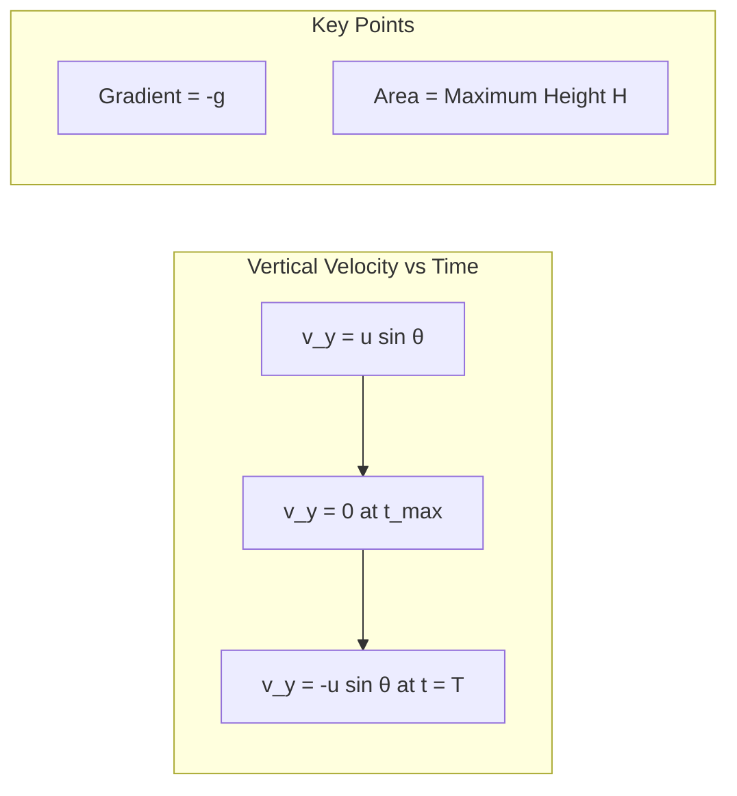

# Maximum Height / 最大高度

---

# 1. Overview / 概述

**English:**
Maximum height is a critical parameter in [[Projectile Motion]] that represents the highest vertical position reached by a projectile during its flight. This sub-topic focuses on calculating and understanding the maximum height achieved when an object is launched at an angle to the horizontal. The maximum height occurs at the exact moment when the vertical component of velocity becomes zero — the projectile stops rising and begins to fall. Understanding maximum height requires mastery of [[Equations of Motion (SUVAT)]] and [[Scalars and Vectors]], particularly the resolution of initial velocity into [[Horizontal and Vertical Components]]. This concept is essential for analyzing real-world applications such as ballistics, sports trajectories, and engineering design.

**中文:**
最大高度是[[抛体运动]]中的一个关键参数，代表抛体在飞行过程中达到的最高垂直位置。本子知识点专注于计算和理解物体以一定角度发射时达到的最大高度。最大高度出现在垂直速度分量变为零的精确时刻——抛体停止上升并开始下落。理解最大高度需要掌握[[运动学方程 (SUVAT)]]和[[标量与矢量]]，特别是将初速度分解为[[水平与垂直分量]]。这一概念对于分析弹道学、运动轨迹和工程设计等实际应用至关重要。

---

# 2. Syllabus Learning Objectives / 考纲学习目标

| CAIE 9702 | Edexcel IAL |
|-----------|-------------|
| 3.1(l): Derive and use the equation for maximum height of a projectile | WPH11 U1: 1.13-1.16: Apply equations of motion to projectile problems including maximum height |
| 3.1(m): Solve problems involving projectile motion, including maximum height calculations | Calculate the maximum height reached by a projectile given initial velocity and launch angle |
| Understand that at maximum height, vertical velocity = 0 | Interpret graphs of projectile motion showing maximum height |

**Examiner Expectations / 考官期望:**
- **English:** Students must be able to derive the maximum height formula from first principles using SUVAT equations. They should recognize that at maximum height, $v_y = 0$, and use this condition to solve for height. Common exam questions involve calculating maximum height from given initial velocity and angle, or finding the launch angle required to achieve a specific height.
- **中文:** 学生必须能够使用SUVAT方程从基本原理推导最大高度公式。他们应认识到在最大高度处$v_y = 0$，并利用这一条件求解高度。常见考题包括根据给定的初速度和角度计算最大高度，或求达到特定高度所需的发射角度。

---

# 3. Core Definitions / 核心定义

| Term (EN/CN) | Definition (EN) | Definition (CN) | Common Mistakes / 常见错误 |
|--------------|-----------------|-----------------|---------------------------|
| **Maximum Height** / 最大高度 | The greatest vertical displacement reached by a projectile above its launch point, occurring when the vertical component of velocity becomes zero | 抛体在发射点上方达到的最大垂直位移，发生在垂直速度分量变为零的时刻 | Confusing maximum height with total vertical displacement (which may be different if landing height ≠ launch height) |
| **Vertical Component of Velocity** / 垂直速度分量 | The component of velocity in the vertical direction, given by $v_y = u\sin\theta - gt$ | 速度在垂直方向的分量，由$v_y = u\sin\theta - gt$给出 | Forgetting the negative sign of gravitational acceleration |
| **Apex** / 顶点 | The highest point of a projectile's trajectory, where the projectile is momentarily stationary in the vertical direction | 抛体轨迹的最高点，在该点抛体在垂直方向瞬间静止 | Thinking the projectile is completely stationary (horizontal velocity remains constant) |
| **Launch Angle** / 发射角度 | The angle at which the projectile is launched relative to the horizontal | 抛体相对于水平方向发射的角度 | Using degrees in calculations without converting to radians when required |
| **Initial Velocity** / 初速度 | The speed at which the projectile is launched, with both magnitude and direction | 抛体发射时的速度，包含大小和方向 | Using total initial velocity instead of its vertical component in height calculations |

---

# 4. Key Concepts Explained / 关键概念详解

## 4.1 The Condition for Maximum Height / 最大高度的条件

### Explanation / 解释
**English:**
The maximum height of a projectile is reached when the vertical component of its velocity becomes zero. This is because the projectile is launched with an upward vertical velocity component ($u_y = u\sin\theta$), and gravity continuously decelerates it at $g = 9.81 \text{ m s}^{-2}$ downward. At the apex, the upward motion stops completely before the projectile begins to fall back down. At this instant:

$$v_y = 0$$

This condition is the key to deriving the maximum height formula. The horizontal velocity component ($u_x = u\cos\theta$) remains constant throughout the flight (ignoring air resistance), so at maximum height, the projectile still has horizontal motion.

**中文:**
抛体的最大高度在其垂直速度分量变为零时达到。这是因为抛体以向上的垂直速度分量（$u_y = u\sin\theta$）发射，重力以$g = 9.81 \text{ m s}^{-2}$向下持续减速。在顶点处，向上运动完全停止，然后抛体开始下落。在这一瞬间：

$$v_y = 0$$

这一条件是推导最大高度公式的关键。水平速度分量（$u_x = u\cos\theta$）在整个飞行过程中保持不变（忽略空气阻力），因此在最大高度处，抛体仍然具有水平运动。

### Physical Meaning / 物理意义
**English:**
Physically, the maximum height represents the point where the projectile's kinetic energy associated with vertical motion has been completely converted into gravitational potential energy. The projectile can rise no further because gravity has done enough negative work to bring the vertical velocity to zero. This is analogous to throwing a ball straight up — it reaches a maximum height where it momentarily stops before falling back.

**中文:**
从物理意义上讲，最大高度代表与垂直运动相关的动能已完全转化为重力势能的点。抛体不能再上升，因为重力做了足够的负功使垂直速度降为零。这类似于垂直向上抛球——球达到最大高度时瞬间停止，然后下落。

### Common Misconceptions / 常见误区
- **English:**
  - ❌ Thinking the projectile is stationary at maximum height (it still has horizontal velocity)
  - ❌ Using total initial velocity $u$ instead of $u_y = u\sin\theta$ in height calculations
  - ❌ Forgetting that $g$ is negative when using upward as positive direction
  - ❌ Assuming maximum height occurs at half the time of flight (only true for symmetrical trajectories)
  
- **中文:**
  - ❌ 认为抛体在最大高度处静止（它仍然有水平速度）
  - ❌ 在高度计算中使用总初速度$u$而不是$u_y = u\sin\theta$
  - ❌ 忘记当向上为正方向时$g$为负值
  - ❌ 假设最大高度发生在飞行时间的一半（仅对对称轨迹成立）

### Exam Tips / 考试提示
- **English:**
  - ✅ Always write $v_y = 0$ at maximum height — this is your starting equation
  - ✅ Use the vertical motion only — horizontal motion does not affect maximum height
  - ✅ Choose a consistent sign convention (upward positive) and stick to it
  - ✅ Check units: height should be in meters (m)
  
- **中文:**
  - ✅ 始终在最大高度处写出$v_y = 0$——这是你的起始方程
  - ✅ 仅使用垂直运动——水平运动不影响最大高度
  - ✅ 选择一致的符号约定（向上为正）并坚持使用
  - ✅ 检查单位：高度应为米（m）

> 📷 **IMAGE PROMPT — DIAGRAM-01: Projectile at Maximum Height**
> A clear diagram showing a projectile trajectory with labeled initial velocity vector $u$ at angle $\theta$, resolved into $u_x = u\cos\theta$ (horizontal) and $u_y = u\sin\theta$ (vertical). At the apex, show $v_y = 0$ with a cross through the vertical arrow, while $v_x = u\cos\theta$ remains. Label the maximum height $H$ with a vertical dashed line from apex to ground. Include coordinate axes with upward as positive y-direction.

---

# 5. Essential Equations / 核心公式

## 5.1 Maximum Height Formula / 最大高度公式

$$H = \frac{u^2 \sin^2 \theta}{2g}$$

| Symbol (符号) | Meaning (EN) | Meaning (CN) | Unit (单位) |
|--------------|-------------|-------------|------------|
| $H$ | Maximum height above launch point | 发射点以上的最大高度 | m |
| $u$ | Initial launch speed | 初始发射速度 | m s⁻¹ |
| $\theta$ | Launch angle above horizontal | 水平面以上的发射角度 | ° or rad |
| $g$ | Acceleration due to gravity (9.81 m s⁻²) | 重力加速度 (9.81 m s⁻²) | m s⁻² |

**Derivation / 推导:**
**English:**
Starting from the SUVAT equation for vertical motion:
$$v_y^2 = u_y^2 + 2a_y s_y$$

At maximum height: $v_y = 0$, $u_y = u\sin\theta$, $a_y = -g$, $s_y = H$

$$0 = (u\sin\theta)^2 + 2(-g)H$$
$$0 = u^2\sin^2\theta - 2gH$$
$$2gH = u^2\sin^2\theta$$
$$H = \frac{u^2\sin^2\theta}{2g}$$

**中文:**
从垂直运动的SUVAT方程开始：
$$v_y^2 = u_y^2 + 2a_y s_y$$

在最大高度处：$v_y = 0$，$u_y = u\sin\theta$，$a_y = -g$，$s_y = H$

$$0 = (u\sin\theta)^2 + 2(-g)H$$
$$0 = u^2\sin^2\theta - 2gH$$
$$2gH = u^2\sin^2\theta$$
$$H = \frac{u^2\sin^2\theta}{2g}$$

**Conditions / 适用条件:**
- **English:** Assumes no air resistance, uniform gravitational field ($g$ constant), launch and landing at same height, and Earth's surface
- **中文:** 假设无空气阻力、均匀重力场（$g$恒定）、发射和着陆在同一高度、在地球表面

**Limitations / 局限性:**
- **English:** Does not account for air resistance, varying $g$ at high altitudes, or Earth's rotation. For very high velocities or altitudes, more complex models are needed.
- **中文:** 未考虑空气阻力、高海拔处$g$的变化或地球自转。对于非常高的速度或高度，需要更复杂的模型。

## 5.2 Alternative Form: Using Time to Maximum Height / 替代形式：使用到达最大高度的时间

$$H = u_y t_{\text{max}} - \frac{1}{2}gt_{\text{max}}^2$$

Where $t_{\text{max}} = \frac{u\sin\theta}{g}$ is the time to reach maximum height.

| Symbol (符号) | Meaning (EN) | Meaning (CN) | Unit (单位) |
|--------------|-------------|-------------|------------|
| $t_{\text{max}}$ | Time to reach maximum height | 到达最大高度的时间 | s |
| $u_y$ | Initial vertical velocity ($u\sin\theta$) | 初始垂直速度 ($u\sin\theta$) | m s⁻¹ |

**Derivation / 推导:**
**English:**
Using $s = ut + \frac{1}{2}at^2$ for vertical motion:
$$H = u_y t_{\text{max}} + \frac{1}{2}(-g)t_{\text{max}}^2$$
$$H = u\sin\theta \cdot \frac{u\sin\theta}{g} - \frac{1}{2}g\left(\frac{u\sin\theta}{g}\right)^2$$
$$H = \frac{u^2\sin^2\theta}{g} - \frac{u^2\sin^2\theta}{2g} = \frac{u^2\sin^2\theta}{2g}$$

**中文:**
使用垂直运动的$s = ut + \frac{1}{2}at^2$：
$$H = u_y t_{\text{max}} + \frac{1}{2}(-g)t_{\text{max}}^2$$
$$H = u\sin\theta \cdot \frac{u\sin\theta}{g} - \frac{1}{2}g\left(\frac{u\sin\theta}{g}\right)^2$$
$$H = \frac{u^2\sin^2\theta}{g} - \frac{u^2\sin^2\theta}{2g} = \frac{u^2\sin^2\theta}{2g}$$

---

# 6. Graphs and Relationships / 图表与关系

## 6.1 Vertical Displacement vs. Time / 垂直位移-时间图

### Axes / 坐标轴
- **x-axis:** Time / 时间 (t / s)
- **y-axis:** Vertical displacement / 垂直位移 (s_y / m)

### Shape / 形状
**English:** A concave-down parabola (inverted U-shape). The curve starts at $s_y = 0$, rises to a maximum at $t = t_{\text{max}}$, then falls back to $s_y = 0$ at $t = T$ (time of flight).

**中文:** 向下凹的抛物线（倒U形）。曲线从$s_y = 0$开始，在$t = t_{\text{max}}$处上升到最大值，然后在$t = T$（飞行时间）处回落到$s_y = 0$。

### Gradient Meaning / 斜率含义
**English:** The gradient at any point equals the vertical velocity $v_y$. At maximum height, gradient = 0 (horizontal tangent).

**中文:** 任意点的斜率等于垂直速度$v_y$。在最大高度处，斜率 = 0（水平切线）。

### Area Meaning / 面积含义
**English:** No direct physical meaning for area under this graph.

**中文:** 该图下方的面积没有直接的物理意义。

### Exam Interpretation / 考试解读
**English:** The peak of this parabola directly gives the maximum height. The time at which the peak occurs is $t_{\text{max}} = u\sin\theta/g$. Students should be able to read these values from a graph.

**中文:** 该抛物线的顶点直接给出最大高度。顶点出现的时间为$t_{\text{max}} = u\sin\theta/g$。学生应能从图中读取这些值。

## 6.2 Vertical Velocity vs. Time / 垂直速度-时间图

### Axes / 坐标轴
- **x-axis:** Time / 时间 (t / s)
- **y-axis:** Vertical velocity / 垂直速度 (v_y / m s⁻¹)

### Shape / 形状
**English:** A straight line with negative gradient (since $a_y = -g$). Starts at $v_y = u\sin\theta$, crosses zero at $t = t_{\text{max}}$, and continues to negative values.

**中文:** 一条负斜率的直线（因为$a_y = -g$）。从$v_y = u\sin\theta$开始，在$t = t_{\text{max}}$处穿过零，并继续变为负值。

### Gradient Meaning / 斜率含义
**English:** Gradient = acceleration = $-g$ (constant, negative).

**中文:** 斜率 = 加速度 = $-g$（恒定，负值）。

### Area Meaning / 面积含义
**English:** Area under the graph = vertical displacement. The area from $t=0$ to $t=t_{\text{max}}$ equals the maximum height $H$.

**中文:** 图下方面积 = 垂直位移。从$t=0$到$t=t_{\text{max}}$的面积等于最大高度$H$。

### Exam Interpretation / 考试解读
**English:** The zero crossing point on this graph directly gives $t_{\text{max}}$. The area of the triangle formed by the line and axes from $t=0$ to $t=t_{\text{max}}$ equals $H = \frac{1}{2} \times t_{\text{max}} \times u\sin\theta$.

**中文:** 该图上的零点直接给出$t_{\text{max}}$。从$t=0$到$t=t_{\text{max}}$的直线与坐标轴形成的三角形面积等于$H = \frac{1}{2} \times t_{\text{max}} \times u\sin\theta$。

> 📷 **IMAGE PROMPT — GRAPH-01: Vertical Velocity vs Time for Projectile**
> A clear graph with time on x-axis (0 to T) and vertical velocity on y-axis (from +u sin θ to -u sin θ). Show a straight line with negative slope crossing zero at t_max. Shade the triangular area from t=0 to t=t_max and label it "H = maximum height". Include labeled axes with units.

---

# 7. Required Diagrams / 必备图表

## 7.1 Projectile Trajectory with Maximum Height Labeled / 标注最大高度的抛体轨迹图

### Description / 描述
**English:** A complete projectile trajectory diagram showing the parabolic path from launch point to landing point, with the maximum height clearly indicated at the apex. The diagram should include velocity vectors at key points.

**中文:** 完整的抛体轨迹图，显示从发射点到着陆点的抛物线路径，在顶点处清晰标注最大高度。该图应包括关键点的速度矢量。

### Image Prompt / 图片生成提示
> 📷 **IMAGE PROMPT — DIAGRAM-02: Complete Projectile Trajectory with Maximum Height**
> A detailed physics diagram showing a projectile launched from ground level at angle θ = 45° with initial velocity u. The parabolic trajectory is drawn as a smooth curve. At the launch point, show velocity vector u resolved into horizontal component u cos θ (rightward arrow) and vertical component u sin θ (upward arrow). At the apex, show a horizontal velocity vector u cos θ (same length as at launch) and label "v_y = 0" with a crossed-out vertical arrow. Draw a vertical dashed line from apex to ground and label it "H = maximum height". At the landing point, show velocity vector with same magnitude u but at angle -θ below horizontal. Include coordinate axes (x horizontal, y vertical) and label launch point (0,0) and landing point (R,0) where R is range. Use professional physics diagram style with clear labels and arrows.

### Labels Required / 需要标注
- **English:** Initial velocity $u$ at angle $\theta$, $u_x = u\cos\theta$, $u_y = u\sin\theta$, maximum height $H$, apex point, $v_y = 0$, $v_x = u\cos\theta$ (constant), launch point, landing point
- **中文:** 初速度$u$与角度$\theta$，$u_x = u\cos\theta$，$u_y = u\sin\theta$，最大高度$H$，顶点，$v_y = 0$，$v_x = u\cos\theta$（恒定），发射点，着陆点

### Exam Importance / 考试重要性
**English:** This diagram is essential for understanding the relationship between launch parameters and maximum height. Students should be able to sketch this diagram from memory and label all key quantities. Exam questions often refer to this diagram when asking students to calculate maximum height.

**中文:** 该图对于理解发射参数与最大高度之间的关系至关重要。学生应能凭记忆画出此图并标注所有关键量。考题在要求学生计算最大高度时经常参考此图。

---

# 8. Worked Examples / 典型例题

## Example 1: Calculating Maximum Height from Initial Conditions / 例1：根据初始条件计算最大高度

### Question / 题目
**English:**
A projectile is launched from ground level with an initial velocity of $20 \text{ m s}^{-1}$ at an angle of $30^\circ$ above the horizontal. Calculate the maximum height reached by the projectile. (Take $g = 9.81 \text{ m s}^{-2}$)

**中文:**
一个抛体从地面以$20 \text{ m s}^{-1}$的初速度、与水平方向成$30^\circ$的角度发射。计算抛体达到的最大高度。（取$g = 9.81 \text{ m s}^{-2}$）

### Solution / 解答

**Step 1: Identify known quantities / 步骤1：确定已知量**
$$u = 20 \text{ m s}^{-1}, \quad \theta = 30^\circ, \quad g = 9.81 \text{ m s}^{-2}$$

**Step 2: Find vertical component of initial velocity / 步骤2：求初速度的垂直分量**
$$u_y = u\sin\theta = 20 \times \sin 30^\circ = 20 \times 0.5 = 10 \text{ m s}^{-1}$$

**Step 3: Apply maximum height formula / 步骤3：应用最大高度公式**
$$H = \frac{u^2\sin^2\theta}{2g} = \frac{(20)^2 \times (\sin 30^\circ)^2}{2 \times 9.81}$$

$$H = \frac{400 \times 0.25}{19.62} = \frac{100}{19.62}$$

**Step 4: Calculate / 步骤4：计算**
$$H = 5.10 \text{ m}$$

### Final Answer / 最终答案
**Answer:** $H = 5.10 \text{ m}$ | **答案：** $H = 5.10 \text{ m}$

### Quick Tip / 提示
**English:** Always check that you're using $\sin\theta$, not $\cos\theta$. A common mistake is to use $u\cos\theta$ (horizontal component) instead of $u\sin\theta$ (vertical component).

**中文:** 始终检查你使用的是$\sin\theta$而不是$\cos\theta$。常见的错误是使用$u\cos\theta$（水平分量）而不是$u\sin\theta$（垂直分量）。

---

## Example 2: Finding Launch Angle for Given Maximum Height / 例2：求达到给定最大高度的发射角度

### Question / 题目
**English:**
A projectile is launched with an initial speed of $25 \text{ m s}^{-1}$. It reaches a maximum height of $15 \text{ m}$. Find the launch angle $\theta$ above the horizontal. (Take $g = 9.81 \text{ m s}^{-2}$)

**中文:**
一个抛体以$25 \text{ m s}^{-1}$的初速度发射，达到$15 \text{ m}$的最大高度。求水平面以上的发射角度$\theta$。（取$g = 9.81 \text{ m s}^{-2}$）

### Solution / 解答

**Step 1: Write the formula / 步骤1：写出公式**
$$H = \frac{u^2\sin^2\theta}{2g}$$

**Step 2: Rearrange for $\sin^2\theta$ / 步骤2：整理求$\sin^2\theta$**
$$\sin^2\theta = \frac{2gH}{u^2}$$

**Step 3: Substitute values / 步骤3：代入数值**
$$\sin^2\theta = \frac{2 \times 9.81 \times 15}{(25)^2} = \frac{294.3}{625} = 0.4709$$

**Step 4: Solve for $\theta$ / 步骤4：求解$\theta$**
$$\sin\theta = \sqrt{0.4709} = 0.6862$$

$$\theta = \sin^{-1}(0.6862) = 43.3^\circ$$

### Final Answer / 最终答案
**Answer:** $\theta = 43.3^\circ$ | **答案：** $\theta = 43.3^\circ$

### Quick Tip / 提示
**English:** When solving for $\theta$, remember that $\sin(180^\circ - \theta) = \sin\theta$, so there are two possible launch angles that give the same maximum height (e.g., $43.3^\circ$ and $136.7^\circ$, but $136.7^\circ$ is above the horizontal and not physically meaningful for a standard projectile problem).

**中文:** 求解$\theta$时，记住$\sin(180^\circ - \theta) = \sin\theta$，因此有两个可能的发射角度给出相同的最大高度（例如$43.3^\circ$和$136.7^\circ$，但$136.7^\circ$在水平面以上，对于标准抛体问题没有物理意义）。

---

# 9. Past Paper Question Types / 历年真题题型

| Question Type / 题型 | Frequency / 频率 | Difficulty / 难度 | Past Paper References / 真题索引 |
|----------------------|------------------|------------------|-------------------------------|
| Direct calculation of maximum height from $u$ and $\theta$ | High | Easy | 📝 *待填入* |
| Finding launch angle given maximum height | Medium | Medium | 📝 *待填入* |
| Maximum height from velocity-time graph | Low | Medium | 📝 *待填入* |
| Comparing maximum heights for different launch angles | Medium | Medium | 📝 *待填入* |
| Maximum height in multi-stage projectile problems | Low | Hard | 📝 *待填入* |

**Common Command Words / 常见指令词:**
- **English:** Calculate, Determine, Find, Show that, Derive, Sketch, Explain
- **中文:** 计算，确定，求，证明，推导，画出，解释

**English:** For "Show that" questions, you must derive the formula step by step, not just state the final answer. For "Sketch" questions involving maximum height, ensure your graph shows the correct parabolic shape with the peak at the correct time.

**中文:** 对于"证明"类问题，你必须逐步推导公式，而不仅仅是给出最终答案。对于涉及最大高度的"画出"类问题，确保你的图显示正确的抛物线形状，顶点在正确的时间。

---

# 10. Practical Skills Connections / 实验技能链接

**English:**
Maximum height calculations connect to practical work in several ways:

1. **Experimental Determination:** In the lab, maximum height can be measured using video analysis or photogates. Students launch projectiles (e.g., using a spring-loaded launcher) and record the trajectory with a high-speed camera. Frame-by-frame analysis allows measurement of the maximum height.

2. **Uncertainty Analysis:** When calculating maximum height from measured $u$ and $\theta$, students must propagate uncertainties:
   - $\Delta H = H \sqrt{\left(\frac{2\Delta u}{u}\right)^2 + \left(\frac{2\Delta(\sin\theta)}{\sin\theta}\right)^2}$
   - The uncertainty in $\theta$ is particularly important because $\sin\theta$ changes rapidly for angles near $0^\circ$ and $90^\circ$

3. **Graph Plotting:** Students may plot vertical displacement vs. time and use the peak to determine maximum height. The gradient of the $v_y$ vs. $t$ graph gives $g$, which can be compared to the accepted value.

4. **Experimental Design:** To minimize uncertainty in maximum height measurements:
   - Use a large launch angle (near $45^\circ$ gives good height without excessive range)
   - Repeat measurements multiple times
   - Use a calibrated scale in the video frame

**中文:**
最大高度计算通过以下几种方式与实验工作联系：

1. **实验测定：** 在实验室中，可以使用视频分析或光电门测量最大高度。学生发射抛体（例如使用弹簧发射器）并用高速摄像机记录轨迹。逐帧分析可以测量最大高度。

2. **不确定度分析：** 从测量的$u$和$\theta$计算最大高度时，学生必须传播不确定度：
   - $\Delta H = H \sqrt{\left(\frac{2\Delta u}{u}\right)^2 + \left(\frac{2\Delta(\sin\theta)}{\sin\theta}\right)^2}$
   - $\theta$的不确定度特别重要，因为对于接近$0^\circ$和$90^\circ$的角度，$\sin\theta$变化很快

3. **图表绘制：** 学生可以绘制垂直位移与时间的关系图，并使用顶点确定最大高度。$v_y$与$t$关系图的斜率给出$g$，可以与公认值进行比较。

4. **实验设计：** 为最小化最大高度测量的不确定度：
   - 使用较大的发射角度（接近$45^\circ$可在不过度增加射程的情况下获得良好的高度）
   - 多次重复测量
   - 在视频帧中使用校准标尺

---

# 11. Concept Map / 概念图谱

```mermaid
graph TD
    %% Maximum Height - Leaf Node Concept Map
    H["Maximum Height / 最大高度"] --> C1["Condition: v_y = 0 / 条件：v_y = 0"]
    H --> C2["Formula: H = u²sin²θ / 2g / 公式"]
    H --> C3["Key Variables / 关键变量"]
    
    C1 --> SUVAT["Equations of Motion (SUVAT) / 运动学方程"]
    C1 --> Vcomp["Vertical Component / 垂直分量"]
    
    C2 --> Uinit["Initial Velocity u / 初速度 u"]
    C2 --> Theta["Launch Angle θ / 发射角度 θ"]
    C2 --> Gconst["Gravity g / 重力 g"]
    
    C3 --> Uy["u_y = u sin θ / 垂直初速度"]
    C3 --> Tmax["t_max = u sin θ / g / 到达最大高度时间"]
    
    H --> Graphs["Graphs / 图表"]
    Graphs --> Syt["s_y vs t: Parabola peak / 抛物线顶点"]
    Graphs --> Vyt["v_y vs t: Zero crossing / 零点穿越"]
    
    H --> Related["Related Concepts / 相关概念"]
    Related --> TOF["Time of Flight / 飞行时间"]
    Related --> Range["Range / 射程"]
    Related --> Symmetry["Symmetrical Trajectory / 对称轨迹"]
    
    H --> Practical["Practical Skills / 实验技能"]
    Practical --> Video["Video Analysis / 视频分析"]
    Practical --> Uncertainty["Uncertainty Propagation / 不确定度传播"]
    
    style H fill:#f9f,stroke:#333,stroke-width:4px
    style C1 fill:#bbf,stroke:#333
    style C2 fill:#bbf,stroke:#333
    style C3 fill:#bbf,stroke:#333
```

---

# 12. Quick Revision Sheet / 速查表

| Category / 类别 | Key Points / 要点 |
|----------------|------------------|
| **Definition / 定义** | Maximum height is the highest vertical position reached when $v_y = 0$ / 最大高度是当$v_y = 0$时达到的最高垂直位置 |
| **Key Formula / 核心公式** | $$H = \frac{u^2\sin^2\theta}{2g}$$ |
| **Key Condition / 关键条件** | At maximum height: $v_y = 0$, $v_x = u\cos\theta$ (constant) / 在最大高度处：$v_y = 0$，$v_x = u\cos\theta$（恒定） |
| **Key Graph / 核心图表** | $s_y$ vs $t$: Parabola with peak at $H$; $v_y$ vs $t$: Straight line crossing zero at $t_{\text{max}}$ / $s_y$-$t$图：顶点在$H$的抛物线；$v_y$-$t$图：在$t_{\text{max}}$处穿过零的直线 |
| **Common Mistake / 常见错误** | Using $u\cos\theta$ instead of $u\sin\theta$; forgetting $g$ is negative / 使用$u\cos\theta$而不是$u\sin\theta$；忘记$g$为负值 |
| **Exam Tip / 考试提示** | Always start with $v_y = 0$; use vertical motion only; check sign convention / 始终从$v_y = 0$开始；仅使用垂直运动；检查符号约定 |
| **Units / 单位** | Height in meters (m), velocity in m s⁻¹, angle in degrees or radians / 高度单位为米（m），速度单位为m s⁻¹，角度单位为度或弧度 |
| **Key Relationship / 关键关系** | $H \propto u^2$ and $H \propto \sin^2\theta$ — doubling $u$ quadruples $H$ / $H \propto u^2$且$H \propto \sin^2\theta$ — $u$加倍使$H$变为四倍 |
| **Maximum Condition / 最大条件** | For fixed $u$, maximum $H$ occurs when $\theta = 90^\circ$ (vertical launch) / 对于固定的$u$，当$\theta = 90^\circ$（垂直发射）时$H$最大 |
| **Practical Connection / 实验联系** | Measure using video analysis; propagate uncertainties in $u$ and $\theta$ / 使用视频分析测量；传播$u$和$\theta$的不确定度 |