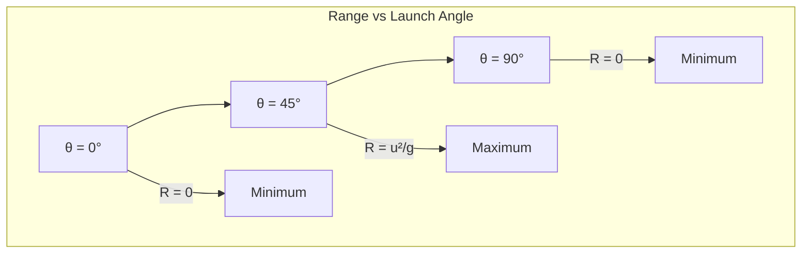

# 1. Overview / 概述

**English:**
Time of Flight and Range are two of the most important parameters in [[Projectile Motion]]. The **time of flight** ($T$) is the total time a projectile remains in the air from launch to landing, while the **range** ($R$) is the horizontal distance it travels during that time. These quantities are derived by combining the [[Horizontal and Vertical Components]] of motion — the vertical component determines the time of flight (since the projectile must return to its launch height), and the horizontal component (which remains constant in ideal projectile motion) determines the range.

This sub-topic is critical for A-Level Physics because it connects [[Equations of Motion (SUVAT)]] with [[Scalars and Vectors]] in a practical, real-world context. Understanding how launch angle, initial speed, and gravitational acceleration affect $T$ and $R$ is essential for solving exam problems and for applications like sports science, ballistics, and engineering. The key insight is that for a given launch speed, the maximum range occurs at a 45° launch angle (in the absence of air resistance), and the time of flight is maximized at 90°.

**中文:**
飞行时间和射程是[[Projectile Motion]]中最重要的两个参数。**飞行时间** ($T$) 是抛体从发射到落地在空中停留的总时间，而**射程** ($R$) 是它在飞行期间水平方向移动的距离。这些量是通过结合[[Horizontal and Vertical Components]]运动推导出来的——竖直分量决定飞行时间（因为抛体必须回到发射高度），而水平分量（在理想抛体运动中保持不变）决定射程。

这个子知识点对A-Level物理至关重要，因为它将[[Equations of Motion (SUVAT)]]与[[Scalars and Vectors]]联系到实际、真实世界的场景中。理解发射角、初速度和重力加速度如何影响$T$和$R$，对于解决考试问题以及体育科学、弹道学和工程学等应用至关重要。关键见解是：对于给定的发射速度，最大射程出现在45°发射角（无空气阻力情况下），而飞行时间在90°时最大。

---

# 2. Syllabus Learning Objectives / 考纲学习目标

| CAIE 9702 | Edexcel IAL |
|-----------|-------------|
| 3.1(l): Derive and use the equations for time of flight and range of a projectile launched horizontally or at an angle to the horizontal | 1.13: Use equations of motion for constant acceleration to solve problems involving projectiles |
| 3.1(m): Solve problems involving projectile motion, including the effects of air resistance (qualitative only) | 1.14: Derive and use the equation for the time of flight of a projectile |
| — | 1.15: Derive and use the equation for the range of a projectile |
| — | 1.16: Explain qualitatively the effect of air resistance on the trajectory of a projectile |

**Examiner Expectations / 考官期望:**
- **CAIE:** Students must be able to derive $T = \frac{2u\sin\theta}{g}$ and $R = \frac{u^2\sin 2\theta}{g}$ from first principles using SUVAT equations. They must also understand that these equations assume no air resistance and landing at the same vertical height as launch.
- **Edexcel:** Similar derivation expected, with additional emphasis on the range equation $R = \frac{u^2\sin 2\theta}{g}$ and the condition for maximum range ($\theta = 45^\circ$). Qualitative discussion of air resistance effects is required.
- **Both:** Students should be able to solve numerical problems and interpret graphs of projectile motion.

**中文:**
- **CAIE:** 学生必须能够使用SUVAT方程从基本原理推导出$T = \frac{2u\sin\theta}{g}$和$R = \frac{u^2\sin 2\theta}{g}$。他们还必须理解这些方程假设无空气阻力且落地高度与发射高度相同。
- **Edexcel:** 需要类似的推导，额外强调射程方程$R = \frac{u^2\sin 2\theta}{g}$和最大射程的条件（$\theta = 45^\circ$）。需要定性讨论空气阻力的影响。
- **两者:** 学生应能解决数值问题并解释抛体运动的图表。

---

# 3. Core Definitions / 核心定义

| Term (EN/CN) | Definition (EN) | Definition (CN) | Common Mistakes / 常见错误 |
|--------------|-----------------|-----------------|---------------------------|
| **Time of Flight** ($T$) / 飞行时间 | The total time a projectile remains in the air from the instant of launch until it returns to the same vertical height (usually the ground). | 抛体从发射瞬间到返回相同竖直高度（通常是地面）在空中停留的总时间。 | ❌ Confusing $T$ with the time to reach maximum height ($t_{max} = T/2$). Remember: $T = 2t_{max}$. |
| **Range** ($R$) / 射程 | The horizontal distance traveled by a projectile from the launch point to the point where it returns to the same vertical height. | 抛体从发射点到返回相同竖直高度点的水平距离。 | ❌ Forgetting that $R$ depends on $\sin 2\theta$, not $\sin\theta$. Maximum $R$ occurs at $\theta = 45^\circ$, not $90^\circ$. |
| **Launch Angle** ($\theta$) / 发射角 | The angle between the initial velocity vector and the horizontal. | 初速度矢量与水平方向之间的夹角。 | ❌ Using degrees in calculator without checking mode. Always use degree mode for $\theta$ in projectile problems. |
| **Initial Speed** ($u$) / 初速度 | The magnitude of the velocity vector at the instant of launch. | 发射瞬间速度矢量的大小。 | ❌ Confusing $u$ with its components. $u_x = u\cos\theta$, $u_y = u\sin\theta$. |
| **Gravitational Acceleration** ($g$) / 重力加速度 | The constant acceleration acting vertically downward on the projectile, typically $9.81\ \text{m s}^{-2}$. | 作用在抛体上竖直向下的恒定加速度，通常为$9.81\ \text{m s}^{-2}$。 | ❌ Using $g = 10\ \text{m s}^{-2}$ when the problem specifies $9.81$. Check the question carefully. |

---

# 4. Key Concepts Explained / 关键概念详解

## 4.1 Derivation of Time of Flight / 飞行时间的推导

### Explanation / 解释
**English:**
The time of flight $T$ is derived from the vertical motion of the projectile. Using the [[Equations of Motion (SUVAT)]] in the vertical direction ($y$), we consider the displacement $s_y = 0$ (since the projectile returns to the same vertical height), initial vertical velocity $u_y = u\sin\theta$, and acceleration $a_y = -g$ (taking upward as positive).

From $s = ut + \frac{1}{2}at^2$:
$$0 = (u\sin\theta)T - \frac{1}{2}gT^2$$

Factorizing $T$:
$$T(u\sin\theta - \frac{1}{2}gT) = 0$$

The solution $T = 0$ corresponds to the launch instant. The non-trivial solution is:
$$T = \frac{2u\sin\theta}{g}$$

This shows that $T$ depends only on the vertical component of initial velocity ($u\sin\theta$) and $g$. A larger launch angle or higher initial speed increases $T$.

**中文:**
飞行时间$T$是从抛体的竖直运动推导出来的。使用竖直方向($y$)的[[Equations of Motion (SUVAT)]]，我们考虑位移$s_y = 0$（因为抛体返回相同竖直高度），初速度竖直分量$u_y = u\sin\theta$，加速度$a_y = -g$（取向上为正）。

由$s = ut + \frac{1}{2}at^2$：
$$0 = (u\sin\theta)T - \frac{1}{2}gT^2$$

提取公因式$T$：
$$T(u\sin\theta - \frac{1}{2}gT) = 0$$

解$T = 0$对应发射瞬间。非平凡解为：
$$T = \frac{2u\sin\theta}{g}$$

这表明$T$仅取决于初速度的竖直分量($u\sin\theta$)和$g$。更大的发射角或更高的初速度会增加$T$。

### Physical Meaning / 物理意义
**English:** The time of flight is twice the time taken to reach [[Maximum Height]] ($t_{max} = u\sin\theta/g$). This is because the upward and downward journeys are symmetric (same time, same distance) when landing at the same height. The vertical component of velocity determines how long the projectile stays in the air — a higher vertical component means it goes higher and takes longer to fall back.

**中文:** 飞行时间是到达[[Maximum Height]]所需时间的两倍（$t_{max} = u\sin\theta/g$）。这是因为当落地高度相同时，上升和下降过程是对称的（相同时间，相同距离）。速度的竖直分量决定了抛体在空中停留的时间——竖直分量越大，它飞得越高，下落所需时间也越长。

### Common Misconceptions / 常见误区
- ❌ **"Time of flight depends on horizontal velocity."** — No! $T$ depends only on vertical motion ($u\sin\theta$ and $g$). Horizontal velocity affects range, not time of flight.
- ❌ **"Time of flight is the same for all angles with the same $u$."** — No! $T$ varies with $\sin\theta$, so it increases with $\theta$ (up to $90^\circ$).
- ❌ **"The equation $T = 2u\sin\theta/g$ works for any projectile."** — No! It only works when landing height = launch height. For projectiles landing at a different height, you must solve the full quadratic.

**中文:**
- ❌ **"飞行时间取决于水平速度。"** — 不对！$T$仅取决于竖直运动（$u\sin\theta$和$g$）。水平速度影响射程，而非飞行时间。
- ❌ **"对于相同的$u$，所有角度的飞行时间相同。"** — 不对！$T$随$\sin\theta$变化，因此随$\theta$增加而增加（直到$90^\circ$）。
- ❌ **"方程$T = 2u\sin\theta/g$适用于任何抛体。"** — 不对！它仅适用于落地高度等于发射高度的情况。对于在不同高度落地的抛体，必须解完整的二次方程。

### Exam Tips / 考试提示
- ✅ Always start by resolving the initial velocity into [[Horizontal and Vertical Components]].
- ✅ For time of flight, use $s_y = 0$ only if landing at the same height. If landing at a different height, set $s_y$ equal to the vertical displacement.
- ✅ Remember: $T = 2 \times$ (time to maximum height). This is a quick check for your answer.
- ✅ In problems with air resistance (qualitative), time of flight decreases because the vertical motion is opposed by drag.

**中文:**
- ✅ 始终先将初速度分解为[[Horizontal and Vertical Components]]。
- ✅ 对于飞行时间，仅当落地高度相同时才使用$s_y = 0$。如果落地高度不同，将$s_y$设为竖直位移。
- ✅ 记住：$T = 2 \times$（到达最大高度的时间）。这是检查答案的快速方法。
- ✅ 在有空气阻力的问题中（定性），飞行时间会减少，因为竖直运动受到阻力的阻碍。

> 📷 **IMAGE PROMPT — T01: Time of Flight Derivation Diagram**
> A projectile launched at angle θ from ground level, showing the parabolic trajectory. Label: initial velocity u at angle θ, horizontal component u_x = u cos θ, vertical component u_y = u sin θ. Mark the launch point (0,0) and landing point (R,0). Show the vertical displacement s_y = 0. Include a small SUVAT equation box: s = ut + ½at², with s=0, u=u sin θ, a=-g. Clean physics textbook style, white background, black lines, blue labels.

---

## 4.2 Derivation of Range / 射程的推导

### Explanation / 解释
**English:**
The range $R$ is the horizontal distance traveled during the time of flight. Since horizontal acceleration is zero (no air resistance), horizontal velocity remains constant at $u_x = u\cos\theta$.

Using $s = ut + \frac{1}{2}at^2$ in the horizontal direction ($a_x = 0$):
$$R = (u\cos\theta)T$$

Substituting $T = \frac{2u\sin\theta}{g}$:
$$R = (u\cos\theta) \times \frac{2u\sin\theta}{g} = \frac{2u^2\sin\theta\cos\theta}{g}$$

Using the trigonometric identity $\sin 2\theta = 2\sin\theta\cos\theta$:
$$R = \frac{u^2\sin 2\theta}{g}$$

This is the **range equation** for projectile motion (same launch and landing height).

**中文:**
射程$R$是飞行时间内水平方向移动的距离。由于水平加速度为零（无空气阻力），水平速度保持恒定$u_x = u\cos\theta$。

在水平方向使用$s = ut + \frac{1}{2}at^2$（$a_x = 0$）：
$$R = (u\cos\theta)T$$

代入$T = \frac{2u\sin\theta}{g}$：
$$R = (u\cos\theta) \times \frac{2u\sin\theta}{g} = \frac{2u^2\sin\theta\cos\theta}{g}$$

使用三角恒等式$\sin 2\theta = 2\sin\theta\cos\theta$：
$$R = \frac{u^2\sin 2\theta}{g}$$

这就是抛体运动的**射程方程**（发射和落地高度相同）。

### Physical Meaning / 物理意义
**English:** The range depends on both the horizontal and vertical components of velocity. The $\sin 2\theta$ term means that:
- $R$ is maximum when $\sin 2\theta = 1$, i.e., $2\theta = 90^\circ$, so $\theta = 45^\circ$.
- $R$ is the same for complementary angles (e.g., $30^\circ$ and $60^\circ$ give the same range) because $\sin 2(30^\circ) = \sin 60^\circ = \sin 120^\circ = \sin 2(60^\circ)$.
- $R = 0$ when $\theta = 0^\circ$ (horizontal launch — projectile hits ground immediately) and $\theta = 90^\circ$ (vertical launch — no horizontal motion).

**中文:**
射程取决于速度的水平分量和竖直分量。$\sin 2\theta$项意味着：
- 当$\sin 2\theta = 1$时，即$2\theta = 90^\circ$，所以$\theta = 45^\circ$时$R$最大。
- 互补角（例如$30^\circ$和$60^\circ$）的射程相同，因为$\sin 2(30^\circ) = \sin 60^\circ = \sin 120^\circ = \sin 2(60^\circ)$。
- 当$\theta = 0^\circ$（水平发射——抛体立即落地）和$\theta = 90^\circ$（竖直发射——无水平运动）时，$R = 0$。

### Common Misconceptions / 常见误区
- ❌ **"Range increases with launch angle up to 90°."** — No! Range increases up to 45°, then decreases. At 90°, range is zero.
- ❌ **"The range equation works for projectiles landing at any height."** — No! It only works for same launch and landing height. For different heights, you must solve the full equations.
- ❌ **"Doubling $u$ doubles $R$."** — No! $R \propto u^2$, so doubling $u$ quadruples $R$.

**中文:**
- ❌ **"射程随发射角增加直到90°。"** — 不对！射程增加到45°后开始减小。在90°时，射程为零。
- ❌ **"射程方程适用于在任何高度落地的抛体。"** — 不对！它仅适用于发射和落地高度相同的情况。对于不同高度，必须解完整的方程。
- ❌ **"将$u$加倍会使$R$加倍。"** — 不对！$R \propto u^2$，所以将$u$加倍会使$R$变为四倍。

### Exam Tips / 考试提示
- ✅ For maximum range problems, immediately set $\theta = 45^\circ$ and use $R_{max} = u^2/g$.
- ✅ For complementary angles (e.g., 30° and 60°), the ranges are equal. This is a common exam trick.
- ✅ If the projectile lands at a different height, do NOT use the simple range equation. Instead, find $T$ from the vertical motion (solving the quadratic) and then multiply by $u\cos\theta$.
- ✅ Remember: $R \propto u^2$ and $R \propto \sin 2\theta$.

**中文:**
- ✅ 对于最大射程问题，立即设$\theta = 45^\circ$并使用$R_{max} = u^2/g$。
- ✅ 对于互补角（例如30°和60°），射程相等。这是一个常见的考试技巧。
- ✅ 如果抛体在不同高度落地，不要使用简单的射程方程。而是从竖直运动中找到$T$（解二次方程），然后乘以$u\cos\theta$。
- ✅ 记住：$R \propto u^2$和$R \propto \sin 2\theta$。

> 📷 **IMAGE PROMPT — T02: Range vs Launch Angle**
> A graph showing Range R on the y-axis vs Launch Angle θ on the x-axis (0° to 90°). The curve is a symmetric parabola peaking at θ = 45°. Mark the maximum range R_max = u²/g at θ = 45°. Show that R(30°) = R(60°) and R(20°) = R(70°) with dashed vertical lines. Clean physics textbook style, white background, black curve, red dashed lines, blue labels.

---

## 4.3 Maximum Range Condition / 最大射程条件

### Explanation / 解释
**English:**
The condition for maximum range is derived from $R = \frac{u^2\sin 2\theta}{g}$. Since $u$ and $g$ are constants for a given projectile, $R$ is maximized when $\sin 2\theta$ is maximized. The maximum value of $\sin 2\theta$ is 1, which occurs when $2\theta = 90^\circ$, i.e., $\theta = 45^\circ$.

At $\theta = 45^\circ$:
$$R_{max} = \frac{u^2}{g}$$

This is a key result: for a given initial speed, the maximum horizontal range is achieved at a 45° launch angle (in the absence of air resistance).

**中文:**
最大射程的条件由$R = \frac{u^2\sin 2\theta}{g}$推导得出。由于对于给定的抛体，$u$和$g$是常数，当$\sin 2\theta$最大时$R$最大。$\sin 2\theta$的最大值为1，发生在$2\theta = 90^\circ$时，即$\theta = 45^\circ$。

在$\theta = 45^\circ$时：
$$R_{max} = \frac{u^2}{g}$$

这是一个关键结果：对于给定的初速度，最大水平射程在45°发射角时达到（无空气阻力情况下）。

### Physical Meaning / 物理意义
**English:** At 45°, there is an optimal balance between vertical and horizontal components. A lower angle gives more horizontal velocity but less time of flight (since vertical component is small). A higher angle gives more time of flight but less horizontal velocity. At 45°, the product $u\cos\theta \times u\sin\theta$ is maximized, which is equivalent to maximizing $\sin 2\theta$.

**中文:** 在45°时，竖直分量和水平分量之间存在最佳平衡。较低的角度提供更大的水平速度，但飞行时间更短（因为竖直分量小）。较高的角度提供更长的飞行时间，但水平速度更小。在45°时，乘积$u\cos\theta \times u\sin\theta$最大，这等价于最大化$\sin 2\theta$。

### Common Misconceptions / 常见误区
- ❌ **"45° always gives maximum range, even with air resistance."** — No! With air resistance, the optimal angle is less than 45° (typically around 35°-40°).
- ❌ **"Maximum range means maximum height."** — No! Maximum height occurs at 90°, where range is zero.

**中文:**
- ❌ **"即使有空气阻力，45°也总是给出最大射程。"** — 不对！有空气阻力时，最佳角度小于45°（通常在35°-40°左右）。
- ❌ **"最大射程意味着最大高度。"** — 不对！最大高度出现在90°，此时射程为零。

### Exam Tips / 考试提示
- ✅ If a question asks for "maximum range" without specifying angle, assume $\theta = 45^\circ$ and use $R_{max} = u^2/g$.
- ✅ For qualitative questions about air resistance: range decreases, and the optimal angle shifts below 45°.

**中文:**
- ✅ 如果问题要求"最大射程"而未指定角度，假设$\theta = 45^\circ$并使用$R_{max} = u^2/g$。
- ✅ 对于关于空气阻力的定性问题：射程减小，最佳角度移至45°以下。

---

# 5. Essential Equations / 核心公式

## Equation 1: Time of Flight / 飞行时间

$$T = \frac{2u\sin\theta}{g}$$

| Symbol (符号) | Meaning (EN) | Meaning (CN) | Unit (单位) |
|--------------|-------------|-------------|------------|
| $T$ | Time of flight | 飞行时间 | s |
| $u$ | Initial speed | 初速度 | m s⁻¹ |
| $\theta$ | Launch angle (from horizontal) | 发射角（与水平方向夹角） | ° or rad |
| $g$ | Acceleration due to gravity | 重力加速度 | m s⁻² |

**Derivation / 推导:** From $s_y = u_y t + \frac{1}{2}a_y t^2$ with $s_y = 0$, $u_y = u\sin\theta$, $a_y = -g$.

**Conditions / 适用条件:**
- **EN:** Projectile lands at the same vertical height as launch. No air resistance. Constant $g$.
- **CN:** 抛体落地高度与发射高度相同。无空气阻力。$g$恒定。

**Limitations / 局限性:**
- **EN:** Does not apply if landing height differs from launch height. Does not account for air resistance or varying $g$.
- **CN:** 不适用于落地高度与发射高度不同的情况。不考虑空气阻力或$g$的变化。

---

## Equation 2: Range / 射程

$$R = \frac{u^2\sin 2\theta}{g}$$

| Symbol (符号) | Meaning (EN) | Meaning (CN) | Unit (单位) |
|--------------|-------------|-------------|------------|
| $R$ | Range (horizontal distance) | 射程（水平距离） | m |
| $u$ | Initial speed | 初速度 | m s⁻¹ |
| $\theta$ | Launch angle | 发射角 | ° or rad |
| $g$ | Acceleration due to gravity | 重力加速度 | m s⁻² |

**Derivation / 推导:** $R = (u\cos\theta)T = (u\cos\theta) \times \frac{2u\sin\theta}{g} = \frac{2u^2\sin\theta\cos\theta}{g} = \frac{u^2\sin 2\theta}{g}$.

**Conditions / 适用条件:**
- **EN:** Same as time of flight: same launch and landing height, no air resistance, constant $g$.
- **CN:** 与飞行时间相同：发射和落地高度相同，无空气阻力，$g$恒定。

**Limitations / 局限性:**
- **EN:** Does not apply for different landing heights. Does not account for air resistance.
- **CN:** 不适用于不同落地高度。不考虑空气阻力。

---

## Equation 3: Maximum Range / 最大射程

$$R_{max} = \frac{u^2}{g} \quad \text{(at } \theta = 45^\circ\text{)}$$

| Symbol (符号) | Meaning (EN) | Meaning (CN) | Unit (单位) |
|--------------|-------------|-------------|------------|
| $R_{max}$ | Maximum possible range | 最大可能射程 | m |
| $u$ | Initial speed | 初速度 | m s⁻¹ |
| $g$ | Acceleration due to gravity | 重力加速度 | m s⁻² |

**Derivation / 推导:** Set $\sin 2\theta = 1$ in the range equation, giving $2\theta = 90^\circ$, $\theta = 45^\circ$, and $R_{max} = u^2/g$.

**Conditions / 适用条件:**
- **EN:** Same launch and landing height, no air resistance.
- **CN:** 发射和落地高度相同，无空气阻力。

**Limitations / 局限性:**
- **EN:** Only valid for ideal projectile motion. With air resistance, $R_{max}$ is smaller and occurs at $\theta < 45^\circ$.
- **CN:** 仅适用于理想抛体运动。有空气阻力时，$R_{max}$更小且出现在$\theta < 45^\circ$时。

> 📷 **IMAGE PROMPT — T03: Range Equation Derivation**
> A step-by-step derivation flow diagram. Start with R = u cos θ × T. Below: T = 2u sin θ / g. Combine: R = u cos θ × 2u sin θ / g = 2u² sin θ cos θ / g. Use identity sin 2θ = 2 sin θ cos θ → R = u² sin 2θ / g. Clean physics textbook style, white background, black text, blue arrows connecting steps.

---

# 6. Graphs and Relationships / 图表与关系

## 6.1 Range vs Launch Angle / 射程与发射角的关系

### Axes / 坐标轴
- **x-axis:** Launch angle $\theta$ (0° to 90°)
- **y-axis:** Range $R$ (m)

### Shape / 形状
**English:** A symmetric, inverted U-shaped curve (parabola-like) that peaks at $\theta = 45^\circ$. The curve is symmetric about $\theta = 45^\circ$, meaning $R(45^\circ + \phi) = R(45^\circ - \phi)$ for any $\phi$.

**中文:** 一条对称的倒U形曲线（类似抛物线），在$\theta = 45^\circ$处达到峰值。曲线关于$\theta = 45^\circ$对称，意味着对于任何$\phi$，$R(45^\circ + \phi) = R(45^\circ - \phi)$。

### Gradient Meaning / 斜率含义
**English:** The gradient $dR/d\theta$ represents the rate of change of range with launch angle. It is positive for $\theta < 45^\circ$ (range increases with angle), zero at $\theta = 45^\circ$ (maximum), and negative for $\theta > 45^\circ$ (range decreases with angle).

**中文:** 梯度$dR/d\theta$表示射程随发射角的变化率。当$\theta < 45^\circ$时为正（射程随角度增加），在$\theta = 45^\circ$时为零（最大值），当$\theta > 45^\circ$时为负（射程随角度减小）。

### Area Meaning / 面积含义
**English:** The area under the $R$ vs $\theta$ curve has no direct physical meaning in this context.

**中文:** 在此上下文中，$R$与$\theta$曲线下的面积没有直接的物理意义。

### Exam Interpretation / 考试解读
- ✅ If asked to sketch $R$ vs $\theta$, draw a symmetric curve peaking at $45^\circ$, starting at $R=0$ for $\theta=0^\circ$ and returning to $R=0$ at $\theta=90^\circ$.
- ✅ Be able to identify that $R(30^\circ) = R(60^\circ)$ from the graph symmetry.
- ✅ For qualitative questions about air resistance: the peak shifts left (lower angle) and the maximum range decreases.

**中文:**
- ✅ 如果要求画出$R$与$\theta$的关系图，画一条在$45^\circ$处达到峰值的对称曲线，从$\theta=0^\circ$时的$R=0$开始，在$\theta=90^\circ$时回到$R=0$。
- ✅ 能够从图形对称性识别$R(30^\circ) = R(60^\circ)$。
- ✅ 对于关于空气阻力的定性问题：峰值向左移动（更低的角度），最大射程减小。



---

## 6.2 Time of Flight vs Launch Angle / 飞行时间与发射角的关系

### Axes / 坐标轴
- **x-axis:** Launch angle $\theta$ (0° to 90°)
- **y-axis:** Time of flight $T$ (s)

### Shape / 形状
**English:** An increasing curve from $T = 0$ at $\theta = 0^\circ$ to $T = 2u/g$ at $\theta = 90^\circ$. The relationship is $T \propto \sin\theta$, so it follows a sine curve shape from 0° to 90°.

**中文:** 一条从$\theta = 0^\circ$时的$T = 0$增加到$\theta = 90^\circ$时的$T = 2u/g$的上升曲线。关系为$T \propto \sin\theta$，因此从0°到90°呈正弦曲线形状。

### Gradient Meaning / 斜率含义
**English:** The gradient $dT/d\theta = (2u\cos\theta)/g$. It is maximum at $\theta = 0^\circ$ (steepest increase) and decreases to zero at $\theta = 90^\circ$ (horizontal tangent).

**中文:** 梯度$dT/d\theta = (2u\cos\theta)/g$。在$\theta = 0^\circ$时最大（最陡的上升），在$\theta = 90^\circ$时减小到零（水平切线）。

### Area Meaning / 面积含义
**English:** No direct physical meaning.

**中文:** 没有直接的物理意义。

### Exam Interpretation / 考试解读
- ✅ $T$ increases monotonically with $\theta$ — no maximum within 0° to 90°.
- ✅ At $\theta = 90^\circ$, $T = 2u/g$ (time for vertical projectile to go up and down).
- ✅ At $\theta = 0^\circ$, $T = 0$ (projectile launched horizontally from ground level hits ground immediately).

**中文:**
- ✅ $T$随$\theta$单调增加——在0°到90°内没有最大值。
- ✅ 在$\theta = 90^\circ$时，$T = 2u/g$（竖直抛体上升和下落的时间）。
- ✅ 在$\theta = 0^\circ$时，$T = 0$（从地面水平发射的抛体立即落地）。

---

# 7. Required Diagrams / 必备图表

## 7.1 Projectile Trajectory with Time of Flight and Range / 抛体轨迹（含飞行时间和射程）

### Description / 描述
**English:** A diagram showing the complete parabolic trajectory of a projectile launched from ground level at angle $\theta$. The launch point and landing point are marked on the ground. The time of flight $T$ is indicated as the total time from launch to landing. The range $R$ is the horizontal distance between launch and landing points. The initial velocity vector $u$ is shown at angle $\theta$, with its horizontal component $u_x = u\cos\theta$ and vertical component $u_y = u\sin\theta$ clearly labeled.

**中文:** 一个显示从地面以角度$\theta$发射的抛体的完整抛物线轨迹的图示。发射点和落地点在地面上标出。飞行时间$T$表示为从发射到落地的总时间。射程$R$是发射点和落地点之间的水平距离。初速度矢量$u$以角度$\theta$显示，其水平分量$u_x = u\cos\theta$和竖直分量$u_y = u\sin\theta$清晰标注。

### Image Prompt / 图片生成提示
> 📷 **IMAGE PROMPT — T04: Projectile Trajectory with T and R**
> A parabolic trajectory of a projectile launched from ground level. Launch point at (0,0) on the left, landing point at (R,0) on the right. The initial velocity vector u is shown at angle θ from the horizontal, with dashed lines showing u_x = u cos θ (horizontal) and u_y = u sin θ (vertical). A horizontal double-headed arrow labeled "Range R" spans from launch to landing. A vertical dashed line at the peak shows maximum height. Label "Time of Flight T" along the trajectory. Clean physics textbook style, white background, black lines, blue labels, red arrows for velocity components.

### Labels Required / 需要标注
- Launch point (0,0) / 发射点 (0,0)
- Landing point (R,0) / 落地点 (R,0)
- Initial velocity $u$ at angle $\theta$ / 初速度$u$与水平方向夹角$\theta$
- $u_x = u\cos\theta$ (horizontal component) / 水平分量
- $u_y = u\sin\theta$ (vertical component) / 竖直分量
- Range $R$ / 射程$R$
- Time of flight $T$ / 飞行时间$T$
- Maximum height / 最大高度

### Exam Importance / 考试重要性
**English:** This is the most fundamental diagram for projectile motion. Students must be able to draw and label it from memory. It is the basis for deriving all equations for $T$ and $R$.

**中文:** 这是抛体运动最基本的图示。学生必须能够凭记忆画出并标注它。它是推导所有$T$和$R$方程的基础。

---

## 7.2 Range vs Angle Graph / 射程与角度关系图

### Description / 描述
**English:** A graph showing how the range $R$ varies with launch angle $\theta$ for a fixed initial speed $u$. The curve is symmetric about $\theta = 45^\circ$, with maximum range $R_{max} = u^2/g$ at $\theta = 45^\circ$. The graph shows that complementary angles (e.g., 30° and 60°) give the same range.

**中文:** 一个显示在固定初速度$u$下射程$R$随发射角$\theta$变化的图表。曲线关于$\theta = 45^\circ$对称，在$\theta = 45^\circ$时最大射程$R_{max} = u^2/g$。图表显示互补角（例如30°和60°）给出相同的射程。

### Image Prompt / 图片生成提示
> 📷 **IMAGE PROMPT — T05: Range vs Angle Graph**
> A graph with θ on the x-axis (0° to 90°) and R on the y-axis. A smooth symmetric curve peaks at θ = 45° with R_max = u²/g. Dashed vertical lines at θ = 30° and θ = 60° show equal R values. The curve starts at R = 0 at θ = 0° and returns to R = 0 at θ = 90°. Clean physics textbook style, white background, black curve, red dashed lines, blue axis labels.

### Labels Required / 需要标注
- x-axis: Launch angle $\theta$ / 发射角$\theta$
- y-axis: Range $R$ / 射程$R$
- Peak: $(\theta = 45^\circ, R = u^2/g)$ / 峰值
- $R(30^\circ) = R(60^\circ)$ / 互补角相等

### Exam Importance / 考试重要性
**English:** Frequently tested in multiple-choice and short-answer questions. Students must understand the symmetry and the condition for maximum range.

**中文:** 常在选择题和简答题中考查。学生必须理解对称性和最大射程的条件。

---

# 8. Worked Examples / 典型例题

## Example 1: Finding Time of Flight and Range / 求飞行时间和射程

### Question / 题目
**English:**
A projectile is launched from ground level with an initial speed of $20\ \text{m s}^{-1}$ at an angle of $35^\circ$ to the horizontal. Calculate:
(a) The time of flight.
(b) The range.
Assume $g = 9.81\ \text{m s}^{-2}$ and no air resistance.

**中文:**
一个抛体从地面以$20\ \text{m s}^{-1}$的初速度、与水平方向成$35^\circ$角发射。计算：
(a) 飞行时间。
(b) 射程。
假设$g = 9.81\ \text{m s}^{-2}$且无空气阻力。

### Solution / 解答

**Step 1: Identify known quantities / 步骤1：确定已知量**
- $u = 20\ \text{m s}^{-1}$
- $\theta = 35^\circ$
- $g = 9.81\ \text{m s}^{-2}$
- Launch and landing at same height ($s_y = 0$)

**Step 2: Calculate time of flight / 步骤2：计算飞行时间**
$$T = \frac{2u\sin\theta}{g} = \frac{2 \times 20 \times \sin 35^\circ}{9.81}$$

$$\sin 35^\circ = 0.574$$

$$T = \frac{40 \times 0.574}{9.81} = \frac{22.96}{9.81} = 2.34\ \text{s}$$

**Step 3: Calculate range / 步骤3：计算射程**
$$R = \frac{u^2\sin 2\theta}{g} = \frac{20^2 \times \sin 70^\circ}{9.81}$$

$$\sin 70^\circ = 0.940$$

$$R = \frac{400 \times 0.940}{9.81} = \frac{376}{9.81} = 38.3\ \text{m}$$

### Final Answer / 最终答案
**Answer:** (a) $T = 2.34\ \text{s}$ | **答案：** (a) $T = 2.34\ \text{s}$
**Answer:** (b) $R = 38.3\ \text{m}$ | **答案：** (b) $R = 38.3\ \text{m}$

### Quick Tip / 提示
**English:** Always check your calculator is in degree mode when using angles in degrees. A common mistake is to use radian mode, which gives incorrect values for $\sin\theta$.

**中文:** 使用角度制时，始终检查计算器处于角度模式。一个常见错误是使用弧度模式，这会导致$\sin\theta$的值错误。

---

## Example 2: Maximum Range Problem / 最大射程问题

### Question / 题目
**English:**
A projectile launcher can fire projectiles at a fixed speed of $15\ \text{m s}^{-1}$. What is the maximum possible range, and at what angle should the launcher be set to achieve it? Assume $g = 9.81\ \text{m s}^{-2}$ and no air resistance.

**中文:**
一个抛体发射器能以$15\ \text{m s}^{-1}$的固定速度发射抛体。最大可能射程是多少？发射器应设置为什么角度才能达到该射程？假设$g = 9.81\ \text{m s}^{-2}$且无空气阻力。

### Solution / 解答

**Step 1: Identify known quantities / 步骤1：确定已知量**
- $u = 15\ \text{m s}^{-1}$
- $g = 9.81\ \text{m s}^{-2}$
- For maximum range: $\theta = 45^\circ$

**Step 2: Calculate maximum range / 步骤2：计算最大射程**
$$R_{max} = \frac{u^2}{g} = \frac{15^2}{9.81} = \frac{225}{9.81} = 22.9\ \text{m}$$

### Final Answer / 最终答案
**Answer:** Maximum range $R_{max} = 22.9\ \text{m}$ at $\theta = 45^\circ$ | **答案：** 最大射程$R_{max} = 22.9\ \text{m}$，在$\theta = 45^\circ$时

### Quick Tip / 提示
**English:** For maximum range problems, immediately use $\theta = 45^\circ$ and $R_{max} = u^2/g$. This saves time and avoids calculation errors.

**中文:** 对于最大射程问题，立即使用$\theta = 45^\circ$和$R_{max} = u^2/g$。这节省时间并避免计算错误。

---

## Example 3: Complementary Angles / 互补角问题

### Question / 题目
**English:**
A projectile is launched with speed $25\ \text{m s}^{-1}$ at an angle of $20^\circ$ to the horizontal. Without calculation, state the launch angle that gives the same range. Calculate both ranges to verify. Assume $g = 9.81\ \text{m s}^{-2}$.

**中文:**
一个抛体以$25\ \text{m s}^{-1}$的速度、与水平方向成$20^\circ$角发射。不经过计算，说出给出相同射程的发射角。计算两个射程以验证。假设$g = 9.81\ \text{m s}^{-2}$。

### Solution / 解答

**Step 1: Identify complementary angle / 步骤1：确定互补角**
- Complementary angle: $90^\circ - 20^\circ = 70^\circ$
- Both $20^\circ$ and $70^\circ$ give the same range because $\sin 2(20^\circ) = \sin 40^\circ = \sin 140^\circ = \sin 2(70^\circ)$

**Step 2: Calculate range for $\theta = 20^\circ$ / 步骤2：计算$\theta = 20^\circ$时的射程**
$$R_{20} = \frac{25^2 \times \sin 40^\circ}{9.81} = \frac{625 \times 0.643}{9.81} = \frac{402}{9.81} = 41.0\ \text{m}$$

**Step 3: Calculate range for $\theta = 70^\circ$ / 步骤3：计算$\theta = 70^\circ$时的射程**
$$R_{70} = \frac{25^2 \times \sin 140^\circ}{9.81} = \frac{625 \times 0.643}{9.81} = 41.0\ \text{m}$$

### Final Answer / 最终答案
**Answer:** The same range is achieved at $\theta = 70^\circ$. Both give $R = 41.0\ \text{m}$. | **答案：** 在$\theta = 70^\circ$时达到相同射程。两者均给出$R = 41.0\ \text{m}$。

### Quick Tip / 提示
**English:** Remember that $\sin(180^\circ - \alpha) = \sin\alpha$. Since $2\theta$ and $180^\circ - 2\theta$ give the same sine, $\theta$ and $90^\circ - \theta$ give the same range.

**中文:** 记住$\sin(180^\circ - \alpha) = \sin\alpha$。由于$2\theta$和$180^\circ - 2\theta$给出相同的正弦值，$\theta$和$90^\circ - \theta$给出相同的射程。

---

# 9. Past Paper Question Types / 历年真题题型

| Question Type / 题型 | Frequency / 频率 | Difficulty / 难度 | Past Paper References / 真题索引 |
|----------------------|------------------|------------------|-------------------------------|
| Calculate $T$ and $R$ from given $u$ and $\theta$ | Very High | Easy | 📝 *待填入* |
| Find $\theta$ given $R$ and $u$ | Medium | Medium | 📝 *待填入* |
| Maximum range problem ($\theta = 45^\circ$) | High | Easy | 📝 *待填入* |
| Complementary angles comparison | Medium | Medium | 📝 *待填入* |
| Qualitative effect of air resistance on $T$ and $R$ | Medium | Medium | 📝 *待填入* |
| Derivation of $T$ and $R$ equations | Low | Hard | 📝 *待填入* |
| Projectile landing at different height | Low | Hard | 📝 *待填入* |

**Common Command Words / 常见指令词:**
- **Calculate / 计算:** Use the equations to find numerical values of $T$ or $R$.
- **Derive / 推导:** Show the step-by-step derivation of $T = 2u\sin\theta/g$ or $R = u^2\sin 2\theta/g$.
- **State / 陈述:** Give the condition for maximum range ($\theta = 45^\circ$).
- **Explain / 解释:** Describe qualitatively how air resistance affects $T$ and $R$.
- **Sketch / 画出:** Draw the $R$ vs $\theta$ graph or the trajectory diagram.
- **Compare / 比较:** Compare ranges for different angles (e.g., complementary angles).

**中文:**
- **Calculate / 计算:** 使用方程求$T$或$R$的数值。
- **Derive / 推导:** 展示$T = 2u\sin\theta/g$或$R = u^2\sin 2\theta/g$的逐步推导。
- **State / 陈述:** 给出最大射程的条件（$\theta = 45^\circ$）。
- **Explain / 解释:** 定性描述空气阻力如何影响$T$和$R$。
- **Sketch / 画出:** 画出$R$与$\theta$的关系图或轨迹图。
- **Compare / 比较:** 比较不同角度（如互补角）的射程。

---

# 10. Practical Skills Connections / 实验技能链接

**English:**
This sub-topic connects to practical work in several ways:

1. **Measuring Time of Flight and Range:** In a lab experiment, a projectile (e.g., a ball bearing) is launched using a spring-loaded launcher at various angles. The time of flight can be measured using light gates or a stopwatch, and the range using a meter rule or tape measure. Students compare experimental values with theoretical predictions from $T = 2u\sin\theta/g$ and $R = u^2\sin 2\theta/g$.

2. **Uncertainties and Errors:**
   - **Systematic errors:** Air resistance reduces both $T$ and $R$ compared to theoretical values. The launcher may not be perfectly horizontal or at the exact angle set.
   - **Random errors:** Parallax error when reading the range on a meter rule. Reaction time error when using a stopwatch for $T$.
   - **Uncertainty propagation:** If $u$ has uncertainty $\Delta u$, then $\Delta R/R = 2\Delta u/u$ (since $R \propto u^2$).

3. **Graph Plotting:** Plot $R$ vs $\theta$ experimentally and compare with the theoretical curve. Identify the angle giving maximum range.

4. **Experimental Design:**
   - Use a plumb line to ensure the launcher is vertical.
   - Use a protractor to set the launch angle accurately.
   - Repeat measurements at each angle to calculate mean and standard deviation.
   - Use a carbon paper or marker to record the landing point precisely.

5. **Verification of $R \propto u^2$:** Vary the launcher setting (changing $u$) at a fixed $\theta = 45^\circ$ and plot $R$ vs $u^2$. The graph should be a straight line through the origin with gradient $1/g$.

**中文:**
本子知识点通过多种方式与实验工作联系：

1. **测量飞行时间和射程：** 在实验室实验中，使用弹簧加载发射器以不同角度发射抛体（如钢珠）。可以使用光门或秒表测量飞行时间，使用米尺或卷尺测量射程。学生将实验值与$T = 2u\sin\theta/g$和$R = u^2\sin 2\theta/g$的理论预测进行比较。

2. **不确定性和误差：**
   - **系统误差：** 与理论值相比，空气阻力会减少$T$和$R$。发射器可能不完全水平或处于精确设定的角度。
   - **随机误差：** 在米尺上读取射程时的视差误差。使用秒表测量$T$时的反应时间误差。
   - **不确定度传播：** 如果$u$有不确定度$\Delta u$，则$\Delta R/R = 2\Delta u/u$（因为$R \propto u^2$）。

3. **图表绘制：** 实验绘制$R$与$\theta$的关系图，并与理论曲线比较。确定给出最大射程的角度。

4. **实验设计：**
   - 使用铅垂线确保发射器垂直。
   - 使用量角器精确设置发射角。
   - 在每个角度重复测量以计算平均值和标准偏差。
   - 使用复写纸或标记精确记录落地位置。

5. **验证$R \propto u^2$：** 在固定$\theta = 45^\circ$下改变发射器设置（改变$u$），绘制$R$与$u^2$的关系图。图形应为通过原点的直线，斜率为$1/g$。

---

# 11. Concept Map / 概念图谱

```mermaid
graph TD
    %% Time of Flight and Range - Concept Map
    
    subgraph "Prerequisites"
        A[Scalars and Vectors] --> B[Resolution into Components]
        C[Equations of Motion SUVAT] --> D[s = ut + ½at²]
    end
    
    subgraph "Core Concepts"
        E[Projectile Motion] --> F[Horizontal Component]
        E --> G[Vertical Component]
        F --> H[Constant Velocity: u cos θ]
        G --> I[Constant Acceleration: -g]
    end
    
    subgraph "Time of Flight T"
        J[Vertical Motion: s_y = 0] --> K[T = 2u sin θ / g]
        K --> L[T ∝ sin θ]
        K --> M[T ∝ u]
        K --> N[T ∝ 1/g]
    end
    
    subgraph "Range R"
        O[Horizontal Motion: R = u cos θ × T] --> P[R = u² sin 2θ / g]
        P --> Q[R ∝ u²]
        P --> R[R ∝ sin 2θ]
        P --> S[R ∝ 1/g]
    end
    
    subgraph "Key Results"
        T[Maximum Range at θ = 45°] --> U[R_max = u²/g]
        V[Complementary Angles] --> W[R(θ) = R(90° - θ)]
    end
    
    subgraph "Related Topics"
        X[Maximum Height] --> Y[H_max = u² sin²θ / 2g]
        Z[Projectile Motion Graphs] --> AA[Trajectory, v-t, a-t]
        AB[Newton's Laws of Motion] --> AC[Force causes acceleration]
    end
    
    %% Connections
    B --> F
    B --> G
    D --> J
    D --> O
    K --> O
    K --> X
    P --> T
    P --> V
    T --> U
    V --> W
    K --> Z
    P --> Z
    AC --> I
    
    %% Styling
    classDef prerequisite fill:#f9f,stroke:#333,stroke-width:2px
    classDef core fill:#bbf,stroke:#333,stroke-width:2px
    classDef result fill:#bfb,stroke:#333,stroke-width:2px
    classDef related fill:#fbb,stroke:#333,stroke-width:2px
    
    class A,C prerequisite
    class E,F,G,H,I core
    class K,P result
    class T,U,V,W result
    class X,Z,AB related
```

---

# 12. Quick Revision Sheet / 速查表

| Category / 类别 | Key Points / 要点 |
|----------------|------------------|
| **Definition / 定义** | **Time of Flight ($T$):** Total time projectile is in the air (same launch/landing height). **Range ($R$):** Horizontal distance traveled during $T$. |
| **Key Formula / 核心公式** | $$T = \frac{2u\sin\theta}{g}$$ $$R = \frac{u^2\sin 2\theta}{g}$$ $$R_{max} = \frac{u^2}{g} \text{ at } \theta = 45^\circ$$ |
| **Key Graph / 核心图表** | **$R$ vs $\theta$:** Symmetric curve peaking at $45^\circ$. $R(30^\circ) = R(60^\circ)$. **$T$ vs $\theta$:** Increasing curve from $0$ at $0^\circ$ to $2u/g$ at $90^\circ$. |
| **Key Relationships / 关键关系** | $T \propto u$, $T \propto \sin\theta$, $T \propto 1/g$; $R \propto u^2$, $R \propto \sin 2\theta$, $R \propto 1/g$ |
| **Common Exam Tricks / 常见考试技巧** | 1. Complementary angles give same $R$. 2. Maximum $R$ at $45^\circ$. 3. $T = 2 \times$ time to max height. 4. Always resolve $u$ into components first. |
| **Air Resistance (Qualitative) / 空气阻力（定性）** | Reduces both $T$ and $R$. Optimal angle for max $R$ shifts below $45^\circ$. Trajectory becomes asymmetric (steeper descent). |
| **Conditions for Equations / 方程适用条件** | Same launch and landing height. No air resistance. Constant $g$. |
| **Common Mistakes / 常见错误** | ❌ Using $R$ equation for different landing heights. ❌ Forgetting $R \propto u^2$ (not $u$). ❌ Calculator in radian mode. ❌ Confusing $T$ with time to max height. |
| **Exam Command Words / 考试指令词** | **Calculate:** Use formulas. **Derive:** Show steps from SUVAT. **State:** Give condition. **Explain:** Describe qualitatively. **Sketch:** Draw graph/trajectory. |
| **Practical Skills / 实验技能** | Measure $T$ with light gates/stopwatch. Measure $R$ with meter rule. Plot $R$ vs $\theta$ or $R$ vs $u^2$. Account for uncertainties. |
| **Related Sub-topics / 相关子知识点** | [[Horizontal and Vertical Components]], [[Maximum Height]], [[Projectile Motion Graphs]], [[Equations of Motion (SUVAT)]] |
| **Parent Topic / 父主题** | [[Projectile Motion]] |