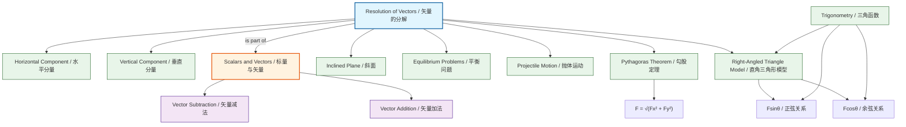

# Resolution of Vectors / 矢量的分解

---

# 1. Overview / 概述

**English:**
Resolution of vectors is the process of splitting a single vector into two perpendicular components, typically horizontal and vertical (or parallel and perpendicular to a surface). This is one of the most powerful techniques in A-Level Physics because it allows us to analyse forces, velocities, and displacements in two dimensions using simple one-dimensional equations. When a vector acts at an angle, we cannot simply add it to other vectors in different directions — we must first resolve it into components that align with our chosen coordinate axes. This sub-topic builds directly on [[Vector Quantities]] and is essential for understanding [[Projectile Motion]], [[Types of Force]], and equilibrium problems. Mastery of vector resolution is a prerequisite for nearly all mechanics topics at AS and A2 level.

**中文:**
矢量的分解是将一个矢量分解为两个互相垂直的分量的过程，通常是水平分量和垂直分量（或平行于和垂直于某个表面）。这是A-Level物理中最强大的技巧之一，因为它使我们能够使用简单的一维方程来分析二维空间中的力、速度和位移。当一个矢量以某个角度作用时，我们不能简单地将其与不同方向的其他矢量相加——我们必须首先将其分解为与所选坐标轴对齐的分量。本子知识点直接建立在[[Vector Quantities]]的基础上，对于理解[[Projectile Motion]]、[[Types of Force]]和平衡问题至关重要。掌握矢量分解是AS和A2阶段几乎所有力学主题的先决条件。

---

# 2. Syllabus Learning Objectives / 考纲学习目标

| CAIE 9702 (3.1 a-c) | Edexcel IAL (WPH11 U1: 1.1-1.3) |
|-----------|-------------|
| Understand that a vector can be resolved into two perpendicular components | Resolve a vector into two perpendicular components |
| Resolve vectors into horizontal and vertical components | Use vector resolution to solve problems involving forces and motion |
| Apply vector resolution to problems involving forces and equilibrium | Combine vector resolution with Newton's laws of motion |

**Examiner Expectations / 考官期望:**
- **English:** You must be able to draw a clear right-angled triangle showing the original vector as the hypotenuse and the components as the adjacent and opposite sides. You must correctly identify which component uses cosine and which uses sine based on the angle given. You must be able to resolve vectors in any orientation, not just horizontal/vertical.
- **中文:** 你必须能够画出一个清晰的直角三角形，以原矢量为斜边，分量为邻边和对边。你必须根据给定的角度正确判断哪个分量使用余弦、哪个使用正弦。你必须能够分解任何方向的矢量，而不仅仅是水平/垂直方向。

---

# 3. Core Definitions / 核心定义

| Term (EN/CN) | Definition (EN) | Definition (CN) | Common Mistakes / 常见错误 |
|--------------|-----------------|-----------------|---------------------------|
| **Resolution of Vectors** / 矢量的分解 | The process of splitting a single vector into two perpendicular components that together have the same effect as the original vector | 将一个矢量分解为两个互相垂直的分量，这两个分量的共同效果与原矢量相同 | Confusing resolution with addition — resolution is the reverse of addition |
| **Component** / 分量 | One of two perpendicular vectors that combine to give the original vector | 两个互相垂直的矢量之一，它们合成为原矢量 | Forgetting that components are vectors themselves, not scalars |
| **Horizontal Component** / 水平分量 | The component of a vector that acts parallel to the horizontal axis, typically $F_x = F\cos\theta$ or $F_x = F\sin\theta$ depending on angle definition | 矢量平行于水平轴的分量，通常为 $F_x = F\cos\theta$ 或 $F_x = F\sin\theta$，取决于角度的定义 | Using the wrong trigonometric function |
| **Vertical Component** / 垂直分量 | The component of a vector that acts parallel to the vertical axis, typically $F_y = F\sin\theta$ or $F_y = F\cos\theta$ | 矢量平行于垂直轴的分量，通常为 $F_y = F\sin\theta$ 或 $F_y = F\cos\theta$ | Forgetting that the vertical component is perpendicular to the horizontal |
| **Resultant Vector** / 合矢量 | The single vector that has the same effect as two or more vectors combined; the original vector before resolution | 与两个或多个矢量组合效果相同的单一矢量；分解前的原矢量 | Thinking the resultant is always larger than its components |

---

# 4. Key Concepts Explained / 关键概念详解

## 4.1 The Right-Angled Triangle Model / 直角三角形模型

### Explanation / 解释
**English:**
When we resolve a vector, we imagine it as the hypotenuse of a right-angled triangle. The two perpendicular components form the adjacent and opposite sides of this triangle. The key insight is that the original vector $F$ at angle $\theta$ to the horizontal can be replaced by $F\cos\theta$ (horizontal) and $F\sin\theta$ (vertical) — these two components, when added using [[Vector Addition and Subtraction]], give back exactly the original vector $F$.

The choice of which component uses cosine and which uses sine depends entirely on which angle you are given. If $\theta$ is measured from the horizontal:
- Horizontal component = $F\cos\theta$ (adjacent to the angle)
- Vertical component = $F\sin\theta$ (opposite to the angle)

If $\theta$ is measured from the vertical, the functions swap.

**中文:**
当我们分解一个矢量时，我们将其想象为直角三角形的斜边。两个互相垂直的分量构成这个三角形的邻边和对边。关键的理解是：与水平方向成 $\theta$ 角的原矢量 $F$ 可以用 $F\cos\theta$（水平）和 $F\sin\theta$（垂直）代替——这两个分量通过[[Vector Addition and Subtraction]]相加后，恰好得到原矢量 $F$。

哪个分量使用余弦、哪个使用正弦完全取决于给定的角度。如果 $\theta$ 是从水平方向测量的：
- 水平分量 = $F\cos\theta$（角的邻边）
- 垂直分量 = $F\sin\theta$（角的对边）

如果 $\theta$ 是从垂直方向测量的，则三角函数互换。

### Physical Meaning / 物理意义
**English:**
Resolution tells us how much of a vector's effect is in each perpendicular direction. For example, if you push a box at an angle, only the horizontal component of your force actually moves the box forward; the vertical component either lifts it (reducing friction) or presses it down (increasing friction). Understanding this is crucial for [[Types of Force]] and equilibrium analysis.

**中文:**
分解告诉我们矢量在每个垂直方向上有多少效果。例如，如果你以一个角度推一个箱子，只有你推力的水平分量实际上使箱子向前移动；垂直分量要么抬起它（减少摩擦），要么向下压它（增加摩擦）。理解这一点对于[[Types of Force]]和平衡分析至关重要。

### Common Misconceptions / 常见误区
- **English:**
  - Thinking components are smaller than the original — they can be larger if the angle is > 45° (one component can exceed the original magnitude)
  - Confusing which axis uses cosine vs sine — always check which side is adjacent to the given angle
  - Forgetting that components are vectors with direction, not just magnitudes
  - Assuming resolution only works for forces — it works for any vector quantity

- **中文:**
  - 认为分量一定比原矢量小——如果角度 > 45°，一个分量可能超过原矢量的大小
  - 混淆哪个轴使用余弦或正弦——始终检查哪条边是给定角的邻边
  - 忘记分量是有方向的矢量，而不仅仅是大小
  - 假设分解只适用于力——它适用于任何矢量量

### Exam Tips / 考试提示
- **English:** Always draw the right-angled triangle first. Label the original vector and the angle clearly. Write $F\cos\theta$ and $F\sin\theta$ next to the appropriate sides before doing any calculations. Check your answer: $F = \sqrt{F_x^2 + F_y^2}$ should give back the original magnitude.
- **中文:** 始终先画直角三角形。清楚标注原矢量和角度。在进行任何计算之前，在相应的边旁边写出 $F\cos\theta$ 和 $F\sin\theta$。检查答案：$F = \sqrt{F_x^2 + F_y^2}$ 应该得到原矢量的大小。

> 📷 **IMAGE PROMPT — VEC-RES-01: Vector Resolution Right-Angled Triangle**
> A clear diagram showing a vector F at angle θ to the horizontal, with a right-angled triangle drawn. The horizontal component Fcosθ is shown along the x-axis, the vertical component Fsinθ is shown along the y-axis. The original vector F is the hypotenuse. Labels: "F", "θ", "Fcosθ (horizontal component)", "Fsinθ (vertical component)". Clean, educational style with arrows showing vector directions.

---

## 4.2 Choosing the Coordinate System / 选择坐标系

### Explanation / 解释
**English:**
While horizontal and vertical axes are most common, you can resolve vectors along any pair of perpendicular directions. For problems involving inclined planes, it is often easier to resolve parallel and perpendicular to the slope rather than horizontally and vertically. The key principle is: choose axes that simplify your problem. For equilibrium problems, resolve along directions where you know some forces are zero or where forces balance.

**中文:**
虽然水平和垂直轴最常见，但你可以沿任何一对垂直方向分解矢量。对于涉及斜面的问题，通常更容易分解为平行于和垂直于斜面，而不是水平和垂直方向。关键原则是：选择能简化问题的坐标轴。对于平衡问题，沿你知道某些力为零或力平衡的方向进行分解。

### Common Misconceptions / 常见误区
- **English:**
  - Thinking you must always use horizontal and vertical axes
  - Not realising that the angle changes when you rotate your coordinate system

- **中文:**
  - 认为必须始终使用水平和垂直轴
  - 没有意识到旋转坐标系时角度会改变

### Exam Tips / 考试提示
- **English:** For inclined plane problems, always resolve weight ($mg$) into components parallel ($mg\sin\theta$) and perpendicular ($mg\cos\theta$) to the slope. This is a standard technique that examiners expect.
- **中文:** 对于斜面问题，始终将重力 ($mg$) 分解为平行于斜面 ($mg\sin\theta$) 和垂直于斜面 ($mg\cos\theta$) 的分量。这是考官期望的标准技巧。

> 📷 **IMAGE PROMPT — VEC-RES-02: Inclined Plane Resolution**
> A block on an inclined plane at angle θ to horizontal. Weight mg acts vertically downward. Two dashed lines show the components: mgsinθ parallel to the slope (pointing down the slope) and mgcosθ perpendicular to the slope (into the plane). The angle θ is shown both at the base of the incline and in the triangle formed by mg and its components. Clean, labelled diagram.

---

# 5. Essential Equations / 核心公式

## 5.1 Standard Resolution (Angle from Horizontal) / 标准分解（角度从水平测量）

$$ F_x = F\cos\theta $$
$$ F_y = F\sin\theta $$

| Symbol (符号) | Meaning (EN) | Meaning (CN) | Unit (单位) |
|--------------|-------------|-------------|------------|
| $F$ | Magnitude of original vector | 原矢量的大小 | N (force), m/s² (acceleration), m (displacement), m/s (velocity) |
| $F_x$ | Horizontal component | 水平分量 | Same as F |
| $F_y$ | Vertical component | 垂直分量 | Same as F |
| $\theta$ | Angle measured from horizontal | 从水平方向测量的角度 | degrees (°) or radians (rad) |

**Conditions / 适用条件:**
- **English:** The angle $\theta$ must be measured from the horizontal axis. The components are perpendicular to each other.
- **中文:** 角度 $\theta$ 必须从水平轴测量。分量互相垂直。

**Limitations / 局限性:**
- **English:** This only works for right-angled triangles. If components are not perpendicular, you must use the [[Vector Addition and Subtraction]] (parallelogram law) instead.
- **中文:** 这只适用于直角三角形。如果分量不垂直，必须使用[[Vector Addition and Subtraction]]（平行四边形法则）。

## 5.2 Inclined Plane Resolution / 斜面分解

$$ F_{\parallel} = mg\sin\theta $$
$$ F_{\perp} = mg\cos\theta $$

| Symbol (符号) | Meaning (EN) | Meaning (CN) | Unit (单位) |
|--------------|-------------|-------------|------------|
| $m$ | Mass of object | 物体的质量 | kg |
| $g$ | Acceleration due to gravity (9.81 m/s²) | 重力加速度 (9.81 m/s²) | m/s² |
| $\theta$ | Angle of incline from horizontal | 斜面与水平面的夹角 | degrees (°) |
| $F_{\parallel}$ | Component parallel to slope | 平行于斜面的分量 | N |
| $F_{\perp}$ | Component perpendicular to slope | 垂直于斜面的分量 | N |

**Derivation / 推导:**
- **English:** The weight $mg$ acts vertically downward. The angle between $mg$ and the perpendicular to the slope is $\theta$ (same as the incline angle). Using geometry, the component perpendicular to the slope is $mg\cos\theta$, and the component parallel to the slope is $mg\sin\theta$.
- **中文:** 重力 $mg$ 垂直向下作用。$mg$ 与斜面垂线之间的夹角为 $\theta$（与斜面角相同）。根据几何关系，垂直于斜面的分量为 $mg\cos\theta$，平行于斜面的分量为 $mg\sin\theta$。

**Conditions / 适用条件:**
- **English:** The incline angle $\theta$ is measured from the horizontal. The object is on a frictionless or frictional surface.
- **中文:** 斜面角 $\theta$ 从水平面测量。物体在无摩擦或有摩擦的表面上。

## 5.3 Reconstructing the Original Vector / 重构原矢量

$$ F = \sqrt{F_x^2 + F_y^2} $$
$$ \theta = \tan^{-1}\left(\frac{F_y}{F_x}\right) $$

**Conditions / 适用条件:**
- **English:** This is the inverse operation — given perpendicular components, find the original vector. Use this to check your resolution work.
- **中文:** 这是逆运算——给定垂直分量，求原矢量。用此检查分解结果。

---

# 6. Graphs and Relationships / 图表与关系

## 6.1 Component Magnitude vs Angle / 分量大小与角度的关系

### Axes / 坐标轴
- **X-axis:** Angle $\theta$ from horizontal (0° to 90°)
- **Y-axis:** Component magnitude (as fraction of F)

### Shape / 形状
- **English:** $F_x = F\cos\theta$ starts at $F$ (when $\theta = 0°$) and decreases to 0 (when $\theta = 90°$). $F_y = F\sin\theta$ starts at 0 and increases to $F$. The two curves cross at $\theta = 45°$, where both components equal $F/\sqrt{2} \approx 0.707F$.
- **中文:** $F_x = F\cos\theta$ 从 $F$ 开始（$\theta = 0°$时），减小到0（$\theta = 90°$时）。$F_y = F\sin\theta$ 从0开始，增加到 $F$。两条曲线在 $\theta = 45°$ 处相交，此时两个分量都等于 $F/\sqrt{2} \approx 0.707F$。

### Gradient Meaning / 斜率含义
- **English:** The gradient of $F_x$ vs $\theta$ is $-F\sin\theta$, which shows how quickly the horizontal component decreases as the angle increases. The gradient is steepest near $\theta = 0°$.
- **中文:** $F_x$ 对 $\theta$ 的斜率为 $-F\sin\theta$，表示水平分量随角度增加而减小的速率。斜率在 $\theta = 0°$ 附近最陡。

### Area Meaning / 面积含义
- **English:** Not typically used for this graph.
- **中文:** 此图通常不使用面积含义。

### Exam Interpretation / 考试解读
- **English:** You may be asked to sketch these curves or interpret them. Remember that at 45°, both components are equal. At small angles, most of the vector is in the horizontal direction; at large angles, most is vertical.
- **中文:** 你可能会被要求画出这些曲线或解释它们。记住在45°时，两个分量相等。在小角度时，矢量的大部分在水平方向；在大角度时，大部分在垂直方向。

> 📷 **IMAGE PROMPT — VEC-RES-03: Component Magnitude vs Angle Graph**
> A graph with θ from 0° to 90° on x-axis, component magnitude (0 to F) on y-axis. Two curves: Fcosθ (decreasing from F to 0) and Fsinθ (increasing from 0 to F). Both curves cross at θ=45° with value F/√2. Labels: "Horizontal component Fcosθ", "Vertical component Fsinθ". Clean, educational style.

---

# 7. Required Diagrams / 必备图表

## 7.1 Standard Vector Resolution Diagram / 标准矢量分解图

### Description / 描述
**English:** A vector F at angle θ to the horizontal, shown as the hypotenuse of a right-angled triangle. The horizontal component Fcosθ extends along the x-axis, and the vertical component Fsinθ extends along the y-axis. Arrowheads show direction. The angle θ is clearly marked at the tail of the vector.

**中文:** 一个与水平方向成 θ 角的矢量 F，显示为直角三角形的斜边。水平分量 Fcosθ 沿 x 轴延伸，垂直分量 Fsinθ 沿 y 轴延伸。箭头显示方向。角度 θ 在矢量的尾部清晰标出。

### Image Prompt / 图片生成提示
> 📷 **IMAGE PROMPT — VEC-RES-04: Standard Resolution Diagram**
> A vector F at 30° to the horizontal, drawn as a thick arrow. A right-angled triangle is formed with dashed lines: horizontal component Fcos30° along x-axis, vertical component Fsin30° along y-axis. Angle θ=30° marked at origin. Labels: "F", "θ=30°", "Fx = Fcosθ", "Fy = Fsinθ". Clean white background, educational style, vector arrows in blue, components in red and green.

### Labels Required / 需要标注
- Original vector F with arrowhead
- Angle θ from horizontal
- Horizontal component Fcosθ (with arrowhead)
- Vertical component Fsinθ (with arrowhead)
- Right angle symbol (90°)

### Exam Importance / 考试重要性
- **English:** This is the most fundamental diagram in vector resolution. You will need to draw it (or a similar one) in almost every mechanics exam question involving forces at angles.
- **中文:** 这是矢量分解中最基本的图。在几乎所有涉及角度力的力学考试题中，你都需要画出它（或类似的图）。

## 7.2 Inclined Plane Resolution Diagram / 斜面分解图

### Description / 描述
**English:** A block on an inclined plane at angle θ. The weight mg acts vertically downward. Two components are shown: mgsinθ parallel to the slope (downwards) and mgcosθ perpendicular to the slope (into the plane). The angle θ is shown both at the base of the incline and in the triangle formed by mg and its components.

**中文:** 一个在倾角为 θ 的斜面上的物块。重力 mg 垂直向下作用。显示两个分量：mgsinθ 平行于斜面（向下）和 mgcosθ 垂直于斜面（进入斜面）。角度 θ 在斜面底部和由 mg 及其分量形成的三角形中都显示出来。

### Image Prompt / 图片生成提示
> 📷 **IMAGE PROMPT — VEC-RES-05: Inclined Plane Resolution**
> A block on a 30° inclined plane. Weight mg acts vertically downward from the block's centre. Two dashed arrows show components: mgsin30° parallel to slope pointing down-left, mgcos30° perpendicular to slope pointing into the plane. The angle 30° is marked at the base of the incline and also in the small triangle near the block. Labels: "m", "mg", "mgsinθ", "mgcosθ", "θ=30°". Clean educational style.

### Labels Required / 需要标注
- Block (mass m)
- Incline angle θ
- Weight mg (vertical downward)
- Component parallel to slope mgsinθ
- Component perpendicular to slope mgcosθ
- Right angle symbol

### Exam Importance / 考试重要性
- **English:** This diagram appears in nearly every inclined plane question. You must be able to draw it and correctly identify which component is parallel and which is perpendicular.
- **中文:** 这个图出现在几乎每个斜面问题中。你必须能够画出它并正确识别哪个分量是平行的、哪个是垂直的。

---

# 8. Worked Examples / 典型例题

## Example 1: Resolving a Force / 例题1：分解一个力

### Question / 题目
**English:**
A force of 50 N acts at an angle of 40° to the horizontal. Calculate:
(a) The horizontal component of the force
(b) The vertical component of the force
(c) Verify your answer by reconstructing the original vector

**中文:**
一个50 N的力与水平方向成40°角。计算：
(a) 力的水平分量
(b) 力的垂直分量
(c) 通过重构原矢量验证你的答案

### Solution / 解答

**Step 1: Identify the angle and choose the correct trigonometric functions**
**步骤1：确定角度并选择正确的三角函数**

The angle is measured from the horizontal, so:
- Horizontal component: $F_x = F\cos\theta$
- Vertical component: $F_y = F\sin\theta$

**Step 2: Calculate the horizontal component**
**步骤2：计算水平分量**

$$ F_x = 50 \times \cos(40°) = 50 \times 0.7660 = 38.3 \text{ N} $$

**Step 3: Calculate the vertical component**
**步骤3：计算垂直分量**

$$ F_y = 50 \times \sin(40°) = 50 \times 0.6428 = 32.1 \text{ N} $$

**Step 4: Verify by reconstructing the original vector**
**步骤4：通过重构原矢量验证**

$$ F = \sqrt{F_x^2 + F_y^2} = \sqrt{38.3^2 + 32.1^2} = \sqrt{1467 + 1030} = \sqrt{2497} = 50.0 \text{ N} $$

$$ \theta = \tan^{-1}\left(\frac{F_y}{F_x}\right) = \tan^{-1}\left(\frac{32.1}{38.3}\right) = \tan^{-1}(0.838) = 40.0° $$

The reconstructed vector matches the original, confirming our resolution is correct.

重构的矢量与原矢量匹配，确认我们的分解是正确的。

### Final Answer / 最终答案
**Answer:** (a) 38.3 N horizontal | (b) 32.1 N vertical | **答案：** (a) 水平分量38.3 N | (b) 垂直分量32.1 N

### Quick Tip / 提示
- **English:** Always verify using $F = \sqrt{F_x^2 + F_y^2}$. If this doesn't give back the original magnitude, check your trigonometric functions.
- **中文:** 始终使用 $F = \sqrt{F_x^2 + F_y^2}$ 进行验证。如果得不到原矢量的大小，检查你的三角函数。

---

## Example 2: Inclined Plane / 例题2：斜面

### Question / 题目
**English:**
A block of mass 2.0 kg rests on a frictionless inclined plane at 25° to the horizontal. Calculate:
(a) The component of weight parallel to the slope
(b) The component of weight perpendicular to the slope
(c) The acceleration of the block down the slope

**中文:**
一个质量为2.0 kg的物块静止在倾角为25°的无摩擦斜面上。计算：
(a) 重力平行于斜面的分量
(b) 重力垂直于斜面的分量
(c) 物块沿斜面下滑的加速度

### Solution / 解答

**Step 1: Calculate the weight**
**步骤1：计算重力**

$$ W = mg = 2.0 \times 9.81 = 19.62 \text{ N} $$

**Step 2: Resolve weight into components**
**步骤2：将重力分解为分量**

Parallel to slope: $F_{\parallel} = mg\sin\theta = 19.62 \times \sin(25°) = 19.62 \times 0.4226 = 8.29 \text{ N}$

Perpendicular to slope: $F_{\perp} = mg\cos\theta = 19.62 \times \cos(25°) = 19.62 \times 0.9063 = 17.78 \text{ N}$

**Step 3: Calculate acceleration**
**步骤3：计算加速度**

On a frictionless slope, the only force causing acceleration is the component parallel to the slope:

$$ F_{\parallel} = ma $$
$$ a = \frac{F_{\parallel}}{m} = \frac{8.29}{2.0} = 4.15 \text{ m/s}^2 $$

Note: $a = g\sin\theta = 9.81 \times \sin(25°) = 4.15 \text{ m/s}^2$ — a useful shortcut!

注意：$a = g\sin\theta = 9.81 \times \sin(25°) = 4.15 \text{ m/s}^2$ — 一个有用的快捷方式！

### Final Answer / 最终答案
**Answer:** (a) 8.29 N parallel to slope | (b) 17.78 N perpendicular to slope | (c) 4.15 m/s² down the slope
**答案：** (a) 平行于斜面8.29 N | (b) 垂直于斜面17.78 N | (c) 沿斜面下滑4.15 m/s²

### Quick Tip / 提示
- **English:** For frictionless inclined planes, the acceleration is always $a = g\sin\theta$, independent of mass. This is a common exam shortcut.
- **中文:** 对于无摩擦斜面，加速度始终为 $a = g\sin\theta$，与质量无关。这是一个常见的考试快捷方式。

---

# 9. Past Paper Question Types / 历年真题题型

| Question Type / 题型 | Frequency / 频率 | Difficulty / 难度 | Past Paper References / 真题索引 |
|----------------------|------------------|------------------|-------------------------------|
| Resolve a single force into components | Very High | Easy | 📝 *待填入* |
| Inclined plane with weight resolution | Very High | Medium | 📝 *待填入* |
| Equilibrium with forces at angles | High | Medium-Hard | 📝 *待填入* |
| Projectile motion initial velocity resolution | High | Medium | 📝 *待填入* |
| Verify resolution using Pythagoras | Medium | Easy | 📝 *待填入* |

**Common Command Words / 常见指令词:**
- **English:** "Resolve", "Calculate the components", "Find the horizontal/vertical component", "Determine the acceleration down the slope"
- **中文:** "分解"，"计算分量"，"求水平/垂直分量"，"求沿斜面下滑的加速度"

---

# 10. Practical Skills Connections / 实验技能链接

**English:**
Vector resolution connects to practical work in several ways:

1. **Force Table Experiment:** You may use a force table with pulleys and weights to verify that a force at an angle can be balanced by two perpendicular forces equal to its components. This directly tests the resolution principle.

2. **Inclined Plane Experiments:** When measuring acceleration down an incline, you must resolve weight into components to predict the theoretical acceleration ($a = g\sin\theta$). Comparing this with measured acceleration (using light gates or ticker timers) allows you to investigate friction.

3. **Uncertainty in Resolution:** When a vector is at angle $\theta \pm \Delta\theta$, the uncertainty in its components is:
   - $\Delta F_x = F\sin\theta \cdot \Delta\theta$ (in radians)
   - $\Delta F_y = F\cos\theta \cdot \Delta\theta$ (in radians)
   This is important for error analysis in practical papers.

4. **Graph Plotting:** You may plot acceleration vs $\sin\theta$ for an inclined plane. The gradient should be $g$ (9.81 m/s²) for a frictionless surface. Deviation indicates friction.

**中文:**
矢量分解在多个方面与实验工作相关：

1. **力桌实验：** 你可以使用带有滑轮和砝码的力桌来验证一个成角度的力可以被两个等于其分量的垂直力平衡。这直接检验了分解原理。

2. **斜面实验：** 当测量沿斜面下滑的加速度时，你必须将重力分解为分量以预测理论加速度（$a = g\sin\theta$）。将其与测量加速度（使用光门或打点计时器）比较，可以研究摩擦力。

3. **分解中的不确定度：** 当矢量角度为 $\theta \pm \Delta\theta$ 时，其分量的不确定度为：
   - $\Delta F_x = F\sin\theta \cdot \Delta\theta$（弧度）
   - $\Delta F_y = F\cos\theta \cdot \Delta\theta$（弧度）
   这对于实验卷中的误差分析很重要。

4. **图表绘制：** 你可能会绘制加速度与 $\sin\theta$ 的关系图（斜面实验）。对于无摩擦表面，斜率应为 $g$（9.81 m/s²）。偏差表示存在摩擦力。

---

# 11. Concept Map / 概念图谱

---

# 12. Quick Revision Sheet / 速查表

| Category / 类别 | Key Points / 要点 |
|----------------|------------------|
| **Definition / 定义** | Splitting a vector into two perpendicular components / 将一个矢量分解为两个垂直分量 |
| **Key Formula / 核心公式** | $F_x = F\cos\theta$, $F_y = F\sin\theta$ (angle from horizontal) / $F_{\parallel} = mg\sin\theta$, $F_{\perp} = mg\cos\theta$ (inclined plane) |
| **Key Graph / 核心图表** | Component magnitude vs angle: cosine decreases from F to 0, sine increases from 0 to F, cross at 45° / 分量大小与角度关系：余弦从F减到0，正弦从0增到F，在45°相交 |
| **Verification / 验证** | $F = \sqrt{F_x^2 + F_y^2}$ must give original magnitude / 必须得到原矢量大小 |
| **Common Mistake / 常见错误** | Using wrong trig function — check which side is adjacent to the angle / 使用错误的三角函数——检查哪条边是角的邻边 |
| **Exam Tip / 考试提示** | Always draw the right-angled triangle first / 始终先画直角三角形 |
| **Inclined Plane Shortcut / 斜面快捷方式** | $a = g\sin\theta$ for frictionless slope / 无摩擦斜面加速度 $a = g\sin\theta$ |
| **Practical Link / 实验联系** | Force table verification, inclined plane acceleration experiments / 力桌验证，斜面加速度实验 |