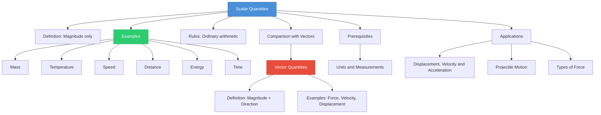

# 1. Overview / 概述

**English:**
This leaf node introduces **Scalar Quantities** — physical quantities that have **magnitude only** and no direction. Scalars form the foundation of all physical measurements and are the simpler counterpart to [[Vector Quantities]]. Understanding scalars is essential because many fundamental physical quantities (mass, temperature, energy, time) are scalars, and they obey ordinary arithmetic rules. This sub-topic establishes the critical distinction between scalars and vectors, which is tested throughout AS and A2 Physics, particularly in [[Displacement, Velocity and Acceleration]] and [[Types of Force]].

**中文:**
本子知识点介绍**标量**——只有**大小**而没有方向的物理量。标量是所有物理测量的基础，也是[[Vector Quantities|矢量]]的简单对应概念。理解标量至关重要，因为许多基本物理量（质量、温度、能量、时间）都是标量，它们遵循普通算术规则。本子知识点建立了标量与矢量之间的关键区别，这一区别在AS和A2物理中都会考到，特别是在[[Displacement, Velocity and Acceleration|位移、速度和加速度]]和[[Types of Force|力的类型]]中。

---

# 2. Syllabus Learning Objectives / 考纲学习目标

| CAIE 9702 | Edexcel IAL |
|-----------|-------------|
| 3.1(a) Distinguish between scalar and vector quantities | 1.1 Know the difference between scalar and vector quantities |
| 3.1(b) Give examples of scalar and vector quantities | 1.2 Give examples of scalar and vector quantities |
| 3.1(c) Add and subtract coplanar vectors | 1.3 Understand that scalar quantities have magnitude only |

**Examiner Expectations / 考官期望:**
- **English:** You must be able to define a scalar quantity precisely, list common examples, and explain why certain quantities (e.g., speed vs velocity) are scalars. You should also understand that scalars obey ordinary arithmetic (e.g., 5 kg + 3 kg = 8 kg).
- **中文:** 你必须能够精确定义标量，列出常见例子，并解释为什么某些量（如速率 vs 速度）是标量。你还应该理解标量遵循普通算术（例如，5 kg + 3 kg = 8 kg）。

---

# 3. Core Definitions / 核心定义

| Term (EN/CN) | Definition (EN) | Definition (CN) | Common Mistakes / 常见错误 |
|--------------|-----------------|-----------------|---------------------------|
| **Scalar Quantity** / 标量 | A physical quantity that has **magnitude only** and no direction | 只有**大小**而没有方向的物理量 | ❌ Saying "scalars have no sign" — scalars can be negative (e.g., temperature -5°C) |
| **Magnitude** / 大小 | The numerical value or size of a quantity, including its unit | 物理量的数值大小，包括其单位 | ❌ Confusing magnitude with "positive value" — magnitude is always positive, but the quantity itself can be negative |
| **Speed** / 速率 | The rate of change of distance; a scalar quantity | 距离的变化率；标量 | ❌ Using "speed" when direction matters — speed is scalar, [[Vector Quantities\|velocity]] is vector |
| **Distance** / 距离 | The total path length traveled; a scalar quantity | 物体运动路径的总长度；标量 | ❌ Confusing with [[Vector Quantities\|displacement]] — distance has no direction |
| **Mass** / 质量 | The amount of matter in an object; a scalar quantity | 物体所含物质的多少；标量 | ❌ Confusing with weight — mass is scalar, weight is a [[Types of Force\|force]] (vector) |

---

# 4. Key Concepts Explained / 关键概念详解

## 4.1 What Makes a Quantity Scalar? / 什么使一个量成为标量？

### Explanation / 解释
**English:**
A scalar quantity is defined solely by its **magnitude** — a number and a unit. Unlike [[Vector Quantities]], scalars do not require a direction to be fully described. For example, saying "the temperature is 25°C" is complete information; you don't need to say "25°C north". Scalars obey ordinary arithmetic rules: you can add, subtract, multiply, and divide them using standard algebra. For instance, if you have 3 kg of apples and 2 kg of oranges, the total mass is simply 3 kg + 2 kg = 5 kg.

**中文:**
标量仅由其**大小**（一个数值和一个单位）来定义。与[[Vector Quantities|矢量]]不同，标量不需要方向就能完整描述。例如，说"温度是25°C"就是完整的信息；你不需要说"25°C向北"。标量遵循普通算术规则：你可以使用标准代数对它们进行加、减、乘、除。例如，如果你有3公斤苹果和2公斤橙子，总质量就是3 kg + 2 kg = 5 kg。

### Physical Meaning / 物理意义
**English:**
Scalars represent quantities that are **independent of orientation in space**. They describe "how much" of something exists, not "which way" it goes. This makes scalars simpler to work with mathematically but also means they cannot fully describe phenomena involving direction (like motion or forces).

**中文:**
标量表示**与空间方向无关**的量。它们描述某物"有多少"，而不是"往哪个方向"。这使得标量在数学上更容易处理，但也意味着它们无法完整描述涉及方向的现象（如运动或力）。

### Common Misconceptions / 常见误区
- ❌ **"Scalars are always positive"** — Scalars can be negative (e.g., temperature -10°C, electric charge -3 μC). The magnitude is always positive, but the quantity itself can have a sign.
- ❌ **"Scalars have no sign"** — Many scalars do have signs (e.g., energy change, potential difference). The key is they have no direction, not no sign.
- ❌ **"All numbers are scalars"** — Numbers alone are not physical quantities. A scalar must have a unit and represent a physical property.

### Exam Tips / 考试提示
- ✅ **English:** When asked "Is X a scalar or vector?", always justify your answer: "X is a scalar because it has magnitude only and no direction."
- ✅ **中文:** 当被问到"X是标量还是矢量"时，一定要证明你的答案："X是标量，因为它只有大小，没有方向。"

> 📷 **IMAGE PROMPT — SCALAR-01: Scalar vs Vector Comparison**
> A clean, educational diagram showing two columns. Left column: "Scalar Quantities" with examples (Mass: 5 kg, Temperature: 25°C, Speed: 10 m/s, Energy: 100 J) — each shown as a simple number with unit and no arrow. Right column: "Vector Quantities" with examples (Force: 10 N →, Velocity: 20 m/s ↑, Displacement: 50 m →) — each shown with an arrow indicating direction. Use bright colors: blue for scalars, red for vectors. Suitable for A-Level physics textbook.

---

## 4.2 Common Scalar Quantities in A-Level Physics / A-Level物理中的常见标量

### Explanation / 解释
**English:**
The following are key scalar quantities you must know for both CAIE and Edexcel exams:

| Scalar Quantity | Symbol | SI Unit | Notes |
|----------------|--------|---------|-------|
| Mass | $m$ | kg | Amount of matter |
| Time | $t$ | s | Duration of events |
| Temperature | $T$ | K or °C | Measure of thermal energy |
| Energy | $E$ | J | Capacity to do work |
| Power | $P$ | W | Rate of energy transfer |
| Speed | $v$ | m/s | Rate of change of distance |
| Distance | $s$ | m | Total path length |
| Density | $\rho$ | kg/m³ | Mass per unit volume |
| Pressure | $p$ | Pa | Force per unit area |
| Electric Charge | $Q$ | C | Amount of electricity |
| Potential Difference | $V$ | V | Energy per unit charge |
| Resistance | $R$ | $\Omega$ | Opposition to current |

**中文:**
以下是CAIE和Edexcel考试中你必须知道的关键标量：

| 标量 | 符号 | SI单位 | 说明 |
|------|------|--------|------|
| 质量 | $m$ | kg | 物质的量 |
| 时间 | $t$ | s | 事件的持续时间 |
| 温度 | $T$ | K 或 °C | 热能的度量 |
| 能量 | $E$ | J | 做功的能力 |
| 功率 | $P$ | W | 能量传递的速率 |
| 速率 | $v$ | m/s | 距离的变化率 |
| 距离 | $s$ | m | 总路径长度 |
| 密度 | $\rho$ | kg/m³ | 单位体积的质量 |
| 压强 | $p$ | Pa | 单位面积的力 |
| 电荷 | $Q$ | C | 电量 |
| 电势差 | $V$ | V | 单位电荷的能量 |
| 电阻 | $R$ | $\Omega$ | 对电流的阻碍 |

### Exam Tips / 考试提示
- ✅ **English:** Memorize at least 5 scalar and 5 vector examples. Common exam questions ask: "Which of the following is a scalar quantity?" or "State whether X is a scalar or vector."
- ✅ **中文:** 至少记住5个标量和5个矢量的例子。常见考题问："以下哪个是标量？"或"说明X是标量还是矢量。"

> 📋 **Edexcel Only:** Edexcel often tests the distinction between speed (scalar) and velocity (vector) in the context of [[Displacement, Velocity and Acceleration]]. Be prepared to explain why speed is scalar even though it has the same units as velocity.

> 📋 **CIE Only:** CIE 9702 Paper 1 (MCQ) frequently includes questions where you must identify which quantity is scalar from a list that includes both scalars and vectors.

---

# 5. Essential Equations / 核心公式

Since scalars obey ordinary arithmetic, there are no special "scalar equations" — but the key relationship is:

$$ \text{Scalar Quantity} = \text{Magnitude} \times \text{Unit} $$

| Symbol (符号) | Meaning (EN) | Meaning (CN) | Unit (单位) |
|--------------|-------------|-------------|------------|
| Magnitude | Numerical value | 数值 | dimensionless |
| Unit | Standard SI unit | 标准SI单位 | varies |

**Derivation / 推导:** Not applicable — this is a definition, not a derived equation.

**Conditions / 适用条件:** All scalar quantities must have a unit to be physically meaningful. A number alone (e.g., "5") is not a scalar quantity.

**Limitations / 局限性:** Scalars cannot describe direction-dependent phenomena. For example, speed (scalar) cannot tell you where an object is going — you need [[Vector Quantities|velocity]] for that.

---

# 6. Graphs and Relationships / 图表与关系

## 6.1 Scalar Addition on a Number Line / 数轴上的标量加法

### Axes / 坐标轴
- **X-axis:** Quantity value (数值)
- **Y-axis:** Not applicable — scalars are added on a single line

### Shape / 形状
**English:** Scalars are added along a single number line. For example, 3 kg + 5 kg = 8 kg is shown as a point at 8 on the number line.

**中文:** 标量在单一数轴上相加。例如，3 kg + 5 kg = 8 kg 在数轴上显示为8处的点。

### Gradient Meaning / 斜率含义
Not applicable — scalars do not have direction, so gradient is not relevant for scalar addition.

### Area Meaning / 面积含义
Not applicable for basic scalar addition.

### Exam Interpretation / 考试解读
**English:** In exams, you may be asked to add scalar quantities (e.g., total mass, total energy). Always check that the units are the same before adding.

**中文:** 在考试中，你可能会被要求相加标量（如总质量、总能量）。相加前一定要检查单位是否相同。

---

# 7. Required Diagrams / 必备图表

## 7.1 Scalar vs Vector Comparison Diagram / 标量与矢量对比图

### Description / 描述
**English:** A side-by-side comparison showing how scalars (mass, temperature, speed) are represented by a number and unit only, while vectors (force, velocity, displacement) require both magnitude and direction (shown by arrows).

**中文:** 并排对比图，显示标量（质量、温度、速率）仅由数值和单位表示，而矢量（力、速度、位移）需要大小和方向（用箭头表示）。

### Image Prompt / 图片生成提示
> 📷 **IMAGE PROMPT — SCALAR-02: Scalar Quantities Examples**
> A clean, modern educational infographic titled "Scalar Quantities" with 6 examples arranged in a grid. Each example shows: (1) Mass: a 5 kg weight on a scale, (2) Temperature: a thermometer showing 25°C, (3) Speed: a car speedometer showing 60 km/h, (4) Energy: a battery labeled 100 J, (5) Time: a stopwatch showing 10 s, (6) Distance: a measuring tape showing 2 m. Each example has a blue background with white text showing the quantity name, symbol, and value. No arrows or direction indicators anywhere. Suitable for A-Level physics textbook, 16:9 aspect ratio.

### Labels Required / 需要标注
- **English:** Quantity name, symbol, magnitude, unit
- **中文:** 量名称、符号、大小、单位

### Exam Importance / 考试重要性
**English:** High — this diagram helps you visually distinguish scalars from vectors, which is tested in every exam paper.

**中文:** 高——此图帮助你直观区分标量和矢量，这在每份试卷中都会考到。

---

# 8. Worked Examples / 典型例题

## Example 1: Identifying Scalars / 识别标量

### Question / 题目
**English:**
Which of the following quantities are scalars? Explain your answer for each.
(a) Velocity of 15 m/s east
(b) Temperature of 30°C
(c) Force of 20 N downward
(d) Mass of 5 kg
(e) Acceleration of 9.8 m/s² downward

**中文:**
以下哪些量是标量？请对每个量进行解释。
(a) 15 m/s 向东的速度
(b) 30°C 的温度
(c) 20 N 向下的力
(d) 5 kg 的质量
(e) 9.8 m/s² 向下的加速度

### Solution / 解答

**Step 1:** Recall the definition — a scalar has magnitude only, no direction.

**Step 2:** Check each quantity:

**(a) Velocity of 15 m/s east**
- Has magnitude (15 m/s) AND direction (east) → **Vector**
- 有大小(15 m/s)和方向(向东) → **矢量**

**(b) Temperature of 30°C**
- Has magnitude (30°C) only, no direction → **Scalar**
- 只有大小(30°C)，没有方向 → **标量**

**(c) Force of 20 N downward**
- Has magnitude (20 N) AND direction (downward) → **Vector**
- 有大小(20 N)和方向(向下) → **矢量**

**(d) Mass of 5 kg**
- Has magnitude (5 kg) only, no direction → **Scalar**
- 只有大小(5 kg)，没有方向 → **标量**

**(e) Acceleration of 9.8 m/s² downward**
- Has magnitude (9.8 m/s²) AND direction (downward) → **Vector**
- 有大小(9.8 m/s²)和方向(向下) → **矢量**

### Final Answer / 最终答案
**Answer:** Scalars are (b) temperature and (d) mass. | **答案：** 标量是(b)温度和(d)质量。

### Quick Tip / 提示
**English:** If a quantity has a direction word (east, north, upward, downward, left, right), it is almost certainly a vector. If it only has a number and unit, it is a scalar.

**中文:** 如果一个量有方向词（东、北、向上、向下、左、右），它几乎肯定是矢量。如果只有数值和单位，就是标量。

---

## Example 2: Adding Scalar Quantities / 标量相加

### Question / 题目
**English:**
A student walks 3 km north, then 4 km east. Calculate:
(a) The total distance traveled (scalar)
(b) The displacement (vector)

**中文:**
一个学生先向北走3公里，再向东走4公里。计算：
(a) 总路程（标量）
(b) 位移（矢量）

### Solution / 解答

**Part (a): Total distance (scalar)**
- Distance is scalar — just add the magnitudes: $3 \text{ km} + 4 \text{ km} = 7 \text{ km}$
- 路程是标量——只需相加大小：$3 \text{ km} + 4 \text{ km} = 7 \text{ km}$

**Part (b): Displacement (vector)**
- Displacement is a vector — use [[Vector Addition and Subtraction|vector addition]] (Pythagoras):
- 位移是矢量——使用矢量加法（勾股定理）：
$$ \text{Displacement} = \sqrt{3^2 + 4^2} = \sqrt{9 + 16} = \sqrt{25} = 5 \text{ km} $$
- Direction: $\theta = \tan^{-1}\left(\frac{4}{3}\right) = 53.1^\circ$ east of north
- 方向：北偏东 $53.1^\circ$

### Final Answer / 最终答案
**Answer:** (a) Distance = 7 km (scalar) | (b) Displacement = 5 km at 53.1° east of north (vector)
**答案：** (a) 路程 = 7 km（标量）| (b) 位移 = 5 km，北偏东53.1°（矢量）

### Quick Tip / 提示
**English:** This example shows why scalars and vectors are different — distance (scalar) is 7 km, but displacement (vector) is only 5 km. The scalar sum is larger because it ignores direction.

**中文:** 这个例子说明了标量和矢量的区别——路程（标量）是7 km，但位移（矢量）只有5 km。标量总和更大，因为它忽略了方向。

---

# 9. Past Paper Question Types / 历年真题题型

| Question Type / 题型 | Frequency / 频率 | Difficulty / 难度 | Past Paper References / 真题索引 |
|----------------------|------------------|------------------|-------------------------------|
| Identify scalar vs vector from a list | Very High (every paper) | Easy | 📝 *待填入* |
| Explain why a quantity is scalar | High | Easy | 📝 *待填入* |
| Calculate total scalar quantity (e.g., distance) | Medium | Easy | 📝 *待填入* |
| Distinguish between speed and velocity | High | Easy-Medium | 📝 *待填入* |

**Common Command Words / 常见指令词:**
- **State / 说明** — Give a brief answer without explanation (e.g., "State whether X is a scalar or vector")
- **Explain / 解释** — Give reasons for your answer (e.g., "Explain why speed is a scalar quantity")
- **Distinguish / 区分** — Describe the differences between two quantities (e.g., "Distinguish between distance and displacement")
- **Calculate / 计算** — Use arithmetic to find a scalar quantity (e.g., "Calculate the total distance traveled")

---

# 10. Practical Skills Connections / 实验技能链接

**English:**
Scalar quantities are fundamental to all practical work in physics. Key connections include:

1. **Measurements:** All direct measurements (mass, time, temperature, length) produce scalar data. You must record these with appropriate units and uncertainties.
2. **Graph Plotting:** When plotting scalar quantities (e.g., temperature vs time), you use standard Cartesian coordinates — no direction is involved.
3. **Uncertainties:** Scalar quantities follow standard uncertainty propagation rules (e.g., adding absolute uncertainties when adding scalars).
4. **Experimental Design:** When designing experiments, identify which quantities are scalars (easier to measure) and which are vectors (may require direction measurement).

**中文:**
标量是所有物理实验的基础。关键联系包括：

1. **测量：** 所有直接测量（质量、时间、温度、长度）产生标量数据。你必须记录这些数据并附上适当的单位和不确定度。
2. **绘图：** 绘制标量（如温度 vs 时间）时，使用标准笛卡尔坐标系——不涉及方向。
3. **不确定度：** 标量遵循标准不确定度传播规则（例如，标量相加时，绝对不确定度相加）。
4. **实验设计：** 设计实验时，识别哪些量是标量（更容易测量），哪些是矢量（可能需要方向测量）。

---

# 11. Concept Map / 概念图谱

---

# 12. Quick Revision Sheet / 速查表

| Category / 类别 | Key Points / 要点 |
|----------------|------------------|
| **Definition / 定义** | A scalar has **magnitude only**, no direction. / 标量只有**大小**，没有方向。 |
| **Key Formula / 核心公式** | Scalar = Magnitude × Unit / 标量 = 大小 × 单位 |
| **Key Examples / 核心例子** | Mass, Temperature, Speed, Distance, Energy, Time, Power, Density, Pressure, Charge / 质量、温度、速率、距离、能量、时间、功率、密度、压强、电荷 |
| **Key Graph / 核心图表** | Number line addition — scalars add like ordinary numbers / 数轴加法——标量像普通数字一样相加 |
| **Common Mistake / 常见错误** | ❌ Thinking scalars are always positive (they can be negative) / 认为标量总是正的（它们可以是负的） |
| **Exam Tip / 考试提示** | If a quantity has a direction word (east, north, up, down), it's a vector. If only number + unit, it's a scalar. / 如果一个量有方向词（东、北、上、下），它是矢量。如果只有数值+单位，它是标量。 |
| **Related Topics / 相关主题** | [[Vector Quantities]], [[Vector Addition and Subtraction]], [[Resolution of Vectors]], [[Displacement, Velocity and Acceleration]] |