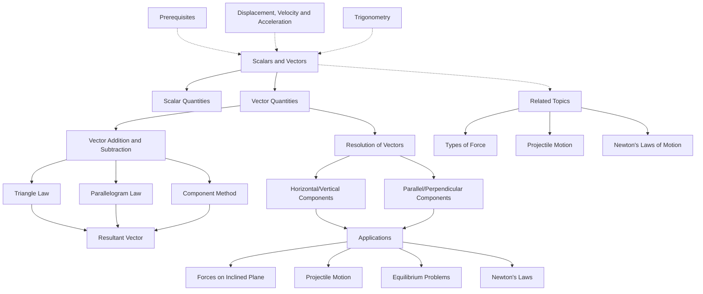

# 1. Overview / 概述

**English:** This topic introduces the fundamental distinction between [[Scalar Quantities]] and [[Vector Quantities]] in physics. Scalars have magnitude only (e.g., [[Speed]], [[Mass]], [[Energy]]), while vectors have both magnitude and direction (e.g., [[Displacement]], [[Velocity]], [[Force]]). Understanding this distinction is crucial because vector addition and subtraction follow different rules from scalar arithmetic. This topic also covers [[Vector Addition and Subtraction]] using graphical methods (triangle/parallelogram law) and analytical methods (component resolution), as well as [[Resolution of Vectors]] into perpendicular components. This is foundational for all mechanics topics including [[Projectile Motion]], [[Types of Force]], and [[Newton's Laws of Motion]]. In both CAIE 9702 and Edexcel IAL, this is a core prerequisite for Paper 1 (multiple choice) and Paper 2 (structured questions), and is tested in practical contexts in Paper 3/5 and Unit 3/6.

**中文:** 本主题介绍物理学中[[标量]]与[[矢量]]的基本区别。标量只有大小（例如[[速率]]、[[质量]]、[[能量]]），而矢量既有大小又有方向（例如[[位移]]、[[速度]]、[[力]]）。理解这一区别至关重要，因为矢量的加法和减法遵循与标量算术不同的规则。本主题还涵盖使用图形方法（三角形/平行四边形法则）和解析方法（分量分解）进行的[[矢量加法与减法]]，以及将矢量[[矢量分解]]为垂直分量。这是所有力学主题的基础，包括[[抛体运动]]、[[力的类型]]和[[牛顿运动定律]]。在CAIE 9702和Edexcel IAL中，这是Paper 1（选择题）和Paper 2（结构化问题）的核心先决条件，并在Paper 3/5和Unit 3/6的实践背景中进行测试。

# 2. Syllabus Learning Objectives / 考纲学习目标

| CAIE 9702 | Edexcel IAL |
|-----------|-------------|
| 3.1(a) Distinguish between scalar and vector quantities and give examples of each | 1.1 Understand the difference between scalar and vector quantities |
| 3.1(b) Add and subtract coplanar vectors using graphical methods (triangle and parallelogram laws) | 1.2 Add and subtract vectors using graphical methods |
| 3.1(c) Resolve a vector into two perpendicular components | 1.3 Resolve vectors into perpendicular components |

**Examiner Expectations / 考官期望:**
- **English:** Candidates must be able to: (1) correctly classify quantities as scalar or vector; (2) draw accurate vector diagrams to scale; (3) use the parallelogram law and triangle law for vector addition; (4) resolve vectors into perpendicular components using trigonometry; (5) calculate the magnitude and direction of a resultant vector; (6) apply vector resolution to equilibrium problems and motion problems.
- **中文:** 考生必须能够：(1) 正确将物理量分类为标量或矢量；(2) 按比例绘制准确的矢量图；(3) 使用平行四边形法则和三角形法则进行矢量加法；(4) 使用三角学将矢量分解为垂直分量；(5) 计算合矢量的大小和方向；(6) 将矢量分解应用于平衡问题和运动问题。

> 📋 **CIE Only:** CAIE specifically requires knowledge of the triangle law and parallelogram law for vector addition. Questions often involve forces in equilibrium (Paper 2 structured questions).
> 📋 **Edexcel Only:** Edexcel emphasizes practical applications, including resolving forces on inclined planes and using vector diagrams in mechanics contexts.

# 3. Core Definitions / 核心定义

| Term (EN/CN) | Definition (EN) | Definition (CN) | Common Mistakes / 常见错误 |
|--------------|-----------------|-----------------|---------------------------|
| [[Scalar Quantities]] / 标量 | A physical quantity that has magnitude only, with no direction | 只有大小、没有方向的物理量 | Confusing speed (scalar) with velocity (vector) |
| [[Vector Quantities]] / 矢量 | A physical quantity that has both magnitude and direction | 既有大小又有方向的物理量 | Forgetting to specify direction when stating a vector quantity |
| [[Magnitude]] / 大小 | The size or numerical value of a vector, always positive | 矢量的大小或数值，始终为正 | Using negative values for magnitude (magnitude is always positive) |
| [[Direction]] / 方向 | The orientation of a vector, usually measured from a reference axis | 矢量的方向，通常从参考轴测量 | Not specifying the reference direction (e.g., "30°" vs "30° above horizontal") |
| [[Resultant Vector]] / 合矢量 | The single vector that produces the same effect as two or more vectors combined | 与两个或多个矢量组合产生相同效果的单矢量 | Adding vectors as scalars (ignoring direction) |
| [[Component]] / 分量 | The projection of a vector onto a specified axis | 矢量在指定轴上的投影 | Using wrong trigonometric function (sin vs cos) |
| [[Equilibrium]] / 平衡 | The state where the resultant of all forces acting on a body is zero | 作用在物体上的所有力的合力为零的状态 | Thinking equilibrium means no forces, not zero resultant |

# 4. Key Concepts Explained / 关键概念详解

## 4.1 Distinction Between Scalars and Vectors / 标量与矢量的区别

### Explanation / 解释
**English:** The fundamental difference between [[Scalar Quantities]] and [[Vector Quantities]] is that scalars have only [[magnitude]] (size), while vectors have both [[magnitude]] and [[direction]]. This distinction affects how these quantities are added, subtracted, and manipulated mathematically. For example, adding two scalar quantities (e.g., 5 kg + 3 kg = 8 kg) is straightforward. However, adding two vector quantities (e.g., forces of 5 N east and 3 N north) requires considering direction, giving a resultant of approximately 5.83 N at 31° north of east. Common scalar quantities include [[mass]], [[speed]], [[distance]], [[energy]], [[time]], [[temperature]], and [[pressure]]. Common vector quantities include [[displacement]], [[velocity]], [[acceleration]], [[force]], [[momentum]], and [[electric field strength]].

**中文:** [[标量]]与[[矢量]]的根本区别在于标量只有[[大小]]，而矢量既有[[大小]]又有[[方向]]。这一区别影响这些量的加法、减法和数学运算方式。例如，两个标量相加（如5 kg + 3 kg = 8 kg）很简单。然而，两个矢量相加（如5 N向东的力和3 N向北的力）需要考虑方向，得到大约5.83 N、北偏东31°的合力。常见的标量包括[[质量]]、[[速率]]、[[距离]]、[[能量]]、[[时间]]、[[温度]]和[[压强]]。常见的矢量包括[[位移]]、[[速度]]、[[加速度]]、[[力]]、[[动量]]和[[电场强度]]。

### Physical Meaning / 物理意义
**English:** The distinction between scalars and vectors reflects the nature of physical quantities. Some quantities (like mass) are intrinsic properties that don't depend on orientation in space. Others (like force) inherently involve direction because they describe interactions that push or pull in specific directions. Understanding this distinction is essential for correctly applying physical laws, especially [[Newton's Laws of Motion]] and [[conservation laws]].

**中文:** 标量和矢量的区别反映了物理量的本质。有些量（如质量）是固有属性，不依赖于空间方向。其他量（如力）本质上涉及方向，因为它们描述了在特定方向上推或拉的相互作用。理解这一区别对于正确应用物理定律至关重要，特别是[[牛顿运动定律]]和[[守恒定律]]。

### Common Misconceptions / 常见误区
- Thinking that all quantities with a sign (e.g., -5°C) are vectors — temperature is a scalar
- Confusing [[speed]] (scalar) with [[velocity]] (vector)
- Believing that [[distance]] and [[displacement]] are the same thing
- Thinking that [[work]] is a vector because it involves force (it is a scalar — dot product)
- Assuming that [[current]] is a vector because it has direction (it is a scalar — it doesn't follow vector addition)

### Exam Tips / 考试提示
**English:** In multiple-choice questions, examiners often test the scalar/vector distinction by asking which quantity is a vector/scalar. Memorize the common examples. In structured questions, you may be asked to explain why a quantity is scalar or vector — always mention both magnitude and direction criteria.

**中文:** 在选择题中，考官常通过询问哪个量是矢量/标量来测试区分能力。记住常见的例子。在结构化问题中，你可能被要求解释为什么某个量是标量或矢量——始终要提到大小和方向这两个标准。

> 📷 **IMAGE PROMPT — [SV-01]: Scalar vs Vector Comparison Table**
> A clean, exam-style table comparing 10 common physical quantities. Columns: Quantity Name, Symbol, Scalar or Vector, Reason. Rows include: mass (scalar), distance (scalar), displacement (vector), speed (scalar), velocity (vector), acceleration (vector), force (vector), energy (scalar), temperature (scalar), pressure (scalar). Use a professional textbook style with clear color coding (blue for scalars, red for vectors). Labels in English. Exam importance: HIGH — frequently tested in multiple choice.

## 4.2 Vector Addition and Subtraction / 矢量加法与减法

### Explanation / 解释
**English:** [[Vector Addition and Subtraction]] follow different rules from scalar arithmetic. There are two main graphical methods: the [[Triangle Law]] and the [[Parallelogram Law]]. The [[Triangle Law]] states that if two vectors are represented by two sides of a triangle taken in order, their resultant is represented by the third side taken in the opposite direction. The [[Parallelogram Law]] states that if two vectors are represented by two adjacent sides of a parallelogram, their resultant is represented by the diagonal of the parallelogram. For vector subtraction, we add the negative of the vector (same magnitude, opposite direction). Mathematically, vectors can be added using components: $\vec{R} = \vec{A} + \vec{B} = (A_x + B_x)\hat{i} + (A_y + B_y)\hat{j}$.

**中文:** [[矢量加法与减法]]遵循与标量算术不同的规则。有两种主要的图形方法：[[三角形法则]]和[[平行四边形法则]]。[[三角形法则]]指出，如果两个矢量由按顺序排列的三角形的两条边表示，则它们的合矢量由反向的第三条边表示。[[平行四边形法则]]指出，如果两个矢量由平行四边形的两条邻边表示，则它们的合矢量由平行四边形的对角线表示。对于矢量减法，我们加上该矢量的负矢量（大小相同，方向相反）。数学上，可以使用分量进行矢量加法：$\vec{R} = \vec{A} + \vec{B} = (A_x + B_x)\hat{i} + (A_y + B_y)\hat{j}$。

### Physical Meaning / 物理意义
**English:** Vector addition models how multiple influences combine in the real world. For example, when two forces act on an object, the net effect is the vector sum (resultant). When a boat crosses a river, its actual velocity is the vector sum of its own velocity and the river current. Understanding vector addition is essential for analyzing [[equilibrium]] situations, [[projectile motion]], and [[Newton's Second Law]].

**中文:** 矢量加法模拟了多个影响在现实世界中如何组合。例如，当两个力作用在物体上时，净效果是矢量和（合力）。当船横渡河流时，其实际速度是自身速度与河流速度的矢量和。理解矢量加法对于分析[[平衡]]情况、[[抛体运动]]和[[牛顿第二定律]]至关重要。

### Common Misconceptions / 常见误区
- Adding vectors as scalars (e.g., 3 N + 4 N = 7 N without considering direction)
- Drawing vector diagrams not to scale
- Confusing the direction of the resultant (e.g., using the wrong angle)
- Thinking that vector subtraction is the same as scalar subtraction
- Not understanding that $\vec{A} - \vec{B} = \vec{A} + (-\vec{B})$

### Exam Tips / 考试提示
**English:** For graphical methods, always use a ruler and protractor. Draw vectors to scale (e.g., 1 cm = 1 N). Label all vectors clearly. For analytical methods, always resolve into perpendicular components first. Check your answer by estimating whether the resultant magnitude makes sense (it should be between the difference and sum of the magnitudes).

**中文:** 对于图形方法，始终使用直尺和量角器。按比例绘制矢量（例如，1 cm = 1 N）。清晰标注所有矢量。对于解析方法，始终先分解为垂直分量。通过估算合矢量大小是否合理来检查答案（它应介于两个矢量大小之差与和之间）。

> 📷 **IMAGE PROMPT — [SV-02]: Triangle Law and Parallelogram Law**
> Two side-by-side diagrams showing vector addition methods. Left: Triangle Law — vectors A and B placed head-to-tail, resultant R from tail of A to head of B. Right: Parallelogram Law — vectors A and B from same point forming adjacent sides of parallelogram, resultant R as diagonal. Use different colors for each vector (A=blue, B=red, R=green). Include angle labels. Professional textbook style. Labels in English. Exam importance: HIGH — both methods are examinable.

## 4.3 Resolution of Vectors / 矢量分解

### Explanation / 解释
**English:** [[Resolution of Vectors]] is the process of splitting a single vector into two perpendicular components. This is the reverse of vector addition. For a vector $\vec{F}$ at angle $\theta$ to the horizontal, the horizontal component is $F_x = F\cos\theta$ and the vertical component is $F_y = F\sin\theta$. The components are perpendicular (usually horizontal and vertical, but can be parallel and perpendicular to a surface). Vector resolution is essential for analyzing forces on inclined planes, projectile motion, and any situation where forces act at angles.

**中文:** [[矢量分解]]是将单个矢量分解为两个垂直分量的过程。这是矢量加法的逆过程。对于与水平方向成角度$\theta$的矢量$\vec{F}$，水平分量为$F_x = F\cos\theta$，垂直分量为$F_y = F\sin\theta$。分量是垂直的（通常是水平和垂直方向，但也可以是平行和垂直于表面）。矢量分解对于分析斜面上的力、抛体运动以及任何力以角度作用的情况至关重要。

### Physical Meaning / 物理意义
**English:** Vector resolution allows us to analyze the independent effects of a vector in perpendicular directions. For example, when a force is applied at an angle to a surface, only the component parallel to the surface causes motion along the surface, while the perpendicular component affects the normal reaction force. In [[projectile motion]], the horizontal component of velocity remains constant (ignoring air resistance), while the vertical component changes due to gravity.

**中文:** 矢量分解使我们能够分析矢量在垂直方向上的独立效应。例如，当力以一定角度作用于表面时，只有平行于表面的分量引起沿表面的运动，而垂直分量影响法向反作用力。在[[抛体运动]]中，速度的水平分量保持不变（忽略空气阻力），而垂直分量因重力而变化。

### Common Misconceptions / 常见误区
- Using $\sin$ when $\cos$ should be used (and vice versa) — remember: adjacent component uses $\cos$, opposite component uses $\sin$
- Forgetting that components are perpendicular to each other
- Thinking that the component is always smaller than the original vector (true for perpendicular components)
- Not specifying which axis the angle is measured from
- Confusing resolution with addition

### Exam Tips / 考试提示
**English:** Always draw a right-angled triangle showing the vector and its components. Label the angle clearly. Remember: $F_x = F\cos\theta$ when $\theta$ is measured from the horizontal. If the angle is measured from the vertical, swap sin and cos. For inclined plane problems, resolve weight into components parallel and perpendicular to the plane.

**中文:** 始终绘制一个直角三角形，显示矢量及其分量。清晰标注角度。记住：当$\theta$从水平方向测量时，$F_x = F\cos\theta$。如果角度从垂直方向测量，则交换sin和cos。对于斜面问题，将重力分解为平行和垂直于斜面的分量。

> 📷 **IMAGE PROMPT — [SV-03]: Resolution of a Vector into Components**
> A diagram showing vector F at angle θ above the horizontal. A right-angled triangle is formed with F as hypotenuse, Fx (horizontal) as adjacent side, and Fy (vertical) as opposite side. Label: Fx = F cos θ, Fy = F sin θ. Include a dashed line showing the original vector. Use color coding (F=red, Fx=blue, Fy=green). Professional textbook style. Labels in English. Exam importance: HIGH — fundamental for all mechanics problems.

# 5. Essential Equations / 核心公式

## 5.1 Resultant Magnitude (Two Perpendicular Vectors) / 合矢量大小（两个垂直矢量）

$$R = \sqrt{A^2 + B^2}$$

| Symbol (符号) | Meaning (EN/CN) | Unit (单位) |
|---------------|-----------------|-------------|
| $R$ | Resultant magnitude / 合矢量大小 | Depends on quantity (N, m/s, etc.) |
| $A$ | Magnitude of first vector / 第一个矢量的大小 | Same as R |
| $B$ | Magnitude of second vector / 第二个矢量的大小 | Same as R |

**Derivation / 推导:** From [[Pythagoras' theorem]] applied to the right-angled triangle formed by the two perpendicular vectors.

**Conditions / 适用条件:** Only valid when the two vectors are perpendicular (90° to each other).

**Limitations / 局限性:** Does not apply to vectors at other angles — use the cosine rule: $R = \sqrt{A^2 + B^2 + 2AB\cos\theta}$ where $\theta$ is the angle between vectors.

**Rearrangements / 变形:** $A = \sqrt{R^2 - B^2}$, $B = \sqrt{R^2 - A^2}$

## 5.2 Resultant Direction (Two Perpendicular Vectors) / 合矢量方向（两个垂直矢量）

$$\theta = \tan^{-1}\left(\frac{A_y}{A_x}\right)$$

| Symbol (符号) | Meaning (EN/CN) | Unit (单位) |
|---------------|-----------------|-------------|
| $\theta$ | Angle of resultant from reference axis / 合矢量与参考轴的夹角 | degrees (°) or radians (rad) |
| $A_y$ | Vertical/perpendicular component / 垂直分量 | Same as A |
| $A_x$ | Horizontal/parallel component / 水平分量 | Same as A |

**Derivation / 推导:** From [[trigonometry]]: $\tan\theta = \frac{\text{opposite}}{\text{adjacent}} = \frac{A_y}{A_x}$.

**Conditions / 适用条件:** The reference axis must be clearly specified (usually horizontal or the x-axis).

**Limitations / 局限性:** The inverse tangent function gives angles in the range -90° to +90°. For vectors in the second or third quadrants, add 180° to get the correct direction.

**Rearrangements / 变形:** $A_y = R\sin\theta$, $A_x = R\cos\theta$

## 5.3 Component Resolution / 分量分解

$$F_x = F\cos\theta$$
$$F_y = F\sin\theta$$

| Symbol (符号) | Meaning (EN/CN) | Unit (单位) |
|---------------|-----------------|-------------|
| $F_x$ | Horizontal/parallel component / 水平/平行分量 | Same as F |
| $F_y$ | Vertical/perpendicular component / 垂直分量 | Same as F |
| $F$ | Magnitude of original vector / 原始矢量的大小 | Same as components |
| $\theta$ | Angle between vector and horizontal / 矢量与水平方向的夹角 | degrees (°) or radians (rad) |

**Derivation / 推导:** From [[right-angled triangle trigonometry]]: $\cos\theta = \frac{\text{adjacent}}{\text{hypotenuse}} = \frac{F_x}{F}$, $\sin\theta = \frac{\text{opposite}}{\text{hypotenuse}} = \frac{F_y}{F}$.

**Conditions / 适用条件:** $\theta$ is measured from the horizontal axis. If measured from the vertical, swap sin and cos.

**Limitations / 局限性:** Only works for perpendicular components. The components are always smaller than or equal to the original vector.

**Rearrangements / 变形:** $F = \frac{F_x}{\cos\theta} = \frac{F_y}{\sin\theta}$, $\theta = \tan^{-1}\left(\frac{F_y}{F_x}\right)$

## 5.4 Cosine Rule for Resultant (General Case) / 合矢量的余弦定理（一般情况）

$$R = \sqrt{A^2 + B^2 + 2AB\cos\theta}$$

| Symbol (符号) | Meaning (EN/CN) | Unit (单位) |
|---------------|-----------------|-------------|
| $R$ | Resultant magnitude / 合矢量大小 | Same as A, B |
| $A, B$ | Magnitudes of two vectors / 两个矢量的大小 | Same as R |
| $\theta$ | Angle between vectors A and B / 矢量A与B之间的夹角 | degrees (°) or radians (rad) |

**Derivation / 推导:** From the [[law of cosines]] applied to the triangle formed by vectors A, B, and resultant R.

**Conditions / 适用条件:** Valid for any angle between the two vectors (0° to 180°).

**Limitations / 局限性:** Does not directly give the direction of the resultant — use the sine rule or component method for direction.

**Rearrangements / 变形:** $\cos\theta = \frac{R^2 - A^2 - B^2}{2AB}$

# 6. Graphs and Relationships / 图表与关系

## 6.1 Vector Addition Diagram (Triangle Law) / 矢量加法图（三角形法则）

**Axes / 坐标轴:** No formal axes — this is a vector diagram drawn in the plane.

**Shape / 形状:** A triangle formed by three vectors placed head-to-tail.

**Gradient Meaning / 斜率意义:** Not applicable — this is a geometric construction, not a function graph.

**Area Meaning / 面积意义:** Not applicable.

**Exam Interpretation / 考试解读:**
- **English:** The resultant vector is drawn from the tail of the first vector to the head of the last vector. The order of addition doesn't matter (vector addition is commutative). For subtraction, reverse the direction of the vector being subtracted.
- **中文:** 合矢量从第一个矢量的尾部画到最后一个矢量的头部。加法顺序无关紧要（矢量加法满足交换律）。对于减法，反转被减矢量的方向。

**Common Questions / 常见问题:**
- Draw the resultant of two given vectors using the triangle law
- Find the missing vector given the resultant and one vector
- Determine if three vectors can be in equilibrium (they form a closed triangle)

> 📷 **IMAGE PROMPT — [SV-04]: Vector Addition Using Triangle Law**
> Step-by-step diagram showing: (a) Two vectors A and B to be added; (b) Vector B moved so its tail is at the head of A; (c) Resultant R drawn from tail of A to head of B. Use different colors (A=blue, B=red, R=green). Include arrows showing the direction of each vector. Professional textbook style. Labels in English. Exam importance: HIGH — required for graphical method questions.

## 6.2 Vector Addition Diagram (Parallelogram Law) / 矢量加法图（平行四边形法则）

**Axes / 坐标轴:** No formal axes — vector diagram in the plane.

**Shape / 形状:** A parallelogram with the two vectors as adjacent sides and the resultant as the diagonal.

**Gradient Meaning / 斜率意义:** Not applicable.

**Area Meaning / 面积意义:** Not applicable.

**Exam Interpretation / 考试解读:**
- **English:** Both vectors start from the same point. Complete the parallelogram by drawing lines parallel to each vector. The diagonal from the common starting point to the opposite corner represents the resultant.
- **中文:** 两个矢量从同一点出发。通过绘制平行于每个矢量的线来完成平行四边形。从共同起点到对角顶点的对角线表示合矢量。

**Common Questions / 常见问题:**
- Use the parallelogram law to find the resultant of two forces
- Determine the angle between two vectors given the resultant
- Find the magnitude of one vector given the resultant and the other vector

> 📷 **IMAGE PROMPT — [SV-05]: Vector Addition Using Parallelogram Law**
> Diagram showing two vectors A and B from the same origin point O. A parallelogram is completed with dashed lines. The resultant R is the diagonal from O to the opposite corner. Label all vectors and angles. Use different colors (A=blue, B=red, R=green, dashed lines=gray). Professional textbook style. Labels in English. Exam importance: HIGH — required for graphical method questions.

## 6.3 Component Resolution Diagram / 分量分解图

**Axes / 坐标轴:** x-axis (horizontal) and y-axis (vertical).

**Shape / 形状:** A right-angled triangle with the original vector as the hypotenuse.

**Gradient Meaning / 斜率意义:** Not applicable.

**Area Meaning / 面积意义:** Not applicable.

**Exam Interpretation / 考试解读:**
- **English:** The original vector F is at angle θ to the horizontal. The horizontal component Fx = F cos θ is the adjacent side. The vertical component Fy = F sin θ is the opposite side. The components are perpendicular to each other.
- **中文:** 原始矢量F与水平方向成角度θ。水平分量Fx = F cos θ是邻边。垂直分量Fy = F sin θ是对边。分量彼此垂直。

**Common Questions / 常见问题:**
- Find the horizontal and vertical components of a force at a given angle
- Determine the angle from the components
- Resolve weight into components parallel and perpendicular to an inclined plane

# 7. Required Diagrams / 必备图表

## 7.1 Vector Addition Using Triangle Law / 使用三角形法则的矢量加法

> 📷 **IMAGE PROMPT — [SV-06]: Triangle Law Vector Addition**
> A clear, exam-style diagram showing the triangle law of vector addition. Three vectors are shown: vector A (blue arrow, 4 cm long at 0°), vector B (red arrow, 3 cm long at 60°), and resultant R (green arrow, approximately 6.08 cm long at 25.3°). The vectors are arranged head-to-tail. All vectors have arrowheads. Angles are labeled with arc symbols. A scale is indicated (1 cm = 1 N). Professional textbook style with clean lines. Labels in English. Exam importance: HIGH — directly tested in Paper 2 structured questions.

## 7.2 Vector Addition Using Parallelogram Law / 使用平行四边形法则的矢量加法

> 📷 **IMAGE PROMPT — [SV-07]: Parallelogram Law Vector Addition**
> A diagram showing the parallelogram law of vector addition. Two vectors A (blue, 4 cm at 0°) and B (red, 3 cm at 60°) originate from the same point O. A parallelogram is completed with dashed gray lines. The resultant R (green, diagonal) goes from O to the opposite corner. All vectors have arrowheads. Angles are labeled. A scale is indicated. Professional textbook style. Labels in English. Exam importance: HIGH — directly tested in Paper 2 structured questions.

## 7.3 Resolution of a Vector into Components / 矢量分解为分量

> 📷 **IMAGE PROMPT — [SV-08]: Vector Resolution into Components**
> A diagram showing vector F (red, 5 cm long at 30° above horizontal) resolved into horizontal component Fx (blue, 4.33 cm) and vertical component Fy (green, 2.5 cm). A right-angled triangle is formed with F as hypotenuse. The angle θ = 30° is labeled. Dashed lines show the projection onto axes. Labels: Fx = F cos θ, Fy = F sin θ. Professional textbook style. Labels in English. Exam importance: HIGH — fundamental for all mechanics problems.

## 7.4 Forces on an Inclined Plane / 斜面上的力

> 📷 **IMAGE PROMPT — [SV-09]: Forces on an Inclined Plane**
> A diagram showing a block on an inclined plane at angle θ to the horizontal. The weight W (mg) acts vertically downward. This is resolved into two components: W sin θ (parallel to the plane, pointing down the slope) and W cos θ (perpendicular to the plane). The normal reaction force N is perpendicular to the plane. Friction (if present) acts parallel to the plane. All forces are labeled with arrows. The angle θ is shown both at the base of the incline and in the force triangle. Professional textbook style. Labels in English. Exam importance: VERY HIGH — extremely common in both CAIE and Edexcel exams.

# 8. Worked Examples / 典型例题

## Example 1: Finding Resultant of Two Perpendicular Forces / 求两个垂直力的合力

### Question / 题目
**English:** A force of 6.0 N acts horizontally to the right, and a force of 8.0 N acts vertically upward. Calculate the magnitude and direction of the resultant force.

**中文:** 一个6.0 N的力水平向右作用，一个8.0 N的力垂直向上作用。计算合力的大小和方向。

### Image Prompt / 图片提示
> 📷 **IMAGE PROMPT — [SV-10]: Example 1 Diagram**
> Simple diagram showing two perpendicular forces: F1 = 6.0 N (horizontal right, blue arrow) and F2 = 8.0 N (vertical up, red arrow) acting from the same point. The resultant R (green arrow) is shown as the diagonal. Right angle is marked. Professional style. Labels in English.

### Solution / 解答

**Step 1: Identify the given information / 步骤1：确定已知信息**
- $F_x = 6.0 \text{ N}$ (horizontal)
- $F_y = 8.0 \text{ N}$ (vertical)
- The forces are perpendicular (90° between them)

**Step 2: Calculate the magnitude of the resultant / 步骤2：计算合力大小**

Using [[Pythagoras' theorem]]:

$$R = \sqrt{F_x^2 + F_y^2} = \sqrt{(6.0)^2 + (8.0)^2} = \sqrt{36 + 64} = \sqrt{100} = 10 \text{ N}$$

**Step 3: Calculate the direction of the resultant / 步骤3：计算合力方向**

Using [[trigonometry]]:

$$\theta = \tan^{-1}\left(\frac{F_y}{F_x}\right) = \tan^{-1}\left(\frac{8.0}{6.0}\right) = \tan^{-1}(1.333) = 53.1^\circ$$

The angle is measured from the horizontal (x-axis), so the direction is 53.1° above the horizontal.

### Final Answer / 最终答案
**English:** The resultant force has a magnitude of 10 N and acts at an angle of 53.1° above the horizontal (or 53.1° from the horizontal).

**中文:** 合力大小为10 N，方向为水平向上偏转53.1°（即与水平方向成53.1°角）。

### Examiner Notes / 考官点评
**English:** This is a straightforward application of Pythagoras and trigonometry. Common mistakes include: (1) adding the magnitudes directly (6 + 8 = 14 N); (2) using the wrong trigonometric function for the angle; (3) forgetting to specify the direction (just giving the magnitude loses marks). Always show your working clearly and state the direction relative to a reference axis.

**中文:** 这是勾股定理和三角学的直接应用。常见错误包括：(1) 直接相加大小（6 + 8 = 14 N）；(2) 使用错误的三角函数求角度；(3) 忘记说明方向（只给出大小会失分）。始终清晰展示你的计算过程，并说明相对于参考轴的方向。

## Example 2: Resolving a Force on an Inclined Plane / 分解斜面上的力

### Question / 题目
**English:** A block of mass 5.0 kg rests on a frictionless inclined plane that makes an angle of 30° with the horizontal. Calculate:
(a) The component of the weight acting parallel to the plane.
(b) The component of the weight acting perpendicular to the plane.
(c) The normal reaction force from the plane on the block.

**中文:** 一个质量为5.0 kg的物块静止在光滑斜面上，斜面与水平方向成30°角。计算：
(a) 平行于斜面的重力分量。
(b) 垂直于斜面的重力分量。
(c) 斜面对物块的法向反作用力。

### Image Prompt / 图片提示
> 📷 **IMAGE PROMPT — [SV-11]: Example 2 Diagram**
> Diagram showing a block on a 30° inclined plane. Weight W = mg acts vertically downward. This is resolved into W sin 30° (parallel to plane, down the slope) and W cos 30° (perpendicular to plane). Normal reaction N is perpendicular to the plane, equal and opposite to W cos 30°. All forces labeled with arrows and values. Professional style. Labels in English.

### Solution / 解答

**Step 1: Identify given information / 步骤1：确定已知信息**
- Mass $m = 5.0 \text{ kg}$
- Angle $\theta = 30^\circ$
- Gravitational field strength $g = 9.81 \text{ m s}^{-2}$ (use 9.81 unless specified otherwise)
- Weight $W = mg = 5.0 \times 9.81 = 49.05 \text{ N}$

**Step 2: Resolve weight into components / 步骤2：将重力分解为分量**

(a) Component parallel to the plane:
$$F_{\parallel} = W\sin\theta = mg\sin\theta = 49.05 \times \sin 30^\circ = 49.05 \times 0.5 = 24.5 \text{ N}$$

(b) Component perpendicular to the plane:
$$F_{\perp} = W\cos\theta = mg\cos\theta = 49.05 \times \cos 30^\circ = 49.05 \times 0.866 = 42.5 \text{ N}$$

**Step 3: Find normal reaction force / 步骤3：求法向反作用力**

Since the block is at rest (equilibrium) perpendicular to the plane, the normal reaction force N must balance the perpendicular component of weight:

$$N = F_{\perp} = 42.5 \text{ N}$$

### Final Answer / 最终答案
**English:** (a) 24.5 N parallel to the plane (down the slope); (b) 42.5 N perpendicular to the plane; (c) 42.5 N (normal reaction).

**中文:** (a) 24.5 N，平行于斜面（沿斜面向下）；(b) 42.5 N，垂直于斜面；(c) 42.5 N（法向反作用力）。

### Examiner Notes / 考官点评
**English:** This is a classic inclined plane problem. Key points: (1) Always resolve weight, not the normal reaction; (2) The component parallel to the plane uses sin θ, the perpendicular component uses cos θ; (3) For a frictionless plane, the normal reaction equals the perpendicular component of weight; (4) If the block is accelerating down the plane, use $F_{\parallel} = ma$ to find acceleration. Common mistake: confusing which component uses sin and which uses cos.

**中文:** 这是一个经典的斜面问题。关键点：(1) 始终分解重力，而不是法向反作用力；(2) 平行于斜面的分量使用sin θ，垂直于斜面的分量使用cos θ；(3) 对于光滑斜面，法向反作用力等于重力的垂直分量；(4) 如果物块沿斜面加速下滑，使用$F_{\parallel} = ma$求加速度。常见错误：混淆哪个分量使用sin，哪个使用cos。

# 9. Past Paper Question Types / 历年真题题型

| Question Type / 题型 | Frequency / 频率 | Difficulty / 难度 | Past Paper References / 真题索引 |
|----------------------|------------------|-------------------|----------------------------------|
| Distinguish scalar vs vector (MCQ) | Very High / 非常高 | Easy / 简单 | 📝 *待填入* |
| Find resultant of two perpendicular vectors | High / 高 | Easy-Medium / 简单-中等 | 📝 *待填入* |
| Find resultant using cosine rule (non-perpendicular) | Medium / 中等 | Medium / 中等 | 📝 *待填入* |
| Resolve a force into components | Very High / 非常高 | Easy-Medium / 简单-中等 | 📝 *待填入* |
| Forces on an inclined plane | Very High / 非常高 | Medium-Hard / 中等-困难 | 📝 *待填入* |
| Vector addition graphical method (scale drawing) | Medium / 中等 | Medium / 中等 | 📝 *待填入* |
| Equilibrium of three forces (closed triangle) | High / 高 | Medium-Hard / 中等-困难 | 📝 *待填入* |
| Vector subtraction | Low / 低 | Easy-Medium / 简单-中等 | 📝 *待填入* |

> 📝 **题库整理中 / Question Bank Under Construction:** 本表格中的真题索引正在整理中。建议学生参考CAIE 9702/22, 9702/23, 9702/12和Edexcel WPH11/01的近年试卷进行练习。The past paper references in this table are being compiled. Students are advised to practice with recent papers from CAIE 9702/22, 9702/23, 9702/12 and Edexcel WPH11/01.

**Common Command Words / 常见指令词:**
- **Calculate / 计算:** Find a numerical value using mathematical operations
- **Determine / 确定:** Find a value, often by calculation or graphical method
- **State / 陈述:** Give a brief answer without explanation
- **Explain / 解释:** Give reasons or causes
- **Draw / 绘制:** Produce a diagram or graph
- **Resolve / 分解:** Split a vector into perpendicular components
- **Find / 求:** Determine a value or relationship
- **Show / 证明:** Demonstrate that a statement is true

# 10. Practical Skills Connections / 实验技能链接

**English:** Vector concepts are tested in practical contexts in both CAIE (Paper 3/5) and Edexcel (Unit 3/6) exams. Key practical skills include:

1. **Force Table Experiment:** Using a force table (or three spring balances) to verify the parallelogram law of vector addition. Forces are applied at known angles, and the resultant is found experimentally. Uncertainties arise from angle measurement (±1°) and force measurement (±0.1 N).

2. **Inclined Plane Experiment:** Measuring the force required to pull a block up an inclined plane at constant speed. The component of weight parallel to the plane ($mg\sin\theta$) is compared with the measured force. Uncertainties include angle measurement and friction.

3. **Vector Addition by Scale Drawing:** Using a ruler and protractor to add vectors graphically. The scale must be chosen appropriately (e.g., 1 cm = 1 N). The accuracy depends on the precision of drawing and measurement.

4. **Uncertainty Analysis:** When resolving vectors, uncertainties in angle measurement propagate to uncertainties in components. For a vector $F$ at angle $\theta$, the uncertainty in $F_x = F\cos\theta$ depends on both $\Delta F$ and $\Delta\theta$.

**中文:** 矢量概念在CAIE（Paper 3/5）和Edexcel（Unit 3/6）考试中都在实验背景下进行测试。关键实验技能包括：

1. **力台实验：** 使用力台（或三个弹簧测力计）验证矢量加法的平行四边形法则。以已知角度施加力，通过实验找到合力。不确定度来自角度测量（±1°）和力测量（±0.1 N）。

2. **斜面实验：** 测量以恒定速度将物块拉上斜面所需的力。将平行于斜面的重力分量（$mg\sin\theta$）与测量力进行比较。不确定度包括角度测量和摩擦力。

3. **按比例绘图的矢量加法：** 使用直尺和量角器以图形方式添加矢量。必须适当选择比例（例如，1 cm = 1 N）。精度取决于绘图和测量的精确度。

4. **不确定度分析：** 分解矢量时，角度测量的不确定度会传播到分量的不确定度。对于角度为$\theta$的矢量$F$，$F_x = F\cos\theta$的不确定度取决于$\Delta F$和$\Delta\theta$。

> 📋 **CIE Only:** CAIE Paper 3 often includes experiments where students must resolve forces or verify vector addition using spring balances. Paper 5 may include design questions involving vector resolution.
> 📋 **Edexcel Only:** Edexcel Unit 3 includes practical investigations of forces in equilibrium, often using a force board or Newton meter. Students must evaluate experimental methods and suggest improvements.

# 11. Concept Map / 概念图谱



# 12. Examiner Insights / 考官洞察

**English:** Based on analysis of past CAIE 9702 and Edexcel IAL papers:

**Most Tested Ideas:**
1. **Scalar vs Vector Classification (CAIE & Edexcel):** Almost every Paper 1 (MCQ) has at least one question asking which quantity is a vector or scalar. Common examples: velocity (vector), speed (scalar), force (vector), energy (scalar).
2. **Resolution of Forces on Inclined Planes (CAIE & Edexcel):** This is the most common application. Typically worth 3-5 marks in structured questions.
3. **Finding Resultant Using Components (CAIE & Edexcel):** Often combined with equilibrium problems. Worth 4-6 marks.
4. **Graphical Vector Addition (CAIE only):** Scale drawing questions appear in Paper 2. Worth 3-4 marks. Accuracy is crucial.

**Mark Scheme Wording / 评分方案措辞:**
- For "state" questions: "A scalar has magnitude only / A vector has magnitude and direction" (1 mark)
- For "calculate resultant" questions: "Correct use of Pythagoras (1), correct magnitude (1), correct use of tan (1), correct angle (1)"
- For "resolve" questions: "Correct identification of component (1), correct trigonometric function (1), correct calculation (1)"

**Common Lost Marks / 常见失分点:**
1. Not specifying direction when giving a vector answer
2. Using the wrong trigonometric function (sin vs cos)
3. Adding vectors as scalars
4. Drawing vector diagrams not to scale
5. Forgetting to convert units (e.g., cm to m)
6. Not showing working for calculation questions

**High-Scoring Structures / 高分结构:**
- Always draw a diagram showing vectors and components
- Clearly label all angles and magnitudes
- Show each step of the calculation
- State the final answer with both magnitude and direction
- Include units in all numerical answers

**中文:** 基于对CAIE 9702和Edexcel IAL历年试卷的分析：

**最常考的概念：**
1. **标量与矢量分类（CAIE和Edexcel）：** 几乎每份Paper 1（选择题）都至少有一道题询问哪个量是矢量或标量。常见例子：速度（矢量）、速率（标量）、力（矢量）、能量（标量）。
2. **斜面上的力分解（CAIE和Edexcel）：** 这是最常见的应用。通常在结构化问题中占3-5分。
3. **使用分量求合力（CAIE和Edexcel）：** 常与平衡问题结合。占4-6分。
4. **图形矢量加法（仅CAIE）：** 按比例绘图题出现在Paper 2中。占3-4分。精度至关重要。

**评分方案措辞：**
- 对于"陈述"题："标量只有大小 / 矢量有大小和方向"（1分）
- 对于"计算合力"题："正确使用勾股定理（1），正确的大小（1），正确使用正切（1），正确的角度（1）"
- 对于"分解"题："正确识别分量（1），正确的三角函数（1），正确的计算（1）"

**常见失分点：**
1. 给出矢量答案时未说明方向
2. 使用错误的三角函数（sin与cos混淆）
3. 将矢量作为标量相加
4. 矢量图未按比例绘制
5. 忘记转换单位（如cm到m）
6. 计算题未展示过程

**高分结构：**
- 始终绘制显示矢量和分量的图表
- 清晰标注所有角度和大小
- 展示计算的每一步
- 最终答案同时包含大小和方向
- 所有数值答案包含单位

# 13. Quick Revision Sheet / 速查表

| Category / 类别 | Key Points / 要点 |
|-----------------|-------------------|
| **Scalar Quantities / 标量** | Magnitude only. Examples: mass, speed, distance, energy, time, temperature, pressure, work, power, electric charge |
| **Vector Quantities / 矢量** | Magnitude + direction. Examples: displacement, velocity, acceleration, force, momentum, weight, electric field, magnetic field |
| **Vector Addition / 矢量加法** | Triangle Law: head-to-tail. Parallelogram Law: diagonal. Component method: $R_x = \sum F_x$, $R_y = \sum F_y$ |
| **Vector Subtraction / 矢量减法** | $\vec{A} - \vec{B} = \vec{A} + (-\vec{B})$. Reverse direction of $\vec{B}$, then add |
| **Resolution / 分解** | $F_x = F\cos\theta$, $F_y = F\sin\theta$ (θ from horizontal). For inclined plane: $F_{\parallel} = mg\sin\theta$, $F_{\perp} = mg\cos\theta$ |
| **Resultant Magnitude / 合力大小** | Perpendicular: $R = \sqrt{A^2 + B^2}$. General: $R = \sqrt{A^2 + B^2 + 2AB\cos\theta}$ |
| **Resultant Direction / 合力方向** | $\theta = \tan^{-1}(F_y/F_x)$. Check quadrant! |
| **Equilibrium / 平衡** | Resultant = 0. Closed vector triangle. $\sum F_x = 0$, $\sum F_y = 0$ |
| **Common Mistakes / 常见错误** | Adding as scalars, wrong trig function, no direction, diagram not to scale, forgetting units |
| **Exam Tips / 考试提示** | Draw diagrams, label angles, show working, check quadrants, include units |

# 14. Metadata / 元数据

```yaml
title:
  en: Scalars and Vectors
  cn: 标量与矢量
subject: Physics
syllabus: [CAIE 9702, Edexcel IAL]
cie_ref: 3.1 (a-c)
edexcel_ref: WPH11 U1: 1.1-1.3
level: AS
node_type: topic_hub
difficulty: foundation
prerequisites: []
related_topics:
  - Displacement, Velocity and Acceleration
  - Projectile Motion
  - Types of Force
sub_topics:
  - Scalar Quantities
  - Vector Quantities
  - Vector Addition and Subtraction
  - Resolution of Vectors
formula_count: 4
diagram_count: 11
exam_frequency: very_high
language: bilingual_en_cn
last_updated: 2024-01