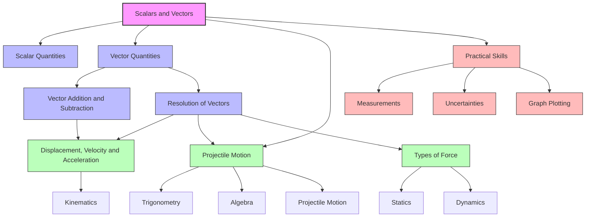

# 1. Overview / 概述

**English:**
This topic introduces the fundamental distinction between scalar and vector quantities in physics. Scalars are quantities that have only magnitude (size), while vectors have both magnitude and direction. Understanding this distinction is crucial because many physical laws and calculations require vector addition, subtraction, and resolution. This topic forms the foundation for [[Displacement, Velocity and Acceleration]], [[Projectile Motion]], and [[Types of Force]].

In both Cambridge 9702 and Edexcel IAL syllabuses, scalars and vectors are assessed through:
- Identifying whether a quantity is scalar or vector
- Adding and subtracting vectors using graphical methods (triangle/parallelogram rule)
- Resolving vectors into perpendicular components
- Applying vector resolution to equilibrium problems and motion analysis

Real-world applications include navigation (GPS uses vector calculations), engineering (force analysis in structures), sports science (projectile motion of balls), and aviation (wind velocity vectors affecting flight paths).

**中文：**
本主题介绍物理学中标量和矢量量的基本区别。标量只有大小（量值），而矢量既有大小又有方向。理解这一区别至关重要，因为许多物理定律和计算需要矢量加法、减法和分解。本主题构成了[[位移、速度和加速度]]、[[抛体运动]]和[[力的类型]]的基础。

在剑桥9702和爱德思IAL教学大纲中，标量和矢量通过以下方式评估：
- 识别一个量是标量还是矢量
- 使用图形方法（三角形/平行四边形法则）进行矢量加法和减法
- 将矢量分解为垂直分量
- 将矢量分解应用于平衡问题和运动分析

实际应用包括导航（GPS使用矢量计算）、工程（结构中的力分析）、体育科学（球的抛体运动）和航空（影响飞行路径的风速矢量）。

---

# 2. Syllabus Learning Objectives / 考纲学习目标

**English:**
The table below lists all syllabus requirements relevant to scalars and vectors for both Cambridge 9702 and Edexcel IAL.

**中文：**
下表列出了剑桥9702和爱德思IAL中与标量和矢量相关的所有考纲要求。

| CAIE 9702 | Edexcel IAL |
|-----------|-------------|
| 3.1(a) Distinguish between scalar and vector quantities and give examples of each | 1.1 Distinguish between scalar and vector quantities |
| 3.1(b) Add and subtract coplanar vectors using the triangle or parallelogram rule | 1.2 Add and subtract vectors using graphical methods |
| 3.1(c) Resolve a vector into two perpendicular components | 1.3 Resolve a vector into two perpendicular components |

**Examiner Expectations / 考官期望：**

**English:**
- Candidates must be able to state whether a quantity is scalar or vector with confidence
- For vector addition, candidates must draw accurate vector diagrams (scale drawings) or use trigonometry
- For vector resolution, candidates must identify the correct trigonometric function (sine or cosine) for each component
- Common errors include confusing magnitude with direction, and using the wrong trigonometric ratio

**中文：**
- 考生必须能够自信地说明一个量是标量还是矢量
- 对于矢量加法，考生必须绘制准确的矢量图（比例图）或使用三角学
- 对于矢量分解，考生必须为每个分量确定正确的三角函数（正弦或余弦）
- 常见错误包括混淆大小和方向，以及使用错误的三角比

> 📋 **CIE Only:** Cambridge 9702 Paper 1 (MCQ) and Paper 2 (structured questions) often test vector addition and resolution. Paper 5 may require vector resolution in practical contexts.
>
> 📋 **Edexcel Only:** Edexcel IAL Unit 1 often includes vector questions in Section A (MCQ) and Section B (structured). Practical skills in Unit 3 may involve vector resolution for force measurements.

---

# 3. Core Definitions / 核心定义

**English:**
The table below provides official definitions with exam-standard wording, common mistakes, and links to related concepts.

**中文：**
下表提供了官方定义、考试标准措辞、常见错误以及与相关概念的链接。

| Term (EN/CN) | Definition (EN) | Definition (CN) | Common Mistakes / 常见错误 |
|--------------|-----------------|-----------------|---------------------------|
| **Scalar Quantity** / 标量 | A physical quantity that has magnitude only, with no direction | 只有大小、没有方向的物理量 | Confusing scalars with vectors (e.g., speed vs velocity). Students often forget that time, mass, and energy are scalars. |
| **Vector Quantity** / 矢量 | A physical quantity that has both magnitude and direction | 既有大小又有方向的物理量 | Thinking that all vectors must be forces or velocities. Students sometimes forget that displacement and acceleration are vectors. |
| **Magnitude** / 大小 | The size or numerical value of a quantity, regardless of direction | 一个量的大小或数值，与方向无关 | Confusing magnitude with the quantity itself. For example, the magnitude of velocity is speed, but they are different concepts. |
| **Direction** / 方向 | The line along which a vector acts, specified by an angle or bearing | 矢量作用的方向，用角度或方位角表示 | Not specifying direction clearly (e.g., "30°" without reference to a baseline). |
| **Resultant Vector** / 合矢量 | The single vector that has the same effect as two or more vectors combined | 与两个或多个矢量组合效果相同的单一矢量 | Adding vectors algebraically without considering direction. |
| **Component** / 分量 | One of two perpendicular parts into which a vector can be resolved | 矢量可以分解成的两个垂直部分之一 | Using the wrong trigonometric function (sine vs cosine) for the component. |
| **Triangle Rule** / 三角形法则 | A graphical method for adding two vectors by placing them head-to-tail | 通过将两个矢量首尾相接进行矢量加法的图形方法 | Drawing vectors in the wrong order or not maintaining correct direction. |
| **Parallelogram Rule** / 平行四边形法则 | A graphical method for adding two vectors by completing a parallelogram | 通过完成平行四边形进行矢量加法的图形方法 | Not drawing the diagonal correctly or confusing it with the other diagonal. |

---

# 4. Key Concepts Explained / 关键概念详解

## 4.1 Distinguishing Scalars and Vectors / 区分标量和矢量

### Explanation / 解释
**English:**
The fundamental difference between scalars and vectors is that scalars have only magnitude, while vectors have both magnitude and direction. This distinction is not just theoretical—it affects how we perform calculations. For example, adding two scalar quantities (like 5 kg + 3 kg) is straightforward arithmetic. However, adding two vector quantities (like 5 N east + 3 N north) requires vector addition because direction matters.

Common scalar quantities include: mass, time, temperature, energy, power, speed, distance, and electric charge.
Common vector quantities include: displacement, velocity, acceleration, force, momentum, electric field strength, and magnetic flux density.

**中文：**
标量和矢量之间的根本区别在于标量只有大小，而矢量既有大小又有方向。这一区别不仅仅是理论上的——它影响我们如何进行计算。例如，将两个标量相加（如5千克+3千克）是简单的算术运算。然而，将两个矢量相加（如5牛向东+3牛向北）需要矢量加法，因为方向很重要。

常见的标量包括：质量、时间、温度、能量、功率、速率、距离和电荷。
常见的矢量包括：位移、速度、加速度、力、动量、电场强度和磁通密度。

### Physical Meaning / 物理意义
**English:**
In real life, direction matters. If you walk 5 km east and then 3 km west, your total distance traveled is 8 km (scalar addition), but your displacement (vector addition) is only 2 km east. This is why navigation systems use vectors—they need to know not just how far you've traveled, but in which direction you've ended up.

**中文：**
在现实生活中，方向很重要。如果你向东走5公里，然后向西走3公里，你走过的总距离是8公里（标量加法），但你的位移（矢量加法）只有2公里向东。这就是为什么导航系统使用矢量——它们不仅需要知道你走了多远，还需要知道你最终在哪个方向。

### Common Misconceptions / 常见误区
1. **Speed and velocity are the same** — Speed is scalar (magnitude only), velocity is vector (magnitude and direction).
2. **Distance and displacement are the same** — Distance is scalar (total path length), displacement is vector (straight line from start to finish).
3. **All quantities with units are scalars** — Units alone don't determine scalar/vector nature; direction matters.
4. **Force is always a vector** — Correct, but students sometimes forget that the direction of force is essential.

### Exam Tips / 考试提示
**English:**
Cambridge and Edexcel often ask: "State whether [quantity] is a scalar or a vector." Be prepared to justify your answer. For example: "Velocity is a vector because it has both magnitude and direction." Also, be able to give examples of each type.

**中文：**
剑桥和爱德思经常问："说明[某个量]是标量还是矢量。"准备好证明你的答案。例如："速度是矢量，因为它既有大小又有方向。"同时，能够给出每种类型的例子。

---

## 4.2 Vector Addition and Subtraction / 矢量加法和减法

### Explanation / 解释
**English:**
Vector addition combines two or more vectors to find a single resultant vector. The two main graphical methods are:

1. **Triangle Rule (Head-to-Tail Method):** Place the tail of the second vector at the head of the first. The resultant is the vector from the tail of the first to the head of the second.

2. **Parallelogram Rule:** Place the tails of both vectors together. Complete the parallelogram. The resultant is the diagonal from the common tail to the opposite corner.

Vector subtraction is similar: to subtract vector B from vector A, add the negative of B (same magnitude, opposite direction) to A.

**中文：**
矢量加法将两个或多个矢量组合起来，找到一个单一的合矢量。两种主要的图形方法是：

1. **三角形法则（首尾相接法）：** 将第二个矢量的尾端放在第一个矢量的首端。合矢量是从第一个矢量的尾端到第二个矢量的首端的矢量。

2. **平行四边形法则：** 将两个矢量的尾端放在一起。完成平行四边形。合矢量是从公共尾端到对角线的对角线。

矢量减法类似：要从矢量A中减去矢量B，将B的负矢量（大小相同，方向相反）加到A上。

### Physical Meaning / 物理意义
**English:**
Imagine two forces acting on an object: one pulls east with 10 N, another pulls north with 10 N. The object doesn't move northeast at 45° with a force of 20 N—it moves with a resultant force of about 14.1 N at 45° northeast. Vector addition tells us the actual combined effect.

**中文：**
想象两个力作用在一个物体上：一个向东拉10牛，另一个向北拉10牛。物体不会以20牛的力向东北45°方向移动——它以约14.1牛的力向东北45°方向移动。矢量加法告诉我们实际的组合效果。

### Common Misconceptions / 常见误区
1. **Adding magnitudes directly** — Students often add 5 N + 3 N = 8 N without considering direction.
2. **Forgetting direction of resultant** — The resultant vector must have both magnitude and direction.
3. **Confusing the two diagonals of a parallelogram** — Only one diagonal is the resultant; the other is the difference.
4. **Not using scale drawings correctly** — In exams, if a scale drawing is required, accuracy matters.

### Exam Tips / 考试提示
**English:**
For Cambridge, be prepared to draw vector diagrams to scale. For Edexcel, trigonometry (sine rule, cosine rule) is often sufficient. Always state the magnitude and direction of the resultant. Use bearings (e.g., 060°) or angles relative to a direction (e.g., 30° north of east).

**中文：**
对于剑桥，准备好按比例绘制矢量图。对于爱德思，三角学（正弦定理、余弦定理）通常就足够了。始终说明合矢量的大小和方向。使用方位角（如060°）或相对于某个方向的角度（如北偏东30°）。

---

## 4.3 Resolution of Vectors / 矢量的分解

### Explanation / 解释
**English:**
Resolution is the reverse of addition—splitting a single vector into two perpendicular components. This is useful because perpendicular components are independent of each other. For a vector V at angle θ to the horizontal:

- Horizontal component: $V_x = V \cos \theta$
- Vertical component: $V_y = V \sin \theta$

The original vector can be reconstructed using Pythagoras: $V = \sqrt{V_x^2 + V_y^2}$ and $\theta = \tan^{-1}(V_y / V_x)$.

**中文：**
分解是加法的逆过程——将一个矢量分解为两个垂直的分量。这很有用，因为垂直分量彼此独立。对于一个与水平方向成θ角的矢量V：

- 水平分量：$V_x = V \cos \theta$
- 垂直分量：$V_y = V \sin \theta$

原始矢量可以使用勾股定理重建：$V = \sqrt{V_x^2 + V_y^2}$ 和 $\theta = \tan^{-1}(V_y / V_x)$。

### Physical Meaning / 物理意义
**English:**
When you push a lawnmower at an angle, part of your force pushes it forward (horizontal component) and part pushes it into the ground (vertical component). Resolution helps us analyze these separate effects. Similarly, when a projectile is launched at an angle, its velocity has horizontal and vertical components that behave independently.

**中文：**
当你以一定角度推割草机时，你的力的一部分向前推（水平分量），一部分向下推入地面（垂直分量）。分解帮助我们分析这些分离的效果。类似地，当抛体以一定角度发射时，其速度具有独立运动的水平和垂直分量。

### Common Misconceptions / 常见误区
1. **Using sine for horizontal and cosine for vertical** — Always check: if the angle is measured from the horizontal, horizontal = cos, vertical = sin.
2. **Forgetting that components are vectors** — Components have direction (positive/negative signs matter).
3. **Thinking components are smaller than the original** — Components can be larger than the original if the angle is small? No, components are always ≤ the original magnitude.
4. **Not specifying which component is which** — Clearly label horizontal and vertical components.

### Exam Tips / 考试提示
**English:**
Cambridge and Edexcel frequently ask: "Resolve the vector into horizontal and vertical components." Always draw a right-angled triangle showing the vector and its components. Label the angle clearly. Use $\cos$ for the adjacent side and $\sin$ for the opposite side relative to the given angle.

**中文：**
剑桥和爱德思经常问："将矢量分解为水平和垂直分量。"始终画一个直角三角形，显示矢量及其分量。清晰标注角度。相对于给定角度，使用$\cos$表示邻边，$\sin$表示对边。

> 📷 **IMAGE PROMPT — [SV-01]: Vector Resolution Diagram**
>
> A right-angled triangle showing a vector V at angle θ from the horizontal. The horizontal component V cos θ is along the base, the vertical component V sin θ is along the height. The vector V is the hypotenuse. Labels: V, V_x = V cos θ, V_y = V sin θ, θ. Clean white background, educational style, black lines with blue and red arrows for components.

---

# 5. Essential Equations / 核心公式

## 5.1 Vector Addition (Triangle Rule) / 矢量加法（三角形法则）

**Equation / 公式:**
$$ \vec{R} = \vec{A} + \vec{B} $$

**Variables / 变量:**
| Symbol (符号) | Meaning (EN) | Meaning (CN) | Unit (单位) |
|--------------|-------------|-------------|------------|
| $\vec{R}$ | Resultant vector | 合矢量 | Depends on quantity (N, m/s, etc.) |
| $\vec{A}$ | First vector | 第一个矢量 | Same as above |
| $\vec{B}$ | Second vector | 第二个矢量 | Same as above |

**Derivation / 推导:**
**English:**
The triangle rule is a graphical method. Place the tail of $\vec{B}$ at the head of $\vec{A}$. The resultant $\vec{R}$ is the vector from the tail of $\vec{A}$ to the head of $\vec{B}$. Mathematically, if the angle between $\vec{A}$ and $\vec{B}$ is θ, then:
$$ R = \sqrt{A^2 + B^2 + 2AB \cos \theta} $$
This comes from the cosine rule in trigonometry.

**中文：**
三角形法则是一种图形方法。将$\vec{B}$的尾端放在$\vec{A}$的首端。合矢量$\vec{R}$是从$\vec{A}$的尾端到$\vec{B}$的首端的矢量。数学上，如果$\vec{A}$和$\vec{B}$之间的夹角为θ，则：
$$ R = \sqrt{A^2 + B^2 + 2AB \cos \theta} $$
这来自三角学中的余弦定理。

**Conditions / 适用条件:**
**English:** Vectors must be coplanar (in the same plane). The method works for any two vectors.
**中文：** 矢量必须共面（在同一平面内）。该方法适用于任意两个矢量。

**Limitations / 局限性:**
**English:** Only works for two vectors at a time. For more vectors, add them sequentially.
**中文：** 一次只适用于两个矢量。对于更多矢量，依次相加。

**Rearrangements / 变形:**
**English:** For perpendicular vectors (θ = 90°): $R = \sqrt{A^2 + B^2}$
**中文：** 对于垂直矢量（θ = 90°）：$R = \sqrt{A^2 + B^2}$

---

## 5.2 Vector Subtraction / 矢量减法

**Equation / 公式:**
$$ \vec{R} = \vec{A} - \vec{B} = \vec{A} + (-\vec{B}) $$

**Variables / 变量:**
| Symbol (符号) | Meaning (EN) | Meaning (CN) | Unit (单位) |
|--------------|-------------|-------------|------------|
| $\vec{R}$ | Resultant vector | 合矢量 | Depends on quantity |
| $\vec{A}$ | First vector | 第一个矢量 | Same as above |
| $-\vec{B}$ | Negative of vector B (same magnitude, opposite direction) | 矢量B的负矢量（大小相同，方向相反） | Same as above |

**Derivation / 推导:**
**English:**
To subtract $\vec{B}$ from $\vec{A}$, reverse the direction of $\vec{B}$ to get $-\vec{B}$, then add $\vec{A}$ and $-\vec{B}$ using the triangle rule.

**中文：**
要从$\vec{A}$中减去$\vec{B}$，将$\vec{B}$的方向反转得到$-\vec{B}$，然后使用三角形法则将$\vec{A}$和$-\vec{B}$相加。

**Conditions / 适用条件:**
**English:** Same as vector addition.
**中文：** 与矢量加法相同。

**Limitations / 局限性:**
**English:** Same as vector addition.
**中文：** 与矢量加法相同。

**Rearrangements / 变形:**
**English:** For perpendicular vectors: $R = \sqrt{A^2 + B^2}$ (same formula, but direction differs)
**中文：** 对于垂直矢量：$R = \sqrt{A^2 + B^2}$（公式相同，但方向不同）

---

## 5.3 Vector Resolution / 矢量分解

**Equation / 公式:**
$$ V_x = V \cos \theta $$
$$ V_y = V \sin \theta $$

**Variables / 变量:**
| Symbol (符号) | Meaning (EN) | Meaning (CN) | Unit (单位) |
|--------------|-------------|-------------|------------|
| $V$ | Original vector magnitude | 原始矢量大小 | Depends on quantity |
| $V_x$ | Horizontal component | 水平分量 | Same as V |
| $V_y$ | Vertical component | 垂直分量 | Same as V |
| $\theta$ | Angle from horizontal | 与水平方向的夹角 | Degrees (°) or radians (rad) |

**Derivation / 推导:**
**English:**
Consider a vector V at angle θ to the horizontal. Draw a right-angled triangle with V as the hypotenuse. The horizontal component is adjacent to θ, so $V_x = V \cos \theta$. The vertical component is opposite to θ, so $V_y = V \sin \theta$.

**中文：**
考虑一个与水平方向成θ角的矢量V。画一个以V为斜边的直角三角形。水平分量与θ相邻，所以$V_x = V \cos \theta$。垂直分量与θ相对，所以$V_y = V \sin \theta$。

**Conditions / 适用条件:**
**English:** The angle must be measured from the horizontal. If measured from the vertical, swap sine and cosine.
**中文：** 角度必须从水平方向测量。如果从垂直方向测量，交换正弦和余弦。

**Limitations / 局限性:**
**English:** Only works for perpendicular components. Non-perpendicular components require more complex methods.
**中文：** 仅适用于垂直分量。非垂直分量需要更复杂的方法。

**Rearrangements / 变形:**
**English:**
$$ V = \sqrt{V_x^2 + V_y^2} $$
$$ \theta = \tan^{-1}\left(\frac{V_y}{V_x}\right) $$

**中文：**
$$ V = \sqrt{V_x^2 + V_y^2} $$
$$ \theta = \tan^{-1}\left(\frac{V_y}{V_x}\right) $$

---

# 6. Graphs and Relationships / 图表与关系

## 6.1 Vector Addition Diagram / 矢量加法图

### Axes / 坐标轴
**English:** x-axis (horizontal), y-axis (vertical) — used for graphical representation
**中文：** x轴（水平），y轴（垂直）——用于图形表示

### Shape / 形状
**English:** Two vectors placed head-to-tail form a triangle. The resultant is the third side.
**中文：** 两个矢量首尾相接形成一个三角形。合矢量是第三边。

### Gradient Meaning / 斜率含义
**English:** Not applicable directly. The direction of each vector is given by its angle relative to the axes.
**中文：** 不直接适用。每个矢量的方向由其相对于坐标轴的角度给出。

### Area Meaning / 面积含义
**English:** Not applicable.
**中文：** 不适用。

### Exam Interpretation / 考试解读
**English:** In exams, you may be asked to draw a vector diagram to scale. The accuracy of your drawing determines the accuracy of your resultant. Always include a scale (e.g., 1 cm = 10 N).
**中文：** 在考试中，你可能被要求按比例绘制矢量图。绘图的准确性决定了合矢量的准确性。始终包含比例尺（例如，1厘米=10牛）。

### Common Questions / 常见问题
**English:**
- "Draw a vector diagram to find the resultant force."
- "Use the triangle rule to add these two vectors."
- "Determine the magnitude and direction of the resultant."

**中文：**
- "绘制矢量图以找到合力。"
- "使用三角形法则将这两个矢量相加。"
- "确定合矢量的大小和方向。"

---

## 6.2 Vector Resolution Diagram / 矢量分解图

### Axes / 坐标轴
**English:** x-axis (horizontal component), y-axis (vertical component)
**中文：** x轴（水平分量），y轴（垂直分量）

### Shape / 形状
**English:** A right-angled triangle with the original vector as the hypotenuse.
**中文：** 一个直角三角形，原始矢量为斜边。

### Gradient Meaning / 斜率含义
**English:** The gradient of the original vector (rise/run) equals $\tan \theta = V_y / V_x$.
**中文：** 原始矢量的斜率（上升/运行）等于$\tan \theta = V_y / V_x$。

### Area Meaning / 面积含义
**English:** Not applicable.
**中文：** 不适用。

### Exam Interpretation / 考试解读
**English:** You may be asked to resolve a vector into components given its magnitude and angle. Alternatively, given components, find the original vector.
**中文：** 你可能被要求根据矢量的大小和角度将其分解为分量。或者，给定分量，找到原始矢量。

### Common Questions / 常见问题
**English:**
- "Resolve the force into horizontal and vertical components."
- "Find the horizontal component of the velocity."
- "Calculate the magnitude and direction of the original vector from its components."

**中文：**
- "将力分解为水平和垂直分量。"
- "找到速度的水平分量。"
- "从分量计算原始矢量的大小和方向。"

---

```mermaid
graph LR
    A[Vector V] --> B[Horizontal Component V cos θ]
    A --> C[Vertical Component V sin θ]
    B --> D[Pythagoras: V = √(Vx² + Vy²)]
    C --> D
    D --> E[Angle: θ = tan⁻¹(Vy/Vx)]
```

---

# 7. Required Diagrams / 必备图表

## 7.1 Vector Addition Using Triangle Rule / 使用三角形法则的矢量加法图

### Description / 描述
**English:**
A diagram showing two vectors A and B placed head-to-tail. Vector A starts at point O and ends at point P. Vector B starts at point P and ends at point Q. The resultant vector R goes from O to Q. Arrows indicate direction. Labels show A, B, and R.

**中文：**
一个显示两个矢量A和B首尾相接的图。矢量A从点O开始，到点P结束。矢量B从点P开始，到点Q结束。合矢量R从O到Q。箭头指示方向。标签显示A、B和R。

### Image Prompt / 图片生成提示
> 📷 **IMAGE PROMPT — [SV-02]: Triangle Rule Vector Addition**
>
> A clean educational diagram showing two vectors placed head-to-tail. Vector A (blue arrow) from point O to point P. Vector B (red arrow) from point P to point Q. Resultant vector R (green dashed arrow) from O to Q. Labels: A, B, R. Arrows at the heads of all vectors. White background, simple line art style, suitable for textbook.

### Labels Required / 需要标注
- Vector A (矢量A)
- Vector B (矢量B)
- Resultant R (合矢量R)
- Points O, P, Q (点O、P、Q)
- Direction arrows (方向箭头)

### Exam Importance / 考试重要性
**English:** This diagram is essential for understanding how to combine vectors graphically. Cambridge and Edexcel both require students to draw or interpret such diagrams.

**中文：** 这个图对于理解如何图形化组合矢量至关重要。剑桥和爱德思都要求学生绘制或解释此类图。

---

## 7.2 Vector Addition Using Parallelogram Rule / 使用平行四边形法则的矢量加法图

### Description / 描述
**English:**
A diagram showing two vectors A and B with their tails together at point O. A parallelogram is completed with sides parallel to A and B. The resultant R is the diagonal from O to the opposite corner. The other diagonal represents the difference A - B.

**中文：**
一个显示两个矢量A和B的尾端在点O处在一起的图。完成一个平行四边形，边与A和B平行。合矢量R是从O到对角线的对角线。另一条对角线表示差A - B。

### Image Prompt / 图片生成提示
> 📷 **IMAGE PROMPT — [SV-03]: Parallelogram Rule Vector Addition**
>
> A clean educational diagram showing two vectors with tails together. Vector A (blue arrow) and Vector B (red arrow) originate from point O. A parallelogram is drawn with dashed lines. The resultant R (green arrow) is the diagonal from O to the opposite corner. The other diagonal (gray dashed) shows A - B. Labels: A, B, R, A-B. White background, simple line art.

### Labels Required / 需要标注
- Vector A (矢量A)
- Vector B (矢量B)
- Resultant R (合矢量R)
- Difference A - B (差A - B)
- Point O (点O)
- Direction arrows (方向箭头)

### Exam Importance / 考试重要性
**English:** The parallelogram rule is an alternative to the triangle rule. Cambridge sometimes asks students to use this method, especially when both vectors originate from the same point.

**中文：** 平行四边形法则是三角形法则的替代方法。剑桥有时要求学生使用这种方法，特别是当两个矢量都从同一点出发时。

---

## 7.3 Vector Resolution Diagram / 矢量分解图

### Description / 描述
**English:**
A right-angled triangle showing a vector V at angle θ from the horizontal. The horizontal component V cos θ is along the base, the vertical component V sin θ is along the height. The vector V is the hypotenuse. All sides are labeled.

**中文：**
一个直角三角形，显示一个与水平方向成θ角的矢量V。水平分量V cos θ沿底边，垂直分量V sin θ沿高度。矢量V是斜边。所有边都有标签。

### Image Prompt / 图片生成提示
> 📷 **IMAGE PROMPT — [SV-04]: Vector Resolution into Components**
>
> A right-angled triangle on a white background. The hypotenuse is a vector V (black arrow) at angle θ from the horizontal. The horizontal leg is V cos θ (blue arrow). The vertical leg is V sin θ (red arrow). The right angle is marked with a small square. Labels: V, V cos θ, V sin θ, θ. Clean educational style.

### Labels Required / 需要标注
- Vector V (矢量V)
- Horizontal component V cos θ (水平分量V cos θ)
- Vertical component V sin θ (垂直分量V sin θ)
- Angle θ (角度θ)
- Right angle marker (直角标记)

### Exam Importance / 考试重要性
**English:** This is one of the most important diagrams in A-Level physics. It appears in mechanics (forces, motion), electricity (electric fields), and waves. Students must be able to draw and interpret it.

**中文：** 这是A-Level物理学中最重要的图之一。它出现在力学（力、运动）、电学（电场）和波中。学生必须能够绘制和解释它。

---

# 8. Worked Examples / 典型例题

## Example 1: Adding Two Perpendicular Vectors / 示例1：相加两个垂直矢量

### Question / 题目
**English:**
A force of 6.0 N acts east and a force of 8.0 N acts north. Calculate the magnitude and direction of the resultant force.

**中文：**
一个6.0牛的力向东作用，一个8.0牛的力向北作用。计算合力的大小和方向。

### Image Prompt / 图片提示
> 📷 **IMAGE PROMPT — [SV-05]: Perpendicular Force Vectors**
>
> Two perpendicular arrows: one pointing east (6.0 N, blue), one pointing north (8.0 N, red). Their tails meet at a common point. A dashed diagonal arrow (green) shows the resultant. Labels: 6.0 N, 8.0 N, R. White background, educational style.

### Solution / 解答

**Step 1: Identify the vectors**
- $\vec{A} = 6.0 \text{ N east}$
- $\vec{B} = 8.0 \text{ N north}$
- Angle between them: $\theta = 90^\circ$

**Step 2: Calculate magnitude using Pythagoras**
Since the vectors are perpendicular:
$$ R = \sqrt{A^2 + B^2} = \sqrt{6.0^2 + 8.0^2} = \sqrt{36 + 64} = \sqrt{100} = 10 \text{ N} $$

**Step 3: Calculate direction**
The angle from east (horizontal) is:
$$ \theta = \tan^{-1}\left(\frac{B}{A}\right) = \tan^{-1}\left(\frac{8.0}{6.0}\right) = \tan^{-1}(1.333) = 53.1^\circ $$

**Step 4: State the answer**
Resultant force = 10 N at 53.1° north of east (or bearing 053°).

### Final Answer / 最终答案
**Answer:** 10 N at 53.1° north of east | **答案：** 10牛，北偏东53.1°

### Examiner Notes / 考官点评
**English:**
- Full marks require both magnitude and direction.
- Direction must be clearly stated (e.g., "north of east" or "bearing 053°").
- Common mistake: giving only the magnitude (10 N) without direction.

**中文：**
- 满分需要同时给出大小和方向。
- 方向必须清晰说明（例如，"北偏东"或"方位角053°"）。
- 常见错误：只给出大小（10牛）而没有方向。

### Alternative Method / 替代方法
**English:**
Use scale drawing: draw 6.0 cm east, then 8.0 cm north from the head. Measure the resultant length (10 cm) and angle (53°). This method is acceptable but less precise.

**中文：**
使用比例图：向东画6.0厘米，然后从首端向北画8.0厘米。测量合矢量长度（10厘米）和角度（53°）。这种方法可以接受，但精度较低。

---

## Example 2: Resolving a Vector into Components / 示例2：将矢量分解为分量

### Question / 题目
**English:**
A projectile is launched with an initial velocity of 20 m/s at an angle of 30° above the horizontal. Calculate the horizontal and vertical components of the initial velocity.

**中文：**
一个抛体以20米/秒的初速度、与水平方向成30°角发射。计算初速度的水平分量和垂直分量。

### Image Prompt / 图片提示
> 📷 **IMAGE PROMPT — [SV-06]: Velocity Resolution**
>
> A right-angled triangle with hypotenuse 20 m/s at 30° from horizontal. Horizontal leg labeled "v_x = 20 cos 30°", vertical leg labeled "v_y = 20 sin 30°". Angle marked 30°. Clean educational diagram.

### Solution / 解答

**Step 1: Identify the given values**
- Initial velocity $v = 20 \text{ m/s}$
- Angle from horizontal $\theta = 30^\circ$

**Step 2: Calculate horizontal component**
$$ v_x = v \cos \theta = 20 \times \cos 30^\circ = 20 \times 0.8660 = 17.3 \text{ m/s} $$

**Step 3: Calculate vertical component**
$$ v_y = v \sin \theta = 20 \times \sin 30^\circ = 20 \times 0.5000 = 10.0 \text{ m/s} $$

**Step 4: State the answer**
Horizontal component = 17.3 m/s
Vertical component = 10.0 m/s

### Final Answer / 最终答案
**Answer:** $v_x = 17.3 \text{ m/s}$, $v_y = 10.0 \text{ m/s}$ | **答案：** $v_x = 17.3 \text{米/秒}$，$v_y = 10.0 \text{米/秒}$

### Examiner Notes / 考官点评
**English:**
- Use $\cos$ for horizontal (adjacent to angle) and $\sin$ for vertical (opposite to angle).
- Always include units (m/s).
- Common mistake: swapping sine and cosine (using $\sin$ for horizontal).

**中文：**
- 使用$\cos$表示水平分量（与角度相邻），使用$\sin$表示垂直分量（与角度相对）。
- 始终包含单位（米/秒）。
- 常见错误：交换正弦和余弦（对水平分量使用$\sin$）。

### Alternative Method / 替代方法
**English:**
If the angle is measured from the vertical, swap the formulas: $v_x = v \sin \theta$, $v_y = v \cos \theta$. Always check which angle is given.

**中文：**
如果角度是从垂直方向测量的，交换公式：$v_x = v \sin \theta$，$v_y = v \cos \theta$。始终检查给出的角度。

---

# 9. Past Paper Question Types / 历年真题题型

**English:**
The table below summarizes the types of questions that appear in Cambridge 9702 and Edexcel IAL exams for scalars and vectors.

**中文：**
下表总结了剑桥9702和爱德思IAL考试中与标量和矢量相关的题型。

| Question Type / 题型 | Frequency / 频率 | Difficulty / 难度 | Past Paper References / 真题索引 |
|----------------------|------------------|------------------|-------------------------------|
| Calculation / 计算 | High | Low-Medium | 📝 *待填入* |
| Explanation / 解释 | Medium | Low | 📝 *待填入* |
| Graph Analysis / 图表分析 | Low | Medium | 📝 *待填入* |
| Practical / 实验 | Low | Medium | 📝 *待填入* |
| Derivation / 推导 | Low | Low | 📝 *待填入* |

> 📝 **题库整理中 / Question Bank Under Construction:** 具体试卷编号（如 9702/23/M/J/24 Q3）将在后续整理真题后填入上表。

**Common Command Words / 常见指令词：**

| Command Word (EN) | Command Word (CN) | Meaning (EN) | Meaning (CN) |
|-------------------|-------------------|--------------|--------------|
| State | 陈述 | Give a brief answer without explanation | 给出简短答案，无需解释 |
| Define | 定义 | Give the precise meaning of a term | 给出术语的精确含义 |
| Explain | 解释 | Give reasons or causes | 给出原因或理由 |
| Describe | 描述 | Give a detailed account | 给出详细说明 |
| Calculate | 计算 | Work out a numerical answer | 计算出数值答案 |
| Determine | 确定 | Find a value using given data | 使用给定数据找出一个值 |
| Suggest | 建议 | Propose a possible answer | 提出一个可能的答案 |

---

# 10. Practical Skills Connections / 实验技能链接

**English:**
Scalars and vectors are fundamental to many practical experiments in A-Level physics.

**中文：**
标量和矢量是A-Level物理学中许多实验的基础。

### Measurements / 测量
**English:**
- **Force vectors:** Using spring balances to measure forces in equilibrium. Students must record both magnitude (from the balance reading) and direction (using a protractor).
- **Displacement vectors:** Using rulers and protractors to measure displacement in two dimensions.
- **Velocity vectors:** Using ticker timers or motion sensors to measure velocity components.

**中文：**
- **力矢量：** 使用弹簧测力计测量平衡中的力。学生必须记录大小（从测力计读数）和方向（使用量角器）。
- **位移矢量：** 使用尺子和量角器测量二维位移。
- **速度矢量：** 使用打点计时器或运动传感器测量速度分量。

### Uncertainties / 不确定度
**English:**
- When drawing vector diagrams to scale, the uncertainty in the resultant depends on the scale used and the precision of the drawing.
- For resolution, uncertainty in the angle measurement propagates to uncertainties in components: $\Delta V_x = V \sin \theta \, \Delta \theta$ (in radians).

**中文：**
- 当按比例绘制矢量图时，合矢量的不确定度取决于使用的比例尺和绘图的精度。
- 对于分解，角度测量的不确定度会传播到分量中：$\Delta V_x = V \sin \theta \, \Delta \theta$（以弧度为单位）。

### Graph Plotting / 图表绘制
**English:**
- Plotting vector components on a graph (e.g., horizontal vs vertical velocity) helps visualize the vector.
- The gradient of a vector component graph can give information about acceleration.

**中文：**
- 在图表上绘制矢量分量（例如，水平速度与垂直速度）有助于可视化矢量。
- 矢量分量图的斜率可以提供关于加速度的信息。

### Experimental Design / 实验设计
**English:**
- **CAIE Paper 3/5:** Students may be asked to design an experiment to find the resultant of two forces using a force board, pulleys, and weights.
- **Edexcel Unit 3/6:** Students may investigate equilibrium of forces using a force table, resolving forces into components.

**中文：**
- **CAIE Paper 3/5：** 学生可能被要求设计一个实验，使用力板、滑轮和砝码找到两个力的合力。
- **Edexcel Unit 3/6：** 学生可能使用力表研究力的平衡，将力分解为分量。

> 📋 **CIE Only:** Cambridge Paper 3 (AS) often includes a question on vector addition using a force board. Paper 5 (A2) may require vector resolution in a practical context.
>
> 📋 **Edexcel Only:** Edexcel Unit 3 (AS) includes a practical on equilibrium of forces. Unit 6 (A2) may involve vector resolution for more complex systems.

---

# 11. Concept Map / 概念图谱

**English:**
The concept map below shows the relationships between scalars, vectors, and related topics.

**中文：**
下面的概念图显示了标量、矢量和相关主题之间的关系。



---

# 12. Quick Revision Sheet / 速查表

**English:**
The table below provides a one-page bilingual summary of key points for scalars and vectors.

**中文：**
下表提供了标量和矢量的关键点的一页双语总结。

| Category / 类别 | Key Points / 要点 |
|----------------|------------------|
| **Definitions / 定义** | **Scalar:** magnitude only (e.g., mass, time, speed, distance, energy) / 标量：只有大小（例如，质量、时间、速率、距离、能量） |
| | **Vector:** magnitude and direction (e.g., displacement, velocity, acceleration, force, momentum) / 矢量：大小和方向（例如，位移、速度、加速度、力、动量） |
| **Equations / 公式** | **Vector addition (perpendicular):** $R = \sqrt{A^2 + B^2}$ / 矢量加法（垂直）：$R = \sqrt{A^2 + B^2}$ |
| | **Vector addition (general):** $R = \sqrt{A^2 + B^2 + 2AB \cos \theta}$ / 矢量加法（一般）：$R = \sqrt{A^2 + B^2 + 2AB \cos \theta}$ |
| | **Resolution:** $V_x = V \cos \theta$, $V_y = V \sin \theta$ / 分解：$V_x = V \cos \theta$，$V_y = V \sin \theta$ |
| | **Reconstruction:** $V = \sqrt{V_x^2 + V_y^2}$, $\theta = \tan^{-1}(V_y / V_x)$ / 重建：$V = \sqrt{V_x^2 + V_y^2}$，$\theta = \tan^{-1}(V_y / V_x)$ |
| **Graphs / 图表** | **Triangle rule:** head-to-tail placement / 三角形法则：首尾相接 |
| | **Parallelogram rule:** tails together, diagonal is resultant / 平行四边形法则：尾端在一起，对角线是合矢量 |
| | **Resolution:** right-angled triangle with vector as hypotenuse / 分解：以矢量为斜边的直角三角形 |
| **Key Facts / 关键事实** | Scalars add algebraically; vectors add using vector rules / 标量代数相加；矢量使用矢量规则相加 |
| | Components are perpendicular and independent / 分量是垂直且独立的 |
| | The resultant is always ≤ the sum of magnitudes / 合矢量总是≤大小之和 |
| | For perpendicular vectors, $R = \sqrt{A^2 + B^2}$ / 对于垂直矢量，$R = \sqrt{A^2 + B^2}$ |
| **Exam Reminders / 考试提醒** | Always state both magnitude and direction for vectors / 始终说明矢量的大小和方向 |
| | Use $\cos$ for horizontal (adjacent), $\sin$ for vertical (opposite) / 使用$\cos$表示水平（邻边），$\sin$表示垂直（对边） |
| | Check the angle: from horizontal or vertical? / 检查角度：从水平还是垂直测量？ |
| | Include units in all answers / 在所有答案中包含单位 |
| | For scale drawings, include the scale and measure accurately / 对于比例图，包含比例尺并准确测量 |

---

**End of Note / 笔记结束**

*This note is part of the Physics Knowledge Graph. Related notes: [[Scalar Quantities]], [[Vector Quantities]], [[Vector Addition and Subtraction]], [[Resolution of Vectors]], [[Displacement, Velocity and Acceleration]], [[Projectile Motion]], [[Types of Force]].*