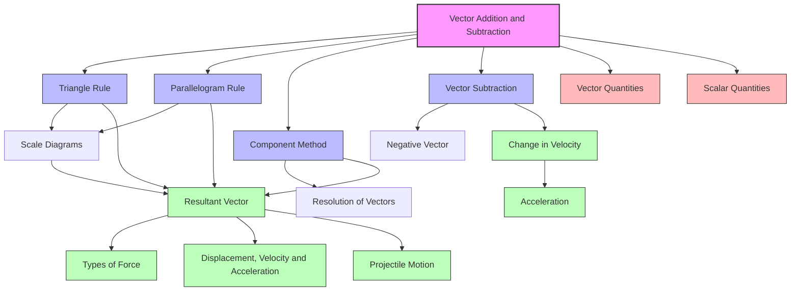

# 1. Overview / 概述

**English:**
Vector addition and subtraction are fundamental operations in physics that allow us to combine or compare vector quantities. Unlike scalar addition (which is simple arithmetic), vector addition must account for both magnitude and direction. This sub-topic introduces the graphical methods (triangle and parallelogram rules) and analytical methods (component addition) for combining vectors. Understanding these operations is essential for solving problems in [[Displacement, Velocity and Acceleration]], [[Projectile Motion]], and [[Types of Force]], where multiple vectors act simultaneously. This leaf node builds directly on the concepts of [[Vector Quantities]] and prepares you for [[Resolution of Vectors]].

**中文:**
向量加法和减法是物理学中的基本运算，用于合并或比较向量量。与标量加法（简单算术）不同，向量加法必须同时考虑大小和方向。本子知识点介绍向量合成的图形方法（三角形法则和平行四边形法则）和解析方法（分量加法）。理解这些运算对于解决[[位移、速度和加速度]]、[[抛体运动]]和[[力的类型]]中多个向量同时作用的问题至关重要。本叶节点直接建立在[[向量量]]的概念之上，并为[[向量的分解]]做准备。

---

# 2. Syllabus Learning Objectives / 考纲学习目标

| CAIE 9702 | Edexcel IAL |
|-----------|-------------|
| 3.1(a) Add and subtract coplanar vectors | 1.1 Add and subtract vectors |
| 3.1(b) Represent vector addition using scale drawings | 1.2 Use scale drawings to find resultant vectors |
| 3.1(c) Use vector addition to solve problems | 1.3 Apply vector addition to equilibrium problems |

**Examiner Expectations / 考官期望:**
- **English:** You must be able to add and subtract vectors both graphically (using scale diagrams) and analytically (using components). For CAIE, focus on coplanar (2D) vectors. For Edexcel, you must also apply vector addition to equilibrium situations (e.g., forces in equilibrium).
- **中文:** 你必须能够通过图形法（比例图）和解析法（分量法）进行向量加减。CAIE重点在共面（二维）向量。Edexcel还需将向量加法应用于平衡情况（如力的平衡）。

---

# 3. Core Definitions / 核心定义

| Term (EN/CN) | Definition (EN) | Definition (CN) | Common Mistakes / 常见错误 |
|--------------|-----------------|-----------------|---------------------------|
| **Resultant Vector** / 合向量 | The single vector that produces the same effect as two or more vectors combined | 与两个或多个向量组合效果相同的单一向量 | Confusing resultant with sum of magnitudes (magnitudes don't add directly) |
| **Vector Addition** / 向量加法 | The operation of combining two or more vectors to find their resultant | 将两个或多个向量合并以求得其合向量的运算 | Forgetting to account for direction |
| **Vector Subtraction** / 向量减法 | Adding the negative of a vector: $\vec{A} - \vec{B} = \vec{A} + (-\vec{B})$ | 加上一个向量的负向量：$\vec{A} - \vec{B} = \vec{A} + (-\vec{B})$ | Subtracting magnitudes directly instead of using the negative vector |
| **Negative Vector** / 负向量 | A vector with the same magnitude but opposite direction to the original | 与原向量大小相同但方向相反的向量 | Thinking negative means smaller magnitude |
| **Coplanar Vectors** / 共面向量 | Vectors that lie in the same plane | 位于同一平面内的向量 | Not relevant for 1D problems |
| **Scale Diagram** / 比例图 | A drawing where vectors are represented by arrows drawn to a chosen scale | 按选定比例用箭头表示向量的图形 | Using inconsistent scales for different vectors |

---

# 4. Key Concepts Explained / 关键概念详解

## 4.1 The Triangle Rule for Vector Addition / 向量加法的三角形法则

### Explanation / 解释
**English:**
The triangle rule states that to add two vectors $\vec{A}$ and $\vec{B}$, place the tail of $\vec{B}$ at the head of $\vec{A}$. The resultant $\vec{R} = \vec{A} + \vec{B}$ is the vector drawn from the tail of $\vec{A}$ to the head of $\vec{B}$. This forms a triangle, hence the name. This rule works for any two [[Vector Quantities]] and is the foundation for all vector addition.

**中文:**
三角形法则指出，要相加两个向量$\vec{A}$和$\vec{B}$，将$\vec{B}$的尾端放在$\vec{A}$的顶端。合向量$\vec{R} = \vec{A} + \vec{B}$是从$\vec{A}$的尾端画到$\vec{B}$的顶端的向量。这形成一个三角形，因此得名。该法则适用于任意两个[[向量量]]，是所有向量加法的基础。

### Physical Meaning / 物理意义
**English:**
When two vectors act on an object simultaneously, the resultant represents the net effect. For example, if two forces act on a point, the resultant force determines the object's acceleration (via Newton's Second Law). The triangle rule shows that vectors combine head-to-tail, not side-by-side.

**中文:**
当两个向量同时作用于一个物体时，合向量代表净效果。例如，如果两个力作用于一个点，合力决定物体的加速度（通过牛顿第二定律）。三角形法则表明向量是首尾相连地组合，而非并排放置。

### Common Misconceptions / 常见误区
- **EN:** Thinking the resultant is simply the sum of magnitudes (e.g., $|\vec{A}| + |\vec{B}|$). This is only true when vectors are parallel and in the same direction.
- **CN:** 认为合向量就是大小的简单相加（如$|\vec{A}| + |\vec{B}|$）。这仅在向量平行且方向相同时成立。
- **EN:** Confusing the triangle rule with the parallelogram rule — they give the same resultant but use different constructions.
- **CN:** 混淆三角形法则和平行四边形法则——它们给出相同的合向量但构造方法不同。

### Exam Tips / 考试提示
- **EN:** Always draw a clear diagram first, even for analytical problems. Label all vectors with magnitude and direction.
- **CN:** 即使是解析题，也要先画清晰的图。标注所有向量的大小和方向。
- **EN:** For scale diagrams, choose a scale that fits the page (e.g., 1 cm = 10 N) and measure carefully with a ruler and protractor.
- **CN:** 对于比例图，选择适合页面的比例（如1 cm = 10 N），用尺子和量角器仔细测量。

> 📷 **IMAGE PROMPT — VEC-ADD-01: Triangle Rule for Vector Addition**
> A clear diagram showing two vectors A and B arranged head-to-tail. Vector A is horizontal to the right (length 4 cm). Vector B is at 60° above horizontal from the head of A (length 3 cm). The resultant R is drawn from the tail of A to the head of B, forming a triangle. All vectors are labeled with arrows and magnitudes. A dashed line shows the angle of the resultant relative to horizontal.

## 4.2 The Parallelogram Rule for Vector Addition / 向量加法的平行四边形法则

### Explanation / 解释
**English:**
The parallelogram rule is an alternative method: place the tails of $\vec{A}$ and $\vec{B}$ together at a common point. Complete the parallelogram by drawing lines parallel to each vector. The resultant $\vec{R} = \vec{A} + \vec{B}$ is the diagonal of the parallelogram from the common tail point. This method is particularly useful when visualizing the combined effect of two vectors acting at the same point, such as [[Types of Force]] on a particle.

**中文:**
平行四边形法则是另一种方法：将$\vec{A}$和$\vec{B}$的尾端放在同一点。通过画平行于每个向量的线来补全平行四边形。合向量$\vec{R} = \vec{A} + \vec{B}$是从共同尾端出发的对角线。这种方法在可视化作用于同一点的两个向量的组合效果时特别有用，例如[[力的类型]]作用于质点。

### Physical Meaning / 物理意义
**English:**
The parallelogram rule emphasizes that both vectors originate from the same point. This is physically realistic for forces acting at a single point (concurrent forces). The diagonal represents the single force that could replace the two original forces.

**中文:**
平行四边形法则强调两个向量都从同一点出发。这对于作用于同一点的力（共点力）在物理上是真实的。对角线代表可以替代两个原始力的单一力。

### Common Misconceptions / 常见误区
- **EN:** Thinking the parallelogram rule gives a different resultant than the triangle rule — they are mathematically equivalent.
- **CN:** 认为平行四边形法则给出与三角形法则不同的合向量——它们在数学上是等价的。
- **EN:** Drawing the diagonal incorrectly (e.g., connecting opposite corners instead of the correct diagonal).
- **CN:** 错误地画对角线（如连接对角而不是正确的对角线）。

### Exam Tips / 考试提示
- **EN:** Use the parallelogram rule when both vectors start at the same point (common in force problems). Use the triangle rule when vectors are arranged head-to-tail (common in displacement problems).
- **CN:** 当两个向量从同一点出发时（常见于力的问题），使用平行四边形法则。当向量首尾相连时（常见于位移问题），使用三角形法则。

> 📷 **IMAGE PROMPT — VEC-ADD-02: Parallelogram Rule for Vector Addition**
> Two vectors A and B with tails together at a common point O. Vector A is horizontal to the right (length 4 cm). Vector B is at 60° above horizontal (length 3 cm). A dashed line parallel to A is drawn from the head of B, and a dashed line parallel to B is drawn from the head of A, forming a parallelogram. The resultant R is the diagonal from O to the opposite corner. All vectors labeled with arrows.

## 4.3 Vector Subtraction / 向量减法

### Explanation / 解释
**English:**
Vector subtraction $\vec{A} - \vec{B}$ is performed by adding the negative of $\vec{B}$: $\vec{A} - \vec{B} = \vec{A} + (-\vec{B})$. The negative vector $-\vec{B}$ has the same magnitude as $\vec{B}$ but points in the opposite direction (180° rotation). Graphically, you reverse the direction of $\vec{B}$ and then use the triangle rule. This is crucial for finding relative quantities, such as relative velocity or change in velocity ($\Delta \vec{v} = \vec{v}_f - \vec{v}_i$).

**中文:**
向量减法$\vec{A} - \vec{B}$通过加上$\vec{B}$的负向量来执行：$\vec{A} - \vec{B} = \vec{A} + (-\vec{B})$。负向量$-\vec{B}$与$\vec{B}$大小相同但方向相反（旋转180°）。图形上，将$\vec{B}$的方向反转，然后使用三角形法则。这对于求相对量至关重要，如相对速度或速度变化（$\Delta \vec{v} = \vec{v}_f - \vec{v}_i$）。

### Physical Meaning / 物理意义
**English:**
Subtraction finds the difference between two vectors. In kinematics, $\Delta \vec{v} = \vec{v}_f - \vec{v}_i$ gives the change in velocity, which determines acceleration. In forces, the net force is the vector sum, but the difference between two forces tells you how much one is "stronger" in a given direction.

**中文:**
减法求两个向量之间的差。在运动学中，$\Delta \vec{v} = \vec{v}_f - \vec{v}_i$给出速度变化，决定加速度。在力中，合力是向量和，但两个力之差告诉你一个力在给定方向上"强"多少。

### Common Misconceptions / 常见误区
- **EN:** Subtracting magnitudes directly: $|\vec{A} - \vec{B}| \neq |\vec{A}| - |\vec{B}|$ (except when vectors are parallel).
- **CN:** 直接相减大小：$|\vec{A} - \vec{B}| \neq |\vec{A}| - |\vec{B}|$（除非向量平行）。
- **EN:** Forgetting to reverse the direction of the subtracted vector.
- **CN:** 忘记反转被减向量的方向。

### Exam Tips / 考试提示
- **EN:** When subtracting vectors, always rewrite as addition of the negative vector first: $\vec{A} - \vec{B} = \vec{A} + (-\vec{B})$.
- **CN:** 做向量减法时，总是先改写为加上负向量：$\vec{A} - \vec{B} = \vec{A} + (-\vec{B})$。
- **EN:** For change in velocity problems, remember $\Delta \vec{v} = \vec{v}_f - \vec{v}_i$ — the initial velocity is subtracted.
- **CN:** 对于速度变化问题，记住$\Delta \vec{v} = \vec{v}_f - \vec{v}_i$——减去初速度。

> 📷 **IMAGE PROMPT — VEC-ADD-03: Vector Subtraction**
> Two vectors A (horizontal right, 5 cm) and B (horizontal right, 3 cm). Show the subtraction A - B: first draw vector A, then from its head draw the negative of B (3 cm to the left). The resultant R = A - B is from the tail of A to the head of (-B), giving a 2 cm vector to the right. Label all vectors clearly.

## 4.4 Analytical Method: Component Addition / 解析法：分量加法

### Explanation / 解释
**English:**
The analytical method resolves each vector into perpendicular components (usually x and y), adds components separately, then recombines to find the resultant. This is the most precise method and is essential when vectors are not at right angles. For a vector $\vec{V}$ at angle $\theta$ from the x-axis:
- $V_x = V \cos \theta$
- $V_y = V \sin \theta$

The resultant components are:
- $R_x = \sum V_x$
- $R_y = \sum V_y$

The magnitude and direction of the resultant:
- $R = \sqrt{R_x^2 + R_y^2}$
- $\theta = \tan^{-1}\left(\frac{R_y}{R_x}\right)$

This method connects directly to [[Resolution of Vectors]].

**中文:**
解析法将每个向量分解为垂直分量（通常为x和y），分别相加分量，然后重新组合以求得合向量。这是最精确的方法，当向量不垂直时尤为重要。对于与x轴成$\theta$角的向量$\vec{V}$：
- $V_x = V \cos \theta$
- $V_y = V \sin \theta$

合向量分量为：
- $R_x = \sum V_x$
- $R_y = \sum V_y$

合向量的大小和方向：
- $R = \sqrt{R_x^2 + R_y^2}$
- $\theta = \tan^{-1}\left(\frac{R_y}{R_x}\right)$

此方法直接联系到[[向量的分解]]。

### Physical Meaning / 物理意义
**English:**
Component addition treats each direction independently. This reflects the principle of independence of perpendicular directions — motion or force in the x-direction does not affect the y-direction. This is why we can analyze [[Projectile Motion]] by treating horizontal and vertical motion separately.

**中文:**
分量加法独立处理每个方向。这反映了垂直方向独立性的原理——x方向的运动或力不影响y方向。这就是为什么我们可以通过分别处理水平和垂直运动来分析[[抛体运动]]。

### Common Misconceptions / 常见误区
- **EN:** Using the wrong trigonometric function (e.g., using $\sin$ for the x-component when the angle is measured from the x-axis).
- **CN:** 使用错误的三角函数（如当角度从x轴测量时，对x分量使用$\sin$）。
- **EN:** Forgetting to consider the sign of components (negative for left/down directions).
- **CN:** 忘记考虑分量的符号（向左/向下为负）。
- **EN:** Adding components as scalars without considering direction signs.
- **CN:** 不考虑方向符号而将分量作为标量相加。

### Exam Tips / 考试提示
- **EN:** Always define your coordinate system first. Typically, right = +x, up = +y.
- **CN:** 总是先定义你的坐标系。通常，右 = +x，上 = +y。
- **EN:** Use a table to organize component calculations for multiple vectors.
- **CN:** 使用表格来组织多个向量的分量计算。
- **EN:** Check your final angle: is it measured from the x-axis? Adjust if needed.
- **CN:** 检查最终角度：是从x轴测量的吗？如有需要则调整。

> 📷 **IMAGE PROMPT — VEC-ADD-04: Component Addition of Vectors**
> A diagram showing two vectors A (at 30° above horizontal, length 5 units) and B (at 120° from positive x-axis, length 3 units). Dashed lines show the x and y components of each vector. A table lists Ax, Ay, Bx, By, Rx, Ry. The resultant R is drawn with its magnitude and angle labeled.

---

# 5. Essential Equations / 核心公式

## 5.1 Resultant Magnitude (Right-Angle Case) / 合向量大小（直角情况）

$$ R = \sqrt{A^2 + B^2} $$

| Symbol (符号) | Meaning (EN) | Meaning (CN) | Unit (单位) |
|--------------|-------------|-------------|------------|
| $R$ | Magnitude of resultant | 合向量大小 | Same as A, B |
| $A, B$ | Magnitudes of perpendicular vectors | 垂直向量的大小 | Same as R |

**Conditions / 适用条件:** Only when $\vec{A}$ and $\vec{B}$ are perpendicular ($90^\circ$). | 仅当$\vec{A}$和$\vec{B}$垂直（$90^\circ$）时。
**Limitations / 局限性:** Does not work for non-perpendicular vectors. | 不适用于非垂直向量。

## 5.2 Resultant Direction (Right-Angle Case) / 合向量方向（直角情况）

$$ \theta = \tan^{-1}\left(\frac{B}{A}\right) $$

| Symbol (符号) | Meaning (EN) | Meaning (CN) | Unit (单位) |
|--------------|-------------|-------------|------------|
| $\theta$ | Angle of resultant from A | 合向量与A的夹角 | degrees or radians |
| $A$ | Vector along reference direction | 沿参考方向的向量 | Same |
| $B$ | Perpendicular vector | 垂直向量 | Same |

**Conditions / 适用条件:** A is along the reference direction, B is perpendicular. | A沿参考方向，B垂直。
**Limitations / 局限性:** Only for perpendicular vectors. | 仅适用于垂直向量。

## 5.3 General Resultant Magnitude (Cosine Rule) / 一般合向量大小（余弦定理）

$$ R = \sqrt{A^2 + B^2 + 2AB\cos\theta} $$

| Symbol (符号) | Meaning (EN) | Meaning (CN) | Unit (单位) |
|--------------|-------------|-------------|------------|
| $R$ | Magnitude of resultant | 合向量大小 | Same as A, B |
| $A, B$ | Magnitudes of vectors | 向量大小 | Same |
| $\theta$ | Angle between $\vec{A}$ and $\vec{B}$ | $\vec{A}$和$\vec{B}$之间的夹角 | degrees or radians |

**Derivation / 推导:** From the triangle rule using the cosine rule in trigonometry. | 从三角形法则使用三角学中的余弦定理推导。
**Conditions / 适用条件:** Any two vectors in a plane. | 平面内的任意两个向量。
**Limitations / 局限性:** Only gives magnitude, not direction. | 仅给出大小，不给出方向。

## 5.4 Component Addition / 分量加法

$$ R_x = \sum V_x = V_{1x} + V_{2x} + ... $$
$$ R_y = \sum V_y = V_{1y} + V_{2y} + ... $$
$$ R = \sqrt{R_x^2 + R_y^2} $$
$$ \theta = \tan^{-1}\left(\frac{R_y}{R_x}\right) $$

| Symbol (符号) | Meaning (EN) | Meaning (CN) | Unit (单位) |
|--------------|-------------|-------------|------------|
| $R_x, R_y$ | Resultant components | 合向量分量 | Same as vectors |
| $V_{ix}, V_{iy}$ | Components of i-th vector | 第i个向量的分量 | Same |
| $R$ | Resultant magnitude | 合向量大小 | Same |
| $\theta$ | Angle of resultant from x-axis | 合向量与x轴夹角 | degrees or radians |

**Conditions / 适用条件:** Any number of coplanar vectors. | 任意数量的共面向量。
**Limitations / 局限性:** Requires resolving each vector into components first. | 需要先将每个向量分解为分量。

## 5.5 Vector Subtraction / 向量减法

$$ \vec{A} - \vec{B} = \vec{A} + (-\vec{B}) $$

| Symbol (符号) | Meaning (EN) | Meaning (CN) | Unit (单位) |
|--------------|-------------|-------------|------------|
| $\vec{A} - \vec{B}$ | Difference vector | 差向量 | Same as A, B |
| $-\vec{B}$ | Negative of B (same magnitude, opposite direction) | B的负向量（大小相同，方向相反） | Same as B |

**Conditions / 适用条件:** Any two vectors. | 任意两个向量。
**Limitations / 局限性:** Must reverse direction of subtracted vector. | 必须反转被减向量的方向。

---

# 6. Graphs and Relationships / 图表与关系

## 6.1 Vector Addition as a Function of Angle / 向量加法随角度的变化

### Axes / 坐标轴
- **X-axis:** Angle between vectors $\theta$ (0° to 180°) | 向量间夹角$\theta$（0°到180°）
- **Y-axis:** Resultant magnitude $R$ | 合向量大小$R$

### Shape / 形状
**English:** For two vectors of fixed magnitudes $A$ and $B$, the resultant magnitude $R$ decreases as the angle $\theta$ increases. Maximum $R = A + B$ at $\theta = 0^\circ$ (parallel, same direction). Minimum $R = |A - B|$ at $\theta = 180^\circ$ (opposite directions). The graph is a decreasing curve.

**中文:** 对于固定大小$A$和$B$的两个向量，合向量大小$R$随夹角$\theta$增大而减小。最大值$R = A + B$在$\theta = 0^\circ$（平行同向）。最小值$R = |A - B|$在$\theta = 180^\circ$（反向）。图形是递减曲线。

### Gradient Meaning / 斜率含义
**English:** The gradient shows how sensitive the resultant magnitude is to changes in the angle between vectors. Steeper gradient near 0° and 180° means small angle changes cause large changes in resultant.

**中文:** 斜率表示合向量大小对向量间夹角变化的敏感程度。在0°和180°附近斜率较陡，意味着小角度变化引起合向量的大变化。

### Area Meaning / 面积含义
**English:** No meaningful area interpretation for this graph.

**中文:** 该图形没有有意义的面积解释。

### Exam Interpretation / 考试解读
**English:** You may be asked to predict how the resultant changes as the angle between vectors changes. Remember: smaller angle → larger resultant; larger angle → smaller resultant.

**中文:** 你可能会被要求预测当向量间夹角变化时合向量如何变化。记住：角度越小→合向量越大；角度越大→合向量越小。

> 📷 **IMAGE PROMPT — VEC-ADD-05: Resultant vs Angle Graph**
> A graph with x-axis labeled "Angle between vectors θ (degrees)" from 0 to 180 and y-axis labeled "Resultant magnitude R". A decreasing curve from R = A+B at θ=0° to R = |A-B| at θ=180°. Mark key points: maximum at 0°, minimum at 180°, and R = √(A²+B²) at 90°. Use A=5, B=3 as example values.

---

# 7. Required Diagrams / 必备图表

## 7.1 Triangle Rule Diagram / 三角形法则图

### Description / 描述
**English:** A scale diagram showing two vectors arranged head-to-tail to find the resultant. This is the most fundamental diagram for vector addition.

**中文:** 显示两个向量首尾相连以求得合向量的比例图。这是向量加法最基本的图。

### Image Prompt / 图片生成提示
> 📷 **IMAGE PROMPT — VEC-ADD-06: Triangle Rule Scale Diagram**
> A precise scale diagram on graph paper background. Vector A: 4.0 cm to the right (representing 40 N at scale 1 cm = 10 N). Vector B: 3.0 cm at 60° above horizontal from the head of A (representing 30 N). Resultant R drawn from tail of A to head of B. A protractor shows the angle of R is approximately 25° above horizontal. Ruler measurement shows R ≈ 6.1 cm (61 N). All vectors labeled with arrows, magnitudes, and angles. Scale bar included.

### Labels Required / 需要标注
- **EN:** Vector A with magnitude and direction; Vector B with magnitude and direction; Resultant R with magnitude and direction; Scale; Angle of resultant
- **CN:** 向量A及其大小和方向；向量B及其大小和方向；合向量R及其大小和方向；比例尺；合向量角度

### Exam Importance / 考试重要性
- **EN:** Essential for Paper 2 (CAIE) and Paper 1 (Edexcel) where scale drawing questions appear. Must be able to draw accurately to within 1 mm and 1°.
- **CN:** 对于CAIE Paper 2和Edexcel Paper 1中的比例图题至关重要。必须能够精确画图，误差在1 mm和1°以内。

## 7.2 Parallelogram Rule Diagram / 平行四边形法则图

### Description / 描述
**English:** A diagram showing two vectors with tails together, forming a parallelogram, with the resultant as the diagonal.

**中文:** 显示两个向量尾端相连，形成平行四边形，合向量为对角线的图。

### Image Prompt / 图片生成提示
> 📷 **IMAGE PROMPT — VEC-ADD-07: Parallelogram Rule Diagram**
> Two vectors with tails at point O. Vector A: 4 cm to the right (horizontal). Vector B: 3 cm at 60° above horizontal. Dashed construction lines: one parallel to A from head of B, one parallel to B from head of A. Resultant R is the diagonal from O to the opposite corner (approximately 6.1 cm at 25°). All vectors have arrowheads. Labels: A, B, R, and the angle of R. The parallelogram is shaded lightly.

### Labels Required / 需要标注
- **EN:** Common tail point O; Vector A; Vector B; Resultant R; Construction lines (dashed); Angle of resultant
- **CN:** 共同尾端O；向量A；向量B；合向量R；辅助线（虚线）；合向量角度

### Exam Importance / 考试重要性
- **EN:** Common in force problems where two forces act at a point. Shows the geometric relationship clearly.
- **CN:** 常见于两个力作用于一点的力的问题。清晰地显示几何关系。

---

# 8. Worked Examples / 典型例题

## Example 1: Adding Perpendicular Vectors / 例题1：相加垂直向量

### Question / 题目
**English:**
A boat travels 30 m east, then 40 m north. Find the boat's resultant displacement from its starting point (magnitude and direction relative to east).

**中文:**
一艘船向东行驶30米，然后向北行驶40米。求船从起点的合位移（大小和相对于东的方向）。

### Solution / 解答

**Step 1: Identify vectors / 步骤1：确定向量**
- $\vec{A}$ = 30 m east (along +x)
- $\vec{B}$ = 40 m north (along +y)

**Step 2: Since vectors are perpendicular, use Pythagoras / 步骤2：由于向量垂直，使用勾股定理**
$$ R = \sqrt{A^2 + B^2} = \sqrt{30^2 + 40^2} = \sqrt{900 + 1600} = \sqrt{2500} = 50 \text{ m} $$

**Step 3: Find direction / 步骤3：求方向**
$$ \theta = \tan^{-1}\left(\frac{B}{A}\right) = \tan^{-1}\left(\frac{40}{30}\right) = \tan^{-1}(1.333) = 53.1^\circ $$

**Step 4: State answer with direction / 步骤4：给出带方向的答案**
The resultant displacement is 50 m at 53.1° north of east (or 53.1° from the east direction).

**中文解答：**
1. 确定向量：$\vec{A}$ = 30 m 向东，$\vec{B}$ = 40 m 向北
2. 使用勾股定理：$R = \sqrt{30^2 + 40^2} = 50$ m
3. 求方向：$\theta = \tan^{-1}(40/30) = 53.1^\circ$
4. 合位移为50 m，方向为东偏北53.1°

### Final Answer / 最终答案
**Answer:** 50 m at 53.1° north of east | **答案：** 50 m，东偏北53.1°

### Quick Tip / 提示
**EN:** When vectors are perpendicular, you can use the simple Pythagoras and tangent formulas. This is the easiest case of vector addition.

**CN:** 当向量垂直时，可以使用简单的勾股定理和正切公式。这是向量加法中最简单的情况。

---

## Example 2: Adding Non-Perpendicular Vectors (Component Method) / 例题2：相加非垂直向量（分量法）

### Question / 题目
**English:**
Two forces act on a point: $\vec{F}_1 = 10$ N at $30^\circ$ above the positive x-axis, and $\vec{F}_2 = 8$ N at $120^\circ$ from the positive x-axis. Find the resultant force (magnitude and direction).

**中文:**
两个力作用于一点：$\vec{F}_1 = 10$ N，方向与正x轴成$30^\circ$；$\vec{F}_2 = 8$ N，方向与正x轴成$120^\circ$。求合力（大小和方向）。

### Solution / 解答

**Step 1: Resolve each force into components / 步骤1：将每个力分解为分量**

For $\vec{F}_1$ ($\theta_1 = 30^\circ$):
- $F_{1x} = 10 \cos 30^\circ = 10 \times 0.866 = 8.66$ N
- $F_{1y} = 10 \sin 30^\circ = 10 \times 0.5 = 5.00$ N

For $\vec{F}_2$ ($\theta_2 = 120^\circ$):
- $F_{2x} = 8 \cos 120^\circ = 8 \times (-0.5) = -4.00$ N
- $F_{2y} = 8 \sin 120^\circ = 8 \times 0.866 = 6.93$ N

**Step 2: Add components / 步骤2：相加分量**
- $R_x = 8.66 + (-4.00) = 4.66$ N
- $R_y = 5.00 + 6.93 = 11.93$ N

**Step 3: Find magnitude / 步骤3：求大小**
$$ R = \sqrt{R_x^2 + R_y^2} = \sqrt{4.66^2 + 11.93^2} = \sqrt{21.72 + 142.32} = \sqrt{164.04} = 12.81 \text{ N} $$

**Step 4: Find direction / 步骤4：求方向**
$$ \theta = \tan^{-1}\left(\frac{R_y}{R_x}\right) = \tan^{-1}\left(\frac{11.93}{4.66}\right) = \tan^{-1}(2.56) = 68.7^\circ $$

**Step 5: State answer / 步骤5：给出答案**
The resultant force is 12.8 N at 68.7° above the positive x-axis.

**中文解答：**
1. 分解每个力：
   - $\vec{F}_1$: $F_{1x} = 8.66$ N, $F_{1y} = 5.00$ N
   - $\vec{F}_2$: $F_{2x} = -4.00$ N, $F_{2y} = 6.93$ N
2. 相加分量：$R_x = 4.66$ N, $R_y = 11.93$ N
3. 大小：$R = \sqrt{4.66^2 + 11.93^2} = 12.81$ N
4. 方向：$\theta = \tan^{-1}(11.93/4.66) = 68.7^\circ$
5. 合力为12.8 N，方向与正x轴成68.7°

### Final Answer / 最终答案
**Answer:** 12.8 N at 68.7° above the positive x-axis | **答案：** 12.8 N，与正x轴成68.7°

### Quick Tip / 提示
**EN:** Organize your component calculations in a table to avoid mistakes. Always check the signs of components based on the quadrant.

**CN:** 用表格组织你的分量计算以避免错误。始终根据象限检查分量的符号。

---

# 9. Past Paper Question Types / 历年真题题型

| Question Type / 题型 | Frequency / 频率 | Difficulty / 难度 | Past Paper References / 真题索引 |
|----------------------|------------------|------------------|-------------------------------|
| Scale diagram for resultant | High | Medium | 📝 *待填入* |
| Component addition (analytical) | High | Medium-Hard | 📝 *待填入* |
| Vector subtraction (change in velocity) | Medium | Medium | 📝 *待填入* |
| Resultant of perpendicular vectors | High | Easy | 📝 *待填入* |
| Equilibrium using vector addition | Medium (Edexcel) | Hard | 📝 *待填入* |

**Common Command Words / 常见指令词:**
- **EN:** "Draw a scale diagram to find..." / "Calculate the resultant..." / "Determine the magnitude and direction..." / "Find the change in..."
- **CN:** "画比例图求..." / "计算合向量..." / "求大小和方向..." / "求...的变化"

---

# 10. Practical Skills Connections / 实验技能链接

**English:**
Vector addition connects to practical work in several ways:

1. **Force Table Experiment:** A common practical where you hang weights on strings over pulleys at different angles. The forces are in equilibrium when the ring is centered. This demonstrates vector addition experimentally — the vector sum of all forces must be zero for equilibrium.

2. **Scale Drawing Skills:** You must be able to draw vectors to scale using a ruler and protractor. This is tested in Paper 2 (CAIE) and Paper 1 (Edexcel). Accuracy to within 1 mm and 1° is expected.

3. **Uncertainty in Scale Diagrams:** When measuring from scale diagrams, the uncertainty is typically ±0.5 mm (from ruler) and ±0.5° (from protractor). This affects the precision of your resultant.

4. **Experimental Verification:** You can verify the parallelogram rule experimentally by setting up two spring balances at angles and measuring the resultant force with a third balance.

**中文:**
向量加法在多个方面与实验工作相关：

1. **力桌实验：** 一个常见的实验，在不同角度的滑轮上挂砝码。当环居中时，力处于平衡。这实验性地演示了向量加法——所有力的向量和必须为零才能平衡。

2. **比例图技能：** 你必须能够用尺子和量角器按比例画向量。这在CAIE Paper 2和Edexcel Paper 1中测试。预期精度在1 mm和1°以内。

3. **比例图的不确定度：** 从比例图测量时，不确定度通常为±0.5 mm（来自尺子）和±0.5°（来自量角器）。这影响合向量的精度。

4. **实验验证：** 你可以通过设置两个弹簧秤在不同角度，并用第三个弹簧秤测量合力来实验性地验证平行四边形法则。

---

# 11. Concept Map / 概念图谱

---

# 12. Quick Revision Sheet / 速查表

| Category / 类别 | Key Points / 要点 |
|----------------|------------------|
| **Definition / 定义** | Vector addition combines vectors considering direction; subtraction adds the negative vector. 向量加法考虑方向合并向量；减法加上负向量。 |
| **Triangle Rule / 三角形法则** | Tail-to-head placement; resultant closes the triangle. 尾端对顶端放置；合向量闭合三角形。 |
| **Parallelogram Rule / 平行四边形法则** | Tails together; resultant is diagonal. 尾端相连；合向量为对角线。 |
| **Component Method / 分量法** | $R_x = \sum V_x$, $R_y = \sum V_y$, $R = \sqrt{R_x^2 + R_y^2}$, $\theta = \tan^{-1}(R_y/R_x)$ |
| **Vector Subtraction / 向量减法** | $\vec{A} - \vec{B} = \vec{A} + (-\vec{B})$ — reverse direction of subtracted vector. 反转被减向量的方向。 |
| **Perpendicular Vectors / 垂直向量** | $R = \sqrt{A^2 + B^2}$, $\theta = \tan^{-1}(B/A)$ |
| **General Case / 一般情况** | $R = \sqrt{A^2 + B^2 + 2AB\cos\theta}$ (cosine rule) |
| **Key Graph / 核心图表** | Resultant magnitude decreases as angle between vectors increases (0° to 180°). 合向量大小随向量间夹角增大而减小（0°到180°）。 |
| **Scale Diagram Tips / 比例图提示** | Choose scale to fit page; measure to ±1 mm and ±1°; draw all vectors accurately. 选择适合页面的比例；测量精度±1 mm和±1°；精确画所有向量。 |
| **Common Mistake / 常见错误** | Adding magnitudes directly; forgetting component signs; using wrong trig function. 直接相加大小；忘记分量符号；使用错误的三角函数。 |
| **Exam Tip / 考试提示** | Always draw a diagram first; use a table for components; check quadrant for angle. 总是先画图；用表格处理分量；检查角度所在象限。 |