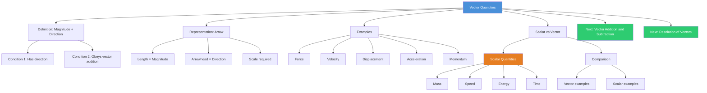

# Vector Quantities / 矢量量

---

# 1. Overview / 概述

**English:**
This sub-topic introduces **vector quantities** — physical quantities that have both **magnitude** and **direction**. Understanding vectors is fundamental to all of mechanics, as many key quantities (displacement, velocity, acceleration, force, momentum) are vectors. This leaf node focuses on what makes a quantity a vector, how to represent vectors graphically, and the key differences between vectors and scalars. Mastery of this foundation is essential before moving to [[Vector Addition and Subtraction]] and [[Resolution of Vectors]].

**中文:**
本子知识点介绍**矢量量**——既有**大小**又有**方向**的物理量。理解矢量是力学的基础，因为许多关键量（位移、速度、加速度、力、动量）都是矢量。本节点聚焦于什么是矢量、如何用图形表示矢量，以及矢量和标量的关键区别。掌握这一基础对于学习[[矢量加减法]]和[[矢量分解]]至关重要。

---

# 2. Syllabus Learning Objectives / 考纲学习目标

| CAIE 9702 (3.1 a-c) | Edexcel IAL (WPH11 U1: 1.1-1.3) |
|---------------------|----------------------------------|
| Distinguish between scalar and vector quantities | Define scalar and vector quantities |
| Give examples of scalar and vector quantities | Give examples of scalar and vector quantities |
| Represent vector quantities by arrows | Represent vectors as directed line segments |

**Examiner Expectations / 考官期望:**
- **English:** You must be able to classify any physical quantity as scalar or vector. You must know that vectors are represented by arrows where length = magnitude and arrowhead = direction. You should be able to state whether common quantities (e.g., speed, velocity, energy, force) are scalar or vector.
- **中文:** 必须能够将任何物理量分类为标量或矢量。必须知道矢量用箭头表示，长度代表大小，箭头代表方向。应能判断常见量（如速率、速度、能量、力）是标量还是矢量。

---

# 3. Core Definitions / 核心定义

| Term (EN/CN) | Definition (EN) | Definition (CN) | Common Mistakes / 常见错误 |
|--------------|-----------------|-----------------|---------------------------|
| **Vector Quantity** / 矢量量 | A physical quantity that has both magnitude and direction and obeys the laws of vector addition. | 既有大小又有方向，且遵循矢量加法法则的物理量。 | ❌ Thinking "direction" alone makes it a vector (e.g., current has direction but is scalar). |
| **Magnitude** / 大小 | The size or numerical value of a vector quantity, always positive. | 矢量量的大小或数值，始终为正。 | ❌ Confusing magnitude with the vector itself. |
| **Direction** / 方向 | The orientation of a vector in space, often given as an angle relative to a reference axis. | 矢量在空间中的指向，通常用相对于参考轴的角度表示。 | ❌ Forgetting to specify the reference direction (e.g., "30°" is incomplete; "30° north of east" is correct). |
| **Scalar Quantity** / 标量量 | A physical quantity that has magnitude only and obeys ordinary arithmetic rules. | 只有大小、遵循普通算术法则的物理量。 | ❌ Assuming all quantities with units are scalars. |
| **Resultant Vector** / 合矢量 | The single vector that produces the same effect as two or more vectors combined. | 与两个或多个矢量组合效果相同的单一矢量。 | ❌ Simply adding magnitudes without considering direction. |

---

# 4. Key Concepts Explained / 关键概念详解

## 4.1 What Makes a Quantity a Vector? / 什么使一个量成为矢量？

### Explanation / 解释
**English:**
A quantity is a vector if it satisfies **two conditions**:
1. It has both **magnitude** and **direction**.
2. It obeys the **laws of vector addition** (e.g., triangle law, parallelogram law).

Many quantities have direction but are **not** vectors. For example, electric current has a direction (from positive to negative) but does not obey vector addition — two currents meeting at a junction add algebraically, not vectorially. Similarly, pressure has direction (acts normal to a surface) but is a scalar.

**中文:**
一个量是矢量的条件是满足**两个条件**：
1. 既有**大小**又有**方向**。
2. 遵循**矢量加法法则**（如三角形法则、平行四边形法则）。

许多量有方向但**不是**矢量。例如，电流有方向（从正极到负极）但不遵循矢量加法——在节点处两电流代数和相加，而非矢量和。同样，压力有方向（垂直于表面）但它是标量。

### Physical Meaning / 物理意义
**English:**
Vectors represent physical quantities where **both how much and which way** matter. For example, knowing a force's magnitude (100 N) is useless without knowing its direction (upward, to the right, etc.). The vector nature of forces explains why objects move in directions different from individual applied forces.

**中文:**
矢量表示**大小和方向都重要**的物理量。例如，只知道力的大小（100 N）而不知道方向（向上、向右等）是无用的。力的矢量性质解释了为什么物体的运动方向与单个施加力的方向不同。

### Common Misconceptions / 常见误区
- ❌ **"All quantities with direction are vectors"** — No! Current, pressure, and temperature gradient have direction but are scalars.
- ❌ **"Magnitude is the same as the vector"** — Magnitude is just one part; direction is equally important.
- ❌ **"Vectors can be added like numbers"** — No! Vector addition requires geometric methods (see [[Vector Addition and Subtraction]]).

### Exam Tips / 考试提示
- ✅ Memorise the **common vector/scalar pairs**: displacement (vector) vs distance (scalar), velocity (vector) vs speed (scalar), acceleration (vector), force (vector), momentum (vector), energy (scalar), work (scalar), power (scalar).
- ✅ In multiple-choice questions, look for "direction" in the definition — but remember the vector addition rule test.
- ✅ When drawing vectors, always include an **arrowhead** and a **scale**.

> 📷 **IMAGE PROMPT — VEC-01: Vector vs Scalar Examples**
> A clean, educational diagram showing two columns: "Vector Quantities" (displacement, velocity, acceleration, force, momentum) with arrow representations, and "Scalar Quantities" (distance, speed, mass, energy, time) with simple numerical labels. Each vector example shows an arrow with labelled magnitude and direction. Use a clear, minimalist style suitable for A-Level physics notes.

---

# 5. Essential Equations / 核心公式

## 5.1 Vector Representation / 矢量表示

$$ \vec{A} = A\hat{a} $$

| Symbol (符号) | Meaning (EN) | Meaning (CN) | Unit (单位) |
|--------------|-------------|-------------|------------|
| $\vec{A}$ | Vector quantity | 矢量量 | Depends on quantity |
| $A$ | Magnitude of vector (always positive) | 矢量的大小（始终为正） | Depends on quantity |
| $\hat{a}$ | Unit vector in direction of $\vec{A}$ | $\vec{A}$方向上的单位矢量 | Dimensionless |

**Derivation / 推导:** Not required at AS level — this is a definition.

**Conditions / 适用条件:**
- **English:** This representation is valid for any vector quantity. The unit vector $\hat{a}$ has magnitude 1 and points in the same direction as $\vec{A}$.
- **中文:** 此表示法适用于任何矢量量。单位矢量$\hat{a}$的大小为1，方向与$\vec{A}$相同。

**Limitations / 局限性:**
- **English:** This notation is abstract. For calculations, vectors are often represented as components (see [[Resolution of Vectors]]).
- **中文:** 此符号较抽象。计算时，矢量通常用分量表示（见[[矢量分解]]）。

---

# 6. Graphs and Relationships / 图表与关系

## 6.1 Vector Arrow Representation / 矢量箭头表示法

### Axes / 坐标轴
- **English:** x-axis (horizontal reference), y-axis (vertical reference). Direction is measured as an angle from a reference axis.
- **中文:** x轴（水平参考），y轴（垂直参考）。方向用相对于参考轴的角度表示。

### Shape / 形状
- **English:** A straight arrow (directed line segment). The arrow's length is proportional to the vector's magnitude. The arrowhead indicates direction.
- **中文:** 一条直线箭头（有向线段）。箭头长度与矢量大小成比例。箭头指示方向。

### Gradient Meaning / 斜率含义
- **English:** Not applicable for individual vector representation. Gradient becomes relevant in vector addition graphs (see [[Vector Addition and Subtraction]]).
- **中文:** 不适用于单个矢量表示。斜率在矢量加法图中相关（见[[矢量加减法]]）。

### Area Meaning / 面积含义
- **English:** Not applicable for individual vector representation.
- **中文:** 不适用于单个矢量表示。

### Exam Interpretation / 考试解读
- **English:** You must be able to draw a vector to scale given its magnitude and direction. You must also be able to read magnitude (measure length) and direction (measure angle) from a drawn vector.
- **中文:** 必须能根据给定的大小和方向按比例画出矢量。也必须能从画出的矢量中读取大小（测量长度）和方向（测量角度）。

> 📷 **IMAGE PROMPT — VEC-02: Vector Arrow Diagram**
> A clean diagram showing three vectors of different magnitudes and directions: one pointing east (5 units), one pointing 30° north of east (8 units), and one pointing 60° north of west (4 units). Each vector is a straight arrow with a labelled magnitude and angle. Include a scale bar (e.g., 1 cm = 2 units). Minimalist style, suitable for A-Level physics.

---

# 7. Required Diagrams / 必备图表

## 7.1 Vector Arrow / 矢量箭头

### Description / 描述
**English:** A vector is represented as a **directed line segment** (arrow). The length of the arrow represents the magnitude (to scale). The arrowhead shows the direction. The starting point is the tail, and the ending point is the head.

**中文:** 矢量用**有向线段**（箭头）表示。箭头长度代表大小（按比例）。箭头指示方向。起点为尾端，终点为头端。

### Image Prompt / 图片生成提示
> 📷 **IMAGE PROMPT — VEC-03: Vector Arrow Labelled**
> A single vector arrow pointing diagonally upward to the right. Clearly label: "Tail" at the starting point, "Head" at the arrowhead, "Magnitude (length)" along the arrow, and "Direction (angle θ)" as an arc from the horizontal axis to the arrow. Include a scale statement: "Scale: 1 cm = 10 N". Clean, educational style for A-Level physics.

### Labels Required / 需要标注
- **English:** Tail, Head, Magnitude (length), Direction (angle θ), Scale
- **中文:** 尾端、头端、大小（长度）、方向（角度θ）、比例尺

### Exam Importance / 考试重要性
- **English:** **High.** Drawing and interpreting vector arrows is tested in almost every mechanics question. You must be precise with scale and angle measurement.
- **中文:** **高。** 几乎每个力学题都会测试画图和解读矢量箭头。必须精确测量比例和角度。

---

# 8. Worked Examples / 典型例题

## Example 1: Classifying Quantities / 例题1：分类量

### Question / 题目
**English:** Classify each of the following as a scalar or vector quantity: (a) speed, (b) velocity, (c) distance, (d) displacement, (e) mass, (f) weight, (g) energy, (h) force.

**中文:** 将下列每个量分类为标量或矢量：(a) 速率, (b) 速度, (c) 距离, (d) 位移, (e) 质量, (f) 重量, (g) 能量, (h) 力。

### Solution / 解答
**Step 1:** Recall the definition — vector has magnitude AND direction; scalar has magnitude only.

**Step 2:** Apply to each:
- (a) Speed = scalar (magnitude only: e.g., 50 km/h)
- (b) Velocity = vector (magnitude + direction: e.g., 50 km/h east)
- (c) Distance = scalar (magnitude only: e.g., 100 m)
- (d) Displacement = vector (magnitude + direction: e.g., 100 m north)
- (e) Mass = scalar (magnitude only: e.g., 5 kg)
- (f) Weight = vector (magnitude + direction: e.g., 50 N downward)
- (g) Energy = scalar (magnitude only: e.g., 100 J)
- (h) Force = vector (magnitude + direction: e.g., 20 N to the right)

### Final Answer / 最终答案
**Answer:** Scalars: (a), (c), (e), (g). Vectors: (b), (d), (f), (h). | **答案：** 标量：(a), (c), (e), (g)。矢量：(b), (d), (f), (h)。

### Quick Tip / 提示
- **English:** If you can ask "which way?" about a quantity, it's likely a vector. For speed, you don't ask "which way?" — it's scalar. For velocity, you do — it's vector.
- **中文:** 如果能对一个量问"往哪个方向？"，它很可能是矢量。对于速率，你不会问"往哪个方向？"——它是标量。对于速度，你会问——它是矢量。

---

## Example 2: Drawing a Vector / 例题2：画矢量

### Question / 题目
**English:** A force of 60 N acts at an angle of 40° above the horizontal to the right. Draw this vector using a scale of 1 cm = 20 N.

**中文:** 一个60 N的力作用在水平向右上方40°的方向。用1 cm = 20 N的比例尺画出这个矢量。

### Solution / 解答
**Step 1:** Calculate the arrow length.
$$ \text{Length} = \frac{60 \text{ N}}{20 \text{ N/cm}} = 3.0 \text{ cm} $$

**Step 2:** Draw a horizontal reference line (x-axis).

**Step 3:** From the tail, measure 40° above the horizontal using a protractor.

**Step 4:** Draw a 3.0 cm arrow along this direction. Add an arrowhead at the tip.

**Step 5:** Label: magnitude (60 N), direction (40° above horizontal), and scale.

### Final Answer / 最终答案
**Answer:** A 3.0 cm arrow at 40° above the horizontal to the right. | **答案：** 一个3.0 cm的箭头，方向为水平向右上方40°。

### Quick Tip / 提示
- **English:** Always state the reference direction (e.g., "above horizontal" not just "40°"). Use a sharp pencil and protractor for accuracy.
- **中文:** 始终说明参考方向（例如"水平上方"而不是仅"40°"）。使用削尖的铅笔和量角器以确保精确。

---

# 9. Past Paper Question Types / 历年真题题型

| Question Type / 题型 | Frequency / 频率 | Difficulty / 难度 | Past Paper References / 真题索引 |
|----------------------|------------------|------------------|-------------------------------|
| Classify scalar vs vector | Very High | Easy | 📝 *待填入* |
| Draw a vector from description | High | Medium | 📝 *待填入* |
| Identify vector from list | Very High | Easy | 📝 *待填入* |
| State whether a quantity is scalar or vector with reason | Medium | Medium | 📝 *待填入* |

**Common Command Words / 常见指令词:**
- **English:** State, Identify, Classify, Draw, Label, Determine
- **中文:** 陈述、识别、分类、画出、标注、确定

---

# 10. Practical Skills Connections / 实验技能链接

**English:**
Vector quantities appear in many practical contexts:
- **Force measurements:** Using spring balances to measure forces in different directions (e.g., equilibrium experiments).
- **Displacement measurements:** Using rulers and protractors to measure displacement vectors in kinematics experiments.
- **Vector addition experiments:** Using force boards to verify vector addition rules (see [[Vector Addition and Subtraction]]).
- **Uncertainties:** When measuring vector magnitude, the uncertainty is in the length measurement. When measuring direction, the uncertainty is in the angle measurement (typically ±1° with a protractor).

**中文:**
矢量量出现在许多实验情境中：
- **力的测量：** 使用弹簧测力计测量不同方向的力（如平衡实验）。
- **位移测量：** 在运动学实验中使用尺子和量角器测量位移矢量。
- **矢量加法实验：** 使用力板验证矢量加法法则（见[[矢量加减法]]）。
- **不确定度：** 测量矢量大小时，不确定度来自长度测量。测量方向时，不确定度来自角度测量（使用量角器通常为±1°）。

---

# 11. Concept Map / 概念图谱

---

# 12. Quick Revision Sheet / 速查表

| Category / 类别 | Key Points / 要点 |
|----------------|------------------|
| **Definition / 定义** | Vector = magnitude + direction + obeys vector addition. Scalar = magnitude only. |
| **Key Examples / 关键例子** | **Vectors:** displacement, velocity, acceleration, force, momentum, weight. **Scalars:** distance, speed, mass, energy, time, power, work. |
| **Representation / 表示** | Arrow: length ∝ magnitude, arrowhead = direction. Always include scale and reference direction. |
| **Common Mistake / 常见错误** | ❌ Thinking current is a vector (it's scalar). ❌ Adding vector magnitudes like scalars. ❌ Forgetting to specify reference direction for angles. |
| **Exam Tip / 考试提示** | ✅ Memorise the vector/scalar pairs. ✅ In "classify" questions, ask "does direction matter?" ✅ When drawing, use a sharp pencil and protractor. |
| **Prerequisite / 前置知识** | Basic trigonometry (sine, cosine) for direction angles. |
| **Next Topic / 下一主题** | [[Vector Addition and Subtraction]] — how to combine vectors. [[Resolution of Vectors]] — breaking vectors into components. |

---

> 📋 **CIE Only:** CAIE 9702 specifically requires students to "distinguish between scalar and vector quantities" and "give examples." The focus is on classification and basic representation. Vector addition is covered separately in 3.1 (d-f).
>
> 📋 **Edexcel Only:** Edexcel IAL WPH11 U1 specifies "define scalar and vector quantities" and "represent vectors as directed line segments." The term "directed line segment" is Edexcel-specific vocabulary.