# 1. Overview / 概述

**English:** Conservation of Momentum is one of the most fundamental and powerful principles in physics, stating that the total momentum of an isolated system remains constant before and after any interaction. This topic explores how momentum is conserved in collisions (elastic and inelastic), explosions, and recoil situations. It is crucial for understanding everything from billiard ball collisions to rocket propulsion and particle physics. In both CAIE 9702 and Edexcel IAL, this is a core topic that appears frequently in multiple-choice, structured, and practical questions. The principle provides a powerful tool for analyzing interactions where forces are unknown or complex, as it bypasses the need to know forces directly.

**中文:** 动量守恒定律是物理学中最基本、最强大的原理之一，它指出孤立系统的总动量在任何相互作用前后保持不变。本主题探讨动量如何在碰撞（弹性和非弹性）、爆炸和后坐力情况下守恒。这对于理解从台球碰撞到火箭推进和粒子物理学的一切都至关重要。在 CAIE 9702 和 Edexcel IAL 中，这是一个核心主题，经常出现在选择题、结构化题和实验题中。该原理为分析力未知或复杂的相互作用提供了一个强大的工具，因为它绕过了直接了解力的需要。

> 📷 **IMAGE PROMPT — [OV-01]: Overview of Momentum Conservation** (A central diagram showing two colliding balls before and after collision, with momentum vectors labeled p₁, p₂ before and p₁', p₂' after. Arrows showing equal and opposite forces during collision. Style: clean physics textbook diagram, vector arrows in blue. Labels: "Before collision", "After collision", "Total momentum conserved". Exam importance: HIGH - conceptual understanding)

# 2. Syllabus Learning Objectives / 考纲学习目标

| CAIE 9702 (3.2 i-k) | Edexcel IAL (WPH11 U1: 2.15-2.18) |
|---|---|
| Define linear momentum and impulse | Define linear momentum as p = mv |
| State and apply the principle of conservation of momentum | State the principle of conservation of momentum |
| Distinguish between elastic and inelastic collisions | Apply conservation of momentum to collisions in one dimension |
| Apply conservation of momentum to collisions and explosions | Apply conservation of momentum to explosions and recoil |
| Understand that kinetic energy is conserved in elastic collisions but not in inelastic collisions | Distinguish between elastic and inelastic collisions |
| Solve problems involving two-dimensional collisions (vector nature) | Solve problems involving collisions in two dimensions |

**Examiner Expectations / 考官期望:**
- **English:** Candidates must be able to state the principle precisely: "The total momentum of an isolated system remains constant." The word "isolated" (no external forces) is critical. For calculations, always define a positive direction and use vector signs consistently. In elastic collisions, both momentum AND kinetic energy are conserved. In inelastic collisions, only momentum is conserved; kinetic energy is lost (usually to heat, sound, deformation).
- **中文:** 考生必须能够精确陈述该原理："孤立系统的总动量保持不变。""孤立"（无外力）一词至关重要。在计算中，始终要定义一个正方向并一致地使用矢量符号。在弹性碰撞中，动量和动能都守恒。在非弹性碰撞中，只有动量守恒；动能损失（通常转化为热、声、形变）。

> 📋 **CIE Only:** CAIE 9702 specifically requires understanding of the vector nature of momentum in two dimensions. Candidates must be able to resolve momentum vectors into components.
> 
> 📋 **Edexcel Only:** Edexcel IAL places strong emphasis on the distinction between elastic and inelastic collisions, including the coefficient of restitution (e) for elastic collisions. Edexcel also expects candidates to derive the conservation principle from [[Newton's Laws of Motion]].

# 3. Core Definitions / 核心定义

| Term (EN/CN) | Definition (EN) | Definition (CN) | Common Mistakes / 常见错误 |
|---|---|---|---|
| [[Linear Momentum]] / 线性动量 | The product of mass and velocity of an object; a vector quantity. p = mv | 物体质量与速度的乘积；矢量。p = mv | Confusing momentum with kinetic energy; forgetting vector nature |
| [[Conservation of Momentum]] / 动量守恒 | The total momentum of an isolated system (no external forces) remains constant before and after any interaction | 孤立系统（无外力）在任何相互作用前后总动量保持不变 | Forgetting "isolated" condition; applying when external forces exist |
| [[Elastic Collision]] / 弹性碰撞 | A collision where both momentum AND kinetic energy are conserved | 动量和动能都守恒的碰撞 | Assuming all collisions are elastic; not checking kinetic energy |
| [[Inelastic Collision]] / 非弹性碰撞 | A collision where momentum is conserved but kinetic energy is not conserved (some KE lost) | 动量守恒但动能不守恒的碰撞（部分动能损失） | Thinking momentum is not conserved; forgetting KE loss |
| [[Perfectly Inelastic Collision]] / 完全非弹性碰撞 | A collision where the objects stick together after impact; maximum KE loss | 碰撞后物体粘在一起的碰撞；动能损失最大 | Confusing with elastic; forgetting they move as one object |
| [[Explosion]] / 爆炸 | An event where an object breaks into parts, with momentum conserved (total initial momentum = 0) | 物体分裂成多部分的事件，动量守恒（初始总动量为零） | Forgetting that total momentum before explosion is zero |
| [[Recoil]] / 后坐力 | The backward momentum of a gun/launcher when a projectile is fired forward | 发射物向前发射时枪/发射器的向后动量 | Not recognizing equal and opposite momenta |
| [[Impulse]] / 冲量 | The product of force and time; equal to change in momentum. J = FΔt = Δp | 力与时间的乘积；等于动量变化。J = FΔt = Δp | Confusing impulse with momentum; forgetting units (Ns) |
| [[Isolated System]] / 孤立系统 | A system where no external forces act on the objects within it | 系统内物体不受任何外力作用的系统 | Thinking "isolated" means no internal forces; internal forces are allowed |
| [[Coefficient of Restitution]] / 恢复系数 | The ratio of relative speed after collision to relative speed before collision; e = v₂' - v₁' / v₁ - v₂ | 碰撞后相对速度与碰撞前相对速度之比；e = v₂' - v₁' / v₁ - v₂ | Edexcel only; confusing with energy conservation |

# 4. Key Concepts Explained / 关键概念详解

## 4.1 The Principle of Conservation of Momentum / 动量守恒原理

### Explanation / 解释:
**English:** The principle states: "For an isolated system (no external forces), the total momentum before an interaction equals the total momentum after the interaction." This is derived from [[Newton's Laws of Motion]] — specifically Newton's Third Law (action-reaction pairs) and Newton's Second Law (F = Δp/Δt). When two objects collide, they exert equal and opposite forces on each other over the same time interval, so the impulse (FΔt) on each is equal and opposite, resulting in equal and opposite changes in momentum. Therefore, total momentum change is zero.

**中文:** 该原理指出："对于一个孤立系统（无外力），相互作用前的总动量等于相互作用后的总动量。"这是从[[牛顿运动定律]]推导出来的——特别是牛顿第三定律（作用力与反作用力对）和牛顿第二定律（F = Δp/Δt）。当两个物体碰撞时，它们在相同的时间间隔内对彼此施加大小相等、方向相反的力，因此每个物体受到的冲量（FΔt）大小相等、方向相反，导致动量变化大小相等、方向相反。因此，总动量变化为零。

### Physical Meaning / 物理意义:
**English:** Momentum conservation is a fundamental symmetry of nature, related to the homogeneity of space (Noether's theorem). It means that in the absence of external influences, the "quantity of motion" in a system cannot be created or destroyed — it can only be transferred between objects. This is why a gun recoils when a bullet is fired: the bullet's forward momentum is balanced by the gun's backward momentum.

**中文:** 动量守恒是自然界的一个基本对称性，与空间的均匀性有关（诺特定理）。这意味着在没有外部影响的情况下，系统中的"运动量"不能被创造或消灭——它只能在物体之间转移。这就是为什么枪在发射子弹时会后坐：子弹向前的动量与枪向后的动量相平衡。

### Common Misconceptions / 常见误区:
- **Momentum is not conserved when objects stick together:** WRONG. Momentum is ALWAYS conserved in an isolated system, even in perfectly inelastic collisions where objects stick.
- **Kinetic energy conservation = momentum conservation:** WRONG. These are separate principles. Momentum is always conserved; kinetic energy is only conserved in elastic collisions.
- **Momentum can be negative:** CORRECT. Momentum is a vector; direction matters. A negative sign indicates opposite direction to the chosen positive direction.
- **External forces don't matter:** WRONG. External forces (friction, gravity) break the "isolated system" condition. In real collisions, momentum is approximately conserved if external forces are negligible during the brief collision time.

### Exam Tips / 考试提示:
**English:** Always define a positive direction before starting calculations. Draw momentum vectors (arrows) to visualize direction. For two-dimensional problems, resolve into x and y components and apply conservation separately. Check if the collision is elastic or inelastic by comparing total kinetic energy before and after.
**中文:** 在开始计算前始终定义一个正方向。画出动量矢量（箭头）来可视化方向。对于二维问题，分解为x和y分量并分别应用守恒定律。通过比较碰撞前后的总动能来判断碰撞是弹性还是非弹性的。

> 📷 **IMAGE PROMPT — [KC-01]: Momentum Conservation Derivation** (Two objects A and B colliding. Show force vectors F_AB and F_BA equal and opposite. Time interval Δt shown. Impulse arrows: F_AB·Δt = Δp_A and F_BA·Δt = Δp_B. Final equation: Δp_A + Δp_B = 0. Style: step-by-step derivation diagram, clear force arrows. Labels: "Newton's Third Law: F_AB = -F_BA", "Same time interval Δt", "Δp_A = -Δp_B". Exam importance: HIGH)

## 4.2 Elastic vs Inelastic Collisions / 弹性碰撞与非弹性碰撞

### Explanation / 解释:
**English:** The key distinction is whether kinetic energy is conserved:
- **Elastic Collision:** Both momentum AND kinetic energy are conserved. Objects bounce off each other without deformation. Examples: billiard balls, gas molecules (ideal), subatomic particles.
- **Inelastic Collision:** Momentum is conserved but kinetic energy is NOT conserved. Some KE is converted to heat, sound, or deformation energy. Examples: car crashes, clay balls sticking.
- **Perfectly Inelastic Collision:** Objects stick together after collision, moving with common velocity. Maximum possible KE loss.

**中文:** 关键区别在于动能是否守恒：
- **弹性碰撞：** 动量和动能都守恒。物体相互弹开而不变形。例如：台球、气体分子（理想）、亚原子粒子。
- **非弹性碰撞：** 动量守恒但动能不守恒。部分动能转化为热、声或形变能。例如：车祸、粘土球粘在一起。
- **完全非弹性碰撞：** 碰撞后物体粘在一起，以共同速度运动。动能损失最大。

### Physical Meaning / 物理意义:
**English:** In elastic collisions, the total kinetic energy remains the same because no energy is dissipated. This is an idealization — truly elastic collisions only occur at the atomic/subatomic level. In inelastic collisions, the "lost" kinetic energy is transformed into other forms (thermal energy, sound waves, plastic deformation). The coefficient of restitution (e) quantifies elasticity: e = 1 for perfectly elastic, e = 0 for perfectly inelastic, 0 < e < 1 for real inelastic collisions.

**中文:** 在弹性碰撞中，总动能保持不变，因为没有能量耗散。这是一种理想化——真正的弹性碰撞只发生在原子/亚原子层面。在非弹性碰撞中，"损失"的动能转化为其他形式（热能、声波、塑性形变）。恢复系数（e）量化了弹性：e = 1 为完全弹性，e = 0 为完全非弹性，0 < e < 1 为真实非弹性碰撞。

### Common Misconceptions / 常见误区:
- **"Elastic" means objects bounce:** PARTIALLY TRUE. Bouncing doesn't guarantee elastic — some KE is always lost in real bounces.
- **Inelastic collisions violate energy conservation:** WRONG. Total energy is always conserved; kinetic energy is converted to other forms.
- **Perfectly inelastic collisions lose ALL kinetic energy:** WRONG. They lose the maximum possible KE, but some KE remains (objects still move).
- **Momentum is not conserved in inelastic collisions:** WRONG. Momentum is ALWAYS conserved in isolated systems regardless of elasticity.

### Exam Tips / 考试提示:
**English:** To determine if a collision is elastic, calculate total KE before and after. If KE_before = KE_after, it's elastic. For perfectly inelastic collisions, use the "sticking together" condition: v₁' = v₂' = v_common. For Edexcel, be prepared to use the coefficient of restitution equation alongside momentum conservation.
**中文:** 要判断碰撞是否为弹性，计算碰撞前后的总动能。如果 KE_before = KE_after，则为弹性。对于完全非弹性碰撞，使用"粘在一起"条件：v₁' = v₂' = v_common。对于 Edexcel，要准备好将恢复系数方程与动量守恒一起使用。

> 📷 **IMAGE PROMPT — [KC-02]: Elastic vs Inelastic Collision Comparison** (Side-by-side diagrams: Left shows elastic collision with two balls bouncing apart, KE conserved label. Right shows inelastic collision with balls sticking together, KE lost label. Energy bar charts below each showing KE before and after. Style: comparison diagram, color-coded (green for elastic, red for inelastic). Labels: "Elastic: KE conserved", "Inelastic: KE not conserved", "Momentum conserved in both". Exam importance: HIGH)

## 4.3 Explosions and Recoil / 爆炸与后坐力

### Explanation / 解释:
**English:** In explosions and recoil, an initially stationary object breaks apart or ejects mass. Since total initial momentum is zero, the total final momentum must also be zero. This means the fragments move in opposite directions with equal magnitudes of momentum. For a gun firing a bullet: m_bullet × v_bullet + m_gun × v_gun = 0, so v_gun = -(m_bullet/m_gun) × v_bullet. The negative sign indicates opposite direction.

**中文:** 在爆炸和后坐力中，一个初始静止的物体分裂或喷射质量。由于初始总动量为零，最终总动量也必须为零。这意味着碎片以大小相等的动量向相反方向运动。对于枪发射子弹：m_bullet × v_bullet + m_gun × v_gun = 0，所以 v_gun = -(m_bullet/m_gun) × v_bullet。负号表示相反方向。

### Physical Meaning / 物理意义:
**English:** This explains why a gun recoils, why a rocket moves forward (ejecting exhaust gases backward), and why a firework explodes symmetrically. The principle is the same as collisions but in reverse — instead of objects coming together, they separate. The total momentum remains zero throughout.

**中文:** 这解释了为什么枪会后坐，为什么火箭向前运动（向后喷射废气），以及为什么烟花对称爆炸。原理与碰撞相同但方向相反——不是物体聚集在一起，而是它们分离。总动量始终保持为零。

### Common Misconceptions / 常见误区:
- **The gun moves backward with the same speed as the bullet:** WRONG. The gun has much larger mass, so its speed is much smaller (momentum magnitudes are equal, not speeds).
- **Explosions create momentum from nothing:** WRONG. The momentum was always zero; fragments have equal and opposite momenta.
- **Rockets push against the air:** WRONG. Rockets work in vacuum too — they push against the exhaust gases they eject.

### Exam Tips / 考试提示:
**English:** For explosion problems, always set initial momentum = 0. Use vector signs carefully — one direction is positive, the opposite is negative. For multi-fragment explosions, the vector sum of all final momenta must be zero. In two dimensions, resolve into components.
**中文:** 对于爆炸问题，始终设初始动量为零。仔细使用矢量符号——一个方向为正，相反方向为负。对于多碎片爆炸，所有最终动量的矢量和必须为零。在二维中，分解为分量。

> 📷 **IMAGE PROMPT — [KC-03]: Gun Recoil Diagram** (A rifle firing a bullet. Show bullet moving right with momentum p_bullet = m_bullet·v_bullet. Show rifle moving left with momentum p_gun = m_gun·v_gun. Arrows of different lengths showing different speeds but equal momentum magnitudes. Equation: p_bullet + p_gun = 0. Style: clear physics diagram, vector arrows. Labels: "Before: total p = 0", "After: p_bullet = -p_gun". Exam importance: HIGH)

## 4.4 Two-Dimensional Collisions / 二维碰撞

### Explanation / 解释:
**English:** When collisions occur in two dimensions (e.g., glancing collisions), momentum must be conserved in both the x-direction and y-direction separately. This gives two independent equations:
- x-direction: m₁u₁ₓ + m₂u₂ₓ = m₁v₁ₓ + m₂v₂ₓ
- y-direction: m₁u₁ᵧ + m₂u₂ᵧ = m₁v₁ᵧ + m₂v₂ᵧ

For elastic collisions, kinetic energy conservation provides a third equation. Typically, one object is initially moving and the other is stationary. After collision, both move at angles to the original direction.

**中文:** 当碰撞发生在二维中时（例如，擦碰），动量必须在x方向和y方向上分别守恒。这给出了两个独立方程：
- x方向：m₁u₁ₓ + m₂u₂ₓ = m₁v₁ₓ + m₂v₂ₓ
- y方向：m₁u₁ᵧ + m₂u₂ᵧ = m₁v₁ᵧ + m₂v₂ᵧ

对于弹性碰撞，动能守恒提供了第三个方程。通常，一个物体初始运动，另一个静止。碰撞后，两个物体都沿与原始方向成角度的方向运动。

### Physical Meaning / 物理意义:
**English:** Two-dimensional collisions are more realistic than one-dimensional ones. In real life, objects rarely collide head-on. The vector nature of momentum means we must treat each direction independently. This is analogous to resolving forces or velocities into components.

**中文:** 二维碰撞比一维碰撞更真实。在现实生活中，物体很少正面碰撞。动量的矢量性质意味着我们必须独立处理每个方向。这类似于将力或速度分解为分量。

### Common Misconceptions / 常见误区:
- **Total speed is conserved in 2D elastic collisions:** WRONG. Only kinetic energy (½mv²) is conserved, not speed. Speed of each object can change.
- **The angle of deflection is 90° for equal mass elastic collisions:** TRUE ONLY for one specific case (stationary target, equal masses, elastic). This is a special result.
- **Momentum magnitude is conserved:** WRONG. Momentum is a vector; the vector sum is conserved, not individual magnitudes.

### Exam Tips / 考试提示:
**English:** Always resolve velocities into components using trigonometry (sin, cos). Write separate conservation equations for x and y. For elastic collisions, you may also need the kinetic energy equation. Common exam setup: one object moving along x-axis hits a stationary object; after collision, both move at angles θ and φ to the x-axis.
**中文:** 始终使用三角学（sin, cos）将速度分解为分量。为x和y分别写出守恒方程。对于弹性碰撞，可能还需要动能方程。常见的考试设置：一个物体沿x轴运动撞击静止物体；碰撞后，两个物体都以与x轴成θ和φ角的方向运动。

> 📷 **IMAGE PROMPT — [KC-04]: 2D Collision Diagram** (A ball moving right hits a stationary ball. After collision, ball 1 moves at angle θ above the x-axis with velocity v₁, ball 2 moves at angle φ below the x-axis with velocity v₂. Show velocity components: v₁ₓ = v₁cosθ, v₁ᵧ = v₁sinθ, v₂ₓ = v₂cosφ, v₂ᵧ = -v₂sinφ. Style: vector diagram with dashed components. Labels: "Before", "After", "x-direction: p conserved", "y-direction: p conserved". Exam importance: HIGH)

# 5. Essential Equations / 核心公式

## 5.1 Linear Momentum / 线性动量

$$ \vec{p} = m\vec{v} $$

| Symbol (符号) | Meaning (EN/CN) | Unit (单位) |
|---|---|---|
| $\vec{p}$ | Momentum / 动量 | kg·m/s |
| $m$ | Mass / 质量 | kg |
| $\vec{v}$ | Velocity / 速度 | m/s |

**Derivation:** Definition — no derivation required.
**Conditions:** Valid for all objects with mass.
**Limitations:** For relativistic speeds (v > 0.1c), relativistic momentum must be used.
**Rearrangements:** $m = p/v$, $v = p/m$

## 5.2 Principle of Conservation of Momentum / 动量守恒原理

$$ \sum \vec{p}_{\text{before}} = \sum \vec{p}_{\text{after}} $$

$$ m_1\vec{u}_1 + m_2\vec{u}_2 = m_1\vec{v}_1 + m_2\vec{v}_2 $$

| Symbol (符号) | Meaning (EN/CN) | Unit (单位) |
|---|---|---|
| $m_1, m_2$ | Masses of objects 1 and 2 / 物体1和2的质量 | kg |
| $\vec{u}_1, \vec{u}_2$ | Initial velocities / 初始速度 | m/s |
| $\vec{v}_1, \vec{v}_2$ | Final velocities / 最终速度 | m/s |

**Derivation:** From Newton's Third Law: $F_{12} = -F_{21}$. Using $F = \Delta p/\Delta t$: $\Delta p_1/\Delta t = -\Delta p_2/\Delta t$, so $\Delta p_1 + \Delta p_2 = 0$, meaning $p_{\text{total}}$ is constant.
**Conditions:** Only valid for isolated systems (no external forces).
**Limitations:** External forces must be negligible during the interaction time.
**Rearrangements:** $m_1u_1 + m_2u_2 = m_1v_1 + m_2v_2$ (1D, scalar form with sign convention)

## 5.3 Kinetic Energy in Collisions / 碰撞中的动能

$$ KE = \frac{1}{2}mv^2 $$

$$ \sum KE_{\text{before}} = \sum KE_{\text{after}} \quad \text{(elastic only)} $$

| Symbol (符号) | Meaning (EN/CN) | Unit (单位) |
|---|---|---|
| $KE$ | Kinetic Energy / 动能 | J |
| $m$ | Mass / 质量 | kg |
| $v$ | Speed / 速率 | m/s |

**Derivation:** Standard kinetic energy formula.
**Conditions:** For elastic collisions only; for inelastic collisions, $KE_{\text{before}} > KE_{\text{after}}$.
**Limitations:** Does not account for rotational KE or internal energy.
**Rearrangements:** $v = \sqrt{2KE/m}$

## 5.4 Perfectly Inelastic Collision (Sticking Together) / 完全非弹性碰撞（粘在一起）

$$ m_1u_1 + m_2u_2 = (m_1 + m_2)v $$

| Symbol (符号) | Meaning (EN/CN) | Unit (单位) |
|---|---|---|
| $v$ | Common final velocity / 共同最终速度 | m/s |
| $m_1 + m_2$ | Combined mass / 组合质量 | kg |

**Derivation:** From conservation of momentum with $v_1 = v_2 = v$.
**Conditions:** Objects stick together after collision.
**Limitations:** Maximum KE loss occurs.
**Rearrangements:** $v = \frac{m_1u_1 + m_2u_2}{m_1 + m_2}$

## 5.5 Coefficient of Restitution (Edexcel) / 恢复系数（Edexcel）

$$ e = \frac{\text{relative speed after collision}}{\text{relative speed before collision}} = \frac{v_2 - v_1}{u_1 - u_2} $$

| Symbol (符号) | Meaning (EN/CN) | Unit (单位) |
|---|---|---|
| $e$ | Coefficient of restitution / 恢复系数 | dimensionless |
| $u_1, u_2$ | Initial velocities / 初始速度 | m/s |
| $v_1, v_2$ | Final velocities / 最终速度 | m/s |

**Derivation:** Empirical definition.
**Conditions:** $e = 1$ for perfectly elastic, $e = 0$ for perfectly inelastic, $0 < e < 1$ for real collisions.
**Limitations:** Edexcel only; not in CAIE 9702 syllabus.
**Rearrangements:** $v_2 - v_1 = e(u_1 - u_2)$

> 📋 **Edexcel Only:** The coefficient of restitution is a key concept in Edexcel IAL. It is used alongside momentum conservation to solve collision problems. For a collision between two objects, you have two equations: momentum conservation and the restitution equation, allowing you to solve for two unknowns.

## 5.6 Impulse-Momentum Theorem / 冲量-动量定理

$$ \vec{J} = \vec{F}\Delta t = \Delta\vec{p} = m\vec{v} - m\vec{u} $$

| Symbol (符号) | Meaning (EN/CN) | Unit (单位) |
|---|---|---|
| $\vec{J}$ | Impulse / 冲量 | N·s |
| $\vec{F}$ | Average force / 平均力 | N |
| $\Delta t$ | Time interval / 时间间隔 | s |
| $\Delta\vec{p}$ | Change in momentum / 动量变化 | kg·m/s |

**Derivation:** From Newton's Second Law: $\vec{F} = \frac{d\vec{p}}{dt}$, so $\int \vec{F} dt = \Delta\vec{p}$.
**Conditions:** Valid for constant or average force.
**Limitations:** For variable forces, use average force or integrate.
**Rearrangements:** $F = \frac{\Delta p}{\Delta t}$, $\Delta t = \frac{\Delta p}{F}$

# 6. Graphs and Relationships / 图表与关系

## 6.1 Force-Time Graph for a Collision / 碰撞的力-时间图

**Axes:** x-axis: Time (t / s), y-axis: Force (F / N)

**Shape:** A spike or pulse shape — force rises rapidly from zero to a maximum, then decreases back to zero. The area under the curve represents the impulse.

**Gradient Meaning (EN+CN):** The gradient (dF/dt) represents the rate of change of force. Not typically examined directly.
**中文：** 梯度（dF/dt）表示力的变化率。通常不直接考查。

**Area Meaning (EN+CN):** The area under the F-t graph equals the impulse (J = ∫F dt), which equals the change in momentum (Δp). This is the most important feature.
**中文：** F-t图下的面积等于冲量（J = ∫F dt），等于动量变化（Δp）。这是最重要的特征。

**Exam Interpretation / 考试解读:**
- Larger area = larger impulse = larger momentum change
- Shorter collision time with same area = larger average force
- Area can be estimated by counting squares or using average force × time

**Common Questions / 常见问题:**
- Calculate impulse from area under F-t graph
- Find average force from impulse and time
- Compare impulses for different collisions

> 📷 **IMAGE PROMPT — [GR-01]: Force-Time Graph for Collision** (A graph showing force on y-axis vs time on x-axis. A pulse shape: force rises from 0 to F_max, then drops back to 0. Shaded area under curve labeled "Impulse = Δp". Dashed line showing average force F_avg. Style: standard physics graph, clear axes with units. Labels: "Area = Impulse = F·Δt = Δp", "F_max", "F_avg", "Δt". Exam importance: HIGH)

## 6.2 Momentum-Time Graph / 动量-时间图

**Axes:** x-axis: Time (t / s), y-axis: Momentum (p / kg·m/s)

**Shape:** For a constant force, momentum changes linearly with time (straight line). For a collision, momentum changes rapidly during the brief collision time.

**Gradient Meaning (EN+CN):** The gradient of the p-t graph equals the net force acting on the object (F = dp/dt).
**中文：** p-t图的梯度等于作用在物体上的合力（F = dp/dt）。

**Area Meaning (EN+CN):** The area under the p-t graph has no direct physical meaning.
**中文：** p-t图下的面积没有直接的物理意义。

**Exam Interpretation / 考试解读:**
- Steeper slope = larger force
- Horizontal line = constant momentum = zero net force
- During collision: very steep slope (large force over short time)

**Common Questions / 常见问题:**
- Determine force from gradient of p-t graph
- Identify when external forces act
- Compare forces from different slopes

## 6.3 Velocity-Time Graph for Collisions / 碰撞的速度-时间图

**Axes:** x-axis: Time (t / s), y-axis: Velocity (v / m/s)

**Shape:** For two colliding objects, velocities change abruptly at the collision time. Before collision, velocities may be constant (no external forces). After collision, new constant velocities.

**Gradient Meaning (EN+CN):** Gradient = acceleration (a = dv/dt). During collision, very large acceleration (steep slope).
**中文：** 梯度 = 加速度（a = dv/dt）。碰撞期间，非常大的加速度（陡坡）。

**Area Meaning (EN+CN):** Area under v-t graph = displacement.
**中文：** v-t图下的面积 = 位移。

**Exam Interpretation / 考试解读:**
- Before collision: horizontal lines (constant velocity)
- At collision: vertical jump (instantaneous velocity change in ideal model)
- After collision: new horizontal lines
- For perfectly inelastic: both objects have same velocity after collision

**Common Questions / 常见问题:**
- Read velocities before and after collision from graph
- Calculate momentum changes
- Determine if collision is elastic or inelastic by comparing velocities

> 📷 **IMAGE PROMPT — [GR-02]: Velocity-Time Graph for Collision** (Two lines on same graph: Object A (solid line) and Object B (dashed line). Before collision: A at positive velocity, B at zero (stationary). At collision time t_c: A's velocity drops, B's velocity rises. After collision: both at new constant velocities. For inelastic: both at same velocity. Style: clear graph with two distinct lines. Labels: "Before collision", "Collision", "After collision", "v_A", "v_B", "Common velocity (inelastic)". Exam importance: MEDIUM)

# 7. Required Diagrams / 必备图表

## 7.1 Before and After Collision Diagram / 碰撞前后示意图

> 📷 **IMAGE PROMPT — [DG-01]: Before and After Collision** (Two diagrams side by side. Left: "Before collision" — two balls approaching each other with velocity vectors u₁ and u₂, masses m₁ and m₂ labeled. Right: "After collision" — two balls moving apart with velocity vectors v₁ and v₂. Momentum vectors shown as arrows. Equation below: m₁u₁ + m₂u₂ = m₁v₁ + m₂v₂. Style: clean textbook diagram, blue vectors for velocity, red for momentum. Labels: "m₁", "m₂", "u₁", "u₂", "v₁", "v₂", "Before", "After", "Total momentum conserved". Exam importance: ESSENTIAL — draw this for every collision problem)

## 7.2 Explosion/Recoil Diagram / 爆炸/后坐力示意图

> 📷 **IMAGE PROMPT — [DG-02]: Explosion Recoil** (A stationary object (mass M) at center. Arrows showing fragments flying apart: one fragment (mass m₁) moving right with velocity v₁, another fragment (mass m₂) moving left with velocity v₂. Momentum vectors: p₁ = m₁v₁ (right), p₂ = m₂v₂ (left), equal lengths showing equal magnitudes. Equation: 0 = m₁v₁ + m₂v₂ (with sign convention). Style: explosion diagram with radial arrows. Labels: "Before: total p = 0", "After: p₁ = -p₂", "m₁", "m₂", "v₁", "v₂". Exam importance: HIGH)

## 7.3 Two-Dimensional Collision Vector Diagram / 二维碰撞矢量图

> 📷 **IMAGE PROMPT — [DG-03]: 2D Collision Vector Resolution** (A ball moving along x-axis hits a stationary ball. After collision: ball 1 moves at angle θ above x-axis with velocity v₁, ball 2 moves at angle φ below x-axis with velocity v₂. Show velocity components: v₁ₓ = v₁cosθ, v₁ᵧ = v₁sinθ, v₂ₓ = v₂cosφ, v₂ᵧ = -v₂sinφ. Momentum conservation equations written: x: m₁u₁ = m₁v₁cosθ + m₂v₂cosφ, y: 0 = m₁v₁sinθ - m₂v₂sinφ. Style: vector diagram with dashed component lines, right-angle indicators. Labels: "Before: ball 1 moving along x", "After: both at angles", "θ", "φ", "v₁cosθ", "v₁sinθ", etc. Exam importance: HIGH — common in structured questions)

## 7.4 Force-Time Graph for Impulse / 冲量的力-时间图

> 📷 **IMAGE PROMPT — [DG-04]: Force-Time Graph** (A graph with Force (N) on y-axis, Time (s) on x-axis. A triangular pulse: force rises linearly from 0 to F_max at t₁, then decreases linearly to 0 at t₂. Shaded area under triangle labeled "Impulse = ½ × F_max × Δt". Dashed horizontal line at F_avg showing average force. Style: standard physics graph paper style. Labels: "F_max", "F_avg", "Δt = t₂ - t₁", "Area = Impulse = Δp". Exam importance: HIGH — Paper 3/5 practical skills)

# 8. Worked Examples / 典型例题

## Example 1: One-Dimensional Elastic Collision / 一维弹性碰撞

### Question / 题目
**English:** A ball of mass 2.0 kg moving at 4.0 m/s collides head-on with a stationary ball of mass 1.0 kg. The collision is elastic. Calculate the velocities of both balls after the collision.

**中文:** 一个质量为2.0 kg、以4.0 m/s运动的球与一个质量为1.0 kg的静止球发生正面碰撞。碰撞是弹性的。计算碰撞后两个球的速度。

### Image Prompt / 图片提示
> 📷 **IMAGE PROMPT — [EX-01]: Elastic Collision Example** (Before: 2 kg ball moving right at 4 m/s, 1 kg ball stationary. After: both balls moving right with velocities v₁ and v₂. Arrows showing direction. Style: simple diagram with labeled masses and velocities. Labels: "Before: m₁=2kg, u₁=4m/s", "m₂=1kg, u₂=0", "After: v₁=?, v₂=?". Exam importance: HIGH)

### Solution / 解答

**Step 1: Define positive direction / 定义正方向**
Let the initial direction of the 2.0 kg ball be positive.

**Step 2: Apply conservation of momentum / 应用动量守恒**
$$ m_1u_1 + m_2u_2 = m_1v_1 + m_2v_2 $$
$$ (2.0)(4.0) + (1.0)(0) = (2.0)v_1 + (1.0)v_2 $$
$$ 8.0 = 2v_1 + v_2 \quad \text{(Equation 1)} $$

**Step 3: Apply conservation of kinetic energy (elastic) / 应用动能守恒（弹性）**
$$ \frac{1}{2}m_1u_1^2 + \frac{1}{2}m_2u_2^2 = \frac{1}{2}m_1v_1^2 + \frac{1}{2}m_2v_2^2 $$
$$ \frac{1}{2}(2.0)(4.0)^2 + 0 = \frac{1}{2}(2.0)v_1^2 + \frac{1}{2}(1.0)v_2^2 $$
$$ 16 = v_1^2 + 0.5v_2^2 \quad \text{(Equation 2)} $$

**Step 4: Solve simultaneous equations / 解联立方程**
From Equation 1: $v_2 = 8 - 2v_1$

Substitute into Equation 2:
$$ 16 = v_1^2 + 0.5(8 - 2v_1)^2 $$
$$ 16 = v_1^2 + 0.5(64 - 32v_1 + 4v_1^2) $$
$$ 16 = v_1^2 + 32 - 16v_1 + 2v_1^2 $$
$$ 16 = 3v_1^2 - 16v_1 + 32 $$
$$ 0 = 3v_1^2 - 16v_1 + 16 $$

Using quadratic formula:
$$ v_1 = \frac{16 \pm \sqrt{256 - 192}}{6} = \frac{16 \pm \sqrt{64}}{6} = \frac{16 \pm 8}{6} $$

$v_1 = \frac{24}{6} = 4.0$ m/s (this is the initial velocity — the ball continues unchanged, which would mean no collision, so this is the trivial solution)

$v_1 = \frac{8}{6} = 1.33$ m/s (this is the correct physical solution)

From Equation 1: $v_2 = 8 - 2(1.33) = 8 - 2.67 = 5.33$ m/s

### Final Answer / 最终答案
**English:** After the collision:
- The 2.0 kg ball moves at 1.33 m/s in the original direction
- The 1.0 kg ball moves at 5.33 m/s in the original direction

**中文:** 碰撞后：
- 2.0 kg 的球以 1.33 m/s 的速度沿原方向运动
- 1.0 kg 的球以 5.33 m/s 的速度沿原方向运动

### Examiner Notes / 考官点评
**English:** This is a classic elastic collision problem. The quadratic gives two solutions — always reject the trivial solution (v₁ = u₁, meaning no collision). For equal mass elastic collisions with one stationary, the moving ball stops and the stationary ball moves with the original velocity. Here, the moving ball is heavier, so it continues forward but slower, while the lighter ball moves faster. Always check that kinetic energy is conserved: KE_before = 16 J, KE_after = ½(2)(1.33²) + ½(1)(5.33²) = 1.78 + 14.22 = 16 J ✓

**中文:** 这是一个经典的弹性碰撞问题。二次方程给出两个解——始终要排除平凡解（v₁ = u₁，意味着没有碰撞）。对于等质量弹性碰撞且一个静止的情况，运动的球停止，静止的球以原始速度运动。这里，运动的球更重，所以它继续向前但更慢，而更轻的球运动得更快。始终检查动能是否守恒：KE_before = 16 J，KE_after = ½(2)(1.33²) + ½(1)(5.33²) = 1.78 + 14.22 = 16 J ✓

## Example 2: Perfectly Inelastic Collision / 完全非弹性碰撞

### Question / 题目
**English:** A car of mass 1200 kg traveling at 15 m/s collides with a stationary truck of mass 1800 kg. The vehicles stick together after the collision. Calculate:
(a) The common velocity of the vehicles immediately after the collision
(b) The kinetic energy lost during the collision

**中文:** 一辆质量为1200 kg、以15 m/s行驶的汽车与一辆质量为1800 kg的静止卡车相撞。碰撞后车辆粘在一起。计算：
(a) 碰撞后车辆的共同速度
(b) 碰撞过程中损失的动能

### Image Prompt / 图片提示
> 📷 **IMAGE PROMPT — [EX-02]: Perfectly Inelastic Collision** (Before: car (1200 kg) moving right at 15 m/s, truck (1800 kg) stationary. After: both vehicles stuck together moving right at common velocity v. Style: simple vehicle diagrams, labeled masses and velocities. Labels: "Before: m_car=1200kg, u_car=15m/s", "m_truck=1800kg, u_truck=0", "After: m_total=3000kg, v=?". Exam importance: HIGH)

### Solution / 解答

**Part (a): Common velocity / 共同速度**

**Step 1: Define positive direction / 定义正方向**
Let the direction of the car's motion be positive.

**Step 2: Apply conservation of momentum / 应用动量守恒**
$$ m_1u_1 + m_2u_2 = (m_1 + m_2)v $$
$$ (1200)(15) + (1800)(0) = (1200 + 1800)v $$
$$ 18000 = 3000v $$
$$ v = \frac{18000}{3000} = 6.0 \text{ m/s} $$

**Part (b): Kinetic energy lost / 动能损失**

**Step 1: Calculate KE before collision / 计算碰撞前动能**
$$ KE_{\text{before}} = \frac{1}{2}m_1u_1^2 + \frac{1}{2}m_2u_2^2 $$
$$ KE_{\text{before}} = \frac{1}{2}(1200)(15)^2 + 0 $$
$$ KE_{\text{before}} = \frac{1}{2}(1200)(225) = 135000 \text{ J} $$

**Step 2: Calculate KE after collision / 计算碰撞后动能**
$$ KE_{\text{after}} = \frac{1}{2}(m_1 + m_2)v^2 $$
$$ KE_{\text{after}} = \frac{1}{2}(3000)(6.0)^2 $$
$$ KE_{\text{after}} = \frac{1}{2}(3000)(36) = 54000 \text{ J} $$

**Step 3: Calculate KE lost / 计算动能损失**
$$ KE_{\text{lost}} = KE_{\text{before}} - KE_{\text{after}} $$
$$ KE_{\text{lost}} = 135000 - 54000 = 81000 \text{ J} $$

### Final Answer / 最终答案
**English:**
(a) The common velocity after collision is 6.0 m/s in the direction of the car's original motion.
(b) The kinetic energy lost is 81,000 J (60% of the original KE).

**中文:**
(a) 碰撞后的共同速度为 6.0 m/s，方向与汽车原运动方向相同。
(b) 损失的动能为 81,000 J（原始动能的 60%）。

### Examiner Notes / 考官点评
**English:** This is a perfectly inelastic collision — the key is that both objects have the same final velocity. The momentum equation is simpler than for elastic collisions. Note that 60% of the kinetic energy is lost — this energy is converted to heat, sound, and deformation of the vehicles. In exam questions, you may be asked where the "lost" energy goes. Always state: "converted to thermal energy (heat), sound energy, and work done in deforming the materials."

**中文:** 这是一个完全非弹性碰撞——关键是两个物体具有相同的最终速度。动量方程比弹性碰撞简单。注意60%的动能损失了——这些能量转化为热、声和车辆的形变。在考试题中，可能会被问及"损失"的能量去了哪里。始终说明："转化为热能（热）、声能和对材料形变所做的功。"

# 9. Past Paper Question Types / 历年真题题型

| Question Type / 题型 | Frequency / 频率 | Difficulty / 难度 | Past Paper References / 真题索引 |
|---|---|---|---|
| Multiple Choice: Conservation of momentum calculation | Very High | Easy-Medium | 📝 *待填入* |
| Structured: Elastic collision with two unknowns | Very High | Medium-Hard | 📝 *待填入* |
| Structured: Perfectly inelastic collision (sticking) | High | Medium | 📝 *待填入* |
| Structured: Explosion/recoil calculation | High | Medium | 📝 *待填入* |
| Structured: Two-dimensional collision (vector resolution) | Medium | Hard | 📝 *待填入* |
| Practical: Force-time graph and impulse calculation | Medium | Medium | 📝 *待填入* |
| Multiple Choice: Distinguishing elastic vs inelastic | Medium | Easy | 📝 *待填入* |
| Structured: Coefficient of restitution (Edexcel only) | Medium | Medium-Hard | 📝 *待填入* |
| Structured: Energy loss calculation in collisions | High | Medium | 📝 *待填入* |
| Essay: Derivation of conservation principle from Newton's laws | Low | Medium | 📝 *待填入* |

> 📝 **题库整理中 / Question Bank Under Construction:** 本表格中的真题索引正在整理中。建议学生参考以下资源：CAIE 9702/22, 9702/23, 9702/33 近年试卷；Edexcel IAL WPH11/01 近年试卷。典型题目包括：两球碰撞求速度、爆炸反冲计算、二维碰撞矢量分解、F-t图求冲量等。The past paper references in this table are being compiled. Students are advised to refer to recent CAIE 9702/22, 9702/23, 9702/33 papers and Edexcel IAL WPH11/01 papers. Typical questions include: two-ball collision velocity calculations, explosion/recoil calculations, 2D collision vector resolution, F-t graph impulse calculations.

**Common Command Words / 常见指令词:**
- **Calculate / 计算:** Use momentum conservation equation to find numerical values
- **State / 陈述:** Write the principle of conservation of momentum precisely
- **Distinguish / 区分:** Explain the difference between elastic and inelastic collisions
- **Explain / 解释:** Give reasoning for why momentum is conserved or why KE is lost
- **Determine / 确定:** Find a value using given data and equations
- **Show that / 证明:** Demonstrate that a given result follows from the data
- **Sketch / 画图:** Draw a graph (e.g., force-time or velocity-time for a collision)
- **Deduce / 推导:** Use logical reasoning to reach a conclusion

# 10. Practical Skills Connections / 实验技能链接

**English:** Conservation of momentum is investigated experimentally in both CAIE Paper 3 (AS) and Edexcel Unit 3/6. Key practical skills include:

1. **Linear Air Track Experiments:** Use an air track with gliders of known masses. Photogates measure velocities before and after collisions. Compare total momentum before and after to verify conservation. Measure velocities using distance/time or light gates.

2. **Trolley Collisions on a Runway:** Use dynamics trolleys on a friction-compensated runway. Ticker timers or motion sensors record velocities. Investigate elastic (with spring bumpers) and inelastic (with Velcro pads) collisions.

3. **Ballistic Pendulum:** A projectile embeds in a pendulum bob (perfectly inelastic collision). Measure the height the pendulum rises to calculate initial velocity of projectile using conservation of momentum and energy.

4. **Force Sensor Measurements:** Use force sensors to measure force during collision. Integrate force-time graph to find impulse, compare with momentum change from velocity measurements.

5. **Two-Dimensional Collisions:** Use a frictionless table with two pucks. Video analysis software tracks positions frame by frame to determine velocities and angles before and after collision.

**Key Measurements / 关键测量:**
- Masses (using balance)
- Velocities (using light gates, ticker timers, or video analysis)
- Time intervals (for impulse calculations)
- Distances and angles (for 2D collisions)

**Uncertainties / 不确定度:**
- Mass: ±0.1 g (digital balance)
- Velocity: depends on timing method
- Systematic errors: friction (air track minimizes this), timing resolution

**Graph Plotting / 图表绘制:**
- Plot total momentum before vs total momentum after (should be straight line through origin with gradient 1)
- Plot force vs time for collision (area = impulse)
- Plot velocity vs time for colliding objects

**中文:** 动量守恒在CAIE Paper 3（AS）和Edexcel Unit 3/6中通过实验进行研究。关键实验技能包括：

1. **线性气轨实验：** 使用带有已知质量滑块的空气轨道。光电门测量碰撞前后的速度。比较碰撞前后的总动量以验证守恒。使用距离/时间或光门测量速度。

2. **跑道上的小车碰撞：** 在摩擦补偿跑道上使用动力学小车。使用打点计时器或运动传感器记录速度。研究弹性（使用弹簧缓冲器）和非弹性（使用魔术贴垫）碰撞。

3. **弹道摆：** 弹丸嵌入摆锤中（完全非弹性碰撞）。测量摆上升的高度，利用动量守恒和能量守恒计算弹丸的初速度。

4. **力传感器测量：** 使用力传感器测量碰撞过程中的力。对力-时间图积分求冲量，与速度测量得到的动量变化进行比较。

5. **二维碰撞：** 使用无摩擦台面和两个圆盘。视频分析软件逐帧跟踪位置，确定碰撞前后的速度和角度。

> 📋 **CIE Only:** CAIE Paper 3 requires candidates to plan experiments, including identifying variables, describing procedures, and suggesting improvements. Paper 5 (A2) may require designing an experiment to verify conservation of momentum in two dimensions.
> 
> 📋 **Edexcel Only:** Edexcel Unit 3 (Core Practical 4) specifically requires investigating the relationship between force and change in momentum using a force sensor and motion sensor. Unit 6 may involve more complex experimental designs.

# 11. Concept Map / 概念图谱

```mermaid
graph TD
    A[Conservation of Momentum] --> B[Linear Momentum p = mv]
    A --> C[Principle: Σp_before = Σp_after]
    A --> D[Types of Interactions]
    
    B --> E[Vector Quantity]
    B --> F[Impulse J = FΔt = Δp]
    
    C --> G[Derived from Newton's Third Law]
    C --> H[Only for Isolated Systems]
    
    D --> I[Elastic Collisions]
    D --> J[Inelastic Collisions]
    D --> K[Perfectly Inelastic Collisions]
    D --> L[Explosions and Recoil]
    D --> M[Two-Dimensional Collisions]
    
    I --> N[KE Conserved]
    I --> O[Objects Bounce Apart]
    
    J --> P[KE NOT Conserved]
    J --> Q[Some KE → Heat/Sound/Deformation]
    
    K --> R[Objects Stick Together]
    K --> S[Maximum KE Loss]
    K --> T[Common Final Velocity]
    
    L --> U[Initial Total p = 0]
    L --> V[Equal and Opposite Momenta]
    
    M --> W[Resolve into x and y Components]
    M --> X[Separate Conservation Equations]
    
    F --> Y[Area under F-t Graph = Impulse]
    F --> Z[Force Sensors in Experiments]
    
    N --> AA[Check: KE_before = KE_after]
    P --> AB[Calculate: KE_lost = KE_before - KE_after]
    
    %% Prerequisites
    B -.-> PR1[[Linear Momentum and Impulse]]
    G -.-> PR2[[Newton's Laws of Motion]]
    
    %% Related Topics
    A -.-> RT1[[Newton's Laws of Motion]]
    F -.-> RT2[[Linear Momentum and Impulse]]
    
    %% Sub-topics (Leaf Nodes)
    I -.-> ST1[[Elastic Collisions]]
    J -.-> ST2[[Inelastic Collisions]]
    L -.-> ST3[[Explosions and Recoil]]
    M -.-> ST4[[Two-Dimensional Collisions]]
    
    style A fill:#f9f,stroke:#333,stroke-width:4px
    style B fill:#bbf,stroke:#333
    style C fill:#bbf,stroke:#333
    style D fill:#bbf,stroke:#333
    style I fill:#bfb,stroke:#333
    style J fill:#fbb,stroke:#333
    style K fill:#fbb,stroke:#333
    style L fill:#bff,stroke:#333
    style M fill:#ffb,stroke:#333
```



# 12. Examiner Insights / 考官洞察

**English:**

**Most Tested Ideas (CAIE 9702):**
1. **Conservation of momentum in one dimension** — appears in almost every exam. Candidates must set up the equation correctly with sign convention.
2. **Distinguishing elastic vs inelastic** — common in part (b) or (c) of structured questions. Always calculate KE before and after.
3. **Explosion/recoil problems** — especially with guns, cannons, or radioactive decay. Initial momentum = 0 is the key.
4. **Two-dimensional collisions** — less frequent but appears in harder questions. Vector resolution is essential.
5. **Force-time graphs** — area under graph = impulse = change in momentum. Common in Paper 3/5 practical contexts.

**Most Tested Ideas (Edexcel IAL):**
1. **Coefficient of restitution** — unique to Edexcel. Used with momentum conservation to solve for two unknowns.
2. **Perfectly inelastic collisions** — objects sticking together, common final velocity.
3. **Derivation from Newton's laws** — Edexcel expects candidates to explain how conservation follows from N3L.
4. **Energy transformations in collisions** — where does the "lost" KE go?
5. **Experimental verification** — Core Practical 4: force and momentum relationship.

**Mark Scheme Wording / 评分方案措辞:**
- "State the principle of conservation of momentum" → must include "isolated system" or "no external forces"
- "Calculate the velocity" → show working, include sign convention, state direction
- "Show that the collision is elastic/inelastic" → calculate KE before and after, compare
- "Explain why momentum is conserved" → reference to Newton's Third Law, equal and opposite forces, same time, equal impulses

**Common Lost Marks / 常见失分点:**
1. **Forgetting sign convention** — not defining positive direction leads to sign errors
2. **Confusing momentum and kinetic energy** — using KE equations when momentum is needed
3. **Not checking "isolated system" condition** — applying conservation when external forces act
4. **Incorrect vector resolution** — mixing sin and cos in 2D problems
5. **Not stating direction of final velocity** — vector quantity requires direction
6. **Using speed instead of velocity** — momentum is a vector, direction matters
7. **Assuming all collisions are elastic** — most real collisions are inelastic

**High-Scoring Structures / 高分答题结构:**
- Always define positive direction first
- Write the conservation equation in symbols before substituting numbers
- Show all algebraic steps
- For 2D: resolve into components, write separate equations
- Check answers: does the result make physical sense?
- State final answer with correct units and direction

**中文:**

**最常考的概念（CAIE 9702）：**
1. **一维动量守恒** — 几乎每次考试都会出现。考生必须正确建立方程并注意符号约定。
2. **区分弹性与非弹性** — 常见于结构化问题的(b)或(c)部分。始终计算碰撞前后的动能。
3. **爆炸/后坐力问题** — 特别是枪、炮或放射性衰变。初始动量=0是关键。
4. **二维碰撞** — 较少出现但出现在较难问题中。矢量分解是必要的。
5. **力-时间图** — 图下面积=冲量=动量变化。常见于Paper 3/5的实验背景。

**最常考的概念（Edexcel IAL）：**
1. **恢复系数** — Edexcel特有。与动量守恒一起用于求解两个未知数。
2. **完全非弹性碰撞** — 物体粘在一起，共同最终速度。
3. **从牛顿定律推导** — Edexcel期望考生解释守恒如何从N3L推导出来。
4. **碰撞中的能量转化** — "损失"的动能去了哪里？
5. **实验验证** — 核心实践4：力与动量关系。

# 13. Quick Revision Sheet / 速查表

| Category / 类别 | Key Points / 要点 |
|---|---|
| **Momentum Definition / 动量定义** | p = mv (vector). Unit: kg·m/s. Direction same as velocity. |
| **Conservation Principle / 守恒原理** | Σp_before = Σp_after. Only for isolated systems (no external forces). |
| **Elastic Collision / 弹性碰撞** | Momentum conserved ✓. KE conserved ✓. Objects bounce apart. e = 1. |
| **Inelastic Collision / 非弹性碰撞** | Momentum conserved ✓. KE NOT conserved ✗. Some KE → heat/sound/deformation. 0 < e < 1. |
| **Perfectly Inelastic / 完全非弹性** | Momentum conserved ✓. Objects stick together. Common final velocity. Maximum KE loss. e = 0. |
| **Explosion/Recoil / 爆炸/后坐力** | Initial total p = 0. Final momenta equal and opposite. m₁v₁ = -m₂v₂. |
| **2D Collisions / 二维碰撞** | Resolve into x and y components. Two separate conservation equations. Use sin/cos. |
| **Impulse / 冲量** | J = FΔt = Δp. Unit: N·s. Area under F-t graph = impulse. |
| **Coefficient of Restitution / 恢复系数** | e = (v₂ - v₁)/(u₁ - u₂). Edexcel only. e = 1 (elastic), e = 0 (perfectly inelastic). |
| **Sign Convention / 符号约定** | ALWAYS define positive direction first. Use + and - consistently. |
| **Common Equations / 常用方程** | m₁u₁ + m₂u₂ = m₁v₁ + m₂v₂ (1D). m₁u₁ + m₂u₂ = (m₁+m₂)v (perfectly inelastic). |
| **KE Check / 动能检查** | Calculate KE_before and KE_after. Equal → elastic. Not equal → inelastic. |
| **Experimental Methods / 实验方法** | Air track + light gates. Trolleys + ticker timer. Force sensor + motion sensor. Video analysis. |
| **Common Mistakes / 常见错误** | Forgetting vector nature. Not checking isolated system. Confusing momentum with KE. Wrong sign convention. |
| **Exam Tips / 考试提示** | Draw diagrams. Show all steps. State direction in answer. Check units. Verify with physical intuition. |

# 14. Metadata / 元数据

```yaml
title:
  en: "Conservation of Momentum"
  cn: "动量守恒"
subject: Physics
syllabus: [CAIE 9702, Edexcel IAL]
cie_ref: "9702/03: 3.2 (i-k)"
edexcel_ref: "WPH11 U1: 2.15-2.18"
level: AS / A-Level
node_type: topic_hub
difficulty: advanced
prerequisites:
  - "[[Linear Momentum and Impulse]]"
related_topics:
  - "[[Newton's Laws of Motion]]"
sub_topics:
  - "[[Elastic Collisions]]"
  - "[[Inelastic Collisions]]"
  - "[[Explosions and Recoil]]"
  - "[[Two-Dimensional Collisions]]"
formula_count: 6
diagram_count: 8
exam_frequency: very_high
language: bilingual_en_cn
last_updated: 2024-01
```

---
*This document is part of the Obsidian Physics Knowledge Graph. For best results, use with graph view to explore connections between topics.*