# 1. Overview / 概述

**English:**
The principle of [[Conservation of Momentum]] is one of the most fundamental and powerful laws in physics. It states that in a closed system (where no external forces act), the total momentum before an interaction equals the total momentum after the interaction. This topic builds directly upon [[Linear Momentum and Impulse]] and is intimately connected to [[Newton's Laws of Motion]], particularly Newton's Third Law. The conservation law applies to all types of collisions ([[Elastic Collisions]] and [[Inelastic Collisions]]), [[Explosions and Recoil]], and even [[Two-Dimensional Collisions]]. In the real world, this principle explains everything from the recoil of a gun to the motion of billiard balls, rocket propulsion, and the behaviour of subatomic particles in particle accelerators. For both Cambridge 9702 and Edexcel IAL examinations, this is a high-frequency topic, typically appearing in multiple-choice questions, structured calculations, and practical-based questions. Mastery of this topic requires a solid understanding of vector nature of momentum, system isolation, and the distinction between elastic and inelastic collisions.

**中文：**
[[动量守恒]]原理是物理学中最基本、最强大的定律之一。它指出，在一个封闭系统（没有外力作用）中，相互作用前的总动量等于相互作用后的总动量。本主题直接建立在[[线性动量与冲量]]之上，并与[[牛顿运动定律]]（特别是牛顿第三定律）密切相关。该守恒定律适用于所有类型的碰撞（[[弹性碰撞]]和[[非弹性碰撞]]）、[[爆炸与反冲]]，甚至[[二维碰撞]]。在现实世界中，这一原理解释了从枪械后坐力到台球运动、火箭推进以及粒子加速器中亚原子粒子行为的一切现象。对于剑桥9702和爱德思IAL考试，这是一个高频主题，通常出现在选择题、结构化计算题和实验题中。掌握本主题需要扎实理解动量的矢量性质、系统隔离以及弹性碰撞与非弹性碰撞之间的区别。

---

# 2. Syllabus Learning Objectives / 考纲学习目标

| CAIE 9702 (3.2 i-k) | Edexcel IAL (WPH11 U1: 2.15-2.18) |
|---------------------|-----------------------------------|
| 3.2(i): State the principle of conservation of momentum | 2.15: Use the principle of conservation of momentum |
| 3.2(j): Apply the principle of conservation of momentum to solve problems (1D collisions, explosions) | 2.16: Distinguish between elastic and inelastic collisions |
| 3.2(k): Distinguish between elastic and inelastic collisions | 2.17: Apply conservation of momentum to 2D problems |
| — | 2.18: Use Newton's Third Law to derive conservation of momentum |

**Examiner Expectations / 考官期望:**

**English:**
- **CAIE:** Candidates must be able to state the principle precisely, apply it to one-dimensional problems (including explosions and collisions), and distinguish between elastic and inelastic collisions by checking if kinetic energy is conserved. Vector sign convention is critical.
- **Edexcel:** Candidates must be able to derive conservation of momentum from Newton's Third Law, apply it to both 1D and 2D problems, and distinguish elastic/inelastic collisions. Edexcel places greater emphasis on the derivation and 2D applications.

**中文：**
- **CAIE：** 考生必须能够精确陈述该原理，将其应用于一维问题（包括爆炸和碰撞），并通过检查动能是否守恒来区分弹性碰撞和非弹性碰撞。矢量符号约定至关重要。
- **Edexcel：** 考生必须能够从牛顿第三定律推导出动量守恒，将其应用于一维和二维问题，并区分弹性/非弹性碰撞。Edexcel更强调推导和二维应用。

> 📋 **CIE Only:** CAIE does not explicitly require derivation from Newton's Third Law, but understanding the link is beneficial. CAIE focuses more on 1D applications and the kinetic energy check for elastic/inelastic distinction.
>
> 📋 **Edexcel Only:** Edexcel explicitly requires derivation of conservation of momentum from Newton's Third Law (2.18). Edexcel also explicitly requires 2D collision problems (2.17), which CAIE does not at AS level.

---

# 3. Core Definitions / 核心定义

| Term (EN/CN) | Definition (EN) | Definition (CN) | Common Mistakes / 常见错误 |
|--------------|-----------------|-----------------|---------------------------|
| **Conservation of Momentum / 动量守恒** | The total momentum of a system remains constant if no external forces act on the system. | 如果没有外力作用在系统上，系统的总动量保持不变。 | Forgetting to specify "no external forces" — the law only applies to isolated systems. |
| **Elastic Collision / 弹性碰撞** | A collision in which both momentum and kinetic energy are conserved. | 动量和动能都守恒的碰撞。 | Assuming all collisions are elastic; most real collisions are inelastic. |
| **Inelastic Collision / 非弹性碰撞** | A collision in which momentum is conserved but kinetic energy is not conserved (some KE is converted to heat, sound, deformation). | 动量守恒但动能不守恒的碰撞（部分动能转化为热能、声能、形变能）。 | Thinking momentum is not conserved in inelastic collisions — it IS conserved. |
| **Perfectly Inelastic Collision / 完全非弹性碰撞** | A collision where the objects stick together after impact, moving with a common velocity. Maximum kinetic energy is lost. | 碰撞后物体粘在一起，以共同速度运动的碰撞。动能损失最大。 | Confusing "perfectly inelastic" with "elastic" — they are opposites. |
| **Closed/Isolated System / 封闭/孤立系统** | A system where no external forces act; total momentum is conserved. | 没有外力作用的系统；总动量守恒。 | Including external forces (like friction) and still claiming momentum conservation. |
| **Recoil / 反冲** | The backward momentum of a gun when a bullet is fired forward; an application of conservation of momentum. | 子弹向前发射时枪向后的动量；动量守恒的应用。 | Forgetting that the total momentum before firing is zero. |

---

# 4. Key Concepts Explained / 关键概念详解

## 4.1 The Principle of Conservation of Momentum / 动量守恒原理

### Explanation / 解释
**English:**
The principle of [[Conservation of Momentum]] states that for a system of interacting objects, the total vector momentum remains constant if no external forces act. This is derived from [[Newton's Laws of Motion]], specifically Newton's Third Law: when two objects interact, the force on object A by object B is equal and opposite to the force on object B by object A. Since impulse ($F \Delta t$) equals change in momentum, the momentum changes are equal and opposite, leading to no net change in total momentum. Mathematically: $$m_1 u_1 + m_2 u_2 = m_1 v_1 + m_2 v_2$$ where $u$ represents initial velocities and $v$ represents final velocities.

**中文：**
[[动量守恒]]原理指出，对于一个相互作用的物体系统，如果没有外力作用，总矢量动量保持不变。这是从[[牛顿运动定律]]推导出来的，特别是牛顿第三定律：当两个物体相互作用时，物体A对物体B的力与物体B对物体A的力大小相等、方向相反。由于冲量（$F \Delta t$）等于动量变化，动量变化大小相等、方向相反，导致总动量没有净变化。数学表达式为：$$m_1 u_1 + m_2 u_2 = m_1 v_1 + m_2 v_2$$ 其中 $u$ 表示初速度，$v$ 表示末速度。

### Physical Meaning / 物理意义
**English:**
In real life, this means that momentum can be transferred between objects, but the total amount never changes in an isolated system. For example, when a cue ball strikes another billiard ball, the cue ball slows down (loses momentum) while the other ball speeds up (gains momentum) — the total momentum remains the same. This principle is why rockets work: exhaust gases gain backward momentum, and the rocket gains equal forward momentum.

**中文：**
在现实生活中，这意味着动量可以在物体之间传递，但在孤立系统中总量永远不会改变。例如，当主球撞击另一个台球时，主球减速（失去动量），而另一个球加速（获得动量）——总动量保持不变。这就是火箭工作的原理：废气获得向后的动量，火箭获得相等的向前的动量。

### Common Misconceptions / 常见误区
1. **Momentum is not conserved in inelastic collisions** — WRONG. Momentum is ALWAYS conserved in all collisions (elastic and inelastic) as long as no external forces act.
2. **Kinetic energy is always conserved** — WRONG. Only in elastic collisions is KE conserved.
3. **The law applies even with external forces** — WRONG. External forces (friction, gravity) change total momentum.
4. **Velocity and momentum are the same** — WRONG. Momentum depends on mass; two objects with same velocity can have different momenta.

### Exam Tips / 考试提示
**English:**
- Always define a positive direction and use sign conventions consistently.
- For CAIE, most questions are 1D; for Edexcel, be prepared for 2D vector addition.
- When checking if a collision is elastic, calculate total KE before and after — if equal, it's elastic.
- In explosion problems, remember total momentum before is zero (if initially at rest).

**中文：**
- 始终定义正方向并一致使用符号约定。
- 对于CAIE，大多数问题是一维的；对于Edexcel，要准备好二维矢量加法。
- 检查碰撞是否弹性时，计算碰撞前后的总动能——如果相等，则是弹性的。
- 在爆炸问题中，记住爆炸前的总动量为零（如果最初静止）。

---

## 4.2 Elastic vs Inelastic Collisions / 弹性碰撞与非弹性碰撞

### Explanation / 解释
**English:**
The key distinction between [[Elastic Collisions]] and [[Inelastic Collisions]] lies in whether kinetic energy is conserved. In an elastic collision, both momentum AND kinetic energy are conserved. In an inelastic collision, only momentum is conserved; some kinetic energy is transformed into other forms (heat, sound, deformation). A [[Perfectly Inelastic Collision]] is a special case where objects stick together, resulting in maximum kinetic energy loss. For elastic collisions, there is an additional equation: $$\frac{1}{2}m_1 u_1^2 + \frac{1}{2}m_2 u_2^2 = \frac{1}{2}m_1 v_1^2 + \frac{1}{2}m_2 v_2^2$$

**中文：**
[[弹性碰撞]]和[[非弹性碰撞]]之间的关键区别在于动能是否守恒。在弹性碰撞中，动量和动能都守恒。在非弹性碰撞中，只有动量守恒；部分动能转化为其他形式（热能、声能、形变能）。[[完全非弹性碰撞]]是一种特殊情况，物体粘在一起，导致动能损失最大。对于弹性碰撞，还有一个额外的方程：$$\frac{1}{2}m_1 u_1^2 + \frac{1}{2}m_2 u_2^2 = \frac{1}{2}m_1 v_1^2 + \frac{1}{2}m_2 v_2^2$$

### Physical Meaning / 物理意义
**English:**
Elastic collisions are idealised — they rarely occur perfectly in everyday life. The closest examples are collisions between billiard balls (nearly elastic) or between gas molecules (perfectly elastic at the molecular level). Most real-world collisions (car crashes, a ball hitting the ground) are inelastic — some energy is lost to deformation, heat, and sound. The "bounciness" of a ball is related to how elastic the collision is.

**中文：**
弹性碰撞是理想化的——在日常生活中很少完美发生。最接近的例子是台球之间的碰撞（接近弹性）或气体分子之间的碰撞（在分子层面上完全弹性）。大多数现实世界的碰撞（车祸、球撞击地面）是非弹性的——部分能量损失于形变、热量和声音。球的"弹性"与碰撞的弹性程度有关。

### Common Misconceptions / 常见误区
1. **"Elastic" means "bouncy"** — Partially true, but the precise definition is about kinetic energy conservation.
2. **In inelastic collisions, momentum is not conserved** — FALSE. Momentum is ALWAYS conserved in all collisions (no external forces).
3. **If objects stick together, it's elastic** — FALSE. Sticking together means perfectly inelastic.
4. **Kinetic energy is "lost"** — It's transformed, not destroyed (conservation of energy still holds).

### Exam Tips / 考试提示
**English:**
- To determine collision type: calculate total KE before and after. If KE_before = KE_after, it's elastic.
- For perfectly inelastic collisions, use $v = \frac{m_1 u_1 + m_2 u_2}{m_1 + m_2}$ (common velocity after collision).
- Edexcel often asks "Show that the collision is (in)elastic" — you must calculate KE values.
- CAIE may ask "State what is meant by an elastic collision" — definition must include both momentum and KE conservation.

**中文：**
- 确定碰撞类型：计算碰撞前后的总动能。如果KE_before = KE_after，则是弹性的。
- 对于完全非弹性碰撞，使用 $v = \frac{m_1 u_1 + m_2 u_2}{m_1 + m_2}$（碰撞后的共同速度）。
- Edexcel经常要求"证明碰撞是（非）弹性的"——你必须计算动能值。
- CAIE可能要求"陈述弹性碰撞的含义"——定义必须包括动量和动能守恒。

---

## 4.3 Explosions and Recoil / 爆炸与反冲

### Explanation / 解释
**English:**
[[Explosions and Recoil]] are applications of conservation of momentum where a single object breaks into two or more parts. The key insight is that if the system is initially at rest, the total momentum before is zero. Therefore, after the explosion/recoil, the total momentum must also be zero: $$0 = m_1 v_1 + m_2 v_2$$ This means the fragments move in opposite directions with momenta equal in magnitude. A classic example is a gun firing a bullet: the bullet moves forward, and the gun recoils backward. The ratio of velocities is inversely proportional to the masses: $\frac{v_1}{v_2} = -\frac{m_2}{m_1}$.

**中文：**
[[爆炸与反冲]]是动量守恒的应用，其中一个物体分裂成两个或多个部分。关键洞察是，如果系统最初静止，爆炸前的总动量为零。因此，爆炸/反冲后，总动量也必须为零：$$0 = m_1 v_1 + m_2 v_2$$ 这意味着碎片以大小相等的动量向相反方向运动。一个经典例子是枪发射子弹：子弹向前运动，枪向后反冲。速度之比与质量成反比：$\frac{v_1}{v_2} = -\frac{m_2}{m_1}$。

### Physical Meaning / 物理意义
**English:**
Recoil is why you feel a "kick" when firing a gun. It's also why rockets work: as exhaust gases are expelled backward at high speed, the rocket gains forward momentum. In fireworks, the explosion sends fragments in all directions, but the centre of mass continues along its original path. This principle is also used in nuclear decay: when a nucleus emits an alpha particle, the daughter nucleus recoils.

**中文：**
反冲就是为什么开枪时会感觉到"后坐力"。这也是火箭工作的原理：当废气以高速向后排出时，火箭获得向前的动量。在烟花中，爆炸将碎片向各个方向发送，但质心继续沿原始路径运动。这个原理也用于核衰变：当原子核发射α粒子时，子核会反冲。

### Common Misconceptions / 常见误区
1. **The heavier fragment moves faster** — FALSE. The lighter fragment moves faster (momentum is equal, so $v \propto 1/m$).
2. **Kinetic energy is conserved in explosions** — FALSE. Chemical/elastic potential energy is converted to KE, so KE increases.
3. **The total momentum after explosion is not zero** — FALSE. If initially at rest, total momentum after is zero (vector sum).

### Exam Tips / 考试提示
**English:**
- For recoil problems, always set total initial momentum = 0.
- Remember that velocities have opposite signs.
- The kinetic energy after explosion comes from stored energy (chemical, elastic), not from conservation of KE.
- CAIE and Edexcel both love "gun and bullet" and "trolley separation" problems.

**中文：**
- 对于反冲问题，始终设置总初始动量为0。
- 记住速度具有相反的符号。
- 爆炸后的动能来自储存的能量（化学能、弹性势能），而不是来自动能守恒。
- CAIE和Edexcel都喜欢"枪和子弹"以及"小车分离"问题。

---

## 4.4 Two-Dimensional Collisions / 二维碰撞

### Explanation / 解释
**English:**
[[Two-Dimensional Collisions]] occur when objects approach each other at an angle rather than along a straight line. In 2D, momentum is a vector quantity, so conservation applies separately in perpendicular directions (typically x and y components). The equations are: $$m_1 u_{1x} + m_2 u_{2x} = m_1 v_{1x} + m_2 v_{2x}$$ $$m_1 u_{1y} + m_2 u_{2y} = m_1 v_{1y} + m_2 v_{2y}$$ This allows solving for unknown velocities or angles. For elastic 2D collisions, kinetic energy conservation also applies.

**中文：**
[[二维碰撞]]发生在物体以一定角度而不是沿直线相互接近时。在二维中，动量是矢量量，因此守恒分别适用于垂直方向（通常是x和y分量）。方程为：$$m_1 u_{1x} + m_2 u_{2x} = m_1 v_{1x} + m_2 v_{2x}$$ $$m_1 u_{1y} + m_2 u_{2y} = m_1 v_{1y} + m_2 v_{2y}$$ 这允许求解未知速度或角度。对于弹性二维碰撞，动能守恒也适用。

### Physical Meaning / 物理意义
**English:**
Most real collisions are 2D — think of car crashes at intersections, billiard balls hitting at angles, or particles in a cloud chamber. The component approach simplifies these problems: treat the x and y directions independently, then combine results vectorially.

**中文：**
大多数真实碰撞是二维的——想想十字路口的车祸、以角度撞击的台球，或云室中的粒子。分量方法简化了这些问题：独立处理x和y方向，然后矢量组合结果。

### Common Misconceptions / 常见误区
1. **Momentum is conserved in magnitude but not direction** — FALSE. Momentum is a vector; both magnitude and direction are conserved.
2. **You can use the same equation as 1D** — FALSE. You must resolve into components.
3. **The angle of deflection is always 90°** — FALSE. Only for elastic collisions of equal masses where one is initially at rest.

### Exam Tips / 考试提示
**English:**
- Always resolve velocities into x and y components using trigonometry.
- Write separate conservation equations for x and y directions.
- For Edexcel, 2D problems are explicitly required (2.17). For CAIE, 2D is less common at AS but may appear.
- If an angle is unknown, you may need to solve simultaneous equations.

**中文：**
- 始终使用三角学将速度分解为x和y分量。
- 为x和y方向分别写出守恒方程。
- 对于Edexcel，明确要求二维问题（2.17）。对于CAIE，二维在AS级别不太常见，但可能出现。
- 如果角度未知，可能需要解联立方程。

---

# 5. Essential Equations / 核心公式

## 5.1 Conservation of Momentum (1D) / 动量守恒（一维）

**Equation / 公式:**
$$m_1 u_1 + m_2 u_2 = m_1 v_1 + m_2 v_2$$

**Variables / 变量:**
| Symbol (符号) | Meaning (EN) | Meaning (CN) | Unit (单位) |
|--------------|-------------|-------------|------------|
| $m_1, m_2$ | Masses of objects 1 and 2 | 物体1和2的质量 | kg |
| $u_1, u_2$ | Initial velocities (before collision) | 初速度（碰撞前） | m s⁻¹ |
| $v_1, v_2$ | Final velocities (after collision) | 末速度（碰撞后） | m s⁻¹ |

**Derivation / 推导:**
**English:**
From Newton's Third Law: $F_{12} = -F_{21}$. During collision, the time of interaction $\Delta t$ is the same for both objects. Impulse = $F \Delta t = \Delta p$. So $\Delta p_1 = -\Delta p_2$, meaning $m_1 v_1 - m_1 u_1 = -(m_2 v_2 - m_2 u_2)$. Rearranging: $m_1 u_1 + m_2 u_2 = m_1 v_1 + m_2 v_2$.

**中文：**
从牛顿第三定律：$F_{12} = -F_{21}$。碰撞过程中，相互作用时间 $\Delta t$ 对两个物体相同。冲量 = $F \Delta t = \Delta p$。所以 $\Delta p_1 = -\Delta p_2$，即 $m_1 v_1 - m_1 u_1 = -(m_2 v_2 - m_2 u_2)$。整理得：$m_1 u_1 + m_2 u_2 = m_1 v_1 + m_2 v_2$。

**Conditions / 适用条件:**
**English:** Only applies to isolated systems (no external forces). Valid for all types of collisions and explosions.
**中文：** 仅适用于孤立系统（无外力）。适用于所有类型的碰撞和爆炸。

**Limitations / 局限性:**
**English:** Cannot be applied if external forces (friction, air resistance, gravity) are significant during the interaction.
**中文：** 如果相互作用期间外力（摩擦力、空气阻力、重力）显著，则不能应用。

**Rearrangements / 变形:**
$$v_1 = \frac{m_1 u_1 + m_2 u_2 - m_2 v_2}{m_1}$$
$$v_2 = \frac{m_1 u_1 + m_2 u_2 - m_1 v_1}{m_2}$$

---

## 5.2 Conservation of Momentum (2D) / 动量守恒（二维）

**Equation / 公式:**
$$m_1 u_{1x} + m_2 u_{2x} = m_1 v_{1x} + m_2 v_{2x}$$
$$m_1 u_{1y} + m_2 u_{2y} = m_1 v_{1y} + m_2 v_{2y}$$

**Variables / 变量:**
| Symbol (符号) | Meaning (EN) | Meaning (CN) | Unit (单位) |
|--------------|-------------|-------------|------------|
| $u_{1x}, u_{2x}$ | x-components of initial velocities | 初速度的x分量 | m s⁻¹ |
| $u_{1y}, u_{2y}$ | y-components of initial velocities | 初速度的y分量 | m s⁻¹ |
| $v_{1x}, v_{2x}$ | x-components of final velocities | 末速度的x分量 | m s⁻¹ |
| $v_{1y}, v_{2y}$ | y-components of final velocities | 末速度的y分量 | m s⁻¹ |

**Derivation / 推导:**
**English:** Since momentum is a vector, conservation applies independently to each perpendicular component. This is derived by resolving the vector equation $m_1 \vec{u}_1 + m_2 \vec{u}_2 = m_1 \vec{v}_1 + m_2 \vec{v}_2$ into x and y components.
**中文：** 由于动量是矢量，守恒独立适用于每个垂直分量。这是通过将矢量方程 $m_1 \vec{u}_1 + m_2 \vec{u}_2 = m_1 \vec{v}_1 + m_2 \vec{v}_2$ 分解为x和y分量推导出来的。

**Conditions / 适用条件:**
**English:** Same as 1D — isolated system. Requires resolving velocities using trigonometry.
**中文：** 与一维相同——孤立系统。需要使用三角学分解速度。

**Limitations / 局限性:**
**English:** More complex algebra; may require solving simultaneous equations. Cannot determine all unknowns without additional information (e.g., coefficient of restitution or elastic condition).
**中文：** 代数更复杂；可能需要解联立方程。没有额外信息（如恢复系数或弹性条件）无法确定所有未知量。

**Rearrangements / 变形:**
$$v_{1x} = \frac{m_1 u_{1x} + m_2 u_{2x} - m_2 v_{2x}}{m_1}$$
$$v_{1y} = \frac{m_1 u_{1y} + m_2 u_{2y} - m_2 v_{2y}}{m_1}$$

---

## 5.3 Perfectly Inelastic Collision (Sticking Together) / 完全非弹性碰撞（粘在一起）

**Equation / 公式:**
$$v = \frac{m_1 u_1 + m_2 u_2}{m_1 + m_2}$$

**Variables / 变量:**
| Symbol (符号) | Meaning (EN) | Meaning (CN) | Unit (单位) |
|--------------|-------------|-------------|------------|
| $v$ | Common velocity after collision | 碰撞后的共同速度 | m s⁻¹ |
| $m_1, m_2$ | Masses | 质量 | kg |
| $u_1, u_2$ | Initial velocities | 初速度 | m s⁻¹ |

**Derivation / 推导:**
**English:** From conservation of momentum: $m_1 u_1 + m_2 u_2 = (m_1 + m_2)v$. Solve for $v$.
**中文：** 从动量守恒：$m_1 u_1 + m_2 u_2 = (m_1 + m_2)v$。解出 $v$。

**Conditions / 适用条件:**
**English:** Only for perfectly inelastic collisions where objects stick together.
**中文：** 仅适用于物体粘在一起的完全非弹性碰撞。

**Limitations / 局限性:**
**English:** Does not apply to elastic or partially inelastic collisions.
**中文：** 不适用于弹性或部分非弹性碰撞。

**Rearrangements / 变形:**
$$m_1 u_1 + m_2 u_2 = (m_1 + m_2)v$$

---

## 5.4 Kinetic Energy Check for Elasticity / 弹性检验的动能检查

**Equation / 公式:**
$$\text{KE}_{\text{before}} = \frac{1}{2}m_1 u_1^2 + \frac{1}{2}m_2 u_2^2$$
$$\text{KE}_{\text{after}} = \frac{1}{2}m_1 v_1^2 + \frac{1}{2}m_2 v_2^2$$

**Variables / 变量:**
| Symbol (符号) | Meaning (EN) | Meaning (CN) | Unit (单位) |
|--------------|-------------|-------------|------------|
| KE | Kinetic energy | 动能 | J |
| $m$ | Mass | 质量 | kg |
| $u, v$ | Initial and final velocities | 初速度和末速度 | m s⁻¹ |

**Derivation / 推导:**
**English:** Standard kinetic energy formula $KE = \frac{1}{2}mv^2$. Compare before and after values.
**中文：** 标准动能公式 $KE = \frac{1}{2}mv^2$。比较前后值。

**Conditions / 适用条件:**
**English:** Used to determine if a collision is elastic (KE conserved) or inelastic (KE not conserved).
**中文：** 用于确定碰撞是弹性的（动能守恒）还是非弹性的（动能不守恒）。

**Limitations / 局限性:**
**English:** Does not account for rotational KE or internal energy changes.
**中文：** 不考虑旋转动能或内能变化。

**Rearrangements / 变形:**
If $\text{KE}_{\text{before}} = \text{KE}_{\text{after}}$, collision is elastic.
If $\text{KE}_{\text{before}} > \text{KE}_{\text{after}}$, collision is inelastic.

---

# 6. Graphs and Relationships / 图表与关系

## 6.1 Momentum-Time Graph for Collision / 碰撞的动量-时间图

### Axes / 坐标轴
**English:** x-axis: Time (t / s); y-axis: Momentum (p / kg m s⁻¹)
**中文：** x轴：时间 (t / s)；y轴：动量 (p / kg m s⁻¹)

### Shape / 形状
**English:** For two colliding objects, the graph shows two horizontal lines before collision (constant momentum), a sharp change during collision (impulse), and two new horizontal lines after collision. The total momentum (sum of both) remains constant throughout.
**中文：** 对于两个碰撞物体，图形显示碰撞前两条水平线（动量恒定），碰撞期间急剧变化（冲量），碰撞后两条新的水平线。总动量（两者之和）始终保持恒定。

### Gradient Meaning / 斜率含义
**English:** Gradient = $\frac{\Delta p}{\Delta t} = F$ (net force). During collision, the gradient gives the force between objects.
**中文：** 斜率 = $\frac{\Delta p}{\Delta t} = F$（合力）。碰撞期间，斜率给出物体之间的力。

### Area Meaning / 面积含义
**English:** Area under $F$-$t$ graph gives impulse ($\Delta p$). Not directly applicable to $p$-$t$ graph.
**中文：** $F$-$t$ 图下的面积给出冲量（$\Delta p$）。不直接适用于 $p$-$t$ 图。

### Exam Interpretation / 考试解读
**English:** Questions may ask: "Explain why total momentum is constant before and after collision" or "Determine the impulse from the graph."
**中文：** 问题可能要求："解释为什么碰撞前后总动量恒定"或"从图中确定冲量。"

### Common Questions / 常见问题
**English:** "Sketch a momentum-time graph for a collision between two trolleys" or "Use the graph to find the force during collision."
**中文：** "画出两个小车碰撞的动量-时间图"或"使用图形找出碰撞期间的力。"

---

## 6.2 Velocity-Time Graph for Elastic vs Inelastic Collision / 弹性与非弹性碰撞的速度-时间图

### Axes / 坐标轴
**English:** x-axis: Time (t / s); y-axis: Velocity (v / m s⁻¹)
**中文：** x轴：时间 (t / s)；y轴：速度 (v / m s⁻¹)

### Shape / 形状
**English:** For elastic collision: velocities change abruptly; relative speed of approach equals relative speed of separation. For inelastic collision: velocities change; relative speed of separation is less than relative speed of approach. For perfectly inelastic: both objects have same velocity after collision.
**中文：** 对于弹性碰撞：速度突然变化；接近的相对速度等于分离的相对速度。对于非弹性碰撞：速度变化；分离的相对速度小于接近的相对速度。对于完全非弹性：碰撞后两个物体具有相同速度。

### Gradient Meaning / 斜率含义
**English:** Gradient = acceleration. During collision, very large acceleration (steep gradient).
**中文：** 斜率 = 加速度。碰撞期间，非常大的加速度（陡峭斜率）。

### Area Meaning / 面积含义
**English:** Area under $v$-$t$ graph gives displacement.
**中文：** $v$-$t$ 图下的面积给出位移。

### Exam Interpretation / 考试解读
**English:** "Determine whether the collision is elastic from the velocity-time graph" — check if relative speeds are equal.
**中文：** "从速度-时间图确定碰撞是否为弹性"——检查相对速度是否相等。

### Common Questions / 常见问题
**English:** "Sketch velocity-time graphs for elastic and inelastic collisions" or "Calculate the impulse from the velocity change."
**中文：** "画出弹性碰撞和非弹性碰撞的速度-时间图"或"从速度变化计算冲量。"

---

## 6.3 Force-Time Graph During Collision / 碰撞期间的力-时间图

### Axes / 坐标轴
**English:** x-axis: Time (t / s); y-axis: Force (F / N)
**中文：** x轴：时间 (t / s)；y轴：力 (F / N)

### Shape / 形状
**English:** A sharp peak during collision (large force over short time). The area under the curve equals impulse ($\Delta p$). For elastic collisions, the peak may be narrower and higher; for inelastic, broader and lower (same impulse but different force profile).
**中文：** 碰撞期间的一个尖锐峰值（短时间内的巨大力）。曲线下的面积等于冲量（$\Delta p$）。对于弹性碰撞，峰值可能更窄更高；对于非弹性，更宽更低（相同冲量但不同的力分布）。

### Gradient Meaning / 斜率含义
**English:** Gradient = rate of change of force ($\frac{dF}{dt}$). Not commonly examined.
**中文：** 斜率 = 力的变化率（$\frac{dF}{dt}$）。不常考。

### Area Meaning / 面积含义
**English:** Area under $F$-$t$ graph = Impulse = $\Delta p$ (change in momentum).
**中文：** $F$-$t$ 图下的面积 = 冲量 = $\Delta p$（动量变化）。

### Exam Interpretation / 考试解读
**English:** "Calculate the impulse from the force-time graph" or "Explain why the area under the graph is the same for both objects (Newton's Third Law)."
**中文：** "从力-时间图计算冲量"或"解释为什么图形下的面积对两个物体相同（牛顿第三定律）。"

### Common Questions / 常见问题
**English:** "Estimate the maximum force during collision from the graph" or "Determine the time of collision."
**中文：** "从图形估计碰撞期间的最大力"或"确定碰撞时间。"

---

# 7. Required Diagrams / 必备图表

## 7.1 Before and After Collision Diagram / 碰撞前后示意图

### Description / 描述
**English:**
A diagram showing two objects (trolleys, balls, or blocks) before and after a collision. Before collision: objects approach each other with velocities $u_1$ and $u_2$. After collision: objects move apart with velocities $v_1$ and $v_2$. Arrows indicate direction and magnitude of velocities. Masses $m_1$ and $m_2$ are labelled. A positive direction is defined.

**中文：**
显示两个物体（小车、球或块）碰撞前和碰撞后的示意图。碰撞前：物体以速度 $u_1$ 和 $u_2$ 相互接近。碰撞后：物体以速度 $v_1$ 和 $v_2$ 分开。箭头表示速度的方向和大小。质量 $m_1$ 和 $m_2$ 被标注。定义了正方向。

### Image Prompt / 图片生成提示
> 📷 **IMAGE PROMPT — CP01: Before and After Collision Diagram**
>
> A clean physics textbook-style diagram showing two labelled masses (m1, m2) on a frictionless surface. LEFT SIDE: "Before Collision" — two blocks approaching each other with velocity vectors (u1 →, u2 ←) of different lengths. RIGHT SIDE: "After Collision" — two blocks moving apart with velocity vectors (v1 →, v2 ←). A horizontal arrow labelled "+x direction" at the bottom. Clean white background, black lines, blue velocity arrows, red mass labels. Educational diagram style, no shadows, 2D flat view.

### Labels Required / 需要标注
- $m_1$, $m_2$ (masses)
- $u_1$, $u_2$ (initial velocities)
- $v_1$, $v_2$ (final velocities)
- "+x direction" (positive direction)
- "Before Collision" / "After Collision" labels

### Exam Importance / 考试重要性
**English:** This is the standard diagram for all collision problems. Candidates must be able to draw and interpret it, including correct sign conventions.
**中文：** 这是所有碰撞问题的标准示意图。考生必须能够绘制和解读它，包括正确的符号约定。

---

## 7.2 Explosion/Recoil Diagram / 爆炸/反冲示意图

### Description / 描述
**English:**
A diagram showing a system before and after an explosion/recoil. Before: a single object (e.g., a gun and bullet system, or a stationary trolley) at rest. After: two parts moving in opposite directions with velocities $v_1$ and $v_2$. Arrows show opposite directions. The total momentum before is zero.

**中文：**
显示爆炸/反冲前后系统的示意图。前：一个静止的单一物体（例如，枪和子弹系统，或静止的小车）。后：两个部分以速度 $v_1$ 和 $v_2$ 向相反方向运动。箭头显示相反方向。爆炸前的总动量为零。

### Image Prompt / 图片生成提示
> 📷 **IMAGE PROMPT — CP02: Explosion/Recoil Diagram**
>
> A physics diagram showing a gun firing a bullet. LEFT: "Before Firing" — a gun (mass M) with a bullet (mass m) inside, both stationary. RIGHT: "After Firing" — bullet moves right with velocity v_bullet →, gun recoils left with velocity v_gun ←. Velocity vectors shown as arrows of different lengths (bullet arrow longer). Labels: M, m, v_gun, v_bullet. Text: "Total momentum before = 0" and "Total momentum after = 0". Clean educational style, white background, black outlines, red and blue arrows.

### Labels Required / 需要标注
- $M$ (mass of gun)
- $m$ (mass of bullet)
- $v_{\text{gun}}$ (recoil velocity)
- $v_{\text{bullet}}$ (bullet velocity)
- "Before" / "After" labels
- "Total momentum = 0"

### Exam Importance / 考试重要性
**English:** Essential for understanding recoil and explosion problems. Frequently tested in both CAIE and Edexcel.
**中文：** 对于理解反冲和爆炸问题至关重要。在CAIE和Edexcel中都经常考到。

---

## 7.3 Two-Dimensional Collision Diagram / 二维碰撞示意图

### Description / 描述
**English:**
A diagram showing two objects approaching at an angle, colliding, and moving off at different angles. Velocity vectors are resolved into x and y components. Angles relative to a reference axis are labelled. This diagram is essential for 2D momentum problems.

**中文：**
显示两个物体以一定角度接近、碰撞并以不同角度离开的示意图。速度矢量被分解为x和y分量。相对于参考轴的角度被标注。这个图对于二维动量问题至关重要。

### Image Prompt / 图片生成提示
> 📷 **IMAGE PROMPT — CP03: 2D Collision Diagram**
>
> A physics diagram showing a 2D collision. Two balls (mass m1, m2) approach from different directions. Ball 1 comes from left at angle θ1 above horizontal with velocity u1. Ball 2 comes from right at angle θ2 below horizontal with velocity u2. After collision, ball 1 moves at angle φ1 with velocity v1, ball 2 at angle φ2 with velocity v2. Dashed lines show x and y axes. Velocity vectors shown as arrows with components (v1x, v1y) indicated. Clean educational style, white background, black outlines, coloured arrows (blue for before, red for after), angle labels in degrees.

### Labels Required / 需要标注
- $m_1$, $m_2$ (masses)
- $\vec{u}_1$, $\vec{u}_2$ (initial velocity vectors)
- $\vec{v}_1$, $\vec{v}_2$ (final velocity vectors)
- $\theta_1$, $\theta_2$ (initial angles)
- $\phi_1$, $\phi_2$ (final angles)
- x and y axes
- Component labels ($u_{1x}$, $u_{1y}$, etc.)

### Exam Importance / 考试重要性
**English:** Required for Edexcel 2D problems (2.17). Tests vector resolution and simultaneous equation skills.
**中文：** Edexcel二维问题所需（2.17）。测试矢量分解和联立方程技能。

---

# 8. Worked Examples / 典型例题

## Example 1: 1D Elastic Collision / 一维弹性碰撞

### Question / 题目
**English:**
A trolley of mass 2.0 kg moving at 3.0 m s⁻¹ collides head-on with a stationary trolley of mass 1.0 kg. After the collision, the 2.0 kg trolley moves at 1.0 m s⁻¹ in the same direction. Calculate:
(a) The velocity of the 1.0 kg trolley after the collision.
(b) Show whether the collision is elastic or inelastic.

**中文：**
一个质量为2.0 kg、速度为3.0 m s⁻¹的小车与一个质量为1.0 kg的静止小车发生正面碰撞。碰撞后，2.0 kg的小车以1.0 m s⁻¹的速度沿相同方向运动。计算：
(a) 碰撞后1.0 kg小车的速度。
(b) 证明该碰撞是弹性的还是非弹性的。

### Image Prompt / 图片提示
> 📷 **IMAGE PROMPT — WE01: 1D Collision Trolleys**
>
> Two trolleys on a frictionless track. Left trolley (2.0 kg) moving right at 3.0 m/s. Right trolley (1.0 kg) stationary. After collision: left trolley moving right at 1.0 m/s, right trolley moving right at unknown velocity. Velocity arrows labelled. Clean physics diagram style.

### Solution / 解答

**Part (a):**

**English:**
Use conservation of momentum:
$$m_1 u_1 + m_2 u_2 = m_1 v_1 + m_2 v_2$$

Take direction of initial motion as positive.

Given: $m_1 = 2.0 \text{ kg}$, $u_1 = 3.0 \text{ m s}^{-1}$, $m_2 = 1.0 \text{ kg}$, $u_2 = 0 \text{ m s}^{-1}$, $v_1 = 1.0 \text{ m s}^{-1}$

$$(2.0)(3.0) + (1.0)(0) = (2.0)(1.0) + (1.0)(v_2)$$
$$6.0 = 2.0 + v_2$$
$$v_2 = 4.0 \text{ m s}^{-1}$$

The 1.0 kg trolley moves at 4.0 m s⁻¹ in the same direction.

**中文：**
使用动量守恒：
$$m_1 u_1 + m_2 u_2 = m_1 v_1 + m_2 v_2$$

取初始运动方向为正方向。

已知：$m_1 = 2.0 \text{ kg}$, $u_1 = 3.0 \text{ m s}^{-1}$, $m_2 = 1.0 \text{ kg}$, $u_2 = 0 \text{ m s}^{-1}$, $v_1 = 1.0 \text{ m s}^{-1}$

$$(2.0)(3.0) + (1.0)(0) = (2.0)(1.0) + (1.0)(v_2)$$
$$6.0 = 2.0 + v_2$$
$$v_2 = 4.0 \text{ m s}^{-1}$$

1.0 kg的小车以4.0 m s⁻¹的速度沿相同方向运动。

**Part (b):**

**English:**
Calculate total kinetic energy before and after.

KE before:
$$\text{KE}_{\text{before}} = \frac{1}{2}(2.0)(3.0)^2 + \frac{1}{2}(1.0)(0)^2 = 9.0 + 0 = 9.0 \text{ J}$$

KE after:
$$\text{KE}_{\text{after}} = \frac{1}{2}(2.0)(1.0)^2 + \frac{1}{2}(1.0)(4.0)^2 = 1.0 + 8.0 = 9.0 \text{ J}$$

Since $\text{KE}_{\text{before}} = \text{KE}_{\text{after}}$, the collision is **elastic**.

**中文：**
计算碰撞前后的总动能。

碰撞前动能：
$$\text{KE}_{\text{before}} = \frac{1}{2}(2.0)(3.0)^2 + \frac{1}{2}(1.0)(0)^2 = 9.0 + 0 = 9.0 \text{ J}$$

碰撞后动能：
$$\text{KE}_{\text{after}} = \frac{1}{2}(2.0)(1.0)^2 + \frac{1}{2}(1.0)(4.0)^2 = 1.0 + 8.0 = 9.0 \text{ J}$$

由于 $\text{KE}_{\text{before}} = \text{KE}_{\text{after}}$，该碰撞是**弹性的**。

### Final Answer / 最终答案
**Answer:** (a) $v_2 = 4.0 \text{ m s}^{-1}$ (same direction) | **答案：** (a) $v_2 = 4.0 \text{ m s}^{-1}$（相同方向）
(b) Elastic collision (KE conserved) | (b) 弹性碰撞（动能守恒）

### Examiner Notes / 考官点评
**English:**
- Sign convention is critical. If you took the opposite direction as positive, you would get a negative answer, which would be incorrect.
- Always show the KE calculation explicitly — examiners want to see the comparison.
- Common mistake: forgetting to square the velocity in KE calculation.

**中文：**
- 符号约定至关重要。如果你取相反方向为正，会得到负答案，这是错误的。
- 始终明确显示动能计算——考官希望看到比较。
- 常见错误：忘记在动能计算中平方速度。

### Alternative Method / 替代方法
**English:**
For elastic collisions, you can also use the relative speed equation: $u_1 - u_2 = -(v_1 - v_2)$. Check: $3.0 - 0 = -(1.0 - 4.0) \rightarrow 3.0 = 3.0$ ✓
**中文：**
对于弹性碰撞，也可以使用相对速度方程：$u_1 - u_2 = -(v_1 - v_2)$。检查：$3.0 - 0 = -(1.0 - 4.0) \rightarrow 3.0 = 3.0$ ✓

---

## Example 2: Explosion/Recoil Problem / 爆炸/反冲问题

### Question / 题目
**English:**
A gun of mass 5.0 kg fires a bullet of mass 50 g at a speed of 400 m s⁻¹. Calculate:
(a) The recoil velocity of the gun.
(b) The kinetic energy of the bullet and the gun after firing.
(c) Explain why the gun has less kinetic energy than the bullet despite having equal momentum.

**中文：**
一把质量为5.0 kg的枪发射一颗质量为50 g、速度为400 m s⁻¹的子弹。计算：
(a) 枪的反冲速度。
(b) 发射后子弹和枪的动能。
(c) 解释为什么尽管动量相等，枪的动能却小于子弹的动能。

### Solution / 解答

**Part (a):**

**English:**
Convert mass of bullet to kg: $m_{\text{bullet}} = 50 \text{ g} = 0.050 \text{ kg}$

Before firing, total momentum = 0 (both at rest).

By conservation of momentum:
$$0 = m_{\text{gun}} v_{\text{gun}} + m_{\text{bullet}} v_{\text{bullet}}$$

Take bullet direction as positive.
$$0 = (5.0)v_{\text{gun}} + (0.050)(400)$$
$$0 = 5.0 v_{\text{gun}} + 20$$
$$5.0 v_{\text{gun}} = -20$$
$$v_{\text{gun}} = -4.0 \text{ m s}^{-1}$$

The gun recoils at 4.0 m s⁻¹ in the opposite direction to the bullet.

**中文：**
将子弹质量转换为kg：$m_{\text{bullet}} = 50 \text{ g} = 0.050 \text{ kg}$

发射前，总动量 = 0（两者静止）。

根据动量守恒：
$$0 = m_{\text{gun}} v_{\text{gun}} + m_{\text{bullet}} v_{\text{bullet}}$$

取子弹方向为正。
$$0 = (5.0)v_{\text{gun}} + (0.050)(400)$$
$$0 = 5.0 v_{\text{gun}} + 20$$
$$5.0 v_{\text{gun}} = -20$$
$$v_{\text{gun}} = -4.0 \text{ m s}^{-1}$$

枪以4.0 m s⁻¹的速度向子弹相反方向反冲。

**Part (b):**

**English:**
KE of bullet:
$$\text{KE}_{\text{bullet}} = \frac{1}{2}(0.050)(400)^2 = \frac{1}{2}(0.050)(160000) = 4000 \text{ J}$$

KE of gun:
$$\text{KE}_{\text{gun}} = \frac{1}{2}(5.0)(4.0)^2 = \frac{1}{2}(5.0)(16) = 40 \text{ J}$$

**中文：**
子弹动能：
$$\text{KE}_{\text{bullet}} = \frac{1}{2}(0.050)(400)^2 = \frac{1}{2}(0.050)(160000) = 4000 \text{ J}$$

枪的动能：
$$\text{KE}_{\text{gun}} = \frac{1}{2}(5.0)(4.0)^2 = \frac{1}{2}(5.0)(16) = 40 \text{ J}$$

**Part (c):**

**English:**
Momentum is equal in magnitude ($p = mv$), but kinetic energy is $\text{KE} = \frac{p^2}{2m}$. Since KE is inversely proportional to mass for the same momentum, the lighter bullet has much greater KE ($4000 \text{ J}$) than the heavier gun ($40 \text{ J}$). The ratio of KE is inversely proportional to the ratio of masses: $\frac{\text{KE}_{\text{bullet}}}{\text{KE}_{\text{gun}}} = \frac{m_{\text{gun}}}{m_{\text{bullet}}} = \frac{5.0}{0.050} = 100$.

**中文：**
动量大小相等（$p = mv$），但动能为 $\text{KE} = \frac{p^2}{2m}$。由于对于相同动量，动能与质量成反比，较轻的子弹具有比重的枪大得多的动能（$4000 \text{ J}$ 对比 $40 \text{ J}$）。动能之比与质量之比成反比：$\frac{\text{KE}_{\text{bullet}}}{\text{KE}_{\text{gun}}} = \frac{m_{\text{gun}}}{m_{\text{bullet}}} = \frac{5.0}{0.050} = 100$。

### Final Answer / 最终答案
**Answer:** (a) $v_{\text{gun}} = 4.0 \text{ m s}^{-1}$ (opposite direction) | **答案：** (a) $v_{\text{gun}} = 4.0 \text{ m s}^{-1}$（相反方向）
(b) $\text{KE}_{\text{bullet}} = 4000 \text{ J}$, $\text{KE}_{\text{gun}} = 40 \text{ J}$ | (b) $\text{KE}_{\text{bullet}} = 4000 \text{ J}$, $\text{KE}_{\text{gun}} = 40 \text{ J}$
(c) KE ∝ 1/m for same momentum | (c) 相同动量下，KE ∝ 1/m

### Examiner Notes / 考官点评
**English:**
- Unit conversion (g to kg) is essential — many students lose marks here.
- The negative sign for recoil velocity is important to show direction.
- Part (c) is a common explanation question — understand the relationship $KE = p^2/2m$.

**中文：**
- 单位转换（g到kg）至关重要——许多学生在这里丢分。
- 反冲速度的负号对于显示方向很重要。
- 第(c)部分是一个常见的解释题——理解关系 $KE = p^2/2m$。

---

# 9. Past Paper Question Types / 历年真题题型

| Question Type / 题型 | Frequency / 频率 | Difficulty / 难度 | Past Paper References / 真题索引 |
|----------------------|------------------|------------------|-------------------------------|
| Calculation (1D collision) / 计算（一维碰撞） | High | Medium | 📝 *待填入* |
| Calculation (explosion/recoil) / 计算（爆炸/反冲） | High | Medium | 📝 *待填入* |
| Elastic vs Inelastic distinction / 弹性与非弹性区分 | High | Low-Medium | 📝 *待填入* |
| Derivation from Newton's Third Law / 从牛顿第三定律推导 | Medium (Edexcel) | Medium | 📝 *待填入* |
| 2D Collision / 二维碰撞 | Medium (Edexcel) | High | 📝 *待填入* |
| Graph interpretation (F-t, p-t) / 图表解读（F-t, p-t） | Low-Medium | Medium | 📝 *待填入* |
| Explanation / 解释 | Medium | Low-Medium | 📝 *待填入* |
| Practical design / 实验设计 | Low | Medium-High | 📝 *待填入* |

> 📝 **题库整理中 / Question Bank Under Construction:** 具体试卷编号（如 9702/23/M/J/24 Q3）将在后续整理真题后填入上表。

**Common Command Words / 常见指令词:**

| Command Word (EN) | Command Word (CN) | What to Do |
|-------------------|-------------------|------------|
| State | 陈述 | Give a brief, precise statement (e.g., state the principle of conservation of momentum) |
| Define | 定义 | Give the exact meaning (e.g., define an elastic collision) |
| Calculate | 计算 | Use equations to find a numerical answer |
| Show that | 证明 | Demonstrate with calculations (e.g., show that the collision is elastic) |
| Explain | 解释 | Give reasons or causes (e.g., explain why the gun has less KE) |
| Determine | 确定 | Find a value using given data or graph |
| Sketch | 画出 | Draw a graph showing shape and key features (not exact values) |
| Suggest | 建议 | Apply knowledge to a new situation |

---

# 10. Practical Skills Connections / 实验技能链接

**English:**
The principle of [[Conservation of Momentum]] is verified experimentally in both CAIE and Edexcel practical exams.

**CAIE Paper 3 (AS) / Paper 5 (A2):**
- **Experiment:** Investigating collisions between trolleys on a friction-compensated runway.
- **Measurements:** Masses of trolleys (using balance), velocities before and after collision (using light gates, ticker timers, or motion sensors).
- **Uncertainties:** Calculate percentage uncertainty in velocity measurements ($\Delta v/v$), propagate to momentum calculations.
- **Graph plotting:** Plot momentum before vs momentum after to verify conservation (should give straight line through origin with gradient 1).
- **Experimental design:** How to minimise friction (runway compensation), how to ensure collision is head-on (guides), how to measure velocity accurately (light gates vs ticker timer).

**Edexcel Unit 3 (AS) / Unit 6 (A2):**
- **Experiment:** Similar to CAIE — using linear air track or dynamics trolleys.
- **Additional:** Edexcel may ask to determine whether a collision is elastic by measuring velocities and calculating KE.
- **Data analysis:** Calculate mean velocities, uncertainties, and use error bars on graphs.
- **Improvements:** Suggest how to reduce energy losses (air track better than trolleys), how to ensure 1D motion.

**Common Practical Skills:**
1. **Friction compensation:** Tilt the runway slightly so trolley moves at constant velocity (no acceleration).
2. **Velocity measurement:** Light gates measure time for a card of known length to pass; $v = \frac{\text{length of card}}{\text{time}}$ .
3. **Ensuring 1D collision:** Use guides or a linear track.
4. **Elastic vs inelastic:** Use magnets (elastic) or Velcro (perfectly inelastic) on trolleys.
5. **Data table:** Include columns for mass, velocity before, velocity after, momentum before, momentum after, KE before, KE after.

**中文：**
[[动量守恒]]原理在CAIE和Edexcel的实验考试中都通过实验验证。

**CAIE Paper 3 (AS) / Paper 5 (A2)：**
- **实验：** 研究摩擦补偿轨道上小车之间的碰撞。
- **测量：** 小车质量（使用天平），碰撞前后的速度（使用光门、打点计时器或运动传感器）。
- **不确定度：** 计算速度测量的百分比不确定度（$\Delta v/v$），传播到动量计算。
- **图表绘制：** 绘制碰撞前动量与碰撞后动量的关系图（应得到通过原点、斜率为1的直线）。
- **实验设计：** 如何最小化摩擦（轨道补偿），如何确保正面碰撞（导轨），如何准确测量速度（光门 vs 打点计时器）。

**Edexcel Unit 3 (AS) / Unit 6 (A2)：**
- **实验：** 与CAIE类似——使用气垫导轨或动力学小车。
- **额外：** Edexcel可能要求通过测量速度和计算动能来确定碰撞是否为弹性。
- **数据分析：** 计算平均速度、不确定度，并在图表上使用误差棒。
- **改进：** 建议如何减少能量损失（气垫导轨优于小车），如何确保一维运动。

**常见实验技能：**
1. **摩擦补偿：** 稍微倾斜轨道，使小车匀速运动（无加速度）。
2. **速度测量：** 光门测量已知长度卡片通过的时间；$v = \frac{\text{卡片长度}}{\text{时间}}$。
3. **确保一维碰撞：** 使用导轨或直线轨道。
4. **弹性与非弹性：** 在小车上使用磁铁（弹性）或魔术贴（完全非弹性）。
5. **数据表：** 包括质量、碰撞前速度、碰撞后速度、碰撞前动量、碰撞后动量、碰撞前动能、碰撞后动能的列。

> 📋 **CIE Only:** CAIE Paper 3 often uses ticker timers for velocity measurement. Practice analysing ticker tapes (dots per second = 50 Hz).
>
> 📋 **Edexcel Only:** Edexcel Unit 3 often uses light gates and data loggers. Practice calculating velocity from light gate readings.

---

# 11. Concept Map / 概念图谱

```mermaid
graph TD
    %% Conservation of Momentum - Hub Node
    CoM["Conservation of Momentum"] --> LM["[[Linear Momentum and Impulse]]"]
    CoM --> N3L["[[Newton's Laws of Motion]]"]
    CoM --> EC["[[Elastic Collisions]]"]
    CoM --> IC["[[Inelastic Collisions]]"]
    CoM --> ER["[[Explosions and Recoil]]"]
    CoM --> TD["[[Two-Dimensional Collisions]]"]
    
    %% Sub-topics connections
    EC --> KE["Kinetic Energy Conservation"]
    IC --> KE_loss["Kinetic Energy Loss"]
    IC --> PIC["[[Perfectly Inelastic Collision]]"]
    ER --> ZM["Zero Initial Momentum"]
    TD --> VR["Vector Resolution"]
    TD --> TRIG["Trigonometry"]
    
    %% Prerequisites
    LM --> MOM["Momentum = mv"]
    LM --> IMP["Impulse = FΔt = Δp"]
    N3L --> AF["Action-Reaction Forces"]
    
    %% Related topics
    CoM --> CM["[[Centre of Mass]]"]
    CoM --> ROCKET["[[Rocket Propulsion]]"]
    CoM --> NUCLEAR["[[Nuclear Decay]]"]
    
    %% Practical skills
    CoM --> EXP["Experimental Verification"]
    EXP --> LG["Light Gates"]
    EXP --> TT["Ticker Timers"]
    EXP --> FC["Friction Compensation"]
    
    %% Styling
    classDef hub fill:#f9f,stroke:#333,stroke-width:4px;
    classDef sub fill:#bbf,stroke:#333,stroke-width:2px;
    classDef pre fill:#bfb,stroke:#333,stroke-width:2px;
    classDef related fill:#fbb,stroke:#333,stroke-width:2px;
    classDef practical fill:#ffb,stroke:#333,stroke-width:2px;
    
    class CoM hub;
    class EC,IC,ER,TD,KE,KE_loss,PIC,ZM,VR,TRIG sub;
    class LM,IMP,N3L,AF pre;
    class CM,ROCKET,NUCLEAR related;
    class EXP,LG,TT,FC practical;
```

---

# 12. Quick Revision Sheet / 速查表

| Category / 类别 | Key Points / 要点 |
|----------------|------------------|
| **Definitions / 定义** | • **Conservation of Momentum:** Total momentum of isolated system remains constant (no external forces) / 孤立系统总动量保持不变（无外力） • **Elastic Collision:** Both momentum AND KE conserved / 动量和动能都守恒 • **Inelastic Collision:** Momentum conserved, KE NOT conserved / 动量守恒，动能不守恒 • **Perfectly Inelastic:** Objects stick together, max KE loss / 物体粘在一起，动能损失最大 |
| **Equations / 公式** | • **1D Momentum:** $m_1 u_1 + m_2 u_2 = m_1 v_1 + m_2 v_2$ • **2D Momentum:** $m_1 u_{1x} + m_2 u_{2x} = m_1 v_{1x} + m_2 v_{2x}$ (same for y) • **Perfectly Inelastic:** $v = \frac{m_1 u_1 + m_2 u_2}{m_1 + m_2}$ • **KE Check:** $\frac{1}{2}m_1 u_1^2 + \frac{1}{2}m_2 u_2^2 \stackrel{?}{=} \frac{1}{2}m_1 v_1^2 + \frac{1}{2}m_2 v_2^2$ • **Recoil (initial rest):** $0 = m_1 v_1 + m_2 v_2$ |
| **Graphs / 图表** | • **p-t graph:** Horizontal lines before/after collision; total p constant / 碰撞前后水平线；总p恒定 • **F-t graph:** Area = Impulse = Δp / 面积 = 冲量 = Δp • **v-t graph:** Elastic: relative speed equal; Inelastic: relative speed decreases / 弹性：相对速度相等；非弹性：相对速度减小 |
| **Key Facts / 关键事实** | • Momentum is a VECTOR — direction matters / 动量是矢量——方向很重要 • Always define positive direction / 始终定义正方向 • Momentum ALWAYS conserved in isolated system / 动量在孤立系统中始终守恒 • KE only conserved in elastic collisions / 动能仅在弹性碰撞中守恒 • For same momentum, KE ∝ 1/m (lighter object has more KE) / 相同动量下，KE ∝ 1/m（较轻物体动能更大） • In explosions, total momentum before = 0 (if initially at rest) / 爆炸中，爆炸前总动量 = 0（如果最初静止） |
| **Exam Reminders / 考试提醒** | • Convert units (g → kg) / 转换单位（g → kg） • Show sign convention clearly / 清晰显示符号约定 • For "show that collision is elastic": calculate KE before AND after / 对于"证明碰撞是弹性的"：计算碰撞前后的动能 • For 2D: resolve into x and y components / 对于二维：分解为x和y分量 • Practical: friction compensation, light gate timing / 实验：摩擦补偿，光门计时 • Edexcel: be ready to derive from N3L / Edexcel：准备好从牛顿第三定律推导 |