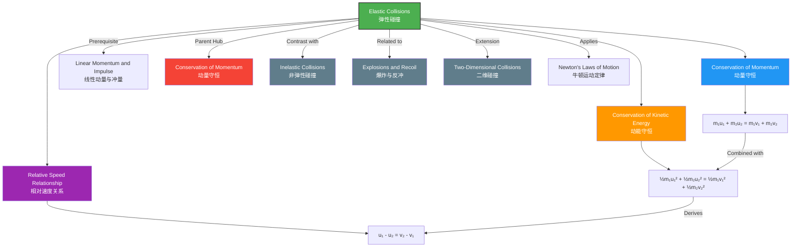

# 1. Overview / 概述

**English:**
Elastic collisions are a fundamental concept in mechanics where two objects collide and separate without any loss of kinetic energy. This is the defining characteristic that distinguishes elastic collisions from [[Inelastic Collisions]]. In an elastic collision, both [[Linear Momentum and Impulse|momentum]] AND kinetic energy are conserved simultaneously. While perfectly elastic collisions are idealized (rare in everyday macroscopic situations), they provide a crucial theoretical framework for understanding energy transfer in particle physics, atomic interactions, and idealized mechanical systems. This sub-topic builds directly on [[Conservation of Momentum]] and applies [[Newton's Laws of Motion]] to analyze collision dynamics. Understanding elastic collisions is essential for solving problems involving billiard balls, gas particle collisions, and nuclear scattering experiments.

**中文:**
弹性碰撞是力学中的一个基本概念，指两个物体碰撞后分离且动能没有任何损失。这是区分弹性碰撞与[[Inelastic Collisions|非弹性碰撞]]的决定性特征。在弹性碰撞中，[[Linear Momentum and Impulse|动量]]和动能同时守恒。虽然完全弹性碰撞是理想化的（在日常宏观情况下很少见），但它们为理解粒子物理、原子相互作用和理想化机械系统中的能量传递提供了关键的理论框架。本子知识点直接建立在[[Conservation of Momentum|动量守恒]]的基础上，并应用[[Newton's Laws of Motion|牛顿运动定律]]来分析碰撞动力学。理解弹性碰撞对于解决涉及台球、气体粒子碰撞和核散射实验的问题至关重要。

---

# 2. Syllabus Learning Objectives / 考纲学习目标

| CAIE 9702 (3.2 i-k) | Edexcel IAL (WPH11 U1: 2.15-2.18) |
|-----------|-------------|
| Define and distinguish between elastic and inelastic collisions | Define elastic and inelastic collisions |
| Apply conservation of momentum and conservation of kinetic energy to elastic collisions | Use conservation of momentum and kinetic energy to solve elastic collision problems |
| Solve problems involving two colliding objects in one dimension | Solve one-dimensional elastic collision problems |
| Derive and apply the relative speed of approach = relative speed of separation | Derive and use the equation for relative velocities in elastic collisions |
| Solve problems involving elastic collisions with stationary and moving targets | Apply elastic collision principles to real-world scenarios |

**Examiner Expectations / 考官期望:**
- **English:** You must be able to clearly state that kinetic energy is conserved ONLY in elastic collisions. You must set up simultaneous equations for momentum and kinetic energy conservation. You should be able to derive and apply the "relative speed of approach equals relative speed of separation" relationship. You must handle both objects moving initially and one object stationary.
- **中文:** 你必须能够清楚地说明动能仅在弹性碰撞中守恒。你必须建立动量和动能守恒的联立方程。你应该能够推导并应用"接近相对速度等于分离相对速度"的关系。你必须能够处理两个物体初始都运动以及一个物体静止的情况。

---

# 3. Core Definitions / 核心定义

| Term (EN/CN) | Definition (EN) | Definition (CN) | Common Mistakes / 常见错误 |
|--------------|-----------------|-----------------|---------------------------|
| **Elastic Collision** / 弹性碰撞 | A collision in which both total momentum AND total kinetic energy are conserved | 总动量和总动能都守恒的碰撞 | ❌ Thinking kinetic energy is "lost" — it is TRANSFERRED, not lost |
| **Perfectly Elastic Collision** / 完全弹性碰撞 | An idealized collision where no kinetic energy is converted to other forms (heat, sound, deformation) | 没有动能转化为其他形式（热、声、形变）的理想化碰撞 | ❌ Confusing with "perfectly inelastic" where objects stick together |
| **Relative Speed of Approach** / 接近相对速度 | The speed at which two objects move toward each other before collision: $u_1 - u_2$ (if moving in same direction) or $u_1 + u_2$ (if moving toward each other) | 碰撞前两个物体相互靠近的速度 | ❌ Forgetting sign conventions for direction |
| **Relative Speed of Separation** / 分离相对速度 | The speed at which two objects move away from each other after collision: $v_2 - v_1$ | 碰撞后两个物体相互远离的速度 | ❌ Mixing up which velocity is subtracted |
| **Coefficient of Restitution ($e$)** / 恢复系数 | For elastic collisions, $e = 1$; ratio of relative speed of separation to relative speed of approach | 弹性碰撞中 $e=1$；分离相对速度与接近相对速度之比 | ❌ Thinking $e$ applies only to elastic collisions (it applies to all collisions) |

---

# 4. Key Concepts Explained / 关键概念详解

## 4.1 Simultaneous Conservation Laws / 同时守恒定律

### Explanation / 解释
**English:** In an elastic collision, you must apply TWO conservation laws simultaneously:
1. **Conservation of Momentum:** $m_1u_1 + m_2u_2 = m_1v_1 + m_2v_2$
2. **Conservation of Kinetic Energy:** $\frac{1}{2}m_1u_1^2 + \frac{1}{2}m_2u_2^2 = \frac{1}{2}m_1v_1^2 + \frac{1}{2}m_2v_2^2$

These two equations give you a system that can be solved for the two unknown final velocities ($v_1$ and $v_2$). This is the core mathematical challenge of elastic collision problems. The key insight is that you have TWO equations and TWO unknowns, making the system solvable. This contrasts with [[Inelastic Collisions]] where you only have momentum conservation (one equation) and need additional information.

**中文:** 在弹性碰撞中，你必须同时应用两个守恒定律：
1. **动量守恒：** $m_1u_1 + m_2u_2 = m_1v_1 + m_2v_2$
2. **动能守恒：** $\frac{1}{2}m_1u_1^2 + \frac{1}{2}m_2u_2^2 = \frac{1}{2}m_1v_1^2 + \frac{1}{2}m_2v_2^2$

这两个方程构成一个方程组，可以求解两个未知的末速度（$v_1$ 和 $v_2$）。这是弹性碰撞问题的核心数学挑战。关键在于你有两个方程和两个未知数，使得系统可解。这与[[Inelastic Collisions|非弹性碰撞]]形成对比，后者只有动量守恒（一个方程），需要额外信息。

### Physical Meaning / 物理意义
**English:** In elastic collisions, the total kinetic energy before collision is redistributed between the two objects after collision. No energy is "lost" to deformation, heat, or sound. This means the objects bounce off each other perfectly, like ideal billiard balls or gas molecules. The relative speed relationship ($u_1 - u_2 = v_2 - v_1$) emerges from combining the two conservation laws and is a powerful shortcut.

**中文:** 在弹性碰撞中，碰撞前的总动能在碰撞后在两个物体之间重新分配。没有能量"损失"于形变、热或声。这意味着物体完美地相互弹开，就像理想的台球或气体分子。相对速度关系（$u_1 - u_2 = v_2 - v_1$）来自于两个守恒定律的结合，是一个强大的捷径。

### Common Misconceptions / 常见误区
- ❌ **"Kinetic energy is conserved in ALL collisions"** — Only in elastic collisions. In inelastic collisions, kinetic energy is NOT conserved.
- ❌ **"Elastic collisions only happen with equal masses"** — Elastic collisions can occur between any masses.
- ❌ **"You can solve elastic collision problems using only momentum conservation"** — You need BOTH momentum and kinetic energy conservation.
- ❌ **"The relative speed relationship is a separate law"** — It is DERIVED from the two conservation laws, not an independent principle.

### Exam Tips / 考试提示
- **English:** Always write down BOTH conservation equations before substituting numbers. Use the relative speed relationship as a shortcut to avoid solving quadratic equations. Pay attention to sign conventions — velocities in opposite directions have opposite signs.
- **中文:** 在代入数字之前，始终写下两个守恒方程。使用相对速度关系作为捷径，避免解二次方程。注意符号约定——相反方向的速度具有相反的符号。

---

# 5. Essential Equations / 核心公式

## 5.1 Conservation of Momentum / 动量守恒

$$ m_1u_1 + m_2u_2 = m_1v_1 + m_2v_2 $$

| Symbol (符号) | Meaning (EN) | Meaning (CN) | Unit (单位) |
|--------------|-------------|-------------|------------|
| $m_1, m_2$ | Masses of objects 1 and 2 | 物体1和2的质量 | kg |
| $u_1, u_2$ | Initial velocities (before collision) | 初始速度（碰撞前） | m s⁻¹ |
| $v_1, v_2$ | Final velocities (after collision) | 末速度（碰撞后） | m s⁻¹ |

## 5.2 Conservation of Kinetic Energy / 动能守恒

$$ \frac{1}{2}m_1u_1^2 + \frac{1}{2}m_2u_2^2 = \frac{1}{2}m_1v_1^2 + \frac{1}{2}m_2v_2^2 $$

| Symbol (符号) | Meaning (EN) | Meaning (CN) | Unit (单位) |
|--------------|-------------|-------------|------------|
| $\frac{1}{2}mu^2$ | Kinetic energy of each object | 每个物体的动能 | J |

## 5.3 Relative Speed Relationship / 相对速度关系

$$ u_1 - u_2 = v_2 - v_1 $$

Or equivalently: $$ \text{Speed of approach} = \text{Speed of separation} $$

| Symbol (符号) | Meaning (EN) | Meaning (CN) | Unit (单位) |
|--------------|-------------|-------------|------------|
| $u_1 - u_2$ | Relative speed of approach (with sign convention) | 接近相对速度（带符号约定） | m s⁻¹ |
| $v_2 - v_1$ | Relative speed of separation (with sign convention) | 分离相对速度（带符号约定） | m s⁻¹ |

**Derivation / 推导:**
From the two conservation equations, factor and rearrange:
1. $m_1(u_1 - v_1) = m_2(v_2 - u_2)$ (from momentum)
2. $m_1(u_1^2 - v_1^2) = m_2(v_2^2 - u_2^2)$ (from kinetic energy)
3. Factor the difference of squares: $m_1(u_1 - v_1)(u_1 + v_1) = m_2(v_2 - u_2)(v_2 + u_2)$
4. Divide equation 3 by equation 1: $u_1 + v_1 = v_2 + u_2$
5. Rearrange: $u_1 - u_2 = v_2 - v_1$ ✓

**Conditions / 适用条件:**
- **English:** Only valid for perfectly elastic collisions in one dimension. All velocities must be measured along the same straight line with consistent sign conventions.
- **中文:** 仅适用于一维完全弹性碰撞。所有速度必须沿同一直线测量，并采用一致的符号约定。

**Limitations / 局限性:**
- **English:** Does not apply to inelastic collisions. Does not apply to two-dimensional collisions without vector decomposition. Assumes no external forces during collision.
- **中文:** 不适用于非弹性碰撞。不适用于未经矢量分解的二维碰撞。假设碰撞过程中没有外力。

> 📷 **IMAGE PROMPT — EQ01: Elastic Collision Velocity Diagram**
> A clear diagram showing two balls approaching each other with velocities u₁ and u₂, then separating with velocities v₁ and v₂. Arrows indicate direction. Labels show masses m₁ and m₂. The equation u₁ - u₂ = v₂ - v₁ is displayed below. Clean, educational style with color-coded arrows (red for initial, blue for final).

---

# 6. Graphs and Relationships / 图表与关系

## 6.1 Velocity-Time Graph for Elastic Collision / 弹性碰撞的速度-时间图

### Axes / 坐标轴
- **X-axis:** Time / 时间 (t / s)
- **Y-axis:** Velocity / 速度 (v / m s⁻¹)

### Shape / 形状
**English:** Two horizontal lines representing constant velocities before collision, a vertical discontinuity at the collision instant, then two new horizontal lines after collision. The velocities "swap" or change abruptly at the collision point.

**中文:** 两条水平线表示碰撞前的恒定速度，在碰撞瞬间有一个垂直不连续，然后碰撞后有两条新的水平线。速度在碰撞点"交换"或突然变化。

### Gradient Meaning / 斜率含义
**English:** Zero gradient before and after collision (no acceleration except at the instant of collision). The gradient at the collision point is infinite (instantaneous velocity change).

**中文:** 碰撞前后梯度为零（除碰撞瞬间外无加速度）。碰撞点的梯度为无穷大（瞬时速度变化）。

### Area Meaning / 面积含义
**English:** Area under each line gives displacement of each object. The total displacement before and after collision can be used to find positions.

**中文:** 每条线下方的面积给出每个物体的位移。碰撞前后的总位移可用于求位置。

### Exam Interpretation / 考试解读
**English:** You may be asked to read velocities before and after collision from a v-t graph, then verify conservation of momentum and kinetic energy. The discontinuity at collision shows the interaction time is negligible.

**中文:** 你可能被要求从v-t图中读取碰撞前后的速度，然后验证动量和动能守恒。碰撞点的不连续性表明相互作用时间可忽略。

> 📷 **IMAGE PROMPT — GR01: Velocity-Time Graph for Elastic Collision**
> A velocity-time graph showing two objects (red and blue lines) with constant velocities before collision, vertical jumps at t = collision, and new constant velocities after collision. Axes labeled. Clear grid. The velocities before and after are clearly marked with values. Educational physics diagram style.

---

# 7. Required Diagrams / 必备图表

## 7.1 One-Dimensional Elastic Collision / 一维弹性碰撞

### Description / 描述
**English:** A diagram showing two objects (balls or blocks) on a straight line before and after an elastic collision. Before collision: object 1 (mass m₁) moves right with velocity u₁, object 2 (mass m₂) moves right with velocity u₂ (or left, depending on scenario). After collision: object 1 moves with velocity v₁, object 2 moves with velocity v₂. Arrows indicate direction and relative magnitude.

**中文:** 一个显示两个物体（球或块）在直线上弹性碰撞前后的示意图。碰撞前：物体1（质量m₁）以速度u₁向右运动，物体2（质量m₂）以速度u₂向右运动（或向左，取决于场景）。碰撞后：物体1以速度v₁运动，物体2以速度v₂运动。箭头表示方向和相对大小。

### Image Prompt / 图片生成提示
> 📷 **IMAGE PROMPT — DG01: One-Dimensional Elastic Collision**
> A two-panel diagram. Top panel "Before Collision": Two labeled balls on a horizontal line. Ball 1 (m₁) with rightward arrow u₁. Ball 2 (m₂) with rightward arrow u₂ (smaller). Bottom panel "After Collision": Same balls after collision. Ball 1 with leftward arrow v₁ (or smaller rightward). Ball 2 with larger rightward arrow v₂. Equations displayed: m₁u₁ + m₂u₂ = m₁v₁ + m₂v₂ and ½m₁u₁² + ½m₂u₂² = ½m₁v₁² + ½m₂v₂². Clean educational style, color-coded.

### Labels Required / 需要标注
- Masses: $m_1$, $m_2$ / 质量：$m_1$, $m_2$
- Initial velocities: $u_1$, $u_2$ / 初始速度：$u_1$, $u_2$
- Final velocities: $v_1$, $v_2$ / 末速度：$v_1$, $v_2$
- Direction arrows / 方向箭头
- "Before Collision" and "After Collision" labels / "碰撞前"和"碰撞后"标签

### Exam Importance / 考试重要性
**English:** This diagram is essential for setting up equations correctly. You must draw it in your working to define positive direction and assign signs to velocities. Many marks are lost due to incorrect sign conventions.

**中文:** 这个图对于正确建立方程至关重要。你必须在解题过程中画出它，以定义正方向并给速度分配符号。许多分数因符号约定错误而丢失。

---

# 8. Worked Examples / 典型例题

## Example 1: Equal Mass Elastic Collision / 等质量弹性碰撞

### Question / 题目
**English:**
A ball of mass 2.0 kg moving at 4.0 m s⁻¹ to the right collides elastically with a stationary ball of mass 2.0 kg. Find the velocities of both balls after the collision.

**中文:**
一个质量为2.0 kg、以4.0 m s⁻¹向右运动的球与一个质量为2.0 kg的静止球发生弹性碰撞。求碰撞后两个球的速度。

### Solution / 解答

**Step 1: Define positive direction and write known values**
Let right be positive.
$m_1 = 2.0 \text{ kg}$, $u_1 = +4.0 \text{ m s}^{-1}$
$m_2 = 2.0 \text{ kg}$, $u_2 = 0 \text{ m s}^{-1}$
$v_1 = ?$, $v_2 = ?$

**Step 2: Apply conservation of momentum**
$$ m_1u_1 + m_2u_2 = m_1v_1 + m_2v_2 $$
$$ (2.0)(4.0) + (2.0)(0) = 2.0v_1 + 2.0v_2 $$
$$ 8.0 = 2.0v_1 + 2.0v_2 $$
$$ v_1 + v_2 = 4.0 \quad \text{(Equation 1)} $$

**Step 3: Apply conservation of kinetic energy**
$$ \frac{1}{2}m_1u_1^2 + \frac{1}{2}m_2u_2^2 = \frac{1}{2}m_1v_1^2 + \frac{1}{2}m_2v_2^2 $$
$$ \frac{1}{2}(2.0)(4.0)^2 + 0 = \frac{1}{2}(2.0)v_1^2 + \frac{1}{2}(2.0)v_2^2 $$
$$ 16.0 = v_1^2 + v_2^2 \quad \text{(Equation 2)} $$

**Step 4: Solve simultaneously**
From Equation 1: $v_2 = 4.0 - v_1$
Substitute into Equation 2:
$$ v_1^2 + (4.0 - v_1)^2 = 16.0 $$
$$ v_1^2 + 16.0 - 8.0v_1 + v_1^2 = 16.0 $$
$$ 2v_1^2 - 8.0v_1 = 0 $$
$$ 2v_1(v_1 - 4.0) = 0 $$

**Step 5: Interpret solutions**
$v_1 = 0$ or $v_1 = 4.0 \text{ m s}^{-1}$

$v_1 = 4.0$ means ball 1 continues unchanged (no collision occurred) — this is the trivial solution.
$v_1 = 0$ means ball 1 stops.

Then $v_2 = 4.0 - 0 = 4.0 \text{ m s}^{-1}$

**Alternative using relative speed relationship:**
$u_1 - u_2 = v_2 - v_1$
$4.0 - 0 = v_2 - v_1$
$v_2 - v_1 = 4.0$ (Equation 1')
Combined with $v_1 + v_2 = 4.0$ (from momentum):
Adding: $2v_2 = 8.0 \Rightarrow v_2 = 4.0 \text{ m s}^{-1}$
Then $v_1 = 0 \text{ m s}^{-1}$

### Final Answer / 最终答案
**Answer:** Ball 1 stops ($v_1 = 0$), Ball 2 moves right at $4.0 \text{ m s}^{-1}$ | **答案：** 球1停止（$v_1 = 0$），球2以$4.0 \text{ m s}^{-1}$向右运动

### Quick Tip / 提示
**English:** For equal mass elastic collisions where one object is stationary, the moving object stops and the stationary object moves away with the original velocity. This is a useful shortcut for checking your work.

**中文:** 对于其中一个物体静止的等质量弹性碰撞，运动的物体停止，静止的物体以原始速度运动。这是一个有用的检查捷径。

---

## Example 2: Different Mass Elastic Collision / 不同质量弹性碰撞

### Question / 题目
**English:**
A 3.0 kg ball moving at 5.0 m s⁻¹ to the right collides elastically with a 1.0 kg ball moving at 2.0 m s⁻¹ to the left. Find the velocities after collision.

**中文:**
一个3.0 kg、以5.0 m s⁻¹向右运动的球与一个1.0 kg、以2.0 m s⁻¹向左运动的球发生弹性碰撞。求碰撞后的速度。

### Solution / 解答

**Step 1: Define positive direction and write known values**
Let right be positive.
$m_1 = 3.0 \text{ kg}$, $u_1 = +5.0 \text{ m s}^{-1}$
$m_2 = 1.0 \text{ kg}$, $u_2 = -2.0 \text{ m s}^{-1}$ (moving left = negative)
$v_1 = ?$, $v_2 = ?$

**Step 2: Apply conservation of momentum**
$$ m_1u_1 + m_2u_2 = m_1v_1 + m_2v_2 $$
$$ (3.0)(5.0) + (1.0)(-2.0) = 3.0v_1 + 1.0v_2 $$
$$ 15.0 - 2.0 = 3.0v_1 + v_2 $$
$$ 13.0 = 3.0v_1 + v_2 \quad \text{(Equation 1)} $$

**Step 3: Apply relative speed relationship**
$$ u_1 - u_2 = v_2 - v_1 $$
$$ 5.0 - (-2.0) = v_2 - v_1 $$
$$ 7.0 = v_2 - v_1 \quad \text{(Equation 2)} $$

**Step 4: Solve simultaneously**
From Equation 2: $v_2 = v_1 + 7.0$
Substitute into Equation 1:
$$ 13.0 = 3.0v_1 + (v_1 + 7.0) $$
$$ 13.0 = 4.0v_1 + 7.0 $$
$$ 6.0 = 4.0v_1 $$
$$ v_1 = 1.5 \text{ m s}^{-1} $$

Then $v_2 = 1.5 + 7.0 = 8.5 \text{ m s}^{-1}$

**Step 5: Verify kinetic energy conservation (optional check)**
Initial KE: $\frac{1}{2}(3.0)(5.0)^2 + \frac{1}{2}(1.0)(-2.0)^2 = 37.5 + 2.0 = 39.5 \text{ J}$
Final KE: $\frac{1}{2}(3.0)(1.5)^2 + \frac{1}{2}(1.0)(8.5)^2 = 3.375 + 36.125 = 39.5 \text{ J}$ ✓

### Final Answer / 最终答案
**Answer:** $v_1 = 1.5 \text{ m s}^{-1}$ (right), $v_2 = 8.5 \text{ m s}^{-1}$ (right) | **答案：** $v_1 = 1.5 \text{ m s}^{-1}$（向右），$v_2 = 8.5 \text{ m s}^{-1}$（向右）

### Quick Tip / 提示
**English:** Using the relative speed relationship avoids solving quadratic equations. Always check that your answers make physical sense — the lighter ball should move faster after collision.

**中文:** 使用相对速度关系可以避免解二次方程。始终检查你的答案是否具有物理意义——较轻的球在碰撞后应该运动得更快。

---

# 9. Past Paper Question Types / 历年真题题型

| Question Type / 题型 | Frequency / 频率 | Difficulty / 难度 | Past Paper References / 真题索引 |
|----------------------|------------------|------------------|-------------------------------|
| Equal mass, one stationary / 等质量，一个静止 | Very High / 非常高 | Easy / 简单 | 📝 *待填入* |
| Different masses, one stationary / 不同质量，一个静止 | High / 高 | Medium / 中等 | 📝 *待填入* |
| Both objects moving / 两个物体都运动 | High / 高 | Medium-Hard / 中高 | 📝 *待填入* |
| Derivation of relative speed relationship / 推导相对速度关系 | Medium / 中等 | Medium / 中等 | 📝 *待填入* |
| Elastic collision with graph interpretation / 弹性碰撞与图表解读 | Low-Medium / 低中 | Medium / 中等 | 📝 *待填入* |
| Two-dimensional elastic collision / 二维弹性碰撞 | Low / 低 | Hard / 困难 | 📝 *待填入* |

**Common Command Words / 常见指令词:**
- **English:** "Show that", "Calculate", "Determine", "Derive", "State", "Explain why"
- **中文:** "证明"，"计算"，"确定"，"推导"，"陈述"，"解释为什么"

---

# 10. Practical Skills Connections / 实验技能链接

**English:**
Elastic collisions connect to practical skills in several ways:

1. **Experimental Verification:** You can use air tracks or linear air bearings to create near-frictionless conditions for studying elastic collisions. Gliders with magnets or spring bumpers approximate elastic collisions.

2. **Measurements Required:**
   - Masses of gliders (using electronic balance)
   - Velocities before and after collision (using light gates with data loggers)
   - Time measurements for velocity calculation ($v = \Delta x / \Delta t$)

3. **Uncertainty Analysis:**
   - Uncertainty in mass measurements (typically ±0.1 g)
   - Uncertainty in velocity from timing (±0.001 s) and distance (±0.5 mm)
   - Percentage uncertainty in kinetic energy ($\Delta KE/KE = 2\Delta v/v + \Delta m/m$)

4. **Graph Plotting:**
   - Plot momentum before vs. momentum after to verify conservation
   - Plot kinetic energy before vs. kinetic energy after to verify elastic nature

5. **Experimental Design Considerations:**
   - Minimizing friction (air track, level surface)
   - Ensuring one-dimensional collision (alignment)
   - Using appropriate data logging frequency

**中文:**
弹性碰撞在多个方面与实验技能相关：

1. **实验验证：** 你可以使用气轨或线性空气轴承创造接近无摩擦的条件来研究弹性碰撞。带有磁铁或弹簧缓冲器的滑车可近似弹性碰撞。

2. **所需测量：**
   - 滑车的质量（使用电子天平）
   - 碰撞前后的速度（使用带数据记录器的光门）
   - 速度计算的时间测量（$v = \Delta x / \Delta t$）

3. **不确定度分析：**
   - 质量测量的不确定度（通常±0.1 g）
   - 速度的不确定度来自计时（±0.001 s）和距离（±0.5 mm）
   - 动能的百分比不确定度（$\Delta KE/KE = 2\Delta v/v + \Delta m/m$）

4. **图表绘制：**
   - 绘制碰撞前动量与碰撞后动量以验证守恒
   - 绘制碰撞前动能与碰撞后动能以验证弹性性质

5. **实验设计考虑：**
   - 最小化摩擦（气轨、水平表面）
   - 确保一维碰撞（对准）
   - 使用适当的数据记录频率

---

# 11. Concept Map / 概念图谱

---

# 12. Quick Revision Sheet / 速查表

| Category / 类别 | Key Points / 要点 |
|----------------|------------------|
| **Definition / 定义** | Both momentum AND kinetic energy conserved / 动量和动能都守恒 |
| **Key Equations / 核心公式** | $m_1u_1 + m_2u_2 = m_1v_1 + m_2v_2$ (momentum) |
| | $\frac{1}{2}m_1u_1^2 + \frac{1}{2}m_2u_2^2 = \frac{1}{2}m_1v_1^2 + \frac{1}{2}m_2v_2^2$ (KE) |
| | $u_1 - u_2 = v_2 - v_1$ (relative speed) |
| **Special Case / 特殊情况** | Equal masses, one stationary: moving ball stops, stationary ball moves with original velocity / 等质量，一个静止：运动球停止，静止球以原速度运动 |
| **Key Graph / 核心图表** | v-t graph: horizontal lines before/after collision, vertical discontinuity at collision / v-t图：碰撞前后水平线，碰撞点垂直不连续 |
| **Common Mistake / 常见错误** | Forgetting sign conventions for velocity direction / 忘记速度方向的符号约定 |
| **Exam Tip / 考试提示** | Use relative speed relationship to avoid solving quadratics / 使用相对速度关系避免解二次方程 |
| **Practical Link / 实验联系** | Air track with light gates to measure velocities / 气轨配合光门测量速度 |
| **Contrast / 对比** | [[Inelastic Collisions]]: KE NOT conserved, objects may stick together / 非弹性碰撞：动能不守恒，物体可能粘在一起 |
| **Prerequisite / 前置知识** | [[Linear Momentum and Impulse]]: definition of momentum, impulse-momentum theorem / 线性动量与冲量：动量定义，冲量-动量定理 |