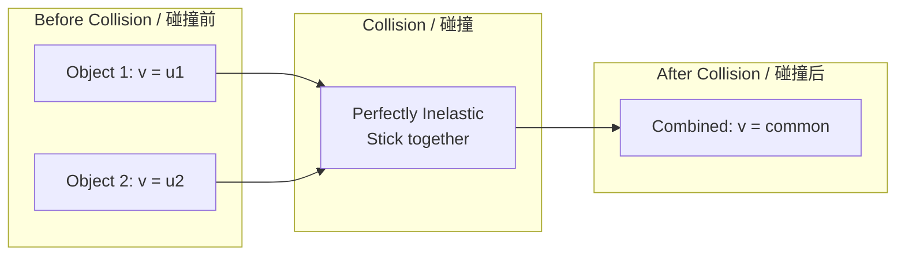
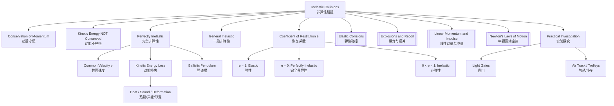

# Inelastic Collisions / 非弹性碰撞

---

# 1. Overview / 概述

**English:**
Inelastic collisions are a fundamental class of collisions where kinetic energy is **not conserved**, although total momentum is always conserved. In a perfectly inelastic collision, the colliding objects stick together and move as one combined mass after the collision. This sub-topic explores the distinction between elastic and inelastic collisions, the mathematical treatment of perfectly inelastic collisions, and the concept of coefficient of restitution. Understanding inelastic collisions is crucial for analyzing real-world scenarios such as car crashes, ballistic pendulums, and energy dissipation in mechanical systems. This leaf node builds directly on [[Linear Momentum and Impulse]] and connects to [[Elastic Collisions]] and [[Explosions and Recoil]] within the broader [[Conservation of Momentum]] topic.

**中文:**
非弹性碰撞是碰撞的基本类型之一，其特点是**动能不守恒**，但总动量始终守恒。在完全非弹性碰撞中，碰撞物体粘在一起，碰撞后作为一个组合体运动。本子知识点探讨弹性碰撞与非弹性碰撞的区别、完全非弹性碰撞的数学处理以及恢复系数的概念。理解非弹性碰撞对于分析真实世界场景至关重要，例如车祸、弹道摆以及机械系统中的能量耗散。本叶节点直接建立在[[Linear Momentum and Impulse]]之上，并与[[Elastic Collisions]]和[[Explosions and Recoil]]相关联，属于更广泛的[[Conservation of Momentum]]主题。

---

# 2. Syllabus Learning Objectives / 考纲学习目标

| CAIE 9702 | Edexcel IAL |
|-----------|-------------|
| 3.2(i): Define and distinguish between elastic and inelastic collisions | 2.15: Understand the difference between elastic and inelastic collisions |
| 3.2(j): Apply the principle of conservation of momentum to inelastic collisions | 2.16: Apply conservation of momentum to inelastic collisions |
| 3.2(k): Understand that kinetic energy is not conserved in inelastic collisions | 2.17: Understand that kinetic energy is not conserved in inelastic collisions |
| — | 2.18: Define and use the coefficient of restitution for collisions |

**Examiner Expectations / 考官期望:**
- **English:** Students must be able to identify inelastic collisions from given data, calculate final velocities for perfectly inelastic collisions, and explain why kinetic energy is lost (e.g., converted to heat, sound, deformation). For Edexcel, students must also calculate and interpret the coefficient of restitution.
- **中文:** 学生必须能够从给定数据中识别非弹性碰撞，计算完全非弹性碰撞的最终速度，并解释动能损失的原因（例如转化为热能、声能、形变）。对于Edexcel，学生还必须计算和解释恢复系数。

---

# 3. Core Definitions / 核心定义

| Term (EN/CN) | Definition (EN) | Definition (CN) | Common Mistakes / 常见错误 |
|--------------|-----------------|-----------------|---------------------------|
| **Inelastic Collision** / 非弹性碰撞 | A collision in which total momentum is conserved but total kinetic energy is **not** conserved. | 总动量守恒但总动能**不**守恒的碰撞。 | Confusing with elastic collisions — thinking kinetic energy is always conserved in all collisions. |
| **Perfectly Inelastic Collision** / 完全非弹性碰撞 | A collision in which the colliding objects stick together and move with a common velocity after impact. | 碰撞物体粘在一起，碰撞后以共同速度运动的碰撞。 | Forgetting that momentum is still conserved even though objects stick together. |
| **Coefficient of Restitution ($e$)** / 恢复系数 | A measure of the "bounciness" of a collision, defined as the ratio of relative speed after collision to relative speed before collision: $e = \frac{v_2 - v_1}{u_1 - u_2}$ | 衡量碰撞“弹性”程度的量，定义为碰撞后相对速度与碰撞前相对速度之比。 | Using wrong sign convention — always take relative speed (magnitude) for $e$. |
| **Kinetic Energy Loss** / 动能损失 | The amount of kinetic energy converted to other forms (heat, sound, deformation) during an inelastic collision: $\Delta KE = KE_{\text{before}} - KE_{\text{after}}$ | 在非弹性碰撞中转化为其他形式（热能、声能、形变）的动能数量。 | Thinking energy is "lost" — it's converted, not destroyed (conservation of energy). |
| **Common Velocity ($v$)** / 共同速度 | The single velocity shared by both objects after a perfectly inelastic collision. | 完全非弹性碰撞后两个物体共有的单一速度。 | Forgetting to use total mass when calculating final momentum. |

---

# 4. Key Concepts Explained / 关键概念详解

## 4.1 Perfectly Inelastic Collisions / 完全非弹性碰撞

### Explanation / 解释
**English:**
In a perfectly inelastic collision, two objects collide and stick together, moving as one combined mass after the collision. The defining characteristic is that they share a **common final velocity**. While kinetic energy is not conserved (some is converted to other forms), **momentum is always conserved**. The fundamental equation is:

$$ m_1 u_1 + m_2 u_2 = (m_1 + m_2) v $$

where $v$ is the common velocity after collision. This equation can be rearranged to solve for $v$:

$$ v = \frac{m_1 u_1 + m_2 u_2}{m_1 + m_2} $$

This is essentially a **weighted average** of the initial velocities, weighted by mass. This concept connects to [[Linear Momentum and Impulse]] and contrasts with [[Elastic Collisions]] where kinetic energy is also conserved.

**中文:**
在完全非弹性碰撞中，两个物体碰撞后粘在一起，作为一个组合体运动。其定义特征是它们具有**共同的最终速度**。虽然动能不守恒（部分转化为其他形式），但**动量始终守恒**。基本方程为：

$$ m_1 u_1 + m_2 u_2 = (m_1 + m_2) v $$

其中 $v$ 是碰撞后的共同速度。该方程可重新排列求解 $v$：

$$ v = \frac{m_1 u_1 + m_2 u_2}{m_1 + m_2} $$

这本质上是初始速度的**加权平均值**，以质量为权重。此概念与[[Linear Momentum and Impulse]]相关，并与[[Elastic Collisions]]形成对比。

### Physical Meaning / 物理意义
**English:**
The common velocity represents the center-of-mass velocity of the system, which remains constant because no external forces act during the collision. The "lost" kinetic energy is converted into internal energy — deformation of the objects (plastic deformation), heat, and sound. In a car crash, for example, the kinetic energy goes into crumpling the car body.

**中文:**
共同速度代表系统的质心速度，由于碰撞过程中没有外力作用，该速度保持不变。“损失”的动能转化为内能——物体的形变（塑性形变）、热量和声音。例如，在车祸中，动能用于使车身皱缩。

### Common Misconceptions / 常见误区
- **English:**
  - ❌ "Momentum is not conserved when objects stick together" — Momentum IS always conserved.
  - ❌ "Kinetic energy is destroyed" — Energy is converted, not destroyed.
  - ❌ "The heavier object always determines the final velocity" — It's a weighted average, so both masses matter.
- **中文:**
  - ❌ "物体粘在一起时动量不守恒" — 动量始终守恒。
  - ❌ "动能被消灭了" — 能量被转化，而非消灭。
  - ❌ "较重的物体总是决定最终速度" — 这是加权平均，两个质量都重要。

### Exam Tips / 考试提示
- **English:** Always check if the collision is perfectly inelastic (objects stick together) or just inelastic (objects separate but KE is lost). For perfectly inelastic, use the common velocity formula directly.
- **中文:** 始终检查碰撞是完全非弹性（物体粘在一起）还是仅仅非弹性（物体分离但动能损失）。对于完全非弹性，直接使用共同速度公式。

> 📷 **IMAGE PROMPT — COLL-01: Perfectly Inelastic Collision Diagram**
> Two balls of different masses moving towards each other, then sticking together and moving as one combined mass after collision. Show velocity vectors before and after. Label masses m1, m2, velocities u1, u2 before, and common velocity v after. Include a note: "KE lost → heat, sound, deformation".

## 4.2 Coefficient of Restitution / 恢复系数

### Explanation / 解释
**English:**
The coefficient of restitution ($e$) quantifies the "elasticity" of a collision. It is defined as:

$$ e = \frac{\text{relative speed after collision}}{\text{relative speed before collision}} = \frac{v_2 - v_1}{u_1 - u_2} $$

where $u_1, u_2$ are initial velocities and $v_1, v_2$ are final velocities. The value of $e$ determines the type of collision:
- $e = 1$: Perfectly elastic collision (no KE loss)
- $0 < e < 1$: Inelastic collision (some KE loss)
- $e = 0$: Perfectly inelastic collision (maximum KE loss, objects stick together)

> 📋 **Edexcel Only:** The coefficient of restitution is explicitly required in the Edexcel syllabus. CAIE 9702 does not require $e$ at AS level, but it may appear in A2.

**中文:**
恢复系数 ($e$) 量化了碰撞的“弹性”程度。其定义为：

$$ e = \frac{\text{碰撞后相对速度}}{\text{碰撞前相对速度}} = \frac{v_2 - v_1}{u_1 - u_2} $$

其中 $u_1, u_2$ 是初始速度，$v_1, v_2$ 是最终速度。$e$ 的值决定了碰撞类型：
- $e = 1$：完全弹性碰撞（无动能损失）
- $0 < e < 1$：非弹性碰撞（部分动能损失）
- $e = 0$：完全非弹性碰撞（最大动能损失，物体粘在一起）

> 📋 **Edexcel Only:** Edexcel考纲明确要求恢复系数。CAIE 9702在AS阶段不要求$e$，但可能在A2中出现。

### Physical Meaning / 物理意义
**English:**
The coefficient of restitution is a material property that describes how "bouncy" a collision is. A high $e$ (close to 1) means the objects rebound with little energy loss (like a superball). A low $e$ (close to 0) means the objects deform and lose most of their kinetic energy (like two lumps of clay).

**中文:**
恢复系数是一种材料属性，描述了碰撞的“弹性”程度。高$e$（接近1）意味着物体反弹时能量损失很小（如超级弹力球）。低$e$（接近0）意味着物体变形并损失大部分动能（如两团粘土）。

### Common Misconceptions / 常见误区
- **English:**
  - ❌ "$e$ can be greater than 1" — No, $e \leq 1$ for real collisions (superelastic collisions are theoretical).
  - ❌ "$e$ depends on velocity" — For a given pair of materials, $e$ is approximately constant.
- **中文:**
  - ❌ "$e$可以大于1" — 不，真实碰撞中$e \leq 1$（超弹性碰撞是理论上的）。
  - ❌ "$e$取决于速度" — 对于给定的材料对，$e$近似为常数。

### Exam Tips / 考试提示
- **English:** When using $e$, always take the **magnitude** of relative velocities. The sign convention in the formula $e = \frac{v_2 - v_1}{u_1 - u_2}$ ensures $e$ is positive.
- **中文:** 使用$e$时，始终取相对速度的**大小**。公式$e = \frac{v_2 - v_1}{u_1 - u_2}$中的符号约定确保$e$为正。

---

# 5. Essential Equations / 核心公式

## 5.1 Conservation of Momentum for Inelastic Collisions / 非弹性碰撞的动量守恒

$$ m_1 u_1 + m_2 u_2 = m_1 v_1 + m_2 v_2 $$

| Symbol (符号) | Meaning (EN) | Meaning (CN) | Unit (单位) |
|--------------|-------------|-------------|------------|
| $m_1, m_2$ | Masses of objects 1 and 2 | 物体1和2的质量 | kg |
| $u_1, u_2$ | Initial velocities | 初始速度 | m s$^{-1}$ |
| $v_1, v_2$ | Final velocities | 最终速度 | m s$^{-1}$ |

**Conditions / 适用条件:** No external forces act during the collision. | 碰撞过程中无外力作用。
**Limitations / 局限性:** Does not account for energy loss — must be combined with energy equations for full analysis. | 不考虑能量损失——需与能量方程结合进行完整分析。

## 5.2 Perfectly Inelastic Collision (Common Velocity) / 完全非弹性碰撞（共同速度）

$$ m_1 u_1 + m_2 u_2 = (m_1 + m_2) v $$

$$ v = \frac{m_1 u_1 + m_2 u_2}{m_1 + m_2} $$

| Symbol (符号) | Meaning (EN) | Meaning (CN) | Unit (单位) |
|--------------|-------------|-------------|------------|
| $v$ | Common final velocity | 共同最终速度 | m s$^{-1}$ |

**Derivation / 推导:** From conservation of momentum, set $v_1 = v_2 = v$. | 由动量守恒，设$v_1 = v_2 = v$。
**Conditions / 适用条件:** Objects stick together after collision. | 碰撞后物体粘在一起。
**Limitations / 局限性:** Only applies to perfectly inelastic collisions. | 仅适用于完全非弹性碰撞。

## 5.3 Kinetic Energy Loss / 动能损失

$$ \Delta KE = \frac{1}{2} m_1 u_1^2 + \frac{1}{2} m_2 u_2^2 - \frac{1}{2} (m_1 + m_2) v^2 $$

| Symbol (符号) | Meaning (EN) | Meaning (CN) | Unit (单位) |
|--------------|-------------|-------------|------------|
| $\Delta KE$ | Kinetic energy lost | 动能损失 | J |

**Conditions / 适用条件:** For perfectly inelastic collisions. | 适用于完全非弹性碰撞。
**Limitations / 局限性:** Does not specify where the energy goes — just quantifies the loss. | 不指定能量去向——仅量化损失。

## 5.4 Coefficient of Restitution / 恢复系数

$$ e = \frac{v_2 - v_1}{u_1 - u_2} $$

| Symbol (符号) | Meaning (EN) | Meaning (CN) | Unit (单位) |
|--------------|-------------|-------------|------------|
| $e$ | Coefficient of restitution | 恢复系数 | dimensionless (无量纲) |

> 📋 **Edexcel Only:** This equation is required for Edexcel IAL.

**Derivation / 推导:** Empirical definition based on relative velocities. | 基于相对速度的经验定义。
**Conditions / 适用条件:** $0 \leq e \leq 1$ for real collisions. | 真实碰撞中$0 \leq e \leq 1$。
**Limitations / 局限性:** Assumes $e$ is constant for given materials; may vary with impact speed. | 假设给定材料的$e$为常数；可能随冲击速度变化。

> 📷 **IMAGE PROMPT — COLL-02: Coefficient of Restitution Diagram**
> A ball dropped from height h1 onto a hard surface, bouncing to height h2. Show that e = sqrt(h2/h1). Label h1 (drop height), h2 (rebound height), and the formula e = v_after/v_before = sqrt(h2/h1).

---

# 6. Graphs and Relationships / 图表与关系

## 6.1 Velocity-Time Graph for Perfectly Inelastic Collision / 完全非弹性碰撞的速度-时间图

### Axes / 坐标轴
- **X-axis:** Time / 时间 (s)
- **Y-axis:** Velocity / 速度 (m s$^{-1}$)

### Shape / 形状
**English:** Two lines representing the velocities of two objects before collision. At the collision instant, both velocities suddenly change to a common value. After collision, both objects move with the same constant velocity.

**中文:** 两条线表示碰撞前两个物体的速度。在碰撞瞬间，两个速度突然变为共同值。碰撞后，两个物体以相同的恒定速度运动。

### Gradient Meaning / 斜率含义
**English:** Gradient represents acceleration. Before and after collision, gradients are zero (constant velocity). At the collision instant, the gradient is theoretically infinite (instantaneous change).

**中文:** 斜率表示加速度。碰撞前后，斜率为零（匀速）。在碰撞瞬间，斜率理论上为无穷大（瞬时变化）。

### Area Meaning / 面积含义
**English:** Area under each line represents displacement of each object. After collision, both objects have the same displacement-time relationship.

**中文:** 每条线下面积表示每个物体的位移。碰撞后，两个物体具有相同的位移-时间关系。

### Exam Interpretation / 考试解读
**English:** Look for the "kink" where velocities suddenly equalize. The common velocity after collision is the weighted average of initial velocities.

**中文:** 寻找速度突然相等的“拐点”。碰撞后的共同速度是初始速度的加权平均值。

---

# 7. Required Diagrams / 必备图表

## 7.1 Perfectly Inelastic Collision Setup / 完全非弹性碰撞设置

### Description / 描述
**English:** Two objects (e.g., trolleys or balls) moving towards each other on a frictionless surface. Before collision, they have different velocities. After collision, they are stuck together moving with a common velocity.

**中文:** 两个物体（例如小车或球）在无摩擦表面上相向运动。碰撞前，它们具有不同的速度。碰撞后，它们粘在一起以共同速度运动。

### Image Prompt / 图片生成提示
> 📷 **IMAGE PROMPT — COLL-03: Perfectly Inelastic Collision with Velocities**
> Two trolleys on a frictionless horizontal surface. Trolley 1 (mass m1 = 2 kg) moving right at u1 = 4 m/s. Trolley 2 (mass m2 = 3 kg) moving left at u2 = 2 m/s. After collision, they are stuck together moving right at v = 0.4 m/s. Show velocity vectors with arrows, mass labels, and the momentum conservation equation: m1u1 + m2u2 = (m1+m2)v. Include a "Before" and "After" panel.

### Labels Required / 需要标注
- **English:** m₁, m₂ (masses); u₁, u₂ (initial velocities); v (common final velocity); "Before collision", "After collision"
- **中文:** m₁, m₂ (质量); u₁, u₂ (初始速度); v (共同最终速度); "碰撞前", "碰撞后"

### Exam Importance / 考试重要性
**English:** High — this is the most common diagram for inelastic collision questions. Students must be able to draw and label it correctly.

**中文:** 高 — 这是非弹性碰撞问题中最常见的图表。学生必须能够正确绘制和标注。

## 7.2 Ballistic Pendulum / 弹道摆

### Description / 描述
**English:** A ballistic pendulum is a classic example of a perfectly inelastic collision. A projectile (bullet) embeds itself in a block of wood suspended as a pendulum. The combined system swings upward, and the maximum height reached is used to calculate the initial speed of the projectile.

**中文:** 弹道摆是完全非弹性碰撞的经典例子。抛射体（子弹）嵌入悬挂为摆的木头块中。组合系统向上摆动，达到的最大高度用于计算抛射体的初始速度。

### Image Prompt / 图片生成提示
> 📷 **IMAGE PROMPT — COLL-04: Ballistic Pendulum**
> A bullet of mass m moving horizontally with speed u approaches a wooden block of mass M suspended by two strings. The bullet embeds in the block. After collision, the combined mass (m+M) swings upward to a maximum height h. Label: bullet mass m, block mass M, initial bullet speed u, combined speed v after collision, maximum height h. Show the momentum equation: mu = (m+M)v and energy equation: 1/2(m+M)v² = (m+M)gh.

### Labels Required / 需要标注
- **English:** m (bullet mass), M (block mass), u (bullet speed), v (combined speed after collision), h (maximum height)
- **中文:** m (子弹质量), M (木块质量), u (子弹速度), v (碰撞后组合速度), h (最大高度)

### Exam Importance / 考试重要性
**English:** Medium — appears in both CIE and Edexcel as an application of perfectly inelastic collisions combined with energy conservation.

**中文:** 中 — 在CIE和Edexcel中均作为完全非弹性碰撞与能量守恒结合的应用出现。

---

# 8. Worked Examples / 典型例题

## Example 1: Perfectly Inelastic Collision / 完全非弹性碰撞

### Question / 题目
**English:**
A trolley of mass 2.0 kg moving at 3.0 m s$^{-1}$ collides with a stationary trolley of mass 1.0 kg. The two trolleys stick together after the collision. Calculate:
(a) The common velocity of the trolleys after the collision.
(b) The kinetic energy lost during the collision.

**中文:**
一个质量为2.0 kg、以3.0 m s$^{-1}$运动的小车与一个质量为1.0 kg的静止小车碰撞。碰撞后两小车粘在一起。计算：
(a) 碰撞后小车的共同速度。
(b) 碰撞过程中损失的动能。

### Solution / 解答

**Step 1: Conservation of Momentum / 动量守恒**

$$ m_1 u_1 + m_2 u_2 = (m_1 + m_2) v $$

$$ (2.0)(3.0) + (1.0)(0) = (2.0 + 1.0) v $$

$$ 6.0 = 3.0 v $$

$$ v = 2.0 \text{ m s}^{-1} $$

**Step 2: Kinetic Energy Before Collision / 碰撞前动能**

$$ KE_{\text{before}} = \frac{1}{2} m_1 u_1^2 + \frac{1}{2} m_2 u_2^2 $$

$$ KE_{\text{before}} = \frac{1}{2} (2.0)(3.0)^2 + \frac{1}{2} (1.0)(0)^2 $$

$$ KE_{\text{before}} = 9.0 \text{ J} $$

**Step 3: Kinetic Energy After Collision / 碰撞后动能**

$$ KE_{\text{after}} = \frac{1}{2} (m_1 + m_2) v^2 $$

$$ KE_{\text{after}} = \frac{1}{2} (3.0)(2.0)^2 $$

$$ KE_{\text{after}} = 6.0 \text{ J} $$

**Step 4: Kinetic Energy Lost / 动能损失**

$$ \Delta KE = KE_{\text{before}} - KE_{\text{after}} = 9.0 - 6.0 = 3.0 \text{ J} $$

### Final Answer / 最终答案
**Answer:** (a) $v = 2.0$ m s$^{-1}$ | **答案：** (a) $v = 2.0$ m s$^{-1}$
(b) $\Delta KE = 3.0$ J | (b) $\Delta KE = 3.0$ J

### Quick Tip / 提示
**English:** Always check units — mass in kg, velocity in m s$^{-1}$, energy in J. For perfectly inelastic collisions, the common velocity is always between the two initial velocities (if they are in the same direction).

**中文:** 始终检查单位——质量用kg，速度用m s$^{-1}$，能量用J。对于完全非弹性碰撞，共同速度始终介于两个初始速度之间（如果它们方向相同）。

---

## Example 2: Ballistic Pendulum / 弹道摆

### Question / 题目
**English:**
A bullet of mass 15 g is fired horizontally into a wooden block of mass 2.0 kg suspended from light strings. The bullet embeds in the block, and the combined system rises to a maximum height of 0.12 m. Calculate the initial speed of the bullet.

**中文:**
一颗质量为15 g的子弹水平射入一个质量为2.0 kg、用轻绳悬挂的木块中。子弹嵌入木块，组合系统上升到最大高度0.12 m。计算子弹的初始速度。

### Solution / 解答

**Step 1: Energy Conservation After Collision / 碰撞后能量守恒**

After collision, the kinetic energy of the combined system is converted to gravitational potential energy:

$$ \frac{1}{2} (m + M) v^2 = (m + M) g h $$

$$ \frac{1}{2} v^2 = g h $$

$$ v = \sqrt{2gh} = \sqrt{2 \times 9.81 \times 0.12} $$

$$ v = \sqrt{2.3544} = 1.534 \text{ m s}^{-1} $$

**Step 2: Momentum Conservation During Collision / 碰撞过程中动量守恒**

$$ m u = (m + M) v $$

$$ (0.015) u = (0.015 + 2.0) \times 1.534 $$

$$ 0.015 u = 2.015 \times 1.534 $$

$$ 0.015 u = 3.091 $$

$$ u = \frac{3.091}{0.015} = 206 \text{ m s}^{-1} $$

### Final Answer / 最终答案
**Answer:** $u = 206$ m s$^{-1}$ | **答案：** $u = 206$ m s$^{-1}$

### Quick Tip / 提示
**English:** In ballistic pendulum problems, use energy conservation AFTER the collision (pendulum swing) and momentum conservation DURING the collision (bullet embedding). The two stages are linked by the common velocity $v$.

**中文:** 在弹道摆问题中，碰撞后（摆的摆动）使用能量守恒，碰撞过程中（子弹嵌入）使用动量守恒。两个阶段通过共同速度$v$连接。

---

# 9. Past Paper Question Types / 历年真题题型

| Question Type / 题型 | Frequency / 频率 | Difficulty / 难度 | Past Paper References / 真题索引 |
|----------------------|------------------|------------------|-------------------------------|
| Calculate common velocity after perfectly inelastic collision | High | Easy | 📝 *待填入* |
| Calculate kinetic energy loss in inelastic collision | High | Medium | 📝 *待填入* |
| Ballistic pendulum problem (two-stage: momentum + energy) | Medium | Hard | 📝 *待填入* |
| Determine if collision is elastic or inelastic from data | Medium | Medium | 📝 *待填入* |
| Coefficient of restitution calculation (Edexcel only) | Medium | Medium | 📝 *待填入* |
| Explain why kinetic energy is not conserved in inelastic collisions | Low | Easy | 📝 *待填入* |

**Common Command Words / 常见指令词:**
- **English:** Calculate, Determine, Show that, Explain, State, Deduce
- **中文:** 计算，确定，证明，解释，陈述，推导

---

# 10. Practical Skills Connections / 实验技能链接

**English:**
Inelastic collisions can be investigated experimentally using:
- **Linear air track** or **dynamics trolleys** with Velcro pads to ensure sticking
- **Light gates** and **data loggers** to measure velocities before and after collision
- **Balances** to measure masses

Key practical skills:
- **Measurements:** Use light gates to measure time intervals and calculate velocities ($v = \Delta s / \Delta t$)
- **Uncertainties:** Calculate percentage uncertainties in velocity measurements and propagate to momentum and energy calculations
- **Graph plotting:** Plot momentum before vs. momentum after to verify conservation (should give a straight line through origin with gradient 1)
- **Experimental design:** Ensure frictionless surface (air track or compensation), repeat measurements, control variables

**Common errors in practical work:**
- Friction causing apparent momentum loss
- Inaccurate timing due to poor alignment of light gates
- Not accounting for the mass of attachments (e.g., Velcro pads)

**中文:**
非弹性碰撞可以通过以下实验研究：
- **线性气轨**或**动力学小车**，使用魔术贴确保粘合
- **光门**和**数据记录器**测量碰撞前后的速度
- **天平**测量质量

关键实验技能：
- **测量：** 使用光门测量时间间隔并计算速度 ($v = \Delta s / \Delta t$)
- **不确定度：** 计算速度测量的百分比不确定度，并传递到动量和能量计算
- **绘图：** 绘制碰撞前动量与碰撞后动量的关系图，验证守恒（应得到通过原点、斜率为1的直线）
- **实验设计：** 确保无摩擦表面（气轨或补偿），重复测量，控制变量

**实验中的常见错误：**
- 摩擦导致明显的动量损失
- 光门对准不良导致计时不准确
- 未考虑附件质量（如魔术贴）

---

# 11. Concept Map / 概念图谱

---

# 12. Quick Revision Sheet / 速查表

| Category / 类别 | Key Points / 要点 |
|----------------|------------------|
| **Definition / 定义** | Inelastic collision: momentum conserved, KE **not** conserved. Perfectly inelastic: objects stick together. / 非弹性碰撞：动量守恒，动能**不**守恒。完全非弹性：物体粘在一起。 |
| **Key Formula / 核心公式** | $m_1 u_1 + m_2 u_2 = (m_1 + m_2) v$ (perfectly inelastic) / $v = \frac{m_1 u_1 + m_2 u_2}{m_1 + m_2}$ (common velocity) / $\Delta KE = KE_{\text{before}} - KE_{\text{after}}$ |
| **Key Graph / 核心图表** | Velocity-time graph showing sudden change to common velocity at collision instant. / 速度-时间图，在碰撞瞬间突然变为共同速度。 |
| **Coefficient of Restitution / 恢复系数** | $e = \frac{v_2 - v_1}{u_1 - u_2}$; $e=0$ (perfectly inelastic), $0<e<1$ (inelastic), $e=1$ (elastic). / $e=0$（完全非弹性），$0<e<1$（非弹性），$e=1$（弹性）。 |
| **Energy Loss / 能量损失** | KE converted to heat, sound, deformation. NOT destroyed. / 动能转化为热能、声能、形变。**不是**被消灭。 |
| **Common Application / 常见应用** | Ballistic pendulum: momentum during collision + energy after collision. / 弹道摆：碰撞过程中动量守恒 + 碰撞后能量守恒。 |
| **Exam Tip / 考试提示** | Always check if collision is perfectly inelastic (stick together) or just inelastic (separate but KE lost). Use sign convention for velocities. / 始终检查碰撞是完全非弹性（粘在一起）还是仅仅非弹性（分离但动能损失）。注意速度的符号约定。 |
| **Practical Tip / 实验提示** | Use light gates for velocity measurement; compensate for friction; repeat for reliability. / 使用光门测量速度；补偿摩擦；重复实验以确保可靠性。 |