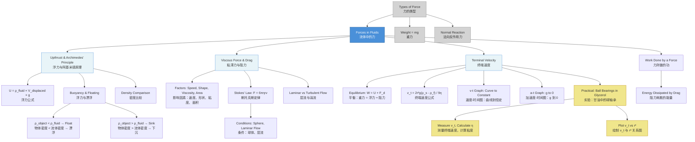

# 1. Overview / 概述

**English:** This topic explores the forces acting on objects when they move through or are submerged in fluids (liquids and gases). It covers two fundamental fluid forces: **[[Upthrust]]** (a buoyant force acting upward on submerged objects) and **[[Viscous Force]]** (a drag force opposing motion through a fluid). Understanding these forces is crucial for explaining phenomena such as why ships float, how hot air balloons rise, why parachutes slow descent, and how small particles settle in liquids. In both CAIE 9702 and Edexcel IAL, this topic builds directly on [[Types of Force]] and connects to [[Work Done by a Force]] through energy dissipation by viscous drag. The concept of [[Terminal Velocity in Fluids]] is a key application where upthrust, weight, and viscous drag reach equilibrium.

**中文:** 本主题探讨物体在流体（液体和气体）中运动或被浸没时所受的力。它涵盖两种基本的流体作用力：**[[浮力]]**（作用于浸没物体向上的浮力）和**[[粘滞力]]**（阻碍物体在流体中运动的阻力）。理解这些力对于解释以下现象至关重要：船为何能浮起、热气球为何能上升、降落伞为何能减缓下落速度，以及小颗粒如何在液体中沉降。在CAIE 9702和Edexcel IAL考试中，本主题直接建立在[[力的类型]]基础上，并通过粘滞阻力引起的能量耗散与[[力所做的功]]相关联。[[流体中的终端速度]]是一个关键应用，其中浮力、重力和粘滞阻力达到平衡。

> 📷 **IMAGE PROMPT — OVERVIEW: Forces in Fluids Overview**  
> A split diagram showing: (Left) A ship floating on water with labeled arrows: Weight (down), Upthrust (up). (Right) A sphere falling through a liquid column with labeled arrows: Weight (down), Upthrust (up), Viscous Drag (up). Labels in English. Clean textbook style, white background, vector graphics. Exam importance: High — foundational diagram for the entire topic.

# 2. Syllabus Learning Objectives / 考纲学习目标

| CAIE 9702 (3.2 l-m) | Edexcel IAL (WPH11 U1: 3.1-3.5) |
|---------------------|----------------------------------|
| **l)** Define and use [[upthrust]], understand its dependence on weight of displaced fluid | **3.1)** Understand that a fluid exerts an [[upthrust]] on an object immersed in it, equal to the weight of fluid displaced ([[Archimedes' Principle]]) |
| **m)** Define and use [[viscous force]], understand factors affecting it (speed, shape, fluid viscosity) | **3.2)** Understand that [[viscous drag]] depends on speed, shape, and fluid viscosity |
| — | **3.3)** Use [[Stokes' Law]] for viscous drag on a sphere: $F = 6\pi\eta r v$ |
| — | **3.4)** Understand [[terminal velocity]] as equilibrium of forces for an object falling through a fluid |
| — | **3.5)** Investigate terminal velocity experimentally (e.g., ball bearings in glycerol) |

**Examiner Expectations / 考官期望:**
- **English:** Candidates must be able to define upthrust in terms of displaced fluid weight, not just "buoyant force." For viscous force, examiners expect recognition that it opposes relative motion and increases with speed. In Edexcel, Stokes' Law derivation is not required, but application (including conditions: laminar flow, spherical object) is tested. Terminal velocity questions require clear force diagrams and equilibrium reasoning.
- **中文:** 考生必须能够根据排开流体的重量来定义浮力，而不仅仅是"浮力"。对于粘滞力，考官期望考生认识到它阻碍相对运动并随速度增加而增大。在Edexcel中，不要求推导斯托克斯定律，但测试其应用（包括条件：层流、球形物体）。终端速度问题需要清晰的受力图和平衡推理。

> 📋 **CIE Only:** CAIE focuses more on qualitative understanding of upthrust and viscous force, with less emphasis on Stokes' Law. Terminal velocity is treated qualitatively.
> 
> 📋 **Edexcel Only:** Edexcel explicitly requires Stokes' Law ($F = 6\pi\eta r v$) and its conditions. Terminal velocity calculations using Stokes' Law are common. Experimental investigation (ball bearings in glycerol) is a required practical.

# 3. Core Definitions / 核心定义

| Term (EN/CN) | Definition (EN) | Definition (CN) | Common Mistakes / 常见错误 |
|--------------|-----------------|------------------|---------------------------|
| **[[Upthrust]]** / 浮力 | An upward force exerted by a fluid on an object immersed in it, equal to the weight of the fluid displaced by the object. | 流体对浸入其中的物体施加的向上的力，等于物体排开的流体的重量。 | Confusing upthrust with normal reaction; forgetting it acts on partially submerged objects too |
| **[[Archimedes' Principle]]** / 阿基米德原理 | The upthrust on an object immersed in a fluid is equal to the weight of the fluid displaced by the object. | 浸在流体中的物体所受的浮力等于物体排开的流体的重量。 | Thinking upthrust equals object's weight (only true when floating); forgetting density difference matters |
| **[[Viscous Force]]** / 粘滞力 | A resistive force that opposes the relative motion between layers of a fluid, or between a fluid and a solid object moving through it. | 阻碍流体层之间或流体与在其中运动的固体物体之间相对运动的阻力。 | Calling it "friction" (it's not the same as solid friction); thinking it's constant (it varies with speed) |
| **[[Viscous Drag]]** / 粘滞阻力 | The force exerted by a fluid on an object moving through it, opposing the motion. | 流体对在其中运动的物体施加的阻碍运动的力。 | Confusing with upthrust; forgetting it depends on shape and surface area |
| **[[Stokes' Law]]** / 斯托克斯定律 | For a sphere moving through a viscous fluid at low speed (laminar flow), the viscous drag force is $F = 6\pi\eta r v$, where $\eta$ is fluid viscosity, $r$ is sphere radius, and $v$ is speed. | 对于在粘性流体中以低速（层流）运动的球体，粘滞阻力为 $F = 6\pi\eta r v$，其中 $\eta$ 是流体粘度，$r$ 是球体半径，$v$ 是速度。 | Forgetting conditions (laminar flow, spherical object); misusing units of viscosity |
| **[[Viscosity]]** / 粘度 | A measure of a fluid's resistance to flow; the higher the viscosity, the greater the internal friction. | 流体抵抗流动能力的度量；粘度越高，内摩擦越大。 | Thinking viscosity is constant for all fluids at all temperatures (it decreases with temperature for liquids) |
| **[[Terminal Velocity in Fluids]]** / 流体中的终端速度 | The constant speed reached by an object falling through a fluid when the net force on it becomes zero (weight = upthrust + viscous drag). | 物体在流体中下落时，当其所受合力为零（重力 = 浮力 + 粘滞阻力）时达到的恒定速度。 | Thinking terminal velocity is reached instantly; confusing with free-fall terminal velocity (no fluid) |
| **[[Laminar Flow]]** / 层流 | Smooth, orderly fluid flow where layers slide past each other without mixing. | 流体层之间平滑、有序地滑动而不混合的流动。 | Confusing with turbulent flow; forgetting Stokes' Law requires laminar flow |
| **[[Turbulent Flow]]** / 湍流 | Irregular, chaotic fluid flow with eddies and mixing between layers. | 具有涡流和层间混合的不规则、混沌的流体流动。 | Thinking it's always present; forgetting it increases drag significantly |

> 📷 **IMAGE PROMPT — DEFS: Laminar vs Turbulent Flow**  
> Side-by-side comparison: Left side shows smooth parallel streamlines (laminar) around a sphere. Right side shows chaotic, swirling streamlines (turbulent) around the same sphere. Labels: "Laminar Flow — Low Speed", "Turbulent Flow — High Speed". Clean diagram style, blue fluid, white background. Exam importance: Medium — helps explain Stokes' Law conditions.

# 4. Key Concepts Explained / 关键概念详解

## 4.1 Upthrust and Archimedes' Principle / 浮力与阿基米德原理

### Explanation / 解释
**English:** [[Upthrust]] arises because pressure in a fluid increases with depth. For a submerged object, the pressure at its bottom surface is greater than at its top surface, creating a net upward force. [[Archimedes' Principle]] quantifies this: upthrust = weight of fluid displaced = $\rho_{\text{fluid}} V_{\text{displaced}} g$, where $\rho_{\text{fluid}}$ is fluid density, $V_{\text{displaced}}$ is the volume of fluid displaced (equal to the submerged volume of the object), and $g$ is gravitational field strength. This principle applies to both fully and partially submerged objects. For a floating object, upthrust equals the object's weight, and the submerged volume is such that $\rho_{\text{object}} V_{\text{object}} = \rho_{\text{fluid}} V_{\text{submerged}}$.

**中文:** [[浮力]]的产生是因为流体中的压强随深度增加而增大。对于浸没的物体，其底部表面的压强大于顶部表面，从而产生一个净向上的力。[[阿基米德原理]]对此进行了量化：浮力 = 排开流体的重量 = $\rho_{\text{流体}} V_{\text{排开}} g$，其中 $\rho_{\text{流体}}$ 是流体密度，$V_{\text{排开}}$ 是排开流体的体积（等于物体的浸没体积），$g$ 是重力场强度。该原理适用于完全浸没和部分浸没的物体。对于漂浮的物体，浮力等于物体的重量，浸没体积满足 $\rho_{\text{物体}} V_{\text{物体}} = \rho_{\text{流体}} V_{\text{浸没}}$。

### Physical Meaning / 物理意义
**English:** Upthrust is a consequence of [[pressure]] variation with depth in a fluid. It explains buoyancy — why objects float or sink. An object sinks if its density exceeds the fluid's density (weight > upthrust when fully submerged). It floats if its density is less than the fluid's density. The principle is used in hydrometers, submarines, and ship design.

**中文:** 浮力是流体中[[压强]]随深度变化的结果。它解释了浮力现象——物体为何上浮或下沉。如果物体的密度超过流体的密度（完全浸没时重力 > 浮力），物体下沉。如果物体密度小于流体密度，物体漂浮。该原理用于比重计、潜艇和船舶设计。

### Common Misconceptions / 常见误区
- **Misconception 1:** Upthrust only acts on objects that are floating.  
  *Correction:* Upthrust acts on ALL objects in a fluid, whether floating, submerged, or sinking.
- **Misconception 2:** Upthrust equals the weight of the object.  
  *Correction:* Upthrust equals the weight of displaced fluid, not the object. For a floating object, these are equal; for a sinking object, upthrust < weight.
- **Misconception 3:** Upthrust depends on the depth of submersion.  
  *Correction:* For a fully submerged object, upthrust is constant (same displaced volume). For partially submerged, it depends on submerged volume, not depth per se.

### Exam Tips / 考试提示
**English:** Always start upthrust problems by identifying the fluid density and the submerged volume. Draw a clear [[free-body diagram]] showing weight (down), upthrust (up), and any other forces. For floating objects, remember that upthrust = weight. For sinking objects, the net downward force = weight − upthrust. In CAIE, qualitative questions about why objects float/sink are common. In Edexcel, calculations using $F = \rho g V$ are frequent.

**中文:** 解决浮力问题时，始终先确定流体密度和浸没体积。画出清晰的[[受力图]]，标出重力（向下）、浮力（向上）和其他力。对于漂浮物体，记住浮力 = 重力。对于下沉物体，净向下力 = 重力 − 浮力。在CAIE中，关于物体为何浮/沉的定性问题很常见。在Edexcel中，使用 $F = \rho g V$ 的计算题频繁出现。

> 📷 **IMAGE PROMPT — 4.1: Upthrust on a Submerged Block**  
> A rectangular block fully submerged in water. Left side: Pressure arrows showing smaller arrows at top (lower pressure) and larger arrows at bottom (higher pressure). Right side: Force arrows — Weight (W) downward, Upthrust (U) upward. Labels: "Pressure increases with depth", "U = ρgV". Clean textbook style, blue water, white background. Exam importance: High — essential for understanding upthrust origin.

## 4.2 Viscous Drag and Stokes' Law / 粘滞阻力与斯托克斯定律

### Explanation / 解释
**English:** [[Viscous Drag]] is the resistive force a fluid exerts on an object moving through it. It arises from the fluid's [[viscosity]] — internal friction between fluid layers. The drag force depends on:
- **Speed ($v$):** Higher speed → greater drag (approximately proportional to $v$ for laminar flow, $v^2$ for turbulent flow)
- **Shape:** Streamlined shapes reduce drag; irregular shapes increase it
- **Fluid viscosity ($\eta$):** Higher viscosity → greater drag
- **Surface area:** Larger area → greater drag
- **Cross-sectional area:** Important for turbulent drag

[[Stokes' Law]] gives the exact drag force for a sphere moving at low speed in a viscous fluid with laminar flow: $F = 6\pi\eta r v$. This law is valid only when:
1. The object is a sphere
2. The flow is laminar (low [[Reynolds number]])
3. The fluid is incompressible and homogeneous
4. The sphere is moving at constant speed (or low acceleration)

**中文:** [[粘滞阻力]]是流体对在其中运动的物体施加的阻力。它源于流体的[[粘度]]——流体层之间的内摩擦。阻力取决于：
- **速度 ($v$):** 速度越高 → 阻力越大（层流时近似与 $v$ 成正比，湍流时与 $v^2$ 成正比）
- **形状:** 流线型形状减小阻力；不规则形状增加阻力
- **流体粘度 ($\eta$):** 粘度越高 → 阻力越大
- **表面积:** 面积越大 → 阻力越大
- **横截面积:** 对湍流阻力很重要

[[斯托克斯定律]]给出了在粘性流体中以低速（层流）运动的球体的精确阻力：$F = 6\pi\eta r v$。该定律仅在以下条件下有效：
1. 物体是球体
2. 流动是层流（低[[雷诺数]]）
3. 流体不可压缩且均匀
4. 球体以恒定速度（或低加速度）运动

### Physical Meaning / 物理意义
**English:** Viscous drag is the mechanism by which fluids dissipate kinetic energy into thermal energy (internal energy). It explains why objects slow down in fluids, why parachutes work, and why small particles settle slowly. Stokes' Law is used in viscometers to measure fluid viscosity, in sedimentation analysis, and in understanding the motion of small particles in fluids (e.g., dust settling, blood cells in plasma).

**中文:** 粘滞阻力是流体将动能耗散为热能（内能）的机制。它解释了物体在流体中为何减速、降落伞为何起作用，以及小颗粒为何沉降缓慢。斯托克斯定律用于粘度计测量流体粘度、沉降分析，以及理解小颗粒在流体中的运动（例如，灰尘沉降、血浆中的血细胞）。

### Common Misconceptions / 常见误区
- **Misconception 1:** Viscous drag is constant for a given object.  
  *Correction:* Drag increases with speed. At terminal velocity, drag is at its maximum.
- **Misconception 2:** Stokes' Law applies to all objects in all fluids.  
  *Correction:* It only applies to spheres in laminar flow. For other shapes or turbulent flow, different drag laws apply.
- **Misconception 3:** Viscosity is the same as density.  
  *Correction:* Viscosity measures resistance to flow; density measures mass per unit volume. Honey has high viscosity but similar density to water.

### Exam Tips / 考试提示
**English:** For Edexcel, memorize Stokes' Law: $F = 6\pi\eta r v$. Know the conditions for its validity. In calculations, ensure units are consistent (SI: $\eta$ in Pa·s or N·s/m², $r$ in m, $v$ in m/s). For CAIE, focus on qualitative factors affecting drag. Both boards test the relationship between drag and speed — expect graph questions showing drag vs. speed (linear for laminar, quadratic for turbulent).

**中文:** 对于Edexcel，记住斯托克斯定律：$F = 6\pi\eta r v$。了解其有效条件。在计算中，确保单位一致（SI单位：$\eta$ 为 Pa·s 或 N·s/m²，$r$ 为 m，$v$ 为 m/s）。对于CAIE，关注影响阻力的定性因素。两个考试局都测试阻力与速度的关系——预计会出现显示阻力与速度关系的图表题（层流为线性，湍流为二次曲线）。

> 📷 **IMAGE PROMPT — 4.2: Factors Affecting Viscous Drag**  
> Four panels showing: (1) Sphere moving at different speeds with drag arrows of different lengths; (2) Sphere vs streamlined shape with drag comparison; (3) Sphere in water vs honey with drag comparison; (4) Small sphere vs large sphere with drag comparison. Labels: "Speed ↑ → Drag ↑", "Streamlining reduces drag", "Viscosity ↑ → Drag ↑", "Size ↑ → Drag ↑". Clean diagram style. Exam importance: Medium — helps visualize factors.

## 4.3 Terminal Velocity in Fluids / 流体中的终端速度

### Explanation / 解释
**English:** When an object falls through a fluid, three vertical forces act on it:
1. **Weight ($W = mg$)** — downward, constant
2. **[[Upthrust]] ($U = \rho_{\text{fluid}} V g$)** — upward, constant for fully submerged object
3. **[[Viscous Drag]] ($F_d$)** — upward, increases with speed

Initially, the object accelerates downward because $W > U + F_d$ (drag is small at low speed). As speed increases, drag increases, reducing the net downward force. Eventually, when $W = U + F_d$, the net force is zero, and the object continues at constant speed — this is [[Terminal Velocity in Fluids]].

The terminal velocity $v_t$ can be found by setting the net force to zero:
$$W - U - F_d = 0$$
For a sphere obeying Stokes' Law:
$$mg - \rho_{\text{fluid}} V g - 6\pi\eta r v_t = 0$$
$$v_t = \frac{mg - \rho_{\text{fluid}} V g}{6\pi\eta r}$$

Since $m = \rho_{\text{sphere}} V = \rho_{\text{sphere}} \cdot \frac{4}{3}\pi r^3$:
$$v_t = \frac{(\rho_{\text{sphere}} - \rho_{\text{fluid}}) \cdot \frac{4}{3}\pi r^3 g}{6\pi\eta r} = \frac{2r^2 g (\rho_{\text{sphere}} - \rho_{\text{fluid}})}{9\eta}$$

**中文:** 当物体在流体中下落时，受到三个竖直方向的作用力：
1. **重力 ($W = mg$)** — 向下，恒定
2. **[[浮力]] ($U = \rho_{\text{流体}} V g$)** — 向上，完全浸没时恒定
3. **[[粘滞阻力]] ($F_d$)** — 向上，随速度增加而增大

初始时，物体向下加速，因为 $W > U + F_d$（低速时阻力很小）。随着速度增加，阻力增大，净向下力减小。最终，当 $W = U + F_d$ 时，合力为零，物体以恒定速度继续运动——这就是[[流体中的终端速度]]。

终端速度 $v_t$ 可以通过合力为零求得：
$$W - U - F_d = 0$$
对于服从斯托克斯定律的球体：
$$mg - \rho_{\text{流体}} V g - 6\pi\eta r v_t = 0$$
$$v_t = \frac{mg - \rho_{\text{流体}} V g}{6\pi\eta r}$$

由于 $m = \rho_{\text{球体}} V = \rho_{\text{球体}} \cdot \frac{4}{3}\pi r^3$：
$$v_t = \frac{(\rho_{\text{球体}} - \rho_{\text{流体}}) \cdot \frac{4}{3}\pi r^3 g}{6\pi\eta r} = \frac{2r^2 g (\rho_{\text{球体}} - \rho_{\text{流体}})}{9\eta}$$

### Physical Meaning / 物理意义
**English:** Terminal velocity represents the equilibrium between driving forces (weight minus upthrust) and resistive forces (viscous drag). It explains why:
- Small particles (dust, pollen) settle very slowly in air
- Large objects (skydivers) reach higher terminal velocities
- Objects fall faster in less viscous fluids (water vs. honey)
- Spherical objects with larger radius reach higher terminal velocities (proportional to $r^2$)

**中文:** 终端速度代表了驱动力（重力减去浮力）与阻力（粘滞阻力）之间的平衡。它解释了为什么：
- 小颗粒（灰尘、花粉）在空气中沉降非常缓慢
- 大物体（跳伞者）达到更高的终端速度
- 物体在粘度较低的流体中下落更快（水 vs. 蜂蜜）
- 半径较大的球体达到更高的终端速度（与 $r^2$ 成正比）

### Common Misconceptions / 常见误区
- **Misconception 1:** Terminal velocity is reached immediately.  
  *Correction:* It takes time to reach terminal velocity; initially the object accelerates.
- **Misconception 2:** Terminal velocity is the same for all objects in the same fluid.  
  *Correction:* It depends on mass, size, shape, and density of the object.
- **Misconception 3:** At terminal velocity, there are no forces acting.  
  *Correction:* Forces are balanced (net force = 0), but individual forces still act.
- **Misconception 4:** Upthrust is negligible for objects in air.  
  *Correction:* For low-density objects (balloons, dust), upthrust in air is significant.

### Exam Tips / 考试提示
**English:** Terminal velocity questions are common in both boards. Always:
1. Draw a [[free-body diagram]] with three forces: weight (down), upthrust (up), drag (up)
2. Write the equation of motion: $ma = mg - U - F_d$
3. At terminal velocity, $a = 0$, so $mg = U + F_d$
4. For Edexcel, use Stokes' Law to find $v_t$ for spheres
5. For CAIE, qualitative questions about factors affecting terminal velocity are common

Graphs of velocity vs. time (showing acceleration decreasing to constant speed) and acceleration vs. time (showing acceleration decreasing to zero) are frequently tested.

**中文:** 终端速度问题在两个考试局中都很常见。始终：
1. 画出[[受力图]]，标出三个力：重力（向下）、浮力（向上）、阻力（向上）
2. 写出运动方程：$ma = mg - U - F_d$
3. 在终端速度时，$a = 0$，所以 $mg = U + F_d$
4. 对于Edexcel，使用斯托克斯定律求球体的 $v_t$
5. 对于CAIE，关于影响终端速度因素的定性问题很常见

速度-时间图（显示加速度减小到恒定速度）和加速度-时间图（显示加速度减小到零）经常被测试。

> 📷 **IMAGE PROMPT — 4.3: Terminal Velocity Force Diagram and Graphs**  
> Three-part diagram: (Top) Sphere falling through liquid with three force arrows: Weight (W) down, Upthrust (U) up, Drag (F_d) up. (Bottom left) Velocity-time graph showing curve from 0 to v_t, then horizontal line. (Bottom right) Acceleration-time graph showing curve from g to 0. Labels: "At t=0: a=g", "At t=t_v: a=0, v=v_t". Clean graph style, grid lines. Exam importance: High — classic exam question.

# 5. Essential Equations / 核心公式

## 5.1 Upthrust Equation / 浮力公式
$$U = \rho_{\text{fluid}} V_{\text{displaced}} g$$

| Symbol (符号) | Meaning (EN/CN) | Unit (单位) |
|---------------|-----------------|-------------|
| $U$ | Upthrust / 浮力 | N |
| $\rho_{\text{fluid}}$ | Density of fluid / 流体密度 | kg m⁻³ |
| $V_{\text{displaced}}$ | Volume of fluid displaced / 排开流体的体积 | m³ |
| $g$ | Gravitational field strength / 重力场强度 | N kg⁻¹ (or m s⁻²) |

**Derivation / 推导:** Not required for AS level, but understanding: $U = \Delta P \times A = (\rho g h_{\text{bottom}} - \rho g h_{\text{top}}) \times A = \rho g (h_{\text{bottom}} - h_{\text{top}}) A = \rho g V_{\text{object}}$

**Conditions / 条件:** Applies to all fluids (liquids and gases). $V_{\text{displaced}}$ equals the submerged volume of the object.

**Limitations / 局限性:** Assumes uniform fluid density (valid for most exam contexts). For compressible fluids (gases), density may vary with depth.

**Rearrangements / 变形:**
- $\rho_{\text{fluid}} = \frac{U}{V_{\text{displaced}} g}$
- $V_{\text{displaced}} = \frac{U}{\rho_{\text{fluid}} g}$

## 5.2 Stokes' Law / 斯托克斯定律
$$F = 6\pi\eta r v$$

| Symbol (符号) | Meaning (EN/CN) | Unit (单位) |
|---------------|-----------------|-------------|
| $F$ | Viscous drag force / 粘滞阻力 | N |
| $\eta$ | Dynamic viscosity of fluid / 流体动力粘度 | Pa·s (or N s m⁻²) |
| $r$ | Radius of sphere / 球体半径 | m |
| $v$ | Speed of sphere relative to fluid / 球体相对于流体的速度 | m s⁻¹ |

**Derivation / 推导:** Not required at AS level. Stokes derived this from solving the Navier-Stokes equations for low Reynolds number flow around a sphere.

**Conditions / 条件:**
- Object must be a sphere
- Flow must be laminar (low [[Reynolds number]], $Re < 0.1$)
- Fluid must be incompressible and homogeneous
- Sphere must be moving at constant speed (or low acceleration)
- No wall effects (sphere far from container boundaries)

**Limitations / 局限性:**
- Does NOT apply to irregular shapes
- Does NOT apply to turbulent flow (high speed)
- Does NOT apply to compressible fluids (gases at high speed)
- Does NOT apply near container walls

**Rearrangements / 变形:**
- $\eta = \frac{F}{6\pi r v}$
- $r = \frac{F}{6\pi\eta v}$
- $v = \frac{F}{6\pi\eta r}$

> 📋 **Edexcel Only:** Stokes' Law is explicitly required. CAIE does not require the formula but may reference it qualitatively.

## 5.3 Terminal Velocity for a Sphere (Stokes' Law) / 球体终端速度（斯托克斯定律）
$$v_t = \frac{2r^2 g (\rho_{\text{sphere}} - \rho_{\text{fluid}})}{9\eta}$$

| Symbol (符号) | Meaning (EN/CN) | Unit (单位) |
|---------------|-----------------|-------------|
| $v_t$ | Terminal velocity / 终端速度 | m s⁻¹ |
| $r$ | Radius of sphere / 球体半径 | m |
| $g$ | Gravitational field strength / 重力场强度 | N kg⁻¹ |
| $\rho_{\text{sphere}}$ | Density of sphere material / 球体材料密度 | kg m⁻³ |
| $\rho_{\text{fluid}}$ | Density of fluid / 流体密度 | kg m⁻³ |
| $\eta$ | Dynamic viscosity of fluid / 流体动力粘度 | Pa·s |

**Derivation / 推导:**
At terminal velocity: $W = U + F$
$$mg = \rho_{\text{fluid}} V g + 6\pi\eta r v_t$$
$$\rho_{\text{sphere}} V g = \rho_{\text{fluid}} V g + 6\pi\eta r v_t$$
$$(\rho_{\text{sphere}} - \rho_{\text{fluid}}) V g = 6\pi\eta r v_t$$
$$(\rho_{\text{sphere}} - \rho_{\text{fluid}}) \cdot \frac{4}{3}\pi r^3 g = 6\pi\eta r v_t$$
$$v_t = \frac{2r^2 g (\rho_{\text{sphere}} - \rho_{\text{fluid}})}{9\eta}$$

**Conditions / 条件:** Same as Stokes' Law conditions. Also assumes the sphere is fully submerged and far from container walls.

**Limitations / 局限性:**
- Only valid for spheres in laminar flow
- Assumes constant fluid viscosity (temperature must be constant)
- Does not account for container wall effects

**Rearrangements / 变形:**
- $\eta = \frac{2r^2 g (\rho_{\text{sphere}} - \rho_{\text{fluid}})}{9v_t}$
- $r = \sqrt{\frac{9\eta v_t}{2g(\rho_{\text{sphere}} - \rho_{\text{fluid}})}}$

> 📋 **Edexcel Only:** This derived formula is commonly used in calculations. CAIE does not require this specific formula.

## 5.4 Weight of Object / 物体重力
$$W = mg = \rho_{\text{object}} V_{\text{object}} g$$

| Symbol (符号) | Meaning (EN/CN) | Unit (单位) |
|---------------|-----------------|-------------|
| $W$ | Weight / 重力 | N |
| $m$ | Mass / 质量 | kg |
| $\rho_{\text{object}}$ | Density of object / 物体密度 | kg m⁻³ |
| $V_{\text{object}}$ | Volume of object / 物体体积 | m³ |
| $g$ | Gravitational field strength / 重力场强度 | N kg⁻¹ |

## 5.5 Density Relationship / 密度关系
$$\rho = \frac{m}{V}$$

| Symbol (符号) | Meaning (EN/CN) | Unit (单位) |
|---------------|-----------------|-------------|
| $\rho$ | Density / 密度 | kg m⁻³ |
| $m$ | Mass / 质量 | kg |
| $V$ | Volume / 体积 | m³ |

# 6. Graphs and Relationships / 图表与关系

## 6.1 Velocity-Time Graph for an Object Falling Through a Fluid / 物体在流体中下落的速度-时间图

**Axes / 坐标轴:** X-axis: Time ($t$ / s), Y-axis: Velocity ($v$ / m s⁻¹)

**Shape / 形状:** 
- Initially: steep curve (increasing gradient) — object accelerating
- Middle: decreasing gradient — acceleration decreasing as drag increases
- Finally: horizontal line — constant velocity (terminal velocity)

**Gradient Meaning / 斜率含义:** 
- **English:** Gradient = acceleration. Initially large (≈ $g$ if upthrust and drag are negligible), decreasing to zero at terminal velocity.
- **中文:** 斜率 = 加速度。初始较大（如果浮力和阻力可忽略则 ≈ $g$），在终端速度时减小到零。

**Area Meaning / 面积含义:** 
- **English:** Area under graph = distance traveled. Not typically examined for this specific graph.
- **中文:** 图线下面积 = 下落的距离。此图通常不考面积。

**Exam Interpretation / 考试解读:**
- The initial gradient is approximately $g$ only if upthrust and initial drag are negligible (small object in low-viscosity fluid)
- The curve approaches the terminal velocity asymptotically
- The time to reach terminal velocity depends on fluid viscosity and object properties

**Common Questions / 常见问题:**
- Sketch the velocity-time graph for an object falling through a fluid
- Explain why the gradient decreases
- Determine terminal velocity from the graph
- Compare graphs for different fluids (different viscosities) or different objects

> 📷 **IMAGE PROMPT — 6.1: Velocity-Time Graph for Falling Object**  
> A velocity-time graph showing: Initial steep curve from origin, gradually flattening, becoming horizontal at v_t. Labeled points: "Initial acceleration ≈ g", "Decreasing acceleration", "Terminal velocity v_t". Two comparison curves: one in low viscosity fluid (steeper, higher v_t) and one in high viscosity fluid (shallower, lower v_t). Clean graph style with grid. Exam importance: High — very common exam question.

## 6.2 Acceleration-Time Graph for an Object Falling Through a Fluid / 物体在流体中下落的加速度-时间图

**Axes / 坐标轴:** X-axis: Time ($t$ / s), Y-axis: Acceleration ($a$ / m s⁻²)

**Shape / 形状:**
- Initially: horizontal line at $a = g$ (if upthrust negligible) or $a = g - \frac{U}{m}$ (if upthrust significant)
- Middle: decreasing curve — acceleration decreases as drag increases
- Finally: horizontal line at $a = 0$ — terminal velocity reached

**Gradient Meaning / 斜率含义:**
- **English:** Gradient = rate of change of acceleration (jerk). Not typically examined.
- **中文:** 斜率 = 加速度的变化率（加加速度）。通常不考。

**Area Meaning / 面积含义:**
- **English:** Area under graph = change in velocity. This IS examined — the area from $t=0$ to any time gives the velocity at that time.
- **中文:** 图线下面积 = 速度的变化量。这个会考——从 $t=0$ 到任意时间的面积给出该时刻的速度。

**Exam Interpretation / 考试解读:**
- The initial acceleration is less than $g$ if upthrust is significant (e.g., a balloon in air)
- The curve decreases because drag increases with speed
- The area under the curve equals the terminal velocity

**Common Questions / 常见问题:**
- Sketch the acceleration-time graph
- Explain why acceleration decreases
- Use the area to find terminal velocity
- Compare with velocity-time graph

## 6.3 Drag Force vs. Speed Graph / 阻力-速度图

**Axes / 坐标轴:** X-axis: Speed ($v$ / m s⁻¹), Y-axis: Drag Force ($F_d$ / N)

**Shape / 形状:**
- **Laminar flow (Stokes' Law):** Straight line through origin — $F_d \propto v$
- **Turbulent flow:** Curve — $F_d \propto v^2$ (parabolic)

**Gradient Meaning / 斜率含义:**
- **English (Laminar):** Gradient = $6\pi\eta r$ (for a sphere). Constant for a given sphere and fluid.
- **中文（层流）：** 斜率 = $6\pi\eta r$（对于球体）。对于给定的球体和流体为常数。

**Area Meaning / 面积含义:**
- **English:** Area under graph = work done against drag (energy dissipated). Not typically examined.
- **中文:** 图线下面积 = 克服阻力所做的功（耗散的能量）。通常不考。

**Exam Interpretation / 考试解读:**
- The transition from laminar to turbulent occurs at a critical speed (related to [[Reynolds number]])
- For most exam problems, assume laminar flow unless stated otherwise
- The graph helps determine whether Stokes' Law applies

**Common Questions / 常见问题:**
- Sketch drag vs. speed for laminar and turbulent flow
- Determine viscosity from gradient of $F$ vs. $v$ graph
- Explain why drag increases faster at high speeds

> 📷 **IMAGE PROMPT — 6.3: Drag Force vs Speed Graph**  
> Two curves on same axes: (1) Straight line through origin labeled "Laminar flow (F ∝ v)" with gradient = 6πηr. (2) Parabolic curve labeled "Turbulent flow (F ∝ v²)". A vertical dashed line marks the transition speed. Clean graph style. Exam importance: Medium — helps distinguish flow regimes.

## 6.4 Terminal Velocity vs. Radius Squared Graph / 终端速度与半径平方图

**Axes / 坐标轴:** X-axis: $r^2$ (radius squared / m²), Y-axis: $v_t$ (terminal velocity / m s⁻¹)

**Shape / 形状:** Straight line through origin (for spheres obeying Stokes' Law)

**Gradient Meaning / 斜率含义:**
- **English:** Gradient = $\frac{2g(\rho_{\text{sphere}} - \rho_{\text{fluid}})}{9\eta}$. Can be used to determine fluid viscosity if sphere and fluid densities are known.
- **中文:** 斜率 = $\frac{2g(\rho_{\text{球体}} - \rho_{\text{流体}})}{9\eta}$。如果已知球体和流体密度，可用于确定流体粘度。

**Area Meaning / 面积含义:** Not applicable.

**Exam Interpretation / 考试解读:**
- This graph is used in experimental determination of viscosity
- The linear relationship confirms Stokes' Law applies
- Deviations from linearity indicate turbulent flow or wall effects

**Common Questions / 常见问题:**
- Use gradient to calculate viscosity
- Explain why the graph is linear
- Predict what happens if sphere density changes

# 7. Required Diagrams / 必备图表

## 7.1 Free-Body Diagram for a Submerged Object / 浸没物体的受力图

> 📷 **IMAGE PROMPT — DIAG1: Free-Body Diagram of Submerged Object**  
> A rectangular block fully submerged in water. Three force arrows from the center of the block: (1) Weight (W) pointing straight down, labeled "W = mg = ρ_object V g"; (2) Upthrust (U) pointing straight up, labeled "U = ρ_fluid V g"; (3) If moving, a drag force (F_d) pointing opposite to motion. For a stationary object, only W and U are shown. Clean vector diagram style, arrows proportional to magnitude (if W > U, W arrow longer). Labels in English. White background. Exam importance: High — essential for all force analysis questions.

**English:** This diagram shows the forces acting on an object submerged in a fluid. For a stationary object, only weight (down) and upthrust (up) act. For a moving object, viscous drag (opposite to motion) is also present. The relative lengths of arrows indicate whether the object sinks (W > U), floats (W = U), or rises (W < U).

**中文:** 此图显示浸没在流体中的物体所受的力。对于静止物体，只有重力（向下）和浮力（向上）作用。对于运动物体，还有粘滞阻力（与运动方向相反）。箭头的相对长度表示物体是下沉（W > U）、漂浮（W = U）还是上浮（W < U）。

## 7.2 Terminal Velocity Force Diagram / 终端速度受力图

> 📷 **IMAGE PROMPT — DIAG2: Terminal Velocity Force Diagram**  
> A sphere falling through a liquid column (e.g., glycerol in a measuring cylinder). Three force arrows from the sphere's center: (1) Weight (W) downward, longest arrow; (2) Upthrust (U) upward, medium arrow; (3) Viscous Drag (F_d) upward, medium arrow. All three arrows are drawn to scale such that W = U + F_d (W arrow = U arrow + F_d arrow in length). Label: "At terminal velocity: ΣF = 0, a = 0, v = v_t = constant". Clean diagram style, blue liquid, glass cylinder outline. Exam importance: High — classic terminal velocity question.

**English:** This diagram shows the equilibrium of forces when an object reaches terminal velocity in a fluid. The weight arrow equals the sum of upthrust and drag arrows in length, indicating zero net force. This is the key diagram for understanding terminal velocity.

**中文:** 此图显示物体在流体中达到终端速度时的力平衡。重力箭头的长度等于浮力和阻力箭头长度之和，表示合力为零。这是理解终端速度的关键图。

## 7.3 Experimental Setup for Terminal Velocity Investigation / 终端速度实验装置图

> 📷 **IMAGE PROMPT — DIAG3: Terminal Velocity Experiment Setup**  
> A tall measuring cylinder filled with glycerol (viscous liquid). A series of ball bearings (different sizes) are shown being dropped into the cylinder. Two marker bands are drawn on the cylinder at known separation distance (e.g., 20 cm apart below the surface). A stopwatch is shown. Labels: "Ball bearing (radius r)", "Glycerol (viscosity η)", "Marker bands at known separation", "Measure time t to fall between markers", "Calculate v_t = distance / time". Clean scientific diagram style. Exam importance: High — Edexcel required practical.

**English:** This diagram shows the standard experiment to determine terminal velocity and fluid viscosity. Ball bearings of known radius and density are dropped into a viscous fluid. Their terminal velocity is measured by timing their fall between two marker bands (after they have reached terminal velocity). The data can be used with Stokes' Law to calculate fluid viscosity.

**中文:** 此图显示测定终端速度和流体粘度的标准实验。将已知半径和密度的球轴承投入粘性流体中。通过测量它们在两个标记带之间下落的时间（在达到终端速度后）来测定终端速度。数据可与斯托克斯定律一起用于计算流体粘度。

## 7.4 Hydrometer Diagram / 比重计图

> 📷 **IMAGE PROMPT — DIAG4: Hydrometer in Fluids**  
> A hydrometer (sealed glass tube with weighted bulb and narrow stem) floating in three different liquids: (Left) Low density liquid — hydrometer sinks deeper; (Center) Medium density liquid — hydrometer at middle; (Right) High density liquid — hydrometer floats higher. Scale markings on stem. Labels: "Bulb (weighted)", "Stem with scale", "Liquid surface", "Reading = density". Clean diagram style. Exam importance: Medium — application of upthrust.

**English:** A hydrometer uses Archimedes' Principle to measure liquid density. The depth to which it sinks depends on the liquid density — it floats higher in denser liquids. The scale on the stem is calibrated to read density directly.

**中文:** 比重计利用阿基米德原理测量液体密度。其下沉深度取决于液体密度——在密度较大的液体中浮得更高。茎上的刻度直接校准为密度读数。

# 8. Worked Examples / 典型例题

## Example 1: Upthrust Calculation / 例1：浮力计算

### Question / 题目
**English:** A wooden block of density 600 kg m⁻³ and volume 5.0 × 10⁻⁴ m³ is placed in water (density 1000 kg m⁻³). Calculate:
(a) The weight of the block
(b) The upthrust acting on the block when fully submerged
(c) The net force on the block when fully submerged
(d) The fraction of the block's volume that is submerged when it floats

**中文:** 一块密度为 600 kg m⁻³、体积为 5.0 × 10⁻⁴ m³ 的木块被放入水中（密度 1000 kg m⁻³）。计算：
(a) 木块的重力
(b) 木块完全浸没时所受的浮力
(c) 木块完全浸没时所受的合力
(d) 木块漂浮时浸没的体积比例

### Image Prompt / 图片提示
> 📷 **IMAGE PROMPT — EX1: Floating Wooden Block**  
> A rectangular wooden block partially submerged in water. Left side: Block fully submerged with force arrows W (down) and U (up), U > W. Right side: Block floating with force arrows W (down) and U (up), U = W. Dashed line shows water level. Labels: "Fully submerged: U > W, net force upward", "Floating: U = W, net force = 0". Clean diagram style. Exam importance: High.

### Solution / 解答

**(a) Weight of the block / 木块的重力:**

$$m = \rho_{\text{wood}} \times V = 600 \times 5.0 \times 10^{-4} = 0.30 \text{ kg}$$

$$W = mg = 0.30 \times 9.81 = 2.94 \text{ N}$$

**(b) Upthrust when fully submerged / 完全浸没时的浮力:**

When fully submerged, $V_{\text{displaced}} = V_{\text{block}} = 5.0 \times 10^{-4} \text{ m}^3$

$$U = \rho_{\text{water}} V_{\text{displaced}} g = 1000 \times 5.0 \times 10^{-4} \times 9.81$$

$$U = 4.91 \text{ N}$$

**(c) Net force when fully submerged / 完全浸没时的合力:**

$$F_{\text{net}} = U - W = 4.91 - 2.94 = 1.97 \text{ N (upward)}$$

The block will rise to the surface because the net force is upward.

**(d) Fraction submerged when floating / 漂浮时的浸没比例:**

When floating, $U = W = 2.94 \text{ N}$

$$U = \rho_{\text{water}} V_{\text{submerged}} g = 2.94$$

$$V_{\text{submerged}} = \frac{2.94}{1000 \times 9.81} = 3.0 \times 10^{-4} \text{ m}^3$$

$$\text{Fraction submerged} = \frac{V_{\text{submerged}}}{V_{\text{block}}} = \frac{3.0 \times 10^{-4}}{5.0 \times 10^{-4}} = 0.60 = 60\%$$

### Final Answer / 最终答案
(a) $W = 2.94 \text{ N}$
(b) $U = 4.91 \text{ N}$
(c) $F_{\text{net}} = 1.97 \text{ N}$ upward
(d) 60% of the block's volume is submerged

### Examiner Notes / 考官点评
**English:** This is a standard upthrust question. Common mistakes include: (1) Using the object's density instead of fluid density in the upthrust formula; (2) Forgetting to convert units; (3) Not recognizing that at equilibrium (floating), upthrust equals weight. Part (d) can also be solved using the ratio of densities: $\frac{V_{\text{submerged}}}{V_{\text{block}}} = \frac{\rho_{\text{object}}}{\rho_{\text{fluid}}} = \frac{600}{1000} = 0.60$. This is a useful shortcut.

**中文:** 这是一个标准的浮力问题。常见错误包括：(1) 在浮力公式中使用物体密度而非流体密度；(2) 忘记转换单位；(3) 未认识到在平衡状态（漂浮）时，浮力等于重力。第(d)部分也可以使用密度比求解：$\frac{V_{\text{浸没}}}{V_{\text{木块}}} = \frac{\rho_{\text{物体}}}{\rho_{\text{流体}}} = \frac{600}{1000} = 0.60$。这是一个有用的快捷方法。

## Example 2: Terminal Velocity Using Stokes' Law / 例2：使用斯托克斯定律求终端速度

### Question / 题目
**English:** A steel ball bearing of radius 1.5 mm and density 7800 kg m⁻³ is dropped into a tall cylinder of glycerol (density 1260 kg m⁻³, viscosity 0.95 Pa·s). Calculate:
(a) The terminal velocity of the ball bearing
(b) The viscous drag force at terminal velocity
(c) The time taken to fall 30 cm at terminal velocity

Assume Stokes' Law applies and $g = 9.81 \text{ m s}^{-2}$.

**中文:** 一个半径为 1.5 mm、密度为 7800 kg m⁻³ 的钢球轴承被投入一个盛有甘油（密度 1260 kg m⁻³，粘度 0.95 Pa·s）的高量筒中。计算：
(a) 球轴承的终端速度
(b) 终端速度时的粘滞阻力
(c) 以终端速度下落 30 cm 所需的时间

假设斯托克斯定律适用，$g = 9.81 \text{ m s}^{-2}$。

### Image Prompt / 图片提示
> 📷 **IMAGE PROMPT — EX2: Ball Bearing in Glycerol**  
> A tall measuring cylinder with glycerol. A steel ball bearing is shown falling through the liquid. Three force arrows: W (down, longest), U (up, medium), F_d (up, medium). Two marker bands shown with distance d = 30 cm. Labels: "Steel ball bearing, r = 1.5 mm", "Glycerol: ρ = 1260 kg/m³, η = 0.95 Pa·s", "Marker bands", "d = 30 cm". Clean diagram style. Exam importance: High — Edexcel required practical context.

### Solution / 解答

**(a) Terminal velocity / 终端速度:**

Using the formula derived from Stokes' Law:

$$v_t = \frac{2r^2 g (\rho_{\text{sphere}} - \rho_{\text{fluid}})}{9\eta}$$

Convert radius to meters: $r = 1.5 \text{ mm} = 1.5 \times 10^{-3} \text{ m}$

$$v_t = \frac{2 \times (1.5 \times 10^{-3})^2 \times 9.81 \times (7800 - 1260)}{9 \times 0.95}$$

$$v_t = \frac{2 \times 2.25 \times 10^{-6} \times 9.81 \times 6540}{8.55}$$

$$v_t = \frac{2 \times 2.25 \times 10^{-6} \times 9.81 \times 6540}{8.55}$$

$$v_t = \frac{2.89 \times 10^{-1}}{8.55} = 0.0338 \text{ m s}^{-1}$$

$$v_t = 3.38 \times 10^{-2} \text{ m s}^{-1}$$

**(b) Viscous drag at terminal velocity / 终端速度时的粘滞阻力:**

Using Stokes' Law: $F = 6\pi\eta r v_t$

$$F = 6\pi \times 0.95 \times (1.5 \times 10^{-3}) \times 0.0338$$

$$F = 6\pi \times 0.95 \times 1.5 \times 10^{-3} \times 0.0338$$

$$F = 6\pi \times 4.82 \times 10^{-5}$$

$$F = 9.08 \times 10^{-4} \text{ N}$$

Check: At terminal velocity, $W = U + F$

$$W = mg = \rho_{\text{sphere}} V g = 7800 \times \frac{4}{3}\pi (1.5 \times 10^{-3})^3 \times 9.81$$

$$W = 7800 \times 1.414 \times 10^{-8} \times 9.81 = 1.08 \times 10^{-3} \text{ N}$$

$$U = \rho_{\text{fluid}} V g = 1260 \times 1.414 \times 10^{-8} \times 9.81 = 1.75 \times 10^{-4} \text{ N}$$

$$U + F = 1.75 \times 10^{-4} + 9.08 \times 10^{-4} = 1.083 \times 10^{-3} \text{ N} \approx W$$

✓ Confirmed.

**(c) Time to fall 30 cm / 下落 30 cm 所需时间:**

$$t = \frac{d}{v_t} = \frac{0.30}{0.0338} = 8.88 \text{ s}$$

### Final Answer / 最终答案
(a) $v_t = 3.38 \times 10^{-2} \text{ m s}^{-1}$
(b) $F = 9.08 \times 10^{-4} \text{ N}$
(c) $t = 8.88 \text{ s}$

### Examiner Notes / 考官点评
**English:** This is a typical Edexcel question. Key points: (1) Always convert mm to m for radius; (2) Check that the terminal velocity is reasonable — a few cm/s in glycerol is typical for a 1.5 mm ball bearing; (3) The verification step (checking W = U + F) is not required but shows understanding; (4) In experiments, the ball bearing must reach terminal velocity before timing begins — the marker bands should be placed sufficiently below the surface. Common mistake: forgetting to subtract fluid density from sphere density in the terminal velocity formula.

**中文:** 这是一个典型的Edexcel问题。关键点：(1) 始终将半径从 mm 转换为 m；(2) 检查终端速度是否合理——对于 1.5 mm 的球轴承，在甘油中每秒几厘米是典型的；(3) 验证步骤（检查 W = U + F）不是必需的，但显示理解；(4) 在实验中，球轴承必须在计时开始前达到终端速度——标记带应放置在液面以下足够远处。常见错误：在终端速度公式中忘记从球体密度中减去流体密度。

# 9. Past Paper Question Types / 历年真题题型

| Question Type / 题型 | Frequency / 频率 | Difficulty / 难度 | Past Paper References / 真题索引 |
|----------------------|------------------|-------------------|----------------------------------|
| Define upthrust / Archimedes' Principle / 定义浮力/阿基米德原理 | High (both boards) | Easy | 📝 *待填入* |
| Calculate upthrust using $U = \rho g V$ / 使用 $U = \rho g V$ 计算浮力 | High (both boards) | Medium | 📝 *待填入* |
| Explain why objects float/sink / 解释物体为何浮/沉 | Medium (CAIE) | Medium | 📝 *待填入* |
| Factors affecting viscous drag / 影响粘滞阻力的因素 | Medium (both boards) | Easy | 📝 *待填入* |
| Stokes' Law calculation ($F = 6\pi\eta r v$) / 斯托克斯定律计算 | High (Edexcel only) | Medium | 📝 *待填入* |
| Terminal velocity calculation using Stokes' Law / 使用斯托克斯定律计算终端速度 | High (Edexcel only) | Medium-Hard | 📝 *待填入* |
| Sketch velocity-time graph for falling object / 画出下落物体的速度-时间图 | High (both boards) | Medium | 📝 *待填入* |
| Sketch acceleration-time graph for falling object / 画出下落物体的加速度-时间图 | Medium (both boards) | Medium | 📝 *待填入* |
| Experimental determination of viscosity / 实验测定粘度 | Medium (Edexcel only) | Hard | 📝 *待填入* |
| Compare terminal velocities of different objects / 比较不同物体的终端速度 | Medium (both boards) | Medium | 📝 *待填入* |
| Qualitative questions on terminal velocity / 终端速度的定性问题 | High (CAIE) | Easy-Medium | 📝 *待填入* |
| Force diagram for object in fluid / 流体中物体的受力图 | High (both boards) | Easy | 📝 *待填入* |

> 📝 **题库整理中 / Question Bank Under Construction:** 本表格中的真题索引（Past Paper References）正在整理中。建议学生参考以下资源自行补充：CAIE 9702/22, 9702/23 近年试卷；Edexcel WPH11 近年试卷。教师可联系获取完整真题数据库。 / The past paper references in this table are being compiled. Students are advised to consult recent CAIE 9702/22, 9702/23 and Edexcel WPH11 papers. Teachers may contact for the complete question bank database.

**Common Command Words / 常见指令词:**
- **Define / 定义:** Give the precise meaning of a term (e.g., "Define upthrust")
- **State / 陈述:** Give a brief answer without explanation
- **Explain / 解释:** Give reasons for a phenomenon (e.g., "Explain why a ship floats")
- **Calculate / 计算:** Use mathematical operations to find a numerical answer
- **Sketch / 画草图:** Draw a graph showing the general shape without precise values
- **Determine / 确定:** Find a value using given data or from a graph
- **Show that / 证明:** Demonstrate that a given result follows from the data
- **Suggest / 建议:** Apply knowledge to a new context

# 10. Practical Skills Connections / 实验技能链接

**English:** This topic has strong practical components in both exam boards:

**CAIE 9702 Paper 3 (Practical):**
- Measuring density of liquids using a hydrometer or displacement method
- Investigating factors affecting upthrust (e.g., varying submerged volume)
- Measuring viscosity using a falling ball method (qualitative)
- Graph plotting: force vs. extension for springs in fluids (combined with Hooke's Law)
- Uncertainties: measuring volume, mass, time, and distance; calculating percentage uncertainties in density and upthrust

**CAIE 9702 Paper 5 (Planning):**
- Designing experiments to determine fluid viscosity
- Identifying variables: independent (radius, density, fluid type), dependent (terminal velocity), controlled (temperature, container size)
- Suggesting improvements: using marker bands, ensuring terminal velocity reached, reducing parallax error

**Edexcel IAL Unit 3 (Practical Skills):**
- **Required Practical:** Investigation of terminal velocity in a fluid (ball bearings in glycerol)
- Measurements: radius (micrometer), mass (balance), time (stopwatch), distance (ruler)
- Data analysis: plot $v_t$ vs. $r^2$ to obtain a straight line; gradient gives $\frac{2g(\rho_{\text{sphere}} - \rho_{\text{fluid}})}{9\eta}$
- Error analysis: systematic errors (temperature affecting viscosity), random errors (timing, parallax)
- Safety: glycerol is slippery; handle glass cylinders with care

**Edexcel IAL Unit 6 (Experimental Physics):**
- More sophisticated viscosity measurements using a viscometer
- Investigating the effect of temperature on viscosity
- Using Stokes' Law with corrections for wall effects

**Common Practical Skills / 通用实验技能:**
- **Measurements:** Using micrometer for small radii, measuring cylinder for volume, stopwatch for time
- **Uncertainties:** $\Delta v_t / v_t = \Delta d / d + \Delta t / t$; $\Delta \eta / \eta = 2\Delta r / r + \Delta v_t / v_t$
- **Graph skills:** Plotting $v_t$ vs. $r^2$, drawing line of best fit, calculating gradient
- **Control variables:** Temperature (affects viscosity), container diameter (wall effects), release method (ensure sphere falls vertically)

**中文:** 本主题在两个考试局中都有很强的实验成分：

**CAIE 9702 试卷3（实验）：**
- 使用比重计或排水法测量液体密度
- 研究影响浮力的因素（例如，改变浸没体积）
- 使用落球法测量粘度（定性）
- 绘图：流体中弹簧的力与伸长关系（结合胡克定律）
- 不确定度：测量体积、质量、时间和距离；计算密度和浮力的百分比不确定度

**CAIE 9702 试卷5（实验设计）：**
- 设计实验测定流体粘度
- 识别变量：自变量（半径、密度、流体类型），因变量（终端速度），控制变量（温度、容器大小）
- 提出改进：使用标记带、确保达到终端速度、减少视差误差

**Edexcel IAL 单元3（实验技能）：**
- **必做实验：** 研究流体中的终端速度（甘油中的球轴承）
- 测量：半径（千分尺）、质量（天平）、时间（秒表）、距离（直尺）
- 数据分析：绘制 $v_t$ 与 $r^2$ 的关系图得到直线；斜率给出 $\frac{2g(\rho_{\text{球体}} - \rho_{\text{流体}})}{9\eta}$
- 误差分析：系统误差（温度影响粘度），随机误差（计时、视差）
- 安全：甘油很滑；小心处理玻璃量筒

**Edexcel IAL 单元6（实验物理）：**
- 使用粘度计进行更复杂的粘度测量
- 研究温度对粘度的影响
- 使用考虑壁面效应修正的斯托克斯定律

**通用实验技能：**
- **测量：** 使用千分尺测量小半径，量筒测量体积，秒表测量时间
- **不确定度：** $\Delta v_t / v_t = \Delta d / d + \Delta t / t$；$\Delta \eta / \eta = 2\Delta r / r + \Delta v_t / v_t$
- **绘图技能：** 绘制 $v_t$ 与 $r^2$ 的关系图，画最佳拟合线，计算斜率
- **控制变量：** 温度（影响粘度）、容器直径（壁面效应）、释放方式（确保球体垂直下落）

> 📋 **CIE Only:** Paper 3 practical focuses on basic measurements and qualitative observations. Paper 5 planning may include viscosity experiments.
> 
> 📋 **Edexcel Only:** Unit 3 has a required practical on terminal velocity. Unit 6 may include more advanced viscosity investigations.

# 11. Concept Map / 概念图谱



**English:** This concept map shows the hierarchical structure of the topic. [[Forces in Fluids]] branches into three main sub-topics: [[Upthrust and Archimedes' Principle]], [[Viscous Drag and Stokes' Law]], and [[Terminal Velocity in Fluids]]. The prerequisites from [[Types of Force]] (weight, normal reaction) are shown at the top. The practical investigation connects terminal velocity to experimental skills. The relationship to [[Work Done by a Force]] is shown through energy dissipation by viscous drag.

**中文:** 此概念图显示了本主题的层级结构。[[流体中的力]]分为三个主要子主题：[[浮力与阿基米德原理]]、[[粘滞阻力与斯托克斯定律]]和[[流体中的终端速度]]。来自[[力的类型]]的先决条件（重力、法向反作用力）显示在顶部。实验调查将终端速度与实验技能联系起来。与[[力所做的功]]的关系通过粘滞阻力耗散能量来显示。

# 12. Examiner Insights / 考官洞察

**English:**

**Most Tested Ideas (CAIE 9702):**
1. **Definition of upthrust** — must mention "weight of fluid displaced" (not just "buoyant force")
2. **Qualitative factors affecting viscous drag** — speed, shape, viscosity, surface area
3. **Force diagrams** for objects in fluids — weight, upthrust, drag
4. **Velocity-time graphs** for objects reaching terminal velocity
5. **Explaining terminal velocity** in terms of force balance

**Most Tested Ideas (Edexcel IAL):**
1. **Stokes' Law calculations** — $F = 6\pi\eta r v$ and $v_t = \frac{2r^2 g (\rho_s - \rho_f)}{9\eta}$
2. **Experimental determination of viscosity** — ball bearings in glycerol
3. **Conditions for Stokes' Law** — laminar flow, spherical object
4. **Graph analysis** — $v_t$ vs. $r^2$ to find viscosity
5. **Comparing terminal velocities** for different radii, densities, or fluids

**Mark Scheme Wording / 评分标准措辞:**
- For "Define upthrust": "The upward force exerted by a fluid on an object (1) equal to the weight of fluid displaced (1)"
- For "Explain terminal velocity": "When weight = upthrust + viscous drag (1), net force = 0 (1), acceleration = 0 (1), velocity constant (1)"
- For Stokes' Law: "Correct substitution into $F = 6\pi\eta r v$ (1), correct calculation (1), correct unit (1)"

**Common Lost Marks / 常见失分点:**
1. **Units:** Forgetting to convert mm to m for radius in Stokes' Law
2. **Direction:** Drawing drag in the same direction as motion
3. **Confusion:** Mixing up density of object and density of fluid in upthrust formula
4. **Incomplete explanation:** Saying "forces balance" without specifying which forces
5. **Graphs:** Drawing velocity-time graph as a straight line (not curved) or starting from non-zero velocity

**High-Scoring Structures / 高分答题结构:**
- **Calculation questions:** Write formula → substitute values (with units) → calculate → state answer with unit
- **Explanation questions:** State the principle → identify forces → describe changes → state conclusion
- **Graph questions:** Label axes with units → plot points accurately → draw smooth curve/line of best fit → calculate gradient if required

**中文:**

**最常考的概念（CAIE 9702）：**
1. **浮力的定义** — 必须提到"排开流体的重量"（不仅仅是"浮力"）
2. **影响粘滞阻力的定性因素** — 速度、形状、粘度、表面积
3. **流体中物体的受力图** — 重力、浮力、阻力
4. **物体达到终端速度的速度-时间图**
5. **用力平衡解释终端速度**

**最常考的概念（Edexcel IAL）：**
1. **斯托克斯定律计算** — $F = 6\pi\eta r v$ 和 $v_t = \frac{2r^2 g (\rho_s - \rho_f)}{9\eta}$
2. **实验测定粘度** — 甘油中的球轴承
3. **斯托克斯定律的条件** — 层流、球形物体
4. **图表分析** — $v_t$ 与 $r^2$ 关系图求粘度
5. **比较不同半径、密度或流体中的终端速度**

**评分标准措辞：**
- 对于"定义浮力"："流体对物体施加的向上的力（1分）等于排开流体的重量（1分）"
- 对于"解释终端速度"："当重力 = 浮力 + 粘滞阻力（1分），合力 = 0（1分），加速度 = 0（1分），速度恒定（1分）"
- 对于斯托克斯定律："正确代入 $F = 6\pi\eta r v$（1分），正确计算（1分），正确单位（1分）"

**常见失分点：**
1. **单位：** 忘记将半径从 mm 转换为 m（斯托克斯定律中）
2. **方向：** 将阻力画在与运动相同的方向
3. **混淆：** 在浮力公式中混淆物体密度和流体密度
4. **解释不完整：** 说"力平衡"但没有指明是哪些力
5. **图表：** 将速度-时间图画成直线（不是曲线）或从非零速度开始

**高分答题结构：**
- **计算题：** 写出公式 → 代入数值（带单位）→ 计算 → 写出答案和单位
- **解释题：** 陈述原理 → 识别力 → 描述变化 → 得出结论
- **图表题：** 标注坐标轴和单位 → 准确描点 → 画平滑曲线/最佳拟合线 → 必要时计算斜率

# 13. Quick Revision Sheet / 速查表

| Category / 类别 | Key Points / 要点 |
|-----------------|-------------------|
| **[[Upthrust]] Definition / 浮力定义** | Upward force = weight of fluid displaced / 向上的力 = 排开流体的重量 |
| **[[Archimedes' Principle]] / 阿基米德原理** | $U = \rho_{\text{fluid}} V_{\text{displaced}} g$ |
| **Floating Condition / 漂浮条件** | $U = W$ → $\rho_{\text{object}} < \rho_{\text{fluid}}$ |
| **Sinking Condition / 下沉条件** | $U < W$ → $\rho_{\text{object}} > \rho_{\text{fluid}}$ |
| **[[Viscous Drag]] Factors / 粘滞阻力因素** | Speed ↑, Viscosity ↑, Area ↑, Streamlining ↓ → Drag ↑ / 速度↑、粘度↑、面积↑、流线型↓ → 阻力↑ |
| **[[Stokes' Law]] / 斯托克斯定律** | $F = 6\pi\eta r v$ (sphere, laminar flow) / （球体、层流） |
| **Stokes' Law Conditions / 斯托克斯定律条件** | Sphere, laminar flow, incompressible fluid, no wall effects / 球体、层流、不可压缩流体、无壁面效应 |
| **[[Terminal Velocity in Fluids]] / 流体中的终端速度** | $W = U + F_d$ → $a = 0$, $v = \text{constant}$ / 重力 = 浮力 + 阻力 → 加速度 = 0，速度恒定 |
| **Terminal Velocity Formula / 终端速度公式** | $v_t = \frac{2r^2 g (\rho_{\text{sphere}} - \rho_{\text{fluid}})}{9\eta}$ (sphere, Stokes' Law) / （球体、斯托克斯定律） |
| **v-t Graph Shape / 速度-时间图形状** | Curve from 0 to $v_t$ (decreasing gradient), then horizontal / 从0到$v_t$的曲线（斜率递减），然后水平 |
| **a-t Graph Shape / 加速度-时间图形状** | Curve from $g$ (or less) to 0 / 从$g$（或更小）到0的曲线 |
| **Key Units / 关键单位** | $\eta$: Pa·s; $r$: m; $v$: m s⁻¹; $\rho$: kg m⁻³ |
| **Common Conversions / 常用换算** | 1 mm = $10^{-3}$ m; 1 cm³ = $10^{-6}$ m³; 1 g cm⁻³ = 1000 kg m⁻³ |
| **Experimental Method / 实验方法** | Drop ball bearings in glycerol, measure $t$ between markers, calculate $v_t$, plot $v_t$ vs $r^2$ / 将球轴承投入甘油，测量标记间时间$t$，计算$v_t$，绘制$v_t$与$r^2$关系图 |
| **Error Sources / 误差来源** | Temperature (changes $\eta$), wall effects, parallax, timing accuracy / 温度（改变$\eta$）、壁面效应、视差、计时精度 |

# 14. Metadata / 元数据

```yaml
title:
  en: "Forces in Fluids (Upthrust and Viscous Force)"
  cn: "流体中的力（浮力与粘滞力）"
subject: Physics
syllabus: [CAIE 9702, Edexcel IAL]
cie_ref: "3.2 (l-m)"
edexcel_ref: "WPH11 U1: 3.1-3.5"
level: AS
node_type: topic_hub
difficulty: intermediate
prerequisites:
  - "[[Types of Force]]"
related_topics:
  - "[[Work Done by a Force]]"
sub_topics:
  - "[[Upthrust and Archimedes' Principle]]"
  - "[[Viscous Drag and Stokes' Law]]"
  - "[[Terminal Velocity in Fluids]]"
formula_count: 5
diagram_count: 7
exam_frequency:
  caie: high
  edexcel: high
language: bilingual_en_cn
last_updated: 2025-01
```

---
*This document is part of the Obsidian Physics Knowledge Graph. For the complete topic, explore the sub-topic leaf nodes linked above.*