# Drawing Free-body Diagrams / 绘制自由体图

---

# 1. Overview / 概述

**English:**
Drawing free-body diagrams (FBDs) is the foundational skill for solving all mechanics problems in A-Level Physics. A free-body diagram is a simplified sketch showing a single object (or system) isolated from its surroundings, with all external forces acting on it represented as labeled arrows. This sub-topic covers the systematic process of identifying forces, choosing appropriate arrow lengths and directions, and correctly labeling each force. Mastering FBDs is essential before tackling [[Resolving Forces on Inclined Planes]] and [[Equilibrium Conditions]], as it provides the visual framework for applying [[Newton's Laws of Motion]]. Without a correctly drawn FBD, force calculations become guesswork — examiners consistently award marks for accurate diagrams.

**中文:**
绘制自由体图是解决A-Level物理所有力学问题的基础技能。自由体图是一个简化的示意图，显示一个从周围环境中隔离出来的单个物体（或系统），所有作用在其上的外力都用带标签的箭头表示。本子知识点涵盖识别力、选择合适的箭头长度和方向、以及正确标注每个力的系统过程。掌握自由体图是学习[[斜面受力分解]]和[[平衡条件]]的前提，因为它为应用[[牛顿运动定律]]提供了视觉框架。没有正确绘制的自由体图，力的计算就变成了猜测——考官始终会为准确的图表给分。

---

# 2. Syllabus Learning Objectives / 考纲学习目标

| CAIE 9702 (3.2 b-c) | Edexcel IAL (WPH11 U1: 2.4-2.6) |
|-----------|-------------|
| Draw and interpret free-body diagrams for objects in equilibrium or under acceleration | Draw free-body diagrams showing forces acting on a point mass or extended body |
| Identify and label forces including weight, normal reaction, friction, tension, thrust, and air resistance | Represent forces as vectors with correct direction and approximate relative magnitude |
| Use FBDs to set up equations for solving problems | Use FBDs to apply Newton's laws to solve problems |

**Examiner Expectations / 考官期望:**
- **English:** You must draw the object as a simple dot (point mass) or a box (extended body). All forces must originate from the object's center. Arrows must be straight, with arrowheads clearly showing direction. Labels must use standard symbols (W, N, T, F, f, etc.). Relative arrow lengths should reflect relative magnitudes. No extra forces — only forces acting *on* the object, not forces the object exerts on others.
- **中文:** 必须将物体画成简单的点（质点）或方框（扩展体）。所有力必须从物体中心出发。箭头必须笔直，箭头清晰显示方向。标签必须使用标准符号（W、N、T、F、f等）。箭头相对长度应反映相对大小。不要添加多余的力——只画作用在物体上的力，而不是物体施加给其他物体的力。

---

# 3. Core Definitions / 核心定义

| Term (EN/CN) | Definition (EN) | Definition (CN) | Common Mistakes / 常见错误 |
|--------------|-----------------|-----------------|---------------------------|
| **Free-body Diagram (FBD)** / 自由体图 | A diagram showing a single object isolated from its surroundings, with all external forces acting on it represented as labeled vectors | 显示一个从周围环境中隔离出来的单个物体的图，所有作用在其上的外力都用带标签的矢量表示 | Drawing forces that the object exerts on other objects (action-reaction confusion) |
| **Weight (W)** / 重力 | The gravitational force exerted on an object by the Earth, acting vertically downward through the center of mass | 地球对物体施加的万有引力，通过质心垂直向下作用 | Drawing weight at an angle on an incline (it always acts vertically downward) |
| **Normal Reaction (N or R)** / 法向反力 | The contact force exerted by a surface perpendicular to the surface, preventing the object from passing through it | 表面施加的垂直于表面的接触力，阻止物体穿过表面 | Drawing normal reaction at an angle other than perpendicular to the surface |
| **Friction (f or F_f)** / 摩擦力 | A force opposing relative motion (or attempted motion) between two surfaces in contact, acting parallel to the surface | 阻碍两个接触表面之间相对运动（或试图运动）的力，平行于表面作用 | Drawing friction in the direction of motion (it opposes motion) |
| **Tension (T)** / 张力 | The pulling force transmitted through a string, rope, cable, or chain when it is taut, acting away from the object along the string | 当绳子、绳索、缆绳或链条拉紧时传递的拉力，沿绳子方向远离物体 | Drawing tension as a push (tension is always pulling) |
| **Thrust (Th)** / 推力 | A pushing force exerted by an engine, rocket, or propeller, acting in the direction of propulsion | 发动机、火箭或螺旋桨施加的推力，沿推进方向作用 | Confusing thrust with tension (thrust pushes, tension pulls) |

---

# 4. Key Concepts Explained / 关键概念详解

## 4.1 The Systematic Process for Drawing FBDs / 绘制自由体图的系统步骤

### Explanation / 解释
**English:**
Drawing a correct free-body diagram follows a strict 5-step process:

1. **Isolate the object** — Draw the object as a simple dot (for point mass problems) or a box (for extended body problems). Ignore everything else in the problem.

2. **Identify all external forces** — Ask systematically: Is there gravity? (→ weight W). Is there a surface? (→ normal reaction N). Is there contact with another object? (→ friction f, tension T, or thrust Th). Is there a push or pull? (→ applied force F). Is there air resistance? (→ drag D).

3. **Draw force arrows from the center** — Every force arrow must start at the object's center (or center of mass for extended bodies). Arrows must be straight lines with clear arrowheads.

4. **Label each force** — Use standard symbols: W for weight, N for normal reaction, T for tension, f for friction, F for applied force, D for drag. Include subscripts where needed (e.g., f_k for kinetic friction).

5. **Check relative magnitudes** — Make arrow lengths approximately proportional to force magnitudes. For example, if an object is stationary on a horizontal surface, W and N should be equal length. If accelerating, the net force direction should have a longer arrow.

**中文:**
绘制正确的自由体图遵循严格的5步流程：

1. **隔离物体** — 将物体画成一个简单的点（质点问题）或方框（扩展体问题）。忽略问题中的其他所有东西。

2. **识别所有外力** — 系统地问：有重力吗？（→ 重力W）。有表面吗？（→ 法向反力N）。与其他物体接触吗？（→ 摩擦力f、张力T或推力Th）。有推或拉吗？（→ 施加力F）。有空气阻力吗？（→ 阻力D）。

3. **从中心画力箭头** — 每个力箭头必须从物体中心（或扩展体的质心）开始。箭头必须是带有清晰箭头的直线。

4. **标注每个力** — 使用标准符号：W表示重力，N表示法向反力，T表示张力，f表示摩擦力，F表示施加力，D表示阻力。必要时添加下标（例如f_k表示动摩擦力）。

5. **检查相对大小** — 使箭头长度大致与力的大小成比例。例如，如果物体在水平面上静止，W和N应该长度相等。如果加速，净力方向应该有更长的箭头。

### Physical Meaning / 物理意义
**English:**
The FBD is a visual representation of Newton's First Law — it shows all forces acting on a single object. The vector sum of all arrows gives the net force, which determines the object's acceleration via Newton's Second Law ($\vec{F}_{\text{net}} = m\vec{a}$). If the arrows balance (net force = 0), the object is in [[Equilibrium Conditions]].

**中文:**
自由体图是牛顿第一定律的视觉表示——它显示了作用在单个物体上的所有力。所有箭头的矢量和给出净力，通过牛顿第二定律（$\vec{F}_{\text{net}} = m\vec{a}$）决定物体的加速度。如果箭头平衡（净力=0），物体处于[[平衡条件]]。

### Common Misconceptions / 常见误区
- **English:**
  - ❌ Drawing "reaction forces" on the same diagram (e.g., drawing the force the object exerts on the table) — FBDs only show forces *on* the object
  - ❌ Drawing weight as "mg" without the arrow — weight is a vector, must have direction
  - ❌ Drawing normal reaction at an angle on a horizontal surface — normal is always perpendicular to the surface
  - ❌ Drawing friction in the direction of motion — friction opposes *relative* motion
  - ❌ Drawing forces that don't exist (e.g., "centrifugal force" in an inertial frame)
  
- **中文:**
  - ❌ 在同一图上画"反作用力"（例如画物体对桌子的力）——自由体图只显示作用在物体上的力
  - ❌ 将重力画成"mg"而没有箭头——重力是矢量，必须有方向
  - ❌ 在水平面上将法向反力画成有角度——法向反力始终垂直于表面
  - ❌ 将摩擦力画在运动方向上——摩擦力阻碍相对运动
  - ❌ 画不存在的力（例如惯性系中的"离心力"）

### Exam Tips / 考试提示
- **English:** Always use a ruler for straight arrows. Label every force clearly. If the problem involves an incline, draw the FBD with the object at the center of your diagram space. Check that the number of forces matches the number of interactions. For connected objects (pulleys, strings), draw separate FBDs for each object.
- **中文:** 始终使用直尺画直线箭头。清晰标注每个力。如果问题涉及斜面，将物体画在图表空间的中心。检查力的数量是否与相互作用数量匹配。对于连接物体（滑轮、绳子），为每个物体画单独的自由体图。

> 📷 **IMAGE PROMPT — FBD-01: Systematic FBD Drawing Steps**
> A 4-panel diagram showing the step-by-step process of drawing a free-body diagram for a box on a rough horizontal surface being pulled by a rope at an angle. Panel 1: Isolate the box as a dot. Panel 2: Identify forces (weight down, normal up, tension at angle, friction left). Panel 3: Draw arrows from center with labels. Panel 4: Check relative magnitudes (W=N, T has horizontal and vertical components). Clean, textbook-style with clear labels and arrowheads.

---

## 4.2 Common Force Configurations / 常见力配置

### Explanation / 解释
**English:**
There are several standard FBD configurations that appear frequently in A-Level exams:

1. **Object on a horizontal surface (stationary):** Only two forces — weight W (down) and normal reaction N (up). W = N.

2. **Object on a horizontal surface (moving with friction):** Four forces — weight W (down), normal N (up), applied force F (direction of motion), friction f (opposite to motion). On a horizontal surface, W = N vertically.

3. **Object on an inclined plane:** Three forces — weight W (vertically down), normal N (perpendicular to surface), friction f (parallel to surface, up or down depending on motion). Weight must be resolved into components parallel and perpendicular to the plane.

4. **Object hanging from a string:** Two forces — weight W (down), tension T (up). If stationary, T = W.

5. **Object on a pulley system:** Multiple tensions — each string exerts tension on the object. Tension is the same throughout a light, inextensible string.

6. **Object in free fall (no air resistance):** Only one force — weight W (down). This is the simplest FBD.

**中文:**
有几种标准自由体图配置在A-Level考试中经常出现：

1. **水平面上的物体（静止）：** 只有两个力——重力W（向下）和法向反力N（向上）。W = N。

2. **水平面上的物体（有摩擦运动）：** 四个力——重力W（向下）、法向反力N（向上）、施加力F（运动方向）、摩擦力f（与运动相反）。在水平面上，垂直方向W = N。

3. **斜面上的物体：** 三个力——重力W（垂直向下）、法向反力N（垂直于表面）、摩擦力f（平行于表面，向上或向下取决于运动）。重力必须分解为平行和垂直于平面的分量。

4. **悬挂在绳子上的物体：** 两个力——重力W（向下）、张力T（向上）。如果静止，T = W。

5. **滑轮系统上的物体：** 多个张力——每根绳子对物体施加张力。在轻质不可伸长的绳子中，张力处处相等。

6. **自由落体中的物体（无空气阻力）：** 只有一个力——重力W（向下）。这是最简单的自由体图。

### Physical Meaning / 物理意义
**English:**
Each configuration represents a different physical situation. The FBD tells you immediately whether the object is in equilibrium (forces balance) or accelerating (net force ≠ 0). For inclined planes, the FBD shows why the object accelerates even without friction — the component of weight down the plane provides the net force.

**中文:**
每种配置代表不同的物理情况。自由体图立即告诉你物体是处于平衡状态（力平衡）还是加速状态（净力≠0）。对于斜面，自由体图显示了为什么即使没有摩擦力物体也会加速——重力沿斜面向下的分量提供了净力。

### Common Misconceptions / 常见误区
- **English:**
  - ❌ Drawing a "force down the plane" as a separate force — it's a component of weight, not a new force
  - ❌ Drawing normal reaction as equal to weight on an incline — N = W cos θ, not W
  - ❌ Drawing tension as a push (e.g., in a compressed spring) — tension is always pulling
  - ❌ Drawing air resistance only when explicitly mentioned — if the problem says "negligible air resistance," don't draw it

- **中文:**
  - ❌ 将"沿斜面向下的力"画成一个单独的力——它是重力的一个分量，不是新力
  - ❌ 在斜面上将法向反力画成等于重力——N = W cos θ，不是W
  - ❌ 将张力画成推力（例如在压缩弹簧中）——张力总是拉力
  - ❌ 只有在明确提到时才画空气阻力——如果问题说"忽略空气阻力"，就不要画它

### Exam Tips / 考试提示
- **English:** For inclined plane problems, always draw the FBD with the plane horizontal on your page (rotate your perspective). This makes resolving forces easier. Draw weight first, then normal perpendicular to the plane, then friction parallel to the plane. Never draw "mg sin θ" or "mg cos θ" as separate forces — these are components.
- **中文:** 对于斜面问题，始终将斜面画成水平方向（旋转你的视角）。这使力的分解更容易。先画重力，然后画垂直于平面的法向反力，再画平行于平面的摩擦力。永远不要将"mg sin θ"或"mg cos θ"画成单独的力——这些是分量。

> 📷 **IMAGE PROMPT — FBD-02: Standard FBD Configurations**
> A 6-panel diagram showing all six standard FBD configurations side by side: (1) Box on horizontal surface with W↓ and N↑ equal length; (2) Box on horizontal surface with F→, f←, W↓, N↑; (3) Box on inclined plane with W↓, N⊥plane, f∥plane; (4) Ball hanging from string with W↓, T↑; (5) Two masses on pulley with T↑ on each and W↓ on each; (6) Ball in free fall with only W↓. Clean, textbook-style with consistent arrow styles and clear labels.

---

# 5. Essential Equations / 核心公式

## 5.1 Newton's Second Law from FBD / 从自由体图得到牛顿第二定律

$$ \vec{F}_{\text{net}} = \sum \vec{F} = m\vec{a} $$

| Symbol (符号) | Meaning (EN) | Meaning (CN) | Unit (单位) |
|--------------|-------------|-------------|------------|
| $\vec{F}_{\text{net}}$ | Net force (vector sum of all forces) | 净力（所有力的矢量和） | N |
| $m$ | Mass of the object | 物体的质量 | kg |
| $\vec{a}$ | Acceleration of the object | 物体的加速度 | m s⁻² |

**Derivation / 推导:**
This is Newton's Second Law, not derived but applied. The FBD provides the left side ($\sum \vec{F}$) by vector addition of all arrows.

**Conditions / 适用条件:**
- **English:** Valid for all inertial reference frames. Forces must be external to the object. Mass must be constant.
- **中文:** 适用于所有惯性参考系。力必须是物体受到的外力。质量必须恒定。

**Limitations / 局限性:**
- **English:** Does not apply at relativistic speeds (v > 0.1c). Does not account for quantum effects. For rotating systems, additional considerations (centripetal force) are needed.
- **中文:** 不适用于相对论速度（v > 0.1c）。不考虑量子效应。对于旋转系统，需要额外考虑（向心力）。

## 5.2 Equilibrium Condition from FBD / 从自由体图得到平衡条件

$$ \sum \vec{F} = 0 \quad \text{or} \quad \begin{cases} \sum F_x = 0 \\ \sum F_y = 0 \end{cases} $$

| Symbol (符号) | Meaning (EN) | Meaning (CN) | Unit (单位) |
|--------------|-------------|-------------|------------|
| $\sum F_x$ | Sum of forces in the x-direction | x方向力的和 | N |
| $\sum F_y$ | Sum of forces in the y-direction | y方向力的和 | N |

**Conditions / 适用条件:**
- **English:** Object is stationary or moving with constant velocity (no acceleration). This is Newton's First Law applied.
- **中文:** 物体静止或匀速运动（无加速度）。这是牛顿第一定律的应用。

**Limitations / 局限性:**
- **English:** Only applies to translational equilibrium. For rotational equilibrium, torques must also sum to zero.
- **中文:** 仅适用于平动平衡。对于转动平衡，力矩也必须为零。

## 5.3 Weight Force / 重力

$$ W = mg $$

| Symbol (符号) | Meaning (EN) | Meaning (CN) | Unit (单位) |
|--------------|-------------|-------------|------------|
| $W$ | Weight (gravitational force) | 重力（万有引力） | N |
| $m$ | Mass | 质量 | kg |
| $g$ | Acceleration due to gravity (9.81 m s⁻² on Earth) | 重力加速度（地球上9.81 m s⁻²） | m s⁻² |

**Conditions / 适用条件:**
- **English:** Valid near Earth's surface. g varies slightly with location (9.78-9.83 m s⁻²).
- **中文:** 适用于地球表面附近。g随位置略有变化（9.78-9.83 m s⁻²）。

---

# 6. Graphs and Relationships / 图表与关系

## 6.1 Force vs. Time Graph from FBD / 从自由体图得到的力-时间图

### Axes / 坐标轴
- **X-axis:** Time (t) / 时间 (t)
- **Y-axis:** Force (F) / 力 (F)

### Shape / 形状
**English:** For a constant force (e.g., constant weight, constant applied force), the graph is a horizontal line. For a changing force (e.g., varying tension, friction that changes with speed), the graph shows the variation.

**中文:** 对于恒力（例如恒定的重力、恒定的施加力），图是一条水平线。对于变化的力（例如变化的张力、随速度变化的摩擦力），图显示变化。

### Gradient Meaning / 斜率含义
**English:** The gradient of a force-time graph has no direct physical meaning in standard A-Level mechanics. However, the area under the graph gives impulse ($\int F \, dt = \Delta p$).

**中文:** 力-时间图的斜率在标准A-Level力学中没有直接的物理意义。然而，图下的面积给出冲量（$\int F \, dt = \Delta p$）。

### Area Meaning / 面积含义
**English:** Area under F-t graph = Impulse = Change in momentum ($\Delta p$). This connects FBDs to momentum topics.

**中文:** F-t图下的面积 = 冲量 = 动量变化（$\Delta p$）。这连接了自由体图与动量主题。

### Exam Interpretation / 考试解读
**English:** If a question gives a force-time graph, you can determine the net impulse from the area. Combined with an FBD, you can identify which force(s) contribute to the impulse.

**中文:** 如果问题给出力-时间图，你可以从面积确定净冲量。结合自由体图，你可以识别哪些力对冲量有贡献。

---

# 7. Required Diagrams / 必备图表

## 7.1 Standard Free-body Diagram for a Box on a Horizontal Surface / 水平面上箱子的标准自由体图

### Description / 描述
**English:** A simple box (or dot) on a horizontal surface. Two forces: weight W acting vertically downward from the center, and normal reaction N acting vertically upward from the center. Both arrows should be the same length if the box is stationary or moving at constant velocity.

**中文:** 水平面上的简单方框（或点）。两个力：重力W从中心垂直向下作用，法向反力N从中心垂直向上作用。如果箱子静止或匀速运动，两个箭头长度应相同。

### Image Prompt / 图片生成提示
> 📷 **IMAGE PROMPT — FBD-03: Box on Horizontal Surface**
> A clean, textbook-style free-body diagram showing a rectangular box on a horizontal surface. The box is drawn as a simple rectangle. From its center, two arrows extend: one labeled "W" pointing straight down, one labeled "N" pointing straight up. Both arrows are the same length. The surface is shown as a horizontal line below the box. Labels are in clear sans-serif font. Arrowheads are sharp and visible. No other forces or decorations.

### Labels Required / 需要标注
- **English:** W (weight), N (normal reaction), surface (optional)
- **中文:** W（重力）、N（法向反力）、表面（可选）

### Exam Importance / 考试重要性
**English:** This is the most basic FBD and appears in almost every mechanics exam. It tests whether students understand that weight and normal reaction are separate forces, not action-reaction pairs (the reaction to weight is the gravitational pull of the object on Earth).

**中文:** 这是最基本的自由体图，几乎出现在每个力学考试中。它测试学生是否理解重力和法向反力是单独的力，而不是作用-反作用对（重力的反作用是物体对地球的万有引力）。

## 7.2 Free-body Diagram for an Object on an Inclined Plane / 斜面上物体的自由体图

### Description / 描述
**English:** A box on an inclined plane at angle θ to the horizontal. Three forces: weight W vertically downward, normal reaction N perpendicular to the plane surface, and friction f parallel to the plane surface (up the plane if the object is sliding down, or down the plane if being pulled up). Weight is often shown with its components (W sin θ parallel to plane, W cos θ perpendicular to plane) as dashed lines.

**中文:** 一个在倾角为θ的斜面上的箱子。三个力：重力W垂直向下，法向反力N垂直于斜面表面，摩擦力f平行于斜面表面（如果物体向下滑动则沿斜面向上，如果被向上拉则沿斜面向下）。重力通常用虚线显示其分量（W sin θ平行于斜面，W cos θ垂直于斜面）。

### Image Prompt / 图片生成提示
> 📷 **IMAGE PROMPT — FBD-04: Object on Inclined Plane**
> A clean, textbook-style free-body diagram showing a rectangular box on an inclined plane at angle θ to the horizontal. Three solid arrows from the box center: W pointing straight down, N perpendicular to the plane surface, f parallel to the plane surface pointing up the plane (object sliding down). Two dashed arrows from the tip of W: one parallel to the plane (labeled "W sin θ") and one perpendicular to the plane (labeled "W cos θ"). The angle θ is marked between the horizontal and the plane. All labels in clear sans-serif font.

### Labels Required / 需要标注
- **English:** W (weight), N (normal reaction), f (friction), θ (angle of incline), W sin θ (component parallel), W cos θ (component perpendicular)
- **中文:** W（重力）、N（法向反力）、f（摩擦力）、θ（斜面倾角）、W sin θ（平行分量）、W cos θ（垂直分量）

### Exam Importance / 考试重要性
**English:** This is the most commonly tested FBD in A-Level mechanics. Students must understand that weight is always vertical, not "down the plane." The resolution of weight into components is a key skill tested in [[Resolving Forces on Inclined Planes]].

**中文:** 这是A-Level力学中最常测试的自由体图。学生必须理解重力始终是垂直的，而不是"沿斜面向下"。将重力分解为分量是[[斜面受力分解]]中测试的关键技能。

---

# 8. Worked Examples / 典型例题

## Example 1: Drawing an FBD for a Box on a Rough Horizontal Surface / 例1：为粗糙水平面上的箱子绘制自由体图

### Question / 题目
**English:**
A box of mass 5.0 kg is being pulled to the right across a rough horizontal surface by a horizontal force of 20 N. The box is moving at a constant velocity. Draw a free-body diagram for the box, labeling all forces. State the magnitude of each force.

**中文:**
一个质量为5.0 kg的箱子在粗糙水平面上被一个20 N的水平力向右拉动。箱子以恒定速度运动。为箱子绘制自由体图，标注所有力。说明每个力的大小。

### Solution / 解答

**Step 1: Identify the object and isolate it**
- Object: the box (draw as a dot or rectangle)
- Ignore the person pulling, the surface, etc.

**Step 2: Identify all external forces**
- Weight (W) — due to gravity, acts vertically downward
- Normal reaction (N) — from the surface, acts vertically upward
- Applied force (F) — the pull, acts horizontally to the right
- Friction (f) — opposes motion, acts horizontally to the left

**Step 3: Draw the FBD**
- Draw a dot (or box) at the center
- From the center, draw four arrows:
  - W: straight down
  - N: straight up
  - F: to the right
  - f: to the left

**Step 4: Calculate magnitudes**
- Weight: $W = mg = 5.0 \times 9.81 = 49.05 \text{ N} \approx 49 \text{ N}$
- Normal reaction: Since no vertical acceleration, $N = W = 49 \text{ N}$
- Applied force: $F = 20 \text{ N}$ (given)
- Friction: Since constant velocity (no acceleration), net force = 0. Horizontally: $F - f = 0$, so $f = F = 20 \text{ N}$

**Step 5: Check relative arrow lengths**
- W and N: same length (both 49 N)
- F and f: same length (both 20 N), but shorter than W/N arrows

### Final Answer / 最终答案
**Answer:** FBD with four forces: W = 49 N ↓, N = 49 N ↑, F = 20 N →, f = 20 N ←. Arrow lengths: W = N (longer), F = f (shorter). | **答案：** 自由体图有四个力：W = 49 N ↓, N = 49 N ↑, F = 20 N →, f = 20 N ←。箭头长度：W = N（较长），F = f（较短）。

### Quick Tip / 提示
**English:** Constant velocity means zero acceleration, so net force = 0 in all directions. Use this to find unknown forces. | **中文：** 恒定速度意味着加速度为零，所以所有方向的净力=0。用这个来求未知力。

---

## Example 2: Drawing an FBD for an Object on an Inclined Plane / 例2：为斜面上的物体绘制自由体图

### Question / 题目
**English:**
A block of mass 2.0 kg is placed on a rough plane inclined at 30° to the horizontal. The block is sliding down the plane at constant speed. Draw a free-body diagram for the block, labeling all forces. Calculate the magnitudes of the normal reaction and the frictional force.

**中文:**
一个质量为2.0 kg的物块放在一个与水平面成30°角的粗糙斜面上。物块以恒定速度沿斜面下滑。为物块绘制自由体图，标注所有力。计算法向反力和摩擦力的大小。

### Solution / 解答

**Step 1: Identify the object and isolate it**
- Object: the block (draw as a dot or rectangle on the incline)

**Step 2: Identify all external forces**
- Weight (W) — vertically downward
- Normal reaction (N) — perpendicular to the plane surface
- Friction (f) — opposes motion, so up the plane (since block slides down)

**Step 3: Draw the FBD**
- Draw a dot at the center
- From the center, draw three arrows:
  - W: straight down
  - N: perpendicular to the plane (at 30° to vertical)
  - f: parallel to the plane, up the plane

**Step 4: Resolve weight into components**
- Component parallel to plane: $W_{\parallel} = W \sin \theta = mg \sin 30^\circ$
- Component perpendicular to plane: $W_{\perp} = W \cos \theta = mg \cos 30^\circ$

**Step 5: Calculate magnitudes**
- Weight: $W = mg = 2.0 \times 9.81 = 19.62 \text{ N}$
- Normal reaction: Perpendicular to plane, no acceleration in that direction
  $N = W_{\perp} = mg \cos 30^\circ = 19.62 \times 0.866 = 17.0 \text{ N}$
- Friction: Parallel to plane, constant speed means no acceleration
  $f = W_{\parallel} = mg \sin 30^\circ = 19.62 \times 0.5 = 9.81 \text{ N}$

### Final Answer / 最终答案
**Answer:** FBD with three forces: W = 19.6 N ↓, N = 17.0 N ⟂ plane, f = 9.81 N ∥ plane (up). | **答案：** 自由体图有三个力：W = 19.6 N ↓, N = 17.0 N ⟂ 平面, f = 9.81 N ∥ 平面（向上）。

### Quick Tip / 提示
**English:** On an incline, always resolve weight, not normal reaction. Normal reaction is already perpendicular to the plane. | **中文：** 在斜面上，始终分解重力，而不是法向反力。法向反力已经垂直于平面。

---

# 9. Past Paper Question Types / 历年真题题型

| Question Type / 题型 | Frequency / 频率 | Difficulty / 难度 | Past Paper References / 真题索引 |
|----------------------|------------------|------------------|-------------------------------|
| Draw FBD for object on horizontal surface (with/without friction) | Very High | Easy | 📝 *待填入* |
| Draw FBD for object on inclined plane | Very High | Medium | 📝 *待填入* |
| Draw FBD for hanging/pulley system | High | Medium-Hard | 📝 *待填入* |
| Identify errors in given FBD | Medium | Easy-Medium | 📝 *待填入* |
| Use FBD to set up equations for unknown forces | Very High | Medium | 📝 *待填入* |
| Draw FBD for object with multiple forces (e.g., tension at angle) | Medium | Medium | 📝 *待填入* |

**Common Command Words / 常见指令词:**
- **English:** "Draw a free-body diagram," "Label all forces," "Show the forces acting on," "Identify the forces," "Calculate the magnitude of..."
- **中文:** "绘制自由体图"、"标注所有力"、"显示作用在...上的力"、"识别力"、"计算...的大小"

---

# 10. Practical Skills Connections / 实验技能链接

**English:**
Drawing free-body diagrams connects to practical work in several ways:

1. **Force measurements with spring balances** — When measuring forces in experiments (e.g., verifying Hooke's law, investigating friction), you must draw FBDs to understand which forces the spring balance is measuring.

2. **Verification of Newton's Second Law** — In the classic experiment (trolley on a runway with a hanging mass), drawing FBDs for both the trolley and the hanging mass helps set up the correct equations.

3. **Investigating friction on an inclined plane** — The FBD for an object on an incline is essential for determining the coefficient of friction from experimental data.

4. **Uncertainty analysis** — When forces are measured, uncertainties propagate. The FBD helps identify which force measurements contribute to the final uncertainty.

5. **Graph plotting** — Experimental data (e.g., force vs. acceleration) is interpreted using the FBD to determine the relationship between variables.

**中文:**
绘制自由体图在多个方面与实验工作相关：

1. **用弹簧秤测量力** — 在实验中测量力时（例如验证胡克定律、研究摩擦力），必须绘制自由体图来理解弹簧秤测量的是哪些力。

2. **验证牛顿第二定律** — 在经典实验中（跑道上的小车带悬挂质量），为小车和悬挂质量绘制自由体图有助于建立正确的方程。

3. **研究斜面上的摩擦力** — 斜面上物体的自由体图对于从实验数据确定摩擦系数至关重要。

4. **不确定度分析** — 当测量力时，不确定度会传播。自由体图有助于识别哪些力测量对最终不确定度有贡献。

5. **图表绘制** — 实验数据（例如力与加速度的关系）使用自由体图来解释变量之间的关系。

---

# 11. Concept Map / 概念图谱

```mermaid
graph TD
    %% Drawing Free-body Diagrams - Leaf Node Concept Map
    FBD[Drawing Free-body Diagrams] --> W[Weight W = mg]
    FBD --> N[Normal Reaction]
    FBD --> F[Applied Force]
    FBD --> f[Friction]
    FBD --> T[Tension]
    
    FBD --> Steps[5-Step Drawing Process]
    Steps --> Isolate[Isolate Object]
    Steps --> Identify[Identify External Forces]
    Steps --> Arrows[Draw Arrows from Center]
    Steps --> Labels[Label Each Force]
    Steps --> Magnitudes[Check Relative Magnitudes]
    
    FBD --> Configs[Standard Configurations]
    Configs --> Horizontal[Horizontal Surface]
    Configs --> Incline[Inclined Plane]
    Configs --> Hanging[Hanging/Pulley]
    Configs --> FreeFall[Free Fall]
    
    FBD --> Prereqs[Prerequisites]
    Prereqs --> Types[[Types of Force]]
    
    FBD --> Parents[Parent Topic]
    Parents --> Hub[[Free-body Diagrams]]
    
    FBD --> Siblings[Related Sub-topics]
    Siblings --> Resolve[[Resolving Forces on Inclined Planes]]
    Siblings --> Equilibrium[[Equilibrium Conditions]]
    
    FBD --> Applications[Applications]
    Applications --> NewtonsLaws[[Newton's Laws of Motion]]
    Applications --> Momentum[Momentum & Impulse]
    Applications --> WorkEnergy[Work & Energy]
    
    FBD --> Exam[Exam Skills]
    Exam --> EquationSetup[Setting Up Equations]
    Exam --> ErrorDetection[Error Detection in FBDs]
    Exam --> VectorAddition[Vector Addition of Forces]
```

---

# 12. Quick Revision Sheet / 速查表

| Category / 类别 | Key Points / 要点 |
|----------------|------------------|
| **Definition / 定义** | FBD shows a single isolated object with all external forces as labeled vectors from the center / 自由体图显示一个隔离的物体，所有外力从中心出发作为带标签的矢量 |
| **Key Rule / 核心规则** | Only forces acting *on* the object, not forces the object exerts / 只画作用在物体上的力，不画物体施加的力 |
| **Weight / 重力** | Always vertically downward, W = mg / 始终垂直向下，W = mg |
| **Normal Reaction / 法向反力** | Always perpendicular to the surface / 始终垂直于表面 |
| **Friction / 摩擦力** | Always opposes relative motion, parallel to surface / 始终阻碍相对运动，平行于表面 |
| **Tension / 张力** | Always pulling away from object along the string / 始终沿绳子方向远离物体 |
| **Key Formula / 核心公式** | $\sum \vec{F} = m\vec{a}$ (Newton's Second Law) / 牛顿第二定律 |
| **Equilibrium / 平衡** | $\sum F_x = 0$, $\sum F_y = 0$ (no acceleration) / 无加速度 |
| **Inclined Plane / 斜面** | Resolve weight: $W_{\parallel} = mg\sin\theta$, $W_{\perp} = mg\cos\theta$ / 分解重力 |
| **Key Graph / 核心图表** | F-t graph: area = impulse = $\Delta p$ / F-t图：面积 = 冲量 = $\Delta p$ |
| **Common Mistake / 常见错误** | Drawing "reaction forces" on same FBD; drawing weight at angle on incline / 在同一自由体图上画"反作用力"；在斜面上将重力画成有角度 |
| **Exam Tip / 考试提示** | Use ruler for straight arrows; check number of forces = number of interactions / 用直尺画直线箭头；检查力的数量 = 相互作用数量 |
| **Practical Link / 实验联系** | Essential for Newton's Second Law experiment, friction investigation / 对牛顿第二定律实验、摩擦力研究至关重要 |