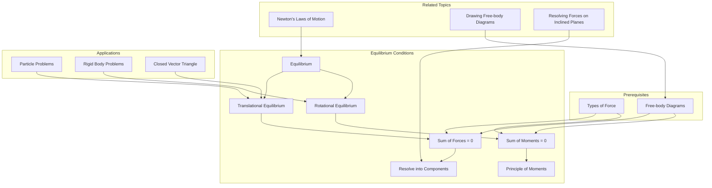

---
aliases:
  - Equilibrium Conditions
  - Translational Equilibrium
  - 平衡条件
tags:
  - physics
  - mechanics
  - forces
  - equilibrium
  - free-body-diagrams
  - AS
  - foundation
parent_hub: "[[Free-body Diagrams]]"
sibling_topics: "[[Drawing Free-body Diagrams]]", "[[Resolving Forces on Inclined Planes]]"
prerequisites: "[[Types of Force]]"
related_topics: "[[Newton's Laws of Motion]]"
---

# 1. Overview / 概述

**English:**
This leaf node focuses on the **Equilibrium Conditions** for a particle or rigid body under the action of forces. Equilibrium is a state where an object experiences no net force and no net moment (torque), resulting in zero acceleration (Newton's First Law). This is a foundational concept in [[Free-body Diagrams]] because the diagram itself is the tool used to check if these conditions are met. Understanding equilibrium is critical for solving static problems (objects at rest) and dynamic problems (objects moving at constant velocity). This sub-topic builds directly on [[Types of Force]] and is essential for applying [[Newton's Laws of Motion]].

**中文:**
本子知识点专注于质点或刚体在力的作用下所满足的**平衡条件**。平衡是指物体所受合外力为零且合外力矩为零的状态，导致加速度为零（牛顿第一定律）。这是[[Free-body Diagrams]]中的一个基础概念，因为受力图本身就是用来检查这些条件是否满足的工具。理解平衡对于解决静态问题（静止物体）和动态问题（匀速运动物体）至关重要。本子知识点直接建立在[[Types of Force]]之上，并且是应用[[Newton's Laws of Motion]]的必要前提。

---

# 2. Syllabus Learning Objectives / 考纲学习目标

| CAIE 9702 (3.2 b-c) | Edexcel IAL (WPH11 U1: 2.4-2.6) |
|-----------|-------------|
| (b) State and apply the conditions for equilibrium of a particle. | 2.4: Understand the concept of equilibrium of a particle. |
| (c) Apply the principle of moments to a system of coplanar forces acting on a rigid body in equilibrium. | 2.5: Apply the principle of moments to a rigid body in equilibrium. |
| | 2.6: Understand and apply the conditions for equilibrium of a rigid body (sum of forces = 0, sum of moments = 0). |

**Examiner Expectations / 考官期望:**
- **English:** You must be able to state the two conditions for equilibrium (translational and rotational). You must be able to apply these conditions to solve for unknown forces or distances in a system. For a particle, only the sum of forces is considered. For a rigid body, both the sum of forces and the sum of moments must be zero. You must be able to draw a [[Free-body Diagrams]] and resolve forces to apply these conditions.
- **中文:** 你必须能够陈述平衡的两个条件（平动平衡和转动平衡）。你必须能够应用这些条件来求解系统中的未知力或距离。对于质点，只考虑合力为零。对于刚体，合力和合力矩都必须为零。你必须能够绘制[[Free-body Diagrams]]并分解力以应用这些条件。

---

# 3. Core Definitions / 核心定义

| Term (EN/CN) | Definition (EN) | Definition (CN) | Common Mistakes / 常见错误 |
|--------------|-----------------|-----------------|---------------------------|
| **Equilibrium** / 平衡 | A state where the net force and net moment (torque) acting on a body are both zero, resulting in zero acceleration. | 物体所受合外力与合外力矩均为零的状态，导致加速度为零。 | Confusing equilibrium with being "at rest". An object moving at constant velocity is also in equilibrium. |
| **Translational Equilibrium** / 平动平衡 | The condition where the vector sum of all forces acting on a body is zero ($\sum \vec{F} = 0$). | 作用在物体上的所有力的矢量和为零的条件 ($\sum \vec{F} = 0$)。 | Forgetting to consider the direction of forces; only adding magnitudes. |
| **Rotational Equilibrium** / 转动平衡 | The condition where the sum of all moments (torques) about any point is zero ($\sum \vec{M} = 0$). | 关于任意一点的所有力矩之和为零的条件 ($\sum \vec{M} = 0$)。 | Forgetting to consider the sign (clockwise/anticlockwise) of moments. |
| **Moment (Torque)** / 力矩 | The turning effect of a force, calculated as $M = F \times d$, where $d$ is the perpendicular distance from the pivot to the line of action of the force. | 力的转动效应，计算公式为 $M = F \times d$，其中 $d$ 是支点到力的作用线的垂直距离。 | Using the distance from the pivot to the point of application, not the perpendicular distance. |
| **Principle of Moments** / 力矩原理 | For a body in rotational equilibrium, the sum of clockwise moments about any point equals the sum of anticlockwise moments about that same point. | 对于处于转动平衡的物体，关于任意一点的顺时针力矩之和等于关于同一点的逆时针力矩之和。 | Applying the principle only to the center of mass, not any arbitrary point. |
| **Coplanar Forces** / 共面力 | Forces that all lie in the same plane. | 所有力都位于同一平面内。 | Not applicable. |

---

# 4. Key Concepts Explained / 关键概念详解

## 4.1 The Two Conditions for Equilibrium / 平衡的两个条件

### Explanation / 解释
**English:**
For a body to be in complete equilibrium, two independent conditions must be satisfied simultaneously:
1.  **Translational Equilibrium:** The vector sum of all external forces acting on the body must be zero. This is derived from [[Newton's Laws of Motion]] (specifically Newton's First Law). Mathematically: $\sum \vec{F} = 0$. This means the net force in any direction (e.g., horizontal and vertical) is zero.
2.  **Rotational Equilibrium:** The sum of all external moments (torques) acting on the body about any point must be zero. This is known as the **Principle of Moments**. Mathematically: $\sum \vec{M} = 0$. This means the net turning effect is zero.

For a **particle** (a point mass with no size), only the first condition (translational equilibrium) is relevant, as a particle cannot rotate. For a **rigid body** (an object with size and shape), both conditions must be satisfied.

**中文:**
要使物体处于完全平衡状态，必须同时满足两个独立的条件：
1.  **平动平衡：** 作用在物体上的所有外力的矢量和必须为零。这源于[[Newton's Laws of Motion]]（特别是牛顿第一定律）。数学表达式为：$\sum \vec{F} = 0$。这意味着在任何方向（例如水平和垂直方向）上的合力都为零。
2.  **转动平衡：** 作用在物体上的所有外力关于任意一点的力矩之和必须为零。这被称为**力矩原理**。数学表达式为：$\sum \vec{M} = 0$。这意味着净转动效应为零。

对于**质点**（没有大小的点质量），只有第一个条件（平动平衡）是相关的，因为质点不能转动。对于**刚体**（有大小和形状的物体），两个条件都必须满足。

### Physical Meaning / 物理意义
**English:** Equilibrium means the object is either at rest (static equilibrium) or moving with constant velocity (dynamic equilibrium). The forces are perfectly balanced, so there is no change in the object's state of motion.
**中文:** 平衡意味着物体要么处于静止状态（静态平衡），要么以恒定速度运动（动态平衡）。力被完美地平衡，因此物体的运动状态没有变化。

### Common Misconceptions / 常见误区
- **Misconception 1:** An object in equilibrium must be stationary.
  - **Correction:** An object moving at constant velocity is also in equilibrium (dynamic equilibrium).
- **Misconception 2:** The sum of forces being zero is enough for any object.
  - **Correction:** For a rigid body, the sum of moments must also be zero, otherwise it will start to rotate.
- **Misconception 3:** The Principle of Moments only applies to the center of mass.
  - **Correction:** The sum of moments is zero about *any* point in the system.

### Exam Tips / 考试提示
- **English:** Always draw a clear [[Free-body Diagrams]] first. Resolve all forces into perpendicular components (e.g., horizontal and vertical). Apply $\sum F_x = 0$ and $\sum F_y = 0$ for translational equilibrium. For rotational equilibrium, choose a pivot point that eliminates unknown forces to simplify calculations. Clearly state whether a moment is clockwise or anticlockwise.
- **中文:** 始终先画一个清晰的[[Free-body Diagrams]]。将所有力分解为垂直分量（例如水平和垂直）。应用 $\sum F_x = 0$ 和 $\sum F_y = 0$ 来满足平动平衡。对于转动平衡，选择一个能消除未知力的支点以简化计算。明确说明力矩是顺时针还是逆时针。

> 📷 **IMAGE PROMPT — EQ-01: Equilibrium Conditions Diagram**
> A simple diagram showing a box on a table. Arrows represent the weight (W) acting downwards and the normal reaction (R) acting upwards. The box is labeled "In Equilibrium". A second diagram shows a box being pulled by two equal and opposite forces (F and -F) on a frictionless surface, moving at constant velocity, labeled "Dynamic Equilibrium".

---

# 5. Essential Equations / 核心公式

## 5.1 Translational Equilibrium / 平动平衡

$$ \sum \vec{F} = 0 $$

| Symbol (符号) | Meaning (EN) | Meaning (CN) | Unit (单位) |
|--------------|-------------|-------------|------------|
| $\sum \vec{F}$ | Vector sum of all forces | 所有力的矢量和 | N (Newtons) |

**Derivation / 推导:** Derived from [[Newton's Laws of Motion]] (First Law: $\vec{F}_{\text{net}} = 0 \implies \vec{a} = 0$).
**Conditions / 适用条件:** Applies to all bodies (particles and rigid bodies) in equilibrium.
**Limitations / 局限性:** Does not account for rotational effects.

## 5.2 Rotational Equilibrium (Principle of Moments) / 转动平衡（力矩原理）

$$ \sum \vec{M} = 0 \quad \text{or} \quad \sum M_{\text{clockwise}} = \sum M_{\text{anticlockwise}} $$

| Symbol (符号) | Meaning (EN) | Meaning (CN) | Unit (单位) |
|--------------|-------------|-------------|------------|
| $\sum \vec{M}$ | Vector sum of all moments | 所有力矩的矢量和 | N m (Newton-metres) |
| $M$ | Moment of a force ($M = F \times d_{\perp}$) | 力矩 ($M = F \times d_{\perp}$) | N m |

**Derivation / 推导:** A consequence of Newton's Second Law for rotation ($\tau_{\text{net}} = I\alpha$). If $\alpha = 0$, then $\tau_{\text{net}} = 0$.
**Conditions / 适用条件:** Applies to rigid bodies in equilibrium.
**Limitations / 局限性:** The choice of pivot point is arbitrary, but the sum of moments must be zero about *all* points.

> 📷 **IMAGE PROMPT — EQ-02: Moment Calculation Diagram**
> A diagram showing a seesaw with a pivot at the center. A force F1 is applied at a perpendicular distance d1 from the pivot on the left side. A force F2 is applied at a perpendicular distance d2 from the pivot on the right side. The formula M = F x d is shown.

---

# 6. Graphs and Relationships / 图表与关系

For equilibrium conditions, there are no standard graphs to plot. The relationship is algebraic and vector-based. However, a common graphical representation is the **closed vector triangle** for three forces in equilibrium.

## 6.1 Closed Vector Triangle / 闭合矢量三角形

### Axes / 坐标轴 (EN+CN)
Not applicable. This is a vector diagram, not a Cartesian graph.

### Shape / 形状 (EN+CN)
A closed triangle, where the three force vectors are drawn head-to-tail.

### Gradient Meaning / 斜率含义 (EN+CN)
Not applicable.

### Area Meaning / 面积含义 (EN+CN)
Not applicable.

### Exam Interpretation / 考试解读 (EN+CN)
- **English:** If three coplanar forces acting on a point are in equilibrium, they can be represented in magnitude and direction by the three sides of a triangle taken in order. This is a powerful tool for solving problems without resolving components.
- **中文:** 如果作用在一个点上的三个共面力处于平衡状态，则它们的大小和方向可以按顺序由三角形的三条边表示。这是一个无需分解分量即可解决问题的强大工具。

> 📷 **IMAGE PROMPT — GR-01: Closed Vector Triangle**
> A diagram showing three force vectors (F1, F2, F3) drawn head-to-tail forming a closed triangle. The arrows show the direction of each force. The triangle is labeled "Forces in Equilibrium".

---

# 7. Required Diagrams / 必备图表

## 7.1 Free-body Diagram for a Rigid Body in Equilibrium / 刚体平衡的受力图

### Description / 描述 (EN+CN)
**English:** A diagram showing a rigid body (e.g., a ladder leaning against a wall) with all external forces acting on it. The forces include weight (W) acting at the center of mass, normal reaction from the wall (R_wall), normal reaction from the ground (R_ground), and friction from the ground (F_friction). The diagram is used to apply the equilibrium conditions.
**中文:** 显示一个刚体（例如靠在墙上的梯子）以及作用在其上的所有外力的图。这些力包括作用在质心上的重力 (W)、来自墙壁的法向反作用力 (R_wall)、来自地面的法向反作用力 (R_ground) 以及来自地面的摩擦力 (F_friction)。该图用于应用平衡条件。

### Image Prompt / 图片生成提示
> 📷 **IMAGE PROMPT — DI-01: Ladder Equilibrium Free-body Diagram**
> A detailed diagram of a ladder leaning against a smooth vertical wall and a rough horizontal floor. The ladder is shown as a straight line. Arrows represent: Weight (W) acting downwards from the center of the ladder; Normal reaction from the wall (R_wall) acting horizontally to the right at the top of the ladder; Normal reaction from the ground (R_ground) acting vertically upwards at the bottom of the ladder; Friction force (F_friction) acting horizontally to the left at the bottom of the ladder. All forces are clearly labeled.

### Labels Required / 需要标注 (EN+CN)
- **Weight (W)** / 重力 (W)
- **Normal Reaction from Wall (R_wall)** / 来自墙壁的法向反作用力 (R_wall)
- **Normal Reaction from Ground (R_ground)** / 来自地面的法向反作用力 (R_ground)
- **Friction Force (F_friction)** / 摩擦力 (F_friction)
- **Center of Mass** / 质心

### Exam Importance / 考试重要性 (EN+CN)
- **English:** This is a classic exam problem. You must be able to draw the free-body diagram correctly and then apply both $\sum F = 0$ and $\sum M = 0$ to solve for unknown forces or distances.
- **中文:** 这是一个经典的考试问题。你必须能够正确绘制受力图，然后应用 $\sum F = 0$ 和 $\sum M = 0$ 来求解未知力或距离。

---

# 8. Worked Examples / 典型例题

## Example 1: Particle in Equilibrium / 质点平衡

### Question / 题目
**English:** A 5.0 kg mass is suspended by two strings, as shown in the diagram. String A makes an angle of 30° with the vertical, and string B makes an angle of 60° with the vertical. Calculate the tension in each string. (Take $g = 9.8 \text{ m s}^{-2}$)
**中文:** 一个 5.0 kg 的质量由两根绳子悬挂，如图所示。绳子 A 与垂直方向成 30° 角，绳子 B 与垂直方向成 60° 角。计算每根绳子的张力。（取 $g = 9.8 \text{ m s}^{-2}$）

> 📷 **IMAGE PROMPT — EX-01: Mass Suspended by Two Strings**
> A diagram showing a mass (5.0 kg) hanging from a point. Two strings are attached to the point. String A goes up and to the left at 30° to the vertical. String B goes up and to the right at 60° to the vertical. The tensions T_A and T_B are shown as arrows along the strings.

### Solution / 解答
**Step 1: Draw a Free-body Diagram**
The forces acting on the mass are its weight (W) downwards and the tensions (T_A and T_B) upwards and outwards.

**Step 2: Resolve Forces Vertically**
For translational equilibrium, the sum of vertical components must equal the weight.
$$ T_A \cos 30^\circ + T_B \cos 60^\circ = mg $$
$$ T_A (0.866) + T_B (0.5) = 5.0 \times 9.8 = 49 \text{ N} $$
(Equation 1)

**Step 3: Resolve Forces Horizontally**
For translational equilibrium, the sum of horizontal components must be zero.
$$ T_A \sin 30^\circ = T_B \sin 60^\circ $$
$$ T_A (0.5) = T_B (0.866) $$
$$ T_A = 1.732 T_B $$
(Equation 2)

**Step 4: Solve the Equations**
Substitute Equation 2 into Equation 1:
$$ (1.732 T_B)(0.866) + T_B (0.5) = 49 $$
$$ 1.5 T_B + 0.5 T_B = 49 $$
$$ 2.0 T_B = 49 $$
$$ T_B = 24.5 \text{ N} $$

Then, from Equation 2:
$$ T_A = 1.732 \times 24.5 = 42.4 \text{ N} $$

### Final Answer / 最终答案
**Answer:** Tension in string A = 42.4 N, Tension in string B = 24.5 N | **答案：** 绳子 A 的张力 = 42.4 N，绳子 B 的张力 = 24.5 N

### Quick Tip / 提示
(EN+CN)
- **English:** Always resolve forces into perpendicular components. Choose the directions that simplify the equations (e.g., horizontal and vertical).
- **中文:** 始终将力分解为垂直分量。选择能简化方程的方向（例如水平和垂直）。

## Example 2: Rigid Body in Equilibrium (Principle of Moments) / 刚体平衡（力矩原理）

### Question / 题目
**English:** A uniform beam of weight 200 N and length 6.0 m is supported at its ends by two pivots. A 500 N weight is placed 2.0 m from the left end. Calculate the reaction force at each pivot.
**中文:** 一根重量为 200 N、长度为 6.0 m 的均匀梁在其两端由两个支点支撑。一个 500 N 的重物放置在距左端 2.0 m 处。计算每个支点的反作用力。

> 📷 **IMAGE PROMPT — EX-02: Beam with Two Supports**
> A diagram showing a horizontal beam of length 6.0 m. It is supported at both ends (pivot A on the left, pivot B on the right). The weight of the beam (200 N) is shown acting downwards at the center (3.0 m from either end). A 500 N weight is shown acting downwards at a point 2.0 m from the left end. Reaction forces R_A and R_B are shown acting upwards at the pivots.

### Solution / 解答
**Step 1: Draw a Free-body Diagram**
Forces: Weight of beam (200 N) at 3.0 m from left, Load (500 N) at 2.0 m from left, Reaction at A (R_A) at left end, Reaction at B (R_B) at right end.

**Step 2: Apply Translational Equilibrium ($\sum F_y = 0$)**
$$ R_A + R_B = 200 + 500 = 700 \text{ N} $$
(Equation 1)

**Step 3: Apply Rotational Equilibrium ($\sum M = 0$) about Pivot A**
Taking moments about A eliminates R_A.
Clockwise moments: (200 N × 3.0 m) + (500 N × 2.0 m) = 600 + 1000 = 1600 N m
Anticlockwise moments: R_B × 6.0 m

For equilibrium:
$$ R_B \times 6.0 = 1600 $$
$$ R_B = \frac{1600}{6.0} = 266.7 \text{ N} $$

**Step 4: Solve for R_A**
From Equation 1:
$$ R_A = 700 - 266.7 = 433.3 \text{ N} $$

### Final Answer / 最终答案
**Answer:** Reaction at left pivot (R_A) = 433.3 N, Reaction at right pivot (R_B) = 266.7 N | **答案：** 左支点反作用力 (R_A) = 433.3 N，右支点反作用力 (R_B) = 266.7 N

### Quick Tip / 提示
(EN+CN)
- **English:** Choose the pivot point strategically to eliminate unknown forces. Taking moments about a support eliminates the reaction at that support.
- **中文:** 策略性地选择支点以消除未知力。关于一个支点取矩可以消除该支点的反作用力。

---

# 9. Past Paper Question Types / 历年真题题型

| Question Type / 题型 | Frequency / 频率 | Difficulty / 难度 | Past Paper References / 真题索引 |
|----------------------|------------------|------------------|-------------------------------|
| Particle in equilibrium (strings, pulleys) | High | Medium | 📝 *待填入* |
| Rigid body equilibrium (beam, ladder) | High | Medium-Hard | 📝 *待填入* |
| Closed vector triangle (three forces) | Medium | Medium | 📝 *待填入* |
| Principle of moments (seesaw, lever) | High | Easy-Medium | 📝 *待填入* |

**Common Command Words / 常见指令词:**
- **Calculate / 计算:** Find a numerical value.
- **State / 陈述:** Write down a law or condition.
- **Explain / 解释:** Give reasons for a phenomenon.
- **Show / 证明:** Demonstrate a result.
- **Determine / 确定:** Find a value, often using a graph or calculation.

---

# 10. Practical Skills Connections / 实验技能链接

**English:**
This sub-topic connects to practical work in several ways:
1.  **Verifying the Principle of Moments:** A common experiment involves balancing a meter rule on a pivot and using known weights to verify that the sum of clockwise moments equals the sum of anticlockwise moments. This involves measuring distances and forces, and calculating uncertainties.
2.  **Finding the Weight of a Meter Rule:** By balancing a meter rule off-center and using a known weight, you can determine the weight of the rule itself. This requires careful measurement of distances and application of the equilibrium conditions.
3.  **Uncertainty Analysis:** When measuring forces (using spring balances) and distances (using rulers), you must calculate the percentage and absolute uncertainties in your final result. For example, the uncertainty in a moment ($M = F \times d$) is the sum of the percentage uncertainties in $F$ and $d$.
4.  **Graph Plotting:** In some experiments, you might plot a graph (e.g., load vs. distance from pivot) to determine an unknown force or verify a relationship. The gradient and intercept of the graph can be used to find the required values.

**中文:**
本子知识点通过以下几种方式与实验工作相关联：
1.  **验证力矩原理：** 一个常见的实验涉及在支点上平衡一根米尺，并使用已知重量来验证顺时针力矩之和等于逆时针力矩之和。这涉及测量距离和力，并计算不确定度。
2.  **求米尺的重量：** 通过将米尺偏离中心平衡并使用已知重量，可以确定米尺本身的重量。这需要仔细测量距离并应用平衡条件。
3.  **不确定度分析：** 在测量力（使用弹簧测力计）和距离（使用尺子）时，必须计算最终结果的百分比不确定度和绝对不确定度。例如，力矩 ($M = F \times d$) 的不确定度是 $F$ 和 $d$ 的百分比不确定度之和。
4.  **图表绘制：** 在某些实验中，可能会绘制图表（例如，负载与到支点距离的关系图）以确定未知力或验证关系。图表的斜率和截距可用于求所需值。

---

# 11. Concept Map / 概念图谱

---

# 12. Quick Revision Sheet / 速查表

| Category / 类别 | Key Points / 要点 |
|----------------|------------------|
| **Definition / 定义** | Equilibrium: Net force = 0 AND Net moment = 0. / 平衡：合外力 = 0 且 合力矩 = 0。 |
| **Key Formula / 核心公式** | $\sum \vec{F} = 0$ (Translational / 平动), $\sum \vec{M} = 0$ (Rotational / 转动) |
| **Key Graph / 核心图表** | Closed Vector Triangle for three forces in equilibrium. / 三力平衡的闭合矢量三角形。 |
| **Exam Tip / 考试提示** | 1. Always draw a [[Free-body Diagrams]]. / 始终画[[Free-body Diagrams]]。 2. Resolve forces into components. / 将力分解为分量。 3. Choose a pivot to eliminate unknowns for moments. / 选择支点以消除未知力矩。 4. Check both conditions for rigid bodies. / 对刚体检查两个条件。 |