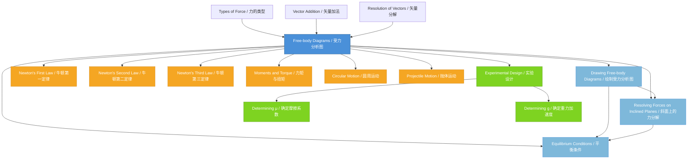

# 1. Overview / 概述

**English:**
Free-body diagrams (FBDs) are simplified visual representations of a single object or system, showing all the external forces acting upon it. They are the cornerstone of mechanics, serving as the essential first step in applying [[Newton's Laws of Motion]] to solve any problem involving forces. By isolating an object and representing each force as a vector arrow, FBDs transform complex physical situations into clear, solvable mathematical models.

In both Cambridge 9702 and Edexcel IAL A-Level Physics, mastering free-body diagrams is non-negotiable. They appear in virtually every mechanics topic, from [[Equilibrium Conditions]] and [[Resolving Forces on Inclined Planes]] to dynamics, circular motion, and even electric and magnetic field problems. The ability to correctly identify and represent forces—including weight, normal reaction, tension, friction, and applied forces—is a fundamental skill that examiners consistently test.

Real-world applications are everywhere: engineers use FBDs to design safe bridges and buildings, aerospace engineers analyse forces on aircraft during flight, and biomechanists study forces on the human body during movement. In the A-Level examinations, questions often present a physical scenario and ask students to draw the corresponding FBD, or provide a diagram and require students to write equations of motion from it. A solid grasp of FBDs directly determines success in calculating accelerations, tensions, and reaction forces.

**中文：**
受力分析图（Free-body Diagrams, FBDs）是对单个物体或系统的简化视觉表示，显示所有作用在其上的外力。它们是力学的基石，是应用[[牛顿运动定律]]解决任何涉及力的问题的关键第一步。通过隔离物体并将每个力表示为矢量箭头，受力分析图将复杂的物理情境转化为清晰、可解的数学模型。

在剑桥9702和爱德思IAL A-Level物理中，掌握受力分析图是必不可少的。它们几乎出现在所有力学主题中，从[[平衡条件]]和[[斜面上的力分解]]到动力学、圆周运动，甚至电场和磁场问题。正确识别和表示力——包括重力、法向反作用力、张力、摩擦力和施加力——是考官持续测试的基本技能。

现实世界的应用无处不在：工程师使用受力分析图设计安全的桥梁和建筑物，航空航天工程师分析飞行中飞机上的力，生物力学家研究运动中人体的力。在A-Level考试中，问题通常呈现一个物理场景，要求学生绘制相应的受力分析图，或提供一个图表，要求学生从中写出运动方程。扎实掌握受力分析图直接决定了计算加速度、张力和反作用力的成功。

---

# 2. Syllabus Learning Objectives / 考纲学习目标

**English:**
The following table maps the specific learning objectives from both Cambridge 9702 and Edexcel IAL syllabuses related to free-body diagrams. These objectives define what students must be able to do in examinations.

**中文：**
下表列出了剑桥9702和爱德思IAL考纲中与受力分析图相关的具体学习目标。这些目标定义了学生在考试中必须能够做到的内容。

| CAIE 9702 | Edexcel IAL |
|-----------|-------------|
| 3.2(b) Draw and interpret free-body diagrams showing forces acting on an object | 2.4 Draw and interpret free-body diagrams for objects in equilibrium |
| 3.2(c) Resolve forces into components and use them to solve problems | 2.5 Resolve forces into perpendicular components |
| — | 2.6 Use free-body diagrams to analyse the forces acting on an object on an inclined plane |

> 📋 **CIE Only:** Cambridge 9702 specifically requires students to "draw and interpret free-body diagrams" as part of the broader topic of forces. The syllabus emphasises the ability to identify all forces acting on a body and represent them correctly. Questions may ask students to draw FBDs for objects in both equilibrium and non-equilibrium situations (dynamics).

> 📋 **Edexcel Only:** Edexcel IAL explicitly separates the objectives into drawing FBDs for equilibrium (2.4), resolving forces (2.5), and applying these to inclined planes (2.6). Edexcel tends to place greater emphasis on the mathematical resolution of forces and the application to inclined plane problems, often requiring students to derive equations from their FBDs.

**Examiner Expectations / 考官期望：**

**English:**
- Students must be able to identify ALL forces acting on an object, including weight (always present near Earth's surface), normal reaction (perpendicular to contact surface), friction (parallel to contact surface, opposing relative motion), tension (along a string/cable), and applied forces.
- Forces must be drawn as arrows with correct direction and approximate relative magnitude.
- The object should be represented as a point mass (dot) or a simple box.
- Labels must be clear and standard (e.g., W, N, T, F, f).
- Students must be able to resolve forces into components and write equations of motion.

**中文：**
- 学生必须能够识别作用在物体上的所有力，包括重力（在地球表面附近始终存在）、法向反作用力（垂直于接触面）、摩擦力（平行于接触面，阻碍相对运动）、张力（沿绳子/缆绳方向）和施加力。
- 力必须绘制为箭头，方向正确，相对大小大致准确。
- 物体应表示为质点（点）或简单的方框。
- 标签必须清晰且标准（例如 W, N, T, F, f）。
- 学生必须能够将力分解为分量并写出运动方程。

---

# 3. Core Definitions / 核心定义

**English:**
The following table provides the essential definitions for free-body diagrams and related concepts. These definitions use exam-standard wording and highlight common student mistakes.

**中文：**
下表提供了受力分析图及相关概念的基本定义。这些定义使用考试标准措辞，并突出了学生常见错误。

| Term (EN/CN) | Definition (EN) | Definition (CN) | Common Mistakes / 常见错误 |
|--------------|-----------------|-----------------|---------------------------|
| **Free-body Diagram** / 受力分析图 | A diagram showing a single object (or system) isolated from its surroundings, with all external forces acting on it represented as labelled vector arrows. | 显示单个物体（或系统）与其周围环境隔离的图表，所有作用在其上的外力表示为带标签的矢量箭头。 | ❌ Including internal forces (e.g., forces within the object itself). ❌ Including forces the object exerts on other objects. ❌ Missing forces (especially weight or normal reaction). |
| **Force** / 力 | A push or pull that can cause an object to accelerate, deform, or change its state of motion. Measured in newtons (N). | 能够使物体加速、变形或改变运动状态的推或拉。以牛顿（N）为单位测量。 | ❌ Confusing force with energy or momentum. ❌ Forgetting that force is a vector quantity. |
| **Weight** / 重力 | The gravitational force exerted on an object by a planet (usually Earth). $W = mg$, where $g$ is the acceleration due to gravity. | 行星（通常是地球）对物体施加的万有引力。$W = mg$，其中 $g$ 是重力加速度。 | ❌ Confusing weight with mass. ❌ Forgetting that weight always acts vertically downward toward the centre of the Earth. |
| **Normal Reaction Force** / 法向反作用力 | The contact force exerted by a surface on an object, acting perpendicular to the surface. | 表面对物体施加的接触力，垂直于表面作用。 | ❌ Assuming normal reaction always equals weight (only true on horizontal surfaces with no other vertical forces). ❌ Drawing normal reaction at an angle other than perpendicular to the surface. |
| **Friction** / 摩擦力 | A force that opposes relative motion (or attempted motion) between two surfaces in contact. Acts parallel to the contact surface. | 阻碍两个接触表面之间相对运动（或试图运动）的力。平行于接触表面作用。 | ❌ Drawing friction in the direction of motion (it opposes motion). ❌ Forgetting friction exists when surfaces are rough. |
| **Tension** / 张力 | The pulling force transmitted through a string, rope, cable, or chain when it is taut. Acts along the direction of the string. | 当绳子、绳索、缆绳或链条拉紧时通过其传递的拉力。沿绳子方向作用。 | ❌ Drawing tension as a push (tension is always pulling). ❌ Forgetting that a string can only pull, not push. |
| **Applied Force** / 施加力 | An external force deliberately applied to an object, such as a push or pull from a person, engine, or spring. | 有意施加在物体上的外力，例如来自人、发动机或弹簧的推或拉。 | ❌ Not labelling the source of the applied force. ❌ Confusing applied force with reaction forces. |
| **Resultant Force** / 合力 | The single force that has the same effect as all the forces acting on an object combined. Found by vector addition. | 与作用在物体上的所有力组合效果相同的单个力。通过矢量加法求得。 | ❌ Simply adding magnitudes without considering direction. ❌ Forgetting that resultant force determines acceleration via $F = ma$. |
| **Equilibrium** / 平衡 | A state where the resultant force on an object is zero, meaning the object is either at rest or moving with constant velocity. | 物体上的合力为零的状态，意味着物体要么静止，要么以恒定速度运动。 | ❌ Assuming equilibrium means the object must be stationary (it can also move at constant velocity). ❌ Forgetting that both forces AND torques must balance for complete equilibrium. |

---

# 4. Key Concepts Explained / 关键概念详解

## 4.1 The Purpose and Structure of Free-body Diagrams / 受力分析图的目的与结构

### Explanation / 解释
**English:**
A free-body diagram is a tool for isolating a single object from its environment and showing only the forces that act **on** that object. The key principle is: **the object is "free" from its surroundings**. This means:
1. The object is drawn as a simple shape (dot, box, or circle).
2. All forces acting **on** the object are drawn as arrows starting from the object.
3. Forces that the object exerts on other objects are **never** included.
4. Each force arrow is labelled with its name or symbol (e.g., $W$, $N$, $T$, $F$, $f$).

The length of each arrow should roughly represent the relative magnitude of the force (longer arrow = larger force). The direction of the arrow shows the direction of the force.

**中文：**
受力分析图是一种工具，用于将单个物体从其环境中隔离出来，并仅显示作用在该物体上的力。关键原则是：**物体与其周围环境"自由"分离**。这意味着：
1. 物体被绘制为简单形状（点、方框或圆形）。
2. 所有作用在物体上的力都从物体出发绘制为箭头。
3. 物体对其他物体施加的力**绝不**包括在内。
4. 每个力箭头都标有其名称或符号（例如 $W$, $N$, $T$, $F$, $f$）。

每个箭头的长度应大致表示力的相对大小（较长的箭头 = 较大的力）。箭头的方向表示力的方向。

### Physical Meaning / 物理意义
**English:**
In the real world, objects interact with many things simultaneously. A book on a table interacts with Earth (gravity), the table (normal reaction), and possibly air (negligible). An FBD simplifies this by focusing only on the object of interest and the forces directly affecting it. This isolation is crucial because [[Newton's Laws of Motion]] apply to the net (resultant) force on a single object.

**中文：**
在现实世界中，物体同时与许多事物相互作用。桌子上的书与地球（重力）、桌子（法向反作用力）以及可能的空气（可忽略）相互作用。受力分析图通过仅关注感兴趣的物体和直接影响它的力来简化这一点。这种隔离至关重要，因为[[牛顿运动定律]]适用于单个物体上的净（合）力。

### Common Misconceptions / 常见误区
1. **Including internal forces:** Students often draw forces like "muscle force" inside a person or "molecular forces" inside a block. Only external forces belong on an FBD.
2. **Including action-reaction pairs incorrectly:** If you draw the weight of a book (Earth pulling on book), do NOT draw the gravitational pull of the book on Earth (that force acts on Earth, not the book).
3. **Forgetting weight:** Weight acts on ALL objects near Earth's surface. It is never optional.
4. **Drawing forces that don't exist:** For example, drawing a "forward force" on a car that is coasting (no engine force) or drawing a "centrifugal force" (which is a fictitious force, not a real force in an inertial frame).

### Exam Tips / 考试提示
**English:**
- Cambridge and Edexcel both expect you to draw FBDs from written descriptions. Practice translating words like "a block on a rough inclined plane" into the correct forces.
- Always start by identifying the object and listing all possible forces: weight (always), contact forces (normal reaction, friction), tension (if strings are present), applied forces (if mentioned).
- Use a ruler for straight arrows.
- Label every force clearly.
- If the object is in equilibrium, the vector sum of all forces must be zero. This is a powerful check.

**中文：**
- 剑桥和爱德思都期望你从文字描述中绘制受力分析图。练习将"粗糙斜面上的木块"等词语转化为正确的力。
- 始终从识别物体和列出所有可能的力开始：重力（始终存在）、接触力（法向反作用力、摩擦力）、张力（如果有绳子）、施加力（如果提到）。
- 使用直尺绘制直线箭头。
- 清晰标记每个力。
- 如果物体处于平衡状态，所有力的矢量和必须为零。这是一个强大的检查方法。

---

## 4.2 Identifying Forces Correctly / 正确识别力

### Explanation / 解释
**English:**
The most critical skill in drawing FBDs is correctly identifying which forces act on the object. Use this systematic approach:

1. **Weight ($W$ or $mg$):** Always present if the object is near a planet. Acts vertically downward toward the centre of the planet. $W = mg$.

2. **Normal Reaction Force ($N$ or $R$):** Present whenever the object is in contact with a surface. Acts perpendicular to the surface, **away from** the surface. The surface pushes on the object.

3. **Friction ($f$ or $F_f$):** Present when two surfaces are in contact and there is relative motion (kinetic friction) or attempted motion (static friction). Acts parallel to the surface, **opposing** the relative motion or attempted motion.

4. **Tension ($T$):** Present when a string, rope, cable, or chain is attached to the object and is taut. Acts along the string, **away from** the object (the string pulls on the object).

5. **Applied Force ($F$):** Any force deliberately applied by an external agent (person pushing, engine thrust, spring force, etc.). Direction depends on the situation.

6. **Air Resistance / Drag ($D$ or $F_d$):** Present when an object moves through a fluid (air or liquid). Acts opposite to the direction of motion.

**中文：**
绘制受力分析图最关键的能力是正确识别哪些力作用在物体上。使用这种系统方法：

1. **重力（$W$ 或 $mg$）：** 如果物体靠近行星，始终存在。垂直向下朝向行星中心作用。$W = mg$。

2. **法向反作用力（$N$ 或 $R$）：** 当物体与表面接触时存在。垂直于表面，**远离**表面作用。表面推物体。

3. **摩擦力（$f$ 或 $F_f$）：** 当两个表面接触并且存在相对运动（动摩擦力）或试图运动（静摩擦力）时存在。平行于表面，**阻碍**相对运动或试图运动。

4. **张力（$T$）：** 当绳子、绳索、缆绳或链条连接到物体并且拉紧时存在。沿绳子方向，**远离**物体作用（绳子拉物体）。

5. **施加力（$F$）：** 由外部施力者故意施加的任何力（人推、发动机推力、弹簧力等）。方向取决于具体情况。

6. **空气阻力/阻力（$D$ 或 $F_d$）：** 当物体在流体（空气或液体）中运动时存在。与运动方向相反作用。

### Physical Meaning / 物理意义
**English:**
Every force on an FBD represents an interaction between the object and something else in its environment. If you can identify what is interacting with the object, you can identify the force. For example:
- Earth interacts with the object → weight
- Table interacts with the object → normal reaction (and possibly friction)
- String interacts with the object → tension
- Person interacts with the object → applied force

**中文：**
受力分析图上的每个力都代表物体与其环境中其他事物之间的相互作用。如果你能识别出什么在与物体相互作用，你就能识别出力。例如：
- 地球与物体相互作用 → 重力
- 桌子与物体相互作用 → 法向反作用力（以及可能的摩擦力）
- 绳子与物体相互作用 → 张力
- 人与物体相互作用 → 施加力

### Common Misconceptions / 常见误区
1. **"Forward force" on a moving object:** If no one is pushing and no engine is running, there is no forward force. An object in motion stays in motion (Newton's First Law) without needing a forward force.
2. **Normal reaction always equals weight:** This is only true on a horizontal surface with no other vertical forces. On an inclined plane, $N = mg\cos\theta$, not $mg$.
3. **Friction always opposes motion:** Friction opposes *relative* motion between surfaces. A box on a truck accelerating forward experiences friction *forward* (to keep it from sliding backward relative to the truck).
4. **Tension can push:** Tension is always a pulling force. Strings cannot push.

### Exam Tips / 考试提示
**English:**
- Examiners love to test whether you include weight. Never forget it.
- If a surface is described as "smooth," there is NO friction. If "rough," friction is present.
- If a string is "light and inextensible," tension is the same throughout the string.
- Practice with varied scenarios: horizontal surfaces, inclined planes, hanging objects, objects in lifts, connected objects.

**中文：**
- 考官喜欢测试你是否包括重力。永远不要忘记它。
- 如果表面被描述为"光滑"，则没有摩擦力。如果是"粗糙"，则存在摩擦力。
- 如果绳子是"轻质且不可伸长的"，则绳子各处的张力相同。
- 练习各种场景：水平表面、斜面、悬挂物体、电梯中的物体、连接物体。

---

## 4.3 Drawing Free-body Diagrams Step by Step / 逐步绘制受力分析图

### Explanation / 解释
**English:**
Follow this systematic procedure to draw any free-body diagram:

**Step 1: Choose the object.** Decide which single object or system you are analysing. Draw it as a dot or simple shape.

**Step 2: Identify all external forces.** List every object in contact with your chosen object, plus gravity. For each contact, determine the type of force (normal reaction, friction, tension, applied).

**Step 3: Draw force arrows.** Starting from the centre of the object (or the dot), draw arrows representing each force. The arrow points in the direction the force acts on the object.

**Step 4: Label each arrow.** Use standard symbols: $W$ for weight, $N$ for normal reaction, $f$ for friction, $T$ for tension, $F$ for applied forces.

**Step 5: Check your diagram.** Ensure:
- All forces act ON the object (not forces the object exerts).
- No internal forces are included.
- Directions are correct.
- Relative lengths roughly match magnitudes.

**中文：**
按照以下系统步骤绘制任何受力分析图：

**第1步：选择物体。** 确定你要分析的单个物体或系统。将其绘制为点或简单形状。

**第2步：识别所有外力。** 列出与你选择的物体接触的每个物体，加上重力。对于每个接触，确定力的类型（法向反作用力、摩擦力、张力、施加力）。

**第3步：绘制力箭头。** 从物体的中心（或点）开始，绘制代表每个力的箭头。箭头指向力作用在物体上的方向。

**第4步：标记每个箭头。** 使用标准符号：$W$ 表示重力，$N$ 表示法向反作用力，$f$ 表示摩擦力，$T$ 表示张力，$F$ 表示施加力。

**第5步：检查你的图表。** 确保：
- 所有力都作用在物体上（而不是物体施加的力）。
- 不包括内力。
- 方向正确。
- 相对长度大致匹配大小。

### Physical Meaning / 物理意义
**English:**
This step-by-step process ensures that you never miss a force and that your diagram accurately represents the physical situation. A correct FBD is the foundation for writing correct equations of motion using [[Newton's Laws of Motion]].

**中文：**
这种逐步过程确保你永远不会遗漏一个力，并且你的图表准确代表物理情况。正确的受力分析图是使用[[牛顿运动定律]]写出正确运动方程的基础。

### Common Misconceptions / 常见误区
1. **Drawing forces starting from the point of application:** In FBDs, all forces are drawn from the centre of the object (or the dot) for simplicity. This is because we treat the object as a point mass.
2. **Forgetting to label forces:** Unlabelled arrows are meaningless. Always label.
3. **Drawing forces that are not present:** For example, drawing a "centripetal force" as a separate force on an FBD for circular motion. Centripetal force is the *resultant* of other forces, not a separate force.

### Exam Tips / 考试提示
**English:**
- In exams, you may be asked to draw an FBD directly on a diagram of the situation. Use the diagram as a guide.
- If the question says "draw a free-body diagram for the block," focus only on the block, not the entire system.
- Practice drawing FBDs for: a book on a table, a block on an inclined plane, a hanging mass, a car accelerating, a person in a lift, two connected masses.

**中文：**
- 在考试中，你可能被要求在情境图上直接绘制受力分析图。将图表作为指导。
- 如果问题说"为木块绘制受力分析图"，只关注木块，而不是整个系统。
- 练习为以下情况绘制受力分析图：桌子上的书、斜面上的木块、悬挂的质量、加速的汽车、电梯中的人、两个连接的质量。

---

## 4.4 Resolving Forces on Free-body Diagrams / 受力分析图上的力分解

### Explanation / 解释
**English:**
Once you have drawn an FBD, you often need to resolve forces into components to apply [[Newton's Laws of Motion]]. This is especially important for objects on [[Resolving Forces on Inclined Planes]].

When a force acts at an angle to the coordinate axes, you split it into two perpendicular components:
- **Horizontal (x) component:** $F_x = F\cos\theta$
- **Vertical (y) component:** $F_y = F\sin\theta$

The angle $\theta$ is measured from the horizontal axis (or from the axis you choose as reference).

For an object on an inclined plane at angle $\theta$ to the horizontal:
- Weight $W = mg$ acts vertically downward.
- Resolve weight into:
  - Component parallel to the plane: $mg\sin\theta$ (down the plane)
  - Component perpendicular to the plane: $mg\cos\theta$ (into the plane)
- Normal reaction $N$ acts perpendicular to the plane, balancing $mg\cos\theta$ (if no other perpendicular forces).
- Friction $f$ acts parallel to the plane, opposing motion.

**中文：**
一旦你绘制了受力分析图，你通常需要将力分解为分量以应用[[牛顿运动定律]]。这对于[[斜面上的力分解]]中的物体尤其重要。

当一个力与坐标轴成角度作用时，你将其分解为两个垂直分量：
- **水平（x）分量：** $F_x = F\cos\theta$
- **垂直（y）分量：** $F_y = F\sin\theta$

角度 $\theta$ 从水平轴（或你选择的参考轴）测量。

对于与水平面成 $\theta$ 角的斜面上的物体：
- 重力 $W = mg$ 垂直向下作用。
- 将重力分解为：
  - 平行于斜面的分量：$mg\sin\theta$（沿斜面向下）
  - 垂直于斜面的分量：$mg\cos\theta$（进入斜面）
- 法向反作用力 $N$ 垂直于斜面作用，平衡 $mg\cos\theta$（如果没有其他垂直力）。
- 摩擦力 $f$ 平行于斜面作用，阻碍运动。

### Physical Meaning / 物理意义
**English:**
Resolving forces allows us to apply Newton's Second Law separately in perpendicular directions. For example, on an inclined plane:
- Perpendicular to plane: $N - mg\cos\theta = 0$ (no acceleration perpendicular to plane)
- Parallel to plane: $mg\sin\theta - f = ma$ (if moving down the plane)

This separation is essential because motion typically occurs in one direction (along the plane) while the object remains in contact with the surface (perpendicular direction).

**中文：**
分解力使我们能够在垂直方向上分别应用牛顿第二定律。例如，在斜面上：
- 垂直于斜面：$N - mg\cos\theta = 0$（垂直于斜面方向无加速度）
- 平行于斜面：$mg\sin\theta - f = ma$（如果沿斜面向下运动）

这种分离至关重要，因为运动通常发生在一个方向（沿斜面），而物体保持与表面接触（垂直方向）。

### Common Misconceptions / 常见误区
1. **Using the wrong angle:** When resolving weight on an inclined plane, the angle between weight and the perpendicular to the plane is $\theta$, not $90^\circ - \theta$. The component parallel to the plane is $mg\sin\theta$, not $mg\cos\theta$.
2. **Forgetting to resolve:** Some students try to use $W = mg$ directly in equations without resolving, leading to incorrect results.
3. **Resolving forces that are already aligned:** If a force is already along an axis, you don't need to resolve it.

### Exam Tips / 考试提示
**English:**
- Always draw the resolved components as dashed lines on your FBD to show your working.
- Clearly label which component is $mg\sin\theta$ and which is $mg\cos\theta$.
- Remember: $mg\sin\theta$ is the component that causes acceleration down a frictionless plane.
- Practice with different angles and different orientations of the coordinate axes.

**中文：**
- 始终在受力分析图上将分解的分量绘制为虚线，以显示你的工作过程。
- 清晰标记哪个分量是 $mg\sin\theta$，哪个是 $mg\cos\theta$。
- 记住：$mg\sin\theta$ 是导致在无摩擦平面上加速的分量。
- 练习不同的角度和不同的坐标轴方向。

---

## 4.5 Equilibrium Conditions and Free-body Diagrams / 平衡条件与受力分析图

### Explanation / 解释
**English:**
An object is in [[Equilibrium Conditions]] when the resultant force acting on it is zero. This means:
- The vector sum of all forces in the x-direction is zero: $\sum F_x = 0$
- The vector sum of all forces in the y-direction is zero: $\sum F_y = 0$

For an FBD of an object in equilibrium, the arrows should form a closed polygon when placed head-to-tail. For three forces in equilibrium, the triangle of forces closes.

**Conditions for equilibrium:**
1. **Translational equilibrium:** The net force is zero ($\sum F = 0$). The object is either at rest or moving with constant velocity.
2. **Rotational equilibrium:** The net torque is zero ($\sum \tau = 0$). This is covered in later topics.

**中文：**
当作用在物体上的合力为零时，物体处于[[平衡条件]]。这意味着：
- x方向所有力的矢量和为零：$\sum F_x = 0$
- y方向所有力的矢量和为零：$\sum F_y = 0$

对于处于平衡状态的物体的受力分析图，当箭头首尾相连时，应形成一个封闭的多边形。对于三个力平衡，力的三角形闭合。

**平衡条件：**
1. **平移平衡：** 净力为零（$\sum F = 0$）。物体要么静止，要么以恒定速度运动。
2. **旋转平衡：** 净力矩为零（$\sum \tau = 0$）。这在后面的主题中涵盖。

### Physical Meaning / 物理意义
**English:**
Equilibrium is a fundamental concept in engineering and physics. A bridge, a building, a book on a table—all are in equilibrium. The forces balance so that there is no net acceleration. Understanding equilibrium allows us to calculate unknown forces (like tension in a cable or normal reaction) using the equations $\sum F_x = 0$ and $\sum F_y = 0$.

**中文：**
平衡是工程和物理学中的基本概念。桥梁、建筑物、桌子上的书——都处于平衡状态。力平衡使得没有净加速度。理解平衡使我们能够使用方程 $\sum F_x = 0$ 和 $\sum F_y = 0$ 计算未知力（如缆绳中的张力或法向反作用力）。

### Common Misconceptions / 常见误区
1. **Equilibrium means stationary:** An object moving with constant velocity is also in equilibrium. Only acceleration (change in velocity) requires a net force.
2. **Forgetting to check both directions:** You must check both x and y components separately. The forces could balance in one direction but not the other.
3. **Assuming equilibrium without checking:** Always verify that the problem states the object is in equilibrium (or at rest, or moving with constant velocity).

### Exam Tips / 考试提示
**English:**
- When a problem says "the object is at rest" or "moves with constant velocity," you know $\sum F = 0$.
- Use the equilibrium conditions to set up simultaneous equations for unknown forces.
- For three-force equilibrium problems, the triangle of forces method can be faster than resolving components.
- Practice with hanging masses, objects on inclined planes, and objects supported by multiple strings.

**中文：**
- 当问题说"物体静止"或"以恒定速度运动"时，你知道 $\sum F = 0$。
- 使用平衡条件建立未知力的联立方程。
- 对于三力平衡问题，力的三角形方法可能比分解分量更快。
- 练习悬挂质量、斜面上的物体以及由多根绳子支撑的物体。

---

> 📷 **IMAGE PROMPT — FBD-01: Standard Free-body Diagram Examples**
>
> A clean, educational diagram showing four different free-body diagrams side by side. Left to right: (1) A book on a horizontal table showing weight W downward and normal reaction N upward of equal length. (2) A block on a rough inclined plane at 30° showing weight W vertically downward, normal reaction N perpendicular to the plane, and friction f parallel to the plane pointing upward. (3) A hanging mass showing weight W downward and tension T upward of equal length. (4) A car accelerating to the right showing weight W downward, normal reaction N upward, engine force F to the right, and friction f to the left. All arrows are straight, labelled clearly, and drawn with proportional lengths. White background, black lines, professional textbook style.

---

# 5. Essential Equations / 核心公式

## 5.1 Newton's Second Law / 牛顿第二定律

**Equation / 公式:**
$$ F_{\text{net}} = ma $$

**Variables / 变量:**
| Symbol (符号) | Meaning (EN) | Meaning (CN) | Unit (单位) |
|--------------|-------------|-------------|------------|
| $F_{\text{net}}$ | Net (resultant) force acting on the object | 作用在物体上的净（合）力 | N (newtons) |
| $m$ | Mass of the object | 物体的质量 | kg |
| $a$ | Acceleration of the object | 物体的加速度 | m s$^{-2}$ |

**Derivation / 推导:**
**English:**
Newton's Second Law states that the rate of change of momentum of an object is proportional to the resultant force acting on it and takes place in the direction of that force. Mathematically:
$$ F_{\text{net}} = \frac{\Delta p}{\Delta t} = \frac{m\Delta v}{\Delta t} = ma $$
This derivation assumes constant mass.

**中文：**
牛顿第二定律指出，物体动量的变化率与作用在其上的合力成正比，并且发生在该力的方向上。数学上：
$$ F_{\text{net}} = \frac{\Delta p}{\Delta t} = \frac{m\Delta v}{\Delta t} = ma $$
这个推导假设质量恒定。

**Conditions / 适用条件:**
**English:**
- The mass of the object is constant.
- Forces are measured in an inertial (non-accelerating) reference frame.
- The equation applies separately in each perpendicular direction.

**中文：**
- 物体的质量恒定。
- 力在惯性（非加速）参考系中测量。
- 该方程分别适用于每个垂直方向。

**Limitations / 局限性:**
**English:**
- Does not apply at relativistic speeds (near the speed of light).
- Does not apply to objects with changing mass (e.g., rockets) in the simple form $F = ma$.
- The net force must be the vector sum of all forces.

**中文：**
- 不适用于相对论速度（接近光速）。
- 不适用于质量变化的物体（例如火箭）的简单形式 $F = ma$。
- 净力必须是所有力的矢量和。

**Rearrangements / 变形:**
**English:**
- $a = \frac{F_{\text{net}}}{m}$ (acceleration from known force and mass)
- $m = \frac{F_{\text{net}}}{a}$ (mass from known force and acceleration)
- $\sum F_x = ma_x$ and $\sum F_y = ma_y$ (component form)

**中文：**
- $a = \frac{F_{\text{net}}}{m}$（从已知力和质量求加速度）
- $m = \frac{F_{\text{net}}}{a}$（从已知力和加速度求质量）
- $\sum F_x = ma_x$ 和 $\sum F_y = ma_y$（分量形式）

---

## 5.2 Weight / 重力

**Equation / 公式:**
$$ W = mg $$

**Variables / 变量:**
| Symbol (符号) | Meaning (EN) | Meaning (CN) | Unit (单位) |
|--------------|-------------|-------------|------------|
| $W$ | Weight (gravitational force) | 重量（重力） | N |
| $m$ | Mass of the object | 物体的质量 | kg |
| $g$ | Acceleration due to gravity (9.81 m s$^{-2}$ on Earth) | 重力加速度（地球上为9.81 m s$^{-2}$） | m s$^{-2}$ |

**Derivation / 推导:**
**English:**
Weight is the force of gravitational attraction between an object and a planet. From Newton's Law of Universal Gravitation:
$$ F = G\frac{Mm}{r^2} $$
Near Earth's surface, $r \approx R_E$ (Earth's radius), so:
$$ g = G\frac{M_E}{R_E^2} \approx 9.81 \text{ m s}^{-2} $$
Thus $W = mg$.

**中文：**
重量是物体与行星之间的万有引力。根据牛顿万有引力定律：
$$ F = G\frac{Mm}{r^2} $$
在地球表面附近，$r \approx R_E$（地球半径），所以：
$$ g = G\frac{M_E}{R_E^2} \approx 9.81 \text{ m s}^{-2} $$
因此 $W = mg$。

**Conditions / 适用条件:**
**English:**
- The object is near the surface of a planet.
- $g$ varies with location (altitude, latitude) but is taken as 9.81 m s$^{-2}$ for A-Level calculations unless stated otherwise.

**中文：**
- 物体靠近行星表面。
- $g$ 随位置（海拔、纬度）变化，但在A-Level计算中除非另有说明，否则取9.81 m s$^{-2}$。

**Limitations / 局限性:**
**English:**
- $g$ is not constant at very high altitudes or on other planets.
- The equation gives the magnitude of weight; direction is always toward the centre of the planet.

**中文：**
- 在非常高的海拔或其他行星上，$g$ 不是常数。
- 该方程给出重量的大小；方向始终朝向行星中心。

**Rearrangements / 变形:**
**English:**
- $m = \frac{W}{g}$ (mass from weight)
- $g = \frac{W}{m}$ (gravitational field strength from weight and mass)

**中文：**
- $m = \frac{W}{g}$（从重量求质量）
- $g = \frac{W}{m}$（从重量和质量求重力场强度）

---

## 5.3 Friction / 摩擦力

**Equation / 公式:**
$$ f = \mu N $$

**Variables / 变量:**
| Symbol (符号) | Meaning (EN) | Meaning (CN) | Unit (单位) |
|--------------|-------------|-------------|------------|
| $f$ | Frictional force | 摩擦力 | N |
| $\mu$ | Coefficient of friction (dimensionless) | 摩擦系数（无量纲） | — |
| $N$ | Normal reaction force | 法向反作用力 | N |

**Derivation / 推导:**
**English:**
Friction arises from microscopic interactions between surfaces. Empirically, the maximum static friction and kinetic friction are proportional to the normal reaction force. The constant of proportionality is the coefficient of friction $\mu$. For static friction: $f_s \leq \mu_s N$. For kinetic friction: $f_k = \mu_k N$.

**中文：**
摩擦力源于表面之间的微观相互作用。根据经验，最大静摩擦力和动摩擦力与法向反作用力成正比。比例常数是摩擦系数 $\mu$。对于静摩擦力：$f_s \leq \mu_s N$。对于动摩擦力：$f_k = \mu_k N$。

**Conditions / 适用条件:**
**English:**
- Surfaces are in contact and there is relative motion (kinetic) or attempted motion (static).
- The surfaces are rough ($\mu > 0$). For smooth surfaces, $\mu = 0$ and $f = 0$.
- The equation gives the maximum static friction; actual static friction can be less.

**中文：**
- 表面接触并且存在相对运动（动）或试图运动（静）。
- 表面粗糙（$\mu > 0$）。对于光滑表面，$\mu = 0$ 且 $f = 0$。
- 该方程给出最大静摩擦力；实际静摩擦力可以更小。

**Limitations / 局限性:**
**English:**
- The coefficient of friction depends on the materials and surface conditions.
- The equation is an approximation; friction is complex at the microscopic level.
- Does not apply to rolling friction or fluid friction (drag).

**中文：**
- 摩擦系数取决于材料和表面条件。
- 该方程是近似值；摩擦力在微观层面是复杂的。
- 不适用于滚动摩擦或流体摩擦（阻力）。

**Rearrangements / 变形:**
**English:**
- $\mu = \frac{f}{N}$ (coefficient of friction from known forces)
- $N = \frac{f}{\mu}$ (normal reaction from known friction)

**中文：**
- $\mu = \frac{f}{N}$（从已知力求摩擦系数）
- $N = \frac{f}{\mu}$（从已知摩擦力求法向反作用力）

---

## 5.4 Force Resolution / 力的分解

**Equation / 公式:**
$$ F_x = F\cos\theta $$
$$ F_y = F\sin\theta $$

**Variables / 变量:**
| Symbol (符号) | Meaning (EN) | Meaning (CN) | Unit (单位) |
|--------------|-------------|-------------|------------|
| $F$ | Magnitude of the force | 力的大小 | N |
| $F_x$ | Horizontal (x) component | 水平（x）分量 | N |
| $F_y$ | Vertical (y) component | 垂直（y）分量 | N |
| $\theta$ | Angle between the force and the horizontal axis | 力与水平轴之间的角度 | degrees or radians |

**Derivation / 推导:**
**English:**
From trigonometry in a right-angled triangle:
- The adjacent side to angle $\theta$ is $F\cos\theta$ (horizontal component)
- The opposite side to angle $\theta$ is $F\sin\theta$ (vertical component)
This follows from $\cos\theta = \frac{\text{adjacent}}{\text{hypotenuse}}$ and $\sin\theta = \frac{\text{opposite}}{\text{hypotenuse}}$.

**中文：**
根据直角三角形的三角学：
- 角度 $\theta$ 的邻边是 $F\cos\theta$（水平分量）
- 角度 $\theta$ 的对边是 $F\sin\theta$（垂直分量）
这遵循 $\cos\theta = \frac{\text{邻边}}{\text{斜边}}$ 和 $\sin\theta = \frac{\text{对边}}{\text{斜边}}$。

**Conditions / 适用条件:**
**English:**
- The force is at an angle to the chosen coordinate axes.
- The components are perpendicular to each other.
- The angle $\theta$ is measured from the axis you choose as the reference (usually horizontal).

**中文：**
- 力与所选坐标轴成角度。
- 分量彼此垂直。
- 角度 $\theta$ 从你选择作为参考的轴（通常是水平轴）测量。

**Limitations / 局限性:**
**English:**
- Only works for perpendicular components. Non-perpendicular components require more complex vector addition.
- The choice of axes is arbitrary but should simplify the problem (e.g., align axes with the inclined plane).

**中文：**
- 仅适用于垂直分量。非垂直分量需要更复杂的矢量加法。
- 轴的选择是任意的，但应简化问题（例如，使轴与斜面对齐）。

**Rearrangements / 变形:**
**English:**
- $F = \sqrt{F_x^2 + F_y^2}$ (magnitude from components)
- $\theta = \tan^{-1}\left(\frac{F_y}{F_x}\right)$ (angle from components)
- For inclined plane: parallel component = $mg\sin\theta$, perpendicular component = $mg\cos\theta$

**中文：**
- $F = \sqrt{F_x^2 + F_y^2}$（从分量求大小）
- $\theta = \tan^{-1}\left(\frac{F_y}{F_x}\right)$（从分量求角度）
- 对于斜面：平行分量 = $mg\sin\theta$，垂直分量 = $mg\cos\theta$

---

## 5.5 Equilibrium Conditions / 平衡条件

**Equation / 公式:**
$$ \sum F_x = 0 $$
$$ \sum F_y = 0 $$

**Variables / 变量:**
| Symbol (符号) | Meaning (EN) | Meaning (CN) | Unit (单位) |
|--------------|-------------|-------------|------------|
| $\sum F_x$ | Sum of all forces in the x-direction | x方向所有力的和 | N |
| $\sum F_y$ | Sum of all forces in the y-direction | y方向所有力的和 | N |

**Derivation / 推导:**
**English:**
From Newton's First Law: an object at rest or moving with constant velocity has zero acceleration. From Newton's Second Law: $F_{\text{net}} = ma$. If $a = 0$, then $F_{\text{net}} = 0$. Since force is a vector, this means the sum of components in any direction must be zero.

**中文：**
根据牛顿第一定律：静止或匀速运动的物体加速度为零。根据牛顿第二定律：$F_{\text{net}} = ma$。如果 $a = 0$，则 $F_{\text{net}} = 0$。由于力是矢量，这意味着任何方向上的分量之和必须为零。

**Conditions / 适用条件:**
**English:**
- The object is in translational equilibrium (at rest or constant velocity).
- The equations apply separately in each perpendicular direction.
- For complete equilibrium, rotational equilibrium ($\sum \tau = 0$) is also required.

**中文：**
- 物体处于平移平衡状态（静止或匀速）。
- 方程分别适用于每个垂直方向。
- 对于完全平衡，还需要旋转平衡（$\sum \tau = 0$）。

**Limitations / 局限性:**
**English:**
- Does not guarantee rotational equilibrium (torques must also balance).
- Only applies to objects with no net acceleration.

**中文：**
- 不保证旋转平衡（力矩也必须平衡）。
- 仅适用于没有净加速度的物体。

**Rearrangements / 变形:**
**English:**
- For three forces in equilibrium: $\frac{F_1}{\sin\alpha} = \frac{F_2}{\sin\beta} = \frac{F_3}{\sin\gamma}$ (Lami's Theorem)
- Triangle of forces: three forces in equilibrium form a closed triangle when placed head-to-tail.

**中文：**
- 对于三个力平衡：$\frac{F_1}{\sin\alpha} = \frac{F_2}{\sin\beta} = \frac{F_3}{\sin\gamma}$（拉米定理）
- 力的三角形：三个平衡的力首尾相连时形成一个封闭三角形。

---

# 6. Graphs and Relationships / 图表与关系

## 6.1 Force Components vs. Angle on an Inclined Plane / 斜面上力分量与角度的关系

### Axes / 坐标轴
**English:** x-axis: Angle of inclination $\theta$ (degrees); y-axis: Force component (N)
**中文：** x轴：倾斜角度 $\theta$（度）；y轴：力分量（N）

### Shape / 形状
**English:**
- $mg\sin\theta$ (parallel component): Increases from 0 at $\theta = 0^\circ$ to $mg$ at $\theta = 90^\circ$. Shape is a sine curve.
- $mg\cos\theta$ (perpendicular component): Decreases from $mg$ at $\theta = 0^\circ$ to 0 at $\theta = 90^\circ$. Shape is a cosine curve.

**中文：**
- $mg\sin\theta$（平行分量）：从 $\theta = 0^\circ$ 时的0增加到 $\theta = 90^\circ$ 时的 $mg$。形状为正弦曲线。
- $mg\cos\theta$（垂直分量）：从 $\theta = 0^\circ$ 时的 $mg$ 减少到 $\theta = 90^\circ$ 时的0。形状为余弦曲线。

### Gradient Meaning / 斜率含义
**English:**
- Gradient of $mg\sin\theta$ vs $\theta$: $mg\cos\theta$ (rate of change of parallel component with angle)
- Gradient of $mg\cos\theta$ vs $\theta$: $-mg\sin\theta$ (rate of change of perpendicular component with angle)

**中文：**
- $mg\sin\theta$ 对 $\theta$ 的斜率：$mg\cos\theta$（平行分量随角度的变化率）
- $mg\cos\theta$ 对 $\theta$ 的斜率：$-mg\sin\theta$（垂直分量随角度的变化率）

### Area Meaning / 面积含义
**English:**
Area under the $mg\sin\theta$ vs $\theta$ graph: Not physically meaningful in this context.
Area under the $mg\cos\theta$ vs $\theta$ graph: Not physically meaningful in this context.

**中文：**
$mg\sin\theta$ 对 $\theta$ 图下的面积：在此上下文中没有物理意义。
$mg\cos\theta$ 对 $\theta$ 图下的面积：在此上下文中没有物理意义。

### Exam Interpretation / 考试解读
**English:**
- At $\theta = 0^\circ$ (horizontal surface): $mg\sin\theta = 0$, $mg\cos\theta = mg$. The entire weight is supported by the normal reaction.
- At $\theta = 90^\circ$ (vertical surface): $mg\sin\theta = mg$, $mg\cos\theta = 0$. The object would fall freely if no other forces act.
- The crossover point where $mg\sin\theta = mg\cos\theta$ occurs at $\theta = 45^\circ$.

**中文：**
- 在 $\theta = 0^\circ$（水平面）：$mg\sin\theta = 0$，$mg\cos\theta = mg$。整个重量由法向反作用力支撑。
- 在 $\theta = 90^\circ$（垂直面）：$mg\sin\theta = mg$，$mg\cos\theta = 0$。如果没有其他力作用，物体会自由下落。
- $mg\sin\theta = mg\cos\theta$ 的交叉点出现在 $\theta = 45^\circ$。

### Common Questions / 常见问题
**English:**
- "At what angle is the component of weight down the plane equal to the component perpendicular to the plane?" (Answer: 45°)
- "How does the normal reaction force change as the angle of inclination increases?" (Answer: It decreases as $\cos\theta$)
- "Sketch a graph showing how the acceleration of a block down a frictionless inclined plane varies with the angle of inclination."

**中文：**
- "在什么角度下，沿斜面向下的重力分量等于垂直于斜面的分量？"（答案：45°）
- "法向反作用力如何随倾斜角度的增加而变化？"（答案：它按 $\cos\theta$ 减少）
- "绘制图表，显示木块在无摩擦斜面上的加速度如何随倾斜角度变化。"

---

## 6.2 Acceleration vs. Angle on a Frictionless Inclined Plane / 无摩擦斜面上加速度与角度的关系

### Axes / 坐标轴
**English:** x-axis: Angle of inclination $\theta$ (degrees); y-axis: Acceleration $a$ (m s$^{-2}$)
**中文：** x轴：倾斜角度 $\theta$（度）；y轴：加速度 $a$（m s$^{-2}$）

### Shape / 形状
**English:**
A sine curve: $a = g\sin\theta$. Starts at 0 when $\theta = 0^\circ$, increases to $g$ when $\theta = 90^\circ$.

**中文：**
正弦曲线：$a = g\sin\theta$。从 $\theta = 0^\circ$ 时的0开始，增加到 $\theta = 90^\circ$ 时的 $g$。

### Gradient Meaning / 斜率含义
**English:**
Gradient = $g\cos\theta$. The rate of change of acceleration with angle decreases as $\theta$ increases.

**中文：**
斜率 = $g\cos\theta$。加速度随角度的变化率随着 $\theta$ 的增加而减小。

### Area Meaning / 面积含义
**English:**
Area under the $a$ vs $\theta$ graph: Not physically meaningful in this context.

**中文：**
$a$ 对 $\theta$ 图下的面积：在此上下文中没有物理意义。

### Exam Interpretation / 考试解读
**English:**
- The acceleration is independent of mass (Galileo's insight).
- At small angles ($\theta < 10^\circ$), $\sin\theta \approx \theta$ (in radians), so $a \approx g\theta$.
- This graph is used to determine $g$ experimentally by measuring acceleration on an inclined plane.

**中文：**
- 加速度与质量无关（伽利略的见解）。
- 在小角度（$\theta < 10^\circ$）时，$\sin\theta \approx \theta$（弧度制），所以 $a \approx g\theta$。
- 该图用于通过测量斜面上的加速度来实验确定 $g$。

### Common Questions / 常见问题
**English:**
- "How does the acceleration of a block on a frictionless inclined plane depend on the angle?"
- "What is the maximum possible acceleration down an inclined plane?" (Answer: $g$, when $\theta = 90^\circ$)
- "Sketch the acceleration vs. angle graph for a rough inclined plane (include friction)."

**中文：**
- "无摩擦斜面上木块的加速度如何依赖于角度？"
- "沿斜面下滑的最大可能加速度是多少？"（答案：$g$，当 $\theta = 90^\circ$ 时）
- "绘制粗糙斜面（包括摩擦力）的加速度与角度关系图。"

---

> 📷 **IMAGE PROMPT — FBD-02: Force Components vs Angle Graph**
>
> A professional graph with two curves on the same axes. x-axis labelled "Angle θ (degrees)" from 0 to 90. y-axis labelled "Force Component (N)". One curve labelled "mg sin θ" rising from 0 to mg in a sine shape. Another curve labelled "mg cos θ" falling from mg to 0 in a cosine shape. A vertical dashed line at θ = 45° showing where the two curves intersect. Clean white background, grid lines, professional textbook style.

---

# 7. Required Diagrams / 必备图表

## 7.1 Standard Free-body Diagram for a Block on a Horizontal Surface / 水平面上木块的标准受力分析图

### Description / 描述
**English:**
A simple diagram showing a block (represented as a rectangle or dot) on a horizontal surface. Two forces act on the block: weight ($W$) acting vertically downward, and normal reaction ($N$) acting vertically upward. The arrows should be of equal length to indicate equilibrium. Labels are placed next to each arrow.

**中文：**
一个简单的图表，显示水平面上的木块（表示为矩形或点）。两个力作用在木块上：重力（$W$）垂直向下作用，法向反作用力（$N$）垂直向上作用。箭头长度应相等以表示平衡。标签放在每个箭头旁边。

### Image Prompt / 图片生成提示
> 📷 **IMAGE PROMPT — FBD-03: Block on Horizontal Surface**
>
> A clean, minimal diagram showing a rectangular block resting on a horizontal surface (a straight line). From the centre of the block, two arrows of equal length point vertically: one downward labelled "W = mg" and one upward labelled "N". The surface is a thick horizontal line. The block is shaded light grey. Labels are in clear sans-serif font. White background, professional textbook style.

### Labels Required / 需要标注
**English:**
- Block (or object)
- Surface (horizontal)
- $W$ or $mg$ (weight, downward)
- $N$ (normal reaction, upward)

**中文：**
- 木块（或物体）
- 表面（水平）
- $W$ 或 $mg$（重力，向下）
- $N$（法向反作用力，向上）

### Exam Importance / 考试重要性
**English:**
This is the simplest FBD and the foundation for all others. Examiners expect students to recognise that on a horizontal surface with no other vertical forces, $N = mg$. This diagram is often the starting point for more complex problems involving additional forces (pushing, pulling, friction).

**中文：**
这是最简单的受力分析图，是所有其他图的基础。考官期望学生认识到，在没有其他垂直力的水平面上，$N = mg$。这个图通常是涉及额外力（推、拉、摩擦力）的更复杂问题的起点。

---

## 7.2 Free-body Diagram for a Block on an Inclined Plane / 斜面上木块的受力分析图

### Description / 描述
**English:**
A diagram showing a block on a plane inclined at angle $\theta$ to the horizontal. Three forces typically act: weight ($W = mg$) vertically downward, normal reaction ($N$) perpendicular to the plane, and friction ($f$) parallel to the plane (opposing motion). The weight is resolved into two components: $mg\sin\theta$ (parallel to the plane, downward) and $mg\cos\theta$ (perpendicular to the plane, into the plane). These components are shown as dashed arrows.

**中文：**
一个图表，显示木块在与水平面成 $\theta$ 角的斜面上。通常有三个力作用：重力（$W = mg$）垂直向下，法向反作用力（$N$）垂直于斜面，摩擦力（$f$）平行于斜面（阻碍运动）。重力被分解为两个分量：$mg\sin\theta$（平行于斜面，向下）和 $mg\cos\theta$（垂直于斜面，进入斜面）。这些分量显示为虚线箭头。

### Image Prompt / 图片生成提示
> 📷 **IMAGE PROMPT — FBD-04: Block on Inclined Plane with Resolved Forces**
>
> A detailed educational diagram showing a rectangular block on a plane inclined at 30° to the horizontal. From the centre of the block: a solid arrow vertically downward labelled "W = mg"; a solid arrow perpendicular to the plane labelled "N"; a solid arrow parallel to the plane pointing upward labelled "f" (friction). Two dashed arrows from the tip of the weight arrow: one perpendicular to the plane labelled "mg cos θ" and one parallel to the plane labelled "mg sin θ". The angle θ is marked between the horizontal and the plane. All arrows are straight and clearly labelled. Professional textbook style, white background.

### Labels Required / 需要标注
**English:**
- Block
- Inclined plane (angle $\theta$ marked)
- $W = mg$ (weight, vertical downward)
- $N$ (normal reaction, perpendicular to plane)
- $f$ (friction, parallel to plane)
- $mg\sin\theta$ (component parallel to plane)
- $mg\cos\theta$ (component perpendicular to plane)
- Angle $\theta$ between horizontal and plane

**中文：**
- 木块
- 斜面（标记角度 $\theta$）
- $W = mg$（重力，垂直向下）
- $N$（法向反作用力，垂直于斜面）
- $f$（摩擦力，平行于斜面）
- $mg\sin\theta$（平行于斜面的分量）
- $mg\cos\theta$（垂直于斜面的分量）
- 水平面与斜面之间的角度 $\theta$

### Exam Importance / 考试重要性
**English:**
This is one of the most frequently tested diagrams in both Cambridge and Edexcel exams. Students must be able to draw it from a written description and use it to write equations of motion. The resolution of weight into components is a key skill. Examiners often ask students to derive the acceleration down the plane or the minimum angle for sliding.

**中文：**
这是剑桥和爱德思考试中最常测试的图表之一。学生必须能够根据文字描述绘制它，并使用它写出运动方程。将重力分解为分量是一项关键技能。考官经常要求学生推导沿斜面的加速度或滑动的最小角度。

---

## 7.3 Free-body Diagram for a Hanging Mass / 悬挂质量的受力分析图

### Description / 描述
**English:**
A diagram showing a mass (represented as a circle or rectangle) suspended by a string. Two forces act: weight ($W = mg$) acting vertically downward, and tension ($T$) acting vertically upward along the string. If the mass is stationary or moving with constant velocity, the arrows are of equal length. For multiple strings, the tensions are resolved into components.

**中文：**
一个图表，显示由绳子悬挂的质量（表示为圆形或矩形）。两个力作用：重力（$W = mg$）垂直向下作用，张力（$T$）沿绳子垂直向上作用。如果质量静止或以恒定速度运动，箭头长度相等。对于多根绳子，张力被分解为分量。

### Image Prompt / 图片生成提示
> 📷 **IMAGE PROMPT — FBD-05: Hanging Mass with Tension**
>
> A clean diagram showing a circular mass hanging from a vertical string attached to a ceiling. From the centre of the mass: one arrow pointing downward labelled "W = mg" and one arrow pointing upward along the string labelled "T". The arrows are of equal length. The string is a thin line from the ceiling to the mass. The ceiling is a thick horizontal line. Professional textbook style, white background.

### Labels Required / 需要标注
**English:**
- Mass (circle or rectangle)
- String (vertical line)
- Ceiling (horizontal line)
- $W = mg$ (weight, downward)
- $T$ (tension, upward along string)

**中文：**
- 质量（圆形或矩形）
- 绳子（垂直线）
- 天花板（水平线）
- $W = mg$（重力，向下）
- $T$（张力，沿绳子向上）

### Exam Importance / 考试重要性
**English:**
This diagram is essential for understanding tension and for problems involving pulleys, lifts, and connected masses. Examiners often extend this to situations with multiple strings at angles, requiring resolution of tensions. The concept that $T = mg$ for a stationary hanging mass is a fundamental result.

**中文：**
这个图对于理解张力以及涉及滑轮、电梯和连接质量的问题至关重要。考官经常将其扩展到多根绳子成角度的情况，需要分解张力。对于静止的悬挂质量，$T = mg$ 的概念是一个基本结果。

---

## 7.4 Free-body Diagram for an Object with Multiple Forces / 多力物体的受力分析图

### Description / 描述
**English:**
A diagram showing an object (e.g., a box being pushed on a rough horizontal surface) with four forces: weight ($W$) downward, normal reaction ($N$) upward, applied force ($F$) at an angle, and friction ($f$) opposing motion. The applied force is resolved into horizontal and vertical components ($F\cos\theta$ and $F\sin\theta$).

**中文：**
一个图表，显示一个物体（例如，在粗糙水平面上被推的箱子）有四个力：重力（$W$）向下，法向反作用力（$N$）向上，施加力（$F$）成角度，摩擦力（$f$）阻碍运动。施加力被分解为水平和垂直分量（$F\cos\theta$ 和 $F\sin\theta$）。

### Image Prompt / 图片生成提示
> 📷 **IMAGE PROMPT — FBD-06: Box Pushed on Rough Surface**
>
> A diagram showing a rectangular box on a horizontal rough surface. From the centre of the box: a downward arrow labelled "W = mg", an upward arrow labelled "N", a diagonal arrow pointing down and to the right at 30° below horizontal labelled "F" (applied force), and a horizontal arrow pointing left labelled "f" (friction). Dashed arrows from the tip of F show the horizontal component "F cos θ" and vertical component "F sin θ". The angle θ is marked. Professional textbook style, white background.

### Labels Required / 需要标注
**English:**
- Box
- Rough surface
- $W = mg$ (weight, downward)
- $N$ (normal reaction, upward)
- $F$ (applied force, at angle $\theta$ below horizontal)
- $f$ (friction, opposing motion)
- $F\cos\theta$ (horizontal component)
- $F\sin\theta$ (vertical component)
- Angle $\theta$

**中文：**
- 箱子
- 粗糙表面
- $W = mg$（重力，向下）
- $N$（法向反作用力，向上）
- $F$（施加力，与水平方向成 $\theta$ 角向下）
- $f$（摩擦力，阻碍运动）
- $F\cos\theta$（水平分量）
- $F\sin\theta$（垂直分量）
- 角度 $\theta$

### Exam Importance / 考试重要性
**English:**
This diagram tests the ability to handle forces at angles and to correctly determine the normal reaction when there are vertical components of applied forces. A common exam question involves calculating the minimum force required to move the box or the acceleration when the force is applied.

**中文：**
这个图测试处理成角度力的能力，以及在施加力有垂直分量时正确确定法向反作用力的能力。一个常见的考试问题涉及计算移动箱子所需的最小力或施加力时的加速度。

---

# 8. Worked Examples / 典型例题

## Example 1: Block on a Rough Inclined Plane / 粗糙斜面上的木块

### Question / 题目
**English:**
A block of mass 5.0 kg is placed on a rough plane inclined at 30° to the horizontal. The coefficient of friction between the block and the plane is 0.40. The block is released from rest.

(a) Draw a free-body diagram for the block, showing all forces acting on it.
(b) Calculate the acceleration of the block down the plane.
(c) Determine the minimum angle of inclination for the block to just start sliding.

**中文：**
一个质量为5.0 kg的木块放在与水平面成30°角的粗糙斜面上。木块与斜面之间的摩擦系数为0.40。木块从静止释放。

(a) 绘制木块的受力分析图，显示所有作用在其上的力。
(b) 计算木块沿斜面下滑的加速度。
(c) 确定木块刚好开始滑动所需的最小倾斜角度。

### Image Prompt / 图片提示
> 📷 **IMAGE PROMPT — FBD-07: Block on Rough Inclined Plane (Example 1)**
>
> A diagram showing a rectangular block on a plane inclined at 30° to the horizontal. From the centre of the block: a solid arrow vertically downward labelled "W = 49.05 N"; a solid arrow perpendicular to the plane labelled "N"; a solid arrow parallel to the plane pointing upward labelled "f". Two dashed arrows from the tip of the weight arrow: one perpendicular to the plane labelled "mg cos 30°" and one parallel to the plane labelled "mg sin 30°". The angle 30° is marked between the horizontal and the plane. Professional textbook style, white background.

### Solution / 解答

**Part (a): Free-body Diagram / 受力分析图**

**English:**
The free-body diagram shows:
1. Weight ($W = mg$) acting vertically downward.
2. Normal reaction ($N$) acting perpendicular to the plane, away from the surface.
3. Friction ($f$) acting parallel to the plane, opposing the motion (up the plane since the block moves down).

The weight is resolved into two components:
- Parallel to plane: $mg\sin\theta$ (down the plane)
- Perpendicular to plane: $mg\cos\theta$ (into the plane)

**中文：**
受力分析图显示：
1. 重力（$W = mg$）垂直向下作用。
2. 法向反作用力（$N$）垂直于斜面，远离表面作用。
3. 摩擦力（$f$）平行于斜面，阻碍运动（沿斜面向上，因为木块向下运动）。

重力被分解为两个分量：
- 平行于斜面：$mg\sin\theta$（沿斜面向下）
- 垂直于斜面：$mg\cos\theta$（进入斜面）

**Part (b): Acceleration / 加速度**

**English:**
Given: $m = 5.0$ kg, $\theta = 30^\circ$, $\mu = 0.40$, $g = 9.81$ m s$^{-2}$

**Step 1: Resolve forces perpendicular to the plane.**
Since there is no acceleration perpendicular to the plane:
$$ N - mg\cos\theta = 0 $$
$$ N = mg\cos\theta = 5.0 \times 9.81 \times \cos 30^\circ $$
$$ N = 5.0 \times 9.81 \times 0.8660 = 42.48 \text{ N} $$

**Step 2: Calculate friction.**
$$ f = \mu N = 0.40 \times 42.48 = 16.99 \text{ N} $$

**Step 3: Resolve forces parallel to the plane.**
Using Newton's Second Law ($F_{\text{net}} = ma$) in the direction down the plane:
$$ mg\sin\theta - f = ma $$
$$ 5.0 \times 9.81 \times \sin 30^\circ - 16.99 = 5.0a $$
$$ 5.0 \times 9.81 \times 0.5 - 16.99 = 5.0a $$
$$ 24.525 - 16.99 = 5.0a $$
$$ 7.535 = 5.0a $$
$$ a = \frac{7.535}{5.0} = 1.51 \text{ m s}^{-2} $$

**中文：**
已知：$m = 5.0$ kg，$\theta = 30^\circ$，$\mu = 0.40$，$g = 9.81$ m s$^{-2}$

**第1步：分解垂直于斜面的力。**
由于垂直于斜面方向没有加速度：
$$ N - mg\cos\theta = 0 $$
$$ N = mg\cos\theta = 5.0 \times 9.81 \times \cos 30^\circ $$
$$ N = 5.0 \times 9.81 \times 0.8660 = 42.48 \text{ N} $$

**第2步：计算摩擦力。**
$$ f = \mu N = 0.40 \times 42.48 = 16.99 \text{ N} $$

**第3步：分解平行于斜面的力。**
沿斜面向下方向应用牛顿第二定律（$F_{\text{net}} = ma$）：
$$ mg\sin\theta - f = ma $$
$$ 5.0 \times 9.81 \times \sin 30^\circ - 16.99 = 5.0a $$
$$ 5.0 \times 9.81 \times 0.5 - 16.99 = 5.0a $$
$$ 24.525 - 16.99 = 5.0a $$
$$ 7.535 = 5.0a $$
$$ a = \frac{7.535}{5.0} = 1.51 \text{ m s}^{-2} $$

**Part (c): Minimum Angle for Sliding / 滑动的最小角度**

**English:**
The block just starts to slide when the component of weight down the plane equals the maximum static friction:
$$ mg\sin\theta_{\text{min}} = \mu_s mg\cos\theta_{\text{min}} $$
$$ \sin\theta_{\text{min}} = \mu_s \cos\theta_{\text{min}} $$
$$ \tan\theta_{\text{min}} = \mu_s $$
$$ \theta_{\text{min}} = \tan^{-1}(0.40) = 21.8^\circ $$

**中文：**
木块刚好开始滑动时，沿斜面向下的重力分量等于最大静摩擦力：
$$ mg\sin\theta_{\text{min}} = \mu_s mg\cos\theta_{\text{min}} $$
$$ \sin\theta_{\text{min}} = \mu_s \cos\theta_{\text{min}} $$
$$ \tan\theta_{\text{min}} = \mu_s $$
$$ \theta_{\text{min}} = \tan^{-1}(0.40) = 21.8^\circ $$

### Final Answer / 最终答案
**Answer:**
(a) See free-body diagram above.
(b) $a = 1.51$ m s$^{-2}$
(c) $\theta_{\text{min}} = 21.8^\circ$

**答案：**
(a) 见上方的受力分析图。
(b) $a = 1.51$ m s$^{-2}$
(c) $\theta_{\text{min}} = 21.8^\circ$

### Examiner Notes / 考官点评
**English:**
- **Common mistake:** Students often forget to resolve weight and use $mg$ directly in the parallel direction. Always resolve!
- **Common mistake:** Students sometimes use $f = \mu mg$ instead of $f = \mu N = \mu mg\cos\theta$. Remember that $N$ is not always equal to $mg$.
- **Key insight:** The minimum angle for sliding depends only on $\mu$, not on the mass. This is a frequently tested result.
- **Mark scheme:** Part (a) typically awards 2-3 marks for correct forces and labels. Part (b) awards 3-4 marks for correct resolution and calculation. Part (c) awards 2 marks for the derivation and final answer.

**中文：**
- **常见错误：** 学生经常忘记分解重力，直接在平行方向使用 $mg$。一定要分解！
- **常见错误：** 学生有时使用 $f = \mu mg$ 而不是 $f = \mu N = \mu mg\cos\theta$。记住 $N$ 并不总是等于 $mg$。
- **关键见解：** 滑动的最小角度仅取决于 $\mu$，与质量无关。这是一个经常测试的结果。
- **评分方案：** 第(a)部分通常为正确的力和标签给2-3分。第(b)部分为正确的分解和计算给3-4分。第(c)部分为推导和最终答案给2分。

### Alternative Method / 替代方法
**English:**
For part (c), you can also use the concept of the angle of repose. The angle of repose is the maximum angle at which an object can remain stationary on an inclined plane without sliding. It is given by $\theta_{\text{repose}} = \tan^{-1}(\mu_s)$. This is a direct result from the equilibrium condition.

**中文：**
对于第(c)部分，你也可以使用休止角的概念。休止角是物体在斜面上不滑动所能保持静止的最大角度。它由 $\theta_{\text{repose}} = \tan^{-1}(\mu_s)$ 给出。这是平衡条件的直接结果。

---

## Example 2: Object in Equilibrium with Multiple Forces / 多力平衡的物体

### Question / 题目
**English:**
A sign of mass 8.0 kg is suspended from a horizontal beam by two strings. String A makes an angle of 40° with the vertical, and string B makes an angle of 50° with the vertical. The sign is in equilibrium.

(a) Draw a free-body diagram for the sign, showing all forces acting on it.
(b) Calculate the tension in each string.

**中文：**
一个质量为8.0 kg的标志牌由两根绳子悬挂在水平梁上。绳子A与垂直方向成40°角，绳子B与垂直方向成50°角。标志牌处于平衡状态。

(a) 绘制标志牌的受力分析图，显示所有作用在其上的力。
(b) 计算每根绳子中的张力。

### Image Prompt / 图片提示
> 📷 **IMAGE PROMPT — FBD-08: Sign Suspended by Two Strings (Example 2)**
>
> A diagram showing a rectangular sign (labelled "8.0 kg") suspended from a horizontal beam. Two strings attach to the top of the sign: string A on the left at 40° to the vertical, string B on the right at 50° to the vertical. From the centre of the sign: a downward arrow labelled "W = 78.48 N", an upward-left arrow along string A labelled "T_A", and an upward-right arrow along string B labelled "T_B". The angles 40° and 50° are marked. Professional textbook style, white background.

### Solution / 解答

**Part (a): Free-body Diagram / 受力分析图**

**English:**
The free-body diagram shows:
1. Weight ($W = mg$) acting vertically downward.
2. Tension in string A ($T_A$) acting at 40° to the vertical (upward and to the left).
3. Tension in string B ($T_B$) acting at 50° to the vertical (upward and to the right).

Since the sign is in equilibrium, the vector sum of all forces is zero.

**中文：**
受力分析图显示：
1. 重力（$W = mg$）垂直向下作用。
2. 绳子A中的张力（$T_A$）与垂直方向成40°角作用（向上偏左）。
3. 绳子B中的张力（$T_B$）与垂直方向成50°角作用（向上偏右）。

由于标志牌处于平衡状态，所有力的矢量和为零。

**Part (b): Tensions / 张力**

**English:**
Given: $m = 8.0$ kg, $\theta_A = 40^\circ$, $\theta_B = 50^\circ$, $g = 9.81$ m s$^{-2}$

**Step 1: Calculate weight.**
$$ W = mg = 8.0 \times 9.81 = 78.48 \text{ N} $$

**Step 2: Resolve forces vertically.**
For equilibrium in the vertical direction:
$$ T_A\cos 40^\circ + T_B\cos 50^\circ = W $$
$$ T_A(0.7660) + T_B(0.6428) = 78.48 \quad \text{(Equation 1)} $$

**Step 3: Resolve forces horizontally.**
For equilibrium in the horizontal direction:
$$ T_A\sin 40^\circ = T_B\sin 50^\circ $$
$$ T_A(0.6428) = T_B(0.7660) $$
$$ T_A = \frac{0.7660}{0.6428} T_B = 1.192 T_B \quad \text{(Equation 2)} $$

**Step 4: Substitute Equation 2 into Equation 1.**
$$ (1.192 T_B)(0.7660) + T_B(0.6428) = 78.48 $$
$$ 0.913 T_B + 0.6428 T_B = 78.48 $$
$$ 1.556 T_B = 78.48 $$
$$ T_B = \frac{78.48}{1.556} = 50.44 \text{ N} $$

**Step 5: Calculate $T_A$.**
$$ T_A = 1.192 \times 50.44 = 60.12 \text{ N} $$

**中文：**
已知：$m = 8.0$ kg，$\theta_A = 40^\circ$，$\theta_B = 50^\circ$，$g = 9.81$ m s$^{-2}$

**第1步：计算重力。**
$$ W = mg = 8.0 \times 9.81 = 78.48 \text{ N} $$

**第2步：垂直方向分解力。**
垂直方向平衡：
$$ T_A\cos 40^\circ + T_B\cos 50^\circ = W $$
$$ T_A(0.7660) + T_B(0.6428) = 78.48 \quad \text{(方程1)} $$

**第3步：水平方向分解力。**
水平方向平衡：
$$ T_A\sin 40^\circ = T_B\sin 50^\circ $$
$$ T_A(0.6428) = T_B(0.7660) $$
$$ T_A = \frac{0.7660}{0.6428} T_B = 1.192 T_B \quad \text{(方程2)} $$

**第4步：将方程2代入方程1。**
$$ (1.192 T_B)(0.7660) + T_B(0.6428) = 78.48 $$
$$ 0.913 T_B + 0.6428 T_B = 78.48 $$
$$ 1.556 T_B = 78.48 $$
$$ T_B = \frac{78.48}{1.556} = 50.44 \text{ N} $$

**第5步：计算 $T_A$。**
$$ T_A = 1.192 \times 50.44 = 60.12 \text{ N} $$

### Final Answer / 最终答案
**Answer:**
(a) See free-body diagram above.
(b) $T_A = 60.1$ N, $T_B = 50.4$ N

**答案：**
(a) 见上方的受力分析图。
(b) $T_A = 60.1$ N，$T_B = 50.4$ N

### Examiner Notes / 考官点评
**English:**
- **Common mistake:** Students sometimes use the wrong trigonometric function (e.g., using $\sin$ for vertical components when the angle is measured from the vertical). Always check: if the angle is from the vertical, the vertical component uses $\cos$.
- **Common mistake:** Forgetting that both tensions have vertical components that support the weight.
- **Key insight:** The string with the smaller angle to the vertical (string A, 40°) carries more tension. This makes physical sense because it is more vertical.
- **Mark scheme:** Part (a) awards 2-3 marks for correct forces and labels. Part (b) awards 4-5 marks for correct resolution, equations, and calculation.

**中文：**
- **常见错误：** 学生有时使用错误的三角函数（例如，当角度从垂直方向测量时，对垂直分量使用 $\sin$）。始终检查：如果角度从垂直方向测量，垂直分量使用 $\cos$。
- **常见错误：** 忘记两个张力都有支撑重量的垂直分量。
- **关键见解：** 与垂直方向角度较小的绳子（绳子A，40°）承受更大的张力。这在物理上是合理的，因为它更垂直。
- **评分方案：** 第(a)部分为正确的力和标签给2-3分。第(b)部分为正确的分解、方程和计算给4-5分。

### Alternative Method / 替代方法
**English:**
You can also solve this using Lami's Theorem for three forces in equilibrium:
$$ \frac{T_A}{\sin(180^\circ - 50^\circ)} = \frac{T_B}{\sin(180^\circ - 40^\circ)} = \frac{W}{\sin(40^\circ + 50^\circ)} $$
$$ \frac{T_A}{\sin 130^\circ} = \frac{T_B}{\sin 140^\circ} = \frac{78.48}{\sin 90^\circ} $$
$$ T_A = 78.48 \times \sin 130^\circ = 78.48 \times 0.7660 = 60.1 \text{ N} $$
$$ T_B = 78.48 \times \sin 140^\circ = 78.48 \times 0.6428 = 50.4 \text{ N} $$

**中文：**
你也可以使用拉米定理求解三个力的平衡：
$$ \frac{T_A}{\sin(180^\circ - 50^\circ)} = \frac{T_B}{\sin(180^\circ - 40^\circ)} = \frac{W}{\sin(40^\circ + 50^\circ)} $$
$$ \frac{T_A}{\sin 130^\circ} = \frac{T_B}{\sin 140^\circ} = \frac{78.48}{\sin 90^\circ} $$
$$ T_A = 78.48 \times \sin 130^\circ = 78.48 \times 0.7660 = 60.1 \text{ N} $$
$$ T_B = 78.48 \times \sin 140^\circ = 78.48 \times 0.6428 = 50.4 \text{ N} $$

---

# 9. Past Paper Question Types / 历年真题题型

**English:**
The following table summarises the types of questions related to free-body diagrams that appear in Cambridge 9702 and Edexcel IAL examinations. This helps students focus their revision on the most common question formats.

**中文：**
下表总结了剑桥9702和爱德思IAL考试中与受力分析图相关的问题类型。这有助于学生将复习重点放在最常见的问题格式上。

| Question Type / 题型 | Frequency / 频率 | Difficulty / 难度 | Past Paper References / 真题索引 |
|----------------------|------------------|------------------|-------------------------------|
| Drawing FBD from description / 根据描述绘制受力分析图 | High | Low-Med | 📝 *待填入* |
| Calculating acceleration on inclined plane / 计算斜面上的加速度 | High | Med | 📝 *待填入* |
| Finding tensions in strings (equilibrium) / 求绳子中的张力（平衡） | High | Med | 📝 *待填入* |
| Determining normal reaction force / 确定法向反作用力 | High | Low-Med | 📝 *待填入* |
| Minimum angle for sliding / 滑动的最小角度 | Med | Med | 📝 *待填入* |
| Forces on connected objects / 连接物体上的力 | Med | High | 📝 *待填入* |
| Resolving forces at angles / 分解成角度的力 | High | Med | 📝 *待填入* |
| Explaining why an object is in equilibrium / 解释物体为何处于平衡 | Med | Low | 📝 *待填入* |
| Experimental determination of $\mu$ / 实验确定 $\mu$ | Low-Med | Med-High | 📝 *待填入* |
| Multi-stage problems (FBD + equations + calculation) / 多步骤问题（受力分析图 + 方程 + 计算） | High | Med-High | 📝 *待填入* |

> 📝 **题库整理中 / Question Bank Under Construction:** 具体试卷编号（如 9702/23/M/J/24 Q3）将在后续整理真题后填入上表。

**Common Command Words / 常见指令词：**

**English:**
- **State / 陈述:** Give a brief answer without explanation. E.g., "State the condition for equilibrium."
- **Define / 定义:** Give the precise meaning. E.g., "Define the term 'free-body diagram'."
- **Explain / 解释:** Give reasons or causes. E.g., "Explain why the normal reaction is less than the weight on an inclined plane."
- **Describe / 描述:** Give a detailed account. E.g., "Describe how you would draw a free-body diagram for a block on a rough inclined plane."
- **Calculate / 计算:** Work out a numerical answer. E.g., "Calculate the acceleration of the block."
- **Determine / 确定:** Find a value, often using given data. E.g., "Determine the tension in the string."
- **Suggest / 建议:** Propose a possible answer based on reasoning. E.g., "Suggest how the coefficient of friction could be determined experimentally."
- **Sketch / 绘制:** Draw a diagram or graph. E.g., "Sketch a free-body diagram for the object."
- **Derive / 推导:** Obtain an equation from given principles. E.g., "Derive an expression for the acceleration of the block."

**中文：**
- **陈述:** 给出简短答案，无需解释。例如："陈述平衡条件。"
- **定义:** 给出精确含义。例如："定义'受力分析图'这一术语。"
- **解释:** 给出原因或理由。例如："解释为什么斜面上的法向反作用力小于重力。"
- **描述:** 给出详细说明。例如："描述如何为粗糙斜面上的木块绘制受力分析图。"
- **计算:** 计算出数值答案。例如："计算木块的加速度。"
- **确定:** 使用给定数据求出值。例如："确定绳子中的张力。"
- **建议:** 基于推理提出可能的答案。例如："建议如何通过实验确定摩擦系数。"
- **绘制:** 绘制图表或图形。例如："绘制物体的受力分析图。"
- **推导:** 从给定原理推导出方程。例如："推导木块加速度的表达式。"

---

# 10. Practical Skills Connections / 实验技能链接

**English:**
Free-body diagrams are not just theoretical tools; they are essential for understanding and designing physics experiments. The following connections link FBDs to practical skills assessed in CAIE Paper 3 (AS) / Paper 5 (A2) and Edexcel Unit 3 (AS) / Unit 6 (A2).

**中文：**
受力分析图不仅仅是理论工具；它们对于理解和设计物理实验至关重要。以下链接将受力分析图与CAIE Paper 3（AS）/ Paper 5（A2）和Edexcel Unit 3（AS）/ Unit 6（A2）中评估的实验技能联系起来。

### Measurements / 测量

**English:**
- **Force measurement:** Using a spring balance or force sensor to measure forces. The FBD helps identify which forces are being measured.
- **Mass measurement:** Using a balance to determine mass, then calculating weight ($W = mg$).
- **Angle measurement:** Using a protractor or inclinometer to measure the angle of an inclined plane.
- **Distance and time:** Using a ruler and stopwatch (or light gates) to measure acceleration, which can then be compared with predictions from FBD analysis.

**中文：**
- **力的测量：** 使用弹簧秤或力传感器测量力。受力分析图有助于识别正在测量哪些力。
- **质量的测量：** 使用天平确定质量，然后计算重量（$W = mg$）。
- **角度的测量：** 使用量角器或倾斜仪测量斜面的角度。
- **距离和时间：** 使用尺子和秒表（或光门）测量加速度，然后可以与受力分析图分析的预测进行比较。

### Uncertainties / 不确定度

**English:**
- **Uncertainty in force:** Spring balances typically have an uncertainty of ±0.1 N or ±0.01 N depending on the instrument.
- **Uncertainty in mass:** Digital balances typically have an uncertainty of ±0.1 g or ±0.01 g.
- **Uncertainty in angle:** Protractors typically have an uncertainty of ±0.5° or ±1°.
- **Propagation of uncertainty:** When calculating $mg\sin\theta$, the uncertainties in $m$, $g$, and $\theta$ all contribute. Students should be able to calculate the overall uncertainty.
- **Percentage uncertainty:** $\frac{\Delta mg\sin\theta}{mg\sin\theta} = \frac{\Delta m}{m} + \frac{\Delta g}{g} + \frac{\Delta(\sin\theta)}{\sin\theta}$

**中文：**
- **力的不确定度：** 弹簧秤通常有±0.1 N或±0.01 N的不确定度，取决于仪器。
- **质量的不确定度：** 数字天平通常有±0.1 g或±0.01 g的不确定度。
- **角度的不确定度：** 量角器通常有±0.5°或±1°的不确定度。
- **不确定度的传播：** 计算 $mg\sin\theta$ 时，$m$、$g$ 和 $\theta$ 的不确定度都有贡献。学生应能计算总不确定度。
- **百分比不确定度：** $\frac{\Delta mg\sin\theta}{mg\sin\theta} = \frac{\Delta m}{m} + \frac{\Delta g}{g} + \frac{\Delta(\sin\theta)}{\sin\theta}$

### Graph Plotting / 图表绘制

**English:**
- **Acceleration vs. $\sin\theta$:** Plotting $a$ against $\sin\theta$ for a block on an inclined plane should give a straight line through the origin with gradient $g$ (if frictionless) or gradient $g(1 - \frac{\mu}{\tan\theta})$ (with friction).
- **Force vs. angle:** Plotting the component of weight down the plane ($mg\sin\theta$) against $\theta$ shows a sine curve.
- **Line of best fit:** Drawing the best straight line through data points and calculating its gradient.
- **Error bars:** Adding error bars to data points to show uncertainty.

**中文：**
- **加速度对 $\sin\theta$：** 绘制斜面上木块的 $a$ 对 $\sin\theta$ 图应得到一条通过原点的直线，斜率为 $g$（如果无摩擦）或斜率 $g(1 - \frac{\mu}{\tan\theta})$（有摩擦）。
- **力对角度：** 绘制沿斜面向下的重力分量（$mg\sin\theta$）对 $\theta$ 的图显示正弦曲线。
- **最佳拟合线：** 绘制通过数据点的最佳直线并计算其斜率。
- **误差棒：** 在数据点上添加误差棒以显示不确定度。

### Experimental Design / 实验设计

**English:**
- **Determining $\mu$ experimentally:** Place a block on an inclined plane. Gradually increase the angle until the block just starts to slide. Measure this angle $\theta$. Then $\mu = \tan\theta$. This is a common practical.
- **Verifying Newton's Second Law:** Use a friction-compensated inclined plane (or air track) to show that $a \propto F_{\text{net}}$. The FBD helps calculate the net force.
- **Investigating factors affecting friction:** Vary the mass of the block, the surface material, or the surface area, and measure the force required to move the block at constant speed. The FBD shows that the pulling force equals the friction force when moving at constant speed.
- **Determining $g$ using an inclined plane:** Measure the acceleration of a block down a frictionless inclined plane at different angles. Plot $a$ vs $\sin\theta$; the gradient gives $g$.

**中文：**
- **实验确定 $\mu$：** 将木块放在斜面上。逐渐增加角度直到木块刚好开始滑动。测量这个角度 $\theta$。则 $\mu = \tan\theta$。这是一个常见的实验。
- **验证牛顿第二定律：** 使用摩擦补偿斜面（或气轨）显示 $a \propto F_{\text{net}}$。受力分析图有助于计算净力。
- **研究影响摩擦力的因素：** 改变木块的质量、表面材料或表面积，并测量以恒定速度移动木块所需的力。受力分析图显示，以恒定速度移动时，拉力等于摩擦力。
- **使用斜面确定 $g$：** 测量木块在不同角度的无摩擦斜面上的加速度。绘制 $a$ 对 $\sin\theta$ 的图；斜率给出 $g$。

> 📋 **CIE Only:** Cambridge 9702 Paper 3 (AS) often includes a practical question on determining the coefficient of friction using an inclined plane. Students must be able to draw the FBD, take measurements, calculate $\mu$, and estimate uncertainties.

> 📋 **Edexcel Only:** Edexcel Unit 3 (AS) includes a core practical on investigating the relationship between force and acceleration. The FBD is used to analyse the forces on the accelerating object. Students must be able to describe how to compensate for friction using an inclined plane.

---

# 11. Concept Map / 概念图谱

**English:**
The following concept map shows the relationships between free-body diagrams and related topics in the A-Level Physics curriculum. This map helps students understand how FBDs connect to other concepts and why they are a foundational skill.

**中文：**
以下概念图谱显示了受力分析图与A-Level物理课程中相关主题之间的关系。这个图谱帮助学生理解受力分析图如何与其他概念联系，以及为什么它们是一项基础技能。

**English:**
The concept map shows that:
- **Prerequisites:** Understanding [[Types of Force]] and vector addition/resolution is essential before tackling FBDs.
- **Sub-topics:** FBDs lead to three key skills: drawing them correctly, resolving forces on inclined planes, and applying equilibrium conditions.
- **Related topics:** FBDs are the foundation for applying [[Newton's Laws of Motion]], analysing moments, circular motion, and projectile motion.
- **Practical skills:** FBDs directly connect to experimental design, including determining the coefficient of friction and the acceleration due to gravity.

**中文：**
概念图谱显示：
- **先决条件：** 在解决受力分析图之前，理解[[力的类型]]和矢量加法/分解是必不可少的。
- **子主题：** 受力分析图引出三个关键技能：正确绘制它们、在斜面上分解力以及应用平衡条件。
- **相关主题：** 受力分析图是应用[[牛顿运动定律]]、分析力矩、圆周运动和抛体运动的基础。
- **实验技能：** 受力分析图直接连接到实验设计，包括确定摩擦系数和重力加速度。

---

# 12. Quick Revision Sheet / 速查表

**English:**
This one-page summary provides all the essential information about free-body diagrams for quick revision before exams. Use this as a checklist to ensure you have covered all key points.

**中文：**
这一页摘要提供了关于受力分析图的所有基本信息，供考试前快速复习使用。将此作为检查清单，确保你已经涵盖了所有关键点。

| Category / 类别 | Key Points / 要点 |
|----------------|------------------|
| **Definitions / 定义** | • **Free-body diagram:** A diagram showing a single object isolated from its surroundings, with all external forces acting on it represented as labelled vector arrows. / 显示单个物体与其周围环境隔离的图表，所有作用在其上的外力表示为带标签的矢量箭头。 • **Force:** A push or pull that can cause acceleration. Measured in N. / 能够引起加速度的推或拉。以N为单位。 • **Weight:** $W = mg$, always acts vertically downward. / 始终垂直向下作用。 • **Normal reaction:** Contact force perpendicular to surface. / 垂直于表面的接触力。 • **Friction:** Opposes relative motion, parallel to surface. / 阻碍相对运动，平行于表面。 • **Tension:** Pulling force along a string. / 沿绳子的拉力。 • **Equilibrium:** $\sum F = 0$, object at rest or constant velocity. / 物体静止或匀速运动。 |
| **Equations / 公式** | • Newton's Second Law: $F_{\text{net}} = ma$ / 牛顿第二定律 • Weight: $W = mg$ / 重力 • Friction: $f = \mu N$ / 摩擦力 • Force components: $F_x = F\cos\theta$, $F_y = F\sin\theta$ / 力分量 • Inclined plane: parallel = $mg\sin\theta$, perpendicular = $mg\cos\theta$ / 斜面：平行分量，垂直分量 • Equilibrium: $\sum F_x = 0$, $\sum F_y = 0$ / 平衡条件 • Minimum angle for sliding: $\tan\theta_{\text{min}} = \mu$ / 滑动最小角度 |
| **Graphs / 图表** | • $mg\sin\theta$ vs $\theta$: Sine curve from 0 to $mg$ / 从0到$mg$的正弦曲线 • $mg\cos\theta$ vs $\theta$: Cosine curve from $mg$ to 0 / 从$mg$到0的余弦曲线 • $a$ vs $\sin\theta$ (frictionless): Straight line through origin, gradient = $g$ / 通过原点的直线，斜率 = $g$ • $a$ vs $\theta$ (frictionless): Sine curve from 0 to $g$ / 从0到$g$的正弦曲线 |
| **Key Facts / 关键事实** | • Always include weight on every FBD near Earth. / 在地球附近每个受力分析图上始终包括重力。 • Normal reaction is perpendicular to the surface, NOT always equal to weight. / 法向反作用力垂直于表面，并不总是等于重力。 • Friction opposes RELATIVE motion, not necessarily the direction of motion. / 摩擦力阻碍相对运动，不一定是运动方向。 • Tension is always a pull, never a push. / 张力始终是拉力，不是推力。 • On a smooth surface, friction = 0. / 在光滑表面上，摩擦力 = 0。 • Equilibrium means $\sum F = 0$, not necessarily stationary. / 平衡意味着 $\sum F = 0$，不一定是静止。 • Resolve forces into perpendicular components before applying equations. / 在应用方程之前将力分解为垂直分量。 • The minimum angle for sliding depends only on $\mu$, not on mass. / 滑动的最小角度仅取决于 $\mu$，与质量无关。 |
| **Exam Reminders / 考试提醒** | • **Draw clearly:** Use a ruler, label all forces, show relative magnitudes. / 清晰绘制：使用直尺，标记所有力，显示相对大小。 • **Check forces:** List all objects in contact + gravity. / 检查力：列出所有接触物体 + 重力。 • **Resolve correctly:** $mg\sin\theta$ is parallel to the plane, $mg\cos\theta$ is perpendicular. / 正确分解：$mg\sin\theta$ 平行于斜面，$mg\cos\theta$ 垂直于斜面。 • **Sign convention:** Choose a positive direction and stick to it. / 符号约定：选择一个正方向并坚持使用。 • **Equilibrium check:** If at rest or constant velocity, $\sum F = 0$. / 平衡检查：如果静止或匀速，$\sum F = 0$。 • **Common mistakes:** Forgetting weight, using wrong trig function, including non-existent forces. / 常见错误：忘记重力，使用错误的三角函数，包括不存在的力。 • **Practical tip:** $\mu = \tan\theta$ from the angle of repose experiment. / 实验提示：从休止角实验得到 $\mu = \tan\theta$。 • **Time management:** Spend 2-3 minutes drawing a clear FBD—it saves time later. / 时间管理：花2-3分钟绘制清晰的受力分析图——这能节省后续时间。 |

---

**English:**
This completes the comprehensive guide to Free-body Diagrams for Cambridge 9702 and Edexcel IAL A-Level Physics. Remember that FBDs are the foundation of all mechanics problems. Master this skill, and you will find solving force-related problems much more manageable.

**中文：**
至此，剑桥9702和爱德思IAL A-Level物理受力分析图的综合指南完成。记住，受力分析图是所有力学问题的基础。掌握这项技能，你会发现解决与力相关的问题要容易得多。