# 1. Overview / 概述

**English:** Free-body diagrams (FBDs) are the single most important tool in mechanics — they transform a complex physical situation into a clear, simplified force map. By isolating an object and showing ONLY the forces acting directly on it, FBDs allow you to apply [[Newton's Laws of Motion]] correctly. Every problem involving forces — from a book on a table to a car on a banked curve — begins with a correct FBD. In both CAIE 9702 and Edexcel IAL, examiners consistently award marks for correctly drawn and labelled FBDs, and many students lose marks by missing forces or mislabelling them. Mastering FBDs is the foundation for [[Resolving Forces on Inclined Planes]], [[Equilibrium Conditions]], and all subsequent mechanics topics.

**中文:** 自由体受力图（FBD）是力学中最重要的工具——它将复杂的物理情境转化为清晰、简化的力图。通过隔离一个物体并只显示直接作用在其上的力，FBD使你能正确应用[[牛顿运动定律]]。从桌上的书本到倾斜弯道上的汽车，每一个涉及力的问题都始于正确的FBD。在CAIE 9702和Edexcel IAL中，考官一贯为正确绘制和标注的FBD给分，许多学生因遗漏力或错误标注而失分。掌握FBD是学习[[斜面受力分解]]、[[平衡条件]]以及后续所有力学主题的基础。

> 📷 **IMAGE PROMPT — FBD-OVERVIEW: Free-body Diagram Overview**
> A split-screen diagram showing: LEFT — a real-world scene (a box on a rough inclined plane, a hanging lamp, a car towing a trailer); RIGHT — the corresponding simplified FBD for each. Labels: "Real Situation" / "Free-body Diagram". Arrows showing forces (weight, normal reaction, friction, tension). Clean, textbook-style vector graphics. Exam importance: HIGH — this is the core concept.

---

# 2. Syllabus Learning Objectives / 考纲学习目标

| CAIE 9702 (3.2 b-c) | Edexcel IAL (WPH11 U1: 2.4-2.6) |
|:---|:---|
| Draw and interpret free-body diagrams | Draw free-body diagrams for objects in equilibrium |
| Identify forces acting on a body | Resolve forces into components using FBDs |
| Use FBDs to solve problems involving equilibrium | Apply Newton's laws using FBDs |
| Include weight, normal reaction, friction, tension, thrust, drag | Include weight, normal contact force, friction, tension, upthrust |

**Examiner Expectations / 考官期望:**

**English:** Both boards expect you to:
1. Draw a dot or a simple shape (box/circle) to represent the object
2. Draw ALL forces as arrows starting from the dot/centre of mass
3. Label each force clearly (W, N, T, F, etc.) — do NOT use ambiguous labels
4. Show the correct direction — arrows must point in the direction the force acts
5. Show relative magnitudes — longer arrows for larger forces (especially in equilibrium problems)
6. Include ONLY forces acting ON the object — NOT forces the object exerts on others

**中文:** 两个考试局都期望你：
1. 用点或简单形状（方框/圆）表示物体
2. 所有力都从点/质心出发画成箭头
3. 清晰标注每个力（W、N、T、F等）——不要使用模糊的标注
4. 显示正确方向——箭头必须指向力的作用方向
5. 显示相对大小——较大的力用较长的箭头（尤其在平衡问题中）
6. 只包括作用在物体上的力——不包括物体施加给其他物体的力

> 📋 **CIE Only:** CAIE specifically tests FBDs in Paper 2 (structured questions) and Paper 4 (A2). They often ask you to "draw a free-body diagram" as a separate part (a) before calculation parts. Marks are awarded for correct labels and directions.

> 📋 **Edexcel Only:** Edexcel IAL tests FBDs in Unit 1 (WPH11) and Unit 4 (WPH14). They frequently combine FBDs with [[Resolving Forces on Inclined Planes]] and require you to resolve forces into components directly on the diagram.

---

# 3. Core Definitions / 核心定义

| Term (EN/CN) | Definition (EN) | Definition (CN) | Common Mistakes / 常见错误 |
|:---|:---|:---|:---|
| **Free-body Diagram / 自由体受力图** | A diagram showing a chosen object isolated from its surroundings, with all external forces acting on it represented as labelled arrows | 显示选定物体与其周围环境隔离的图，所有作用在物体上的外力用带标签的箭头表示 | Including forces the object exerts on other objects; drawing forces not acting on the object |
| **Weight / 重力 (W)** | The gravitational force exerted on an object by the Earth (or other celestial body), acting vertically downward through the centre of mass | 地球（或其他天体）对物体施加的引力，通过质心垂直向下作用 | Drawing weight as acting at an angle; confusing weight with mass |
| **Normal Reaction / 法向反力 (N or R)** | The contact force exerted by a surface on an object, acting perpendicular to the surface | 表面对物体施加的接触力，垂直于表面作用 | Drawing it at an angle; forgetting it exists on inclined planes |
| **Friction / 摩擦力 (F or f)** | A force that opposes relative motion (or attempted motion) between two surfaces in contact, acting parallel to the surface | 阻碍两个接触表面之间相对运动（或试图运动）的力，平行于表面作用 | Drawing friction in the direction of motion; forgetting friction on rough surfaces |
| **Tension / 张力 (T)** | The pulling force transmitted through a string, rope, cable, or chain when it is taut, acting away from the object along the string | 当绳子、绳索、缆绳或链条拉紧时传递的拉力，沿绳子方向远离物体作用 | Drawing tension as a push; drawing it in the wrong direction |
| **Thrust / 推力 (T or P)** | A pushing force, often from an engine or spring, acting in the direction of motion | 推力，通常来自发动机或弹簧，沿运动方向作用 | Confusing thrust with tension |
| **Drag / 阻力 (D)** | A resistive force opposing motion through a fluid (air or water), acting opposite to velocity | 在流体（空气或水）中运动时阻碍运动的阻力，与速度方向相反 | Drawing drag in the direction of motion; forgetting drag at high speeds |
| **Upthrust / 浮力 (U)** | The upward buoyant force exerted by a fluid on a submerged or floating object | 流体对浸没或漂浮物体施加的向上浮力 | Confusing upthrust with normal reaction |

---

# 4. Key Concepts Explained / 关键概念详解

## 4.1 The Purpose of Free-body Diagrams / 自由体受力图的目的

### Explanation / 解释
**English:** A [[Free-body Diagram]] isolates ONE object from its environment and shows ONLY the forces acting ON that object. This is crucial because [[Newton's Laws of Motion]] apply to the net force on a single object. By drawing an FBD, you:
- Identify all forces acting on the object
- Determine the direction of each force
- Visualise the net (resultant) force
- Apply $F_{net} = ma$ correctly

**中文:** [[自由体受力图]]将一个物体从其环境中隔离出来，只显示作用在该物体上的力。这很关键，因为[[牛顿运动定律]]适用于单个物体上的合力。通过绘制FBD，你可以：
- 识别作用在物体上的所有力
- 确定每个力的方向
- 可视化合力（净力）
- 正确应用 $F_{net} = ma$

### Physical Meaning / 物理意义
**English:** The FBD represents the physical reality that forces are interactions between TWO objects. When you draw an FBD, you are choosing ONE object and showing all the interactions it has with other objects. Each arrow represents a push or pull from another object.

**中文:** FBD代表了一个物理现实：力是两个物体之间的相互作用。当你绘制FBD时，你选择了一个物体并显示它与其他物体的所有相互作用。每个箭头代表来自另一个物体的推或拉。

### Common Misconceptions / 常见误区
- ❌ **Including "ma" as a force:** $ma$ is the RESULT of forces, not a force itself. Never draw "ma" on an FBD.
- ❌ **Including reaction forces from the object:** Only forces ON the object, not forces BY the object.
- ❌ **Forgetting weight:** Every object near Earth has weight acting on it.
- ❌ **Drawing forces at wrong angles:** Normal reaction is perpendicular to the surface, friction is parallel.

### Exam Tips / 考试提示
**English:** 
- Always start by identifying ALL objects touching your chosen object — each contact point generates at least one force
- Label forces with standard symbols (W, N, T, F, D, U)
- In equilibrium problems, the FBD should show forces that form a closed polygon when added head-to-tail
- For inclined planes, draw the FBD with the object on the slope, then rotate your coordinate system

**中文：**
- 始终先识别所有接触你选定物体的物体——每个接触点至少产生一个力
- 用标准符号标注力（W、N、T、F、D、U）
- 在平衡问题中，FBD应显示当首尾相加时形成闭合多边形的力
- 对于斜面，在斜坡上绘制物体的FBD，然后旋转你的坐标系

> 📷 **IMAGE PROMPT — FBD-PURPOSE: Purpose of Free-body Diagrams**
> A 4-panel diagram showing: (1) A complex real scene with multiple objects; (2) The chosen object highlighted/isolated; (3) All contact points identified with circles; (4) The final FBD with labelled arrows. Clean, step-by-step illustration. Labels: "Step 1: Identify Object", "Step 2: Find Contacts", "Step 3: Draw Forces". Exam importance: HIGH.

---

## 4.2 Identifying Forces / 识别力

### Explanation / 解释
**English:** To correctly identify forces for an FBD, use this systematic approach:
1. **Weight (W):** Always present, always vertically downward, $W = mg$
2. **Contact forces:** For every object touching your chosen object, there is at least one force:
   - **Surface contact:** Normal reaction (perpendicular to surface) + possibly friction (parallel to surface)
   - **String/rope:** Tension (along the string, away from object)
   - **Rod/strut:** Tension or compression (along the rod)
   - **Fluid:** Upthrust (upward) + drag (opposite to motion)
3. **Field forces:** Weight is the only field force at AS level (electric/magnetic forces at A2)

**中文：** 要正确识别FBD的力，使用这个系统方法：
1. **重力（W）：** 始终存在，始终垂直向下，$W = mg$
2. **接触力：** 对于每个接触你选定物体的物体，至少有一个力：
   - **表面接触：** 法向反力（垂直于表面）+ 可能摩擦力（平行于表面）
   - **绳子/绳索：** 张力（沿绳子方向，远离物体）
   - **杆/支柱：** 张力或压缩（沿杆方向）
   - **流体：** 浮力（向上）+ 阻力（与运动相反）
3. **场力：** 在AS阶段，重力是唯一的场力（电场/磁场力在A2阶段）

### Physical Meaning / 物理意义
**English:** Every force in an FBD represents an interaction pair (Newton's Third Law). For example, if the Earth pulls down on a book (weight), the book pulls up on the Earth. But in the book's FBD, we only show the Earth's pull on the book.

**中文：** FBD中的每个力代表一个相互作用对（牛顿第三定律）。例如，如果地球向下拉一本书（重力），书向上拉地球。但在书的FBD中，我们只显示地球对书的拉力。

### Common Misconceptions / 常见误区
- ❌ **Adding "centripetal force":** Centripetal force is NOT a separate force — it's the NET force causing circular motion
- ❌ **Adding "inertial force":** Inertia is not a force
- ❌ **Adding "motion force":** Motion itself is not a force
- ❌ **Forgetting that strings can ONLY pull, not push**

### Exam Tips / 考试提示
**English:** 
- Use a checklist: Weight? Normal? Friction? Tension? Thrust? Drag?
- If the object is "smooth", there is NO friction
- If the object is "light", its weight is negligible
- If the object is "inextensible", tension is the same throughout the string

**中文：**
- 使用检查清单：重力？法向力？摩擦力？张力？推力？阻力？
- 如果物体是"光滑的"，则没有摩擦力
- 如果物体是"轻质的"，其重量可忽略
- 如果物体是"不可伸长的"，张力在整个绳子上相同

---

## 4.3 Drawing Free-body Diagrams / 绘制自由体受力图

### Explanation / 解释
**English:** The process of [[Drawing Free-body Diagrams]] follows a strict protocol:
1. **Choose the object** — draw it as a dot or simple shape
2. **Identify all forces** — use the systematic approach above
3. **Draw force arrows** — all starting from the dot/centre of mass
4. **Label each arrow** — use standard symbols
5. **Show relative magnitudes** — in equilibrium, forces should balance visually
6. **Add coordinate axes** — especially for inclined planes or non-horizontal forces

**中文：** [[绘制自由体受力图]]的过程遵循严格的步骤：
1. **选择物体**——画成一个点或简单形状
2. **识别所有力**——使用上述系统方法
3. **画力箭头**——都从点/质心出发
4. **标注每个箭头**——使用标准符号
5. **显示相对大小**——在平衡中，力应在视觉上平衡
6. **添加坐标轴**——特别是对于斜面或非水平力

### Physical Meaning / 物理意义
**English:** The dot represents the object's centre of mass. All forces are drawn from this point because, for translational motion, the point of application doesn't matter — only the net force matters.

**中文：** 点代表物体的质心。所有力都从这个点画出，因为对于平动，作用点不重要——只有合力重要。

### Common Misconceptions / 常见误区
- ❌ **Drawing forces on the object's outline:** Forces should start from the centre, not the edge
- ❌ **Drawing forces at incorrect angles:** Use a protractor or estimate carefully
- ❌ **Not showing the object at all:** A dot or simple shape is required
- ❌ **Drawing forces that are not to scale:** In equilibrium, the FBD should look balanced

### Exam Tips / 考试提示
**English:** 
- Use a ruler for straight arrows
- Make arrows proportional — if weight is 10N and normal is 10N, arrows should be the same length
- For inclined planes, draw the FBD with the object on the slope, then rotate axes
- Practice drawing FBDs for: book on table, box on inclined plane, hanging mass, car towing trailer, object in fluid

**中文：**
- 用尺子画直箭头
- 使箭头成比例——如果重力是10N，法向力是10N，箭头长度应相同
- 对于斜面，在斜坡上画物体的FBD，然后旋转坐标轴
- 练习绘制以下情况的FBD：桌上的书、斜面上的箱子、悬挂的质量、拖车的汽车、流体中的物体

> 📷 **IMAGE PROMPT — FBD-DRAWING: How to Draw Free-body Diagrams**
> A step-by-step visual guide with 5 panels: (1) Real scene: box on rough inclined plane; (2) Isolate the box as a dot; (3) Identify forces: weight (down), normal (perpendicular to slope), friction (up the slope); (4) Draw arrows from dot with labels; (5) Add coordinate axes (x along slope, y perpendicular). Clean, textbook style. Labels in English. Exam importance: HIGH.

---

## 4.4 Resolving Forces on Inclined Planes / 斜面受力分解

### Explanation / 解释
**English:** [[Resolving Forces on Inclined Planes]] is a critical application of FBDs. When an object rests on a slope at angle $\theta$ to the horizontal:
- **Weight (W)** acts vertically downward
- **Normal reaction (N)** acts perpendicular to the slope
- **Friction (F)** acts parallel to the slope (up the slope if object would slide down)

To solve problems, resolve weight into two components:
- **Parallel to slope:** $W \sin \theta = mg \sin \theta$ (causing acceleration down the slope)
- **Perpendicular to slope:** $W \cos \theta = mg \cos \theta$ (balanced by normal reaction)

**中文：** [[斜面受力分解]]是FBD的关键应用。当物体静止在水平面夹角为$\theta$的斜坡上时：
- **重力（W）** 垂直向下作用
- **法向反力（N）** 垂直于斜面作用
- **摩擦力（F）** 平行于斜面作用（如果物体会下滑，则沿斜面向上）

要解决问题，将重力分解为两个分量：
- **平行于斜面：** $W \sin \theta = mg \sin \theta$（导致沿斜面加速下滑）
- **垂直于斜面：** $W \cos \theta = mg \cos \theta$（由法向反力平衡）

### Physical Meaning / 物理意义
**English:** The weight component $mg \sin \theta$ is what causes objects to accelerate down slopes. The normal reaction is LESS than the weight because only the perpendicular component of weight needs to be balanced: $N = mg \cos \theta$.

**中文：** 重力分量 $mg \sin \theta$ 是导致物体沿斜面加速下滑的原因。法向反力小于重力，因为只需要平衡重力的垂直分量：$N = mg \cos \theta$。

### Common Misconceptions / 常见误区
- ❌ **Thinking $N = mg$ on an incline:** No! $N = mg \cos \theta$, which is less than $mg$
- ❌ **Resolving the wrong component:** $mg \sin \theta$ is parallel to slope, $mg \cos \theta$ is perpendicular
- ❌ **Forgetting that friction acts UP the slope when object slides down**
- ❌ **Drawing normal reaction vertically:** Normal is perpendicular to the surface, not vertical

### Exam Tips / 考试提示
**English:** 
- Always draw the FBD FIRST, then add the resolved components
- Use the angle given carefully — the angle of the slope equals the angle between weight and the perpendicular component
- For equilibrium on an incline: $F = mg \sin \theta$ and $N = mg \cos \theta$
- For acceleration down an incline: $mg \sin \theta - F = ma$

**中文：**
- 始终先画FBD，然后添加分解的分量
- 小心使用给定的角度——斜坡的角度等于重力与垂直分量之间的角度
- 对于斜面上的平衡：$F = mg \sin \theta$ 和 $N = mg \cos \theta$
- 对于沿斜面加速下滑：$mg \sin \theta - F = ma$

> 📷 **IMAGE PROMPT — FBD-INCLINE: Resolving Forces on an Inclined Plane**
> A diagram showing: (1) A box on a slope at angle θ; (2) The FBD with weight W vertically down, normal N perpendicular to slope, friction F parallel to slope; (3) The resolved components: W sinθ parallel to slope, W cosθ perpendicular to slope. Labels: "W = mg", "N = mg cosθ", "F", "mg sinθ", "mg cosθ". Clean vector graphics. Exam importance: HIGH.

---

## 4.5 Equilibrium Conditions / 平衡条件

### Explanation / 解释
**English:** [[Equilibrium Conditions]] state that for an object in equilibrium:
1. **Translational equilibrium:** The vector sum of all forces is zero: $\sum \vec{F} = 0$
2. **Rotational equilibrium:** The sum of all torques is zero: $\sum \tau = 0$ (covered in A2)

For an FBD, translational equilibrium means:
- In the x-direction: $\sum F_x = 0$
- In the y-direction: $\sum F_y = 0$

This allows you to set up equations to find unknown forces.

**中文：** [[平衡条件]]指出，对于处于平衡状态的物体：
1. **平动平衡：** 所有力的矢量和为零：$\sum \vec{F} = 0$
2. **转动平衡：** 所有力矩之和为零：$\sum \tau = 0$（在A2阶段学习）

对于FBD，平动平衡意味着：
- 在x方向：$\sum F_x = 0$
- 在y方向：$\sum F_y = 0$

这允许你建立方程来求未知力。

### Physical Meaning / 物理意义
**English:** When an object is stationary or moving with constant velocity, the net force is zero. The FBD should show forces that, when added head-to-tail, form a closed polygon. This is a visual check for equilibrium.

**中文：** 当物体静止或以恒定速度运动时，合力为零。FBD应显示当首尾相加时形成闭合多边形的力。这是平衡的视觉检查。

### Common Misconceptions / 常见误区
- ❌ **Thinking equilibrium means no forces:** Forces are present but they cancel out
- ❌ **Forgetting that constant velocity = equilibrium:** Zero acceleration means zero net force
- ❌ **Only checking vertical equilibrium:** Must check BOTH horizontal and vertical
- ❌ **Not resolving forces before summing:** Forces at angles must be resolved into components

### Exam Tips / 考试提示
**English:** 
- For equilibrium problems, write $\sum F_x = 0$ and $\sum F_y = 0$ explicitly
- Choose a convenient coordinate system (e.g., along and perpendicular to the slope for inclined planes)
- If the object is in equilibrium on an incline, the FBD shows three forces forming a closed triangle
- For hanging masses, tension in strings must balance weight

**中文：**
- 对于平衡问题，明确写出 $\sum F_x = 0$ 和 $\sum F_y = 0$
- 选择方便的坐标系（例如，对于斜面，沿斜面和垂直于斜面）
- 如果物体在斜面上处于平衡，FBD显示三个力形成闭合三角形
- 对于悬挂的质量，绳子中的张力必须平衡重力

> 📷 **IMAGE PROMPT — FBD-EQUILIBRIUM: Equilibrium Conditions in Free-body Diagrams**
> Three panels showing: (1) Book on table: W down, N up, equal length arrows; (2) Box on incline (stationary): W down, N perpendicular, F up slope, forming a closed triangle; (3) Hanging mass: W down, T up, equal length arrows. Labels: "Equilibrium: ΣF = 0", "Closed force triangle". Clean textbook style. Exam importance: HIGH.

---

# 5. Essential Equations / 核心公式

## 5.1 Weight / 重力

$$ W = mg $$

| Symbol (符号) | Meaning (EN/CN) | Unit (单位) |
|:---|:---|:---|
| $W$ | Weight / 重力 | N (newton) |
| $m$ | Mass / 质量 | kg |
| $g$ | Acceleration due to gravity / 重力加速度 | m s$^{-2}$ |

**Derivation / 推导:** Not examinable — this is a definition.

**Conditions / 适用条件:** Always applies near Earth's surface ($g = 9.81$ m s$^{-2}$). For other celestial bodies, use local $g$.

**Limitations / 局限性:** $g$ varies slightly with altitude and latitude. At AS level, use $g = 9.81$ m s$^{-2}$ unless stated otherwise.

**Rearrangements / 变形:** $m = \frac{W}{g}$, $g = \frac{W}{m}$

---

## 5.2 Newton's Second Law / 牛顿第二定律

$$ F_{\text{net}} = ma $$

| Symbol (符号) | Meaning (EN/CN) | Unit (单位) |
|:---|:---|:---|
| $F_{\text{net}}$ | Net (resultant) force / 合力 | N |
| $m$ | Mass / 质量 | kg |
| $a$ | Acceleration / 加速度 | m s$^{-2}$ |

**Derivation / 推导:** Not examinable — this is a fundamental law.

**Conditions / 适用条件:** Applies to all situations where forces act on an object. The net force is the vector sum of ALL forces on the FBD.

**Limitations / 局限性:** Only valid in inertial (non-accelerating) reference frames. At relativistic speeds, this must be modified.

**Rearrangements / 变形:** $a = \frac{F_{\text{net}}}{m}$, $m = \frac{F_{\text{net}}}{a}$

---

## 5.3 Equilibrium Condition / 平衡条件

$$ \sum \vec{F} = 0 $$

| Symbol (符号) | Meaning (EN/CN) | Unit (单位) |
|:---|:---|:---|
| $\sum \vec{F}$ | Vector sum of all forces / 所有力的矢量和 | N |

**Derivation / 推导:** From Newton's First Law — if $a = 0$, then $F_{\text{net}} = 0$.

**Conditions / 适用条件:** Object is stationary OR moving with constant velocity.

**Limitations / 局限性:** Only addresses translational equilibrium. Rotational equilibrium requires $\sum \tau = 0$.

**Rearrangements / 变形:** $\sum F_x = 0$ and $\sum F_y = 0$ (component form)

---

## 5.4 Resolving Weight on an Inclined Plane / 斜面上重力的分解

$$ F_{\parallel} = mg \sin \theta $$
$$ F_{\perp} = mg \cos \theta $$

| Symbol (符号) | Meaning (EN/CN) | Unit (单位) |
|:---|:---|:---|
| $F_{\parallel}$ | Component of weight parallel to slope / 重力平行于斜面的分量 | N |
| $F_{\perp}$ | Component of weight perpendicular to slope / 重力垂直于斜面的分量 | N |
| $m$ | Mass / 质量 | kg |
| $g$ | Acceleration due to gravity / 重力加速度 | m s$^{-2}$ |
| $\theta$ | Angle of incline from horizontal / 斜面与水平面的夹角 | degrees or radians |

**Derivation / 推导:** Using trigonometry on the right-angled triangle formed by weight and its components.

**Conditions / 适用条件:** Only for objects on inclined planes where $\theta$ is measured from the horizontal.

**Limitations / 局限性:** Assumes the slope is straight (not curved). For curved surfaces, the angle varies.

**Rearrangements / 变形:** $\theta = \sin^{-1}\left(\frac{F_{\parallel}}{mg}\right)$, $\theta = \cos^{-1}\left(\frac{F_{\perp}}{mg}\right)$

---

## 5.5 Friction (Static and Kinetic) / 摩擦力（静摩擦和动摩擦）

$$ F_{\text{max}} = \mu_s N $$
$$ F_k = \mu_k N $$

| Symbol (符号) | Meaning (EN/CN) | Unit (单位) |
|:---|:---|:---|
| $F_{\text{max}}$ | Maximum static friction / 最大静摩擦力 | N |
| $F_k$ | Kinetic (sliding) friction / 动摩擦力 | N |
| $\mu_s$ | Coefficient of static friction / 静摩擦系数 | dimensionless |
| $\mu_k$ | Coefficient of kinetic friction / 动摩擦系数 | dimensionless |
| $N$ | Normal reaction force / 法向反力 | N |

**Derivation / 推导:** Empirical relationships — not derived from first principles.

**Conditions / 适用条件:** 
- Static friction: $F_s \leq \mu_s N$, only applies when surfaces are not sliding
- Kinetic friction: $F_k = \mu_k N$, only applies when surfaces are sliding

**Limitations / 局限性:** Coefficients depend on surface materials and conditions. $\mu_k < \mu_s$ typically.

**Rearrangements / 变形:** $\mu_s = \frac{F_{\text{max}}}{N}$, $\mu_k = \frac{F_k}{N}$

---

# 6. Graphs and Relationships / 图表与关系

## 6.1 Force Components vs Angle of Incline / 力分量与斜面角度的关系

### Axes / 坐标轴
- **x-axis:** Angle of incline $\theta$ (0° to 90°)
- **y-axis:** Force (N)

### Shape / 形状
- $F_{\parallel} = mg \sin \theta$: Sine curve — starts at 0, increases to $mg$ at 90°
- $F_{\perp} = mg \cos \theta$: Cosine curve — starts at $mg$, decreases to 0 at 90°

### Gradient Meaning / 斜率意义
- Gradient of $F_{\parallel}$ vs $\theta$: $mg \cos \theta$ (rate of change of parallel component)
- Gradient of $F_{\perp}$ vs $\theta$: $-mg \sin \theta$ (rate of change of perpendicular component)

### Area Meaning / 面积意义
- Area under $F_{\parallel}$ vs $\theta$: No direct physical meaning
- Area under $F_{\perp}$ vs $\theta$: No direct physical meaning

### Exam Interpretation / 考试解读
**English:** At $\theta = 0°$ (horizontal surface): $F_{\parallel} = 0$, $F_{\perp} = mg$ (full weight on surface). At $\theta = 90°$ (vertical): $F_{\parallel} = mg$, $F_{\perp} = 0$ (free fall). The two curves cross when $\sin \theta = \cos \theta$, i.e., at $\theta = 45°$, where both components equal $mg/\sqrt{2}$.

**中文：** 在 $\theta = 0°$（水平面）：$F_{\parallel} = 0$，$F_{\perp} = mg$（全部重量在表面上）。在 $\theta = 90°$（垂直）：$F_{\parallel} = mg$，$F_{\perp} = 0$（自由落体）。两条曲线在 $\sin \theta = \cos \theta$ 时相交，即在 $\theta = 45°$ 处，两个分量都等于 $mg/\sqrt{2}$。

> 📷 **IMAGE PROMPT — FBD-GRAPH: Force Components vs Angle of Incline**
> A graph with θ (0° to 90°) on x-axis and Force (N) on y-axis. Two curves: F∥ = mg sinθ (increasing from 0 to mg) and F⊥ = mg cosθ (decreasing from mg to 0). Mark the crossing point at θ = 45°. Labels: "F∥ = mg sinθ", "F⊥ = mg cosθ", "θ = 45°". Clean graph with gridlines. Exam importance: MEDIUM.

---

## 6.2 Friction vs Applied Force / 摩擦力与施加力的关系

### Axes / 坐标轴
- **x-axis:** Applied force $F_{\text{applied}}$ (N)
- **y-axis:** Friction force $F$ (N)

### Shape / 形状
- **Static region:** Linear increase from 0 to $F_{\text{max}} = \mu_s N$ (45° line, $F = F_{\text{applied}}$)
- **Kinetic region:** Constant at $F_k = \mu_k N$ (horizontal line, lower than $F_{\text{max}}$)

### Gradient Meaning / 斜率意义
- Static region: Gradient = 1 (friction exactly balances applied force up to maximum)
- Kinetic region: Gradient = 0 (friction is constant)

### Area Meaning / 面积意义
- No direct physical meaning

### Exam Interpretation / 考试解读
**English:** This graph shows that static friction increases to match the applied force until the maximum is reached. Once sliding begins, kinetic friction is constant and typically lower than the maximum static friction. The jump at the transition shows $\mu_s > \mu_k$.

**中文：** 该图显示静摩擦力增加以匹配施加力，直到达到最大值。一旦开始滑动，动摩擦力是恒定的，通常低于最大静摩擦力。过渡处的跳跃显示 $\mu_s > \mu_k$。

> 📷 **IMAGE PROMPT — FBD-FRICTION: Friction vs Applied Force Graph**
> A graph with Applied Force on x-axis and Friction Force on y-axis. Static region: diagonal line from (0,0) to (Fmax, Fmax). Kinetic region: horizontal line at Fk < Fmax. Labels: "Static Friction", "Kinetic Friction", "Fmax = μsN", "Fk = μkN". Clean graph. Exam importance: MEDIUM.

---

# 7. Required Diagrams / 必备图表

## 7.1 Standard Free-body Diagram for a Book on a Table / 桌上书本的标准自由体受力图

> 📷 **IMAGE PROMPT — FBD-DIAG1: Book on Table Free-body Diagram**
> Left panel: A simple drawing of a book resting on a horizontal table. Right panel: The FBD showing a dot (book) with two arrows: W (weight) pointing straight down, N (normal reaction) pointing straight up. Arrows are equal length. Labels: "W = mg", "N = mg". Clean, minimal textbook style. Exam importance: HIGH — this is the simplest and most tested FBD.

**English:** This is the most basic FBD. The book is in equilibrium, so the two forces are equal and opposite: $N = W = mg$. The normal reaction is the upward force from the table that prevents the book from falling through.

**中文：** 这是最基本的FBD。书本处于平衡状态，所以两个力大小相等、方向相反：$N = W = mg$。法向反力是来自桌面的向上力，阻止书本掉落。

---

## 7.2 Free-body Diagram for a Box on an Inclined Plane / 斜面上箱子的自由体受力图

> 📷 **IMAGE PROMPT — FBD-DIAG2: Box on Inclined Plane Free-body Diagram**
> A diagram showing: (1) A box on a slope at angle θ to horizontal; (2) The FBD with three arrows from a dot: W vertically downward, N perpendicular to the slope, F (friction) parallel to the slope pointing up the slope; (3) Dashed lines showing the resolved components of W: mg sinθ parallel to slope (down), mg cosθ perpendicular to slope. Labels: "θ", "W = mg", "N = mg cosθ", "F", "mg sinθ", "mg cosθ". Clean vector graphics. Exam importance: HIGH — this is the most common FBD in exams.

**English:** This FBD shows three forces. Weight is resolved into two components for calculations. The normal reaction balances only the perpendicular component: $N = mg \cos \theta$. Friction opposes motion (up the slope if the box would slide down).

**中文：** 这个FBD显示三个力。重力被分解为两个分量用于计算。法向反力只平衡垂直分量：$N = mg \cos \theta$。摩擦力阻碍运动（如果箱子会下滑，则沿斜面向上）。

---

## 7.3 Free-body Diagram for a Hanging Mass / 悬挂质量的自由体受力图

> 📷 **IMAGE PROMPT — FBD-DIAG3: Hanging Mass Free-body Diagram**
> Left panel: A mass hanging from a ceiling by a string. Right panel: The FBD showing a dot (mass) with two arrows: W (weight) pointing straight down, T (tension) pointing straight up. Arrows are equal length. Labels: "W = mg", "T = mg". Clean textbook style. Exam importance: HIGH — frequently tested with multiple strings or pulleys.

**English:** For a single hanging mass, tension in the string equals the weight: $T = mg$. For multiple strings, the vector sum of tensions must equal the weight. This is a classic equilibrium problem.

**中文：** 对于单个悬挂质量，绳子中的张力等于重力：$T = mg$。对于多根绳子，张力的矢量和必须等于重力。这是一个经典的平衡问题。

---

## 7.4 Free-body Diagram for a Car Towing a Trailer / 拖车的小汽车的自由体受力图

> 📷 **IMAGE PROMPT — FBD-DIAG4: Car Towing Trailer Free-body Diagrams**
> Two separate FBDs side by side: (1) Car FBD: W down, N up, driving force F forward, drag D backward, tension T from trailer backward; (2) Trailer FBD: W down, N up, tension T from car forward, drag D backward. Labels: "Car", "Trailer", "W", "N", "F", "D", "T". Clean vector graphics. Exam importance: MEDIUM — tests understanding of Newton's Third Law and connected objects.

**English:** This shows FBDs for two connected objects. The tension force on the car is backward (trailer pulls car back), while the tension on the trailer is forward (car pulls trailer forward). These are a Newton's Third Law pair.

**中文：** 这显示了两个连接物体的FBD。汽车上的张力向后（拖车向后拉汽车），而拖车上的张力向前（汽车向前拉拖车）。这是一对牛顿第三定律作用力与反作用力。

---

# 8. Worked Examples / 典型例题

## Example 1: Box on a Rough Inclined Plane / 粗糙斜面上的箱子

### Question / 题目
**English:** A box of mass 5.0 kg is placed on a rough plane inclined at 30° to the horizontal. The box is in equilibrium. Draw a free-body diagram for the box and calculate the normal reaction force and the friction force acting on the box. (Take $g = 9.81$ m s$^{-2}$)

**中文：** 一个质量为5.0 kg的箱子放在与水平面成30°角的粗糙斜面上。箱子处于平衡状态。画出箱子的自由体受力图，并计算作用在箱子上的法向反力和摩擦力。（取 $g = 9.81$ m s$^{-2}$）

### Image Prompt / 图片提示
> 📷 **IMAGE PROMPT — FBD-EX1: Box on Rough Inclined Plane (Example)**
> A diagram showing: (1) A box on a slope at 30° to horizontal; (2) The FBD with three arrows: W vertically down, N perpendicular to slope, F parallel to slope pointing up; (3) Resolved components of W: mg sin30° parallel to slope (down), mg cos30° perpendicular to slope. Labels: "30°", "m = 5.0 kg", "W = 49.05 N", "N", "F". Clean vector graphics.

### Solution / 解答

**Step 1: Draw the free-body diagram / 绘制自由体受力图**

The FBD shows:
- Weight (W) vertically downward
- Normal reaction (N) perpendicular to the slope
- Friction (F) parallel to the slope, acting up the slope (opposing the tendency to slide down)

**Step 2: Resolve weight into components / 将重力分解为分量**

$$ W = mg = 5.0 \times 9.81 = 49.05 \text{ N} $$

Parallel to slope: $W_{\parallel} = mg \sin \theta = 49.05 \times \sin 30° = 49.05 \times 0.5 = 24.525 \text{ N}$

Perpendicular to slope: $W_{\perp} = mg \cos \theta = 49.05 \times \cos 30° = 49.05 \times 0.866 = 42.48 \text{ N}$

**Step 3: Apply equilibrium conditions / 应用平衡条件**

Perpendicular to slope (y-direction):
$$ \sum F_y = 0 $$
$$ N - mg \cos \theta = 0 $$
$$ N = mg \cos \theta = 42.48 \text{ N} $$

Parallel to slope (x-direction):
$$ \sum F_x = 0 $$
$$ F - mg \sin \theta = 0 $$
$$ F = mg \sin \theta = 24.525 \text{ N} $$

### Final Answer / 最终答案

**English:** Normal reaction $N = 42.5$ N (3 s.f.), Friction force $F = 24.5$ N (3 s.f.)

**中文：** 法向反力 $N = 42.5$ N（3位有效数字），摩擦力 $F = 24.5$ N（3位有效数字）

### Examiner Notes / 考官点评

**English:** 
- ✓ Correct FBD with all three forces labelled
- ✓ Correct resolution of weight into components
- ✓ Correct application of equilibrium conditions
- ⚠ Common mistake: Using $N = mg$ instead of $N = mg \cos \theta$
- ⚠ Common mistake: Drawing friction down the slope instead of up

**中文：**
- ✓ 正确的FBD，标注了所有三个力
- ✓ 正确地将重力分解为分量
- ✓ 正确应用平衡条件
- ⚠ 常见错误：使用 $N = mg$ 而不是 $N = mg \cos \theta$
- ⚠ 常见错误：将摩擦力画成沿斜面向下而不是向上

---

## Example 2: Hanging Mass with Two Strings / 两根绳子悬挂的质量

### Question / 题目
**English:** A mass of 2.0 kg is suspended by two strings as shown in the diagram. String A makes an angle of 40° with the vertical, and string B makes an angle of 50° with the vertical. Draw a free-body diagram and calculate the tension in each string. (Take $g = 9.81$ m s$^{-2}$)

**中文：** 一个2.0 kg的质量用两根绳子悬挂，如图所示。绳子A与垂直方向成40°角，绳子B与垂直方向成50°角。画出自由体受力图并计算每根绳子的张力。（取 $g = 9.81$ m s$^{-2}$）

### Image Prompt / 图片提示
> 📷 **IMAGE PROMPT — FBD-EX2: Hanging Mass with Two Strings (Example)**
> A diagram showing: (1) A mass hanging from a point with two strings at angles 40° and 50° to vertical; (2) The FBD with three arrows from a dot: W vertically down, TA at 40° to vertical (up-left), TB at 50° to vertical (up-right). Labels: "40°", "50°", "m = 2.0 kg", "W = 19.62 N", "TA", "TB". Clean vector graphics.

### Solution / 解答

**Step 1: Draw the free-body diagram / 绘制自由体受力图**

The FBD shows:
- Weight (W) vertically downward
- Tension in string A ($T_A$) at 40° to the vertical, upward and to the left
- Tension in string B ($T_B$) at 50° to the vertical, upward and to the right

**Step 2: Resolve tensions into components / 将张力分解为分量**

For $T_A$:
- Vertical component: $T_A \cos 40°$ (upward)
- Horizontal component: $T_A \sin 40°$ (to the left)

For $T_B$:
- Vertical component: $T_B \cos 50°$ (upward)
- Horizontal component: $T_B \sin 50°$ (to the right)

**Step 3: Apply equilibrium conditions / 应用平衡条件**

Horizontal equilibrium ($\sum F_x = 0$):
$$ T_A \sin 40° - T_B \sin 50° = 0 $$
$$ T_A \sin 40° = T_B \sin 50° $$
$$ T_A = T_B \frac{\sin 50°}{\sin 40°} = T_B \frac{0.766}{0.643} = 1.192 T_B $$

Vertical equilibrium ($\sum F_y = 0$):
$$ T_A \cos 40° + T_B \cos 50° - mg = 0 $$
$$ T_A \cos 40° + T_B \cos 50° = 2.0 \times 9.81 = 19.62 $$

Substitute $T_A = 1.192 T_B$:
$$ 1.192 T_B \times \cos 40° + T_B \cos 50° = 19.62 $$
$$ 1.192 T_B \times 0.766 + T_B \times 0.643 = 19.62 $$
$$ 0.913 T_B + 0.643 T_B = 19.62 $$
$$ 1.556 T_B = 19.62 $$
$$ T_B = \frac{19.62}{1.556} = 12.61 \text{ N} $$

$$ T_A = 1.192 \times 12.61 = 15.03 \text{ N} $$

### Final Answer / 最终答案

**English:** Tension in string A: $T_A = 15.0$ N (3 s.f.), Tension in string B: $T_B = 12.6$ N (3 s.f.)

**中文：** 绳子A中的张力：$T_A = 15.0$ N（3位有效数字），绳子B中的张力：$T_B = 12.6$ N（3位有效数字）

### Examiner Notes / 考官点评

**English:** 
- ✓ Correct FBD with all forces labelled and angles shown
- ✓ Correct resolution of tensions into components
- ✓ Correct simultaneous equations from equilibrium conditions
- ⚠ Common mistake: Using angles from horizontal instead of vertical
- ⚠ Common mistake: Forgetting that both tensions have vertical components

**中文：**
- ✓ 正确的FBD，标注了所有力和角度
- ✓ 正确地将张力分解为分量
- ✓ 从平衡条件正确建立联立方程
- ⚠ 常见错误：使用与水平面的角度而不是与垂直面的角度
- ⚠ 常见错误：忘记两个张力都有垂直分量

---

# 9. Past Paper Question Types / 历年真题题型

| Question Type / 题型 | Frequency / 频率 | Difficulty / 难度 | Past Paper References / 真题索引 |
|:---|:---|:---|:---|
| Draw FBD for object on horizontal surface | Very High | Easy | 📝 *待填入* |
| Draw FBD for object on inclined plane | Very High | Medium | 📝 *待填入* |
| Draw FBD for hanging mass (single string) | High | Easy | 📝 *待填入* |
| Draw FBD for hanging mass (multiple strings) | Medium | Medium | 📝 *待填入* |
| Draw FBD for connected objects (towing) | Medium | Hard | 📝 *待填入* |
| Calculate forces from FBD (equilibrium) | Very High | Medium | 📝 *待填入* |
| Calculate forces from FBD (accelerating) | High | Hard | 📝 *待填入* |
| Resolve forces on FBD for inclined plane | Very High | Medium | 📝 *待填入* |
| Identify errors in given FBD | Medium | Easy | 📝 *待填入* |
| Complete partially drawn FBD | Low | Easy | 📝 *待填入* |

> 📝 **题库整理中 / Question Bank Under Construction:** Specific past paper references are being compiled. For CAIE 9702, look for questions in Papers 2 and 4 that begin with "Draw a free-body diagram..." or "Show the forces acting on...". For Edexcel IAL, check Unit 1 (WPH11) structured questions. Common command words include: "draw", "show", "label", "calculate", "determine", "state".

**Common Command Words / 常见指令词:**

| Command Word (EN) | Command Word (CN) | What to Do |
|:---|:---|:---|
| Draw | 画出 | Produce a diagram with labelled arrows |
| Show | 显示 | Indicate forces with correct directions |
| Label | 标注 | Write the name/symbol of each force |
| Calculate | 计算 | Use equations to find numerical values |
| Determine | 确定 | Find a value, possibly from a graph or diagram |
| State | 陈述 | Give a brief answer without explanation |

---

# 10. Practical Skills Connections / 实验技能链接

**English:** Free-body diagrams connect to practical work in several ways:

1. **Verifying equilibrium (CAIE Paper 3 / Edexcel Unit 3):**
   - Use force sensors or spring balances to measure forces on an object
   - Compare measured forces with predictions from FBD analysis
   - Investigate the relationship between angle of incline and normal reaction

2. **Investigating friction (CAIE Paper 3 / Edexcel Unit 3):**
   - Measure the force required to start an object sliding (maximum static friction)
   - Measure the force required to keep an object sliding at constant speed (kinetic friction)
   - Use FBDs to calculate coefficients of friction from experimental data

3. **Measuring $g$ using an inclined plane (CAIE Paper 5):**
   - Release a trolley down an inclined plane
   - Measure acceleration using light gates
   - Use FBD analysis: $a = g \sin \theta$ (for smooth plane)
   - Plot $a$ vs $\sin \theta$ to find $g$ from gradient

4. **Uncertainties:**
   - Angle measurements: typical uncertainty ±0.5° to ±1°
   - Force measurements: typical uncertainty ±0.01 N to ±0.1 N
   - Propagate uncertainties through FBD calculations

**中文：** 自由体受力图通过以下几种方式与实验工作相关联：

1. **验证平衡（CAIE Paper 3 / Edexcel Unit 3）：**
   - 使用力传感器或弹簧秤测量物体上的力
   - 将测量值与FBD分析的预测值进行比较
   - 研究斜面角度与法向反力之间的关系

2. **研究摩擦力（CAIE Paper 3 / Edexcel Unit 3）：**
   - 测量使物体开始滑动所需的力（最大静摩擦力）
   - 测量使物体以恒定速度滑动所需的力（动摩擦力）
   - 使用FBD从实验数据计算摩擦系数

3. **使用斜面测量$g$（CAIE Paper 5）：**
   - 让小车沿斜面释放
   - 使用光门测量加速度
   - 使用FBD分析：$a = g \sin \theta$（光滑斜面）
   - 绘制$a$与$\sin \theta$的关系图，从斜率求$g$

4. **不确定度：**
   - 角度测量：典型不确定度 ±0.5° 到 ±1°
   - 力测量：典型不确定度 ±0.01 N 到 ±0.1 N
   - 通过FBD计算传播不确定度

> 📋 **CIE Only:** CAIE Paper 3 often includes experiments where you draw an FBD as part of the analysis. Paper 5 may require you to design an experiment based on FBD principles.

> 📋 **Edexcel Only:** Edexcel Unit 3 Core Practical 4 involves investigating the relationship between force and acceleration, where FBDs are used to analyse the forces.

---

# 11. Concept Map / 概念图谱

```mermaid
graph TD
    FBD["Free-body Diagrams / 自由体受力图"]
    
    %% Prerequisites
    TF["Types of Force / 力的类型"] --> FBD
    
    %% Core Components
    FBD --> DFBD["Drawing Free-body Diagrams / 绘制自由体受力图"]
    FBD --> RFIP["Resolving Forces on Inclined Planes / 斜面受力分解"]
    FBD --> EC["Equilibrium Conditions / 平衡条件"]
    
    %% Sub-components of Drawing
    DFBD --> ID["Identifying Forces / 识别力"]
    DFBD --> LA["Labelling Arrows / 标注箭头"]
    DFBD --> RM["Relative Magnitudes / 相对大小"]
    
    %% Sub-components of Resolving
    RFIP --> WC["Weight Components / 重力分量"]
    RFIP --> NR["Normal Reaction / 法向反力"]
    RFIP --> FR["Friction / 摩擦力"]
    
    %% Sub-components of Equilibrium
    EC --> TE["Translational Equilibrium / 平动平衡"]
    EC --> VE["Vector Sum = 0 / 矢量和为零"]
    
    %% Related Topics
    FBD --> NLM["Newton's Laws of Motion / 牛顿运动定律"]
    NLM --> N1L["Newton's First Law / 牛顿第一定律"]
    NLM --> N2L["Newton's Second Law / 牛顿第二定律"]
    NLM --> N3L["Newton's Third Law / 牛顿第三定律"]
    
    %% Applications
    FBD --> HM["Hanging Masses / 悬挂质量"]
    FBD --> CO["Connected Objects / 连接物体"]
    FBD --> CP["Circular Motion (A2) / 圆周运动 (A2)"]
    
    %% Practical Skills
    FBD --> PS["Practical Skills / 实验技能"]
    PS --> EXP["Experimental Verification / 实验验证"]
    PS --> UNC["Uncertainties / 不确定度"]
    
    %% Styling
    classDef core fill:#e1f5fe,stroke:#01579b,stroke-width:2px
    classDef sub fill:#fff3e0,stroke:#e65100,stroke-width:1px
    classDef related fill:#e8f5e9,stroke:#1b5e20,stroke-width:1px
    classDef practical fill:#f3e5f5,stroke:#4a148c,stroke-width:1px
    
    class FBD core
    class DFBD,RFIP,EC sub
    class NLM,N1L,N2L,N3L,TF related
    class PS,EXP,UNC practical
```



---

# 12. Examiner Insights / 考官洞察

**English:**

### Most Tested Ideas (CAIE 9702 + Edexcel IAL)

1. **FBD on inclined planes** — appears in nearly every exam. Students must correctly resolve weight and identify that $N = mg \cos \theta$, NOT $mg$.

2. **Equilibrium with multiple forces** — hanging masses with two or three strings, or objects on slopes with friction. Requires resolving forces into components and setting up simultaneous equations.

3. **Connected objects** — car towing trailer, two masses connected by a string over a pulley. Requires drawing separate FBDs for each object and applying Newton's Second Law.

4. **Identifying errors in FBDs** — examiners often give a deliberately incorrect FBD and ask students to identify mistakes. Common errors include: missing forces, wrong directions, including $ma$ as a force.

### Mark Scheme Wording / 评分方案措辞

- "Correct shape and labels" — 1 mark for a dot/box with all forces shown
- "Correct direction of arrows" — 1 mark for each force pointing the right way
- "Correct labels" — 1 mark for using standard symbols (W, N, T, F)
- "Resolution of forces" — 1 mark for showing components correctly
- "Application of Newton's laws" — 1 mark for correct equation from FBD

### Common Lost Marks / 常见失分点

- ❌ **Drawing forces on the object's outline** — forces must start from the centre
- ❌ **Forgetting weight** — every object has weight
- ❌ **Drawing normal reaction vertically on an incline** — normal is perpendicular to the surface
- ❌ **Including "reaction" forces from the object** — only forces ON the object
- ❌ **Not resolving forces before summing** — forces at angles must be resolved
- ❌ **Using $N = mg$ on an incline** — this is the most common error

### High-Scoring Structures / 高分结构

1. Always start with "Draw a free-body diagram showing..." and list ALL forces
2. Label each force with its standard symbol
3. Show the resolved components of any force at an angle
4. Write $\sum F_x = 0$ and $\sum F_y = 0$ (or $\sum F = ma$) explicitly
5. Substitute numbers with units
6. Give final answer to 3 significant figures

**中文：**

### 最常考的内容（CAIE 9702 + Edexcel IAL）

1. **斜面上的FBD** — 几乎出现在每次考试中。学生必须正确分解重力，并识别 $N = mg \cos \theta$，而不是 $mg$。

2. **多力平衡** — 两根或三根绳子悬挂的质量，或有摩擦力的斜面上的物体。需要将力分解为分量并建立联立方程。

3. **连接物体** — 拖车的小汽车，通过绳子绕过滑轮连接的两个质量。需要为每个物体绘制单独的FBD并应用牛顿第二定律。

4. **识别FBD中的错误** — 考官经常给出故意错误的FBD，要求学生识别错误。常见错误包括：遗漏力、方向错误、将$ma$作为力包含在内。

### 评分方案措辞

- "正确的形状和标注" — 1分：显示所有力的点/方框
- "箭头的正确方向" — 1分：每个力指向正确方向
- "正确的标注" — 1分：使用标准符号（W、N、T、F）
- "力的分解" — 1分：正确显示分量
- "牛顿定律的应用" — 1分：从FBD得出正确的方程

### 常见失分点

- ❌ **在物体轮廓上画力** — 力必须从中心出发
- ❌ **忘记重力** — 每个物体都有重力
- ❌ **在斜面上将法向反力画成垂直方向** — 法向力垂直于表面
- ❌ **包含来自物体的"反作用"力** — 只包括作用在物体上的力
- ❌ **求和前未分解力** — 有角度的力必须分解
- ❌ **在斜面上使用 $N = mg$** — 这是最常见的错误

### 高分结构

1. 始终以"画出自由体受力图，显示..."开头，列出所有力
2. 用标准符号标注每个力
3. 显示任何有角度力的分解分量
4. 明确写出 $\sum F_x = 0$ 和 $\sum F_y = 0$（或 $\sum F = ma$）
5. 代入带单位的数值
6. 最终答案保留3位有效数字

---

# 13. Quick Revision Sheet / 速查表

| Category / 类别 | Key Points / 要点 |
|:---|:---|
| **What is an FBD? / 什么是FBD？** | A diagram showing ONLY forces acting ON a chosen object / 只显示作用在选定物体上的力的图 |
| **Key Rule / 关键规则** | Include forces ON the object, NOT forces BY the object / 包括作用在物体上的力，不包括物体施加的力 |
| **Always Include / 始终包括** | Weight (W = mg) — always vertically downward / 重力（W = mg）——始终垂直向下 |
| **Contact Forces / 接触力** | Normal reaction (⊥ to surface), Friction (∥ to surface), Tension (along string away from object) / 法向反力（垂直于表面），摩擦力（平行于表面），张力（沿绳子远离物体） |
| **Never Include / 从不包括** | $ma$, inertia, centripetal force, reaction forces FROM the object / $ma$、惯性、向心力、来自物体的反作用力 |
| **Inclined Plane / 斜面** | Resolve W into: $mg \sin \theta$ (∥ to slope), $mg \cos \theta$ (⊥ to slope) / 将W分解为：$mg \sin \theta$（平行于斜面），$mg \cos \theta$（垂直于斜面） |
| **Normal on Incline / 斜面上的法向力** | $N = mg \cos \theta$ (NOT $mg$) |
| **Equilibrium / 平衡** | $\sum \vec{F} = 0$ → $\sum F_x = 0$ and $\sum F_y = 0$ |
| **Accelerating / 加速** | $\sum \vec{F} = ma$ → apply to each direction |
| **Friction / 摩擦力** | Static: $F_s \leq \mu_s N$; Kinetic: $F_k = \mu_k N$; $\mu_s > \mu_k$ |
| **Drawing Tips / 绘图技巧** | Use a dot, draw arrows from centre, label clearly, show relative magnitudes / 使用点，从中心画箭头，清晰标注，显示相对大小 |
| **Common Error / 常见错误** | $N = mg$ on an incline — WRONG! / 在斜面上 $N = mg$ ——错误！ |
| **Common Error / 常见错误** | Drawing friction in direction of motion — friction OPPOSES motion / 将摩擦力画成运动方向——摩擦力阻碍运动 |
| **Common Error / 常见错误** | Including "ma" as a force — $ma$ is the RESULT, not a force / 将"ma"作为力包含——$ma$是结果，不是力 |
| **Exam Tip / 考试提示** | Always draw FBD before writing equations / 在写方程之前始终先画FBD |

---

# 14. Metadata / 元数据

```yaml
title:
  en: "Free-body Diagrams"
  cn: "自由体受力图"
subject: Physics
syllabus:
  - CAIE 9702
  - Edexcel IAL
cie_ref: "9702/3.2(b-c)"
edexcel_ref: "WPH11 U1: 2.4-2.6"
level: AS
node_type: topic_hub
difficulty: foundation
prerequisites:
  - "Types of Force"
related_topics:
  - "Newton's Laws of Motion"
sub_topics:
  - "Drawing Free-body Diagrams"
  - "Resolving Forces on Inclined Planes"
  - "Equilibrium Conditions"
formula_count: 6
diagram_count: 8
exam_frequency: very_high
language: bilingual_en_cn
last_updated: "2025-01"
```

---

> 📝 **Note:** This is the HUB file for Free-body Diagrams. For detailed guides on specific sub-topics, see the leaf nodes: [[Drawing Free-body Diagrams]], [[Resolving Forces on Inclined Planes]], and [[Equilibrium Conditions]].