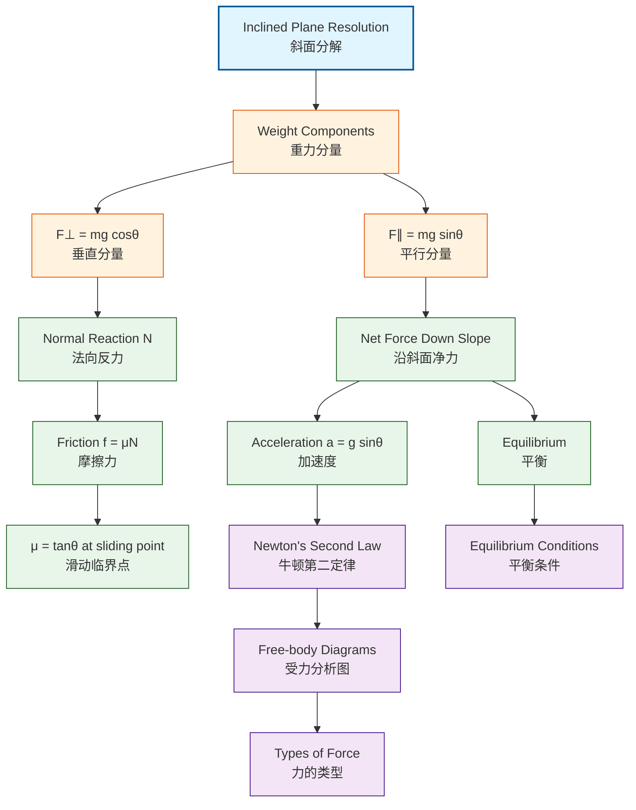

# 1. Overview / 概述

**English:**
This sub-topic focuses on resolving forces on inclined planes — a fundamental skill in mechanics. When an object rests on a slope, its weight must be resolved into components parallel and perpendicular to the plane. This technique is essential for analyzing motion on ramps, hills, and any sloped surface. Understanding this concept bridges [[Drawing Free-body Diagrams]] with [[Newton's Laws of Motion]], as the resolved forces directly determine acceleration or equilibrium on slopes.

**中文:**
本子知识点专注于斜面受力分解——力学中的基础技能。当物体放置在斜面上时，其重力必须分解为平行和垂直于斜面的分量。这一技巧对于分析斜坡、山坡等任何斜面上的运动至关重要。理解这一概念连接了[[绘制受力分析图]]与[[牛顿运动定律]]，因为分解后的力直接决定了斜面上的加速度或平衡状态。

---

# 2. Syllabus Learning Objectives / 考纲学习目标

| CAIE 9702 | Edexcel IAL |
|-----------|-------------|
| 3.2(b): Resolve forces into components | 2.4: Resolve forces into perpendicular components |
| 3.2(c): Apply resolution to inclined plane problems | 2.5: Apply resolution to objects on slopes |
| - | 2.6: Solve problems involving friction on inclined planes |

**Examiner Expectations / 考官期望:**
- **EN:** Students must correctly identify the angle of the incline and resolve weight into $mg\sin\theta$ (parallel) and $mg\cos\theta$ (perpendicular) components. Common errors include swapping these components or misidentifying the angle.
- **中文:** 学生必须正确识别斜面角度，并将重力分解为 $mg\sin\theta$（平行分量）和 $mg\cos\theta$（垂直分量）。常见错误包括混淆这两个分量或错误识别角度。

---

# 3. Core Definitions / 核心定义

| Term (EN/CN) | Definition (EN) | Definition (CN) | Common Mistakes / 常见错误 |
|--------------|-----------------|-----------------|---------------------------|
| **Inclined Plane** / 斜面 | A flat surface tilted at an angle $\theta$ to the horizontal | 与水平面成角度 $\theta$ 的倾斜平面 | Confusing $\theta$ with the angle to the vertical |
| **Weight Component Parallel** / 平行分量 | $mg\sin\theta$ — the component of weight acting down the slope | 重力沿斜面方向的分量 $mg\sin\theta$ | Using $mg\cos\theta$ instead |
| **Weight Component Perpendicular** / 垂直分量 | $mg\cos\theta$ — the component of weight acting perpendicular to the slope | 重力垂直于斜面方向的分量 $mg\cos\theta$ | Using $mg\sin\theta$ instead |
| **Normal Reaction Force** / 法向反力 | The force exerted by the surface perpendicular to the plane, equal to $mg\cos\theta$ (if no other vertical forces) | 斜面施加的垂直于平面的力，等于 $mg\cos\theta$（若无其他垂直力） | Forgetting it equals $mg\cos\theta$, not $mg$ |
| **Angle of Incline** / 斜面角度 | $\theta$ — the angle between the slope and the horizontal | 斜面与水平面之间的夹角 $\theta$ | Using the angle to the vertical instead |

---

# 4. Key Concepts Explained / 关键概念详解

## 4.1 Resolving Weight on an Inclined Plane / 斜面上的重力分解

### Explanation / 解释
**English:**
When an object of mass $m$ rests on an inclined plane at angle $\theta$ to the horizontal, its weight $mg$ acts vertically downward. This weight must be resolved into two perpendicular components:
- **Parallel component:** $mg\sin\theta$ — acts down the slope, causing acceleration
- **Perpendicular component:** $mg\cos\theta$ — acts into the slope, balanced by the [[Normal Reaction Force]]

The key insight: the angle between the weight vector and the perpendicular component is $\theta$, which is the same as the incline angle. This is because the perpendicular to the slope makes an angle $\theta$ with the vertical.

**中文:**
当质量为 $m$ 的物体放置在水平夹角为 $\theta$ 的斜面上时，其重力 $mg$ 竖直向下作用。这个重力必须分解为两个垂直分量：
- **平行分量：** $mg\sin\theta$ — 沿斜面向下作用，引起加速度
- **垂直分量：** $mg\cos\theta$ — 垂直压入斜面，由[[法向反力]]平衡

关键要点：重力矢量与垂直分量之间的夹角为 $\theta$，与斜面角度相同。这是因为斜面的法线与竖直方向夹角为 $\theta$。

### Physical Meaning / 物理意义
**English:**
The parallel component $mg\sin\theta$ is what causes objects to slide down slopes — the steeper the slope (larger $\theta$), the larger this component. The perpendicular component $mg\cos\theta$ determines the normal reaction force and thus the maximum [[Friction]] available.

**中文:**
平行分量 $mg\sin\theta$ 是导致物体沿斜面下滑的原因——坡度越陡（$\theta$ 越大），该分量越大。垂直分量 $mg\cos\theta$ 决定了法向反力，从而决定了可用的最大[[摩擦力]]。

### Common Misconceptions / 常见误区
- ❌ **EN:** Thinking $mg\sin\theta$ is perpendicular to the slope / **中文:** 认为 $mg\sin\theta$ 垂直于斜面
- ❌ **EN:** Using $mg$ as the normal reaction force / **中文:** 用法向反力等于 $mg$
- ❌ **EN:** Confusing $\theta$ with the angle to the vertical / **中文:** 混淆 $\theta$ 与竖直方向夹角
- ❌ **EN:** Forgetting that $mg\cos\theta$ is NOT the normal force — it's the component of weight; the normal force is equal to it only when no other perpendicular forces act / **中文:** 忘记 $mg\cos\theta$ 不是法向力——它是重力的分量；只有在没有其他垂直力作用时，法向力才等于它

### Exam Tips / 考试提示
- ✅ **EN:** Always draw the weight vector vertically down first, then resolve / **中文:** 始终先画出竖直向下的重力矢量，再进行分解
- ✅ **EN:** Label the angle $\theta$ clearly on your diagram / **中文:** 在图上清晰标注角度 $\theta$
- ✅ **EN:** Check: if $\theta = 0^\circ$, $mg\sin\theta = 0$ (horizontal surface) / **中文:** 验证：若 $\theta = 0^\circ$，则 $mg\sin\theta = 0$（水平面）
- ✅ **EN:** Check: if $\theta = 90^\circ$, $mg\cos\theta = 0$ (vertical wall) / **中文:** 验证：若 $\theta = 90^\circ$，则 $mg\cos\theta = 0$（竖直墙面）

> 📷 **IMAGE PROMPT — DIAG-01: Weight Resolution on Inclined Plane**
> A clear physics diagram showing a block on an inclined plane at angle θ to the horizontal. The weight vector mg is drawn vertically downward from the center of the block. Two dashed lines show the resolution: mg sinθ parallel to the slope (pointing down the incline) and mg cosθ perpendicular to the slope (pointing into the surface). The normal reaction force N is shown perpendicular to the surface, equal and opposite to mg cosθ. All angles are labeled. Clean, textbook-style illustration with arrows and labels.

---

# 5. Essential Equations / 核心公式

## Equation 1: Weight Resolution / 重力分解

$$ F_{\parallel} = mg\sin\theta $$
$$ F_{\perp} = mg\cos\theta $$

| Symbol (符号) | Meaning (EN) | Meaning (CN) | Unit (单位) |
|--------------|-------------|-------------|------------|
| $F_{\parallel}$ | Component of weight parallel to slope | 重力平行于斜面的分量 | N |
| $F_{\perp}$ | Component of weight perpendicular to slope | 重力垂直于斜面的分量 | N |
| $m$ | Mass of object | 物体质量 | kg |
| $g$ | Acceleration due to gravity (9.81 m s⁻²) | 重力加速度 | m s⁻² |
| $\theta$ | Angle of incline to horizontal | 斜面与水平面的夹角 | ° or rad |

**Derivation / 推导:**
From the geometry: the angle between the weight vector (vertical) and the perpendicular to the slope is $\theta$. Using trigonometry:
- $F_{\perp} = mg\cos\theta$ (adjacent to $\theta$)
- $F_{\parallel} = mg\sin\theta$ (opposite to $\theta$)

**Conditions / 适用条件:**
- **EN:** Valid for any inclined plane where $\theta$ is measured from the horizontal / **中文:** 适用于任何以水平面为基准测量 $\theta$ 的斜面
- **EN:** Assumes the object is small enough to be treated as a point mass / **中文:** 假设物体足够小，可视为质点

**Limitations / 局限性:**
- **EN:** Does not account for friction or other forces acting on the object / **中文:** 未考虑摩擦力或其他作用力
- **EN:** Only resolves weight — other forces must be resolved separately / **中文:** 仅分解重力——其他力需单独分解

## Equation 2: Net Force Down the Slope / 沿斜面净力

$$ F_{\text{net}} = mg\sin\theta - F_{\text{friction}} $$

**Conditions / 适用条件:**
- **EN:** When friction acts up the slope (opposing motion) / **中文:** 当摩擦力沿斜面向上作用（阻碍运动）时
- **EN:** For objects sliding down or being pulled up the slope / **中文:** 适用于物体沿斜面下滑或被向上拉动的情况

> 📋 **Edexcel Only:** Edexcel IAL requires students to solve problems involving friction on inclined planes, including calculating the coefficient of friction $\mu = \tan\theta$ for objects on the point of sliding.

---

# 6. Graphs and Relationships / 图表与关系

## 6.1 $F_{\parallel}$ vs $\theta$ / 平行分量与角度关系

### Axes / 坐标轴
- **X-axis:** Angle $\theta$ (0° to 90°) / **X轴：** 角度 $\theta$（0°到90°）
- **Y-axis:** $F_{\parallel} = mg\sin\theta$ (N) / **Y轴：** $F_{\parallel} = mg\sin\theta$ (N)

### Shape / 形状
- **EN:** Sine curve — starts at 0 (θ=0°), increases to maximum mg (θ=90°) / **中文：** 正弦曲线——从0开始（θ=0°），增加到最大值 mg（θ=90°）

### Gradient Meaning / 斜率含义
- **EN:** Rate of change of parallel component with angle — $mg\cos\theta$ / **中文：** 平行分量随角度的变化率——$mg\cos\theta$

### Area Meaning / 面积含义
- **EN:** Not physically meaningful / **中文：** 无物理意义

### Exam Interpretation / 考试解读
- **EN:** At small angles, $F_{\parallel}$ increases approximately linearly; at large angles, the increase slows / **中文：** 小角度时，$F_{\parallel}$ 近似线性增加；大角度时，增加速度减慢

## 6.2 $F_{\perp}$ vs $\theta$ / 垂直分量与角度关系

### Axes / 坐标轴
- **X-axis:** Angle $\theta$ (0° to 90°) / **X轴：** 角度 $\theta$（0°到90°）
- **Y-axis:** $F_{\perp} = mg\cos\theta$ (N) / **Y轴：** $F_{\perp} = mg\cos\theta$ (N)

### Shape / 形状
- **EN:** Cosine curve — starts at mg (θ=0°), decreases to 0 (θ=90°) / **中文：** 余弦曲线——从 mg 开始（θ=0°），减小到0（θ=90°）

### Gradient Meaning / 斜率含义
- **EN:** Rate of change of perpendicular component with angle — $-mg\sin\theta$ / **中文：** 垂直分量随角度的变化率——$-mg\sin\theta$

### Area Meaning / 面积含义
- **EN:** Not physically meaningful / **中文：** 无物理意义

### Exam Interpretation / 考试解读
- **EN:** As the slope steepens, the normal reaction force decreases, reducing available friction / **中文：** 随着坡度变陡，法向反力减小，可用摩擦力降低

---

# 7. Required Diagrams / 必备图表

## 7.1 Standard Inclined Plane Free-body Diagram / 标准斜面受力分析图

### Description / 描述
**English:** A block on an inclined plane showing all forces: weight (mg) vertically down, normal reaction (N) perpendicular to slope, friction (f) parallel to slope (if present), and the resolved components of weight.

**中文:** 斜面上的物块，显示所有力：重力(mg)竖直向下，法向反力(N)垂直于斜面，摩擦力(f)平行于斜面（如存在），以及重力的分解分量。

### Image Prompt / 图片生成提示
> 📷 **IMAGE PROMPT — DIAG-02: Complete Inclined Plane Free-body Diagram**
> A detailed physics diagram showing a rectangular block on a 30° inclined plane. From the center of the block: a long vertical arrow labeled "mg" (weight) pointing down. Two dashed construction lines show resolution: mg sinθ parallel to slope (labeled "mg sinθ") and mg cosθ perpendicular to slope (labeled "mg cosθ"). A normal reaction force arrow "N" points perpendicularly away from the surface, equal in length to mg cosθ. A friction arrow "f" points up the slope (if object is sliding down). All angles (θ=30°) clearly marked. Clean, professional textbook style with different colors for different force types.

### Labels Required / 需要标注
| Label (EN) | Label (中文) | Description |
|------------|-------------|-------------|
| $mg$ | 重力 | Weight vector (vertical down) |
| $mg\sin\theta$ | 平行分量 | Component parallel to slope |
| $mg\cos\theta$ | 垂直分量 | Component perpendicular to slope |
| $N$ | 法向反力 | Normal reaction force |
| $f$ | 摩擦力 | Friction force (if present) |
| $\theta$ | 斜面角度 | Angle of incline |

### Exam Importance / 考试重要性
- **EN:** This diagram is required in almost every inclined plane question. Marks are awarded for correct force directions and labels. / **中文：** 几乎所有斜面问题都需要此图。正确的力方向和标注可获得分数。

---

# 8. Worked Examples / 典型例题

## Example 1: Object Sliding Down an Inclined Plane / 物体沿斜面下滑

### Question / 题目
**English:**
A block of mass 5.0 kg slides down a smooth (frictionless) inclined plane at an angle of 25° to the horizontal. Calculate:
(a) The component of weight acting down the slope
(b) The normal reaction force
(c) The acceleration of the block down the slope

**中文:**
一个质量为5.0 kg的物块沿与水平面成25°角的光滑（无摩擦）斜面下滑。计算：
(a) 沿斜面方向的重力分量
(b) 法向反力
(c) 物块沿斜面的加速度

### Solution / 解答

**Step 1: Identify known values / 步骤1：确定已知量**
- $m = 5.0 \text{ kg}$
- $\theta = 25^\circ$
- $g = 9.81 \text{ m s}^{-2}$
- Frictionless: $f = 0$

**Step 2: Calculate parallel component / 步骤2：计算平行分量**
$$ F_{\parallel} = mg\sin\theta = 5.0 \times 9.81 \times \sin(25^\circ) $$
$$ F_{\parallel} = 5.0 \times 9.81 \times 0.4226 $$
$$ F_{\parallel} = 20.7 \text{ N} $$

**Step 3: Calculate normal reaction / 步骤3：计算法向反力**
$$ N = mg\cos\theta = 5.0 \times 9.81 \times \cos(25^\circ) $$
$$ N = 5.0 \times 9.81 \times 0.9063 $$
$$ N = 44.5 \text{ N} $$

**Step 4: Calculate acceleration / 步骤4：计算加速度**
Using Newton's Second Law: $F_{\text{net}} = ma$
$$ mg\sin\theta = ma $$
$$ a = g\sin\theta = 9.81 \times \sin(25^\circ) $$
$$ a = 9.81 \times 0.4226 $$
$$ a = 4.15 \text{ m s}^{-2} $$

### Final Answer / 最终答案
**Answer:** (a) 20.7 N down the slope | (b) 44.5 N perpendicular to slope | (c) 4.15 m s⁻² down the slope
**答案：** (a) 20.7 N 沿斜面向下 | (b) 44.5 N 垂直于斜面 | (c) 4.15 m s⁻² 沿斜面向下

### Quick Tip / 提示
- **EN:** For a frictionless slope, acceleration is always $a = g\sin\theta$, independent of mass! / **中文：** 对于无摩擦斜面，加速度始终为 $a = g\sin\theta$，与质量无关！

## Example 2: Object on the Point of Sliding / 物体即将滑动

### Question / 题目
**English:**
A 2.0 kg block rests on a rough inclined plane. The plane is slowly tilted until the block just begins to slide at an angle of 30°. Calculate the coefficient of static friction between the block and the plane.

**中文:**
一个2.0 kg的物块静止在粗糙斜面上。斜面缓慢倾斜，当角度达到30°时物块刚好开始滑动。计算物块与斜面之间的静摩擦系数。

### Solution / 解答

**Step 1: At the point of sliding / 步骤1：在即将滑动的临界点**
- Forces parallel to slope are balanced: $mg\sin\theta = F_{\text{friction,max}}$
- $F_{\text{friction,max}} = \mu_s N = \mu_s mg\cos\theta$

**Step 2: Set up equation / 步骤2：建立方程**
$$ mg\sin\theta = \mu_s mg\cos\theta $$
$$ \sin\theta = \mu_s \cos\theta $$
$$ \mu_s = \frac{\sin\theta}{\cos\theta} = \tan\theta $$

**Step 3: Calculate / 步骤3：计算**
$$ \mu_s = \tan(30^\circ) = 0.577 $$

### Final Answer / 最终答案
**Answer:** $\mu_s = 0.577$ | **答案：** $\mu_s = 0.577$

### Quick Tip / 提示
- **EN:** For an object on the point of sliding, $\mu = \tan\theta$ — a very useful shortcut! / **中文：** 对于即将滑动的物体，$\mu = \tan\theta$ —— 一个非常有用的捷径！

---

# 9. Past Paper Question Types / 历年真题题型

| Question Type / 题型 | Frequency / 频率 | Difficulty / 难度 | Past Paper References / 真题索引 |
|----------------------|------------------|------------------|-------------------------------|
| Calculate acceleration on frictionless slope / 计算无摩擦斜面上的加速度 | High / 高 | Easy / 简单 | 📝 *待填入* |
| Find normal reaction and friction on rough slope / 求粗糙斜面上的法向反力和摩擦力 | High / 高 | Medium / 中等 | 📝 *待填入* |
| Determine angle for equilibrium / 确定平衡角度 | Medium / 中 | Medium / 中等 | 📝 *待填入* |
| Multi-stage problem with pulley on incline / 斜面滑轮组合问题 | Low / 低 | Hard / 困难 | 📝 *待填入* |

**Common Command Words / 常见指令词:**
- **EN:** "Resolve", "Calculate", "Find", "Determine", "Show that" / **中文：** "分解"、"计算"、"求"、"确定"、"证明"

---

# 10. Practical Skills Connections / 实验技能链接

**English:**
This sub-topic connects to practical work in several ways:
1. **Measuring acceleration on a slope:** Use light gates or ticker timers to measure acceleration of a trolley on an inclined plane. Compare experimental $a$ with theoretical $a = g\sin\theta$.
2. **Determining $\mu$ experimentally:** Slowly increase the angle of a plane until an object slides. Measure $\theta$ and calculate $\mu = \tan\theta$.
3. **Uncertainty analysis:** The uncertainty in $\theta$ measurement (±0.5°) propagates to uncertainties in $\sin\theta$ and $\cos\theta$, affecting calculated forces.
4. **Graph plotting:** Plot $a$ vs $\sin\theta$ — gradient should be $g$ for a frictionless slope.

**中文:**
本子知识点与实验操作有多个联系：
1. **测量斜面上的加速度：** 使用光门或打点计时器测量小车在斜面上的加速度。比较实验值 $a$ 与理论值 $a = g\sin\theta$。
2. **实验测定 $\mu$：** 缓慢增加斜面角度直到物体滑动。测量 $\theta$ 并计算 $\mu = \tan\theta$。
3. **不确定度分析：** $\theta$ 测量的不确定度（±0.5°）会传递到 $\sin\theta$ 和 $\cos\theta$ 中，影响计算的力。
4. **绘图：** 绘制 $a$ 与 $\sin\theta$ 的关系图——对于无摩擦斜面，斜率应为 $g$。

---

# 11. Concept Map / 概念图谱

---

# 12. Quick Revision Sheet / 速查表

| Category / 类别 | Key Points / 要点 |
|----------------|------------------|
| **Definition / 定义** | Resolving weight on an incline: $F_{\parallel} = mg\sin\theta$, $F_{\perp} = mg\cos\theta$ / 斜面重力分解：$F_{\parallel} = mg\sin\theta$, $F_{\perp} = mg\cos\theta$ |
| **Key Formula / 核心公式** | $F_{\parallel} = mg\sin\theta$ (parallel / 平行), $F_{\perp} = mg\cos\theta$ (perpendicular / 垂直), $N = mg\cos\theta$ (normal / 法向), $a = g\sin\theta$ (frictionless / 无摩擦) |
| **Key Graph / 核心图表** | $F_{\parallel}$ vs $\theta$: sine curve 0→mg; $F_{\perp}$ vs $\theta$: cosine curve mg→0 / $F_{\parallel}$ 与 $\theta$：正弦曲线 0→mg；$F_{\perp}$ 与 $\theta$：余弦曲线 mg→0 |
| **Common Mistake / 常见错误** | Swapping $\sin$ and $\cos$ — remember: $\sin$ for sliding (parallel), $\cos$ for contact (perpendicular) / 混淆 $\sin$ 和 $\cos$——记住：$\sin$ 用于滑动（平行），$\cos$ 用于接触（垂直） |
| **Exam Tip / 考试提示** | Always draw the free-body diagram first! Label $\theta$ clearly. For frictionless slopes, $a = g\sin\theta$ is mass-independent. / 始终先画受力分析图！清晰标注 $\theta$。对于无摩擦斜面，$a = g\sin\theta$ 与质量无关。 |
| **Special Case / 特殊情况** | At sliding point: $\mu = \tan\theta$ (Edexcel IAL common question) / 滑动临界点：$\mu = \tan\theta$（Edexcel IAL常见题型） |
| **Units / 单位** | Forces in N, mass in kg, $g = 9.81$ m s⁻², $\theta$ in degrees or radians / 力用N，质量用kg，$g = 9.81$ m s⁻²，$\theta$ 用度或弧度 |