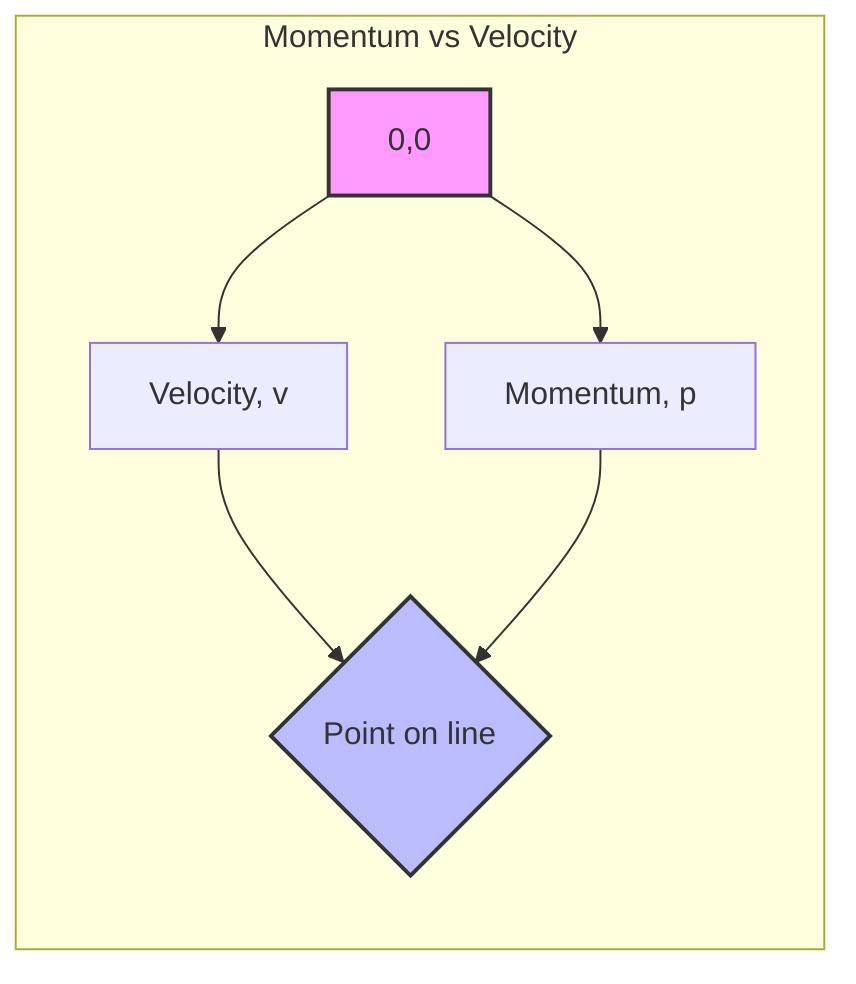

---
# 1. Overview / 概述

**English:**
Linear momentum is a fundamental concept in physics that quantifies the "quantity of motion" of an object. It is a vector quantity, meaning it has both magnitude and direction. This sub-topic introduces the formal definition of linear momentum, its relationship to mass and velocity, and its crucial role as a conserved quantity in isolated systems. Understanding momentum is essential for analyzing collisions, explosions, and any interaction where forces act over time, forming the bedrock for the [[Impulse-Momentum Theorem]] and the principle of [[Conservation of Momentum]]. It directly builds upon [[Newton's Laws of Motion]], particularly the Second Law, which can be expressed in terms of momentum.

**中文:**
线性动量是物理学中一个基本概念，用于量化物体的“运动量”。它是一个矢量，意味着既有大小也有方向。本子知识点介绍线性动量的正式定义、其与质量和速度的关系，以及它在孤立系统中作为守恒量的关键作用。理解动量对于分析碰撞、爆炸以及任何力随时间作用的相互作用至关重要，它构成了[[冲量-动量定理]]和[[动量守恒定律]]原理的基础。它直接建立在[[牛顿运动定律]]之上，特别是第二定律，该定律可以用动量来表达。

---

# 2. Syllabus Learning Objectives / 考纲学习目标

| CAIE 9702 | Edexcel IAL |
|-----------|-------------|
| (f) define linear momentum as the product of mass and velocity | 2.11 Know that the linear momentum of an object is given by the product of its mass and its velocity |
| (g) recall and use the equation for linear momentum, $p = mv$ | 2.12 Use the equation for linear momentum, $p = mv$ |
| (h) state the principle of conservation of momentum | 2.13 Know that momentum is a vector quantity |
| | 2.14 Use the principle of conservation of momentum |

**Examiner Expectations / 考官期望:**
- **English:** Students must be able to define momentum precisely, recall and apply the formula $p=mv$, and recognize momentum as a vector. They should be able to calculate momentum for objects moving in one dimension and understand that the direction is crucial.
- **中文:** 学生必须能够精确定义动量，回忆并应用公式 $p=mv$，并认识到动量是一个矢量。他们应该能够计算一维运动物体的动量，并理解方向至关重要。

---

# 3. Core Definitions / 核心定义

| Term (EN/CN) | Definition (EN) | Definition (CN) | Common Mistakes / 常见错误 |
|--------------|-----------------|-----------------|---------------------------|
| **Linear Momentum** / 线性动量 | The product of an object's mass and its velocity. It is a vector quantity. | 物体质量与其速度的乘积。它是一个矢量。 | Confusing momentum with kinetic energy. Momentum is a vector, kinetic energy is a scalar. / 混淆动量和动能。动量是矢量，动能是标量。 |
| **Mass** / 质量 | A measure of the amount of matter in an object, a scalar quantity. | 物体中物质含量的度量，是一个标量。 | Using weight instead of mass. / 用重量代替质量。 |
| **Velocity** / 速度 | The rate of change of displacement. A vector quantity. | 位移的变化率。是一个矢量。 | Using speed instead of velocity. / 用速率代替速度。 |
| **Vector Quantity** / 矢量 | A physical quantity that has both magnitude and direction. | 既有大小又有方向的物理量。 | Forgetting to assign a sign (e.g., + or -) to indicate direction in calculations. / 忘记在计算中分配符号（例如 + 或 -）来表示方向。 |
| **Isolated System** / 孤立系统 | A system on which no external resultant force acts. | 没有合外力作用的系统。 | Thinking a system is isolated when friction or other external forces are present. / 当存在摩擦力或其他外力时，认为系统是孤立的。 |

---

# 4. Key Concepts Explained / 关键概念详解

## 4.1 Momentum as a Vector / 动量作为矢量

### Explanation / 解释
**English:** Momentum ($\vec{p}$) is a vector, meaning its direction is the same as the direction of the object's velocity ($\vec{v}$). When performing calculations, you must assign a sign convention (e.g., positive for right/up, negative for left/down). This is critical when applying the [[Conservation of Momentum]] principle. For example, a ball moving to the right has positive momentum, while one moving to the left has negative momentum.

**中文:** 动量 ($\vec{p}$) 是一个矢量，意味着它的方向与物体速度 ($\vec{v}$) 的方向相同。在进行计算时，必须指定一个符号约定（例如，向右/上为正，向左/下为负）。这在应用[[动量守恒定律]]原理时至关重要。例如，向右运动的球具有正动量，而向左运动的球具有负动量。

### Physical Meaning / 物理意义
**English:** Momentum is a measure of how difficult it is to stop a moving object. A heavy truck moving slowly can have the same momentum as a light car moving fast. Both require the same impulse to stop.

**中文:** 动量是衡量阻止一个运动物体难易程度的量。一辆缓慢行驶的重型卡车可能与一辆快速行驶的轻型汽车具有相同的动量。两者都需要相同的冲量才能停下来。

### Common Misconceptions / 常见误区
- **Mistake:** Thinking momentum is a scalar.
  **Correction:** Momentum is a vector; direction matters.
- **Mistake:** Confusing momentum with kinetic energy ($E_k = \frac{1}{2}mv^2$).
  **Correction:** Momentum is $mv$, kinetic energy is $\frac{1}{2}mv^2$. They are different quantities.
- **Mistake:** Forgetting to include the sign for velocity in calculations.
  **Correction:** Always define a positive direction and use signs consistently.

### Exam Tips / 考试提示
- **English:** Always state a positive direction before starting a momentum calculation. This is a key step for full marks.
- **中文:** 在开始动量计算之前，始终指明正方向。这是获得满分的关键步骤。

> 📷 **IMAGE PROMPT — MOM-01: Vector Nature of Momentum**
> A simple diagram showing two balls of equal mass moving towards each other. One ball is labeled "Mass = m, Velocity = +v, Momentum = +mv" with an arrow pointing right. The other ball is labeled "Mass = m, Velocity = -v, Momentum = -mv" with an arrow pointing left. A coordinate axis is shown below with "+" and "-" directions indicated.

---

# 5. Essential Equations / 核心公式

## Equation 1: Definition of Linear Momentum

$$ \vec{p} = m\vec{v} $$

| Symbol (符号) | Meaning (EN) | Meaning (CN) | Unit (单位) |
|--------------|-------------|-------------|------------|
| $\vec{p}$ | Linear momentum | 线性动量 | kg m s⁻¹ (kilogram meter per second) |
| $m$ | Mass | 质量 | kg (kilogram) |
| $\vec{v}$ | Velocity | 速度 | m s⁻¹ (meter per second) |

**Derivation / 推导:** This is a definition, not derived from other equations. It is a fundamental relationship.

**Conditions / 适用条件:**
- **English:** Valid for all objects with mass moving at non-relativistic speeds (much less than the speed of light).
- **中文:** 适用于所有以非相对论速度（远小于光速）运动的有质量物体。

**Limitations / 局限性:**
- **English:** The equation $p=mv$ is a classical approximation. At speeds approaching the speed of light, relativistic momentum must be used. This is not required for A-Level Physics.
- **中文:** 方程 $p=mv$ 是一个经典近似。当速度接近光速时，必须使用相对论动量。A-Level 物理不要求这一点。

---

# 6. Graphs and Relationships / 图表与关系

## 6.1 Momentum vs. Velocity Graph / 动量-速度图

### Axes / 坐标轴
- **X-axis:** Velocity ($v$) / 速度 ($v$)
- **Y-axis:** Momentum ($p$) / 动量 ($p$)

### Shape / 形状
- **English:** A straight line passing through the origin.
- **中文:** 一条通过原点的直线。

### Gradient Meaning / 斜率含义
- **English:** The gradient of the line is equal to the mass ($m$) of the object.
- **中文:** 直线的斜率等于物体的质量 ($m$)。

### Area Meaning / 面积含义
- **English:** The area under the graph has no physical meaning.
- **中文:** 图线下的面积没有物理意义。

### Exam Interpretation / 考试解读
- **English:** A steeper gradient indicates a larger mass. A horizontal line (zero gradient) would imply zero mass, which is impossible for a classical object.
- **中文:** 斜率越大，表示质量越大。水平线（零斜率）意味着质量为零，这对于经典物体来说是不可能的。



> 📷 **IMAGE PROMPT — MOM-02: Momentum vs Velocity Graph**
> A Cartesian graph with "Velocity (m/s)" on the x-axis and "Momentum (kg m/s)" on the y-axis. Two straight lines are drawn from the origin. One line is steeper, labeled "Object A (larger mass)". The other line is shallower, labeled "Object B (smaller mass)". The gradient of each line is annotated as "m = gradient".

---

# 7. Required Diagrams / 必备图表

## 7.1 Momentum Vector Diagram / 动量矢量图

### Description / 描述
- **English:** A diagram showing two objects before and after a collision, with momentum vectors drawn as arrows. The length of the arrow represents the magnitude of momentum, and the arrowhead shows the direction.
- **中文:** 显示两个物体在碰撞前后状态的图表，动量矢量用箭头表示。箭头的长度代表动量的大小，箭头表示方向。

### Image Prompt / 图片生成提示
> 📷 **IMAGE PROMPT — MOM-03: Momentum Vectors in a Collision**
> A two-panel diagram. Panel 1 (Before Collision): Two balls on a horizontal line. Ball A (mass 2 kg) is moving to the right with velocity 3 m/s. A long arrow above it points right, labeled "p_A = +6 kg m/s". Ball B (mass 1 kg) is moving to the left with velocity 4 m/s. A shorter arrow above it points left, labeled "p_B = -4 kg m/s". Panel 2 (After Collision): The two balls are stuck together (or separate) moving to the right. A single arrow above the combined mass points right, labeled "p_total = +2 kg m/s". A note says "Total momentum is conserved: +6 + (-4) = +2 kg m/s".

### Labels Required / 需要标注
- **English:** Mass of each object ($m_A$, $m_B$), velocity vectors ($\vec{v}_A$, $\vec{v}_B$), momentum vectors ($\vec{p}_A$, $\vec{p}_B$), total momentum ($\vec{p}_{total}$), positive direction indicator.
- **中文:** 每个物体的质量 ($m_A$, $m_B$)，速度矢量 ($\vec{v}_A$, $\vec{v}_B$)，动量矢量 ($\vec{p}_A$, $\vec{p}_B$)，总动量 ($\vec{p}_{total}$)，正方向指示。

### Exam Importance / 考试重要性
- **English:** High. Drawing and interpreting momentum vector diagrams is a common exam skill, especially for collision problems.
- **中文:** 高。绘制和解释动量矢量图是一项常见的考试技能，特别是在碰撞问题中。

---

# 8. Worked Examples / 典型例题

## Example 1: Calculating Momentum / 计算动量

### Question / 题目
**English:** A car of mass 1200 kg is traveling east at a velocity of 25 m/s. Calculate its momentum.
**中文:** 一辆质量为 1200 kg 的汽车以 25 m/s 的速度向东行驶。计算其动量。

### Solution / 解答
1.  **Identify knowns / 确定已知量:**
    - Mass, $m = 1200 \text{ kg}$
    - Velocity, $v = 25 \text{ m/s}$ (East)
2.  **Choose a positive direction / 选择正方向:**
    - Let East be the positive direction.
3.  **Apply the formula / 应用公式:**
    $$ \vec{p} = m\vec{v} = (1200 \text{ kg}) \times (+25 \text{ m/s}) $$
    $$ \vec{p} = +30000 \text{ kg m/s} $$

### Final Answer / 最终答案
**Answer:** The momentum of the car is $3.0 \times 10^4 \text{ kg m/s}$ east. | **答案：** 汽车的动量为 $3.0 \times 10^4 \text{ kg m/s}$，方向向东。

### Quick Tip / 提示
- **English:** Always include the direction in your final answer for vector quantities.
- **中文:** 对于矢量，始终在最终答案中包含方向。

## Example 2: Momentum with Direction / 带方向的动量

### Question / 题目
**English:** A ball of mass 0.5 kg is moving at 10 m/s. It hits a wall and rebounds at 8 m/s in the opposite direction. Calculate the change in momentum of the ball.
**中文:** 一个质量为 0.5 kg 的球以 10 m/s 的速度运动。它撞到墙上并以 8 m/s 的速度向相反方向反弹。计算球的动量变化。

### Solution / 解答
1.  **Choose a positive direction / 选择正方向:**
    - Let the initial direction of motion be positive.
2.  **Calculate initial momentum / 计算初始动量:**
    $$ p_i = mv_i = (0.5 \text{ kg})(+10 \text{ m/s}) = +5 \text{ kg m/s} $$
3.  **Calculate final momentum / 计算最终动量:**
    - The final velocity is in the opposite direction, so $v_f = -8 \text{ m/s}$.
    $$ p_f = mv_f = (0.5 \text{ kg})(-8 \text{ m/s}) = -4 \text{ kg m/s} $$
4.  **Calculate change in momentum / 计算动量变化:**
    $$ \Delta p = p_f - p_i = (-4 \text{ kg m/s}) - (+5 \text{ kg m/s}) = -9 \text{ kg m/s} $$

### Final Answer / 最终答案
**Answer:** The change in momentum is 9 kg m/s in the direction opposite to the initial motion. | **答案：** 动量变化为 9 kg m/s，方向与初始运动方向相反。

### Quick Tip / 提示
- **English:** The change in momentum ($\Delta p$) is a vector. A negative answer indicates the change is in the negative direction.
- **中文:** 动量变化 ($\Delta p$) 是一个矢量。负答案表示变化发生在负方向。

---

# 9. Past Paper Question Types / 历年真题题型

| Question Type / 题型 | Frequency / 频率 | Difficulty / 难度 | Past Paper References / 真题索引 |
|----------------------|------------------|------------------|-------------------------------|
| Direct calculation of momentum ($p=mv$) | High | Easy | 📝 *待填入* |
| Calculating change in momentum ($\Delta p$) | High | Easy-Medium | 📝 *待填入* |
| Identifying momentum as a vector in multiple-choice | Medium | Easy | 📝 *待填入* |
| Using momentum in conservation problems (prerequisite) | High | Medium-Hard | 📝 *待填入* |

**Common Command Words / 常见指令词:**
- **Calculate / 计算:** Use the formula $p=mv$.
- **State / 陈述:** Give a definition or value.
- **Determine / 确定:** Find a value, often involving direction.
- **Explain / 解释:** Provide reasoning, often about vector nature.

---

# 10. Practical Skills Connections / 实验技能链接

**English:**
While momentum itself is not directly measured in a single experiment, the concept is central to experiments on collisions and explosions. Key practical skills include:
- **Measurements:** Using a balance to measure mass ($m$) and light gates or ticker timers to measure velocity ($v$).
- **Uncertainties:** Calculating the uncertainty in momentum from the uncertainties in mass and velocity measurements.
- **Graph Plotting:** Plotting velocity-time graphs to find velocity before/after a collision.
- **Experimental Design:** Setting up an air track or linear air trough to minimize friction, creating an approximately [[Isolated System]].

**中文:**
虽然动量本身不在单个实验中直接测量，但该概念是碰撞和爆炸实验的核心。关键的实验技能包括：
- **测量：** 使用天平测量质量 ($m$)，使用光电门或打点计时器测量速度 ($v$)。
- **不确定度：** 根据质量和速度测量的不确定度计算动量的不确定度。
- **绘图：** 绘制速度-时间图以找出碰撞前后的速度。
- **实验设计：** 设置气垫导轨或线性气轨以最小化摩擦，创建一个近似的[[孤立系统]]。

---

# 11. Concept Map / 概念图谱

```mermaid
graph TD
    %% Show connections for this leaf node
    A[Definition of Linear Momentum] --> B[Mass (m)]
    A --> C[Velocity (v)]
    A --> D[Vector Quantity]
    A --> E[Equation: p = mv]
    A --> F[Unit: kg m/s]
    
    A --> G[Change in Momentum (Δp)]
    G --> H[Impulse-Momentum Theorem]
    G --> I[Impulse and Force-Time Graphs]
    
    A --> J[Conservation of Momentum]
    J --> K[Isolated System]
    J --> L[Collisions & Explosions]
    
    A --> M[Newton's Laws of Motion]
    M --> N[Newton's Second Law (F = Δp/Δt)]
    
    style A fill:#f9f,stroke:#333,stroke-width:4px
    style G fill:#bbf,stroke:#333,stroke-width:2px
    style J fill:#bbf,stroke:#333,stroke-width:2px
    style M fill:#bbf,stroke:#333,stroke-width:2px
```

---

# 12. Quick Revision Sheet / 速查表

| Category / 类别 | Key Points / 要点 |
|----------------|------------------|
| **Definition / 定义** | Momentum = mass × velocity. It is a vector. / 动量 = 质量 × 速度。它是一个矢量。 |
| **Key Formula / 核心公式** | $\vec{p} = m\vec{v}$ |
| **Key Graph / 核心图表** | Momentum vs. Velocity: Straight line through origin. Gradient = mass. / 动量-速度图：通过原点的直线。斜率 = 质量。 |
| **Exam Tip / 考试提示** | **Always define a positive direction** before calculations. Include direction in your answer. / **在计算前始终指明正方向**。在答案中包含方向。 |
| **Common Mistake / 常见错误** | Treating momentum as a scalar. Forgetting signs for direction. / 将动量视为标量。忘记方向的符号。 |
| **Unit / 单位** | kg m s⁻¹ (or N s) / 千克米每秒 (或 牛秒) |