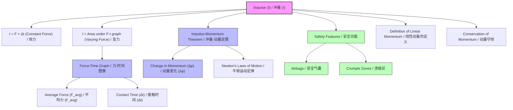

# 1. Overview / 概述

**English:**
This sub-topic explores the concept of **impulse** and its graphical representation through **force-time graphs**. Impulse is defined as the product of force and the time interval over which it acts, and it is directly linked to the change in momentum of an object via the [[Impulse-Momentum Theorem]]. Understanding force-time graphs is crucial because they allow us to visualize and calculate impulse, especially when forces are not constant (e.g., in collisions, impacts, or sports). This sub-topic builds directly on [[Newton's Laws of Motion]] and provides the foundation for analyzing real-world scenarios where forces vary with time, such as car crashes, ball kicks, and hammer strikes. It is a key component of the broader [[Linear Momentum and Impulse]] topic.

**中文:**
本子知识点探讨了**冲量**的概念及其通过**力-时间图像**的图形表示。冲量定义为力与其作用时间间隔的乘积，并且通过[[冲量-动量定理]]直接与物体的动量变化相关联。理解力-时间图像至关重要，因为它们使我们能够可视化和计算冲量，特别是在力不是恒定的情况下（例如，在碰撞、冲击或体育运动中）。本子知识点直接建立在[[牛顿运动定律]]之上，并为分析力随时间变化的现实世界场景（如车祸、踢球和锤击）提供了基础。它是更广泛的[[线性动量与冲量]]主题的关键组成部分。

---

# 2. Syllabus Learning Objectives / 考纲学习目标

| CAIE 9702 | Edexcel IAL |
|-----------|-------------|
| 3.2(f): Define impulse as force × time for a constant force, or as the area under a force-time graph. | 2.11: Define impulse. |
| 3.2(g): Recall and use the equation impulse = change in momentum. | 2.12: Use the equation $F \Delta t = \Delta p$. |
| 3.2(h): Interpret and use force-time graphs, including calculating the area under the graph to find the impulse. | 2.13: Interpret force-time graphs. |
| - | 2.14: Calculate impulse from the area under a force-time graph. |

**Examiner Expectations / 考官期望:**
- **CAIE:** Students must be able to define impulse for both constant and varying forces. They must be able to calculate the area under a force-time graph (using counting squares or geometric shapes) and relate it to the change in momentum. Questions often involve interpreting graphs from collisions or explosions.
- **Edexcel:** Students must be able to define impulse, use the impulse-momentum equation, and interpret force-time graphs. They are expected to calculate impulse from the area under the graph, often in the context of sports or vehicle safety.

**中文:**
- **CAIE:** 学生必须能够定义恒定力和变力情况下的冲量。他们必须能够计算力-时间图像下的面积（使用数方格或几何形状）并将其与动量变化联系起来。题目通常涉及解释来自碰撞或爆炸的图像。
- **Edexcel:** 学生必须能够定义冲量，使用冲量-动量方程，并解释力-时间图像。他们需要从图像下的面积计算冲量，通常是在体育或车辆安全的背景下。

---

# 3. Core Definitions / 核心定义

| Term (EN/CN) | Definition (EN) | Definition (CN) | Common Mistakes / 常见错误 |
|--------------|-----------------|-----------------|---------------------------|
| **Impulse** / 冲量 | The product of the force acting on an object and the time for which it acts. For a constant force, $I = F \Delta t$. For a varying force, it is the area under a force-time graph. | 作用在物体上的力与其作用时间的乘积。对于恒力，$I = F \Delta t$。对于变力，它是力-时间图像下的面积。 | Confusing impulse with momentum. Impulse is the *change* in momentum, not the momentum itself. / 将冲量与动量混淆。冲量是动量的*变化*，而不是动量本身。 |
| **Force-Time Graph** / 力-时间图像 | A graph with force on the y-axis and time on the x-axis, used to represent how a force varies over time. | 以力为y轴、时间为x轴的图像，用于表示力随时间的变化情况。 | Forgetting that the area under the graph represents impulse, not the gradient. / 忘记图像下的面积代表冲量，而不是斜率。 |
| **Average Force** / 平均力 | A constant force that would produce the same impulse as the actual varying force over the same time interval. | 在相同的时间间隔内，能产生与实际变力相同冲量的恒定力。 | Using the average of the maximum and minimum forces incorrectly. The average force is found by dividing the impulse by the time interval. / 错误地使用最大力和最小力的平均值。平均力是通过将冲量除以时间间隔得到的。 |
| **Contact Time** / 接触时间 | The duration over which two objects are in contact during a collision or interaction. | 在碰撞或相互作用过程中，两个物体接触的持续时间。 | Assuming contact time is always very small; it can vary significantly (e.g., a bouncy ball vs. a lump of clay). / 假设接触时间总是非常小；它可能有很大变化（例如，弹力球与一块黏土）。 |

---

# 4. Key Concepts Explained / 关键概念详解

## 4.1 Impulse from a Varying Force / 变力产生的冲量

### Explanation / 解释
**English:** In real-world collisions, the force is rarely constant. For example, when a tennis racket hits a ball, the force starts at zero, increases to a maximum, and then decreases back to zero. To find the impulse from such a varying force, we cannot simply use $I = F \Delta t$ because $F$ changes. Instead, we use a [[Force-Time Graph]]. The impulse is equal to the **area under the force-time graph**. This is derived from the fact that impulse is the integral of force with respect to time: $I = \int F \, dt$. For A-Level purposes, this area is calculated by counting squares or using geometric shapes (triangles, rectangles, trapeziums).

**中文:** 在现实世界的碰撞中，力很少是恒定的。例如，当网球拍击球时，力从零开始，增加到最大值，然后减小回零。要找到这种变力产生的冲量，我们不能简单地使用 $I = F \Delta t$，因为 $F$ 在变化。相反，我们使用[[力-时间图像]]。冲量等于**力-时间图像下的面积**。这是从冲量是力对时间的积分这一事实推导出来的：$I = \int F \, dt$。对于A-Level考试，这个面积是通过数方格或使用几何形状（三角形、矩形、梯形）来计算的。

### Physical Meaning / 物理意义
**English:** The area under the force-time graph physically represents the total "push" or "kick" delivered to an object over the entire duration of the interaction. A larger area means a greater change in momentum for the object.

**中文:** 力-时间图像下的面积在物理上代表了在整个相互作用过程中传递给物体的总“推力”或“冲击力”。面积越大，意味着物体的动量变化越大。

### Common Misconceptions / 常见误区
- **Misconception:** The peak force is the most important factor in determining the impulse.
  **Correction:** The impulse depends on the *entire area* under the graph, not just the peak force. A large force acting for a very short time can produce the same impulse as a smaller force acting for a longer time.
- **Misconception:** The gradient of the force-time graph represents impulse.
  **Correction:** The gradient represents the rate of change of force with respect to time ($dF/dt$), which is not a standard quantity in this context. The *area* represents impulse.
- **Misconception:** The impulse is zero if the net force is zero.
  **Correction:** If the net force is zero over a time interval, the impulse is zero, meaning the momentum is constant. However, individual forces within a system can still produce impulses (e.g., action-reaction pairs).

**中文:**
- **误区:** 峰值力是决定冲量的最重要因素。
  **纠正:** 冲量取决于图像下的*整个面积*，而不仅仅是峰值力。一个很大的力作用很短的时间可以产生与一个较小的力作用较长时间相同的冲量。
- **误区:** 力-时间图像的斜率代表冲量。
  **纠正:** 斜率代表力随时间的变化率 ($dF/dt$)，这不是此上下文中的标准量。*面积*代表冲量。
- **误区:** 如果合力为零，则冲量为零。
  **纠正:** 如果在一个时间间隔内合力为零，则冲量为零，这意味着动量是恒定的。然而，系统内的单个力仍然可以产生冲量（例如，作用力与反作用力对）。

### Exam Tips / 考试提示
**English:**
- Always state that impulse = area under the force-time graph.
- When calculating the area, clearly show your method (e.g., "Area = area of triangle + area of rectangle").
- Be careful with units: Force in Newtons (N), time in seconds (s), impulse in Newton-seconds (N s) or kg m/s.
- If the graph is a curve, you may need to estimate the area by counting squares.

**中文:**
- 始终说明冲量 = 力-时间图像下的面积。
- 计算面积时，清晰地展示你的方法（例如，“面积 = 三角形面积 + 矩形面积”）。
- 注意单位：力用牛顿 (N)，时间用秒 (s)，冲量用牛顿秒 (N s) 或 kg m/s。
- 如果图像是曲线，你可能需要通过数方格来估算面积。

> 📷 **IMAGE PROMPT — GRAPH: Force-Time Graph for a Varying Force**
> A force-time graph showing a curved line starting at (0,0), rising to a peak at (t1, Fmax), and then falling back to (t2, 0). The area under the curve is shaded. Labels: "Force (N)" on y-axis, "Time (s)" on x-axis, "Impulse = Area under graph" as a label.

---

# 5. Essential Equations / 核心公式

## Equation 1: Impulse (Constant Force) / 冲量 (恒力)

$$ I = F \Delta t $$

| Symbol (符号) | Meaning (EN) | Meaning (CN) | Unit (单位) |
|--------------|-------------|-------------|------------|
| $I$ | Impulse | 冲量 | N s (or kg m/s) |
| $F$ | Constant force | 恒力 | N |
| $\Delta t$ | Time interval | 时间间隔 | s |

**Derivation / 推导:** This is the definition of impulse for a constant force.
**Conditions / 适用条件:** The force $F$ must be constant over the time interval $\Delta t$.
**Limitations / 局限性:** Cannot be used directly if the force varies with time.

## Equation 2: Impulse-Momentum Theorem / 冲量-动量定理

$$ I = \Delta p = m \Delta v = m(v - u) $$

| Symbol (符号) | Meaning (EN) | Meaning (CN) | Unit (单位) |
|--------------|-------------|-------------|------------|
| $I$ | Impulse | 冲量 | N s (or kg m/s) |
| $\Delta p$ | Change in momentum | 动量变化 | kg m/s |
| $m$ | Mass | 质量 | kg |
| $v$ | Final velocity | 末速度 | m/s |
| $u$ | Initial velocity | 初速度 | m/s |

**Derivation / 推导:** From Newton's Second Law: $F = ma = m \frac{\Delta v}{\Delta t}$. Rearranging: $F \Delta t = m \Delta v = \Delta p$.
**Conditions / 适用条件:** Valid for both constant and varying forces (using average force). The mass $m$ must be constant.
**Limitations / 局限性:** Does not apply to systems where mass changes (e.g., rockets).

## Equation 3: Impulse from Force-Time Graph / 从力-时间图像求冲量

$$ I = \text{Area under } F \text{-} t \text{ graph} $$

| Symbol (符号) | Meaning (EN) | Meaning (CN) | Unit (单位) |
|--------------|-------------|-------------|------------|
| $I$ | Impulse | 冲量 | N s |
| Area | Area under the graph | 图像下的面积 | N s |

**Derivation / 推导:** $I = \int F \, dt$, which is the definition of the area under the curve.
**Conditions / 适用条件:** Always valid for any force-time graph.
**Limitations / 局限性:** Requires accurate calculation or estimation of the area.

> 📷 **IMAGE PROMPT — DIAGRAM: Impulse-Momentum Theorem**
> A diagram showing a ball of mass m moving with initial velocity u towards a wall. The wall exerts a force F on the ball for a time Δt. The ball then moves away with final velocity v. Labels: "m", "u", "v", "F", "Δt". An equation box shows: "FΔt = m(v - u)".

---

# 6. Graphs and Relationships / 图表与关系

## 6.1 Force-Time Graph for a Constant Force / 恒力的力-时间图像

### Axes / 坐标轴
- **X-axis:** Time (s) / 时间 (s)
- **Y-axis:** Force (N) / 力 (N)

### Shape / 形状
A horizontal straight line at $F = \text{constant}$.

### Gradient Meaning / 斜率含义
Zero gradient. The force is constant, so its rate of change is zero.

### Area Meaning / 面积含义
The area under the graph is a rectangle: $\text{Area} = F \times \Delta t = \text{Impulse}$.

### Exam Interpretation / 考试解读
This is the simplest case. Students should be able to calculate the impulse by multiplying the force by the time interval.

## 6.2 Force-Time Graph for a Varying Force (e.g., Collision) / 变力的力-时间图像 (例如，碰撞)

### Axes / 坐标轴
- **X-axis:** Time (s) / 时间 (s)
- **Y-axis:** Force (N) / 力 (N)

### Shape / 形状
A curve that starts at zero, rises to a peak, and then falls back to zero. The shape can be symmetrical or asymmetrical.

### Gradient Meaning / 斜率含义
The gradient at any point represents the rate of change of force with respect to time ($dF/dt$). This is not typically examined directly.

### Area Meaning / 面积含义
The total area under the curve represents the impulse delivered during the collision.

### Exam Interpretation / 考试解读
- **Peak Force:** The maximum force experienced during the collision.
- **Contact Time:** The total time duration of the collision (from start to end of force application).
- **Average Force:** The height of a rectangle with the same base (contact time) and the same area (impulse) as the curve. $F_{\text{avg}} = \frac{\text{Area}}{\Delta t}$.
- **Impulse:** The area under the curve. This can be found by counting squares or approximating the shape with triangles and rectangles.

> 📷 **IMAGE PROMPT — GRAPH: Force-Time Graph for a Collision**
> A force-time graph showing a smooth, bell-shaped curve. The area under the curve is shaded. A dashed horizontal line is drawn at the average force level. Labels: "Peak Force", "Contact Time (Δt)", "Average Force (F_avg)", "Impulse = Area under curve".

---

# 7. Required Diagrams / 必备图表

## 7.1 Force-Time Graph for a Collision / 碰撞的力-时间图像

### Description / 描述
**English:** A graph showing how the force between two colliding objects varies with time. The force starts at zero, increases to a maximum (peak force), and then decreases back to zero over the contact time. The area under the graph represents the impulse.

**中文:** 一张显示两个碰撞物体之间的力如何随时间变化的图像。力从零开始，增加到最大值（峰值力），然后在接触时间内减小回零。图像下的面积代表冲量。

### Image Prompt / 图片生成提示
> 📷 **IMAGE PROMPT — DIAGRAM: Force-Time Graph for Collision**
> A clear, labeled force-time graph for a collision. The y-axis is labeled "Force / N" and the x-axis is labeled "Time / s". The curve is a smooth, bell-shaped curve starting at (0,0), peaking at (t1, Fmax), and ending at (t2, 0). The area under the curve is shaded in light blue. A dashed horizontal line is drawn at the average force level, labeled "Average Force". The time interval from t=0 to t=t2 is labeled "Contact Time". A text box reads: "Impulse = Area under graph = Change in momentum".

### Labels Required / 需要标注
- **Force (N)** on y-axis / y轴上的力 (N)
- **Time (s)** on x-axis / x轴上的时间 (s)
- **Peak Force** / 峰值力
- **Contact Time** / 接触时间
- **Average Force** / 平均力
- **Area = Impulse** / 面积 = 冲量

### Exam Importance / 考试重要性
**English:** This diagram is essential for understanding how to calculate impulse from a force-time graph. It is frequently tested in both CAIE and Edexcel exams, often in the context of collisions, sports, or vehicle safety features (e.g., airbags, crumple zones).

**中文:** 这个图表对于理解如何从力-时间图像计算冲量至关重要。在CAIE和Edexcel考试中经常被测试，通常是在碰撞、体育或车辆安全功能（例如，安全气囊、溃缩区）的背景下。

---

# 8. Worked Examples / 典型例题

## Example 1: Calculating Impulse from a Force-Time Graph / 从力-时间图像计算冲量

### Question / 题目
**English:**
A force-time graph for a collision between a tennis racket and a ball is shown. The graph can be approximated as a triangle with a base of 0.05 s and a height of 200 N. Calculate:
(a) The impulse delivered to the ball.
(b) The average force during the collision.
(c) If the ball has a mass of 0.058 kg and was initially at rest, what is its final velocity?

**中文:**
一个网球拍与球碰撞的力-时间图像如图所示。该图像可以近似为一个底为0.05秒、高为200牛的三角形。计算：
(a) 传递给球的冲量。
(b) 碰撞过程中的平均力。
(c) 如果球的质量为0.058千克且最初静止，其末速度是多少？

### Solution / 解答
**Step 1: Calculate the impulse.**
The impulse is the area under the force-time graph. The shape is a triangle.
$$ I = \text{Area} = \frac{1}{2} \times \text{base} \times \text{height} = \frac{1}{2} \times (0.05 \, \text{s}) \times (200 \, \text{N}) = 5 \, \text{N s} $$

**Step 2: Calculate the average force.**
The average force is the impulse divided by the contact time.
$$ F_{\text{avg}} = \frac{I}{\Delta t} = \frac{5 \, \text{N s}}{0.05 \, \text{s}} = 100 \, \text{N} $$

**Step 3: Calculate the final velocity.**
Using the impulse-momentum theorem: $I = m(v - u)$.
Since the ball is initially at rest, $u = 0$.
$$ 5 = 0.058 \times (v - 0) $$
$$ v = \frac{5}{0.058} \approx 86.2 \, \text{m/s} $$

### Final Answer / 最终答案
**Answer:**
(a) Impulse = 5 N s
(b) Average force = 100 N
(c) Final velocity = 86.2 m/s

**答案：**
(a) 冲量 = 5 牛秒
(b) 平均力 = 100 牛
(c) 末速度 = 86.2 米/秒

### Quick Tip / 提示
**English:** Always check the shape of the graph before calculating the area. For a triangle, use $\frac{1}{2} \times \text{base} \times \text{height}$. For a rectangle, use $\text{length} \times \text{width}$. For a complex shape, break it down into simpler shapes.

**中文:** 在计算面积之前，始终检查图像的形状。对于三角形，使用 $\frac{1}{2} \times \text{底} \times \text{高}$。对于矩形，使用 $\text{长} \times \text{宽}$。对于复杂形状，将其分解为更简单的形状。

---

## Example 2: Interpreting a Force-Time Graph for Safety Features / 解释安全功能的力-时间图像

### Question / 题目
**English:**
A car of mass 1200 kg crashes into a wall at 15 m/s and comes to rest. The force-time graph for the collision is shown. The area under the graph is 18,000 N s.
(a) Calculate the impulse on the car.
(b) The car is fitted with a crumple zone that increases the collision time to 0.6 s. Calculate the average force on the car.
(c) Explain how the crumple zone reduces the risk of injury to the driver.

**中文:**
一辆质量为1200千克的汽车以15米/秒的速度撞上一堵墙并停下来。碰撞的力-时间图像如图所示。图像下的面积为18,000牛秒。
(a) 计算汽车受到的冲量。
(b) 汽车配备了溃缩区，将碰撞时间增加到0.6秒。计算汽车受到的平均力。
(c) 解释溃缩区如何降低对驾驶员造成伤害的风险。

### Solution / 解答
**Step 1: Calculate the impulse.**
The impulse is equal to the change in momentum.
$$ I = \Delta p = m(v - u) = 1200 \times (0 - 15) = -18,000 \, \text{N s} $$
The magnitude of the impulse is 18,000 N s (the negative sign indicates direction).

**Step 2: Calculate the average force.**
Using $I = F_{\text{avg}} \times \Delta t$:
$$ F_{\text{avg}} = \frac{I}{\Delta t} = \frac{18,000}{0.6} = 30,000 \, \text{N} $$

**Step 3: Explain the safety benefit.**
Without the crumple zone, the collision time would be much shorter (e.g., 0.1 s), resulting in a much larger average force ($F = 18,000 / 0.1 = 180,000 \, \text{N}$). The crumple zone increases the collision time, which reduces the average force for the same change in momentum. A smaller force means less deceleration, reducing the risk of injury to the driver.

### Final Answer / 最终答案
**Answer:**
(a) Impulse = 18,000 N s
(b) Average force = 30,000 N
(c) The crumple zone increases the collision time, reducing the average force and deceleration, thus reducing injury risk.

**答案：**
(a) 冲量 = 18,000 牛秒
(b) 平均力 = 30,000 牛
(c) 溃缩区增加了碰撞时间，降低了平均力和减速度，从而降低了受伤风险。

### Quick Tip / 提示
**English:** In safety feature questions, always link the increase in collision time to the decrease in average force (for the same impulse/change in momentum).

**中文:** 在安全功能问题中，始终将碰撞时间的增加与平均力的减小联系起来（对于相同的冲量/动量变化）。

---

# 9. Past Paper Question Types / 历年真题题型

| Question Type / 题型 | Frequency / 频率 | Difficulty / 难度 | Past Paper References / 真题索引 |
|----------------------|------------------|------------------|-------------------------------|
| Calculate impulse from a force-time graph (triangle/rectangle) | High | Easy | 📝 *待填入* |
| Calculate average force from impulse and time | High | Easy | 📝 *待填入* |
| Interpret force-time graph for collisions | Medium | Medium | 📝 *待填入* |
| Explain safety features using impulse (airbags, crumple zones) | Medium | Medium | 📝 *待填入* |
| Estimate area under a curved force-time graph | Low | Hard | 📝 *待填入* |

**Common Command Words / 常见指令词:**
- **Calculate / 计算:** Use the formula $I = F \Delta t$ or find the area under the graph.
- **Determine / 确定:** Find a value from the graph or using given data.
- **Explain / 解释:** Describe the relationship between force, time, and impulse, especially in safety contexts.
- **Sketch / 画出:** Draw a force-time graph for a given scenario (e.g., a bouncy ball vs. a lump of clay).
- **Estimate / 估算:** Approximate the area under a curved graph by counting squares.

---

# 10. Practical Skills Connections / 实验技能链接

**English:**
This sub-topic connects to practical work in several ways:
1. **Measuring Impulse:** In a lab, you can measure the impulse during a collision using a force sensor connected to a data logger. The force sensor records force against time, and the software can calculate the area under the graph (impulse).
2. **Investigating Momentum Change:** You can use a motion sensor to measure the velocity of a trolley before and after a collision. By knowing the mass, you can calculate the change in momentum and compare it to the impulse measured by the force sensor.
3. **Graph Plotting and Analysis:** You will need to plot force-time graphs from experimental data and calculate the area under them. This involves skills in choosing appropriate scales, drawing curves of best fit, and estimating areas by counting squares.
4. **Uncertainties:** When estimating the area under a curved graph, there is an uncertainty due to the estimation method. You should be able to discuss this uncertainty and how it affects the final result.

**中文:**
本子知识点通过以下几种方式与实验工作相联系：
1. **测量冲量：** 在实验室中，你可以使用连接到数据记录器的力传感器来测量碰撞过程中的冲量。力传感器记录力随时间的变化，软件可以计算图像下的面积（冲量）。
2. **研究动量变化：** 你可以使用运动传感器来测量碰撞前后小车的速度。通过知道质量，你可以计算动量变化，并将其与力传感器测量的冲量进行比较。
3. **绘图和分析：** 你需要根据实验数据绘制力-时间图像，并计算其下的面积。这涉及到选择合适比例、绘制最佳拟合曲线以及通过数方格估算面积的技能。
4. **不确定度：** 在估算曲线下的面积时，由于估算方法会存在不确定度。你应该能够讨论这种不确定度以及它如何影响最终结果。

---

# 11. Concept Map / 概念图谱

---

# 12. Quick Revision Sheet / 速查表

| Category / 类别 | Key Points / 要点 |
|----------------|------------------|
| **Definition / 定义** | Impulse = force × time (constant force) OR area under force-time graph (varying force). / 冲量 = 力 × 时间（恒力）或力-时间图像下的面积（变力）。 |
| **Key Formula / 核心公式** | $I = F \Delta t$ (constant force) / $I = \Delta p = m(v - u)$ (impulse-momentum theorem) / $I = \text{Area under } F\text{-}t \text{ graph}$ |
| **Key Graph / 核心图表** | Force-Time Graph: Area = Impulse. Gradient = rate of change of force. / 力-时间图像：面积 = 冲量。斜率 = 力的变化率。 |
| **Average Force / 平均力** | $F_{\text{avg}} = \frac{I}{\Delta t} = \frac{\text{Area}}{\Delta t}$ |
| **Safety Features / 安全功能** | Increasing contact time (Δt) reduces average force (F_avg) for the same impulse (I). Examples: airbags, crumple zones, seat belts. / 增加接触时间 (Δt) 可以在相同冲量 (I) 下减小平均力 (F_avg)。例子：安全气囊、溃缩区、安全带。 |
| **Common Units / 常用单位** | Impulse: N s or kg m/s. Force: N. Time: s. Mass: kg. Velocity: m/s. / 冲量：牛秒 或 千克米/秒。力：牛。时间：秒。质量：千克。速度：米/秒。 |
| **Exam Tip / 考试提示** | Always calculate the area under the force-time graph to find impulse. For curved graphs, estimate by counting squares. / 始终计算力-时间图像下的面积来求冲量。对于曲线图，通过数方格来估算。 |