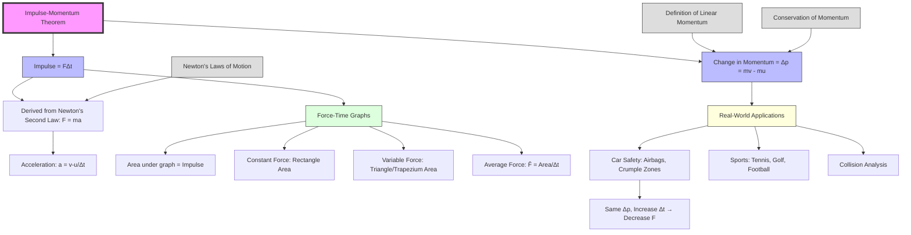

# 1. Overview / 概述

**English:**
The Impulse-Momentum Theorem is a fundamental principle in mechanics that directly links the concepts of [[Definition of Linear Momentum|linear momentum]] and [[Newton's Laws of Motion|Newton's Second Law]]. This theorem states that the impulse applied to an object equals the change in its momentum. It provides a powerful alternative to using Newton's laws directly, especially when dealing with forces that vary with time or when analyzing collisions and impacts. Understanding this theorem is crucial for solving problems involving [[Impulse and Force-Time Graphs|force-time graphs]], vehicle safety features (airbags, crumple zones), and sports physics. This sub-topic serves as the bridge between the definition of momentum and the [[Conservation of Momentum|conservation of momentum]] principle.

**中文:**
冲量-动量定理是力学中的一个基本原理，它直接联系了[[Definition of Linear Momentum|线性动量]]和[[Newton's Laws of Motion|牛顿第二定律]]的概念。该定理指出，施加在物体上的冲量等于其动量的变化。它提供了一种强大的替代方法，可以直接使用牛顿定律，特别是在处理随时间变化的力或分析碰撞和冲击时。理解这个定理对于解决涉及[[Impulse and Force-Time Graphs|力-时间图]]、车辆安全功能（安全气囊、溃缩区）和体育物理学的问题至关重要。这个子知识点是动量定义和[[Conservation of Momentum|动量守恒]]原理之间的桥梁。

---

# 2. Syllabus Learning Objectives / 考纲学习目标

| CAIE 9702 (3.2 f-h) | Edexcel IAL (WPH11 U1: 2.11-2.14) |
|-----------|-------------|
| Define impulse as force × time | Define impulse as the product of force and time |
| Relate impulse to change in momentum | Use the impulse-momentum theorem: $F\Delta t = \Delta p$ |
| Apply impulse-momentum theorem to problems | Apply the theorem to situations involving variable forces |
| Interpret force-time graphs | Calculate impulse from force-time graphs |

**Examiner Expectations / 考官期望:**
- **English:** Students must be able to derive the impulse-momentum theorem from Newton's Second Law, calculate impulse from force-time graphs (including area under the graph), and apply the theorem to real-world scenarios such as car safety and sports.
- **中文:** 学生必须能够从牛顿第二定律推导出冲量-动量定理，从力-时间图计算冲量（包括图形下的面积），并将该定理应用于现实场景，如汽车安全和体育运动。

---

# 3. Core Definitions / 核心定义

| Term (EN/CN) | Definition (EN) | Definition (CN) | Common Mistakes / 常见错误 |
|--------------|-----------------|-----------------|---------------------------|
| **Impulse** / 冲量 | The product of the average force acting on an object and the time interval for which it acts. A vector quantity. | 作用在物体上的平均力与其作用时间间隔的乘积。矢量。 | Confusing impulse with momentum; forgetting impulse is a vector |
| **Impulse-Momentum Theorem** / 冲量-动量定理 | The impulse acting on an object equals the change in its momentum: $F\Delta t = \Delta p = mv - mu$ | 作用在物体上的冲量等于其动量的变化：$F\Delta t = \Delta p = mv - mu$ | Forgetting direction; using final minus initial incorrectly |
| **Average Force** / 平均力 | The constant force that would produce the same impulse as the actual varying force over the same time interval. | 在相同时间间隔内产生与实际变化力相同冲量的恒定力。 | Confusing with instantaneous force |
| **Force-Time Graph** / 力-时间图 | A graph showing how force varies with time; the area under the graph equals the impulse. | 显示力如何随时间变化的图；图形下的面积等于冲量。 | Confusing area with gradient; using wrong units |

---

# 4. Key Concepts Explained / 关键概念详解

## 4.1 Derivation from Newton's Second Law / 从牛顿第二定律推导

### Explanation / 解释
**English:**
The impulse-momentum theorem is derived directly from [[Newton's Laws of Motion|Newton's Second Law]]. Recall that Newton's Second Law states: $F = ma$. Since acceleration $a = \frac{v-u}{\Delta t}$, we can write:

$$F = m \cdot \frac{v-u}{\Delta t}$$

Multiplying both sides by $\Delta t$:

$$F\Delta t = m(v-u) = mv - mu = \Delta p$$

This shows that the impulse ($F\Delta t$) equals the change in momentum ($\Delta p$). This derivation is valid for constant forces. For variable forces, we use the average force $\bar{F}$.

**中文:**
冲量-动量定理直接从[[Newton's Laws of Motion|牛顿第二定律]]推导出来。回忆牛顿第二定律：$F = ma$。由于加速度 $a = \frac{v-u}{\Delta t}$，我们可以写出：

$$F = m \cdot \frac{v-u}{\Delta t}$$

两边乘以 $\Delta t$：

$$F\Delta t = m(v-u) = mv - mu = \Delta p$$

这表明冲量 ($F\Delta t$) 等于动量的变化 ($\Delta p$)。这个推导适用于恒力。对于变力，我们使用平均力 $\bar{F}$。

### Physical Meaning / 物理意义
**English:**
The theorem tells us that to change an object's momentum (speed it up, slow it down, or change its direction), we must apply a force over a period of time. A large change in momentum requires either a large force or a long time of application. This explains why airbags save lives: they increase the time over which the force acts, reducing the average force on the person.

**中文:**
该定理告诉我们，要改变物体的动量（加速、减速或改变方向），我们必须在一段时间内施加力。动量的巨大变化需要大的力或长的作用时间。这解释了为什么安全气囊能挽救生命：它们增加了力作用的时间，从而减小了作用在人身上的平均力。

### Common Misconceptions / 常见误区
- **English:**
  - Thinking impulse and momentum are the same thing (impulse causes change in momentum)
  - Forgetting that impulse is a vector (direction matters)
  - Using $F = ma$ directly for variable forces without averaging
- **中文:**
  - 认为冲量和动量是同一回事（冲量引起动量的变化）
  - 忘记冲量是矢量（方向很重要）
  - 直接使用 $F = ma$ 处理变力而不取平均

### Exam Tips / 考试提示
- **English:** Always state the direction when giving impulse values. For force-time graphs, remember: area = impulse, not gradient.
- **中文:** 给出冲量值时始终说明方向。对于力-时间图，记住：面积 = 冲量，而不是梯度。

> 📷 **IMAGE PROMPT — DIAGRAM-01: Derivation Flowchart**
> A clear flowchart showing the step-by-step derivation from Newton's Second Law ($F=ma$) to the Impulse-Momentum Theorem ($F\Delta t = \Delta p$), with arrows connecting each step and labels explaining the substitution of $a = \Delta v/\Delta t$.

---

# 5. Essential Equations / 核心公式

## Equation 1: Impulse-Momentum Theorem / 冲量-动量定理

$$ \text{Impulse} = F\Delta t = \Delta p = mv - mu $$

| Symbol (符号) | Meaning (EN) | Meaning (CN) | Unit (单位) |
|--------------|-------------|-------------|------------|
| $F$ | Average force (or constant force) | 平均力（或恒力） | N (newton) |
| $\Delta t$ | Time interval | 时间间隔 | s (second) |
| $m$ | Mass of object | 物体质量 | kg (kilogram) |
| $u$ | Initial velocity | 初始速度 | m s⁻¹ |
| $v$ | Final velocity | 最终速度 | m s⁻¹ |
| $\Delta p$ | Change in momentum | 动量变化 | kg m s⁻¹ |

**Derivation / 推导:**
From $F = ma$ and $a = \frac{v-u}{\Delta t}$:
$$F = m\frac{v-u}{\Delta t} \implies F\Delta t = m(v-u) = mv - mu$$

**Conditions / 适用条件:**
- **English:** Valid for constant forces or when using average force for variable forces. The theorem is vector-based, so direction must be considered.
- **中文:** 适用于恒力或使用变力的平均力。该定理基于矢量，因此必须考虑方向。

**Limitations / 局限性:**
- **English:** Does not account for internal forces within a system; only external forces change momentum. For relativistic speeds, the classical momentum formula breaks down.
- **中文:** 不考虑系统内部力；只有外力改变动量。对于相对论速度，经典动量公式失效。

## Equation 2: Impulse from Force-Time Graph / 从力-时间图计算冲量

$$ \text{Impulse} = \text{Area under } F\text{-}t \text{ graph} $$

| Symbol (符号) | Meaning (EN) | Meaning (CN) | Unit (单位) |
|--------------|-------------|-------------|------------|
| Area | Area between curve and time axis | 曲线与时间轴之间的面积 | N·s (equivalent to kg m s⁻¹) |

**Conditions / 适用条件:**
- **English:** Valid for any force-time graph, including constant, varying, or impulsive forces.
- **中文:** 适用于任何力-时间图，包括恒力、变力或冲击力。

> 📷 **IMAGE PROMPT — DIAGRAM-02: Force-Time Graph Types**
> Three force-time graphs side by side: (1) constant force (rectangle), (2) linearly increasing force (triangle), (3) impulsive force (narrow tall spike). Each graph has the area shaded and labeled "Impulse = Area".

---

# 6. Graphs and Relationships / 图表与关系

## 6.1 Force-Time Graph for Constant Force / 恒力的力-时间图

### Axes / 坐标轴
- **X-axis:** Time / time / s (时间 / 秒)
- **Y-axis:** Force / force / N (力 / 牛顿)

### Shape / 形状
**English:** A horizontal straight line at constant force value.
**中文:** 在恒定力值处的水平直线。

### Gradient Meaning / 斜率含义
**English:** The gradient has no physical meaning for impulse calculations. It represents the rate of change of force with time.
**中文:** 斜率对冲量计算没有物理意义。它表示力随时间的变化率。

### Area Meaning / 面积含义
**English:** The area under the graph (rectangle: $F \times \Delta t$) equals the impulse.
**中文:** 图形下的面积（矩形：$F \times \Delta t$）等于冲量。

### Exam Interpretation / 考试解读
**English:** For constant force problems, simply multiply force by time. This is the simplest case.
**中文:** 对于恒力问题，只需将力乘以时间。这是最简单的情况。

## 6.2 Force-Time Graph for Variable Force / 变力的力-时间图

### Axes / 坐标轴
- **X-axis:** Time / time / s (时间 / 秒)
- **Y-axis:** Force / force / N (力 / 牛顿)

### Shape / 形状
**English:** Any curve or irregular shape (e.g., triangle, trapezium, or complex curve).
**中文:** 任何曲线或不规则形状（例如三角形、梯形或复杂曲线）。

### Gradient Meaning / 斜率含义
**English:** The gradient at any point gives the rate of change of force with time ($dF/dt$). Not directly used for impulse.
**中文:** 任意点的斜率给出力随时间的变化率 ($dF/dt$)。不直接用于冲量计算。

### Area Meaning / 面积含义
**English:** The area under the graph equals the impulse. For non-standard shapes, count squares or use integration.
**中文:** 图形下的面积等于冲量。对于非标准形状，数方格或使用积分。

### Exam Interpretation / 考试解读
**English:** Calculate area by splitting into geometric shapes (triangles, rectangles) or counting squares. The average force can be found by: $\bar{F} = \frac{\text{Area}}{\Delta t}$.
**中文:** 通过分割成几何形状（三角形、矩形）或数方格来计算面积。平均力可以通过 $\bar{F} = \frac{\text{Area}}{\Delta t}$ 求得。

```mermaid
graph LR
    A[Force-Time Graph] --> B{Shape Type?}
    B --> C[Constant Force]
    B --> D[Variable Force]
    C --> E[Area = F × Δt]
    D --> F[Split into shapes]
    F --> G[Triangle: ½ × base × height]
    F --> H[Rectangle: base × height]
    F --> I[Trapezium: ½(a+b)h]
    E --> J[Impulse = Area]
    G --> J
    H --> J
    I --> J
    J --> K[Δp = Impulse]
```

---

# 7. Required Diagrams / 必备图表

## 7.1 Force-Time Graph for an Impulsive Force / 冲击力的力-时间图

### Description / 描述
**English:** A graph showing a very large force acting over a very short time interval (e.g., a hammer hitting a nail, a tennis racket hitting a ball). The graph is a tall, narrow peak.
**中文:** 显示非常大的力在非常短的时间间隔内作用的图（例如，锤子敲钉子、网球拍击球）。该图是一个高而窄的峰值。

### Image Prompt / 图片生成提示
> 📷 **IMAGE PROMPT — DIAGRAM-03: Impulsive Force Graph**
> A force-time graph showing a tall, narrow triangular peak. The x-axis is labeled "Time / s" and the y-axis is labeled "Force / N". The peak represents an impulsive force (e.g., a collision). The area under the peak is shaded and labeled "Impulse = Area = Δp". Include labels for "Very short Δt" and "Very large F".

### Labels Required / 需要标注
- **English:** Peak force ($F_{\text{max}}$), time interval ($\Delta t$), shaded area (Impulse), before and after collision points
- **中文:** 峰值力 ($F_{\text{max}}$)、时间间隔 ($\Delta t$)、阴影区域（冲量）、碰撞前后点

### Exam Importance / 考试重要性
**English:** Very common in exam questions. Students must calculate impulse from the area and relate it to momentum change.
**中文:** 在考试题目中非常常见。学生必须从面积计算冲量并将其与动量变化联系起来。

## 7.2 Car Safety Features Diagram / 汽车安全功能图

### Description / 描述
**English:** A diagram showing a car collision with and without safety features (airbag, crumple zone, seatbelt). The diagram illustrates how increasing the collision time reduces the average force.
**中文:** 显示有和没有安全功能（安全气囊、溃缩区、安全带）的汽车碰撞图。该图说明了增加碰撞时间如何减小平均力。

### Image Prompt / 图片生成提示
> 📷 **IMAGE PROMPT — DIAGRAM-04: Car Safety and Impulse**
> Split diagram showing two scenarios: (1) Without airbag: driver hits steering wheel directly, small Δt, large F. (2) With airbag: driver hits airbag, large Δt, small F. Both scenarios have the same Δp (same change in momentum). Arrows show force direction. Labels: "Same Δp", "Small Δt → Large F", "Large Δt → Small F".

### Labels Required / 需要标注
- **English:** Same change in momentum ($\Delta p$), short time ($\Delta t_{\text{small}}$), long time ($\Delta t_{\text{large}}$), large force ($F_{\text{large}}$), small force ($F_{\text{small}}$)
- **中文:** 相同的动量变化 ($\Delta p$)、短时间 ($\Delta t_{\text{小}}$)、长时间 ($\Delta t_{\text{大}}$)、大力 ($F_{\text{大}}$)、小力 ($F_{\text{小}}$)

### Exam Importance / 考试重要性
**English:** Classic application question. Students must explain how safety features increase collision time to reduce force while keeping impulse constant.
**中文:** 经典应用题。学生必须解释安全功能如何增加碰撞时间以减小力，同时保持冲量恒定。

---

# 8. Worked Examples / 典型例题

## Example 1: Calculating Impulse and Force / 计算冲量和力

### Question / 题目
**English:**
A tennis ball of mass 0.060 kg is served horizontally at a speed of 50 m s⁻¹. The tennis racket is in contact with the ball for 0.0050 s. Calculate:
(a) The impulse imparted to the ball
(b) The average force exerted by the racket on the ball

**中文:**
一个质量为 0.060 kg 的网球以 50 m s⁻¹ 的速度水平发出。网球拍与球的接触时间为 0.0050 s。计算：
(a) 传递给球的冲量
(b) 球拍对球的平均力

### Solution / 解答
**Step 1: Identify known quantities / 步骤1：确定已知量**
- Mass / 质量: $m = 0.060 \text{ kg}$
- Initial velocity / 初始速度: $u = 0 \text{ m s}^{-1}$ (ball starts from rest)
- Final velocity / 最终速度: $v = 50 \text{ m s}^{-1}$
- Contact time / 接触时间: $\Delta t = 0.0050 \text{ s}$

**Step 2: Calculate impulse / 步骤2：计算冲量**
$$ \text{Impulse} = \Delta p = mv - mu = m(v-u) $$
$$ \text{Impulse} = 0.060 \times (50 - 0) = 0.060 \times 50 = 3.0 \text{ N·s} $$

**Step 3: Calculate average force / 步骤3：计算平均力**
$$ \text{Impulse} = F\Delta t \implies F = \frac{\text{Impulse}}{\Delta t} $$
$$ F = \frac{3.0}{0.0050} = 600 \text{ N} $$

### Final Answer / 最终答案
**Answer:** (a) Impulse = 3.0 N·s | **答案：** (a) 冲量 = 3.0 N·s
**Answer:** (b) Average force = 600 N | **答案：** (b) 平均力 = 600 N

### Quick Tip / 提示
**English:** Always check units: N·s is equivalent to kg m s⁻¹. For impulse, direction matters — specify the direction of the force.
**中文:** 始终检查单位：N·s 等同于 kg m s⁻¹。对于冲量，方向很重要——指定力的方向。

---

## Example 2: Force-Time Graph Problem / 力-时间图问题

### Question / 题目
**English:**
A force-time graph for a collision shows a triangle shape. The force increases linearly from 0 N to 200 N in 0.020 s, then decreases linearly back to 0 N in another 0.020 s. The object has mass 0.50 kg and is initially at rest. Calculate:
(a) The impulse delivered
(b) The final velocity of the object

**中文:**
一个碰撞的力-时间图显示为三角形形状。力在 0.020 s 内从 0 N 线性增加到 200 N，然后在另外 0.020 s 内线性减小回 0 N。物体质量为 0.50 kg，初始静止。计算：
(a) 传递的冲量
(b) 物体的最终速度

### Solution / 解答
**Step 1: Calculate area under graph / 步骤1：计算图形下的面积**
The graph is a triangle with:
- Base / 底边: $\Delta t = 0.040 \text{ s}$ (total time)
- Height / 高度: $F_{\text{max}} = 200 \text{ N}$

$$ \text{Area} = \frac{1}{2} \times \text{base} \times \text{height} = \frac{1}{2} \times 0.040 \times 200 $$
$$ \text{Area} = \frac{1}{2} \times 8.0 = 4.0 \text{ N·s} $$

**Step 2: Impulse equals area / 步骤2：冲量等于面积**
$$ \text{Impulse} = 4.0 \text{ N·s} $$

**Step 3: Calculate final velocity / 步骤3：计算最终速度**
$$ \text{Impulse} = \Delta p = mv - mu $$
$$ 4.0 = 0.50 \times v - 0.50 \times 0 $$
$$ 4.0 = 0.50v $$
$$ v = \frac{4.0}{0.50} = 8.0 \text{ m s}^{-1} $$

### Final Answer / 最终答案
**Answer:** (a) Impulse = 4.0 N·s | **答案：** (a) 冲量 = 4.0 N·s
**Answer:** (b) Final velocity = 8.0 m s⁻¹ | **答案：** (b) 最终速度 = 8.0 m s⁻¹

### Quick Tip / 提示
**English:** For triangular force-time graphs, the average force is half the peak force: $\bar{F} = \frac{F_{\text{max}}}{2}$. This can be used as a quick check.
**中文:** 对于三角形的力-时间图，平均力是峰值力的一半：$\bar{F} = \frac{F_{\text{max}}}{2}$。这可以用作快速检查。

---

# 9. Past Paper Question Types / 历年真题题型

| Question Type / 题型 | Frequency / 频率 | Difficulty / 难度 | Past Paper References / 真题索引 |
|----------------------|------------------|------------------|-------------------------------|
| Calculate impulse from $F\Delta t$ | High | Easy | 📝 *待填入* |
| Calculate impulse from force-time graph area | High | Medium | 📝 *待填入* |
| Apply impulse-momentum theorem to find force/velocity | High | Medium | 📝 *待填入* |
| Explain car safety features using impulse-momentum | Medium | Medium | 📝 *待填入* |
| Derive impulse-momentum theorem from $F=ma$ | Low | Easy | 📝 *待填入* |

**Common Command Words / 常见指令词:**
- **English:** Calculate, Determine, Find, Show that, Explain, Derive, Sketch
- **中文:** 计算、确定、求、证明、解释、推导、画出

---

# 10. Practical Skills Connections / 实验技能链接

**English:**
The impulse-momentum theorem connects to practical work in several ways:

1. **Force-Time Graph Experiment:** Use a force sensor (e.g., datalogger with force probe) to measure the force during a collision (e.g., a ball hitting a wall). The datalogger records force against time, and students calculate the area under the graph to find impulse.

2. **Measuring Average Force:** Use a motion sensor to measure velocity before and after collision, calculate momentum change, and divide by contact time (measured using high-speed video or force sensor) to find average force.

3. **Uncertainties:** When calculating impulse from force-time graphs, the main uncertainty comes from estimating the area (especially for irregular shapes). Students should count squares and estimate uncertainty as ± half a square.

4. **Graph Plotting:** Students may be asked to plot force-time graphs from experimental data and calculate impulse from the area. Key skills include choosing appropriate scales, drawing curves of best fit, and calculating areas.

**中文:**
冲量-动量定理在多个方面与实验工作相关：

1. **力-时间图实验：** 使用力传感器（例如，带力探头的数采器）测量碰撞过程中的力（例如，球撞击墙壁）。数采器记录力与时间的关系，学生计算图形下的面积以找到冲量。

2. **测量平均力：** 使用运动传感器测量碰撞前后的速度，计算动量变化，并除以接触时间（使用高速视频或力传感器测量）以找到平均力。

3. **不确定度：** 从力-时间图计算冲量时，主要不确定度来自面积的估算（特别是对于不规则形状）。学生应数方格并估算不确定度为 ± 半个方格。

4. **图表绘制：** 学生可能需要根据实验数据绘制力-时间图，并从面积计算冲量。关键技能包括选择合适的比例尺、绘制最佳拟合曲线和计算面积。

---

# 11. Concept Map / 概念图谱



---

# 12. Quick Revision Sheet / 速查表

| Category / 类别 | Key Points / 要点 |
|----------------|------------------|
| **Definition / 定义** | Impulse = Force × Time (冲量 = 力 × 时间); Impulse = Change in Momentum (冲量 = 动量变化) |
| **Key Formula / 核心公式** | $F\Delta t = \Delta p = mv - mu$ |
| **Key Graph / 核心图表** | Force-Time Graph: Area = Impulse (力-时间图：面积 = 冲量) |
| **Vector Nature / 矢量性质** | Impulse and momentum are vectors — direction matters (冲量和动量是矢量——方向很重要) |
| **Average Force / 平均力** | $\bar{F} = \frac{\text{Impulse}}{\Delta t} = \frac{\Delta p}{\Delta t}$ |
| **Safety Application / 安全应用** | Increase $\Delta t$ → Decrease $F$ for same $\Delta p$ (增加 $\Delta t$ → 减小 $F$，保持 $\Delta p$ 不变) |
| **Common Mistake / 常见错误** | Confusing area with gradient on F-t graph (混淆 F-t 图上的面积和斜率) |
| **Units / 单位** | Impulse: N·s or kg m s⁻¹ (冲量：N·s 或 kg m s⁻¹) |
| **Exam Tip / 考试提示** | Always show direction; check if force is constant or average (始终显示方向；检查力是恒力还是平均力) |
| **Derivation / 推导** | $F = ma = m(v-u)/\Delta t \implies F\Delta t = m(v-u)$ |