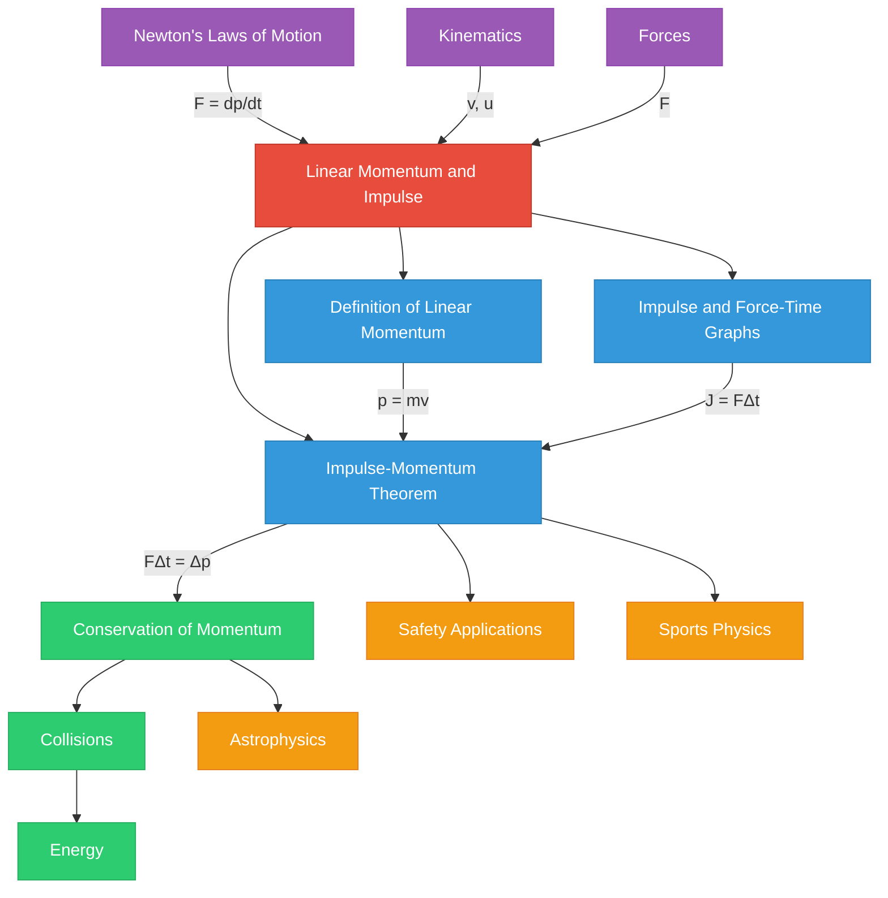

# 1. Overview / 概述

**English:**
Linear Momentum and Impulse form the foundation of dynamics, bridging [[Newton's Laws of Motion]] with the analysis of collisions and interactions. Linear momentum ($p$) is defined as the product of an object's mass and velocity, representing the quantity of motion an object possesses. Impulse ($J$) quantifies the effect of a force acting over a time interval, directly relating to the change in momentum through the Impulse-Momentum Theorem.

This topic is crucial because it provides a powerful alternative to Newton's Second Law for analysing forces that vary with time, such as in car crashes, sports impacts, and rocket propulsion. In both Cambridge 9702 and Edexcel IAL examinations, this is a high-frequency topic appearing in multiple-choice, structured calculation, and explanation questions. Understanding momentum and impulse is essential for mastering [[Conservation of Momentum]] in collisions and explosions, which is a core concept in mechanics.

Real-world applications include: airbag design (increasing impact time to reduce force), car crumple zones, sports equipment (cricket pads, boxing gloves), and analysing collisions in particle physics. The concept also extends to fluid mechanics and astrophysics.

**中文：**
线性动量和冲量构成了动力学的基石，将[[牛顿运动定律]]与碰撞和相互作用的分析联系起来。线性动量（$p$）定义为物体质量与速度的乘积，代表物体运动的量度。冲量（$J$）量化了力在一段时间间隔内作用的效果，通过冲量-动量定理直接与动量变化相关。

这个主题至关重要，因为它为分析随时间变化的力（如车祸、运动撞击和火箭推进）提供了牛顿第二定律的强大替代方案。在剑桥 9702 和爱德思 IAL 考试中，这是一个高频主题，出现在选择题、结构化计算和解释题中。理解动量和冲量对于掌握碰撞和爆炸中的[[动量守恒]]至关重要，这是力学的核心概念。

实际应用包括：安全气囊设计（增加冲击时间以减少力）、汽车溃缩区、运动装备（护垫、拳击手套）以及分析粒子物理中的碰撞。这个概念还扩展到流体力学和天体物理学。

---

# 2. Syllabus Learning Objectives / 考纲学习目标

| CAIE 9702 (3.2 f-h) | Edexcel IAL (WPH11 U1: 2.11-2.14) |
|---------------------|-----------------------------------|
| Define linear momentum as $p = mv$ | Define momentum as the product of mass and velocity |
| Define impulse as the product of force and time ($J = F\Delta t$) | Define impulse as the product of force and the time for which it acts |
| Recall and use the equation $F = \frac{\Delta p}{\Delta t}$ | Use the impulse-momentum principle: $F\Delta t = \Delta p = mv - mu$ |
| Apply the principle of conservation of momentum to simple interactions | Apply conservation of linear momentum to collisions and explosions |
| Distinguish between elastic and inelastic collisions | Distinguish between elastic and inelastic collisions |
| Use force-time graphs to determine impulse | Interpret force-time graphs to find impulse (area under graph) |
| - | Use the equation $F = \frac{m(v-u)}{t}$ for constant force |

**Examiner Expectations / 考官期望:**

**English:**
- Candidates must be able to define momentum and impulse using correct terminology
- For CAIE, the relationship $F = \frac{\Delta p}{\Delta t}$ is derived from Newton's Second Law and must be applied correctly
- For Edexcel, the impulse-momentum principle $F\Delta t = \Delta p$ is explicitly tested, often with force-time graphs
- Both boards require distinguishing elastic (kinetic energy conserved) from inelastic (kinetic energy not conserved) collisions
- Vector nature of momentum must be considered — sign conventions are critical
- Force-time graph interpretation: area = impulse, gradient = rate of change of force

**中文：**
- 考生必须能够使用正确的术语定义动量和冲量
- 对于 CAIE，关系式 $F = \frac{\Delta p}{\Delta t}$ 是从牛顿第二定律推导出来的，必须正确应用
- 对于 Edexcel，冲量-动量原理 $F\Delta t = \Delta p$ 被明确测试，通常结合力-时间图
- 两个考试局都要求区分弹性碰撞（动能守恒）和非弹性碰撞（动能不守恒）
- 必须考虑动量的矢量性质——符号约定至关重要
- 力-时间图解读：面积 = 冲量，梯度 = 力的变化率

> 📋 **CIE Only:** CAIE specifically requires deriving $F = \frac{\Delta p}{\Delta t}$ from Newton's Second Law. The equation $F = ma$ is a special case when mass is constant.
>
> 📋 **Edexcel Only:** Edexcel explicitly tests the impulse-momentum principle $F\Delta t = \Delta p$ and requires calculating impulse from force-time graphs. The equation $F = \frac{m(v-u)}{t}$ is used for constant forces only.

---

# 3. Core Definitions / 核心定义

| Term (EN/CN) | Definition (EN) | Definition (CN) | Common Mistakes / 常见错误 |
|--------------|-----------------|-----------------|---------------------------|
| **Linear Momentum / 线性动量** | The product of an object's mass and its velocity. A vector quantity: $\vec{p} = m\vec{v}$ | 物体质量与其速度的乘积。矢量量：$\vec{p} = m\vec{v}$ | Confusing momentum with kinetic energy; forgetting vector nature (direction matters); using speed instead of velocity |
| **Impulse / 冲量** | The product of a force and the time interval over which it acts. A vector quantity: $\vec{J} = \vec{F}\Delta t$ | 力与其作用时间间隔的乘积。矢量量：$\vec{J} = \vec{F}\Delta t$ | Treating impulse as scalar; forgetting that impulse equals change in momentum; using average force incorrectly |
| **Impulse-Momentum Theorem / 冲量-动量定理** | The impulse acting on an object equals its change in momentum: $\vec{F}\Delta t = \Delta \vec{p} = m\vec{v} - m\vec{u}$ | 作用在物体上的冲量等于其动量变化：$\vec{F}\Delta t = \Delta \vec{p} = m\vec{v} - m\vec{u}$ | Forgetting direction signs; applying to systems where external forces exist without accounting for them |
| **Elastic Collision / 弹性碰撞** | A collision in which both momentum and kinetic energy are conserved | 动量和动能都守恒的碰撞 | Assuming all collisions are elastic; forgetting to check kinetic energy conservation |
| **Inelastic Collision / 非弹性碰撞** | A collision in which momentum is conserved but kinetic energy is not conserved | 动量守恒但动能不守恒的碰撞 | Thinking kinetic energy is always lost (it can be gained in explosions); forgetting momentum is still conserved |
| **Conservation of Momentum / 动量守恒** | For a system with no external forces, total momentum before an interaction equals total momentum after | 对于没有外力的系统，相互作用前的总动量等于相互作用后的总动量 | Applying to systems with external forces; forgetting vector addition; using speed instead of velocity |

---

# 4. Key Concepts Explained / 关键概念详解

## 4.1 Linear Momentum / 线性动量

### Explanation / 解释
**English:**
Linear momentum ($\vec{p}$) is a vector quantity that describes the "quantity of motion" of an object. It is defined as the product of mass ($m$) and velocity ($\vec{v}$):

$$ \vec{p} = m\vec{v} $$

The SI unit of momentum is $\text{kg·m·s}^{-1}$ (kilogram-metre per second). Since velocity is a vector, momentum is also a vector, meaning direction is crucial. A heavy object moving slowly can have the same momentum as a light object moving fast. Momentum is directly proportional to both mass and velocity.

Momentum is a conserved quantity in isolated systems, which makes it one of the most powerful concepts in physics. It is related to [[Newton's Laws of Motion]] through Newton's Second Law, which states that the net force equals the rate of change of momentum.

**中文：**
线性动量（$\vec{p}$）是一个矢量量，描述物体的"运动量"。它定义为质量（$m$）和速度（$\vec{v}$）的乘积：

$$ \vec{p} = m\vec{v} $$

动量的 SI 单位是 $\text{kg·m·s}^{-1}$（千克·米/秒）。由于速度是矢量，动量也是矢量，意味着方向至关重要。一个缓慢移动的重物可以与一个快速移动的轻物具有相同的动量。动量与质量和速度都成正比。

动量在孤立系统中是守恒量，这使其成为物理学中最强大的概念之一。它通过牛顿第二定律与[[牛顿运动定律]]相关联，该定律指出净力等于动量的变化率。

### Physical Meaning / 物理意义
**English:**
Momentum quantifies how difficult it is to stop a moving object. A truck moving at 20 m/s has much more momentum than a bicycle at the same speed — it requires more force or more time to stop. This is why momentum is crucial in vehicle safety design.

**中文：**
动量量化了阻止运动物体的难度。以 20 m/s 行驶的卡车比相同速度的自行车具有更大的动量——需要更大的力或更长的时间才能停下来。这就是动量在车辆安全设计中至关重要的原因。

### Common Misconceptions / 常见误区
1. **Momentum vs Kinetic Energy:** Students often confuse momentum ($p = mv$) with kinetic energy ($E_k = \frac{1}{2}mv^2$). Momentum is a vector; kinetic energy is a scalar. An object can have zero momentum (at rest) but zero kinetic energy — they are different quantities.
2. **Direction Ignorance:** Treating momentum as a scalar and ignoring direction in calculations.
3. **Mass Confusion:** Using weight instead of mass in momentum calculations.

### Exam Tips / 考试提示
**English:**
- Always state the direction when defining momentum
- Use sign conventions (e.g., right = positive, left = negative) for vector problems
- CAIE often asks to derive $F = \frac{\Delta p}{\Delta t}$ from Newton's Second Law
- Edexcel frequently tests momentum in collision problems with force-time graphs

**中文：**
- 定义动量时始终说明方向
- 对矢量问题使用符号约定（例如，向右 = 正，向左 = 负）
- CAIE 经常要求从牛顿第二定律推导 $F = \frac{\Delta p}{\Delta t}$
- Edexcel 经常在碰撞问题中结合力-时间图测试动量

> 📷 **IMAGE PROMPT — MOM-01: Vector Nature of Momentum**
>
> A diagram showing two objects of different masses moving at different velocities but having equal momentum. Left side: a large truck (5000 kg) moving slowly at 2 m/s rightward. Right side: a small car (1000 kg) moving fast at 10 m/s rightward. Both have momentum = 10,000 kg·m/s. Arrows of equal length represent momentum vectors. Labels show mass, velocity, and momentum values. Clean educational style, white background, blue arrows.

---

## 4.2 Impulse / 冲量

### Explanation / 解释
**English:**
Impulse ($\vec{J}$) is a vector quantity that measures the effect of a force acting over a time interval. It is defined as:

$$ \vec{J} = \vec{F}\Delta t $$

where $\vec{F}$ is the (average) force and $\Delta t$ is the time interval. The SI unit of impulse is $\text{N·s}$ (newton-second), which is equivalent to $\text{kg·m·s}^{-1}$.

For a constant force, impulse is simply force × time. For a varying force, impulse equals the area under a force-time graph. This is a key skill tested in both CAIE and Edexcel examinations.

Impulse is directly linked to momentum change through the [[Impulse-Momentum Theorem]]: $J = \Delta p$. This means that applying a larger force for a shorter time, or a smaller force for a longer time, can produce the same momentum change.

**中文：**
冲量（$\vec{J}$）是一个矢量量，衡量力在一段时间间隔内作用的效果。它定义为：

$$ \vec{J} = \vec{F}\Delta t $$

其中 $\vec{F}$ 是（平均）力，$\Delta t$ 是时间间隔。冲量的 SI 单位是 $\text{N·s}$（牛顿·秒），等同于 $\text{kg·m·s}^{-1}$。

对于恒力，冲量就是力 × 时间。对于变力，冲量等于力-时间图下的面积。这是 CAIE 和 Edexcel 考试中都测试的关键技能。

冲量通过[[冲量-动量定理]]直接与动量变化相关联：$J = \Delta p$。这意味着施加更大的力更短的时间，或施加更小的力更长的时间，可以产生相同的动量变化。

### Physical Meaning / 物理意义
**English:**
Impulse explains why airbags save lives. In a car crash, the passenger's momentum changes from a large value to zero. An airbag increases the time over which this change occurs, reducing the average force on the passenger. Similarly, bending your knees when landing increases the impact time, reducing the force on your joints.

**中文：**
冲量解释了安全气囊为何能挽救生命。在车祸中，乘客的动量从大值变为零。安全气囊增加了这一变化发生的时间，减少了乘客受到的平均力。同样，落地时弯曲膝盖增加了冲击时间，减少了关节受到的力。

### Common Misconceptions / 常见误区
1. **Impulse is not force:** Students often think impulse is just force. It is force × time.
2. **Direction:** Impulse is a vector — it has the same direction as the force.
3. **Average vs Instantaneous:** When force varies, use average force, not instantaneous force.
4. **Units:** Confusing N·s with N or kg·m/s (they are equivalent but used differently).

### Exam Tips / 考试提示
**English:**
- For force-time graphs: area under graph = impulse = change in momentum
- For constant force problems: $J = F\Delta t$ directly
- Edexcel specifically tests force-time graph interpretation
- CAIE may ask to calculate impulse from a changing force scenario
- Always include direction in vector answers

**中文：**
- 对于力-时间图：图下面积 = 冲量 = 动量变化
- 对于恒力问题：直接使用 $J = F\Delta t$
- Edexcel 特别测试力-时间图解读
- CAIE 可能要求从变化的力场景计算冲量
- 在矢量答案中始终包含方向

---

## 4.3 Impulse-Momentum Theorem / 冲量-动量定理

### Explanation / 解释
**English:**
The Impulse-Momentum Theorem states that the impulse acting on an object equals its change in momentum:

$$ \vec{F}\Delta t = \Delta \vec{p} = m\vec{v} - m\vec{u} $$

This theorem is derived from [[Newton's Laws of Motion]], specifically Newton's Second Law:

$$ \vec{F} = m\vec{a} = m\frac{\Delta \vec{v}}{\Delta t} = \frac{m\Delta \vec{v}}{\Delta t} = \frac{\Delta \vec{p}}{\Delta t} $$

Rearranging: $\vec{F}\Delta t = \Delta \vec{p}$

This theorem is powerful because it relates force (a difficult quantity to measure directly for varying forces) to momentum change (which can be calculated from velocities and masses). It is the foundation for analysing collisions, impacts, and any situation where forces act over time.

**中文：**
冲量-动量定理指出，作用在物体上的冲量等于其动量变化：

$$ \vec{F}\Delta t = \Delta \vec{p} = m\vec{v} - m\vec{u} $$

该定理从[[牛顿运动定律]]推导而来，特别是牛顿第二定律：

$$ \vec{F} = m\vec{a} = m\frac{\Delta \vec{v}}{\Delta t} = \frac{m\Delta \vec{v}}{\Delta t} = \frac{\Delta \vec{p}}{\Delta t} $$

重新排列：$\vec{F}\Delta t = \Delta \vec{p}$

这个定理之所以强大，是因为它将力（对于变化的力难以直接测量的量）与动量变化（可以从速度和质量计算）联系起来。它是分析碰撞、冲击以及任何力随时间作用情况的基础。

### Physical Meaning / 物理意义
**English:**
The theorem explains why the same momentum change can be achieved with different force-time combinations. A karate expert breaks a board by applying a large force over a very short time. A car's crumple zone applies a smaller force over a longer time to achieve the same momentum change (stopping the car) with less damage.

**中文：**
该定理解释了为什么相同的动量变化可以通过不同的力-时间组合实现。空手道高手通过施加很大的力在极短的时间内劈开木板。汽车的溃缩区施加较小的力在较长的时间内实现相同的动量变化（停车），同时减少损害。

### Common Misconceptions / 常见误区
1. **Direction of impulse:** The impulse direction is the same as the force direction, which may be opposite to initial velocity
2. **Sign convention:** When an object rebounds, the change in momentum is $mv - (-mu) = m(v+u)$, not $mv - mu$
3. **Average force:** The theorem uses average force, not instantaneous force
4. **System boundaries:** The theorem applies to a single object, not a system

### Exam Tips / 考试提示
**English:**
- For rebound problems: $\Delta p = m(v - (-u)) = m(v+u)$ if direction reverses
- Always define positive direction before calculation
- CAIE: Derivation of $F = \frac{\Delta p}{\Delta t}$ is commonly examined
- Edexcel: Force-time graph area = impulse = $\Delta p$ is a standard question
- Check units: N·s should equal kg·m/s

**中文：**
- 对于反弹问题：如果方向反转，$\Delta p = m(v - (-u)) = m(v+u)$
- 在计算前始终定义正方向
- CAIE：$F = \frac{\Delta p}{\Delta t}$ 的推导是常见考点
- Edexcel：力-时间图面积 = 冲量 = $\Delta p$ 是标准问题
- 检查单位：N·s 应等于 kg·m/s

> 📷 **IMAGE PROMPT — MOM-02: Impulse-Momentum Theorem Application**
>
> A split diagram showing two scenarios achieving the same momentum change. Left: A karate hand applying large force over short time to break a board. Force arrow large, time arrow short. Right: An airbag deploying in a car, showing small force arrow over long time. Both have equal impulse represented by equal-sized rectangles (force × time). Labels: "Large Force, Short Time" and "Small Force, Long Time". Educational diagram, clean style.

---

# 5. Essential Equations / 核心公式

## 5.1 Linear Momentum / 线性动量

**Equation / 公式:**
$$ \vec{p} = m\vec{v} $$

**Variables / 变量:**
| Symbol (符号) | Meaning (EN) | Meaning (CN) | Unit (单位) |
|--------------|-------------|-------------|------------|
| $\vec{p}$ | Linear momentum | 线性动量 | kg·m·s⁻¹ |
| $m$ | Mass | 质量 | kg |
| $\vec{v}$ | Velocity | 速度 | m·s⁻¹ |

**Derivation / 推导:**
**English:** This is a definition, not derived. It comes from the concept that the "quantity of motion" depends on both mass and velocity.
**中文：** 这是一个定义，不是推导出来的。它源于"运动量"取决于质量和速度的概念。

**Conditions / 适用条件:**
**English:** Valid for all objects with mass moving at non-relativistic speeds ($v \ll c$).
**中文：** 适用于所有以非相对论速度（$v \ll c$）运动的有质量物体。

**Limitations / 局限性:**
**English:** Does not apply to massless particles (photons) or relativistic speeds.
**中文：** 不适用于无质量粒子（光子）或相对论速度。

**Rearrangements / 变形:**
$$ m = \frac{p}{v}, \quad v = \frac{p}{m} $$

---

## 5.2 Impulse (Constant Force) / 冲量（恒力）

**Equation / 公式:**
$$ \vec{J} = \vec{F}\Delta t $$

**Variables / 变量:**
| Symbol (符号) | Meaning (EN) | Meaning (CN) | Unit (单位) |
|--------------|-------------|-------------|------------|
| $\vec{J}$ | Impulse | 冲量 | N·s |
| $\vec{F}$ | Average force | 平均力 | N |
| $\Delta t$ | Time interval | 时间间隔 | s |

**Derivation / 推导:**
**English:** This is a definition. Impulse is defined as the product of force and time.
**中文：** 这是一个定义。冲量定义为力与时间的乘积。

**Conditions / 适用条件:**
**English:** Force must be constant over the time interval. For varying forces, use the area under the force-time graph.
**中文：** 力必须在时间间隔内恒定。对于变化的力，使用力-时间图下的面积。

**Limitations / 局限性:**
**English:** Cannot be used directly for varying forces without calculating average force.
**中文：** 对于变化的力，不能直接使用，除非计算平均力。

**Rearrangements / 变形:**
$$ F = \frac{J}{\Delta t}, \quad \Delta t = \frac{J}{F} $$

---

## 5.3 Impulse-Momentum Theorem / 冲量-动量定理

**Equation / 公式:**
$$ \vec{F}\Delta t = \Delta \vec{p} = m\vec{v} - m\vec{u} $$

**Variables / 变量:**
| Symbol (符号) | Meaning (EN) | Meaning (CN) | Unit (单位) |
|--------------|-------------|-------------|------------|
| $\vec{F}$ | Average net force | 平均净力 | N |
| $\Delta t$ | Time interval | 时间间隔 | s |
| $m$ | Mass | 质量 | kg |
| $\vec{v}$ | Final velocity | 最终速度 | m·s⁻¹ |
| $\vec{u}$ | Initial velocity | 初始速度 | m·s⁻¹ |

**Derivation / 推导:**
**English:**
Starting from Newton's Second Law:
$$ \vec{F} = m\vec{a} = m\frac{\Delta \vec{v}}{\Delta t} = \frac{m(\vec{v} - \vec{u})}{\Delta t} = \frac{\Delta \vec{p}}{\Delta t} $$

Multiplying both sides by $\Delta t$:
$$ \vec{F}\Delta t = \Delta \vec{p} = m\vec{v} - m\vec{u} $$

**中文：**
从牛顿第二定律开始：
$$ \vec{F} = m\vec{a} = m\frac{\Delta \vec{v}}{\Delta t} = \frac{m(\vec{v} - \vec{u})}{\Delta t} = \frac{\Delta \vec{p}}{\Delta t} $$

两边乘以 $\Delta t$：
$$ \vec{F}\Delta t = \Delta \vec{p} = m\vec{v} - m\vec{u} $$

**Conditions / 适用条件:**
**English:**
- Mass must be constant
- Force is the average net force over the time interval
- Valid for all collisions and impacts
- Direction must be considered (vector equation)

**中文：**
- 质量必须恒定
- 力是时间间隔内的平均净力
- 适用于所有碰撞和冲击
- 必须考虑方向（矢量方程）

**Limitations / 局限性:**
**English:**
- Does not apply if mass changes (e.g., rocket with fuel ejection)
- Does not give instantaneous force, only average force
- Requires vector addition for multi-object systems

**中文：**
- 不适用于质量变化的情况（例如，燃料喷射的火箭）
- 不给出瞬时力，只给出平均力
- 对于多物体系统需要矢量加法

**Rearrangements / 变形:**
$$ F = \frac{m(v-u)}{\Delta t}, \quad \Delta t = \frac{m(v-u)}{F}, \quad v = u + \frac{F\Delta t}{m} $$

---

## 5.4 Newton's Second Law (Momentum Form) / 牛顿第二定律（动量形式）

**Equation / 公式:**
$$ \vec{F} = \frac{\Delta \vec{p}}{\Delta t} $$

**Variables / 变量:**
| Symbol (符号) | Meaning (EN) | Meaning (CN) | Unit (单位) |
|--------------|-------------|-------------|------------|
| $\vec{F}$ | Net force | 净力 | N |
| $\Delta \vec{p}$ | Change in momentum | 动量变化 | kg·m·s⁻¹ |
| $\Delta t$ | Time interval | 时间间隔 | s |

**Derivation / 推导:**
**English:**
Newton's Second Law originally states: The net force acting on an object is proportional to the rate of change of its momentum. In mathematical form:
$$ \vec{F} \propto \frac{\Delta \vec{p}}{\Delta t} $$
With appropriate units: $\vec{F} = \frac{\Delta \vec{p}}{\Delta t}$

When mass is constant: $\vec{F} = \frac{m\Delta \vec{v}}{\Delta t} = m\vec{a}$

**中文：**
牛顿第二定律最初表述为：作用在物体上的净力与其动量变化率成正比。数学形式为：
$$ \vec{F} \propto \frac{\Delta \vec{p}}{\Delta t} $$
使用适当单位：$\vec{F} = \frac{\Delta \vec{p}}{\Delta t}$

当质量恒定时：$\vec{F} = \frac{m\Delta \vec{v}}{\Delta t} = m\vec{a}$

**Conditions / 适用条件:**
**English:** This is the general form of Newton's Second Law, valid even when mass changes.
**中文：** 这是牛顿第二定律的一般形式，即使在质量变化时也有效。

**Limitations / 局限性:**
**English:** Requires calculus for instantaneous rates of change ($F = \frac{dp}{dt}$).
**中文：** 对于瞬时变化率需要微积分（$F = \frac{dp}{dt}$）。

**Rearrangements / 变形:**
$$ \Delta p = F\Delta t, \quad \Delta t = \frac{\Delta p}{F} $$

---

# 6. Graphs and Relationships / 图表与关系

## 6.1 Force-Time Graph for Constant Force / 恒力的力-时间图

### Axes / 坐标轴
**English:** x-axis: Time (t) / s; y-axis: Force (F) / N
**中文：** x轴：时间 (t) / 秒；y轴：力 (F) / 牛顿

### Shape / 形状
**English:** A horizontal straight line at $F = \text{constant}$ from $t = 0$ to $t = \Delta t$.
**中文：** 从 $t = 0$ 到 $t = \Delta t$ 在 $F = \text{常数}$ 处的水平直线。

### Gradient Meaning / 斜率含义
**English:** Gradient = 0 (force is constant). Rate of change of force = 0.
**中文：** 斜率 = 0（力恒定）。力的变化率 = 0。

### Area Meaning / 面积含义
**English:** Area under graph = $F \times \Delta t$ = Impulse = Change in momentum ($\Delta p$).
**中文：** 图下面积 = $F \times \Delta t$ = 冲量 = 动量变化 ($\Delta p$)。

### Exam Interpretation / 考试解读
**English:**
- Calculate area as rectangle: $A = \text{height} \times \text{width} = F \times \Delta t$
- This equals the impulse and the change in momentum
- If initial momentum is known, final momentum can be found

**中文：**
- 计算矩形面积：$A = \text{高} \times \text{宽} = F \times \Delta t$
- 这等于冲量和动量变化
- 如果已知初始动量，可以求出最终动量

### Common Questions / 常见问题
**English:**
- "Calculate the impulse from the graph"
- "Determine the change in momentum"
- "Find the final velocity of the object"

**中文：**
- "从图中计算冲量"
- "确定动量变化"
- "求物体的最终速度"

---

## 6.2 Force-Time Graph for Varying Force / 变力的力-时间图

### Axes / 坐标轴
**English:** x-axis: Time (t) / s; y-axis: Force (F) / N
**中文：** x轴：时间 (t) / 秒；y轴：力 (F) / 牛顿

### Shape / 形状
**English:** A curve or triangle shape. Common shapes include:
- Triangle (force increases then decreases linearly)
- Trapezium (force increases, stays constant, then decreases)
- Irregular curve (real impacts)

**中文：** 曲线或三角形形状。常见形状包括：
- 三角形（力线性增加然后减少）
- 梯形（力增加，保持恒定，然后减少）
- 不规则曲线（实际冲击）

### Gradient Meaning / 斜率含义
**English:** Gradient = rate of change of force with time ($\frac{dF}{dt}$). Not directly tested at AS level.
**中文：** 斜率 = 力随时间的变化率 ($\frac{dF}{dt}$)。AS 级别不直接测试。

### Area Meaning / 面积含义
**English:** Area under graph = Impulse = Change in momentum ($\Delta p$). This is the most important interpretation.
**中文：** 图下面积 = 冲量 = 动量变化 ($\Delta p$)。这是最重要的解读。

### Exam Interpretation / 考试解读
**English:**
- For triangle: Area = $\frac{1}{2} \times \text{base} \times \text{height} = \frac{1}{2} \times \Delta t \times F_{\text{max}}$
- For trapezium: Area = $\frac{1}{2}(F_1 + F_2) \times \Delta t$ or split into rectangle + triangle
- For irregular: Count squares or use integration (not required at AS)
- Average force = $\frac{\text{Impulse}}{\Delta t} = \frac{\text{Area}}{\Delta t}$

**中文：**
- 对于三角形：面积 = $\frac{1}{2} \times \text{底} \times \text{高} = \frac{1}{2} \times \Delta t \times F_{\text{max}}$
- 对于梯形：面积 = $\frac{1}{2}(F_1 + F_2) \times \Delta t$ 或分割为矩形 + 三角形
- 对于不规则图形：数方格或使用积分（AS 级别不要求）
- 平均力 = $\frac{\text{冲量}}{\Delta t} = \frac{\text{面积}}{\Delta t}$

### Common Questions / 常见问题
**English:**
- "Determine the impulse from the force-time graph"
- "Calculate the average force during the impact"
- "Find the maximum force experienced"
- "Estimate the change in velocity of the object"

**中文：**
- "从力-时间图确定冲量"
- "计算冲击期间的平均力"
- "求经历的最大力"
- "估算物体的速度变化"

> 📷 **IMAGE PROMPT — MOM-03: Force-Time Graphs Comparison**
>
> Three force-time graphs side by side. Left: Rectangle (constant force). Middle: Triangle (linearly varying force). Right: Trapezium (force increases, constant, decreases). Each graph has shaded area labeled "Impulse = Area". Axes labeled: Time (s) on x-axis, Force (N) on y-axis. Clean educational style, different colors for each graph type. Labels indicate area calculation formulas.

---

## 6.3 Momentum-Time Graph / 动量-时间图

### Axes / 坐标轴
**English:** x-axis: Time (t) / s; y-axis: Momentum (p) / kg·m·s⁻¹
**中文：** x轴：时间 (t) / 秒；y轴：动量 (p) / 千克·米·秒⁻¹

### Shape / 形状
**English:** 
- Constant velocity: Straight line with positive/negative slope (if mass constant)
- Under constant force: Straight line (momentum changes linearly)
- Under varying force: Curve

**中文：**
- 匀速：具有正/负斜率的直线（如果质量恒定）
- 在恒力下：直线（动量线性变化）
- 在变力下：曲线

### Gradient Meaning / 斜率含义
**English:** Gradient = $\frac{\Delta p}{\Delta t}$ = Net force ($F$). This is a direct application of Newton's Second Law.
**中文：** 斜率 = $\frac{\Delta p}{\Delta t}$ = 净力 ($F$)。这是牛顿第二定律的直接应用。

### Area Meaning / 面积含义
**English:** Area under momentum-time graph has no direct physical meaning at AS level.
**中文：** 动量-时间图下的面积在 AS 级别没有直接的物理意义。

### Exam Interpretation / 考试解读
**English:**
- Steeper slope = larger net force
- Constant slope = constant net force
- Changing slope = changing net force
- Zero slope = zero net force (constant momentum)

**中文：**
- 斜率越陡 = 净力越大
- 斜率恒定 = 净力恒定
- 斜率变化 = 净力变化
- 斜率为零 = 净力为零（动量恒定）

### Common Questions / 常见问题
**English:**
- "Determine the force acting on the object from the p-t graph"
- "At what time is the force maximum?"
- "Is the force constant? Explain."

**中文：**
- "从 p-t 图确定作用在物体上的力"
- "力在什么时间最大？"
- "力是恒定的吗？解释。"

---

# 7. Required Diagrams / 必备图表

## 7.1 Force-Time Graph for an Impact / 冲击的力-时间图

### Description / 描述
**English:**
A force-time graph showing the force variation during a collision or impact. The graph typically shows a rapid increase in force to a maximum, followed by a decrease to zero. The area under the graph represents the impulse. The shape depends on the materials involved — harder materials produce sharper, narrower peaks; softer materials produce broader, lower peaks.

**中文：**
显示碰撞或冲击期间力变化的力-时间图。该图通常显示力快速增加到最大值，然后减少到零。图下的面积代表冲量。形状取决于所涉及的材料——较硬的材料产生更尖锐、更窄的峰值；较软的材料产生更宽、更低的峰值。

### Image Prompt / 图片生成提示
> 📷 **IMAGE PROMPT — MOM-04: Force-Time Graph for Impact**
>
> A force-time graph showing a typical impact profile. x-axis: Time (t) / ms, y-axis: Force (F) / kN. The curve rises sharply from zero to a peak (F_max), then falls back to zero. The area under the curve is shaded and labeled "Impulse = Area = Δp". A horizontal dashed line shows the average force (F_avg). Labels: "Impact begins", "Maximum force", "Impact ends". Clean educational style, grid lines, professional appearance.

### Labels Required / 需要标注
**English:**
- Axes: Time (t) / ms, Force (F) / kN
- Maximum force ($F_{\text{max}}$)
- Average force ($F_{\text{avg}}$)
- Shaded area: Impulse = Change in momentum
- Duration of impact ($\Delta t$)

**中文：**
- 坐标轴：时间 (t) / 毫秒，力 (F) / 千牛顿
- 最大力 ($F_{\text{max}}$)
- 平均力 ($F_{\text{avg}}$)
- 阴影区域：冲量 = 动量变化
- 冲击持续时间 ($\Delta t$)

### Exam Importance / 考试重要性
**English:**
This diagram is essential for understanding how impulse relates to force-time graphs. Both CAIE and Edexcel use this to test:
- Calculation of impulse from area
- Determination of average force
- Comparison of different impact scenarios (e.g., with and without airbag)
- Understanding of how changing impact time affects force

**中文：**
此图对于理解冲量如何与力-时间图相关至关重要。CAIE 和 Edexcel 都使用它来测试：
- 从面积计算冲量
- 确定平均力
- 比较不同的冲击场景（例如，有和没有安全气囊）
- 理解改变冲击时间如何影响力

---

## 7.2 Collision Diagram (1D) / 一维碰撞图

### Description / 描述
**English:**
A diagram showing two objects before and after a collision in one dimension. Before collision: two objects with masses $m_1$ and $m_2$ moving with velocities $u_1$ and $u_2$ (with direction arrows). After collision: same objects with velocities $v_1$ and $v_2$. Momentum conservation is indicated: $m_1u_1 + m_2u_2 = m_1v_1 + m_2v_2$.

**中文：**
显示两个物体在一维碰撞前后的图。碰撞前：质量为 $m_1$ 和 $m_2$ 的两个物体以速度 $u_1$ 和 $u_2$ 运动（带方向箭头）。碰撞后：相同物体以速度 $v_1$ 和 $v_2$ 运动。动量守恒表示为：$m_1u_1 + m_2u_2 = m_1v_1 + m_2v_2$。

### Image Prompt / 图片生成提示
> 📷 **IMAGE PROMPT — MOM-05: 1D Collision Diagram**
>
> A two-part diagram showing before and after a collision. Top section "Before Collision": Two balls on a horizontal line. Left ball (mass m₁ = 2 kg) moving right with velocity u₁ = 3 m/s (arrow pointing right). Right ball (mass m₂ = 1 kg) moving left with velocity u₂ = 2 m/s (arrow pointing left). Bottom section "After Collision": Same balls after collision with velocities v₁ and v₂ (arrows). Momentum conservation equation displayed below. Clean educational style, color-coded balls, clear velocity arrows.

### Labels Required / 需要标注
**English:**
- Masses: $m_1$, $m_2$
- Initial velocities: $u_1$, $u_2$ (with direction arrows)
- Final velocities: $v_1$, $v_2$ (with direction arrows)
- "Before Collision" and "After Collision" labels
- Momentum conservation equation

**中文：**
- 质量：$m_1$, $m_2$
- 初始速度：$u_1$, $u_2$（带方向箭头）
- 最终速度：$v_1$, $v_2$（带方向箭头）
- "碰撞前"和"碰撞后"标签
- 动量守恒方程

### Exam Importance / 考试重要性
**English:**
This is the standard diagram for collision problems. It helps students:
- Visualise the vector nature of momentum
- Apply conservation of momentum correctly
- Set up equations with correct signs
- Distinguish between elastic and inelastic collisions

**中文：**
这是碰撞问题的标准图。它帮助学生：
- 可视化动量的矢量性质
- 正确应用动量守恒
- 用正确的符号建立方程
- 区分弹性碰撞和非弹性碰撞

---

## 7.3 Rebound Diagram / 反弹图

### Description / 描述
**English:**
A diagram showing an object striking a wall and rebounding. The object approaches with velocity $u$ (positive direction) and leaves with velocity $v$ (negative direction, since it rebounds). The change in momentum is $\Delta p = m(-v) - m(u) = -m(v+u)$. The impulse from the wall is in the opposite direction to the initial velocity.

**中文：**
显示物体撞击墙壁并反弹的图。物体以速度 $u$（正方向）接近，以速度 $v$（负方向，因为它反弹）离开。动量变化为 $\Delta p = m(-v) - m(u) = -m(v+u)$。来自墙壁的冲量与初始速度方向相反。

### Image Prompt / 图片提示
> 📷 **IMAGE PROMPT — MOM-06: Rebound Diagram**
>
> A diagram showing a ball approaching a wall and rebounding. Left side: Ball (mass m) moving right with velocity u (arrow pointing right, labeled "u"). Wall at center. Right side: Ball moving left with velocity v (arrow pointing left, labeled "v"). Momentum vectors shown: initial momentum p_initial = mu (right), final momentum p_final = -mv (left). Change in momentum Δp = -m(v+u) shown as a larger arrow. Labels: "Before", "After", "Wall". Clean educational style.

### Labels Required / 需要标注
**English:**
- Mass: $m$
- Initial velocity: $u$ (towards wall)
- Final velocity: $v$ (away from wall, opposite direction)
- Initial momentum: $p_i = mu$
- Final momentum: $p_f = -mv$
- Change in momentum: $\Delta p = -m(v+u)$
- Impulse from wall: $J = \Delta p$

**中文：**
- 质量：$m$
- 初始速度：$u$（朝向墙壁）
- 最终速度：$v$（远离墙壁，相反方向）
- 初始动量：$p_i = mu$
- 最终动量：$p_f = -mv$
- 动量变化：$\Delta p = -m(v+u)$
- 来自墙壁的冲量：$J = \Delta p$

### Exam Importance / 考试重要性
**English:**
Rebound problems are common in both CAIE and Edexcel exams. This diagram helps students:
- Understand the vector nature of momentum change
- Correctly calculate $\Delta p$ when direction reverses
- Apply the impulse-momentum theorem to rebound scenarios
- Recognise that impulse is in the opposite direction to initial motion

**中文：**
反弹问题在 CAIE 和 Edexcel 考试中都很常见。此图帮助学生：
- 理解动量变化的矢量性质
- 在方向反转时正确计算 $\Delta p$
- 将冲量-动量定理应用于反弹场景
- 认识到冲量与初始运动方向相反

---

# 8. Worked Examples / 典型例题

## Example 1: Impulse from Force-Time Graph / 从力-时间图求冲量

### Question / 题目
**English:**
A tennis ball of mass 0.058 kg is hit by a racket. The force-time graph for the impact is shown below. The graph forms a triangle with a maximum force of 240 N and a contact time of 0.025 s.

(a) Calculate the impulse delivered to the ball.
(b) If the ball was initially at rest, calculate its speed immediately after being hit.
(c) Calculate the average force during the impact.

**中文：**
一个质量为 0.058 kg 的网球被球拍击打。冲击的力-时间图如下所示。该图形成一个三角形，最大力为 240 N，接触时间为 0.025 s。

(a) 计算传递给球的冲量。
(b) 如果球最初静止，计算被击打后的瞬时速度。
(c) 计算冲击期间的平均力。

### Image Prompt / 图片提示
> 📷 **IMAGE PROMPT — MOM-07: Tennis Ball Force-Time Graph**
>
> A force-time graph showing a triangle shape. x-axis: Time (t) / s, from 0 to 0.025 s. y-axis: Force (F) / N, from 0 to 240 N. The line rises linearly from (0,0) to (0.0125, 240), then falls linearly to (0.025, 0). The triangular area is shaded. Labels: "F_max = 240 N", "Δt = 0.025 s". Clean educational style.

### Solution / 解答

**Step 1: Calculate impulse from area under graph**
**English:**
The force-time graph is a triangle. Area of triangle = $\frac{1}{2} \times \text{base} \times \text{height}$

$$ \text{Impulse} = \frac{1}{2} \times \Delta t \times F_{\text{max}} $$
$$ \text{Impulse} = \frac{1}{2} \times 0.025 \times 240 $$
$$ \text{Impulse} = 3.0 \text{ N·s} $$

**中文：**
力-时间图是一个三角形。三角形面积 = $\frac{1}{2} \times \text{底} \times \text{高}$

$$ \text{冲量} = \frac{1}{2} \times \Delta t \times F_{\text{max}} $$
$$ \text{冲量} = \frac{1}{2} \times 0.025 \times 240 $$
$$ \text{冲量} = 3.0 \text{ N·s} $$

**Step 2: Calculate final speed using Impulse-Momentum Theorem**
**English:**
Impulse = Change in momentum = $mv - mu$

Since ball starts from rest, $u = 0$:
$$ 3.0 = 0.058 \times v - 0.058 \times 0 $$
$$ 3.0 = 0.058v $$
$$ v = \frac{3.0}{0.058} = 51.7 \text{ m·s}^{-1} $$

**中文：**
冲量 = 动量变化 = $mv - mu$

由于球从静止开始，$u = 0$：
$$ 3.0 = 0.058 \times v - 0.058 \times 0 $$
$$ 3.0 = 0.058v $$
$$ v = \frac{3.0}{0.058} = 51.7 \text{ m·s}^{-1} $$

**Step 3: Calculate average force**
**English:**
Average force = $\frac{\text{Impulse}}{\Delta t} = \frac{3.0}{0.025} = 120 \text{ N}$

Note: For a triangular force-time graph, the average force is half the maximum force.

**中文：**
平均力 = $\frac{\text{冲量}}{\Delta t} = \frac{3.0}{0.025} = 120 \text{ N}$

注意：对于三角形的力-时间图，平均力是最大力的一半。

### Final Answer / 最终答案
**Answer:** (a) Impulse = 3.0 N·s | **答案：** (a) 冲量 = 3.0 N·s
**Answer:** (b) Speed = 51.7 m·s⁻¹ | **答案：** (b) 速度 = 51.7 m·s⁻¹
**Answer:** (c) Average force = 120 N | **答案：** (c) 平均力 = 120 N

### Examiner Notes / 考官点评
**English:**
- Common mistake: Using $F\Delta t$ directly without calculating area for varying force
- Remember: For a triangle, area = $\frac{1}{2} \times \text{base} \times \text{height}$
- The average force is NOT the maximum force — it's the mean value
- Units: Impulse in N·s, velocity in m·s⁻¹, force in N
- Always check: Does the answer seem reasonable? A tennis serve is about 50 m/s

**中文：**
- 常见错误：对于变化的力，直接使用 $F\Delta t$ 而不计算面积
- 记住：对于三角形，面积 = $\frac{1}{2} \times \text{底} \times \text{高}$
- 平均力不是最大力——它是平均值
- 单位：冲量用 N·s，速度用 m·s⁻¹，力用 N
- 始终检查：答案是否合理？网球发球速度约为 50 m/s

---

## Example 2: Rebound Problem / 反弹问题

### Question / 题目
**English:**
A ball of mass 0.20 kg strikes a wall horizontally at a speed of 8.0 m·s⁻¹ and rebounds with a speed of 6.0 m·s⁻¹. The ball is in contact with the wall for 0.050 s.

(a) Calculate the change in momentum of the ball.
(b) Calculate the average force exerted by the wall on the ball.
(c) State the direction of the force.

**中文：**
一个质量为 0.20 kg 的球以 8.0 m·s⁻¹ 的速度水平撞击墙壁，并以 6.0 m·s⁻¹ 的速度反弹。球与墙壁接触时间为 0.050 s。

(a) 计算球的动量变化。
(b) 计算墙壁对球的平均力。
(c) 说明力的方向。

### Solution / 解答

**Step 1: Define positive direction**
**English:**
Take the direction towards the wall as positive.
- Initial velocity: $u = +8.0 \text{ m·s}^{-1}$
- Final velocity: $v = -6.0 \text{ m·s}^{-1}$ (opposite direction, hence negative)

**中文：**
取朝向墙壁的方向为正方向。
- 初始速度：$u = +8.0 \text{ m·s}^{-1}$
- 最终速度：$v = -6.0 \text{ m·s}^{-1}$（相反方向，因此为负）

**Step 2: Calculate change in momentum**
**English:**
$$ \Delta p = mv - mu = m(v - u) $$
$$ \Delta p = 0.20 \times (-6.0 - 8.0) $$
$$ \Delta p = 0.20 \times (-14.0) $$
$$ \Delta p = -2.8 \text{ kg·m·s}^{-1} $$

The negative sign indicates the change in momentum is away from the wall (opposite to initial direction).

**中文：**
$$ \Delta p = mv - mu = m(v - u) $$
$$ \Delta p = 0.20 \times (-6.0 - 8.0) $$
$$ \Delta p = 0.20 \times (-14.0) $$
$$ \Delta p = -2.8 \text{ kg·m·s}^{-1} $$

负号表示动量变化的方向是远离墙壁（与初始方向相反）。

**Step 3: Calculate average force**
**English:**
Using Impulse-Momentum Theorem: $F\Delta t = \Delta p$

$$ F \times 0.050 = -2.8 $$
$$ F = \frac{-2.8}{0.050} = -56 \text{ N} $$

**中文：**
使用冲量-动量定理：$F\Delta t = \Delta p$

$$ F \times 0.050 = -2.8 $$
$$ F = \frac{-2.8}{0.050} = -56 \text{ N} $$

**Step 4: State direction**
**English:**
The negative sign means the force is in the negative direction — away from the wall (opposite to the initial velocity). The wall pushes the ball back.

**中文：**
负号表示力在负方向——远离墙壁（与初始速度相反）。墙壁将球推回。

### Final Answer / 最终答案
**Answer:** (a) $\Delta p = -2.8 \text{ kg·m·s}^{-1}$ (magnitude 2.8 kg·m·s⁻¹ away from wall)
**Answer:** (b) $F = -56 \text{ N}$ (magnitude 56 N)
**Answer:** (c) Direction: away from the wall (opposite to initial velocity)

**答案：** (a) $\Delta p = -2.8 \text{ kg·m·s}^{-1}$（大小 2.8 kg·m·s⁻¹，方向远离墙壁）
**答案：** (b) $F = -56 \text{ N}$（大小 56 N）
**答案：** (c) 方向：远离墙壁（与初始速度相反）

### Examiner Notes / 考官点评
**English:**
- Critical: When direction reverses, $\Delta p = m(v - u)$ where $v$ and $u$ have opposite signs
- Common mistake: Using $\Delta p = m(v + u)$ without considering signs correctly
- The magnitude of $\Delta p$ is $m(u + v)$ when direction reverses (since $v$ is negative)
- Always define positive direction first
- The force from the wall is in the opposite direction to the ball's initial motion

**中文：**
- 关键：当方向反转时，$\Delta p = m(v - u)$，其中 $v$ 和 $u$ 符号相反
- 常见错误：不考虑符号正确使用 $\Delta p = m(v + u)$
- 当方向反转时，$\Delta p$ 的大小为 $m(u + v)$（因为 $v$ 为负）
- 始终先定义正方向
- 来自墙壁的力与球的初始运动方向相反

### Alternative Method / 替代方法
**English:**
Some textbooks use magnitude approach:
- Change in speed = $8.0 + 6.0 = 14.0 \text{ m·s}^{-1}$ (since direction reverses)
- Magnitude of $\Delta p = 0.20 \times 14.0 = 2.8 \text{ kg·m·s}^{-1}$
- Direction: away from wall

This works but the vector method is preferred for exam clarity.

**中文：**
一些教科书使用大小方法：
- 速度变化 = $8.0 + 6.0 = 14.0 \text{ m·s}^{-1}$（因为方向反转）
- $\Delta p$ 的大小 = $0.20 \times 14.0 = 2.8 \text{ kg·m·s}^{-1}$
- 方向：远离墙壁

这种方法可行，但矢量方法在考试中更清晰。

---

# 9. Past Paper Question Types / 历年真题题型

| Question Type / 题型 | Frequency / 频率 | Difficulty / 难度 | Past Paper References / 真题索引 |
|----------------------|------------------|------------------|-------------------------------|
| Calculation of momentum / 动量计算 | High | Low | 📝 *待填入* |
| Impulse from force-time graph / 从力-时间图求冲量 | High | Medium | 📝 *待填入* |
| Impulse-Momentum Theorem application / 冲量-动量定理应用 | High | Medium | 📝 *待填入* |
| Rebound problems / 反弹问题 | Medium | Medium-High | 📝 *待填入* |
| Derivation of $F = \Delta p / \Delta t$ / 推导 $F = \Delta p / \Delta t$ | Medium (CIE) | Medium | 📝 *待填入* |
| Collision analysis (1D) / 一维碰撞分析 | High | Medium | 📝 *待填入* |
| Elastic vs inelastic collision / 弹性与非弹性碰撞 | Medium | Medium | 📝 *待填入* |
| Explanation questions / 解释题 | Medium | Medium | 📝 *待填入* |
| Practical design (measuring impulse) / 实验设计（测量冲量） | Low | High | 📝 *待填入* |

> 📝 **题库整理中 / Question Bank Under Construction:** 具体试卷编号（如 9702/23/M/J/24 Q3）将在后续整理真题后填入上表。

**Common Command Words / 常见指令词:**

| Command Word (EN) | 指令词 (CN) | What to Do / 要求 |
|-------------------|-------------|-------------------|
| State | 陈述 | Give a brief definition or fact without explanation |
| Define | 定义 | Give the precise meaning of a term |
| Calculate | 计算 | Use mathematical operations to find a numerical answer |
| Determine | 确定 | Find a value using given data or a graph |
| Explain | 解释 | Give reasons or causes for a phenomenon |
| Describe | 描述 | Give a detailed account of what happens |
| Suggest | 建议 | Apply knowledge to a new situation |
| Show that | 证明 | Demonstrate that a given result is correct |
| Sketch | 画草图 | Draw a graph showing the general shape without precise values |
| Derive | 推导 | Obtain an equation from fundamental principles |

---

# 10. Practical Skills Connections / 实验技能链接

**English:**
Linear Momentum and Impulse connect to practical work in several ways:

**1. Measuring Impulse Using Force Sensors (CAIE Paper 3/5, Edexcel Unit 3/6)**
- Use a force sensor connected to a data logger to measure force during an impact
- Record force-time data and plot a force-time graph
- Calculate impulse from the area under the graph
- Compare with momentum change calculated from velocity measurements

**2. Collision Experiments on Air Tracks**
- Use a linear air track to minimise friction
- Measure velocities before and after collisions using light gates
- Verify conservation of momentum
- Distinguish between elastic and inelastic collisions
- Measure mass of gliders using electronic balance

**3. Measuring Rebound Speed**
- Use a motion sensor or video analysis to measure speed before and after rebound
- Calculate change in momentum
- Determine impulse and average force

**4. Uncertainties and Errors**
- Uncertainty in mass measurement: ±0.1 g (electronic balance)
- Uncertainty in velocity: depends on light gate spacing and timer resolution
- Uncertainty in time: ±0.001 s (data logger)
- Percentage uncertainty in impulse: sum of percentage uncertainties in force and time
- Graph interpretation: error bars on force-time graphs

**5. Experimental Design Considerations**
- Control variables: mass, surface material, impact angle
- Repeat measurements to calculate mean and reduce random error
- Use of light gates: ensure consistent triggering
- Air track: check level to minimise friction effects

**中文：**
线性动量和冲量通过多种方式与实验工作相关联：

**1. 使用力传感器测量冲量（CAIE Paper 3/5, Edexcel Unit 3/6）**
- 使用连接到数据记录器的力传感器测量冲击期间的力
- 记录力-时间数据并绘制力-时间图
- 从图下面积计算冲量
- 与从速度测量计算的动量变化进行比较

**2. 气轨上的碰撞实验**
- 使用线性气轨最小化摩擦
- 使用光门测量碰撞前后的速度
- 验证动量守恒
- 区分弹性碰撞和非弹性碰撞
- 使用电子天平测量滑车质量

**3. 测量反弹速度**
- 使用运动传感器或视频分析测量反弹前后的速度
- 计算动量变化
- 确定冲量和平均力

**4. 不确定度和误差**
- 质量测量的不确定度：±0.1 g（电子天平）
- 速度的不确定度：取决于光门间距和计时器分辨率
- 时间的不确定度：±0.001 s（数据记录器）
- 冲量的百分比不确定度：力和时间百分比不确定度之和
- 图解读：力-时间图上的误差棒

**5. 实验设计考虑因素**
- 控制变量：质量、表面材料、冲击角度
- 重复测量以计算平均值并减少随机误差
- 光门的使用：确保一致的触发
- 气轨：检查水平以最小化摩擦效应

> 📋 **CIE Only:** CAIE Paper 3 (AS) may require designing an experiment to investigate the relationship between force, time, and momentum change. Paper 5 (A2) may involve more complex analysis with uncertainties.
>
> 📋 **Edexcel Only:** Edexcel Unit 3 (AS) includes a practical assessment where students may need to measure impulse using force sensors and data loggers. Unit 6 (A2) extends to more sophisticated collision analysis.

---

# 11. Concept Map / 概念图谱

**Concept Map Explanation / 概念图说明:**

**English:**
The concept map shows how Linear Momentum and Impulse (central node) connects to:
- **Prerequisites** (purple): [[Newton's Laws of Motion]], [[Kinematics]], [[Forces]]
- **Sub-topics** (blue): [[Definition of Linear Momentum]], [[Impulse and Force-Time Graphs]], [[Impulse-Momentum Theorem]]
- **Related Topics** (green): [[Conservation of Momentum]], [[Collisions]], [[Energy]]
- **Applications** (orange): Safety Applications, Sports Physics, Astrophysics

The flow shows: Newton's Second Law ($F = dp/dt$) leads to the Impulse-Momentum Theorem, which connects momentum definition to impulse. This theorem then leads to Conservation of Momentum, which is applied to collisions and energy analysis.

**中文：**
概念图显示了线性动量和冲量（中心节点）如何连接到：
- **先决条件**（紫色）：[[牛顿运动定律]]、[[运动学]]、[[力]]
- **子主题**（蓝色）：[[线性动量的定义]]、[[冲量和力-时间图]]、[[冲量-动量定理]]
- **相关主题**（绿色）：[[动量守恒]]、[[碰撞]]、[[能量]]
- **应用**（橙色）：安全应用、运动物理、天体物理学

流程显示：牛顿第二定律（$F = dp/dt$）导致冲量-动量定理，该定理将动量定义与冲量联系起来。该定理进而导致动量守恒，应用于碰撞和能量分析。

---

# 12. Quick Revision Sheet / 速查表

| Category / 类别 | Key Points / 要点 |
|----------------|------------------|
| **Definitions / 定义** | **Linear Momentum:** $p = mv$ (vector, kg·m·s⁻¹) / **线性动量：** $p = mv$（矢量，kg·m·s⁻¹） |
| | **Impulse:** $J = F\Delta t$ (vector, N·s) / **冲量：** $J = F\Delta t$（矢量，N·s） |
| | **Impulse-Momentum Theorem:** $F\Delta t = \Delta p = mv - mu$ / **冲量-动量定理：** $F\Delta t = \Delta p = mv - mu$ |
| | **Newton's Second Law (momentum form):** $F = \frac{\Delta p}{\Delta t}$ / **牛顿第二定律（动量形式）：** $F = \frac{\Delta p}{\Delta t}$ |
| **Equations / 公式** | $p = mv$ — Momentum / 动量 |
| | $J = F\Delta t$ — Impulse (constant force) / 冲量（恒力） |
| | $F\Delta t = \Delta p = m(v-u)$ — Impulse-Momentum Theorem / 冲量-动量定理 |
| | $F = \frac{\Delta p}{\Delta t} = \frac{m(v-u)}{\Delta t}$ — Newton's Second Law / 牛顿第二定律 |
| | Area under F-t graph = Impulse = $\Delta p$ / F-t 图下面积 = 冲量 = $\Delta p$ |
| **Graphs / 图表** | **Force-Time Graph:** Area = Impulse = Change in momentum / **力-时间图：** 面积 = 冲量 = 动量变化 |
| | **Momentum-Time Graph:** Gradient = Net force / **动量-时间图：** 斜率 = 净力 |
| | Triangle area: $\frac{1}{2} \times \text{base} \times \text{height}$ / 三角形面积：$\frac{1}{2} \times \text{底} \times \text{高}$ |
| | Average force = $\frac{\text{Impulse}}{\Delta t}$ / 平均力 = $\frac{\text{冲量}}{\Delta t}$ |
| **Key Facts / 关键事实** | Momentum is a **vector** — direction matters! / 动量是**矢量**——方向很重要！ |
| | Impulse has same direction as force / 冲量与力方向相同 |
| | For rebound: $\Delta p = m(v - u)$ where $v$ and $u$ have opposite signs / 对于反弹：$\Delta p = m(v - u)$，其中 $v$ 和 $u$ 符号相反 |
| | Magnitude of $\Delta p$ for rebound: $m(u+v)$ / 反弹时 $\Delta p$ 的大小：$m(u+v)$ |
| | 1 N·s = 1 kg·m·s⁻¹ / 1 N·s = 1 kg·m·s⁻¹ |
| | Increasing impact time reduces average force (airbags) / 增加冲击时间减少平均力（安全气囊） |
| **Exam Reminders / 考试提醒** | ✅ Always define positive direction first / 始终先定义正方向 |
| | ✅ Use sign conventions consistently / 一致使用符号约定 |
| | ✅ For F-t graphs: area = impulse = $\Delta p$ / 对于 F-t 图：面积 = 冲量 = $\Delta p$ |
| | ✅ For varying force: use average force or area / 对于变力：使用平均力或面积 |
| | ✅ Check units: N·s = kg·m·s⁻¹ / 检查单位：N·s = kg·m·s⁻¹ |
| | ✅ State direction in vector answers / 在矢量答案中说明方向 |
| | ❌ Don't confuse momentum with kinetic energy / 不要混淆动量和动能 |
| | ❌ Don't forget sign change in rebound problems / 不要忘记反弹问题中的符号变化 |
| | ❌ Don't use $F\Delta t$ directly for varying forces / 不要对变力直接使用 $F\Delta t$ |
| | ❌ Don't ignore mass units (convert g to kg) / 不要忽略质量单位（将克转换为千克） |

---

> 📝 **Document Version:** v1.0 | **Last Updated:** 2024 | **Next Review:** After syllabus updates
> 
> **Related Files:** [[Definition of Linear Momentum]], [[Impulse and Force-Time Graphs]], [[Impulse-Momentum Theorem]], [[Conservation of Momentum]], [[Newton's Laws of Motion]]
> 
> **Tags:** #physics #mechanics #momentum #impulse #AS-level #CAIE9702 #EdexcelIAL