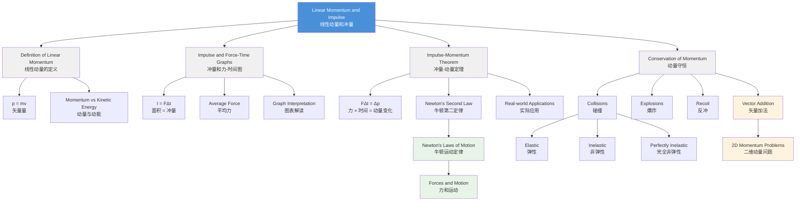

# 1. Overview / 概述

**English:** Linear momentum and impulse form a cornerstone of classical mechanics, bridging [[Newton's Laws of Motion]] with the analysis of collisions and interactions. Momentum quantifies the "quantity of motion" of an object, while impulse describes how force applied over time changes that motion. This topic is fundamental to understanding [[Conservation of Momentum]] in isolated systems, which is one of the most powerful and widely tested principles in both CAIE 9702 and Edexcel IAL. Real-world applications include car safety design (airbags, crumple zones), rocket propulsion, sports science (catching a ball, golf swing), and particle physics collisions. In examinations, this topic appears in multiple-choice, structured questions, and practical contexts, often requiring graph interpretation and vector reasoning.

**中文:** 线性动量和冲量构成了经典力学的基石，连接了[[牛顿运动定律]]与碰撞和相互作用的分析。动量量化了物体的"运动量"，而冲量描述了力随时间作用如何改变这种运动。该主题对于理解孤立系统中的[[动量守恒]]至关重要，这是CAIE 9702和Edexcel IAL考试中测试最频繁、最强大的原理之一。实际应用包括汽车安全设计（安全气囊、溃缩区）、火箭推进、运动科学（接球、高尔夫挥杆）以及粒子物理碰撞。在考试中，该主题出现在选择题、结构化问题和实验背景中，通常需要图表解释和矢量推理。

---

# 2. Syllabus Learning Objectives / 考纲学习目标

| CAIE 9702 (3.2 f-h) | Edexcel IAL (WPH11 U1: 2.11-2.14) |
|---|---|
| Define linear momentum and impulse | Define linear momentum as $p = mv$ |
| State and apply the principle of conservation of momentum | Define impulse as the product of force and time |
| Apply the impulse-momentum theorem | Apply the impulse-momentum theorem $Ft = \Delta p$ |
| Solve problems involving collisions and explosions | Interpret force-time graphs to determine impulse |
| Understand that momentum is a vector quantity | Solve problems involving conservation of momentum in one dimension |

> 📋 **CIE Only:** CAIE explicitly requires students to "state and apply the principle of conservation of momentum" and to solve problems involving both collisions and explosions. The concept of "elastic" vs "inelastic" collisions is tested more explicitly in CAIE.

> 📋 **Edexcel Only:** Edexcel places greater emphasis on interpreting [[Force-Time Graphs]] to find impulse (area under graph). Edexcel also explicitly tests the relationship $F = \frac{\Delta p}{\Delta t}$ as an alternative form of [[Newton's Second Law]].

**Examiner Expectations:**
- **English:** Students must treat momentum as a vector — sign conventions matter. In collision problems, always define a positive direction. For impulse, the area under a force-time graph is the key skill. Mark schemes reward clear vector notation (e.g., $+$ and $-$ signs).
- **中文:** 学生必须将动量视为矢量——符号约定很重要。在碰撞问题中，始终定义正方向。对于冲量，力-时间图下的面积是关键技能。评分标准奖励清晰的矢量符号（例如，$+$ 和 $-$ 符号）。

---

# 3. Core Definitions / 核心定义

| Term (EN/CN) | Definition (EN) | Definition (CN) | Common Mistakes / 常见错误 |
|---|---|---|---|
| [[Linear Momentum]] / 线性动量 | The product of an object's mass and its velocity; a vector quantity. $p = mv$ | 物体质量与其速度的乘积；矢量量。$p = mv$ | Confusing momentum with kinetic energy; forgetting vector nature (direction matters) |
| [[Impulse]] / 冲量 | The product of the average force acting on an object and the time for which it acts; equal to the change in momentum. $I = F\Delta t = \Delta p$ | 作用在物体上的平均力与其作用时间的乘积；等于动量变化。$I = F\Delta t = \Delta p$ | Thinking impulse is a force, not a change in momentum; forgetting units (N·s = kg·m/s) |
| [[Conservation of Momentum]] / 动量守恒 | In an isolated system (no external forces), the total momentum before an interaction equals the total momentum after the interaction. | 在孤立系统（无外力）中，相互作用前的总动量等于相互作用后的总动量。 | Applying conservation when external forces are present; forgetting vector addition |
| [[Elastic Collision]] / 弹性碰撞 | A collision in which both momentum AND kinetic energy are conserved. | 动量和动能都守恒的碰撞。 | Assuming all collisions are elastic; not checking kinetic energy separately |
| [[Inelastic Collision]] / 非弹性碰撞 | A collision in which momentum is conserved but kinetic energy is NOT conserved (some energy is converted to heat, sound, or deformation). | 动量守恒但动能不守恒的碰撞（部分能量转化为热能、声能或形变）。 | Thinking momentum is lost; not recognizing that perfectly inelastic means objects stick together |
| [[Newton's Second Law]] (alternative form) / 牛顿第二定律（替代形式） | The net force acting on an object is equal to the rate of change of its momentum. $F = \frac{\Delta p}{\Delta t}$ | 作用在物体上的净力等于其动量变化率。$F = \frac{\Delta p}{\Delta t}$ | Forgetting this applies to variable mass systems (e.g., rockets) |

---

# 4. Key Concepts Explained / 关键概念详解

## 4.1 Linear Momentum / 线性动量

### Explanation / 解释
**English:** [[Linear Momentum]] $p = mv$ is a vector quantity that describes how difficult it is to stop a moving object. A heavy truck moving slowly can have the same momentum as a small car moving fast. Momentum depends on both mass AND velocity — doubling either doubles the momentum. Because it's a vector, direction matters: two objects moving in opposite directions have momenta with opposite signs.

**中文:** 线性动量 $p = mv$ 是一个矢量量，描述了阻止运动物体的难度。缓慢移动的重型卡车可以与快速移动的小汽车具有相同的动量。动量取决于质量和速度——两者中任何一个加倍都会使动量加倍。由于它是矢量，方向很重要：两个相反方向运动的物体具有相反符号的动量。

### Physical Meaning / 物理意义
**English:** Momentum represents the "quantity of motion" that an object possesses. It is a conserved quantity in the universe — in any interaction, total momentum before equals total momentum after (if no external forces act). This conservation law is more fundamental than Newton's laws and applies even at the quantum level.

**中文:** 动量代表了物体拥有的"运动量"。它是宇宙中守恒的量——在任何相互作用中，总动量前后相等（如果没有外力作用）。这个守恒定律比牛顿定律更基本，甚至适用于量子层面。

### Common Misconceptions / 常见误区
- **Momentum vs Kinetic Energy:** Students often confuse momentum ($mv$) with kinetic energy ($\frac{1}{2}mv^2$). Momentum is a vector; kinetic energy is a scalar. An object can have zero momentum (at rest) but zero kinetic energy too — but a system can have zero total momentum while having non-zero total kinetic energy (e.g., two equal masses moving toward each other at same speed).
- **Momentum is "lost":** In inelastic collisions, momentum is conserved, but kinetic energy is not. Students often think momentum is lost when objects stick together — it's not, it's just redistributed.
- **Sign conventions:** Forgetting to assign positive/negative directions leads to sign errors in calculations.

### Exam Tips / 考试提示
**English:** Always draw a diagram showing velocities before and after the interaction. Label masses and velocities clearly. Define a positive direction at the start of your solution. Use vector notation: $v_1 = +5.0 \text{ m/s}$, $v_2 = -3.0 \text{ m/s}$.

**中文:** 始终绘制显示相互作用前后速度的图表。清晰标记质量和速度。在解题开始时定义正方向。使用矢量符号：$v_1 = +5.0 \text{ m/s}$，$v_2 = -3.0 \text{ m/s}$。

> 📷 **IMAGE PROMPT — [MOM-01]: Momentum Vector Diagram**
> **English:** A diagram showing two objects before and after a collision. Object A (mass 2 kg, velocity +3 m/s) and Object B (mass 1 kg, velocity -4 m/s) approaching each other. After collision, show velocities with arrows. Labels: masses, velocities with signs, positive direction arrow. Style: clean physics diagram, vector arrows proportional to magnitude. Exam importance: HIGH — essential for understanding vector nature.
> **中文:** 显示碰撞前后两个物体的图表。物体A（质量2kg，速度+3m/s）和物体B（质量1kg，速度-4m/s）相互接近。碰撞后，用箭头显示速度。标签：质量、带符号的速度、正方向箭头。风格：清晰的物理图表，矢量箭头与大小成比例。考试重要性：高——对理解矢量性质至关重要。

---

## 4.2 Impulse and Force-Time Graphs / 冲量和力-时间图

### Explanation / 解释
**English:** [[Impulse]] $I = F\Delta t$ is the product of force and the time over which it acts. When you catch a ball, you apply a force over a time interval — that's impulse. The impulse-momentum theorem states: $F\Delta t = \Delta p = mv - mu$. This means impulse equals the change in momentum. A [[Force-Time Graph]] shows how force varies during an interaction. The area under the graph equals the impulse (and thus the change in momentum).

**中文:** 冲量 $I = F\Delta t$ 是力与其作用时间的乘积。当你接球时，你施加了一个力在一段时间内——这就是冲量。冲量-动量定理指出：$F\Delta t = \Delta p = mv - mu$。这意味着冲量等于动量变化。力-时间图显示了力在相互作用过程中如何变化。图下的面积等于冲量（从而等于动量变化）。

### Physical Meaning / 物理意义
**English:** Impulse explains why "follow-through" matters in sports. A golfer who follows through applies the same force over a longer time, producing a larger impulse and thus a larger change in momentum (faster ball speed). Similarly, airbags increase the time over which the stopping force acts, reducing the average force and preventing injury.

**中文:** 冲量解释了为什么"随挥"在运动中很重要。随挥的高尔夫球手在更长时间内施加相同的力，产生更大的冲量，从而产生更大的动量变化（更快的球速）。类似地，安全气囊增加了制动力作用的时间，降低了平均力并防止受伤。

### Common Misconceptions / 常见误区
- **Impulse is a force:** Impulse is NOT a force — it's the product of force and time, with units N·s or kg·m/s.
- **Area under F-t graph is force:** The area is impulse (change in momentum), not force.
- **Constant force assumption:** Real collisions involve varying forces; the average force is used when the force is not constant.

### Exam Tips / 考试提示
**English:** For force-time graphs, calculate the area by counting squares or using geometric shapes (triangles, rectangles). Remember: area ABOVE the time axis is positive impulse; area BELOW is negative impulse. For "catching" problems, the impulse is the area under the force-time curve.

**中文:** 对于力-时间图，通过数方格或使用几何形状（三角形、矩形）计算面积。记住：时间轴上方的面积是正冲量；下方的面积是负冲量。对于"接球"问题，冲量是力-时间曲线下的面积。

> 📷 **IMAGE PROMPT — [IMP-01]: Force-Time Graph for a Collision**
> **English:** A force-time graph showing a collision. X-axis: time (s), Y-axis: force (N). The graph shows a sharp peak (triangular shape) representing the collision force. Shaded area under the curve labeled "Impulse = Area = Δp". Labels: F_max (peak force), Δt (collision duration), average force line (dashed). Style: graph paper background, clear axes with units. Exam importance: HIGH — frequently tested in both boards.
> **中文:** 显示碰撞的力-时间图。X轴：时间(s)，Y轴：力(N)。图表显示一个尖锐的峰值（三角形），代表碰撞力。曲线下的阴影区域标记为"冲量 = 面积 = Δp"。标签：F_max（峰值力），Δt（碰撞持续时间），平均力线（虚线）。风格：方格纸背景，清晰的坐标轴带单位。考试重要性：高——两个考试局都经常测试。

---

## 4.3 Impulse-Momentum Theorem / 冲量-动量定理

### Explanation / 解释
**English:** The [[Impulse-Momentum Theorem]] states that the impulse applied to an object equals its change in momentum: $F\Delta t = \Delta p = mv - mu$. This is derived directly from [[Newton's Second Law]]: $F = ma = m\frac{v-u}{\Delta t} = \frac{mv - mu}{\Delta t} = \frac{\Delta p}{\Delta t}$, so $F\Delta t = \Delta p$. This theorem is powerful because it relates force (a cause) to the resulting change in motion (an effect) without needing to know the details of acceleration.

**中文:** 冲量-动量定理指出，施加在物体上的冲量等于其动量变化：$F\Delta t = \Delta p = mv - mu$。这是直接从牛顿第二定律推导出来的：$F = ma = m\frac{v-u}{\Delta t} = \frac{mv - mu}{\Delta t} = \frac{\Delta p}{\Delta t}$，所以 $F\Delta t = \Delta p$。这个定理很强大，因为它将力（原因）与运动变化（结果）联系起来，而无需知道加速度的细节。

### Physical Meaning / 物理意义
**English:** The theorem explains why: (1) Catching a fast ball with bare hands hurts (short Δt → large F), but using a glove increases Δt → reduces F. (2) Car airbags increase collision time → reduce average force on passengers. (3) Jumping on a hard surface hurts more than on a soft mat — the soft mat increases stopping time.

**中文:** 该定理解释了为什么：(1) 徒手接快球会疼（短Δt → 大F），但使用手套增加Δt → 减少F。(2) 汽车安全气囊增加碰撞时间 → 减少对乘客的平均力。(3) 在坚硬表面上跳跃比在软垫上更疼——软垫增加了停止时间。

### Common Misconceptions / 常见误区
- **Impulse equals force:** No — impulse equals force × time, or change in momentum.
- **Only applies to constant force:** The theorem works for varying forces if you use average force.
- **Direction independence:** Impulse and momentum change are vectors — direction matters.

### Exam Tips / 考试提示
**English:** When solving impulse problems: (1) Identify initial and final velocities (with signs). (2) Calculate change in momentum $\Delta p = m(v-u)$. (3) If force is given, use $F = \frac{\Delta p}{\Delta t}$. If force-time graph is given, find area = impulse = $\Delta p$.

**中文:** 解决冲量问题时：(1) 确定初速度和末速度（带符号）。(2) 计算动量变化 $\Delta p = m(v-u)$。(3) 如果给定了力，使用 $F = \frac{\Delta p}{\Delta t}$。如果给定了力-时间图，求面积 = 冲量 = $\Delta p$。

---

## 4.4 Conservation of Momentum / 动量守恒

### Explanation / 解释
**English:** The principle of [[Conservation of Momentum]] states that in an isolated system (no external forces), the total momentum before an interaction equals the total momentum after the interaction. For two objects: $m_1u_1 + m_2u_2 = m_1v_1 + m_2v_2$. This applies to all interactions: collisions (elastic and inelastic), explosions, and recoil. It is a vector equation — direction matters.

**中文:** 动量守恒原理指出，在孤立系统（无外力）中，相互作用前的总动量等于相互作用后的总动量。对于两个物体：$m_1u_1 + m_2u_2 = m_1v_1 + m_2v_2$。这适用于所有相互作用：碰撞（弹性和非弹性）、爆炸和后坐力。这是一个矢量方程——方向很重要。

### Physical Meaning / 物理意义
**English:** This is one of the most fundamental conservation laws in physics. It arises from Newton's Third Law — during any interaction, the forces between objects are equal and opposite, so the impulses are equal and opposite, meaning momentum changes cancel out. The total momentum of the universe is constant.

**中文:** 这是物理学中最基本的守恒定律之一。它源于牛顿第三定律——在任何相互作用过程中，物体之间的力大小相等、方向相反，因此冲量大小相等、方向相反，意味着动量变化相互抵消。宇宙的总动量是恒定的。

### Common Misconceptions / 常见误区
- **Momentum is conserved in ALL collisions:** Yes, momentum is ALWAYS conserved in collisions (if no external forces). Kinetic energy may or may not be conserved.
- **Objects at rest have no momentum:** Correct individually, but a system can have zero total momentum while objects are moving (e.g., two equal masses moving toward each other).
- **Explosions violate conservation:** No — in an explosion, total momentum before (zero if at rest) equals total momentum after (vector sum of fragments' momenta).

### Exam Tips / 考试提示
**English:** Always: (1) Define positive direction. (2) Write conservation equation with signs. (3) Solve for unknown velocity. For explosions, initial momentum is often zero. For collisions, check if elastic (KE conserved) or inelastic (KE not conserved).

**中文:** 始终：(1) 定义正方向。(2) 写出带符号的守恒方程。(3) 求解未知速度。对于爆炸，初始动量通常为零。对于碰撞，检查是弹性（动能守恒）还是非弹性（动能不守恒）。

> 📷 **IMAGE PROMPT — [CON-01]: Conservation of Momentum in a Collision**
> **English:** A before-and-after diagram for a 1D collision. Before: two balls approaching each other with velocities u1 and u2. After: two balls moving apart with velocities v1 and v2. Arrows show direction and relative magnitude. Equation shown: m1u1 + m2u2 = m1v1 + m2v2. Labels: m1, m2, u1, u2, v1, v2, positive direction arrow. Style: clean physics diagram, vector arrows. Exam importance: HIGH — fundamental diagram for all collision problems.
> **中文:** 一维碰撞的前后对比图。碰撞前：两个球以速度u1和u2相互接近。碰撞后：两个球以速度v1和v2分开。箭头显示方向和相对大小。显示方程：m1u1 + m2u2 = m1v1 + m2v2。标签：m1, m2, u1, u2, v1, v2，正方向箭头。风格：清晰的物理图表，矢量箭头。考试重要性：高——所有碰撞问题的基本图表。

---

# 5. Essential Equations / 核心公式

## 5.1 Linear Momentum / 线性动量

$$ p = mv $$

| Symbol (符号) | Meaning (EN/CN) | Unit (单位) |
|---|---|---|
| $p$ | Linear momentum / 线性动量 | kg·m/s |
| $m$ | Mass / 质量 | kg |
| $v$ | Velocity / 速度 | m/s |

**Derivation:** Definition — no derivation required.
**Conditions:** Valid for all objects with mass. For relativistic speeds, use relativistic momentum.
**Limitations:** Only applies to classical mechanics (non-relativistic speeds).
**Rearrangements:** $m = \frac{p}{v}$, $v = \frac{p}{m}$

---

## 5.2 Impulse / 冲量

$$ I = F\Delta t = \Delta p = mv - mu $$

| Symbol (符号) | Meaning (EN/CN) | Unit (单位) |
|---|---|---|
| $I$ | Impulse / 冲量 | N·s (or kg·m/s) |
| $F$ | Average force / 平均力 | N |
| $\Delta t$ | Time interval / 时间间隔 | s |
| $\Delta p$ | Change in momentum / 动量变化 | kg·m/s |
| $m$ | Mass / 质量 | kg |
| $v$ | Final velocity / 末速度 | m/s |
| $u$ | Initial velocity / 初速度 | m/s |

**Derivation:** From [[Newton's Second Law]]: $F = ma = m\frac{v-u}{\Delta t} = \frac{mv - mu}{\Delta t} = \frac{\Delta p}{\Delta t}$, so $F\Delta t = \Delta p$.
**Conditions:** Valid for constant or average force. For varying force, use area under F-t graph.
**Limitations:** Assumes mass is constant (for variable mass systems like rockets, use $F = \frac{dp}{dt}$).
**Rearrangements:** $F = \frac{\Delta p}{\Delta t}$, $\Delta t = \frac{\Delta p}{F}$, $\Delta p = F\Delta t$

---

## 5.3 Conservation of Momentum / 动量守恒

$$ m_1u_1 + m_2u_2 = m_1v_1 + m_2v_2 $$

| Symbol (符号) | Meaning (EN/CN) | Unit (单位) |
|---|---|---|
| $m_1, m_2$ | Masses of objects 1 and 2 / 物体1和2的质量 | kg |
| $u_1, u_2$ | Initial velocities / 初速度 | m/s |
| $v_1, v_2$ | Final velocities / 末速度 | m/s |

**Derivation:** From Newton's Third Law: $F_{12} = -F_{21}$, so $F_{12}\Delta t = -F_{21}\Delta t$, meaning $\Delta p_1 = -\Delta p_2$, so $m_1v_1 - m_1u_1 = -(m_2v_2 - m_2u_2)$, rearranging gives $m_1u_1 + m_2u_2 = m_1v_1 + m_2v_2$.
**Conditions:** Only applies to isolated systems (no external forces). For systems with external forces, the total momentum is NOT conserved.
**Limitations:** Vector equation — must include signs for direction. Only valid in one dimension in its simple form; for 2D/3D, use component equations.
**Rearrangements:** $v_1 = \frac{m_1u_1 + m_2u_2 - m_2v_2}{m_1}$, etc.

---

## 5.4 Newton's Second Law (Alternative Form) / 牛顿第二定律（替代形式）

$$ F = \frac{\Delta p}{\Delta t} $$

| Symbol (符号) | Meaning (EN/CN) | Unit (单位) |
|---|---|---|
| $F$ | Net force / 净力 | N |
| $\Delta p$ | Change in momentum / 动量变化 | kg·m/s |
| $\Delta t$ | Time interval / 时间间隔 | s |

**Derivation:** Directly from $F = ma$ and $a = \frac{\Delta v}{\Delta t}$, so $F = m\frac{\Delta v}{\Delta t} = \frac{\Delta (mv)}{\Delta t} = \frac{\Delta p}{\Delta t}$.
**Conditions:** Valid for constant mass systems. For variable mass (rockets), use $F = \frac{dp}{dt}$.
**Limitations:** This form is more general than $F = ma$ because it applies to systems where mass changes.
**Rearrangements:** $\Delta p = F\Delta t$, $\Delta t = \frac{\Delta p}{F}$

---

## 5.5 Kinetic Energy in Collisions / 碰撞中的动能

$$ KE = \frac{1}{2}mv^2 $$

| Symbol (符号) | Meaning (EN/CN) | Unit (单位) |
|---|---|---|
| $KE$ | Kinetic energy / 动能 | J |
| $m$ | Mass / 质量 | kg |
| $v$ | Speed / 速率 | m/s |

**Derivation:** Standard kinetic energy formula.
**Conditions:** Used to check if a collision is elastic ($KE_{before} = KE_{after}$) or inelastic ($KE_{before} > KE_{after}$).
**Limitations:** Kinetic energy is a scalar — no direction involved. In inelastic collisions, the "lost" kinetic energy is converted to other forms (heat, sound, deformation).

---

# 6. Graphs and Relationships / 图表与关系

## 6.1 Force-Time Graph / 力-时间图

**Axes:** X-axis: Time (s), Y-axis: Force (N)

**Shape:** Typically a peak (for collisions) — can be triangular, rectangular, or irregular. For a constant force, it's a horizontal line.

**Gradient Meaning:** Rate of change of force (not directly tested in momentum context).

**Area Meaning:** The area under a force-time graph equals the impulse, which equals the change in momentum ($\Delta p$). This is the MOST important interpretation.

**English:** Area under F-t graph = Impulse = Change in momentum = $\Delta p$
**中文:** F-t图下的面积 = 冲量 = 动量变化 = $\Delta p$

**Exam Interpretation:**
- For a triangular peak: Area = $\frac{1}{2} \times \text{base} \times \text{height} = \frac{1}{2} \times \Delta t \times F_{max}$
- For a rectangular shape: Area = $\text{base} \times \text{height} = \Delta t \times F$
- For irregular shapes: Count squares or use trapezium rule
- Area above axis = positive impulse; area below = negative impulse

**Common Questions:**
- "Calculate the impulse from the graph" → find area
- "Determine the average force" → impulse ÷ time
- "Find the change in velocity" → impulse ÷ mass

> 📷 **IMAGE PROMPT — [FTG-01]: Force-Time Graph with Shaded Area**
> **English:** A force-time graph with a triangular peak. X-axis: time/s (0 to 0.10), Y-axis: force/N (0 to 500). The triangle has base Δt = 0.06 s and height F_max = 400 N. The area is shaded and labeled "Impulse = Area = ½ × 0.06 × 400 = 12 N·s". A dashed horizontal line shows the average force (200 N). Labels: F_max, Δt, average force. Style: graph paper, clear gridlines. Exam importance: HIGH — most common graph question in both boards.
> **中文:** 具有三角形峰值的力-时间图。X轴：时间/s（0到0.10），Y轴：力/N（0到500）。三角形底边Δt = 0.06 s，高度F_max = 400 N。面积被阴影覆盖并标记为"冲量 = 面积 = ½ × 0.06 × 400 = 12 N·s"。虚线水平线显示平均力（200 N）。标签：F_max，Δt，平均力。风格：方格纸，清晰的网格线。考试重要性：高——两个考试局最常见的图表问题。

---

## 6.2 Momentum-Time Graph / 动量-时间图

**Axes:** X-axis: Time (s), Y-axis: Momentum (kg·m/s)

**Shape:** For constant force, momentum changes linearly (straight line). For varying force, the graph is curved.

**Gradient Meaning:** The gradient of a momentum-time graph equals the net force acting on the object.

**English:** Gradient of p-t graph = Force = $\frac{\Delta p}{\Delta t}$
**中文:** p-t图的梯度 = 力 = $\frac{\Delta p}{\Delta t}$

**Area Meaning:** Area under a momentum-time graph has no standard physical meaning in this context.

**Exam Interpretation:**
- Steeper gradient → larger force
- Constant gradient → constant force
- Zero gradient → no net force (constant momentum)

**Common Questions:**
- "Determine the force acting on the object" → find gradient
- "Describe the motion" → relate gradient to force

---

## 6.3 Velocity-Time Graph for Collisions / 碰撞的速度-时间图

**Axes:** X-axis: Time (s), Y-axis: Velocity (m/s)

**Shape:** Before collision: constant velocity (horizontal line). During collision: rapid change (steep line). After collision: new constant velocity.

**Gradient Meaning:** Acceleration (during collision, gradient = $a = \frac{F}{m}$).

**Area Meaning:** Area under v-t graph = displacement (not directly momentum-related).

**Exam Interpretation:**
- The change in velocity ($\Delta v$) can be read directly
- Combined with mass, gives change in momentum
- The steepness of the line during collision relates to the force

---

# 7. Required Diagrams / 必备图表

## 7.1 Before-and-After Collision Diagram / 碰撞前后示意图

> 📷 **IMAGE PROMPT — [DIA-01]: 1D Collision Before and After**
> **English:** A two-panel diagram showing a 1D collision. LEFT PANEL (Before): Two objects on a horizontal line. Object A (mass m1 = 2 kg) moving right with velocity u1 = +3 m/s. Object B (mass m2 = 1 kg) moving left with velocity u2 = -4 m/s. Arrows above objects show velocity direction and magnitude. RIGHT PANEL (After): Two objects moving apart. Object A moving left with velocity v1 = -1 m/s, Object B moving right with velocity v2 = +4 m/s. Equation at bottom: m1u1 + m2u2 = m1v1 + m2v2. Labels: masses, velocities with signs, positive direction arrow (→). Style: clean physics diagram, vector arrows proportional to magnitude, color-coded (blue for A, red for B). Exam importance: HIGH — essential for all collision problems.
> **中文:** 显示一维碰撞的双面板图。左面板（碰撞前）：水平线上的两个物体。物体A（质量m1 = 2 kg）以速度u1 = +3 m/s向右移动。物体B（质量m2 = 1 kg）以速度u2 = -4 m/s向左移动。物体上方的箭头显示速度方向和大小。右面板（碰撞后）：两个物体分开。物体A以速度v1 = -1 m/s向左移动，物体B以速度v2 = +4 m/s向右移动。底部方程：m1u1 + m2u2 = m1v1 + m2v2。标签：质量、带符号的速度、正方向箭头（→）。风格：清晰的物理图表，矢量箭头与大小成比例，颜色编码（蓝色为A，红色为B）。考试重要性：高——所有碰撞问题的基本图表。

---

## 7.2 Force-Time Graph for Impulse / 冲量的力-时间图

> 📷 **IMAGE PROMPT — [DIA-02]: Force-Time Graph with Area Calculation**
> **English:** A force-time graph on graph paper. X-axis: time/ms (0 to 20), Y-axis: force/N (0 to 600). The graph shows a triangular peak from t=5ms to t=15ms, with maximum force 500N at t=10ms. The triangular area is shaded and labeled "Area = ½ × base × height = ½ × 0.010 × 500 = 2.5 N·s". A dashed horizontal line at 250N is labeled "Average force = 250 N". Below the graph, a calculation box shows: Impulse = Area = 2.5 N·s, Δp = 2.5 kg·m/s. Labels: F_max, Δt, average force, impulse. Style: graph paper background, clear gridlines, shaded area. Exam importance: HIGH — most common graph question.
> **中文:** 方格纸上的力-时间图。X轴：时间/ms（0到20），Y轴：力/N（0到600）。图表显示从t=5ms到t=15ms的三角形峰值，在t=10ms处最大力为500N。三角形区域被阴影覆盖并标记为"面积 = ½ × 底 × 高 = ½ × 0.010 × 500 = 2.5 N·s"。在250N处的虚线水平线标记为"平均力 = 250 N"。图表下方，计算框显示：冲量 = 面积 = 2.5 N·s，Δp = 2.5 kg·m/s。标签：F_max，Δt，平均力，冲量。风格：方格纸背景，清晰的网格线，阴影区域。考试重要性：高——最常见的图表问题。

---

## 7.3 Explosion / Recoil Diagram / 爆炸/反冲示意图

> 📷 **IMAGE PROMPT — [DIA-03]: Explosion/Recoil Diagram**
> **English:** A diagram showing an explosion or recoil scenario. CENTER: A stationary object (mass M = 5 kg) at rest before explosion. AFTER: Two fragments moving in opposite directions. Fragment 1 (mass m1 = 2 kg) moving right with velocity v1 = +3 m/s. Fragment 2 (mass m2 = 3 kg) moving left with velocity v2 = -2 m/s. Arrows show direction. Equation: 0 = m1v1 + m2v2 (since initial momentum = 0). Labels: masses, velocities with signs, "Before: at rest, total p = 0", "After: m1v1 + m2v2 = 0". Style: clean physics diagram, vector arrows, clear before/after separation. Exam importance: HIGH — common for explosions, gun recoil, radioactive decay problems.
> **中文:** 显示爆炸或反冲场景的图表。中心：爆炸前静止的物体（质量M = 5 kg）。爆炸后：两个碎片向相反方向运动。碎片1（质量m1 = 2 kg）以速度v1 = +3 m/s向右移动。碎片2（质量m2 = 3 kg）以速度v2 = -2 m/s向左移动。箭头显示方向。方程：0 = m1v1 + m2v2（因为初始动量 = 0）。标签：质量、带符号的速度、"碰撞前：静止，总p = 0"、"碰撞后：m1v1 + m2v2 = 0"。风格：清晰的物理图表，矢量箭头，清晰的前后分离。考试重要性：高——常见于爆炸、枪反冲、放射性衰变问题。

---

# 8. Worked Examples / 典型例题

## Example 1: Collision Problem / 碰撞问题

### Question / 题目
**English:** A trolley A of mass 2.0 kg moves at 3.0 m/s towards the right and collides with a stationary trolley B of mass 1.0 kg. After the collision, trolley A moves to the left at 1.0 m/s. Calculate:
(a) The velocity of trolley B after the collision
(b) The impulse experienced by trolley B
(c) Show whether the collision is elastic or inelastic

**中文:** 质量为2.0 kg的小车A以3.0 m/s的速度向右运动，与质量为1.0 kg的静止小车B碰撞。碰撞后，小车A以1.0 m/s的速度向左运动。计算：
(a) 碰撞后小车B的速度
(b) 小车B受到的冲量
(c) 判断该碰撞是弹性还是非弹性

### Image Prompt / 图片提示
> 📷 **IMAGE PROMPT — [EX-01]: Trolley Collision Diagram**
> **English:** Before-and-after diagram for the trolley collision. Before: Trolley A (2 kg) moving right at 3 m/s, Trolley B (1 kg) stationary. After: Trolley A moving left at 1 m/s, Trolley B moving right at unknown velocity v. Positive direction arrow pointing right. Labels: masses, velocities. Style: simple physics diagram. Exam importance: HIGH.
> **中文:** 小车碰撞的前后对比图。碰撞前：小车A（2 kg）以3 m/s向右运动，小车B（1 kg）静止。碰撞后：小车A以1 m/s向左运动，小车B以未知速度v向右运动。正方向箭头指向右。标签：质量、速度。风格：简单的物理图表。考试重要性：高。

### Solution / 解答

**Step 1: Define positive direction / 定义正方向**
Let right be positive. / 设向右为正方向。

**Step 2: Write known values / 写出已知值**
$m_A = 2.0 \text{ kg}$, $m_B = 1.0 \text{ kg}$
$u_A = +3.0 \text{ m/s}$, $u_B = 0 \text{ m/s}$
$v_A = -1.0 \text{ m/s}$ (moving left = negative)
$v_B = ?$

**Step 3: Apply conservation of momentum / 应用动量守恒**
$$m_A u_A + m_B u_B = m_A v_A + m_B v_B$$

$$(2.0)(+3.0) + (1.0)(0) = (2.0)(-1.0) + (1.0)(v_B)$$

$$6.0 = -2.0 + v_B$$

$$v_B = 8.0 \text{ m/s}$$

**Step 4: Calculate impulse on trolley B / 计算小车B的冲量**
$$I = \Delta p_B = m_B v_B - m_B u_B = (1.0)(8.0) - (1.0)(0) = 8.0 \text{ N·s}$$

**Step 5: Check if collision is elastic / 检查碰撞是否弹性**
Calculate total kinetic energy before:
$$KE_{before} = \frac{1}{2}m_A u_A^2 + \frac{1}{2}m_B u_B^2 = \frac{1}{2}(2.0)(3.0)^2 + 0 = 9.0 \text{ J}$$

Calculate total kinetic energy after:
$$KE_{after} = \frac{1}{2}m_A v_A^2 + \frac{1}{2}m_B v_B^2 = \frac{1}{2}(2.0)(-1.0)^2 + \frac{1}{2}(1.0)(8.0)^2 = 1.0 + 32.0 = 33.0 \text{ J}$$

Since $KE_{before} \neq KE_{after}$, the collision is **inelastic**.

### Final Answer / 最终答案
(a) $v_B = 8.0 \text{ m/s}$ to the right / 向右
(b) $I = 8.0 \text{ N·s}$ to the right / 向右
(c) The collision is **inelastic** because kinetic energy is not conserved (9.0 J → 33.0 J). / 碰撞是非弹性的，因为动能不守恒（9.0 J → 33.0 J）。

### Examiner Notes / 考官点评
**English:** Common mistakes: (1) Forgetting sign convention — $v_A$ must be negative. (2) Using $v_A = +1.0$ instead of $-1.0$. (3) For impulse, using $F\Delta t$ without calculating $\Delta p$. (4) For elastic check, forgetting to calculate BOTH before and after KE. Note: The kinetic energy increased! This is impossible in a real collision — it suggests the problem data is unrealistic (KE cannot increase without external work). In real exam problems, KE will either be conserved (elastic) or decrease (inelastic).

**中文:** 常见错误：(1) 忘记符号约定——$v_A$ 必须为负。(2) 使用 $v_A = +1.0$ 而不是 $-1.0$。(3) 对于冲量，使用 $F\Delta t$ 而不计算 $\Delta p$。(4) 对于弹性检查，忘记计算碰撞前后的动能。注意：动能增加了！这在真实碰撞中是不可能的——这表明问题数据不现实（没有外部做功，动能不可能增加）。在真实考试问题中，动能要么守恒（弹性），要么减少（非弹性）。

---

## Example 2: Force-Time Graph Problem / 力-时间图问题

### Question / 题目
**English:** A ball of mass 0.50 kg is dropped from rest and hits the ground. The force-time graph for the impact is shown below. The ball is in contact with the ground for 0.040 s. The maximum force during impact is 150 N. The graph has a triangular shape.
(a) Calculate the impulse exerted on the ball by the ground.
(b) Determine the change in velocity of the ball during the impact.
(c) If the ball rebounds with a speed of 4.0 m/s, calculate the speed just before impact.

**中文:** 一个质量为0.50 kg的球从静止释放并撞击地面。撞击的力-时间图如下所示。球与地面接触时间为0.040 s。撞击期间的最大力为150 N。图形呈三角形。
(a) 计算地面对球施加的冲量。
(b) 确定撞击期间球的速度变化。
(c) 如果球以4.0 m/s的速度反弹，计算撞击前的速度。

### Image Prompt / 图片提示
> 📷 **IMAGE PROMPT — [EX-02]: Force-Time Graph for Ball Impact**
> **English:** A triangular force-time graph. X-axis: time/s (0 to 0.040), Y-axis: force/N (0 to 160). Triangle starts at (0,0), peaks at (0.020, 150), ends at (0.040, 0). Area shaded. Labels: F_max = 150 N, Δt = 0.040 s, "Area = Impulse". Style: graph paper, clear gridlines. Exam importance: HIGH.
> **中文:** 三角形力-时间图。X轴：时间/s（0到0.040），Y轴：力/N（0到160）。三角形从(0,0)开始，在(0.020, 150)达到峰值，在(0.040, 0)结束。面积被阴影覆盖。标签：F_max = 150 N，Δt = 0.040 s，"面积 = 冲量"。风格：方格纸，清晰的网格线。考试重要性：高。

### Solution / 解答

**Step 1: Calculate impulse from area / 从面积计算冲量**
For a triangle: Area = $\frac{1}{2} \times \text{base} \times \text{height}$

$$I = \frac{1}{2} \times \Delta t \times F_{max} = \frac{1}{2} \times 0.040 \times 150 = 3.0 \text{ N·s}$$

**Step 2: Calculate change in velocity / 计算速度变化**
From impulse-momentum theorem: $I = \Delta p = m\Delta v$

$$\Delta v = \frac{I}{m} = \frac{3.0}{0.50} = 6.0 \text{ m/s}$$

**Step 3: Find speed just before impact / 求撞击前的速度**
Let $u$ = velocity just before impact (downward = negative), $v$ = velocity just after impact (upward = positive = +4.0 m/s)

$$\Delta v = v - u$$
$$6.0 = (+4.0) - u$$
$$u = 4.0 - 6.0 = -2.0 \text{ m/s}$$

Speed just before impact = $|u| = 2.0 \text{ m/s}$ (downward)

### Final Answer / 最终答案
(a) $I = 3.0 \text{ N·s}$ (upward)
(b) $\Delta v = 6.0 \text{ m/s}$ (upward)
(c) Speed just before impact = $2.0 \text{ m/s}$ (downward)

### Examiner Notes / 考官点评
**English:** Key points: (1) The area of a triangle is $\frac{1}{2}bh$, not $bh$. (2) Impulse is upward (force from ground is upward), so $\Delta v$ is upward. (3) Sign convention is critical: if upward is positive, then $v = +4.0$ and $u$ will be negative. (4) The question asks for "speed" in part (c), so give magnitude only. Common error: using $I = F\Delta t$ with $F = 150$ N (the maximum force, not the average force). The average force for a triangle is $\frac{F_{max}}{2} = 75$ N, and $I = 75 \times 0.040 = 3.0$ N·s — same answer.

**中文:** 关键点：(1) 三角形的面积是 $\frac{1}{2}bh$，不是 $bh$。(2) 冲量向上（来自地面的力向上），所以 $\Delta v$ 向上。(3) 符号约定至关重要：如果向上为正，则 $v = +4.0$，$u$ 将为负。(4) 第(c)问要求"速率"，所以只给大小。常见错误：使用 $I = F\Delta t$ 且 $F = 150$ N（最大力，不是平均力）。三角形的平均力是 $\frac{F_{max}}{2} = 75$ N，$I = 75 \times 0.040 = 3.0$ N·s——答案相同。

---

# 9. Past Paper Question Types / 历年真题题型

| Question Type / 题型 | Frequency / 频率 | Difficulty / 难度 | Past Paper References / 真题索引 |
|---|---|---|---|
| Conservation of momentum in 1D collisions | Very High / 非常高 | Medium / 中等 | 📝 *待填入* |
| Impulse from force-time graphs | High / 高 | Medium / 中等 | 📝 *待填入* |
| Explosion/recoil problems | High / 高 | Easy-Medium / 简单-中等 | 📝 *待填入* |
| Elastic vs inelastic collision determination | Medium / 中等 | Medium / 中等 | 📝 *待填入* |
| Impulse-momentum theorem applications | High / 高 | Medium / 中等 | 📝 *待填入* |
| Multi-stage momentum problems | Medium / 中等 | Hard / 困难 | 📝 *待填入* |
| Vector momentum (2D) problems | Low (CAIE) / 低 | Hard / 困难 | 📝 *待填入* |
| Practical: measuring momentum in collisions | Low / 低 | Medium / 中等 | 📝 *待填入* |

> 📝 **题库整理中 / Question Bank Under Construction:** Specific past paper references (e.g., CAIE 9702/22/M/J/19 Q3, Edexcel WPH11/01 Jan 2020 Q12) will be added as the knowledge graph grows. For now, focus on the question types and their frequency. / 具体的历年真题索引（例如 CAIE 9702/22/M/J/19 Q3, Edexcel WPH11/01 Jan 2020 Q12）将随着知识图谱的增长而添加。目前，请关注题型及其频率。

**Common Command Words / 常见指令词:**
| English | 中文 | Meaning / 含义 |
|---|---|---|
| Calculate / 计算 | 计算 | Use equations to find a numerical value |
| Determine / 确定 | 确定 | Find a value using given data or graph |
| Show that / 证明 | 证明 | Demonstrate a result using calculations |
| State / 陈述 | 陈述 | Write a definition or principle without explanation |
| Explain / 解释 | 解释 | Give reasons or describe the physics |
| Sketch / 草图 | 草图 | Draw a graph showing general shape, not exact values |
| Deduce / 推导 | 推导 | Reach a conclusion from given information |

---

# 10. Practical Skills Connections / 实验技能链接

**English:** Momentum and impulse experiments are common in both CAIE Paper 3/5 and Edexcel Unit 3/6 practical assessments.

**Key Experiments:**
1. **Linear air track collisions:** Use light gates and data loggers to measure velocities before and after collisions. Verify conservation of momentum. Measure masses and velocities to calculate momentum.
2. **Trolley collisions on a runway:** Use ticker timers or motion sensors to record velocities. Investigate elastic vs inelastic collisions.
3. **Force sensor impact:** Use a force sensor connected to a data logger to record force-time graphs during impacts. Calculate impulse from area under graph.
4. **Ball drop rebound:** Drop a ball onto a force plate. Record force-time graph. Calculate impulse and compare with change in momentum from velocity measurements.

**Measurements and Uncertainties:**
- Mass: measured with balance (uncertainty ±0.1 g or ±0.01 g)
- Velocity: measured with light gates (uncertainty depends on gate spacing and timer resolution)
- Time: measured with stopwatch or data logger (uncertainty ±0.01 s or better)
- Force: measured with force sensor (uncertainty depends on calibration)

**Graph Plotting:**
- Plot momentum before vs momentum after to verify conservation (should be straight line through origin with gradient 1)
- Plot force-time graphs and calculate area using trapezium rule or counting squares
- Plot velocity-time graphs to find acceleration and hence force

**Experimental Design Considerations:**
- Minimize friction (use air track or lubricated runway)
- Use light gates for precise velocity measurement
- Ensure collisions are head-on (1D) for simple analysis
- Repeat measurements to reduce random errors
- Account for systematic errors (e.g., friction, air resistance)

**中文:** 动量和冲量实验在CAIE Paper 3/5和Edexcel Unit 3/6的实践评估中都很常见。

**关键实验：**
1. **线性气轨碰撞：** 使用光门和数据记录器测量碰撞前后的速度。验证动量守恒。测量质量和速度以计算动量。
2. **跑道上的小车碰撞：** 使用打点计时器或运动传感器记录速度。研究弹性与非弹性碰撞。
3. **力传感器冲击：** 使用连接到数据记录器的力传感器记录冲击过程中的力-时间图。从图下面积计算冲量。
4. **球下落反弹：** 将球落到力板上。记录力-时间图。计算冲量并与速度测量得到的动量变化进行比较。

**测量和不确定度：**
- 质量：用天平测量（不确定度 ±0.1 g 或 ±0.01 g）
- 速度：用光门测量（不确定度取决于光门间距和计时器分辨率）
- 时间：用秒表或数据记录器测量（不确定度 ±0.01 s 或更好）
- 力：用力传感器测量（不确定度取决于校准）

**图表绘制：**
- 绘制碰撞前动量与碰撞后动量的关系图以验证守恒（应为通过原点、梯度为1的直线）
- 绘制力-时间图并使用梯形法则或数方格计算面积
- 绘制速度-时间图以找到加速度，从而找到力

**实验设计考虑：**
- 最小化摩擦（使用气轨或润滑跑道）
- 使用光门进行精确的速度测量
- 确保碰撞是正碰（一维）以便简单分析
- 重复测量以减少随机误差
- 考虑系统误差（例如摩擦、空气阻力）

> 📋 **CIE Only:** CAIE Paper 3 (AS) and Paper 5 (A2) may include planning questions involving momentum experiments. Paper 5 often requires designing an experiment to verify conservation of momentum or to investigate elastic collisions.

> 📋 **Edexcel Only:** Edexcel Unit 3 (AS) and Unit 6 (A2) practical exams may include core practicals on momentum. The "Core Practical 4: Investigate the relationship between force and change in momentum" is specifically required.

---

# 11. Concept Map / 概念图谱



**Prerequisites:** [[Newton's Laws of Motion]], [[Forces and Motion]]
**Related Topics:** [[Conservation of Momentum]], [[Kinetic Energy]], [[Vector Addition]]
**Sub-topics:** [[Definition of Linear Momentum]], [[Impulse and Force-Time Graphs]], [[Impulse-Momentum Theorem]]

---

# 12. Examiner Insights / 考官洞察

**English:**

**Most Tested Ideas (CAIE 9702):**
1. **Conservation of momentum in 1D collisions** — appears in almost every exam. Usually involves two objects colliding, with one unknown velocity to find.
2. **Impulse from force-time graphs** — calculating area under triangular or irregular graphs.
3. **Elastic vs inelastic collisions** — checking whether kinetic energy is conserved.
4. **Explosion/recoil problems** — often with a gun and bullet or a stationary object splitting into fragments.

**Most Tested Ideas (Edexcel IAL):**
1. **Impulse-momentum theorem** — $F\Delta t = \Delta p$ applied to various scenarios.
2. **Force-time graph interpretation** — area = impulse, average force calculation.
3. **Conservation of momentum** — 1D collisions and explosions.
4. **Newton's Second Law in terms of momentum** — $F = \frac{\Delta p}{\Delta t}$.

**Mark Scheme Wording (Key Phrases That Earn Marks):**
- "Momentum is conserved because no external forces act" / "动量守恒，因为没有外力作用"
- "Impulse = area under force-time graph" / "冲量 = 力-时间图下的面积"
- "Change in momentum = $mv - mu$" / "动量变化 = $mv - mu$"
- "Total momentum before = total momentum after" / "碰撞前总动量 = 碰撞后总动量"
- "Vector quantity — direction must be considered" / "矢量量——必须考虑方向"

**Common Ways Marks Are Lost:**
1. **Sign errors:** Not defining a positive direction or using inconsistent signs.
2. **Unit errors:** Writing impulse in N (should be N·s) or momentum in kg·m/s².
3. **Confusing momentum and kinetic energy:** Using $\frac{1}{2}mv^2$ when $mv$ is needed.
4. **Forgetting vector nature:** Treating momentum as a scalar.
5. **Incomplete conservation equation:** Only considering one object instead of the system.
6. **Graph errors:** Calculating area incorrectly (e.g., using $bh$ instead of $\frac{1}{2}bh$ for triangles).

**High-Scoring Structures:**
- **Step 1:** Define positive direction clearly.
- **Step 2:** Write the conservation equation with all terms.
- **Step 3:** Substitute values with correct signs.
- **Step 4:** Solve algebraically before substituting numbers.
- **Step 5:** State final answer with direction and units.
- **Step 6:** For elastic check, calculate KE before and after separately.

**中文：**

**最常考的概念（CAIE 9702）：**
1. **一维碰撞中的动量守恒** — 几乎每次考试都会出现。通常涉及两个物体碰撞，需要求一个未知速度。
2. **力-时间图的冲量** — 计算三角形或不规则图形下的面积。
3. **弹性与非弹性碰撞** — 检查动能是否守恒。
4. **爆炸/反冲问题** — 通常涉及枪和子弹，或静止物体分裂成碎片。

**最常考的概念（Edexcel IAL）：**
1. **冲量-动量定理** — $F\Delta t = \Delta p$ 应用于各种场景。
2. **力-时间图解读** — 面积 = 冲量，平均力计算。
3. **动量守恒** — 一维碰撞和爆炸。
4. **用动量表示的牛顿第二定律** — $F = \frac{\Delta p}{\Delta t}$。

**评分标准关键词（能得分的短语）：**
- "动量守恒，因为没有外力作用"
- "冲量 = 力-时间图下的面积"
- "动量变化 = $mv - mu$"
- "碰撞前总动量 = 碰撞后总动量"
- "矢量量——必须考虑方向"

**常见的失分点：**
1. **符号错误：** 没有定义正方向或使用不一致的符号。
2. **单位错误：** 将冲量写成N（应为N·s）或将动量写成kg·m/s²。
3. **混淆动量和动能：** 在需要$mv$时使用$\frac{1}{2}mv^2$。
4. **忘记矢量性质：** 将动量视为标量。
5. **不完整的守恒方程：** 只考虑一个物体而不是系统。
6. **图表错误：** 面积计算错误（例如，三角形使用$bh$而不是$\frac{1}{2}bh$）。

**高分答题结构：**
- **步骤1：** 清晰定义正方向。
- **步骤2：** 写出包含所有项的守恒方程。
- **步骤3：** 代入带有正确符号的值。
- **步骤4：** 在代入数字之前先进行代数求解。
- **步骤5：** 写出带有方向和单位的最终答案。
- **步骤6：** 对于弹性检查，分别计算碰撞前后的动能。

---

# 13. Quick Revision Sheet / 速查表

| Category / 类别 | Key Points / 要点 |
|---|---|
| **Linear Momentum / 线性动量** | $p = mv$ (vector). Units: kg·m/s. Direction matters. / $p = mv$（矢量）。单位：kg·m/s。方向很重要。 |
| **Impulse / 冲量** | $I = F\Delta t = \Delta p$. Units: N·s = kg·m/s. Area under F-t graph. / $I = F\Delta t = \Delta p$。单位：N·s = kg·m/s。F-t图下的面积。 |
| **Impulse-Momentum Theorem / 冲量-动量定理** | $F\Delta t = mv - mu$. Force × time = change in momentum. / $F\Delta t = mv - mu$。力 × 时间 = 动量变化。 |
| **Conservation of Momentum / 动量守恒** | $m_1u_1 + m_2u_2 = m_1v_1 + m_2v_2$. Only in isolated systems (no external forces). / $m_1u_1 + m_2u_2 = m_1v_1 + m_2v_2$。仅适用于孤立系统（无外力）。 |
| **Elastic Collision / 弹性碰撞** | Momentum conserved AND kinetic energy conserved. / 动量守恒且动能守恒。 |
| **Inelastic Collision / 非弹性碰撞** | Momentum conserved, kinetic energy NOT conserved. / 动量守恒，动能不守恒。 |
| **Perfectly Inelastic / 完全非弹性** | Objects stick together after collision. Maximum KE loss. / 碰撞后物体粘在一起。动能损失最大。 |
| **Explosion/Recoil / 爆炸/反冲** | Initial momentum = 0. Fragments move in opposite directions. / 初始动量 = 0。碎片向相反方向运动。 |
| **Newton's Second Law (momentum form) / 牛顿第二定律（动量形式）** | $F = \frac{\Delta p}{\Delta t}$. Net force = rate of change of momentum. / $F = \frac{\Delta p}{\Delta t}$。净力 = 动量变化率。 |
| **Force-Time Graph / 力-时间图** | Area = Impulse = $\Delta p$. Gradient = rate of change of force. / 面积 = 冲量 = $\Delta p$。梯度 = 力的变化率。 |
| **Momentum-Time Graph / 动量-时间图** | Gradient = Net force. / 梯度 = 净力。 |
| **Key Units / 关键单位** | Momentum: kg·m/s. Impulse: N·s. Force: N. Time: s. Mass: kg. Velocity: m/s. / 动量：kg·m/s。冲量：N·s。力：N。时间：s。质量：kg。速度：m/s。 |
| **Common Equations / 常见方程** | $p = mv$, $I = F\Delta t = \Delta p$, $m_1u_1 + m_2u_2 = m_1v_1 + m_2v_2$, $F = \frac{\Delta p}{\Delta t}$, $KE = \frac{1}{2}mv^2$ |
| **Exam Tips / 考试提示** | 1. Define positive direction. 2. Use signs for velocities. 3. Check units. 4. For graphs, area = impulse. 5. For collisions, check KE for elastic/inelastic. / 1. 定义正方向。2. 速度使用符号。3. 检查单位。4. 对于图表，面积 = 冲量。5. 对于碰撞，检查动能以判断弹性/非弹性。 |

---

# 14. Metadata / 元数据

```yaml
title:
  en: "Linear Momentum and Impulse"
  cn: "线性动量和冲量"
subject: Physics
syllabus: [CAIE 9702, Edexcel IAL]
cie_ref: "3.2 (f-h)"
edexcel_ref: "WPH11 U1: 2.11-2.14"
level: AS
node_type: topic_hub
difficulty: intermediate
prerequisites:
  - "Newton's Laws of Motion"
  - "Forces and Motion"
related_topics:
  - "Conservation of Momentum"
  - "Kinetic Energy"
  - "Vector Addition"
sub_topics:
  - "Definition of Linear Momentum"
  - "Impulse and Force-Time Graphs"
  - "Impulse-Momentum Theorem"
formula_count: 5
diagram_count: 7
exam_frequency: very_high
language: bilingual_en_cn
last_updated: 2024-01
```

---

> 📷 **IMAGE PROMPT — [COVER-01]: Topic Cover Image**
> **English:** A composite image showing momentum and impulse concepts. Left: two colliding billiard balls with velocity vectors. Center: a force-time graph with shaded area. Right: a car with airbag deploying. Text overlay: "Linear Momentum and Impulse / 线性动量和冲量". Style: clean educational graphic, blue and white color scheme. Exam importance: HIGH — visual summary of the topic.
> **中文:** 显示动量和冲量概念的合成图像。左：两个碰撞的台球，带有速度矢量。中：带有阴影区域的力-时间图。右：安全气囊展开的汽车。文字叠加："Linear Momentum and Impulse / 线性动量和冲量"。风格：清晰的教育图形，蓝白配色。考试重要性：高——该主题的视觉总结。