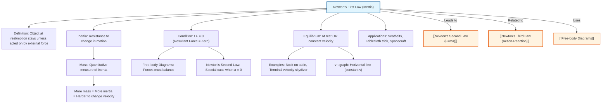

# 1. Overview / 概述

**English:**
Newton's First Law of Motion, also known as the **Law of Inertia**, is the foundational principle of classical mechanics. It states that an object at rest stays at rest, and an object in motion stays in motion with the same speed and in the same direction, unless acted upon by an **unbalanced external force**. This law introduces the concept of **inertia** — the natural tendency of objects to resist changes in their state of motion. It is the gateway to understanding [[Newton's Second Law (F=ma)]] and [[Newton's Third Law (Action-Reaction)]], and it establishes the conditions for **equilibrium** (net force = 0). For A-Level students, mastering this law is essential for analyzing forces using [[Free-body Diagrams]] and for understanding why seatbelts, airbags, and friction are necessary in everyday life.

**中文:**
牛顿第一运动定律，也称为**惯性定律**，是经典力学的基础原理。它指出：一切物体在没有受到**不平衡外力**作用时，总保持静止状态或匀速直线运动状态。这一定律引入了**惯性**的概念——物体抵抗运动状态改变的自然倾向。它是理解[[牛顿第二定律 (F=ma)]]和[[牛顿第三定律 (作用力与反作用力)]]的入门，并确立了**平衡**（合力为零）的条件。对于A-Level学生来说，掌握这一定律对于使用[[受力分析图]]分析力以及理解为什么安全带、安全气囊和摩擦力在日常生活中必不可少至关重要。

---

# 2. Syllabus Learning Objectives / 考纲学习目标

| CAIE 9702 (3.2 d-e) | Edexcel IAL (WPH11 U1: 2.7-2.10) |
|-----------|-------------|
| State and apply Newton's First Law of Motion | State Newton's First Law of Motion |
| Define and apply the concept of inertia | Explain the concept of inertia |
| Describe the motion of objects in the absence of external forces | Apply Newton's First Law to explain everyday situations (e.g., seatbelts, tablecloth trick) |
| Distinguish between mass and weight in the context of inertia | Understand that mass is a measure of inertia |

**Examiner Expectations / 考官期望:**
- **English:** You must be able to state the law **exactly** as written in the syllabus. You must be able to apply it to **qualitative** situations (e.g., "Why does a passenger lurch forward when a bus brakes suddenly?"). You must understand that **mass is the quantitative measure of inertia** — larger mass = greater inertia. You should NOT confuse inertia with momentum or force.
- **中文:** 你必须能够**准确**陈述定律原文。你必须能够将其应用于**定性**情境（例如：“为什么公交车突然刹车时乘客会向前倾倒？”）。你必须理解**质量是惯性的定量量度**——质量越大，惯性越大。你不应将惯性误认为动量或力。

---

# 3. Core Definitions / 核心定义

| Term (EN/CN) | Definition (EN) | Definition (CN) | Common Mistakes / 常见错误 |
|--------------|-----------------|-----------------|---------------------------|
| **Newton's First Law** / 牛顿第一定律 | An object at rest stays at rest, and an object in motion stays in motion with constant velocity, unless acted upon by a resultant external force. | 一切物体在没有受到合力外力作用时，总保持静止状态或匀速直线运动状态。 | ❌ Saying "constant speed" instead of "constant velocity" (direction matters). / 错误：说“匀速”而不是“恒定速度”（方向很重要）。 |
| **Inertia** / 惯性 | The natural tendency of an object to resist any change in its state of motion (i.e., its velocity). | 物体抵抗其运动状态（即速度）改变的自然倾向。 | ❌ Thinking inertia is a force. It is NOT a force — it is a property of matter. / 错误：认为惯性是一种力。它不是力——它是物质的一种属性。 |
| **Mass** / 质量 | The quantity of matter in an object; the **quantitative measure of inertia**. | 物体所含物质的多少；**惯性的定量量度**。 | ❌ Confusing mass with weight. Mass is constant; weight depends on gravity. / 错误：混淆质量和重量。质量是恒定的；重量取决于重力。 |
| **Equilibrium** / 平衡 | A state where the resultant (net) force on an object is zero, so the object is either at rest or moving with constant velocity. | 物体所受合力为零的状态，此时物体要么静止，要么做匀速直线运动。 | ❌ Thinking equilibrium only means "at rest". It also includes constant velocity motion. / 错误：认为平衡只意味着“静止”。它还包括匀速运动。 |
| **Resultant Force** / 合力 | The single force that has the same effect as all the individual forces acting on an object combined. | 与作用在物体上的所有单个力的总效果相同的单一力。 | ❌ Forgetting to consider direction when adding forces. / 错误：在力的合成时忘记考虑方向。 |

---

# 4. Key Concepts Explained / 关键概念详解

## 4.1 The Law of Inertia / 惯性定律

### Explanation / 解释
**English:**
Newton's First Law is often called the **Law of Inertia**. It describes what happens when the **resultant force** on an object is **zero**. In such a case:
- If the object is **at rest**, it will remain at rest.
- If the object is **moving**, it will continue moving with **constant velocity** (same speed, same direction).

This seems obvious today, but before Newton, people (following Aristotle) believed that a force was needed to keep an object moving. Galileo and Newton realized that **friction** and **air resistance** are forces that slow things down — in the absence of ALL forces, motion continues forever. This is the principle behind objects in space: a spacecraft with its engines off will coast forever at constant velocity.

**中文:**
牛顿第一定律常被称为**惯性定律**。它描述了当物体所受**合力**为**零**时会发生什么。在这种情况下：
- 如果物体**静止**，它将保持静止。
- 如果物体**运动**，它将保持**匀速直线运动**（速度大小和方向都不变）。

这在今天看来显而易见，但在牛顿之前，人们（遵循亚里士多德的观点）认为需要力才能维持物体的运动。伽利略和牛顿意识到**摩擦力**和**空气阻力**是使物体减速的力——在完全没有力的情况下，运动会永远持续下去。这就是太空中物体的原理：关闭发动机的航天器将以恒定速度永远滑行。

### Physical Meaning / 物理意义
**English:**
The physical meaning of Newton's First Law is that **objects are "lazy"** — they don't want to change their motion. This "laziness" is called **inertia**. The more mass an object has, the more inertia it has, and the harder it is to start it moving, stop it, or change its direction. This is why it's harder to push a heavy box than a light one.

**中文:**
牛顿第一定律的物理意义是**物体是“懒惰的”**——它们不想改变自己的运动状态。这种“懒惰”被称为**惯性**。物体的质量越大，其惯性就越大，就越难使其开始运动、停止或改变方向。这就是为什么推一个重箱子比推一个轻箱子更难。

### Common Misconceptions / 常见误区
- ❌ **"Inertia is a force that keeps things moving."** — NO. Inertia is NOT a force. It is a property of matter. / 惯性不是力，它是物质的一种属性。
- ❌ **"If an object is moving, there must be a force acting on it."** — NO. An object can move with constant velocity with zero net force. / 物体可以以恒定速度运动而合力为零。
- ❌ **"Inertia is the same as momentum."** — NO. Inertia is about resistance to change; momentum ($p=mv$) is about the quantity of motion. / 惯性是关于抵抗变化；动量 ($p=mv$) 是关于运动的量。
- ❌ **"An object at rest has no inertia."** — NO. All objects with mass have inertia, whether moving or not. / 所有有质量的物体都有惯性，无论是否在运动。

### Exam Tips / 考试提示
- **English:** When answering "explain" questions about Newton's First Law, always mention **inertia** and **resultant force**. Use the phrase "due to its inertia" or "because of the tendency to resist change in motion". For example: "The passenger lurches forward due to their inertia — their body tends to continue moving forward when the bus decelerates."
- **中文:** 在回答关于牛顿第一定律的“解释”题时，一定要提到**惯性**和**合力**。使用短语“由于惯性”或“因为抵抗运动状态改变的趋势”。例如：“乘客向前倾倒是由于惯性——当公交车减速时，他们的身体倾向于继续向前运动。”

> 📷 **IMAGE PROMPT — D01: Passenger Lurching Forward in a Bus**
> A detailed side-view illustration of a bus interior. The bus is braking suddenly (shown by brake lights). A standing passenger is lurching forward, arms outstretched. An arrow shows the direction of the bus's deceleration. A label reads "Inertia: body continues forward motion." The floor has a friction arrow. Clean, textbook-style diagram with labels in English.

---

## 4.2 Mass as a Measure of Inertia / 质量作为惯性的量度

### Explanation / 解释
**English:**
Mass is the **quantitative measure of inertia**. This means:
- An object with **larger mass** has **greater inertia** — it is harder to change its velocity.
- An object with **smaller mass** has **less inertia** — it is easier to change its velocity.

This is why:
- It's harder to push a car than a bicycle.
- It's harder to stop a moving truck than a moving skateboard.
- A heavy object requires a larger force to achieve the same acceleration (this connects to [[Newton's Second Law (F=ma)]]).

**Important:** Mass is a **scalar** quantity and is **constant** (ignoring relativistic effects). Weight ($W=mg$) is a **force** that depends on gravitational field strength. An object has the same mass (and same inertia) on Earth and on the Moon, but its weight is different.

**中文:**
质量是**惯性的定量量度**。这意味着：
- **质量越大**的物体**惯性越大**——改变其速度越困难。
- **质量越小**的物体**惯性越小**——改变其速度越容易。

这就是为什么：
- 推汽车比推自行车更难。
- 让一辆行驶中的卡车停下来比让一辆滑板停下来更难。
- 重物需要更大的力才能获得相同的加速度（这与[[牛顿第二定律 (F=ma)]]相关）。

**重要：** 质量是**标量**，并且是**恒定的**（忽略相对论效应）。重量 ($W=mg$) 是**力**，取决于重力场强度。一个物体在地球上和月球上有相同的质量（和相同的惯性），但重量不同。

### Common Misconceptions / 常见误区
- ❌ **"An object in space has no inertia."** — NO. Inertia depends on mass, not on location. An astronaut in space still has inertia. / 惯性取决于质量，而不是位置。太空中的宇航员仍然有惯性。
- ❌ **"Weight is a measure of inertia."** — NO. Weight is a force (gravity). Mass is the measure of inertia. / 重量是力（重力）。质量是惯性的量度。

### Exam Tips / 考试提示
- **English:** If a question asks "Which object has more inertia?" — look at the **mass**. The object with greater mass has greater inertia. Speed does NOT affect inertia.
- **中文:** 如果问题问“哪个物体惯性更大？”——看**质量**。质量更大的物体惯性更大。速度不影响惯性。

---

# 5. Essential Equations / 核心公式

Newton's First Law itself is a **qualitative** statement, not a quantitative equation. However, the condition for it to apply is:

$$ \Sigma F = 0 \quad \text{(Resultant force = 0)} $$

| Symbol (符号) | Meaning (EN) | Meaning (CN) | Unit (单位) |
|--------------|-------------|-------------|------------|
| $\Sigma F$ | Resultant (net) force | 合力 | N (newton) |

**Derivation / 推导:**
This is not derived — it is a **postulate** (a fundamental assumption) of classical mechanics. It is the special case of [[Newton's Second Law (F=ma)]] when $a = 0$:
$$ \Sigma F = ma = m(0) = 0 $$

**Conditions / 适用条件:**
- **English:** The law applies in **inertial frames of reference** (non-accelerating frames). In an accelerating frame (e.g., a car turning a corner), fictitious forces appear. For A-Level, assume Earth is an inertial frame unless told otherwise.
- **中文:** 该定律适用于**惯性参考系**（非加速参考系）。在加速参考系中（例如，转弯的汽车），会出现假想力。在A-Level中，除非另有说明，否则假设地球是惯性参考系。

**Limitations / 局限性:**
- **English:** Newton's First Law breaks down at very high speeds (near the speed of light) — special relativity is needed. It also breaks down at very small scales (atomic/subatomic) — quantum mechanics is needed. For A-Level, these are not tested.
- **中文:** 牛顿第一定律在非常高的速度下（接近光速）失效——需要狭义相对论。在非常小的尺度下（原子/亚原子）也失效——需要量子力学。在A-Level中，这些不考。

---

# 6. Graphs and Relationships / 图表与关系

## 6.1 Velocity-Time Graph for Newton's First Law / 牛顿第一定律的速度-时间图

### Axes / 坐标轴
- **X-axis:** Time / 时间 (t / s)
- **Y-axis:** Velocity / 速度 (v / m s⁻¹)

### Shape / 形状
- **English:** A **horizontal line** (constant velocity). The line can be at $v=0$ (object at rest) or at any non-zero constant value (object moving with constant velocity).
- **中文:** 一条**水平线**（恒定速度）。该线可以在 $v=0$（物体静止）或任何非零恒定值（物体匀速运动）。

### Gradient Meaning / 斜率含义
- **English:** Gradient = acceleration. For a horizontal line, gradient = 0, so acceleration = 0. This confirms that the resultant force is zero ($\Sigma F = ma = 0$).
- **中文:** 斜率 = 加速度。对于水平线，斜率 = 0，所以加速度 = 0。这证实了合力为零 ($\Sigma F = ma = 0$)。

### Area Meaning / 面积含义
- **English:** Area under the graph = displacement. For constant velocity, displacement = velocity × time.
- **中文:** 图线下的面积 = 位移。对于恒定速度，位移 = 速度 × 时间。

### Exam Interpretation / 考试解读
- **English:** If you see a horizontal line on a v-t graph, you can immediately say: "The object is moving with constant velocity, so the resultant force is zero (Newton's First Law)."
- **中文:** 如果你在v-t图上看到一条水平线，你可以立即说：“物体以恒定速度运动，所以合力为零（牛顿第一定律）。”

> 📷 **IMAGE PROMPT — G01: Velocity-Time Graph for Constant Velocity**
> A simple v-t graph with a horizontal line at v = 5 m/s. Axes labeled: "Time / s" (x-axis) and "Velocity / m s⁻¹" (y-axis). A note says "Gradient = 0 → a = 0 → ΣF = 0 (Newton's First Law)". Clean, textbook-style.

---

# 7. Required Diagrams / 必备图表

## 7.1 Free-Body Diagram for an Object in Equilibrium / 平衡物体的受力分析图

### Description / 描述
**English:**
A diagram showing all forces acting on an object that is either at rest or moving with constant velocity. The forces must **balance** (vector sum = 0). This is the graphical representation of Newton's First Law.

**中文:**
显示作用在静止或匀速运动物体上的所有力的图示。这些力必须**平衡**（矢量和 = 0）。这是牛顿第一定律的图形表示。

### Image Prompt / 图片生成提示
> 📷 **IMAGE PROMPT — D02: Free-Body Diagram of a Book on a Table**
> A simple free-body diagram. A rectangular box represents a book resting on a table. Two arrows: one pointing UP labeled "Normal Reaction Force (N)" and one pointing DOWN labeled "Weight (W = mg)". Both arrows are the same length. A note says "ΣF = 0 → N = W → Book at rest (Newton's First Law)". Clean, textbook-style.

### Labels Required / 需要标注
- **English:** Weight (W or mg) — downward; Normal Reaction (N or R) — upward; Any other forces (friction, tension, etc.) if present.
- **中文:** 重量 (W 或 mg) — 向下；法向反作用力 (N 或 R) — 向上；任何其他力（摩擦力、张力等）如果存在。

### Exam Importance / 考试重要性
- **English:** **Very high.** Drawing correct free-body diagrams is essential for solving all mechanics problems. The condition $\Sigma F = 0$ is the starting point for equilibrium problems.
- **中文:** **非常高。** 绘制正确的受力分析图对于解决所有力学问题至关重要。条件 $\Sigma F = 0$ 是平衡问题的起点。

---

## 7.2 The Tablecloth Trick / 桌布魔术

### Description / 描述
**English:**
A classic demonstration of inertia. A tablecloth is quickly pulled from under dishes. The dishes remain in place (at rest) because of their inertia — they resist the change in motion. The force of friction between the cloth and dishes is not enough to overcome the dishes' inertia if the cloth is pulled fast enough.

**中文:**
一个经典的惯性演示。桌布被快速从餐具下面抽出。餐具由于惯性而保持原位（静止）——它们抵抗运动状态的改变。如果桌布拉得足够快，桌布和餐具之间的摩擦力不足以克服餐具的惯性。

### Image Prompt / 图片生成提示
> 📷 **IMAGE PROMPT — D03: Tablecloth Trick Demonstration**
> A side-view illustration. A hand is pulling a tablecloth rapidly to the right. A plate and a glass remain on the table, not moving. Arrows show: "Fast pull" (on the cloth), "Inertia keeps dishes at rest" (on the dishes). A small friction arrow between cloth and plate. Clean, cartoon-style but educational.

### Labels Required / 需要标注
- **English:** Direction of pull; "Inertia" label on dishes; "Friction" (small force).
- **中文:** 拉动方向；餐具上的“惯性”标签；“摩擦力”（小力）。

### Exam Importance / 考试重要性
- **English:** **Medium.** This is a common "explain" question in exams. You must mention inertia and the fact that the force (friction) acts for a very short time, so the impulse ($F\Delta t$) is small.
- **中文:** **中等。** 这是考试中常见的“解释”题。你必须提到惯性以及力（摩擦力）作用时间很短的事实，因此冲量 ($F\Delta t$) 很小。

---

# 8. Worked Examples / 典型例题

## Example 1: Passenger in a Braking Car / 刹车汽车中的乘客

### Question / 题目
**English:**
A car is traveling at 20 m/s. The driver suddenly applies the brakes, causing the car to decelerate rapidly. Explain, using Newton's First Law, why a passenger not wearing a seatbelt lurches forward.

**中文:**
一辆汽车以 20 m/s 的速度行驶。司机突然刹车，导致汽车迅速减速。使用牛顿第一定律解释为什么没有系安全带的乘客会向前倾倒。

### Solution / 解答
**Step 1:** Identify the situation.
- Before braking: The passenger is moving forward at 20 m/s (same as the car).
- During braking: The car decelerates (slows down), but the passenger's body tends to continue moving forward.

**Step 2:** Apply Newton's First Law.
- Newton's First Law states that an object in motion stays in motion with constant velocity unless acted upon by an external force.
- The passenger's body is in motion. Due to **inertia**, it tends to continue moving forward at 20 m/s.
- The car decelerates because the brakes apply a force to the car. However, **no force** is applied to the passenger (if no seatbelt) to decelerate them.
- Therefore, the passenger continues moving forward relative to the car — they "lurch forward".

**Step 3:** Conclusion.
- The passenger lurches forward **due to their inertia** — their body resists the change in velocity (deceleration).

**中文:**
**步骤 1：** 确定情况。
- 刹车前：乘客以 20 m/s 的速度向前运动（与汽车相同）。
- 刹车时：汽车减速（慢下来），但乘客的身体倾向于继续向前运动。

**步骤 2：** 应用牛顿第一定律。
- 牛顿第一定律指出，运动中的物体在没有受到外力作用时，会保持匀速直线运动状态。
- 乘客的身体在运动。由于**惯性**，它倾向于继续以 20 m/s 的速度向前运动。
- 汽车减速是因为刹车对汽车施加了力。然而，**没有力**作用在乘客身上（如果没有安全带）来使他们减速。
- 因此，乘客相对于汽车继续向前运动——他们“向前倾倒”。

**步骤 3：** 结论。
- 乘客向前倾倒**是由于他们的惯性**——他们的身体抵抗速度的变化（减速）。

### Final Answer / 最终答案
**Answer:** The passenger lurches forward due to their inertia. Their body continues moving forward at constant velocity because no resultant force acts on them to decelerate them, while the car decelerates around them. | **答案：** 乘客由于惯性向前倾倒。他们的身体继续以恒定速度向前运动，因为没有合力作用在他们身上使其减速，而汽车在他们周围减速。

### Quick Tip / 提示
- **English:** Always use the phrase "due to inertia" or "because of the tendency to resist change in motion". Never say "because of Newton's First Law" without explaining what the law says.
- **中文：** 始终使用短语“由于惯性”或“因为抵抗运动状态改变的趋势”。永远不要只说“因为牛顿第一定律”而不解释定律的内容。

---

## Example 2: Identifying Equilibrium / 识别平衡状态

### Question / 题目
**English:**
A skydiver reaches terminal velocity and falls at a constant speed of 55 m/s. State the value of the resultant force acting on the skydiver. Explain your answer using Newton's First Law.

**中文:**
一名跳伞者达到终端速度，并以 55 m/s 的恒定速度下落。指出作用在跳伞者身上的合力大小。使用牛顿第一定律解释你的答案。

### Solution / 解答
**Step 1:** Identify the motion.
- The skydiver is moving with **constant velocity** (55 m/s, downward).

**Step 2:** Apply Newton's First Law.
- Newton's First Law states that an object moving with constant velocity has a **zero resultant force** acting on it.
- Therefore, the resultant force on the skydiver is **zero**.

**Step 3:** Explain the forces.
- The two forces acting on the skydiver are: **Weight** (downward) and **Air resistance** (upward).
- At terminal velocity, these forces are **balanced**: Weight = Air resistance.
- Hence, $\Sigma F = 0$.

**中文:**
**步骤 1：** 确定运动状态。
- 跳伞者以**恒定速度**运动（55 m/s，向下）。

**步骤 2：** 应用牛顿第一定律。
- 牛顿第一定律指出，以恒定速度运动的物体所受的**合力为零**。
- 因此，作用在跳伞者身上的合力为**零**。

**步骤 3：** 解释力。
- 作用在跳伞者身上的两个力是：**重量**（向下）和**空气阻力**（向上）。
- 在终端速度时，这些力是**平衡的**：重量 = 空气阻力。
- 因此，$\Sigma F = 0$。

### Final Answer / 最终答案
**Answer:** The resultant force is 0 N. The skydiver moves with constant velocity, so by Newton's First Law, the resultant force must be zero. | **答案：** 合力为 0 N。跳伞者以恒定速度运动，所以根据牛顿第一定律，合力必须为零。

### Quick Tip / 提示
- **English:** Constant velocity ALWAYS means zero resultant force. This is true whether the object is moving slowly or quickly, horizontally or vertically.
- **中文：** 恒定速度**始终**意味着合力为零。无论物体是慢速还是快速运动，水平还是垂直运动，这都是成立的。

---

# 9. Past Paper Question Types / 历年真题题型

| Question Type / 题型 | Frequency / 频率 | Difficulty / 难度 | Past Paper References / 真题索引 |
|----------------------|------------------|------------------|-------------------------------|
| **State Newton's First Law** / 陈述牛顿第一定律 | High / 高 | Easy / 简单 | 📝 *待填入* |
| **Explain a situation using inertia** (e.g., passenger lurching, tablecloth trick) / 使用惯性解释情境 | High / 高 | Medium / 中等 | 📝 *待填入* |
| **Identify equilibrium from v-t graph** / 从v-t图识别平衡 | Medium / 中等 | Easy / 简单 | 📝 *待填入* |
| **Free-body diagram with ΣF = 0** / 合力为零的受力分析图 | High / 高 | Medium / 中等 | 📝 *待填入* |
| **Compare inertia of two objects** / 比较两个物体的惯性 | Low / 低 | Easy / 简单 | 📝 *待填入* |

**Common Command Words / 常见指令词:**
- **English:** State, Explain, Describe, Apply, Deduce
- **中文：** 陈述，解释，描述，应用，推断

---

# 10. Practical Skills Connections / 实验技能链接

**English:**
Newton's First Law is primarily a **qualitative** concept, but it connects to practical work in several ways:

1. **Investigating equilibrium:** You may be asked to set up a system where forces balance (e.g., using spring balances and weights). You must verify that the vector sum of forces is zero.
2. **Measuring mass vs. weight:** A spring balance measures **weight** (a force), not mass. To find mass, you divide by $g$ ($m = W/g$). This reinforces that mass (inertia) and weight (force) are different.
3. **Friction experiments:** To demonstrate Newton's First Law, you need to minimize friction (e.g., using an air track or a friction-compensated ramp). You must understand how to set up such equipment.
4. **Uncertainties:** When measuring forces with spring balances, you must consider the uncertainty (e.g., ±0.1 N). For equilibrium, the forces should balance within the uncertainty range.

**中文:**
牛顿第一定律主要是一个**定性**概念，但它以多种方式与实验工作相关联：

1. **研究平衡：** 你可能会被要求建立一个力平衡的系统（例如，使用弹簧测力计和砝码）。你必须验证力的矢量和为零。
2. **测量质量与重量：** 弹簧测力计测量**重量**（一种力），而不是质量。要找到质量，你需要除以 $g$ ($m = W/g$)。这强化了质量（惯性）和重量（力）是不同的概念。
3. **摩擦力实验：** 为了演示牛顿第一定律，你需要最小化摩擦力（例如，使用气垫导轨或摩擦力补偿斜面）。你必须了解如何设置此类设备。
4. **不确定度：** 当使用弹簧测力计测量力时，你必须考虑不确定度（例如，±0.1 N）。对于平衡，力应在不确定度范围内平衡。

---

# 11. Concept Map / 概念图谱

---

# 12. Quick Revision Sheet / 速查表

| Category / 类别 | Key Points / 要点 |
|----------------|------------------|
| **Definition / 定义** | Object at rest stays at rest; object in motion stays in motion with constant velocity; unless acted upon by resultant external force. / 静止物体保持静止；运动物体保持匀速直线运动；除非受到合力外力作用。 |
| **Key Formula / 核心公式** | $\Sigma F = 0$ (condition for Newton's First Law to apply) / 牛顿第一定律的适用条件 |
| **Key Concept / 核心概念** | **Inertia** = resistance to change in motion. **Mass** = quantitative measure of inertia. / **惯性** = 抵抗运动状态改变。**质量** = 惯性的定量量度。 |
| **Key Graph / 核心图表** | **v-t graph:** Horizontal line → constant velocity → $\Sigma F = 0$ / **v-t图：** 水平线 → 恒定速度 → $\Sigma F = 0$ |
| **Key Diagram / 核心图示** | **Free-body diagram** with balanced forces (arrows of equal length in opposite directions) / 力平衡的**受力分析图**（相反方向等长的箭头） |
| **Common Exam Scenario / 常见考试情境** | Passenger lurches forward in braking car → **due to inertia** (body continues forward). / 刹车汽车中乘客向前倾倒 → **由于惯性**（身体继续向前）。 |
| **Common Mistake / 常见错误** | ❌ Saying inertia is a force. ❌ Saying constant speed instead of constant velocity. ❌ Thinking equilibrium only means at rest. / ❌ 说惯性是一种力。❌ 说匀速而不是恒定速度。❌ 认为平衡只意味着静止。 |
| **Exam Tip / 考试提示** | Always mention **inertia** and **resultant force** in explanations. Use the exact wording of the law when asked to "state". / 在解释中始终提到**惯性**和**合力**。当被要求“陈述”时，使用定律的准确措辞。 |
| **Prerequisite / 前置知识** | [[Free-body Diagrams]] — must be able to draw and interpret them. / [[受力分析图]] — 必须能够绘制和解读。 |
| **Next Topic / 下一主题** | [[Newton's Second Law (F=ma)]] — quantitative relationship between force, mass, and acceleration. / [[牛顿第二定律 (F=ma)]] — 力、质量和加速度之间的定量关系。 |