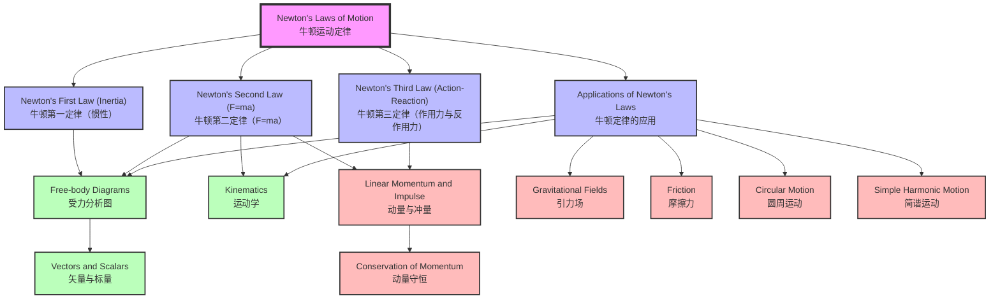

# 1. Overview / 概述

**English:**
Newton's Laws of Motion form the cornerstone of classical mechanics. This topic introduces three fundamental laws that describe the relationship between forces acting on a body and its motion. Newton's First Law (Law of Inertia) states that an object remains at rest or in uniform motion unless acted upon by a net external force. Newton's Second Law ($F = ma$) quantifies how force causes acceleration, proportional to mass. Newton's Third Law (Action-Reaction) states that every force has an equal and opposite reaction force.

This topic is critical in both Cambridge 9702 and Edexcel IAL A-Level Physics. It bridges [[Kinematics]] (describing motion) and [[Dynamics]] (explaining why motion occurs). Real-world applications include vehicle safety design (seatbelts, airbags), rocket propulsion, sports physics, and engineering structures. In examinations, Newton's Laws are tested through calculations, explanations, and practical experiments involving [[Free-body Diagrams]] and [[Linear Momentum and Impulse]].

**中文：**
牛顿运动定律构成了经典力学的基石。本主题介绍了描述作用在物体上的力与其运动之间关系的三条基本定律。牛顿第一定律（惯性定律）指出，除非受到合外力作用，否则物体保持静止或匀速直线运动。牛顿第二定律（$F = ma$）量化了力如何引起加速度，且加速度与质量成反比。牛顿第三定律（作用力与反作用力）指出，每一个力都有一个大小相等、方向相反的反作用力。

本主题在剑桥 9702 和爱德思 IAL A-Level 物理中至关重要。它连接了[[运动学]]（描述运动）和[[动力学]]（解释运动发生的原因）。实际应用包括车辆安全设计（安全带、安全气囊）、火箭推进、体育物理学和工程结构。在考试中，牛顿定律通过计算、解释和涉及[[受力分析图]]、[[动量与冲量]]的实验进行考查。

---

# 2. Syllabus Learning Objectives / 考纲学习目标

**English:**
The table below lists all syllabus requirements for Newton's Laws of Motion from both Cambridge 9702 and Edexcel IAL. Examiner expectations include: (1) stating and explaining each law in words, (2) applying $F = ma$ to solve problems, (3) identifying action-reaction pairs, (4) drawing and interpreting [[Free-body Diagrams]], and (5) linking to [[Linear Momentum and Impulse]] and [[Conservation of Momentum]].

**中文：**
下表列出了剑桥 9702 和爱德思 IAL 关于牛顿运动定律的所有考纲要求。考官期望包括：(1) 用语言陈述并解释每条定律，(2) 应用 $F = ma$ 解决问题，(3) 识别作用力与反作用力对，(4) 绘制并解读[[受力分析图]]，以及 (5) 与[[动量与冲量]]和[[动量守恒]]建立联系。

| CAIE 9702 | Edexcel IAL |
|-----------|-------------|
| 3.2(d) State and apply Newton's First Law: an object remains at rest or in uniform motion unless acted upon by a net external force. | 2.7 State and apply Newton's First Law: an object continues in a state of rest or uniform motion unless acted upon by a resultant force. |
| 3.2(e) State and apply Newton's Second Law: $F = ma$ (resultant force = mass × acceleration). | 2.8 State and apply Newton's Second Law: $F = ma$ (resultant force = mass × acceleration). |
| 3.2(f) State and apply Newton's Third Law: when two bodies interact, the forces they exert on each other are equal in magnitude and opposite in direction. | 2.9 State and apply Newton's Third Law: when two bodies interact, the forces they exert on each other are equal in magnitude and opposite in direction. |
| 3.2(g) Apply Newton's Laws to solve problems involving forces and motion, including [[Free-body Diagrams]]. | 2.10 Apply Newton's Laws to solve problems involving forces and motion, including [[Free-body Diagrams]]. |
| 3.2(h) Understand the concept of weight as the force due to gravity: $W = mg$. | 2.11 Understand weight as the force due to gravity: $W = mg$. |
| 3.2(i) Understand the concept of normal reaction force. | 2.12 Understand normal reaction force. |
| 3.2(j) Understand the concept of friction as a force opposing motion. | 2.13 Understand friction as a force opposing motion. |
| 3.2(k) Understand the concept of tension in strings and cables. | 2.14 Understand tension in strings and cables. |

> 📋 **CIE Only:** CAIE 9702 explicitly requires students to "state and apply" Newton's First Law, including the concept of inertia. The term "inertia" is examinable. CIE also requires understanding of "uniform motion" as constant velocity.

> 📋 **Edexcel Only:** Edexcel IAL uses the term "resultant force" instead of "net external force." Edexcel also places greater emphasis on practical applications, such as using [[Free-body Diagrams]] to solve problems involving multiple forces.

---

# 3. Core Definitions / 核心定义

**English:**
The table below provides official definitions for key terms related to Newton's Laws of Motion. Each definition is worded to match exam standards. Common mistakes are highlighted to help students avoid errors.

**中文：**
下表提供了与牛顿运动定律相关的关键术语的官方定义。每个定义都按照考试标准措辞。突出显示了常见错误，以帮助学生避免错误。

| Term (EN/CN) | Definition (EN) | Definition (CN) | Common Mistakes / 常见错误 |
|--------------|-----------------|-----------------|---------------------------|
| **Newton's First Law** / 牛顿第一定律 | An object remains at rest or in uniform motion (constant velocity) unless acted upon by a net external force (resultant force). | 物体保持静止或匀速直线运动（恒定速度），除非受到合外力（合力）作用。 | Mistaking "uniform motion" for "constant speed" (velocity includes direction). Also, forgetting that the law applies only in inertial frames. |
| **Newton's Second Law** / 牛顿第二定律 | The resultant force acting on an object is equal to the rate of change of its momentum: $F = \frac{\Delta p}{\Delta t}$. For constant mass, this simplifies to $F = ma$. | 作用在物体上的合力等于其动量变化率：$F = \frac{\Delta p}{\Delta t}$。对于质量恒定的物体，可简化为 $F = ma$。 | Using $F = ma$ when mass changes (e.g., rockets). Also, forgetting that $F$ is the **resultant** force, not any individual force. |
| **Newton's Third Law** / 牛顿第三定律 | When two bodies interact, the forces they exert on each other are equal in magnitude and opposite in direction. | 当两个物体相互作用时，它们彼此施加的力大小相等、方向相反。 | Confusing action-reaction pairs with balanced forces. Action-reaction forces act on **different** objects; balanced forces act on the **same** object. |
| **Inertia** / 惯性 | The property of an object to resist changes in its state of motion. It is directly proportional to mass. | 物体抵抗其运动状态变化的性质。它与质量成正比。 | Thinking inertia is a force. Inertia is a property, not a force. |
| **Resultant Force** / 合力 | The single force that has the same effect as all the forces acting on an object combined. | 与作用在物体上的所有力的组合效果相同的单个力。 | Forgetting to consider direction when adding forces. |
| **Weight** / 重量 | The gravitational force exerted on an object by a planet: $W = mg$. | 行星对物体施加的万有引力：$W = mg$。 | Confusing weight with mass. Weight is a force (unit: N); mass is a scalar (unit: kg). |
| **Normal Reaction Force** / 法向反作用力 | The force exerted by a surface on an object in contact with it, perpendicular to the surface. | 表面对其接触的物体施加的力，垂直于表面。 | Thinking normal force always equals weight. It only equals weight on a horizontal surface with no vertical acceleration. |
| **Friction** / 摩擦力 | A force that opposes the relative motion of two surfaces in contact. | 阻碍两个接触表面相对运动的力。 | Assuming friction always equals $\mu R$. Static friction can vary up to a maximum. |
| **Tension** / 张力 | The pulling force transmitted through a string, cable, or rope when it is stretched. | 当绳子、电缆或绳索被拉伸时通过其传递的拉力。 | Assuming tension is constant in a massless string. In real strings with mass, tension varies. |

---

# 4. Key Concepts Explained / 关键概念详解

## 4.1 Newton's First Law (Inertia) / 牛顿第一定律（惯性）

### Explanation / 解释
**English:**
Newton's First Law states that an object remains at rest or in uniform motion (constant velocity) unless acted upon by a net external force (resultant force). This law introduces the concept of [[Inertia]], which is the property of an object to resist changes in its state of motion. Inertia is directly proportional to mass: heavier objects have greater inertia.

The law implies that if the resultant force on an object is zero, its velocity remains constant. This includes both objects at rest ($v = 0$) and objects moving with constant velocity ($v = \text{constant}$). This is why a book on a table stays at rest (gravity and normal reaction cancel), and why a spacecraft in deep space continues moving at constant speed without fuel.

**中文：**
牛顿第一定律指出，除非受到合外力（合力）作用，否则物体保持静止或匀速直线运动（恒定速度）。这条定律引入了[[惯性]]的概念，即物体抵抗其运动状态变化的性质。惯性直接与质量成正比：较重的物体具有更大的惯性。

该定律意味着，如果物体上的合力为零，其速度保持不变。这包括静止物体（$v = 0$）和匀速运动物体（$v = \text{常数}$）。这就是为什么桌子上的书保持静止（重力和法向反作用力抵消），以及为什么深空中的航天器无需燃料就能继续匀速运动。

### Physical Meaning / 物理意义
**English:**
In real life, Newton's First Law explains why passengers lurch forward when a car suddenly brakes (their bodies continue moving forward due to inertia). It also explains why seatbelts are necessary: without them, passengers would continue moving forward at the car's original speed during a collision.

**中文：**
在现实生活中，牛顿第一定律解释了为什么当汽车突然刹车时乘客会向前冲（他们的身体由于惯性继续向前运动）。它也解释了为什么需要安全带：没有安全带，乘客在碰撞时会以汽车原来的速度继续向前运动。

### Common Misconceptions / 常见误区
1. **Misconception:** A moving object needs a force to keep it moving.
   **Correction:** According to Newton's First Law, an object in uniform motion requires no net force. Friction and air resistance are forces that oppose motion, so a constant force is needed to **balance** these opposing forces, not to maintain motion itself.

2. **Misconception:** Inertia is a force.
   **Correction:** Inertia is a property (resistance to change in motion), not a force. It has no units and cannot be measured directly.

3. **Misconception:** "Uniform motion" means constant speed.
   **Correction:** Uniform motion means constant **velocity**, which includes both speed and direction. An object moving in a circle at constant speed is accelerating (changing direction) and thus requires a net force.

### Exam Tips / 考试提示
**English:**
Cambridge and Edexcel often ask students to:
- State Newton's First Law in words (memorise the exact wording).
- Explain why an object continues moving after a force is removed (e.g., a puck on ice).
- Identify situations where resultant force is zero (equilibrium).
- Use the law to explain safety features (seatbelts, airbags).

**中文：**
剑桥和爱德思经常要求学生：
- 用语言陈述牛顿第一定律（记住确切的措辞）。
- 解释为什么力移除后物体继续运动（例如，冰球）。
- 识别合力为零的情况（平衡）。
- 用该定律解释安全功能（安全带、安全气囊）。

---

## 4.2 Newton's Second Law ($F = ma$) / 牛顿第二定律（$F = ma$）

### Explanation / 解释
**English:**
Newton's Second Law states that the resultant force acting on an object is equal to the rate of change of its momentum. Mathematically: $F = \frac{\Delta p}{\Delta t}$, where $p = mv$ is momentum. For an object with constant mass, this simplifies to $F = ma$, where $a$ is the acceleration.

The law is a vector equation: the direction of acceleration is the same as the direction of the resultant force. If multiple forces act on an object, the resultant force is the vector sum of all forces. This is why [[Free-body Diagrams]] are essential: they help identify all forces and their directions.

**中文：**
牛顿第二定律指出，作用在物体上的合力等于其动量变化率。数学表达式为：$F = \frac{\Delta p}{\Delta t}$，其中 $p = mv$ 是动量。对于质量恒定的物体，可简化为 $F = ma$，其中 $a$ 是加速度。

该定律是一个矢量方程：加速度的方向与合力的方向相同。如果多个力作用在一个物体上，合力是所有力的矢量和。这就是为什么[[受力分析图]]至关重要：它们有助于识别所有力及其方向。

### Physical Meaning / 物理意义
**English:**
Newton's Second Law quantifies the relationship between force and motion. A larger force produces a larger acceleration for the same mass. A larger mass requires a larger force to achieve the same acceleration. This explains why a heavy truck needs a more powerful engine than a small car to accelerate at the same rate.

**中文：**
牛顿第二定律量化了力与运动之间的关系。对于相同的质量，更大的力产生更大的加速度。更大的质量需要更大的力才能达到相同的加速度。这解释了为什么重型卡车需要比小型汽车更强大的发动机才能以相同的速率加速。

### Common Misconceptions / 常见误区
1. **Misconception:** $F = ma$ applies to any force, not just the resultant force.
   **Correction:** $F$ in Newton's Second Law is always the **resultant** (net) force. Individual forces do not directly cause acceleration; only the net force does.

2. **Misconception:** Acceleration is proportional to force, regardless of mass.
   **Correction:** Acceleration is proportional to force **and** inversely proportional to mass: $a = F/m$.

3. **Misconception:** $F = ma$ can be used when mass changes.
   **Correction:** When mass changes (e.g., rockets burning fuel), the full form $F = \frac{\Delta p}{\Delta t}$ must be used.

### Exam Tips / 考试提示
**English:**
Cambridge and Edexcel often ask students to:
- Apply $F = ma$ to solve problems involving [[Free-body Diagrams]].
- Calculate acceleration, force, or mass given two of the three variables.
- Explain why a falling object reaches terminal velocity (air resistance increases until it balances weight).
- Use the law in conjunction with [[Kinematics]] equations ($v = u + at$, etc.).

**中文：**
剑桥和爱德思经常要求学生：
- 应用 $F = ma$ 解决涉及[[受力分析图]]的问题。
- 在已知三个变量中的两个时计算加速度、力或质量。
- 解释为什么下落物体达到终端速度（空气阻力增加直到平衡重量）。
- 结合[[运动学]]方程（$v = u + at$ 等）使用该定律。

---

## 4.3 Newton's Third Law (Action-Reaction) / 牛顿第三定律（作用力与反作用力）

### Explanation / 解释
**English:**
Newton's Third Law states that when two bodies interact, the forces they exert on each other are equal in magnitude and opposite in direction. These forces are called action-reaction pairs. Key characteristics:
- They act on **different** objects.
- They are of the **same type** (e.g., both gravitational, both contact).
- They occur **simultaneously**.
- They are **equal in magnitude** and **opposite in direction**.

Common examples include:
- A book on a table: Earth pulls book down (gravity), book pulls Earth up (gravity).
- A person walking: foot pushes ground backward (friction), ground pushes foot forward (friction).
- A rocket: exhaust gases push down on rocket, rocket pushes exhaust gases up.

**中文：**
牛顿第三定律指出，当两个物体相互作用时，它们彼此施加的力大小相等、方向相反。这些力称为作用力与反作用力对。关键特征：
- 它们作用在**不同**的物体上。
- 它们是**相同类型**的（例如，都是万有引力，都是接触力）。
- 它们**同时**发生。
- 它们**大小相等**、**方向相反**。

常见例子包括：
- 桌子上的书：地球向下拉书（重力），书向上拉地球（重力）。
- 行走的人：脚向后推地面（摩擦力），地面向前推脚（摩擦力）。
- 火箭：废气向下推火箭，火箭向上推废气。

### Physical Meaning / 物理意义
**English:**
Newton's Third Law explains how forces always come in pairs. It is the reason we can walk (ground pushes us forward), swim (water pushes us forward), and fly (air pushes wings upward). It also explains why rockets work in space: the rocket pushes exhaust gases backward, and the exhaust gases push the rocket forward.

**中文：**
牛顿第三定律解释了力总是成对出现的原因。这就是为什么我们能行走（地面向前推我们）、游泳（水向前推我们）和飞行（空气向上推机翼）。它也解释了为什么火箭能在太空中工作：火箭向后推废气，废气向前推火箭。

### Common Misconceptions / 常见误区
1. **Misconception:** Action-reaction forces cancel each other out.
   **Correction:** They act on **different** objects, so they cannot cancel. Cancellation requires forces on the **same** object.

2. **Misconception:** The action force causes the reaction force.
   **Correction:** Both forces occur simultaneously. Neither causes the other; they are mutual interactions.

3. **Misconception:** If one object is much larger, its force is larger.
   **Correction:** The forces are always equal in magnitude, regardless of the masses of the objects.

### Exam Tips / 考试提示
**English:**
Cambridge and Edexcel often ask students to:
- Identify action-reaction pairs in a given scenario.
- Distinguish between action-reaction pairs and balanced forces.
- Explain why a person can move forward by pushing backward on the ground.
- Use the law to explain rocket propulsion.

**中文：**
剑桥和爱德思经常要求学生：
- 在给定场景中识别作用力与反作用力对。
- 区分作用力与反作用力对和平衡力。
- 解释为什么人可以通过向后推地面而向前移动。
- 用该定律解释火箭推进。

---

## 4.4 Applications of Newton's Laws / 牛顿定律的应用

### Explanation / 解释
**English:**
Newton's Laws are applied to solve problems involving forces and motion. The general approach is:
1. Draw a [[Free-body Diagram]] showing all forces acting on the object.
2. Resolve forces into components (if needed).
3. Apply Newton's Second Law: $F_{\text{net}} = ma$.
4. Solve for the unknown quantity.

Common applications include:
- **Objects on inclined planes:** Resolve weight into components parallel and perpendicular to the plane.
- **Connected objects (pulleys):** Apply Newton's Second Law to each object separately, then solve simultaneous equations.
- **Elevators:** Normal reaction force changes depending on acceleration (upward acceleration increases apparent weight).
- **Terminal velocity:** When drag force equals weight, resultant force is zero, and acceleration becomes zero.

**中文：**
牛顿定律应用于解决涉及力和运动的问题。一般方法是：
1. 绘制[[受力分析图]]，显示作用在物体上的所有力。
2. 将力分解为分量（如果需要）。
3. 应用牛顿第二定律：$F_{\text{net}} = ma$。
4. 求解未知量。

常见应用包括：
- **斜面上的物体：** 将重量分解为平行和垂直于斜面的分量。
- **连接物体（滑轮）：** 分别对每个物体应用牛顿第二定律，然后求解联立方程。
- **电梯：** 法向反作用力随加速度变化（向上加速度增加表观重量）。
- **终端速度：** 当阻力等于重量时，合力为零，加速度变为零。

### Physical Meaning / 物理意义
**English:**
Understanding how to apply Newton's Laws is essential for engineering, physics, and everyday problem-solving. For example, engineers use these laws to design safe bridges, vehicles, and amusement park rides. Physicists use them to predict the motion of planets and satellites.

**中文：**
理解如何应用牛顿定律对于工程、物理和日常问题解决至关重要。例如，工程师使用这些定律设计安全的桥梁、车辆和游乐园设施。物理学家使用它们预测行星和卫星的运动。

### Common Misconceptions / 常见误区
1. **Misconception:** The normal reaction force always equals weight.
   **Correction:** Normal reaction equals weight only on a horizontal surface with no vertical acceleration. On an incline, it equals $mg \cos \theta$. In an accelerating elevator, it can be greater or less than weight.

2. **Misconception:** Tension is the same on both sides of a pulley.
   **Correction:** For a massless, frictionless pulley, tension is the same. For real pulleys with mass and friction, tension differs.

3. **Misconception:** Friction always opposes motion.
   **Correction:** Friction opposes **relative** motion. In some cases (e.g., walking), friction is the force that **causes** motion.

### Exam Tips / 考试提示
**English:**
Cambridge and Edexcel often ask students to:
- Solve problems involving [[Free-body Diagrams]] with multiple forces.
- Calculate acceleration of connected objects (e.g., two masses on a pulley).
- Determine normal reaction force in accelerating systems (e.g., elevators).
- Explain terminal velocity using Newton's Laws.

**中文：**
剑桥和爱德思经常要求学生：
- 解决涉及多个力的[[受力分析图]]问题。
- 计算连接物体的加速度（例如，滑轮上的两个质量）。
- 确定加速系统中的法向反作用力（例如，电梯）。
- 用牛顿定律解释终端速度。

---

# 5. Essential Equations / 核心公式

## 5.1 Newton's Second Law (General Form) / 牛顿第二定律（一般形式）

**Equation / 公式:**
$$ F = \frac{\Delta p}{\Delta t} $$

**Variables / 变量:**
| Symbol (符号) | Meaning (EN) | Meaning (CN) | Unit (单位) |
|--------------|-------------|-------------|------------|
| $F$ | Resultant (net) force | 合力 | N (newton) |
| $\Delta p$ | Change in momentum | 动量变化 | kg·m/s |
| $\Delta t$ | Time interval | 时间间隔 | s (second) |

**Derivation / 推导:**
**English:**
Newton originally stated his Second Law as the rate of change of momentum is proportional to the applied force. Mathematically: $F \propto \frac{\Delta p}{\Delta t}$. With appropriate units, the constant of proportionality is 1, giving $F = \frac{\Delta p}{\Delta t}$. Since $p = mv$, for constant mass: $\Delta p = m \Delta v$, so $F = \frac{m \Delta v}{\Delta t} = ma$.

**中文：**
牛顿最初将他的第二定律表述为动量变化率与施加的力成正比。数学表达式为：$F \propto \frac{\Delta p}{\Delta t}$。使用适当的单位，比例常数为 1，得到 $F = \frac{\Delta p}{\Delta t}$。由于 $p = mv$，对于恒定质量：$\Delta p = m \Delta v$，所以 $F = \frac{m \Delta v}{\Delta t} = ma$。

**Conditions / 适用条件:**
**English:** This is the general form applicable to all situations, including variable mass systems (e.g., rockets, conveyor belts).
**中文：** 这是适用于所有情况的一般形式，包括变质量系统（例如，火箭、传送带）。

**Limitations / 局限性:**
**English:** Requires an inertial frame of reference. Not applicable at relativistic speeds (near speed of light) where special relativity is needed.
**中文：** 需要惯性参考系。不适用于相对论速度（接近光速），此时需要狭义相对论。

**Rearrangements / 变形:**
$$ \Delta p = F \Delta t \quad \text{(Impulse)} $$
$$ \Delta t = \frac{\Delta p}{F} $$

---

## 5.2 Newton's Second Law (Constant Mass) / 牛顿第二定律（恒定质量）

**Equation / 公式:**
$$ F = ma $$

**Variables / 变量:**
| Symbol (符号) | Meaning (EN) | Meaning (CN) | Unit (单位) |
|--------------|-------------|-------------|------------|
| $F$ | Resultant (net) force | 合力 | N (newton) |
| $m$ | Mass of object | 物体质量 | kg (kilogram) |
| $a$ | Acceleration | 加速度 | m/s² |

**Derivation / 推导:**
**English:**
From the general form $F = \frac{\Delta p}{\Delta t}$, for constant mass $m$, $\Delta p = m \Delta v$. Therefore:
$$ F = \frac{m \Delta v}{\Delta t} = m \frac{\Delta v}{\Delta t} = ma $$
where $a = \frac{\Delta v}{\Delta t}$ is the acceleration.

**中文：**
从一般形式 $F = \frac{\Delta p}{\Delta t}$ 出发，对于恒定质量 $m$，$\Delta p = m \Delta v$。因此：
$$ F = \frac{m \Delta v}{\Delta t} = m \frac{\Delta v}{\Delta t} = ma $$
其中 $a = \frac{\Delta v}{\Delta t}$ 是加速度。

**Conditions / 适用条件:**
**English:** Only applicable when mass is constant. Suitable for most everyday situations (cars, balls, people).
**中文：** 仅适用于质量恒定的情况。适用于大多数日常情况（汽车、球、人）。

**Limitations / 局限性:**
**English:** Cannot be used for variable mass systems (e.g., rockets burning fuel, conveyor belts adding mass). In such cases, use the general form $F = \frac{\Delta p}{\Delta t}$.
**中文：** 不能用于变质量系统（例如，燃烧燃料的火箭、添加质量的传送带）。在这种情况下，使用一般形式 $F = \frac{\Delta p}{\Delta t}$。

**Rearrangements / 变形:**
$$ a = \frac{F}{m} $$
$$ m = \frac{F}{a} $$

---

## 5.3 Weight / 重量

**Equation / 公式:**
$$ W = mg $$

**Variables / 变量:**
| Symbol (符号) | Meaning (EN) | Meaning (CN) | Unit (单位) |
|--------------|-------------|-------------|------------|
| $W$ | Weight (gravitational force) | 重量（万有引力） | N (newton) |
| $m$ | Mass of object | 物体质量 | kg (kilogram) |
| $g$ | Acceleration due to gravity | 重力加速度 | m/s² |

**Derivation / 推导:**
**English:**
Weight is the gravitational force exerted on an object by a planet. From Newton's Law of Universal Gravitation: $F = \frac{GMm}{r^2}$. Near Earth's surface, $r \approx R_E$ (Earth's radius), so $g = \frac{GM}{R_E^2} \approx 9.81 \text{ m/s}^2$. Thus, $W = mg$.

**中文：**
重量是行星对物体施加的万有引力。根据牛顿万有引力定律：$F = \frac{GMm}{r^2}$。在地球表面附近，$r \approx R_E$（地球半径），所以 $g = \frac{GM}{R_E^2} \approx 9.81 \text{ m/s}^2$。因此，$W = mg$。

**Conditions / 适用条件:**
**English:** Valid near the surface of a planet where $g$ is approximately constant. On Earth, $g = 9.81 \text{ m/s}^2$ (or $9.8 \text{ m/s}^2$ in exams).
**中文：** 在行星表面附近有效，其中 $g$ 近似恒定。在地球上，$g = 9.81 \text{ m/s}^2$（考试中为 $9.8 \text{ m/s}^2$）。

**Limitations / 局限性:**
**English:** $g$ varies with altitude and latitude. At high altitudes or on other planets, $g$ is different.
**中文：** $g$ 随海拔和纬度变化。在高海拔或其他行星上，$g$ 不同。

**Rearrangements / 变形:**
$$ m = \frac{W}{g} $$
$$ g = \frac{W}{m} $$

---

## 5.4 Friction (Kinetic) / 摩擦力（动摩擦）

**Equation / 公式:**
$$ F_f = \mu R $$

**Variables / 变量:**
| Symbol (符号) | Meaning (EN) | Meaning (CN) | Unit (单位) |
|--------------|-------------|-------------|------------|
| $F_f$ | Frictional force | 摩擦力 | N (newton) |
| $\mu$ | Coefficient of friction | 摩擦系数 | dimensionless (无量纲) |
| $R$ | Normal reaction force | 法向反作用力 | N (newton) |

**Derivation / 推导:**
**English:**
This is an empirical relationship (based on experiment), not derived from first principles. It states that the kinetic frictional force is proportional to the normal reaction force, with the constant of proportionality being the coefficient of friction $\mu$.

**中文：**
这是一个经验关系（基于实验），不是从基本原理推导出来的。它指出动摩擦力与法向反作用力成正比，比例常数为摩擦系数 $\mu$。

**Conditions / 适用条件:**
**English:** Applies to kinetic (sliding) friction. For static friction, the maximum value is $F_{f,\text{max}} = \mu_s R$, but the actual static friction can be any value from 0 up to this maximum.
**中文：** 适用于动（滑动）摩擦。对于静摩擦，最大值为 $F_{f,\text{max}} = \mu_s R$，但实际静摩擦力可以是 0 到该最大值之间的任何值。

**Limitations / 局限性:**
**English:** The coefficient of friction depends on the materials in contact and surface conditions. It is approximately constant for moderate speeds but can vary at very high or low speeds.
**中文：** 摩擦系数取决于接触材料和表面条件。在中等速度下近似恒定，但在非常高或非常低的速度下可能会变化。

**Rearrangements / 变形:**
$$ \mu = \frac{F_f}{R} $$
$$ R = \frac{F_f}{\mu} $$

---

# 6. Graphs and Relationships / 图表与关系

## 6.1 Force vs. Acceleration Graph / 力与加速度关系图

### Axes / 坐标轴
**English:** x-axis: Acceleration ($a$), y-axis: Resultant Force ($F$)
**中文：** x轴：加速度 ($a$)，y轴：合力 ($F$)

### Shape / 形状
**English:** A straight line passing through the origin. The gradient is the mass $m$.
**中文：** 一条通过原点的直线。斜率为质量 $m$。

### Gradient Meaning / 斜率含义
**English:** Gradient = $\frac{\Delta F}{\Delta a} = m$ (mass of the object).
**中文：** 斜率 = $\frac{\Delta F}{\Delta a} = m$（物体的质量）。

### Area Meaning / 面积含义
**English:** The area under the graph has no physical meaning in this context.
**中文：** 该图下的面积在此上下文中没有物理意义。

### Exam Interpretation / 考试解读
**English:**
- A steeper line indicates a larger mass.
- A line through the origin confirms $F \propto a$ for constant mass.
- If the line does not pass through the origin, there may be a systematic error (e.g., friction not accounted for).

**中文：**
- 更陡的线表示更大的质量。
- 通过原点的线确认了对于恒定质量 $F \propto a$。
- 如果线不通过原点，可能存在系统误差（例如，未考虑摩擦力）。

### Common Questions / 常见问题
**English:**
- "Determine the mass of the object from the graph."
- "Explain why the line does not pass through the origin."
- "Sketch the graph for a different mass."

**中文：**
- "从图中确定物体的质量。"
- "解释为什么线不通过原点。"
- "画出不同质量的图。"

---

## 6.2 Acceleration vs. Inverse Mass Graph / 加速度与质量倒数关系图

### Axes / 坐标轴
**English:** x-axis: $1/m$ (inverse mass), y-axis: Acceleration ($a$)
**中文：** x轴：$1/m$（质量倒数），y轴：加速度 ($a$)

### Shape / 形状
**English:** A straight line passing through the origin. The gradient is the resultant force $F$.
**中文：** 一条通过原点的直线。斜率为合力 $F$。

### Gradient Meaning / 斜率含义
**English:** Gradient = $\frac{\Delta a}{\Delta (1/m)} = F$ (resultant force).
**中文：** 斜率 = $\frac{\Delta a}{\Delta (1/m)} = F$（合力）。

### Area Meaning / 面积含义
**English:** The area under the graph has no physical meaning in this context.
**中文：** 该图下的面积在此上下文中没有物理意义。

### Exam Interpretation / 考试解读
**English:**
- A steeper line indicates a larger resultant force.
- The line through the origin confirms $a \propto 1/m$ for constant force.
- This graph is often used in practical experiments to verify Newton's Second Law.

**中文：**
- 更陡的线表示更大的合力。
- 通过原点的线确认了对于恒定力 $a \propto 1/m$。
- 该图常用于实验验证牛顿第二定律。

### Common Questions / 常见问题
**English:**
- "Determine the resultant force from the gradient."
- "Explain why the line is straight."
- "What does the intercept represent?"

**中文：**
- "从斜率确定合力。"
- "解释为什么线是直的。"
- "截距代表什么？"

---

## 6.3 Velocity-Time Graph for a Falling Object / 下落物体的速度-时间图

### Axes / 坐标轴
**English:** x-axis: Time ($t$), y-axis: Velocity ($v$)
**中文：** x轴：时间 ($t$)，y轴：速度 ($v$)

### Shape / 形状
**English:** Initially, the graph is a straight line with positive gradient (constant acceleration due to gravity). As air resistance increases, the gradient decreases. Eventually, the graph becomes horizontal (terminal velocity reached).
**中文：** 最初，图是一条具有正斜率的直线（重力引起的恒定加速度）。随着空气阻力增加，斜率减小。最终，图变为水平（达到终端速度）。

### Gradient Meaning / 斜率含义
**English:** Gradient = acceleration. Initially, gradient = $g$ (9.81 m/s²). As terminal velocity approaches, gradient → 0.
**中文：** 斜率 = 加速度。最初，斜率 = $g$（9.81 m/s²）。随着终端速度接近，斜率 → 0。

### Area Meaning / 面积含义
**English:** Area under the graph = displacement (distance fallen).
**中文：** 图下的面积 = 位移（下落距离）。

### Exam Interpretation / 考试解读
**English:**
- The initial straight line shows constant acceleration (no air resistance).
- The curved section shows decreasing acceleration as air resistance increases.
- The horizontal section shows terminal velocity (resultant force = 0).
- The gradient at any point gives the instantaneous acceleration.

**中文：**
- 初始直线显示恒定加速度（无空气阻力）。
- 曲线段显示加速度随空气阻力增加而减小。
- 水平段显示终端速度（合力 = 0）。
- 任何点的斜率给出瞬时加速度。

### Common Questions / 常见问题
**English:**
- "Estimate the terminal velocity from the graph."
- "Calculate the acceleration at time $t$."
- "Explain the shape of the graph using Newton's Laws."

**中文：**
- "从图中估计终端速度。"
- "计算时间 $t$ 时的加速度。"
- "用牛顿定律解释图的形状。"

---

# 7. Required Diagrams / 必备图表

## 7.1 Free-body Diagram for a Block on a Horizontal Surface / 水平面上木块的受力分析图

### Description / 描述
**English:**
A diagram showing a rectangular block on a horizontal surface. Four forces are shown as arrows: weight ($W = mg$) acting downward from the center of mass, normal reaction ($R$) acting upward from the surface, applied force ($F$) acting horizontally to the right, and friction ($F_f$) acting horizontally to the left (opposing motion). All arrows should be labeled with force names and magnitudes.

**中文：**
显示水平面上矩形木块的图。四个力用箭头表示：从质心向下作用的重量（$W = mg$），从表面向上作用的法向反作用力（$R$），水平向右作用的外力（$F$），以及水平向左作用的摩擦力（$F_f$，阻碍运动）。所有箭头应标有力名称和大小。

### Image Prompt / 图片生成提示
> 📷 **IMAGE PROMPT — [D01]: Free-body Diagram for a Block on a Horizontal Surface**
>
> A clean, educational 2D vector illustration of a rectangular block resting on a horizontal surface. Four labeled force arrows: a downward arrow labeled "W = mg" (weight) from the center of the block, an upward arrow labeled "R" (normal reaction) from the bottom of the block, a rightward arrow labeled "F" (applied force) from the right side of the block, and a leftward arrow labeled "F_f" (friction) from the left side of the block. All arrows should be proportional in length. The surface is a simple horizontal line. Use a white background with black lines and blue/red arrows for clarity. Style: textbook-quality diagram, minimalistic, no shadows.

### Labels Required / 需要标注
**English:**
- $W = mg$ (Weight / 重量)
- $R$ (Normal Reaction / 法向反作用力)
- $F$ (Applied Force / 外力)
- $F_f$ (Friction / 摩擦力)
- Block (木块)
- Surface (表面)

**中文：**
- $W = mg$（重量）
- $R$（法向反作用力）
- $F$（外力）
- $F_f$（摩擦力）
- 木块
- 表面

### Exam Importance / 考试重要性
**English:**
This is the most fundamental free-body diagram. Cambridge and Edexcel use it to test students' ability to identify and label forces correctly. It is the basis for solving problems involving Newton's Second Law.

**中文：**
这是最基本的受力分析图。剑桥和爱德思用它来测试学生正确识别和标注力的能力。它是解决涉及牛顿第二定律问题的基础。

---

## 7.2 Free-body Diagram for a Block on an Inclined Plane / 斜面上木块的受力分析图

### Description / 描述
**English:**
A diagram showing a rectangular block on an inclined plane at angle $\theta$ to the horizontal. Three forces are shown: weight ($W = mg$) acting vertically downward from the center of mass, normal reaction ($R$) acting perpendicular to the plane, and friction ($F_f$) acting parallel to the plane upward (if the block is sliding down). Weight is resolved into two components: $mg \sin \theta$ (parallel to the plane, downward) and $mg \cos \theta$ (perpendicular to the plane, into the plane).

**中文：**
显示与水平面成角度 $\theta$ 的斜面上矩形木块的图。显示三个力：从质心垂直向下作用的重量（$W = mg$），垂直于斜面作用的法向反作用力（$R$），以及平行于斜面向上作用的摩擦力（$F_f$，如果木块向下滑动）。重量被分解为两个分量：$mg \sin \theta$（平行于斜面，向下）和 $mg \cos \theta$（垂直于斜面，进入斜面）。

### Image Prompt / 图片生成提示
> 📷 **IMAGE PROMPT — [D02]: Free-body Diagram for a Block on an Inclined Plane**
>
> A clean, educational 2D vector illustration of a rectangular block on an inclined plane at angle θ to the horizontal. Three force arrows: a vertical downward arrow labeled "W = mg" (weight) from the center of the block, an arrow perpendicular to the plane labeled "R" (normal reaction) from the bottom of the block, and an arrow parallel to the plane upward labeled "F_f" (friction) from the bottom of the block. Additionally, show the resolution of weight into two dashed arrows: "mg sin θ" parallel to the plane downward and "mg cos θ" perpendicular to the plane into the plane. Label the angle θ on the plane. Use a white background with black lines and blue/red arrows. Style: textbook-quality diagram, minimalistic.

### Labels Required / 需要标注
**English:**
- $W = mg$ (Weight / 重量)
- $R$ (Normal Reaction / 法向反作用力)
- $F_f$ (Friction / 摩擦力)
- $mg \sin \theta$ (Component parallel to plane / 平行于斜面的分量)
- $mg \cos \theta$ (Component perpendicular to plane / 垂直于斜面的分量)
- $\theta$ (Angle of incline / 斜面角度)
- Block (木块)
- Inclined Plane (斜面)

**中文：**
- $W = mg$（重量）
- $R$（法向反作用力）
- $F_f$（摩擦力）
- $mg \sin \theta$（平行于斜面的分量）
- $mg \cos \theta$（垂直于斜面的分量）
- $\theta$（斜面角度）
- 木块
- 斜面

### Exam Importance / 考试重要性
**English:**
This diagram is essential for solving inclined plane problems, which are common in both Cambridge and Edexcel exams. It tests students' ability to resolve forces into components and apply Newton's Second Law in two dimensions.

**中文：**
该图对于解决斜面问题至关重要，这在剑桥和爱德思考试中都很常见。它测试学生将力分解为分量并在二维中应用牛顿第二定律的能力。

---

## 7.3 Action-Reaction Pairs: Person Walking / 作用力与反作用力对：行走的人

### Description / 描述
**English:**
A diagram showing a person walking on the ground. Two action-reaction pairs are shown:
1. **Foot on ground / Ground on foot:** The foot pushes backward on the ground (action), and the ground pushes forward on the foot (reaction). This forward force propels the person.
2. **Earth pulls person / Person pulls Earth:** Earth pulls the person downward due to gravity (action), and the person pulls Earth upward (reaction).

Arrows should be labeled with "Action" and "Reaction" and show equal magnitudes.

**中文：**
显示一个人在地面上行走的图。显示两个作用力与反作用力对：
1. **脚对地面 / 地面对脚：** 脚向后推地面（作用力），地面向前推脚（反作用力）。这个向前的力推动人前进。
2. **地球拉人 / 人拉地球：** 地球由于重力向下拉人（作用力），人向上拉地球（反作用力）。

箭头应标有"作用力"和"反作用力"，并显示相等的大小。

### Image Prompt / 图片生成提示
> 📷 **IMAGE PROMPT — [D03]: Action-Reaction Pairs: Person Walking**
>
> A clean, educational 2D vector illustration of a person walking on the ground. Show two action-reaction pairs with labeled arrows:
> 1. From the foot: a backward arrow labeled "Action: Foot pushes ground backward" and a forward arrow on the foot labeled "Reaction: Ground pushes foot forward". Both arrows should be the same length.
> 2. From the person's center of mass: a downward arrow labeled "Action: Earth pulls person downward (W = mg)" and an upward arrow from the Earth labeled "Reaction: Person pulls Earth upward". Both arrows should be the same length.
> Use a white background with black lines and blue/red arrows. Style: textbook-quality diagram, minimalistic, clear labels.

### Labels Required / 需要标注
**English:**
- Action: Foot pushes ground backward (作用力：脚向后推地面)
- Reaction: Ground pushes foot forward (反作用力：地面向前推脚)
- Action: Earth pulls person downward (作用力：地球向下拉人)
- Reaction: Person pulls Earth upward (反作用力：人向上拉地球)
- Person (人)
- Ground (地面)
- Earth (地球)

**中文：**
- 作用力：脚向后推地面
- 反作用力：地面向前推脚
- 作用力：地球向下拉人
- 反作用力：人向上拉地球
- 人
- 地面
- 地球

### Exam Importance / 考试重要性
**English:**
This diagram is used to test students' understanding of Newton's Third Law. It helps distinguish between action-reaction pairs (forces on different objects) and balanced forces (forces on the same object). Cambridge and Edexcel frequently ask students to identify action-reaction pairs in everyday situations.

**中文：**
该图用于测试学生对牛顿第三定律的理解。它有助于区分作用力与反作用力对（作用在不同物体上的力）和平衡力（作用在同一物体上的力）。剑桥和爱德思经常要求学生识别日常情况中的作用力与反作用力对。

---

# 8. Worked Examples / 典型例题

## Example 1: Block on a Horizontal Surface / 水平面上的木块

### Question / 题目
**English:**
A block of mass 5.0 kg is pulled along a horizontal surface by a horizontal force of 20 N. The coefficient of kinetic friction between the block and the surface is 0.30. Calculate:
(a) The frictional force acting on the block.
(b) The acceleration of the block.
(c) The distance traveled by the block in 4.0 seconds, starting from rest.

**中文：**
一个质量为 5.0 kg 的木块在水平面上被 20 N 的水平力拉动。木块与表面之间的动摩擦系数为 0.30。计算：
(a) 作用在木块上的摩擦力。
(b) 木块的加速度。
(c) 木块从静止开始，在 4.0 秒内行进的距离。

### Image Prompt / 图片提示
> 📷 **IMAGE PROMPT — [E01]: Block on a Horizontal Surface (Example 1)**
>
> A clean, educational 2D vector illustration of a rectangular block on a horizontal surface. Four labeled force arrows: a downward arrow labeled "W = mg" (weight) from the center of the block, an upward arrow labeled "R" (normal reaction) from the bottom of the block, a rightward arrow labeled "F = 20 N" (applied force) from the right side of the block, and a leftward arrow labeled "F_f" (friction) from the left side of the block. All arrows should be proportional in length. Use a white background with black lines and blue/red arrows. Style: textbook-quality diagram.

### Solution / 解答

**Step 1: Calculate the normal reaction force.**
**English:**
Since the surface is horizontal and there is no vertical acceleration, the normal reaction force equals the weight:
$$ R = W = mg = 5.0 \times 9.81 = 49.05 \text{ N} $$

**中文：**
由于表面是水平的且没有垂直加速度，法向反作用力等于重量：
$$ R = W = mg = 5.0 \times 9.81 = 49.05 \text{ N} $$

**Step 2: Calculate the frictional force.**
**English:**
Using the friction equation:
$$ F_f = \mu R = 0.30 \times 49.05 = 14.715 \text{ N} \approx 14.7 \text{ N} $$

**中文：**
使用摩擦力方程：
$$ F_f = \mu R = 0.30 \times 49.05 = 14.715 \text{ N} \approx 14.7 \text{ N} $$

**Step 3: Calculate the resultant force.**
**English:**
The applied force is to the right, and friction is to the left. The resultant force is:
$$ F_{\text{net}} = F - F_f = 20 - 14.715 = 5.285 \text{ N} \approx 5.29 \text{ N} $$

**中文：**
外力向右，摩擦力向左。合力为：
$$ F_{\text{net}} = F - F_f = 20 - 14.715 = 5.285 \text{ N} \approx 5.29 \text{ N} $$

**Step 4: Calculate the acceleration.**
**English:**
Using Newton's Second Law:
$$ a = \frac{F_{\text{net}}}{m} = \frac{5.285}{5.0} = 1.057 \text{ m/s}^2 \approx 1.06 \text{ m/s}^2 $$

**中文：**
使用牛顿第二定律：
$$ a = \frac{F_{\text{net}}}{m} = \frac{5.285}{5.0} = 1.057 \text{ m/s}^2 \approx 1.06 \text{ m/s}^2 $$

**Step 5: Calculate the distance traveled.**
**English:**
Using the kinematic equation $s = ut + \frac{1}{2}at^2$, with $u = 0$ and $t = 4.0$ s:
$$ s = 0 + \frac{1}{2} \times 1.057 \times (4.0)^2 = 0.5 \times 1.057 \times 16 = 8.456 \text{ m} \approx 8.46 \text{ m} $$

**中文：**
使用运动学方程 $s = ut + \frac{1}{2}at^2$，其中 $u = 0$，$t = 4.0$ s：
$$ s = 0 + \frac{1}{2} \times 1.057 \times (4.0)^2 = 0.5 \times 1.057 \times 16 = 8.456 \text{ m} \approx 8.46 \text{ m} $$

### Final Answer / 最终答案
**Answer:**
(a) Frictional force = 14.7 N
(b) Acceleration = 1.06 m/s²
(c) Distance = 8.46 m

**答案：**
(a) 摩擦力 = 14.7 N
(b) 加速度 = 1.06 m/s²
(c) 距离 = 8.46 m

### Examiner Notes / 考官点评
**English:**
- Common mistake: Forgetting to calculate the normal reaction force first. Students often assume $R = mg$ without stating it.
- Common mistake: Using $F = ma$ with the applied force (20 N) instead of the resultant force (5.29 N).
- Tip: Always draw a [[Free-body Diagram]] first to identify all forces.
- Tip: Use $g = 9.81 \text{ m/s}^2$ unless the question specifies otherwise.

**中文：**
- 常见错误：忘记先计算法向反作用力。学生经常直接假设 $R = mg$ 而不说明。
- 常见错误：使用外力（20 N）而不是合力（5.29 N）代入 $F = ma$。
- 提示：始终先绘制[[受力分析图]]以识别所有力。
- 提示：除非问题另有说明，否则使用 $g = 9.81 \text{ m/s}^2$。

### Alternative Method / 替代方法
**English:**
You could also solve this problem by first calculating the net force and then using the impulse-momentum theorem to find velocity, then distance. However, the method above is more straightforward.

**中文：**
你也可以先计算净力，然后使用冲量-动量定理求速度，再求距离。但上述方法更直接。

---

## Example 2: Block on an Inclined Plane / 斜面上的木块

### Question / 题目
**English:**
A block of mass 2.0 kg slides down a rough inclined plane at an angle of 30° to the horizontal. The coefficient of kinetic friction between the block and the plane is 0.20. Calculate:
(a) The normal reaction force on the block.
(b) The frictional force acting on the block.
(c) The acceleration of the block down the plane.

**中文：**
一个质量为 2.0 kg 的木块沿与水平面成 30° 角的粗糙斜面下滑。木块与斜面之间的动摩擦系数为 0.20。计算：
(a) 木块上的法向反作用力。
(b) 作用在木块上的摩擦力。
(c) 木块沿斜面下滑的加速度。

### Image Prompt / 图片提示
> 📷 **IMAGE PROMPT — [E02]: Block on an Inclined Plane (Example 2)**
>
> A clean, educational 2D vector illustration of a rectangular block on an inclined plane at 30° to the horizontal. Three force arrows: a vertical downward arrow labeled "W = mg" (weight) from the center of the block, an arrow perpendicular to the plane labeled "R" (normal reaction) from the bottom of the block, and an arrow parallel to the plane upward labeled "F_f" (friction) from the bottom of the block. Additionally, show the resolution of weight into two dashed arrows: "mg sin 30°" parallel to the plane downward and "mg cos 30°" perpendicular to the plane into the plane. Label the angle 30° on the plane. Use a white background with black lines and blue/red arrows. Style: textbook-quality diagram.

### Solution / 解答

**Step 1: Calculate the normal reaction force.**
**English:**
On an inclined plane, the normal reaction force equals the component of weight perpendicular to the plane:
$$ R = mg \cos \theta = 2.0 \times 9.81 \times \cos 30^\circ = 2.0 \times 9.81 \times 0.8660 = 16.99 \text{ N} \approx 17.0 \text{ N} $$

**中文：**
在斜面上，法向反作用力等于重量垂直于斜面的分量：
$$ R = mg \cos \theta = 2.0 \times 9.81 \times \cos 30^\circ = 2.0 \times 9.81 \times 0.8660 = 16.99 \text{ N} \approx 17.0 \text{ N} $$

**Step 2: Calculate the frictional force.**
**English:**
Using the friction equation:
$$ F_f = \mu R = 0.20 \times 16.99 = 3.398 \text{ N} \approx 3.40 \text{ N} $$

**中文：**
使用摩擦力方程：
$$ F_f = \mu R = 0.20 \times 16.99 = 3.398 \text{ N} \approx 3.40 \text{ N} $$

**Step 3: Calculate the component of weight down the plane.**
**English:**
The component of weight parallel to the plane is:
$$ mg \sin \theta = 2.0 \times 9.81 \times \sin 30^\circ = 2.0 \times 9.81 \times 0.5 = 9.81 \text{ N} $$

**中文：**
重量平行于斜面的分量为：
$$ mg \sin \theta = 2.0 \times 9.81 \times \sin 30^\circ = 2.0 \times 9.81 \times 0.5 = 9.81 \text{ N} $$

**Step 4: Calculate the resultant force down the plane.**
**English:**
The resultant force down the plane is the component of weight down the plane minus friction (which acts up the plane):
$$ F_{\text{net}} = mg \sin \theta - F_f = 9.81 - 3.398 = 6.412 \text{ N} \approx 6.41 \text{ N} $$

**中文：**
沿斜面向下的合力是重量沿斜面的分量减去摩擦力（摩擦力沿斜面向上）：
$$ F_{\text{net}} = mg \sin \theta - F_f = 9.81 - 3.398 = 6.412 \text{ N} \approx 6.41 \text{ N} $$

**Step 5: Calculate the acceleration.**
**English:**
Using Newton's Second Law:
$$ a = \frac{F_{\text{net}}}{m} = \frac{6.412}{2.0} = 3.206 \text{ m/s}^2 \approx 3.21 \text{ m/s}^2 $$

**中文：**
使用牛顿第二定律：
$$ a = \frac{F_{\text{net}}}{m} = \frac{6.412}{2.0} = 3.206 \text{ m/s}^2 \approx 3.21 \text{ m/s}^2 $$

### Final Answer / 最终答案
**Answer:**
(a) Normal reaction force = 17.0 N
(b) Frictional force = 3.40 N
(c) Acceleration = 3.21 m/s²

**答案：**
(a) 法向反作用力 = 17.0 N
(b) 摩擦力 = 3.40 N
(c) 加速度 = 3.21 m/s²

### Examiner Notes / 考官点评
**English:**
- Common mistake: Using $R = mg$ instead of $R = mg \cos \theta$. This is the most frequent error in inclined plane problems.
- Common mistake: Forgetting to resolve weight into components.
- Common mistake: Using the wrong trigonometric function ($\sin$ vs $\cos$).
- Tip: Remember that the component perpendicular to the plane uses $\cos \theta$, and the component parallel to the plane uses $\sin \theta$.
- Tip: Always draw the [[Free-body Diagram]] and resolve forces before applying Newton's Second Law.

**中文：**
- 常见错误：使用 $R = mg$ 而不是 $R = mg \cos \theta$。这是斜面问题中最常见的错误。
- 常见错误：忘记将重量分解为分量。
- 常见错误：使用错误的三角函数（$\sin$ 与 $\cos$）。
- 提示：记住垂直于斜面的分量使用 $\cos \theta$，平行于斜面的分量使用 $\sin \theta$。
- 提示：在应用牛顿第二定律之前，始终绘制[[受力分析图]]并分解力。

### Alternative Method / 替代方法
**English:**
You could also solve this problem using energy methods (work-energy theorem), but the force method is more direct for finding acceleration.

**中文：**
你也可以使用能量方法（功能定理）解决这个问题，但力方法对于求加速度更直接。

---

# 9. Past Paper Question Types / 历年真题题型

**English:**
The table below summarises the types of questions that appear in Cambridge 9702 and Edexcel IAL exams for Newton's Laws of Motion. Frequency and difficulty are based on analysis of past papers.

**中文：**
下表总结了剑桥 9702 和爱德思 IAL 考试中关于牛顿运动定律的问题类型。频率和难度基于对历年试卷的分析。

| Question Type / 题型 | Frequency / 频率 | Difficulty / 难度 | Past Paper References / 真题索引 |
|----------------------|------------------|------------------|-------------------------------|
| Calculation / 计算 | High | Medium | 📝 *待填入* |
| Explanation / 解释 | High | Medium | 📝 *待填入* |
| Graph Analysis / 图表分析 | Medium | Medium-High | 📝 *待填入* |
| Practical / 实验 | Medium | Medium | 📝 *待填入* |
| Derivation / 推导 | Low | High | 📝 *待填入* |

> 📝 **题库整理中 / Question Bank Under Construction:** 具体试卷编号（如 9702/23/M/J/24 Q3）将在后续整理真题后填入上表。

**Common Command Words / 常见指令词:**

| Command Word (EN) | Command Word (CN) | Meaning (EN) | Meaning (CN) |
|-------------------|-------------------|--------------|--------------|
| State | 陈述 | Give a brief, clear answer without explanation. | 给出简短、清晰的答案，无需解释。 |
| Define | 定义 | Give the precise meaning of a term. | 给出术语的精确含义。 |
| Explain | 解释 | Give reasons or causes for a phenomenon. | 给出现象的原因或理由。 |
| Describe | 描述 | Give a detailed account of a process or observation. | 详细描述过程或观察结果。 |
| Calculate | 计算 | Use mathematical methods to find a numerical answer. | 使用数学方法求出数值答案。 |
| Determine | 确定 | Find a value using given data or a graph. | 使用给定数据或图表求出值。 |
| Suggest | 建议 | Propose a possible explanation or solution. | 提出可能的解释或解决方案。 |
| Sketch | 草图 | Draw a graph or diagram showing the main features. | 绘制显示主要特征的图或图表。 |
| Show that | 证明 | Demonstrate that a given result is correct. | 证明给定结果是正确的。 |

---

# 10. Practical Skills Connections / 实验技能链接

**English:**
Newton's Laws of Motion are central to several practical experiments in both Cambridge 9702 and Edexcel IAL.

**CAIE 9702:**
- **Paper 3 (AS):** Experiment to verify Newton's Second Law using a trolley on a runway. Measurements include: mass of trolley, applied force (via hanging masses), acceleration (using light gates or ticker timer). Students plot $a$ vs $F$ or $a$ vs $1/m$ to verify $F = ma$.
- **Paper 5 (A2):** Design an experiment to investigate the relationship between force, mass, and acceleration. Include considerations for reducing friction, measuring acceleration accurately, and handling uncertainties.

**Edexcel IAL:**
- **Unit 3 (AS):** Core Practical 4: "Investigate the relationship between force, mass, and acceleration using a trolley on a runway." Students use light gates to measure acceleration, vary the applied force by changing the hanging mass, and plot graphs to verify Newton's Second Law.
- **Unit 6 (A2):** Design an experiment to investigate the effect of friction on the motion of a block on an inclined plane.

**Key Practical Skills / 关键实验技能:**
1. **Measurements / 测量:**
   - Mass using a balance (精确到 0.1 g)
   - Force using a spring balance or calibrated masses
   - Acceleration using light gates, ticker timer, or motion sensor
   - Distance using a ruler or measuring tape

2. **Uncertainties / 不确定度:**
   - Calculate percentage uncertainty in mass, force, and acceleration
   - Use error bars on graphs
   - Determine the gradient uncertainty using maximum/minimum slopes

3. **Graph Plotting / 图表绘制:**
   - Plot $a$ vs $F$ (should be a straight line through origin)
   - Plot $a$ vs $1/m$ (should be a straight line through origin)
   - Determine gradient and interpret as mass or force

4. **Experimental Design / 实验设计:**
   - Use a friction-compensated runway (tilted slightly to compensate for friction)
   - Use light gates to measure acceleration accurately
   - Repeat measurements to reduce random errors
   - Control variables (keep mass constant when varying force, and vice versa)

**Common Practical Errors / 常见实验错误:**
- Friction not compensated for, causing the graph not to pass through the origin
- Inaccurate timing due to human reaction time (use light gates instead)
- Mass of the hanging masses not accounting for the mass of the string
- Parallax error when reading measurements

**中文：**
牛顿运动定律是剑桥 9702 和爱德思 IAL 中几个实验的核心。

**CAIE 9702:**
- **试卷 3（AS）：** 使用跑道上的小车验证牛顿第二定律的实验。测量包括：小车质量、施加的力（通过悬挂质量）、加速度（使用光门或打点计时器）。学生绘制 $a$ 与 $F$ 或 $a$ 与 $1/m$ 的关系图以验证 $F = ma$。
- **试卷 5（A2）：** 设计一个实验来研究力、质量和加速度之间的关系。包括减少摩擦、准确测量加速度和处理不确定度的考虑。

**Edexcel IAL:**
- **单元 3（AS）：** 核心实践 4："使用跑道上的小车研究力、质量和加速度之间的关系。" 学生使用光门测量加速度，通过改变悬挂质量来改变施加的力，并绘制图表以验证牛顿第二定律。
- **单元 6（A2）：** 设计一个实验来研究摩擦力对斜面上木块运动的影响。

**关键实验技能：**
1. **测量：**
   - 使用天平测量质量（精确到 0.1 g）
   - 使用弹簧秤或校准砝码测量力
   - 使用光门、打点计时器或运动传感器测量加速度
   - 使用尺子或卷尺测量距离

2. **不确定度：**
   - 计算质量、力和加速度的百分比不确定度
   - 在图表上使用误差线
   - 使用最大/最小斜率确定梯度不确定度

3. **图表绘制：**
   - 绘制 $a$ 与 $F$ 的关系图（应为通过原点的直线）
   - 绘制 $a$ 与 $1/m$ 的关系图（应为通过原点的直线）
   - 确定梯度并解释为质量或力

4. **实验设计：**
   - 使用摩擦补偿跑道（稍微倾斜以补偿摩擦）
   - 使用光门准确测量加速度
   - 重复测量以减少随机误差
   - 控制变量（改变力时保持质量恒定，反之亦然）

**常见实验错误：**
- 未补偿摩擦，导致图表不通过原点
- 由于人为反应时间导致计时不准确（改用光门）
- 悬挂质量的质量未考虑绳子的质量
- 读取测量值时出现视差误差

> 📋 **CIE Only:** In CAIE Paper 3, students must be able to describe how to set up the experiment, including the use of a friction-compensated runway and light gates. They must also be able to calculate acceleration from the gradient of a velocity-time graph.

> 📋 **Edexcel Only:** In Edexcel Unit 3, the Core Practical 4 requires students to write a full method, including safety considerations and error analysis. They must also be able to evaluate the accuracy of their results.

---

# 11. Concept Map / 概念图谱

**English:**
The concept map below shows the connections between Newton's Laws of Motion and related topics. This map helps students understand how the topic fits into the broader A-Level Physics curriculum.

**中文：**
下面的概念图显示了牛顿运动定律与相关主题之间的联系。该图帮助学生理解该主题如何融入更广泛的 A-Level 物理课程。

---

# 12. Quick Revision Sheet / 速查表

**English:**
This one-page summary provides all key information for Newton's Laws of Motion. Use it for last-minute revision before exams.

**中文：**
这一页摘要提供了牛顿运动定律的所有关键信息。在考试前用于最后冲刺复习。

| Category / 类别 | Key Points / 要点 |
|----------------|------------------|
| **Definitions / 定义** | **Newton's First Law:** Object remains at rest or uniform motion unless acted upon by a net external force. (物体保持静止或匀速直线运动，除非受到合外力作用。) |
| | **Newton's Second Law:** $F = \frac{\Delta p}{\Delta t} = ma$ (for constant mass). (合力等于动量变化率，恒定质量时 $F = ma$。) |
| | **Newton's Third Law:** Action-reaction pairs are equal in magnitude, opposite in direction, act on different objects. (作用力与反作用力大小相等、方向相反，作用在不同物体上。) |
| | **Inertia:** Property of mass to resist changes in motion. (质量抵抗运动状态变化的性质。) |
| | **Weight:** $W = mg$, gravitational force on an object. (重量：$W = mg$，物体上的万有引力。) |
| **Equations / 公式** | $F = ma$ (Newton's Second Law / 牛顿第二定律) |
| | $W = mg$ (Weight / 重量) |
| | $F_f = \mu R$ (Kinetic friction / 动摩擦力) |
| | $F = \frac{\Delta p}{\Delta t}$ (General form of Newton's Second Law / 牛顿第二定律一般形式) |
| **Graphs / 图表** | $F$ vs $a$: Straight line through origin, gradient = mass. ($F$ 与 $a$：通过原点的直线，斜率 = 质量。) |
| | $a$ vs $1/m$: Straight line through origin, gradient = force. ($a$ 与 $1/m$：通过原点的直线，斜率 = 力。) |
| | $v$ vs $t$ for falling object: Initially straight (constant $g$), then curves (increasing air resistance), then horizontal (terminal velocity). (下落物体的 $v$ 与 $t$：最初为直线（恒定 $g$），然后弯曲（空气阻力增加），最后水平（终端速度）。) |
| **Key Facts / 关键事实** | Newton's Laws apply in inertial frames only. (牛顿定律仅适用于惯性参考系。) |
| | Action-reaction pairs act on **different** objects; balanced forces act on the **same** object. (作用力与反作用力对作用在**不同**物体上；平衡力作用在**同一**物体上。) |
| | Normal reaction $R$ equals $mg$ only on horizontal surfaces with no vertical acceleration. (法向反作用力 $R$ 仅在无垂直加速度的水平面上等于 $mg$。) |
| | On an inclined plane: $R = mg \cos \theta$, $mg \sin \theta$ is the component down the plane. (在斜面上：$R = mg \cos \theta$，$mg \sin \theta$ 是沿斜面向下的分量。) |
| | Terminal velocity occurs when drag force equals weight ($F_{\text{net}} = 0$). (当阻力等于重量时达到终端速度（$F_{\text{net}} = 0$）。) |
| **Exam Reminders / 考试提醒** | Always draw a [[Free-body Diagram]] first. (始终先绘制[[受力分析图]]。) |
| | Use $g = 9.81 \text{ m/s}^2$ unless specified otherwise. (除非另有说明，否则使用 $g = 9.81 \text{ m/s}^2$。) |
| | Check units: Force in N, mass in kg, acceleration in m/s². (检查单位：力用 N，质量用 kg，加速度用 m/s²。) |
| | For connected objects (pulleys), apply $F = ma$ to each object separately. (对于连接物体（滑轮），分别对每个物体应用 $F = ma$。) |
| | Remember: $F$ in $F = ma$ is the **resultant** force, not any individual force. (记住：$F = ma$ 中的 $F$ 是**合力**，不是任何单个力。) |
| | For variable mass systems, use $F = \frac{\Delta p}{\Delta t}$. (对于变质量系统，使用 $F = \frac{\Delta p}{\Delta t}$。) |

---

**End of Note / 笔记结束**

*This note is part of the A-Level Physics Knowledge Graph. For related topics, see [[Free-body Diagrams]], [[Linear Momentum and Impulse]], [[Conservation of Momentum]], [[Kinematics]], and [[Friction]].*