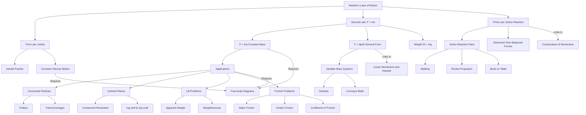

# 1. Overview / 概述

**English:** Newton's Laws of Motion form the cornerstone of classical mechanics. These three laws describe the relationship between forces acting on a body and its motion. They are fundamental to understanding why objects move the way they do — from a car accelerating on a highway to a rocket launching into space. In both CAIE 9702 and Edexcel IAL, this topic is essential for solving problems involving [[Free-body Diagrams]], [[Linear Momentum and Impulse]], and [[Conservation of Momentum]]. Real-world applications include vehicle safety design (seatbelts, airbags), sports physics, and space exploration.

**中文:** 牛顿运动定律是经典力学的基石。这三条定律描述了作用在物体上的力与其运动之间的关系。它们是理解物体为何以特定方式运动的基础——从高速公路上加速的汽车到发射升空的火箭。在CAIE 9702和Edexcel IAL中，这个主题对于解决涉及[[受力分析图]]、[[线性动量与冲量]]和[[动量守恒]]的问题至关重要。实际应用包括车辆安全设计（安全带、安全气囊）、运动物理学和太空探索。

> 📷 **IMAGE PROMPT — [NL-OV-01]: Newton's Laws Overview**
> A split-panel diagram showing three real-world scenes: (1) A book resting on a table (First Law - inertia), (2) A person pushing a shopping cart (Second Law - F=ma), (3) A person jumping off a boat (Third Law - action-reaction). Each scene has a simple force arrow diagram overlay. Labels in English and Chinese. Style: clean educational infographic, pastel colors. Exam importance: HIGH - conceptual understanding.

# 2. Syllabus Learning Objectives / 考纲学习目标

| CAIE 9702 (3.2 d-e) | Edexcel IAL (WPH11 U1: 2.7-2.10) |
|---------------------|----------------------------------|
| State and apply Newton's three laws of motion | Understand and apply Newton's three laws of motion |
| Describe the concept of inertia | Explain the concept of inertia and its relationship to mass |
| Apply F = ma to solve problems involving constant mass | Use F = ma to solve problems, including those with variable mass (e.g., rockets) |
| Solve problems involving connected particles (e.g., pulleys, trains) | Solve problems involving systems of connected bodies |
| Distinguish between weight and mass | Understand the difference between weight and mass |
| Apply Newton's third law to identify action-reaction pairs | Identify and apply action-reaction pairs in various contexts |

**Examiner Expectations / 考官期望:**
- **English:** Candidates must be able to state each law verbatim using exam-standard wording. For CAIE, the ability to draw and interpret [[Free-body Diagrams]] is critical. For Edexcel, understanding the distinction between gravitational field strength (g) and acceleration is often tested. Both boards expect candidates to apply F = ma in both scalar and vector forms.
- **中文:** 考生必须能够用考试标准措辞逐字陈述每条定律。对于CAIE，绘制和解读[[受力分析图]]的能力至关重要。对于Edexcel，理解引力场强度(g)与加速度之间的区别经常被测试。两个考试局都期望考生能以标量和矢量形式应用F = ma。

> 📋 **CIE Only:** CAIE often tests connected particles (e.g., two masses on a pulley) where candidates must apply Newton's second law to each body separately and then solve simultaneous equations.
> 📋 **Edexcel Only:** Edexcel may include questions on variable mass systems (e.g., a rocket ejecting fuel) where F = ma is applied to the instantaneous mass.

# 3. Core Definitions / 核心定义

| Term (EN/CN) | Definition (EN) | Definition (CN) | Common Mistakes / 常见错误 |
|--------------|-----------------|-----------------|--------------------------|
| **Newton's First Law** / 牛顿第一定律 | A body remains at rest or moves with constant velocity unless acted upon by a resultant force. | 物体保持静止或匀速直线运动状态，除非受到合外力的作用。 | Confusing "constant velocity" with "constant speed" (velocity includes direction). |
| **Newton's Second Law** / 牛顿第二定律 | The rate of change of momentum of a body is directly proportional to the resultant force acting on it, and takes place in the direction of that force. | 物体动量的变化率与作用在其上的合外力成正比，且发生在该力的方向上。 | Forgetting that F = ma only applies when mass is constant. |
| **Newton's Third Law** / 牛顿第三定律 | When two bodies interact, the forces they exert on each other are equal in magnitude, opposite in direction, and act on different bodies. | 当两个物体相互作用时，它们彼此施加的力大小相等、方向相反，且作用在不同物体上。 | Confusing action-reaction pairs with balanced forces (they act on the SAME body). |
| **Inertia** / 惯性 | The tendency of a body to resist any change in its state of motion. | 物体抵抗其运动状态发生任何变化的趋势。 | Thinking inertia is a force (it is a property of mass). |
| **Mass** / 质量 | A measure of the amount of matter in a body; also a measure of its inertia. | 物体中物质数量的量度；也是其惯性大小的量度。 | Confusing mass with weight (mass is scalar, weight is a force). |
| **Weight** / 重量 | The gravitational force exerted on a body; W = mg. | 作用在物体上的引力；W = mg。 | Using g = 9.81 m/s² when the problem specifies a different value (e.g., on the Moon). |
| **Resultant Force** / 合力 | The single force that has the same effect as all the forces acting on a body combined. | 与作用在物体上的所有力的组合效果相同的单一力。 | Forgetting to consider direction when adding forces vectorially. |
| **Action-Reaction Pair** / 作用力与反作用力对 | A pair of forces that are equal in magnitude, opposite in direction, and act on two different interacting bodies. | 大小相等、方向相反、作用在两个不同相互作用物体上的一对力。 | Saying "the reaction force is the opposite of the action" without specifying they act on different bodies. |

# 4. Key Concepts Explained / 关键概念详解

## 4.1 Newton's First Law (Inertia) / 牛顿第一定律（惯性）

### Explanation / 解释
**English:** [[Newton's First Law (Inertia)]] states that a body remains at rest or moves with constant velocity unless acted upon by a resultant force. This law introduces the concept of [[Inertia]] — the tendency of an object to resist changes in its motion. A stationary object will stay stationary, and a moving object will keep moving at the same speed in the same straight line, unless a net external force intervenes. This is why passengers lurch forward when a car suddenly brakes — their bodies continue moving forward due to inertia.

**中文:** [[牛顿第一定律（惯性）]]指出，物体保持静止或匀速直线运动状态，除非受到合外力的作用。这条定律引入了[[惯性]]的概念——物体抵抗其运动状态发生变化的趋势。静止的物体会保持静止，运动的物体会保持相同速度和方向的直线运动，除非有净外力介入。这就是为什么当汽车突然刹车时，乘客会向前冲——他们的身体由于惯性而继续向前运动。

### Physical Meaning / 物理意义
**English:** The First Law defines a [[Inertial Frame of Reference]] — a frame in which a body with zero net force moves with constant velocity. It establishes that force is NOT needed to maintain motion (as Aristotle thought), but rather to CHANGE motion. This is the foundation for understanding [[Newton's Second Law (F=ma)]].

**中文:** 第一定律定义了[[惯性参考系]]——在该参考系中，净力为零的物体做匀速运动。它确立了力不是维持运动所必需的（如亚里士多德所想），而是改变运动所必需的。这是理解[[牛顿第二定律（F=ma）]]的基础。

### Common Misconceptions / 常见误区
- ❌ **"Inertia is a force"** — Inertia is a property of mass, not a force. It does not appear in free-body diagrams.
- ❌ **"A moving object needs a force to keep moving"** — In the absence of friction, no force is needed to maintain constant velocity.
- ❌ **"Heavier objects have more inertia"** — This is TRUE (mass is a measure of inertia), but many students think inertia only applies to stationary objects.

### Exam Tips / 考试提示
**English:** When answering questions about the First Law, always mention "resultant force" or "net force." For CAIE, be prepared to explain why passengers move forward when a bus stops. For Edexcel, you may need to relate inertia to mass in qualitative questions.
**中文:** 回答关于第一定律的问题时，始终提及"合力"或"净力"。对于CAIE，要准备好解释为什么公交车停下时乘客会向前移动。对于Edexcel，你可能需要将惯性与质量联系起来回答定性问题。

> 📷 **IMAGE PROMPT — [NL-FL-01]: Inertia Demonstration**
> A diagram showing a person in a car: (a) Car moving at constant velocity — person at rest relative to car. (b) Car suddenly brakes — person lurches forward. Force arrows: friction on car tires (backward), no horizontal force on person initially. Labels: "Inertia keeps person moving forward." Style: simple cartoon, clear arrows. Exam importance: HIGH.

## 4.2 Newton's Second Law (F = ma) / 牛顿第二定律（F = ma）

### Explanation / 解释
**English:** [[Newton's Second Law (F=ma)]] states that the rate of change of momentum of a body is directly proportional to the resultant force acting on it, and takes place in the direction of that force. Mathematically: F = dp/dt. For constant mass, this simplifies to F = ma, where F is the resultant force, m is the mass, and a is the acceleration. This is the most frequently applied law in mechanics problems.

**中文:** [[牛顿第二定律（F=ma）]]指出，物体动量的变化率与作用在其上的合外力成正比，且发生在该力的方向上。数学表达式：F = dp/dt。对于质量恒定的物体，这简化为F = ma，其中F是合力，m是质量，a是加速度。这是力学问题中最常用的定律。

### Physical Meaning / 物理意义
**English:** The Second Law quantifies the relationship between force and motion. It tells us that:
- A larger force produces a larger acceleration (for the same mass)
- A larger mass requires a larger force to achieve the same acceleration
- The direction of acceleration is the same as the direction of the resultant force

This law is the basis for [[Applications of Newton's Laws]] in all mechanics problems.

**中文:** 第二定律量化了力与运动之间的关系。它告诉我们：
- 更大的力产生更大的加速度（对于相同质量）
- 更大的质量需要更大的力才能达到相同的加速度
- 加速度的方向与合力的方向相同

这条定律是所有力学问题中[[牛顿定律的应用]]的基础。

### Common Misconceptions / 常见误区
- ❌ **"F = ma means force causes acceleration"** — Correct, but many students forget that acceleration is the RESULT, not the cause.
- ❌ **"The force in F = ma is any individual force"** — F must be the RESULTANT (net) force, not any single force.
- ❌ **"If velocity is zero, acceleration must be zero"** — An object at the top of its trajectory (e.g., a ball thrown upward) has v = 0 but a = g downward.
- ❌ **"F = ma works for variable mass"** — Only the momentum form F = dp/dt works for variable mass systems.

### Exam Tips / 考试提示
**English:** Always draw a [[Free-body Diagrams]] first. Resolve forces into components if needed. For connected particles (CAIE common), apply F = ma to each body separately, then solve simultaneous equations. For Edexcel, be careful with variable mass problems — use F = dp/dt.
**中文:** 始终先画[[受力分析图]]。如果需要，将力分解为分量。对于连接体（CAIE常见），分别对每个物体应用F = ma，然后解联立方程。对于Edexcel，注意变质量问题——使用F = dp/dt。

> 📷 **IMAGE PROMPT — [NL-SL-01]: F = ma Diagram**
> A block of mass m on a frictionless surface. A horizontal force F is applied to the right. Free-body diagram shows: weight mg (down), normal reaction N (up), applied force F (right). Acceleration a = F/m to the right. Labels: "Resultant Force = F", "a = F/m". Style: clean physics diagram, vector arrows with labels. Exam importance: VERY HIGH.

## 4.3 Newton's Third Law (Action-Reaction) / 牛顿第三定律（作用力与反作用力）

### Explanation / 解释
**English:** [[Newton's Third Law (Action-Reaction)]] states that when two bodies interact, the forces they exert on each other are equal in magnitude, opposite in direction, and act on different bodies. For example, when you push a wall, the wall pushes back on you with equal force. The pair of forces is called an [[Action-Reaction Pair]].

**中文:** [[牛顿第三定律（作用力与反作用力）]]指出，当两个物体相互作用时，它们彼此施加的力大小相等、方向相反，且作用在不同物体上。例如，当你推墙时，墙以相等的力推回你。这一对力称为[[作用力与反作用力对]]。

### Physical Meaning / 物理意义
**English:** The Third Law explains why forces always come in pairs. It is the reason we can walk (we push backward on the ground, the ground pushes us forward), rockets can fly (exhaust gases push down, the rocket is pushed up), and boats move (oars push water backward, water pushes boat forward). Crucially, action-reaction pairs act on DIFFERENT bodies, so they do NOT cancel each other out.

**中文:** 第三定律解释了为什么力总是成对出现。这是我们能行走（我们向后推地面，地面向前推我们）、火箭能飞行（废气向下推，火箭被向上推）以及船能移动（桨向后推水，水向前推船）的原因。关键在于，作用力与反作用力对作用在**不同**物体上，因此它们不会相互抵消。

### Common Misconceptions / 常见误区
- ❌ **"Action-reaction forces cancel each other"** — They act on different bodies, so they cannot cancel. Cancellation requires forces on the SAME body.
- ❌ **"The action force is greater than the reaction force"** — They are ALWAYS equal in magnitude.
- ❌ **"The reaction force occurs after the action"** — They occur SIMULTANEOUSLY.
- ❌ **"Weight and normal reaction are an action-reaction pair"** — They act on the SAME body (the object), so they are NOT an action-reaction pair. They are balanced forces.

### Exam Tips / 考试提示
**English:** To identify action-reaction pairs: (1) Identify the two interacting bodies, (2) Force on body A from body B, and force on body B from body A. Common exam questions involve a book on a table, a person standing on a floor, or a rocket. For CAIE, distinguish between "balanced forces" (same body) and "action-reaction pairs" (different bodies).
**中文:** 识别作用力与反作用力对的方法：(1) 识别两个相互作用的物体，(2) 物体A受到物体B的力，以及物体B受到物体A的力。常见的考试问题涉及桌子上的书、站在地板上的人或火箭。对于CAIE，要区分"平衡力"（同一物体）和"作用力与反作用力对"（不同物体）。

> 📷 **IMAGE PROMPT — [NL-TL-01]: Action-Reaction Pairs**
> Three examples side by side: (1) Person walking — foot pushes ground backward (action), ground pushes foot forward (reaction). (2) Rocket — exhaust gases push downward (action), rocket pushed upward (reaction). (3) Book on table — book pushes table down (action), table pushes book up (reaction). Each pair shown with equal-length arrows in opposite directions, labeled "Action" and "Reaction" on different bodies. Style: clear diagram, color-coded arrows. Exam importance: VERY HIGH.

## 4.4 Applications of Newton's Laws / 牛顿定律的应用

### Explanation / 解释
**English:** [[Applications of Newton's Laws]] involve using all three laws together to solve real-world problems. Common scenarios include:
- **Connected particles:** Two masses connected by a string over a pulley, or a train with multiple carriages
- **Inclined planes:** Objects sliding down or up a slope
- **Lifts (elevators):** Apparent weight changes during acceleration
- **Circular motion:** (A-level extension) where centripetal force is provided by tension, friction, or gravity

**中文:** [[牛顿定律的应用]]涉及同时使用所有三条定律来解决实际问题。常见场景包括：
- **连接体：** 两个质量通过绳子连接在滑轮上，或带有多个车厢的火车
- **斜面：** 物体沿斜面下滑或上滑
- **电梯：** 加速过程中表观重量的变化
- **圆周运动：**（A-level扩展）向心力由张力、摩擦力或重力提供

### Physical Meaning / 物理意义
**English:** The key to solving application problems is:
1. Draw a [[Free-body Diagrams]] for each object
2. Identify all forces acting on each object
3. Apply Newton's Second Law (F = ma) to each object
4. Use Newton's Third Law to relate forces between objects (e.g., tension in a string is the same on both ends)
5. Solve the resulting equations

**中文:** 解决应用问题的关键是：
1. 为每个物体画[[受力分析图]]
2. 识别作用在每个物体上的所有力
3. 对每个物体应用牛顿第二定律（F = ma）
4. 使用牛顿第三定律关联物体之间的力（例如，绳子两端的张力相同）
5. 解所得方程

### Common Misconceptions / 常见误区
- ❌ **"Tension is different at different points in a light string"** — For a light (massless) string, tension is the same throughout.
- ❌ **"Normal reaction always equals weight"** — Only on horizontal surfaces with no vertical acceleration. On an incline or in an accelerating lift, N ≠ mg.
- ❌ **"Friction always opposes motion"** — Friction opposes RELATIVE motion or attempted motion.

### Exam Tips / 考试提示
**English:** For CAIE, connected particles (pulleys, trains) are very common. Always define a positive direction and stick to it. For Edexcel, lift problems and inclined planes are frequent. Remember that "apparent weight" is the normal reaction force, not actual weight.
**中文:** 对于CAIE，连接体（滑轮、火车）非常常见。始终定义一个正方向并保持一致。对于Edexcel，电梯问题和斜面问题很常见。记住"表观重量"是法向反作用力，而不是实际重量。

> 📷 **IMAGE PROMPT — [NL-AP-01]: Connected Particles on a Pulley**
> Two masses m₁ and m₂ connected by a light inextensible string over a frictionless pulley. m₁ on a horizontal table (with friction coefficient μ), m₂ hanging vertically. Free-body diagrams for each mass: m₁ has weight m₁g (down), normal reaction N (up), tension T (right), friction f (left). m₂ has weight m₂g (down), tension T (up). Acceleration a shown for each. Labels: "Tension T same throughout string", "a₁ = a₂ = a". Style: standard physics diagram. Exam importance: VERY HIGH for CAIE.

# 5. Essential Equations / 核心公式

## 5.1 Newton's Second Law (General Form) / 牛顿第二定律（一般形式）

$$ \mathbf{F} = \frac{d\mathbf{p}}{dt} $$

| Symbol (符号) | Meaning (EN/CN) | Unit (单位) |
|---------------|-----------------|-------------|
| $\mathbf{F}$ | Resultant force / 合力 | N (newton) |
| $\mathbf{p}$ | Momentum / 动量 | kg·m/s |
| $t$ | Time / 时间 | s |

**Derivation / 推导:** This is the original form stated by Newton. For constant mass, it simplifies to F = ma.
**Conditions / 适用条件:** Always valid, including for variable mass systems.
**Limitations / 局限性:** Requires an inertial frame of reference.

## 5.2 Newton's Second Law (Constant Mass) / 牛顿第二定律（质量恒定）

$$ \mathbf{F} = m\mathbf{a} $$

| Symbol (符号) | Meaning (EN/CN) | Unit (单位) |
|---------------|-----------------|-------------|
| $\mathbf{F}$ | Resultant force / 合力 | N |
| $m$ | Mass / 质量 | kg |
| $\mathbf{a}$ | Acceleration / 加速度 | m/s² |

**Derivation / 推导:** From F = dp/dt = d(mv)/dt = m(dv/dt) = ma (when m is constant).
**Conditions / 适用条件:** Mass must be constant. Valid only in inertial frames.
**Limitations / 局限性:** Does NOT apply to variable mass systems (e.g., rockets, conveyor belts).
**Rearrangements / 变形:**
- $a = F/m$ — acceleration is proportional to force, inversely proportional to mass
- $m = F/a$ — inertial mass measurement

## 5.3 Weight / 重量

$$ W = mg $$

| Symbol (符号) | Meaning (EN/CN) | Unit (单位) |
|---------------|-----------------|-------------|
| $W$ | Weight / 重量 | N |
| $m$ | Mass / 质量 | kg |
| $g$ | Gravitational field strength / 引力场强度 | N/kg or m/s² |

**Derivation / 推导:** From F = ma, where a = g (acceleration due to gravity).
**Conditions / 适用条件:** Near the surface of a planet/star.
**Limitations / 局限性:** g varies with altitude and location. On Earth, g ≈ 9.81 m/s².

## 5.4 Momentum Form / 动量形式

$$ \mathbf{F} = \frac{\Delta \mathbf{p}}{\Delta t} $$

| Symbol (符号) | Meaning (EN/CN) | Unit (单位) |
|---------------|-----------------|-------------|
| $\mathbf{F}$ | Average resultant force / 平均合力 | N |
| $\Delta \mathbf{p}$ | Change in momentum / 动量变化 | kg·m/s |
| $\Delta t$ | Time interval / 时间间隔 | s |

**Derivation / 推导:** From F = dp/dt, approximated over a finite time interval.
**Conditions / 适用条件:** Valid for constant or average forces.
**Limitations / 局限性:** For instantaneous forces, use the differential form.

## 5.5 Newton's Third Law / 牛顿第三定律

$$ \mathbf{F}_{AB} = -\mathbf{F}_{BA} $$

| Symbol (符号) | Meaning (EN/CN) | Unit (单位) |
|---------------|-----------------|-------------|
| $\mathbf{F}_{AB}$ | Force on body A from body B / 物体B对物体A的力 | N |
| $\mathbf{F}_{BA}$ | Force on body B from body A / 物体A对物体B的力 | N |

**Derivation / 推导:** Empirical law — cannot be derived from other principles.
**Conditions / 适用条件:** Always true for all interactions.
**Limitations / 局限性:** The two forces act on DIFFERENT bodies — they do NOT cancel.

# 6. Graphs and Relationships / 图表与关系

## 6.1 Force vs. Acceleration (Constant Mass) / 力与加速度关系（质量恒定）

**Axes / 坐标轴:** X-axis: Acceleration a (m/s²), Y-axis: Force F (N)

**Shape / 形状:** Straight line through origin

**Gradient Meaning / 斜率含义:**
- **English:** Gradient = mass (m). A steeper line means larger mass.
- **中文:** 斜率 = 质量(m)。线越陡表示质量越大。

**Area Meaning / 面积含义:**
- **English:** No meaningful area under this graph.
- **中文:** 该图线下没有有意义的面积。

**Exam Interpretation / 考试解读:**
- **English:** This graph demonstrates F ∝ a when m is constant. Used to verify Newton's Second Law experimentally.
- **中文:** 该图表明当m恒定时F ∝ a。用于实验验证牛顿第二定律。

**Common Questions / 常见问题:**
- "What does the gradient represent?" → Mass
- "What would happen if mass is doubled?" → Gradient doubles (line becomes steeper)

> 📷 **IMAGE PROMPT — [NL-GR-01]: F vs a Graph**
> A graph with acceleration on x-axis and force on y-axis. Three straight lines through origin with different slopes, labeled m₁, m₂, m₃ where m₁ < m₂ < m₃. Axes labeled with units. Style: clean graph paper style. Exam importance: HIGH.

## 6.2 Acceleration vs. 1/Mass (Constant Force) / 加速度与1/质量关系（力恒定）

**Axes / 坐标轴:** X-axis: 1/m (kg⁻¹), Y-axis: Acceleration a (m/s²)

**Shape / 形状:** Straight line through origin

**Gradient Meaning / 斜率含义:**
- **English:** Gradient = Force (F). A steeper line means larger applied force.
- **中文:** 斜率 = 力(F)。线越陡表示施加的力越大。

**Area Meaning / 面积含义:**
- **English:** No meaningful area under this graph.
- **中文:** 该图线下没有有意义的面积。

**Exam Interpretation / 考试解读:**
- **English:** This graph demonstrates a ∝ 1/m when F is constant. Used to verify Newton's Second Law experimentally.
- **中文:** 该图表明当F恒定时a ∝ 1/m。用于实验验证牛顿第二定律。

**Common Questions / 常见问题:**
- "Why plot a against 1/m instead of a against m?" → To get a linear relationship
- "What does the gradient represent?" → The constant force applied

> 📷 **IMAGE PROMPT — [NL-GR-02]: a vs 1/m Graph**
> A graph with 1/m on x-axis and acceleration on y-axis. A straight line through origin. Axes labeled with units. Style: clean graph paper style. Exam importance: HIGH.

## 6.3 Velocity-Time Graph for Constant Force / 恒力作用下的速度-时间图

**Axes / 坐标轴:** X-axis: Time t (s), Y-axis: Velocity v (m/s)

**Shape / 形状:** Straight line with constant gradient (for constant mass and constant resultant force)

**Gradient Meaning / 斜率含义:**
- **English:** Gradient = acceleration (a). From F = ma, gradient = F/m.
- **中文:** 斜率 = 加速度(a)。由F = ma，斜率 = F/m。

**Area Meaning / 面积含义:**
- **English:** Area under graph = displacement (s).
- **中文:** 图线下面积 = 位移(s)。

**Exam Interpretation / 考试解读:**
- **English:** A constant gradient indicates constant resultant force. Changing gradient indicates changing force.
- **中文:** 恒定斜率表示恒定合力。变化的斜率表示变化的力。

**Common Questions / 常见问题:**
- "How to find force from a v-t graph?" → Find gradient (a), then use F = ma
- "What if the line is curved?" → Force is changing (non-constant)

# 7. Required Diagrams / 必备图表

## 7.1 Free-Body Diagram for a Block on a Horizontal Surface / 水平面上物块的受力分析图

> 📷 **IMAGE PROMPT — [NL-DI-01]: Free-Body Diagram - Block on Horizontal Surface**
> A rectangular block resting on a horizontal surface. Four force arrows from the center of the block: (1) Weight W = mg pointing straight down, (2) Normal reaction N pointing straight up (equal length to W), (3) Applied force F pointing to the right (if being pushed), (4) Friction f pointing to the left (opposing motion). All arrows labeled with force names and symbols. Style: clean physics diagram, vector arrows with arrowheads, different colors for different forces. Exam importance: ESSENTIAL - this is the most basic and most tested diagram.

## 7.2 Free-Body Diagram for a Block on an Inclined Plane / 斜面上物块的受力分析图

> 📷 **IMAGE PROMPT — [NL-DI-02]: Free-Body Diagram - Block on Inclined Plane**
> A rectangular block on a plane inclined at angle θ to the horizontal. Three force arrows from the center of the block: (1) Weight W = mg pointing straight down, (2) Normal reaction N perpendicular to the plane surface, (3) Friction f parallel to the plane surface (up the plane if block is sliding down). Additionally, show the resolution of weight into components: mg sinθ parallel to the plane (down the plane) and mg cosθ perpendicular to the plane. Labels: "mg sinθ", "mg cosθ", "θ". Style: clean physics diagram, dashed lines for component resolution. Exam importance: VERY HIGH - common in both CAIE and Edexcel.

## 7.3 Action-Reaction Pairs: Book on Table / 作用力与反作用力对：桌子上的书

> 📷 **IMAGE PROMPT — [NL-DI-03]: Action-Reaction Pairs - Book on Table**
> A book resting on a table. Two pairs of arrows shown: (1) Pair 1: Book's weight on Earth (W_book_Earth) — arrow from book center pointing down; Earth's gravitational pull on book (W_Earth_book) — arrow from Earth center pointing up (not to scale). (2) Pair 2: Book pushes down on table (F_book_table) — arrow from book bottom pointing down; Table pushes up on book (F_table_book) — arrow from table top pointing up. Also show balanced forces on the book: weight (down) and normal reaction (up) — these are NOT action-reaction pairs because they act on the SAME body. Labels clearly distinguishing "Action-Reaction Pairs" vs "Balanced Forces". Style: educational diagram, color-coded pairs, clear labels. Exam importance: VERY HIGH - common misconception area.

## 7.4 Connected Particles on a Pulley / 滑轮上的连接体

> 📷 **IMAGE PROMPT — [NL-DI-04]: Connected Particles on a Pulley System**
> Two masses m₁ and m₂ connected by a light inextensible string passing over a frictionless pulley. m₁ on a horizontal surface (with friction), m₂ hanging vertically. Free-body diagrams for each mass: m₁ — weight m₁g (down), normal reaction N (up), tension T (right), friction f (left). m₂ — weight m₂g (down), tension T (up). Acceleration a shown for each mass (m₁ to the right, m₂ downward). Labels: "Tension T same throughout", "a₁ = a₂ = a", "Light inextensible string", "Frictionless pulley". Style: standard physics diagram, clear force arrows. Exam importance: VERY HIGH for CAIE.

# 8. Worked Examples / 典型例题

## Example 1: Connected Particles on a Pulley / 滑轮上的连接体

### Question / 题目
**English:** Two masses, m₁ = 4.0 kg and m₂ = 2.0 kg, are connected by a light inextensible string that passes over a frictionless pulley. m₁ rests on a horizontal table with a coefficient of friction μ = 0.30. m₂ hangs freely. Calculate:
(a) The acceleration of the system
(b) The tension in the string

**中文:** 两个质量分别为m₁ = 4.0 kg和m₂ = 2.0 kg的物体，通过一根轻质不可伸长的绳子连接，绳子绕过无摩擦的滑轮。m₁放在水平桌面上，摩擦系数μ = 0.30。m₂自由悬挂。计算：
(a) 系统的加速度
(b) 绳子中的张力

### Image Prompt / 图片提示
> 📷 **IMAGE PROMPT — [NL-EX-01]: Pulley System for Example 1**
> Diagram showing m₁ = 4.0 kg on a horizontal table connected by a string over a pulley to m₂ = 2.0 kg hanging vertically. Free-body diagrams for each mass with force arrows labeled. Coefficient of friction μ = 0.30 indicated. Style: standard physics diagram.

### Solution / 解答

**Step 1: Draw free-body diagrams and define positive direction / 画受力分析图并定义正方向**
- **English:** Define positive direction as: m₁ moving right, m₂ moving down.
- **中文:** 定义正方向为：m₁向右运动，m₂向下运动。

**Step 2: Identify forces on each mass / 识别每个物体上的力**

For m₁ (4.0 kg):
- Weight: $W_1 = m_1g = 4.0 \times 9.81 = 39.24 \text{ N}$ (down)
- Normal reaction: $N = W_1 = 39.24 \text{ N}$ (up) — no vertical acceleration
- Friction: $f = \mu N = 0.30 \times 39.24 = 11.77 \text{ N}$ (left, opposing motion)
- Tension: $T$ (right)

For m₂ (2.0 kg):
- Weight: $W_2 = m_2g = 2.0 \times 9.81 = 19.62 \text{ N}$ (down)
- Tension: $T$ (up)

**Step 3: Apply Newton's Second Law to each mass / 对每个物体应用牛顿第二定律**

For m₁ (positive direction = right):
$$ T - f = m_1a $$
$$ T - 11.77 = 4.0a \quad \text{(1)} $$

For m₂ (positive direction = down):
$$ W_2 - T = m_2a $$
$$ 19.62 - T = 2.0a \quad \text{(2)} $$

**Step 4: Solve simultaneous equations / 解联立方程**

Add equations (1) and (2):
$$ (T - 11.77) + (19.62 - T) = 4.0a + 2.0a $$
$$ 7.85 = 6.0a $$
$$ a = \frac{7.85}{6.0} = 1.31 \text{ m/s}^2 $$

Substitute a into equation (1):
$$ T - 11.77 = 4.0 \times 1.31 $$
$$ T = 11.77 + 5.24 = 17.01 \text{ N} $$

### Final Answer / 最终答案
(a) Acceleration: $a = 1.31 \text{ m/s}^2$
(b) Tension: $T = 17.0 \text{ N}$ (3 significant figures)

### Examiner Notes / 考官点评
**English:** Common mistakes: (1) Forgetting to include friction, (2) Using the same sign convention for both masses incorrectly, (3) Assuming tension equals weight of hanging mass (it doesn't when the system accelerates). Always check that your answer is reasonable — the acceleration should be less than g (9.81 m/s²).
**中文:** 常见错误：(1) 忘记考虑摩擦力，(2) 对两个物体使用相同的符号约定但方向错误，(3) 假设张力等于悬挂物体的重量（系统加速时并非如此）。始终检查答案是否合理——加速度应小于g（9.81 m/s²）。

## Example 2: Lift (Elevator) Problem / 电梯问题

### Question / 题目
**English:** A person of mass 60 kg stands on a bathroom scale inside a lift. Calculate the reading on the scale (the normal reaction force) when:
(a) The lift is stationary
(b) The lift accelerates upward at 2.0 m/s²
(c) The lift accelerates downward at 2.0 m/s²
(d) The lift moves upward at constant velocity of 3.0 m/s

**中文:** 一个质量为60 kg的人站在电梯内的浴室秤上。计算秤的读数（法向反作用力）当：
(a) 电梯静止时
(b) 电梯以2.0 m/s²向上加速时
(c) 电梯以2.0 m/s²向下加速时
(d) 电梯以3.0 m/s匀速向上运动时

### Image Prompt / 图片提示
> 📷 **IMAGE PROMPT — [NL-EX-02]: Person in Lift**
> A person standing on a scale inside a lift. Two force arrows on the person: weight W = mg (down) and normal reaction N (up). Arrow lengths vary for different acceleration cases. Labels: "N = scale reading", "W = mg". Style: simple diagram. Exam importance: HIGH.

### Solution / 解答

**Step 1: Identify forces / 识别力**
- **English:** Two forces act on the person: Weight $W = mg$ (downward) and Normal reaction $N$ (upward, this is the scale reading).
- **中文:** 人受到两个力：重量$W = mg$（向下）和法向反作用力$N$（向上，这就是秤的读数）。

**Step 2: Apply Newton's Second Law / 应用牛顿第二定律**
- **English:** Define positive direction as upward. $F_{\text{net}} = N - mg = ma$
- **中文:** 定义正方向向上。$F_{\text{净}} = N - mg = ma$

**Step 3: Solve for each case / 求解每种情况**

(a) Stationary: $a = 0$
$$ N - mg = 0 $$
$$ N = mg = 60 \times 9.81 = 588.6 \text{ N} $$

(b) Accelerating upward: $a = +2.0 \text{ m/s}^2$
$$ N - mg = ma $$
$$ N = m(g + a) = 60 \times (9.81 + 2.0) = 60 \times 11.81 = 708.6 \text{ N} $$

(c) Accelerating downward: $a = -2.0 \text{ m/s}^2$
$$ N - mg = m(-2.0) $$
$$ N = m(g - a) = 60 \times (9.81 - 2.0) = 60 \times 7.81 = 468.6 \text{ N} $$

(d) Constant velocity: $a = 0$
$$ N = mg = 588.6 \text{ N} $$

### Final Answer / 最终答案
(a) $N = 589 \text{ N}$ (stationary)
(b) $N = 709 \text{ N}$ (accelerating upward)
(c) $N = 469 \text{ N}$ (accelerating downward)
(d) $N = 589 \text{ N}$ (constant velocity)

### Examiner Notes / 考官点评
**English:** Key insight: The scale reading (apparent weight) equals mg only when acceleration is zero. When accelerating upward, apparent weight > actual weight (you feel heavier). When accelerating downward, apparent weight < actual weight (you feel lighter). If the lift were in free fall (a = g downward), N = 0 — you would feel weightless. Common mistake: using N = mg for all cases.
**中文:** 关键洞察：只有当加速度为零时，秤的读数（表观重量）才等于mg。向上加速时，表观重量 > 实际重量（感觉更重）。向下加速时，表观重量 < 实际重量（感觉更轻）。如果电梯自由落体（a = g向下），N = 0——你会感觉失重。常见错误：对所有情况都使用N = mg。

# 9. Past Paper Question Types / 历年真题题型

| Question Type / 题型 | Frequency / 频率 | Difficulty / 难度 | Past Paper References / 真题索引 |
|----------------------|------------------|-------------------|----------------------------------|
| State Newton's laws verbatim / 逐字陈述牛顿定律 | Medium / 中等 | Easy / 简单 | 📝 *待填入* |
| Identify action-reaction pairs / 识别作用力与反作用力对 | High / 高 | Medium / 中等 | 📝 *待填入* |
| Draw free-body diagrams / 画受力分析图 | Very High / 非常高 | Medium / 中等 | 📝 *待填入* |
| Calculate acceleration from F = ma / 从F = ma计算加速度 | Very High / 非常高 | Medium / 中等 | 📝 *待填入* |
| Connected particles (pulleys) / 连接体（滑轮） | High (CAIE) / 高 | Hard / 困难 | 📝 *待填入* |
| Lift (elevator) problems / 电梯问题 | Medium (Edexcel) / 中等 | Medium / 中等 | 📝 *待填入* |
| Inclined plane problems / 斜面问题 | High / 高 | Medium-Hard / 中-困难 | 📝 *待填入* |
| Experimental verification of F = ma / F = ma的实验验证 | Medium / 中等 | Medium / 中等 | 📝 *待填入* |
| Variable mass problems / 变质量问题 | Low (Edexcel) / 低 | Hard / 困难 | 📝 *待填入* |
| Momentum form of Newton's Second Law / 牛顿第二定律的动量形式 | Medium / 中等 | Medium / 中等 | 📝 *待填入* |

> 📝 **题库整理中 / Question Bank Under Construction:**
> **English:** The past paper references are being compiled. For CAIE 9702, focus on Paper 2 (AS structured questions) and Paper 4 (A2, for circular motion applications). For Edexcel IAL, focus on Unit 1 (WPH11) Section 2.7-2.10. Common question numbers will be added in future updates.
> **中文:** 真题索引正在整理中。对于CAIE 9702，重点关注试卷2（AS结构化问题）和试卷4（A2，用于圆周运动应用）。对于Edexcel IAL，重点关注单元1（WPH11）第2.7-2.10节。常见题号将在未来更新中添加。

**Common Command Words / 常见指令词:**
- **State / 陈述:** Give a definition or law without explanation
- **Explain / 解释:** Give reasons or causes
- **Calculate / 计算:** Use mathematics to find a numerical answer
- **Draw / 画:** Produce a diagram (e.g., free-body diagram)
- **Show / 证明:** Demonstrate with reasoning or calculation
- **Determine / 确定:** Find a value using given information
- **Discuss / 讨论:** Present arguments for and against, or describe implications

# 10. Practical Skills Connections / 实验技能链接

**English:** Newton's Laws are central to several required practicals:

1. **Verification of F = ma (CAIE Paper 3 / Edexcel Unit 3):**
   - Use a trolley on a friction-compensated runway
   - Vary the applied force (by adding slotted masses to a hanging string over a pulley)
   - Measure acceleration using light gates or ticker-tape timers
   - Plot F vs a graph — gradient gives mass
   - Key uncertainties: friction compensation, reaction time, light gate precision

2. **Determination of g (acceleration due to gravity):**
   - Free-fall experiments using electromagnets and timers
   - Inclined plane experiments to measure acceleration down a slope
   - Relates to W = mg and F = ma

3. **Investigation of Friction:**
   - Measure limiting friction using a spring balance
   - Relate to Newton's First Law (object just about to move)
   - Determine coefficient of friction μ

4. **Conservation of Momentum (links to Newton's Third Law):**
   - Collision experiments using air tracks
   - Newton's Third Law explains why momentum is conserved in collisions

**中文:** 牛顿定律是几个必修实验的核心：

1. **验证F = ma（CAIE试卷3 / Edexcel单元3）：**
   - 使用摩擦补偿轨道上的小车
   - 改变施加的力（通过在滑轮上的悬挂绳上添加槽码）
   - 使用光门或打点计时器测量加速度
   - 绘制F vs a图——斜率给出质量
   - 关键不确定度：摩擦补偿、反应时间、光门精度

2. **测定g（重力加速度）：**
   - 使用电磁铁和计时器的自由落体实验
   - 测量沿斜面下滑加速度的斜面实验
   - 与W = mg和F = ma相关

3. **摩擦力的研究：**
   - 使用弹簧测力计测量极限摩擦力
   - 与牛顿第一定律相关（物体即将运动时）
   - 确定摩擦系数μ

4. **动量守恒（与牛顿第三定律的联系）：**
   - 使用气轨的碰撞实验
   - 牛顿第三定律解释了为什么碰撞中动量守恒

> 📋 **CIE Only:** CAIE Paper 3 (Practical) often requires plotting F vs a graphs and calculating the gradient. Paper 5 (Planning) may ask for experimental design to verify Newton's Second Law.
> 📋 **Edexcel Only:** Edexcel Unit 3 (Practical Skills) may include determining g using free-fall apparatus or investigating motion on an inclined plane. Unit 6 (A2) extends to circular motion applications.

# 11. Concept Map / 概念图谱



# 12. Examiner Insights / 考官洞察

**English:**

**Most Tested Ideas (CAIE 9702):**
1. **Connected particles (pulleys)** — Almost guaranteed in Paper 2. Candidates must apply F = ma to each body separately.
2. **Free-body diagrams** — Required in nearly every mechanics question. Marks are awarded for correct force directions and labels.
3. **Distinguishing between Newton's Third Law pairs and balanced forces** — A common 2-3 mark question.
4. **Friction on inclined planes** — Resolving weight into components is essential.

**Most Tested Ideas (Edexcel IAL):**
1. **Lift problems** — Apparent weight calculations are frequent in Unit 1.
2. **Variable mass systems** — Less common but appears in harder questions.
3. **Experimental verification of F = ma** — Links to practical skills in Unit 3.
4. **Action-reaction pairs in everyday contexts** — Walking, swimming, rocket propulsion.

**Mark Scheme Wording / 评分方案措辞:**
- For "State Newton's First Law": "A body remains at rest or moves with constant velocity unless acted upon by a resultant force." (Must mention "resultant force")
- For "State Newton's Second Law": "The rate of change of momentum is directly proportional to the resultant force and takes place in the direction of that force." (Must mention "rate of change of momentum")
- For "State Newton's Third Law": "When two bodies interact, the forces they exert on each other are equal in magnitude, opposite in direction, and act on different bodies." (Must mention "different bodies")

**Common Lost Marks / 常见失分点:**
1. **Forgetting to include all forces** — Missing friction or normal reaction.
2. **Incorrect sign conventions** — Not defining a positive direction before applying F = ma.
3. **Confusing mass and weight** — Using kg as a unit of force.
4. **Not stating that the string is light and inextensible** — This justifies constant tension throughout.
5. **Forgetting that action-reaction pairs act on different bodies** — Saying they cancel.

**High-Scoring Structures / 高分结构:**
- Always start with a clear free-body diagram
- Define a positive direction explicitly
- Write F = ma for each body separately
- Show all algebraic steps before substituting numbers
- Check units and significant figures in the final answer

**中文:**

**最常考内容（CAIE 9702）：**
1. **连接体（滑轮）** — 几乎必出现在试卷2中。考生必须分别对每个物体应用F = ma。
2. **受力分析图** — 几乎每个力学问题都需要。正确的力方向和标签可获得分数。
3. **区分牛顿第三定律力对和平衡力** — 常见的2-3分问题。
4. **斜面上的摩擦力** — 将重量分解为分量是必要的。

**最常考内容（Edexcel IAL）：**
1. **电梯问题** — 表观重量计算在单元1中很常见。
2. **变质量系统** — 较少见，但出现在较难的问题中。
3. **F = ma的实验验证** — 与单元3的实验技能相关。
4. **日常情境中的作用力与反作用力对** — 行走、游泳、火箭推进。

**评分方案措辞：**
- 对于"陈述牛顿第一定律"："物体保持静止或匀速直线运动状态，除非受到合外力的作用。"（必须提及"合力"）
- 对于"陈述牛顿第二定律"："动量的变化率与合外力成正比，且发生在该力的方向上。"（必须提及"动量的变化率"）
- 对于"陈述牛顿第三定律"："当两个物体相互作用时，它们彼此施加的力大小相等、方向相反，且作用在不同物体上。"（必须提及"不同物体"）

**常见失分点：**
1. **忘记包括所有力** — 缺少摩擦力或法向反作用力。
2. **符号约定错误** — 在应用F = ma之前没有定义正方向。
3. **混淆质量和重量** — 使用kg作为力的单位。
4. **未说明绳子是轻质且不可伸长的** — 这证明了整个绳子张力恒定。
5. **忘记作用力与反作用力对作用在不同物体上** — 说它们相互抵消。

**高分结构：**
- 始终以清晰的受力分析图开始
- 明确定义正方向
- 分别对每个物体写出F = ma
- 在代入数字之前展示所有代数步骤
- 检查最终答案的单位和有效数字

# 13. Quick Revision Sheet / 速查表

| Category / 类别 | Key Points / 要点 |
|-----------------|-------------------|
| **First Law / 第一定律** | No resultant force → constant velocity (or rest). Inertia = resistance to change in motion. Mass measures inertia. |
| **Second Law / 第二定律** | F = ma (constant mass). F = dp/dt (general). Resultant force causes acceleration in its direction. |
| **Third Law / 第三定律** | Forces equal in magnitude, opposite in direction, on DIFFERENT bodies. Do NOT cancel. |
| **Weight / 重量** | W = mg. g = 9.81 N/kg on Earth. Weight is a force, mass is scalar. |
| **Free-Body Diagrams / 受力分析图** | Show ALL forces on ONE body. Arrows from center. Label each force. |
| **Connected Particles / 连接体** | Same acceleration for all bodies. Tension same in light inextensible string. Apply F = ma to each. |
| **Inclined Planes / 斜面** | Resolve weight: mg sinθ (parallel), mg cosθ (perpendicular). N = mg cosθ. |
| **Lift Problems / 电梯问题** | N = m(g ± a). Upward accel → N > mg. Downward accel → N < mg. Free fall → N = 0. |
| **Friction / 摩擦力** | f = μN (kinetic). Opposes relative motion. Static friction ≤ μₛN. |
| **Action-Reaction vs Balanced / 作用力-反作用力 vs 平衡力** | Action-reaction: different bodies, same type. Balanced: same body, different types. |
| **Experimental Verification / 实验验证** | F vs a graph → gradient = m. a vs 1/m graph → gradient = F. Friction compensation needed. |
| **Common Units / 常用单位** | Force: N (kg·m/s²). Mass: kg. Acceleration: m/s². Weight: N. |

# 14. Metadata / 元数据

```yaml
title:
  en: "Newton's Laws of Motion"
  cn: "牛顿运动定律"
subject: Physics
syllabus:
  - CAIE 9702
  - Edexcel IAL
cie_ref: "3.2 (d-e)"
edexcel_ref: "WPH11 U1: 2.7-2.10"
level: AS
node_type: topic_hub
difficulty: intermediate
prerequisites:
  - "[[Free-body Diagrams]]"
related_topics:
  - "[[Linear Momentum and Impulse]]"
  - "[[Conservation of Momentum]]"
sub_topics:
  - "[[Newton's First Law (Inertia)]]"
  - "[[Newton's Second Law (F=ma)]]"
  - "[[Newton's Third Law (Action-Reaction)]]"
  - "[[Applications of Newton's Laws]]"
formula_count: 5
diagram_count: 8
exam_frequency: very_high
language: bilingual_en_cn
last_updated: 2024-01
```

---
**English:** This hub file provides a comprehensive overview of Newton's Laws of Motion for AS-level Physics. Each sub-topic has its own leaf node file for deeper exploration. Use the [[wikilinks]] to navigate to specific topics. For exam preparation, focus on the Worked Examples (Section 8) and Quick Revision Sheet (Section 13).

**中文:** 本枢纽文件提供了AS级物理牛顿运动定律的全面概述。每个子主题都有其自己的叶节点文件供深入探索。使用[[wikilinks]]导航到特定主题。备考时，重点关注典型例题（第8节）和速查表（第13节）。