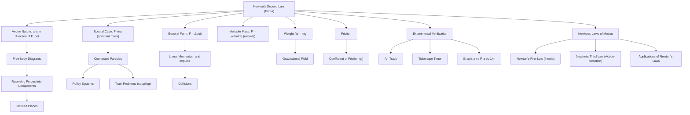

# 1. Overview / 概述

**English:**
Newton's Second Law of Motion is arguably the most fundamental and widely used law in classical mechanics. It establishes a direct, quantitative relationship between the net force acting on an object, its mass, and the acceleration it experiences. The law is famously expressed by the equation $F = ma$, where $F$ is the net force, $m$ is the mass, and $a$ is the acceleration. This sub-topic explores the precise meaning of this equation, its vector nature, and its application to solving problems involving forces and motion. It is the central pillar connecting [[Newton's First Law (Inertia)]] (which describes what happens when no net force acts) to [[Newton's Third Law (Action-Reaction)]] (which describes how forces interact between objects). Mastery of $F=ma$ is essential for understanding [[Linear Momentum and Impulse]] and [[Conservation of Momentum]], as well as for analyzing real-world scenarios from rocket launches to car crashes.

**中文:**
牛顿第二运动定律可以说是经典力学中最基本、应用最广泛的定律。它建立了作用在物体上的净力、物体的质量以及其产生的加速度之间的直接定量关系。该定律由著名的方程 $F = ma$ 表示，其中 $F$ 是净力，$m$ 是质量，$a$ 是加速度。本子知识点探讨该方程的精确含义、其矢量性质以及在解决涉及力和运动问题中的应用。它是连接[[牛顿第一定律（惯性）]]（描述无净力作用时的情况）和[[牛顿第三定律（作用力与反作用力）]]（描述物体间力的相互作用）的核心支柱。掌握 $F=ma$ 对于理解[[线性动量与冲量]]和[[动量守恒]]，以及分析从火箭发射到汽车碰撞等现实世界场景至关重要。

---

# 2. Syllabus Learning Objectives / 考纲学习目标

| CAIE 9702 | Edexcel IAL |
|-----------|-------------|
| 3.2(d) Apply Newton's second law to situations where the mass is constant. | 2.7 Use the equation $F = ma$ for a constant mass. |
| 3.2(e) Apply Newton's second law to situations where the mass is changing (e.g., rocket propulsion). | 2.8 Understand the concept of net (resultant) force. |
| | 2.9 Apply Newton's second law to systems of connected particles (e.g., pulleys, trains). |
| | 2.10 Understand and use the relationship $F = \Delta p / \Delta t$ as an alternative form of Newton's second law. |

**Examiner Expectations / 考官期望:**
- **CAIE:** Students must be able to apply $F=ma$ to both constant and variable mass systems. For variable mass, the focus is on understanding that the force is related to the rate of change of momentum. Expect questions involving rockets or conveyor belts.
- **Edexcel:** Students must be comfortable applying $F=ma$ to single objects and systems of connected particles. The alternative form $F = \Delta p / \Delta t$ is explicitly required, linking to [[Linear Momentum and Impulse]]. Expect questions with pulleys, trains, and objects on inclined planes.

---

# 3. Core Definitions / 核心定义

| Term (EN/CN) | Definition (EN) | Definition (CN) | Common Mistakes / 常见错误 |
|--------------|-----------------|-----------------|---------------------------|
| **Net (Resultant) Force** / 净力（合力） | The single force that has the same effect as all the individual forces acting on an object. It is the vector sum of all forces. | 与作用在物体上的所有单个力具有相同效果的单一力。它是所有力的矢量和。 | Confusing net force with individual forces. Forgetting to consider direction when summing forces. / 将净力与单个力混淆。求和时忘记考虑方向。 |
| **Mass** / 质量 | A measure of an object's inertia; the amount of matter in an object. It is a scalar quantity and is constant for a given object. | 物体惯性的量度；物体中所含物质的量。它是一个标量，对于给定物体是恒定的。 | Confusing mass with weight. Mass is constant; weight depends on gravity. / 将质量与重量混淆。质量是恒定的；重量取决于重力。 |
| **Acceleration** / 加速度 | The rate of change of velocity of an object. It is a vector quantity. | 物体速度的变化率。它是一个矢量。 | Forgetting that acceleration is a vector. Using speed instead of velocity. / 忘记加速度是矢量。使用速率而非速度。 |
| **Inertia** / 惯性 | The tendency of an object to resist a change in its state of motion. Mass is a measure of inertia. | 物体抵抗其运动状态变化的趋势。质量是惯性的量度。 | Thinking inertia is a force. It is a property of matter. / 认为惯性是一种力。它是物质的一种属性。 |
| **Rate of Change of Momentum** / 动量变化率 | The change in momentum of an object per unit time. This is equal to the net force acting on the object ($F = \Delta p / \Delta t$). | 物体动量随时间的变化率。这等于作用在物体上的净力 ($F = \Delta p / \Delta t$)。 | Forgetting that this is a vector relationship. / 忘记这是一个矢量关系。 |

---

# 4. Key Concepts Explained / 关键概念详解

## 4.1 The Vector Nature of F=ma / F=ma 的矢量性质

### Explanation / 解释
**English:** The equation $F = ma$ is a vector equation. This means that the direction of the acceleration is always the same as the direction of the net force. If multiple forces act on an object, you must first find the vector sum (resultant) of all forces. Only then can you apply $F = ma$ using the resultant force. This is why [[Free-body Diagrams]] are crucial — they help you visualize and sum all forces correctly.

**中文:** 方程 $F = ma$ 是一个矢量方程。这意味着加速度的方向始终与净力的方向相同。如果有多个力作用在一个物体上，你必须首先求出所有力的矢量和（合力）。然后才能使用合力来应用 $F = ma$。这就是为什么[[受力分析图]]至关重要——它们帮助你正确地可视化和求和所有力。

### Physical Meaning / 物理意义
**English:** The law tells us that a net force causes an acceleration. The larger the net force, the larger the acceleration. The larger the mass, the smaller the acceleration for the same force. This is why a heavy truck accelerates more slowly than a light car with the same engine force.

**中文:** 该定律告诉我们，净力引起加速度。净力越大，加速度越大。质量越大，对于相同的力，加速度越小。这就是为什么一辆重型卡车比一辆具有相同发动机力的轻型汽车加速得更慢。

### Common Misconceptions / 常见误区
- **English:** Thinking that a constant force produces a constant velocity. In reality, a constant net force produces a constant *acceleration*, meaning velocity changes at a constant rate.
- **中文:** 认为恒定的力产生恒定的速度。实际上，恒定的净力产生恒定的*加速度*，意味着速度以恒定速率变化。
- **English:** Believing that if an object is moving, there must be a net force in the direction of motion. An object can move at constant velocity with zero net force.
- **中文:** 相信如果一个物体在运动，那么运动方向上一定有一个净力。物体可以在净力为零的情况下以恒定速度运动。
- **English:** Forgetting that $F$ in $F=ma$ is the *net* force, not any individual force.
- **中文:** 忘记 $F=ma$ 中的 $F$ 是*净*力，而不是任何单个力。

### Exam Tips / 考试提示
- **English:** Always draw a free-body diagram first. Label all forces clearly. Choose a positive direction and stick to it. Sum forces in that direction to find the net force.
- **中文:** 始终先画受力分析图。清晰标注所有力。选择一个正方向并保持一致。对该方向上的力求和以找到净力。
- **English:** For connected particles (e.g., two masses on a pulley), apply $F=ma$ to each object separately, then solve the simultaneous equations.
- **中文:** 对于连接体（例如，滑轮上的两个质量），分别对每个物体应用 $F=ma$，然后解联立方程。

> 📷 **IMAGE PROMPT — FBD: Free-Body Diagram for a Box on an Inclined Plane**
> A detailed diagram showing a box on a frictionless inclined plane at angle θ. Three arrows originate from the center of the box: a vertical downward arrow labeled "Weight (mg)", a perpendicular arrow pointing away from the surface labeled "Normal Reaction (N)", and a parallel arrow pointing down the slope labeled "Component of weight (mg sin θ)". The angle θ is marked between the weight vector and the normal to the slope. A dashed line shows the resolution of weight into components parallel and perpendicular to the slope.

---

## 4.2 F=ma as a Special Case of Newton's Second Law / F=ma 作为牛顿第二定律的特例

### Explanation / 解释
**English:** The most general form of Newton's Second Law is $F = \frac{\Delta p}{\Delta t}$, where $p = mv$ is momentum. For a system with constant mass, $\Delta p = m \Delta v$, so $F = m \frac{\Delta v}{\Delta t} = ma$. This is why $F=ma$ is valid only when mass is constant. When mass changes (e.g., a rocket burning fuel), you must use the more general form $F = \frac{\Delta (mv)}{\Delta t}$.

**中文:** 牛顿第二定律最一般的形式是 $F = \frac{\Delta p}{\Delta t}$，其中 $p = mv$ 是动量。对于质量恒定的系统，$\Delta p = m \Delta v$，所以 $F = m \frac{\Delta v}{\Delta t} = ma$。这就是为什么 $F=ma$ 仅在质量恒定时有效。当质量变化时（例如，火箭燃烧燃料），你必须使用更一般的形式 $F = \frac{\Delta (mv)}{\Delta t}$。

### Physical Meaning / 物理意义
**English:** This shows that force is fundamentally about changing momentum. A force is required to change either the mass or the velocity of an object. This is a deeper insight than just $F=ma$.

**中文:** 这表明力从根本上讲是关于改变动量的。需要力来改变物体的质量或速度。这比仅仅 $F=ma$ 提供了更深刻的见解。

### Common Misconceptions / 常见误区
- **English:** Thinking $F=ma$ is always valid. It is not for variable mass systems.
- **中文:** 认为 $F=ma$ 总是有效的。对于变质量系统，它并不成立。
- **English:** Confusing $F = \Delta p / \Delta t$ with impulse. Impulse is $F \Delta t = \Delta p$, which is the same equation rearranged.
- **中文:** 将 $F = \Delta p / \Delta t$ 与冲量混淆。冲量是 $F \Delta t = \Delta p$，这是同一个方程的重排。

### Exam Tips / 考试提示
- **English:** For Edexcel, be prepared to use $F = \Delta p / \Delta t$ in questions about collisions or impacts. For CAIE, be prepared for rocket propulsion questions where mass is changing.
- **中文:** 对于 Edexcel，准备好在对碰撞或冲击的问题中使用 $F = \Delta p / \Delta t$。对于 CAIE，准备好处理质量变化的火箭推进问题。

> 📋 **Edexcel Only:** The relationship $F = \Delta p / \Delta t$ is explicitly in the Edexcel syllabus. You may be asked to derive $F=ma$ from this form.
> 📋 **CIE Only:** Variable mass systems (rockets) are explicitly in the CAIE syllabus. You need to understand that $F = v \frac{dm}{dt}$ for a rocket ejecting mass at speed $v$.

---

# 5. Essential Equations / 核心公式

## Equation 1: Newton's Second Law (Constant Mass) / 牛顿第二定律（恒定质量）

$$ \vec{F}_{\text{net}} = m \vec{a} $$

| Symbol (符号) | Meaning (EN) | Meaning (CN) | Unit (单位) |
|--------------|-------------|-------------|------------|
| $\vec{F}_{\text{net}}$ | Net (resultant) force | 净力（合力） | N (Newton) |
| $m$ | Mass of the object | 物体的质量 | kg (kilogram) |
| $\vec{a}$ | Acceleration of the object | 物体的加速度 | m s⁻² |

**Derivation / 推导:** This is a special case of the more general law $F = \Delta p / \Delta t$ when mass is constant.
**Conditions / 适用条件:** Mass must be constant. All forces must be considered and summed vectorially.
**Limitations / 局限性:** Does not apply to variable mass systems (e.g., rockets, conveyor belts).

## Equation 2: Newton's Second Law (General Form) / 牛顿第二定律（一般形式）

$$ \vec{F}_{\text{net}} = \frac{\Delta \vec{p}}{\Delta t} = \frac{d\vec{p}}{dt} $$

| Symbol (符号) | Meaning (EN) | Meaning (CN) | Unit (单位) |
|--------------|-------------|-------------|------------|
| $\vec{F}_{\text{net}}$ | Net (resultant) force | 净力（合力） | N |
| $\Delta \vec{p}$ | Change in momentum | 动量的变化 | kg m s⁻¹ |
| $\Delta t$ | Time interval | 时间间隔 | s |

**Derivation / 推导:** This is the original form of Newton's Second Law.
**Conditions / 适用条件:** Always valid, even for variable mass systems.
**Limitations / 局限性:** Requires knowledge of momentum change, which may not always be directly measurable.

## Equation 3: Weight / 重量

$$ W = mg $$

| Symbol (符号) | Meaning (EN) | Meaning (CN) | Unit (单位) |
|--------------|-------------|-------------|------------|
| $W$ | Weight (force due to gravity) | 重量（重力） | N |
| $m$ | Mass | 质量 | kg |
| $g$ | Acceleration due to gravity (≈ 9.81 m s⁻² on Earth) | 重力加速度（地球上约为 9.81 m s⁻²） | m s⁻² |

**Derivation / 推导:** From $F=ma$, where $a = g$ for a freely falling object.
**Conditions / 适用条件:** Near the Earth's surface. $g$ varies with location.
**Limitations / 局限性:** Not valid in deep space or on other planets without adjusting $g$.

> 📷 **IMAGE PROMPT — FORMULA: Relationship between F=ma and F=Δp/Δt**
> A flowchart diagram showing the relationship. Top box: "General Form: F = Δp/Δt". Arrow down to a decision diamond: "Is mass constant?". Left branch (Yes): Arrow to box "F = m(Δv/Δt) = ma". Right branch (No): Arrow to box "F = v(dm/dt) + m(dv/dt)". Below both, a box: "Both describe the same physical law".

---

# 6. Graphs and Relationships / 图表与关系

## 6.1 Acceleration vs. Net Force (Constant Mass) / 加速度与净力关系图（质量恒定）

### Axes / 坐标轴
- **X-axis:** Net Force / 净力 (N)
- **Y-axis:** Acceleration / 加速度 (m s⁻²)

### Shape / 形状
A straight line passing through the origin.

### Gradient Meaning / 斜率含义
The gradient is $1/m$, the reciprocal of the mass. A steeper gradient means a smaller mass.

### Area Meaning / 面积含义
No physical meaning.

### Exam Interpretation / 考试解读
- **English:** If you plot $a$ against $F$, you get a straight line through the origin. This confirms $F \propto a$ for constant mass. The gradient gives $1/m$.
- **中文:** 如果你绘制 $a$ 对 $F$ 的图，你会得到一条通过原点的直线。这证实了在质量恒定时 $F \propto a$。斜率给出 $1/m$。

## 6.2 Acceleration vs. Mass (Constant Net Force) / 加速度与质量关系图（净力恒定）

### Axes / 坐标轴
- **X-axis:** Mass / 质量 (kg)
- **Y-axis:** Acceleration / 加速度 (m s⁻²)

### Shape / 形状
A rectangular hyperbola (curve decreasing towards zero).

### Gradient Meaning / 斜率含义
Not constant. The relationship is $a = F/m$, so $a \propto 1/m$.

### Area Meaning / 面积含义
No physical meaning.

### Exam Interpretation / 考试解读
- **English:** To confirm $a \propto 1/m$, plot $a$ against $1/m$. This should give a straight line through the origin with gradient $F$.
- **中文:** 为了确认 $a \propto 1/m$，绘制 $a$ 对 $1/m$ 的图。这应该得到一条通过原点的直线，斜率为 $F$。

> 📷 **IMAGE PROMPT — GRAPH: Acceleration vs 1/Mass**
> A graph with x-axis labeled "1/m (kg⁻¹)" and y-axis labeled "a (m s⁻²)". A straight line passes through the origin with a positive gradient. The gradient is labeled "F (Net Force)". The graph demonstrates that acceleration is inversely proportional to mass for a constant net force.

---

# 7. Required Diagrams / 必备图表

## 7.1 Free-Body Diagram for a Block on a Horizontal Surface / 水平面上木块的受力分析图

### Description / 描述
**English:** A diagram showing a block on a horizontal surface. Forces include weight (downward), normal reaction (upward), applied force (horizontal), and friction (opposing motion).
**中文:** 显示水平面上木块的图示。力包括重量（向下）、法向反作用力（向上）、施加的力（水平）和摩擦力（阻碍运动）。

### Image Prompt / 图片生成提示
> 📷 **IMAGE PROMPT — FBD: Block on Horizontal Surface with Friction**
> A 2D diagram of a rectangular block on a flat horizontal surface. Four arrows originate from the center of the block: a downward arrow labeled "Weight (W = mg)", an upward arrow of equal length labeled "Normal Reaction (N)", a rightward arrow labeled "Applied Force (F)", and a leftward arrow of shorter length labeled "Friction (f)". The surface is textured to indicate roughness. A coordinate system with x and y axes is shown in the corner.

### Labels Required / 需要标注
- Weight / 重量 (W = mg)
- Normal Reaction / 法向反作用力 (N)
- Applied Force / 施加的力 (F)
- Friction / 摩擦力 (f)
- Coordinate axes / 坐标轴

### Exam Importance / 考试重要性
- **English:** Essential for applying $F=ma$ to horizontal motion problems. Students must correctly identify and sum forces in the x and y directions separately.
- **中文:** 对于将 $F=ma$ 应用于水平运动问题至关重要。学生必须正确识别并分别对 x 和 y 方向的力求和。

## 7.2 Free-Body Diagram for Two Masses on a Pulley (Atwood Machine) / 滑轮上两个质量的受力分析图（阿特伍德机）

### Description / 描述
**English:** A diagram showing two masses connected by a string over a frictionless pulley. Each mass has its own free-body diagram showing weight and tension.
**中文:** 显示两个质量通过一根绳子连接在无摩擦滑轮上的图示。每个质量都有自己的受力分析图，显示重量和张力。

### Image Prompt / 图片生成提示
> 📷 **IMAGE PROMPT — FBD: Atwood Machine**
> A diagram showing a pulley at the top with a string passing over it. On the left side of the string, a mass m₁ is hanging. On the right side, a mass m₂ is hanging (m₂ > m₁). Next to each mass, a separate free-body diagram is drawn: For m₁, an upward arrow "T" (tension) and a downward arrow "m₁g" (weight). For m₂, an upward arrow "T" (tension) and a downward arrow "m₂g" (weight). The tension arrows are of equal length in both diagrams. An arrow next to the system indicates the direction of acceleration (downward on the heavier side).

### Labels Required / 需要标注
- Masses: m₁, m₂ / 质量：m₁, m₂
- Tension: T / 张力：T
- Weight: m₁g, m₂g / 重量：m₁g, m₂g
- Acceleration: a / 加速度：a
- Pulley (frictionless) / 滑轮（无摩擦）

### Exam Importance / 考试重要性
- **English:** A classic exam problem. Students must apply $F=ma$ to each mass separately, then solve the simultaneous equations to find acceleration and tension.
- **中文:** 一个经典的考试问题。学生必须分别对每个质量应用 $F=ma$，然后解联立方程以求出加速度和张力。

---

# 8. Worked Examples / 典型例题

## Example 1: Horizontal Motion with Friction / 水平运动（有摩擦）

### Question / 题目
**English:** A box of mass 5.0 kg is pulled across a rough horizontal surface by a horizontal force of 30 N. The frictional force between the box and the surface is 10 N. Calculate the acceleration of the box.
**中文:** 一个质量为 5.0 kg 的木箱被一个 30 N 的水平力在粗糙的水平面上拉动。木箱与表面之间的摩擦力为 10 N。计算木箱的加速度。

### Solution / 解答
**Step 1: Draw a free-body diagram.**
- Forces: Weight (mg = 5 × 9.81 = 49.05 N) downward, Normal reaction (N = 49.05 N) upward, Applied force (F = 30 N) to the right, Friction (f = 10 N) to the left.

**Step 2: Find the net force in the horizontal direction.**
$$ F_{\text{net}} = F_{\text{applied}} - f = 30 - 10 = 20 \text{ N} $$

**Step 3: Apply Newton's Second Law.**
$$ F_{\text{net}} = ma $$
$$ 20 = 5.0 \times a $$
$$ a = \frac{20}{5.0} = 4.0 \text{ m s}^{-2} $$

**Step 4: State the direction.**
The acceleration is to the right (in the direction of the net force).

### Final Answer / 最终答案
**Answer:** $a = 4.0 \text{ m s}^{-2}$ to the right | **答案：** $a = 4.0 \text{ m s}^{-2}$，方向向右

### Quick Tip / 提示
- **English:** Always subtract opposing forces. The net force is the vector sum, not the arithmetic sum.
- **中文:** 始终减去相反的力。净力是矢量和，不是代数和。

---

## Example 2: Connected Particles (Atwood Machine) / 连接体（阿特伍德机）

### Question / 题目
**English:** Two masses, $m_1 = 2.0 \text{ kg}$ and $m_2 = 3.0 \text{ kg}$, are connected by a light inextensible string passing over a frictionless pulley. Calculate the acceleration of the system and the tension in the string. (Take $g = 9.81 \text{ m s}^{-2}$)
**中文:** 两个质量 $m_1 = 2.0 \text{ kg}$ 和 $m_2 = 3.0 \text{ kg}$ 由一根轻质不可伸长的绳子连接，绳子绕过无摩擦的滑轮。计算系统的加速度和绳子中的张力。（取 $g = 9.81 \text{ m s}^{-2}$）

### Solution / 解答
**Step 1: Define a positive direction.**
Let the direction of motion be positive. Since $m_2 > m_1$, $m_2$ will move downward and $m_1$ will move upward. Let downward be positive for $m_2$ and upward be positive for $m_1$.

**Step 2: Apply $F=ma$ to each mass.**
For $m_1$ (moving upward):
$$ T - m_1g = m_1a $$
$$ T - 2.0 \times 9.81 = 2.0a $$
$$ T - 19.62 = 2.0a \quad \text{(1)} $$

For $m_2$ (moving downward):
$$ m_2g - T = m_2a $$
$$ 3.0 \times 9.81 - T = 3.0a $$
$$ 29.43 - T = 3.0a \quad \text{(2)} $$

**Step 3: Solve the simultaneous equations.**
Add equations (1) and (2):
$$ (T - 19.62) + (29.43 - T) = 2.0a + 3.0a $$
$$ 9.81 = 5.0a $$
$$ a = \frac{9.81}{5.0} = 1.962 \text{ m s}^{-2} $$

Substitute $a$ into equation (1):
$$ T - 19.62 = 2.0 \times 1.962 $$
$$ T = 19.62 + 3.924 = 23.544 \text{ N} $$

### Final Answer / 最终答案
**Answer:** $a = 1.96 \text{ m s}^{-2}$, $T = 23.5 \text{ N}$ | **答案：** $a = 1.96 \text{ m s}^{-2}$, $T = 23.5 \text{ N}$

### Quick Tip / 提示
- **English:** The tension is the same on both sides of a frictionless pulley. The acceleration magnitude is the same for both masses. Always check that your answer makes sense: the acceleration should be less than $g$.
- **中文:** 在无摩擦滑轮的两侧，张力是相同的。两个质量的加速度大小相同。始终检查你的答案是否合理：加速度应小于 $g$。

---

# 9. Past Paper Question Types / 历年真题题型

| Question Type / 题型 | Frequency / 频率 | Difficulty / 难度 | Past Paper References / 真题索引 |
|----------------------|------------------|------------------|-------------------------------|
| Calculate acceleration from given forces | High | Easy | 📝 *待填入* |
| Find unknown force (e.g., tension, friction) | High | Medium | 📝 *待填入* |
| Connected particles (pulleys, trains) | Medium | Hard | 📝 *待填入* |
| Variable mass (rockets) - CAIE only | Low | Hard | 📝 *待填入* |
| Derivation or use of $F = \Delta p / \Delta t$ - Edexcel only | Medium | Medium | 📝 *待填入* |
| Graph interpretation ($a$ vs $F$, $a$ vs $1/m$) | Medium | Medium | 📝 *待填入* |

**Common Command Words / 常见指令词:**
- **Calculate / 计算:** Find a numerical value using $F=ma$.
- **Determine / 确定:** Find a value, possibly using a graph.
- **Derive / 推导:** Show the mathematical steps to obtain $F=ma$ from $F=\Delta p/\Delta t$.
- **Explain / 解释:** Describe the physical meaning of the law.
- **Sketch / 画出:** Draw a graph showing the relationship between variables.

---

# 10. Practical Skills Connections / 实验技能链接

**English:**
Newton's Second Law is commonly investigated in the lab using:
1. **Linear Air Track:** A glider is accelerated by a falling mass attached via a string over a pulley. By varying the hanging mass (changing force) or the glider mass, students can verify $F=ma$. Measurements include:
   - **Mass:** Using a balance.
   - **Acceleration:** Using light gates and data loggers to measure velocity and time.
   - **Force:** Calculated from the weight of the hanging mass.
2. **Trolley and Tickertape Timer:** A classic experiment where a trolley is pulled by a constant force. The tickertape timer produces dots at regular intervals, allowing calculation of acceleration.
3. **Uncertainties:** Key uncertainties include:
   - Friction (can be compensated by tilting the track).
   - Timing errors from light gates.
   - Mass measurement errors.
4. **Graph Plotting:** Plot $a$ vs $F$ (should be linear through origin) and $a$ vs $1/m$ (should be linear through origin). The gradient of $a$ vs $F$ gives $1/m$.

**中文:**
牛顿第二定律通常在实验室中通过以下方式研究：
1. **线性气垫导轨：** 一个滑块由通过绳子绕过滑轮的落体质量加速。通过改变悬挂质量（改变力）或滑块质量，学生可以验证 $F=ma$。测量包括：
   - **质量：** 使用天平。
   - **加速度：** 使用光门和数据记录器测量速度和时间的平方。
   - **力：** 从悬挂质量的重量计算得出。
2. **小车和打点计时器：** 一个经典实验，小车被恒定的力拉动。打点计时器以固定时间间隔打出点，从而可以计算加速度。
3. **不确定度：** 关键不确定度包括：
   - 摩擦力（可以通过倾斜轨道来补偿）。
   - 来自光门的计时误差。
   - 质量测量误差。
4. **图表绘制：** 绘制 $a$ 对 $F$ 的图（应为通过原点的直线）和 $a$ 对 $1/m$ 的图（应为通过原点的直线）。$a$ 对 $F$ 的图的斜率给出 $1/m$。

---

# 11. Concept Map / 概念图谱

---

# 12. Quick Revision Sheet / 速查表

| Category / 类别 | Key Points / 要点 |
|----------------|------------------|
| **Definition / 定义** | The net force on an object equals its mass times its acceleration: $F_{\text{net}} = ma$. Direction of $a$ is same as $F_{\text{net}}$. / 物体上的净力等于其质量乘以加速度：$F_{\text{net}} = ma$。$a$ 的方向与 $F_{\text{net}}$ 相同。 |
| **Key Formula / 核心公式** | $F_{\text{net}} = ma$ (constant mass); $F_{\text{net}} = \Delta p / \Delta t$ (general); $W = mg$ / $F_{\text{net}} = ma$（恒定质量）；$F_{\text{net}} = \Delta p / \Delta t$（一般形式）；$W = mg$ |
| **Key Graph / 核心图表** | $a$ vs $F$: Straight line through origin, gradient = $1/m$. $a$ vs $1/m$: Straight line through origin, gradient = $F$. / $a$ 对 $F$：通过原点的直线，斜率 = $1/m$。$a$ 对 $1/m$：通过原点的直线，斜率 = $F$。 |
| **Exam Tip / 考试提示** | 1. Always draw a free-body diagram first. / 始终先画受力分析图。 2. Choose a positive direction and be consistent. / 选择一个正方向并保持一致。 3. For connected particles, apply $F=ma$ to each object separately. / 对于连接体，分别对每个物体应用 $F=ma$。 4. Remember $F$ is the *net* force, not an individual force. / 记住 $F$ 是*净*力，不是单个力。 5. For Edexcel: Know $F = \Delta p / \Delta t$. For CAIE: Know variable mass systems. / 对于 Edexcel：了解 $F = \Delta p / \Delta t$。对于 CAIE：了解变质量系统。 |
| **Common Mistake / 常见错误** | Confusing mass and weight. Forgetting that $F=ma$ is a vector equation. Using individual force instead of net force. / 混淆质量和重量。忘记 $F=ma$ 是矢量方程。使用单个力而非净力。 |
| **Prerequisites / 前置知识** | [[Free-body Diagrams]], [[Resolving Forces]], [[Kinematics Equations]] / [[受力分析图]], [[力的分解]], [[运动学方程]] |
| **Related Topics / 相关主题** | [[Linear Momentum and Impulse]], [[Conservation of Momentum]], [[Applications of Newton's Laws]] / [[线性动量与冲量]], [[动量守恒]], [[牛顿定律的应用]] |