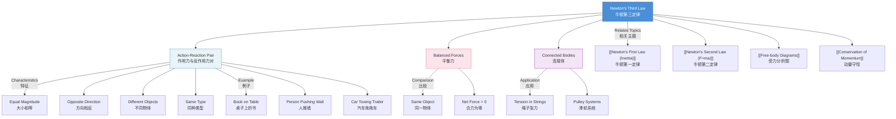

# 1. Overview / 概述

**English:**
Newton's Third Law is arguably the most misunderstood of Newton's three laws. It states that **if object A exerts a force on object B, then object B exerts an equal and opposite force on object A**. These two forces are called an **action-reaction pair**. This sub-topic is crucial because it explains how forces always come in pairs — you cannot have a single isolated force. Understanding this law is essential for analyzing [[Free-body Diagrams]], [[Linear Momentum and Impulse]], and [[Conservation of Momentum]]. It is also the foundation for understanding propulsion (rockets, walking, swimming) and why objects can accelerate despite internal forces.

**中文:**
牛顿第三定律是牛顿三大定律中最容易被误解的一个。它指出：**如果物体A对物体B施加一个力，那么物体B也会对物体A施加一个大小相等、方向相反的力**。这两个力被称为**作用力与反作用力对**。这个子知识点至关重要，因为它解释了力总是成对出现——不可能存在一个孤立的力。理解这一定律对于分析[[Free-body Diagrams|受力分析图]]、[[Linear Momentum and Impulse|线性动量与冲量]]以及[[Conservation of Momentum|动量守恒]]至关重要。它也是理解推进力（火箭、行走、游泳）以及物体为何能在内力作用下加速的基础。

---

# 2. Syllabus Learning Objectives / 考纲学习目标

| CAIE 9702 | Edexcel IAL |
|-----------|-------------|
| 3.2(d) State Newton's third law and apply it to simple situations. | 2.7 Recall and use Newton's third law. |
| 3.2(e) Identify action-reaction pairs in a variety of contexts. | 2.8 Distinguish between action-reaction pairs and balanced forces. |
| — | 2.9 Apply Newton's third law to problems involving connected bodies (e.g., two blocks, a person in a lift). |
| — | 2.10 Explain how Newton's third law relates to the concept of momentum conservation. |

**Examiner Expectations / 考官期望:**
- **CAIE:** Students must be able to **identify** action-reaction pairs correctly and **state** the law. Common exam questions involve drawing arrows on diagrams to show action-reaction pairs.
- **Edexcel:** Students must **distinguish** between action-reaction pairs (acting on different objects) and balanced forces (acting on the same object). Application to connected bodies and momentum is expected.

**中文:**
- **CAIE:** 学生必须能够正确**识别**作用力与反作用力对，并**陈述**该定律。常见考题包括在图上画出箭头来表示作用力与反作用力对。
- **Edexcel:** 学生必须能够**区分**作用力与反作用力对（作用在不同物体上）和平衡力（作用在同一物体上）。需要能够应用于连接体问题和动量问题。

---

# 3. Core Definitions / 核心定义

| Term (EN/CN) | Definition (EN) | Definition (CN) | Common Mistakes / 常见错误 |
|--------------|-----------------|-----------------|---------------------------|
| **Newton's Third Law** / 牛顿第三定律 | When object A exerts a force on object B, object B simultaneously exerts an equal and opposite force on object A. | 当物体A对物体B施加一个力时，物体B同时会对物体A施加一个大小相等、方向相反的力。 | Confusing with balanced forces (see below). |
| **Action-Reaction Pair** / 作用力与反作用力对 | A pair of forces that are equal in magnitude, opposite in direction, act on **different objects**, and are of the **same type** (e.g., both contact or both non-contact). | 一对大小相等、方向相反、作用在**不同物体**上、且属于**同一种类型**（如都是接触力或都是非接触力）的力。 | Thinking they act on the same object. |
| **Balanced Forces** / 平衡力 | Forces acting on the **same object** that cancel each other out, resulting in zero net force. | 作用在**同一物体**上、相互抵消、导致合力为零的力。 | Confusing with action-reaction pairs. |
| **Normal Contact Force** / 法向接触力 | The perpendicular force exerted by a surface on an object in contact with it. | 表面对其上接触物体施加的垂直力。 | Forgetting its reaction pair (the object pushes back on the surface). |
| **Tension** / 张力 | The pulling force transmitted through a string, rope, or cable when it is taut. | 当绳子、绳索或缆绳拉紧时传递的拉力。 | Forgetting that tension in a rope has an action-reaction pair at each end. |

---

# 4. Key Concepts Explained / 关键概念详解

## 4.1 The Action-Reaction Pair / 作用力与反作用力对

### Explanation / 解释
**English:**
The core of Newton's Third Law is that forces always come in pairs. If you push a wall, the wall pushes back on you with exactly the same force. If the Earth pulls a book down with gravitational force (weight), the book pulls the Earth up with an equal gravitational force. These pairs are **simultaneous** — they exist at the same time, not one after the other.

**Key characteristics of an action-reaction pair:**
1. **Equal in magnitude** — same size force.
2. **Opposite in direction** — exactly 180° apart.
3. **Act on different objects** — this is the most important distinction from balanced forces.
4. **Same type of force** — both are gravitational, both are contact, both are magnetic, etc.

**中文:**
牛顿第三定律的核心是力总是成对出现。如果你推一堵墙，墙也会以同样大小的力推你。如果地球用重力（重量）向下拉一本书，书也会用同样大小的重力向上拉地球。这些力对是**同时**存在的——它们同时出现，而不是先后出现。

**作用力与反作用力对的关键特征：**
1. **大小相等**——力的大小相同。
2. **方向相反**——正好相差180°。
3. **作用在不同物体上**——这是与平衡力最重要的区别。
4. **同一种类型的力**——都是重力、都是接触力、都是磁力等。

### Physical Meaning / 物理意义
**English:**
Newton's Third Law explains why forces cannot exist in isolation. It also explains how motion is possible: when you walk, you push backward on the ground (action), and the ground pushes forward on you (reaction), propelling you forward. The action and reaction forces do **not** cancel because they act on different objects.

**中文:**
牛顿第三定律解释了为什么力不能孤立存在。它也解释了运动是如何可能的：当你走路时，你向后推地面（作用力），地面向前推你（反作用力），推动你向前。作用力和反作用力并**不**抵消，因为它们作用在不同的物体上。

### Common Misconceptions / 常见误区
- ❌ **"Action and reaction forces cancel each other out."** → They act on different objects, so they cannot cancel. Cancellation only happens for forces on the **same** object.
- ❌ **"The reaction force happens after the action force."** → They are simultaneous.
- ❌ **"If object A is heavier, its force is larger."** → The forces are always equal, regardless of mass.
- ❌ **"A stationary object has no action-reaction pairs."** → Even stationary objects have action-reaction pairs (e.g., book on table: book pushes down on table, table pushes up on book).

**中文:**
- ❌ **"作用力和反作用力相互抵消。"** → 它们作用在不同物体上，所以不能抵消。只有作用在**同一**物体上的力才能抵消。
- ❌ **"反作用力发生在作用力之后。"** → 它们是同时发生的。
- ❌ **"如果物体A更重，它的力就更大。"** → 无论质量大小，力总是相等的。
- ❌ **"静止的物体没有作用力与反作用力对。"** → 即使静止的物体也有作用力与反作用力对（例如，桌子上的书：书向下推桌子，桌子向上推书）。

### Exam Tips / 考试提示
- **Always identify the two objects involved.** Ask: "Which two objects are interacting?"
- **Draw arrows on diagrams.** The action arrow points from A to B; the reaction arrow points from B to A.
- **Check the type of force.** If one is gravitational, the other must also be gravitational.
- **For Edexcel:** Be prepared to explain why action-reaction pairs do not cancel (different objects).

**中文:**
- **始终确定涉及的两个物体。** 问："哪两个物体在相互作用？"
- **在图上画出箭头。** 作用力箭头从A指向B；反作用力箭头从B指向A。
- **检查力的类型。** 如果一个是重力，另一个也必须是重力。
- **对于Edexcel：** 准备好解释为什么作用力与反作用力对不会抵消（不同物体）。

> 📷 **IMAGE PROMPT — N3L-01: Action-Reaction Pair Diagram**
> A simple diagram showing a person pushing a wall. The person's hand exerts force F on the wall (arrow pointing right, labeled "Action: F(person on wall)"). The wall exerts force F on the person's hand (arrow pointing left, labeled "Reaction: F(wall on person)"). Both arrows are the same length. The person and wall are clearly labeled. Clean, educational style with bright colors.

---

## 4.2 Action-Reaction vs. Balanced Forces / 作用力与反作用力 vs. 平衡力

### Explanation / 解释
**English:**
This is the most common point of confusion. Students often think action-reaction pairs are the same as balanced forces. They are **fundamentally different**:

| Feature | Action-Reaction Pair | Balanced Forces |
|---------|---------------------|-----------------|
| Objects acted upon | **Different** objects | **Same** object |
| Do they cancel? | No (different objects) | Yes (same object → net force = 0) |
| Example | Book pushes down on table; table pushes up on book | Gravity pulls book down; table pushes book up (both on the book) |
| Type of force | Same type | Can be different types |

**中文:**
这是最常见的混淆点。学生经常认为作用力与反作用力对和平衡力是一样的。它们有**本质区别**：

| 特征 | 作用力与反作用力对 | 平衡力 |
|------|-------------------|--------|
| 作用对象 | **不同**物体 | **同一**物体 |
| 是否抵消？ | 否（不同物体） | 是（同一物体 → 合力为零） |
| 例子 | 书向下推桌子；桌子向上推书 | 重力向下拉书；桌子向上推书（都作用在书上） |
| 力的类型 | 同一种类型 | 可以是不同类型 |

### Common Misconceptions / 常见误区
- ❌ **"A book on a table: the weight and the normal reaction force are an action-reaction pair."** → **WRONG!** They are balanced forces (both act on the book). The action-reaction pair is: (1) Earth pulls book down (weight) and book pulls Earth up; (2) Book pushes table down and table pushes book up.
- ❌ **"If forces are equal and opposite, they must be an action-reaction pair."** → Not necessarily. They could be balanced forces on the same object.

**中文:**
- ❌ **"桌子上的书：重力和法向反作用力是一对作用力与反作用力。"** → **错误！** 它们是平衡力（都作用在书上）。作用力与反作用力对是：(1) 地球向下拉书（重力）和书向上拉地球；(2) 书向下推桌子和桌子向上推书。
- ❌ **"如果力大小相等、方向相反，它们一定是一对作用力与反作用力。"** → 不一定。它们可能是作用在同一物体上的平衡力。

### Exam Tips / 考试提示
- **For CAIE:** Questions often ask: "Identify the action-reaction pair for a book on a table." Be precise: "The book exerts a downward force on the table; the table exerts an upward force on the book."
- **For Edexcel:** Questions may ask: "Explain why the weight of a book and the normal reaction from the table are not an action-reaction pair." Answer: "They act on the same object (the book), so they are balanced forces, not an action-reaction pair."

**中文:**
- **对于CAIE：** 题目常问："识别桌子上书的作用力与反作用力对。" 要精确："书对桌子施加向下的力；桌子对书施加向上的力。"
- **对于Edexcel：** 题目可能问："解释为什么书的重量和桌子的法向反作用力不是一对作用力与反作用力。" 答案："它们作用在同一物体（书）上，所以是平衡力，而不是作用力与反作用力对。"

---

## 4.3 Newton's Third Law in Connected Bodies / 连接体中的牛顿第三定律

### Explanation / 解释
**English:**
When two objects are connected (e.g., by a rope or in contact), Newton's Third Law applies at the interface. For example, if a person pulls a box with a rope:
- The person exerts a force on the rope (action).
- The rope exerts an equal and opposite force on the person (reaction).
- The rope exerts a force on the box (action).
- The box exerts an equal and opposite force on the rope (reaction).

In problems with connected bodies, the tension in the rope is the same throughout (assuming a light, inextensible string), and Newton's Third Law ensures that the force on one object equals the force on the other at the connection point.

**中文:**
当两个物体连接在一起时（例如，通过绳子或接触），牛顿第三定律在连接界面处适用。例如，如果一个人用绳子拉一个箱子：
- 人对绳子施加一个力（作用力）。
- 绳子对人施加一个大小相等、方向相反的力（反作用力）。
- 绳子对箱子施加一个力（作用力）。
- 箱子对绳子施加一个大小相等、方向相反的力（反作用力）。

在连接体问题中，绳子中的张力处处相等（假设是轻质、不可伸长的绳子），牛顿第三定律确保在连接点处一个物体上的力等于另一个物体上的力。

### Exam Tips / 考试提示
- **For Edexcel:** Be prepared to solve problems with two blocks connected by a string, where one block is on a surface and the other is hanging. Use Newton's Third Law to relate the tension forces at each end of the string.
- **Draw free-body diagrams** for each object separately. The action-reaction pair will appear as forces on different diagrams.

**中文:**
- **对于Edexcel：** 准备好解决两个由绳子连接的物块的问题，其中一个在表面上，另一个悬挂着。使用牛顿第三定律来关联绳子两端的张力。
- **分别画出每个物体的受力分析图。** 作用力与反作用力对将出现在不同的图上。

---

# 5. Essential Equations / 核心公式

## 5.1 Newton's Third Law Statement / 牛顿第三定律表述

$$ \vec{F}_{A \text{ on } B} = -\vec{F}_{B \text{ on } A} $$

| Symbol (符号) | Meaning (EN) | Meaning (CN) | Unit (单位) |
|--------------|-------------|-------------|------------|
| $\vec{F}_{A \text{ on } B}$ | Force exerted by object A on object B | 物体A对物体B施加的力 | N (Newtons) |
| $\vec{F}_{B \text{ on } A}$ | Force exerted by object B on object A | 物体B对物体A施加的力 | N (Newtons) |
| $-$ | Opposite direction | 方向相反 | — |

**Derivation / 推导:**
This is a fundamental law, not derived from other equations. It is based on experimental observation.

**Conditions / 适用条件:**
- The forces are **always** equal and opposite, regardless of motion or rest.
- The forces act **simultaneously**.
- The forces are of the **same type** (e.g., both gravitational, both contact).

**Limitations / 局限性:**
- Newton's Third Law is valid in classical mechanics. In relativistic or quantum contexts, modifications may be needed.
- For non-contact forces (e.g., magnetic forces), the action-reaction pair still exists but may involve fields.

---

# 6. Graphs and Relationships / 图表与关系

## 6.1 Force-Time Graph for Action-Reaction Pair / 作用力与反作用力对的力-时间图

### Axes / 坐标轴
- **X-axis:** Time / 时间 (t / s)
- **Y-axis:** Force / 力 (F / N)

### Shape / 形状
**English:**
If you could measure both forces simultaneously, the two graphs would be mirror images across the time axis. At every instant, $F_{A \text{ on } B} = -F_{B \text{ on } A}$.

**中文:**
如果能够同时测量两个力，两条图线将关于时间轴对称。在每一时刻，$F_{A \text{ on } B} = -F_{B \text{ on } A}$。

### Gradient Meaning / 斜率含义
Not typically relevant for this sub-topic.

### Area Meaning / 面积含义
The area under a force-time graph gives impulse ($F \Delta t$). For an action-reaction pair, the impulses are equal and opposite, which leads to [[Conservation of Momentum]].

### Exam Interpretation / 考试解读
**English:**
Questions may show a force-time graph for one object and ask you to sketch the graph for the other object. Remember: same magnitude, opposite sign.

**中文:**
题目可能显示一个物体的力-时间图，并要求你画出另一个物体的图线。记住：大小相同，符号相反。

> 📷 **IMAGE PROMPT — N3L-02: Force-Time Graph for Action-Reaction Pair**
> Two line graphs on the same axes. One line (blue, labeled "F(A on B)") is positive and varies with time. The other line (red, labeled "F(B on A)") is the exact mirror image below the x-axis. The two lines are symmetric about the x-axis. Clean, educational style with grid lines.

---

# 7. Required Diagrams / 必备图表

## 7.1 Action-Reaction Pairs for a Book on a Table / 桌子上书的作用力与反作用力对

### Description / 描述
**English:**
A diagram showing a book resting on a table. Two action-reaction pairs are identified:
1. **Gravitational pair:** Earth pulls book down (weight $W$); book pulls Earth up ($W'$).
2. **Contact pair:** Book pushes table down ($N$); table pushes book up ($N'$).

The balanced forces on the book are also shown: weight $W$ (down) and normal reaction $N'$ (up) — these are **not** an action-reaction pair.

**中文:**
一个显示书静止在桌子上的图。识别出两对作用力与反作用力：
1. **重力对：** 地球向下拉书（重量 $W$）；书向上拉地球（$W'$）。
2. **接触力对：** 书向下推桌子（$N$）；桌子向上推书（$N'$）。

书上的平衡力也显示出来：重量 $W$（向下）和法向反作用力 $N'$（向上）——这些**不是**作用力与反作用力对。

### Image Prompt / 图片生成提示
> 📷 **IMAGE PROMPT — N3L-03: Book on Table - Action-Reaction Pairs**
> A book resting on a table. Four arrows are shown:
> 1. Blue arrow from Earth to book (downward): "W (Earth on book)"
> 2. Blue arrow from book to Earth (upward): "W' (book on Earth)"
> 3. Red arrow from book to table (downward): "N (book on table)"
> 4. Red arrow from table to book (upward): "N' (table on book)"
> A dashed box around the book shows the balanced forces: W (down) and N' (up). Labels: "Action-Reaction Pairs" and "Balanced Forces on Book". Clean, educational style.

### Labels Required / 需要标注
- **Action-reaction pair 1:** $W$ (Earth on book) and $W'$ (book on Earth)
- **Action-reaction pair 2:** $N$ (book on table) and $N'$ (table on book)
- **Balanced forces on book:** $W$ and $N'$

### Exam Importance / 考试重要性
**English:**
This is the most common diagram used to test understanding of action-reaction vs. balanced forces. Expect it in both CAIE and Edexcel exams.

**中文:**
这是测试对作用力与反作用力 vs. 平衡力理解的最常见图示。CAIE和Edexcel考试中都会出现。

---

## 7.2 Person Pushing a Wall / 人推墙

### Description / 描述
**English:**
A person standing and pushing against a wall. The action-reaction pair is:
- **Action:** Person pushes wall to the right ($F_{\text{person on wall}}$).
- **Reaction:** Wall pushes person to the left ($F_{\text{wall on person}}$).

Note: The person does not move because the reaction force from the wall is balanced by friction between the person's feet and the ground.

**中文:**
一个人站着推墙。作用力与反作用力对是：
- **作用力：** 人向右推墙（$F_{\text{人对墙}}$）。
- **反作用力：** 墙向左推人（$F_{\text{墙对人}}$）。

注意：人没有移动，因为来自墙的反作用力被人脚与地面之间的摩擦力平衡了。

### Image Prompt / 图片生成提示
> 📷 **IMAGE PROMPT — N3L-04: Person Pushing Wall**
> A person standing, pushing against a wall with both hands. Arrow from hands to wall (right): "Action: F(person on wall)". Arrow from wall to hands (left): "Reaction: F(wall on person)". Both arrows same length. Also show friction arrows at feet (leftward) balancing the reaction force. Clean, educational style.

### Labels Required / 需要标注
- $F_{\text{person on wall}}$ (action)
- $F_{\text{wall on person}}$ (reaction)
- Friction at feet (balancing force)

### Exam Importance / 考试重要性
**English:**
Common in Edexcel questions about why a person can push a wall without moving. The answer involves both Newton's Third Law (action-reaction) and Newton's First Law (balanced forces on the person).

**中文:**
Edexcel考试中常见的问题：为什么人推墙时自己不动？答案涉及牛顿第三定律（作用力与反作用力）和牛顿第一定律（人身上的平衡力）。

---

# 8. Worked Examples / 典型例题

## Example 1: Identifying Action-Reaction Pairs / 识别作用力与反作用力对

### Question / 题目
**English:**
A car is towing a trailer. Identify two action-reaction pairs in this system.

**中文:**
一辆汽车正在拖一辆拖车。请识别这个系统中的两对作用力与反作用力。

### Solution / 解答
**Step 1: Identify interacting objects.**
- Pair 1: Car and trailer (via the tow bar).
- Pair 2: Trailer and road (via the wheels).

**Step 2: State the pairs.**
- **Pair 1:** The car exerts a forward force on the trailer (action). The trailer exerts a backward force on the car (reaction).
- **Pair 2:** The trailer exerts a backward force on the road (action). The road exerts a forward force on the trailer (reaction).

**Step 3: Check characteristics.**
- Equal in magnitude? Yes.
- Opposite in direction? Yes.
- Different objects? Yes.
- Same type? Yes (both contact forces).

**中文:**
**步骤1：确定相互作用的物体。**
- 对1：汽车和拖车（通过牵引杆）。
- 对2：拖车和路面（通过车轮）。

**步骤2：陈述力对。**
- **对1：** 汽车对拖车施加向前的力（作用力）。拖车对汽车施加向后的力（反作用力）。
- **对2：** 拖车对路面施加向后的力（作用力）。路面对拖车施加向前的力（反作用力）。

**步骤3：检查特征。**
- 大小相等？是。
- 方向相反？是。
- 不同物体？是。
- 同种类型？是（都是接触力）。

### Final Answer / 最终答案
**Answer:** Two action-reaction pairs: (1) Car on trailer / Trailer on car; (2) Trailer on road / Road on trailer. | **答案：** 两对作用力与反作用力：(1) 汽车对拖车 / 拖车对汽车；(2) 拖车对路面 / 路面对拖车。

### Quick Tip / 提示
**English:** Always name the two objects explicitly. "The car exerts a force on the trailer" is clearer than just "the pulling force."

**中文:** 始终明确说出两个物体的名称。"汽车对拖车施加一个力"比仅仅说"拉力"更清晰。

---

## Example 2: Action-Reaction vs. Balanced Forces / 作用力与反作用力 vs. 平衡力

### Question / 题目
**English:**
A 5.0 kg book is resting on a table. The weight of the book is 49 N downward. The table exerts a normal reaction force of 49 N upward on the book.

(a) State the action-reaction pair for the weight of the book.
(b) Explain why the weight and the normal reaction force are **not** an action-reaction pair.

**中文:**
一本5.0 kg的书静止在桌子上。书的重量为49 N，方向向下。桌子对书施加49 N向上的法向反作用力。

(a) 说出书的重量的作用力与反作用力对。
(b) 解释为什么重量和法向反作用力**不是**一对作用力与反作用力。

### Solution / 解答

**(a) Action-reaction pair for weight:**
- **Action:** Earth exerts a gravitational force of 49 N downward on the book.
- **Reaction:** Book exerts a gravitational force of 49 N upward on the Earth.

**(b) Explanation:**
The weight (Earth on book) and the normal reaction (table on book) both act on the **same object** (the book). For two forces to be an action-reaction pair, they must act on **different objects**. Therefore, they are **balanced forces**, not an action-reaction pair.

**中文:**

**(a) 重量的作用力与反作用力对：**
- **作用力：** 地球对书施加49 N向下的重力。
- **反作用力：** 书对地球施加49 N向上的重力。

**(b) 解释：**
重量（地球对书）和法向反作用力（桌子对书）都作用在**同一物体**（书）上。两个力要成为作用力与反作用力对，必须作用在**不同物体**上。因此，它们是**平衡力**，而不是作用力与反作用力对。

### Final Answer / 最终答案
**Answer:** (a) Book exerts 49 N upward on Earth. (b) They act on the same object (the book). | **答案：** (a) 书对地球施加49 N向上的力。(b) 它们作用在同一物体（书）上。

### Quick Tip / 提示
**English:** Remember the "different objects" rule. If two forces act on the same object, they cannot be an action-reaction pair.

**中文:** 记住"不同物体"规则。如果两个力作用在同一物体上，它们就不可能是作用力与反作用力对。

---

# 9. Past Paper Question Types / 历年真题题型

| Question Type / 题型 | Frequency / 频率 | Difficulty / 难度 | Past Paper References / 真题索引 |
|----------------------|------------------|------------------|-------------------------------|
| Identify action-reaction pairs from a diagram | High | Easy | 📝 *待填入* |
| Distinguish action-reaction from balanced forces | High | Medium | 📝 *待填入* |
| Explain why action-reaction pairs do not cancel | Medium | Medium | 📝 *待填入* |
| Apply Newton's Third Law to connected bodies (Edexcel) | Medium | Hard | 📝 *待填入* |
| Relate Newton's Third Law to momentum conservation | Low | Hard | 📝 *待填入* |

**Common Command Words / 常见指令词:**
- **State / 陈述:** Give a concise statement of Newton's Third Law.
- **Identify / 识别:** Name the action-reaction pair(s) in a given situation.
- **Explain / 解释:** Provide reasoning, often distinguishing action-reaction from balanced forces.
- **Apply / 应用:** Use Newton's Third Law in a calculation or problem-solving context.

---

# 10. Practical Skills Connections / 实验技能链接

**English:**
Newton's Third Law can be demonstrated experimentally using force sensors or spring balances:

1. **Force sensors experiment:** Two force sensors are connected together. One student pushes on one sensor, and the other student holds the other sensor. The readings on both sensors are equal and opposite at all times. This demonstrates that action and reaction forces are simultaneous and equal.

2. **Spring balances:** Two spring balances are hooked together. When one is pulled, both show the same reading. This is a simple demonstration of Newton's Third Law.

3. **Data logging:** Using a data logger with two force sensors, students can plot force-time graphs for both sensors and observe the mirror-image relationship.

**Measurements and uncertainties:**
- When using force sensors, consider the uncertainty in the force reading (typically ±0.1 N).
- Ensure the sensors are calibrated and zeroed before use.
- Repeat measurements to check consistency.

**Graph plotting:**
- Plot force vs. time for both sensors on the same axes.
- The two lines should be mirror images about the x-axis.
- Calculate the difference between the two forces at each time point — it should be zero within experimental uncertainty.

**Experimental design:**
- Test different types of interactions: pulling, pushing, and collisions.
- Vary the force applied and observe that the reaction force always matches.

**中文:**
牛顿第三定律可以通过使用力传感器或弹簧测力计进行实验演示：

1. **力传感器实验：** 两个力传感器连接在一起。一个学生推一个传感器，另一个学生握住另一个传感器。两个传感器的读数始终大小相等、方向相反。这证明了作用力和反作用力是同时且相等的。

2. **弹簧测力计：** 两个弹簧测力计钩在一起。当拉动一个时，两个测力计显示相同的读数。这是牛顿第三定律的简单演示。

3. **数据采集：** 使用带有两个力传感器的数据采集器，学生可以绘制两个传感器的力-时间图，并观察镜像关系。

**测量与不确定度：**
- 使用力传感器时，考虑力读数的不确定度（通常为±0.1 N）。
- 使用前确保传感器已校准并归零。
- 重复测量以检查一致性。

**图表绘制：**
- 在同一坐标轴上绘制两个传感器的力与时间的关系图。
- 两条线应关于x轴对称。
- 计算每个时间点两个力之间的差值——在实验不确定度范围内应为零。

**实验设计：**
- 测试不同类型的相互作用：推、拉和碰撞。
- 改变施加的力，观察反作用力是否始终匹配。

---

# 11. Concept Map / 概念图谱

---

# 12. Quick Revision Sheet / 速查表

| Category / 类别 | Key Points / 要点 |
|----------------|------------------|
| **Definition / 定义** | $\vec{F}_{A \text{ on } B} = -\vec{F}_{B \text{ on } A}$ — Forces always come in equal and opposite pairs acting on different objects. / 力总是成对出现，大小相等、方向相反，作用在不同物体上。 |
| **Key Characteristics / 关键特征** | 1. Equal magnitude / 大小相等 2. Opposite direction / 方向相反 3. Different objects / 不同物体 4. Same type of force / 同种类型的力 |
| **Action-Reaction vs. Balanced / 作用力与反作用力 vs. 平衡力** | Action-reaction: different objects, do NOT cancel. / 不同物体，不抵消。 Balanced: same object, cancel (net force = 0). / 同一物体，抵消（合力为零）。 |
| **Common Example / 常见例子** | Book on table:  - Action-reaction: book pushes table down / table pushes book up. / 书推桌子向下 / 桌子推书向上。 - Balanced: weight (Earth on book) and normal reaction (table on book). / 重量（地球对书）和法向反作用力（桌子对书）。 |
| **Key Graph / 核心图表** | Force-time graph: two mirror-image lines about the x-axis. / 力-时间图：关于x轴对称的两条线。 |
| **Exam Tip / 考试提示** | Always ask: "Which two objects are interacting?" / 始终问："哪两个物体在相互作用？" Draw arrows on diagrams. / 在图上画箭头。 For Edexcel: be ready to apply to connected bodies. / 对于Edexcel：准备好应用于连接体。 |
| **Common Mistake / 常见错误** | ❌ Thinking action-reaction forces cancel. / 认为作用力与反作用力抵消。 ❌ Confusing action-reaction with balanced forces. / 混淆作用力与反作用力和平衡力。 |
| **Practical Connection / 实验联系** | Force sensors show equal and opposite readings. / 力传感器显示大小相等、方向相反的读数。 |