# 1. Overview / 概述

**English:**
Friction is a [[Types of Force|contact force]] that opposes relative motion (or attempted motion) between two surfaces in contact. It is a fundamental force in mechanics that affects nearly all real-world motion — from a book resting on a table to a car braking on a road. This sub-topic covers the two types of friction (static and kinetic/dynamic), the factors that affect friction, and the key equation $F_f \leq \mu R$ (or $F_f = \mu R$ for kinetic friction). Understanding friction is essential for analyzing [[Free-body Diagrams]], calculating net forces, and solving problems involving motion on rough surfaces. Friction is distinct from [[Normal Contact Force]] (the perpendicular reaction force) and [[Tension]] (a pulling force through a string or cable), though all three are contact forces.

**中文:**
摩擦力是一种[[Types of Force|接触力]]，它阻碍两个接触表面之间的相对运动（或试图发生的运动）。它是力学中的基本力，影响着几乎所有现实世界中的运动——从书静止在桌子上到汽车在道路上刹车。本子知识点涵盖两种类型的摩擦力（静摩擦力和动/滑动摩擦力）、影响摩擦力的因素以及关键方程 $F_f \leq \mu R$（对于动摩擦力为 $F_f = \mu R$）。理解摩擦力对于分析[[Free-body Diagrams]]、计算合力和解决涉及粗糙表面运动的问题至关重要。摩擦力与[[Normal Contact Force]]（垂直反作用力）和[[Tension]]（通过绳子或缆绳的拉力）不同，尽管三者都是接触力。

---

# 2. Syllabus Learning Objectives / 考纲学习目标

| CAIE 9702 (3.2 a) | Edexcel IAL (WPH11 U1: 2.1-2.3) |
|-----------|-------------|
| Understand that friction is a force that opposes motion | Know that friction is a force that opposes relative motion between surfaces |
| Recall and use the equation $F_f \leq \mu R$ for static friction | Use the relationship $F_f = \mu R$ for kinetic friction |
| Distinguish between static and kinetic friction | Understand factors affecting friction (roughness, normal reaction) |
| Apply friction in free-body diagrams | Solve problems involving friction on horizontal and inclined planes |

**Examiner Expectations / 考官期望:**
- **English:** You must be able to: (1) identify the direction of friction correctly (opposing relative motion), (2) distinguish between static friction (variable, up to a maximum) and kinetic friction (constant for given surfaces), (3) apply the friction equation correctly with the normal reaction force $R$, and (4) include friction as a vector in [[Free-body Diagrams]].
- **中文:** 你必须能够：(1) 正确识别摩擦力的方向（阻碍相对运动），(2) 区分静摩擦力（可变，有最大值）和动摩擦力（对于给定表面是恒定的），(3) 正确应用摩擦力方程与法向反作用力 $R$，以及 (4) 在[[Free-body Diagrams]]中将摩擦力作为矢量包含。

---

# 3. Core Definitions / 核心定义

| Term (EN/CN) | Definition (EN) | Definition (CN) | Common Mistakes / 常见错误 |
|--------------|-----------------|-----------------|---------------------------|
| **Friction** / 摩擦力 | A contact force that opposes relative motion (or attempted motion) between two surfaces in contact. | 一种接触力，阻碍两个接触表面之间的相对运动（或试图发生的运动）。 | ❌ Thinking friction always opposes motion (it opposes *relative* motion — e.g., friction can cause motion, like walking) |
| **Static Friction** / 静摩擦力 | The frictional force between two surfaces that are not sliding relative to each other. It can vary from zero up to a maximum value. | 两个表面之间没有相对滑动时的摩擦力。它可以从零变化到最大值。 | ❌ Assuming static friction is always at its maximum value |
| **Kinetic (Dynamic/Sliding) Friction** / 动摩擦力 | The frictional force between two surfaces that are sliding relative to each other. It is constant for given surfaces and normal reaction. | 两个表面之间发生相对滑动时的摩擦力。对于给定的表面和法向反作用力，它是恒定的。 | ❌ Confusing kinetic friction with static friction (kinetic is constant, static is variable) |
| **Coefficient of Friction** / 摩擦系数 | A dimensionless constant ($\mu$) that represents the roughness of two surfaces in contact. | 一个无量纲常数 ($\mu$)，表示两个接触表面的粗糙程度。 | ❌ Forgetting that $\mu$ has no units |
| **Normal Reaction Force** / 法向反作用力 | The perpendicular contact force exerted by a surface on an object resting on it. | 表面对其上静止物体施加的垂直接触力。 | ❌ Confusing normal reaction with weight (they are equal only on horizontal surfaces with no vertical acceleration) |
| **Limiting Friction** / 极限摩擦力 | The maximum possible static friction before sliding begins. | 滑动开始前可能的最大静摩擦力。 | ❌ Using limiting friction for kinetic friction problems |

---

# 4. Key Concepts Explained / 关键概念详解

## 4.1 Static vs Kinetic Friction / 静摩擦力与动摩擦力

### Explanation / 解释
**English:**
Friction exists in two distinct regimes: **static friction** and **kinetic friction**.

**Static friction** acts when two surfaces are not sliding relative to each other. It is a *variable* force — it adjusts itself to match the applied force up to a maximum value called **limiting friction**. The equation is:
$$F_s \leq \mu_s R$$
where $F_s$ is static friction, $\mu_s$ is the coefficient of static friction, and $R$ is the [[Normal Contact Force|normal reaction force]].

**Kinetic friction** (also called dynamic or sliding friction) acts when two surfaces are sliding relative to each other. It is a *constant* force for given surfaces and normal reaction. The equation is:
$$F_k = \mu_k R$$
where $F_k$ is kinetic friction and $\mu_k$ is the coefficient of kinetic friction.

Key difference: $\mu_s > \mu_k$ for the same surfaces — it takes more force to *start* sliding than to *keep* sliding.

**中文:**
摩擦力存在于两种不同的状态：**静摩擦力**和**动摩擦力**。

**静摩擦力**作用于两个表面没有相对滑动时。它是一种*可变*力——它会自我调整以匹配施加的力，直到达到称为**极限摩擦力**的最大值。方程为：
$$F_s \leq \mu_s R$$
其中 $F_s$ 是静摩擦力，$\mu_s$ 是静摩擦系数，$R$ 是[[Normal Contact Force|法向反作用力]]。

**动摩擦力**（也称为滑动摩擦力）作用于两个表面发生相对滑动时。对于给定的表面和法向反作用力，它是一种*恒定*力。方程为：
$$F_k = \mu_k R$$
其中 $F_k$ 是动摩擦力，$\mu_k$ 是动摩擦系数。

关键区别：对于相同表面，$\mu_s > \mu_k$——开始滑动比保持滑动需要更大的力。

### Physical Meaning / 物理意义
**English:**
Friction arises from microscopic irregularities (roughness) on surfaces. When surfaces are stationary, these irregularities can "interlock" more strongly, requiring more force to break them apart (higher $\mu_s$). Once sliding, the interlocking is broken and the surfaces "ride" over each other more easily (lower $\mu_k$).

**中文:**
摩擦力源于表面上的微观不规则性（粗糙度）。当表面静止时，这些不规则性可以更牢固地"互锁"，需要更大的力才能将它们分开（更高的 $\mu_s$）。一旦开始滑动，互锁被打破，表面更容易"骑"过彼此（更低的 $\mu_k$）。

### Common Misconceptions / 常见误区
- ❌ **Friction always opposes motion** — Friction opposes *relative* motion. When walking, friction between your foot and the ground pushes you *forward* (it opposes the backward relative motion of your foot).
- ❌ **Friction is always equal to $\mu R$** — Only kinetic friction is always equal to $\mu R$. Static friction can be *less than* $\mu R$.
- ❌ **Friction depends on surface area** — For most surfaces, friction is independent of contact area (it depends only on $\mu$ and $R$).
- ❌ **Friction only occurs on rough surfaces** — Even "smooth" surfaces have microscopic friction.

### Exam Tips / 考试提示
- **English:** Always draw a [[Free-body Diagrams|free-body diagram]] first. Identify the direction of relative motion (or attempted motion) — friction acts opposite to this. Check if the object is moving (kinetic friction) or stationary (static friction). For static friction problems, use $F_s \leq \mu R$ and consider the equilibrium condition.
- **中文:** 始终先画[[Free-body Diagrams|受力分析图]]。确定相对运动（或试图运动）的方向——摩擦力作用方向相反。检查物体是运动的（动摩擦力）还是静止的（静摩擦力）。对于静摩擦力问题，使用 $F_s \leq \mu R$ 并考虑平衡条件。

> 📷 **IMAGE PROMPT — FRICTION-01: Static vs Kinetic Friction Graph**
> A graph showing friction force on the y-axis vs applied force on the x-axis. The graph has two distinct regions: a linear increasing region (static friction) up to a peak (limiting friction), then a slight drop to a constant horizontal line (kinetic friction). Label the axes, the peak as "limiting friction", and the constant region as "kinetic friction". Include a small diagram of a block on a surface with a horizontal applied force.

---

## 4.2 Factors Affecting Friction / 影响摩擦力的因素

### Explanation / 解释
**English:**
Friction depends on only **two factors**:
1. **Nature of the surfaces** (roughness) — represented by the coefficient of friction $\mu$
2. **Normal reaction force** $R$ — the force pressing the surfaces together

Friction does **NOT** depend on:
- Contact area (for most surfaces)
- Speed (for kinetic friction, approximately constant at low speeds)
- Applied force (except through its effect on equilibrium)

**中文:**
摩擦力仅取决于**两个因素**：
1. **表面的性质**（粗糙度）——由摩擦系数 $\mu$ 表示
2. **法向反作用力** $R$ ——将表面压在一起的力

摩擦力**不**取决于：
- 接触面积（对于大多数表面）
- 速度（对于动摩擦力，在低速下近似恒定）
- 施加的力（除了通过其对平衡的影响）

### Physical Meaning / 物理意义
**English:**
The normal reaction force $R$ determines how strongly the surface irregularities are pressed together. A larger $R$ means more interlocking, hence more friction. The coefficient $\mu$ quantifies the "roughness" of the surface pair — rougher surfaces have higher $\mu$.

**中文:**
法向反作用力 $R$ 决定了表面不规则性被压在一起的强度。更大的 $R$ 意味着更多的互锁，因此摩擦力更大。系数 $\mu$ 量化了表面对的"粗糙度"——更粗糙的表面具有更高的 $\mu$。

### Common Misconceptions / 常见误区
- ❌ **"Smooth" means no friction** — Even polished surfaces have friction (e.g., ice has low but non-zero friction).
- ❌ **Friction increases with speed** — For most A-Level problems, kinetic friction is assumed constant.
- ❌ **Wider tires give more friction** — Contact area does not affect friction (though wider tires may affect other factors like deformation).

### Exam Tips / 考试提示
- **English:** When calculating $R$, remember it equals the perpendicular component of all forces acting on the object. On a horizontal surface, $R = mg$ if no vertical forces. On an inclined plane, $R = mg\cos\theta$.
- **中文:** 计算 $R$ 时，记住它等于作用在物体上的所有力的垂直分量。在水平面上，如果没有垂直力，$R = mg$。在斜面上，$R = mg\cos\theta$。

---

# 5. Essential Equations / 核心公式

## Equation 1: Static Friction / 静摩擦力

$$F_s \leq \mu_s R$$

| Symbol (符号) | Meaning (EN) | Meaning (CN) | Unit (单位) |
|--------------|-------------|-------------|------------|
| $F_s$ | Static friction force | 静摩擦力 | N |
| $\mu_s$ | Coefficient of static friction | 静摩擦系数 | dimensionless (无量纲) |
| $R$ | Normal reaction force | 法向反作用力 | N |

**Conditions / 适用条件:**
- **English:** Applies when two surfaces are NOT sliding relative to each other. The inequality means static friction can be any value from 0 up to $\mu_s R$.
- **中文:** 适用于两个表面没有相对滑动时。不等式意味着静摩擦力可以是 0 到 $\mu_s R$ 之间的任何值。

**Limitations / 局限性:**
- **English:** Does not apply once sliding begins (use kinetic friction equation). Assumes surfaces are dry and not lubricated.
- **中文:** 一旦开始滑动就不适用（使用动摩擦力方程）。假设表面干燥且无润滑。

---

## Equation 2: Kinetic Friction / 动摩擦力

$$F_k = \mu_k R$$

| Symbol (符号) | Meaning (EN) | Meaning (CN) | Unit (单位) |
|--------------|-------------|-------------|------------|
| $F_k$ | Kinetic friction force | 动摩擦力 | N |
| $\mu_k$ | Coefficient of kinetic friction | 动摩擦系数 | dimensionless (无量纲) |
| $R$ | Normal reaction force | 法向反作用力 | N |

**Conditions / 适用条件:**
- **English:** Applies when two surfaces ARE sliding relative to each other. The force is constant for given surfaces and $R$.
- **中文:** 适用于两个表面发生相对滑动时。对于给定的表面和 $R$，力是恒定的。

**Limitations / 局限性:**
- **English:** Assumes constant $\mu_k$ independent of speed. At very high speeds, friction may decrease due to heating.
- **中文:** 假设 $\mu_k$ 恒定且与速度无关。在非常高的速度下，由于发热，摩擦力可能会减小。

---

## Equation 3: Limiting Friction / 极限摩擦力

$$F_{\text{max}} = \mu_s R$$

| Symbol (符号) | Meaning (EN) | Meaning (CN) | Unit (单位) |
|--------------|-------------|-------------|------------|
| $F_{\text{max}}$ | Maximum static friction (limiting friction) | 最大静摩擦力（极限摩擦力） | N |
| $\mu_s$ | Coefficient of static friction | 静摩擦系数 | dimensionless (无量纲) |
| $R$ | Normal reaction force | 法向反作用力 | N |

**Conditions / 适用条件:**
- **English:** This is the special case of the static friction equation when the object is just about to slide.
- **中文:** 这是静摩擦力方程在物体即将滑动时的特殊情况。

---

> 📷 **IMAGE PROMPT — FRICTION-02: Friction Force vs Applied Force Graph**
> A detailed graph with "Applied Force" on the x-axis and "Friction Force" on the y-axis. Show three regions: (1) static friction region where friction equals applied force (45° line), (2) limiting friction peak, (3) kinetic friction region where friction is constant and slightly lower. Label all regions and key points. Include a small free-body diagram of a block being pushed.

---

# 6. Graphs and Relationships / 图表与关系

## 6.1 Friction Force vs Applied Force / 摩擦力与施加力的关系

### Axes / 坐标轴
- **X-axis:** Applied force $F_{\text{applied}}$ (N) / 施加力 $F_{\text{施加}}$ (N)
- **Y-axis:** Friction force $F_f$ (N) / 摩擦力 $F_f$ (N)

### Shape / 形状
**English:**
The graph has three distinct regions:
1. **Static region (linear):** $F_f = F_{\text{applied}}$ (45° line) — friction matches applied force
2. **Peak (limiting friction):** $F_f = \mu_s R$ — maximum static friction
3. **Kinetic region (constant):** $F_f = \mu_k R$ — friction drops slightly and remains constant

**中文:**
图形有三个不同的区域：
1. **静摩擦区域（线性）：** $F_f = F_{\text{施加}}$（45°线）——摩擦力匹配施加力
2. **峰值（极限摩擦力）：** $F_f = \mu_s R$——最大静摩擦力
3. **动摩擦区域（恒定）：** $F_f = \mu_k R$——摩擦力略微下降并保持恒定

### Gradient Meaning / 斜率含义
**English:**
In the static region, gradient = 1 (friction equals applied force). In the kinetic region, gradient = 0 (friction is constant).

**中文:**
在静摩擦区域，斜率 = 1（摩擦力等于施加力）。在动摩擦区域，斜率 = 0（摩擦力恒定）。

### Area Meaning / 面积含义
**English:**
The area under this graph has no direct physical meaning (unlike force-distance graphs for work).

**中文:**
该图形下的面积没有直接的物理意义（与力-距离图的功不同）。

### Exam Interpretation / 考试解读
**English:**
This graph is commonly used to test understanding of the difference between static and kinetic friction. Key points: (1) the peak shows $\mu_s > \mu_k$, (2) the flat region shows kinetic friction is constant, (3) the 45° line shows static friction is a reaction force that adjusts.

**中文:**
该图形常用于测试对静摩擦力和动摩擦力之间差异的理解。关键点：(1) 峰值显示 $\mu_s > \mu_k$，(2) 平坦区域显示动摩擦力恒定，(3) 45°线显示静摩擦力是一种自我调整的反作用力。

---

# 7. Required Diagrams / 必备图表

## 7.1 Free-Body Diagram with Friction / 含摩擦力的受力分析图

### Description / 描述
**English:**
A free-body diagram showing all forces acting on a block being pulled horizontally on a rough surface. Forces include: weight ($mg$), normal reaction ($R$), applied force ($F$), and friction ($F_f$).

**中文:**
一个受力分析图，显示在粗糙表面上被水平拉动的块体上所有作用力。力包括：重力 ($mg$)、法向反作用力 ($R$)、施加力 ($F$) 和摩擦力 ($F_f$)。

### Image Prompt / 图片生成提示
> 📷 **IMAGE PROMPT — FRICTION-03: Free-Body Diagram with Friction**
> A clean physics diagram showing a rectangular block on a rough horizontal surface. A horizontal arrow labeled "F" points to the right (applied force). A horizontal arrow labeled "F_f" points to the left (friction). A vertical downward arrow labeled "mg" (weight) from the center. A vertical upward arrow labeled "R" (normal reaction) from the center. All arrows should be straight, labeled clearly, and proportional. Include a small note: "F_f opposes motion".

### Labels Required / 需要标注
- **English:** Applied force $F$, Friction $F_f$, Weight $mg$, Normal reaction $R$, Direction of motion (arrow)
- **中文:** 施加力 $F$，摩擦力 $F_f$，重力 $mg$，法向反作用力 $R$，运动方向（箭头）

### Exam Importance / 考试重要性
**English:** Essential for all friction problems. You must be able to draw this diagram and correctly identify the direction of friction (opposing relative motion).

**中文:** 对所有摩擦力问题都至关重要。你必须能够画出此图并正确识别摩擦力的方向（阻碍相对运动）。

---

## 7.2 Block on an Inclined Plane / 斜面上的块体

### Description / 描述
**English:**
A block on a rough inclined plane at angle $\theta$ to the horizontal. Forces: weight ($mg$) resolved into components parallel ($mg\sin\theta$) and perpendicular ($mg\cos\theta$) to the plane, normal reaction ($R = mg\cos\theta$), and friction ($F_f$) acting up the plane (opposing motion down).

**中文:**
一个块体在粗糙斜面上，斜面与水平面夹角为 $\theta$。力：重力 ($mg$) 分解为平行于斜面的分量 ($mg\sin\theta$) 和垂直于斜面的分量 ($mg\cos\theta$)，法向反作用力 ($R = mg\cos\theta$)，以及沿斜面向上作用的摩擦力 ($F_f$)（阻碍向下运动）。

### Image Prompt / 图片生成提示
> 📷 **IMAGE PROMPT — FRICTION-04: Block on Inclined Plane with Friction**
> A detailed physics diagram showing a rectangular block on a rough inclined plane at angle θ. Show weight (mg) as a vertical downward arrow from the center. Show its two components: mg sinθ parallel to the plane pointing down, and mg cosθ perpendicular to the plane pointing into the surface. Show normal reaction R perpendicular to the plane pointing up. Show friction F_f parallel to the plane pointing up. Label all forces and the angle θ. Include a right-angle triangle for the resolution.

### Labels Required / 需要标注
- **English:** $\theta$, $mg$, $mg\sin\theta$, $mg\cos\theta$, $R$, $F_f$, "Rough surface"
- **中文:** $\theta$，$mg$，$mg\sin\theta$，$mg\cos\theta$，$R$，$F_f$，"粗糙表面"

### Exam Importance / 考试重要性
**English:** Very common exam question type. Tests ability to resolve forces and apply friction on an incline. Key: $R = mg\cos\theta$, and friction acts up the plane if the block is sliding down.

**中文:** 非常常见的考试题型。测试分解力和在斜面上应用摩擦力的能力。关键：$R = mg\cos\theta$，如果块体向下滑动，摩擦力沿斜面向上作用。

---

# 8. Worked Examples / 典型例题

## Example 1: Static Friction on a Horizontal Surface / 水平面上的静摩擦力

### Question / 题目
**English:**
A block of mass 5.0 kg rests on a rough horizontal surface. The coefficient of static friction between the block and the surface is $\mu_s = 0.40$. A horizontal force $F$ is applied to the block. Calculate:
(a) The maximum static friction force.
(b) The friction force when $F = 10$ N.
(c) The minimum force required to start the block moving.

**中文:**
一个质量为 5.0 kg 的块体静止在粗糙水平面上。块体与表面之间的静摩擦系数为 $\mu_s = 0.40$。对块体施加水平力 $F$。计算：
(a) 最大静摩擦力。
(b) 当 $F = 10$ N 时的摩擦力。
(c) 使块体开始运动所需的最小力。

### Solution / 解答

**Step 1: Find normal reaction force $R$**
On a horizontal surface with no vertical forces:
$$R = mg = 5.0 \times 9.81 = 49.05 \text{ N}$$

**Step 2: Calculate maximum static friction**
$$F_{\text{max}} = \mu_s R = 0.40 \times 49.05 = 19.62 \text{ N}$$

**Step 3: Friction when $F = 10$ N**
Since $F = 10$ N < $F_{\text{max}} = 19.62$ N, the block does not move. Static friction matches the applied force:
$$F_s = F = 10 \text{ N}$$

**Step 4: Minimum force to start motion**
The block starts moving when applied force equals limiting friction:
$$F_{\text{min}} = F_{\text{max}} = 19.62 \text{ N}$$

### Final Answer / 最终答案
**Answer:**
(a) $F_{\text{max}} = 19.6$ N (2 s.f.)
(b) $F_s = 10$ N
(c) $F_{\text{min}} = 19.6$ N (2 s.f.)

**答案：**
(a) $F_{\text{max}} = 19.6$ N（2位有效数字）
(b) $F_s = 10$ N
(c) $F_{\text{min}} = 19.6$ N（2位有效数字）

### Quick Tip / 提示
**English:** For static friction, always check if the applied force exceeds the maximum static friction. If $F < \mu_s R$, then $F_s = F$ (friction matches applied force). If $F \geq \mu_s R$, then the object moves and friction becomes kinetic.

**中文:** 对于静摩擦力，始终检查施加力是否超过最大静摩擦力。如果 $F < \mu_s R$，则 $F_s = F$（摩擦力匹配施加力）。如果 $F \geq \mu_s R$，则物体运动，摩擦力变为动摩擦力。

---

## Example 2: Block on an Inclined Plane / 斜面上的块体

### Question / 题目
**English:**
A block of mass 2.0 kg is placed on a rough inclined plane at 30° to the horizontal. The coefficient of kinetic friction between the block and the plane is $\mu_k = 0.25$. The block is released from rest. Calculate:
(a) The normal reaction force.
(b) The kinetic friction force.
(c) The acceleration of the block down the plane.

**中文:**
一个质量为 2.0 kg 的块体放置在粗糙斜面上，斜面与水平面夹角为 30°。块体与斜面之间的动摩擦系数为 $\mu_k = 0.25$。块体从静止释放。计算：
(a) 法向反作用力。
(b) 动摩擦力。
(c) 块体沿斜面下滑的加速度。

### Solution / 解答

**Step 1: Resolve weight into components**
$$mg\sin\theta = 2.0 \times 9.81 \times \sin 30° = 2.0 \times 9.81 \times 0.5 = 9.81 \text{ N}$$
$$mg\cos\theta = 2.0 \times 9.81 \times \cos 30° = 2.0 \times 9.81 \times 0.866 = 16.99 \text{ N}$$

**Step 2: Normal reaction force**
$$R = mg\cos\theta = 16.99 \text{ N}$$

**Step 3: Kinetic friction force**
$$F_k = \mu_k R = 0.25 \times 16.99 = 4.25 \text{ N}$$

**Step 4: Net force down the plane**
$$F_{\text{net}} = mg\sin\theta - F_k = 9.81 - 4.25 = 5.56 \text{ N}$$

**Step 5: Acceleration using Newton's Second Law**
$$a = \frac{F_{\text{net}}}{m} = \frac{5.56}{2.0} = 2.78 \text{ m/s}^2$$

### Final Answer / 最终答案
**Answer:**
(a) $R = 17.0$ N (3 s.f.)
(b) $F_k = 4.25$ N (3 s.f.)
(c) $a = 2.78$ m/s² (3 s.f.)

**答案：**
(a) $R = 17.0$ N（3位有效数字）
(b) $F_k = 4.25$ N（3位有效数字）
(c) $a = 2.78$ m/s²（3位有效数字）

### Quick Tip / 提示
**English:** On an inclined plane, the normal reaction is $R = mg\cos\theta$, not $mg$. The component $mg\sin\theta$ is the force pulling the block down the plane. Friction always opposes motion, so it acts up the plane when the block slides down.

**中文:** 在斜面上，法向反作用力是 $R = mg\cos\theta$，而不是 $mg$。分量 $mg\sin\theta$ 是将块体拉下斜面的力。摩擦力总是阻碍运动，所以当块体向下滑动时，摩擦力沿斜面向上作用。

---

# 9. Past Paper Question Types / 历年真题题型

| Question Type / 题型 | Frequency / 频率 | Difficulty / 难度 | Past Paper References / 真题索引 |
|----------------------|------------------|------------------|-------------------------------|
| Calculate friction force on horizontal surface | ★★★★★ Very High | ★★ Easy | 📝 *待填入* |
| Block on inclined plane with friction | ★★★★★ Very High | ★★★ Medium | 📝 *待填入* |
| Static vs kinetic friction graph interpretation | ★★★ High | ★★★ Medium | 📝 *待填入* |
| Friction in equilibrium problems | ★★★★ High | ★★★★ Hard | 📝 *待填入* |
| Multi-body systems with friction | ★★ Medium | ★★★★★ Very Hard | 📝 *待填入* |

**Common Command Words / 常见指令词:**
- **English:** Calculate, Determine, Find, Show that, Explain, Sketch, State
- **中文:** 计算，确定，求，证明，解释，画出，陈述

---

# 10. Practical Skills Connections / 实验技能链接

**English:**
Friction is commonly investigated in practical experiments:

1. **Measuring coefficient of friction (horizontal method):** Pull a block at constant speed using a spring balance or force sensor. At constant speed, $F_{\text{pull}} = F_k = \mu_k R$. Measure $R$ (equal to weight on horizontal surface) and the pulling force to find $\mu_k$.

2. **Measuring coefficient of friction (inclined plane method):** Gradually increase the angle of an inclined plane until the block just starts to slide. At this angle $\theta$, $\tan\theta = \mu_s$. This is because at limiting friction: $mg\sin\theta = \mu_s mg\cos\theta$, giving $\mu_s = \tan\theta$.

3. **Uncertainties:** Friction experiments have significant uncertainties due to:
   - Difficulty maintaining constant speed
   - Variations in surface roughness
   - Parallax error in reading spring balances
   - Friction in pulleys if used

4. **Graph plotting:** Plot friction force vs normal reaction to find $\mu$ from the gradient.

**中文:**
摩擦力通常在实验中进行研究：

1. **测量摩擦系数（水平法）：** 使用弹簧秤或力传感器以恒定速度拉动块体。在恒定速度下，$F_{\text{拉}} = F_k = \mu_k R$。测量 $R$（在水平面上等于重力）和拉力以求出 $\mu_k$。

2. **测量摩擦系数（斜面法）：** 逐渐增加斜面的角度，直到块体刚好开始滑动。在此角度 $\theta$ 下，$\tan\theta = \mu_s$。这是因为在极限摩擦力下：$mg\sin\theta = \mu_s mg\cos\theta$，得出 $\mu_s = \tan\theta$。

3. **不确定度：** 摩擦力实验由于以下原因具有显著的不确定度：
   - 难以保持恒定速度
   - 表面粗糙度的变化
   - 读取弹簧秤时的视差误差
   - 如果使用滑轮，滑轮中的摩擦力

4. **图表绘制：** 绘制摩擦力与法向反作用力的关系图，从斜率求出 $\mu$。

---

# 11. Concept Map / 概念图谱

```mermaid
graph TD
    %% Friction as a leaf node in the Types of Force knowledge graph
    Friction --> TypesOfForce["[[Types of Force]]"]
    Friction --> ContactForce["[[Contact Force]]"]
    Friction --> NormalContactForce["[[Normal Contact Force]]"]
    Friction --> FreeBodyDiagrams["[[Free-body Diagrams]]"]
    
    %% Sub-types of friction
    Friction --> StaticFriction["Static Friction"]
    Friction --> KineticFriction["Kinetic Friction"]
    
    %% Key equations
    StaticFriction --> FsEq["F_s ≤ μ_s R"]
    KineticFriction --> FkEq["F_k = μ_k R"]
    
    %% Factors
    Friction --> Mu["Coefficient μ (roughness)"]
    Friction --> NormalR["Normal Reaction R"]
    
    %% Applications
    Friction --> Horizontal["Horizontal Surface"]
    Friction --> Inclined["Inclined Plane"]
    
    %% Prerequisites
    Friction --> ScalarsVectors["[[Scalars and Vectors]]"]
    Friction --> NewtonLaws["[[Newton's Laws of Motion]]"]
    
    %% Related topics
    Friction --> ForcesInFluids["[[Forces in Fluids (Upthrust and Viscous Force)]]"]
    
    %% Practical
    Friction --> Practical["Practical: Measuring μ"]
    Practical --> HorizontalMethod["Horizontal Method"]
    Practical --> InclinedMethod["Inclined Plane Method"]
    
    %% Styling
    classDef leaf fill:#e1f5fe,stroke:#01579b,stroke-width:2px
    classDef hub fill:#fff3e0,stroke:#e65100,stroke-width:2px
    classDef equation fill:#f3e5f5,stroke:#7b1fa2,stroke-width:1px
    classDef practical fill:#e8f5e9,stroke:#1b5e20,stroke-width:1px
    
    class Friction leaf
    class TypesOfForce,ContactForce hub
    class FsEq,FkEq equation
    class Practical,HorizontalMethod,InclinedMethod practical
```

---

# 12. Quick Revision Sheet / 速查表

| Category / 类别 | Key Points / 要点 |
|----------------|------------------|
| **Definition / 定义** | Friction opposes **relative motion** between surfaces / 摩擦力阻碍表面之间的**相对运动** |
| **Types / 类型** | **Static** ($F_s \leq \mu_s R$, variable) vs **Kinetic** ($F_k = \mu_k R$, constant) / **静摩擦力**（可变）vs **动摩擦力**（恒定） |
| **Key Formula / 核心公式** | $F_s \leq \mu_s R$ (static), $F_k = \mu_k R$ (kinetic), $F_{\text{max}} = \mu_s R$ (limiting) |
| **Direction / 方向** | Always opposes **relative motion** (not necessarily motion itself) / 始终阻碍**相对运动**（不一定是运动本身） |
| **Factors / 影响因素** | Only **surface roughness** ($\mu$) and **normal reaction** ($R$) / 仅**表面粗糙度** ($\mu$) 和**法向反作用力** ($R$) |
| **Not affected by / 不受影响** | Contact area, speed (at low speeds) / 接触面积，速度（低速下） |
| **Key Graph / 核心图表** | Friction vs Applied Force: 45° line (static) → peak (limiting) → constant (kinetic) / 摩擦力与施加力关系图 |
| **Inclined Plane / 斜面** | $R = mg\cos\theta$, $mg\sin\theta$ pulls down plane, friction acts up plane / $R = mg\cos\theta$，$mg\sin\theta$ 拉下斜面，摩擦力沿斜面向上 |
| **Practical / 实验** | Horizontal: pull at constant speed → $F_k = \mu_k R$; Inclined: find $\theta$ where sliding starts → $\mu_s = \tan\theta$ / 水平法：匀速拉动；斜面法：找到开始滑动的角度 |
| **Common Mistake / 常见错误** | ❌ Friction always opposes motion (it opposes *relative* motion) / 摩擦力总是阻碍运动（它阻碍*相对*运动） |
| **Exam Tip / 考试提示** | Always draw [[Free-body Diagrams]] first! Identify if static or kinetic / 始终先画[[Free-body Diagrams]]！确定是静摩擦力还是动摩擦力 |
| **Key Difference / 关键区别** | $\mu_s > \mu_k$ — harder to start sliding than to keep sliding / $\mu_s > \mu_k$ — 开始滑动比保持滑动更难 |