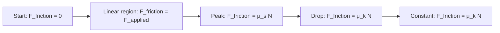
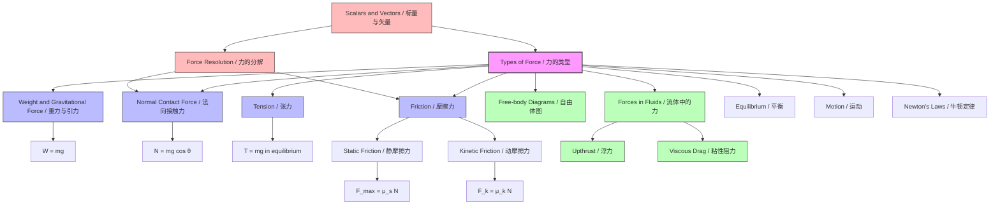

# 1. Overview / 概述

**English:** This topic introduces the fundamental types of forces encountered in mechanics. Understanding the nature, direction, and magnitude of different forces (weight, normal contact force, tension, friction) is essential for constructing accurate [[Free-body Diagrams]] and applying [[Newton's Laws of Motion]]. Forces are vector quantities, building directly on [[Scalars and Vectors]]. This foundation is critical for analysing equilibrium, motion, and energy transfers in both CAIE 9702 and Edexcel IAL AS Physics. Real-world applications include designing bridges (tension in cables), braking systems (friction), and understanding why objects float or sink (upthrust, covered in [[Forces in Fluids (Upthrust and Viscous Force)]]).

**中文:** 本主题介绍力学中遇到的基本力类型。理解不同力（[[Weight and Gravitational Force|重力]]、[[Normal Contact Force|法向接触力]]、[[Tension|张力]]、[[Friction|摩擦力]]）的性质、方向和大小，对于构建准确的[[Free-body Diagrams|自由体图]]和应用[[Newton's Laws of Motion|牛顿运动定律]]至关重要。力是矢量，直接建立在[[Scalars and Vectors|标量和矢量]]的基础上。这个基础对于分析平衡、运动和能量转换在CAIE 9702和Edexcel IAL AS物理中都至关重要。实际应用包括设计桥梁（缆绳中的张力）、制动系统（摩擦力）以及理解物体为何会浮或沉（浮力，在[[Forces in Fluids (Upthrust and Viscous Force)|流体中的力（浮力和粘性力）]]中介绍）。

# 2. Syllabus Learning Objectives / 考纲学习目标

| CAIE 9702 | Edexcel IAL |
|-----------|-------------|
| 3.2(a) Understand the different types of forces: weight, normal contact force, tension, friction | 2.1 Know the difference between vector and scalar quantities<br>2.2 Understand the different types of forces: weight, normal contact force, tension, friction, upthrust, viscous drag<br>2.3 Understand the concept of resultant force and how to resolve forces into components |

**Examiner Expectations / 考官期望:**
- **English:** Candidates must be able to identify each force type in a given scenario, state its direction, and calculate its magnitude where applicable (e.g., weight = mg). They must distinguish between contact forces (normal contact, tension, friction) and non-contact forces (weight). For Edexcel, upthrust and viscous drag are also required.
- **中文:** 考生必须能够在给定情景中识别每种力类型，说明其方向，并在适用时计算其大小（例如，重力 = mg）。他们必须区分接触力（法向接触力、张力、摩擦力）和非接触力（重力）。对于Edexcel，还需要浮力和粘性阻力。

> 📋 **CIE Only:** Focus on weight, normal contact force, tension, and friction. Upthrust and viscous drag are introduced later in the fluids topic.
> 📋 **Edexcel Only:** Upthrust and viscous drag are explicitly included here. Candidates must also know how to resolve forces into components (covered in [[Free-body Diagrams]]).

# 3. Core Definitions / 核心定义

| Term (EN/CN) | Definition (EN) | Definition (CN) | Common Mistakes / 常见错误 |
|--------------|-----------------|-----------------|---------------------------|
| **Force / 力** | A push or pull that can change the state of motion or shape of an object. A vector quantity. | 能够改变物体运动状态或形状的推或拉。矢量。 | Confusing force with energy or momentum. |
| **[[Weight and Gravitational Force\|Weight / 重力]]** | The gravitational force exerted on an object by a planet (usually Earth). Acts vertically downwards towards the centre of the planet. | 行星（通常是地球）对物体施加的引力。垂直向下指向行星中心。 | Confusing weight with mass. Weight varies with g; mass is constant. |
| **[[Normal Contact Force\|Normal Contact Force / 法向接触力]]** | The force exerted by a surface on an object in contact with it. Acts perpendicular to the surface. | 表面对与其接触的物体施加的力。垂直于表面作用。 | Thinking it always equals weight. It only equals weight on a horizontal surface with no other vertical forces. |
| **[[Tension\|Tension / 张力]]** | The pulling force transmitted through a string, rope, cable, or rod when it is stretched. Acts along the string/rod, away from the object. | 当绳子、绳索、缆绳或杆被拉伸时，通过其传递的拉力。沿绳子/杆作用，远离物体。 | Thinking tension can push. Tension is always a pulling force. |
| **[[Friction\|Friction / 摩擦力]]** | A force that opposes relative motion (or attempted motion) between two surfaces in contact. Acts parallel to the surface, opposite to the direction of motion/attempted motion. | 阻碍两个接触表面之间相对运动（或试图运动）的力。平行于表面作用，与运动/试图运动的方向相反。 | Thinking friction always opposes motion (it opposes *relative* motion). Static friction can cause motion (e.g., walking). |
| **[[Forces in Fluids (Upthrust and Viscous Force)\|Upthrust / 浮力]]** (Edexcel) | The upward buoyant force exerted by a fluid on a submerged or partially submerged object. | 流体对浸没或部分浸没的物体施加的向上的浮力。 | Confusing upthrust with weight of the object. Upthrust equals weight of fluid displaced. |
| **[[Forces in Fluids (Upthrust and Viscous Force)\|Viscous Drag / 粘性阻力]]** (Edexcel) | The resistive force experienced by an object moving through a fluid. Acts opposite to the direction of motion. | 物体在流体中运动时受到的阻力。与运动方向相反。 | Confusing with friction. Viscous drag depends on speed and fluid viscosity. |

# 4. Key Concepts Explained / 关键概念详解

## 4.1 [[Weight and Gravitational Force|Weight and Gravitational Force]] / 重力与引力

### Explanation / 解释
**English:** Weight ($W$) is the gravitational force exerted on an object by a planet. It is a vector quantity, always directed towards the centre of the planet (vertically downwards). The magnitude of weight is given by $W = mg$, where $m$ is the mass of the object and $g$ is the [[Gravitational Field Strength|gravitational field strength]] (acceleration due to gravity). On Earth, $g \approx 9.81 \text{ N kg}^{-1}$ (or $9.81 \text{ m s}^{-2}$). Weight is a non-contact (field) force because the object does not need to be in contact with the Earth.

**中文:** 重力（$W$）是行星对物体施加的引力。它是一个矢量，始终指向行星中心（垂直向下）。重力的大小由 $W = mg$ 给出，其中 $m$ 是物体的质量，$g$ 是[[Gravitational Field Strength|引力场强度]]（重力加速度）。在地球上，$g \approx 9.81 \text{ N kg}^{-1}$（或 $9.81 \text{ m s}^{-2}$）。重力是一种非接触力（场力），因为物体不需要与地球接触。

### Physical Meaning / 物理意义
**English:** Weight is the force that gives objects their "heaviness". It is responsible for objects falling towards the ground. The gravitational field strength $g$ varies with location (e.g., on the Moon, $g \approx 1.6 \text{ N kg}^{-1}$), so weight changes, but mass remains constant.

**中文:** 重力是赋予物体“重量”的力。它导致物体向地面下落。引力场强度 $g$ 随位置变化（例如，在月球上，$g \approx 1.6 \text{ N kg}^{-1}$），因此重力会改变，但质量保持不变。

### Common Misconceptions / 常见误区
- **Mass vs. Weight:** Mass is the amount of matter (scalar, kg). Weight is the gravitational force (vector, N). They are not interchangeable.
- **Weightlessness:** In free fall (e.g., orbiting spacecraft), objects experience apparent weightlessness because there is no normal contact force, but weight is still acting (it provides the centripetal force).
- **Direction:** Weight always acts vertically downwards, not "towards the centre of the Earth" in a curved path sense — it's the radial direction.

### Exam Tips / 考试提示
**English:** Always use $g = 9.81 \text{ m s}^{-2}$ unless stated otherwise. When drawing [[Free-body Diagrams]], represent weight as an arrow from the centre of mass, pointing straight down. Do not confuse $W = mg$ with $F = ma$ — they are different forces in different contexts.

**中文:** 除非另有说明，始终使用 $g = 9.81 \text{ m s}^{-2}$。在绘制[[Free-body Diagrams|自由体图]]时，将重力表示为从质心出发、指向正下方的箭头。不要将 $W = mg$ 与 $F = ma$ 混淆——它们在不同情境下是不同的力。

> 📷 **IMAGE PROMPT — [WGT-01]: Weight Vector on an Object**
> **English:** A simple diagram showing a box on a horizontal surface. A downward arrow labelled "W = mg" originates from the centre of the box. The arrow is vertical. Labels: "Object (mass m)", "W = mg (weight)", "g = 9.81 m/s²". Style: clean, minimal, vector-style. Exam importance: HIGH — fundamental for free-body diagrams.
> **中文:** 一个简单的图表，显示水平表面上的一个盒子。一个标有"W = mg"的向下箭头从盒子中心发出。箭头是垂直的。标签："物体（质量 m）"、"W = mg（重力）"、"g = 9.81 m/s²"。风格：简洁、极简、矢量风格。考试重要性：高——自由体图的基础。

## 4.2 [[Normal Contact Force|Normal Contact Force]] / 法向接触力

### Explanation / 解释
**English:** The normal contact force (often called the normal reaction or just "normal") is the force exerted by a surface on an object in contact with it. It is called "normal" because it acts perpendicular (normal) to the surface. It is a contact force. The magnitude of the normal force adjusts to prevent the object from penetrating the surface. On a horizontal surface with no other vertical forces, the normal force equals the weight of the object ($N = mg$). On an inclined plane, the normal force is less than the weight ($N = mg \cos \theta$).

**中文:** 法向接触力（通常称为法向反作用力或简称“法向力”）是表面对与其接触的物体施加的力。它被称为“法向”是因为它垂直于表面作用。它是一种接触力。法向力的大小会调整以防止物体穿透表面。在水平表面上且没有其他垂直力时，法向力等于物体的重量（$N = mg$）。在斜面上，法向力小于重量（$N = mg \cos \theta$）。

### Physical Meaning / 物理意义
**English:** The normal force is a reaction force that arises from the electromagnetic repulsion between atoms in the object and the surface. It is always perpendicular to the surface and prevents solid objects from passing through each other. It is NOT always equal to weight — it adjusts based on other forces present.

**中文:** 法向力是一种反作用力，源于物体和表面原子之间的电磁排斥。它始终垂直于表面，防止固体物体相互穿过。它并不总是等于重量——它会根据存在的其他力进行调整。

### Common Misconceptions / 常见误区
- **Normal = Weight:** This is only true on a horizontal surface with no other vertical forces. If there is an additional downward force (e.g., pushing down on the object), $N > mg$. If there is an upward force (e.g., pulling up), $N < mg$.
- **Direction:** The normal force is perpendicular to the surface, NOT necessarily vertical. On an inclined plane, it is at an angle.
- **"Reaction" Misunderstanding:** The normal force is the reaction to the object pushing *on* the surface, not the reaction to weight.

### Exam Tips / 考试提示
**English:** In [[Free-body Diagrams]], draw the normal force arrow perpendicular to the surface, starting from the point of contact. For inclined plane problems, resolve weight into components parallel and perpendicular to the plane — the perpendicular component is balanced by the normal force.

**中文:** 在[[Free-body Diagrams|自由体图]]中，绘制垂直于表面的法向力箭头，从接触点开始。对于斜面问题，将重力分解为平行和垂直于斜面的分量——垂直分量由法向力平衡。

> 📷 **IMAGE PROMPT — [NCF-01]: Normal Force on Horizontal vs Inclined Surface**
> **English:** Two diagrams side-by-side. Left: A box on a horizontal surface. Downward arrow "W = mg" from centre, upward arrow "N" from bottom of box, same length. Right: A box on an inclined plane (angle θ). Downward arrow "W = mg" from centre. Arrow "N" perpendicular to the plane from the box bottom. Arrow "mg cos θ" as a component of weight perpendicular to plane, same length as N. Arrow "mg sin θ" parallel to plane pointing down. Labels clear. Style: clean vector diagram. Exam importance: HIGH — essential for resolving forces.
> **中文:** 两个并排的图表。左侧：水平表面上的盒子。从中心向下的箭头"W = mg"，从盒子底部向上的箭头"N"，长度相同。右侧：斜面上的盒子（角度θ）。从中心向下的箭头"W = mg"。从盒子底部垂直于平面的箭头"N"。垂直于平面的重量分量"mg cos θ"，与N长度相同。平行于平面指向下方的箭头"mg sin θ"。标签清晰。风格：简洁的矢量图。考试重要性：高——分解力的基础。

## 4.3 [[Tension|Tension]] / 张力

### Explanation / 解释
**English:** Tension is the pulling force transmitted through a string, rope, cable, or rod when it is stretched. It acts along the length of the string/rod, away from the object it is pulling. Tension is a contact force. In an ideal (massless, inextensible) string, tension is the same throughout the string. Tension can only pull, never push — if a string goes slack, tension becomes zero.

**中文:** 张力是当绳子、绳索、缆绳或杆被拉伸时通过其传递的拉力。它沿绳子/杆的长度作用，远离被拉动的物体。张力是一种接触力。在理想（无质量、不可伸长）的绳子中，张力在整个绳子中相同。张力只能拉，不能推——如果绳子松弛，张力变为零。

### Physical Meaning / 物理意义
**English:** Tension arises from the intermolecular forces within the material when it is stretched. It is the force that keeps objects connected via strings or cables. In pulley systems, tension transmits force around the pulley (assuming frictionless, massless pulley).

**中文:** 张力源于材料被拉伸时的分子间力。它是通过绳子或缆绳连接物体的力。在滑轮系统中，张力绕滑轮传递力（假设滑轮无摩擦、无质量）。

### Common Misconceptions / 常见误区
- **Tension can push:** Tension is always a pulling force. A rope cannot push an object.
- **Tension is the same as weight:** In a simple hanging mass, tension equals weight only if the system is in equilibrium. If accelerating, tension ≠ weight.
- **Tension varies in a string:** In an ideal string, tension is constant throughout. In a real string with mass, tension varies.

### Exam Tips / 考试提示
**English:** In [[Free-body Diagrams]], draw tension arrows along the string, away from the object. For connected particles (e.g., two masses on a pulley), tension is the same on both sides of the pulley (ideal case). Use Newton's Second Law ($F = ma$) to find tension when acceleration is involved.

**中文:** 在[[Free-body Diagrams|自由体图]]中，沿绳子绘制张力箭头，远离物体。对于连接体（例如，滑轮上的两个质量），滑轮两侧的张力相同（理想情况）。当涉及加速度时，使用牛顿第二定律（$F = ma$）求张力。

> 📷 **IMAGE PROMPT — [TEN-01]: Tension in a Hanging Mass and Pulley System**
> **English:** Two diagrams. Left: A mass hanging from a ceiling by a string. Upward arrow "T" from top of mass, downward arrow "W = mg" from centre. Labels: "T (tension)", "W = mg". Right: A pulley system with two masses (m1 and m2) connected by a string over a pulley. Arrows "T" on both sides of the pulley, pointing away from each mass. Arrows "m1g" and "m2g" downwards. Labels clear. Style: clean vector diagram. Exam importance: HIGH — common exam setup.
> **中文:** 两个图表。左侧：一个质量通过绳子悬挂在天花板上。从质量顶部向上的箭头"T"，从中心向下的箭头"W = mg"。标签："T（张力）"、"W = mg"。右侧：一个滑轮系统，两个质量（m1和m2）通过绳子连接在滑轮上。滑轮两侧的箭头"T"，指向远离每个质量。向下的箭头"m1g"和"m2g"。标签清晰。风格：简洁的矢量图。考试重要性：高——常见考试设置。

## 4.4 [[Friction|Friction]] / 摩擦力

### Explanation / 解释
**English:** Friction is a force that opposes relative motion (or attempted motion) between two surfaces in contact. It acts parallel to the surface, opposite to the direction of motion or attempted motion. There are two types: **static friction** (opposes the start of motion) and **kinetic (dynamic) friction** (opposes ongoing motion). Static friction has a maximum value ($F_{\text{max}} = \mu_s N$), where $\mu_s$ is the coefficient of static friction and $N$ is the normal force. Kinetic friction is given by $F_k = \mu_k N$, where $\mu_k$ is the coefficient of kinetic friction. Generally, $\mu_s > \mu_k$.

**中文:** 摩擦力是阻碍两个接触表面之间相对运动（或试图运动）的力。它平行于表面作用，与运动或试图运动的方向相反。有两种类型：**静摩擦力**（阻碍运动开始）和**动摩擦力**（阻碍持续运动）。静摩擦力有最大值（$F_{\text{max}} = \mu_s N$），其中 $\mu_s$ 是静摩擦系数，$N$ 是法向力。动摩擦力由 $F_k = \mu_k N$ 给出，其中 $\mu_k$ 是动摩擦系数。通常，$\mu_s > \mu_k$。

### Physical Meaning / 物理意义
**English:** Friction arises from the microscopic irregularities (roughness) of surfaces and intermolecular forces. It is essential for many everyday phenomena: walking (friction between shoes and ground), driving (friction between tyres and road), and gripping objects. Without friction, objects would not be able to start or stop moving.

**中文:** 摩擦力源于表面的微观不平整（粗糙度）和分子间力。它对许多日常现象至关重要：行走（鞋与地面之间的摩擦）、驾驶（轮胎与道路之间的摩擦）和抓握物体。没有摩擦力，物体将无法开始或停止运动。

### Common Misconceptions / 常见误区
- **Friction always opposes motion:** Friction opposes *relative* motion. Static friction can actually *cause* motion (e.g., the friction between your foot and the ground pushes you forward when walking).
- **Friction is always equal to $\mu N$:** The equation $F = \mu N$ gives the *maximum* static friction or the kinetic friction. Static friction can be any value from 0 up to $\mu_s N$, depending on the applied force.
- **Friction depends on surface area:** For most surfaces, friction is independent of the contact area (within reasonable limits). It depends only on the normal force and the coefficient of friction.

### Exam Tips / 考试提示
**English:** In [[Free-body Diagrams]], draw friction arrows parallel to the surface, opposite to the direction of motion (or attempted motion). For static friction problems, remember that friction adjusts to match the applied force up to its maximum. For kinetic friction, use $F_k = \mu_k N$ directly. Always check if the object is moving or stationary.

**中文:** 在[[Free-body Diagrams|自由体图]]中，绘制平行于表面的摩擦力箭头，与运动（或试图运动）方向相反。对于静摩擦问题，记住摩擦力会调整以匹配施加的力，直到达到最大值。对于动摩擦，直接使用 $F_k = \mu_k N$。始终检查物体是运动还是静止。

> 📷 **IMAGE PROMPT — [FRC-01]: Friction on a Block Being Pulled**
> **English:** A block on a horizontal surface. A horizontal arrow "F (applied force)" pointing right from the left side of the block. A horizontal arrow "f (friction)" pointing left from the bottom of the block, shorter than F. Downward arrow "W = mg" from centre. Upward arrow "N" from bottom, same length as W. Labels clear. Style: clean vector diagram. Exam importance: HIGH — standard friction setup.
> **中文:** 水平表面上的一个方块。从方块左侧指向右的水平箭头"F（施加的力）"。从方块底部指向左的水平箭头"f（摩擦力）"，比F短。从中心向下的箭头"W = mg"。从底部向上的箭头"N"，与W长度相同。标签清晰。风格：简洁的矢量图。考试重要性：高——标准摩擦设置。

# 5. Essential Equations / 核心公式

## 5.1 Weight / 重力
$$ W = mg $$

| Symbol (符号) | Meaning (EN/CN) | Unit (单位) |
|---------------|-----------------|-------------|
| $W$ | Weight / 重力 | N (newton) |
| $m$ | Mass / 质量 | kg (kilogram) |
| $g$ | Gravitational field strength / 引力场强度 | N kg⁻¹ or m s⁻² |

**Derivation:** Not required — this is a definition.
**Conditions:** Valid near the surface of a planet where $g$ is approximately constant.
**Limitations:** $g$ varies with altitude and location; $W = mg$ is not valid in deep space.
**Rearrangements:** $m = \frac{W}{g}$, $g = \frac{W}{m}$

## 5.2 Maximum Static Friction / 最大静摩擦力
$$ F_{\text{max}} = \mu_s N $$

| Symbol (符号) | Meaning (EN/CN) | Unit (单位) |
|---------------|-----------------|-------------|
| $F_{\text{max}}$ | Maximum static friction / 最大静摩擦力 | N |
| $\mu_s$ | Coefficient of static friction / 静摩擦系数 | dimensionless |
| $N$ | Normal contact force / 法向接触力 | N |

**Derivation:** Empirical relationship — not derived.
**Conditions:** Only applies at the point where the object is about to slip. For static friction below this, $F_s \leq \mu_s N$.
**Limitations:** $\mu_s$ depends on the two surfaces in contact. The equation gives the *maximum* value, not the actual value.
**Rearrangements:** $\mu_s = \frac{F_{\text{max}}}{N}$, $N = \frac{F_{\text{max}}}{\mu_s}$

## 5.3 Kinetic Friction / 动摩擦力
$$ F_k = \mu_k N $$

| Symbol (符号) | Meaning (EN/CN) | Unit (单位) |
|---------------|-----------------|-------------|
| $F_k$ | Kinetic friction / 动摩擦力 | N |
| $\mu_k$ | Coefficient of kinetic friction / 动摩擦系数 | dimensionless |
| $N$ | Normal contact force / 法向接触力 | N |

**Derivation:** Empirical relationship — not derived.
**Conditions:** Applies when the object is sliding. $\mu_k$ is generally less than $\mu_s$.
**Limitations:** Assumes constant $\mu_k$ independent of speed (approximately true for moderate speeds).
**Rearrangements:** $\mu_k = \frac{F_k}{N}$, $N = \frac{F_k}{\mu_k}$

## 5.4 Newton's Second Law (for force analysis) / 牛顿第二定律（用于力分析）
$$ F_{\text{net}} = ma $$

| Symbol (符号) | Meaning (EN/CN) | Unit (单位) |
|---------------|-----------------|-------------|
| $F_{\text{net}}$ | Net (resultant) force / 合力 | N |
| $m$ | Mass / 质量 | kg |
| $a$ | Acceleration / 加速度 | m s⁻² |

**Derivation:** Fundamental law — not derived.
**Conditions:** Valid in inertial reference frames. $F_{\text{net}}$ is the vector sum of all forces.
**Limitations:** Does not apply at relativistic speeds.
**Rearrangements:** $a = \frac{F_{\text{net}}}{m}$, $m = \frac{F_{\text{net}}}{a}$

# 6. Graphs and Relationships / 图表与关系

## 6.1 Friction vs Applied Force / 摩擦力与施加力的关系

**Axes:** X-axis: Applied force ($F_{\text{applied}}$) / 施加力; Y-axis: Friction force ($F_{\text{friction}}$) / 摩擦力

**Shape:**


**Gradient Meaning (EN+CN):**
- **English:** In the static region (before slip), gradient = 1 (friction equals applied force). After slip, friction becomes constant (kinetic friction).
- **中文:** 在静摩擦区域（滑动前），梯度 = 1（摩擦力等于施加力）。滑动后，摩擦力变为常数（动摩擦力）。

**Area Meaning (EN+CN):**
- **English:** Area under the graph has no direct physical meaning in this context.
- **中文:** 在此上下文中，图下的面积没有直接的物理意义。

**Exam Interpretation / 考试解读:**
- **English:** Candidates must be able to identify the transition from static to kinetic friction. The peak represents the maximum static friction. The constant lower value is kinetic friction.
- **中文:** 考生必须能够识别从静摩擦到动摩擦的过渡。峰值代表最大静摩擦力。恒定的较低值是动摩擦力。

**Common Questions / 常见问题:**
- "Explain why the friction force drops after the object starts moving."
- "Determine the coefficient of static friction from the graph."
- "Sketch the graph for a different surface (rougher/smoother)."

> 📷 **IMAGE PROMPT — [GRF-01]: Friction vs Applied Force Graph**
> **English:** A graph with "Applied Force" on x-axis and "Friction Force" on y-axis. A diagonal line from origin with slope 1 (labelled "Static friction region"). A peak point labelled "Maximum static friction = μ_s N". A drop to a lower horizontal line labelled "Kinetic friction = μ_k N". Axes labelled clearly. Style: clean graph, exam-style. Exam importance: HIGH — frequently tested.
> **中文:** 一个图表，x轴为"施加力"，y轴为"摩擦力"。从原点出发的斜率为1的对角线（标有"静摩擦区域"）。一个峰值点标有"最大静摩擦力 = μ_s N"。下降到一条较低的水平线，标有"动摩擦力 = μ_k N"。坐标轴清晰标注。风格：简洁的图表，考试风格。考试重要性：高——经常测试。

## 6.2 Weight vs Mass / 重量与质量的关系

**Axes:** X-axis: Mass ($m$) / 质量; Y-axis: Weight ($W$) / 重量

**Shape:** A straight line through the origin.

**Gradient Meaning (EN+CN):**
- **English:** Gradient = $g$ (gravitational field strength). On Earth, $g \approx 9.81 \text{ N kg}^{-1}$.
- **中文:** 梯度 = $g$（引力场强度）。在地球上，$g \approx 9.81 \text{ N kg}^{-1}$。

**Area Meaning (EN+CN):**
- **English:** No direct physical meaning.
- **中文:** 没有直接的物理意义。

**Exam Interpretation / 考试解读:**
- **English:** A steeper line indicates a stronger gravitational field (e.g., on Jupiter). A shallower line indicates a weaker field (e.g., on the Moon).
- **中文:** 更陡的线表示更强的引力场（例如，在木星上）。更平的线表示更弱的场（例如，在月球上）。

**Common Questions / 常见问题:**
- "Determine the value of $g$ from the graph."
- "Explain why the line passes through the origin."
- "Sketch the graph for a different planet."

# 7. Required Diagrams / 必备图表

## 7.1 [[Free-body Diagrams|Free-Body Diagram]] of a Block on a Horizontal Surface / 水平表面上方块的自由体图

> 📷 **IMAGE PROMPT — [FBD-01]: Free-Body Diagram of Block on Horizontal Surface**
> **English:** A simple free-body diagram showing a rectangular block. Four arrows from the centre of the block: (1) Downward arrow "W = mg" (weight), (2) Upward arrow "N" (normal contact force), (3) Rightward arrow "F" (applied force), (4) Leftward arrow "f" (friction). All arrows are straight, labelled clearly. The block is represented as a dot or simple rectangle. Style: clean, minimal, vector-style, exam-standard. Labels in English. Exam importance: HIGH — fundamental skill for all mechanics problems.
> **中文:** 一个简单的自由体图，显示一个矩形方块。从方块中心发出四个箭头：(1) 向下的箭头"W = mg"（重力），(2) 向上的箭头"N"（法向接触力），(3) 向右的箭头"F"（施加力），(4) 向左的箭头"f"（摩擦力）。所有箭头都是直的，清晰标注。方块表示为点或简单的矩形。风格：简洁、极简、矢量风格、考试标准。标签为英文。考试重要性：高——所有力学问题的基本技能。

## 7.2 Forces on an Inclined Plane / 斜面上的力

> 📷 **IMAGE PROMPT — [INP-01]: Forces on a Block on an Inclined Plane**
> **English:** A block on an inclined plane at angle θ to the horizontal. Three forces shown: (1) "W = mg" vertically downward from centre of block, (2) "N" perpendicular to the plane from the block, (3) "f" parallel to the plane pointing up (if block is sliding down). Additionally, two dashed arrows showing components of weight: "mg sin θ" parallel to plane pointing down, and "mg cos θ" perpendicular to plane pointing into the plane. Angle θ labelled between the plane and horizontal. Style: clean vector diagram, exam-standard. Labels in English. Exam importance: HIGH — resolving forces on slopes.
> **中文:** 一个方块在倾斜角为θ的斜面上。显示三个力：(1) 从方块中心垂直向下的"W = mg"，(2) 从方块垂直于平面的"N"，(3) 平行于平面指向上方的"f"（如果方块向下滑动）。此外，两个虚线箭头显示重力的分量：平行于平面指向下方的"mg sin θ"，和垂直于平面指向平面内的"mg cos θ"。角度θ标注在平面和水平线之间。风格：简洁的矢量图，考试标准。标签为英文。考试重要性：高——在斜面上分解力。

## 7.3 Tension in a Pulley System / 滑轮系统中的张力

> 📷 **IMAGE PROMPT — [PUL-01]: Tension in a Two-Mass Pulley System**
> **English:** A pulley system with two masses (m₁ and m₂) connected by a string over a frictionless pulley. Mass m₁ is on a horizontal surface, mass m₂ is hanging vertically. Free-body diagrams for each mass: For m₁: "T" to the right, "N" up, "m₁g" down, "f" to the left (if surface is rough). For m₂: "T" up, "m₂g" down. The string is shown as a line connecting both masses over the pulley. Labels clear. Style: clean vector diagram, exam-standard. Exam importance: HIGH — common connected particles problem.
> **中文:** 一个滑轮系统，两个质量（m₁和m₂）通过绳子连接在一个无摩擦滑轮上。质量m₁在水平表面上，质量m₂垂直悬挂。每个质量的自由体图：对于m₁：向右的"T"，向上的"N"，向下的"m₁g"，向左的"f"（如果表面粗糙）。对于m₂：向上的"T"，向下的"m₂g"。绳子显示为连接两个质量并绕过滑轮的线。标签清晰。风格：简洁的矢量图，考试标准。考试重要性：高——常见的连接体问题。

# 8. Worked Examples / 典型例题

## Example 1: Maximum Static Friction / 最大静摩擦力

### Question / 题目
**English:** A block of mass 5.0 kg rests on a horizontal surface. The coefficient of static friction between the block and the surface is 0.40. A horizontal force $F$ is applied to the block. Calculate:
(a) The maximum static friction force.
(b) The minimum force $F$ required to just start the block moving.
(c) If the applied force is 15 N, what is the friction force? (Assume the block does not move.)

**中文:** 一个质量为5.0 kg的方块静止在水平表面上。方块与表面之间的静摩擦系数为0.40。对方块施加一个水平力$F$。计算：
(a) 最大静摩擦力。
(b) 刚好使方块开始移动所需的最小力$F$。
(c) 如果施加的力为15 N，摩擦力是多少？（假设方块不动。）

### Image Prompt / 图片提示
> 📷 **IMAGE PROMPT — [EX1-01]: Block on Horizontal Surface with Applied Force**
> **English:** A rectangular block on a horizontal surface. A horizontal arrow "F" pointing right from the left side of the block. A horizontal arrow "f" pointing left from the bottom of the block. A downward arrow "W = mg" from the centre. An upward arrow "N" from the bottom. Labels clear. Style: clean vector diagram. Exam importance: HIGH.
> **中文:** 水平表面上的一个矩形方块。从方块左侧指向右的水平箭头"F"。从方块底部指向左的水平箭头"f"。从中心向下的箭头"W = mg"。从底部向上的箭头"N"。标签清晰。风格：简洁的矢量图。考试重要性：高。

### Solution / 解答

**Step 1: Calculate the normal force.**
Since the surface is horizontal and there are no other vertical forces:
$$ N = mg = 5.0 \times 9.81 = 49.05 \text{ N} $$

**Step 2: Calculate the maximum static friction.**
$$ F_{\text{max}} = \mu_s N = 0.40 \times 49.05 = 19.62 \text{ N} $$

**Step 3: Minimum force to start motion.**
The applied force must overcome the maximum static friction:
$$ F_{\text{min}} = F_{\text{max}} = 19.62 \text{ N} $$

**Step 4: Friction force when $F = 15 \text{ N}$.**
Since $F < F_{\text{max}}$, the block does not move. Static friction adjusts to match the applied force:
$$ f = F = 15 \text{ N} $$

### Final Answer / 最终答案
(a) $F_{\text{max}} = 19.6 \text{ N}$ (to 3 s.f.)
(b) $F_{\text{min}} = 19.6 \text{ N}$ (to 3 s.f.)
(c) $f = 15 \text{ N}$

### Examiner Notes / 考官点评
**English:** Common mistakes include: (1) Forgetting to calculate $N$ first — it is not always equal to $mg$ in all scenarios. (2) Using the kinetic friction formula for a stationary object. (3) Thinking that friction always equals $\mu_s N$ — it only equals this at the point of slipping. For part (c), many candidates incorrectly calculate $f = \mu_s N = 19.6 \text{ N}$, but the block is not moving, so friction is only 15 N.

**中文:** 常见错误包括：(1) 忘记先计算 $N$ —— 并非在所有情况下都等于 $mg$。(2) 对静止物体使用动摩擦公式。(3) 认为摩擦力总是等于 $\mu_s N$ —— 只有在即将滑动时才等于这个值。对于第(c)部分，许多考生错误地计算 $f = \mu_s N = 19.6 \text{ N}$，但方块没有移动，所以摩擦力只有15 N。

## Example 2: Tension in a Hanging Mass / 悬挂质量中的张力

### Question / 题目
**English:** A mass of 2.0 kg is suspended from a ceiling by a light, inextensible string. Calculate the tension in the string.

**中文:** 一个2.0 kg的质量通过一根轻质、不可伸长的绳子悬挂在天花板上。计算绳子中的张力。

### Image Prompt / 图片提示
> 📷 **IMAGE PROMPT — [EX2-01]: Mass Hanging from Ceiling**
> **English:** A mass (labelled "m = 2.0 kg") hanging from a ceiling by a vertical string. An upward arrow "T" from the top of the mass. A downward arrow "W = mg" from the centre of the mass. The ceiling is shown as a horizontal line. Labels clear. Style: clean vector diagram. Exam importance: HIGH.
> **中文:** 一个质量（标有"m = 2.0 kg"）通过垂直绳子悬挂在天花板上。从质量顶部向上的箭头"T"。从质量中心向下的箭头"W = mg"。天花板显示为水平线。标签清晰。风格：简洁的矢量图。考试重要性：高。

### Solution / 解答

**Step 1: Identify forces.**
The mass is in equilibrium (stationary). Two forces act on it:
- Weight: $W = mg$, acting downwards.
- Tension: $T$, acting upwards.

**Step 2: Apply equilibrium condition.**
Since the mass is stationary, the net force is zero:
$$ \sum F = 0 $$
$$ T - mg = 0 $$

**Step 3: Calculate tension.**
$$ T = mg = 2.0 \times 9.81 = 19.62 \text{ N} $$

### Final Answer / 最终答案
$$ T = 19.6 \text{ N} \text{ (to 3 s.f.)} $$

### Examiner Notes / 考官点评
**English:** This is a straightforward application of equilibrium. Common mistakes: (1) Forgetting to include the direction of forces in the equation. (2) Using $F = ma$ incorrectly — since $a = 0$, $F_{\text{net}} = 0$. (3) Confusing tension with weight — they are equal in magnitude here, but tension is a different force. In more complex problems (e.g., accelerating systems), tension will not equal weight.

**中文:** 这是平衡的直接应用。常见错误：(1) 忘记在方程中包含力的方向。(2) 错误使用 $F = ma$ —— 因为 $a = 0$，所以 $F_{\text{net}} = 0$。(3) 混淆张力和重量 —— 在这里它们大小相等，但张力是不同的力。在更复杂的问题中（例如，加速系统），张力将不等于重量。

# 9. Past Paper Question Types / 历年真题题型

| Question Type / 题型 | Frequency / 频率 | Difficulty / 难度 | Past Paper References / 真题索引 |
|----------------------|------------------|-------------------|----------------------------------|
| Identify forces in a diagram / 在图中识别力 | Very High / 非常高 | Easy / 简单 | 📝 *待填入* |
| Calculate weight from mass / 从质量计算重力 | Very High / 非常高 | Easy / 简单 | 📝 *待填入* |
| Maximum static friction calculation / 最大静摩擦力计算 | High / 高 | Medium / 中等 | 📝 *待填入* |
| Kinetic friction on a moving object / 运动物体上的动摩擦力 | High / 高 | Medium / 中等 | 📝 *待填入* |
| Tension in equilibrium (hanging mass) / 平衡中的张力（悬挂质量） | High / 高 | Easy / 简单 | 📝 *待填入* |
| Tension in accelerating systems / 加速系统中的张力 | Medium / 中 | Hard / 困难 | 📝 *待填入* |
| Normal force on inclined plane / 斜面上的法向力 | High / 高 | Medium / 中等 | 📝 *待填入* |
| Friction vs applied force graph / 摩擦力与施加力图 | Medium / 中 | Medium / 中等 | 📝 *待填入* |
| Resolving forces on a slope / 在斜面上分解力 | High / 高 | Medium / 中等 | 📝 *待填入* |
| Connected particles (pulley) / 连接体（滑轮） | Medium / 中 | Hard / 困难 | 📝 *待填入* |

> 📝 **题库整理中 / Question Bank Under Construction:**
> **English:** Past paper references are being compiled. For CAIE 9702, look for Paper 1 (multiple choice) and Paper 2 (structured questions) on forces. For Edexcel IAL, look for Unit 1 (WPH11) questions on mechanics. Common question numbers will be added upon completion.
> **中文:** 真题索引正在整理中。对于CAIE 9702，查找关于力的Paper 1（选择题）和Paper 2（结构化问题）。对于Edexcel IAL，查找关于力学的Unit 1（WPH11）问题。完成时将添加常见的题号。

**Common Command Words / 常见指令词:**
- **Calculate / 计算:** Use a formula to find a numerical value.
- **State / 陈述:** Give a brief answer without explanation.
- **Explain / 解释:** Give reasons for a phenomenon.
- **Draw / 绘制:** Sketch a diagram or graph.
- **Determine / 确定:** Find a value using given data or a graph.
- **Show that / 证明:** Demonstrate that a given result is correct.
- **Sketch / 画草图:** Draw a rough diagram or graph showing key features.

# 10. Practical Skills Connections / 实验技能链接

**English:** Understanding types of force is essential for practical work in both CAIE and Edexcel specifications.

**Measurements:**
- **Mass:** Measured using a digital balance (resolution typically 0.01 g or 0.1 g). Record in kg for calculations.
- **Force:** Measured using a spring balance (newton meter) or force sensor. Calibration is important.
- **Angle:** Measured using a protractor for inclined plane experiments.

**Uncertainties:**
- When calculating weight from mass ($W = mg$), the uncertainty in $W$ comes from the uncertainty in $m$ (balance reading) and the uncertainty in $g$ (usually taken as exact at 9.81 m s⁻²).
- For friction experiments, uncertainties arise from force measurements and angle measurements.

**Graph Plotting:**
- Plotting friction force vs normal force gives a straight line with gradient $\mu$ (coefficient of friction).
- Plotting weight vs mass gives a straight line with gradient $g$.

**Experimental Design:**
- **Investigating Friction:** Pull a block across a surface with a newton meter. Measure the force just before it moves (maximum static friction) and the force while it moves at constant speed (kinetic friction). Vary the mass on the block to change the normal force.
- **Investigating Tension:** Use a pulley system with masses. Measure acceleration using light gates or ticker tape timers.

> 📋 **CIE Only:** Paper 3 (Practical Skills) may include experiments on friction or tension. Paper 5 (Planning, Analysis, Evaluation) may require designing an experiment to determine the coefficient of friction.
> 📋 **Edexcel Only:** Unit 3 (Practical Skills in Physics I) includes experiments on forces. Core Practical 1 (Determine the acceleration of a freely falling object) relates to weight. Core Practical 2 (Determine the Young modulus of a material) involves tension.

**中文:** 理解力的类型对于CAIE和Edexcel大纲中的实验工作都至关重要。

**测量：**
- **质量：** 使用数字天平测量（分辨率通常为0.01 g或0.1 g）。计算时记录为kg。
- **力：** 使用弹簧秤（牛顿计）或力传感器测量。校准很重要。
- **角度：** 对于斜面实验，使用量角器测量。

**不确定度：**
- 当从质量计算重力时（$W = mg$），$W$的不确定度来自$m$的不确定度（天平读数）和$g$的不确定度（通常取精确值9.81 m s⁻²）。
- 对于摩擦实验，不确定度来自力测量和角度测量。

**图表绘制：**
- 绘制摩擦力与法向力的关系图，得到一条直线，梯度为$\mu$（摩擦系数）。
- 绘制重量与质量的关系图，得到一条直线，梯度为$g$。

**实验设计：**
- **研究摩擦力：** 用牛顿计在表面上拉动一个方块。测量它即将移动前的力（最大静摩擦力）和它以恒定速度移动时的力（动摩擦力）。改变方块上的质量以改变法向力。
- **研究张力：** 使用带有质量的滑轮系统。使用光门或打点计时器测量加速度。

# 11. Concept Map / 概念图谱



# 12. Examiner Insights / 考官洞察

**English:**

**Most Tested Ideas (CAIE 9702):**
1. **Weight vs Mass:** Candidates are frequently asked to distinguish between weight and mass. The most common error is using the terms interchangeably.
2. **Normal Force:** Many candidates assume $N = mg$ in all situations. Examiners test this by placing objects on inclined planes or adding vertical forces.
3. **Friction Direction:** A common mistake is drawing friction in the direction of motion. Friction always opposes *relative* motion.
4. **Tension in Pulleys:** For connected particles, tension is the same on both sides of an ideal pulley. Candidates often forget this.

**Most Tested Ideas (Edexcel IAL):**
1. **Force Identification:** Questions often show a diagram and ask candidates to label forces. Upthrust and viscous drag are tested here.
2. **Coefficient of Friction:** Calculating $\mu$ from given data is common. Candidates must rearrange $F = \mu N$ correctly.
3. **Resolving Forces:** Edexcel explicitly tests resolving weight into components on inclined planes.

**Mark Scheme Wording:**
- For "state" questions: A single word or phrase is sufficient (e.g., "Weight").
- For "calculate" questions: Show all working. Marks are awarded for correct substitution and final answer with units.
- For "explain" questions: Use physics terminology. "Because friction opposes motion" is too vague. "Friction acts opposite to the direction of relative motion" is better.

**Lost Marks:**
- **Units:** Forgetting to include units (N for force, kg for mass).
- **Significant Figures:** Using incorrect s.f. (usually 3 s.f. is expected).
- **Vector Nature:** Treating forces as scalars (e.g., adding magnitudes without considering direction).
- **g Value:** Using $g = 10 \text{ m s}^{-2}$ when the question expects $9.81 \text{ m s}^{-2}$.

**High-Scoring Structures:**
1. **For calculation questions:** Formula → Substitution → Answer with units.
2. **For explanation questions:** Identify the force → State its direction → Explain why it has that magnitude.
3. **For diagram questions:** Draw all forces → Label clearly → Show correct directions.

**中文：**

**最常考的概念（CAIE 9702）：**
1. **重量与质量：** 考生经常被要求区分重量和质量。最常见的错误是互换使用这两个术语。
2. **法向力：** 许多考生假设在所有情况下 $N = mg$。考官通过将物体放在斜面上或添加垂直力来测试这一点。
3. **摩擦力方向：** 一个常见错误是画出与运动方向相同的摩擦力。摩擦力总是阻碍*相对*运动。
4. **滑轮中的张力：** 对于连接体，理想滑轮两侧的张力相同。考生经常忘记这一点。

**最常考的概念（Edexcel IAL）：**
1. **力的识别：** 问题通常显示一个图表，要求考生标注力。浮力和粘性阻力在这里测试。
2. **摩擦系数：** 从给定数据计算 $\mu$ 很常见。考生必须正确重排 $F = \mu N$。
3. **力的分解：** Edexcel明确测试在斜面上将重力分解为分量。

**评分方案措辞：**
- 对于"陈述"问题：一个单词或短语就足够了（例如，"重力"）。
- 对于"计算"问题：展示所有步骤。分数授予正确的代入和带单位的最终答案。
- 对于"解释"问题：使用物理术语。"因为摩擦力阻碍运动"太模糊。"摩擦力与相对运动方向相反"更好。

**失分点：**
- **单位：** 忘记包含单位（力的N，质量的kg）。
- **有效数字：** 使用不正确的有效数字（通常期望3位有效数字）。
- **矢量性质：** 将力视为标量（例如，不考虑方向地相加大小）。
- **g值：** 当问题期望 $9.81 \text{ m s}^{-2}$ 时使用 $g = 10 \text{ m s}^{-2}$。

**高分结构：**
1. **对于计算题：** 公式 → 代入 → 带单位的答案。
2. **对于解释题：** 识别力 → 说明其方向 → 解释为什么它有那个大小。
3. **对于图表题：** 画出所有力 → 清晰标注 → 显示正确的方向。

# 13. Quick Revision Sheet / 速查表

| Category / 类别 | Key Points / 要点 |
|-----------------|-------------------|
| **Weight / 重力** | $W = mg$; vector; always vertically downwards; non-contact force; $g \approx 9.81 \text{ N kg}^{-1}$ on Earth |
| **Normal Contact Force / 法向接触力** | Perpendicular to surface; contact force; $N = mg$ only on horizontal surface with no other vertical forces; on incline: $N = mg \cos \theta$ |
| **Tension / 张力** | Pulling force along string/rod; contact force; same throughout ideal string; cannot push |
| **Static Friction / 静摩擦力** | Opposes start of motion; $F_s \leq \mu_s N$; adjusts to match applied force; maximum at point of slip |
| **Kinetic Friction / 动摩擦力** | Opposes ongoing motion; $F_k = \mu_k N$; constant for given surfaces; $\mu_k < \mu_s$ |
| **Key Equations / 关键方程** | $W = mg$, $F_{\text{max}} = \mu_s N$, $F_k = \mu_k N$, $F_{\text{net}} = ma$ |
| **Common Mistakes / 常见错误** | Confusing mass/weight; assuming $N = mg$ always; friction direction; tension can push |
| **Exam Tips / 考试技巧** | Always draw [[Free-body Diagrams]]; resolve forces on inclines; check if object is moving or stationary; use correct units (N, kg) |
| **Edexcel Only / 仅Edexcel** | Also know upthrust ($F = \rho V g$) and viscous drag; resolve forces into components |
| **CIE Only / 仅CIE** | Focus on weight, normal, tension, friction; upthrust covered later in fluids |

# 14. Metadata / 元数据

```yaml
title:
  en: "Types of Force"
  cn: "力的类型"
subject: Physics
syllabus: [CAIE 9702, Edexcel IAL]
cie_ref: "3.2(a)"
edexcel_ref: "WPH11 U1: 2.1-2.3"
level: AS
node_type: topic_hub
difficulty: foundation
prerequisites:
  - "[[Scalars and Vectors]]"
related_topics:
  - "[[Free-body Diagrams]]"
  - "[[Forces in Fluids (Upthrust and Viscous Force)]]"
sub_topics:
  - "[[Weight and Gravitational Force]]"
  - "[[Normal Contact Force]]"
  - "[[Tension]]"
  - "[[Friction]]"
formula_count: 4
diagram_count: 7
exam_frequency: very_high
language: bilingual_en_cn
last_updated: 2025-01-01