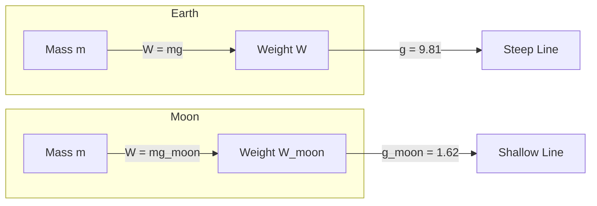
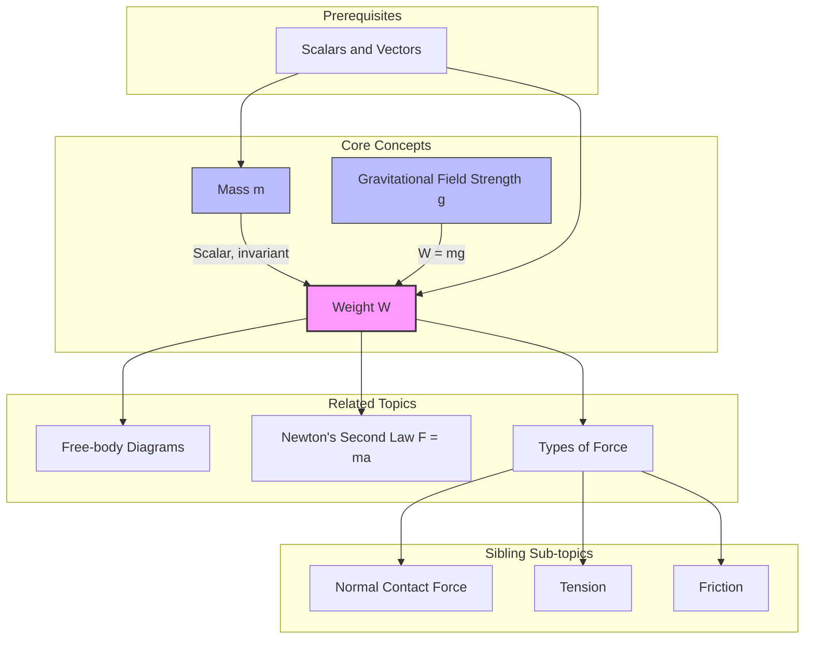

---
# Weight and Gravitational Force / 重量与引力

---

# 1. Overview / 概述

**English:**
Weight is the gravitational force exerted on an object by a planet (usually Earth). It is a vector quantity, always directed towards the centre of the planet. This sub-topic distinguishes between **mass** (a scalar, invariant property of matter) and **weight** (a force that depends on gravitational field strength). Understanding weight is fundamental to [[Types of Force]] and is a prerequisite for constructing [[Free-body Diagrams]] and analysing motion under gravity. The concept of gravitational field strength $g$ is introduced as the force per unit mass.

**中文:**
重量是行星（通常是地球）对物体施加的引力。它是一个矢量，方向始终指向行星中心。本子知识点区分**质量**（标量，物质的固有属性）和**重量**（取决于引力场强度的力）。理解重量是学习[[Types of Force]]的基础，也是构建[[Free-body Diagrams]]和分析重力作用下运动的先决条件。引力场强度 $g$ 被定义为每单位质量所受的力。

---

# 2. Syllabus Learning Objectives / 考纲学习目标

| CAIE 9702 (3.2 a) | Edexcel IAL (WPH11 U1: 2.1-2.3) |
|-----------|-------------|
| Define and distinguish between mass and weight. | Understand the concept of gravitational force and weight. |
| Recall and use the equation $W = mg$. | Use the equation $W = mg$ and understand that $g$ is the acceleration due to gravity. |
| Understand that weight is a force and is measured in newtons. | Distinguish between mass and weight. |

**Examiner Expectations / 考官期望:**
- **English:** You must be able to state that weight is a *force* (vector) and mass is a *scalar* quantity. You must know that $g$ is approximately $9.81 \text{ N kg}^{-1}$ (or $9.81 \text{ m s}^{-2}$) on Earth. You must be able to calculate weight in different gravitational fields (e.g., Moon).
- **中文:** 你必须能够说明重量是*力*（矢量），质量是*标量*。你必须知道地球上的 $g$ 约为 $9.81 \text{ N kg}^{-1}$（或 $9.81 \text{ m s}^{-2}$）。你必须能够计算不同引力场（例如月球）中的重量。

---

# 3. Core Definitions / 核心定义

| Term (EN/CN) | Definition (EN) | Definition (CN) | Common Mistakes / 常见错误 |
|--------------|-----------------|-----------------|---------------------------|
| **Mass** / 质量 | A scalar quantity that measures the amount of matter in an object. It is invariant (does not change with location). | 衡量物体所含物质多少的标量。它是恒定的（不随位置变化）。 | Confusing mass with weight. Saying "I weigh 60 kg" is incorrect; you *have* a mass of 60 kg. |
| **Weight** / 重量 | The gravitational force exerted on an object. It is a vector quantity, directed towards the centre of the gravitational field. | 作用在物体上的引力。它是一个矢量，方向指向引力场中心。 | Forgetting that weight is a *force* and is measured in newtons (N), not kilograms (kg). |
| **Gravitational Field Strength ($g$)** / 引力场强度 | The force per unit mass experienced by a small test mass placed in a gravitational field. Unit: $\text{N kg}^{-1}$ (equivalent to $\text{m s}^{-2}$). | 放置在引力场中的小测试质量每单位质量所受的力。单位：$\text{N kg}^{-1}$（等同于 $\text{m s}^{-2}$）。 | Thinking $g$ is just "gravity" or a constant. It varies with location (e.g., Earth vs. Moon). |
| **Newton (N)** / 牛顿 | The SI unit of force. $1 \text{ N} = 1 \text{ kg m s}^{-2}$. | 力的国际单位制单位。$1 \text{ N} = 1 \text{ kg m s}^{-2}$。 | Using kg as a unit of force. |

---

# 4. Key Concepts Explained / 关键概念详解

## 4.1 Distinction Between Mass and Weight / 质量与重量的区别

### Explanation / 解释
**English:**
Mass ($m$) is a fundamental property of an object. It is a **scalar** quantity and is measured in kilograms (kg). Mass is **invariant** — it does not change whether the object is on Earth, the Moon, or in deep space.

Weight ($W$) is the **gravitational force** acting on that mass. It is a **vector** quantity, measured in newtons (N). Weight depends on the local **gravitational field strength** ($g$). The relationship is given by the equation $W = mg$.

**中文:**
质量 ($m$) 是物体的基本属性。它是一个**标量**，单位是千克 (kg)。质量是**恒定的**——无论物体在地球、月球还是深空，它都不会改变。

重量 ($W$) 是作用在该质量上的**引力**。它是一个**矢量**，单位是牛顿 (N)。重量取决于当地的**引力场强度** ($g$)。它们的关系由公式 $W = mg$ 给出。

### Physical Meaning / 物理意义
**English:**
- **Mass** is a measure of *inertia* (resistance to acceleration) and the amount of substance.
- **Weight** is the *pull* of gravity. If you jump, weight is what brings you back down.
- **Gravitational Field Strength $g$** tells you how strong the gravitational pull is at a specific point. On Earth, $g \approx 9.81 \text{ N kg}^{-1}$.

**中文:**
- **质量**是*惯性*（抵抗加速度的能力）和物质多少的量度。
- **重量**是引力的*拉力*。如果你跳起来，重量就是让你落回地面的力。
- **引力场强度 $g$** 告诉你某一点引力的强弱。在地球上，$g \approx 9.81 \text{ N kg}^{-1}$。

### Common Misconceptions / 常见误区
- **"Weight is measured in kg."** → Incorrect. Weight is a force, measured in N. Mass is measured in kg.
- **"An astronaut in space has no weight."** → Partially true (weight is negligible far from planets), but their mass remains the same.
- **"$g$ is always $9.81$."** → False. $g$ varies with altitude, latitude, and planetary body.

### Exam Tips / 考试提示
- **English:** Always use the correct units: kg for mass, N for weight. When drawing [[Free-body Diagrams]], the weight force arrow always points straight down (towards Earth's centre).
- **中文:** 始终使用正确的单位：质量用 kg，重量用 N。在绘制[[Free-body Diagrams]]时，重力的箭头始终指向正下方（朝向地心）。

> 📷 **IMAGE PROMPT — DIAGRAM-01: Mass vs Weight Comparison**
> A split diagram. Left side: A 10 kg block on Earth, with a downward arrow labelled "Weight = 98.1 N" and a note "g = 9.81 N/kg". Right side: The same 10 kg block on the Moon, with a smaller downward arrow labelled "Weight = 16.2 N" and a note "g = 1.62 N/kg". The mass "10 kg" is shown on the block in both images. Clean, textbook style.

---

# 5. Essential Equations / 核心公式

## Equation 1: Weight Equation / 重量公式

$$ W = mg $$

| Symbol (符号) | Meaning (EN) | Meaning (CN) | Unit (单位) |
|--------------|-------------|-------------|------------|
| $W$ | Weight (gravitational force) | 重量（引力） | N (newton) |
| $m$ | Mass | 质量 | kg (kilogram) |
| $g$ | Gravitational field strength / acceleration due to gravity | 引力场强度 / 重力加速度 | $\text{N kg}^{-1}$ or $\text{m s}^{-2}$ |

**Derivation / 推导:**
This is an empirical relationship derived from Newton's Second Law ($F = ma$) applied to free-fall. When the only force is weight, the acceleration $a$ is $g$, so $F = mg$.

**Conditions / 适用条件:**
- **English:** The object must be within a gravitational field. The equation is valid for any planet or moon, provided the correct value of $g$ is used.
- **中文:** 物体必须处于引力场中。只要使用正确的 $g$ 值，该公式适用于任何行星或月球。

**Limitations / 局限性:**
- **English:** It assumes $g$ is constant over the object's size. For very large objects (e.g., a mountain), $g$ varies slightly across the object, but this is negligible at A-Level.
- **中文:** 它假设 $g$ 在物体尺寸范围内是恒定的。对于非常大的物体（例如山），$g$ 在物体上略有变化，但在 A-Level 阶段可以忽略不计。

---

# 6. Graphs and Relationships / 图表与关系

## 6.1 Weight vs Mass Graph / 重量-质量关系图

### Axes / 坐标轴
- **X-axis:** Mass ($m$) / 质量 ($m$) — kg
- **Y-axis:** Weight ($W$) / 重量 ($W$) — N

### Shape / 形状
A straight line passing through the origin.

### Gradient Meaning / 斜率含义
The gradient of the line is equal to the gravitational field strength $g$.

$$ \text{Gradient} = \frac{\Delta W}{\Delta m} = g $$

### Area Meaning / 面积含义
The area under the graph has no physical meaning in this context.

### Exam Interpretation / 考试解读
- **English:** If you plot weight against mass for objects on Earth, you get a straight line with gradient $9.81 \text{ N kg}^{-1}$. If you do the same on the Moon, the line is shallower (gradient $1.62 \text{ N kg}^{-1}$).
- **中文:** 如果你绘制地球上物体的重量-质量图，你会得到一条斜率为 $9.81 \text{ N kg}^{-1}$ 的直线。如果在月球上做同样的事情，直线会更平缓（斜率为 $1.62 \text{ N kg}^{-1}$）。

> 📷 **IMAGE PROMPT — GRAPH-01: Weight vs Mass Graph**
> A graph with two straight lines through the origin. One line labelled "Earth (g = 9.81 N/kg)" is steep. Another line labelled "Moon (g = 1.62 N/kg)" is shallower. Axes labelled "Mass / kg" (x) and "Weight / N" (y). Clean, exam-style graph.

---

# 7. Required Diagrams / 必备图表

## 7.1 Weight Force on a Free-Body Diagram / 自由体受力图中的重力

### Description / 描述
**English:** A diagram showing a block resting on a surface. The weight force ($W$) is drawn as an arrow pointing vertically downwards from the centre of mass of the block. The normal contact force ($N$) is drawn pointing vertically upwards from the surface.

**中文:** 一个显示放置在表面上的物块的受力图。重力 ($W$) 被绘制为从物块质心垂直向下的箭头。法向接触力 ($N$) 被绘制为从表面垂直向上的箭头。

### Image Prompt / 图片生成提示
> 📷 **IMAGE PROMPT — DIAGRAM-02: Weight on Free-Body Diagram**
> A simple 2D diagram. A rectangular block on a horizontal surface. From the centre of the block, a long downward arrow labelled "W (weight)". From the bottom of the block, an upward arrow of equal length labelled "N (normal contact force)". Clean, textbook style.

### Labels Required / 需要标注
- **English:** $W$ (weight), $N$ (normal contact force), Centre of Mass
- **中文:** $W$ (重量), $N$ (法向接触力), 质心

### Exam Importance / 考试重要性
- **English:** This is the most fundamental diagram in mechanics. You must be able to draw it correctly for any object. The weight arrow always starts at the centre of mass and points straight down.
- **中文:** 这是力学中最基本的受力图。你必须能够为任何物体正确绘制它。重力箭头始终从质心开始，指向正下方。

---

# 8. Worked Examples / 典型例题

## Example 1: Calculating Weight on Earth and Moon / 计算地球和月球上的重量

### Question / 题目
**English:**
An astronaut has a mass of 75 kg. Calculate:
(a) Her weight on Earth ($g = 9.81 \text{ N kg}^{-1}$).
(b) Her weight on the Moon ($g = 1.62 \text{ N kg}^{-1}$).
(c) Her mass on the Moon.

**中文:**
一名宇航员的质量为 75 kg。计算：
(a) 她在地球上的重量 ($g = 9.81 \text{ N kg}^{-1}$)。
(b) 她在月球上的重量 ($g = 1.62 \text{ N kg}^{-1}$)。
(c) 她在月球上的质量。

### Solution / 解答

**(a) Weight on Earth / 地球上的重量:**
$$ W = mg = 75 \times 9.81 = 735.75 \text{ N} \approx 736 \text{ N} $$

**(b) Weight on Moon / 月球上的重量:**
$$ W = mg = 75 \times 1.62 = 121.5 \text{ N} \approx 122 \text{ N} $$

**(c) Mass on Moon / 月球上的质量:**
Mass is invariant. Her mass on the Moon is still **75 kg**.

### Final Answer / 最终答案
**Answer:** (a) 736 N, (b) 122 N, (c) 75 kg | **答案：** (a) 736 N, (b) 122 N, (c) 75 kg

### Quick Tip / 提示
- **English:** Remember that mass does NOT change with location. Only weight changes because $g$ changes.
- **中文:** 记住质量不随位置改变。只有重量会改变，因为 $g$ 改变了。

---

## Example 2: Finding Mass from Weight / 从重量求质量

### Question / 题目
**English:**
A bag of rice has a weight of 49.05 N on Earth ($g = 9.81 \text{ N kg}^{-1}$). What is its mass?

**中文:**
一袋大米在地球上的重量为 49.05 N ($g = 9.81 \text{ N kg}^{-1}$)。它的质量是多少？

### Solution / 解答
Rearrange $W = mg$ to find $m$:
$$ m = \frac{W}{g} = \frac{49.05}{9.81} = 5.00 \text{ kg} $$

### Final Answer / 最终答案
**Answer:** 5.00 kg | **答案：** 5.00 kg

### Quick Tip / 提示
- **English:** Always rearrange the formula before substituting numbers. Show your working clearly.
- **中文:** 在代入数字之前，始终先重新排列公式。清晰地展示你的计算过程。

---

# 9. Past Paper Question Types / 历年真题题型

| Question Type / 题型 | Frequency / 频率 | Difficulty / 难度 | Past Paper References / 真题索引 |
|----------------------|------------------|------------------|-------------------------------|
| Direct calculation of $W = mg$ | High | Easy | 📝 *待填入* |
| Distinguishing mass vs weight in a context | Medium | Easy | 📝 *待填入* |
| Weight in different gravitational fields | Medium | Medium | 📝 *待填入* |
| Weight on a free-body diagram | High | Easy | 📝 *待填入* |

**Common Command Words / 常见指令词:**
- **English:** Define, Calculate, State, Distinguish, Explain
- **中文:** 定义，计算，陈述，区分，解释

---

# 10. Practical Skills Connections / 实验技能链接

**English:**
- **Measurement of $g$:** You may be asked to determine $g$ experimentally using a falling object or a pendulum. The weight of the object is measured using a **spring balance** or **force sensor**.
- **Uncertainties:** When measuring weight, consider the precision of the balance. For example, a spring balance with a resolution of 0.1 N gives an uncertainty of $\pm 0.05 \text{ N}$.
- **Graph Plotting:** Plotting weight against mass for different objects yields a straight line whose gradient is $g$. This is a common practical question.
- **Experimental Design:** To verify $W = mg$, you would measure the mass of several objects using a digital balance, then measure their weight using a calibrated spring balance or force sensor.

**中文:**
- **测量 $g$:** 你可能会被要求使用自由落体或单摆通过实验确定 $g$。物体的重量使用**弹簧秤**或**力传感器**测量。
- **不确定度:** 测量重量时，考虑测量仪器的精度。例如，分辨率为 0.1 N 的弹簧秤的不确定度为 $\pm 0.05 \text{ N}$。
- **绘图:** 绘制不同物体的重量-质量图，得到一条直线，其斜率即为 $g$。这是一个常见的实验题。
- **实验设计:** 为了验证 $W = mg$，你需要使用电子天平测量几个物体的质量，然后使用校准过的弹簧秤或力传感器测量它们的重量。

---

# 11. Concept Map / 概念图谱

---

# 12. Quick Revision Sheet / 速查表

| Category / 类别 | Key Points / 要点 |
|----------------|------------------|
| **Definition / 定义** | Weight is the gravitational force on an object. Mass is the amount of matter. |
| **Key Formula / 核心公式** | $W = mg$ |
| **Key Graph / 核心图表** | Weight vs Mass: Straight line through origin, gradient = $g$ |
| **Units / 单位** | Mass: kg, Weight: N, $g$: $\text{N kg}^{-1}$ or $\text{m s}^{-2}$ |
| **Common Mistake / 常见错误** | Saying "I weigh 60 kg" → Incorrect. You *have* a mass of 60 kg. Your weight is $60 \times 9.81 = 589 \text{ N}$. |
| **Exam Tip / 考试提示** | On a [[Free-body Diagrams]], weight always points straight down from the centre of mass. |
| **Key Distinction / 关键区分** | Mass is invariant (same everywhere). Weight depends on $g$ (changes with location). |