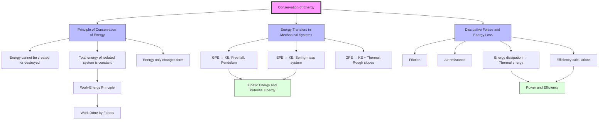

# 1. Overview / 概述

**English:** The Principle of Conservation of Energy is one of the most fundamental laws in physics. It states that energy cannot be created or destroyed, only transferred from one form to another. This topic explores how energy transforms between [[Kinetic Energy and Potential Energy|kinetic energy]], [[Kinetic Energy and Potential Energy|gravitational potential energy]], [[Kinetic Energy and Potential Energy|elastic potential energy]], and thermal energy in mechanical systems. Understanding energy conservation is essential for analyzing real-world systems like roller coasters, pendulums, and falling objects. In both CAIE 9702 and Edexcel IAL, this principle underpins nearly every mechanics problem and is a cornerstone for later topics in thermodynamics and nuclear physics.

**中文:** 能量守恒原理是物理学中最基本的定律之一。它指出能量既不能被创造也不能被消灭，只能从一种形式转化为另一种形式。本主题探讨能量如何在[[Kinetic Energy and Potential Energy|动能]]、[[Kinetic Energy and Potential Energy|重力势能]]、[[Kinetic Energy and Potential Energy|弹性势能]]和热能之间转化。理解能量守恒对于分析过山车、钟摆和自由落体等真实系统至关重要。在CAIE 9702和Edexcel IAL中，该原理几乎支撑着所有力学问题，并且是后续热力学和核物理主题的基石。

> 📷 **IMAGE PROMPT — [COE-OVERVIEW]: Energy Conservation Overview Diagram** (A diagram showing a roller coaster at the top of a hill with labels: "Maximum GPE, Minimum KE" at the top, "Energy Transfer" arrows pointing down, "Maximum KE, Minimum GPE" at the bottom. Include a small pie chart showing energy distribution at three positions. Style: clean educational diagram, pastel colors, exam-style labels. Importance: HIGH — helps visualize energy transformation.)

# 2. Syllabus Learning Objectives / 考纲学习目标

| CAIE 9702 (3.3g) | Edexcel IAL (WPH11 U1: 4.9-4.11) |
|---|---|
| State the principle of conservation of energy | Understand the principle of conservation of energy |
| Apply the principle to mechanical systems | Apply conservation of energy to mechanical systems |
| Account for energy losses due to dissipative forces | Account for energy dissipated by friction and air resistance |
| Solve problems involving energy transfers | Solve problems involving energy transfers between GPE, KE, and EPE |

**Examiner Expectations:**
- **English:** Candidates must state the principle verbatim in exams. For calculation problems, always show energy before = energy after with all terms explicitly listed. Mark schemes award marks for identifying each energy form and accounting for dissipative losses.
- **中文:** 考生必须在考试中准确陈述该原理。对于计算题，始终列出能量守恒方程（能量初=能量末），并明确写出每一项。评分标准要求识别每种能量形式并考虑耗散损失。

> 📋 **CIE Only:** CAIE often asks for the principle to be stated in words (1 mark) before applying it. They also frequently test energy conservation in pendulum and spring systems.
> 📋 **Edexcel Only:** Edexcel emphasizes practical applications like bouncing balls and roller coasters. They may ask to calculate the percentage of energy dissipated.

# 3. Core Definitions / 核心定义

| Term (EN/CN) | Definition (EN) | Definition (CN) | Common Mistakes / 常见错误 |
|---|---|---|---|
| [[Principle of Conservation of Energy]] / 能量守恒原理 | Energy cannot be created or destroyed; it can only be transferred from one form to another. The total energy of a closed system remains constant. | 能量既不能被创造也不能被消灭，只能从一种形式转化为另一种形式。封闭系统的总能量保持不变。 | Forgetting to include ALL energy forms (e.g., thermal energy from friction) |
| [[Energy Transfers in Mechanical Systems|Mechanical Energy]] / 机械能 | The sum of kinetic energy and potential energy in a system. | 系统中动能和势能的总和。 | Assuming mechanical energy is always conserved (only true without dissipative forces) |
| [[Dissipative Forces and Energy Loss|Dissipative Forces]] / 耗散力 | Forces that convert mechanical energy into thermal energy (e.g., friction, air resistance). | 将机械能转化为热能的力（如摩擦力、空气阻力）。 | Thinking dissipative forces destroy energy (they transfer it, not destroy it) |
| [[Kinetic Energy and Potential Energy|Kinetic Energy (KE)]] / 动能 | The energy an object possesses due to its motion. $KE = \frac{1}{2}mv^2$ | 物体由于运动而具有的能量。 | Confusing KE with momentum |
| [[Kinetic Energy and Potential Energy|Gravitational Potential Energy (GPE)]] / 重力势能 | The energy an object possesses due to its position in a gravitational field. $GPE = mgh$ | 物体由于在重力场中的位置而具有的能量。 | Using wrong reference level for height |
| [[Kinetic Energy and Potential Energy|Elastic Potential Energy (EPE)]] / 弹性势能 | The energy stored in a deformed elastic object. $EPE = \frac{1}{2}kx^2$ | 储存在形变弹性物体中的能量。 | Forgetting the $\frac{1}{2}$ factor |
| [[Dissipative Forces and Energy Loss|Energy Dissipation]] / 能量耗散 | The conversion of useful mechanical energy into less useful forms (usually thermal energy). | 有用的机械能转化为不太有用的形式（通常是热能）。 | Saying energy is "lost" instead of "dissipated" |

# 4. Key Concepts Explained / 关键概念详解

## 4.1 The Principle of Conservation of Energy / 能量守恒原理

### Explanation / 解释
**English:** The [[Principle of Conservation of Energy]] states that the total energy of an isolated system remains constant. In mechanical systems, this means: $E_{total\ initial} = E_{total\ final}$. For example, when a ball is dropped from height $h$, its [[Kinetic Energy and Potential Energy|gravitational potential energy]] converts to [[Kinetic Energy and Potential Energy|kinetic energy]]. Just before hitting the ground, all GPE has become KE (ignoring air resistance). Mathematically: $mgh = \frac{1}{2}mv^2$.

**中文:** [[Principle of Conservation of Energy|能量守恒原理]]指出，孤立系统的总能量保持不变。在机械系统中，这意味着：$E_{总初} = E_{总末}$。例如，当球从高度$h$落下时，其[[Kinetic Energy and Potential Energy|重力势能]]转化为[[Kinetic Energy and Potential Energy|动能]]。在撞击地面之前，所有GPE都转化为KE（忽略空气阻力）。数学表达式：$mgh = \frac{1}{2}mv^2$。

### Physical Meaning / 物理意义
**English:** Energy is a scalar quantity that can be transferred between objects or converted between forms. The total amount never changes — this is a fundamental symmetry of nature related to time invariance (Noether's theorem). In practical terms, this means we can track energy through any process and predict outcomes.

**中文:** 能量是一个标量，可以在物体之间传递或在形式之间转换。总量永远不会改变——这是与时间不变性相关的基本自然对称性（诺特定理）。在实际应用中，这意味着我们可以追踪任何过程中的能量并预测结果。

### Common Misconceptions / 常见误区
- **Energy is "lost":** Energy is never lost; it is transferred to other forms (usually thermal energy).
- **Energy is "used up":** Energy is conserved; it becomes less useful but still exists.
- **Mechanical energy is always conserved:** Only true in the absence of [[Dissipative Forces and Energy Loss|dissipative forces]].
- **KE = GPE at all points:** Only at the midpoint of a vertical fall (if starting from rest).

### Exam Tips / 考试提示
**English:** Always write the conservation equation in full: $E_{initial} = E_{final}$. List ALL energy forms present at the start and end. If dissipative forces are present, include a term for work done against friction or thermal energy gained. For CAIE, state the principle in words first (1 mark). For Edexcel, show clear algebraic steps.

**中文:** 始终完整写出守恒方程：$E_{初} = E_{末}$。列出开始和结束时存在的所有能量形式。如果存在耗散力，则包括克服摩擦力所做的功或获得的热能项。对于CAIE，先用文字陈述原理（1分）。对于Edexcel，展示清晰的代数步骤。

> 📷 **IMAGE PROMPT — [COE-PENDULUM]: Pendulum Energy Conservation** (A pendulum at three positions: maximum height left (all GPE), midpoint (half GPE, half KE), maximum height right (all GPE). Arrows showing energy transfer. Labels: "GPE max, KE = 0", "GPE + KE = constant", "GPE max, KE = 0". Style: clean line diagram, blue pendulum bob, green arrows. Importance: HIGH — classic exam question.)

## 4.2 Energy Transfers in Mechanical Systems / 机械系统中的能量传递

### Explanation / 解释
**English:** In mechanical systems, energy transfers between [[Kinetic Energy and Potential Energy|KE, GPE, and EPE]]. Common scenarios include:
- **Free fall:** GPE → KE ($mgh = \frac{1}{2}mv^2$)
- **Pendulum:** GPE ↔ KE (oscillating)
- **Spring-mass system:** EPE ↔ KE ($\frac{1}{2}kx^2 = \frac{1}{2}mv^2$)
- **Roller coaster:** GPE → KE → GPE (with some dissipation)
- **Object sliding down a slope:** GPE → KE + work done against friction

**中文:** 在机械系统中，能量在[[Kinetic Energy and Potential Energy|动能、重力势能和弹性势能]]之间传递。常见场景包括：
- **自由落体：** GPE → KE ($mgh = \frac{1}{2}mv^2$)
- **钟摆：** GPE ↔ KE（振荡）
- **弹簧-质量系统：** EPE ↔ KE ($\frac{1}{2}kx^2 = \frac{1}{2}mv^2$)
- **过山车：** GPE → KE → GPE（有一些耗散）
- **物体沿斜面下滑：** GPE → KE + 克服摩擦力做功

### Physical Meaning / 物理意义
**English:** The total mechanical energy ($E_{mech} = KE + PE$) is conserved only when no [[Dissipative Forces and Energy Loss|dissipative forces]] do work. When friction or air resistance is present, some mechanical energy is converted to thermal energy, reducing the mechanical energy but keeping total energy constant.

**中文:** 只有当没有[[Dissipative Forces and Energy Loss|耗散力]]做功时，总机械能（$E_{机械} = KE + PE$）才守恒。当存在摩擦力或空气阻力时，部分机械能转化为热能，减少了机械能但总能量保持不变。

### Common Misconceptions / 常见误区
- **GPE is always positive:** GPE depends on the reference level; it can be negative if below the reference.
- **KE is always positive:** KE is always $\geq 0$ since $v^2$ is always positive.
- **Energy transfers are instantaneous:** Energy transfers take time; at any instant, the system has a mix of energy forms.

### Exam Tips / 考试提示
**English:** For multi-stage problems, draw an energy bar chart or write the conservation equation at each stage. Identify the reference level for GPE (usually the lowest point). For spring problems, remember that EPE is stored when the spring is compressed or stretched from its natural length.

**中文:** 对于多阶段问题，绘制能量柱状图或在每个阶段写出守恒方程。确定GPE的参考水平（通常是最低点）。对于弹簧问题，记住当弹簧从自然长度压缩或拉伸时储存EPE。

## 4.3 Dissipative Forces and Energy Loss / 耗散力与能量损失

### Explanation / 解释
**English:** [[Dissipative Forces and Energy Loss|Dissipative forces]] like friction and air resistance convert mechanical energy into thermal energy. The work done against these forces equals the amount of mechanical energy "lost" (dissipated). The conservation equation becomes: $E_{initial} = E_{final} + W_{dissipated}$, where $W_{dissipated} = F_{friction} \times d$ (for constant friction) or $W_{dissipated} = \text{work done against air resistance}$.

**中文:** [[Dissipative Forces and Energy Loss|耗散力]]如摩擦力和空气阻力将机械能转化为热能。克服这些力所做的功等于"损失"（耗散）的机械能。守恒方程变为：$E_{初} = E_{末} + W_{耗散}$，其中$W_{耗散} = F_{摩擦} \times d$（对于恒定摩擦力）或$W_{耗散} = \text{克服空气阻力所做的功}$。

### Physical Meaning / 物理意义
**English:** Dissipation does not destroy energy — it converts organized mechanical energy into random thermal motion of particles. This thermal energy is less useful for doing work, which is why we say energy "degrades" in quality. This connects to the second law of thermodynamics.

**中文:** 耗散不会消灭能量——它将有序的机械能转化为粒子随机热运动。这种热能对于做功不太有用，这就是为什么我们说能量"降级"。这与热力学第二定律相关。

### Common Misconceptions / 常见误区
- **Friction always reduces total energy:** Friction increases thermal energy, so total energy is conserved.
- **"Lost" energy disappears:** "Lost" means converted to a form that is not useful for the intended purpose.
- **Air resistance is negligible in all exam problems:** Always check if the problem states "negligible air resistance" or "with air resistance."

### Exam Tips / 考试提示
**English:** When dissipative forces are present, the equation is: $mgh = \frac{1}{2}mv^2 + Fd$ (for friction on a horizontal surface after a slope). For percentage efficiency: $\text{Efficiency} = \frac{\text{Useful energy output}}{\text{Total energy input}} \times 100\%$. CAIE often asks to calculate the work done against friction.

**中文:** 当存在耗散力时，方程为：$mgh = \frac{1}{2}mv^2 + Fd$（对于斜面后水平面上的摩擦力）。对于百分比效率：$\text{效率} = \frac{\text{有用能量输出}}{\text{总能量输入}} \times 100\%$。CAIE经常要求计算克服摩擦力所做的功。

> 📷 **IMAGE PROMPT — [COE-FRICTION]: Energy Dissipation Diagram** (A block sliding down a rough inclined plane. Labels: "GPE at top", "KE at bottom", "Thermal energy from friction". Arrows showing energy flow. A bar chart on the side showing initial GPE splitting into KE and thermal energy. Style: 3D-ish block, rough surface texture, warm colors for thermal energy. Importance: HIGH — common exam scenario.)

# 5. Essential Equations / 核心公式

## 5.1 Principle of Conservation of Energy / 能量守恒原理

$$E_{total\ initial} = E_{total\ final}$$

| Symbol (符号) | Meaning (EN/CN) | Unit (单位) |
|---|---|---|
| $E_{total\ initial}$ | Total energy at the start / 初始总能量 | J (Joules) |
| $E_{total\ final}$ | Total energy at the end / 最终总能量 | J (Joules) |

**Derivation:** This is a fundamental law of physics, not derived from other equations. It is based on experimental observation and symmetry principles.

**Conditions:** Applies to isolated systems (no external work done). For open systems, include work done by external forces.

**Limitations:** Does not account for mass-energy equivalence ($E=mc^2$) at nuclear scales — but this is beyond AS level.

**Rearrangements:** $E_{initial} - E_{final} = 0$ (for closed systems); $E_{initial} = E_{final} + E_{dissipated}$ (with dissipation)

## 5.2 Conservation of Mechanical Energy (No Dissipation) / 机械能守恒（无耗散）

$$KE_1 + GPE_1 + EPE_1 = KE_2 + GPE_2 + EPE_2$$

| Symbol (符号) | Meaning (EN/CN) | Unit (单位) |
|---|---|---|
| $KE_1, KE_2$ | Kinetic energy at positions 1 and 2 / 位置1和2的动能 | J |
| $GPE_1, GPE_2$ | Gravitational potential energy at positions 1 and 2 / 位置1和2的重力势能 | J |
| $EPE_1, EPE_2$ | Elastic potential energy at positions 1 and 2 / 位置1和2的弹性势能 | J |

**Derivation:** Direct application of the principle of conservation of energy to mechanical systems.

**Conditions:** Only valid when no [[Dissipative Forces and Energy Loss|dissipative forces]] do work. The system must be closed (no external forces doing work).

**Limitations:** Real systems always have some dissipation, so this is an idealization.

**Rearrangements:** $KE_2 - KE_1 = GPE_1 - GPE_2 + EPE_1 - EPE_2$ (change in KE equals negative change in PE)

## 5.3 Conservation with Dissipation / 含耗散的能量守恒

$$E_{initial} = E_{final} + W_{dissipated}$$

| Symbol (符号) | Meaning (EN/CN) | Unit (单位) |
|---|---|---|
| $W_{dissipated}$ | Work done against dissipative forces / 克服耗散力所做的功 | J |
| $F_{friction}$ | Frictional force / 摩擦力 | N |
| $d$ | Distance over which friction acts / 摩擦力作用的距离 | m |

**Derivation:** $W_{dissipated} = F_{friction} \times d$ (for constant friction force). This work converts mechanical energy to thermal energy.

**Conditions:** Valid for any system with dissipative forces. The dissipated energy appears as thermal energy in the surroundings.

**Limitations:** Assumes constant friction force. For air resistance, the force depends on velocity, making the calculation more complex.

**Rearrangements:** $E_{dissipated} = E_{initial} - E_{final}$; $F_{friction} = \frac{E_{dissipated}}{d}$

## 5.4 Efficiency / 效率

$$\text{Efficiency} = \frac{\text{Useful energy output}}{\text{Total energy input}} \times 100\%$$

| Symbol (符号) | Meaning (EN/CN) | Unit (单位) |
|---|---|---|
| Efficiency | Ratio of useful output to total input / 有用输出与总输入之比 | % or decimal |
| Useful energy output | Energy that performs the desired function / 执行所需功能的能量 | J |
| Total energy input | All energy supplied to the system / 提供给系统的所有能量 | J |

**Derivation:** Direct definition based on conservation of energy. The "wasted" energy is $E_{input} - E_{useful}$.

**Conditions:** Efficiency is always between 0% and 100% (or 0 and 1 in decimal).

**Limitations:** Does not account for the quality of energy (e.g., thermal energy at low temperature is less useful).

**Rearrangements:** $E_{useful} = \text{Efficiency} \times E_{input}$; $E_{wasted} = E_{input} \times (1 - \text{Efficiency})$

# 6. Graphs and Relationships / 图表与关系

## 6.1 Energy vs. Height for a Falling Object / 自由落体能量-高度图

**Axes:** X-axis: Height above ground ($h$), Y-axis: Energy ($E$)

**Shape:** 
- GPE: Straight line decreasing from $mgh_{max}$ to 0 (linear: $GPE = mgh$)
- KE: Straight line increasing from 0 to $mgh_{max}$ (linear: $KE = mg(h_{max} - h)$)
- Total mechanical energy: Horizontal straight line (constant)

**Gradient Meaning (EN+CN):** Gradient of GPE line = $mg$ (weight of object). Gradient of KE line = $-mg$ (negative weight). / GPE线的斜率 = $mg$（物体重量）。KE线的斜率 = $-mg$（负重量）。

**Area Meaning (EN+CN):** No meaningful area under these curves. / 这些曲线下没有有意义的面积。

**Exam Interpretation:** The intersection point of GPE and KE lines occurs at $h = h_{max}/2$, where GPE = KE = $mgh_{max}/2$.

**Common Questions:** "At what height are KE and GPE equal?" Answer: Half the initial height.

> 📷 **IMAGE PROMPT — [COE-GRAPH1]: Energy vs Height Graph** (Graph with height on x-axis, energy on y-axis. Three lines: GPE (downward sloping), KE (upward sloping), Total Energy (horizontal). Intersection point labeled. Style: clean graph paper background, colored lines with legend. Importance: HIGH — very common exam graph.)

## 6.2 Energy vs. Time for a Pendulum / 钟摆能量-时间图

**Axes:** X-axis: Time ($t$), Y-axis: Energy ($E$)

**Shape:** 
- GPE: Cosine wave (maximum at extremes, minimum at bottom)
- KE: Sine wave (minimum at extremes, maximum at bottom)
- Total mechanical energy: Horizontal straight line (if no dissipation)

**Gradient Meaning (EN+CN):** Gradient of KE = rate of change of KE = power. Gradient of GPE = rate of change of GPE = -power. / KE的斜率 = KE的变化率 = 功率。GPE的斜率 = GPE的变化率 = -功率。

**Area Meaning (EN+CN):** Area under KE-time graph = work done (change in KE). / KE-时间图下的面积 = 所做的功（KE的变化）。

**Exam Interpretation:** The sum of KE and GPE is constant at all times. The period of oscillation is the time between successive maxima of KE or GPE.

**Common Questions:** "Sketch the graph of KE against time for a damped pendulum." Answer: Amplitude decreases over time.

> 📷 **IMAGE PROMPT — [COE-GRAPH2]: Pendulum Energy vs Time** (Graph with time on x-axis, energy on y-axis. Two sinusoidal curves: GPE (dashed, peaks at extremes) and KE (solid, peaks at bottom). Horizontal total energy line. One period labeled. Style: clean graph, different line styles. Importance: HIGH — pendulum is a classic system.)

## 6.3 Energy vs. Extension for a Spring / 弹簧能量-伸长量图

**Axes:** X-axis: Extension ($x$), Y-axis: Energy ($E$)

**Shape:**
- EPE: Parabola opening upward ($EPE = \frac{1}{2}kx^2$)
- KE: Inverted parabola (if oscillating, KE = total energy - EPE)
- Total mechanical energy: Horizontal straight line

**Gradient Meaning (EN+CN):** Gradient of EPE curve = $kx$ = force exerted by spring. / EPE曲线的斜率 = $kx$ = 弹簧施加的力。

**Area Meaning (EN+CN):** Area under force-extension graph = work done = EPE stored. / 力-伸长量图下的面积 = 所做的功 = 储存的EPE。

**Exam Interpretation:** The EPE is zero at natural length ($x=0$) and increases quadratically with extension. The maximum KE occurs at $x=0$ (natural length).

**Common Questions:** "Calculate the maximum speed of a mass on a spring given the amplitude." Use $\frac{1}{2}kA^2 = \frac{1}{2}mv_{max}^2$.

> 📷 **IMAGE PROMPT — [COE-GRAPH3]: Spring Energy vs Extension** (Graph with extension on x-axis, energy on y-axis. Parabolic EPE curve, inverted parabolic KE curve, horizontal total energy line. Natural length marked. Style: clean graph, labeled curves. Importance: MEDIUM — spring systems are common.)

# 7. Required Diagrams / 必备图表

## 7.1 Energy Transfer Diagram for a Falling Object / 自由落体能量传递图

> 📷 **IMAGE PROMPT — [COE-DIAG1]: Falling Object Energy Transfer** (A diagram showing a ball at three heights: (1) At height h: GPE = mgh, KE = 0, with a large GPE bar and zero KE bar. (2) At height h/2: GPE = mgh/2, KE = mgh/2, with equal bars. (3) At ground: GPE = 0, KE = mgh, with zero GPE bar and large KE bar. Arrows between positions showing "GPE → KE". Style: clean educational diagram, blue ball, green energy bars, exam-style labels. Importance: HIGH — fundamental concept visualization.)

## 7.2 Energy Flow Diagram with Dissipation / 含耗散的能量流图

> 📷 **IMAGE PROMPT — [COE-DIAG2]: Energy Flow with Friction** (A Sankey diagram showing energy flow. Input: 100 J GPE. Outputs: 60 J KE (useful), 40 J Thermal Energy (dissipated). Arrows splitting from a main bar. Labels: "Useful KE 60%", "Dissipated (thermal) 40%". Below: a block on a rough surface with friction force arrow. Style: Sankey diagram style, warm colors for dissipated energy, cool colors for useful energy. Importance: HIGH — efficiency calculations are common.)

## 7.3 Pendulum Energy Positions / 钟摆能量位置图

> 📷 **IMAGE PROMPT — [COE-DIAG3]: Pendulum Energy Positions** (A pendulum at three positions: (A) Left extreme: height h above lowest point, GPE = mgh, KE = 0. (B) Bottom: height 0, GPE = 0, KE = mgh. (C) Right extreme: height h, GPE = mgh, KE = 0. Arrows showing direction of motion. Energy bar charts at each position. Labels: "Position A: max GPE", "Position B: max KE", "Position C: max GPE". Style: clean line diagram, blue pendulum bob, red arrows, green energy bars. Importance: HIGH — classic exam question setup.)

## 7.4 Spring-Mass System Energy Diagram / 弹簧-质量系统能量图

> 📷 **IMAGE PROMPT — [COE-DIAG4]: Spring-Mass Energy** (A horizontal spring-mass system at three positions: (1) Maximum compression: EPE = ½kA², KE = 0. (2) Natural length: EPE = 0, KE = ½kA². (3) Maximum extension: EPE = ½kA², KE = 0. Labels for each position. Energy bar charts. Style: clean diagram, spring coils visible, mass block, energy bars. Importance: MEDIUM — common in Edexcel papers.)

# 8. Worked Examples / 典型例题

## Example 1: Object Sliding Down a Rough Slope / 物体沿粗糙斜面下滑

### Question / 题目
**English:** A block of mass 2.0 kg slides down a rough inclined plane of length 5.0 m and height 3.0 m. The frictional force acting on the block is constant at 4.0 N. Calculate:
(a) The loss in gravitational potential energy of the block.
(b) The work done against friction.
(c) The speed of the block at the bottom of the slope.

**中文:** 一个质量为2.0 kg的物块沿粗糙斜面下滑，斜面长5.0 m，高3.0 m。作用在物块上的摩擦力恒为4.0 N。计算：
(a) 物块重力势能的减少量。
(b) 克服摩擦力所做的功。
(c) 物块到达斜面底端时的速度。

### Image Prompt / 图片提示
> 📷 **IMAGE PROMPT — [COE-EX1]: Block on Rough Slope** (A block on an inclined plane. Labels: mass = 2.0 kg, length = 5.0 m, height = 3.0 m, friction force = 4.0 N. Arrow showing direction of motion. Angle θ labeled. Style: simple diagram, exam-style. Importance: HIGH — very common problem type.)

### Solution / 解答

**Step 1: Calculate loss in GPE**
$$GPE_{loss} = mgh = 2.0 \times 9.81 \times 3.0 = 58.86 \text{ J}$$

**Step 2: Calculate work done against friction**
$$W_{friction} = F \times d = 4.0 \times 5.0 = 20.0 \text{ J}$$

**Step 3: Apply conservation of energy**
$$GPE_{loss} = KE_{gain} + W_{friction}$$
$$58.86 = \frac{1}{2}mv^2 + 20.0$$
$$\frac{1}{2} \times 2.0 \times v^2 = 58.86 - 20.0 = 38.86$$
$$v^2 = \frac{38.86}{1.0} = 38.86$$
$$v = \sqrt{38.86} = 6.23 \text{ m s}^{-1}$$

### Final Answer / 最终答案
(a) 58.9 J (b) 20.0 J (c) 6.23 m s⁻¹

### Examiner Notes / 考官点评
**English:** Common mistakes: (1) Using the slope length instead of height for GPE. (2) Forgetting to subtract work done against friction. (3) Not squaring the final velocity. Mark scheme: 1 mark for GPE, 1 mark for work done, 2 marks for KE equation and final answer. Always show units.

**中文:** 常见错误：(1) 用斜面长度代替高度计算GPE。(2) 忘记减去克服摩擦力所做的功。(3) 最终速度未平方。评分标准：GPE 1分，做功 1分，KE方程和最终答案 2分。始终显示单位。

## Example 2: Pendulum Swing / 钟摆摆动

### Question / 题目
**English:** A pendulum bob of mass 0.50 kg is released from rest at a height of 0.20 m above its lowest point. Calculate:
(a) The speed of the bob at the lowest point (assuming no energy loss).
(b) The height at which the bob has half its maximum speed.

**中文:** 一个质量为0.50 kg的钟摆从最低点上方0.20 m处静止释放。计算：
(a) 钟摆在最低点的速度（假设无能量损失）。
(b) 钟摆速度为其最大速度一半时的高度。

### Image Prompt / 图片提示
> 📷 **IMAGE PROMPT — [COE-EX2]: Pendulum Swing** (A pendulum showing release point at height 0.20 m above lowest point. Labels: mass = 0.50 kg, h = 0.20 m. Arrow showing direction of swing. Style: simple diagram, exam-style. Importance: HIGH — classic pendulum problem.)

### Solution / 解答

**Part (a): Speed at lowest point**

Apply conservation of energy:
$$GPE_{top} = KE_{bottom}$$
$$mgh = \frac{1}{2}mv^2$$
$$v = \sqrt{2gh} = \sqrt{2 \times 9.81 \times 0.20}$$
$$v = \sqrt{3.924} = 1.98 \text{ m s}^{-1}$$

**Part (b): Height at half maximum speed**

Half maximum speed: $v_{half} = \frac{1.98}{2} = 0.99 \text{ m s}^{-1}$

At this point, the bob has both KE and GPE:
$$GPE_{top} = KE_{half} + GPE_{half}$$
$$mgh_{top} = \frac{1}{2}mv_{half}^2 + mgh_{half}$$
$$9.81 \times 0.20 = \frac{1}{2} \times (0.99)^2 + 9.81 \times h_{half}$$
$$1.962 = 0.490 + 9.81h_{half}$$
$$9.81h_{half} = 1.962 - 0.490 = 1.472$$
$$h_{half} = \frac{1.472}{9.81} = 0.15 \text{ m}$$

### Final Answer / 最终答案
(a) 1.98 m s⁻¹ (b) 0.15 m

### Examiner Notes / 考官点评
**English:** Part (a) is straightforward — many students get this. Part (b) is more challenging. Common mistake: assuming KE at half speed is half the KE (it's actually one-quarter since KE ∝ v²). Mark scheme: 2 marks for part (a), 3 marks for part (b). Show clear working for partial credit.

**中文:** 第(a)部分直接——许多学生能答对。第(b)部分更具挑战性。常见错误：假设半速时的KE是KE的一半（实际上是四分之一，因为KE ∝ v²）。评分标准：第(a)部分2分，第(b)部分3分。展示清晰的计算过程以获得部分分数。

# 9. Past Paper Question Types / 历年真题题型

| Question Type / 题型 | Frequency / 频率 | Difficulty / 难度 | Past Paper References / 真题索引 |
|---|---|---|---|
| State the principle of conservation of energy / 陈述能量守恒原理 | High / 高 | Easy / 简单 | 📝 *待填入* |
| Calculate speed from GPE loss (no dissipation) / 从GPE损失计算速度（无耗散） | Very High / 非常高 | Easy / 简单 | 📝 *待填入* |
| Calculate speed with friction present / 计算含摩擦力的速度 | High / 高 | Medium / 中等 | 📝 *待填入* |
| Pendulum energy calculations / 钟摆能量计算 | Medium / 中 | Medium / 中等 | 📝 *待填入* |
| Spring-mass energy conversions / 弹簧-质量能量转换 | Medium / 中 | Medium / 中等 | 📝 *待填入* |
| Efficiency calculations / 效率计算 | Medium / 中 | Medium / 中等 | 📝 *待填入* |
| Energy bar chart interpretation / 能量柱状图解读 | Low / 低 | Medium / 中等 | 📝 *待填入* |
| Multi-stage energy transfers / 多阶段能量传递 | Low / 低 | Hard / 困难 | 📝 *待填入* |
| Percentage energy dissipation / 能量耗散百分比 | Medium / 中 | Medium / 中等 | 📝 *待填入* |
| Graph sketching (energy vs height/time) / 图表绘制（能量-高度/时间） | Low / 低 | Hard / 困难 | 📝 *待填入* |

> 📝 **题库整理中 / Question Bank Under Construction:** 具体真题索引正在整理中。建议参考CAIE 9702/21/O/N/19, CAIE 9702/22/M/J/18, Edexcel WPH11/01/Jan 2020等试卷中的能量守恒题目。 / Specific past paper references are being compiled. Recommended papers include CAIE 9702/21/O/N/19, CAIE 9702/22/M/J/18, Edexcel WPH11/01/Jan 2020 for conservation of energy questions.

**Common Command Words / 常见指令词:**
- **State / 陈述:** Give the principle in words (no calculation needed)
- **Calculate / 计算:** Show numerical working with formula
- **Determine / 确定:** Find a value, often from a graph or given data
- **Sketch / 绘制:** Draw a graph showing shape and key features
- **Explain / 解释:** Give reasons using physics principles
- **Show that / 证明:** Demonstrate that a given result follows from the data

# 10. Practical Skills Connections / 实验技能链接

**English:** The [[Principle of Conservation of Energy]] is frequently tested in practical contexts:

1. **CAIE Paper 3 (Practical):** Experiments to verify conservation of energy using a falling mass or pendulum. Students measure height and velocity, plot graphs of KE vs GPE, and calculate percentage differences. Uncertainties in height measurement and timing are key sources of error.

2. **CAIE Paper 5 (Planning):** Design an experiment to investigate energy conservation in a spring-mass system or to measure the efficiency of an inclined plane. Key considerations: control of variables, measurement techniques, error analysis.

3. **Edexcel Unit 3 (Practical Skills):** Investigation of energy transfers in a bouncing ball or pendulum. Students use light gates to measure velocity and data loggers to record energy changes. Graph plotting of energy against time is common.

4. **Edexcel Unit 6 (Experimental Physics):** More advanced investigations involving energy dissipation, such as measuring the work done against friction on a rough surface.

**Measurements and Uncertainties:**
- Height measurement: ±1 mm using a ruler or ±0.1 mm using a vernier caliper
- Velocity measurement: ±0.01 m s⁻¹ using light gates
- Mass measurement: ±0.1 g using a digital balance
- Percentage uncertainty in GPE: $\frac{\Delta h}{h} + \frac{\Delta m}{m}$
- Percentage uncertainty in KE: $2\frac{\Delta v}{v} + \frac{\Delta m}{m}$

**Graph Plotting:**
- Plot KE against GPE (should be a straight line with gradient -1 if conserved)
- Plot total energy against time (should be horizontal if conserved)
- Plot velocity² against height (gradient = 2g for free fall)

**Experimental Design Tips:**
- Use a smooth surface to minimize friction
- Use light gates for accurate velocity measurement
- Repeat measurements and calculate mean values
- Account for systematic errors (e.g., friction, air resistance)

**中文:** [[Principle of Conservation of Energy|能量守恒原理]]经常在实验背景下测试：

1. **CAIE Paper 3（实验）：** 使用落体或钟摆验证能量守恒的实验。学生测量高度和速度，绘制KE与GPE的关系图，计算百分比差异。高度测量和计时的不确定度是主要误差来源。

2. **CAIE Paper 5（设计）：** 设计实验研究弹簧-质量系统中的能量守恒或测量斜面的效率。关键考虑因素：变量控制、测量技术、误差分析。

3. **Edexcel Unit 3（实验技能）：** 研究弹跳球或钟摆中的能量传递。学生使用光门测量速度，使用数据记录器记录能量变化。常见的是绘制能量-时间图。

4. **Edexcel Unit 6（实验物理）：** 更高级的研究，涉及能量耗散，如测量粗糙表面上克服摩擦力所做的功。

> 📋 **CIE Only:** CAIE Paper 3 often includes experiments where students measure the speed of a falling mass using a ticker timer or light gate and compare KE with GPE loss.
> 📋 **Edexcel Only:** Edexcel Unit 3 frequently uses data loggers and motion sensors to track energy changes in real time, with questions on data analysis and error evaluation.

# 11. Concept Map / 概念图谱



**Prerequisites:** [[Kinetic Energy and Potential Energy]]
**Related Topics:** [[Power and Efficiency]]
**Sub-topics:** [[Principle of Conservation of Energy]], [[Energy Transfers in Mechanical Systems]], [[Dissipative Forces and Energy Loss]]

# 12. Examiner Insights / 考官洞察

**English:**

**Most Tested Ideas (CAIE 9702):**
1. **Stating the principle (1 mark):** "Energy cannot be created or destroyed; it can only be transferred from one form to another." This exact wording is expected.
2. **GPE to KE conversion (3-4 marks):** $mgh = \frac{1}{2}mv^2$ — the most common calculation.
3. **Work done against friction (4-5 marks):** $mgh = \frac{1}{2}mv^2 + Fd$ — accounting for dissipation.
4. **Pendulum problems:** Finding speed at lowest point or height at a given speed.
5. **Efficiency calculations:** $\text{Efficiency} = \frac{\text{Useful output}}{\text{Total input}} \times 100\%$

**Most Tested Ideas (Edexcel IAL):**
1. **Energy conservation in roller coasters and pendulums.**
2. **Percentage energy dissipation:** $\frac{E_{dissipated}}{E_{total}} \times 100\%$
3. **Spring-mass energy conversions:** $\frac{1}{2}kx^2 = \frac{1}{2}mv^2$
4. **Graph interpretation:** Energy vs time or energy vs position graphs.
5. **Practical contexts:** Bouncing balls, toy cars on ramps.

**Mark Scheme Wording (Key Phrases):**
- "Use of conservation of energy" (1 mark for identifying the principle)
- "Correct substitution into $mgh = \frac{1}{2}mv^2$" (1 mark)
- "Correct calculation of speed" (1 mark)
- "Account for energy dissipated" (1 mark for including friction term)

**Common Ways Students Lose Marks:**
1. **Not stating the principle in words** when asked (CAIE specific).
2. **Using wrong height** (slope length instead of vertical height for GPE).
3. **Forgetting the $\frac{1}{2}$ factor** in KE or EPE equations.
4. **Not accounting for dissipative forces** when they are present.
5. **Mixing up GPE and EPE** in spring problems.
6. **Not showing units** in final answers.
7. **Rounding too early** in multi-step calculations.

**High-Scoring Structures:**
- Always write the conservation equation in full before substituting numbers.
- List all energy forms at the start and end.
- Show algebraic manipulation before numerical substitution.
- Include units at every step.
- Draw a diagram if the problem involves geometry (slopes, pendulums).

**中文:**

**最常考的概念（CAIE 9702）：**
1. **陈述原理（1分）：** "能量既不能被创造也不能被消灭，只能从一种形式转化为另一种形式。" 需要准确的措辞。
2. **GPE到KE的转换（3-4分）：** $mgh = \frac{1}{2}mv^2$ — 最常见的计算。
3. **克服摩擦力做功（4-5分）：** $mgh = \frac{1}{2}mv^2 + Fd$ — 考虑耗散。
4. **钟摆问题：** 求最低点速度或给定速度时的高度。
5. **效率计算：** $\text{效率} = \frac{\text{有用输出}}{\text{总输入}} \times 100\%$

**最常考的概念（Edexcel IAL）：**
1. **过山车和钟摆中的能量守恒。**
2. **能量耗散百分比：** $\frac{E_{耗散}}{E_{总}} \times 100\%$
3. **弹簧-质量能量转换：** $\frac{1}{2}kx^2 = \frac{1}{2}mv^2$
4. **图表解读：** 能量-时间或能量-位置图。
5. **实验背景：** 弹跳球、斜坡上的玩具车。

**评分标准关键词：**
- "使用能量守恒"（识别原理得1分）
- "正确代入 $mgh = \frac{1}{2}mv^2$"（1分）
- "正确计算速度"（1分）
- "考虑能量耗散"（包括摩擦力项得1分）

**学生常见失分原因：**
1. **被要求时未用文字陈述原理**（CAIE特有）。
2. **使用错误的高度**（用斜面长度代替垂直高度计算GPE）。
3. **忘记KE或EPE方程中的$\frac{1}{2}$因子。**
4. **存在耗散力时未考虑它们。**
5. **在弹簧问题中混淆GPE和EPE。**
6. **最终答案未显示单位。**
7. **多步计算中过早四舍五入。**

**高分答题结构：**
- 在代入数字前始终完整写出守恒方程。
- 列出开始和结束时的所有能量形式。
- 在数值代入前展示代数运算。
- 每一步都包含单位。
- 如果问题涉及几何（斜面、钟摆），绘制示意图。

# 13. Quick Revision Sheet / 速查表

| Category / 类别 | Key Points / 要点 |
|---|---|
| **Principle / 原理** | Energy cannot be created or destroyed; only transferred. Total energy of isolated system is constant. / 能量不能创造或消灭，只能传递。孤立系统总能量恒定。 |
| **Key Equation (No Dissipation) / 关键方程（无耗散）** | $mgh = \frac{1}{2}mv^2$ (GPE → KE) or $\frac{1}{2}kx^2 = \frac{1}{2}mv^2$ (EPE → KE) |
| **Key Equation (With Dissipation) / 关键方程（有耗散）** | $mgh = \frac{1}{2}mv^2 + Fd$ (GPE → KE + work against friction) |
| **Efficiency / 效率** | $\text{Efficiency} = \frac{\text{Useful output}}{\text{Total input}} \times 100\%$ |
| **GPE Formula / GPE公式** | $GPE = mgh$ (h measured from reference level) |
| **KE Formula / KE公式** | $KE = \frac{1}{2}mv^2$ |
| **EPE Formula / EPE公式** | $EPE = \frac{1}{2}kx^2$ (x = extension from natural length) |
| **Dissipative Forces / 耗散力** | Friction, air resistance — convert mechanical energy to thermal energy / 摩擦力、空气阻力——将机械能转化为热能 |
| **Common Systems / 常见系统** | Free fall, pendulum, spring-mass, roller coaster, inclined plane / 自由落体、钟摆、弹簧-质量、过山车、斜面 |
| **Graph Shapes / 图形形状** | GPE vs h: linear decreasing; KE vs h: linear increasing; Total E vs h: horizontal / GPE-h: 线性递减；KE-h: 线性递增；总能量-h: 水平 |
| **Key Units / 关键单位** | Energy: J (Joules); Force: N (Newtons); Distance: m (meters); Mass: kg; Velocity: m s⁻¹ |
| **Common Mistakes / 常见错误** | Using slope length for GPE height; forgetting ½ in KE/EPE; not accounting for friction / 用斜面长度代替GPE高度；忘记KE/EPE中的½；未考虑摩擦力 |
| **Exam Tips / 考试提示** | State principle in words first; write full conservation equation; show all steps; include units / 先用文字陈述原理；写出完整守恒方程；展示所有步骤；包含单位 |

# 14. Metadata / 元数据

```yaml
title:
  en: "Conservation of Energy"
  cn: "能量守恒"
subject: Physics
syllabus: [CAIE 9702, Edexcel IAL]
cie_ref: "3.3(g)"
edexcel_ref: "WPH11 U1: 4.9-4.11"
level: AS
node_type: topic_hub
difficulty: intermediate
prerequisites:
  - "[[Kinetic Energy and Potential Energy]]"
related_topics:
  - "[[Power and Efficiency]]"
sub_topics:
  - "[[Principle of Conservation of Energy]]"
  - "[[Energy Transfers in Mechanical Systems]]"
  - "[[Dissipative Forces and Energy Loss]]"
formula_count: 4
diagram_count: 4
exam_frequency: very_high
language: bilingual_en_cn
last_updated: 2024-01
```

---
*This document is part of the Obsidian Physics Knowledge Graph. For related topics, see [[Kinetic Energy and Potential Energy]] and [[Power and Efficiency]].*