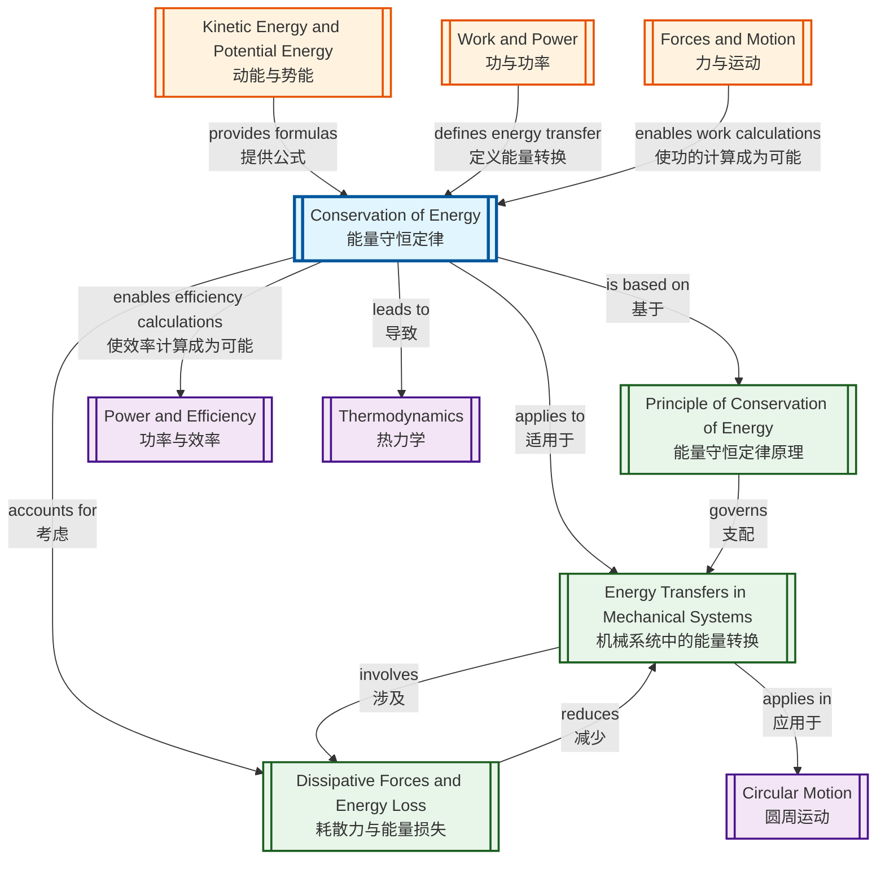

# Conservation of Energy / 能量守恒定律

---

# 1. Overview / 概述

**English:**
The Principle of Conservation of Energy is one of the most fundamental laws in physics, stating that energy cannot be created or destroyed, only transferred from one form to another. This topic explores how energy transforms between [[Kinetic Energy and Potential Energy]] in mechanical systems, accounting for energy losses due to [[Dissipative Forces and Energy Loss]] like friction and air resistance. Understanding this principle is essential for analysing real-world systems from roller coasters to hydroelectric dams, and forms the foundation for [[Power and Efficiency]] calculations. In both Cambridge 9702 and Edexcel IAL examinations, conservation of energy is a core concept tested through calculations, explanations, and practical investigations. Students must be able to apply the principle to closed systems, calculate energy transfers, and account for dissipative effects.

**中文：**
能量守恒定律是物理学中最基本的定律之一，它指出能量既不能被创造也不能被消灭，只能从一种形式转化为另一种形式。本主题探讨能量如何在机械系统中在[[动能与势能]]之间转换，并考虑由于[[耗散力与能量损失]]（如摩擦力和空气阻力）造成的能量损失。理解这一原理对于分析从过山车到水电站等现实世界系统至关重要，并为[[功率与效率]]计算奠定基础。在剑桥9702和爱德思IAL考试中，能量守恒是通过计算题、解释题和实验探究题测试的核心概念。学生必须能够将这一原理应用于封闭系统，计算能量转换，并考虑耗散效应。

---

# 2. Syllabus Learning Objectives / 考纲学习目标

| CAIE 9702 (3.3g) | Edexcel IAL (WPH11 U1: 4.9-4.11) |
|-------------------|----------------------------------|
| State the principle of conservation of energy | Understand the principle of conservation of energy |
| Apply the principle to mechanical systems | Apply conservation of energy to mechanical systems |
| Calculate energy transfers between kinetic and potential forms | Calculate energy transfers involving kinetic, gravitational potential, and elastic potential energy |
| Account for energy losses due to dissipative forces | Account for work done against friction and other resistive forces |
| Solve problems involving energy conservation | Solve problems involving energy conservation in real-world contexts |

**Examiner Expectations / 考官期望：**

**English:**
- Candidates must state the principle precisely: "Energy cannot be created or destroyed, only transferred from one form to another"
- For calculations, always show energy before = energy after, including any losses
- Recognise that in ideal systems (no friction), total mechanical energy is conserved
- In real systems, account for energy dissipated as thermal energy
- Be able to calculate efficiency using energy input/output ratios

**中文：**
- 考生必须精确陈述原理："能量既不能被创造也不能被消灭，只能从一种形式转化为另一种形式"
- 计算时，始终展示能量守恒方程：能量前 = 能量后，包括任何损失
- 认识到在理想系统（无摩擦）中，总机械能守恒
- 在真实系统中，考虑以热能形式耗散的能量
- 能够使用能量输入/输出比计算效率

> 📋 **CIE Only:** CAIE specifically requires stating the principle verbatim in Paper 2 definition questions. Expect 1-2 mark questions asking "State the principle of conservation of energy."

> 📋 **Edexcel Only:** Edexcel emphasises real-world applications and may include contexts like braking systems, pendulum motion, and bungee jumping. Unit 1 often includes multi-step energy calculations.

---

# 3. Core Definitions / 核心定义

| Term (EN/CN) | Definition (EN) | Definition (CN) | Common Mistakes / 常见错误 |
|--------------|-----------------|-----------------|---------------------------|
| **[[Principle of Conservation of Energy]]** / 能量守恒定律 | Energy cannot be created or destroyed, only transferred from one form to another. The total energy of a closed system remains constant. | 能量既不能被创造也不能被消灭，只能从一种形式转化为另一种形式。封闭系统的总能量保持不变。 | ❌ Saying "energy is lost" instead of "energy is transferred to other forms" / 说"能量损失"而不是"能量转化为其他形式" |
| **[[Kinetic Energy and Potential Energy\|Kinetic Energy]]** / 动能 | The energy an object possesses due to its motion, given by $E_k = \frac{1}{2}mv^2$ | 物体由于运动而具有的能量，公式为 $E_k = \frac{1}{2}mv^2$ | ❌ Forgetting to square velocity / 忘记对速度平方 |
| **[[Kinetic Energy and Potential Energy\|Gravitational Potential Energy]]** / 重力势能 | The energy an object possesses due to its position in a gravitational field, given by $E_p = mgh$ | 物体由于在重力场中的位置而具有的能量，公式为 $E_p = mgh$ | ❌ Using wrong reference level for height / 使用错误的高度参考点 |
| **[[Dissipative Forces and Energy Loss\|Dissipative Forces]]** / 耗散力 | Forces that convert mechanical energy into thermal energy, such as friction and air resistance | 将机械能转化为热能的力，如摩擦力和空气阻力 | ❌ Thinking dissipative forces destroy energy / 认为耗散力消灭能量 |
| **[[Power and Efficiency\|Efficiency]]** / 效率 | The ratio of useful energy output to total energy input, often expressed as a percentage | 有用能量输出与总能量输入的比率，通常以百分比表示 | ❌ Using efficiency > 100% in calculations / 计算中使用效率 > 100% |
| **Closed System** / 封闭系统 | A system where no energy enters or leaves; total energy remains constant | 没有能量进入或离开的系统；总能量保持不变 | ❌ Forgetting to include all energy forms in the system / 忘记包括系统中所有能量形式 |

---

# 4. Key Concepts Explained / 关键概念详解

## 4.1 The Principle of Conservation of Energy / 能量守恒定律

### Explanation / 解释
**English:**
The [[Principle of Conservation of Energy]] is the cornerstone of energy analysis. It states that in any closed system, the total amount of energy remains constant over time. Energy may change form—from [[Kinetic Energy and Potential Energy|kinetic to potential]], to thermal, to sound, or to other forms—but the total quantity never changes. This principle applies to all physical processes, from subatomic particle interactions to galactic motions. In mechanical systems, we typically track energy transfers between kinetic energy ($E_k = \frac{1}{2}mv^2$), gravitational potential energy ($E_p = mgh$), elastic potential energy ($E_e = \frac{1}{2}kx^2$), and thermal energy due to [[Dissipative Forces and Energy Loss|dissipative forces]].

**中文：**
能量守恒定律是能量分析的基石。它指出在任何封闭系统中，总能量随时间保持不变。能量可以改变形式——从动能到势能，到热能，到声能，或其他形式——但总量永远不会改变。这一原理适用于所有物理过程，从亚原子粒子相互作用到星系运动。在机械系统中，我们通常追踪动能（$E_k = \frac{1}{2}mv^2$）、重力势能（$E_p = mgh$）、弹性势能（$E_e = \frac{1}{2}kx^2$）以及由于耗散力产生的热能之间的能量转换。

### Physical Meaning / 物理意义
**English:**
In everyday life, when you drop a ball, its gravitational potential energy converts to kinetic energy as it falls. When it hits the ground, some energy transfers to sound and thermal energy. The total energy before dropping equals the total energy after impact—none is lost, just redistributed. This explains why perpetual motion machines are impossible: some energy always dissipates as thermal energy due to friction.

**中文：**
在日常生活中，当你扔下一个球时，它的重力势能在下落过程中转化为动能。当它撞击地面时，一些能量转化为声能和热能。下落前的总能量等于撞击后的总能量——没有能量损失，只是重新分配。这解释了为什么永动机是不可能的：由于摩擦，一些能量总是以热能形式耗散。

### Common Misconceptions / 常见误区
1. ❌ "Energy is used up" — Energy is never used up; it transfers to other forms / "能量被用完了" — 能量永远不会用完；它转化为其他形式
2. ❌ "Friction destroys energy" — Friction converts mechanical energy to thermal energy; total energy remains constant / "摩擦消灭能量" — 摩擦将机械能转化为热能；总能量保持不变
3. ❌ "Conservation of energy means kinetic + potential is always constant" — This is only true in ideal systems without dissipative forces / "能量守恒意味着动能+势能总是恒定的" — 这仅在无耗散力的理想系统中成立

### Exam Tips / 考试提示
**English:**
- Always write the energy conservation equation: $E_{initial} = E_{final} + E_{dissipated}$
- State the principle word-for-word when asked to "state" it
- For "explain" questions, describe the energy transfers step by step
- Include thermal energy as a destination for "lost" mechanical energy

**中文：**
- 始终写出能量守恒方程：$E_{初始} = E_{最终} + E_{耗散}$
- 当被要求"陈述"原理时，逐字逐句写出
- 对于"解释"问题，逐步描述能量转换
- 将热能包括为"损失"机械能的去向

---

## 4.2 Energy Transfers in Mechanical Systems / 机械系统中的能量转换

### Explanation / 解释
**English:**
In mechanical systems, energy transfers typically occur between [[Kinetic Energy and Potential Energy|kinetic and potential energy forms]]. Common scenarios include:
- **Falling objects:** Gravitational potential energy → kinetic energy
- **Pendulums:** Continuous conversion between kinetic and gravitational potential energy
- **Roller coasters:** Gravitational potential energy at the top → kinetic energy at the bottom
- **Spring-mass systems:** Elastic potential energy ↔ kinetic energy
- **Projectile motion:** Kinetic energy at launch → gravitational potential energy at maximum height → kinetic energy on return

The total mechanical energy ($E_{mech} = E_k + E_p$) is conserved only in the absence of [[Dissipative Forces and Energy Loss|dissipative forces]].

**中文：**
在机械系统中，能量转换通常发生在动能和势能形式之间。常见场景包括：
- **下落物体：** 重力势能 → 动能
- **摆：** 动能和重力势能之间的连续转换
- **过山车：** 顶部的重力势能 → 底部的动能
- **弹簧-质量系统：** 弹性势能 ↔ 动能
- **抛体运动：** 发射时的动能 → 最大高度时的重力势能 → 返回时的动能

只有在没有耗散力的情况下，总机械能（$E_{mech} = E_k + E_p$）才守恒。

### Physical Meaning / 物理意义
**English:**
Consider a pendulum: at the highest point, the bob has maximum gravitational potential energy and zero kinetic energy. As it swings down, potential energy converts to kinetic energy. At the lowest point, kinetic energy is maximum and potential energy is minimum. In a vacuum (no air resistance), the pendulum would swing forever—mechanical energy is conserved. In reality, air resistance gradually converts mechanical energy to thermal energy, causing the pendulum to slow down.

**中文：**
考虑一个摆：在最高点，摆锤具有最大的重力势能和零动能。当它向下摆动时，势能转化为动能。在最低点，动能最大，势能最小。在真空中（无空气阻力），摆会永远摆动——机械能守恒。在现实中，空气阻力逐渐将机械能转化为热能，导致摆减速。

### Common Misconceptions / 常见误区
1. ❌ "At the highest point, kinetic energy is always zero" — Only true at the turning points of oscillation / "在最高点，动能总是零" — 仅在振荡的转折点成立
2. ❌ "Potential energy is always positive" — Potential energy depends on the reference level chosen / "势能总是正的" — 势能取决于选择的参考水平
3. ❌ "Energy conversion is 100% efficient" — In real systems, some energy always dissipates / "能量转换是100%高效的" — 在真实系统中，总有一些能量耗散

### Exam Tips / 考试提示
**English:**
- Draw energy bar charts to show energy distribution at different positions
- For pendulum problems, identify the lowest point as the reference for zero potential energy
- In roller coaster problems, account for energy losses due to friction between wheels and track
- Use $mgh = \frac{1}{2}mv^2$ for ideal free-fall from rest

**中文：**
- 绘制能量柱状图显示不同位置的能量分布
- 对于摆问题，将最低点确定为零势能参考点
- 在过山车问题中，考虑由于轮子与轨道之间的摩擦造成的能量损失
- 对于从静止开始的理想自由落体，使用 $mgh = \frac{1}{2}mv^2$

---

## 4.3 Dissipative Forces and Energy Loss / 耗散力与能量损失

### Explanation / 解释
**English:**
[[Dissipative Forces and Energy Loss|Dissipative forces]] are forces that convert mechanical energy into non-mechanical forms, primarily thermal energy. Common dissipative forces include:
- **Friction:** Between surfaces in contact (e.g., brakes on a car)
- **Air resistance (drag):** Objects moving through air
- **Viscous drag:** Objects moving through fluids
- **Internal friction:** Within deformable materials (e.g., a bouncing ball that doesn't return to its original height)

When dissipative forces act, the total mechanical energy ($E_k + E_p$) decreases, but the total energy (including thermal energy) remains constant. The work done against dissipative forces equals the amount of mechanical energy converted to thermal energy.

**中文：**
耗散力是将机械能转化为非机械形式（主要是热能）的力。常见的耗散力包括：
- **摩擦力：** 接触表面之间（例如，汽车刹车）
- **空气阻力：** 物体在空气中运动
- **粘性阻力：** 物体在流体中运动
- **内摩擦：** 可变形材料内部（例如，弹跳后不能回到原始高度的球）

当耗散力作用时，总机械能（$E_k + E_p$）减少，但总能量（包括热能）保持不变。克服耗散力所做的功等于转化为热能的机械能量。

### Physical Meaning / 物理意义
**English:**
When you push a book across a table and stop pushing, the book eventually stops due to friction. The kinetic energy of the book doesn't disappear—it converts to thermal energy, warming both the book and the table surface slightly. Similarly, when a car brakes, the kinetic energy of the car converts to thermal energy in the brake discs and pads. This is why brakes get hot during use.

**中文：**
当你推一本书在桌子上然后停止推动时，书最终因摩擦力而停止。书的动能并没有消失——它转化为热能，使书和桌面都略微升温。类似地，当汽车刹车时，汽车的动能转化为刹车盘和刹车片中的热能。这就是为什么刹车在使用过程中会变热。

### Common Misconceptions / 常见误区
1. ❌ "Friction always reduces total energy" — Friction converts energy forms but total energy is conserved / "摩擦总是减少总能量" — 摩擦转换能量形式，但总能量守恒
2. ❌ "Work done against friction is wasted" — It's transferred to thermal energy, which may be useful (e.g., brakes) or wasted / "克服摩擦所做的功被浪费了" — 它转化为热能，可能有用（如刹车）或浪费
3. ❌ "In a closed system, mechanical energy is always conserved" — Only if no dissipative forces act / "在封闭系统中，机械能总是守恒的" — 仅当没有耗散力作用时

### Exam Tips / 考试提示
**English:**
- When a problem mentions "rough surface" or "air resistance," include energy loss terms
- The work done against friction = force of friction × distance moved
- For bouncing balls, the loss in gravitational potential energy after each bounce equals the energy dissipated
- Efficiency calculations: $\text{Efficiency} = \frac{\text{Useful energy output}}{\text{Total energy input}} \times 100\%$

**中文：**
- 当问题提到"粗糙表面"或"空气阻力"时，包括能量损失项
- 克服摩擦所做的功 = 摩擦力 × 移动距离
- 对于弹跳球，每次弹跳后重力势能的损失等于耗散的能量
- 效率计算：$\text{效率} = \frac{\text{有用能量输出}}{\text{总能量输入}} \times 100\%$

> 📷 **IMAGE PROMPT — [CONSERVATION-01]: Energy Transfer Diagram for a Falling Ball**
>
> A clear, educational diagram showing a ball at three positions during free fall: (1) at height h with maximum gravitational potential energy (GPE) and zero kinetic energy (KE), (2) at mid-height with equal GPE and KE, (3) just before ground impact with zero GPE and maximum KE. Include labeled arrows showing energy conversion direction. Use a clean, minimalist style with blue and orange color coding for GPE and KE respectively. Include energy bar charts beside each position. Suitable for A-Level physics textbook.

---

# 5. Essential Equations / 核心公式

## 5.1 Conservation of Energy (General Form) / 能量守恒（一般形式）

**Equation / 公式:**
$$E_{total\ initial} = E_{total\ final}$$

$$E_{k1} + E_{p1} + E_{e1} + Q_1 = E_{k2} + E_{p2} + E_{e2} + Q_2$$

**Variables / 变量:**
| Symbol (符号) | Meaning (EN) | Meaning (CN) | Unit (单位) |
|--------------|-------------|-------------|------------|
| $E_k$ | Kinetic energy | 动能 | J (joules) |
| $E_p$ | Gravitational potential energy | 重力势能 | J |
| $E_e$ | Elastic potential energy | 弹性势能 | J |
| $Q$ | Thermal energy (heat) | 热能 | J |

**Derivation / 推导:**
**English:**
The principle is a fundamental law of physics derived from experimental observation. It cannot be mathematically proven from first principles but is supported by all experimental evidence. In mechanics, it follows from the work-energy theorem: the net work done on a system equals its change in kinetic energy. When conservative forces (gravity, springs) do work, potential energy changes correspondingly. Non-conservative forces (friction) convert mechanical energy to thermal energy.

**中文：**
该原理是从实验观察中得出的基本物理定律。它不能从基本原理中数学证明，但得到所有实验证据的支持。在力学中，它遵循功能定理：对系统所做的净功等于其动能的变化。当保守力（重力、弹簧）做功时，势能相应变化。非保守力（摩擦力）将机械能转化为热能。

**Conditions / 适用条件:**
**English:**
- Applies to all closed systems (no energy enters or leaves)
- The system must be clearly defined
- All forms of energy must be accounted for

**中文：**
- 适用于所有封闭系统（没有能量进入或离开）
- 必须明确定义系统
- 必须考虑所有形式的能量

**Limitations / 局限性:**
**English:**
- Does not apply to open systems where energy crosses the boundary
- At nuclear/quantum scales, mass-energy equivalence ($E=mc^2$) must be considered
- Cannot predict the direction of energy transfer (this requires the second law of thermodynamics)

**中文：**
- 不适用于能量跨越边界的开放系统
- 在核/量子尺度上，必须考虑质能等价（$E=mc^2$）
- 不能预测能量转换的方向（这需要热力学第二定律）

**Rearrangements / 变形:**
**English:**
For mechanical systems with no dissipative forces:
$$mgh_1 + \frac{1}{2}mv_1^2 = mgh_2 + \frac{1}{2}mv_2^2$$

For systems with dissipative forces:
$$mgh_1 + \frac{1}{2}mv_1^2 = mgh_2 + \frac{1}{2}mv_2^2 + W_{friction}$$

**中文：**
对于无耗散力的机械系统：
$$mgh_1 + \frac{1}{2}mv_1^2 = mgh_2 + \frac{1}{2}mv_2^2$$

对于有耗散力的系统：
$$mgh_1 + \frac{1}{2}mv_1^2 = mgh_2 + \frac{1}{2}mv_2^2 + W_{摩擦}$$

---

## 5.2 Kinetic Energy / 动能

**Equation / 公式:**
$$E_k = \frac{1}{2}mv^2$$

**Variables / 变量:**
| Symbol (符号) | Meaning (EN) | Meaning (CN) | Unit (单位) |
|--------------|-------------|-------------|------------|
| $E_k$ | Kinetic energy | 动能 | J |
| $m$ | Mass | 质量 | kg |
| $v$ | Speed | 速度 | m s⁻¹ |

**Derivation / 推导:**
**English:**
From the work-energy theorem: $W = Fs = mas$
Using $v^2 = u^2 + 2as$ with $u=0$: $as = \frac{v^2}{2}$
Therefore: $W = m \times \frac{v^2}{2} = \frac{1}{2}mv^2$

**中文：**
从功能定理：$W = Fs = mas$
使用 $v^2 = u^2 + 2as$ 且 $u=0$：$as = \frac{v^2}{2}$
因此：$W = m \times \frac{v^2}{2} = \frac{1}{2}mv^2$

**Conditions / 适用条件:**
**English:**
- Valid for all moving objects with mass
- Speed must be measured relative to the observer's frame of reference
- For rotational motion, additional rotational kinetic energy must be considered

**中文：**
- 适用于所有有质量的运动物体
- 速度必须相对于观察者的参考系测量
- 对于旋转运动，必须考虑额外的旋转动能

**Limitations / 局限性:**
**English:**
- Does not apply to massless particles (photons)
- At relativistic speeds ($v > 0.1c$), relativistic kinetic energy formula is needed
- Does not account for internal energy (e.g., thermal energy within the object)

**中文：**
- 不适用于无质量粒子（光子）
- 在相对论速度（$v > 0.1c$）下，需要相对论动能公式
- 不考虑内能（例如，物体内部的热能）

**Rearrangements / 变形:**
$$v = \sqrt{\frac{2E_k}{m}}$$
$$m = \frac{2E_k}{v^2}$$

---

## 5.3 Gravitational Potential Energy / 重力势能

**Equation / 公式:**
$$E_p = mgh$$

**Variables / 变量:**
| Symbol (符号) | Meaning (EN) | Meaning (CN) | Unit (单位) |
|--------------|-------------|-------------|------------|
| $E_p$ | Gravitational potential energy | 重力势能 | J |
| $m$ | Mass | 质量 | kg |
| $g$ | Acceleration due to gravity | 重力加速度 | m s⁻² |
| $h$ | Height above reference level | 相对于参考水平的高度 | m |

**Derivation / 推导:**
**English:**
Work done to lift an object at constant speed against gravity:
$W = Fs = mg \times h = mgh$
This work becomes stored as gravitational potential energy.

**中文：**
以恒定速度克服重力提升物体所做的功：
$W = Fs = mg \times h = mgh$
这个功储存为重力势能。

**Conditions / 适用条件:**
**English:**
- Valid only near Earth's surface where $g$ is approximately constant
- Height must be measured from a chosen reference level (usually the lowest point)
- The gravitational field must be uniform

**中文：**
- 仅在地球表面附近有效，其中 $g$ 近似恒定
- 高度必须从选定的参考水平测量（通常是最低点）
- 重力场必须是均匀的

**Limitations / 局限性:**
**English:**
- Does not apply for large height changes where $g$ varies significantly
- For orbital mechanics, use $E_p = -\frac{GMm}{r}$ instead
- The reference level is arbitrary; only changes in potential energy are physically meaningful

**中文：**
- 不适用于 $g$ 显著变化的大高度变化
- 对于轨道力学，使用 $E_p = -\frac{GMm}{r}$
- 参考水平是任意的；只有势能的变化具有物理意义

**Rearrangements / 变形:**
$$h = \frac{E_p}{mg}$$
$$m = \frac{E_p}{gh}$$

---

## 5.4 Work Done Against Friction / 克服摩擦所做的功

**Equation / 公式:**
$$W = F_f \times d$$

**Variables / 变量:**
| Symbol (符号) | Meaning (EN) | Meaning (CN) | Unit (单位) |
|--------------|-------------|-------------|------------|
| $W$ | Work done against friction | 克服摩擦所做的功 | J |
| $F_f$ | Force of friction | 摩擦力 | N |
| $d$ | Distance moved | 移动距离 | m |

**Derivation / 推导:**
**English:**
Work is defined as force × distance moved in the direction of the force. Since friction opposes motion, the work done against friction is the product of the frictional force and the distance over which it acts.

**中文：**
功定义为力 × 在力的方向上移动的距离。由于摩擦力阻碍运动，克服摩擦所做的功是摩擦力与其作用距离的乘积。

**Conditions / 适用条件:**
**English:**
- Friction force must be constant (or average value used)
- Distance is the actual path length, not displacement
- Valid for sliding friction, not rolling friction (which is more complex)

**中文：**
- 摩擦力必须是恒定的（或使用平均值）
- 距离是实际路径长度，不是位移
- 适用于滑动摩擦，不适用于滚动摩擦（更复杂）

**Limitations / 局限性:**
**English:**
- Does not account for energy dissipated as sound or deformation
- For varying friction forces, integration is required
- Does not include work done against air resistance (requires different formula)

**中文：**
- 不考虑以声能或变形形式耗散的能量
- 对于变化的摩擦力，需要积分
- 不包括克服空气阻力所做的功（需要不同的公式）

---

## 5.5 Efficiency / 效率

**Equation / 公式:**
$$\text{Efficiency} = \frac{\text{Useful energy output}}{\text{Total energy input}} \times 100\%$$

**Variables / 变量:**
| Symbol (符号) | Meaning (EN) | Meaning (CN) | Unit (单位) |
|--------------|-------------|-------------|------------|
| Efficiency | Ratio of useful output to total input | 有用输出与总输入的比率 | % (percentage) |
| $E_{useful}$ | Useful energy output | 有用能量输出 | J |
| $E_{input}$ | Total energy input | 总能量输入 | J |

**Derivation / 推导:**
**English:**
By conservation of energy: $E_{input} = E_{useful} + E_{wasted}$
Efficiency measures what fraction of input energy serves a useful purpose.

**中文：**
根据能量守恒：$E_{输入} = E_{有用} + E_{浪费}$
效率衡量输入能量中有用部分的比例。

**Conditions / 适用条件:**
**English:**
- Must clearly define what constitutes "useful" energy
- Efficiency is always ≤ 100% (cannot exceed 1)
- Can be expressed as a decimal or percentage

**中文：**
- 必须明确定义什么构成"有用"能量
- 效率总是 ≤ 100%（不能超过1）
- 可以表示为小数或百分比

**Limitations / 局限性:**
**English:**
- Does not indicate the quality of energy (e.g., high vs low temperature thermal energy)
- Different definitions of "useful" can give different efficiency values
- Instantaneous efficiency may differ from average efficiency

**中文：**
- 不指示能量的质量（例如，高温与低温热能）
- "有用"的不同定义可能给出不同的效率值
- 瞬时效率可能与平均效率不同

---

# 6. Graphs and Relationships / 图表与关系

## 6.1 Energy vs Height for a Falling Object / 下落物体的能量与高度关系

### Axes / 坐标轴
**English:** x-axis: Height (h) / y-axis: Energy (E)
**中文：** x轴：高度 (h) / y轴：能量 (E)

### Shape / 形状
**English:** 
- Gravitational potential energy ($E_p$): Straight line decreasing from maximum at top to zero at bottom
- Kinetic energy ($E_k$): Straight line increasing from zero at top to maximum at bottom
- Total mechanical energy ($E_{total}$): Horizontal straight line (constant) for ideal systems

**中文：**
- 重力势能（$E_p$）：从顶部的最大值到底部的零的直线下降
- 动能（$E_k$）：从顶部的零到底部的最大值的直线上升
- 总机械能（$E_{total}$）：水平直线（恒定），适用于理想系统

### Gradient Meaning / 斜率含义
**English:**
- Gradient of $E_p$ vs h: $mg$ (weight of the object)
- Gradient of $E_k$ vs h: $-mg$ (negative of weight)
- Gradient of $E_{total}$ vs h: 0 (constant)

**中文：**
- $E_p$ 对 h 的斜率：$mg$（物体的重量）
- $E_k$ 对 h 的斜率：$-mg$（重量的负值）
- $E_{total}$ 对 h 的斜率：0（恒定）

### Area Meaning / 面积含义
**English:** Not applicable for this graph type.
**中文：** 不适用于此图类型。

### Exam Interpretation / 考试解读
**English:**
- The sum of $E_p$ and $E_k$ at any height equals the total mechanical energy
- For real systems with friction, the $E_{total}$ line would slope downward
- The intersection point of $E_p$ and $E_k$ lines occurs when $E_p = E_k = \frac{1}{2}E_{total}$

**中文：**
- 在任何高度，$E_p$ 和 $E_k$ 之和等于总机械能
- 对于有摩擦的真实系统，$E_{total}$ 线会向下倾斜
- $E_p$ 和 $E_k$ 线的交点出现在 $E_p = E_k = \frac{1}{2}E_{total}$ 时

### Common Questions / 常见问题
**English:**
- "At what height are kinetic and potential energies equal?"
- "Calculate the speed at a given height using the graph"
- "How does the graph change if air resistance is present?"

**中文：**
- "在什么高度动能和势能相等？"
- "使用图表计算给定高度的速度"
- "如果存在空气阻力，图表如何变化？"

---

## 6.2 Energy vs Time for a Pendulum / 摆的能量与时间关系

### Axes / 坐标轴
**English:** x-axis: Time (t) / y-axis: Energy (E)
**中文：** x轴：时间 (t) / y轴：能量 (E)

### Shape / 形状
**English:**
- Kinetic energy ($E_k$): Sinusoidal wave, maximum at equilibrium position, zero at extremes
- Gravitational potential energy ($E_p$): Sinusoidal wave (180° out of phase with $E_k$), maximum at extremes, zero at equilibrium
- Total mechanical energy ($E_{total}$): Horizontal line (constant) for ideal pendulum

**中文：**
- 动能（$E_k$）：正弦波，在平衡位置最大，在极端位置为零
- 重力势能（$E_p$）：正弦波（与 $E_k$ 相位差180°），在极端位置最大，在平衡位置为零
- 总机械能（$E_{total}$）：水平线（恒定），适用于理想摆

### Gradient Meaning / 斜率含义
**English:**
- Gradient of $E_k$: Rate of change of kinetic energy = power
- Gradient of $E_p$: Rate of change of potential energy = negative of power
- Zero gradient of $E_{total}$ confirms conservation

**中文：**
- $E_k$ 的斜率：动能的变化率 = 功率
- $E_p$ 的斜率：势能的变化率 = 功率的负值
- $E_{total}$ 的零斜率确认守恒

### Area Meaning / 面积含义
**English:** Not applicable for this graph type.
**中文：** 不适用于此图类型。

### Exam Interpretation / 考试解读
**English:**
- The phase relationship between $E_k$ and $E_p$ shows energy conversion
- Amplitude decay indicates energy dissipation due to air resistance
- Period of energy oscillation is half the period of the pendulum

**中文：**
- $E_k$ 和 $E_p$ 之间的相位关系显示能量转换
- 振幅衰减表示由于空气阻力造成的能量耗散
- 能量振荡的周期是摆周期的一半

### Common Questions / 常见问题
**English:**
- "Sketch the energy-time graph for a damped pendulum"
- "Explain why the amplitudes decrease over time"
- "Calculate the maximum speed from the energy graph"

**中文：**
- "画出阻尼摆的能量-时间图"
- "解释为什么振幅随时间减小"
- "从能量图计算最大速度"

---

## 6.3 Efficiency vs Load Graph / 效率与负载关系图

### Axes / 坐标轴
**English:** x-axis: Load (output power or force) / y-axis: Efficiency (%)
**中文：** x轴：负载（输出功率或力）/ y轴：效率（%）

### Shape / 形状
**English:**
- Generally increases from zero at no load to a maximum at some optimal load
- Then decreases gradually at higher loads
- Shape varies depending on the system (motor, generator, transformer)

**中文：**
- 通常从空载时的零增加到某个最佳负载时的最大值
- 然后在更高负载时逐渐下降
- 形状取决于系统（电机、发电机、变压器）

### Gradient Meaning / 斜率含义
**English:**
- Positive gradient: Efficiency improving with load
- Zero gradient: Maximum efficiency point
- Negative gradient: Efficiency decreasing due to increased losses

**中文：**
- 正斜率：效率随负载提高
- 零斜率：最大效率点
- 负斜率：由于损失增加，效率下降

### Area Meaning / 面积含义
**English:** Not typically used for this graph.
**中文：** 通常不用于此图。

### Exam Interpretation / 考试解读
**English:**
- Identify the load at which maximum efficiency occurs
- Explain why efficiency is low at very low and very high loads
- Relate to fixed losses (constant) and variable losses (proportional to load²)

**中文：**
- 确定最大效率发生的负载
- 解释为什么在非常低和非常高的负载下效率低
- 与固定损失（恒定）和可变损失（与负载²成正比）相关

### Common Questions / 常见问题
**English:**
- "Explain the shape of the efficiency-load graph"
- "Why is efficiency zero at no load?"
- "Determine the operating load for maximum efficiency"

**中文：**
- "解释效率-负载图的形状"
- "为什么空载时效率为零？"
- "确定最大效率的工作负载"

> 📷 **IMAGE PROMPT — [CONSERVATION-02]: Energy vs Height Graph for Falling Object**
>
> A clean, educational line graph with three lines: blue line for gravitational potential energy (decreasing linearly), red line for kinetic energy (increasing linearly), and green dashed line for total mechanical energy (horizontal constant). x-axis labeled "Height (m)" from 0 to h_max, y-axis labeled "Energy (J)" from 0 to E_max. Include a small diagram of a falling ball at three positions. Use a white background with clear gridlines. Suitable for A-Level physics textbook.

---

# 7. Required Diagrams / 必备图表

## 7.1 Energy Transfer Diagram for a Falling Object / 下落物体的能量转换图

### Description / 描述
**English:**
A diagram showing a ball at three positions during free fall: at the top (height h), at mid-height (h/2), and just before hitting the ground. Each position shows the distribution of gravitational potential energy (GPE) and kinetic energy (KE) using bar charts or pie charts. Arrows indicate the direction of energy conversion. The total energy remains constant throughout.

**中文：**
一个显示球在自由落体过程中三个位置的图表：顶部（高度h）、中间高度（h/2）和即将撞击地面之前。每个位置使用柱状图或饼图显示重力势能（GPE）和动能（KE）的分布。箭头指示能量转换的方向。总能量始终保持不变。

### Image Prompt / 图片生成提示
> 📷 **IMAGE PROMPT — [CONSERVATION-03]: Energy Distribution Diagram for Falling Ball**
>
> A detailed educational diagram showing a ball at three vertical positions during free fall. Position 1 (top): ball at height h with a blue bar chart showing 100% GPE, 0% KE. Position 2 (middle): ball at height h/2 with equal blue and red bars (50% GPE, 50% KE). Position 3 (bottom): ball just above ground with red bar showing 100% KE, 0% GPE. Include curved arrows between positions showing GPE→KE conversion. Use clean, modern flat design with blue (GPE) and red (KE) color coding. White background, clear labels in English. Suitable for A-Level physics textbook.

### Labels Required / 需要标注
| English | 中文 |
|---------|------|
| Gravitational Potential Energy (GPE) | 重力势能 (GPE) |
| Kinetic Energy (KE) | 动能 (KE) |
| Height, h | 高度, h |
| Ground level | 地面水平 |
| Energy conversion direction | 能量转换方向 |
| Total energy = constant | 总能量 = 恒定 |

### Exam Importance / 考试重要性
**English:**
This diagram is frequently used in exam questions to test understanding of energy conservation. Students may be asked to sketch the energy distribution at different positions, calculate the speed at a given height, or explain how the diagram changes with air resistance.

**中文：**
该图表常用于考试问题中测试对能量守恒的理解。学生可能被要求画出不同位置的能量分布，计算给定高度的速度，或解释图表如何随空气阻力变化。

---

## 7.2 Pendulum Energy Diagram / 摆的能量图

### Description / 描述
**English:**
A diagram of a pendulum showing the bob at three positions: maximum displacement (left extreme), equilibrium position (lowest point), and maximum displacement (right extreme). Energy bar charts accompany each position showing the distribution of kinetic and gravitational potential energy. The diagram also shows the reference level for zero potential energy at the lowest point.

**中文：**
一个摆的图表，显示摆锤在三个位置：最大位移（左极端）、平衡位置（最低点）和最大位移（右极端）。每个位置附有能量柱状图，显示动能和重力势能的分布。图表还显示最低点为零势能的参考水平。

### Image Prompt / 图片生成提示
> 📷 **IMAGE PROMPT — [CONSERVATION-04]: Pendulum Energy Diagram**
>
> A detailed educational diagram of a pendulum showing the bob at three positions. Left extreme: bob at maximum height with blue bar showing 100% GPE, 0% KE. Center (equilibrium): bob at lowest point with red bar showing 100% KE, 0% GPE. Right extreme: bob at maximum height with blue bar showing 100% GPE, 0% KE. Include the pendulum string, pivot point, and arc path. Show the reference level (dashed line) at the lowest point. Use blue (GPE) and red (KE) color coding. Clean, modern flat design with white background. Suitable for A-Level physics textbook.

### Labels Required / 需要标注
| English | 中文 |
|---------|------|
| Pivot point | 支点 |
| String | 绳子 |
| Bob | 摆锤 |
| Maximum displacement | 最大位移 |
| Equilibrium position | 平衡位置 |
| Reference level (h=0) | 参考水平 (h=0) |
| Amplitude | 振幅 |
| Gravitational Potential Energy (GPE) | 重力势能 (GPE) |
| Kinetic Energy (KE) | 动能 (KE) |

### Exam Importance / 考试重要性
**English:**
Pendulum energy diagrams are classic exam questions. Students must understand the continuous conversion between kinetic and potential energy, identify positions of maximum/minimum energy, and explain the effect of damping (air resistance) on the amplitude over time.

**中文：**
摆的能量图是经典的考试问题。学生必须理解动能和势能之间的连续转换，识别最大/最小能量的位置，并解释阻尼（空气阻力）对振幅随时间的影响。

---

## 7.3 Sankey Diagram for Energy Efficiency / 能量效率桑基图

### Description / 描述
**English:**
A Sankey diagram showing the flow of energy through a system (e.g., a car engine or light bulb). The width of each arrow is proportional to the amount of energy. The diagram shows the input energy splitting into useful output energy and wasted energy (usually thermal energy). The efficiency can be calculated from the relative widths.

**中文：**
一个桑基图，显示能量通过系统（例如，汽车发动机或灯泡）的流动。每个箭头的宽度与能量量成正比。图表显示输入能量分为有用输出能量和浪费的能量（通常是热能）。效率可以从相对宽度计算。

### Image Prompt / 图片生成提示
> 📷 **IMAGE PROMPT — [CONSERVATION-05]: Sankey Diagram for Car Engine Efficiency**
>
> A Sankey diagram showing energy flow in a car engine. Left side: thick arrow labeled "Chemical Energy (100%)" entering the system. Right side: three arrows emerging - a medium arrow labeled "Useful Kinetic Energy (25%)" in green, a thick arrow labeled "Thermal Energy Loss (70%)" in red, and a thin arrow labeled "Sound Energy (5%)" in yellow. Arrow widths proportional to energy percentages. Include a simple car icon on the left and a gear icon on the right. Clean, modern infographic style with white background. Suitable for A-Level physics textbook.

### Labels Required / 需要标注
| English | 中文 |
|---------|------|
| Input energy (100%) | 输入能量 (100%) |
| Useful energy output | 有用能量输出 |
| Wasted thermal energy | 浪费的热能 |
| Wasted sound energy | 浪费的声能 |
| Efficiency = 25% | 效率 = 25% |
| System boundary | 系统边界 |

### Exam Importance / 考试重要性
**English:**
Sankey diagrams are used in both CIE and Edexcel exams to test understanding of efficiency and energy conservation. Students may be asked to draw Sankey diagrams from given data, calculate efficiency from arrow widths, or explain how to improve efficiency.

**中文：**
桑基图在CIE和爱德思考试中都用于测试对效率和能量守恒的理解。学生可能被要求根据给定数据绘制桑基图，从箭头宽度计算效率，或解释如何提高效率。

---

# 8. Worked Examples / 典型例题

## Example 1: Falling Object with Energy Conservation / 例1：能量守恒的下落物体

### Question / 题目
**English:**
A ball of mass 0.50 kg is dropped from rest at a height of 20 m above the ground. Calculate:
(a) The gravitational potential energy of the ball at the top
(b) The speed of the ball just before it hits the ground (assuming no air resistance)
(c) The speed of the ball when it is 5.0 m above the ground
Take $g = 9.81 \text{ m s}^{-2}$

**中文：**
一个质量为0.50 kg的球从离地面20 m的高度从静止释放。计算：
(a) 球在顶部的重力势能
(b) 球即将撞击地面时的速度（假设无空气阻力）
(c) 球离地面5.0 m时的速度
取 $g = 9.81 \text{ m s}^{-2}$

### Image Prompt / 图片提示
> 📷 **IMAGE PROMPT — [CONSERVATION-06]: Falling Ball Problem Diagram**
>
> A simple diagram showing a ball at height 20 m above ground, with labels: mass = 0.50 kg, initial velocity = 0 m/s. Include a downward arrow showing the direction of motion. Show the ground level with a dashed line. Clean, minimal style suitable for a physics problem.

### Solution / 解答

**Step 1: Calculate gravitational potential energy at the top**
$$E_p = mgh = 0.50 \times 9.81 \times 20$$
$$E_p = 98.1 \text{ J}$$

**Step 2: Apply conservation of energy for part (b)**
At the top: $E_{total} = E_p = 98.1 \text{ J}$, $E_k = 0$
Just before ground: $E_p = 0$, $E_k = \frac{1}{2}mv^2$

By conservation of energy:
$$E_{total\ top} = E_{total\ ground}$$
$$98.1 = \frac{1}{2} \times 0.50 \times v^2$$
$$v^2 = \frac{2 \times 98.1}{0.50} = 392.4$$
$$v = \sqrt{392.4} = 19.8 \text{ m s}^{-1}$$

**Step 3: Apply conservation of energy for part (c)**
At height 5.0 m: $E_p = mgh = 0.50 \times 9.81 \times 5.0 = 24.5 \text{ J}$
By conservation:
$$E_{total} = E_p + E_k$$
$$98.1 = 24.5 + \frac{1}{2} \times 0.50 \times v^2$$
$$\frac{1}{2} \times 0.50 \times v^2 = 98.1 - 24.5 = 73.6$$
$$v^2 = \frac{2 \times 73.6}{0.50} = 294.4$$
$$v = \sqrt{294.4} = 17.2 \text{ m s}^{-1}$$

### Final Answer / 最终答案
**Answer:** (a) 98.1 J | (b) 19.8 m s⁻¹ | (c) 17.2 m s⁻¹
**答案：** (a) 98.1 J | (b) 19.8 m s⁻¹ | (c) 17.2 m s⁻¹

### Examiner Notes / 考官点评
**English:**
- Always show the conservation equation explicitly: $mgh = \frac{1}{2}mv^2$
- Note that mass cancels out in free-fall problems — all objects fall at the same rate regardless of mass
- Common mistake: forgetting to square root when finding velocity
- For part (c), students often incorrectly use $v^2 = u^2 + 2as$ instead of energy conservation — both methods work, but energy conservation is more versatile

**中文：**
- 始终明确写出守恒方程：$mgh = \frac{1}{2}mv^2$
- 注意在自由落体问题中质量会消去——所有物体无论质量如何都以相同速率下落
- 常见错误：求速度时忘记开平方根
- 对于部分(c)，学生经常错误地使用 $v^2 = u^2 + 2as$ 而不是能量守恒——两种方法都有效，但能量守恒更通用

### Alternative Method / 替代方法
**English:**
Using equations of motion:
$v^2 = u^2 + 2as = 0 + 2 \times 9.81 \times 20 = 392.4$
$v = 19.8 \text{ m s}^{-1}$

**中文：**
使用运动方程：
$v^2 = u^2 + 2as = 0 + 2 \times 9.81 \times 20 = 392.4$
$v = 19.8 \text{ m s}^{-1}$

---

## Example 2: Energy Conservation with Friction / 例2：有摩擦的能量守恒

### Question / 题目
**English:**
A block of mass 2.0 kg slides down a rough inclined plane of length 5.0 m and height 3.0 m. The block starts from rest at the top. The frictional force acting on the block is constant at 4.0 N. Calculate:
(a) The gravitational potential energy lost by the block
(b) The work done against friction
(c) The speed of the block at the bottom of the incline
Take $g = 9.81 \text{ m s}^{-2}$

**中文：**
一个质量为2.0 kg的物块从粗糙斜面上滑下，斜面长5.0 m，高3.0 m。物块从顶部静止开始。作用在物块上的摩擦力恒定为4.0 N。计算：
(a) 物块损失的重力势能
(b) 克服摩擦所做的功
(c) 物块在斜面底部的速度
取 $g = 9.81 \text{ m s}^{-2}$

### Solution / 解答

**Step 1: Calculate gravitational potential energy lost**
$$E_p\ lost = mgh = 2.0 \times 9.81 \times 3.0 = 58.9 \text{ J}$$

**Step 2: Calculate work done against friction**
$$W_{friction} = F_f \times d = 4.0 \times 5.0 = 20.0 \text{ J}$$

**Step 3: Apply conservation of energy**
Initial energy (at top): $E_p = 58.9 \text{ J}$, $E_k = 0$
Final energy (at bottom): $E_p = 0$, $E_k = \frac{1}{2}mv^2$
Energy dissipated: $W_{friction} = 20.0 \text{ J}$

By conservation:
$$E_{initial} = E_{final} + E_{dissipated}$$
$$58.9 = \frac{1}{2} \times 2.0 \times v^2 + 20.0$$
$$\frac{1}{2} \times 2.0 \times v^2 = 58.9 - 20.0 = 38.9$$
$$v^2 = \frac{2 \times 38.9}{2.0} = 38.9$$
$$v = \sqrt{38.9} = 6.24 \text{ m s}^{-1}$$

### Final Answer / 最终答案
**Answer:** (a) 58.9 J | (b) 20.0 J | (c) 6.24 m s⁻¹
**答案：** (a) 58.9 J | (b) 20.0 J | (c) 6.24 m s⁻¹

### Examiner Notes / 考官点评
**English:**
- The key equation is: $mgh = \frac{1}{2}mv^2 + F_f \times d$
- Common mistake: forgetting to include the work done against friction
- The length of the incline (5.0 m) is needed for friction work, not the height (3.0 m)
- Without friction, the speed would be $v = \sqrt{2gh} = \sqrt{2 \times 9.81 \times 3.0} = 7.67 \text{ m s}^{-1}$ — friction reduces the speed

**中文：**
- 关键方程是：$mgh = \frac{1}{2}mv^2 + F_f \times d$
- 常见错误：忘记包括克服摩擦所做的功
- 斜面的长度（5.0 m）用于摩擦功，而不是高度（3.0 m）
- 没有摩擦时，速度将是 $v = \sqrt{2gh} = \sqrt{2 \times 9.81 \times 3.0} = 7.67 \text{ m s}^{-1}$ ——摩擦降低了速度

### Alternative Method / 替代方法
**English:**
Using Newton's laws:
Net force down slope = $mg\sin\theta - F_f$
$\sin\theta = \frac{3.0}{5.0} = 0.60$
Net force = $2.0 \times 9.81 \times 0.60 - 4.0 = 11.77 - 4.0 = 7.77 \text{ N}$
Acceleration = $\frac{7.77}{2.0} = 3.89 \text{ m s}^{-2}$
$v^2 = u^2 + 2as = 0 + 2 \times 3.89 \times 5.0 = 38.9$
$v = 6.24 \text{ m s}^{-1}$

**中文：**
使用牛顿定律：
沿斜面净力 = $mg\sin\theta - F_f$
$\sin\theta = \frac{3.0}{5.0} = 0.60$
净力 = $2.0 \times 9.81 \times 0.60 - 4.0 = 11.77 - 4.0 = 7.77 \text{ N}$
加速度 = $\frac{7.77}{2.0} = 3.89 \text{ m s}^{-2}$
$v^2 = u^2 + 2as = 0 + 2 \times 3.89 \times 5.0 = 38.9$
$v = 6.24 \text{ m s}^{-1}$

---

# 9. Past Paper Question Types / 历年真题题型

| Question Type / 题型 | Frequency / 频率 | Difficulty / 难度 | Past Paper References / 真题索引 |
|----------------------|------------------|------------------|-------------------------------|
| Calculation: Energy conservation in free fall / 计算：自由落体能量守恒 | High | Low-Med | 📝 *待填入* |
| Calculation: Energy conservation with friction / 计算：有摩擦的能量守恒 | High | Med | 📝 *待填入* |
| Explanation: State the principle / 解释：陈述原理 | Medium | Low | 📝 *待填入* |
| Explanation: Describe energy transfers / 解释：描述能量转换 | Medium | Med | 📝 *待填入* |
| Graph Analysis: Energy vs height/time / 图表分析：能量与高度/时间 | Medium | Med-High | 📝 *待填入* |
| Practical: Energy conservation experiment / 实验：能量守恒实验 | Low-Med | Med | 📝 *待填入* |
| Derivation: Kinetic energy formula / 推导：动能公式 | Low | Med | 📝 *待填入* |
| Efficiency calculation / 效率计算 | Medium | Med | 📝 *待填入* |

> 📝 **题库整理中 / Question Bank Under Construction:** 具体试卷编号（如 9702/23/M/J/24 Q3）将在后续整理真题后填入上表。

**Common Command Words / 常见指令词：**

| English | 中文 | Expected Response / 预期回答 |
|---------|------|---------------------------|
| State | 陈述 | A precise definition or fact (1-2 marks) |
| Define | 定义 | Formal definition with equation if applicable |
| Explain | 解释 | Describe the physics with reasoning |
| Describe | 描述 | Outline what happens or what is observed |
| Calculate | 计算 | Show working with equation, substitution, answer with unit |
| Determine | 确定 | Calculate or deduce from given information |
| Suggest | 建议 | Apply knowledge to a new context |
| Sketch | 画出 | Draw a graph showing correct shape and labels |
| Show that | 证明 | Demonstrate that a given result follows from the data |

---

# 10. Practical Skills Connections / 实验技能链接

**English:**
The principle of conservation of energy is investigated through several key practical activities:

**1. Verification of Conservation of Mechanical Energy (CAIE Paper 3 / Edexcel Unit 3)**
- **Experiment:** Release a ball bearing from different heights along a curved track and measure its speed at the bottom using light gates
- **Measurements:** Height (h) using a metre rule, speed (v) using light gate and timer
- **Analysis:** Plot $v^2$ against $h$ — should give a straight line through origin with gradient $2g$
- **Uncertainties:** Random error in height measurement (±1 mm), systematic error in light gate calibration
- **Improvements:** Repeat measurements, use multiple light gates, reduce friction on track

**2. Investigating Energy Loss Due to Friction (CAIE Paper 5 / Edexcel Unit 6)**
- **Experiment:** Pull a block across a surface at constant speed using a spring balance, measure work done against friction
- **Measurements:** Force from spring balance, distance using metre rule
- **Analysis:** Calculate work done = force × distance; compare with energy input
- **Uncertainties:** Parallax error in reading spring balance, inconsistent pulling speed

**3. Efficiency of an Electric Motor (Edexcel Unit 6)**
- **Experiment:** Use a motor to lift a mass, measure electrical energy input and gravitational potential energy gained
- **Measurements:** Voltage and current for electrical power, time for energy, height and mass for GPE
- **Analysis:** Efficiency = (mgh) / (VIt) × 100%
- **Uncertainties:** Fluctuating voltage/current readings, timing errors

**4. Bouncing Ball Experiment (Both boards)**
- **Experiment:** Drop a ball from a known height and measure the rebound height
- **Analysis:** Calculate energy loss per bounce = mg(h_initial - h_rebound)
- **Improvements:** Use video analysis for more accurate height measurements

**Key Practical Skills / 关键实验技能：**
- Setting up light gates and data loggers
- Reducing systematic errors (e.g., zero error, parallax)
- Calculating percentage uncertainties
- Drawing lines of best fit and error bars
- Evaluating experimental methods and suggesting improvements

**中文：**
能量守恒定律通过几个关键实验活动进行研究：

**1. 验证机械能守恒（CAIE Paper 3 / Edexcel Unit 3）**
- **实验：** 从不同高度沿弯曲轨道释放滚珠轴承，使用光门测量其在底部的速度
- **测量：** 使用米尺测量高度（h），使用光门和计时器测量速度（v）
- **分析：** 绘制 $v^2$ 对 $h$ 的图——应得到一条通过原点的直线，斜率为 $2g$
- **不确定度：** 高度测量的随机误差（±1 mm），光门校准的系统误差
- **改进：** 重复测量，使用多个光门，减少轨道上的摩擦

**2. 研究摩擦造成的能量损失（CAIE Paper 5 / Edexcel Unit 6）**
- **实验：** 使用弹簧秤以恒定速度在表面上拉动物块，测量克服摩擦所做的功
- **测量：** 弹簧秤的力，使用米尺测量距离
- **分析：** 计算所做的功 = 力 × 距离；与能量输入比较
- **不确定度：** 读取弹簧秤时的视差误差，拉动速度不一致

**3. 电动机效率（Edexcel Unit 6）**
- **实验：** 使用电动机提升质量，测量电能输入和获得的重力势能
- **测量：** 电压和电流用于电功率，时间用于能量，高度和质量用于重力势能
- **分析：** 效率 = (mgh) / (VIt) × 100%
- **不确定度：** 电压/电流读数波动，计时误差

**4. 弹跳球实验（两个考试局）**
- **实验：** 从已知高度释放球并测量回弹高度
- **分析：** 计算每次弹跳的能量损失 = mg(h_初始 - h_回弹)
- **改进：** 使用视频分析以获得更准确的高度测量

**关键实验技能：**
- 设置光门和数据记录器
- 减少系统误差（例如，零误差、视差）
- 计算百分比不确定度
- 绘制最佳拟合线和误差棒
- 评估实验方法并提出改进建议

> 📋 **CIE Only:** CAIE Paper 3 (AS) requires direct practical skills including setting up apparatus, taking measurements, and plotting graphs. Paper 5 (A2) focuses on experimental design, analysis, and evaluation.

> 📋 **Edexcel Only:** Edexcel Unit 3 (AS) and Unit 6 (A2) include core practicals. The "Investigation of energy conservation" is a required core practical. Students must be familiar with using light gates, data loggers, and video analysis software.

---

# 11. Concept Map / 概念图谱

---

# 12. Quick Revision Sheet / 速查表

| Category / 类别 | Key Points / 要点 |
|----------------|------------------|
| **Definitions / 定义** | • **Conservation of Energy:** Energy cannot be created or destroyed, only transferred / 能量既不能被创造也不能被消灭，只能转化 • **Closed System:** No energy enters or leaves; total energy constant / 没有能量进入或离开；总能量恒定 • **Dissipative Forces:** Forces converting mechanical to thermal energy (friction, air resistance) / 将机械能转化为热能的力（摩擦、空气阻力） • **Efficiency:** Useful energy output / Total energy input × 100% / 有用能量输出 / 总能量输入 × 100% |
| **Equations / 公式** | • **Conservation:** $E_{initial} = E_{final} + E_{dissipated}$ / 能量守恒 • **Kinetic Energy:** $E_k = \frac{1}{2}mv^2$ / 动能 • **Gravitational Potential Energy:** $E_p = mgh$ / 重力势能 • **Work against friction:** $W = F_f \times d$ / 克服摩擦做功 • **Efficiency:** $\eta = \frac{E_{useful}}{E_{input}} \times 100\%$ / 效率 |
| **Graphs / 图表** | • **Energy vs Height (falling object):** $E_p$ decreases linearly, $E_k$ increases linearly, $E_{total}$ constant / 能量与高度（下落物体）：$E_p$ 线性下降，$E_k$ 线性上升，$E_{total}$ 恒定 • **Energy vs Time (pendulum):** $E_k$ and $E_p$ sinusoidal, 180° out of phase, $E_{total}$ constant / 能量与时间（摆）：$E_k$ 和 $E_p$ 正弦波，相位差180°，$E_{total}$ 恒定 • **Sankey Diagram:** Arrow widths proportional to energy amounts / 桑基图：箭头宽度与能量量成正比 |
| **Key Facts / 关键事实** | • Total energy is ALWAYS conserved — energy is never "lost" / 总能量总是守恒——能量从未"损失" • Mechanical energy ($E_k + E_p$) is conserved only without dissipative forces / 机械能（$E_k + E_p$）仅在没有耗散力时守恒 • Mass cancels in free-fall energy calculations / 质量在自由落体能量计算中消去 • Work done against friction = energy dissipated as thermal energy / 克服摩擦所做的功 = 以热能形式耗散的能量 • Efficiency can never exceed 100% / 效率永远不能超过100% |
| **Exam Reminders / 考试提醒** | • **State the principle word-for-word** when asked / 当被要求时逐字陈述原理 • **Show the conservation equation** explicitly in calculations / 在计算中明确写出守恒方程 • **Include dissipative terms** when friction/air resistance mentioned / 当提到摩擦/空气阻力时包括耗散项 • **Check units:** Energy in joules (J), mass in kg, height in m, speed in m s⁻¹ / 检查单位：能量用焦耳(J)，质量用kg，高度用m，速度用m s⁻¹ • **Common mistake:** Forgetting to square root when finding $v$ from $v^2$ / 常见错误：从 $v^2$ 求 $v$ 时忘记开平方根 • **Reference level:** Clearly state where $h=0$ for potential energy / 参考水平：明确说明势能 $h=0$ 的位置 |

---

> 📝 **Document Version:** v1.0 | **Last Updated:** 2024 | **Next Review:** After syllabus updates
> 
> **Related Notes:** [[Kinetic Energy and Potential Energy]] | [[Power and Efficiency]] | [[Principle of Conservation of Energy]] | [[Energy Transfers in Mechanical Systems]] | [[Dissipative Forces and Energy Loss]]
> 
> **Parent Topic:** [[Work, Energy and Power]]