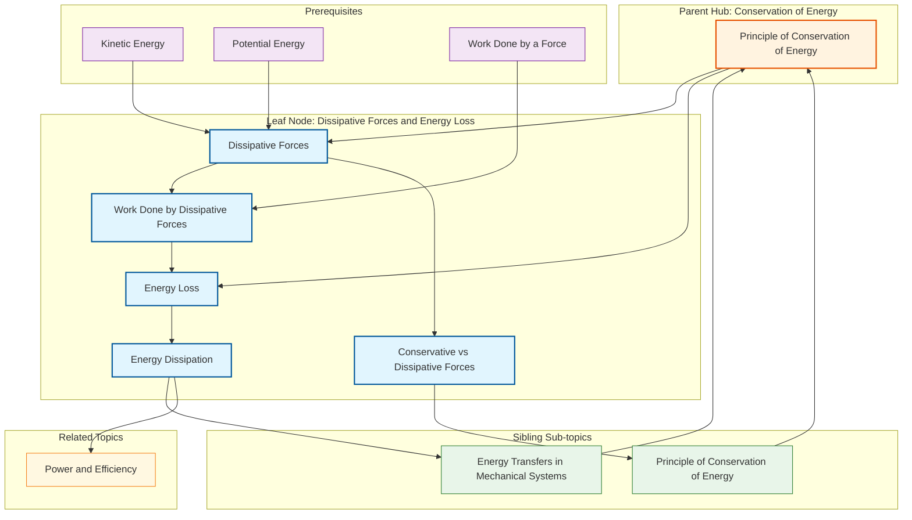

# 1. Overview / 概述

**English:**
This sub-topic explores **dissipative forces** — forces that cause mechanical energy to be "lost" from a system, typically as thermal energy (heat) or sound. In real-world mechanical systems, no process is perfectly efficient; some energy is always dissipated due to forces like friction, air resistance (drag), and viscous drag in fluids. Understanding dissipative forces is crucial for applying the [[Principle of Conservation of Energy]] correctly: while total energy is always conserved, the **mechanical energy** (sum of [[Kinetic Energy and Potential Energy]]) decreases when dissipative forces do work. This sub-topic bridges idealised models (where mechanical energy is conserved) and real-world applications, forming the foundation for [[Power and Efficiency]] calculations.

**中文:**
本子知识点探讨**耗散力**——导致机械能从系统中“损失”的力，通常转化为热能或声能。在现实机械系统中，没有过程是完美高效的；由于摩擦力、空气阻力（阻力）和流体中的粘性阻力等力，总会有部分能量被耗散。理解耗散力对于正确应用[[能量守恒原理]]至关重要：虽然总能量始终守恒，但当耗散力做功时，**机械能**（[[动能和势能]]之和）会减少。本子知识点连接了理想化模型（机械能守恒）和现实应用，为[[功率和效率]]计算奠定基础。

---

# 2. Syllabus Learning Objectives / 考纲学习目标

| CAIE 9702 (3.3 g) | Edexcel IAL (WPH11 U1: 4.9-4.11) |
|-------------------|-----------------------------------|
| Understand that dissipative forces cause energy loss in mechanical systems | 4.9: Understand that work done against frictional forces is dissipated as thermal energy |
| Apply conservation of energy to systems where work is done against friction | 4.10: Calculate energy loss due to resistive forces using work-energy principles |
| Recognise that "lost" energy is not destroyed but transferred to the surroundings | 4.11: Understand that in real systems, mechanical energy is not conserved due to dissipative forces |

**Examiner Expectations / 考官期望:**
- **English:** You must be able to identify dissipative forces in a given scenario, calculate the work done against them, and relate this to the loss in mechanical energy. You should also explain that "lost" energy is transferred to the surroundings (thermal, sound) — not destroyed.
- **中文:** 你必须能够在给定场景中识别耗散力，计算克服耗散力所做的功，并将其与机械能损失联系起来。你还应解释“损失”的能量被转移到周围环境（热能、声能）——而非被摧毁。

---

# 3. Core Definitions / 核心定义

| Term (EN/CN) | Definition (EN) | Definition (CN) | Common Mistakes / 常见错误 |
|--------------|-----------------|-----------------|---------------------------|
| **Dissipative Force** / 耗散力 | A force that opposes motion and converts mechanical energy into non-mechanical forms (e.g., thermal energy, sound). | 阻碍运动并将机械能转化为非机械形式（如热能、声能）的力。 | ❌ Thinking dissipative forces destroy energy (they only transfer it). / 认为耗散力摧毁能量（它们只是转移能量）。 |
| **Friction** / 摩擦力 | A contact force that opposes relative motion between two surfaces in contact. | 阻碍两个接触表面之间相对运动的接触力。 | ❌ Confusing static friction (no motion) with kinetic friction (motion). / 混淆静摩擦（无运动）和动摩擦（有运动）。 |
| **Air Resistance (Drag)** / 空气阻力（阻力） | A resistive force exerted by air on an object moving through it, opposing the motion. | 空气对在其中运动的物体施加的阻力，阻碍运动。 | ❌ Assuming air resistance is constant (it depends on speed). / 假设空气阻力恒定（它取决于速度）。 |
| **Work Done Against Dissipative Forces** / 克服耗散力所做的功 | The energy transferred from the mechanical system to the surroundings due to dissipative forces; calculated as $W = F_d \times s$ (for constant force). | 由于耗散力而从机械系统转移到周围环境的能量；计算为 $W = F_d \times s$（对于恒力）。 | ❌ Forgetting that work done by friction is **negative** from the system's perspective. / 忘记从系统角度看摩擦力做功为**负**。 |
| **Energy Dissipation** / 能量耗散 | The process by which mechanical energy is converted into non-useful forms (e.g., heat, sound) due to dissipative forces. | 由于耗散力，机械能转化为非有用形式（如热、声）的过程。 | ❌ Saying "energy is lost" without specifying it's transferred. / 说“能量损失”而不指明它被转移了。 |
| **Thermal Energy (Heat)** / 热能（热量） | The most common form of dissipated energy; the random kinetic energy of particles in a substance. | 最常见的耗散能量形式；物质中粒子的随机动能。 | ❌ Confusing thermal energy with temperature (they are related but distinct). / 混淆热能（能量）与温度（相关但不同）。 |

---

# 4. Key Concepts Explained / 关键概念详解

## 4.1 Work Done by Dissipative Forces / 耗散力做功

### Explanation / 解释
**English:**
When a dissipative force $F_d$ acts on an object over a displacement $s$, it does **work** on the object. However, unlike conservative forces (e.g., gravity), the work done by dissipative forces is **path-dependent** and **always negative** with respect to the object's kinetic energy. The work done is given by:

$$ W = F_d \times s \times \cos\theta $$

where $\theta$ is the angle between the force and displacement. For friction opposing motion, $\theta = 180^\circ$, so $\cos\theta = -1$, giving $W = -F_d s$. This negative work means energy is **removed** from the mechanical system.

**中文:**
当耗散力 $F_d$ 作用在物体上并经过位移 $s$ 时，它对物体做功。然而，与保守力（如重力）不同，耗散力所做的功是**路径依赖**的，并且相对于物体的动能始终为**负**。做功公式为：

$$ W = F_d \times s \times \cos\theta $$

其中 $\theta$ 是力与位移之间的夹角。对于阻碍运动的摩擦力，$\theta = 180^\circ$，所以 $\cos\theta = -1$，得到 $W = -F_d s$。这个负功意味着能量从机械系统中被**移除**。

### Physical Meaning / 物理意义
**English:**
The negative work done by dissipative forces represents the **transfer of mechanical energy** into other forms (thermal, sound). For example, when you slide a book across a table, friction does negative work on the book, reducing its kinetic energy. The "lost" kinetic energy appears as heat in the book and table surfaces (atoms vibrate more vigorously).

**中文:**
耗散力所做的负功代表**机械能向其他形式（热能、声能）的转移**。例如，当你在桌子上滑动一本书时，摩擦力对书做负功，减少其动能。“损失”的动能以热量的形式出现在书和桌面表面（原子振动更剧烈）。

### Common Misconceptions / 常见误区
- ❌ **"Friction always slows things down."** — Friction can also be a driving force (e.g., car tyres on road). Only **kinetic friction** (sliding) dissipates energy; static friction does not.
- ❌ **"Energy is lost forever."** — Energy is never lost; it is transferred to the surroundings as thermal energy.
- ❌ **"Work done by friction is always $F \times d$."** — This only applies if friction is constant. For variable forces (e.g., air resistance), you may need integration or average force.

- ❌ **“摩擦力总是让物体减速。”** — 摩擦力也可以是驱动力（如汽车轮胎在路面上）。只有**动摩擦**（滑动）耗散能量；静摩擦不耗散。
- ❌ **“能量永远损失了。”** — 能量从未损失；它被转移到周围环境作为热能。
- ❌ **“摩擦力做功总是 $F \times d$。”** — 这仅适用于摩擦力恒定。对于变力（如空气阻力），可能需要积分或平均力。

### Exam Tips / 考试提示
- **English:** Always state the **direction** of the dissipative force relative to motion. If the force opposes motion, work is negative.
- **English:** In energy conservation equations, include a term for "work done against friction" or "energy dissipated" on the output side.
- **中文:** 始终说明耗散力相对于运动的方向。如果力阻碍运动，做功为负。
- **中文:** 在能量守恒方程中，在输出侧包含“克服摩擦力所做的功”或“耗散能量”项。

> 📷 **IMAGE PROMPT — DIAGRAM-01: Work Done by Friction**
> A simple diagram showing a block sliding on a rough horizontal surface. The block has velocity v to the right. A friction force F_f points left (opposing motion). The displacement s is to the right. Label: "Work done by friction = -F_f × s". Show the energy transfer: Kinetic Energy → Thermal Energy (heat) in the surfaces.

---

## 4.2 Energy Dissipation in Mechanical Systems / 机械系统中的能量耗散

### Explanation / 解释
**English:**
In any real mechanical system, dissipative forces cause the **total mechanical energy** (KE + PE) to decrease over time. This does **not** violate the [[Principle of Conservation of Energy]] because the "lost" mechanical energy is transferred to the surroundings as thermal energy (and sometimes sound). The general energy conservation equation becomes:

$$ E_{\text{initial}} = E_{\text{final}} + W_{\text{dissipated}} $$

where $W_{\text{dissipated}}$ is the work done against dissipative forces (always positive in this form, as it represents energy leaving the system).

**中文:**
在任何真实机械系统中，耗散力导致**总机械能**（动能+势能）随时间减少。这并**不**违反[[能量守恒原理]]，因为“损失”的机械能被转移到周围环境作为热能（有时还有声能）。一般的能量守恒方程变为：

$$ E_{\text{初始}} = E_{\text{最终}} + W_{\text{耗散}} $$

其中 $W_{\text{耗散}}$ 是克服耗散力所做的功（在此形式中始终为正，代表离开系统的能量）。

### Physical Meaning / 物理意义
**English:**
Consider a ball dropped from a height $h$ onto a hard floor. In an ideal world (no air resistance), it would bounce back to height $h$. In reality, it bounces to a lower height $h' < h$. The "missing" gravitational potential energy has been dissipated as:
- **Thermal energy** in the ball and floor (during deformation and friction)
- **Sound energy** (the "thud" of impact)
- **Internal energy** changes in the ball's material

**中文:**
考虑一个球从高度 $h$ 落到硬地板上。在理想世界（无空气阻力），它会弹回高度 $h$。实际上，它弹到较低高度 $h' < h$。“缺失”的重力势能被耗散为：
- **热能**在球和地板中（变形和摩擦过程中）
- **声能**（撞击的“砰”声）
- **内能**变化在球的材料中

### Common Misconceptions / 常见误区
- ❌ **"Energy is not conserved when friction is present."** — Total energy is always conserved; only mechanical energy is not conserved.
- ❌ **"All dissipated energy becomes heat."** — Some becomes sound, light (sparks), or internal deformation energy.
- ❌ **"A bouncing ball loses energy only due to air resistance."** — Internal friction (inelastic deformation) is often the dominant dissipative mechanism.

- ❌ **“存在摩擦力时能量不守恒。”** — 总能量始终守恒；只有机械能不守恒。
- ❌ **“所有耗散能量都变成热。”** — 部分变成声能、光能（火花）或内部变形能。
- ❌ **“弹跳球只因为空气阻力损失能量。”** — 内部摩擦（非弹性变形）通常是主要的耗散机制。

### Exam Tips / 考试提示
- **English:** When solving problems, clearly identify the **system boundary**. Energy dissipated "leaves" the mechanical system but enters the surroundings.
- **English:** For bouncing ball problems, the ratio $h'/h$ gives the **coefficient of restitution** (not covered here, but related).
- **中文:** 解题时，明确识别**系统边界**。耗散能量“离开”机械系统但进入周围环境。
- **中文:** 对于弹跳球问题，比值 $h'/h$ 给出**恢复系数**（此处不涉及，但相关）。

> 📷 **IMAGE PROMPT — DIAGRAM-02: Energy Dissipation in a Bouncing Ball**
> A sequence diagram showing a ball dropped from height h. First frame: ball at height h, PE = mgh, KE = 0. Second frame: ball just before impact, PE = 0, KE = mgh. Third frame: ball at maximum bounce height h' < h, PE = mgh', KE = 0. Arrows show energy flow: some KE → thermal energy (heat) in ball and floor, some → sound energy. Label: "Energy dissipated = mg(h - h')".

---

## 4.3 Distinguishing Conservative and Dissipative Forces / 区分保守力和耗散力

### Explanation / 解释
**English:**
This is a key distinction for A-Level Physics:

| Property | Conservative Forces (e.g., gravity, spring force) | Dissipative Forces (e.g., friction, air resistance) |
|----------|---------------------------------------------------|-----------------------------------------------------|
| Work done around closed loop | Zero | Non-zero (negative) |
| Path dependence | Path-independent | Path-dependent |
| Energy conversion | KE ↔ PE (reversible) | Mechanical → Thermal (irreversible) |
| Mechanical energy conserved? | Yes | No |

**中文:**
这是A-Level物理的关键区分：

| 性质 | 保守力（如重力、弹力） | 耗散力（如摩擦力、空气阻力） |
|------|----------------------|---------------------------|
| 沿闭合回路做功 | 零 | 非零（负） |
| 路径依赖 | 路径无关 | 路径相关 |
| 能量转换 | 动能↔势能（可逆） | 机械能→热能（不可逆） |
| 机械能守恒？ | 是 | 否 |

### Physical Meaning / 物理意义
**English:**
If you lift an object and lower it back to the same height, gravity does zero net work — energy is conserved. But if you slide an object along a rough surface and back to the start, friction does negative work throughout — mechanical energy is lost as heat. This irreversibility is why dissipative forces are also called **non-conservative forces**.

**中文:**
如果你举起一个物体再放回同一高度，重力净做功为零——能量守恒。但如果你沿粗糙表面滑动物体再回到起点，摩擦力全程做负功——机械能以热量形式损失。这种不可逆性就是耗散力也被称为**非保守力**的原因。

### Common Misconceptions / 常见误区
- ❌ **"Air resistance is a conservative force."** — No, it is dissipative because it always opposes motion and converts KE to heat.
- ❌ **"Tension in a string is dissipative."** — Tension is conservative if the string is elastic; it stores energy like a spring.

- ❌ **“空气阻力是保守力。”** — 不，它是耗散力，因为它始终阻碍运动并将动能转化为热能。
- ❌ **“绳子中的张力是耗散力。”** — 如果绳子有弹性，张力是保守力；它像弹簧一样储存能量。

### Exam Tips / 考试提示
- **English:** If a question says "mechanical energy is conserved", assume no dissipative forces. If it says "energy is conserved", dissipative forces may be present but total energy is constant.
- **中文:** 如果题目说“机械能守恒”，假设无耗散力。如果说“能量守恒”，可能存在耗散力但总能量恒定。

---

# 5. Essential Equations / 核心公式

## 5.1 Work Done by a Constant Dissipative Force / 恒定耗散力做功

$$ W = F_d \times s \times \cos\theta $$

| Symbol (符号) | Meaning (EN) | Meaning (CN) | Unit (单位) |
|--------------|-------------|-------------|------------|
| $W$ | Work done by dissipative force | 耗散力做功 | J (Joules) |
| $F_d$ | Magnitude of dissipative force | 耗散力大小 | N (Newtons) |
| $s$ | Displacement of object | 物体的位移 | m (metres) |
| $\theta$ | Angle between force and displacement | 力与位移之间的夹角 | ° or rad |

**Conditions / 适用条件:**
- **English:** Force must be constant in magnitude and direction. For friction on a horizontal surface, $\theta = 180^\circ$, so $W = -F_d s$.
- **中文:** 力的大小和方向必须恒定。对于水平面上的摩擦力，$\theta = 180^\circ$，所以 $W = -F_d s$.

**Limitations / 局限性:**
- **English:** Does not apply to variable forces (e.g., speed-dependent air resistance). For variable forces, use $W = \int F_d \, ds$ or average force.
- **中文:** 不适用于变力（如与速度相关的空气阻力）。对于变力，使用 $W = \int F_d \, ds$ 或平均力。

---

## 5.2 Energy Conservation with Dissipation / 含耗散的能量守恒

$$ E_{\text{initial}} = E_{\text{final}} + W_{\text{dissipated}} $$

Or more explicitly:

$$ \text{KE}_i + \text{PE}_i = \text{KE}_f + \text{PE}_f + \text{Energy dissipated} $$

| Symbol (符号) | Meaning (EN) | Meaning (CN) | Unit (单位) |
|--------------|-------------|-------------|------------|
| $E_{\text{initial}}$ | Total initial mechanical energy | 初始总机械能 | J |
| $E_{\text{final}}$ | Total final mechanical energy | 最终总机械能 | J |
| $W_{\text{dissipated}}$ | Work done against dissipative forces (positive) | 克服耗散力所做的功（正） | J |

**Derivation / 推导:**
- **English:** From the work-energy theorem: $W_{\text{net}} = \Delta \text{KE}$. Separating conservative ($W_c$) and non-conservative ($W_{nc}$) work: $W_c + W_{nc} = \Delta \text{KE}$. Since $W_c = -\Delta \text{PE}$, we get $-\Delta \text{PE} + W_{nc} = \Delta \text{KE}$, so $W_{nc} = \Delta \text{KE} + \Delta \text{PE} = \Delta E_{\text{mech}}$. The negative of $W_{nc}$ is the energy dissipated.
- **中文:** 从功能定理：$W_{\text{净}} = \Delta \text{KE}$。分离保守力做功（$W_c$）和非保守力做功（$W_{nc}$）：$W_c + W_{nc} = \Delta \text{KE}$。由于 $W_c = -\Delta \text{PE}$，得到 $-\Delta \text{PE} + W_{nc} = \Delta \text{KE}$，所以 $W_{nc} = \Delta \text{KE} + \Delta \text{PE} = \Delta E_{\text{机械}}$。$W_{nc}$ 的负值即为耗散能量。

**Conditions / 适用条件:**
- **English:** Valid for all mechanical systems. Assumes no other forms of energy (e.g., chemical, nuclear) are involved.
- **中文:** 适用于所有机械系统。假设不涉及其他形式的能量（如化学能、核能）。

**Limitations / 局限性:**
- **English:** Does not account for energy converted to sound or light explicitly — these are included in "energy dissipated".
- **中文:** 不明确考虑转化为声能或光能的能量——这些都包含在“耗散能量”中。

---

## 5.3 Power Dissipated / 耗散功率

$$ P_{\text{dissipated}} = F_d \times v $$

(for constant force and velocity)

| Symbol (符号) | Meaning (EN) | Meaning (CN) | Unit (单位) |
|--------------|-------------|-------------|------------|
| $P_{\text{dissipated}}$ | Rate of energy dissipation | 能量耗散率 | W (Watts) |
| $F_d$ | Dissipative force | 耗散力 | N |
| $v$ | Speed of object | 物体速度 | m/s |

**Conditions / 适用条件:**
- **English:** Force and velocity must be in opposite directions (or use $\cos\theta$). For constant speed, the driving power equals the dissipated power.
- **中文:** 力和速度方向必须相反（或使用 $\cos\theta$）。对于匀速，驱动功率等于耗散功率。

**Limitations / 局限性:**
- **English:** Only valid for instantaneous power. If force varies with speed (e.g., air resistance $\propto v^2$), use $P = F_d(v) \times v$.
- **中文:** 仅适用于瞬时功率。如果力随速度变化（如空气阻力 $\propto v^2$），使用 $P = F_d(v) \times v$.

> 📷 **IMAGE PROMPT — FORMULA-01: Power Dissipated Diagram**
> A car moving at constant velocity v to the right. Driving force F_drive points right. Air resistance F_air and friction F_friction point left (combined as F_dissipative). Label: "At constant speed: P_drive = P_dissipated = F_dissipative × v". Show energy flow: Chemical (fuel) → Mechanical → Thermal (waste heat).

---

# 6. Graphs and Relationships / 图表与关系

## 6.1 Energy vs. Time for a System with Dissipation / 含耗散系统的能量-时间图

### Axes / 坐标轴
- **X-axis:** Time / 时间 (s)
- **Y-axis:** Energy / 能量 (J)

### Shape / 形状
- **English:** For a freely falling object with air resistance: KE increases but at a decreasing rate (approaches terminal velocity). PE decreases linearly. Total mechanical energy (KE + PE) decreases steadily (curved downward). The gap between initial total energy and current total energy represents energy dissipated.
- **中文:** 对于有空气阻力的自由落体：动能增加但增速递减（趋近终端速度）。势能线性减少。总机械能（动能+势能）稳步减少（向下弯曲）。初始总能量与当前总能量之间的差距代表耗散能量。

### Gradient Meaning / 斜率含义
- **English:** Gradient of total mechanical energy vs. time = **negative of power dissipated** ($-P_{\text{dissipated}}$).
- **中文:** 总机械能-时间图的斜率 = **耗散功率的负值** ($-P_{\text{耗散}}$)。

### Area Meaning / 面积含义
- **English:** Area under the dissipated power vs. time graph = total energy dissipated.
- **中文:** 耗散功率-时间图下的面积 = 总耗散能量。

### Exam Interpretation / 考试解读
- **English:** If the total mechanical energy line is horizontal, no dissipation occurs (ideal system). A steeper downward slope means greater dissipative forces.
- **中文:** 如果总机械能线是水平的，则无耗散发生（理想系统）。更陡的向下斜率意味着更大的耗散力。

> 📷 **IMAGE PROMPT — GRAPH-01: Energy vs Time with Air Resistance**
> A graph with three curves: PE (linear decreasing), KE (curved increasing, flattening), and Total Mechanical Energy (curved decreasing). X-axis: Time (s). Y-axis: Energy (J). The gap between initial total energy and the total energy curve is labeled "Energy Dissipated". The gradient of the total energy curve is labeled "-P_dissipated".

---

## 6.2 Work Done vs. Distance for Friction / 摩擦力做功-距离图

### Axes / 坐标轴
- **X-axis:** Distance travelled / 行进距离 (m)
- **Y-axis:** Work done by friction / 摩擦力做功 (J)

### Shape / 形状
- **English:** For constant friction force, work done is proportional to distance: $W = -F_f \times s$. The graph is a straight line through origin with negative gradient $-F_f$.
- **中文:** 对于恒定摩擦力，做功与距离成正比：$W = -F_f \times s$。图形是通过原点的直线，斜率为负 $-F_f$。

### Gradient Meaning / 斜率含义
- **English:** Gradient = $-F_f$ (negative of friction force magnitude).
- **中文:** 斜率 = $-F_f$（摩擦力大小的负值）。

### Area Meaning / 面积含义
- **English:** Not applicable (the graph itself shows cumulative work).
- **中文:** 不适用（图形本身显示累积功）。

### Exam Interpretation / 考试解读
- **English:** A steeper negative gradient means larger friction force. If the line curves (non-linear), friction is not constant.
- **中文:** 更陡的负斜率意味着更大的摩擦力。如果线弯曲（非线性），摩擦力不恒定。

---

# 7. Required Diagrams / 必备图表

## 7.1 Block Sliding on a Rough Surface / 在粗糙表面上滑动的木块

### Description / 描述
**English:**
A block of mass $m$ is given an initial velocity $v_0$ on a rough horizontal surface. The only horizontal force is kinetic friction $F_f = \mu_k N = \mu_k mg$. The block slows down and eventually stops. The initial kinetic energy $\frac{1}{2}mv_0^2$ is entirely dissipated as thermal energy.

**中文:**
质量为 $m$ 的木块在粗糙水平面上获得初速度 $v_0$。唯一的水平力是动摩擦力 $F_f = \mu_k N = \mu_k mg$。木块减速并最终停止。初始动能 $\frac{1}{2}mv_0^2$ 完全耗散为热能。

### Image Prompt / 图片生成提示
> 📷 **IMAGE PROMPT — DIAGRAM-03: Block Sliding on Rough Surface**
> A rectangular block of mass m on a horizontal surface. The block has velocity v to the right (arrow). A friction force F_f points left (arrow). Label: "F_f = μ_k × N = μ_k × mg". Below the surface, show a magnified view of the rough surface with microscopic bumps. Arrows indicate energy transfer: KE → Thermal energy (heat) in the block and surface. Show the block at three positions: initial (v = v0), middle (v = v0/2), and final (v = 0). At final position, label: "All KE dissipated as heat".

### Labels Required / 需要标注
- **English:** Mass $m$, initial velocity $v_0$, friction force $F_f$, coefficient of kinetic friction $\mu_k$, normal reaction $N = mg$, displacement $s$, final velocity $0$.
- **中文:** 质量 $m$，初速度 $v_0$，摩擦力 $F_f$，动摩擦系数 $\mu_k$，法向反力 $N = mg$，位移 $s$，末速度 $0$。

### Exam Importance / 考试重要性
- **English:** This is the most common scenario for testing energy dissipation. You must be able to calculate the stopping distance using $F_f \times s = \frac{1}{2}mv_0^2$.
- **中文:** 这是测试能量耗散最常见的场景。你必须能够使用 $F_f \times s = \frac{1}{2}mv_0^2$ 计算停止距离。

---

## 7.2 Object Sliding Down a Rough Inclined Plane / 物体沿粗糙斜面下滑

### Description / 描述
**English:**
An object of mass $m$ slides down a rough inclined plane of angle $\theta$ and length $L$. The gravitational potential energy lost ($mgh$) is partly converted to kinetic energy and partly dissipated as heat due to friction ($F_f = \mu_k mg\cos\theta$). The energy conservation equation is:

$$ mgh = \frac{1}{2}mv^2 + F_f \times L $$

where $h = L\sin\theta$ and $F_f = \mu_k mg\cos\theta$.

**中文:**
质量为 $m$ 的物体沿角度为 $\theta$、长度为 $L$ 的粗糙斜面下滑。损失的重力势能（$mgh$）部分转化为动能，部分因摩擦力（$F_f = \mu_k mg\cos\theta$）耗散为热能。能量守恒方程为：

$$ mgh = \frac{1}{2}mv^2 + F_f \times L $$

其中 $h = L\sin\theta$，$F_f = \mu_k mg\cos\theta$。

### Image Prompt / 图片生成提示
> 📷 **IMAGE PROMPT — DIAGRAM-04: Object Sliding Down Rough Inclined Plane**
> A block on an inclined plane at angle θ to horizontal. The block is shown at the top (height h) and bottom (height 0). Forces on the block: weight mg vertically downward, normal reaction N perpendicular to plane, friction F_f parallel to plane pointing upward (opposing motion). Label: "h = L sinθ", "F_f = μ_k mg cosθ". Energy flow arrows: PE (mgh) → KE (½mv²) + Thermal (F_f × L). Show a thermometer icon near the block to indicate heating.

### Labels Required / 需要标注
- **English:** Mass $m$, incline angle $\theta$, length $L$, height $h$, friction $F_f$, normal reaction $N$, coefficient $\mu_k$, final velocity $v$.
- **中文:** 质量 $m$，斜面角度 $\theta$，长度 $L$，高度 $h$，摩擦力 $F_f$，法向反力 $N$，系数 $\mu_k$，末速度 $v$。

### Exam Importance / 考试重要性
- **English:** This combines gravitational PE, KE, and work done against friction. It is a common exam question to find the final speed or the coefficient of friction.
- **中文:** 这结合了重力势能、动能和克服摩擦力做功。这是常见的考题，用于求最终速度或摩擦系数。

---

# 8. Worked Examples / 典型例题

## Example 1: Block Sliding to a Stop / 木块滑行至停止

### Question / 题目
**English:**
A block of mass 2.0 kg slides on a rough horizontal surface with an initial speed of 5.0 m/s. The coefficient of kinetic friction between the block and the surface is 0.30. Calculate:
(a) The work done by friction as the block slides to a stop.
(b) The distance the block travels before stopping.
(c) The energy dissipated as thermal energy.

**中文:**
一个质量为 2.0 kg 的木块在粗糙水平面上以 5.0 m/s 的初速度滑动。木块与表面之间的动摩擦系数为 0.30。计算：
(a) 木块滑行至停止过程中摩擦力所做的功。
(b) 木块在停止前滑行的距离。
(c) 耗散为热能的能量。

### Solution / 解答

**Step 1: Identify known quantities / 步骤1：确定已知量**
- $m = 2.0 \text{ kg}$
- $v_0 = 5.0 \text{ m/s}$
- $v_f = 0 \text{ m/s}$
- $\mu_k = 0.30$
- $g = 9.81 \text{ m/s}^2$

**Step 2: Calculate friction force / 步骤2：计算摩擦力**
$$ N = mg = 2.0 \times 9.81 = 19.62 \text{ N} $$
$$ F_f = \mu_k N = 0.30 \times 19.62 = 5.886 \text{ N} $$

**Step 3: (a) Work done by friction / 步骤3：(a) 摩擦力做功**
Using work-energy theorem: $W_{\text{net}} = \Delta \text{KE}$
$$ W_f = \text{KE}_{\text{final}} - \text{KE}_{\text{initial}} = 0 - \frac{1}{2}mv_0^2 $$
$$ W_f = -\frac{1}{2} \times 2.0 \times (5.0)^2 = -25 \text{ J} $$

**Step 4: (b) Distance travelled / 步骤4：(b) 滑行距离**
$$ W_f = -F_f \times s $$
$$ -25 = -5.886 \times s $$
$$ s = \frac{25}{5.886} = 4.25 \text{ m} $$

**Step 5: (c) Energy dissipated / 步骤5：(c) 耗散能量**
The energy dissipated is the magnitude of work done by friction:
$$ E_{\text{dissipated}} = |W_f| = 25 \text{ J} $$

### Final Answer / 最终答案
**Answer:**
(a) $W_f = -25 \text{ J}$ (work done by friction)
(b) $s = 4.25 \text{ m}$
(c) $E_{\text{dissipated}} = 25 \text{ J}$

**答案：**
(a) 摩擦力做功 $W_f = -25 \text{ J}$
(b) 滑行距离 $s = 4.25 \text{ m}$
(c) 耗散能量 $E_{\text{耗散}} = 25 \text{ J}$

### Quick Tip / 提示
- **English:** The work done by friction is negative, but the energy dissipated is positive (magnitude). In energy conservation equations, always use the positive value for "energy dissipated".
- **中文:** 摩擦力做功为负，但耗散能量为正（大小）。在能量守恒方程中，始终使用正值表示“耗散能量”。

---

## Example 2: Object Sliding Down a Rough Incline / 物体沿粗糙斜面下滑

### Question / 题目
**English:**
A 0.50 kg block slides from rest down a rough inclined plane of length 2.0 m and angle 30° to the horizontal. The coefficient of kinetic friction is 0.20. Calculate the speed of the block at the bottom of the incline.

**中文:**
一个 0.50 kg 的木块从静止开始沿粗糙斜面下滑，斜面长度为 2.0 m，与水平面夹角为 30°。动摩擦系数为 0.20。计算木块到达斜面底端时的速度。

### Solution / 解答

**Step 1: Identify known quantities / 步骤1：确定已知量**
- $m = 0.50 \text{ kg}$
- $L = 2.0 \text{ m}$
- $\theta = 30^\circ$
- $\mu_k = 0.20$
- $v_0 = 0 \text{ m/s}$
- $g = 9.81 \text{ m/s}^2$

**Step 2: Calculate height and friction / 步骤2：计算高度和摩擦力**
$$ h = L\sin\theta = 2.0 \times \sin 30^\circ = 2.0 \times 0.5 = 1.0 \text{ m} $$
$$ N = mg\cos\theta = 0.50 \times 9.81 \times \cos 30^\circ = 0.50 \times 9.81 \times 0.866 = 4.25 \text{ N} $$
$$ F_f = \mu_k N = 0.20 \times 4.25 = 0.850 \text{ N} $$

**Step 3: Apply energy conservation / 步骤3：应用能量守恒**
$$ \text{PE}_{\text{top}} = \text{KE}_{\text{bottom}} + \text{Work done against friction} $$
$$ mgh = \frac{1}{2}mv^2 + F_f \times L $$
$$ 0.50 \times 9.81 \times 1.0 = \frac{1}{2} \times 0.50 \times v^2 + 0.850 \times 2.0 $$
$$ 4.905 = 0.25v^2 + 1.70 $$
$$ 0.25v^2 = 4.905 - 1.70 = 3.205 $$
$$ v^2 = \frac{3.205}{0.25} = 12.82 $$
$$ v = \sqrt{12.82} = 3.58 \text{ m/s} $$

### Final Answer / 最终答案
**Answer:** $v = 3.58 \text{ m/s}$ | **答案：** $v = 3.58 \text{ m/s}$

### Quick Tip / 提示
- **English:** Always check: without friction, $v = \sqrt{2gh} = \sqrt{2 \times 9.81 \times 1.0} = 4.43 \text{ m/s}$. The friction reduces the speed, so 3.58 m/s is reasonable.
- **中文:** 始终检查：无摩擦时，$v = \sqrt{2gh} = \sqrt{2 \times 9.81 \times 1.0} = 4.43 \text{ m/s}$。摩擦力降低了速度，所以 3.58 m/s 是合理的。

---

# 9. Past Paper Question Types / 历年真题题型

| Question Type / 题型 | Frequency / 频率 | Difficulty / 难度 | Past Paper References / 真题索引 |
|----------------------|------------------|------------------|-------------------------------|
| Calculate work done by friction / 计算摩擦力做功 | High / 高 | Easy-Medium / 易-中 | 📝 *待填入* |
| Energy conservation with dissipation on incline / 斜面含耗散的能量守恒 | High / 高 | Medium / 中 | 📝 *待填入* |
| Stopping distance with friction / 摩擦力停止距离 | Medium / 中 | Medium / 中 | 📝 *待填入* |
| Power dissipated at constant speed / 匀速时耗散功率 | Medium / 中 | Medium / 中 | 📝 *待填入* |
| Explain energy dissipation in a bouncing ball / 解释弹跳球中的能量耗散 | Low-Medium / 低-中 | Easy / 易 | 📝 *待填入* |
| Compare conservative vs. dissipative forces / 比较保守力与耗散力 | Low / 低 | Easy / 易 | 📝 *待填入* |

**Common Command Words / 常见指令词:**
- **English:** Calculate, Determine, Find, Show that, Explain, State, Sketch
- **中文:** 计算，确定，求，证明，解释，陈述，画出

---

# 10. Practical Skills Connections / 实验技能链接

**English:**
This sub-topic connects to practical work in several ways:

1. **Measuring coefficient of kinetic friction ($\mu_k$):** Use a block on a horizontal surface. Pull it at constant speed with a force sensor (or spring balance). The reading gives $F_f$, and $\mu_k = F_f / mg$. Alternatively, use an inclined plane: find the angle where the block slides at constant speed; $\mu_k = \tan\theta$.

2. **Energy dissipation in a bouncing ball:** Drop a ball from a known height $h_1$ and measure the bounce height $h_2$. The energy dissipated per bounce is $mg(h_1 - h_2)$. Repeat for different surfaces or ball types.

3. **Graph plotting:** Plot stopping distance $s$ vs. initial speed $v_0^2$ for a block on a rough surface. The gradient should be $m/(2F_f)$, allowing calculation of $\mu_k$.

4. **Uncertainties:** Friction measurements have significant uncertainty due to surface irregularities. Always repeat measurements and calculate mean and standard deviation.

**中文:**
本子知识点通过以下方式与实验工作联系：

1. **测量动摩擦系数（$\mu_k$）：** 在水平面上使用木块。用传感器（或弹簧秤）以匀速拉动木块。读数给出 $F_f$，$\mu_k = F_f / mg$。或者使用斜面：找到木块匀速下滑的角度；$\mu_k = \tan\theta$。

2. **弹跳球中的能量耗散：** 从已知高度 $h_1$ 释放球，测量弹跳高度 $h_2$。每次弹跳耗散的能量为 $mg(h_1 - h_2)$。对不同表面或球类型重复实验。

3. **绘制图表：** 绘制粗糙面上木块的停止距离 $s$ 与初速度 $v_0^2$ 的关系图。斜率应为 $m/(2F_f)$，从而计算 $\mu_k$。

4. **不确定度：** 由于表面不规则，摩擦力测量具有显著不确定度。始终重复测量并计算平均值和标准偏差。

---

# 11. Concept Map / 概念图谱

---

# 12. Quick Revision Sheet / 速查表

| Category / 类别 | Key Points / 要点 |
|----------------|------------------|
| **Definition / 定义** | Dissipative forces convert mechanical energy into thermal/sound energy. They are non-conservative (path-dependent). / 耗散力将机械能转化为热能/声能。它们是非保守的（路径相关）。 |
| **Key Formula / 核心公式** | $W = F_d \times s \times \cos\theta$ (constant force); $E_{\text{initial}} = E_{\text{final}} + W_{\text{dissipated}}$; $P_{\text{dissipated}} = F_d \times v$ (constant speed) |
| **Key Graph / 核心图表** | Total mechanical energy vs. time: decreasing curve with gradient $= -P_{\text{dissipated}}$ / 总机械能-时间图：递减曲线，斜率 $= -P_{\text{耗散}}$ |
| **Common Examples / 常见例子** | Block sliding on rough surface (KE → heat); Object on rough incline (PE → KE + heat); Bouncing ball (PE → heat + sound) / 粗糙面上滑动的木块（动能→热）；粗糙斜面上的物体（势能→动能+热）；弹跳球（势能→热+声） |
| **Exam Tip / 考试提示** | Always identify the system boundary. "Energy lost" = energy transferred to surroundings, not destroyed. Work done by friction is negative; energy dissipated is positive. / 始终识别系统边界。“能量损失”=转移到周围环境的能量，而非被摧毁。摩擦力做功为负；耗散能量为正。 |
| **Common Mistake / 常见错误** | ❌ Saying energy is "lost" without specifying it's transferred. ❌ Using $W = F \times d$ for variable forces. ❌ Forgetting that friction can be a driving force (static friction). / ❌ 说能量“损失”而不指明它被转移。❌ 对变力使用 $W = F \times d$。❌ 忘记摩擦力可以是驱动力（静摩擦）。 |
| **Practical Link / 实验联系** | Measure $\mu_k$ using force sensor or inclined plane; measure bounce heights to find energy dissipated per bounce. / 使用力传感器或斜面测量 $\mu_k$；测量弹跳高度以找到每次弹跳的耗散能量。 |