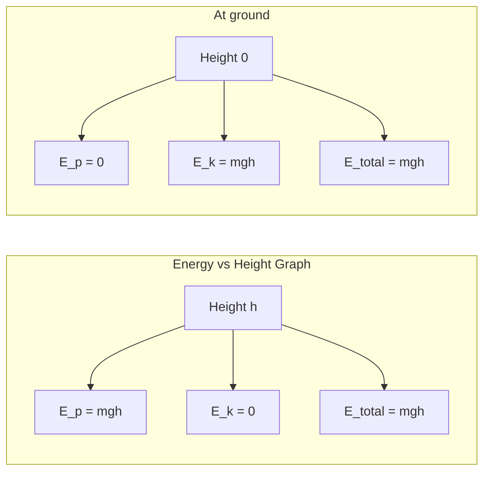

# 1. Overview / 概述

**English:**
This sub-topic focuses on how energy is transferred between different forms within mechanical systems, specifically examining the interplay between [[Kinetic Energy and Potential Energy]] as objects move under the influence of forces. We analyze how gravitational potential energy converts to kinetic energy (and vice versa) in systems like falling objects, pendulums, and roller coasters. Understanding these transfers is fundamental to applying the [[Principle of Conservation of Energy]] — energy cannot be created or destroyed, only transformed from one form to another. This sub-topic also introduces the concept of work done by forces as the mechanism of energy transfer, bridging mechanics with [[Power and Efficiency]].

**中文:**
本子知识点聚焦于机械系统中能量在不同形式之间的转移，特别是物体在力的作用下运动时，[[Kinetic Energy and Potential Energy]] 之间的相互作用。我们分析重力势能如何转化为动能（反之亦然），例如自由落体、摆锤和过山车等系统。理解这些能量转移是应用[[Principle of Conservation of Energy]]（能量既不会凭空产生，也不会凭空消失，只会从一种形式转化为另一种形式）的基础。本子知识点还引入了力做功作为能量转移的机制，将力学与[[Power and Efficiency]]联系起来。

---

# 2. Syllabus Learning Objectives / 考纲学习目标

| CAIE 9702 | Edexcel IAL |
|-----------|-------------|
| 3.3(g): Apply the principle of conservation of energy to examples involving the transfer of energy between gravitational potential energy and kinetic energy | 4.9: Understand the principle of conservation of energy and apply it to mechanical systems |
| — | 4.10: Understand and apply the relationship between work done and energy transfer |
| — | 4.11: Understand and apply the relationship between kinetic energy, gravitational potential energy, and work done against resistive forces |

**Examiner Expectations / 考官期望:**
- **English:** Students must be able to set up energy conservation equations for mechanical systems, accounting for all energy transfers including work done against [[Dissipative Forces and Energy Loss]] like friction and air resistance. They should identify the initial and final energy stores, and calculate unknown quantities (speed, height, work done against friction).
- **中文:** 学生必须能够为机械系统建立能量守恒方程，考虑所有能量转移，包括克服[[Dissipative Forces and Energy Loss]]（如摩擦力和空气阻力）所做的功。他们应识别初始和最终的能量储存，并计算未知量（速度、高度、克服摩擦力所做的功）。

---

# 3. Core Definitions / 核心定义

| Term (EN/CN) | Definition (EN) | Definition (CN) | Common Mistakes / 常见错误 |
|--------------|-----------------|-----------------|---------------------------|
| **Mechanical Energy** / 机械能 | The sum of kinetic energy and gravitational potential energy in a system. | 系统中动能和重力势能的总和。 | Confusing mechanical energy with total energy (which includes thermal energy from friction). |
| **Energy Transfer** / 能量转移 | The process by which energy moves from one store to another, e.g., gravitational potential energy → kinetic energy. | 能量从一个储存形式转移到另一个储存形式的过程，例如重力势能→动能。 | Thinking energy is "used up" rather than transferred. |
| **Work Done** / 做功 | The energy transferred when a force moves an object through a displacement; $W = Fs\cos\theta$. | 当力使物体发生位移时转移的能量；$W = Fs\cos\theta$。 | Forgetting the $\cos\theta$ factor when force is not parallel to displacement. |
| **Dissipative Force** / 耗散力 | A force (e.g., friction, air resistance) that converts mechanical energy into thermal energy, reducing the total mechanical energy of the system. | 将机械能转化为热能，从而减少系统总机械能的力（如摩擦力、空气阻力）。 | Assuming dissipative forces always do negative work — they do, but the energy is transferred, not destroyed. |
| **Conservation of Energy** / 能量守恒 | The total energy of an isolated system remains constant; energy cannot be created or destroyed, only transferred between stores. | 孤立系统的总能量保持不变；能量既不能创造也不能消灭，只能在储存形式之间转移。 | Forgetting to include all energy stores (e.g., thermal energy from friction). |

---

# 4. Key Concepts Explained / 关键概念详解

## 4.1 Energy Transfers in a Falling Object / 自由落体中的能量转移

### Explanation / 解释
**English:** Consider an object of mass $m$ dropped from height $h$ above the ground. At the moment of release, the object has only gravitational potential energy ($E_p = mgh$) and zero kinetic energy ($E_k = 0$). As it falls, gravitational force does work on the object, converting $E_p$ into $E_k$. At any point during the fall, the total mechanical energy $E_{mech} = E_p + E_k$ remains constant (ignoring air resistance). Just before hitting the ground, $E_p \approx 0$ and $E_k = \frac{1}{2}mv^2 = mgh$. This is a direct application of the [[Principle of Conservation of Energy]].

**中文:** 考虑一个质量为 $m$ 的物体从高度 $h$ 处自由释放。释放瞬间，物体只有重力势能 ($E_p = mgh$)，动能为零 ($E_k = 0$)。下落过程中，重力对物体做功，将 $E_p$ 转化为 $E_k$。在下落的任意时刻，总机械能 $E_{mech} = E_p + E_k$ 保持不变（忽略空气阻力）。即将落地时，$E_p \approx 0$，$E_k = \frac{1}{2}mv^2 = mgh$。这是[[Principle of Conservation of Energy]]的直接应用。

### Physical Meaning / 物理意义
**English:** The gravitational field does work on the object, transferring energy from the gravitational potential store to the kinetic store. The rate of transfer increases as the object speeds up (power increases).
**中文:** 重力场对物体做功，将能量从重力势能储存转移到动能储存。随着物体加速，转移速率增加（功率增大）。

### Common Misconceptions / 常见误区
- **English:** "Heavier objects fall faster because they have more energy." — While heavier objects have more $E_p$ initially, the conversion to $E_k$ results in the same final speed ($v = \sqrt{2gh}$) for all masses (ignoring air resistance).
- **中文:** "较重的物体下落更快，因为它们有更多能量。" — 虽然较重物体初始 $E_p$ 更大，但转化为 $E_k$ 后，所有质量最终速度相同 ($v = \sqrt{2gh}$)（忽略空气阻力）。
- **English:** "Energy is lost during the fall." — Energy is never lost; it is transferred. If air resistance is present, some mechanical energy is transferred to thermal energy.
- **中文:** "下落过程中能量损失了。" — 能量从未损失，只是转移了。如果存在空气阻力，部分机械能转化为热能。

### Exam Tips / 考试提示
- **English:** Always state the assumption (e.g., "neglecting air resistance") when using conservation of mechanical energy. If friction is present, include a term for work done against friction.
- **中文:** 使用机械能守恒时，务必说明假设条件（如"忽略空气阻力"）。如果存在摩擦力，需包含克服摩擦力做功的项。

> 📷 **IMAGE PROMPT — DIAGRAM-01: Energy Transfer in a Falling Object**
> A diagram showing a ball at three positions during free fall: (1) at height h with E_p = mgh, E_k = 0; (2) at mid-height with E_p = mg(h/2), E_k = mg(h/2); (3) just before ground with E_p = 0, E_k = mgh. Arrows show energy flow from gravitational potential to kinetic. Bar charts beside each position show the relative magnitudes of E_p (green) and E_k (blue).

## 4.2 Energy Transfers in a Pendulum / 摆锤中的能量转移

### Explanation / 解释
**English:** A pendulum demonstrates cyclic energy transfer. At the maximum displacement (amplitude), the bob is at its highest point, so $E_p$ is maximum and $E_k = 0$. As the bob swings down, $E_p$ converts to $E_k$, reaching maximum $E_k$ at the lowest point (where $E_p$ is minimum). The bob then swings upward on the other side, converting $E_k$ back to $E_p$. In an ideal pendulum (no friction), the maximum height reached on each side is identical. Real pendulums gradually lose mechanical energy to [[Dissipative Forces and Energy Loss]] (air resistance, pivot friction), causing the amplitude to decay.

**中文:** 摆锤展示了循环能量转移。在最大位移处（振幅），摆球处于最高点，$E_p$ 最大，$E_k = 0$。摆球向下摆动时，$E_p$ 转化为 $E_k$，在最低点 $E_k$ 达到最大（此时 $E_p$ 最小）。摆球随后摆向另一侧，将 $E_k$ 转化回 $E_p$。理想摆锤（无摩擦）两侧达到的最大高度相同。真实摆锤会逐渐损失机械能给[[Dissipative Forces and Energy Loss]]（空气阻力、转轴摩擦），导致振幅衰减。

### Physical Meaning / 物理意义
**English:** The gravitational field acts as a restoring force, continuously transferring energy between potential and kinetic stores. The total mechanical energy determines the maximum amplitude.
**中文:** 重力场作为回复力，持续在势能和动能储存之间转移能量。总机械能决定了最大振幅。

### Common Misconceptions / 常见误区
- **English:** "The pendulum stops because energy is destroyed." — Energy is transferred to thermal energy in the surroundings via friction and air resistance.
- **中文:** "摆锤停止是因为能量被消灭了。" — 能量通过摩擦和空气阻力转化为周围环境的热能。
- **English:** "At the lowest point, the bob has zero potential energy." — $E_p$ is minimum but not necessarily zero; it depends on the reference level chosen.
- **中文:** "在最低点，摆球势能为零。" — $E_p$ 最小但不一定为零，取决于参考平面的选择。

### Exam Tips / 考试提示
- **English:** When analyzing a pendulum, clearly state your zero potential energy reference level (usually the lowest point of the swing).
- **中文:** 分析摆锤时，明确说明势能零参考面（通常选摆动最低点）。

> 📷 **IMAGE PROMPT — DIAGRAM-02: Energy Transfers in a Pendulum**
> A pendulum at three positions: (1) left extreme (max height, E_p max, E_k = 0); (2) bottom of swing (min height, E_k max, E_p min); (3) right extreme (max height, E_p max, E_k = 0). Arrows show E_p → E_k on the downswing and E_k → E_p on the upswing. Bar charts show energy distribution at each position.

## 4.3 Work Done Against Resistive Forces / 克服阻力做功

### Explanation / 解释
**English:** In real mechanical systems, [[Dissipative Forces and Energy Loss]] such as friction and air resistance do negative work on moving objects, transferring mechanical energy to thermal energy. The work done against these forces is given by $W = F \times s$, where $F$ is the resistive force and $s$ is the distance moved. The energy conservation equation becomes:
$$ \text{Initial Energy} = \text{Final Energy} + \text{Work Done Against Resistive Forces} $$
For example, a block sliding down a rough incline: $mgh = \frac{1}{2}mv^2 + F_f \times d$, where $F_f$ is the frictional force and $d$ is the distance along the incline.

**中文:** 在真实机械系统中，[[Dissipative Forces and Energy Loss]]（如摩擦力和空气阻力）对运动物体做负功，将机械能转化为热能。克服这些力所做的功为 $W = F \times s$，其中 $F$ 是阻力，$s$ 是移动距离。能量守恒方程变为：
$$ \text{初始能量} = \text{最终能量} + \text{克服阻力做功} $$
例如，沿粗糙斜面下滑的物块：$mgh = \frac{1}{2}mv^2 + F_f \times d$，其中 $F_f$ 是摩擦力，$d$ 是沿斜面移动的距离。

### Physical Meaning / 物理意义
**English:** Resistive forces reduce the mechanical energy available for conversion between kinetic and potential forms. The "lost" mechanical energy appears as increased thermal energy of the surfaces and surrounding air.
**中文:** 阻力减少了可用于动能和势能之间转换的机械能。"损失"的机械能以表面和周围空气热能增加的形式出现。

### Common Misconceptions / 常见误区
- **English:** "Work done against friction is always negative." — The work done *by* friction is negative (energy leaves the system), but the work done *against* friction is positive (energy input to overcome it).
- **中文:** "克服摩擦力做功总是负的。" — 摩擦力*对系统*做功是负的（能量离开系统），但*克服*摩擦力做功是正的（输入能量以克服它）。

### Exam Tips / 考试提示
- **English:** In exam questions, look for phrases like "rough surface," "air resistance," or "resistive force" — these indicate you must include a work-done-against-friction term in your energy equation.
- **中文:** 考试题目中，注意"粗糙表面"、"空气阻力"或"阻力"等关键词——这些提示你必须在能量方程中包含克服摩擦力做功的项。

---

# 5. Essential Equations / 核心公式

## 5.1 Conservation of Mechanical Energy (No Friction) / 机械能守恒（无摩擦）

$$ E_{p,initial} + E_{k,initial} = E_{p,final} + E_{k,final} $$

| Symbol (符号) | Meaning (EN) | Meaning (CN) | Unit (单位) |
|--------------|-------------|-------------|------------|
| $E_{p,initial}$ | Initial gravitational potential energy | 初始重力势能 | J |
| $E_{k,initial}$ | Initial kinetic energy | 初始动能 | J |
| $E_{p,final}$ | Final gravitational potential energy | 最终重力势能 | J |
| $E_{k,final}$ | Final kinetic energy | 最终动能 | J |

**Conditions / 适用条件:** Only conservative forces (gravity) act on the system; no friction or air resistance. / 只有保守力（重力）作用在系统上；无摩擦或空气阻力。

## 5.2 Conservation of Energy with Resistive Forces / 含阻力的能量守恒

$$ E_{initial} = E_{final} + W_{resistive} $$

| Symbol (符号) | Meaning (EN) | Meaning (CN) | Unit (单位) |
|--------------|-------------|-------------|------------|
| $E_{initial}$ | Total initial mechanical energy | 初始总机械能 | J |
| $E_{final}$ | Total final mechanical energy | 最终总机械能 | J |
| $W_{resistive}$ | Work done against resistive forces | 克服阻力做功 | J |

**Derivation / 推导:** From the work-energy principle: net work done = change in kinetic energy. Work done by gravity + work done by resistive forces = $\Delta E_k$. Since work done by gravity = $-\Delta E_p$, we get $-\Delta E_p + W_{resistive} = \Delta E_k$, rearranging: $E_{p,i} + E_{k,i} = E_{p,f} + E_{k,f} + W_{resistive}$.

**Conditions / 适用条件:** Any mechanical system where non-conservative forces are present. / 任何存在非保守力的机械系统。

## 5.3 Work Done by a Constant Force / 恒力做功

$$ W = Fs\cos\theta $$

| Symbol (符号) | Meaning (EN) | Meaning (CN) | Unit (单位) |
|--------------|-------------|-------------|------------|
| $W$ | Work done | 做功 | J |
| $F$ | Magnitude of force | 力的大小 | N |
| $s$ | Displacement | 位移 | m |
| $\theta$ | Angle between force and displacement | 力与位移之间的夹角 | ° or rad |

**Limitations / 局限性:** Only valid for constant forces. For variable forces, integration or area under force-displacement graph is required. / 仅适用于恒力。对于变力，需要积分或力-位移图下的面积。

> 📷 **IMAGE PROMPT — DIAGRAM-03: Work Done Formula Components**
> A diagram showing a force F applied at angle θ to the displacement s. The component F cos θ is shown parallel to displacement, and F sin θ perpendicular. A box moves horizontally while a force pulls at an angle.

---

# 6. Graphs and Relationships / 图表与关系

## 6.1 Energy vs. Height for a Falling Object / 自由落体能量-高度图

### Axes / 坐标轴
- **X-axis:** Height above ground / 距地面高度 (m)
- **Y-axis:** Energy / 能量 (J)

### Shape / 形状
- $E_p$: Linear decrease from $mgh$ to 0 (straight line with negative slope $-mg$)
- $E_k$: Linear increase from 0 to $mgh$ (straight line with positive slope $+mg$)
- Total mechanical energy: Horizontal straight line (constant)

### Gradient Meaning / 斜率含义
- Gradient of $E_p$ vs. height = $-mg$ (negative of weight)
- Gradient of $E_k$ vs. height = $+mg$ (weight)

### Area Meaning / 面积含义
- Area under $E_p$ graph has no direct physical meaning
- The vertical distance between $E_p$ and total energy lines at any height equals $E_k$

### Exam Interpretation / 考试解读
- **English:** If the total energy line slopes downward, energy is being dissipated (friction present). The slope indicates the rate of energy loss per unit height.
- **中文:** 如果总能量线向下倾斜，说明能量正在耗散（存在摩擦）。斜率表示单位高度的能量损失率。

## 6.2 Energy vs. Time for a Pendulum / 摆锤能量-时间图

### Axes / 坐标轴
- **X-axis:** Time / 时间 (s)
- **Y-axis:** Energy / 能量 (J)

### Shape / 形状
- $E_p$: Sinusoidal (cosine-like), maximum at extremes, minimum at center
- $E_k$: Sinusoidal (sine-like), minimum at extremes, maximum at center
- Total mechanical energy: Horizontal line (ideal) or slowly decaying exponential (real)

### Gradient Meaning / 斜率含义
- Gradient of $E_p$ = rate of change of potential energy = power transferred from potential store
- Gradient of $E_k$ = rate of change of kinetic energy = net power input to kinetic store

### Area Meaning / 面积含义
- Area under $E_k$ vs. time graph = total energy transferred to kinetic form over that time interval

### Exam Interpretation / 考试解读
- **English:** The phase difference between $E_p$ and $E_k$ is $\pi/2$ (90°). When one is maximum, the other is minimum. The sum is constant in ideal systems.
- **中文:** $E_p$ 和 $E_k$ 之间的相位差为 $\pi/2$（90°）。一个最大时，另一个最小。理想系统中总和恒定。

> 📷 **IMAGE PROMPT — DIAGRAM-04: Energy vs Time for a Pendulum**
> A graph with time on x-axis and energy on y-axis. Two sinusoidal curves: E_p (green dashed) and E_k (blue solid) are 90° out of phase. A horizontal red line shows constant total mechanical energy. Labels indicate positions: "max height" at E_p peaks, "lowest point" at E_k peaks.

---

# 7. Required Diagrams / 必备图表

## 7.1 Energy Transfer Diagram for a Roller Coaster / 过山车能量转移图

### Description / 描述
**English:** A diagram showing a roller coaster car at three key positions: (1) at the top of the first hill (maximum $E_p$, minimum $E_k$), (2) at the bottom of the valley (minimum $E_p$, maximum $E_k$), and (3) at the top of the second hill (lower than first, showing energy loss to friction). Arrows indicate energy flow between stores.

**中文:** 显示过山车在三个关键位置的图：(1) 第一个坡顶（最大 $E_p$，最小 $E_k$），(2) 谷底（最小 $E_p$，最大 $E_k$），(3) 第二个坡顶（比第一个低，显示摩擦导致的能量损失）。箭头表示能量在储存形式之间的流动。

### Image Prompt / 图片生成提示
> 📷 **IMAGE PROMPT — DIAGRAM-05: Roller Coaster Energy Transfers**
> A cross-section of a roller coaster track with three cars at different positions. Car 1 at the top of a tall hill (height h₁) with a large green bar for E_p and small blue bar for E_k. Car 2 at the bottom of a valley with large blue bar for E_k and small green bar for E_p. Car 3 at the top of a shorter hill (height h₂ < h₁) with medium green bar for E_p, medium blue bar for E_k, and a red bar labeled "thermal energy" showing energy lost to friction. Arrows connect the bars showing energy flow. Include labels: "E_p = mgh₁", "E_k = ½mv²", "Work done against friction = F × d".

### Labels Required / 需要标注
- **English:** Height $h_1$, Height $h_2$, Gravitational Potential Energy $E_p$, Kinetic Energy $E_k$, Thermal Energy (from friction), Work done against friction $W_f = F \times d$
- **中文:** 高度 $h_1$，高度 $h_2$，重力势能 $E_p$，动能 $E_k$，热能（来自摩擦），克服摩擦力做功 $W_f = F \times d$

### Exam Importance / 考试重要性
- **English:** This diagram is frequently used in exam questions about energy conservation in real systems with friction. Students must be able to label energy stores and write the conservation equation.
- **中文:** 该图常用于涉及真实系统（含摩擦）能量守恒的考试题。学生必须能够标注能量储存并写出守恒方程。

## 7.2 Sankey Diagram for a Mechanical System / 机械系统桑基图

### Description / 描述
**English:** A Sankey diagram showing the flow of energy from input (e.g., gravitational potential energy) to useful output (kinetic energy) and wasted output (thermal energy from friction). The width of each arrow is proportional to the energy amount.

**中文:** 显示能量从输入（如重力势能）到有用输出（动能）和浪费输出（摩擦产生的热能）流动的桑基图。每个箭头的宽度与能量大小成正比。

### Image Prompt / 图片生成提示
> 📷 **IMAGE PROMPT — DIAGRAM-06: Sankey Diagram for Mechanical Energy Transfer**
> A Sankey diagram with a thick green arrow labeled "Initial Gravitational Potential Energy (1000 J)" entering from the left. It splits into: a medium blue arrow going right labeled "Kinetic Energy (700 J)" and a thinner red arrow going downward labeled "Thermal Energy from Friction (300 J)". The widths are proportional to the energy values. Include percentage labels: "70% useful", "30% wasted".

### Labels Required / 需要标注
- **English:** Input energy, useful output energy, wasted energy, efficiency percentage
- **中文:** 输入能量，有用输出能量，浪费能量，效率百分比

### Exam Importance / 考试重要性
- **English:** Sankey diagrams help visualize energy conservation and efficiency. Students may be asked to calculate efficiency from the diagram or draw one given energy values.
- **中文:** 桑基图有助于可视化能量守恒和效率。学生可能需要根据图表计算效率，或根据给定能量值绘制桑基图。

---

# 8. Worked Examples / 典型例题

## Example 1: Block Sliding Down a Rough Incline / 物块沿粗糙斜面下滑

### Question / 题目
**English:** A block of mass 2.0 kg slides from rest down a rough incline of length 5.0 m and height 3.0 m. The frictional force acting on the block is constant at 4.0 N. Calculate:
(a) The speed of the block at the bottom of the incline.
(b) The work done against friction.

**中文:** 一个质量为 2.0 kg 的物块从静止开始沿粗糙斜面下滑，斜面长 5.0 m，高 3.0 m。作用在物块上的摩擦力恒为 4.0 N。计算：
(a) 物块到达斜面底端时的速度。
(b) 克服摩擦力所做的功。

### Solution / 解答

**Step 1: Identify initial and final energy stores / 识别初始和最终能量储存**
- Initial: $E_p = mgh = 2.0 \times 9.81 \times 3.0 = 58.86 \text{ J}$, $E_k = 0$
- Final: $E_p = 0$ (at bottom), $E_k = \frac{1}{2}mv^2$

**Step 2: Calculate work done against friction / 计算克服摩擦力做功**
$$ W_f = F \times d = 4.0 \times 5.0 = 20.0 \text{ J} $$

**Step 3: Apply conservation of energy / 应用能量守恒**
$$ E_{initial} = E_{final} + W_f $$
$$ 58.86 = \frac{1}{2} \times 2.0 \times v^2 + 20.0 $$
$$ \frac{1}{2} \times 2.0 \times v^2 = 58.86 - 20.0 = 38.86 $$
$$ v^2 = \frac{2 \times 38.86}{2.0} = 38.86 $$
$$ v = \sqrt{38.86} = 6.23 \text{ m s}^{-1} $$

### Final Answer / 最终答案
**Answer:** (a) $v = 6.2 \text{ m s}^{-1}$ (2 s.f.) | **答案：** (a) $v = 6.2 \text{ m s}^{-1}$（2位有效数字）
(b) $W_f = 20 \text{ J}$ | (b) $W_f = 20 \text{ J}$

### Quick Tip / 提示
- **English:** Always check if the incline length and height are given separately — the work done against friction uses the distance along the incline (the path length), not the vertical height.
- **中文:** 注意斜面长度和高度是分别给出的——克服摩擦力做功使用沿斜面的距离（路径长度），而不是垂直高度。

---

## Example 2: Pendulum Swing with Air Resistance / 含空气阻力的摆锤摆动

### Question / 题目
**English:** A pendulum bob of mass 0.50 kg is released from rest at a height of 0.20 m above its lowest point. At the lowest point, its speed is measured as 1.8 m s⁻¹. Calculate the work done against air resistance during the swing.

**中文:** 一个质量为 0.50 kg 的摆锤从最低点上方 0.20 m 高度处静止释放。在最低点测得速度为 1.8 m s⁻¹。计算摆动过程中克服空气阻力所做的功。

### Solution / 解答

**Step 1: Calculate initial energy / 计算初始能量**
$$ E_{initial} = mgh = 0.50 \times 9.81 \times 0.20 = 0.981 \text{ J} $$

**Step 2: Calculate final kinetic energy / 计算最终动能**
$$ E_{final} = \frac{1}{2}mv^2 = \frac{1}{2} \times 0.50 \times (1.8)^2 = 0.81 \text{ J} $$

**Step 3: Apply conservation of energy / 应用能量守恒**
$$ E_{initial} = E_{final} + W_{resistive} $$
$$ 0.981 = 0.81 + W_{resistive} $$
$$ W_{resistive} = 0.981 - 0.81 = 0.171 \text{ J} $$

### Final Answer / 最终答案
**Answer:** $W_{resistive} = 0.17 \text{ J}$ (2 s.f.) | **答案：** $W_{resistive} = 0.17 \text{ J}$（2位有效数字）

### Quick Tip / 提示
- **English:** The work done against air resistance equals the difference between the initial mechanical energy and the final mechanical energy. This is the energy "lost" from the mechanical system.
- **中文:** 克服空气阻力做功等于初始机械能与最终机械能之差。这是从机械系统中"损失"的能量。

---

# 9. Past Paper Question Types / 历年真题题型

| Question Type / 题型 | Frequency / 频率 | Difficulty / 难度 | Past Paper References / 真题索引 |
|----------------------|------------------|------------------|-------------------------------|
| Calculate final speed using energy conservation (no friction) | Very High / 非常高 | Easy / 简单 | 📝 *待填入* |
| Calculate work done against friction from energy loss | High / 高 | Medium / 中等 | 📝 *待填入* |
| Energy bar chart interpretation | Medium / 中等 | Easy-Medium / 简单-中等 | 📝 *待填入* |
| Multi-stage energy transfer (e.g., pendulum + projectile) | Low-Medium / 低-中等 | Hard / 困难 | 📝 *待填入* |
| Efficiency calculation from Sankey diagram | Medium / 中等 | Medium / 中等 | 📝 *待填入* |

**Common Command Words / 常见指令词:**
- **English:** "Calculate", "Determine", "Show that", "State", "Explain", "Sketch a graph of", "Draw a Sankey diagram"
- **中文:** "计算"、"确定"、"证明"、"陈述"、"解释"、"画出...的图"、"绘制桑基图"

---

# 10. Practical Skills Connections / 实验技能链接

**English:**
This sub-topic connects to practical work in several ways:

1. **Measuring Speed Using Energy Conservation:** Students can verify the relationship $v = \sqrt{2gh}$ by releasing a ball from measured heights and using light gates to measure speed. This involves:
   - Measuring height with a metre rule (uncertainty ±1 mm)
   - Using light gates connected to a data logger for timing
   - Plotting $v^2$ against $h$ to obtain a straight line with gradient $2g$
   - Estimating uncertainties and drawing error bars

2. **Investigating Energy Loss Due to Friction:** A trolley rolling down a ramp can be used to measure how much energy is "lost" to friction. Students:
   - Measure initial height and final speed
   - Calculate expected speed (no friction) vs. actual speed
   - Determine work done against friction
   - Vary surface roughness to see effect on energy loss

3. **Pendulum Energy Investigation:** Using a pendulum, students can:
   - Measure amplitude decay over time to quantify energy loss rate
   - Use video analysis to track position and calculate $E_p$ and $E_k$ at each point
   - Plot energy vs. time graphs and identify the exponential decay of mechanical energy

**中文:**
本子知识点与实验操作在以下几个方面有联系：

1. **利用能量守恒测量速度：** 学生可以通过从测量高度释放小球并使用光门测量速度来验证 $v = \sqrt{2gh}$ 关系。这涉及：
   - 用米尺测量高度（不确定度 ±1 mm）
   - 使用连接数据记录器的光门进行计时
   - 绘制 $v^2$ 对 $h$ 的图，得到斜率为 $2g$ 的直线
   - 估计不确定度并绘制误差棒

2. **研究摩擦导致的能量损失：** 可以使用沿斜坡滚下的手推车来测量"损失"给摩擦的能量。学生：
   - 测量初始高度和最终速度
   - 计算预期速度（无摩擦）与实际速度
   - 确定克服摩擦力所做的功
   - 改变表面粗糙度以观察对能量损失的影响

3. **摆锤能量研究：** 使用摆锤，学生可以：
   - 测量振幅随时间衰减以量化能量损失率
   - 使用视频分析追踪位置并计算各点的 $E_p$ 和 $E_k$
   - 绘制能量-时间图并识别机械能的指数衰减

---

# 11. Concept Map / 概念图谱

```mermaid
graph TD
    %% Core concept
    CE[Conservation of Energy] --> ET[Energy Transfers in Mechanical Systems]
    
    %% Prerequisites
    KE[Kinetic Energy and Potential Energy] --> ET
    WD[Work Done] --> ET
    
    %% Key components
    ET --> GPE[Gravitational Potential Energy]
    ET --> KE2[Kinetic Energy]
    ET --> DF[Dissipative Forces and Energy Loss]
    
    %% Applications
    ET --> FO[Falling Objects]
    ET --> PE[Pendulums]
    ET --> RC[Roller Coasters]
    ET --> SI[Sliding on Inclines]
    
    %% Equations
    ET --> EQ1[E_initial = E_final + W_resistive]
    ET --> EQ2[W = F × s]
    
    %% Graphs
    ET --> G1[Energy vs Height]
    ET --> G2[Energy vs Time]
    
    %% Related topics
    ET --> PE2[Power and Efficiency]
    
    %% Practical
    ET --> PRAC[Practical: Light Gates & Ramps]
    
    %% Styling
    classDef core fill:#f9f,stroke:#333,stroke-width:2px
    classDef component fill:#bbf,stroke:#333,stroke-width:1px
    classDef application fill:#bfb,stroke:#333,stroke-width:1px
    classDef equation fill:#fbb,stroke:#333,stroke-width:1px
    
    class CE core
    class ET core
    class KE,WD,GPE,KE2,DF component
    class FO,PE,RC,SI application
    class EQ1,EQ2 equation
```

---

# 12. Quick Revision Sheet / 速查表

| Category / 类别 | Key Points / 要点 |
|----------------|------------------|
| **Definition / 定义** | Energy transfer in mechanical systems: conversion between $E_p$ and $E_k$ via work done by forces. / 机械系统中的能量转移：通过力做功在 $E_p$ 和 $E_k$ 之间转换。 |
| **Key Formula / 核心公式** | $E_{initial} = E_{final} + W_{resistive}$; $W = Fs\cos\theta$; $E_p = mgh$; $E_k = \frac{1}{2}mv^2$ |
| **Key Graph / 核心图表** | Energy vs. Height: $E_p$ linear decrease, $E_k$ linear increase, total constant (no friction). / 能量-高度图：$E_p$ 线性下降，$E_k$ 线性上升，总和恒定（无摩擦）。 |
| **Common Exam Scenario / 常见考试场景** | Block on rough incline: $mgh = \frac{1}{2}mv^2 + F_f \times d$ where $d$ is incline length. / 粗糙斜面上的物块：$mgh = \frac{1}{2}mv^2 + F_f \times d$，其中 $d$ 为斜面长度。 |
| **Exam Tip / 考试提示** | Always state reference level for $E_p = 0$. Include friction term when surfaces are "rough" or "resistive forces" mentioned. / 始终说明 $E_p = 0$ 的参考面。当提到"粗糙表面"或"阻力"时，包含摩擦项。 |
| **Common Mistake / 常见错误** | Using vertical height instead of path length for work done against friction. / 计算克服摩擦力做功时使用垂直高度而非路径长度。 |
| **Practical Link / 实验联系** | Light gates + ramp: measure $v$ at bottom, compare to $\sqrt{2gh}$ to find energy loss. / 光门+斜坡：测量底部 $v$，与 $\sqrt{2gh}$ 比较以找出能量损失。 |