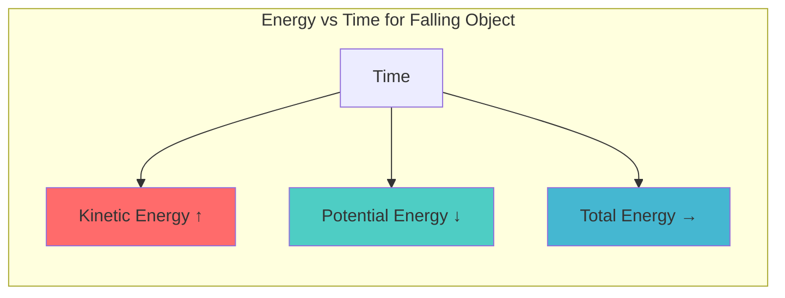

# 1. Overview / 概述

**English:**
The Principle of Conservation of Energy is a cornerstone of physics, stating that energy cannot be created or destroyed, only transferred from one form to another. This sub-topic explores how this principle applies to mechanical systems, where energy transforms between [[Kinetic Energy and Potential Energy]] forms. Understanding this principle is essential for analyzing real-world scenarios, from roller coasters to pendulums, and forms the foundation for [[Energy Transfers in Mechanical Systems]].

The principle provides a powerful tool for solving problems without needing to know the detailed forces involved. By tracking energy changes, we can predict speeds, heights, and other quantities in isolated systems. This concept is fundamental to [[Conservation of Energy]] and connects directly to [[Power and Efficiency]] in more advanced applications.

**中文:**
能量守恒原理是物理学的基石，它指出能量既不能被创造也不能被消灭，只能从一种形式转化为另一种形式。本子知识点探讨该原理如何应用于机械系统，其中能量在[[Kinetic Energy and Potential Energy]]形式之间转换。理解这一原理对于分析从过山车到摆锤等现实场景至关重要，并为[[Energy Transfers in Mechanical Systems]]奠定基础。

该原理提供了一个强大的解题工具，无需了解所涉及的详细力。通过追踪能量变化，我们可以预测孤立系统中的速度、高度和其他物理量。这一概念是[[Conservation of Energy]]的基础，并直接与更高级应用中的[[Power and Efficiency]]相关联。

---

# 2. Syllabus Learning Objectives / 考纲学习目标

| CAIE 9702 | Edexcel IAL |
|-----------|-------------|
| 3.3(g) State the principle of conservation of energy | 4.9 Understand the principle of conservation of energy |
| 3.3(g) Apply the principle to mechanical systems | 4.10 Apply the principle to solve problems involving energy transfers |
| 3.3(g) Distinguish between open and closed systems | 4.11 Understand that energy is dissipated in real systems |

**Examiner Expectations / 考官期望:**
- **English:** Students must state the principle verbatim, apply it to calculate unknown quantities in mechanical systems, and recognize that in real systems, energy is dissipated (e.g., as heat due to friction). Be able to identify closed systems where total mechanical energy is conserved.
- **中文:** 学生必须准确陈述该原理，将其应用于计算机械系统中的未知量，并认识到在真实系统中能量会耗散（例如因摩擦转化为热能）。能够识别总机械能守恒的封闭系统。

---

# 3. Core Definitions / 核心定义

| Term (EN/CN) | Definition (EN) | Definition (CN) | Common Mistakes / 常见错误 |
|--------------|-----------------|-----------------|---------------------------|
| **Principle of Conservation of Energy** / 能量守恒原理 | Energy cannot be created or destroyed; it can only be transferred from one form to another. The total energy of an isolated system remains constant. | 能量既不能被创造也不能被消灭；只能从一种形式转化为另一种形式。孤立系统的总能量保持不变。 | ❌ Thinking energy is "used up" or "lost" — it is only transferred or dissipated |
| **Closed System** / 封闭系统 | A system that does not exchange energy with its surroundings; total energy within remains constant. | 不与外界交换能量的系统；内部总能量保持不变。 | ❌ Confusing with open systems where energy can enter/leave |
| **Dissipation** / 耗散 | The process where useful energy is transformed into less useful forms (e.g., thermal energy) that are not recoverable for the intended purpose. | 有用能量转化为不太有用的形式（如热能）的过程，这些能量无法再用于预期目的。 | ❌ Thinking dissipated energy is "lost" — it still exists but is spread out |
| **Mechanical Energy** / 机械能 | The sum of kinetic energy and potential energy in a system. | 系统中动能和势能的总和。 | ❌ Forgetting to include both KE and PE |
| **Isolated System** / 孤立系统 | A system that exchanges neither matter nor energy with its surroundings. | 既不与外界交换物质也不交换能量的系统。 | ❌ Using interchangeably with "closed system" |

---

# 4. Key Concepts Explained / 关键概念详解

## 4.1 The Principle of Conservation of Energy / 能量守恒原理

### Explanation / 解释
**English:**
The Principle of Conservation of Energy states that the total energy of an isolated system remains constant over time. In mechanical systems, this means that the sum of [[Kinetic Energy and Potential Energy]] (mechanical energy) is constant if no non-conservative forces (like friction) do work. When non-conservative forces are present, the total energy is still conserved, but some mechanical energy is transformed into other forms (e.g., thermal energy, sound).

Consider a ball dropped from height $h$: at the top, it has maximum gravitational potential energy $E_p = mgh$ and zero kinetic energy. As it falls, $E_p$ decreases while $E_k = \frac{1}{2}mv^2$ increases, but $E_p + E_k$ remains constant (ignoring air resistance). This is expressed as:

$$E_{\text{total}} = E_k + E_p = \text{constant}$$

**中文:**
能量守恒原理指出，孤立系统的总能量随时间保持不变。在机械系统中，这意味着如果没有非保守力（如摩擦力）做功，[[Kinetic Energy and Potential Energy]]之和（机械能）是恒定的。当存在非保守力时，总能量仍然守恒，但部分机械能转化为其他形式（如热能、声能）。

考虑一个从高度 $h$ 下落的球：在顶部，它具有最大的重力势能 $E_p = mgh$ 和零动能。下落过程中，$E_p$ 减少而 $E_k = \frac{1}{2}mv^2$ 增加，但 $E_p + E_k$ 保持不变（忽略空气阻力）。这可以表示为：

$$E_{\text{总}} = E_k + E_p = \text{常数}$$

### Physical Meaning / 物理意义
**English:**
The principle reflects a fundamental symmetry of nature: energy is a conserved quantity. This means that in any process, the total energy before equals the total energy after. Energy can change form (e.g., chemical → thermal, kinetic → potential), but the total amount never changes. This is why perpetual motion machines are impossible — energy cannot be created from nothing.

**中文:**
该原理反映了自然界的一个基本对称性：能量是一个守恒量。这意味着在任何过程中，总能量前后保持不变。能量可以改变形式（如化学能→热能，动能→势能），但总量永远不会改变。这就是永动机不可能存在的原因——能量不能凭空产生。

### Common Misconceptions / 常见误区
- ❌ **"Energy is used up"** — Energy is never used up; it is transferred or dissipated. The "lost" energy still exists but in less useful forms.
- ❌ **"Energy is lost as heat"** — Heat is a form of energy; it is not lost but transferred to the surroundings.
- ❌ **"Conservation of energy means mechanical energy is always conserved"** — Mechanical energy is only conserved in the absence of non-conservative forces.
- ❌ **"Energy can be created in nuclear reactions"** — Even in nuclear reactions, mass-energy is conserved ($E=mc^2$).

### Exam Tips / 考试提示
- **English:** Always state the principle in full before applying it. Identify whether the system is closed or open. Check if non-conservative forces are present — if so, mechanical energy is NOT conserved, but total energy IS.
- **中文:** 在应用前务必完整陈述该原理。识别系统是封闭的还是开放的。检查是否存在非保守力——如果存在，机械能不守恒，但总能量守恒。

> 📷 **IMAGE PROMPT — DIAGRAM-01: Energy Transformation in a Falling Ball**
> A diagram showing a ball at three positions during free fall: (1) at maximum height with label "E_p = mgh, E_k = 0", (2) halfway down with "E_p decreasing, E_k increasing", (3) just before hitting ground with "E_p = 0, E_k = ½mv²". Arrows show energy transfer between forms. A bar chart alongside shows total energy constant while KE and PE bars change height.

---

# 5. Essential Equations / 核心公式

## Equation 1: Conservation of Mechanical Energy (No Friction)

$$E_{\text{total}} = E_k + E_p = \text{constant}$$

$$mgh_1 + \frac{1}{2}mv_1^2 = mgh_2 + \frac{1}{2}mv_2^2$$

| Symbol (符号) | Meaning (EN) | Meaning (CN) | Unit (单位) |
|--------------|-------------|-------------|------------|
| $E_{\text{total}}$ | Total mechanical energy | 总机械能 | J (Joules) |
| $E_k$ | Kinetic energy | 动能 | J |
| $E_p$ | Potential energy | 势能 | J |
| $m$ | Mass | 质量 | kg |
| $g$ | Gravitational field strength | 重力场强度 | N/kg or m/s² |
| $h$ | Height above reference point | 相对于参考点的高度 | m |
| $v$ | Velocity | 速度 | m/s |

**Conditions / 适用条件:**
- **English:** Only valid when no non-conservative forces (friction, air resistance) do work. The system must be closed.
- **中文:** 仅在没有非保守力（摩擦力、空气阻力）做功时有效。系统必须是封闭的。

**Limitations / 局限性:**
- **English:** Does not account for energy dissipation. In real systems, some mechanical energy is always converted to thermal energy.
- **中文:** 不考虑能量耗散。在真实系统中，总有一些机械能转化为热能。

## Equation 2: Conservation of Total Energy (With Dissipation)

$$E_{\text{initial}} = E_{\text{final}} + E_{\text{dissipated}}$$

$$mgh_1 + \frac{1}{2}mv_1^2 = mgh_2 + \frac{1}{2}mv_2^2 + W_{\text{friction}}$$

| Symbol (符号) | Meaning (EN) | Meaning (CN) | Unit (单位) |
|--------------|-------------|-------------|------------|
| $W_{\text{friction}}$ | Work done against friction (energy dissipated) | 克服摩擦力做的功（耗散的能量） | J |

**Conditions / 适用条件:**
- **English:** Applies to all real systems where non-conservative forces are present. The dissipated energy is usually transferred to the surroundings as thermal energy.
- **中文:** 适用于所有存在非保守力的真实系统。耗散的能量通常以热能形式转移到周围环境中。

**Limitations / 局限性:**
- **English:** Calculating exact dissipated energy requires knowing frictional forces and displacement.
- **中文:** 精确计算耗散能量需要知道摩擦力和位移。

---

# 6. Graphs and Relationships / 图表与关系

## 6.1 Energy vs. Time for a Falling Object / 下落物体的能量-时间图

### Axes / 坐标轴
- **X-axis:** Time / 时间 (s)
- **Y-axis:** Energy / 能量 (J)

### Shape / 形状
- **English:** Three curves: KE increases parabolically from zero, PE decreases parabolically from maximum, total energy remains constant as a horizontal line.
- **中文:** 三条曲线：动能从零开始抛物线增加，势能从最大值抛物线减少，总能量保持水平直线不变。

### Gradient Meaning / 斜率含义
- **English:** The gradient of KE vs. time equals the power delivered by gravity ($P = mgv$). The gradient of PE vs. time equals $-mgv$.
- **中文:** 动能-时间图的斜率等于重力提供的功率 ($P = mgv$)。势能-时间图的斜率等于 $-mgv$。

### Area Meaning / 面积含义
- **English:** Area under KE vs. time graph has no direct physical meaning. Area under PE vs. time graph also has no direct meaning.
- **中文:** 动能-时间图下的面积没有直接物理意义。势能-时间图下的面积也没有直接意义。

### Exam Interpretation / 考试解读
- **English:** The constant total energy line confirms conservation. The crossing point of KE and PE curves occurs when $E_k = E_p = \frac{1}{2}E_{\text{total}}$, which happens at $h = \frac{1}{2}h_{\text{max}}$.
- **中文:** 恒定的总能量线证实了守恒。KE和PE曲线的交点出现在 $E_k = E_p = \frac{1}{2}E_{\text{总}}$ 时，发生在 $h = \frac{1}{2}h_{\text{最大}}$ 处。



> 📷 **IMAGE PROMPT — GRAPH-01: Energy vs Time for Free Fall**
> A graph with three curves: red upward-curving line (KE), blue downward-curving line (PE), and green horizontal line (Total Energy). Axes labeled "Time (s)" and "Energy (J)". The KE and PE curves cross at the midpoint. The total energy line is constant at the top of the graph.

---

# 7. Required Diagrams / 必备图表

## 7.1 Energy Transformation in a Pendulum / 摆锤中的能量转化

### Description / 描述
**English:** A diagram showing a pendulum at three positions: maximum displacement (left), equilibrium position (center), and maximum displacement (right). Energy bars show KE and PE at each position.

**中文:** 显示摆锤在三个位置的示意图：最大位移（左）、平衡位置（中）和最大位移（右）。能量条显示每个位置的动能和势能。

### Image Prompt / 图片生成提示
> 📷 **IMAGE PROMPT — DIAGRAM-02: Pendulum Energy Transformation**
> A simple pendulum showing three positions: (1) leftmost swing with label "Max PE, Zero KE", (2) bottom center with label "Max KE, Zero PE", (3) rightmost swing with label "Max PE, Zero KE". Energy bar charts at each position: at ends, tall PE bar and zero KE bar; at center, tall KE bar and zero PE bar. Arrows indicate direction of swing. Total energy bar shown constant across all positions.

### Labels Required / 需要标注
- **English:** Maximum displacement (amplitude), equilibrium position, PE (gravitational potential energy), KE (kinetic energy), total energy
- **中文:** 最大位移（振幅）、平衡位置、PE（重力势能）、KE（动能）、总能量

### Exam Importance / 考试重要性
- **English:** High — pendulum problems are common in exams to test understanding of energy conservation in oscillatory motion.
- **中文:** 高——摆锤问题在考试中常见，用于测试对振荡运动中能量守恒的理解。

## 7.2 Energy Flow Diagram for a Roller Coaster / 过山车能量流图

### Description / 描述
**English:** A diagram showing a roller coaster car at different points along a track: top of first hill, bottom of valley, top of second hill. Energy transformations are indicated with arrows.

**中文:** 显示过山车在轨道不同位置的示意图：第一个山顶、谷底、第二个山顶。用箭头表示能量转化。

### Image Prompt / 图片生成提示
> 📷 **IMAGE PROMPT — DIAGRAM-03: Roller Coaster Energy Conservation**
> A roller coaster track with three labeled positions: (A) top of first hill with label "PE = max, KE = min", (B) bottom of valley with label "PE = min, KE = max", (C) top of second hill (lower than first) with label "PE = intermediate, KE = intermediate". Arrows between positions show "PE → KE" descending and "KE → PE" ascending. A note: "Total Energy Constant (ignoring friction)".

### Labels Required / 需要标注
- **English:** Height $h$, velocity $v$, gravitational PE, kinetic energy, total energy
- **中文:** 高度 $h$、速度 $v$、重力势能、动能、总能量

### Exam Importance / 考试重要性
- **English:** Medium — helps visualize energy conservation in curved motion, often tested with numerical calculations.
- **中文:** 中——有助于可视化曲线运动中的能量守恒，常与数值计算一起考查。

---

# 8. Worked Examples / 典型例题

## Example 1: Ball Dropped from Height / 从高度下落的球

### Question / 题目
**English:**
A ball of mass 0.50 kg is dropped from a height of 20 m above the ground. Using the principle of conservation of energy, calculate:
(a) The speed of the ball just before it hits the ground (ignore air resistance).
(b) The height at which the ball's kinetic energy equals its potential energy.

Take $g = 9.81 \text{ m/s}^2$.

**中文:**
一个质量为0.50 kg的球从离地面20 m的高度释放。利用能量守恒原理，计算：
(a) 球即将撞击地面时的速度（忽略空气阻力）。
(b) 球的动能等于势能时的高度。

取 $g = 9.81 \text{ m/s}^2$。

### Solution / 解答

**Part (a):**

**English:**
Apply conservation of mechanical energy:
$$E_{\text{top}} = E_{\text{bottom}}$$
$$mgh + 0 = 0 + \frac{1}{2}mv^2$$
$$mgh = \frac{1}{2}mv^2$$
$$v = \sqrt{2gh} = \sqrt{2 \times 9.81 \times 20}$$
$$v = \sqrt{392.4} = 19.8 \text{ m/s}$$

**中文:**
应用机械能守恒：
$$E_{\text{顶部}} = E_{\text{底部}}$$
$$mgh + 0 = 0 + \frac{1}{2}mv^2$$
$$mgh = \frac{1}{2}mv^2$$
$$v = \sqrt{2gh} = \sqrt{2 \times 9.81 \times 20}$$
$$v = \sqrt{392.4} = 19.8 \text{ m/s}$$

**Part (b):**

**English:**
When $E_k = E_p$, and total energy $E_{\text{total}} = mgh_0$ (where $h_0 = 20$ m):
$$E_k + E_p = mgh_0$$
$$E_p + E_p = mgh_0$$
$$2E_p = mgh_0$$
$$2mgh = mgh_0$$
$$h = \frac{h_0}{2} = \frac{20}{2} = 10 \text{ m}$$

**中文:**
当 $E_k = E_p$ 时，总能量 $E_{\text{总}} = mgh_0$（其中 $h_0 = 20$ m）：
$$E_k + E_p = mgh_0$$
$$E_p + E_p = mgh_0$$
$$2E_p = mgh_0$$
$$2mgh = mgh_0$$
$$h = \frac{h_0}{2} = \frac{20}{2} = 10 \text{ m}$$

### Final Answer / 最终答案
**Answer:** (a) $v = 19.8$ m/s | **答案：** (a) $v = 19.8$ m/s
**Answer:** (b) $h = 10$ m | **答案：** (b) $h = 10$ m

### Quick Tip / 提示
- **English:** Notice that mass cancels out — the speed of a falling object depends only on height, not mass! For part (b), the height where KE = PE is always half the initial height.
- **中文:** 注意质量被消去——下落物体的速度只取决于高度，与质量无关！对于(b)部分，KE = PE的高度总是初始高度的一半。

---

## Example 2: Block Sliding Down an Incline with Friction / 有摩擦时沿斜面下滑的物块

### Question / 题目
**English:**
A block of mass 2.0 kg slides down a rough incline of length 5.0 m and height 3.0 m. The block starts from rest. The work done against friction is 15 J. Calculate the speed of the block at the bottom of the incline. Take $g = 9.81 \text{ m/s}^2$.

**中文:**
一个质量为2.0 kg的物块从粗糙斜面上滑下，斜面长5.0 m，高3.0 m。物块从静止开始。克服摩擦力做的功为15 J。计算物块到达斜面底端时的速度。取 $g = 9.81 \text{ m/s}^2$。

### Solution / 解答

**English:**
Apply conservation of total energy (including dissipation):
$$E_{\text{top}} = E_{\text{bottom}} + W_{\text{friction}}$$
$$mgh + 0 = 0 + \frac{1}{2}mv^2 + W_{\text{friction}}$$
$$mgh = \frac{1}{2}mv^2 + W_{\text{friction}}$$
$$\frac{1}{2}mv^2 = mgh - W_{\text{friction}}$$
$$v = \sqrt{\frac{2(mgh - W_{\text{friction}})}{m}}$$
$$v = \sqrt{\frac{2(2.0 \times 9.81 \times 3.0 - 15)}{2.0}}$$
$$v = \sqrt{\frac{2(58.86 - 15)}{2.0}} = \sqrt{\frac{2 \times 43.86}{2.0}}$$
$$v = \sqrt{43.86} = 6.62 \text{ m/s}$$

**中文:**
应用总能量守恒（包括耗散）：
$$E_{\text{顶部}} = E_{\text{底部}} + W_{\text{摩擦}}$$
$$mgh + 0 = 0 + \frac{1}{2}mv^2 + W_{\text{摩擦}}$$
$$mgh = \frac{1}{2}mv^2 + W_{\text{摩擦}}$$
$$\frac{1}{2}mv^2 = mgh - W_{\text{摩擦}}$$
$$v = \sqrt{\frac{2(mgh - W_{\text{摩擦}})}{m}}$$
$$v = \sqrt{\frac{2(2.0 \times 9.81 \times 3.0 - 15)}{2.0}}$$
$$v = \sqrt{\frac{2(58.86 - 15)}{2.0}} = \sqrt{\frac{2 \times 43.86}{2.0}}$$
$$v = \sqrt{43.86} = 6.62 \text{ m/s}$$

### Final Answer / 最终答案
**Answer:** $v = 6.62$ m/s | **答案：** $v = 6.62$ m/s

### Quick Tip / 提示
- **English:** When friction is present, the final speed is LESS than $\sqrt{2gh}$ (which would be 7.67 m/s without friction). The difference represents energy dissipated as heat.
- **中文:** 当存在摩擦时，最终速度小于 $\sqrt{2gh}$（无摩擦时为7.67 m/s）。差值代表以热能形式耗散的能量。

---

# 9. Past Paper Question Types / 历年真题题型

| Question Type / 题型 | Frequency / 频率 | Difficulty / 难度 | Past Paper References / 真题索引 |
|----------------------|------------------|------------------|-------------------------------|
| State the principle and apply to simple falling object | High | Easy | 📝 *待填入* |
| Calculate speed/height using energy conservation | High | Medium | 📝 *待填入* |
| Energy conservation with friction/dissipation | Medium | Medium-Hard | 📝 *待填入* |
| Pendulum energy transformation analysis | Medium | Medium | 📝 *待填入* |
| Roller coaster/curved track energy problems | Low-Medium | Hard | 📝 *待填入* |
| Energy bar chart interpretation | Low | Easy-Medium | 📝 *待填入* |

**Common Command Words / 常见指令词:**
- **English:** State, Apply, Calculate, Determine, Show that, Explain, Sketch
- **中文:** 陈述、应用、计算、确定、证明、解释、画出草图

---

# 10. Practical Skills Connections / 实验技能链接

**English:**
The Principle of Conservation of Energy can be investigated experimentally in several ways:

1. **Verification using a falling object:** Measure the speed of a falling object using light gates at different heights. Plot $v^2$ against $h$ — the gradient should be $2g$ if energy is conserved. Calculate percentage difference from theoretical value.

2. **Pendulum experiment:** Measure the maximum speed of a pendulum bob at the bottom of its swing using a light gate. Compare with theoretical speed from $v = \sqrt{2gh}$ where $h$ is the vertical drop. Account for energy losses due to air resistance and friction at the pivot.

3. **Inclined plane with friction:** Measure the speed of a block at the bottom of an incline. Compare with the frictionless prediction. The difference allows calculation of work done against friction.

**Key measurements / 关键测量:**
- Height $h$ (using ruler or measuring tape) — uncertainty ±1 mm
- Speed $v$ (using light gates) — uncertainty depends on gate spacing and timer resolution
- Mass $m$ (using balance) — uncertainty ±0.1 g

**Common errors / 常见误差:**
- Air resistance not accounted for (systematic error)
- Friction at pulley or pivot (systematic error)
- Parallax error when measuring height (random error)
- Timing errors with light gates (random error)

**Graphical analysis / 图形分析:**
- Plot $v^2$ vs $h$: gradient = $2g$ (if conserved), intercept should be zero
- Plot $E_k$ vs $E_p$: should give a straight line with gradient -1 if mechanical energy is conserved

**中文:**
能量守恒原理可以通过多种实验方式进行验证：

1. **利用下落物体验证：** 使用光门在不同高度测量下落物体的速度。绘制 $v^2$ 对 $h$ 的图——如果能量守恒，斜率应为 $2g$。计算与理论值的百分比差异。

2. **摆锤实验：** 使用光门测量摆锤在摆动底部的最大速度。与 $v = \sqrt{2gh}$ 的理论速度进行比较，其中 $h$ 是垂直下落距离。考虑空气阻力和支点摩擦造成的能量损失。

3. **有摩擦的斜面：** 测量物块在斜面底部的速度。与无摩擦预测值进行比较。差值可用于计算克服摩擦力所做的功。

**关键测量：**
- 高度 $h$（使用尺子或卷尺）——不确定度 ±1 mm
- 速度 $v$（使用光门）——不确定度取决于光门间距和计时器分辨率
- 质量 $m$（使用天平）——不确定度 ±0.1 g

**常见误差：**
- 未考虑空气阻力（系统误差）
- 滑轮或支点处的摩擦（系统误差）
- 测量高度时的视差误差（随机误差）
- 光门的计时误差（随机误差）

**图形分析：**
- 绘制 $v^2$ 对 $h$ 的图：斜率 = $2g$（如果守恒），截距应为零
- 绘制 $E_k$ 对 $E_p$ 的图：如果机械能守恒，应得到斜率为 -1 的直线

---

# 11. Concept Map / 概念图谱

```mermaid
graph TD
    %% Core Concept
    PCE[Principle of Conservation of Energy] --> |states| Statement[Energy cannot be created/destroyed]
    
    %% Types of Systems
    PCE --> |applies to| CS[Closed System]
    PCE --> |applies to| IS[Isolated System]
    
    %% Energy Forms
    PCE --> |involves| KE[Kinetic Energy]
    PCE --> |involves| PE[Potential Energy]
    PCE --> |involves| TE[Thermal Energy]
    PCE --> |involves| SE[Sound Energy]
    
    %% Mechanical Energy
    KE + PE --> ME[Mechanical Energy]
    ME --> |conserved if| NCF[No Non-Conservative Forces]
    ME --> |not conserved if| CF[Conservative Forces Present]
    
    %% Dissipation
    CF --> |leads to| Diss[Dissipation of Energy]
    Diss --> |transfers to| TE
    
    %% Applications
    PCE --> |applied to| FO[Falling Objects]
    PCE --> |applied to| Pend[Pendulums]
    PCE --> |applied to| RC[Roller Coasters]
    PCE --> |applied to| Inc[Inclined Planes]
    
    %% Related Topics
    PCE --> |connects to| PowEff[Power and Efficiency]
    PCE --> |connects to| ETMS[Energy Transfers in Mechanical Systems]
    PCE --> |connects to| DFL[Dissipative Forces and Energy Loss]
    
    %% Prerequisites
    KE --> |requires| KEPE[Kinetic Energy and Potential Energy]
    PE --> |requires| KEPE
    
    %% Styling
    style PCE fill:#f9d71c,stroke:#333,stroke-width:4px
    style ME fill:#45b7d1,stroke:#333,stroke-width:2px
    style Diss fill:#ff6b6b,stroke:#333,stroke-width:2px
    style Statement fill:#96ceb4,stroke:#333,stroke-width:2px
```

---

# 12. Quick Revision Sheet / 速查表

| Category / 类别 | Key Points / 要点 |
|----------------|------------------|
| **Definition / 定义** | Energy cannot be created or destroyed, only transferred. Total energy of isolated system is constant. / 能量不能被创造或消灭，只能转移。孤立系统总能量恒定。 |
| **Key Formula / 核心公式** | $E_{\text{total}} = E_k + E_p = \text{constant}$ (no friction) / $mgh_1 + \frac{1}{2}mv_1^2 = mgh_2 + \frac{1}{2}mv_2^2 + W_{\text{friction}}$ (with friction) |
| **Key Graph / 核心图表** | Energy vs Time: KE ↑, PE ↓, Total Energy → (horizontal line). Crossing point at $h = h_0/2$. / 能量-时间图：KE↑, PE↓, 总能量→（水平线）。交点位于 $h = h_0/2$。 |
| **Exam Tip / 考试提示** | 1. Always state the principle first. / 始终先陈述原理。<br>2. Identify if system is closed/open. / 识别系统是封闭还是开放。<br>3. Check for non-conservative forces. / 检查是否存在非保守力。<br>4. Mass cancels in free fall problems. / 自由落体问题中质量消去。<br>5. When KE = PE, height is half initial. / 当KE = PE时，高度为初始的一半。 |
| **Common Mistake / 常见错误** | ❌ Saying energy is "lost" — it is dissipated, not destroyed. / 说能量"丢失"——它是耗散，不是消灭。<br>❌ Assuming mechanical energy is always conserved. / 假设机械能总是守恒。<br>❌ Forgetting to include dissipated energy in calculations. / 计算中忘记包括耗散能量。 |
| **Practical Link / 实验联系** | Verify using light gates with falling objects or pendulums. Plot $v^2$ vs $h$ to find $g$. / 使用光门与下落物体或摆锤验证。绘制 $v^2$ 对 $h$ 的图求 $g$。 |
| **Related Topics / 相关主题** | [[Kinetic Energy and Potential Energy]], [[Energy Transfers in Mechanical Systems]], [[Dissipative Forces and Energy Loss]], [[Power and Efficiency]] |