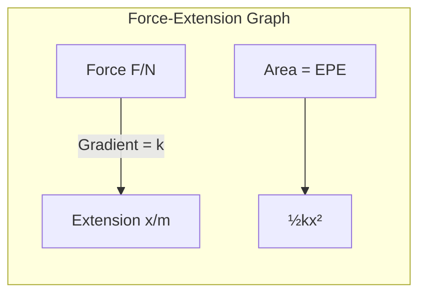
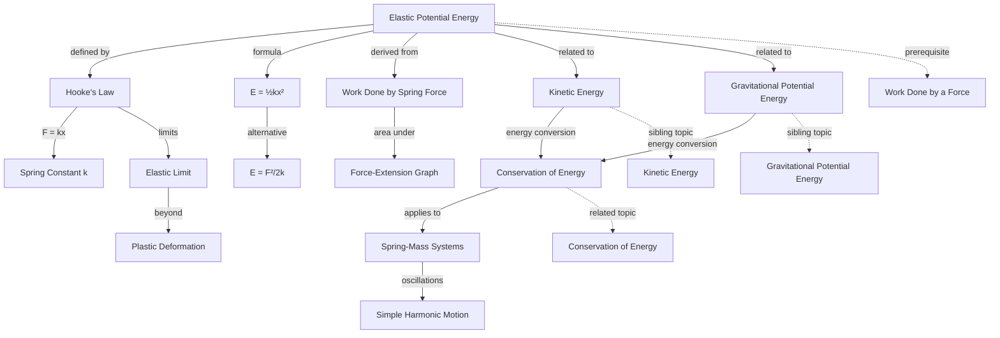

# Elastic Potential Energy / 弹性势能

---

# 1. Overview / 概述

**English:**
Elastic Potential Energy (EPE) is the energy stored in an elastic object when it is stretched or compressed. This sub-topic explores how energy is stored in springs and other elastic materials, the relationship between force and extension (Hooke's Law), and how to calculate the energy stored. Understanding EPE is crucial for analyzing systems involving springs, bungee cords, and other elastic components, and it connects directly to the [[Work-Energy Theorem]] and [[Conservation of Energy]].

**中文:**
弹性势能（EPE）是弹性物体在被拉伸或压缩时储存的能量。本子知识点探讨能量如何储存在弹簧和其他弹性材料中、力与伸长量之间的关系（胡克定律），以及如何计算储存的能量。理解弹性势能对于分析涉及弹簧、蹦极绳和其他弹性元件的系统至关重要，并且直接与[[Work-Energy Theorem]]和[[Conservation of Energy]]相关联。

---

# 2. Syllabus Learning Objectives / 考纲学习目标

| CAIE 9702 | Edexcel IAL |
|-----------|-------------|
| 3.3(c): Recall and use Hooke's Law $F = kx$ | 4.5: Understand the concept of elastic potential energy |
| 3.3(d): Recall and use $E = \frac{1}{2}kx^2$ for elastic potential energy | 4.6: Derive and use $E = \frac{1}{2}kx^2$ |
| 3.3(e): Distinguish between elastic and plastic deformation | 4.7: Apply elastic potential energy to spring systems |
| 3.3(f): Describe energy changes in oscillating systems | 4.8: Solve problems involving energy stored in springs |

**Examiner Expectations / 考官期望:**
- **English:** Students must be able to derive the formula for EPE from the area under a force-extension graph, apply Hooke's Law correctly, and solve problems involving energy transfers between EPE and other forms of energy.
- **中文:** 学生必须能够从力-伸长量图下的面积推导出弹性势能公式，正确应用胡克定律，并解决涉及弹性势能与其他形式能量之间能量转换的问题。

---

# 3. Core Definitions / 核心定义

| Term (EN/CN) | Definition (EN) | Definition (CN) | Common Mistakes / 常见错误 |
|--------------|-----------------|-----------------|---------------------------|
| **Elastic Potential Energy** / 弹性势能 | The energy stored in a deformed elastic object due to work done in stretching or compressing it | 弹性物体因拉伸或压缩做功而储存的能量 | Confusing EPE with total mechanical energy |
| **Hooke's Law** / 胡克定律 | The force required to stretch or compress a spring is directly proportional to the extension or compression, provided the elastic limit is not exceeded | 在弹性限度内，拉伸或压缩弹簧所需的力与伸长量或压缩量成正比 | Forgetting the negative sign in $F = -kx$ |
| **Spring Constant** / 劲度系数 | A measure of the stiffness of a spring, defined as force per unit extension ($k = F/x$) | 衡量弹簧刚度的量，定义为单位伸长量所需的力 | Using $k$ as a variable instead of a constant |
| **Elastic Limit** / 弹性限度 | The maximum extension or compression beyond which a material will not return to its original shape when the deforming force is removed | 撤去外力后材料不能恢复原状的最大伸长量或压缩量 | Assuming all materials obey Hooke's Law indefinitely |
| **Elastic Deformation** / 弹性形变 | Deformation that is reversible — the object returns to its original shape when the deforming force is removed | 可逆的形变——撤去外力后物体恢复原状 | Confusing with plastic deformation |
| **Plastic Deformation** / 塑性形变 | Deformation that is permanent — the object does not return to its original shape when the deforming force is removed | 永久形变——撤去外力后物体不能恢复原状 | Thinking plastic deformation still stores energy |

---

# 4. Key Concepts Explained / 关键概念详解

## 4.1 Hooke's Law and the Force-Extension Relationship / 胡克定律与力-伸长量关系

### Explanation / 解释
**English:**
[[Hooke's Law]] states that for an elastic material within its elastic limit, the force $F$ required to stretch or compress it is directly proportional to the extension $x$ (or compression). Mathematically: $F = kx$, where $k$ is the spring constant (stiffness). The spring constant has units of N/m and represents the force needed to produce unit extension. A larger $k$ means a stiffer spring. The law applies to both stretching and compression, but the sign convention differs — in physics, we often use $F = -kx$ to indicate that the restoring force opposes the displacement.

**中文:**
[[Hooke's Law]]指出，对于弹性限度内的弹性材料，拉伸或压缩所需的力 $F$ 与伸长量 $x$（或压缩量）成正比。数学表达式为：$F = kx$，其中 $k$ 是劲度系数（刚度）。劲度系数的单位是 N/m，表示产生单位伸长量所需的力。$k$ 值越大，弹簧越硬。该定律适用于拉伸和压缩，但符号约定不同——在物理学中，我们常用 $F = -kx$ 表示回复力与位移方向相反。

### Physical Meaning / 物理意义
**English:**
The spring constant $k$ quantifies how "stiff" a spring is. A spring with $k = 100$ N/m requires 100 N of force to stretch it by 1 meter. The negative sign in $F = -kx$ indicates that the force exerted by the spring is always opposite to the direction of displacement — this is why springs cause oscillations.

**中文:**
劲度系数 $k$ 量化了弹簧的"硬度"。$k = 100$ N/m 的弹簧需要 100 N 的力才能拉伸 1 米。$F = -kx$ 中的负号表示弹簧施加的力始终与位移方向相反——这就是弹簧引起振荡的原因。

### Common Misconceptions / 常见误区
- **English:** Students often think Hooke's Law applies to all materials at all extensions. It only applies within the elastic limit.
- **中文:** 学生常认为胡克定律适用于所有材料的所有伸长量。它只适用于弹性限度内。
- **English:** Some students confuse the spring constant $k$ with the force constant in other contexts.
- **中文:** 有些学生将劲度系数 $k$ 与其他情况下的力常数混淆。
- **English:** The negative sign in $F = -kx$ is often forgotten, leading to sign errors in oscillation problems.
- **中文:** $F = -kx$ 中的负号常被遗忘，导致振荡问题中出现符号错误。

### Exam Tips / 考试提示
- **English:** Always check units — $k$ must be in N/m, $x$ in meters, $F$ in Newtons.
- **中文:** 始终检查单位——$k$ 必须是 N/m，$x$ 是米，$F$ 是牛顿。
- **English:** For springs in series or parallel, use the appropriate combination rules for $k$.
- **中文:** 对于串联或并联的弹簧，使用适当的 $k$ 组合规则。

> 📷 **IMAGE PROMPT — [DIAGRAM-01]: Hooke's Law Experiment Setup**
> A diagram showing a spring hanging vertically from a clamp stand, with a mass hanger attached to the bottom. Ruler placed alongside to measure extension. Labels: "Clamp Stand", "Spring", "Ruler", "Mass Hanger", "Extension x". Arrows showing force F = mg downward and restoring force F = kx upward.

## 4.2 Derivation of Elastic Potential Energy Formula / 弹性势能公式推导

### Explanation / 解释
**English:**
The elastic potential energy stored in a spring is equal to the work done in stretching or compressing it. Since the force $F$ varies linearly with extension $x$ (from $F=0$ at $x=0$ to $F=kx$ at extension $x$), the work done is the area under the force-extension graph. This area is a triangle: $W = \frac{1}{2} \times \text{base} \times \text{height} = \frac{1}{2} \times x \times (kx) = \frac{1}{2}kx^2$. Therefore, elastic potential energy $E_{PE} = \frac{1}{2}kx^2$.

**中文:**
弹簧储存的弹性势能等于拉伸或压缩它所做的功。由于力 $F$ 随伸长量 $x$ 线性变化（从 $x=0$ 时的 $F=0$ 到伸长量 $x$ 时的 $F=kx$），所做的功就是力-伸长量图下的面积。这个面积是一个三角形：$W = \frac{1}{2} \times \text{底} \times \text{高} = \frac{1}{2} \times x \times (kx) = \frac{1}{2}kx^2$。因此，弹性势能 $E_{PE} = \frac{1}{2}kx^2$。

### Physical Meaning / 物理意义
**English:**
The $\frac{1}{2}$ factor arises because the force is not constant — it increases linearly from zero to $kx$. If the force were constant, the work would be $Fx = kx^2$. The $\frac{1}{2}$ accounts for the average force being half the maximum force. The energy is stored as elastic strain energy in the bonds of the material.

**中文:**
$\frac{1}{2}$ 因子出现是因为力不是恒定的——它从零线性增加到 $kx$。如果力是恒定的，做功将是 $Fx = kx^2$。$\frac{1}{2}$ 考虑了平均力是最大力的一半。能量以弹性应变能的形式储存在材料的键中。

### Common Misconceptions / 常见误区
- **English:** Students often forget the $\frac{1}{2}$ factor and write $E = kx^2$.
- **中文:** 学生常忘记 $\frac{1}{2}$ 因子而写成 $E = kx^2$。
- **English:** Some think EPE depends on the force rather than the extension.
- **中文:** 有些人认为弹性势能取决于力而不是伸长量。
- **English:** Confusing EPE with work done by a constant force.
- **中文:** 将弹性势能与恒力做功混淆。

### Exam Tips / 考试提示
- **English:** Always derive EPE from the area under the $F$-$x$ graph if asked to "show that".
- **中文:** 如果被要求"证明"，始终从 $F$-$x$ 图下的面积推导弹性势能。
- **English:** Remember that EPE is always positive (energy stored), regardless of whether the spring is stretched or compressed.
- **中文:** 记住弹性势能始终为正（储存的能量），无论弹簧是拉伸还是压缩。

## 4.3 Energy Transfers Involving Elastic Potential Energy / 涉及弹性势能的能量转换

### Explanation / 解释
**English:**
In many physical systems, elastic potential energy converts to and from other forms of energy. For example, in a vertical spring-mass system, as the mass oscillates, EPE converts to [[Kinetic Energy (KE)]] and [[Gravitational Potential Energy (GPE)]]. At the extremes of motion, all energy is EPE; at the equilibrium position, EPE is minimum and KE is maximum. The principle of [[Conservation of Energy]] applies: total mechanical energy $E_{total} = KE + GPE + EPE = \text{constant}$ (in the absence of friction).

**中文:**
在许多物理系统中，弹性势能与其他形式的能量相互转换。例如，在竖直弹簧-质量系统中，当质量振荡时，弹性势能转换为[[Kinetic Energy (KE)]]和[[Gravitational Potential Energy (GPE)]]。在运动的极端位置，所有能量都是弹性势能；在平衡位置，弹性势能最小，动能最大。[[Conservation of Energy]]原理适用：总机械能 $E_{total} = KE + GPE + EPE = \text{常数}$（无摩擦时）。

### Physical Meaning / 物理意义
**English:**
The energy conversion in a spring-mass system demonstrates the interchangeability of energy forms. At any point, the sum of KE, GPE, and EPE remains constant. This allows calculation of speed at any position if the total energy is known.

**中文:**
弹簧-质量系统中的能量转换展示了能量形式的可互换性。在任何点，动能、重力势能和弹性势能之和保持不变。如果已知总能量，就可以计算任何位置的速度。

### Common Misconceptions / 常见误区
- **English:** Students often forget to include GPE when analyzing vertical spring systems.
- **中文:** 学生分析竖直弹簧系统时常忘记包括重力势能。
- **English:** Some think EPE is zero at the equilibrium position — it's actually minimum but not necessarily zero.
- **中文:** 有些人认为弹性势能在平衡位置为零——实际上它是最小值但不一定为零。

### Exam Tips / 考试提示
- **English:** For vertical springs, define the zero of GPE carefully — often at the equilibrium position.
- **中文:** 对于竖直弹簧，仔细定义重力势能的零点——通常在平衡位置。
- **English:** Use energy conservation to find maximum speed or maximum extension.
- **中文:** 使用能量守恒求最大速度或最大伸长量。

---

# 5. Essential Equations / 核心公式

## Equation 1: Hooke's Law / 胡克定律

$$ F = kx $$

| Symbol (符号) | Meaning (EN) | Meaning (CN) | Unit (单位) |
|--------------|-------------|-------------|------------|
| $F$ | Force applied to spring | 施加在弹簧上的力 | N |
| $k$ | Spring constant (stiffness) | 劲度系数（刚度） | N/m |
| $x$ | Extension or compression from natural length | 从自然长度的伸长量或压缩量 | m |

**Derivation / 推导:** Empirical law based on experimental observation for elastic materials within their elastic limit.

**Conditions / 适用条件:**
- **English:** Only applies within the elastic limit of the material. The material must be elastic (returns to original shape when force removed).
- **中文:** 仅适用于材料的弹性限度内。材料必须是弹性的（撤去外力后恢复原状）。

**Limitations / 局限性:**
- **English:** Does not apply beyond the elastic limit (plastic deformation region). Not valid for all materials (e.g., rubber bands have non-linear behavior).
- **中文:** 不适用于弹性限度之外（塑性形变区域）。并非对所有材料都有效（例如，橡皮筋具有非线性行为）。

## Equation 2: Elastic Potential Energy / 弹性势能

$$ E_{PE} = \frac{1}{2} k x^2 $$

| Symbol (符号) | Meaning (EN) | Meaning (CN) | Unit (单位) |
|--------------|-------------|-------------|------------|
| $E_{PE}$ | Elastic potential energy | 弹性势能 | J |
| $k$ | Spring constant | 劲度系数 | N/m |
| $x$ | Extension or compression | 伸长量或压缩量 | m |

**Derivation / 推导:**
$$ W = \int_0^x F \, dx = \int_0^x kx \, dx = \frac{1}{2}kx^2 $$

**Conditions / 适用条件:**
- **English:** Only valid when Hooke's Law is obeyed (within elastic limit). The energy is stored as elastic strain energy.
- **中文:** 仅在遵守胡克定律时有效（弹性限度内）。能量以弹性应变能的形式储存。

**Limitations / 局限性:**
- **English:** Does not account for energy lost as heat during deformation (hysteresis). Only valid for linear elastic materials.
- **中文:** 不考虑形变过程中以热量形式损失的能量（滞后现象）。仅适用于线性弹性材料。

## Equation 3: Alternative Form of EPE / 弹性势能的另一种形式

$$ E_{PE} = \frac{F^2}{2k} $$

| Symbol (符号) | Meaning (EN) | Meaning (CN) | Unit (单位) |
|--------------|-------------|-------------|------------|
| $E_{PE}$ | Elastic potential energy | 弹性势能 | J |
| $F$ | Force applied | 施加的力 | N |
| $k$ | Spring constant | 劲度系数 | N/m |

**Derivation / 推导:** From $F = kx$, substitute $x = F/k$ into $E_{PE} = \frac{1}{2}kx^2$: $E_{PE} = \frac{1}{2}k\left(\frac{F}{k}\right)^2 = \frac{F^2}{2k}$

**Conditions / 适用条件:**
- **English:** Same as Equation 2. Useful when force is known but extension is not.
- **中文:** 与方程2相同。当已知力但未知伸长量时有用。

**Limitations / 局限性:**
- **English:** Same as Equation 2.
- **中文:** 与方程2相同。

> 📷 **IMAGE PROMPT — [DIAGRAM-02]: Force-Extension Graph for EPE Derivation**
> A graph with Force (F) on the y-axis and Extension (x) on the x-axis. A straight line through origin with slope = k. The area under the line from 0 to x is shaded as a triangle. Labels: "Area = Work Done = ½kx²", "F = kx", "x", "F". Arrow pointing to shaded triangle with text "Elastic Potential Energy".

---

# 6. Graphs and Relationships / 图表与关系

## 6.1 Force-Extension Graph / 力-伸长量图

### Axes / 坐标轴
- **English:** x-axis: Extension $x$ (m); y-axis: Force $F$ (N)
- **中文:** x轴：伸长量 $x$ (m)；y轴：力 $F$ (N)

### Shape / 形状
- **English:** Straight line through origin with gradient = $k$ (spring constant), provided Hooke's Law is obeyed.
- **中文:** 通过原点的直线，斜率为 $k$（劲度系数），前提是遵守胡克定律。

### Gradient Meaning / 斜率含义
- **English:** Gradient = $\frac{\Delta F}{\Delta x} = k$, the spring constant. A steeper gradient means a stiffer spring.
- **中文:** 斜率 = $\frac{\Delta F}{\Delta x} = k$，即劲度系数。斜率越陡，弹簧越硬。

### Area Meaning / 面积含义
- **English:** Area under the graph = Work done = Elastic Potential Energy stored = $\frac{1}{2}kx^2$.
- **中文:** 图下的面积 = 做功 = 储存的弹性势能 = $\frac{1}{2}kx^2$。

### Exam Interpretation / 考试解读
- **English:** If the graph is a straight line, Hooke's Law is obeyed. If it curves, the elastic limit has been exceeded. The area under any portion gives the work done for that extension.
- **中文:** 如果图形是直线，则遵守胡克定律。如果弯曲，则已超过弹性限度。任何部分下的面积都给出了该伸长量所做的功。

## 6.2 Energy vs Extension Graph / 能量-伸长量图

### Axes / 坐标轴
- **English:** x-axis: Extension $x$ (m); y-axis: Elastic Potential Energy $E_{PE}$ (J)
- **中文:** x轴：伸长量 $x$ (m)；y轴：弹性势能 $E_{PE}$ (J)

### Shape / 形状
- **English:** Parabola (quadratic) through origin: $E_{PE} = \frac{1}{2}kx^2$.
- **中文:** 通过原点的抛物线（二次函数）：$E_{PE} = \frac{1}{2}kx^2$。

### Gradient Meaning / 斜率含义
- **English:** Gradient = $\frac{dE_{PE}}{dx} = kx = F$, the force at that extension.
- **中文:** 斜率 = $\frac{dE_{PE}}{dx} = kx = F$，即该伸长量下的力。

### Area Meaning / 面积含义
- **English:** Not directly meaningful for this graph.
- **中文:** 此图下的面积没有直接意义。

### Exam Interpretation / 考试解读
- **English:** The parabolic shape shows that energy increases with the square of extension. Doubling extension quadruples the energy stored.
- **中文:** 抛物线形状表明能量随伸长量的平方增加。伸长量加倍，储存的能量变为四倍。

---

# 7. Required Diagrams / 必备图表

## 7.1 Force-Extension Graph for a Spring / 弹簧的力-伸长量图

### Description / 描述
- **English:** A graph showing force (y-axis) against extension (x-axis) for a spring being stretched. The graph has three regions: (1) Linear region where Hooke's Law is obeyed (straight line), (2) Non-linear region near the elastic limit, (3) Plastic deformation region where the spring does not return to original length.
- **中文:** 显示弹簧被拉伸时力（y轴）与伸长量（x轴）的关系图。图形有三个区域：（1）遵守胡克定律的线性区域（直线），（2）弹性限度附近的非线性区域，（3）弹簧不能恢复原长的塑性形变区域。

### Image Prompt / 图片生成提示
> 📷 **IMAGE PROMPT — [DIAGRAM-03]: Force-Extension Graph with Three Regions**
> A detailed graph with Force (F) on y-axis and Extension (x) on x-axis. Three distinct regions labeled: Region A (linear, straight line through origin, labeled "Hooke's Law Region"), Region B (slight curve, labeled "Elastic Limit"), Region C (flattening curve, labeled "Plastic Deformation"). Points marked: "Elastic Limit" and "Breaking Point". Shaded area under linear region labeled "Elastic Potential Energy = ½kx²". Arrows and annotations in clear font.

### Labels Required / 需要标注
- **English:** "Linear Region (Hooke's Law)", "Elastic Limit", "Plastic Deformation", "Breaking Point", "Area = EPE"
- **中文:** "线性区域（胡克定律）", "弹性限度", "塑性形变", "断裂点", "面积 = 弹性势能"

### Exam Importance / 考试重要性
- **English:** High — this graph is frequently tested in both CIE and Edexcel exams. Students must be able to identify regions and calculate EPE from area.
- **中文:** 高——该图在CIE和Edexcel考试中经常出现。学生必须能够识别区域并从面积计算弹性势能。

## 7.2 Spring-Mass System Energy Diagram / 弹簧-质量系统能量图

### Description / 描述
- **English:** A diagram showing a mass on a vertical spring at three positions: (1) Maximum compression (bottom), (2) Equilibrium position (middle), (3) Maximum extension (top). At each position, bar charts show the distribution of KE, GPE, and EPE.
- **中文:** 显示竖直弹簧上的质量在三个位置的图：（1）最大压缩（底部），（2）平衡位置（中间），（3）最大伸长（顶部）。在每个位置，条形图显示动能、重力势能和弹性势能的分布。

### Image Prompt / 图片生成提示
> 📷 **IMAGE PROMPT — [DIAGRAM-04]: Spring-Mass System Energy Distribution**
> A vertical spring with a mass attached. Three positions shown: Position 1 (top, spring stretched most), Position 2 (middle, equilibrium), Position 3 (bottom, spring compressed most). Next to each position, a bar chart with three bars: KE (blue), GPE (green), EPE (red). At Position 1: KE=0, GPE=max, EPE=max. At Position 2: KE=max, GPE=mid, EPE=min. At Position 3: KE=0, GPE=min, EPE=max. Labels and color legend included.

### Labels Required / 需要标注
- **English:** "Maximum Extension", "Equilibrium Position", "Maximum Compression", "KE", "GPE", "EPE"
- **中文:** "最大伸长", "平衡位置", "最大压缩", "动能", "重力势能", "弹性势能"

### Exam Importance / 考试重要性
- **English:** Medium — helps visualize energy conservation in oscillating systems.
- **中文:** 中——有助于可视化振荡系统中的能量守恒。

---

# 8. Worked Examples / 典型例题

## Example 1: Calculating Elastic Potential Energy / 例1：计算弹性势能

### Question / 题目
**English:**
A spring with spring constant $k = 200$ N/m is stretched by 0.05 m from its natural length. Calculate:
(a) The force required to stretch the spring
(b) The elastic potential energy stored in the spring

**中文:**
一根劲度系数 $k = 200$ N/m 的弹簧从自然长度拉伸了 0.05 m。计算：
(a) 拉伸弹簧所需的力
(b) 弹簧中储存的弹性势能

### Solution / 解答

**Part (a):**
$$ F = kx = 200 \times 0.05 = 10 \text{ N} $$

**Part (b):**
$$ E_{PE} = \frac{1}{2}kx^2 = \frac{1}{2} \times 200 \times (0.05)^2 = \frac{1}{2} \times 200 \times 0.0025 = 0.25 \text{ J} $$

**Alternative method using $F$:**
$$ E_{PE} = \frac{F^2}{2k} = \frac{10^2}{2 \times 200} = \frac{100}{400} = 0.25 \text{ J} $$

### Final Answer / 最终答案
**Answer:** (a) 10 N | **答案：** (a) 10 N
**Answer:** (b) 0.25 J | **答案：** (b) 0.25 J

### Quick Tip / 提示
- **English:** Always square $x$ before multiplying by $k$ and $\frac{1}{2}$. Common mistake: $E = \frac{1}{2}kx$ instead of $\frac{1}{2}kx^2$.
- **中文:** 在乘以 $k$ 和 $\frac{1}{2}$ 之前，始终先对 $x$ 平方。常见错误：写成 $E = \frac{1}{2}kx$ 而不是 $\frac{1}{2}kx^2$。

## Example 2: Energy Conservation in a Spring System / 例2：弹簧系统中的能量守恒

### Question / 题目
**English:**
A 0.5 kg mass is attached to a vertical spring with $k = 100$ N/m. The spring is stretched downward by 0.1 m from its equilibrium position and released. Calculate the speed of the mass as it passes through the equilibrium position. (Assume no energy loss)

**中文:**
一个 0.5 kg 的质量连接到一根劲度系数 $k = 100$ N/m 的竖直弹簧上。弹簧从平衡位置向下拉伸 0.1 m 后释放。计算质量通过平衡位置时的速度。（假设无能量损失）

### Solution / 解答

**Step 1: Identify energy at release point (maximum extension)**
At release, the mass is at rest, so KE = 0.
EPE at release: $E_{PE} = \frac{1}{2}kx^2 = \frac{1}{2} \times 100 \times (0.1)^2 = 0.5$ J
GPE at release relative to equilibrium: $GPE = mgh = 0.5 \times 9.81 \times (-0.1) = -0.4905$ J (below equilibrium)

Total mechanical energy: $E_{total} = KE + GPE + EPE = 0 + (-0.4905) + 0.5 = 0.0095$ J

**Step 2: At equilibrium position**
At equilibrium, $x = 0$, so EPE = 0.
GPE at equilibrium = 0 (reference point).
Therefore, all energy is kinetic: $KE = E_{total} = 0.0095$ J

**Step 3: Calculate speed**
$$ KE = \frac{1}{2}mv^2 $$
$$ 0.0095 = \frac{1}{2} \times 0.5 \times v^2 $$
$$ v^2 = \frac{0.0095 \times 2}{0.5} = 0.038 $$
$$ v = \sqrt{0.038} = 0.195 \text{ m/s} $$

### Final Answer / 最终答案
**Answer:** $v = 0.195$ m/s | **答案：** $v = 0.195$ m/s

### Quick Tip / 提示
- **English:** In vertical spring problems, always account for GPE changes. The equilibrium position is where the net force is zero, not where EPE is zero.
- **中文:** 在竖直弹簧问题中，始终考虑重力势能的变化。平衡位置是合力为零的位置，而不是弹性势能为零的位置。

---

# 9. Past Paper Question Types / 历年真题题型

| Question Type / 题型 | Frequency / 频率 | Difficulty / 难度 | Past Paper References / 真题索引 |
|----------------------|------------------|------------------|-------------------------------|
| Calculate EPE from $k$ and $x$ | Very High | Easy | 📝 *待填入* |
| Derive EPE formula from $F$-$x$ graph | High | Medium | 📝 *待填入* |
| Energy conservation with springs | High | Medium-Hard | 📝 *待填入* |
| Springs in series/parallel | Medium | Medium | 📝 *待填入* |
| Force-extension graph analysis | High | Medium | 📝 *待填入* |
| Elastic vs plastic deformation | Medium | Easy | 📝 *待填入* |

**Common Command Words / 常见指令词:**
- **English:** "Calculate", "Derive", "Show that", "Determine", "Sketch", "Explain"
- **中文:** "计算", "推导", "证明", "确定", "画出", "解释"

---

# 10. Practical Skills Connections / 实验技能链接

**English:**
This sub-topic connects to practical work in several ways:

1. **Hooke's Law Experiment:** Students measure force and extension for a spring, plot an $F$-$x$ graph, determine $k$ from the gradient, and calculate EPE from the area. This involves:
   - Using a ruler to measure extension (uncertainty ±0.5 mm)
   - Using masses to apply known forces
   - Plotting graphs and calculating gradients
   - Determining spring constant from gradient

2. **Investigating Elastic vs Plastic Deformation:** Students stretch a spring beyond its elastic limit and observe permanent deformation. This involves:
   - Recording force and extension data
   - Identifying the elastic limit from the graph
   - Understanding the limitations of Hooke's Law

3. **Energy Conservation Experiments:** Using a spring-mass system to verify conservation of energy. This involves:
   - Measuring maximum speed using light gates
   - Comparing calculated and measured values
   - Accounting for energy losses (friction, air resistance)

**中文:**
本子知识点通过以下几种方式与实验工作相关联：

1. **胡克定律实验：** 学生测量弹簧的力和伸长量，绘制 $F$-$x$ 图，从斜率确定 $k$，并从面积计算弹性势能。这涉及：
   - 使用尺子测量伸长量（不确定度 ±0.5 mm）
   - 使用砝码施加已知力
   - 绘制图表并计算斜率
   - 从斜率确定劲度系数

2. **研究弹性与塑性形变：** 学生将弹簧拉伸超过弹性限度并观察永久形变。这涉及：
   - 记录力和伸长量数据
   - 从图形中识别弹性限度
   - 理解胡克定律的局限性

3. **能量守恒实验：** 使用弹簧-质量系统验证能量守恒。这涉及：
   - 使用光门测量最大速度
   - 比较计算值和测量值
   - 考虑能量损失（摩擦、空气阻力）

---

# 11. Concept Map / 概念图谱

---

# 12. Quick Revision Sheet / 速查表

| Category / 类别 | Key Points / 要点 |
|----------------|------------------|
| **Definition / 定义** | Energy stored in a deformed elastic object / 弹性物体形变时储存的能量 |
| **Key Formula / 核心公式** | $E_{PE} = \frac{1}{2}kx^2$ or $E_{PE} = \frac{F^2}{2k}$ |
| **Hooke's Law / 胡克定律** | $F = kx$ — Force proportional to extension within elastic limit / 力与伸长量成正比（弹性限度内） |
| **Key Graph / 核心图表** | Force-Extension graph: straight line through origin, gradient = $k$, area = EPE / 力-伸长量图：通过原点的直线，斜率 = $k$，面积 = 弹性势能 |
| **Units / 单位** | $k$: N/m, $x$: m, $F$: N, $E_{PE}$: J |
| **Conditions / 适用条件** | Only within elastic limit; material must obey Hooke's Law / 仅适用于弹性限度内；材料必须遵守胡克定律 |
| **Common Mistake / 常见错误** | Forgetting $\frac{1}{2}$ in EPE formula; confusing $x$ with total length / 忘记弹性势能公式中的 $\frac{1}{2}$；将 $x$ 与总长度混淆 |
| **Exam Tip / 考试提示** | Always derive EPE from area under $F$-$x$ graph when asked to "show that" / 当被要求"证明"时，始终从 $F$-$x$ 图下的面积推导弹性势能 |
| **Energy Conservation / 能量守恒** | In spring systems: $KE + GPE + EPE = \text{constant}$ (no friction) / 在弹簧系统中：$KE + GPE + EPE = \text{常数}$（无摩擦） |
| **Related Topics / 相关主题** | [[Kinetic Energy (KE)]], [[Gravitational Potential Energy (GPE)]], [[Work-Energy Theorem]], [[Conservation of Energy]] |